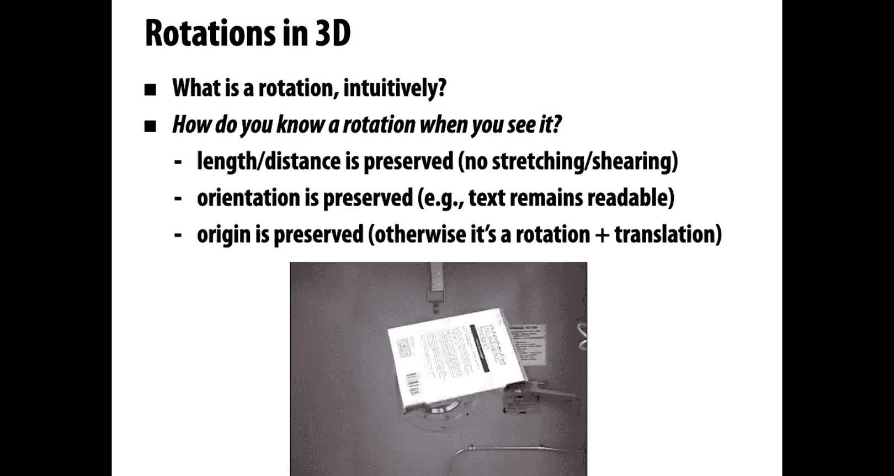
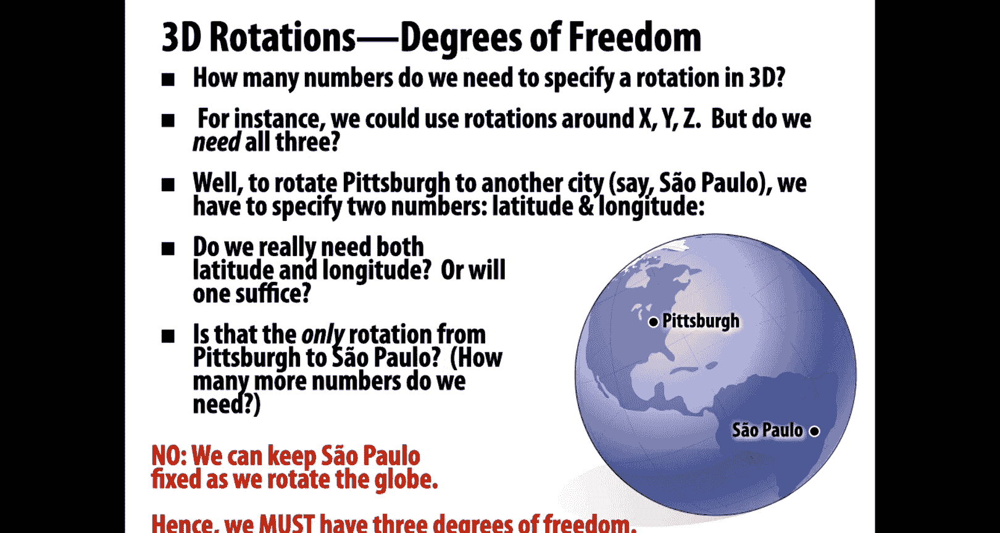
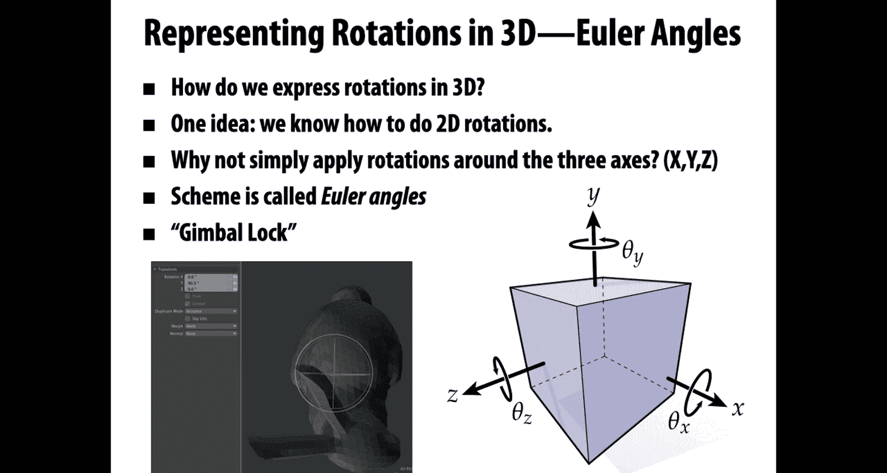
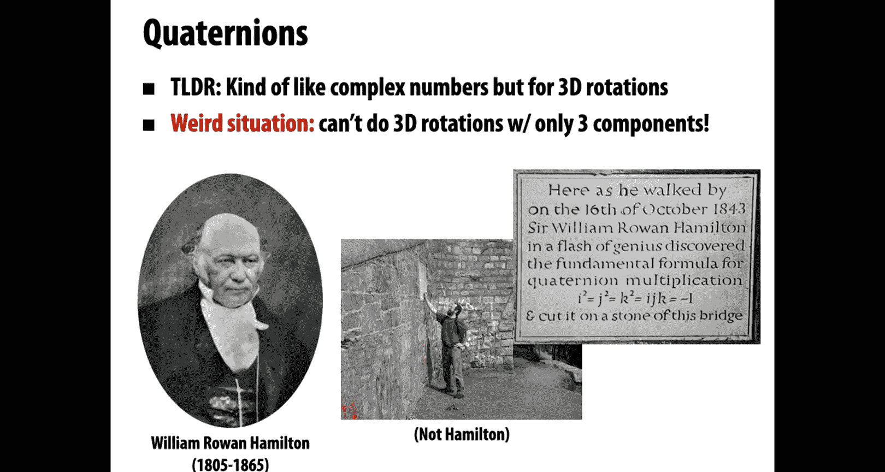
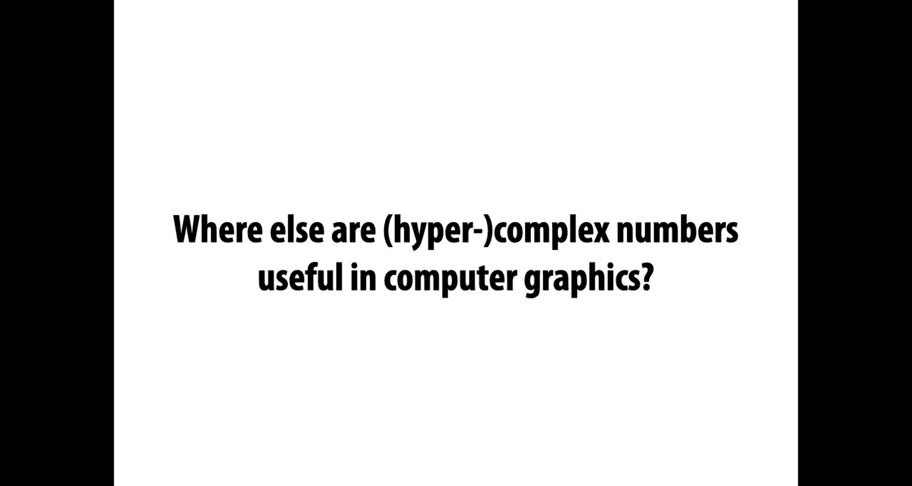
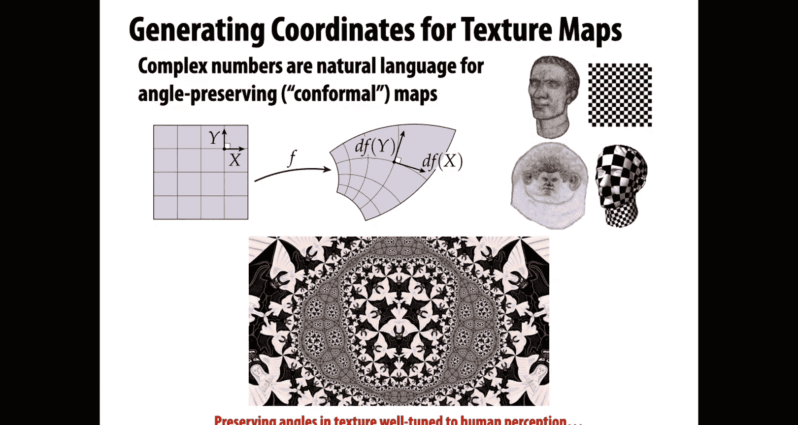
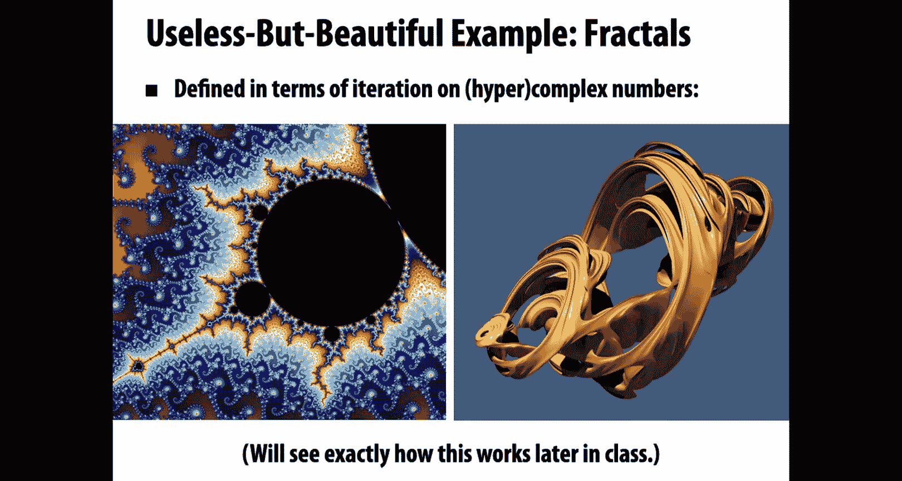
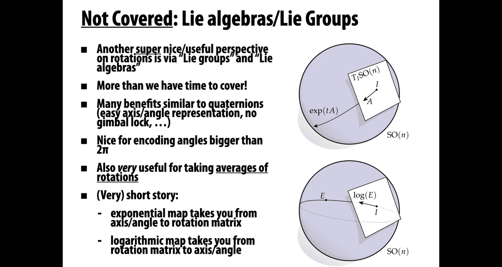
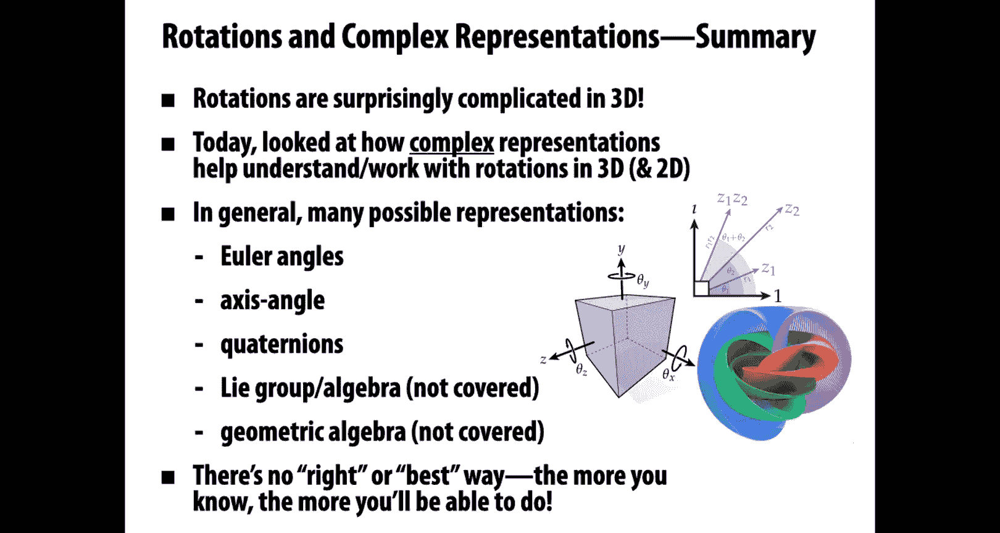
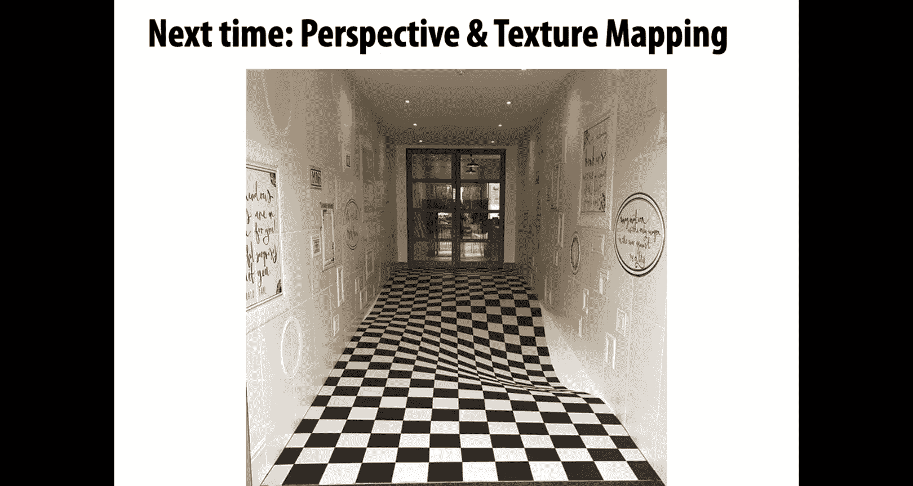

# CMU《计算机图形学｜CMU 15-462  COMPUTER GRAPHICS 2021》中英字幕 p07 -07-Lecture 06_ 3D Rotations and Complex Representations -BV1H3NBemE5E_p7-

Hello and welcome back to computer graphics so last time we talked a lot about spatial transformations and today we're going to take a deep dive into the subject of three dimensional rotations which are a particularly interesting and sometimes challenging kind of transformation We're also going to talk about how complex numbers and other complex representations are going to make it easier to work with transformations。

So just to recap rotations， what is a rotation intuitively？

How do you know a rotation when you see it？One of our big ideas last time is that different kinds of spatial transformations are not defined by some formula or matrix property。

 but really they are defined by the invariants that are preserved by a transformation。

 which quantities stay the same when you apply that kind of transformation。For rotations。

 we said what， we said that， you know something is a rotation like this spinning book。

 because for one thing， lengths and distances are preserved。

So the distance between two corners of the book remains the same as we rotate it。

There's no stretching， there's no shearing。Also， orientation is preserved。 So text remains readable。

 I can still read the text from left to right。 and it makes sense This is different from what happens if I hold up the book in the mirror。

 If I hold it in a mirror， the text is flipped around。 This is a reflection in the mirror。Also。

 we said that when we use the word rotation， we really mean something that fixes the origin。

Some center point remains fixed， otherwise what we're doing is performing a rotation and a translation。

Okay。So to get a bit more。In depth， we can start asking questions about rotations about how they behave and what they look like。

 One really simple question is。How many numbers do we need to specify a rotation in 3D？

What do you think？So one really natural idea that I think a lot of people gravitate toward is to say。

 well， it's got to be three because you specify the angle of rotation around the x axis and around the y axis and around the z axis。

And certainly you can specify rotations that way。But the question is。

 do you need three numbers to describe a rotation？And another question is。

 are those three numbers enough？Can I get all possible rotations by just specifying the X， Y， and z？

E angles。I mean， a rotation matrix is a three by three matrix that has nine entries， so are we sure？

That three angles of rotation are enough。So let's think about this a bit more geometrically。 Okay。

 so let's imagine that we want to perform a rotation of the earth that takes。

Our beautiful city of Pittsburgh to another city。Let's say， Sao Paulo。Okay。To do this。

 we know we have to specify。At least two numbers， right we have to say。

 what's the latitude and the longitude of the city that we want to rotate Pittsburgh to？Okay。

 and we can ask， do we really need。Latitude and longitude。Or will just one of them suffice？No。

 it really seems like we need both latitude and longitude， we need two numbers to do this rotation。

Okay。But another important question is。Is that the only rotation？

That will take Pittsburgh to Sao Paulo， in other words。Are two numbers enough。

 it kind of seems like that。If I want to rotate one point on the globe。

 Pittsburgh to any other point on the globe。Right now it feels like maybe I can get away with just two numbers。

 latitude and longitude。Do you buy it。Or are there other rotations we're missing that we're not really describing or are we even describing a rotation？

So an important thing to realize is that when we do this operation of rotating one point to another。

We have an additional motion we can do once we've rotated Pittsburgh to Sao Paulo。

We can pick another angle of rotation。That keeps that new city。

 Sao Paulo fixed as we rotate the globe。Right。Hence， we must have three degrees of freedom。

We have two degrees of freedom to take any point on the sphered to any other。

 and for any such motion， we have a whole family of rotations， a third number we can specify。Okay。

 that's one way of looking at it， there are other ways。

To get your hands on the dimension of the rotations。

Okay， another thing we can ask about rotations is。About order of operations。So。

When we talked about transformations in general。We said it's really important to keep track of what order you perform different transformations。

 translations and rotations and scaling。Because you'll get different results if you shuffle around the order。

But what if we just stick to rotations？Well， one thing we。No， is that in two dimensions。

The order of rotations really doesn't seem to matter。 So for instance。

 if I have Scotty and I want to rotate him by 40 degrees to kind of move up on his his hind legs and then rotate him by another 20 degrees because he's really excited。

That's exactly the same as what happens if I first rotate by 20 and then rotate by 40 in both cases I've just rotated by a total of 60 degrees。

It really feels like in 2D， we just have this one angle。

Every time we rotate we're adding or subtracting from this angle。

 it doesn't matter what order we do things in， so we'd say that 2D rotations commute。

 or if you want to be really fancy， you could say 2D rotations are a billionian okay。

What about three dimensional rotations？Does it work the same way？If I rotate by。Rotation A， then B。

 then C is that the same as B then C then A？What do you think。Well， the good news about rotations is。

We live in a world where we can do 3D rotations。 If you want to figure out how they behave。

 you can just。Try it out at home， start rotating things and see how they behave。

So here's a good little exercise if you're at home and you can grab a water bottle。

Then what we're going to do is。Associate a coordinate system with this water bottle。

 so put the water bottle down on your desk。And we're going to say that the vertical direction pointing up toward the ceiling is the y direction。

 and two other orthogonal directions are x and Z。 maybe z is the direction pointing straight toward you。

 X is the direction pointing to your right。Okay， and so I would encourage you to open up the water bottle。

 drink most of it。Just so， so we're not spilling water all over the place。

And then perform the following sequence of rotations。So first。

 rotate it by 90 degrees around the Y direction。Okay。

So you should see it's still kind of pointing up on your desk。Then 90 degrees around the z direction。

 so it should be pointing now along the X axis。And finally， 90 degrees around the X axis。

 So now you shouldn't be really doing much to the water bottle just。Rotating it around its axis。

 rolling it。Around its axis。Okay。Now let's do it another way。Okay。

 so put it back to the original configuration。Rotate it around the Z axis first。Okay。

 we're just doing the same rotations in a different order， rotate around the z axis first。

Now it's going to be pointing along the x axis。Now rotate 90 degrees around the Y axis。

 so maybe it's pointing toward you now。And finally， rotate 90 degrees around the X axises。

And if you've done this right， what you should find is that you' just spilled water all over your desk or all over the floor。

Because。In 3D， rotations really do not commute。Same rotations， different order， different result。

 okay and the best proof is to really just physically do it。

So what does that tell you that tells you that bad things can happen if you're not careful about the order in which you apply rotations。

 this might seem like a silly example spilling water on your desk。

But if you imagine you're designing a control system for an aircraft or writing code involving rotations for some other thing that really happens in the world。

 this can be a big deal。You can get things very， very wrong and cause a lot of trouble just by putting your rotations out of order。

Okay， so good to be aware of。All right。So let's come back to this question of representation。

 we started out by saying transformations are fundamentally defined by their invariance。

 but when it comes to really computing with transformations， we'd like some concrete representation。

Okay， so。Let's recall and review how we get a rotation matrix in 2D。

So don't just regurgitate the formula， maybe you remember what that little matrix looks like。

 but let's think again about how we get that matrix。Let's imagine I have a function。

Which for now I'll just call S of theta。As of theta takes as input and angle theta。

And as output gives me the point X Y on the circle that I get by going counterclockwise around the circle。

By theta， starting at the x axis starting at。Yin。Okay。For the moment。

 I don't care at all about how you express S of theta。

 I don't want you to give me some closed form expression for s of theta， just conceptually。

 it rotates E1 an angle theta。Okay。So， question。What is E1 rotated by theta。See I'm testing you here。

 all I want you to say is。E1 rotated by theta is s of theta， it gives us a new vector E1 tilde。Okay。

What is E2 rotated by theta？Well， just slightly more interesting。

 E2 rotated by theta is s of theta plus pi over 2。Okay， so just the same thing。

 but 90 degrees further。Okay， so now more generally， how about we take a vector U。

Which is AE1 plus B E2， so just any vector with coordinates A and B。

How do I write an expression for that vector rotated by theta？Okay。

 and the thing to remember here is rotation is a linear transformation。

And I've expressed you as a linear combination of two vectors， E1 and E2。

That I know how to rotate by theta。So， I can write the。Rotated vector as。

A times s of theta plus b times S of theta plus pi over 2。Great。All right， so in that case。

 what then must the matrix look like？That takes a vector AB to the vector rotated by theta。Again。

 I don't want some expression in terms of signs and cosines and trigonometry。

 just in terms of quantities we've talked about already。Okay。So。I know。That the。

Columns of the matrix must be equal to s of theta and S of theta plus 2。Because。

The columns are telling me what happened to the basis vectors E1 and E2。Okay。Now， finally。

 I can go ahead and write out。The matrix in terms of ss and cosines。

 so I can say what is the point distance theta along the circle， it's cosine theta， sine theta。

That's the definition of cosine and sine。Likewise for s of theta plus pi over 2。And if I like。

 I can apply a little simplification and notice that cosine of theta plus pi over 2 is the same as minus sine of theta。

 and sine of theta plus pi over 2 is the same as cosine of theta。Okay。

 so we get the same usual rotation matrix， but we just remember for a moment where did this matrix come from？

Okay， so given that setup。We can ask， how do you think we express rotations in 3D？Well。

 one idea is we know how to do rotations in 2D already。

So why don't we just simply apply rotations around the three axes， X， Y， and Z？And this is a very。

 very common starting point for thinking about 3D rotations， this is a scheme called Euler angles。

What are the good things about oiler angles？Here they are。

 The good things about Euler angles are they're really， really conceptually easy to understand。

That's it， that's basically the only good thing about oiluler angles。

All the representations of rotations we'll see beyond that have some really nice properties。

 I can't think of one good thing to say about oiluler angles apart from the fact that they're simple to think about。

What are some complicated things about oiler angles or some troublesome things， Well。

 one is a phenomenon called gimballock。Okay， so the way gimballock works is you're going along。

 you're rotating your object happily with your oiluler angles， you're adjusting theta x。

 theta y and theta Z， and then you reach a moment where everything locks up。

 meaning you change the value of theta y and nothing happens or you change the value of theta Z and nothing happens and you think what the heck is my code broken。

What's going on。

Well， actually， gimbal lock has to do with the fundamental weight we've parameterized。

The rotations by these three Euler angles。So when you're using Euler angles。

 you might reach a configuration where there is no way to actually rotate around one of the three axes。

Why is that true？Can we really see why that happens well？

Let's recall what the rotation matrices look like for the three axes。And here they are。

 we have a rotation around x around y around z。And so a general rotation that involves these three different angles is obtained by multiplying these three。

Marices together。 and okay， there it is。 you get this big mess of a formula。I mean， already。

 we see one drawback of oiluler angles， which is to write out the general expression for rotation。

 It's super complicated。Certainly not something I'm going to memorize， right。

 hard to understand what's going to happen here。But， let's consider a。Very special case。

Where theta y is pi over 2。 So we've rotated by。A quarter turn around the y axis。呃。So in this case。

 cosine of theta y is 0 and sine of theta y is 1。 that's nice because it means we can simplify the entries of our matrix a bit。

Okay。So here we go， some of them dropped out because we multiplied by zero。

We get this simpler matrix。Interesting。Okay， so if we simplify the matrix from the previous slide a bit further。

We get。Mattrix like this。It's just got kind of identity， row and column in the top and the right。

And then it's got this interesting expression in the bottom left， two by two block。

 It looks looks pretty familiar。Question， what do you think this matrix does？

Just by inspecting these entries and thinking about other little transformation matrices。

What do you think this matrix does？Okay， basically， this matrix looks， again。

 like a little 2D rotation matrix。 Maybe after applyinging a few more identities， you could really。

 you could really show that。 Okay， so this matrix。Is going to apply some rotation， of course it must。

 because it's a rotation matrix， it's a composition of rotation matrices。

But there's something that's pretty annoying。Going on here as well。

 which is that only the angles theta x and theta z show up。Ren。So this is a really funny situation。

 we have these two different parameters， these two different angles of rotation， theta x and theta z。

But we only are able to rotate in one plane around one axis。

 so no matter how we adjust theta x and theta z。We're always keeping some direction fixed。

 we're now locked into a single axis of rotation。So for instance。

 this would be a really poor design for control of an airplane or maybe some， I don't know。

 fighter jet or vehicle that really is supposed to be able to rotate in every possible direction All right。

 you're turning your steering wheels for theta x theta y theta Z， you get into some configuration。

 you want to make a turn， but actually you can't do it because of gimbal lock。

 purely because of the way you mathematically parameterized rotations。Okay， pretty silly。

And at some point in your life， you may encounter this phenomenon when using a piece of 3D software。

 you're trying to rotate the camera around and oh， things get stuck， you can't make any progress。

Okay， so what else can we do？If Euler angles are not so great， what are the alternatives？Well。

 there is a general expression for a matrix that performs a rotation around a given axis U by an angle theta。

So there you go， if you have the three components U X UY U Z and the angle theta。There you haven't。

 you have this matrix， you just memorize it， you plug it into your code。

 and that'll give you the rotation you want。Okay， so probably you're not going to memorize that and we'll see a much easier way later on to construct this matrix。

But before getting there， we need to go back down a dimension。And talk a little bit about complex。

Representations of rotation。So。You might have encountered complex numbers before。Today。

 we're going to motivate complex numbers from a geometric point of view。

 right we want to use complex numbers。Because not because we're doing algebra。

 but because they're going to be a really nice way to encode geometric transformations in two dimensions。

Okay。After this kind of sinks in and you start working with complex numbers a bit。

 I think you'll find that they are a really nice way to think about transformations。

 but also to write them up in code， they make debugging a bit easier。Really。

 really nice if you can get over the fact that they involve the word complex。

They also have some very mild computational benefits。

 sometimes they might reduce the amount of computation or bandwidth you're using。And in general。

 fluency with complex analysis can lead to some pretty deep or novel solutions to graphics problems。

 so for instance， in surface parameterization and texture mapping。

 complex analysis plays a pretty big role。Okay， so again， once this is really sunk in， I。

 I hope you'll， you'll think that。Like I do， there's really never a great reason to just use 2D vectors instead of complex numbers。

 complex numbers are kind of a strictly better replacement for ordinary 2D vectors。Okay。All right。

As we。Start here， I really， really want you to not think of these numbers as complex。

They're not special。Entities that are weird and different。

They're just ordinary two dimensional vectors。 and we happen to be defining additional operations on these vectors。

 just like we。Define the dot product and the cross product。

When we start with 2D vectors in the plane， and then I tell you about how to take a dot product and how to take a cross product。

It doesn't seem like anything deep has happened。 we've just added some operations to our list of operations。

 and that's exactly what we're going to do with complex numbers。In particular。

 I think the thing that really scares people away from complex numbers is that the first time they're ever introduced to them。

 they hear a story like this， they hear somebody get up in front of the class and say， okay， class。

 today we're going to talk about complex numbers and。To begin with。

 we're going to define I as the square root of negative1。And at this point。

 I think most people's minds just go blank， what the heck could this possibly mean？

A number Whos square。Is-1。 This is complete and utter nonsense。

I want you to completely forget this idea about I being the square root of negative  one。

 This is just going to mess with your brain。And more importantly。

 it completely obscures the fact that the imaginary unit and complex numbers have a very。

 very simple and very， very intuitive geometric meaning。Okay， so let's start over again。

 wipe your memory of any time in your life when you heard about the square root of negative one。

And let me introduce to you for the very first time， the imaginary unit。Okay。

The imaginary unit is just another name for a quarter turn in the counterclockwise direction。

So for instance， if I start with this vector。Which I'll give the name one。And I multiply it by I。

Then I'm going to get well， a 90 degree rotation in the counterclockwise direction。Okay。

 so I get a vector that I'll call I， hey， why not because i times 1 is I？Okay。

 now if I apply I again， what do you think happens？Okay， nothing different really。

 I said the imaginary unitss a quarter turns so it rotates again and I get a new vector。

And because I got that vector by multiplying i by I， hey， I'll call that new vector i squared。

And just by inspecting the picture。What I notice about this new vector i squared is that it points in the opposite direction from the vector 1。

So I could say that I squared。Is equal to minus1。That's interesting。

What does that relationship remind you of。Well， if you said something about the square root of negative 1。

Then you were not listening to me a minute ago。 I want you to completely forget and ignore anything you ever heard about the square root of negative1 that just doesn't exist。

 Okay， I squared is equal to negative1。 Why， Well， because two quarter turns make a flip。 That's it。

Okay， and if we apply I again， then we get i cubed is equal to minus I and if we do it again。

 we'd get back to one and around and around we go。All right。So， that's it for。I。

 and what are complex numbers， Com numbers are nothing more than just two dimensional vectors。

The only change we're going to make is that instead of using bases like I don't know， E1 and E2。

 we're just going to give those bases different names， we're just going to call them1 and I。

 they're literally just different names。1 is a pseudonym for E1， and i is a pseudonym for E2。Okay。

 and we're going make one other small notational change rather than writing coordinates as。

Tups in parentheses A comma B。We're just going to do a slightly different notation and write them as a plus B。

 What does that mean？A magnitude A in the direction 1 and a magnitude B in the direction I。

 just like a pair of numbers。Okay。Otherwise， these complex numbers are going to behave exactly like a real two dimensional vector space。

We've talked a lot about vectors and vector operations。

These complex numbers are going to behave the same way if I add to。Complex numbers。

 I get a complex number， I can scale all the usual stuff， okay。Except。

Except that we're going to add a。Very， very useful operation。So just like。

We might define the cross product or the dot product。We're going to define what it means to multiply。

Two vectors in the plane。 We're going to give a new kind of multiplication， not the dot product。

 not the cross product， but something else。Okay， just a third product that we'll always have at our disposal。

So the same operations as before plus one more， so we had vector addition。

 we had scalar multiplication， and now we're going to have something which I'll just call complex multiplication。

 multiplication of complex numbers。Okay。What does complex multiplication do。

 Forget about how it's defined and what the formula is and。

Funkky identities you might remember about it， what does it do geometrically？Well。

 it does something very， very simple if I have two。Vectctors in the plane。Z1 and Z2。

And I take their complex product。Then what's going to happen is the angles are going to add。

 so if z1 is at an angle theta 1 with the horizontal and z2 is an angle theta 2 with the horizontal。

 then the product is going to be at an angle theta 1 plus theta 2， okay？And magnitudes multiply。

So if Z1 had a length R1 and Z2 had a length R2， then the length of the product is going to be R1 times R2。

 that's it。Okay。We could also， instead of。Thinking about this in Cartesian coordinates。

 we could think about this in polar coordinates。And loosely speaking。

 kind of intuitively what happens is if I have z1 is R1， theta 1 and z2 is R2 theta 2。

All complex multiplication does is。Multiply the magnitudes and add the angles。

Now I had this little footnote， oh， this is not quite how it works， but the basic idea is right。

The only thing you have to be careful about is that these angles wrap around。

I'm not keeping track of an angle that can go take any value in the reels。

 I'm really just keeping track of an angle that goes between zero and two pi。Okay。All right。

We can and should be a little more precise about how this complex product works。

 so if we go back to our ordinary rectangular or Cartesian coordinates。

 where we consider the basis 1 I。Then we can express the first vector Z as a+ B。

And the second vector we'll say is equal to c plus D for real numbers A， B， C， and D。

What is the complex product？Well。We will just substitute Z1 and Z2 for the。Component expressions。

And multiply them out。Important thing about the complex product is。

Mulplication distributes over addition。Okay，So we're going to get a times C plus a times D plus B times C plus B times D。

The only interesting thing that really happens here， Okay。

 we have you know this this first component A C along the one direction。

 we have A D and B along the I direction。And we also have this term I squared。

 well we already talked a lot about I squared， I squared is the same as taking the vector 1。

 pointing along the right direction and rotating it twice by 90 degrees， so we get minus1。

So i squared just becomes a minus sign。And we can write our final expression as AC minus BD。

That's the magnitude in the horizontal direction plus AD plus BC。

 the magnitude in the vertical direction。For convenience， we will call this the real part。

Denoted by R of Z1 z2 and the imaginary part denoted by m of Z1 and Z2， but importantly。

These are just names。 There is nothing more real about the real part than the imaginary part。

 There's nothing imaginary about the imaginary part。 It's a number。

 and it describes how far that vector points in the vertical direction。Okay。These are just some。

Funkky names， which for historical reasons， are called the real and the imaginary part。By the way。

We use a lot of little rules here。Can you justify this geometrically。

 can you motivate this geometrically， why we'd want to do this？Does this product in particular。

 does this product agree with a geometric description from the last slide？Okay。Well。

 let's look at this again in。Polar form。So。Perhaps the most。Beautiful identity in math。 And I won't。

 I absolutely won't try to explain。Why this is true， but most beautiful identity in math is。

 according to some people， E to the i pi plus 1 equals0。Why do people think this identity is so nice。

 well， it involves a bunch of fundamental constants， E pi I10。And nothing else。

 and it relates them all in one unified equation， a beautiful。Actually。

 this formula is a specialization of what I would say is a slightly more useful formula。

 which is Euler's formula。 So Euler's formula because it's named after this。Funny looking guy Euler。

 by the way， this is pronounced Euler， not ewler。Which says that。

E to the I theta equals cosine theta plus i sine theta now to make sense of either of these equations。

 we have to understand what would it mean to do complex exponentiation and what does it mean to raise a vector？

We don't want to think about this， and we don't need to think about this。

 the way we're going to think about E to the I theta is。It's just a。

Function that takes theta to a point on the unit circle。 In fact。

 E to the I theta is just our function S of theta that we were talking about before， okay。

So from now on through the rest of your life， whenever you see E the I theta。

 don't think about exponentials。 don't think about some power series。

 You can just think about this as。Please give me the point on the circle theta away from the x axis。

We can also use this formula to implement the complex product。So。

If instead of writing our vectors Z1 and Z2 in Cartesian coordinates， we now write them in。Well。

 sort of polar coordinates。We can write Z1 as a magnitude a。Times e to the I theta。

 which is really just a direction， it's a point on the circle。Likewise。

 we can write z2 as a magnitude B times。E to the I phi， which is again， just a point on the circle。

It's a really， really nice notation。It boils down a vector into its two basic components。

 the direction， and the magnitude。It also makes it really easy to。

Talk about the product because we can say Z1 times Z2 is， well。

 we just follow the ordinary rules for exponentiation。So we multiply the leading factors A and B。

 and we add the exponents theta and phi。Okay。How is this any different from our earlier expression that we wrote just in ordinary polar coordinates。

 our theta？Basically， the exponent takes care of the fact that angles wrap around。That's it。

And how can you see that that's true？Look at Euler's formula above。

If I add theta and phi and they go beyond2 pi and I plug them into。Cosine and sine。

 I get things wrapping around exactly as they should。Okay。So let's do a little bit of a comparison。

 let's compare 2D rotations using complex numbers with 2D rotations using matrices。So suppose。

 for instance， we want to rotate a vector U by an angle theta and then by an angle phi。

How does this look in rectangular coordinates？Using vectors that we think about as just ordinary real vectors。

 Okay， well， we take our vector U， which is equal to X， Y， and we build a matrix a。

Which is the rotation matrix for theta， we build a matrix B， which is the rotation matrix for phi。

We then。Do the first product A times u doesn't look so bad， but now we do B times A times u and。Oh。

 this expression starts to get pretty long and complicated， but maybe after some trigonometry。

 if we remember our trig identities， if we're lucky。

 we can simplify this down to something that looks not horrible。Okay。But still。

 still kind of painful。If we now want to do further manipulations to this。

 we want to differentiate it or do other things we got a lot of terms to deal with。

Let's look instead at the complex or polar form， so we express our vector U as R to the I。Alpha。

For some angle alpha and norm R。And we construct a unit complex number。

 a equals e to the I theta that's going to represent a rotation by theta。

 we construct another unit complex number B equal to E to the I Phi。

 which is going to give us a rotation by phi。And how do we get the。Composite rotation Well。

 we just do A times b times U。We follow the ordinary rules for expentiation。

 so we multiply all the leading factors together that's really just r times 1 times 1 is R。

And we add together the angles， alpha plus theta plus phi。OkayThis was easier to do on pen and paper。

 it's somehow easier conceptually， there's no trig identities involved。

 it's a much more compact expression。 If I wanted to take derivatives of this expression now with respect to alpha or theta or phi or R seems pretty straightforward right。

So。It may seem like we're splitting hairs over something pretty small。

 but this is a really pervasive theme in graphics。 sure。

 there are often many equivalent representations。 There's nothing I can do with complex numbers that I can't do with2 by two matrices。

I'm not claiming that they can do some new amazing thing。But given all these different alternatives。

 why not try to choose the one that makes your life easiest？

That leads to the expressions that are easiest to read off the page that leads to the code that's simplest to write that leads to。

The derivatives that are easiest to take。Okay。There may be other situations where matrices are more usefuling。

Complex numbers， that's absolutely the case。The point is to be able to identify at any given moment。

 which representation should you use， which representation is going to really help you simplify and solve the problem at hand。

Okay。So let's talk now about how to take this idea of complex representations and go up a dimension。

And talk about。Three dimensional rotations。Okay。So Quaernians are a very interesting objects。

 the short story is they're kind of like complex numbers， but for 3D rotations。Now。

The reason they're a bit complicated to understand is that there's a pretty weird situation。In 2D。

We could do 2D rotations involving complex numberss that have just two components。In 3D。

 it turns out we cannot do three dimensional rotations。Using objects that have three components。And。

Essentially， the person who figured this out is。A mathematician named Hamilton。

OkayAnd this is a basically true story。 Hamilton spent many years trying to come up with a generalization of complex numbers to three dimensions。

 and he would sit down at his kitchen table at home and he would work on it every day and you pull his hair out and his daughter would come down and ask him daddy。

 have you figured out how to multiply triples yet and he would say no， no。

 I haven't And then one day he was going on a walk with his wife。

 they were headed to a party and they passed by a bridge or passed over a bridge and while they were walking over a bridge。

 Hamilton said aha， I have it。 I know what to do in order to。Represent rotations。

Like complex numbers， I actually need four components and not just three。

 And he went down and he scratched the fundamental formula for。The Queernians into this bridge。

 which I'm sure was really annoying because his wife was waiting for him。

 they were trying to go to a party。Here it is， this famous formula。

And。This is。What is going to let us do rotations in much the same way that we did it with the complex numbers。

 So Hamilton's basic insight is that in order to do do 3D rotations in a way that mimics complex numbers in 2D。

 we need these four coordinates。And really， the right way to think about these。

 If you want to get your head around using Queernions for。3 dimensional geometry。

Is to imagine that the last three components， the so called imaginary components。

Are used to encode points in three dimensional space。

So you can always think about ordinary three dimensional space as sitting inside this larger four dimensional space。

And so we're going to say that the quaternions H are the span of well4 basis vectors。Okay， again。

 these have funny names， but who cares， we could have called them E1 E2 E3 E4。

It's going to turn out to be helpful just as a mnemonic to call them1 Ij and K。H， by the way。

 is for Hamilton， we can't call them Q because Q is already used for the rationals。The quotient。Okay。

So just like with the complex numbers， we didn't write tuples of numbers but we wrote them as a sum。

 we're going to do the same thing with Queternians。

 if I want to specify a Queternian that has components ABCD。

 I'm going to write that as a times 1 plus B times I plus C times j plus d times k。

But I'm going to omit the one because anything times one is just that thing。Right。Okay。

How do we multiply complex numbers， That was the thing that enriched。

Vects in the two dimensional case， the fact that we have this new complex product。

 What is our complex product going to look like for the Queernians， Well。

 that's what Hamilton figured out。With the complex numbers。

 we just had this rule that I is a 90 degree rotation， if we apply it twice， we get minus1。

And a similar thing is going to happen with the Quaternians。 we now。

 because we have multiple directions， we have different directions or different axes， let's say。

 around which we can apply 2 90 degree rotations to get minus1 to get minus the initial direction。

So we have this rule， i squared is equal to minus1 j squared equal to 1 k squared is equal to minus1。

 and then the interesting part， I times j times k is also going to give us back this minus1 direction。

Okay。So that's how Quaternian multiplication works together with the normal ordinary rules you'd expect for multiplication。

Like Quaernian multiplication distributes over edition， it's associative。But one very。

 very important thing that's different about Queternians is that multiplication is no longer commutative。

So with complex multiplication， you could go back and check。That。U times v is equal to v times u。

With Queternians， not the case， if I have two Quaternians Q and P。

 then QP is not generally equal to PQ。Okay。This all seems mysterious。 Again。

 you're getting into a situation where somebody is just handing you a bunch of rules from on high。

 and you're supposed to swallow them and believe it。 But we can at least ask one natural question。

It helps us make a little sense of what's going on here。Why might it make sense？

That Quaernian multiplication doesn't commute that the order of operations， the order of。

Mulplication operations matters。Where else have you seen that。Well。

 this is also what happened when you spilled water all over your desk when we looked at。

Performing rotations in different orders， you got different results， rotations are not commutative。

And so if the whole point is that quaternians are supposed to represent rotations。Boy。

 they had better not be commutative either。Right。So it's really natural that this happens。Okay。

So let's look at this a little more carefully， a little more formally。

 What is the Quaternneion product， How can we write this， Well， one way is。

 as we did with complex numbers to write it out in components。So given to Queternians， Q and P。

Which have components， A1， B1， C1， D1， and A2， B2， C2， D2。

Ain just two vectors in four dimensional space。We can express their product as well like this， okay。

 let's go for it， we're just going to distribute quaternian multiplication over addition。You ready。

There it is。If you sit down and spend a while to write it all out and turn all of the I squares into minus ones and the J squares into minus ones and the K squares into minus ones and the IJKs into minus ones。

You will indeed get this expression。Which is totally horrible and impossible to remember。Fortunately。

 there is a much nicer expression for Quaternian multiplication。So here we go。So。

How do we do this In 2D， we said。We kind of have a。Magnitude and an angle or a direction。

If we have four components， how can we break this down？As we said before， the first thing to say is。

 well， if we have three imaginary parts， I J and K， why not use those to encode？

3 dimensional vectors。So if I start out with a point in three dimensional space， just X，Y， Z。

To encode that as a quaternion， I'm just going to write0 plus X i plus yj plus zk I'm not going to have any component in the。

Real direction in the direction 1。And I'm going to store my ordinary components with IJ& K。Okay。

Alternatively。Rather than writing out the three components every time I could just imagine。

The Equaatorion is a pair。Involving a scalar and a three dimensional vector。Right。

So a scalar and a three dimensional vector together make a quaternion。That's nice， because now。

A Quiternian product can be written in a very nice simple form or at least simpler than what we had before。

So if I have a Quiternion that has a real part A。And an imaginary part， U。

 which is a three dimensional vector。 And another one， B V。Then that crazy。

Product that I wrote on the previous slide can be written in this more compact form。

 I can just say it turns into a times B minus u dot v。Then。That gives me a scalar， right。

 the first component of the quaternion always has to be a scalar。

 and then in the second slot I have a times v a vector plus b times u， another vector plus U cross v。

Which is another vector。Okay。Interesting。And for vectors in R3， this gets even simpler。

 so if A is 0 and B is0， basically if these quaternneians just came from vectors in R3。

Then we can eliminate all the terms involving A and B， and we're left with just。U times V。

 the Quaternian product of U and V。Is U cross v minus u dot v， It's a vector minus a scalar。

 meaning the vector slot is U cross v， and the scalar slot is minus u dot v。That's pretty cool。

 So what that means is that the Quiernian product actually includes or subsumes both the dot product and the cross product。

What that also means is at this point， you can totally forget anything about things being imaginary and complex and real。

 and all this bizarre language。 And just imagine that you have added a method to your vector class that says。

Oh， I'd like to multiply two vectors U and V， and it spits out a number。

 the dot product and a vector， the cross product。 I think there's nothing deeper going on。Okay。So。

How do we use Queternions to express three dimensional transformations？

This is kind of the biggest reason they coming up in graphics we'll see they come up in some other ways。

 but usually if you hear a graphics person talking about Queernians。

 it's because they want to deal with rotations。Okay， so how do we do this？Well。

 consider a vector x from R3， a vector that just has these three imaginary components。

And a unit Quiternian Q， meaning。A Queternion where the four components ABCD， have norm1。Okay。Ven。

We can express a rotation。As Q bar X Q。What does that little bar mean， Well。

 it means the same thing that it means for complex numbers for complex number A plus B I， if I do。

B so if I say Z is As BI， and I write Z bar。Then I'm going to get a minus B。By the way。

 what kind of transformation is that？And I've negated one of the coordinates。

 so it sounds like it's a reflection。Okay。Likewise here。

 Q bar means I keep the real component as is and I negate the three imaginary components。

Another kind of reflection。Okay。So。It turns out you can sit down and show that Q bar Xq is always going to represent or express some rotation of the vector x around some axis by some angle。

Okay， well， it's natural to ask which axisxes and which angle。Okay， so。Before we talked about， okay。

 I have a axis and an angle and I want to rotate by that angle around that axis so I can build this big crazy matrix。

Here's a different way to do it。So given an axis U and an angle theta。

The Queternian Q representing rotation around the axis U by the angle theta is nothing more than。

Q is equal to cosine theta over 2 plus sine theta over 2 times the axis U。Okay。

Really easy to construct that Queternion。I plug in theta and U。

Much easier to remember and manipulate than this matrix。 So again。

 if you're trying to really work something out。Analyze something， take derivatives。

 you've just made your life a whole lot easier。Maybe the real reason why people in graphics got excited about Quaernians is that they make it really easy to interpolate rotations。

 so we talked in our last lecture about how to interpolate rotations by doing a polar decomposition and then interpolating between the different components of that polar decomposition。

 but we saw that something wasn't quite right， if you remember the rotation that we got by doing that didn't go at uniform speed。

I mean， there's this kind of funky projection of a linear interpolation onto the rotations。

So we can do a slightly better job or actually kind of a perfect job with the quatturnion。

 so suppose we want to smoothly interpolate between two rotations。

 let's say two orientations of an airplane。Interolating oiluler angles certainly gives you weird and strange looking paths。

 we didn't look at any pictures of that， but if you just do linear interpolation of theta x theta y and theta Z。

 you'll get some crazy looking interpolation， I suggest you try it out at some point。

So what we can do instead with our Quiternions is use the。Formula， which for some reason。

 has become known as slp spherical linear interpolation。

And what do you do well you want to interpolate between two rotations encoded by Uni Quaternians Q0 and Q1？

So that at a time t equals 0。It looks like Q0 at a time t equals 1， it looks like Q1。And to do that。

 what we're basically going to do。Is say， okay， we're going to compute in essence。

 the difference between Q1 and Q0。And we're going to add some。Fraction of that to Q0。

 according to the time T。Now in reality， we're not going to do this with sums and differences。

But we're going to do this with quots and powers。Okay， so we're going to say。

What is the rotation that takes us from？Q not2 Q1。Okay， that's going to look like Q0 inverse Q1。

What is the inverse for a quaternian， well if you know the inverse for a complex number。

 it's the same thing。You conjugate and then divide by the squared norm。

Then we raise this to the power T。 What does it mean to raise a quaternion to a power。

 It looks almost just like the。Oer's formula we saw before。Okay， and then finally multiply by Q0。

And if you do this， you'll get nice smooth interpolation。

 kind of the interpolation between the two poses that wiggles the least as you rotate from one to the other。

Okay。So that's a very basic use of Queternians。 What else are complex numbers and hyper complex numbers meaning Queternians and other generalizations useful for in computer graphics。

 Well one that they show up over and over and over again is generating coordinates for texture maps。

So if you have a curved surface and you want to map a。Image onto it， a texture or a pattern。

What you need to do is。Find some way of laying it out and of flattening it out in the plane。

And it turns out that。Complex numbers are very natural language for talking about this process because often when you're doing this flattening。

 you don't want things to get distorted in a nasty way。You'd like things like， okay。

 if I have two right angles on my pattern on my texture。

 those should also show up as right angles on my curved surface。

So complex numbers are the natural language we're talking about。

 these kinds of conformal texture maps。This idea of conformal geometry of preserving angles。

 but allowing scales to change is also very naturally tuned to human perception。

 If you get closer to or further away from something， generally。

 what you'll see happens is something like a similarity transform。 things get bigger。

 they might rotate。But angles between things are roughly the same。

So a lot of good reasons to use complex numbers and graphics。

Here's a beautiful， I mean， not particularly useful， but absolutely beautiful example is fractals。

 deterministic fractals， which we'll talk a little bit more about。

And the classic version of this is to use complex numbers。

 you iterate some process on a complex number to determine is that initial point in the plane inside or outside the fractal set。

And you can do the same thing with Queernions， so at each point in space you iterate on your Queternion to decide。

 is it inside or outside this fractal and you get these beautiful and interesting shapes with complexity at every scale。

Okay。So you'll see this a bit later in class。

Beyond the representations we've talked about today。

 So today we really focused on the complex viewpoint on rotations， but there are many others。

And if you really get into computer graphics and working with rotations a lot。

 it's really helpful to understand the many different viewpoints on rotations and other kinds of transformations。

One that we won't cover today because it takes a while to really get into is the perspective of Lee algebras and Lee groups。

 And this is somehow very similar in spirit to the idea of an axis angle representation。

 but with some very nice features。 So it has a lot of the same nice features as Queernions。

 for instance， you just specify the axis and angle。 There's no gimbal lock。 everything's kind of。

Non singular and behaves nicely。Something that is different from Quaterns is it lets you encode very large angles。

 angles much larger than two pi。And it's also an extremely useful representation if you want to do things like take averages of rotations or do statistics on rotations。

So let's say I've taken a measurement of some objects and I have some noise。

 I have several different candidates for what its rotation look like。

What does it even mean to talk about the mean rotation。Okay。

In terms of the mechanics of this Lee algebra Lee group representation。

 the very short story is you have something called the exponential map that takes you from basically an axis angle rotation to a rotation matrix。

 and you have an inverse operation called the logarithmic map that takes you from a rotation matrix to its axis angle form。

And these operations are actually kind of unavoidable if you want to work with rotations。

 even when working with Queternians。You'll eventually somewhere in your code realize you have to do a matrix logarithm to get this to work。

Okay。

So in summary。You hopefully get the feeling that rotations are surprisingly complicated once we go from 2D to 3D 2D is pretty trivial。

 3D is extremely rich。And today we looked at rotations from one viewpoint， the complex viewpoint。

And talked about how working with these representations can simplify expressions。

 can make your life easier， can give you better interpolation， all sorts of nice things。In general。

 there are many possible representations you could use for rotations。

 there are Ouler angles that we talked about， axis angle， quaternions。

 and then things that we haven't even gotten into yet， Lee groups and Lee algebras。

 geometric algebra， all sorts of interesting stuff。

The most important thing is to acknowledge that there is no right or best way to work with rotations or honestly anything else。

People can get really， really religious about this and tell you， oh， you know。

 the Quiernians are useless， or you know， you should definitely learn geometric algebra and forgett about the rest。

The answer is you want to know about all of them， the more you know， the more you'll be able to do。

 the more viewpoints you have， the more people you'll be able to talk to。Plus。

 all this stuff is super cool and， and really fun to learn about。 So， so dive in and。😊，And find out。

 find out more。

So next time we will talk about perspective and texture mapping。

 which is kind of the next chapter in our saga of the reststerization pipeline。

