# CMU《计算机图形学｜CMU 15-462  COMPUTER GRAPHICS 2021》中英字幕 p08 -08-Lecture 07_ Perspective Projection and Texture Mapping -BV1H3NBemE5E_p8-

Welcome back to computer graphics Today we're going to talk about perspective projection and texture mapping so previously we have been studying the whole rasterization pipeline。

 how do we turn primitives like triangles into actual pixels on your screen and also spatial transformations。

 how do we manipulate these primitives in space so today we're going to see where these two ideas。

 these two perspectives kind of come crashing together we're going to revisit perspective transformations talk about how to map textures onto primitives to get more detail to get more richness in our images and talk a little bit about how perspective and these transformations cause challenges for this texture mapping process so。

Let's take a deeper look into perspective projection and so perspective is this effect that we're all familiar with。

 distant objects in the world appear smaller as they get further away from us and also we notice especially in this image that parallel lines converge at the horizon and we've talked a little bit about why that happens from a mathematical point of view but this is really something people have been struggling with for many years in image generation so if we go back for instance。

 and look through the history of painting we can see that people really struggled to get accurate perspective here you might notice that the place where the person is seated has some kind of perspective。

 some converging lines， but then the box on the floor has parallel lines that are going off in a different direction。

 the perspective isn't quite right。

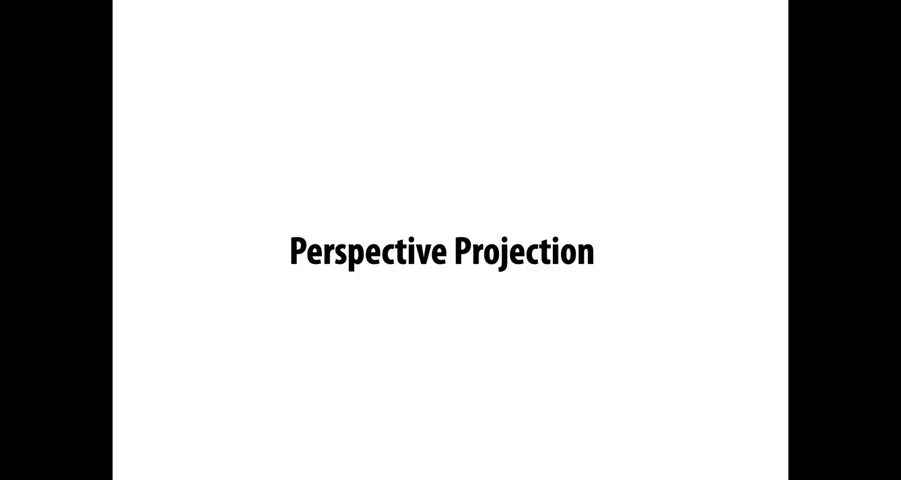

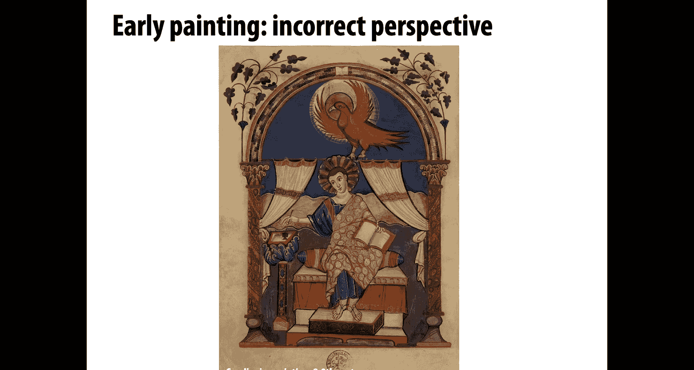

And as we go through the history of painting， we'll see that things start to evolve a bit more toward correct perspective until people finally understood something about vanishing lines and so forth。

Later on， as people mastered perspective， they said， well。

 actually we can reject perspective now that we can understand it。

 we can play all sorts of games with it to do interesting things about perception。

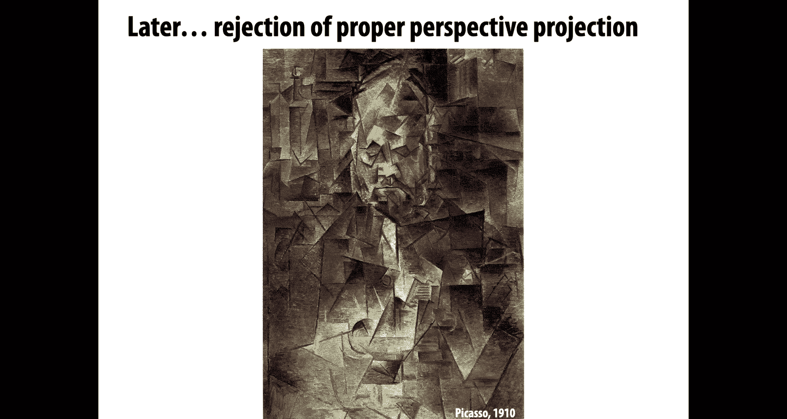

But when we come back to computer graphics， people said， yeah。

 let's first figure out the mathematics， how do we get this really correct and are able to make these beautiful photorealistic images where lines converge and behave the way that they do in the real world that they do when we look at objects with our eyes。

Again， once we had mastery over this idea of perspective， people turned around and said， yeah。

 but sometimes when generating computer generated images， we don't want this perspective effect。

 if I'm making a map of a city or if I'm looking at an engineering schematic。

 it might actually be helpful to have a different kind of projection。

 like an orthographic projection where sizes are more predictable or more preserved。

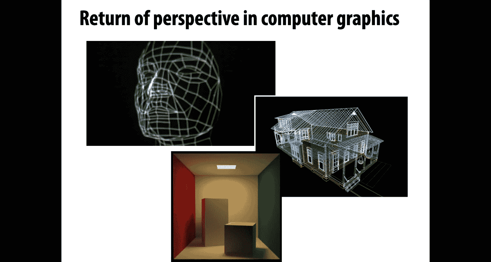

Okay， so let's go back and talk about the whole sequence of transformations that happens to an object。

 a primitive as it goes from the input description to its final location on the screen。

So we'll start out with some object described in world coordinates。

Like you might remember from our first lecture， we specified a cube by just giving the location of its vertices in some absolute global coordinate system。

We then might want to transform these initial coordinates according to the configuration of a camera。

So if our camera is positioned and rotated in a certain way。

 we actually are going to apply the inverse。Translation and rotation to our input coordinates to effectively position the camera。

One thing we'll talk about today is that these。Coordinates are often then mapped into what are called clip coordinates。

 so into a sort of standard cube that's going to make it easy to throw out things that shouldn't get drawn。

Once we have that set of objects that will be drawn。

 we will map them to two dimensional coordinates through some kind of projection process。

 whether perspective or orthogonal projection。This gives us coordinates in some normalized coordinate space in some。

 let's say， square from minus1 to 1， and then to map that onto the actual target image。

 we have to stretch it out by the size of the image。And at this point， we finally have。

Primitives in 2D， locations of our vertices for triangles or whatever in 2D that we can go ahead and turn into pixels using the rasterization process。

Okay。So just as a little warm up， let's remember how we might do a spatial transformation like the one we use to position our camera。

So as a concrete example， let's imagine we have a camera centered at the position 420 and it's looking down the X axis。

And we have our object given to us in world coordinates。

So a basic question is what spatial transformation。

 what 3D transformation would put this object in a coordinate system where the camera is sitting at the origin looking down the minus Z axis。

 so how do we get things into this standard coordinate system？Okay， well。

 one way to think about this is that from the perspective of the camera。

 it's sitting at the center of the universe。So every other object should be expressed relative to the location of the camera。

One way of thinking about this is that we subtract the camera center 4 to0 from the coordinates。

Describing our object， in other words， we translate the object vertex positions by minus4 minus20。

Okay。Then we have to deal with the fact that the。Direction that the camera is looking down the X axis is different from the。

Canonical direction we want to use for raization， we want to be always imagining that we look down the minus z axis。

Of course， in this case， we can do this by just a simple rotation we can rotate。

About the y axis pi pi over 2？And now we'll effectively have aligned the camera's view direction with a minus Z axis。

Okay。In general， of course， our camera could be looking in direction right。

 so let's say the camera is looking in a different direction W， which is just a vector in R3。Okay。

Now， a slightly more challenging question。What transformation should we apply or how can we cook up a transformation？

The places。The object in a coordinate system where the camera is sitting at the origin and looking directly down the Z axis or the minus z axis。

And here let's just imagine that the camera is already sitting at the origin， right， we know。

 of course， how to perform a translation。Really， what we're looking for is what is the rotation？

That will effectively make it look like the camera is pointing along W。 How would you get that？

So this is a moment where you realize， yeah， 3D rotations， they take a little thought。

 takes a little work。One way you could do this is you could， as kind of suggested by the diagram。

 you could construct two other vectors U and V that are orthogonal to W。So for instance。

 I could pick some direction。V that I'm going to consider the up direction， which direction is up？

So some vector v orthogonal to W。By the way， how do I get a vector orthogonal to W while I could pick some rough up direction that I think should roughly be the direction that points up？

And then I could orthogonalize it， I could remove from that vector the component in the direction W。

Right， take the dot product。Of my initial V with W， subtract that from V， normalize V。

This might remind you， for instance， of the Graham Schmidt process。Okay。

Once I have two orthogonal vectors。V and W， I can get the。

 the third one by just taking a cross product right so I could say U is W cross V。

Once I have three orthogonal vectors， I have a new orthoormal coordinate system so I can build a corresponding rotation matrix R。

Where these vectors are in the columns。U V， N minus W。So what does this matrix do？

What kind of linear transformation does this apply？Well。

 it's a rotation matrix because we're just changing the coordinate system。

 right we're keeping the origin fixed， we're mapping lines to lines。

And distances aren't getting stretched out in any way， they're just getting。

Rotated into a new coordinate system。In particular， if we think about how this matrix acts on the。

Canonical coordinate vectors 100，010 and 001。we see that what it does is it maps the x axis to u。

 the y axis to V， and the z axis to minus W。Okay。Now， this isn't quite the transformation we want。

Because remember that in order to transform the camera。

 what we really do is we apply the inverse transformation to all the objects。

So how do we get the inverse of。The matrix R。Do you remember how to do that？

There's something very special about rotation matrices that makes them particularly nice to invert。

 which is that the inverse of a rotation matrix is just its transpose。

And if you don't remember why maybe go back and see our lecture on spatial transformations。

 but all that means in this case is we just put the three vectors Uv and W in the rows rather than the columns of the matrix。

Okay。Just a little refresher of transformations。So。

An important object in the rasterization pipeline is then the viewfrtum。

 the viewfrtum is the region this final camera can see。And just to keep things simple。

 we always imagine that the camera is sitting at the origin and pointed down the minus Z axis。

 that's why we went through this exercise of doing the particular camera transformation that we did。

So what is this view for us I'm all about， why do we say this is the region of space that the camera can see。

 right this gray box？Well， we can think of the top， bottom left and right sides。

 planes of this box as the four sides of the image that we want to draw。

Anything that's to the left of the image， to the right of the image above or below。

We shouldn't bother drawing primitives in that region。The near and far planes。

Which we mark here by Z near and Z far。Are giving us the closest and furthest things that we want to draw。

So we want to toss out anything closer than Z near and anything further than Zar and we'll talk in a minute about why we want to do it。

 it's not completely obvious why you would want to throw out anything too close or too far。Okay。So。

Once we have this view for them。This box that says， hey， these are the only things we want to draw。

Then clipping is the process of eliminating triangles not inside this view for them。Okay。

So if a triangle lands inside the box， we draw it， if the triangle lands outside the box。

 we don't draw it。Why do we even bother with this clipping process？Well。

 one answer is that we don't want to waste time raizing primitives that we can't see。

If you think back to our algorithm for drawing a triangle。

 it actually takes quite a bit of computation， we have to test for each pixel。

 is it on the inside of each half plane and so on and so forth？We could， of course。

Cllip a triangle by just tossing out fragments， tossing out pixels that aren't on the image， right。

 just check is that pixel in bounds？But this is doing a lot of work for very little reward。

So discarding individual fragments is doing this clipping process at a very fine granularity。

 It makes a whole lot more sense to try and toss out the entire triangle before we even step into this algorithm for asterization。

 So we want to do a course。Grnularity test of whether the triangle can be seen。And by the way。

 this is generally a really useful strategy in computer graphics to try to go course to fine。

Anytime you can do a quick and dirty check to see if something's even worth doing。

 you've saved yourself a whole lot of effort。Okay。Now， unfortunately。

 it's not quite as simple as just checking is the triangle inside the box or outside the box。

 we still need to deal with primitives that are partially inside the box and there's some pretty interesting cases here so one vertex could be inside two vertices could be inside or one vertex could be inside in kind of an interesting way generally the way that clipping is done in a real rasterization pipeline is we take any partial triangle and we split it up into several subtangles。

 you can see。This might end up giving us a triangle or a quad that gets split into two triangles or a Pentagon that get split into three triangles。

Why might we go。All the way to splitting this into triangles， why not？

Just take the clipped primitive， the quad or the Pentagon， and draw it directly。Well。

 the reason goes back to something very important that we've discussed with the rasterurization pipeline。

Which is that we're really trying to build a pipeline that does one thing really。

 really well and really， really fast， which is to draw triangles onto the screen。

So what we're always interested in doing is reducing the general case down to。The special case。

 the specific case of just drawing triangles。So this is another thing your graphics card will have is specialized hardware for taking polygons and clipping them into triangles。

Okay。One question we haven't yet answered is why do we have these near and far clipping planes。

 why would we want to toss out things that are far off in the distance， for instance。

Those seem definitely worth drawing。 We would definitely see those primitives if we looked out into the world。

Well， one reason is that you could easily imagine primitives that have vertices both in front of and behind the eye。

 You get really close to an object and some of these triangles are going to be spanning。

Positive and negative Z values。And this is going to cause some real headaches for rasterization。

 trying to figure out， okay， are these fragments in front of or behind the eye？

Maybe simpler to just clip everything off that gets too close。

A much more fundamental reason for having these near and far clipping planes。

Has to do with dealing with occlusion。 So in our next lecture。

 we'll talk in detail about a technique called Z buffering or depth buffering。

And the idea is if I want to draw many primitives on the screen and have them occlude each other。

I'm going to keep track in an additional image of the closest depth I've seen so far。

And if I then go and try to draw anything that's further away than the closest depth so far。

 I just toss that out。Okay。The challenge here is that I'm storing these depth values as floating point values。

And so I have to be very careful。To set a range of possible values。

Minimum to maximum possible depth value。That keeps these values accurate。Okay。So for instance。

 if I set my near clip plane to 10 to the minus1 and my far clip plane to 10 to the。Third。

Then I can nicely draw these overlapping cubes， so this is just a red cube and a blue cube overlapping。

Okay。If I， instead。Set my clip planes like this， the near one is really， really close。

 10 to the minus5， and the far one is really， really far away， 10 to the  five。

Then you notice I get these wobbly jaggy artifacts as the cube rotates around。

 and this has nothing to do with the actual geometry of the intersection。

 this purely has to do with my raurization process， this is an artifact called Z fighting。

Why is this happening？Well， it's happening because the Z values。

 the depth values that I'm storing in this buffer really are fighting because I don't have enough precision right in that region where the two surfaces nearly touch。

Then I have some ambiguity about which of the two surfaces is closer or further away。

And from frame to frame， I get these ugly jaggy artifacts， actually even within a single frame。

I might have two planes overlapping and get this zigzag back and forth。Across where they meet。

So that's why I have near and far clip planes and generally I want to set those so that they just contain the geometry in my scene。

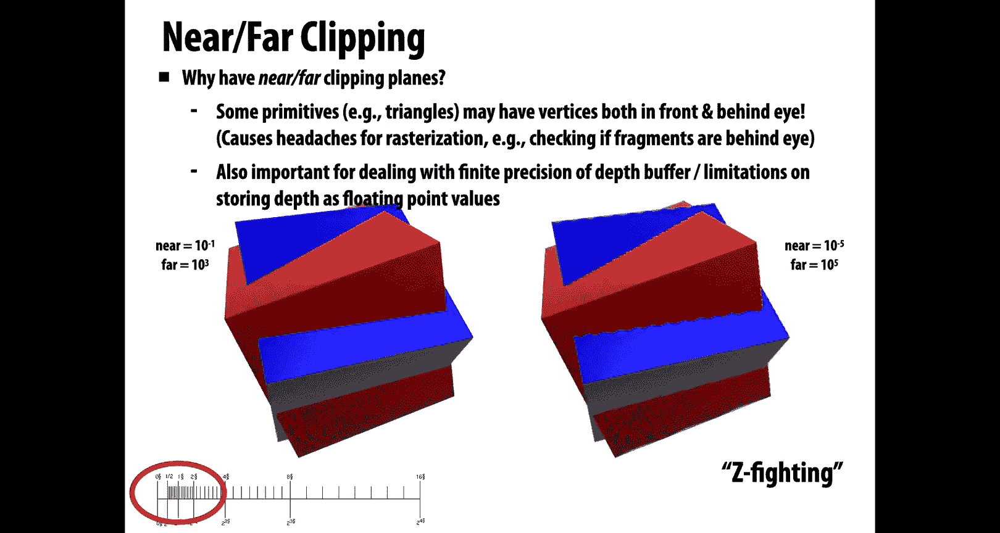

All right。So。What do we do with this view fresh and how does this factor into our sequence of transformations going from the original object to the 2D primitives that get drawn well。

 before we go ahead and do the 2D projection，What we're going to do is map the viewfr them。

This gray box to a standard cube， the cube between 1 and one in all three components。

Why do we do this？Well。For one thing， it makes clipping a lot easier。

 we can just toss out any points that are outside the range 1 to1。 Of course。

 we still need to think about partially clipped triangles。

 but this is going to make all the logic of that clipping process a lot easier。Again。

 I mentioned that we have specialized hardware for this clipping。

 so we want to make that hardware as simple as possible or we want to make our algorithms as simple as possible。

Question。How can we express this mapping between cubes as a matrix。Actually。

Can we express this mapping as a matrix？What do you think。Well， yes。

So we can set up a linear transformation， the maps vertices of。The view for usum to a cube。

 how do we do it？Well， here's how I like to think about it。 I think， okay。

 I know that I'm looking for a map that sends each of the corners。Of the gray box， x1 through x。

8ight。To a corner of the new white box。Which I'll call Y。

 so I could write this down by saying L is left R is right。

 B is bottom T is top and is near and F is far， so just the bounds on our initial box。Okay。

 and I can write out the coordinates of the eight corners。

Notice I've done that here using four coordinates。Remember our homogeneous coordinates。

And then I can write out。The target corner locations， Y1 through Y8。Okay， in this case。

What I'm describing is an orthographic projection。I'm actually imagining that my initial box doesn't look skewed like the one that we see on the slide。

 but that it's actually rectilinear， so something that you would do for an orthogonal projection。

So once I know what the original corners are and the target corners are。

 I can solve the equation A X I equals Yi， but in this case， I'm not solving for x。

 normally with a matrix equation AX equals y you solve for x。In this case。

 I'm actually solving for the unknown entries of the matrixtri A。I know what points I start out with。

 I know what points I want to get， but I don't know what my linear transformation is so I can solve for the entries of A。

It's really important。To realize that you can do this in general， when you have a linear equation。

 it's not always X that you're solving for， sometimes you want to solve for the linear transformation itself。

Okay， in this case， we end up with a matrix that looks like this。You can kind of reverse。

 engineer it。 You don't have to really solve for it directly。 What is this matrix doing。

 Let's think back to。Our homogeneous representation of linear transformations。

What do different components of this matrix mean？So what do you think this matrix is doing？Well。

 we can break it up into kind of two pieces。One is that it applies a non uniform scale。

To turn our original box into a box of size2， right if we have coordinates going from minus1 to 1。

 that's a box of size 2。And then in the upper right。We have this translation。

 that was the whole idea behind using homogeneous coordinates for spatial transformations is that we can express translations as linear transformations in homogeneous coordinates。

So in this case， we're doing a translation that translates the center of the box to the origin。

Taking that scale into account。Okay， stare at that for a little bit。

 hopefully you can make sense of it。Now。I said， that's the。Mattrix or orthographic projection。

 something where we don't really have any perspective effect。

How would you do this for a prospective transform？Well， you could go through similar process。

 you could try to figure out where do x1 and x2 and x3 and so forth sit along these rays that you see in the diagram on the upper left。

Solve the same linear equation for A。Okay， and what would you get Well， if you had a very。

 very simple setup。The cameras pointing down the Xax。

 everything is in kind of normalized coordinates already。

Then you would just recover the very simple perspective projection matrix that we saw before。

Something that just。Divides x and Y by z。And if you remember the way we represent that in homogeneous coordinates is we say。

 aha， if in the end， I want to divide by Z， then I'm going to construct a matrix。

That copies Z into the homogeneous coordinate。So the last row of my matrix is just a duplicate of the second to last row。

Okay， just copies Z in there so that when we go to turn our。Vectctor X， Y， Z W into the final vector。

By dividing， we just get x over z， y over z11。Okay。

The only difference between this matrix and the full perspective matrix is that the full perspective matrix or the general perspective matrix is going to take the actual geometry of the view forsum into account。

It's not going to assume that it already has some dimension。

 but just takes the left bottom top right near and far。Into account okay。

 and there's a link at the bottom if you want to see a full derivation of that。Okay。

So now we have a matrix。That will transform our coordinates into this canonical cube。

And if we apply it and then perform the homogeneous divide， we will get coordinates in 2D。

You might remember that we had one last transformation in the raurization pipeline that takes these 2D coordinates。

In this sort of normalized coordinate system， into the final。Coordinates。That sit in the image plane。

Okay， so our projection from 3D to 2D will always give us points in the square from minus 1 to 1。

Sitting on the Z equals1 plane， if you like。And what we'd like to do is transform this into points in a width by height pixel image and go from something like this。

To something like this。One thing to be careful about。

Is we have this funny disagreement of coordinate systems。In mathematics。

Usually x points to the right and y points up。In image coordinate systems， for historical reasons。

 x points to the right and y points down。So in addition to stretching the square out。

 we're also going to need to perform a reflection。One way we could do this is we could first reflect about the x axis。

 then translate by 11 to move the corner。Of our square to the origin and then scale by width over 2 height over 2 to get our final coordinates。

 Y we divide by 2 here。Well， because the square we started out with wasn't a unit square。

 it actually has dimensions two by two。Okay。Allright。

 so that's a lot of little ideas floating around， let's look at the whole process going from objects in three dimensional coordinates to two dimensional coordinates on your screen。

 just what we saw before， but now we've seen every part in detail。

 so we start out with our world coordinates giving the original description of our objects。

We apply a view transformation， basically the inverse。Of the transformation describing the camera。

To get our view coordinates。All positions are now expressed relative to the camera。

 we can imagine the camera is sitting at the origin looking down the minus Z direction。

Because we have this canonical orientation and configuration for our camera。

We can do all subsequent computations in the same way no matter where our camera is truly sitting。

Okay。We then map these view coordinates into our clip coordinates。 so we squash them into a。

Unit cube or a2 by2 by2 cube。What do these clip coordinates do for us， actually。

 they do two things for one thing， they make it easy to toss out primitives we don't want to see。

For another thing， they actually give us already the type of projection that we're going to see。

 So depending on how we mapped the viewrerustem into this cube。

 we're going to get either a prospective projection or an orthogonal projection。Okay。

We can at this point go ahead and just do the perspective divide or the homogeneous divide to get normalized coordinates。

 so 2D coordinates sitting in a 2 by 2 square。Then we need to do a screen transform to stretch out these coordinates and importantly remember to flip everything upside down。

Okay， and that's it， so at this point we have just ordinary two dimensional coordinates in the plane that we can use to draw our primitives。

So。How do we draw nice primitives？Well， previously we discussed a very basic problem。

 if I have a triangle with vertices A， B， and C， how can I test whether a point x is inside or outside the triangle we do a few half plane tests。

Pretty straightforward， but this doesn't give us very interesting triangles。In general。

 we want to give this triangle other attributes， maybe like colors。

 So let's say in addition to positions， each vertex has a color， red， green， blue。

And we want to know what color should we assign to the point x somewhere inside the triangle。Well。

 a standard strategy is to interpolate somehow the color values a vertices to get a smooth blend or smooth gra of color or any other attribute that we might have stored at vertices。

How does this work？It's helpful， maybe to go back and just look at a simpler example of linear interpolation in one dimension。

So let's say we have a function F of x。And we've sampled that function at points x subi。So for。

Brerevity all say that f sub I is equal to f at x subi。Question。How do we construct a new function？

That connects the dots between consecutive samples。For instance。

 can you give me an explicit expression that draws the dashed line between F subi and F subi+ 1？Well。

 one way to do this is to cook up a parameter T。That is zero when we're at X and one when we're at Xi plus 1。

So I can write this as x minus X I divided by X i plus 1 minus X I。Okay。

Then the interpolated function。I'll get by just blending between the values， F and Fi+ 1。

 using the parameter T。So I start out。With F and I add T times F plus 1 minus F。If t is0。

 the second term drops away and I just have Fi if t is 1。

Then I subtract FI from FI and I'm left with just FiI+ one。In between， I get a linear interpolation。

 which is actually an aine function of T。Okay， hopefully that's straightforward in 1 D。

 then the question becomes， how would I do something like this in two dimensions？

So this time I imagine I've sampled the values of a function F of P at points P， Pj， PK in 2D。Okay。

 so each of the PIs has components X I， Yi。How do we connect the dots this time？For instance。

 how do we fit a plane or kind of a triangle that touches those three points？What do you think。Well。

What we want to do， really， is fit a linear or really aine function to these three values。

Any such function has three unknown coefficients， A， B， and C。

 so we can write our approximation or interpolation of these data points as F hat of Xy is equal to AX plus BY plus C。

To interpolate， we just need to find coefficients so that this function F hat matches the known sample values at the three sample points。

So in particular， we want F hat of x and Y n to equal Fn4。Our three samples n equals I， J and K。

So what we really have here is three linear equations in three unknowns。

We know the sample locations X andY N， and we know the sample values FN。

And we'd like to determine the coefficients A， B， and C。How do we do this？Well。

 we could just go ahead and solve this linear system like any other linear system。

 and we'll get a solution that looks like thish boy。So ABC is equal to。1 over X JY I minus X I。

Y J plus blah， blah， blah。Right。This is a perfectly good solution， this is correct。

 but it's also really ugly and kind of hard to evaluate。

So let's see if we can come up with a better way to think about this and to compute。

This linear interpolation。Actually， to do this， we're going to go back and first think about 1 d linear interpolation in a slightly different way。

So。What did we do before？We said our linear interpolation is given by F hat of T is 1 minus t times F plus T times Fj。

 Actually， I've rewritten this ever so slightly。From the earlier slide。

And the reason that I've done this is that if we look at the way this expression looks。

We have 1 minus T times F。Plus T times Fj。Then we can really think of this as a linear combination of two functions。

 of two sort of basis functions。I have the function 1 minus T。

Which kind of interpolates the left end point。 It's big at T is equal to0。

 it's small when t is equal to 1。And I have another basis function T。That does the opposite thing。

 it's big when t is equal to 1， it's small， when t is equal to 0。

So if we combine these two functions using the coefficients F and Fj， then well。

 as we move closer to t equals0， we're going to approach the value of f at Xi。

 as we move closer to t equals 1， we'll approach the value of f at Xj exactly what we want to happen。

So we'd like to go ahead and do something similar in 2D。And in fact。

 we can construct analogous basis functions for a triangle。There actually lots of ways to do this。

 One way is given a point x， we can measure the distance。From x to each of the three edges。

And then divide those distances by the height of the triangle。

So we'll say each vertex has a basis function associated with it。For instance。

 vertex I has a basis function PhiI。Which at any point x is given by the distance。

Of x to the opposite edge。Divided by the height of the triangle， touching the vertex eye。

Here's a nice way to visualize these functions。So we can plot values that are large as being closer to white。

 values that are small， being closer to dark blue。And what you notice is these look a lot like our basis functions in the one dimensional case as we get closer to one of the vertices。

The function gets bigger as we get closer to either of the two other vertices。

The function gets smaller。And so now what you can imagine is if I take a linear combination of these three functions。

Waiting them by the values， the sample values at the three vertices。Then it has exactly the behavior。

That we want as we approach vertex I。Two of the basis functions fade away and go to zero。

 one of the basis functions VI。Gets towards one and we just recover the sample value at I。Likewise。

 for the。Other two corners。Question。Is this。Nice little construction。 the same。

As the ugly function that we wrote on the last slide that we got by just solving the linear system of equations。

Are we getting the same notion of interpolation？By this geometric construction， as our。Linear system。

Well， yeah。Before we said， an affine function is uniquely determined by the three coefficients A。

 B and C。There's only one affine function。That exactly hits the values at the three vertices。

Here we've constructed a function that exactly hits the values at the three vertices。And， well。

 is it a fine。Let's see， it's a linear combination of the functions， PI， Pj， and VK。The function。

 Phi I。Depends on， well a constant H subi that doesn't matter。And then this all boils down to is。

The distance to the edge of a triangle， linear。In the query points， X。Shi。

I can get this distance by just taking the dot product with a vector orthogonal to the edge。

And subtracting a constant， so I have an aine function for each of the Ds。

So if I take a linear combination of aine functions， I get an aine function。

 an affine function is uniquely determined by its three coefficients， so yeah。

 this nice simple geometric instruction is the same as that uglier function that we wrote out explicitly。

Here's another nice way to do it。 I claim that we can also get the same three basis functions by just taking a ratio of triangle areas。

 So again， we have our point x where we want to evaluate our interpoent。

And we're going to define the basis function VI as just the ratio of the area of this little sub triangle X Xj。

 Xk divided by the overall area。X I， X J， X K。To interpolate， I can do the same thing as before。

 just take the linear combination FI times VI plus FJ times Vj plus FK times。Fke。Okay。So。

Do you buy it， Do you buy that this gives the same interpolation as before。I meanFirst of all。

 do you even buy that this is a reasonable way to interpolate， is it true？

That as x gets closer to X I。The value I get is going to get closer to Fi。

Is it true that as x gets closer to xj， the value gets closer to xj？Okay， and if so。

Does it do it in the same way， Do I still get this same 2D linear or affine interpolation？

Think about it， right in the comments。Okay，No matter how you compute them。

 the values of the three functions P I， Pj， PK， for a given point。

 X are called the becentric coordinates of x。Okay， here they are。

And I'm visualizing these very centric coordinates in this case as colors。

 right I'm just taking those three basis functions。And summing them up with different color values。

In fact， this is exactly what we will use to interpolate any attribute associated with vertices that could be color。

 that could be texture coordinates， which we'll talk about in a minute。Could be anything else。

Importantly， these same three values， conveniently enough。

 fall out of the half plane tests that you're already doing for triangle raurization。

Why is that true？Well， remember that to test if a point is inside or outside a triangle。I check。

 Is it contained in three half planes。To check if I'm contained in a half plane。

 one nice way to do this is I do a dot product with the normal of that half plane。

Which is essentially giving me the distance along that normal。 So I do a dot product minus an offset。

And that's going to give me the distance。From an edge。

Which is exactly the quantity I needed to evaluate myberryrry cent coordinates。

 distance divided by height。So essentially we are already getting for free。

These very centric coordinates when we rasterize a triangle。Every time we do a check。

 we also get veryrycentric coordinates， so these are really the perfect thing to use if we want to do interpolation。

Okay。So there are some tricky things， however。When we want to interpolate quantities on triangles in 3D。

So due to the fact that we're doing perspective projection。

Barrycentric interpolation of values on a triangle with different depths is not an affe function of screen coordinates。

Okay， let's unpack that a bit what do I mean all I mean is that if I've already projected my triangle vertices onto the 2D plane。

And then I try interpolating values at the corners of the triangle。

Using the Berrycentric coordinates I get from that 2D triangle。

Then I'm not really doing the right interpolation of values on the 3D triangle。Right， things should。

Get interpolated faster， slower， depending on whether I'm looking at the triangle straight on or I'm looking at it at a grazing angle。

We really want to be interpolating values linearly in 3D space， not in image space。

So why does this matter， what difference could this possibly make well here's a good example that highlights what can go wrong。

So let's say I take a quadrilateral and to draw it as always。

 I'm going to split it into two triangles。Okay， and now I'm going to interpolate some。

Values at vertices across the triangles in this case。

 these values are going to represent locations that I want to look up into a checkerboard pattern。

If we compute very centric coordinates using our 2D projected coordinates。

 if we forget that this came from a 3D triangle and just pretend it was a 2D triangle interpolate as usual。

Then we're going to get a。Derivative discontinuity in the interpolation。

And you can really see this if you look at this middle picture。

We wanted to map a checkerboard onto this quad。But because the rates of change are not quite right when we use the 2D coordinates rather than the 3 d ones。

 we get this funky。Sort of bend in our checkerboard in this middle picture。

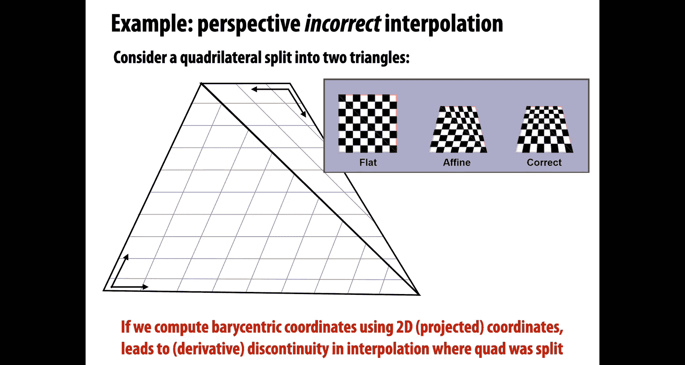

So how do we correct this while we can do a perspective correct interpolation？

Okay so our goal is to interpolate some attribute fee advertices。The basic recipe is。

We're going to compute the depth value z at each vertex。

We're going to evaluate one over z called that capital Z。

And phi over z call that capital P at each vertex。Then we can go ahead with these modified values and interpolate capital Z and capital P using standard 2D berrycentric coordinates just as we've been discussing。

Finally， to display the final results。We can divide the interpolated P by the interpolated Z。

 and that gives us our final value。If we do this。Things will behave as expected。

We get the appearance of doing a berycentric linear interpolation in 3D and then projecting that image onto 2D。

And if you want to see why that little recipe works。

 I've put a pointer to a useful article down below。Okay。

 so you've probably started to get the sense that one of the attributes I want to interpolate is not just color。

 but some kind of coordinates that let me do texture mapping。

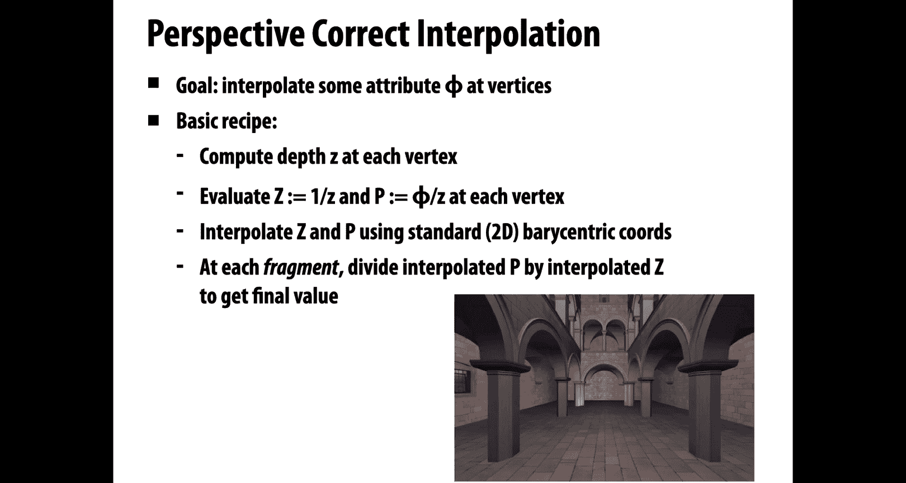

So what is texture mapping， A really good analogy for texture mapping is wrapping a gift。

 I have some paper with an interesting pattern on it。

 I have a cube like the cube from our first lecture。That doesn't look very interesting， right。

s just a flat box。I want to put this interesting pattern onto the box。

 what do I do I wrap the paper around the box。Essentially that's all texture mapping is。

 we're going to have two dimensional images and we want to find ways to wrap them around three dimensional surfaces。

 although our surfaces and our textures are often going to be a lot more interesting than just this simple box。

In fact， there are a lot of uses for texture mapping beyond just putting color。On a surface。

So the most basic use is something like， oh， we have a star pattern， we want to put it on a sphere。

 we have even just a flat floor and we want to put some wood grain on it。

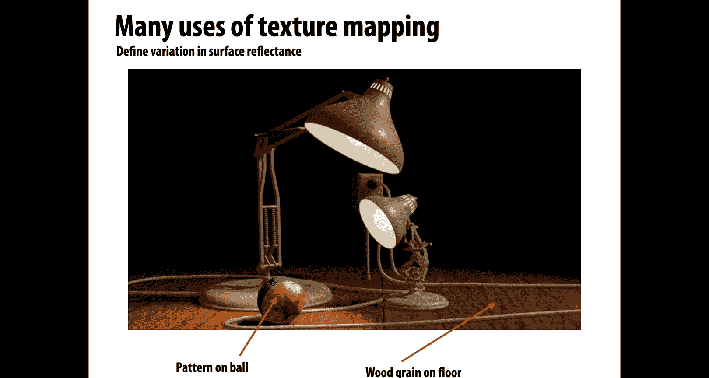

But we could also be describing surface properties beyond color。For instance。

 we might have a texture map that describes where the surface is wet and where the surface is dry。

 and that wet versus dry attribute will subsequently affect how we shade the surface。

We could also use multiple texture maps to build up different attributes of the surface。

Where is it scratched， What's its color， How is it shiny。

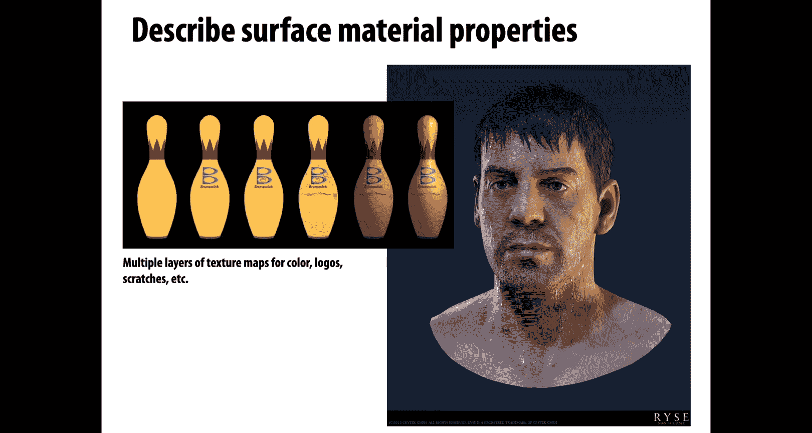

We could also use texture maps to start to play games with the geometry of the surface itself。So。

 one。Common technique is something called normal mapping。

Where the texture isn't describing color at all， it's actually telling us how to perturb the normal of the surface。

So that when we go to shade it， it looks like there's actually geometric detail that's not there。

So in fact， amazingly enough， this image on the left is a rendering of a perfectly round。

 perfectly smooth sphere。Where our normal map is giving us a fictional normal that makes it look like it has all sorts of bumps and wrinkles。

Now， if you're looking carefully， you can notice a couple things about。Why this doesn't quite work。

 why the illusion breaks。Do you see something strange about the left picture？Actually。

 there are two things that are wrong here。 One is。That the silhouette of the object is perfectly smooth。

 even though it looks like it should be wrinkled。And the other is that the shadow is perfectly smooth。

And that's because we haven't actually changed the geometry。

So displacement mapping is a technique that takes this idea all the way。

So we take that texture that's been wrapped around the surface and we use the values in that texture to actually。

Displace or move the surface in different directions。For a sphere， for instance。

 we might chop it up into lots of little triangles and displace the vertices according to the texture value。

And what you see now is that the boundary has this nice jaggedness to it。

 the shadow also has these bumps showing up。So it's a way to add a lot of richness to an otherwise very simple object。

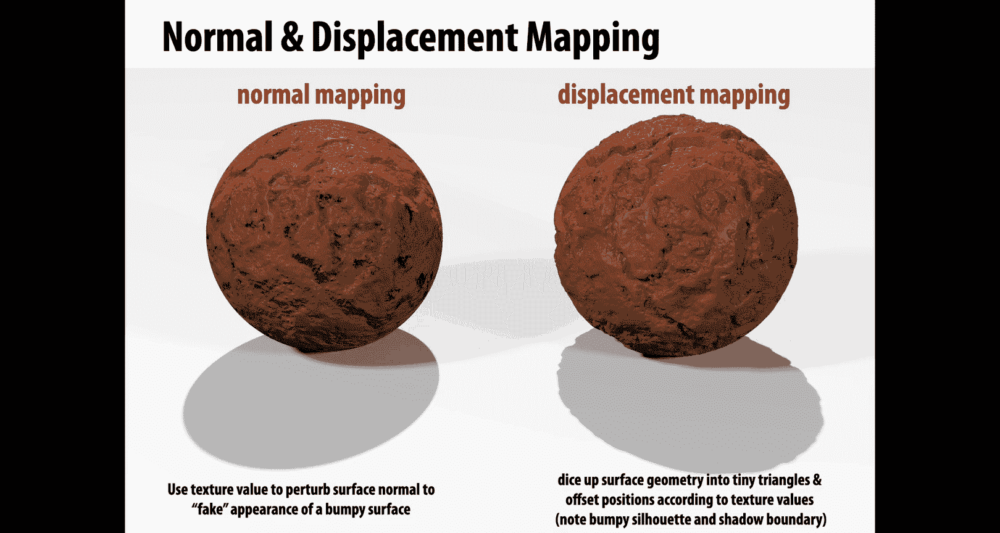

We can also use textures to help us get more realistic shading。So one common technique， for instance。

 is to compute the so called ambient occlusion。We can imagine if we're a little bug sitting at any point on the surface。

 the ambient occlusion tells us what fraction。Of our view is of the sky and what fraction is of the surface itself。

So if we're in deep creases or holes， this is going to be very dark。

 if we're out on the exterior of the surface， this is going to be very bright。

So this is a texture map that we can pre compute and later reuse to get very realistic illumination。

Another place textureex map shows up is not in adding detail to the surface。

 but actually to describe the lighting in an environment。

So here we have an image that describes the illumination in all possible directions。

 and when we go to shade surfaces in our scene， we do a lookup into this texture map。

 but not using the position of the surface something more like the reflected direction。

 which direction did light bounce and where does that land in our texture map。Okay。

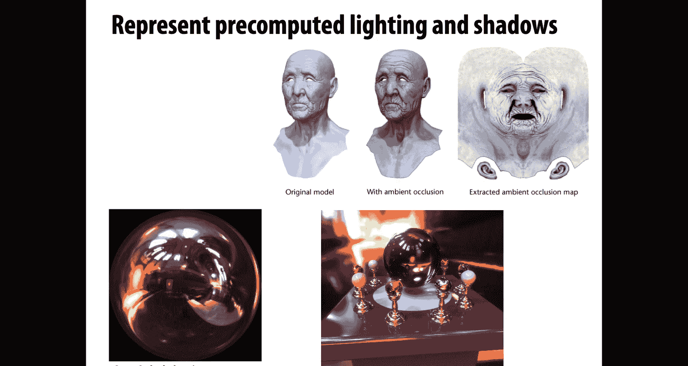

So。If we're going to map texture onto a surface， we need to describe which part of the image gets mapped to which part of the surface。

 and texture coordinates are what we use to define a mapping from the surface to points in the texture domain。

So most commonly， if we're working with triangle mesh。

 we might linearly interpolate texture coordinates at the triangle vertices over the interior of the triangle。

So as a simple example， let's say we want to texture this cube that we've been working with all along。

 we want to add some detail to this otherwise boring cube。And。In fact。

 let's imagine that each face of this cube has been split up into eight triangles。

And what I've written here are the texture coordinates or the UV coordinates for every vertex in that triangulated face。

Okay。I then have a two dimensional image， just a regular image file。

That I want to map onto each face of the cube。So what's going to happen， for instance。

 in this red triangle that we see on the left， it's going to grab this little piece of the two dimensional image。

That we see with a dashed red line。And it's going to kind of copy and paste it onto。

That region of the cube phase。 So if we。Liineterally interpolate the texture coordinates and look up the image value at that point。

 then we're going to get an image that looks like this。

Every face of the cube has this two dimensional image mapped onto it。

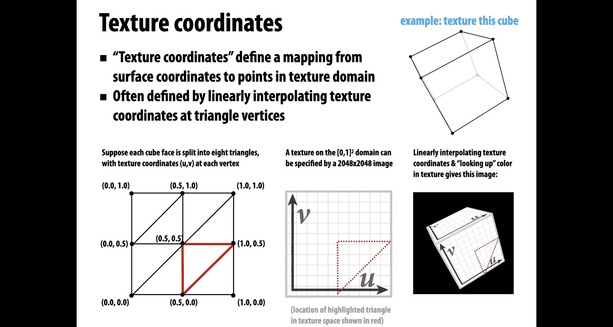

One nice way to visualize texture coordinates is to associate them with colors。

So if we think of U as red and V as green。Then we get kind of a color map that looks like this。

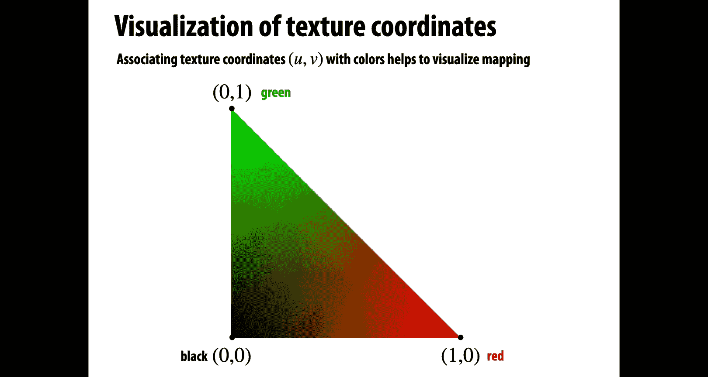

And so on a more interesting surface。Right。We'll see that these texture coordinates might vary smoothly over the surface to describe some interesting mapping of the surface into the UV domain。

Each vertex has a coordinate in UV texture space。They get linearly interpolated over triangles。Now。

 one thing I should say is I haven't said anything about how you actually come up with these coordinates。

If you come to me with a triangle mesh in 3D and say， please give me two dimensional coordinates。

 that's a whole other story that we're not going to talk about today。

So for now we'll assume that a mesh comes with texture coordinates。

What can we do with these texture coordinates， well， just what we've been talking about？

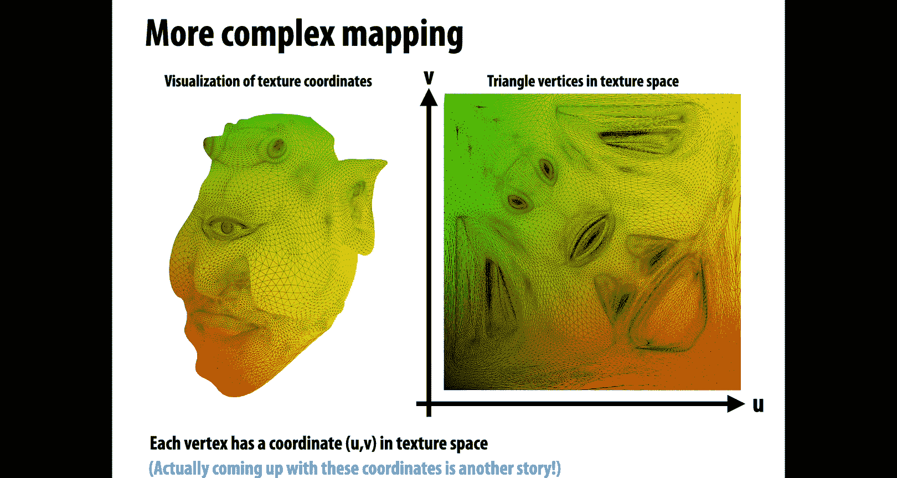

We can use it to add detail， so I can now go into the plane， I can start painting into this image。

 and I will see that little piece of the image copied onto my surface to add all sorts of color and detail and so forth that's not actually in the original geometry。

And the key idea is that each triangle is going to copy a little piece of the image back to the surface。

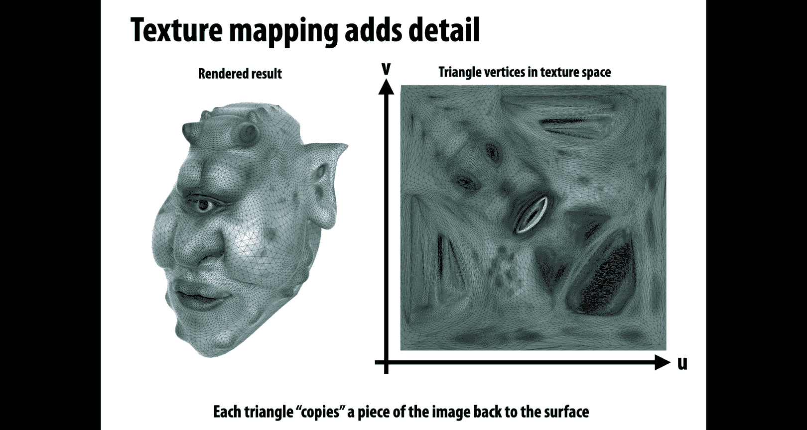

you can really see how much of an improvement this gives you， so without the texture。

 there's very little detail， very little information with the texture。

 the model suddenly comes to life。

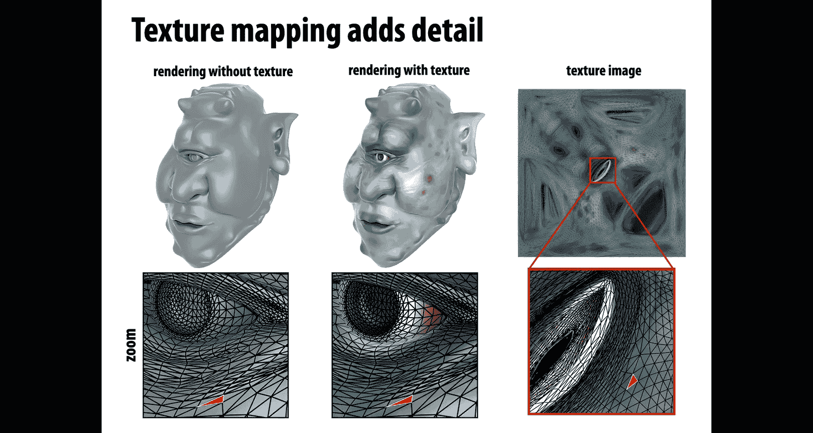

Here's another interesting example。Where we have kind of periodic coordinates on our surface。

 So remember these red and green colors。Represent the texture。Coords。Question， why do you think。

We would want texture coordinates to repeat in a scene like this。

You can see that they kind of go from zero up to 1 and then back down to zero。

Why would that make sense for a scene like a building？Well。

 one natural thing we might like to do with a building is to cover it with some regular pattern。

 like bricks。And so rather than storing an enormous image file。

That has different bricks for every location in this scene。

I'm just going to keep a repeating pattern。Some tile that I can repeat seamlessly。

And then I'm going to use these periodic texture coordinates to cover my scene with that tile。Okay。

So that gives some motivation for texture coordinates and how they work。

 but how do we actually draw a textured mapped primitive， a texture map triangle？Well。

 here's our very， very basic high level algorithm。So for each pixel in the rasterized image for each pixel on the screen。

We're going to interpolate。UV coordinates from vertices onto to whatever pixel we're currently looking at this white dot。

That tells us where in the 2D image to grab a color value from。

So we're going to sample the texture at that interpolated UV location。

And then we're going to set the color of the fragment of the pixel on the screen to that same texture color。

Okay。That's it。Sounds easy。 Sadly， there are a lot of difficult things we're going to have to face to get good quality texture mapping。

OkayAnd the reason is this adversary that we keep on encountering in this class aliasing。

Remember that aliasing。Happens when we unders sampleample a high frequency signal。

So if our true signal is this green oscillating curve and we only sample it at a few locations and then try to connect to the dots with linear interpolation。

 we get something that looks very different from the original function。

 and we saw that this phenomenon comes up when we're talking about audio。

 when we're talking about video， when we're talking about rasterizing primitives， things in motion。

 and so forth。Okay。What about texture mapping， how does aliasing show up here？Well。

 it can be helpful to have a good visualization of what's going on when we're sampling from a texture。

The key idea is that since triangles are projected from three dimensions to two dimensions。

 pixels in screen space will correspond to regions of varying size and location in the texture itself。

OkaySo if we march across the pixels of this triangle。We have these nice regular。

 let's say these red samples， actually those are coming from a triangle that we're looking at in 3D at a kind of angle。

And so if we plot now。What are the locations in the texture that we want to read from。

 those locations can be all over the place， and not only are they all over the place。

 but they are spaced out differently。In the left side， they're close together on the right side。

 they're far apart。And this irregular pattern of sampling。

Is going to make it difficult to avoid aliasing。So we'll have to think a bit harder than we do for just 1D functions。

One way to break down different sampling patterns is to think about。

Are we doing magnification or are we doing minification？Magnification is somewhat the easier case。

 so you can imagine that what's happened is the camera has gotten really close to an object。

 we've run up right against the wall where we have a texture on our wall。In this case。

 a single pixel on the screen。Is going to cover just a tiny region of the texture， in fact。

The pixel on the screen might be much smaller than。A pixel in our texture。

So this is the easy case because all we need to do is interpolate。The value at the Sc Ps center。

Mification， as we'll see in a minute， is much harder。 The example here is that the object is really。

 really far away。So that a single pixel on the screen covers a very large region in the texture。

Why is this challenging， Well， we have one pixel in the image covering many pixels in the texture。

 which color should we assign， which of those mini texture values should be the color that we get。

Probably we want to compute some kind of nice integral or average， but how exactly do we do that？

So let's start with this easier case of magnification。We've gotten really close to the wall。

And we want to look up just the value of the texture at a certain point UV。

There is a slight complexity here， which is that often this value will not be an integer value。

 U and V might both be real numbers， fractional numbers。Okay， so which color value should we use。

 let's say， for instance， UV lands here in the texture map。Well， the。Fast， simple。

 but ugly solution is just grab the value of the nearest pixel。

 the nearest texture pixel or what's called a text。Okay。And you can imagine how this looks。

 right as we get closer and closer to the wall。The image gets blockier and blockier until we're really staring at these big color blocks。

Doesn't look very nice。So we'd like to do something just a little bit better and a very common。

Idea is to use biline interpolation。Billinear tupoulation is just going to blend between these color values in a nice way。

More explicitly。What we could do is say， al right， let's find the。Pixel IJ or the Tel Ij。

By rounding down U and V， actually， I'm going to round down U and V minus a half because I'm going to always think about Texs as having their centers halfway into the pixel。

Okay。So I get this value Ij and I'm going to grab the four。Values closest to UV， which for brevity。

 I'll call F0，0， F1，0， F01， and F11。I can also write down。The fractional values S and T。

 How far are U and V from the lower left corner？Okay。

 that's always going to be a value between zero and 1。And now here's the key idea。

How do I blend between these values？Well， I'm just gonna。First。

Do linear interpolation in the horizontal direction just as we did before， for our 1D function。

So I'm going to do 1 minus s times F01 plus S times F11。

That'll blend between the two color values in the top row。Likewise。

 1 minus s times f00 plus s times F10 that'll blend between the color values in the bottom row。Okay。

 how do I get my final color value？Well， I'm just going to blend between the values in those two rows。

Using my other parameter T that tells me how far I am in the vertical direction。

So I can just do1 minus t times the linear interpolated value in the bottom row plus T times the linearly interlated value in the top row。

And that gives me my bi linear interpolation bi linear because I did two。

Linear interpolations are really because I did a linear interpolation in each direction。Okay。

 and that。Picture you're looking at really is the bilinear interpolation it looks much nicer。

 much smoother than our nearest neighbor interpolation。Question。

What would happen if we did this in the other direction what would happen if we？

Blened together the columns first。 And then after doing that blend， we blended together。

In the horizontal direction。Okay， think about it。Answer it in the。Comments。

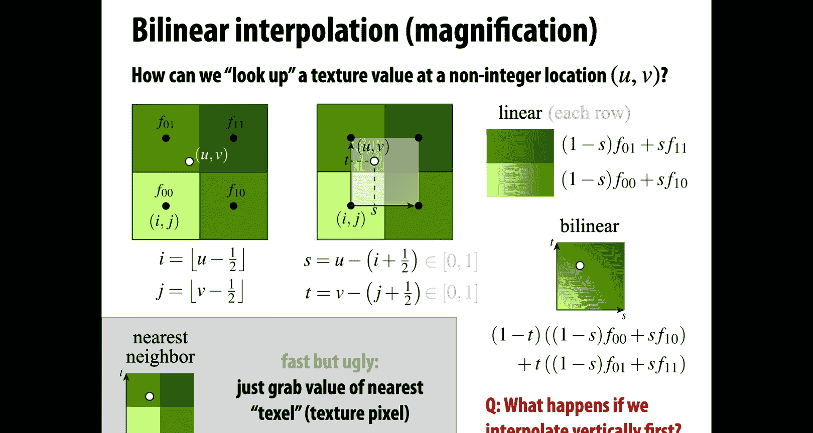

All right， so onto the harder case， Minification。So this is the example where we have a really high resolution texture。

 we're really far away from the object。And what you get are artifacts that look like this。

 they look kind of like jagged lines or jagged edges that we've been seeing in other rasterized images。

What we like is something that looks more like this。

Something where all of those jagged edges have been smoothed out。

 and we're going to do that using a technique called pre filtering。

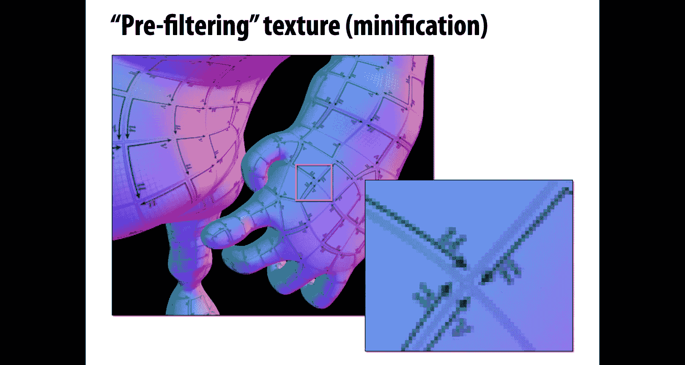

So how does pre filtering work for texture mapping？Well。

The thing to realize is that texture aliasing often occurs because a single pixel on the screen covers many pixels of the texture。

 Let's dig into that。So we have this texture image on the right。And you can imagine that。

 depending on。How far away from the object we are， we have either a really big pixel or really small pixel that we want to grab texture values from。

If we do the obvious thing， if we do the naive thing and just say， okay。

 I'll just go to the dead center of the pixel， I'll see where that lands in the texture and I'll grab that color value。

Things are going to go badly。Because if we have lots of different colors covered by that screen pixel。

We're essentially describing one random color out of that region。

Why are we picking the green textile rather than the red textexile or the white textile。

 maybe most of the textiles inside that pixel are white， but we happen to grab a green one。

This is going to be especially bad if things are in motion。 Now。

 if we just slightly move the center of that， that pixel， well， all of a sudden are。

Interlateulated value is going to jump to some new color。Okay。So， ideally。

We want to do something like what we did for super sampling。

 we want the average color within the region covered by the pixel。Unfortunately。

 this is really expensive to do directly。You can imagine， especially if we're really。

 really far away， a single pixel of our image could cover a huge region in the texture。

So for every single pixel on the screen， we might be reading hundreds of texture values out of our texture map。

And this is just going to kill performance。So what we're going to do instead is pre computeute some of these averages just once。

And look up these averages at runtime。We can do a lot of the work ahead of time。

Now that's a really nice idea。Except we definitely can't compute all possible averages ahead of time。

 there's no way we could store that。So we're going to have to think carefully about which averages to precompute and how to reuse those averages in an intelligent way。

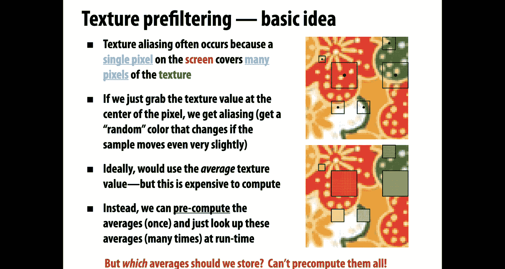

The basic idea is to store some set of pre filtered textures。

So if we start out with our full resolution texture。At the top。It 700 by 700 image。

We're going to downs sampleample that image to smaller images， like let's say， a 64 by 64 image。

And store that to look up later。The reason this is useful is if we have a pixel that covers a large region of the high resolution image。

 we can say， oh， don't even bother with the high resolution image。

 just look up from the low resolution image， which is already obtained by taking an average。Okay。

Question。Is it going to be enough to just use two images， a high resolution image？

And a downsampled average image。Well， no， probably not because I can still have screen pixels that cover a very large region even of the downsampled image。

Right and so what we're really going to do is use a technique called MI mapping。

Where the rough idea is to store a pre filtertered image at sort of every possible scale。Actually。

 we're going to do this in powers of two， we're going to start out with our original image at level  zero。

To get the next smallest image， we're going to average four pixels together。

To get the next smallest one we're going to average four pixels together and so on。

 until we're down to a one by one image。Okay so then the idea is that texts in these mimaps represent averages over progressively larger and larger regions of the original texture。

Later on， if we want to get an average over a large region。

 we can just look up a single textile from the Mitmap of appropriate resolution。

We'll talk a little bit more about exactly how we do that。One really cool thing about MImaps is。

They don't take too much extra space。 so for instance。

 if we have a image with three color components， red， green and blue。

You can imagine laying out the MI mapps of various levels in this way， right we put red。

 green and blue around the bottom and the right。Okay。The one that's next cosest。

 well that's half as big in each channel， so we fill in the bottom right of the upper left quadrant and so forth。

So if we keep doing this。What actually is the storage overhead of a MIt map。Right。

 it's not very much， in fact， the entire storage cost。

Of the Mitmap is something like a third of the storage cost。Of the original image。So。Really。

 really no excuse not to use Mitmaps。How do we actually use these Mi mapps when we want to sample from a texture？

Well。Here's a nice schematic of how this might look。

 we have this triangle which came from the three dimensional triangle， it's been projected onto 2D。

And we have a red。Sample in a blue sample where we want to grab texture values。

And one thing you notice is if we look at where these samples land in UV space。

Kind of the samples near the blue one？Cover a smaller region of the texture image。

The samples near the red one cover a larger region of the texture image。

So to get a good approximation of the average。Over the pixel。

 we want to grab values from different levels of our Mitmap hierarchy。Okay。

 and here's a good question just to see if we're understanding what's going on。Which pixel。

Should sample from a coarser Mitmap level。The blue one or the red one。Okay， and the。

 the basic idea here is。The red pixel is going to cover a bigger region and texture space。

So we want to effectively take an average over a larger region。

Which means we want to grab something from a coarser level of the Mimap hierarchy。

 something where we've already done a lot of averaging。

The blue one in this case looks like we could probably just grab it from the original。Image， right。

 the high resolution texture。How do we do this in general So the general idea is to determine which Mimap level we want to grab from。

 we compute differences between texture coordinate values and neighboring samples。

 so similar diagram， we have this center red pixel。That we want to grab texture values for。

 here's where some of the neighboring samples land in texture space， maybe that。

Pixel covers a region that looks like this in UV space。So which mintmap level should we use well。

What we can do。Is ask， how quickly are the Uv coordinates changing as we go along the horizontal direction and along the vertical direction。

 So we could say to U DX， the change in U in the x direction is roughly the U coordinate at pixelixel 10 minus the U coordinate at pixelix 00。

The change in the V direction is similarly v1，0 minus v 0，0。 I can think of these as。

Mapping that horizontal edge into the UV plane。Okay。Likewise。

 I can think of mapping the vertical edge from Pixel 00 to Pixel 01 into UV space。

And then I can check how long are these edges in UV space？

So the square of the length of the x edge is just DUDX squared plus DvDX squared。

Likewise for the length of the vertical edge。And to get just some rough sense of how big this。

Projected Pixel is。We can take the max of those two lengths。Okay。

So the max of those two lengths gives us some rough estimate for what is the area covered by this pink region？

And we're going to use that to determine our MImap level in particular。

 we're going to let our MImap level D be the log base2 of the longer length capital L。

Why are we taking a logarithm here。Well， because to generate our MIt mapps。

 each time we divided the image size by 2。So if we want to know which of those levels we're on。

 we need to take the log base to。

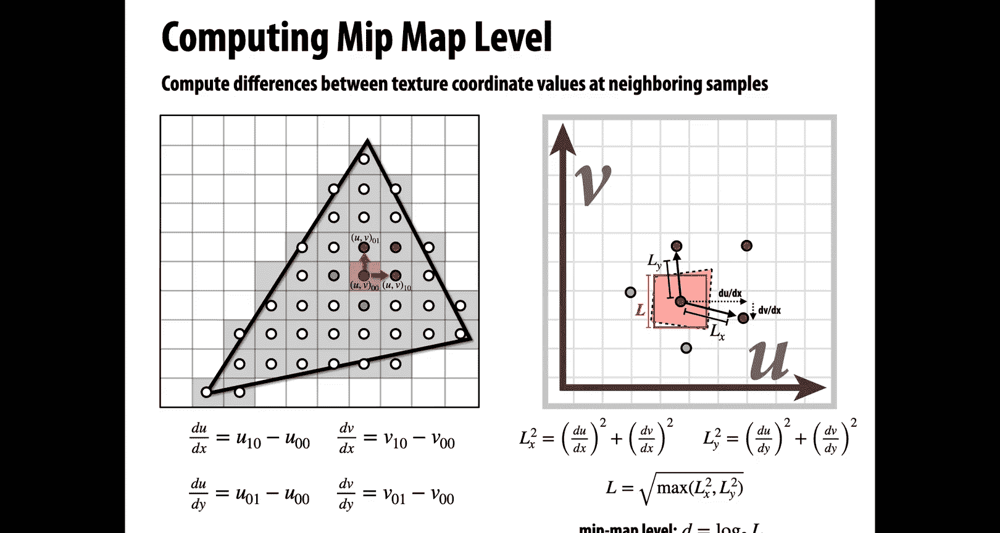

Here's a visualization of what that looks like， so we have this scene and we notice that as we go off into the distance。

 we get one Mimap level， as we're really， really close， we get another Mimap level。

 which is telling us that we should read from different textures from different mi mapps depending on how far we are into the scene。

What do these images look like that we're reading from。 So here's our original texture。

 our high resolution texture。 And you notice that in the foreground， this looks really nice。

 We have all sorts of nice detail。

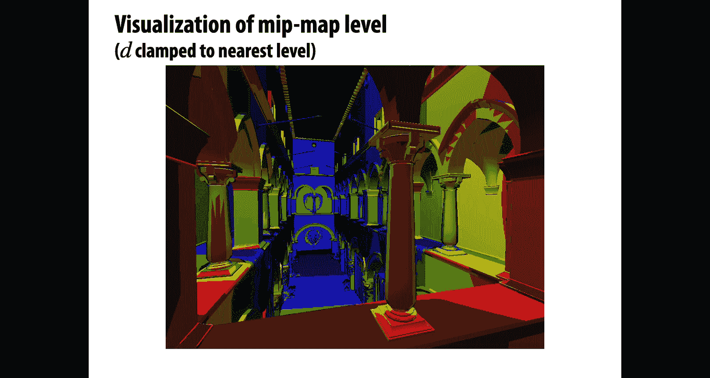

But if you go off into the background， this starts to get pretty noisy。

 we start to get that kind of minification jaggy artifact that we saw before。

Here's Mitmap level 2 that's been downsampled a couple times and you notice the details in the foreground start getting blurred out。

 but we get fewer jaggy artifacts kind of in the middle of the image， the middle depths。

And then finally here's the MImap level4， so we've really， really downsampled this image a lot。

 we've really done a lot of averaging and you can really see it it's not blurry all over the place。

Except often in the distance it actually looks great。

 those bricks in the very back of the room are nicely filtered。

So if we go ahead and we combine these different images according to the MItmap level。

 we get a nice image that looks like this。

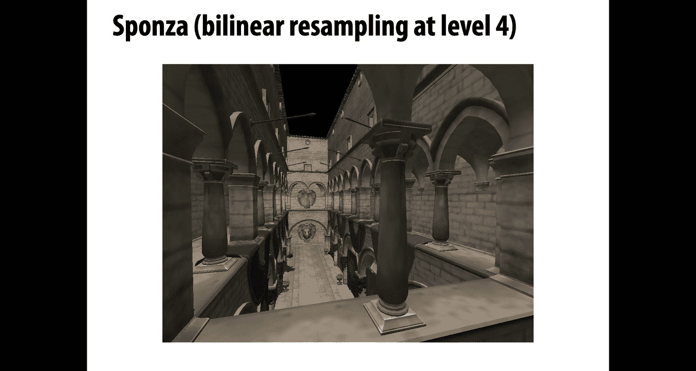

Things in the very far back are still nicely filtered。In the foreground， rather than a blurry mess。

 we actually get some nice detail。Okay， so that looks good。

 there are still some subtle problems with our basic mi mapping strategy。

And that's that if we just use the nearest Mitmap level。

 so if we take that number D and we just clamp it to the closest integer。

Then we're going to get artifacts where this level jumps。So you can see on this column， for instance。

 we suddenly jump from having a lot of fine detail to something much blurriier。

So a nice idea is to say， well， rather than clamping this mitmap level to the closest integer。

Why don't we somehow use the original continuous value D。To determine how to interpolate the image。

Right。The problem is we only have a fixed number of Mitmap levels。One， two， three， four， five， six。

 seven， eight。How could we interpolate between levels？

If you've been following our discussion of linear and biline interpolation so far。

 you might start to have some ideas。

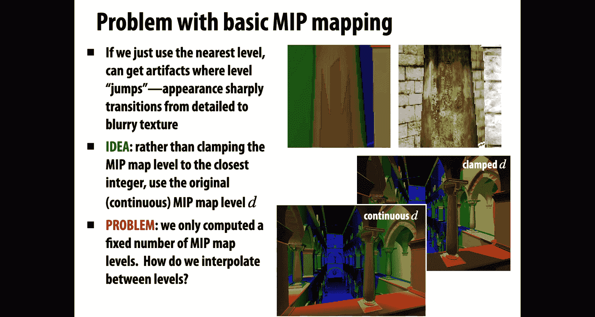

Just like we can use bilineer filtering。To interpolate 2D data。

 we can do one more linear interpolation to interpolate between two things that have been bilinely interpolated。

Actually， this is a lot easier to think about if we forget about MIt Maps for the moment and just think about 3D data。

So imagine that we have rather than a two dimensional image， we have a grid。

 a three dimensional grid of， let's say color values。Okay。So given a point。UvW。

Let's say in the unit cube and the eight closest values to that point。F 0，0，0， F1，0，0， and so forth。

We can just iterate linear filtering。Okay， so first。

 we're going to take weighted averages along the U direction。

For any pair of values that have the same Y and z coordinates， but different x coordinates。

We're going to take a linear combination using U as the weight。That gives us these four red values。

 which I'll call G。Okay。Then for pairs of G values that share the same。Z coordinate。

I can take a weighted average， using V as the weight。And finally。

 it can combine those last two green values。Using W as the weight to get my trilinely interpolated value。

This is just like what we did for bilinear filtering， but we took it one step further。All right。

So for a Mitmap lookup， we're going to do。Basically the same thing。

 but instead of interpollating from a 3D grid。We're going to interpolate from two different MItmap levels。

Okay， and the important thing to realize here is it doesn't matter at all that these two levels have different resolutions。

I'm going to go to Mitmap level D。At my UV coordinate。

 I'm going to do a bilinear interpolation that gives me one value。

I'm going to go to my next MImap level D+1 at that same UV coordinate。

I'm going to do a bilinear interpolation。Okay。The fact that the resolutions are different just effectively mean that the textiles are bigger in this level。

But now I have two values， these two bilinely interpolated values。

And as with trilinear interpolation。I can then interpolate between these two bi linear values using the third and final coordinate W。

 which in this case is just the fractional part of my MImap level。Okay， hopefully that's clear。

One thing you do get a sense of at this point is that this starts getting really expensive to do bi linear interpolation in each level。

 we already had to do four textile reads， the four closest neighbors and three linear interpolations so had to interpolate across the rows and then one across the columns。

If we want to do trilinear or Mitmap interpolation。

 we now have to do eight textile reads and seven linear interpolations。

 which adds up to seven multiplications and 14 ads。

So this is quite a bit of arithmetic and bandwidth to be eating up just to draw a single pixel on the screen。

 and that's why one of the reasons why we have specialized hardware to do this kind of thing for us。

Okay，One final challenge that shows up all the time when raizing 3D primitives is that at grazing angles。

Samples， texture samples may be stretched out by very different amounts along U and V directions。

So let's say again， we're drawing this quad。That's going off into the distance， and we can consider。

What do the samples look like around the red pixel versus the green pixel？Well， in texture space。

 the red pixel covers roughly a square region。Might be distorted a little more than what's shown here。

 but the green pixel is really going to be stretched out in one direction more than the other。

And so what that means is if we just do our usual mi mapping and try to guess， oh， what's the best L。

 what's the Mimap level closest to the size of this box？

We're going to get more blurring in one direction than the other。

 more blurring than we really should。So a common solution here is to。

Take this whole thing one step further。Take multiple mitmap samples and then combine them to get an anisotropic filter of our image。

 Of course， this is eating up even more arithmetic and even more bandwidth。

And there are a lot of different techniques for this。Okay。So overall。

 what does our texture sampling pipeline look like？First。

 we compute UN andV coordinates from our screen sample XY by using Berycentric interpolation。

We have texture coordinates or vertices， we interpolate them to the current sample XY。

We then approximate the rates of change of U and V coordinates by taking differences of screen adjacent samples。

We use those differences to compute a guess for our Mimap level D。

We convert our normalized texture coordinates UV to P locations capital U capital V in the actual image。

The image that is width by height rather than0 by one。

We use those values to determine the memory addresses of the textiles that we need for the filter。

 so for trilinear filtering， we might need eight neighbors。

We actually load those texts into local registers。And finally。

 we perform the arithmetic needed for trilinear interpolation， according to UVVND。And of course。

 if we want to do something even fancier， like antiisotropic filtering， we have to do even more work。

Okay。So the takeaway from all this is that high quality texturing。Is heart。

 This is a hard antialiesing problem。It requires a lot of thought about。

Interesting things that don't happen with ordinary signals like perspective distortion and so forth。

And requires a lot more work than just looking up a pixel in an image。

It's unfortunately not that simple。 Each sample of the image demands significant arithmetic in bandwidth。

 and again， that's the reason why。Graphics processing units。

 GPUs have dedicated fixed function hardware to do texture sampling operations。Actually。

 a lot of the area of a chip is just there to efficiently sample from textures。Okay。

 our lecture today brought together a lot of different ideas that we've discussed in the past and you start to see why building an efficient restization pipeline is a bit of a balancing act。

Lots of different considerations about arithmetic and bandwidth and how to represent transformations and so forth。

So we talked a bit about perspective projection。Wwhichch turns 3D primitives into 2D primitives that can actually be rasterized。

 We used the viewfrrustum to help make clipping easier and also to avoid depth buffering artifacts as Z fighting artifact。

Once we do a projection， we have 2D primitives。And we can interpolate attributes across these primitives using berrycentric coordinates。

Though if we're raizing 3D primitives， we have to be careful。

To consider how perspective affects barcentric interrbpolation。

One very important example of an attribute we looked at are the texture coordinates at the vertices of a triangle。

 which we use to copy pieces of a 2D image onto a 3D surface。

And what we saw is that very careful texture filtering is needed to avoid aliasing when we map images onto surfaces。

The key idea that will help you understand what is going on with texture filtering is to ask the question。

What area of the texture image is covered by a given pixel。

And how can I estimate the average color covered by that pixel？For magnification。

 it's perfectly good to just do a single bilinear lookup。

We're blowing up the image and so we can just look at a single sample。But for minification。

 we really do need to take an average。And there the technique we used was pre filtering。

We compute a bunch of averages ahead of time and store these in a Mitmap hierarchy。We then。

Blend between different levels of this MIm hierarchy using trilinear filtering。At grazing angles。

 even this trialline filtering is not quite good enough。

We might need to take multiple mitmap samples and blend them together to get anisotropic filtering。

In general， what we discover is， as always， there's no perfect solution to dealing with aliasing。

A lot of image generation is all about trying to balance between the quality of the image and the efficiency of computation。

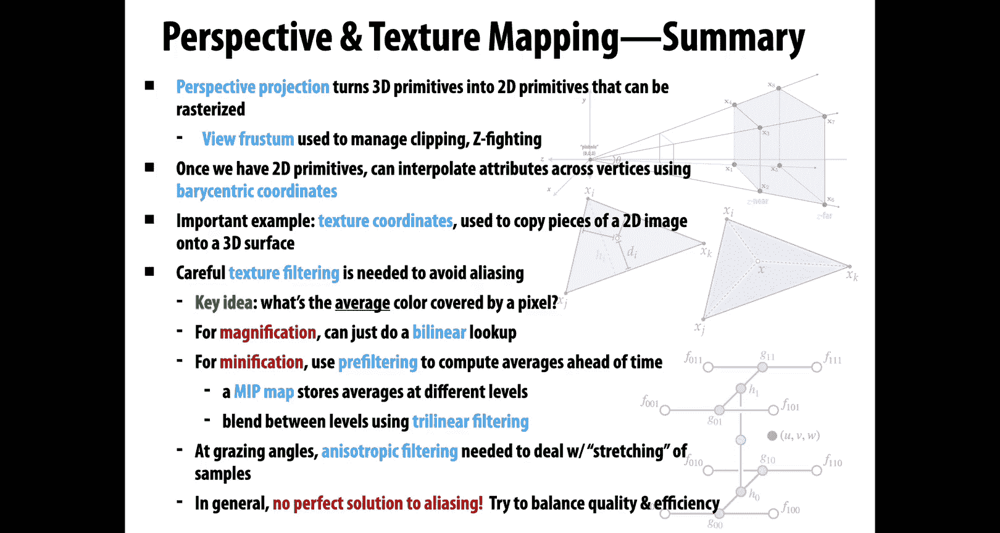

All right， that's it for today， next time we will actually wrap up our discussion of the whole Raization pipeline by discussing two important phenomena。

 depth and transparency。Talk to you then。

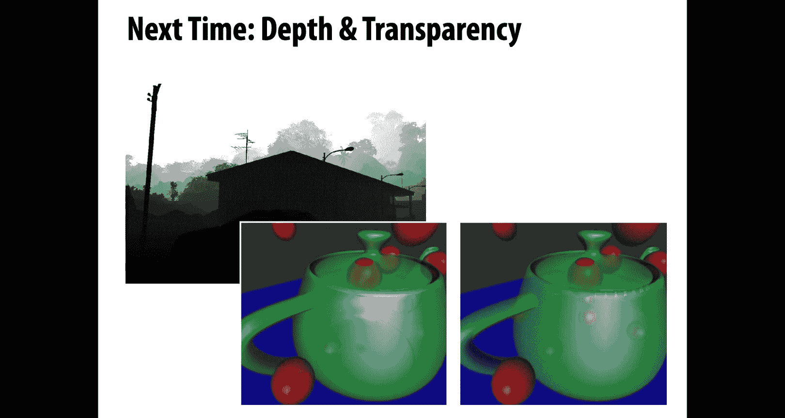