# CMU《计算机图形学｜CMU 15-462  COMPUTER GRAPHICS 2021》中英字幕 p09 -09-Lecture 08_ Depth and Transparency -BV1H3NBemE5E_p9-

Welcome back to computer graphics， so today we're going to add some important features to our Rasterizer。

 depth and transparency， and in fact we're going to wrap up today our entire discussion of the Raization pipeline。

So just to take a step back and think about what we're trying to do here。The raization pipeline。

 the graphics pipeline is going to start with some inputs。

 let's say a list of triangles and some other data， maybe colors or textures。

 and the goal is to push this data through several stages of a pipeline which these days shows up in your graphics card and produce as output a final Bimap image。

Okay， and we already know how to do a lot of this process。

 we know how to position objects in the world using three dimensional spatial transformations。

 we know how to project objects onto the screen to get the effect of perspective。

 we know how to take a 2D primitive that's been projected onto the screen and sample its coverage using the process of rasterization。

During that process of raization， we get barrycentric coordinates that can be used to interpolate attributes like color or texture coordinates across the triangle。

Using these attributes， we can shade the triangle in some interesting way， so for instance。

 we can sample from a texture to get more interesting color。And then finally。

 the thing we want to do today is talk about how we take those samples generated from each individual primitive and combine them into the final image while taking into account effects like depth and transparency。

So let's take a look at the first of those phenomenon。depth or occlusion。

So the question of occlusion is， okay， we're rendering a bunch of different triangles into our image。

 which of those triangles is visible at each sample point？

And we can think about this question for opaque triangles， things that are completely solid。

 we'll also want to think about this question for semi transparent triangles and their things really start to get interesting。

So let's start out and assume that we have a triangle given by。

The projected 2D coordinates of each vertex so we've already done our perspective projection。

But we've also kept track of for each vertex， what is the depth。

 what is the distance of each vertex from the viewer。Okay。And。

The first question we have to answer is， how do we compute the depth D at any given sample point XY？

So if we only know at the beginning the depths at the three corners， X I，Y， I， X， J， Yj， and X KYK。

How do we get a depth somewhere in the middle of the triangle。Well。

 something we discussed a lot in our last lecture was interpolating attributes using barrycentric coordinates。

And that's exactly the right thing to do here because depth varies linearly over the triangle。Okay。

So that's great， it's easy enough to get the depth at any sample point。

And now we're faced with this challenge of figuring out which triangle should show up at each sample point We want the triangle with the smallest depth。

To actually be drawn at that sample point。Well， an important thing to remember about the restization pipeline is that it processes things one triangle at a time。

 that's kind of one of its biggest strengths。 A triangle comes down the pipeline。

We do some computation， projection， rasterization， and so forth， and then we forget about it。

 we don't have to keep a list of all triangles in the scene in our pipeline all at one time。

On the other hand， that makes it challenging to figure out okay。

 which things should go in front if I only know about the current triangle。

How could I possibly figure out which ones should get drawn and which ones should get occluded？

And the solution to this is a very nice idea called the depth buffer or the Z buffer。

So the idea of the depth buffer is that at each sample point， in addition to a color。

 we're also going to keep track of the depth of the closest triangle or the closest primitive seen so far。

So in all my drawings here， I'm going to use a gray scale color bar to indicate the depth。

Values that are close to white or very far away， values that are close to black are very nearby。

 so you might imagine that initially we initiallyize the depth buffer to have very。

 very large values you can imagine you set these all to infinity or the maximum possible value that you can represent。

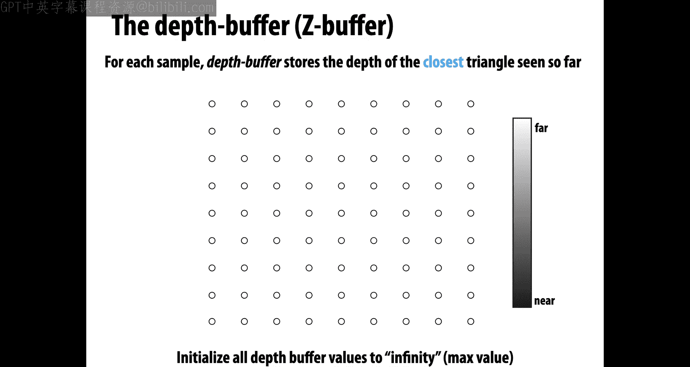

Here's an example of a depth buffer from an actual scene。

 so this is some buildings sitting in front of kind of a jungle， and you notice exactly this pattern。

 the buildings which are very close to us are very dark in color。

 the trees which are further away get lighter and lighter off into white。

 it almost looks like a fog going out into the distance。

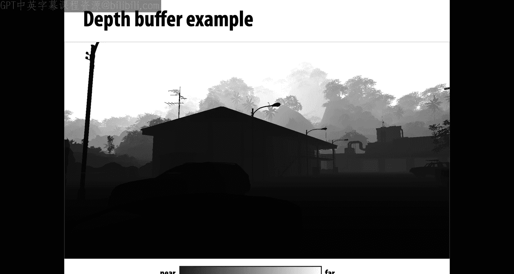

So how can we apply the depth buffer to render several opaque triangles。

 Let's start with the easy case。So we'll start with any of the three triangles and as we'll see very importantly。

 doesn't matter which one we pick。Okay so we pick the yellow triangle。

 we start drawing it onto the screen， we go through the raization process for each sample。

 we figure out is it inside or outside the triangle。Okay。

 but now we have an additional check that we're going to perform before actually putting the color of that triangle into our sample buffer。

We're going to check is the depth of each sample。Closer or further away than the depth stored in our Z buffer。

In this case， we started out with samples that are all really， really far away， right。

 the depth buffer we initialized it to infinity。So when we draw this yellow triangle line。

 all of those samples pass our depth test， they're all closer than what we had before。

And so we can go ahead and say， yeah， those samples pass。

 we should write the color yellow into the color buffer。

And we should update our depth buffer to keep this new closer depth value。

So you notice these values are gray rather than white， indicating that they're a little closer。Okay。

 we now draw another triangle， we pick any triangle we like， doesn't matter which order。

And this triangle。Is a bit further away than the yellow triangle。

 So what you notice here is that only some of the samples marked with the red dots pass the depth test。

The other samples in this triangle are closer than the values of infinity。

 but they're further away than the first yellow triangle that we drew。

And we know that just by comparing the depth value of the blue triangle with the depth value stored in the depth buffer。

 we don't need to know anymore about the shape and size and position of the yellow triangle。

 right that's gone。Okay。So for the samples that pass we do the same update。

 we update the color buffer， we put the blue color in those samples， we update the depth buffer。

 you notice there's some light gray。Where that new triangle came in。And finally。

 we take the third triangle， we rasterize it the same way。

This one is now closer than the first two triangles， so all the samples pass the depth test。

 we write the colors into the depth buffer and we also update all those samples in the depth buffer now we have these almost black dots。

Where that new triangle showed up。Aren't easy enough。Now， one thing I kept saying is， oh。

 it doesn't matter what order I process the triangles in。Do you believe that？Or did I trick you。

 Did I pick those three triangles in a very special order？Think about it。

 Why or why not might it matter。What order。The triangles come in in this process and leave some comments in the slides。

Okay， so here's some pseudocode that might help you think about that question more clearly。

 so let's say we want to draw a new sample into our color and depth buffer。

So we have a new sample with depth D and color C at a screen location XY。

 this sample came from restizing a triangle。Okay。And what do we do， well。

 the first thing we do is we check。Does this new sample pass the depth test？

So we compare the new depth D to the depth stored in the Z buffer at XY。

 What does this depth test do， it's very simple， it just saysIf D1 is less than d2 return true。

 otherwise return false。Okay。If we pass the depth test， well。

 that means the triangle we're drawing is the closest object we've seen so far at this sample point X Y。

And so we should go ahead and update the depth and the color buffers。Okay。And that's it。 Otherwise。

 we've seen something closer already and we don't need to update the color or the depth。

We simply do nothing。All right。So some questions about this process。For one thing。

 does the depth buffer algorithm， as we've described it， handle interpenetrating surfaces？

Our earlier examples， we had。Each triangle is entirely in front of or behind each other triangle。

 but what if we have two triangles like this， this green and yellow triangle that intersect each other？

Are we going to draw these correctly if we raize these into our color and depth buffer using depth testing？

Do we light up the samples that you'd expect？Yeah， of course。

And the reason is kind of one of the beautiful things about this zebra referringring idea is that this occlusion test is based on the depth of the triangles at a given sample point。

So the relative depth of triangles can be different at different sample points。

 we're considering things only on a sample by sample basis， not on a triangle by triangle basis。

The alternative to this， by the way， is really awful。

If I had to always draw things in sort of some particular order。

 let's say I had to draw all my triangles from back to front to ensure that I got the right occlusion。

Well then what I have to do in this example， probably what I'd have to do is actually find where these two triangles intersect each other。

 split them up at that intersection point into other funky polygons。

And then draw those polygons in sorted order actually do a sort。

So the depth buffer avoids all of that complexity by just treating things on a sample by sample basis rather than a primitive by primitive basis。

So in this case， for instance， at this sample， we have the green triangles in front of the yellow triangle。

At this sample， the yellow triangle is in front of the green triangle。

 and when we run our depth buffering algorithm。We get samples that look like this。

Exactly what we wanted。

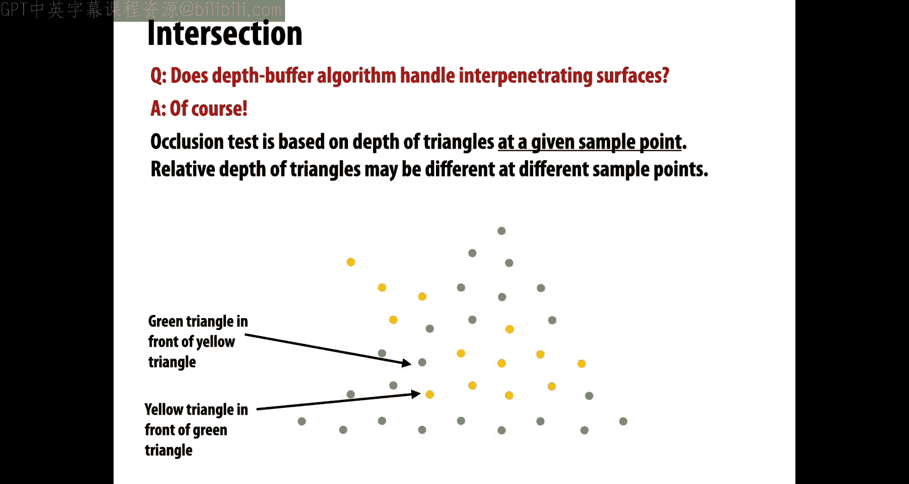

All right。What about the interaction between depth buffering and super sampling？

We talked before about using super sampling to reduce aliasing。So what do you think if I。

Try to apply depth buffering with super sampling。 Is this going to work。

 Am I going to get weird artifacts， Am I going to have to work a little harder to。

Get better anti aliasing。 What do you think。Well。The key idea here is， yeah， this will work fine。

 It'll work fine to do depth buffering with super sampling as long as we have one depth sample per。

Sample in our super sample buffer。Again， if we're doing things on a sample by sample basis。Well。

 then we should have one depth sample for every color sample。Okay， so in this example， we have。

 for instance， a green triangle including yellow triangle。

 if we run our depth buffering algorithm on all these samples。

 which are the samples of our super sample buffer， we get something like this。

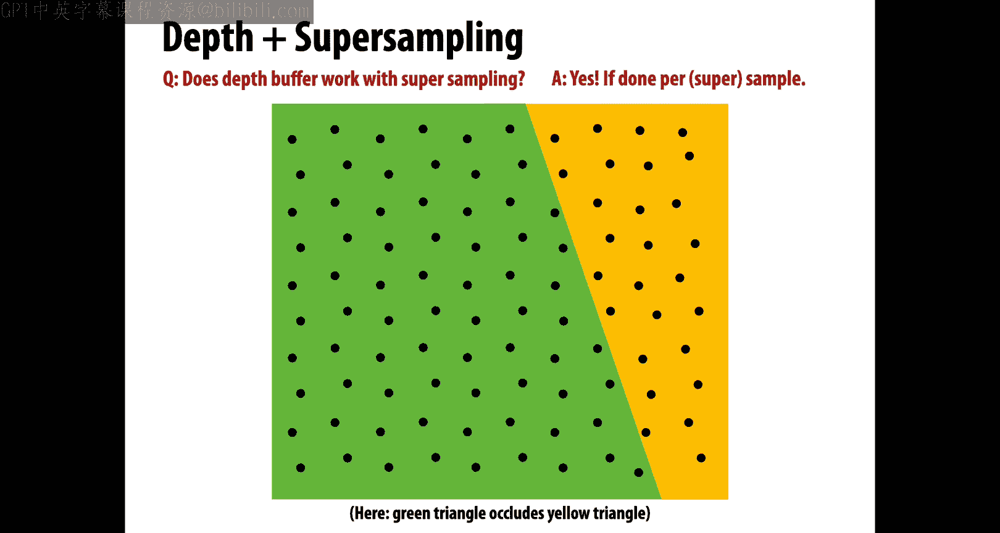

Okay， and now we just have ordinary colors， we don't need to think about depth anymore。Those colors。

Contribute to our original pixel。 So maybe we have four super samples per pixel。

And to get our final colors， we can just average these。

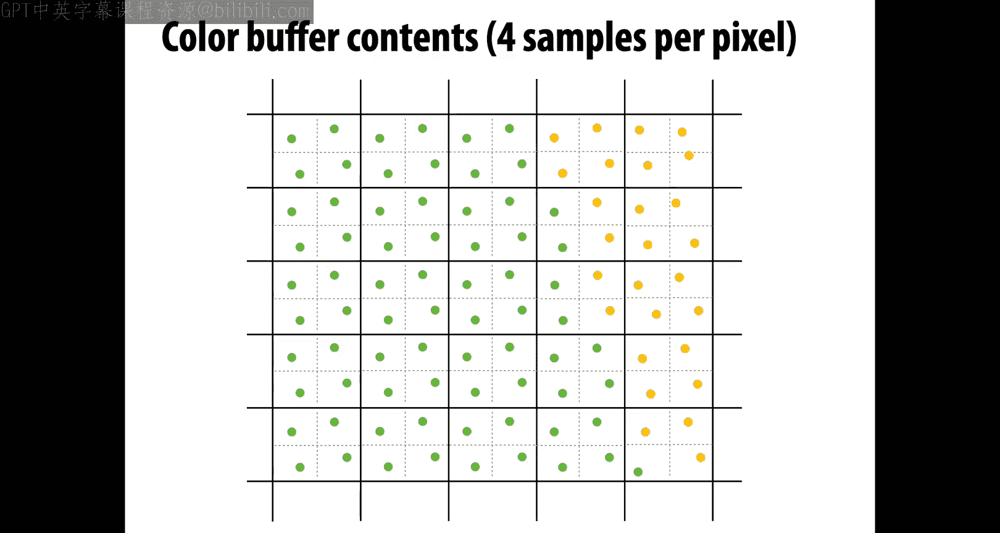

Colors in the usual way， so we average them down to something like this。

So we do get a nice smoothing or blurring of the color between green and yellow。

If you step back from this picture and look at it at a fine scale， this will look really nice。

 you'll have a nice smooth do edge。

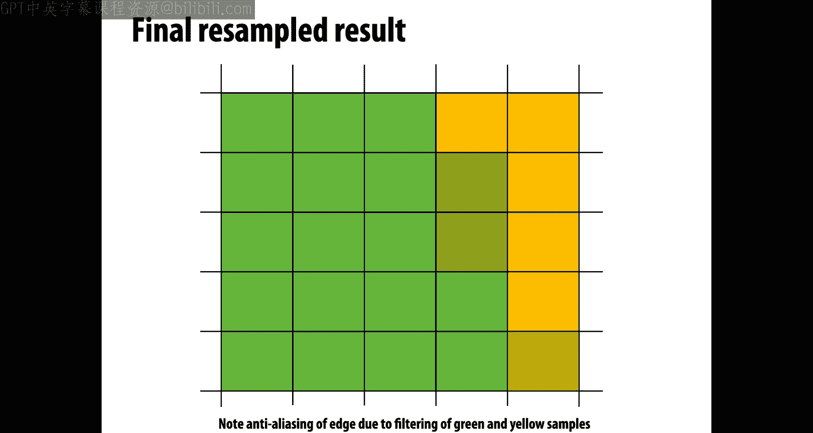

Okay。All right， so to summarize。Our depth buffer is going to store one depth value per。Super sample。

 not just one per pixel。Because we could have different depths of different supers samplesamples。

And what that means is we're adding constant additional space per sample。

 we used to be storing a color value which might be three values red green blue。

 Now we're adding just one additional value a depth。

 So what that means is overall we're just adding constant space for our depth buffer this doesn't depend at all on the number of overlapping primitives。

 there's no fancy data structure to keep track of ordering。Just one value。

 the minimum depth value at each sample point。We're also adding something that only takes constant time to do an inclusioncc test per sample。

Read from the depth buffer。 We do a little check。 We might modify it and write back a new value。

 Or if the pass depth check fails， we just read。We're not going to sort a bunch of depth values。

 we don't have a list of values that we look at， really， really simple。By the way。

 the depth buffer idea is not specific to triangles。

All it requires is that we be able to evaluate the depth of the object that we want to rasterize。

 so for instance。You could imagine drawing a sphere into your image。

And it's not hard at all to evaluate the depth of a sphere how far into the screen is a point on a sphere。

 so you could write a rasterizer that directly allows you to rasterize spheres into your color and depth buffer without tesating them into triangles。

 that's pretty cool。All right。So so far so good， sounds like the depth buffer works extremely well。

 solves a lot of problems， what about semi transparent surfaces？Okay， so to really understand this。

 we have to first just understand how to composite semitrans surfaces over each other。

 forgetting for the moment， the question of depth。So what is our model for semi transparent services。

The basic idea is that we're going to represent the opacity or transparency of a surface by a value alpha。

 so just a real value between 0 and 1。That describes how opaque we are。 So if alpha is equal to 1。

 that means we have something fully opaque and as alpha decreases， okay three quarters， one half。

 one quarter， it goes all the way to fully transparent。

This is obviously a very simplified model of how things work in the real world if you were to look at real transparent objects。

 glass and water and so forth。There'd be a lot more interesting phenomena and parameters that you'd need to describe that behavior than just a single alpha value。

 and we'll talk a little bit more about that when we get to photorealistic rendering。

But for now we just have this single parameter that says essentially how much of this object do you see。

 what fraction of this object do you see？

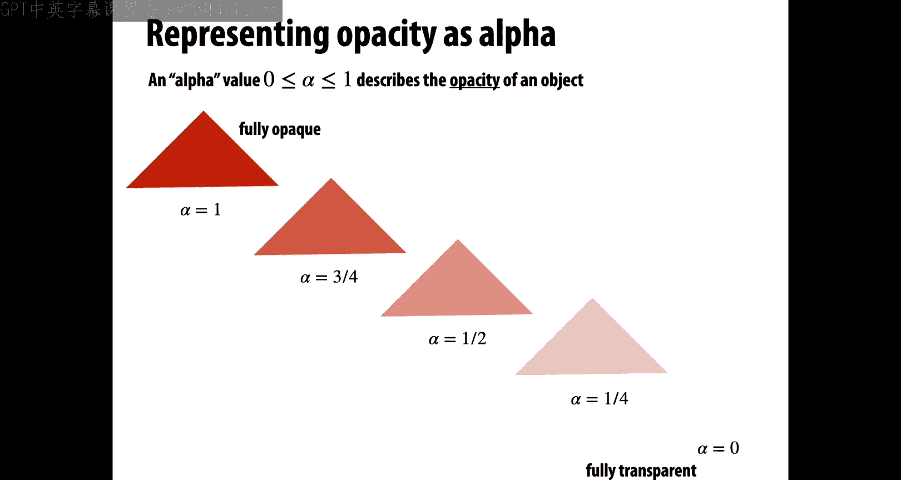

Rather than just having a single alpha value for the whole object。

 you could also have a single alpha value for each。Pixel in an image。

So this is something you might want to do if you're trying to composite one image on top of another。

 you have a leaf or you have this picture of a koala bear and you don't care about the background。

 you want to specify what's in the foreground。Well， for something like the koala。

 you especially notice that some parts of the image don't cleanly divide into just foreground or background。

If you have little wisps of hair that might be semitrans or might be very。

 very thin so that many small hairs pass under a single pixel。

 then you want an alpha value to give a sense of how much of the background should show through。Okay。

Now， when you go to composite images for the first time。

And you try to mix together foreground and background images using these alpha values。

You might be surprised that you get some pretty ugly artifacts。

 so one of the most common ones is this thing called fringing。

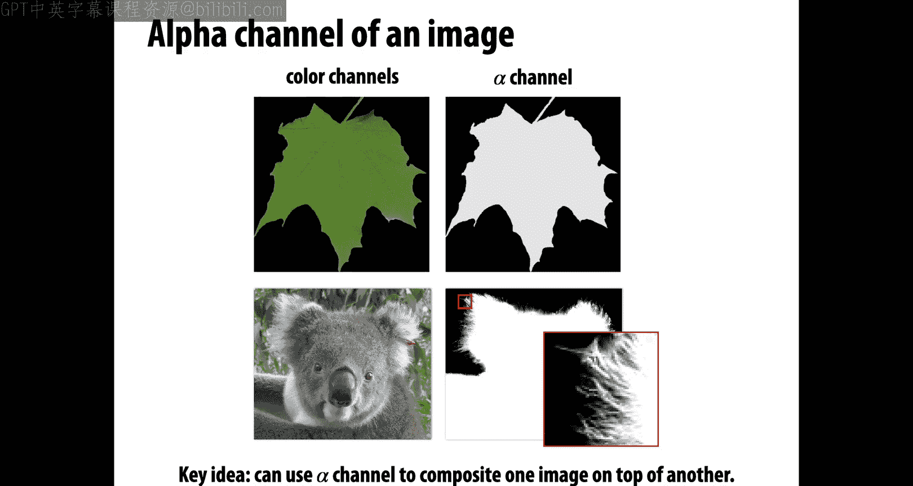

So if you don't treat your color and alpha just right。

 you get these nasty dark halos around the image， so here we have the foreground color。

 this pink ball， we have the foreground alpha。This white area telling us which part of that image on the left is actually the thing we want to show。

 we have the background color， the swimming pool。And you can composite it。

 you can use these different channels， combine them using different formulas to get the composite image。

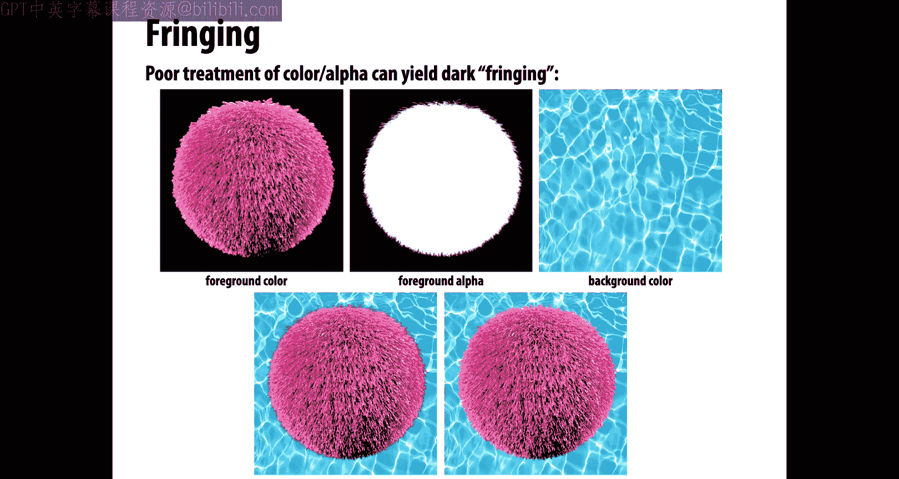

If you do it right， you'll get something like this。

 it looks like the ball is sitting on top of the swimming pool。

 almost as if we had taken that photo originally like that， you know。

 nobody would know that this wasn't the original photo。But if you're not careful。

 you'll get something like this， you'll get a dark halo。Around the parts that are semi transparent。

 and if you watch movies and TV， especially if you watch older movies。

 you'll often see this kind of artifact。And wonder， what's going on there。

 Why is there this obvious artifact that reveals that this wasn't the original image。

So let's look a little bit at the mathematics of how we combine。Different semitrans objects。

 and our basic operation is going to be something called the over operator。

So the idea of the over operator is to composite an image B that has opacity alpha B。

 over or on top of an image A that has opacity alpha suba。So informally。

 this is going to sort of capture the behavior of tinted glass if I blend B over A and B is red and A is yellow and B is mostly opaque。

 then the color I get is mostly red with a little bit of yellow showing through。Conversely。

 if I blend A over B， I'll get mostly yellow with a little bit of red showing through。

Now what that tells you。Is that this over operator is not commutative。

A over B is not in general the same as B over A。And it's really important that you blend things in the right order to get the right color。

If we do this over operator for an image， we get a similar effect。

 so let's say we have our koala with its alphapha channel。And we have a picture of New York City。

Then， okay， here's what the koala over New York City。Should look like。

What actually is the overoperator？

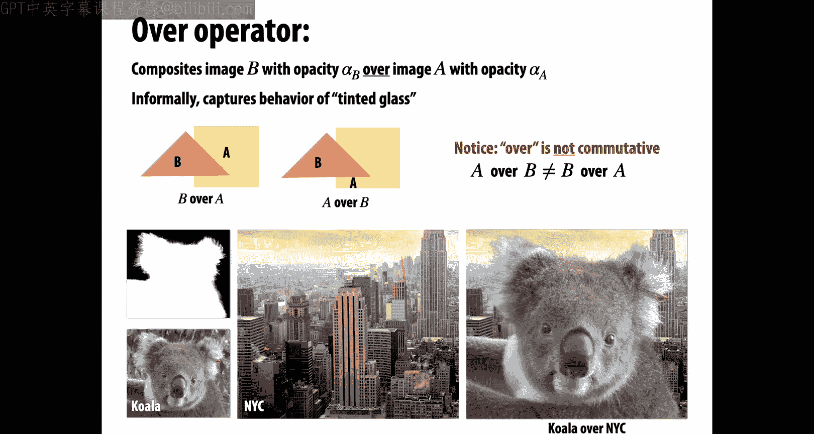

What am I doing to combine these pixel values？Okay， well。Again。

 we want to composite image B with aac D alpha B over image A with aacity alpha A。

 and our first attempt at this over operatorator is going to look like this， so let's say that a。

Is described by three color channels， the red， green， and blue component。Likewise。

 B has three color channels， red， green and blue。Then a simple way to composite would be to say the new color C。

Is。Alpha b times B。So we're saying， okay， the color of B times how much of B should show up？Plus。

1 minus alpha b。Times alpha a times a。 So how much color or light does B let through。Times。

How much of A do we see， the color of a times its transparency？That's very natural。

 that sounds pretty reasonable。Okay， another thing we'll have to do is figure out what the new alpha value is。

So we'll just say that the new alpha value is however much。Of。B， we had， plus， however much of。A。

 B lets through times， however much of a we had。Okay， that's one option。

And we'll see in a minute that this actually results in some kind of fringing artifact。

 some things we don't like。So the alternative is to use something called pre multiplied alpha。

We want to do the same composition operation。But we're going to do it in a slightly different way。

So rather than working with the color values directly。

We're going to multiply or premply those color values by the alpha value。

 so we're going to construct a new color a prime， which is equal to alpha A A R， alpha A A G。

 Al A A B， and we're going to tack on to the end of that， the alpha value alpha a。Likewise， for B。

Okay， so now conceptually a prime and B prime store kind of a darkened version of the original color。

Right， darkened by the alpha value， but they also keep track of。The alpha value。

 So we know how much we darkened。The color by。To combine these two colors。

 we're going to compute a new value C prime equal to B prime plus 1 minus alpha B a prime。Okay。

A similar idea here， we saying。B is going over a， so we're going to show you B。

Which has already been adjusted by alphapha。And then we're also going to show you a prime。

 but modulated by how much B lets through 1 minus alpha B。Notice， by the way。

 that this operation composites alpha in exactly the same way as how it composites the red。

 green and blue channels。 We don't have separate operations for color and alpha。Okay。

 after we're done。Doing this composition， we're going to sort of unpre multiiply to get the final color。

 we're going to divide the color channels from C by the alpha channel of C to get the final color。

Why does this make sense， Well we can think back to how we defined a prime， for instance。

We said a prime we're going to take the color value。

 we're going to darken it by alpha and we're then going to tack on the alpha value。

 so if at any moment we wanted to recover a， the original color we could just divide through by alpha。

 and that's what we're doing with C here as well。By the way。

 does this division remind you of anything， Does this division and adding a fourth coordinate onto our vector。

 does that remind you of anything we've seen before？Well。

 hopefully it reminds you of our discussion of homogeneous coordinates。

Because that's exactly what this is。We're expressing our colors and our alpha values in homogeneous coordinates。

Right， so now we can think of。Colorors as different directions and different opacities of those colors as points along the line in that direction。

And this is going to fundamentally change。The way colors and transparency behave when we blend them together when we do averages。

Okay，So as an example of this， let's try doing some compositing with and without pre multiplied alpha。

So suppose in particular。That we are going to ups sampleample an image。 We have a small image。

 We make it bigger， and then we want to composite it onto a background。 So we have an image B。

There's a very simple image， originally its alpha looks like this and its color looks like that。

 so it's basically just a blue blob， which we happen to have stored on a green background。Okay。

And we can go ahead and upsample the alpha and the color by a factor of two using bilinear interpolation。

 just like we talked about in our previous lecture。

And now we want to compose the blue blob onto a gray background。

So I'm going to go ahead and use that alpha blending operation， the first one。

 the non pre multiplied one。And so I do alpha b times b plus 1 minus alpha b times a。By the way。

 I'm not writing alpha a here because alpha a is equal to 1。

Okay and I get this result and you notice it looks almost right。

 I have a blue blob on a gray background， but there's this green halo around my blue blob。

That's no good。Alright， so what if I go to the other route。

 So what I'm going to do is I'm going to pre multiply。 I'm going to multiply。

The original color by the original alpha。To get the pre multiplied color。

And I'm going to tack on the alpha value， so I have alpha b times b time with alpha B on the end。

I then go ahead and I upsample this pre multiplied color。Okay。

 so you notice that where things were green， that got darkened by my alpha value and I just have black。

And now I go ahead and I do my pre multiplied。Over operation B prime plus 1 minus alpha B A prime andvoila。

 I get the blue blob on the gray black background with no halo。W。Why is that true。

 Why did we get the green fringe when we don't pre multiply。

Why did we eliminate the green fringe when we did premply？

I'll let you think about that and you can try to answer and discuss in the comments。Okay。

So here's a similar problem with using non pre multiplliied alpha， let's go the other direction。

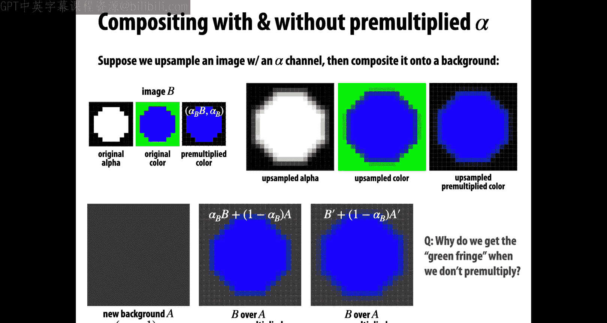

We want to。Down sample of texture， maybe we're going to do this for pre filtering。

 we want to build MI maps， right？But we want to build a mint map of a texture that has an alpha value。

 This is a very natural thing to want to do， right， I want to render leaves in my scene。

 I have trees made of polygons。 I want to draw leaves。As just quads with textures on them。Okay。

 and to do this in a nice way， I want to mimap my texture so I get nice filtering。

So I'd like to build MI mapps like this。What's going to happen if we don't pre multiply alpha。 Well。

 let's see。 So if we're right next to the edge of the leaf。

 then the input color might look like this。 We have green pixels on one side。

 We have red pixels on the other。 The input alpha is。You， 100% opaque on one side。

 it's completely transparent on the other。If we just go ahead in a completely naive way filter the colors。

 we just take the average of the four color values， we'll get kind of this murky brown color。

 if we take the average of the four alpha values， we get kind of a 50% opacity。

 and then if we take this murky brown color and composite it over the white background like we see on the upper right。

Then we're going to get this kind of yellowish color。If on the other hand。

 we were to pre multiply the colors so we multiply color by alpha。So now we get just green and black。

Then we average the color down to just a single pixel， we get a dark green and a 50% gray。Right。

 but remember。That this isn't really a dark green because we have this dark gray。

 So if we divide the dark green by this， this medium gray， that's actually going to multiply it。

 It's going to make it brighter。And then when we composite it over the white background。

 we get this nice light green color， kind of what we would expect to see。

At the edge of our composite leaf。

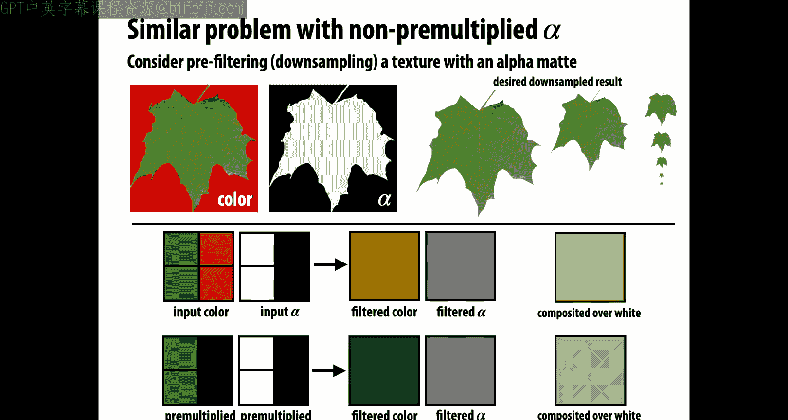

Right， so pre multiied alpha really seems to work well for up sampling and down sampling。

 Here's another。Problem is， if we want to repeatedly compose。Images on top of each other。

 we have lots of semitrans primitives in our scene and we want to draw them on top of each other。

 okay， so let's say for instance we want to composite an image C with opacity alpha C over B with opacity alpha B over a with opacity alpha A。

Well。Pre multiipliied alpha is going to be closed under composition， non pre multiliied alpha is not。

Example， let's say I want to compose a 50% bright red primitive over a 50% bright red primitive where bright red is just 1。

0，0， all red， no green， no blue， and alpha in this case is going to be 0。5。

So if we do this with a non pre multiplied alpha。How does this go？We start out with。A color blending。

So we have 50% times the first bright red color plus 1 minus 50% times 50% times our second bright red color。

 If we do the arithmetic here， we get 0。7500。And our alpha gets blendlended like this， 0。

5 plus 1 minus 0。5 times 0。5 is 0。75。So what is the appearance of this blended image？Well。

 it's going to be a dark red color at 75% opacity。In effect。

 what we've done is kind of blended red with black a little bit。

 and then we draw that at 75% opacity。It's not quite what we expected。

 What if we do this with pre multiied alpha well？Let's just go through the arithmetic there。

 So we have 0500。5。 So we've already。Pre multiultplied by alpha plus 1 minus。5 times the same color。

 I work that out， and I get。Well， it looks like I get the same thing， right， It looks like I get 0。

7500。75。 It looks like I get a dark red with a 0。75 alpha。

 but remember that to recover the original color， I'm going to actually divide by alpha。

 So the color I get is bright red 100。And the alpha I get is still that 0。75。Okay so in this case。

 I get something more reasonable， I blended together two bright red things。

 the color itself hasn't changed， it's still bright red。It's only the alpha that's changed。

 it's increased to become more opaque。So intuitively。

 what happened here is premipliied Alpha did a much better job of separating out the idea of blending colors together and blending opacities。

Okay。So overall， there are some nice advantages to working with pre multiplliied alpha。First of all。

 composing treats all the channels the same we' doing the same thing to color and alpha that could be nice for implementation for performance。

We have fewer arithmetic operations for the over operation than we did for the non pre multiplied representation。

It's closed under composition so if we do repeated over operations。

We're going to carry through the color without distorting it， right。

 that bright red color will stay bright red。It gives us a better representation for filtering if we're doing up sampling and downs of images with alpha channels。

 we don't get this fringing artifact。And also it fits naturally into the raization pipeline we've already built。

 so we've already said homogeneous coordinates are a good idea。

 we're going to work with4 by four matrices， our graphics card is built that way。

 so it's pretty cool that our color blending works out the same way。All right。

So let's go back to this bigger picture。Of how we draw and blend together semitrans primitives。

OkaySo assuming that all of our primitives are semitrans and all of our color values are encoded with pre multiultpled alpha。

 here's a little strategy or pseudocode for raizing an image case we want to update our color buffer at a location X Y with a sample color and a sample depth。

If we pass the depth test， then well。Actually， here's a question。

How should we update the depth and color buffers。We already know how to update color。

 We can just use our over operation that we just talked about with a pre multiplied alpha。

 that's no problem。But what about depth if I draw a semi transparent triangle。

Should I change the depth value， is that the closest thing I've seen now。

 can't I still see triangles that I've？Already drawn through that triangle and shouldn't I care about their depth。

 how am I going to deal with occlusion there？Right， so。

What is an assumption that we're essentially making here。

In order for this code to draw a correct image。What is what is the only situation in which。

This code will actually draw our semitrans primitives in the right way。Well。

 the key word here is the word over。Because we're composing our。Colorors using this over operation。

 we're assuming。That a is over B。That we're drawing things in the right order。

And we're not worrying about occlusion。Only if things are drawn in back to front order。

So you could do this。 You could go ahead and try to draw your scene by first sorting。

All of your triangles， according to their depth from the camera。

But this is annoying for a couple of reasons， for one thing。

 it's just annoying to have to do this sort all the time。

 it's not something actually that's very easy to do on a graphics card。

And also we have to deal with these issues of primitives intersecting each other。

 if we have two triangles intersecting each other， there may be no ordering。

It gives us the right answer。Okay， so in general。Drawing transparent primitives is a real pain。

In the rasterization pipeline and people come up with all sorts of tricks to do this。We。

Idea is to store an additional buffer called an alpha buffer。

That actually does start storing more than one value per pixel， maybe a list of values。

 but you can imagine that starts getting expensive。

RightNow you have different numbers of things at different sample values。

 you don't have really kind of contiguous memory blocks and so forth。

Okay so that's something that people don't really do much。

 maybe you can implement it in your software rasterizer， but it doesn't work too well on a GPU。

A more modern approach is to come up with techniques for order independent transparency。

 so there's things like。Depth peeling is one technique you can go read about， but in general。

 dealing with semitrans primitives is painful in the rasterization pipeline。

And we'll see this is one of the strengths of ray tracing when we get to ray tracing。

 we'll see that dealing with semi transparent primitives is no problem at all。Okay。

So let's still try to put this all together as well as we can。

 so let's say that now instead of just having a list of semitrans triangles。

 we actually have a mixture of both opaque and transparent triangles。

So here's one way we can do this， we can first render our opaque primitives in any order we want。

Using the depth buffer to deal with occlusion。If we pass the depth test。

 that triangle overrrites the value in the color buffer and also updates the。Z value。

 the depth value。In step 2， okay after we're done drawing all of our opaque triangles。

 we're going to disable the depth buffer update。 we're no longer going to change the depth values。

 We're just going to go ahead and render semitrans surfaces in back to front order。

We're still going to check if we pass the depth test。

So if the semitrans triangle that we want to draw is behind an opaque triangle。

 we definitely shouldn't draw it。And likewise， if the semitrans triangle is closer than the opaque triangles that we've drawn。

 we should draw it。To composite the color， we use our usual over operation。

 but the difference now is that we don't change the depth values at all。And as before。

 in order for this to work， we really have to sort the semitrans triangles from back to front order。

Which we can only do if they don't intersect each other。So， that's the。Basic idea。All right。

 so that's it。 So that's the final thing that we had to do to build our rasterization pipeline。

 We needed to know how to finally get our samples into the image。

And now we can think about the end to end pipeline。

 we can think about everything we've learned in the past few lectures on how to build a raization engine。

So the most important thing to remember is what is our goal， what are we trying to do here？

We're trying to turn some inputs into a final image。

What are the inputs really here are a pretty complete list of inputs， our inputs are。

A list of positions for the corners of a triangle。Right， so we have。Sequences of three coordinates。

 each of which specify a triangle。And we have corresponding texture coordinates。So for every vertex。

 we also have UV coordinates。And we have a texture map that we're going to look up into like this brick texture map。

We might have an object to camera space transform， so something that tells us effectively what is the transformation we should apply to our objects to make it look like we move to the camera。

We can represent this by a 4 by four matrix in homogeneous coordinates by the way all of these positions are also in homogeneous coordinates。

We have a perspective transform， something that tells us how would we like to project from？3D to 2D。

 would we like to do an orthographic projection， Would we like to do a perspective projection？

And we also need to know something very basic， just the size of our output image。

 the width and the height。That's it， that really is something that is sufficient to describe a fairly interesting scene。

And in fact， at this point， we have all the tools we need to turn that data， that discrete data。

 pretty simple stuff into a beautiful rasterized image。So let's review that process。

 what are we going to do？Well， the first thing to remember is we're just going to send one triangle at a time down the pipeline。

So at any moment， our rasterurization pipeline knows about three positions。X，Y。

z and two texture coordinates UVV。And the camera and perspective transform okay。

What do we do first to each triangle， we transform the triangles into camera space by applying the inverse of the camera transform。

Then we apply our prospective projection to transform these。3D vertices into our， well。

 we go to our normalized coordinate space into this cube。

 so we take our view thrustum and turn it into this cube。We perform clippings。

 we discard tris that lie outside the unit cube。If they're completely inside the unit cube。

 we keep them。And if they are partially contained in this cube， well， we have to do a little work。

To cut them up into smaller triangles that are contained inside the cube so that we can keep just working with triangles contained in the view。

Okay， so now we know about all the triangles that we're actually going to see。

 we can go ahead and transform them into 2D coordinates by performing a homogeneous divide。And。

That leaves us with points that are in the square from minus 101。

 so we still need to stretch this out by the width and the height of our image and probably we need to flip this upside down because of the different conventions for what up means in image coordinates and our normalized coordinates。

Okay。Now we're onto the business of rasterizing this 2D triangle。And in fact。

 before going through each individual sample， we can compute some data that will be used for every single fragment or every single sample point。

 so we know we're going to need to do lots of checks with the triangle edges are we inside or outside these half planes so we can write down the triangle edge equations and attributes and so forth。

 basically look at our code that does the rasterization and say is there something that's getting recomputed over and over and over again for every sample that we could just pull out of that loop and compute once ahead of time。

In fact， that data is going to get us our verycentric coordinates that we're going to use for interpolation。

Okay， so now we go through our samples， we evaluate all of the attributes。Right。

 any attributes that were。Interolating and we check for coverage。

 is the sample contained in the triangle or not？Wei。Then have our interpolated texture coordinates。

 we can use those to look up into our texture map。Maybe if we want to do filtering。

 we also go through this whole process of generating Mitmps and so forth and computing Mimap levels。

 but at the most basic level， we just use the UV coordinate to look up a pixel in our texture map。

Grab it using bilinear interpolation。Once we know what color this sample should be。

 we actually have to figure out should we even bother writing it into the color buffer so we perform a depth test。

If the thing that we're drawing is closer than anything we've seen before。

 we write the new depth into the depth buffer， we write the color into the color buffer。

 otherwise we do nothing。Right， so we update the color buffer if the depth buffer。Test past。

 and that's it， we've written values into our image。

Now we just repeat this process for all the remaining triangles in our list and we're done。Okay。

 and at this point。All of those steps should feel pretty concrete to you。

knowMaybe we didn't go completely into the details of some of the things like clipping。

But from the lectures you've seen， you probably can go back and implement from scratch a basic 3D ra riseizer。

Pretty cool。In fact， the thing that you now know how to implement is not so different from。

The true Open GL or direct 3D graphics pipeline that's used in modern graphics hardware。

So if you go and start reading about this idea of OpenGL and how GPUs are designed。

 you will find that it is very， very similar to what we have been discussing here in class。

You have input vertices， they go through some vertex processing stage where they get transformed in space。

These then generate primitives which get rasterized。

 those fragments get blended into the frame buffer in various ways， and you get an output image。Okay。

There's a lot that's been added to this graphics pipeline over the years。

 and if you do start going and learning about this。

 you'll encounter all sorts of funny things like geometry shaders and tessellation shaders and things that don't really sound like what we've talked about。

 but what you should know is that at its core。The modern restization pipeline and pretty much any real time restorationization pipeline you encounter will be very。

 very much like what we've discussed in this class。

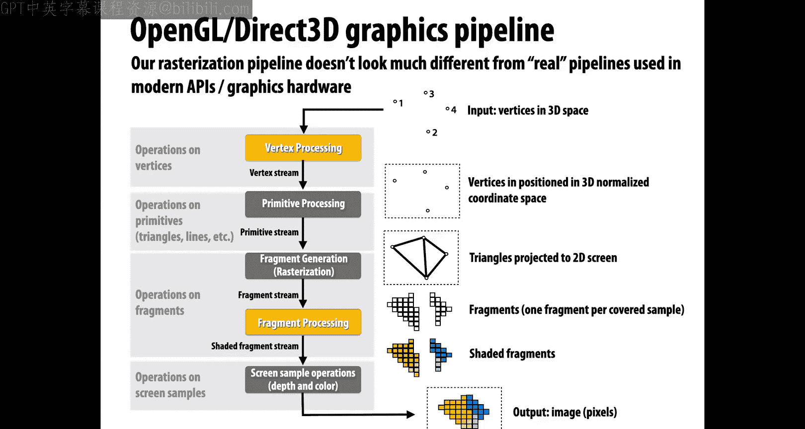

The other thing that's。A bit different is that， well。

The goal of these reurization pipelines is to render scenes with extremely high complexity。

They need to render thousands and millions of triangles with complex transforms and shaders。

 and you have really high resolution outputs。Right。

10 megapixels with super sampling if you're doing this for a VR headset。

 you're trying to pump out frames hundreds of times per second。And so。

These RA rises are not going to be implemented in software。

 people aren't writing them on their CPUs like you're doing for this class。

 but they've actually been baked into hardware。These days。

 this hardware comes in many different flavors， you could have a discrete GPU。

 a real card that you buy and you open up your computer and put it in to make your graphics go faster。

But actually， every CPU you buy these days is going to have in some part of the chip。

 an integrated GPU。So just a little piece of the chip area that serves the function of running the rasterization pipeline。

And same deal with cell phones。 If you have a smartphone， it's got a little chip in it。

 probably it has an integrated GPU。

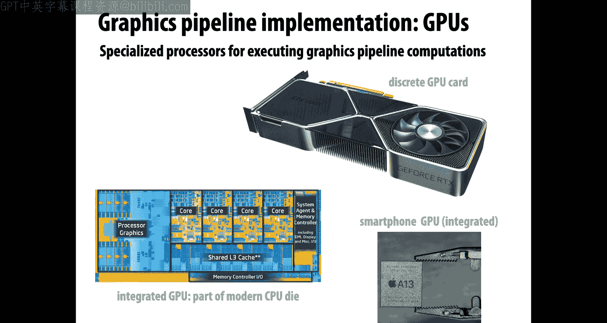

If we take a little closer look at these chips， they look something like this。

 so GPU is really a heterogeneous multi core processor。So it's not just a big。

Bunch of CPUs glued onto a single chip。 It also has some highly。

 highly specialized hardware that does some of the operations that you now know and love。

 It has hardware for doing biline filtering of textures。It has hardware for clipping triangles。

 it has hardware for doing blending operations like the over operation and so forth。

And this is actually a pretty significant part of the chip area if you are running your GPU。

 if you're using kind of a general purpose language like Kuta or OpenCL。

 you're actually only using a fraction of the chip's power。

 a lot of that power is still captured by these fixed function units。

So although GPUs have gone more and more toward programmability and toward flexibility。

 they still benefit from having some very specialized components。

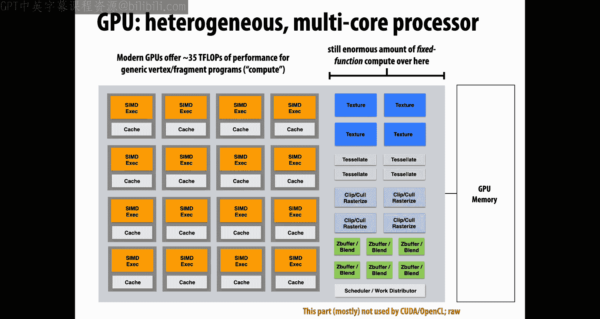

Okay， and so that's kind of the evolution of the modern rasterization pipeline。

 there's been a trend toward more generic， but still highly parallel computation。

The different stages have become more and more programmable。

 so what transformation gets applied to your vertices。

 do you just do the camera inverse transformation or do you do something else while now the programmer can tell the card what to do。

How do fragments get shaded and so forth？And even more flexible scheduling of stages。

 so rather than just going linearly down the pipeline， you can now tell the GPU， hey。

 take the data that you computed in this stage and actually feed it back to an earlier stage of the pipeline。

And so people have thought long and hard and been very。

 very clever about the design of these graphics chips。Also， as much as。You know， the， the idea is to。

Go generic and just process triangles。 over the years， people have realized。

 you know there are other rendering algorithms that are very， very useful， in particular。

 the ray tracing algorithm， which we're going to talk about later in the class。

 It's a completely different way of looking at image generation。That has some very。

 very important benefits， and so finally， just in the last few years。

 people have started to build this idea into graphics hardware。

 so now the graphics hardware also has a dedicated ray tracing pipeline。

And the images that you can generate with this pipeline are absolutely stunning。

 so here I'm going to show a demo。

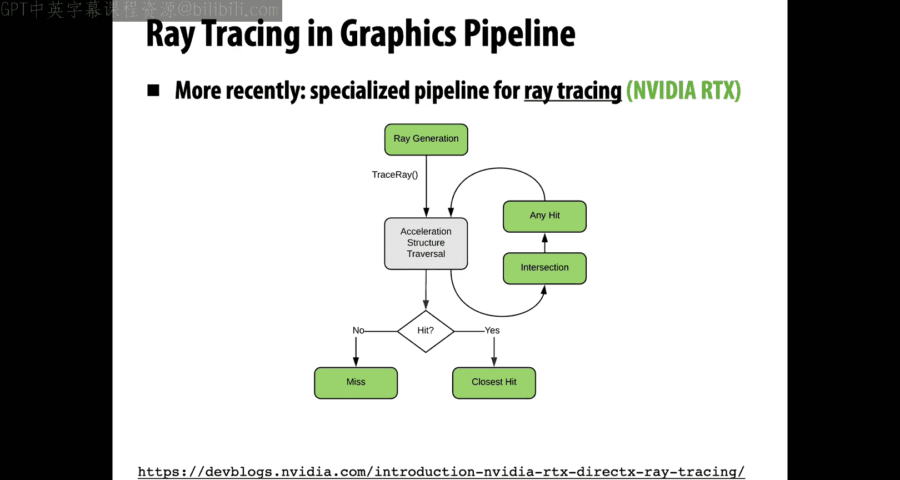

🎼From NviDdia。🎼Of。Rendering things in real time。 and I think you look at this and think。Okay。

 this looks like a marble rolling around is this really so impressive。

 well the thing to realize is that all of these lighting effects， all these shadows。

And the light bouncing off various surfaces is all being done。In real time。

And this is stuff that you really can't pull off very easily with raization。

 you can pull various tricks to kind of get these effects。

But to get the true physically based appearance， you really need this。

rayay tracing technology and it'll be really exciting to see what happens with this in the coming years in terms of real time graphics。

So what else do we need to know to generate images like these。

 like the ones that we see when we go to the movies？

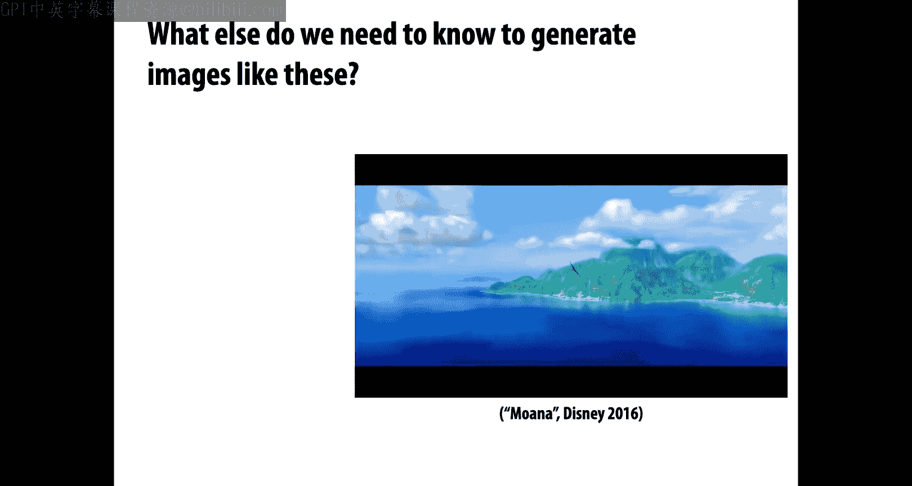

We've hit a lot of topics， but we still have a long way to go。

 so we still need to talk about geometry。How do we describe complex shapes so far。

 we've just been dealing with individual triangles and we don't have any idea how to model those triangles or make them look interesting。

We need to talk a bit about photorealistic rendering。

How does light actually interact with materials to produce color， how do we describe materials。

 how do we describe light？

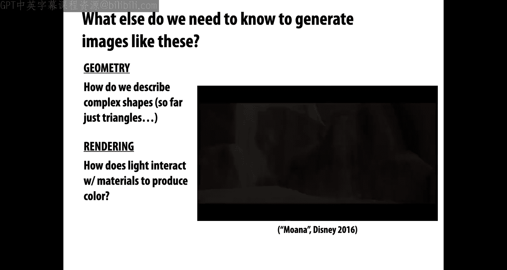

Right。And。Animation， how do we describe motion？We've talked a little bit about digital encoding of shape。

 we at least understand the idea of vertex positions and triangles but。How do I。

Digally encode the way things move。

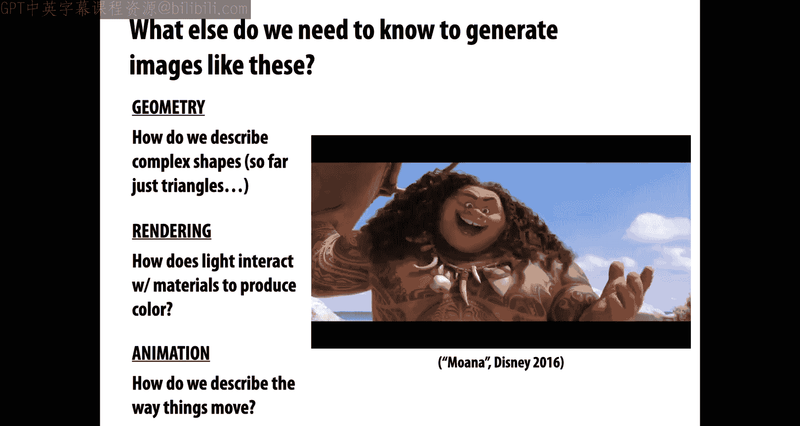

So here's a little glimpse at our near term course roadmap。

Next time we're going to start talking about geometry and then we're going to move on to materials and lighting and photorealistic rendering and finally near the end of the course we'll talk about animation。

All right， so that's it for Rasterization。 Talk to you next time。

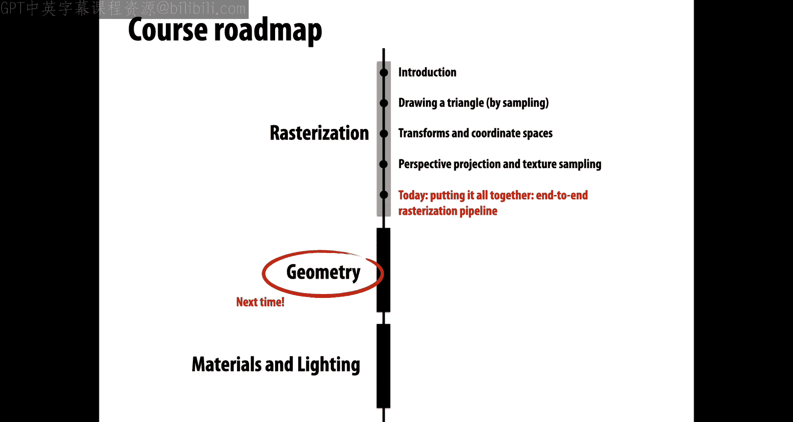