# CMU《计算机图形学｜CMU 15-462  COMPUTER GRAPHICS 2021》中英字幕 p10 -10-Lecture 09_ Introduction to Geometry -BV1H3NBemE5E_p10-

Welcome back to Comp graphics， so we are done with our discussion of rasterization and we're moving on to a new topic of geometric processing and geometric modeling。

So。In the long term in this course， what we want to do is work on increasing the complexity of our models。

 going from very simplistic models like our cube creature that we can make by just applying simple linear transformations to a cube to things that look a lot more like people in the real world。

 things that have a lot of complexity and richness and interesting materials and so forth。

In this next little bit， we're going to talk specifically about how to add geometric complexity。

 so how do we add interesting curves and wrinkles and details to the shape of our objects？

Okay so let's take a step back， I think one thing we should think about is what is geometry when people hear this word they might think back to their high school class on geometry and think oh yeah geometry that's that's something about two column proofs so I'm trying to。

Dedduce or prove something about angles and triangles and so forth。

This is not geometry okay these are useful and important facts about geometry。

 but this is really not at the core of what geometry is。So what is geometry。

 we can look at this from from a linguistic point of view。

 geometry really means what geo is like the earth and me is measured。

 so really geometry came from people trying to make measurements of the Earth trying to figure out where they are how to make maps and so forth in general we could say geometry is the study of shapes。

 sizes， patterns and positions that's kind of the dictionary definition another definition I like is to say that geometry is the study of spaces where some quantity like lengths。

 angles and so forth can be measured and kind of depending on which quantities you look at。

 that's the kind of geometry you're studying。Actually， geometry。If we go back in history。

 people have been looking at it from the beginning in terms of things that look like the kind of polygon meshes we use in computer graphics。

 from the beginning， people had often some pretty discrete models of geometry。

 even Plato said that the earth is an in appearance like one of those balls which have leather coverings in 12 pieces。

 so he was saying yeah， the earth is kind of like a dodeahhedron， rather than talking about a sphere。

So how else can we describe the Earth， how can we describe a given piece of geometry。

 this is really at the core of connecting geometry to computer science。

 we need to talk about how to come up with digital representations。

 how can we use digital data to encode shape。Okay， well， what are just forgetting about digital data。

 what are just all the ways we can think of to describe a given shape like this shape that I have here on the screen。

This red curve。What would you， how would you describe that？Okay。

 maybe the most basic thing is you'd give it a linguistic description。

 you would just say it's a unit circle。And there are certainly。

Programming languages in which you specify things that way， if you're doing something in a SVG file。

 you might literally type the word circle to describe a circle。Okay。

 but that's a pretty special case。How else might you describe this circle mathematically。

 Can you think of any formula you might use？Okay， well。

 one common thing is you could say the circle is the set of all points xy。

 such that x squared plus y squared is equal to 1。Rin。That's a sort of implicit description。

 it doesn't tell us which points are in the circle。

 but it does tell us how to decide if a given point is in the circle。

What's another common formula that you might use to describe the circle？Well。

 we could also write this in terms of。Sine and cosine， so the circle is the set of all points。

 cosine theta， sine theta for theta in 0 to2 pi。that gives us our X and Y components。Okay。

 and that's what I would call an explicit description of the circle。

 I plug in a parameter theta and I get out a point。

 I'm not just testing if the point is in the circle。What are other ways we can describe a circle。

 Can you think of other。Encodings for the circle。Well， actually there are a bunch。

 so for one I could think of this in sort of dynamic terms。

If I have a particle or an object like the earth orbiting the sun。

I could write down some differential equation that says， what's the path traced out？By that particle。

 what's the solution to that differential equation， the solution to that equation gives me a curve。

I could also have a discrete representation。Right， so I could。Approximate。

The circle by a polygon kind of like。Plato approximated the Earth by a doecahedron。

 and as I add more and more edges to my polygon， I get closer and closer to the original circle。

I could also talk about the circle in terms of symmetry so I could say， well。

 the circle is this shape that is preserved by rotations if I apply a rotation of the circle。

It doesn't change。Right。That almost pins down the circle。

 I could also talk about other attributes of the circle， the curvature。

So I could say the circle is the unique planar curve with curvature equal to。Plus one everywhere。

Okay。And then there's other things that you might not think about。 there's for instance。

 what I would call a tomographic description so if you go and get a。CT scan。

What that's really reading is what is the total density of the object in the CT scan along lines through space？

For a circle， this is going to be constant for other shapes， I get some other description。Okay。

 so so the point in saying this is。At any moment， for any shape， there may be many。

 many different ways of characterizing that shape of communicating to somebody what shape that is。

And so it's natural to ask， given that we have all these different options。

 what is the best way to encode geometry on a computer？Okay。

 and I think what you'll discover if we start to look at a bunch of different shapes is。

There doesn't really seem to be one best way to do it。

 and the reason is because if we go out into the world and look at all the different kinds of shapes we might want to represent or model。

Boy， there are a lot of different kinds， there are a lot of different things going on。

 so we might go into our kitchen and find some glassware and think， okay。

 this is actually not so difficult to represent。 We might have a curve that gets swept around a circle。

Okay， and then we still have to think a little bit about how would we represent that curve if we look in the hood of our car。

 if we look at an engine， we get something that maybe it has components that we could maybe describe in a similar way。

 but actually have to assemble these components， take intersections and unions of these components in some interesting way。

Other important geometry that we encounter in our daily lives has a very different character so for instance。

 faces are extremely important。 Fs convey all sorts of information about who somebody is and how they're feeling and what they're thinking and so for one thing this geometry doesn't look at all like the glass where we find in our kitchen the same kind of descriptions really won't work well and for another it's really。

 really important that we get the description of the geometry right just a very。

 very subtle variation in somebody's facial expression can really change what they're communicating or what they might be feeling So if you imagine you're trying to represent geometry for some kind of telepresence online communication it's really。

 really important that you get the geometry right。For yet other applications we might have very different demands on our geometry。

 so for instance， if I'm trying to simulate dynamic cloth blowing in the wind。

Then well on the one hand， there are some simplifying assumptions we can make based on the constraints。

 so for instance cloth doesn't stretch very much， but on the other hand。

 I somehow have to be able to handle the fact that the shape of this thing is changing a lot over time。

This gets even more important for things like liquids and fluids。

 because now not only is the shape changing， but actually you might have pieces breaking off or droplets merging back together to describe the surface of the water。

Right so you really， really need different descriptions of geometry here。

 Another challenge you run into is geometry in the real world can be extremely complex。

 so this is just one small corner of this giant temple。

And you'd have to think about how do you deal with detail at vastly different scales。

 simply having just one big mesh is probably not the right solution。

We talked a little bit about intancing， for instance， when we talked about spatial transformations。

 so you might want to start to think about solutions like that。Also。

 there's a question of kind of dimensionality。One common model for geometries。

 we're going to model it as a two dimensional surface， kind of the shell of a shape。

But a lot of the shapes we encounter have a little bit more of a volumetric nature， so for instance。

 the fur on this Hungarian sheep dog has been braided or has just ended up in this interesting way。

 should we really be using a surface model for that that seems really complicated is there some volumetric way of doing it。

Getting the shape of geometry right is also really。

 really important in terms of describing its function。

 so especially if we're thinking about things on a microscopic scale。

 we're thinking about proteins and viruses and so forth。

 shape is everything the shape of a cell will determine whether it functions in a healthy way or not。

 the shape of a pathogen will tell you how it interacts with cells and so forth。

So it's really a jungle out there。There's no one right way to represent geometry because we have so many different kinds of geometry and so many different things that we might want to do with that geometry。

Gometry is hard and this is something that even people who are real experts in computer graphics encounter。

 this is a great quote from David Brov， who's a senior research scientist at Pixar animation Studios。

 he says， I hate Meshes， I cannot believe how hard this is geometry is hard。And that is true。

 Handing all the kinds of geometry that you might want to work with is a real challenge。

 but we can start to break this down and get some basic ideas that will help us think about and work with geometry。

 So as we've said， there are many ways to digitally encode geometry。 Today。

 we're going to kind of break them down into two big categories。 One is explicit representations。

So explicit representations are ones that immediately tell you， where are some points in this object？

The most basic example perhaps is a point cloud， I just have a list of points。

 these points belong to the object。Okay that's a very simple representation， it has its drawbacks。

Another one is a polygon mesh， this is kind of how we described our cube。

 we didn't just say here's some points in the object but we said here's some points and here's how they're connected up。

We also are going to look at some more sophisticated versions of explicit geometry like subdivision surfaces and nervebs。

 and there are a lot more out there。The other major category is implicit descriptions of geometry。

So in contrast to explicit representations， implicit ones don't actually tell you where any particular point is in the shape。

They simply give you a test to say，A I in the shape or not？

And we'll look at lots of examples of those level sets， algebraic surfaces， L systems， and so forth。

Each of these choices is best suited to a different task or a different type of geometry。

And as you do more and more computer graphics， you'll start to get a sense of which representations are appropriate for which problems and you'll also find yourself often having to convert back and forth between different representations。

 I have an explicit representation， I need to turn it into something implicit or the other way around。

Okay， so let's start with implicit representations。

We said the basic idea of an implicit representation is that points aren't known directly。

 but instead they just satisfy some relationship。So we've already seen one example with a circle。

 or we could say with a sphere， the unit sphere is all points or all coordinates x，Y，z。

 such that x squared plus y squared plus z squared is equal to 1。Okay。

That doesn't tell me how to find three numbers， X， Y， and z that satisfy this equation。

It just gives me a test if I have an X and a y and a Z。

 I can plug them into the left hand side and see if it's equal to 1。More generally。

We could say an implicit representation looks like this， an implicit function。F of X，Y。

z is equal to 0， four points that belong to the shape。So on the bottom here。

 I've plotted some interesting function， it's negative in part of the plane。

 it's positive in other parts of the plane， and exactly where it's zero。Is where the shape lives。

Okay， so how do we describe such functions F？There are lots and lots of different ways to express a function。

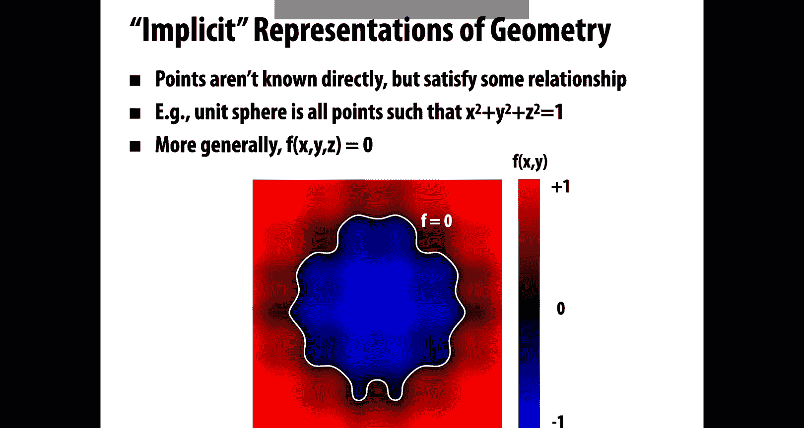

And for that reason there are many different implicit representations that are used in computer graphics。

 algebraic surfaces， constructed solid geometry， level set methods， b surfaces， fractals。

 we'll actually see a bunch of these later。But before getting into any particular representation。

Let's play a couple games that help us understand。The pros and cons of this way of thinking。Okay。

 so we're going to play this game where I think of an implicit surface。Okay。

 so I have some function in my head， some function F。That describes my shape。

 I know wherever that function is equal to0， that's where the surface exists。

And I would like you watching this video to please。Read my mind。And find a point on this surface。

 please just。Shout out in front of your computer screen。

 the coordinates for some point that satisfies the equation that I'm thinking of。Okay， so you did it。

You found a point or。Or did you give up， there wasn't really much to go on there。

So actually the function I was thinking of is the simple function F of X， Y， z is equal to x minus 1。

23。So where is this function going to be equal to zero。

 it's going to be equal to zero for any point whose x coordinate is equal to 1。23。

And so that's going to describe a plane。That's shifted along the X axis from the origin。Right。Okay。

 so what was the point of doing this？The point is that。

Working with implicit surfaces makes some task hard if I just have a black box function F。

 and I know nothing else about it。It's really， really hard to even find or name a single point on the surface。

So if I want to draw the surface， let's say I wanted to draw the surface by just sampling a bunch of random points on the surface and plotting them on the screen。

 this would be really hard to do with an implicit representation。Okay， but。

Implicit surfaces are not useless， let's play a different game that hopefully helps us understand where they're valuable。

 right？So we're going to play a game this time I have a different surface in mind。

 I'll tell you this time this this time the surface is。F of x， Y。

 z is equal to x squared plus y squared plus z squared minus-1。Okay so you should know what that is。

 that's a unit sphere。Because when f is equal to0， I'm on the sphere。

I want to see if a given point is inside the sphere。so in particular。

 I would like you to please check， is this point three fourth， one half， one fourth。

Inside the unit sphere or not。Go ahead and take a second to do that calculation。Okay。

 all you had to do here， pretty straightforward is。Square the three entries。

 we get 916s plus 416s plus 116， we add them up。And we get seven8s and7/8s is less than1。

 so the function evaluates to a negative value。 Yes， we know。That were inside the sphere。Right。

 really， really easy。So implicit surfaces make other tasks。

Like checking if we're inside or outside the surface， incredibly easy， that's nice。

 that seems like a useful basic operation to be able to do， right？Okay。

 now let's look at the other side of the coin， so let's look at explicit representations of geometry。

So in this case all points are given directly in some way， so for instance。

 if we look again at the sphere rather than x squared plus y squared plus z squared。

 minus1 is equal to0。We'd have a formula like this， we'd say okay， for all values U and V。

Were used between 0 and 2 pi and v's between0 and pi， cosine U， sine v， sine U， sine v and cosine v。

Is a point on the sphere。It's explicit because I know immediately how to get points on this here。

 I just plug in any。Valid value of U and V。And it'll spit out a point on this sphere。Okay。

More generally， we can think of explicit。Representations are explicit functions this way。

If I want to describe a surface in three dimensional space。

 then I have some function F that takes two parameters， U and V2，3 coordinates x， Y， and Z。

In general， I might not just have one of these functions to describe the shape。

 but I might have let's say， a collection of such functions， so if we think about a triangle mesh。

 for instance，And we think about berycentric coordinates。

Then what we really have is one little map F for every triangle that says。

 if I plug in my very centric coordinates， what are the。XYZ coordinates in space。

Okay so that's one simple example， in general there are lots of different explicit representations of geometry and graphics。

 there are triangle meshes， polygon mes， subdivision surfaces， nerves， point clouds。

 we'll talk about these in a bit but first let's play a game。

So I'm going to give you an explicit surface。And I would like you to sample some points on this surface。

Okay。So in fact， it's going to be the same one we saw before。My surface is this plane。

My explicit expression for this plane is F of UVV。Is 1。23 U V。

 so please in front of your computer as loud as you possibly can shout out some points that are on this surface。

Okay， so hopefully it was a lot easier this time around。

 all you had to do was pick any number you like for U and any number you like for V。

And you got points on the surface。Right， so we can see that。Explicit surfaces really make some tasks。

Very， very easy if I just want to sample points on the surface to plot it， no problem。

 I plug in some parameter values， I get those points， I draw them on the screen。All right。

 so let's play one last game。So this time I have a。Another explicit surface。

 F as a function of U and V。And I would like you to check。

If a given point is inside or outside this surface。So in particular。

 my surface is f of U v is equal to 2 plus cosine u， cosine v， 2 plus cosine U sine v， sine U。

 which describes a taurus。And what I want to know is。Could you please check for me。Is this point1。

96 minus0。390。9 is that point。Inside the touristrus。Okay。

 this was something that was really easy to do with our implicit surface。

 but this time it's really not so obvious how you would do this。I can't just plug something in。

 right， I have three numbers， and I only have two parameters。

Maybe I can try to solve for a U and a V such that I get these three numbers。

 but what if that's not possible？That would only be possible if it's sitting right on the surface。

So actually turns out for this example， it just happens to be the point is。Not inside the tourrus。

 okay， it's pretty hard to see。And so what we get from this is that explicit surfaces make other tasks hard like inside outside tests。

So for implicit surfaces， they were hard to sample， but easy to check if you're inside or outside。

 for explicit surfaces， it was super easy to sample， but really hard to check for inside or outside。

And so the conclusion that we can draw from this little thought experiment is that， well。

 some representations work better than others depending on the task。Right。Also。

 different representations will be better suited to different types of geometry。

So let's actually take a look now at some common representations that are used in computer graphics。

So going back to implicit representations， one of our most basic ideas we've seen a couple of times now is to think of a surface as a zero set of a polynomial in the three coordinates。

 X， Y， and Z。So we've already seen the example of a sphere x squared plus y squared plus z squared is equal to 1。

If we work a little harder， we can figure out a formula for the Taurus。

 so if capital R is the outer radius and little R is the inner radius， we can look for points xyz。

 such that R minus squared x squared plus y squared squared plus z squared is equal to little r squared。

And if we work really， really hard， actually I have no idea how somebody figured this out。

 but if we want to draw this kind of balloon heart shape， well。

 we can look for points x squared plus 9 y squared over 4 plus z squared minus1 cubed equals x squared z cubed plus 9 y squared z cubed over 80 that's obvious。

 right？No， not at all， right， really， really hard to cook up these implicit functions。

And what if we want to work with more complicated shapes。

 things that aren't just a simple sphere or taurus or heart even？It's very。

 very hard to come up with polynomials that describe these more complicated shapes。

Maybe there's an algorithmic procedure to do it， right。

 but it's not something you're going to do by hand。

 it's not the way you're going to directly model these shapes。So。

There are other ways we can build up implicit descriptions。

One really popular one is something called constructive solid geometry。

 and the idea is to build up more complicated shapes using Boolean operations。

 So let's say we already have some very basic shapes。

 like spheres and cylinders and torae and so forth。

We're going to take those shapes and do things like take a union or an intersection or a difference。

And so that already adds some nice complexity， I can carve out a piece of a sphere from the cylinder for instance。

And if I want to take this idea even further， I can start chaining together expressions one on top of the other。

And get this kind of tree of Boolean operations that describe my shape。

So I could union together three cylinders to get this kind of triaxxial figure。

 and then I could take the intersection of a sphere and a cube to get kind of a rounded cube。

 and then I could subtract these three axes from my rounded cube to get this final shape。Okay。

 so this doesn't let me model very organic looking things。

 but it is good for modeling kind of hard edged machine parts。

 which is something that people really do with Booleion operations。

If we want to make things a little more organic， a little softer， then instead of Booles。

 we can gradually blend surfaces together。So here I have these two spheres and as they come closer together rather than doing a hard union。

 I'm having them kind of attract each other a little bit。

 it looks like a water droplet merging together maybe。How do we actually do this。

 this is maybe easier to understand in two dimensions。Okay。

 so let's think of an implicit function given by a Gaussian。 So if we have a Gaussian phi sub P of x。

Equals e to the minus x minus p normm squared that's giving。

AKin of a bump centered at the point P and it falls off to zero as we go further and further away from P。

And then we can take a sum of two Gaussians centered at different points。

So something that looks like this。Okay。Our implicit function is actually going to be this F minus a constant。

So wherever sum of these two Gaussians is equal to the constant。

We're going to get some curve and we can visualize that by imagining we slice。

The height function F by different constants， 0。504。3。

And what do you notice if you look at where this white plane intersects these blue bumps？

What happens to these curves as we change。The constant value。Well。

 it looks a lot like our image up above initially we have these two circles that are distinct and separate。

And then as the plane moves down， there's this moment where they meet。And as we move it further down。

 we get this。Kind of peanut shape where they're starting to merge together。Right。

So that's a good way of thinking about how these blobby implicit surfaces work。

 except we might be starting out in three dimensions。

 and you can imagine this sort of height function is in four dimensions。Right。In general。

 we might not want to just mix together points， but we might want to mix together other shapes。

 and a useful object is the distance function associated with that shape。

 so the distance function just gives at each point of space the distance to the closest point on the object。

Using these two distance functions， we can blend together lots of different shapes we could take a square and a circle。

And we could combine them in some way to get a blend between the square and the circle with a similar strategy to what we just did for points and there are a lot of different possibilities for what functions we use for blending。

 a simple one is， while we just plug this distance into a Gaussian。

 we sum up the Gaussians just like we did before， and we subtract off a constant maybe one half。

The appearance of the blended shape is going to depend on just how we combine these functions。Okay。

And just as a little thought exercise。Let's say that we didn't want a smooth blend。

 but we want to go back and just have a hard Boolean union of these two shapes。

So how might you combine their distance functions to get this Boolean union？Well。

 one simple thing you can do is you could just take at each point x the minimum distance to either of the two shapes。

So f of x is min of d1 of x， d2 of x。So if x is a point on either of the two shapes。

This is going to be equal to 0， right if x is on。Shape 1， d1 of x evaluates to0 if x is on d2。

 d2 of x evaluates to 0。So you know that you're going to get the zeros of both of those shapes。

 actually， in this particular case， something especially nice happens。

 and the minimum of the two distance functions for these two separate shapes actually gives you the distance function for the Boolean union of those shapes。

Okay， so this is something you can do to build up more complicated geometry。

 start out with a bunch of simple components， blend them together， combine them in various ways。

 and if you're a real real expert at this you can use this idea to build up some really amazing geometry this is a video made by somebody who's a super expert in this idea of distance functions and blending and combining them together and you can see kind of the progression as more and more shapes are added and combined we start to get this。

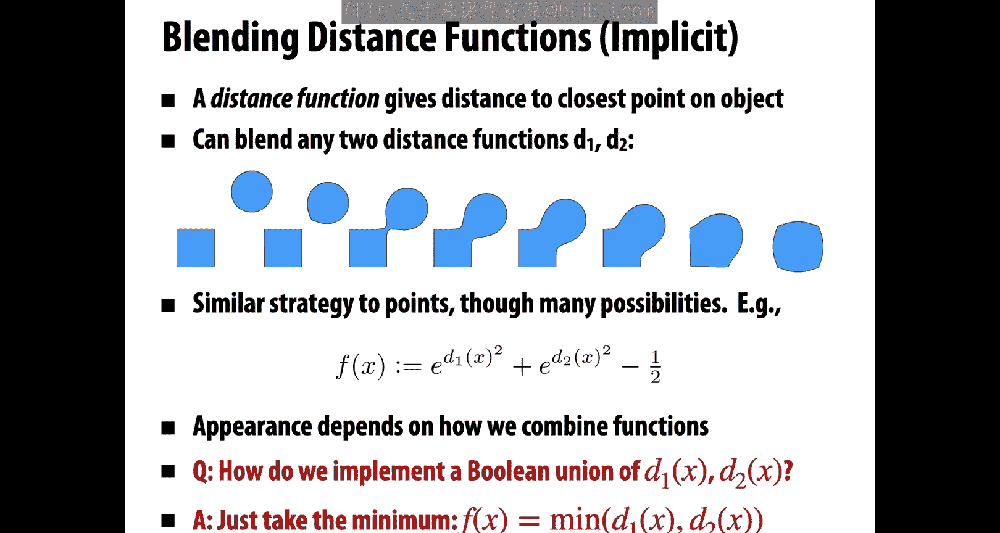

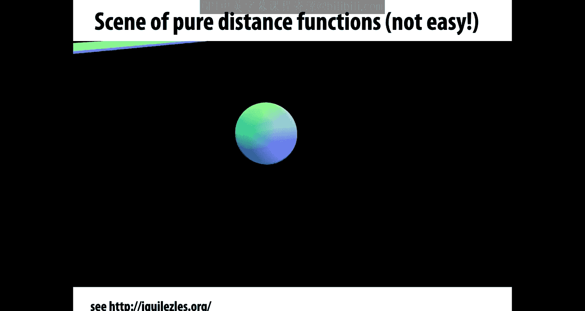

Interesting character bouncing around this kind of strange looking world。Okay， but this is not。

 I would say how most people would approach describing geometry。

 it's really hard to cook up beautiful looking stuff by combining formulas and writing this all out explicitly。

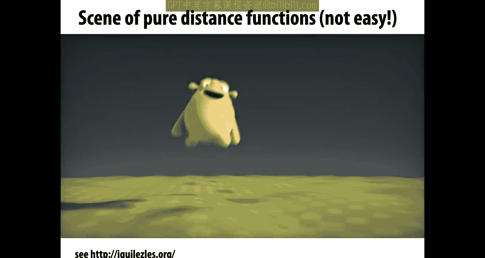

That being said， there are still other ways to use implicit descriptions of shape to model some very complicated geometric objects。

 so we've seen that implicit servicess have some very nice features like they have this nice way of merging and splitting and maybe smoothly merging and splitting different shapes。

 but it can be really hard to describe complex shapes in closed form。

So an alternative is rather than using a formula to describe our implicit function。

 we're going to use a grid of values that approximate the function that we want to draw。

 so here we have a grid of values where some are negative。

 some are positive and the surface is found wherever the interpolated values are equal to zero。

So you can imagine maybe you bilinely interpolate these values。

The points where those interpolated values exactly equals0 is where this black curve is。

And this representation provides much more explicit control over the shape。

 This is a lot more like a texture map。 you could really imagine going in and painting with some kind of interesting brush right some brush that's positive inside and negative outside or vice versa to draw。

Implicit shapes。Of course， no representation is perfect and there are definitely some drawbacks with this one。

The biggest one relative to these closed form expressions we were just looking at is that you run into problems of aliasing。

You've now sampled your geometry onto a grid。If your grid is not fine enough or if you have very。

 very high resolution features， these might get lost or you might have to do sophisticated sampling and filtering to reconstruct the shape in a nice way。

That being said， these grid based level sets are extremely important for lots of real world problems。

 for instance， if you have medical data， CT or MRI， then。

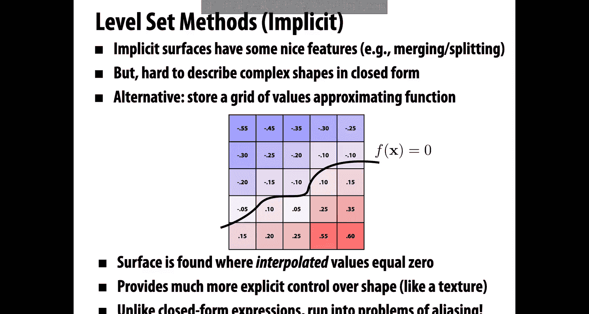

Level sets。Regions of constant value might describe， let's say constant tissue density。

 so this would let you extract things like the bones or the blood cells or other important features from a medical scan。

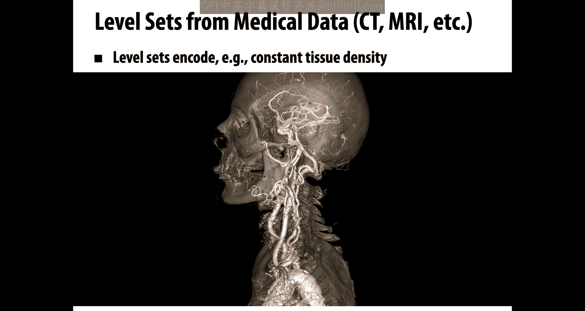

Level sets also show up in physical simulation。So one common example is you want to do fluid simulation。

 and so you have a level set that describes where is the air and where is the water。

 maybe it's negative inside the water and positive in the air。

 and where that function is equal to zero is exactly where the surface of the water should appear。

Lo of beautiful examples there。Another big drawback of working with these explicit grid based level sets is。

 boy， now you have a lot of storage。Before if I just need to store a sphere or a cylinder or a tourus。

 this is just a tiny， tiny amount of data。In the case of a grid。

 I'm storing order N cubed pieces of information。And this is really costly not only for storage。

 but also for computation for simulation， like that fluid we just saw。

So a common thing to do is to dramatically reduce the cost by storing just a narrow band of grid cells around the surface。

 so you use some kind of sparse data structure that doesn't actually need to store values everywhere in space。

Okay， very different implicit representation of geometry is a fractal actually。

 I would say there's not a great precise definition of a fractal， but what people noticed over time。

 if you look especially at nature， a lot of the geometry that we see that we want to model might have self-similarity and lots and lots of detail at all different scales。

So if you look at the coastline of a continent from up in an airplane or you come down to the ground or you zoom in with a magnifying glass。

 you might find that you have these very， very intricate kind of details at all different scales or you can find even plant life。

 so this is a kind of broccoli that has these recursive self-s details in it。

So there were some people who said， hey， this is kind of a new language for describing natural phenomena in terms of this self-simarity in terms of this fractal structure。

 and you can get a lot of beautiful detail out of this。

 so the picture on the far left is a synthetic fractal。

 but the downside is generally it has a shape that's really really hard to control。

These fractals are described in terms of very specific mathematical formulas。

 and it's not really clear how to bend them into the shape that you're interested in， okay。

 but there's still a really terrific and really beautiful example of implicit geometry。

 maybe the most classical version is what's called the Mandelbro set。

So how this works is you look at the plane。And you say for each point C in the plane。

I'm going to decide， does this point belong to the shape or not？

That's the whole idea behind implicit representations， right， we have some test to check。

Is this point in the shape or is it not in the shape？

So here what we're going to do is we're going to take our point in the plane。

And we're going to run it through a process to check is it in the shape？

So we first look at the angle theta that it makes with a horizontal。

We double the angle and get a new point。Then we square the magnitude， so if the magnitude's 2。

 now it's four。Then we add back in the original point C。And we repeat this process。

We repeat this process over and over and over again。

Or we can look at this a lot more simply if we write this down using complex numbers。

We said complex numbers let us easily talk about rotation and scaling。

 It's kind of perfect here we just say we take。Our initial point。

 which I'll call Z right now think about my current point as a point Z in the complex plane。

And I'm going to replace that with z squared plus C， so just square it， add C。

 square it add C over and over and over again。Okay。

 how do I know if a point is in the Mandelbro set or not？Well， here's the criterion。 We just say。

 if the magnitude。Remains bounded if this point doesn't zip off to infinity。

As we keep iterating this process， then the point is in the Mandelbro set。

So to make this more explicit， let's say we start at the point01 half。

And we start iterating this process while I've drawn out where this goes， it kind of spirals inward。

 and it has this convergent point。And because it didn't go off to infinity， we say， okay。

 that blue point， that initial point is in the set。We could also have a point like this。

01 that actually just goes back and forth and back and forth and back and forth。

 it never converges to a point， but it also doesn't zip off to infinity。

 so okay sure that's in the set too。And then we have a point like this one， one third， one half。

 and okay， it spirals around for a little while， but eventually it zips off toward infinity。Okay。

 how do I draw a picture of this， well， I could just draw the points that are in the set as black and the ones that are out of the set as white。

Or maybe I could color these points according to how long did it take before they zipped off to infinity？

And if you do that， you get these absolutely beautiful images of this set。

 so here we're drawing the Mandelbro set and we're just zooming in to some region of the plane。

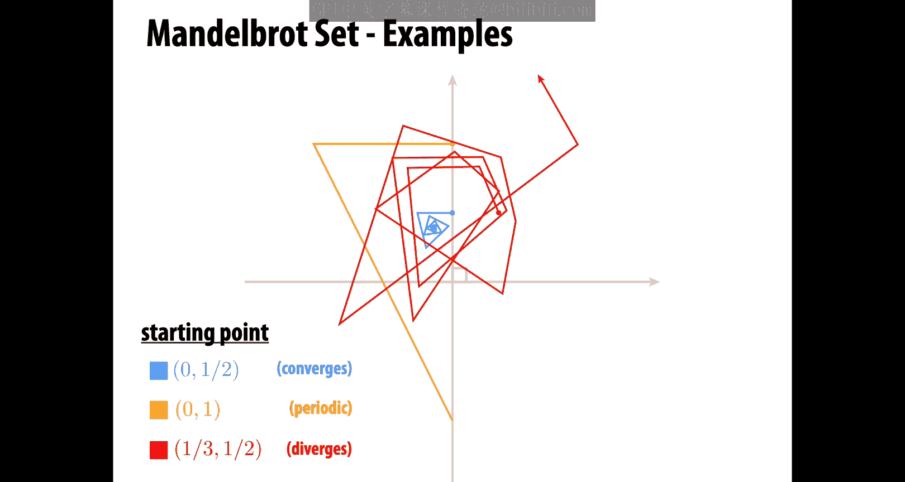

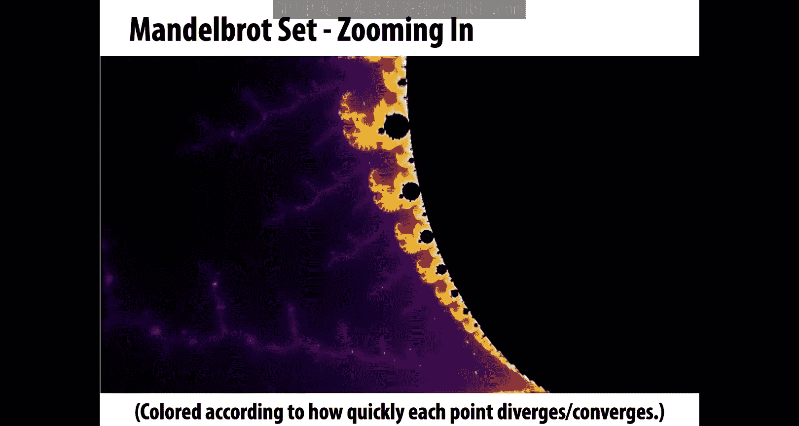

In what's。Absolutely remarkable is that this really， really simple。

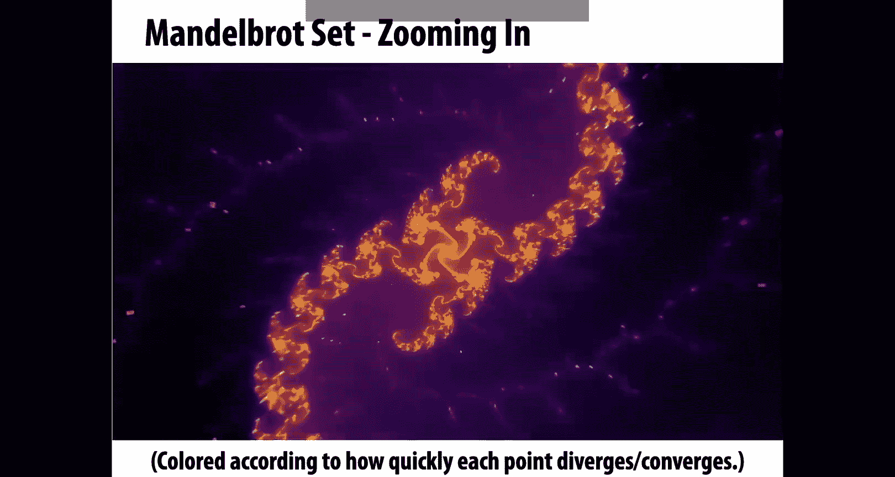

Process or equation z squared plus C， right all we're doing is iterating z squared plus C。

And yet this phenomenal complexity comes out of this。This process。

Just this absolutely stunning and gorgeous imagery comes from some stupidly simple iteration。

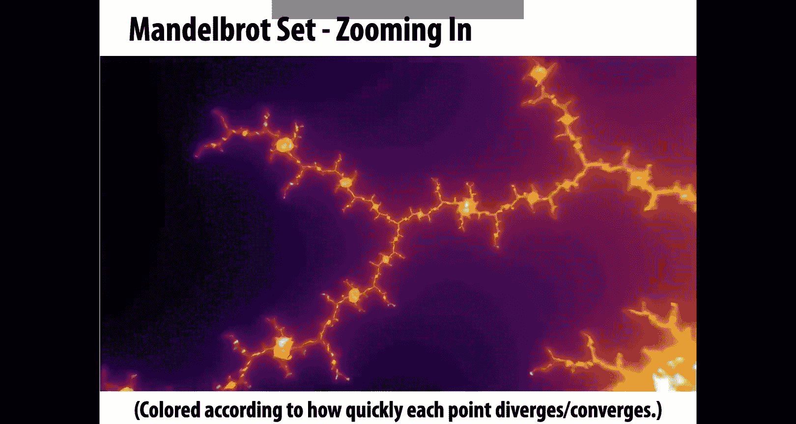

Why is that true， well， because nature is amazing， I mean， that's the only way to explain it。Okay。

 and you can see we've zoomed in now the scale is 10 to the minus 50。

 and we still have this incredible detail。So over time。

 people have come up with other kinds of fractals。Just beautiful evolving fractals。

 This is one called an iterated function system。And the cool thing about this is it was developed by a CMU alum。

 Scott Draves， in fact， if you walk around Gates Hillman Center。

 you'll see a display that shows some of these up on the wall。

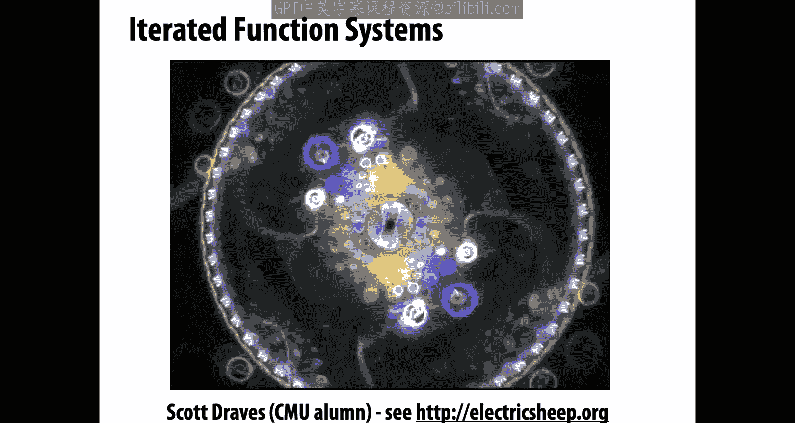

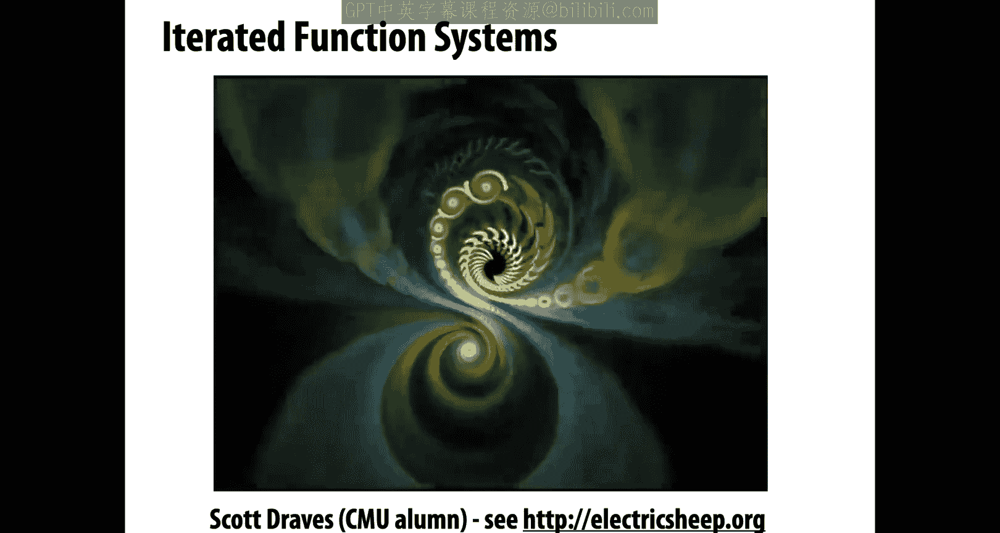

So just really beautiful stuff。

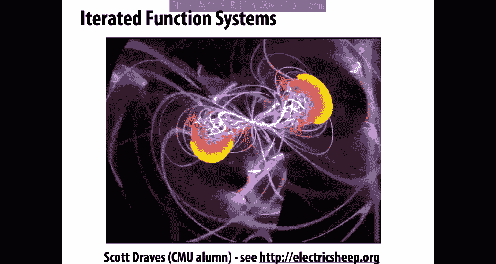

All right， so overall。What are some pros and cons of implicit representations？

One basic pro is that we may have descriptions that are very compact right if we're describing。

 let's say a mechanical part， we might just have a few polynomials and a few boolean operations。

It's very easy to determine if a point is inside or outside our shape。

 we just plug the coordinates into our implicit function and see is it positive or is it negative？

Other queries may also be easy to do， we might easily be able to get the distance to the surface。

 which is useful if we're trying to， let's say， avoid collisions or at least get a good estimate of the distance to the surface。

For very simple shapes， like spheres and Torae and so forth。

 we have a completely exact description of the shape， there's no sampling error。

 we don't have to think about aliasing， we really sidestep a lot of the issues that we normally encounter。

Or we can go to a grid based representation okay， now we have a bigger storage cost。

 we have to deal with aliasing， but we can talk about very intricate geometry like a fluid splashing around and a pro in general about these implicit representations is they make it really easy to handle changes in topology like two droplets merging together or a thin sheet breaking up into droplets。

How about some cons？Well， for one thing， as we saw， it's very expensive， very。

 very difficult to find all the points in the shape if we want to draw it on the screen。

And it can be very difficult to model complex shapes。

 at least if we stick to these really analytic closed form representations。Okay。All right。

 so let's now move to explicit representations。What are some specific examples？So the most basic one。

 as we mentioned， is a point cloud。APoint cloud is the most dead simple thing you could do when you're trying to communicate a shape to somebody。

 you just say here's a list of points that are in the shape， I'm going to give you a big long list。

 All these points are in the shape。It's not exhaustive。Right。How many points are in a sphere。

 kind of infinitely many， but I'll give you a dense sampling of points in the shape。

We can also attach other data to these points， often we might also provide a normal direction you could also put in colors or other attributes。

What are the good things about point clouds， well for one thing。

 you can definitely represent any kind of geometry you want this way。

 every piece of geometry is made up of points， so just give me some of those points。

If I have an extremely dense sampling of the shape， then it's easy enough to draw a nice picture。

 I just spt all those points onto the screen。But on the other hand。

 if I have regions that are undersampled， if I have only a few sparse samples of the surface。

 like we see at the bottom of the statue on the right。Then I have to think about， okay。

 how should I fill in the gaps， how do I draw this in some nice way， and so there。

 you know it's not clear that this is a huge win over using something like triangles。

It also becomes harder to do processing or simulation where you need to understand how is each point connected to other points。

So this is kind of a good， maybe input format， good for certain kinds of visualization。

 but won't let us do all the things that we want to do with geometry。

 at least not with significant additional effort。Okay。Another representation that's very common。

 perhaps the most common in computer graphics， and one that we'll talk about a lot are polygon meshes。

So the basic idea is to store not only points， not only vertices。But also some kind of connectivity。

 so polygons that connect up these points and usually these are triangles or maybe they're triangles mixed with quadrilaterals and other polygons。

Why is this a good representation， So for one thing。

 it's a lot easier to do processing and simulation。

 every point every vertex knows kind of where its neighboring points are。

 We don't have to do any additional work to figure that out。

It's possible to do an adaptive sampling of the surface right so I can put detail only where I need it if I look at this cylindrical surface with these spherical end caps。

 what you notice is I can put lots and lots of detail on the end caps where I have a lot of curvature and in the middle I can just connect it up by these long skinny triangles。

So we can put information really where it's needed。The downside is， well。

 the data structures get more complicated。We don't just have a list of points anymore。

 but we have to think about how do we encode the connectivity。

 how do we talk about neighborhoods and so forth and we'll really get into that a lot。

 especially in our next few lectures。Another complaint some people might have about mehes is that you have kind of irregular neighborhoods in your mesh when it comes to writing code。

 it's not as simple as an image in an image you have a pixel to your left to your right above and below in a mesh there's lots of possibilities of things that can happen so this makes things。

A fair bit more complicated， although we'll talk about in our upcoming lectures how to make some simplifying assumptions that make polygon mesh processing a bit easier。

So to give a explicit example of a polygon mesh， we can talk just about a triangle mesh where we store the vertices as triples of coordinates x。

 Y， and z。And so we really just again have a point cloud of vertices。

 but then we also have triangles。Which we as triples of indices into our vertex lists。Okay。

 to make that clear， let's say we want to encode the。For triangles on the boundary of a tetrahedron。

Then we might have a list of vertices like this for vertices with coordinates x， Y， and z。

And then we have our triangle list， which says， okay， we have four triangles。

 the first triangle connects vertex 0，2， and 1， the next one connects vertex 0，3， and 2， and so on。

By the way， the fact that they' are the same number of vertices and triangles here is purely a coincidence。

 this is just something about the tetrahedron in general。

 we can have a different number of vertices and triangles。Okay。What are we really saying。

 how are we interpreting this data to describe a surface。

 what we're really saying is once we know the location of the vertices of each triangle。

 we can just use barrycentric interpolation to kind of fill in the rest of the triangle。

So if I have a triangle with vertices， P， Pj， and PK。

Then I can imagine that triangle is actually the image of some standard reference triangle。

Which is the set of all points in three dimensions that satisfy the berycentric coordinate conditions。

The three values sum to one， and they're all greater than 0。 Okay。

 and the map that takes me from my reference triangle to the triangle in my mesh is just this simple linear map。

It's a linear combination of the three vertices， PI， PJ， and PK。

 by the three Berry centric coordinates， PI， VJ， and PK。Okay， so in some very loose sense。

 you can imagine that a triangle mesh is kind of a linear interpolation of a point cloud。

 We have these points。 We know those are on the surface。

How do we get the surface while we linearly interpolate？So remember that in 1 d。

 linear interpolation of two values Fi and Fj just means I have a parameter that goes between0 and 1。

I do 1 minus t times the first value fi plus T times the second value fj。If we're close to zero。

 we get a value close to F if we're close to 1， we get a value close to Fj。

And one way we thought about this linear interpolation process was as a linear combination of two basis functions。

So what I'm really doing is I'm taking that function on the left1 minus t。

 and I'm scaling it up and down according to the magnitude of Fi。

And I take the second basis function T， I'm scaling it up and down based on the magnitude of FJ。

 and then I'm summing up those two functions。That's giving me my linear interpolation。

 That's effectively what what's happening when I'm drawing a triangle。

 I have these linear basis functions， these barrycentric basis functions。

And I'm using the locations in space as coefficients for those functions。

And so that leads to a natural question， why should we limit ourselves to just linear basis functions？

What's special about linear， can't we get more interesting geometry than flat triangles by using other bases？

Okay， so let's look at this first in 1 D。So linear interpolation essentially uses first order polynomials in 1D。

 we can provide more flexibility by using higher order polynomials。

OkayBut instead of using our usual basis，1 x x squared x cubed， right。

 we're not going to write a plus Bx plus c x squared plus d x cubed。

 instead we're going to express our polynomials in something called the Bernstein basis。Okay。

 so just a different set of basis functions， they look like this。

Not so different in spirit from the two linear basis functions we saw in the previous slide。

And they have a pretty straightforward definition。 So I say the Bernstein polynomial B of degree N。

 well there are。N plus one of them from 0 up through n at any point x。To evaluate this polynomial。

 I do n choose K。Times x to the K times 1 minus x to the n minus k。Okay， so there you go。

 you have some funky expression for the Bernstein basis。Why is this useful。

 why do I want to do things this way？Well， the picture kind of gives you a sense of why this is a good thing。

 if I want to adjust the height of my function at the left end point。

 I just adjust the coefficient for B03。If I want to adjust the height of the function at the far right。

 I adjust the coefficient for B33， and similarly， the other basis functions really kind of control the height in some region of the interval。

This is not true in my standard basis。If I have A plus Bx plus C squared plus D cubed。

It's not really clear what the effect of adjusting A， B， C and D is。Right。

And so this makes Bernstein polynomials a good choice for building up。

Baases for things like curves and surfaces， I can adjust the coefficient for one of these bases。

 and it has some real meaning I'm playing with this region of the curve or this part of the surface。

As a。Specific example， a Bezier curve is a curve expressed using the Bernstein basiss。

So now rather than scar values Fi， I have points PK， which could be points in the plane， let's say。

And I'm just going to take a linear combination， I sum up over all the Bernstein bases。

 that basis function times the control point。The control point is a vector。

 but the Bernstein polynomial is still just a scalar for each S。Okay。And we can choose the degree。

Of this curve by picking the degree of these polynomials。

 So if I just use the first order Bernstein bases， I get just a。Linear curve a line segment。

 if I use cubic Bernstein polynomials， then I get what's called a cubic beziier curve that looks like this blue curve on the right Okay。

 so this blue curve is the curve I get by interpolating the 4。

 p0 P1 p2 p3 using the Bernstein polynomials。These Besier curves have some very nice properties for one thing。

 they exactly interpolate the endpoint。They actually pass through P0 and P3。

They are tangent to the end segments。So， I know that the。

Curve at the beginning will be tangent to the segment p0 p1。

 and the curve at the n will be tangent to P2 P3。And also really nice property。

They're contained in the convex hull of the control points。

So you can see that the blue curve is contained inside this blue quadrilateral This actually turns out to be really nice for lots of things like rasterization。

 if I want to rasterize a beier curve， then I really only need to consider the region covered by this quadrilateral。

So。This is great， I can draw a really nice curve with four control points。

If I want a curve with more control points， what should I do？I think a natural idea is okay。

 Just keep going if I want to have more points。 I just increase the degree of。The Bernstein bases。

 So if I want 10 points。I use 10th degree polynomials。Actually。

 this is not a great idea because even though the beziier curves will interpolate the two endpoints。

 they only approximate the intermediate points。So even if I have this black control polyline that goes back and forth many times。

 I only get this very slight wiggling of the interpolated curve。

 so this makes high degree busyier curves very hard to control。

What we often do instead is to just piece together many low order beziier curves。And this is in fact。

 exactly what's happening anytime you see， let's say。

 a curve in a drawing program like Illustrator or inkscapepe。

It's also how SVG files represent curves， it's also how every single character of text on your screen is displayed。

Every piece of text is broken up into these little。Besziier curves。A bit more formally。

 we could write our Ps Beziier like this， so gamma of U is the whole curve。

We have some parameter values U sub I along the curve。

 which break it up into the individual beziier pieces。

 these parameter values are sometimes referred to as knots in the curve。

And when we want to evaluate the curve， we just figure out， okay。

Which two knots is the current parameter value between。Maybe it's between UI and UI+1。

And then we convert that parameter value for the whole curve into a local parameter value。

Between zero and 1 for just a single piece。Okay。So there are a couple things we have to think about when we start piecing together these curves。

 if we want the whole curve to look nice。In particular， if we want to get kind of smooth。

 seamless curves。We need the points and the tangents to line up。So， for one thing。

The endpoints of one piece of the curve have to agree with the endpoints of the next piece of the curve。

 otherwise we'll just get a gap， we'll get a discontinuity。Even if the endpoints agree。

 we can get these kind of sharp kinks in the curve if we don't think carefully about。

How the tangents look。And so often we'd really like something like this。

 something where both the endpoints and the tangents match， and we get this nice。

 seamless transition from one piece to the next。Okay， sounds good， but how do we do that？Well。

 let's think about this in terms of the actual polynomials。

 so let's say we have a collection of cubic besziier curves， each piece of our curve is cubic。

So we have u cubed times the first control point， p0 times 3 u squared times 1 minus u times the second control point and so on。

And we like the endpoints of our segment to meet。And we'd like the tangents of the end pointss to meet。

So the very first thing we should ask ourselves is。

Is this always possible if I have these two cubic beziier curves， can I always make them meet with？

The same endpoint and the same tangent。So a good way to think about this is to start counting。

How many constraints do I have， how many conditions am I trying to satisfy。

 and how many degrees of freedom do I have， how many variables am I allowed to manipulate？Right。

 so let's think about this for this cubic curve here。

How many degrees of freedom do I have in my curve。Well， I have these four endpoints， P0， P1， P2， P3。

Right， and we have to be a little bit careful when we count degrees of freedom for。

Problems involving points and vectors。Do we think of this as four degrees of freedom or since each of those points has two coordinates？

Do we think of it as eight degrees of freedom？Okay， so when thinking about this kind of question。

 it's good to be careful to distinguish between scalar degrees of freedom and vector degrees of freedom。

How many constraints do we have in this case？Well。In some sense， we just have two。

 we want endpoints to meet， and we want tangents to meet。Okay。

 but each of those is a vector condition。The two components of the endpoints have to both agree。

The two components of the tangents both have to agree。Okay， so with that in mind。

 let's ask the question again， let's say I have just two cubic beziier curves。

And I want them to meet。At one of their endpoints with position continuity and tangent continuity。

Can I always do this， can I always put the control points somewhere so that this happens？Well， sure。

 right， I have four vector degrees of freedom， I have two vector constraints。

 I have more degrees of freedom than I have constraints， life is good。

What if I want to make this a little harder， let's say I want to make a closed loop out of these two segments。

 So if I have a segment。A B and a segment C D， I want B to agree with C and D to agree with A。

Will this still work out。Well， sure， I still have eight degrees of freedom。

 eight vector degrees of freedom。And I also have eight vector constraints。Because for each curve。

 for each of its two endpoints， I have two conditions。Okay。

 and that kind of also tells you that if I have a big closed loop of lots of cubic besia segments。

 then I can always make them meet up with position and tangent continuity。

 I can always get a fairly nice smooth curve right。Could you do this with a quadratic beziier curve？

Could you do this with a linear beziaccre？Well， I think hopefully it's pretty clear that you can't because we said we had exactly the same number of degrees of freedom as constraints。

If we reduce the degree of these curves。We reduce the number of degrees of freedom。

 we can't get this nice continuity anymore， so that's maybe one argument for why you might like to use cubic vziier curves because you can at least get tangent and position continuity。

Okay， so that's great， we can get higher order curves， how about higher order surfaces？Well。

 one way we can do this is to kind of bootstrap our surfaces using our curves so we can use a pair of curves to get a surface。

Actually， let's just start by talking about a scalar function。So we can construct a scalar function。

Who'se value at any point U？Is given by a product of a curve F at U and a curve G at V。Okay so。

At any point U V， the value of my function is just f of u times G of V。

 This is called a tensor product， very fancy name for a very， very simple idea。

 and you can kind of see that this tensor product captures the behavior of the two individual curves。

 F and G。Okay。So if we now， instead of using just scalar values F and G， we replace these with。

Vectctor values points in space， we can get what's called a Beziier patch。

 so a Beziier patch is a sum of tensor products of Bernstein bases。Okay。

 so here were our one dimensional bases。Our tensor product bases are going to say， okay， basis IJ。

At any point， UVV is just basis I at U times basiss J at V。

We can plot these species for all of our cubic。Functions， we get 16 of them。

 And what you notice about these little basis functions is。

They give us the same notion of local control。One of these bases B30 kind of controls how tall the function is at one corner。

 B03 controls how tall it is at another corner， the ones in the middle control the height somewhere in the middle。

Okay， and so if we associate each of these 16 basis functions。With some control point P I J in space。

Then we can take a linear combination of these。Basis functions using the control points to get a。

Patch of surface in space to get a bezier patch。Very， very nice looking smooth surface， right。

 Much more interesting than a flat triangle。Okay。How do we get a bigger surface， right？

 This just gives us one little tiny patch。 Well， just as we connected Beziier curves together to get a。

A bigger curve， we can connect together beziier patches to get a bigger surface。So here's a。

 I don't know， interesting looking surface made by gluing together all these different patches。

What's nice about this representation， this， this beziier patch or sping representation。

 Well it's very easy to draw if we wanted to draw this。Object on the screen。

 we could just dice each patch into a regular UV grid。

 we could evaluate these Bernstein functions on this grid and that gives us the location of the points in space。

All right。But if we want the surface to look nice， we have to be careful。

 just like we had to be careful with curves to make sure that each piece met up nicely with the adjacent pieces。

So question。Can we always get tangent continuity with beziier patches？

And this is not super trivial to figure out you have to sit down and。Think about this for a while。

 okay， how many constraints do I have， how many degrees of freedom do I have？

I want tangent continuity， maybe where these two patches meet， what does that mean。

 how many degrees of freedom do I have？And I'll tell you it's not nearly as simple for surfaces as it is for curves。

 not even close。In fact， there's maybe something fishy you notice about this picture。

Did you notice anything particularly strange about the surface that I drew？

That just happens to make that example work out nicely。You know。

There's something very special about the structure of the patches that I used， which is that。

I made a surface where I could have four patches around every vertex。Okay， and if you do this。

If you have this nice regular layout of patches。Then the degree of freedom counting works out。

 you can get good tangent continuity， these surfaces are easy to draw and all that kind of thing。

Unfortunately， this is too constrained in practice to make interesting shapes with good continuity。

 you really need to allow patches with more interesting connectivity， in fact。

 there's a theorem that if you have a surface that has a spherical kind of shape or the shape of a double taus。

 basically anything but just a donut shape， you have to have irregular points in your patch layout。

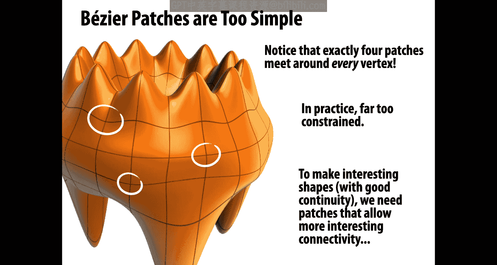

So for this reason。People have cooked up all sorts of alternatives to the basic Besier patch idea。

There are nerves patches， there are Gregory patches， there are PM patches， there are polar patches。

 and all of these different options have different tradeoffs， for instance。

 how many degrees of freedom do I have， what order of continuity do I get。

 how difficult is it to edit， what's the cost of evaluation。

 how general can I get in terms of patch layout and on and on？

As usual you want to pick the right tool for the job。

 so am I modeling mechanical parts or more organic surfaces。

 am I trying to do high quality offline ray tracing or am I trying to do real time rasterized rendering and there's a whole great literature on all these questions。

There's also some very basic things that I can't do with the bezier curves and beziier patches that we've discussed so far。

 so one really simple thing is that besziier curves can't exactly represent cons。

 so for instance with curves I can't exactly represent circles with surfaces I can't exactly represent cylinders and you can imagine this is a pretty important shape to be able to represent。

 especially if I'm designing mechanical parts。So the solution， amazingly enough。

 is to once again use homogeneous coordinates。So what you can do is do the same kind of interpolation。

 same interpolation by Bernstein polynomials in homogeneous coordinates。

 and then do a projection back to the plane。To get what's called a rational bees sp。If I do this。

 then I'm able to represent these cons exactly。Going to the surface case。

 one of the representations we mentioned was Nbs Nbs stands for non uniform rational be blinds。

 So what that means is these knots that we discussed。Can be at arbitrary locations。

 not at regular intervals， that's the non uniform part。

Things are expressed in homogeneous coordinates， and then we do a divide。 That's the rational part。

 we're taking a quotient， a rational number。And we have a piecewise polynomial curve。

 that's what gives us this bebl。Okay。And there's some interesting things that happen here。

 for instance， the homogeneous coordinates have a specific meaning。

 the homogeneous coordinate W controls the sort of strength or influence of a vertex on the curve。

So here， for example， you notice that as we adjust this w value， this homogeneous coordinate。

 the curve gets pulled further toward or away from this middle vertex。

And that's useful if we want curves that have both smooth parts and maybe sharp kinks or creases。

So how do we take this idea from curves to surfaces， Well， again， we're going to do a tensor product。

 We're going to take a tensor product of nervebs， curves or bases to get a patch。

And then just as we did with Beia curves， we can piece together multiple patches to form a surface。

What are some pros， well， these patches are easy to evaluate， I plug in a UV value。

 I get out a point with a very simple expression。I can exactly represent cons。

 I get a high degree of continuity。Cons are well， just like we saw with Besia occurs。

 it can be hard to piece together the different patches while ensuring that you have the continuity that you want。

And similarly， it can be really hard to edit。Nerb surfaces。

 you have lots of degrees of freedom to manipulate。

So a very popular alternative to nervebs is what are called subdivision surfaces。

So a completely different starting point for curves and surfaces is this idea of subdivision for curves。

 you can imagine you start with a control curve or control polygon。And then you repeatedly。

 well you subdivide， you split each edge of the polygon into two， let's say。

And then you take some weighted average of the neighboring vertices to get the new vertex positions。

So that's one iteration of subdivision， we do it again， and for a careful choice of averaging rule。

 how do I take this weighted combination in the limit of this subdivision process you approach a nice limit curve like we see here。

Now， the really interesting thing。I。If。You have a carefully chosen averaging rule。

Then you'll often get the same curve。As some of these sp schemes that we've been talking about。

So actually subdivision。Gives a different perspective on busyziier curves， on Besbld curves。

Except there will be a point where these two perspectives diverge and there will be things that will be easy to do with subdivision that are hard to do with nerves。

 things that are easy to do with nerves that are hard to do with subdivision。Basic question。

Is subdivision an explicit or implicit representation？know honestly。

 I think this question is a little bit of a gray area。

You don't immediately know where the points are。But I would still say subdivision is definitely an explicit representation。

 for a given parameter value， I have a deterministic procedure that produces the point on the surface。

It's not a test， it's not something that lets me check whether a given point in space belongs to the shape or not。

 just as one specific example of a subdivision scheme。

 the Lane reasonfeld scheme is something we can do to subdivide curves。

What we're going to do is for each edge we'll insert the midpoint。

And then to get our weights without explaining really why we're going to use row k of Pascal's triangle normalized to one as weights for our neighbors。

 so for instance， if we said。K is equal to2， then we're going to use the weights one， fourth， one。

 half， one fourth so that those sum up to1。Right。And we're going to average。

The neighboring vertices to get the new vertex location。

 we're going to do that for every vertex along our subdivided curve。

The limit of this subdivision process in this case actually turns out to be a B sp of degree K plus 1。

 so a cubic B sp， here's what that looks like we have our first iteration。

 second iteration and third iteration， and in the end we get this beautiful limit curve。

Subdivision surfaces exactly the same idea， we start with a coarse polygon mesh。

 which is our control cage， we subdivide each element into some number of pieces。Now。

 depending on whether we're doing triangles or quads， this subdivision might look different。

 we then update the vertices via local averaging and there are many possible rules。

 there are Capel Clark subdivision surfaces which work with quads quite easily。

 there are loop subdivision surfaces which are natural for triangles， but many， many more。

Common issues or common。Attributes you might look at with subdivision schemes is are they interpolating or approximating？

New surface， the limit surface actually pass through the vertices of my control cage。

 or does it just come close to them？Do we have good continuity atices？

Do things kind of meet up and have a nice tangent plane and a nice curvature。

W do people like subdivision surfaces， well they're a lot easier than splines for modeling。

 I don't have all these degrees of freedom to manipulate it， I don't have to control the tangents。

 I just have to move the vertices of the control cage around and I'll get some nice smooth surface as a result。

On the other hand， it can be a lot harder to evaluate these surfaces pointwise if I want to just know for a given parameter value。

 what's the limit point you can do it。It's just a little more complicated。

And also you have to worry about issues of continuity near irregular vertices。

 so where more than four patches or fewer than four patches meet in a quad mesh， for instance。

All that being said， subdivision surfaces are extremely popular in computer graphics。

 they're used all over the place by companies like Pixar。

 where they really got their start and have even been honored at the Academy Awards。

So the model above comes from a short film called Jerry's Game。

 which is a movie by Pixar and was one of the very first uses of subdivision in film。

 so there's a nice article by Tony the Rose and others talking about the motivation and the use of subdivision in animation。

All right， that's it for today next time we're going to take a deeper dive into curves and surfaces and the mesh data structures that we're really going to work with in this class to play around with geometry。

 talk to you then。

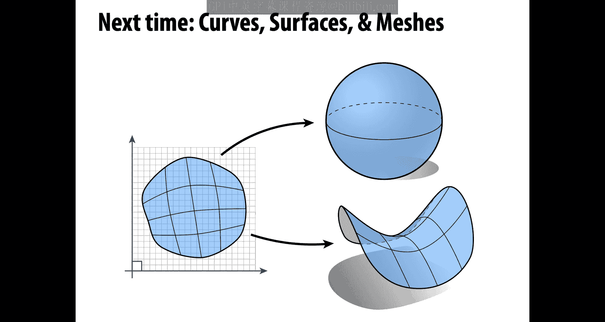