# CMU《计算机图形学｜CMU 15-462  COMPUTER GRAPHICS 2021》中英字幕 p11 -11-Lecture 10_ Meshes and Manifolds -BV1H3NBemE5E_p11-

All right， so last time we started talking about geometry today we're going to dive in and talk about some of the real nuts and bolts of working with meshes。

 so remember that we saw there are many different types of geometry in nature and because there are so many different types of geometry and so many different possible use cases。

 we really need sophisticated representations of geometry。

 not just one but actually many different data structures and representation we looked at two major categories。

 one was implicit descriptions of geometry and the basic idea behind an implicit representation is it will let us test if a given point is part of our shape。

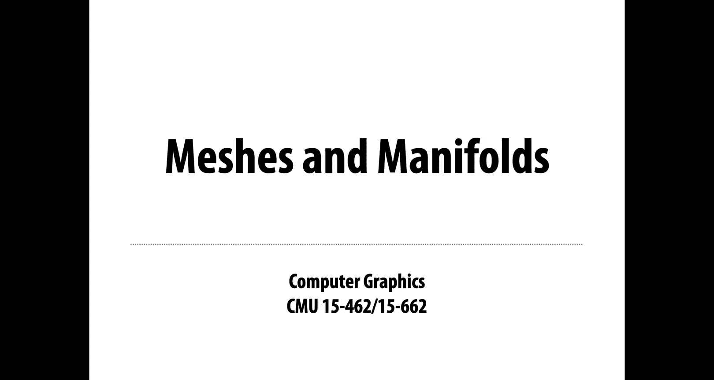

The other big category were explicit representations。

 which in some sense directly list points in the shape or let us generate points in the shape。

There are lots of specific representations for both of these kinds of shape。

 so for implicit surfaces we had algebraic surfaces。

 we had level sets and so forth with explicit representations we had point clouds we had polygon meshes and things of that nature so today we're going to talk a little bit more in detail about what really is a surface what do we mean when we use that word surface and what are the nuts and bolts of working with polygon meshes when we really want to do computer graphics so this is going to lead us naturally into our next lecture where we'll talk really about geometry processing and how we can connect geometry and shape to some of the thoughts that we had earlier on about sampling signals and aliasing and so forth。

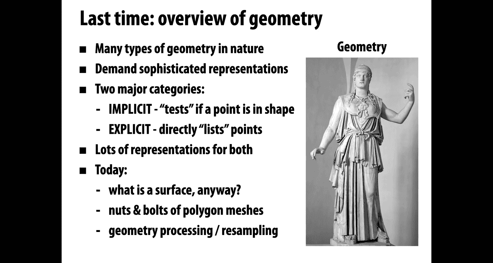

All right， so one big assumption we're going to make when we work with geometry is the so called manifold assumption。

So we're going to introduce this idea today， the idea of manifold geometry。

 it can be a little bit hard to understand the motivation at first。

 although it does turn out to be extremely useful， so before diving into the full blown definition。

 let's revisit a more familiar example， let's just go back to two dimensional images。

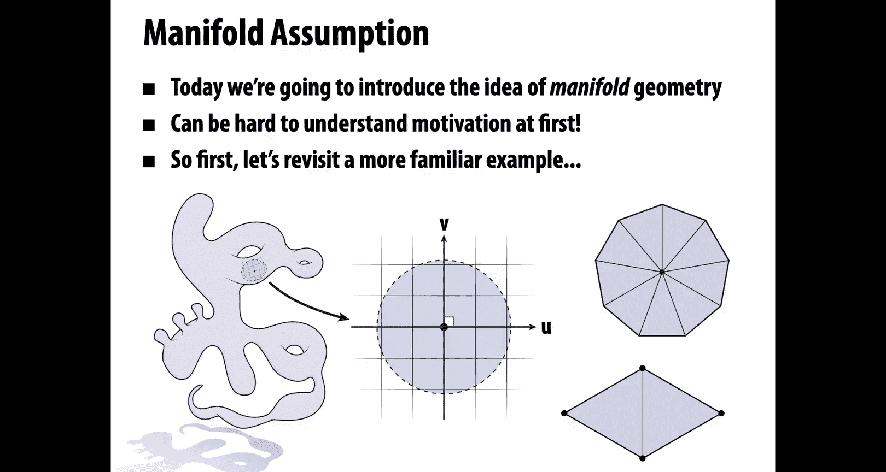

And remember that when we did rasterization to encode images。

 we used a regular grid of pixels if you have some detailed image on the screen。

 if I zoom in far enough， I noticed that it's made up of just little blocks of color。

 or at least that was our model， that was our abstraction。Okay。

But if we look at images in the real world， if I were to look at a painting and zoom far。

 far in on that painting， well， images in the real world are not made of little squares。

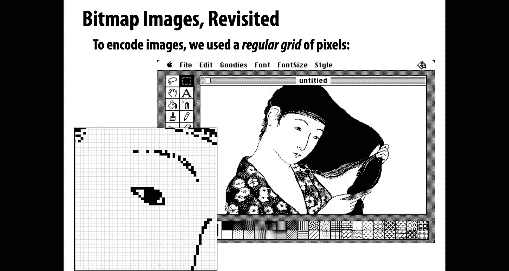

Right， if I have a。Image that's made by paint or by ink， if I zoom in。

 I might see little droplets of that pigment， right there are no little squares。

That's something we did in our rasterizer。

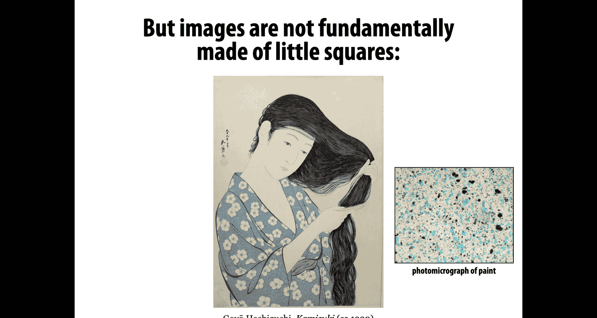

So why did we do that？Why did we choose to represent our digital image using a square grid？

I think it's something that。You've seen so many times。

 it shows up in so many places on a computer that you think why even question that。

 that's just the way it is。Well， why is that just the way it is Who decided that that should be the case For one thing。

 there are lots of other ways you could tile the plane。I could tile the plane by triangles。

 I could tile it by hexagons。I could tile it by a mix of hexagons and triangles and squares。

I could even even tie it by shapes that are not regulated。

 lots of different polygons at each point so why？Why squares， who said that was the right answer？

Well。What do you think。So there are a lot of possible reasons why squares could be nice。

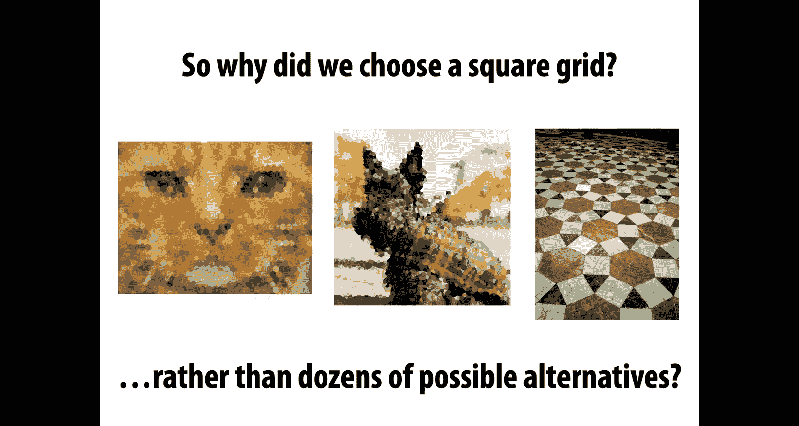

One thing is that regular grids make life easy， right？

Simplicity and efficiency are things we care about when we're developing digital representations。

 when we're developing algorithms。So what's nice about a regular square grid？

We always have four neighbors， every pixel has a pixel to its left， a pixel to its right。

 above and below。Okay。It's easy to index， it's easy to apply filters like averaging。

Maybe we have to be a little careful near the boundary， but no big deal。Okay。

 and storage is also easy， storage is just a big long list of numbers I can just concatenate the rows of my image into just one long array。

Okay， what are other reasons why we might like square grids of pixels？Well。

 another really important feature of grids of pixels is they're completely general in a sense。

 we can encode any image we want。 We haven't limited the kinds of images we can draw or represent。

By limiting ourselves to a pixel grid。Okay， so those are two things we'll look for when we try to come up with a data structure。

 we want it to be simple and efficient and as general as possible。

Without compromising too much on simplicity or efficiency。Sticking with images for a moment。

 are regular grids always the best choice for bitmap images？

Reasons why they might not be the perfect digital encoding。Well。

 one thing you really noticed looking at this picture of a grid is that there are definitely some preferred directions。

 the horizontal and the vertical directions。So we might say that we have kind of an anisotroppic sampling of our image。

 certain directions are preferred more than others certain edges。

 like vertical and horizontal ones will show up a bit better。Then edges in different directions。

Maybe that's okay， maybe we think， okay， we're going to be taking photographs a lot of things that have horizontal and vertical edges。

 that's okay。But in general， it's maybe not the best choice。There are in fact。

 some people who build computer displays out of hexagonal pixels。

Because maybe you can pack more pixels into the same area。But more often than not。

 square grids are a pretty good choice， and we're going to see a similar story with geometry where we're trying to balance these different criteria。

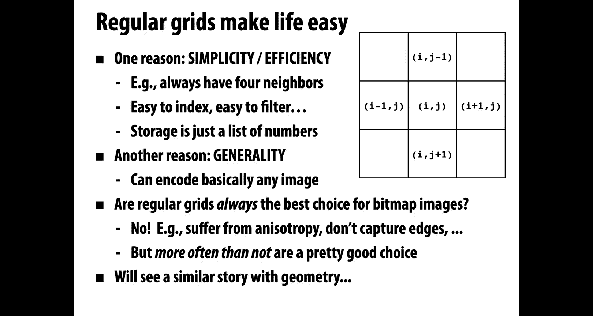

Okay， so let's go back to geometry， how should we encode surfaces？Well。

 first we need to understand a little bit what we mean by the word surface。

 what kind of geometry is it that we're trying to encode in the first place。

So this word surfaceface actually has a pretty specific mathematical meaning。

 it doesn't just mean a shape。Intuitively。A surface。

 one important thing about a surface is that it's capturing the boundary or the shell of an object rather than its interior。

So you could think about a。Candy， like an Minem， it has a solid chocolate interior。

 it has a thin candy shell。When we say surface， we really just mean the shell。

 not the solid interior。Another key property of surfaces is that surfaces are manifold。Okay。

 so what does manifold mean， I'm not going to be able in a short time to give a really precise definition。

But the right intuition is that if you pick any point on your shape and you zoom in far enough。

Then if it's manifold， you should be able to draw a nice coordinate grid with two distinct directions。

Pf example is the planet Earth。

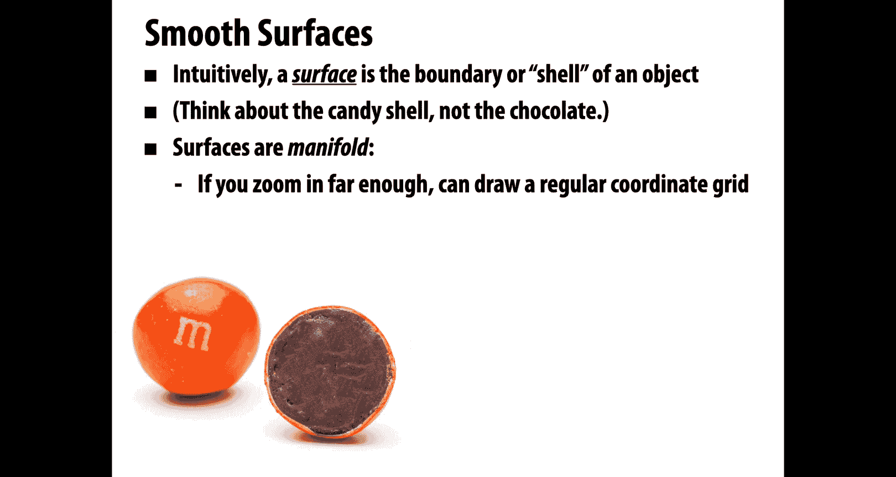

From space， this looks like it has some interesting curved shape， it's almost spherical。

But if you zoom in close enough to any point， let's say you zoom in to Manhattan Island。

 then you can put a nice grid。At least in a neighborhood around that point。

 I can put the streets and avenues of New York City on that point。Okay。And so when faced with this。

Definition。The first thing you should ask is， well， doesn't that apply to every shape？

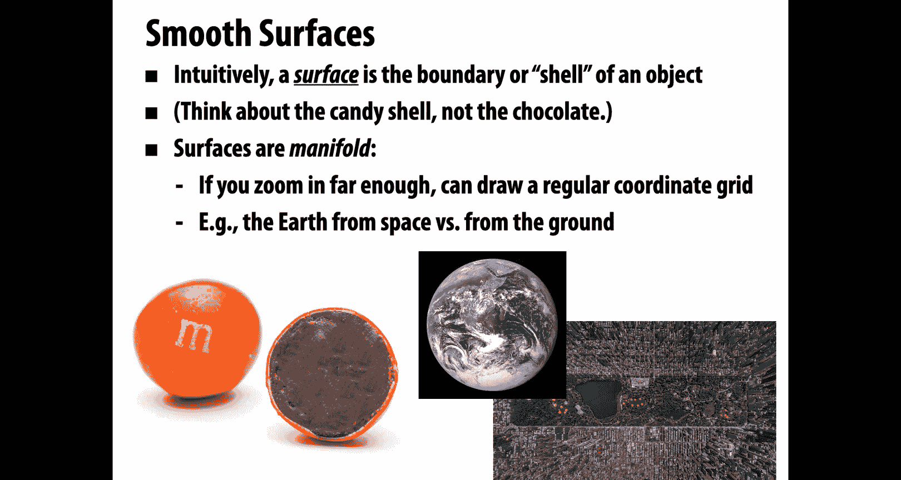

Isn't every shape manifold if I zoom in far enough。

 it feels like I should be able to put a little coordinate grid on my surface。

And if you think for a minute， maybe take a moment to think， is that always true。

 are there shapes where that won't work？So if you think about that for a minute。

 you could cook up a shape， I don't know， maybe like this one。The shape isn't manifold。

 or at least it's not manifold at every point because。

Let's say I try to zoom in really far on the center。

So if I keep zooming in and zming in and zooming in， it never really changes the way it looks。

I can never put a nice little grid on that center place right there's not just two directions to go。

 there's a more complicated way in which this shape is arranged。

Everywhere else I can draw a nice grid， you can see it， I've drawn it。

But that center point is really problematic。Okay。So not every shape is manifold。

 let's take a look at some other examples。

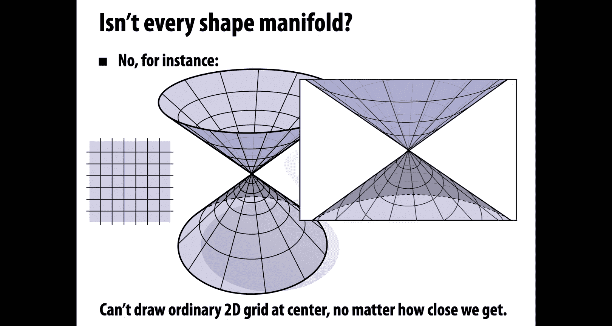

So here's just a bunch of shapes that I picked at random。Okay， we've this kind of hourglass。

 we have a bunny， we have this thing that's folded on itself。This funny， bumpy thing， we have a tous。

So which of these shapes do you think are manifold？

Which of these shapes do you think are non manifold？Well。

 we already know one of them is non manifold， the one we saw on the previous slide。

 this hourglass shape。The other one that's not manifold is the one in the upper right。

There's this place where it looks like two pieces of the surface have been welded together。

And now where they meet， I don't have just two directions I can go up down and left right。

 but I have a third direction back and forth。So I can't put a 2D coordinate grid on those points。

 therefore the shape's not manifold。Okay， the rest of these are nice and manifold。

Even if I have lots of little bumps or whatever。Or even if I have， let's say， the edge of a cube。

 I can still zoom in to those points and put down a little grid。Okay。

Obviously this is a pretty imprecise discussion， I'm not really giving you the formal definition of a manifold and I won't。

 and part of the reason for that is that this becomes a lot easier to discuss when we talk about polygon meshes rather than smooth surfaces。

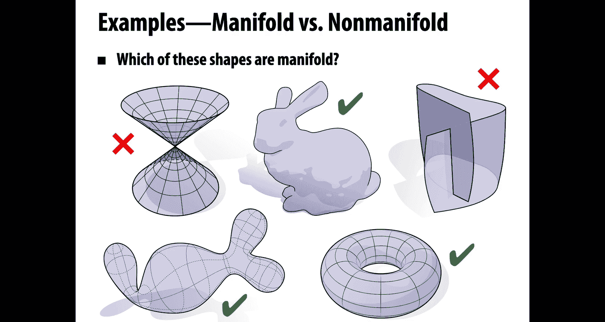

So with polygon meshes， it's really， really easy to define what it means to have manifold connectivity。

And the mnemonic we're going to use is to say that a manifold polygon mesh has fans， but not fins。

So what do I mean by that？So for polygon mesh。We can just check two really simple conditions。

One is that every edge of our mesh。Is contained in only two polygons。So for instance。

 I have these two blue polygons。Every。Interior edge， so this edge in the middle。Is contained in。

Two distinct polygons。We'll talk about the boundary edges in a second。In contrast。

 in this red star shape， we have this middle edge。That's contained in。

Not two but five distinct polygons。So this is not a manifold edge for exactly the same reason as before。

 if I were to zoom in on the edge in the blue mesh， okay。

 I can put down a coordinate grid if I zoom in on the edge in the red mesh， I can't。

Second condition is about vertices。So we're going to say that every vertex in a manifold mesh or a mesh with manifold connectivity should be contained in a single fan or a single loop of polygons。

Okay， so this blue mesh on the top。 I have this center vertex。 It's contained in a single loop of。

Blue polygons， I could enumerate those， 1，2，3，45，6。

7 up through n and then come back to1 again on the bottom， I have this middle vertex。

That's contained in two distinct fans or loops。Of polygons。This looks just like our。

Conone or our hourglass that we saw a minute ago。Alright。What about the boundary。

 can we make this a little more？

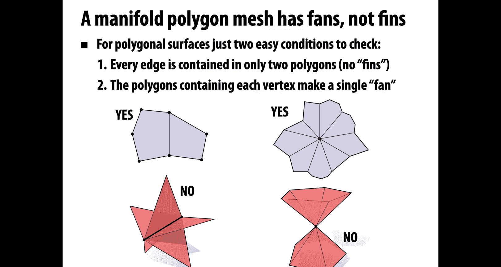

General， okay， well the boundary， first of all， what is the boundary of a surface？

Intuitively the boundaries where the surface kind of ends， so for instance。

 if I have a pair of pants， then the waist and the ankles of the pants are what I'm going to call the boundary。

What does it mean for a smooth surface to have boundary？Well， it means that locally。

 if I look at a little neighborhood， a little tiny neighborhood of a point。

And it looks like a half disk。 so if I zoom in on it and it looks like a half disk like that。Okay。

 that's something that can happen in a manifold of boundary。Also an important fact about boundaries。

 every boundary。Forms a single closed loop， so if I find any one boundary point and keep following it along the boundary。

 I'll always come back to where I started by making a single loop。That's a useful property。

 especially when working with meshes。In a polygon mesh。

We're going to say I have a manifold with boundary if I have one polygon per boundary edge and if the boundary vertices look like。

A packman， so a strip of triangles rather than a loop of triangles。Okay， so to summarize。

A polygon mesh is a manifold with boundary if every edge is contained in either。

Two polygons on the interior or one on the boundary。

And if every vertex is contained on by either one loop of polygons or one strip of polygons on the boundary。

Okay。

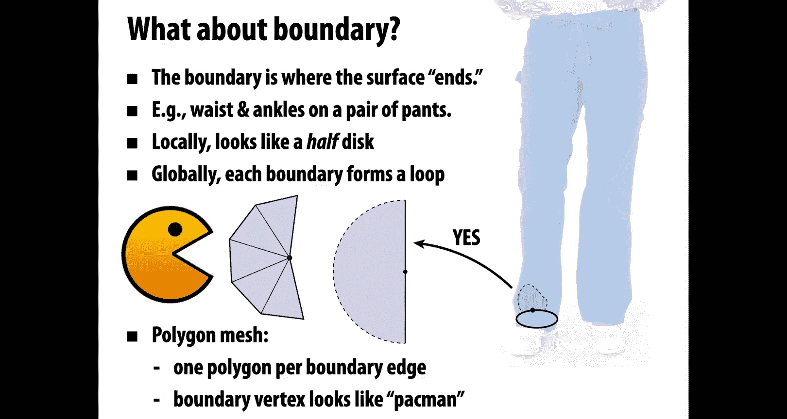

So this is all very interesting， but where are we going with this， why is this useful？

Why is this a good assumption to make about our geometry。Well。

 it comes back to exactly what we were talking about with images， we want to keep things simple。

Right。So we want to make some assumptions about our geometry to keep our data structures and our algorithms simple and efficient We don't want to handle every crazy。

 weird case and how the polygons could be glued up and connected and，We want to kind of say， well。

 let's consider a certain type of polygon mesh that's going to make life easier for the rest of our computation。

On the flip side， we also want to make sure we're。Not limiting what we can do with our geometry by making these assumptions。

And for many， many of the kinds of objects we want to represent。Digitally。

 making this manifold assumption is okay for a lot of the kinds of shapes you want to work with in animation and simulation and so forth。

 this is a pretty good assumption。We're really going to start to see how this helps us as we design data structures。

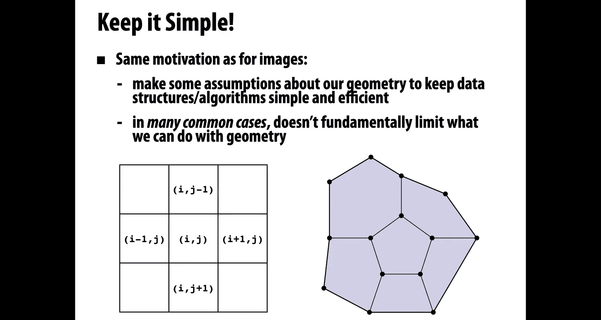

Let's do it。How do we actually encode all of this data？Well。Whenever you're faced with a challenging。

 daunting task， it's good to start with a simpler problem that maybe you already know how to think about。

So let's do a little warm up。Where our goal is to just store a list of numbers。系。

We just want to store a list of numbers on our computer。Okay， and the question is。

 what's a good data structure for this？What data structure would you pick if somebody said I would like to in this program store a list of numbers？

All right， well there are a couple perfectly reasonable answers here。One idea。

mayy have come to mind is to just use an array。I allocate a contiguous block of memory。

And this has some really nice features， I can look up entries in this array in constant time。

I have coherent memory access， so for instance， if Im just walking down the list reading off the numbers。

I'm not jumping all over memory， I'm not kicking stuff out of cash。It's a really nice data structure。

What is a downside of using an array to store a list of numbers， what does it make it hard to do？

Okay。Hopefully。One thing that came to mind is。That it's hard to insert elements into the array or delete elements from the array。

So what kind of data structure would you use instead if you knew ahead of time that you were probably going to insert and delete a lot of elements？

Well， one other basic data structure you can use is a linked list。So now I have some number。

Sitting next to a pointer， that pointer points to the next number。

And stores an next pointer and so on until finally that pointer is null and I get to the end of the list。

Okay。Why bother with a linked list well， because as we said。

 we can easily insert and delete numbers wherever we like。Okay， so as。Eleementary。

 as this might seem， these two different。Solutions to this problem。

 an array or a linked list are really pretty representative of the different kinds of。

Polygon mesh data structures that we might work with。

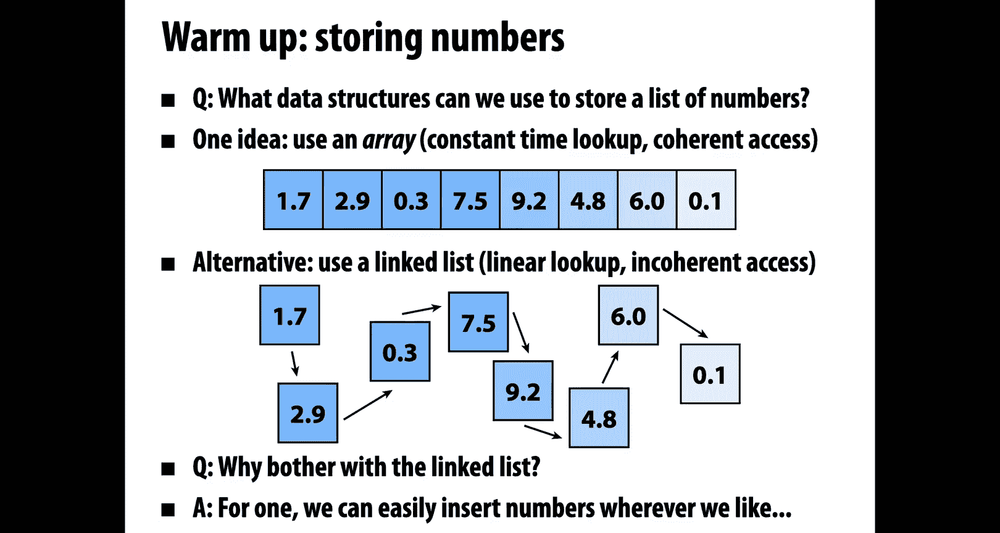

So let's start with the absolute most basic thing we could do to store a polygon mesh。

And just to give it simple， we're going to talk mostly about triangle meshes here。Okay。

 so what's the simplest thing we could do to store a triangle mesh we could just store？

For each triangle， it's three vertex coordinates。So if I have these two blue triangles。

With these four vertices， then I'm just going to have。A list， a long list， well in this case。

 a short list that has the x coordinate y coordinate z coordinate of the first corner。

 the second corner， the third coordinate， and I go to a new line。

 and I have the XY Z coordinate of the first corner of the next triangle。Right。

 second vertex and third vertex。Other than that， I don't store anything else。

 I don't store any other information about how things are connected or anything。Okay， and in a sense。

 this is not really so different from a point cloud。Point cloud was just a long list of points。

 this is just a long list of triangles。In fact， this is kind of the input we had to our rasterization pipeline。

So what are the good things about this representation？Well， for one thing。

 it's really stupidly simple， it's hard to be。Confused about what。

This data represents or or what to do with it。 right， Okay， I I see it。

 I've got a list of triangles I can。Draw them on the screen。What are the downsides。

 Why is this not the greatest data structure in the world？What do you notice。Well， for one thing。

 it's redundant。We stored the same。Vertex， twice。Okay。So we're repeatedly storing X1 y1， z1。

 and you can imagine if we had even more data associated with every vertex。

 let's say not only a vertex position， but we also have texture coordinates and we also have colors and we also have normals。

 then you're storing a lot of data that you don't need to be。It's also hard to do much with this。

Dato， this data structure beyond just simply drawing the mesh on the screen。

We can send these triangles one at a time down our rasterization pipeline。

If I need to do anything else， if I need to， I don't know。

 put a vertex at the average of its neighboring vertices or something like that。

 all of a sudden it becomes really hard。So in order to do more sophisticated things。

 we would need some kind of spatial search data structure。

 which we'll actually talk about in a later lecture。Allright。

 so let's get a little more sophisticated。 How else can we store a。

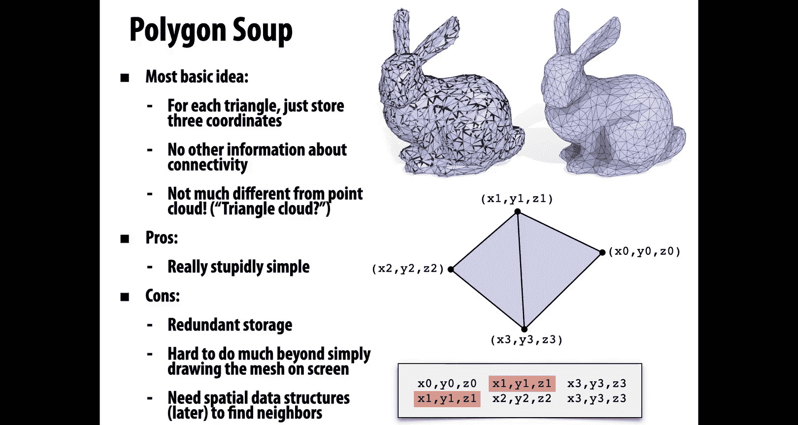

Polygon mesh or triangle mesh well。We can use an adjacency list。

This is still going to be kind of an array like data structure， but a little more sophisticated。

So this time， in fact， we're going to split our。Mesh into two distinct lists。

One list is just going to store triples of coordinates X，YZ。One for each vertex。

 and our second list is going to store indices into this vertex list。

The tell us what our polygons or what our triangles are。Okay， so to make that clear。

 let's say we want to encode the triangles in this tetrahedron。

Then our first list would just have the XYZ coordinates for the four vertices。-1， minus1， minus1，1。

 minus1，1， and so on。The second list is going to say。

 how should those vertices get connected up into polygons？Okay， so。

The first row 021 is saying that we have a triangle made from those first three vertices。

 the next row 032 is saying we have a triangle made from well， those three vertices and so on。Okay。

 and this is the first time we're doing something very important。

 something we'll do for all remaining data structures， we're splitting up our mesh into the geometry。

 the vertices that tell us about shape。And the connectivity。

 this list of indices that just tells us how things are connected up。Okay。

These are really two distinct pieces of information。

You can imagine having the same connectivity with a different geometry， for instance。All right so。

This is a little more interesting data structure， but let's think about whether it really lets us do all the kinds of queries we might want to do when working with a matchsh。

 so here was a really， really basic question。I load up this mesh。

 and then I just want to find what are all the polygons， all the triangles that touch vertex 2？Okay。

 so of course you can look at the picture and you can tell me the answer。

 but how would you do this algorithmically if I just handed you these two lists？

What would be your algorithm for finding all the polygons touching vertex 2？All right， well。

 no trick question here。All youd have to do is go down the list of polygons one at a time。

And check the three indices and see is two one of those three indices so I go to the first row okay 021 yep polygon 0 touches vertex 2 I go to the next one 0。

3，2， yep polygon1 touches vertex 2 go to the next row 30，1 nope。

 that one doesn't touch vertex 2 and then 31，2， yeah that one does touch vertex 2 okay really simple algorithm seems fine if I want to find polygons touching a vertex no big deal okay now consider a more complicated mesh。

 not just a little tetrahedron but let's say。

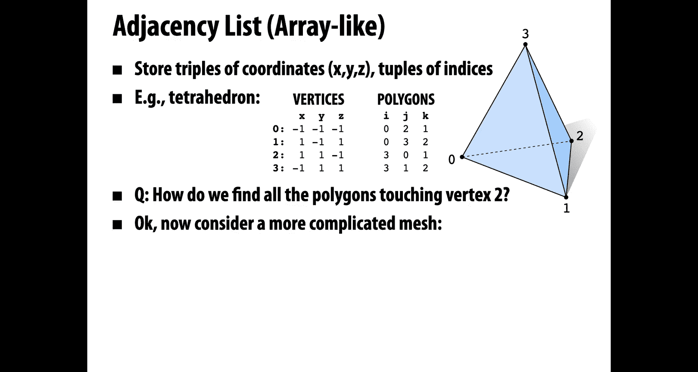

A scanned statue of Michelangelo's David。So this mesh has about a billion polygons in it。Okay。

 and now I want you to do the same thing I again would like you to find all the polygons touching vertex 2。

 What's your algorithm？Well， really， there's not much you can do other than run the same algorithm。

You just start going down the list one polygon at a time， check if that polygon contains vertex 2。

But now this really seems like。Kind of a kind of an inefficient way to do this， right。

 I have a billion polygons。Probably there's only going to be four polygons that touch vertex 2。

 but I have to look at a billion things to find that just small neighborhood of polygons。

 right really， really expensive to find，What's going on here so。

 so this is something that's now like linear in the input。

 even though it's a kind of constant size output。So it has to be a better way to do this。

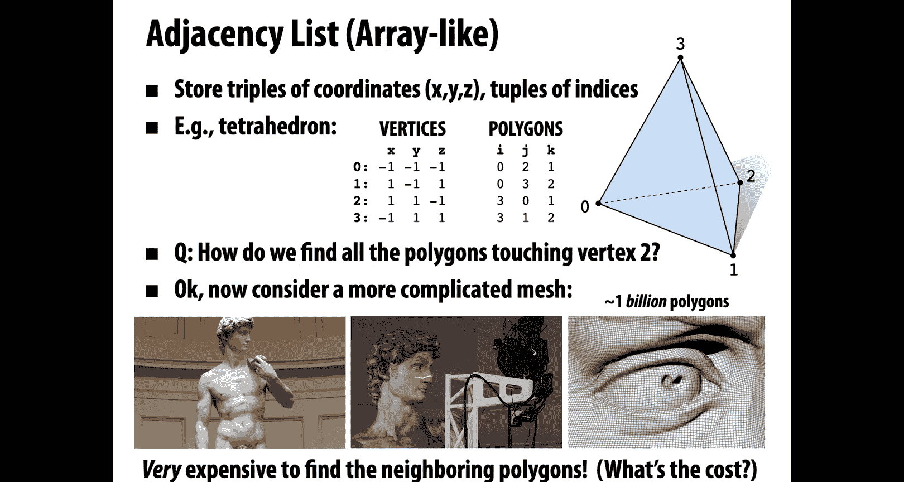

All right， so let's look at another data structure。

Now really nice data structure for storing connectivity is the。Idea of incidences， matrices。

And the starting point for this is to say well。If we want to know who our neighbors are。

 why don't we just store a list of neighbors？What could be what could be more straightforward？

And so in particular， we're going to encode all this neighborhood information using incidence matrices。

So for a tetrahedron。We have our same tetrahedron， we're going to still store the vertex positions exactly as before。

 just a long list of XYz values。Okay but now to store the connectivity， well， first。

 we have a vertex edge incidence matrix。So， for every。Vertex。

 we have a column for every edge we have a row。And we just enumerate the edges and the vertices in any order。

Completely irrelevant what the order is， I just pick， okay， this is edge0， this is edge1。

 this is edge 2， whatever order I like， likewise， this is vertex 1， this is vertex 2。

 vertex 3 really doesn't matter。Okay， and this matrix， the entries in this matrix， well。

 if they're one， that means that this edge and this vertex touch。If there's  zero。

 that means they don't touch。Okay， so we can compare the picture and the matrix and make sure things agree。

 so for instance， if we look at the first row E0。We see that there's a 1 in column v0 and a1 in column v1。

 so what that should tell us is that edge0 has as its endpoints， vertex 0 and vertex 1。

If we go over to the picture， we find edge zero kind of on the bottom。

Then indeed we see its endpoints RV0 and V1。Okay。What if I look at a column of this matrix？

What is a column of the vertex edge matrix telling me？Well。

 it's going to tell me the complementary thing。 it's going to say for this vertex， which edges。

Touch it。So let's pick， I don't know， the second column V1。I see that I have ones for E0。

 E1 and E5 and zeros for E2 E3 E4。And indeed， if I look at。Vertex V1 in the picture。I see that。

It's touching edges E0， E1 and E5， right， but not edges E2， E3 and E4 Okay， great。Does that do it。

 I mean， that gives us a pretty good sense of how things are connected up。

 but it doesn't tell us one thing， which is， okay， are these all。

 if I have three edges that make a loop。Is that loop actually filled in by a triangle or is there a hole there。

 is there a boundary there？So to make that clear， I'm also going to store another matrix。

 the E face incidence matrix。And this is going to work exactly the same way。I have for each edge。

 I have a column for each face， I have a row， if there's a one in an entry that means that face and that edge touch each other。

 if there's a zero， then they don't。So for instance， if I look in the first row F0。

 I see I have a one in column E0， column E3 and column E5。

 that must mean that phase zero has edges well。Zero， three and5， we look at the picture。And indeed。

 that front face F0 has those edges。Okay， that's the basic idea。Now。

If we think again about our much bigger model， this billion polygon model。

This starts to feel like a bad idea。Why might this be a bad idea for a very， very large model？Well。

 the issue here is。We used to be storing just a。Linear list of things。Right， they have all my。

Vertex positions and I have all my triangles。Now， we're storing something that looks quadratic in the size of our mesh。

 We have edges， times， vertices， faces， times， edges。

So we're going to end up with these huge matrices if I have。A billion polygons and， you know。

 roughly a billion edges。Then my edge face matrix is going to be roughly a billion times a billion。

Okay， but there's a really， really important thing we can notice here。

Which is that most mesh elements don't touch most other mesh elements， in fact， a very， very。

 very small fraction of， let's say edges are connected to vertices。

 a very small fraction of vertices are connected to edges。Okay。

So instead of storing the zeros in this matrix explicitly。

 most of the entries of our matrices are going to be zero。So instead of storing all those zeros。

 it's kind of stupid to store them。We can try doing something else， right。

 We don't just want to store 0，0，0，0，0，0，0，0，1，0，0，0，0，0，0，0，0。Right。

So we'll talk in a second about how we can use something called a sparse matrix to store these matrices much more efficiently。

Okay。So。We're still going to have a larger storage cost。

Then just using our ordinary vertex face adjacency matrices， but we've gained a really。

 really important。Feature。Which is that we can now find neighbors of a given element in constant time。

How do I do that when I just go down the columns or the rows。I have an edge。

 I want to know what faces it's touching I。Some column。I have a face。

And I want to know what vertices it's touching， how do I do that actually。

 let's say I give you F1 and I want to know what its three vertices are。What would your strategy be？

Well， this one's a little trickier。So I have face F1， I want to know what its three vertices are。

 I don't have a matrix that immediately gives me that information。Right。

 but what I could do is I could still go to。Row F1 in the edge face matrix。

 I can see that it's got a1 in columns E1， E4 and E5。Okay。

 now I can go over to my vertex edge matrix。And I can say， a， okay， well then I'll look in rows， E1。

 E4 and E5。E1， I see vertices V1 and V2， E4， I see V2 and V3 and E5， I see V1 and V3。

 and so I know the vertices of my original face， F1 must be V1， V2 and V3。Okay。

 so you can kind of see how starting with these basic matrices。

 I can start walking around the mesh and getting different connectivity information。

Another slight downside here is it's a little bit hard to change。The connectivity of the mesh。

 since we use these。Kind of fixed ordering of the mesh elements。

So if now I want to delete edges or faces or insert vertices or something like this。

I really have to do some pretty serious manipulation to these matrices。

So if I know that my geometry is static， I'm not going to change the connectivity as I go。

 I'm in good shape， but otherwise this could be a bit tricky。

Another bonus feature of these incident matrices is that the mesh doesn't have to be manifold。

 Nothing we said about this representation really asks that an edge be contained only by two faces or that a vertex be contained in only a single loop of polygons。

 right？I could easily have more entries in each row or column。

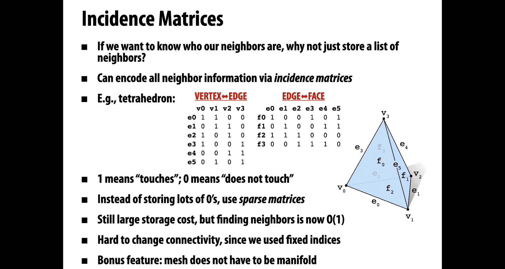

Okay。So before moving on from incidence matrices， it is important that we say how did we actually encode that sparse matrix rather than just letting it be this magical concept so how do we store a sparse matrix and this is a good thing to understand actually not just for encoding mesh data structures but in general in graphics all the time you'll be working with large sparse matrices that represent systems of equations you might want to solve here they represent the connectivity of a mesh and so on。

So just as a running example， let's consider this matrix。Okay， so a small three by3 matrix。

 not that many of its entries are zero， but we'd still like to store it without storing these zeros。

Okay， so there are a lot of different data structures we can use to encode a sparse matrix。

Maybe the most simple thing we could do is say， let's use an associative array。

So we'll use a data structure that maps a row column pair。

 just the location of a non zero entry in the matrix to that non zero value。

How do we represent an associative array？ Well， there are lots of different data structures you can use for that。

 you can use a hash table， you can use a tree， but generally these are pretty fast。

 It becomes really easy to look up and to set entries on the other hand。

If we represent things in this way， it's kind of hard to do matrix operations if we want to do a matrix vector multiply。

 for instance。This is not really the best way to do it。

 I have to iterate over these entries and find the ones that are relevant to the matrix computation I want to do。

So it has its downsides。Another thing we could do， another kind of straightforward thing we could do is say。

 okay。Most of the entries of our matrix are zero。So why don't we just store for each row of the matrix a list of the non zero entries？

Okay， so for each row， I'm going to store the first non zero entry in the matrix。

 so I'm going to store not only its value， but also the index of its column。

And then a pointer to the next nonze entry。So for our matrix here， for instance， in the first row。

 I have the entry 4 in the column zero。And then I have a pointer that goes to the next entry。

 okay the value  two in the column one， and then maybe I have a null pointer terminating that list。

In the next row， I just have one non zero entry， so I store that entry and then an null pointer。

 and then in the next entry I have again next row I have one entry。

So this is really conceptually simple if you understand how a linked list works。

 then okay you understand how this sparse matrix representation works an array of linked lists。嗯。

On the other hand， it's pretty slow to access， as usual the linked lists。

 I have to kind of walk down the list until I find the entry I'm looking for。

And I have pretty incoherent memory axis， unless I'm really careful about how these pointers are set up。

 I'm going to be jumping all over memory as I look at entries。Okay， so finally， we get to。

A data structure that's really used to do a lot of numerical linear algebra。

 which is the so called compressed column format。So the idea of the compressed column format is to just pack all the entries kind of as tightly as possible into dense lists。

Okay， and this is takes a little bit of work to really wrap your head around how this works。

 but let's take a look at least at this example。So the compressed column format is going to have three different arrays。

One is a dense array of values， just the values of all the non zero entries。

And the second one is the list of row indices so what are the。

Indices of the rows corresponding to those values。And we construct these lists in a very special order。

 we start in the upper left entry of the matrix。We go down the first column looking for non zeros。

 Okay we found a four。Then we go over to the next column and we get a two and a7 and we go over to the final column and we get a three。

 and we just concatenate all those nonzero values into our first array。

We also put in all the row indices， so four appears in row 0， 2 appears in row 0， 7 appears in row 2。

 and three appears in row 1。The final array， this is the confusing one that tells us。

What's the cumulative number of non zero entries per column？Okay， so in the first column。

 we had one non zero entry。In the second column we had two nonze entries， so 2+1 is3。

And in the third column we had one non zero entry， so 1 plus2 plus1 is4。

And by looking at this final array， what we can figure out is which segment of the value and index arrays do we need to look at in order to inspect a given column of the matrix？

AndSo if we wanted to look at the second column， for instance。

 we could start at entry1 and go to entry3。stop right before entry 3 so we'd have entries1 and two indexing from zero。

Okay， not super important that you get all the details here。

 but just to give you a sense of how this works。So。Compressed column format， on the one hand。

 it's hard to add modify entries honestly it's just a pain in the butt to work with this data structure in general。

 but on the other hand it's really really fast for doing actual matrix math operations if I'm doing matrix vector multiplies or anything with sparse matrices this is a really good thing to have so in practice what usually happens is you'll build up your matrix using a simpler data structure。

 maybe you just go with a simple associative array。

 you write down all the non-zero entries of your matrix and then you pass that to a routine that turns it into this compressed structure for doing real math。

Okay， so what we see here， we start to see that having some kind of linked list type data structure or indirection or something seems pretty necessary for encoding kind of the sparse connectivity of a polygon mesh。

 and so our next data structure， the half edge data structure is really going to adopt this mentality from the beginning。

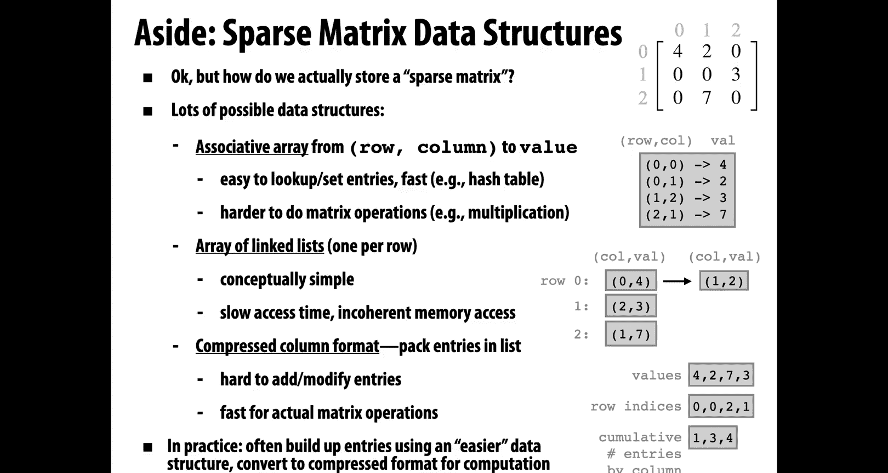

So this is our closest analogy to a linked list， this is also by the way the data structure we're going to use for most of the rest of the class。

Okay， so the basic idea of half edge is to store just some information about our neighbors。

Unlike the incidence matrices， we're not going to have an exhaustive list of connectivity。

We're just going to have a few key pointers， kind of the minimal set of pointers。

That we can then chase around to figure out everything else we want to know about the mesh。

In particular， what we're going to do is we're going to split every edge into two socal half edges that point the two opposite directions along the edge。

 and those half edges are going to be the glue that connects up all the rest of our elements。

So each half edge knows about a bunch of things。A half edge knows its twin。

 so it knows the other half edge along the same edge。

It knows the next half edge within the same polygon。It knows the vertex that it comes from。

OkayThis is a convention， by the way， some people store the one that it goes to。

 we're going to store the one that it comes from。It stores the edge that it belongs to。

 and it stores the face that it belongs to。All the other mesh elements are going to store just one thing。

 which is they're going to store a reference to one of their half edges。

So an edge will know about just one of its two half edges。

 a polygon will know about just one of the half edges around the polygon。

A vertex will know about just one of the half edges sticking out of the vertex。Right。

Why is that is that enough， why is it okay to just have one， if I'm a triangle。

 I only know about one of my three half edges。Well， because once I have that information。

 because the half edge knows about so much。

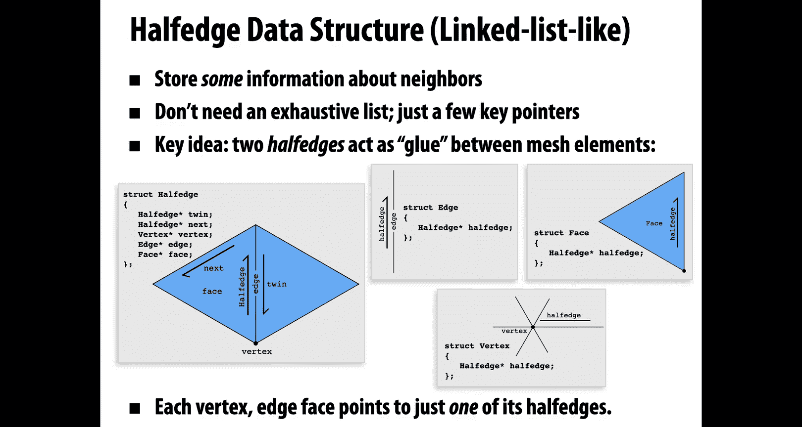

We can easily use these half edges to traverse the mesh。

 so we can use the twin and the next pointers of the half edge to kind of move around the mesh。

Once we're in the。Location we want， once we've moved to the right place。

 we can use the vertex edge and face pointers to grab a specific mesh element。Okay， so。

This becomes a lot more concrete with an example， let's say that we have a。Polygon or a face F。

And we want to visit all of its vertices。How can we do that。Well， the face， remember。

 knows about just one of its half edges。So I grab that half edge， F do half edge。

And then I have a little loop where I。Replace the half edge with the next half edge and the next half edge and the next half edge until I get back around to the half edge I started with。

So I just go around essentially a linked list， except this linked list makes a loop。Okay。

 at each moment。😊，I can then just grab the vertex。At the tail of each of those half edges。

OkayAnd that lets me visit all the vertices。Around the triangle。

 if I wanted to visit all the edges around the triangle。

 I'd go grab the edge from the half edge rather than the vertex。Okay。

 a little more interesting example is I want to walk around a vertex， so I have a vertex v。

And I want to walk around it， maybe to visit the neighboring vertices or the triangles that touch it or the edges that touch it。

 whatever。So what I can do is start with a half edge that's equal to the one outgoing half edge that the vertex knows about。

And then I can go to the。Next， halfagedge following the twin of that halfagedge， so H。 twin do next。

If I look at the picture， I realize what I'm getting is another half edge that sticks out of that same vertex。

Okay。But， I've gone。To the next one， and if I do this again， twin next， I go to the next one。

 twin next， I go to the next one until eventually I get back around。Okay。Notice， by the way。

 that this。Construction or this idea of。Traversing the mesh by following loops of next pointers or loops of twin next pointers。

Only makes sense if the mesh is manifold。How is it that I know I can visit all the triangles touching a vertex by just going twin next。

 twin next， twin next， well， I know by assumption。That。

I have a single loop of triangles going around that vertex。

What if I want to visit all the triangleles。Touching a given edge while I can just start with a half edge of that edge。

 I can look at the twin。 I look at the twin of that half edge， and I get back to where I started。

 Why is that， Because I know I only have two。Faces。Containing any it。Okay。

Another way of looking at this is to say。

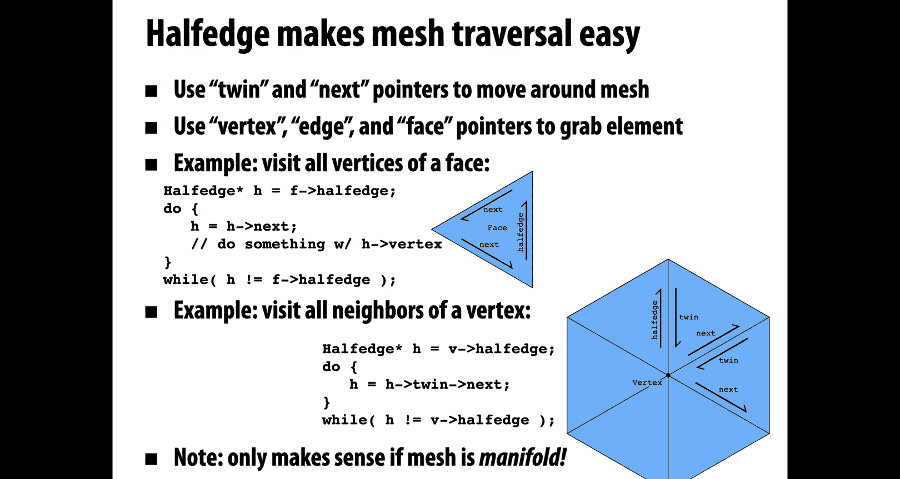

Not that we have to have a manifold mesh in order to work with。The half edge data structure。

 but the other way around if I have。Valid half edge connectivity。

 then it will always describe a manifold polygon mesh。Okay。To make this clear。

 let's consider a simplified version of the half edge data structure。Where I only store half edges。

 I only have half edges and each half edge only knows about the next half edge and the twin half edge。

And I'm going to say that any collection of half edges is valid as long as it satisfies some very common sense conditions。

Okay。The first one is that the twin。Of the twin of any half edge is just。That half itch， right。

 The twin of my twin is myself。If you met somebody and they said， hi， nice to meet you。

 I have a twin and the twin of my twin is not myself。You just look at them like they're nuts。

 like what are you talking about your twin's twin is not you。This is crazy。Okay。The other condition。

Similarly is that my twin is not myself。Okay， again， if I say， hey， I'm keen and nice to meet you。

 I am my own twin。You're going to look at this person like you're crazy， right？Okay。

Then our third and final condition captures this idea that these next pointers should be telling us how to loop around a polygon。

So what we say is every half edge should be the next of some half edge。Okay。

And I claim that if your half edges satisfy these three basic conditions， then they always。

 always describe a manifold polygon mesh。How do I convince you that， well， let's。Let's just do it。

 So what I can do is I can start with any half edge。And if I keep following next， next， next， next。

 next， next， next， next， next， next。I will eventually get back to where I started。

And those loops that I make。Are going to define the polygons in my mesh。Similarly。

 if I start with a half edge， I can keep following twin， twin， twin twin， twin twin twin twin。

 well actually not that many times I keep going until I get back to where I started。

 and those pairs of half edges will define the edges of my mesh。And finally。

 just as we did a moment ago， I can follow next twin， next twin， next twin， next twin， next twin。

And those loops of polygons that I get by doing next twin， next twin， next twin。

Trace out the vertices of my mesh。Okay。So why therefore is it impossible to encode the red figures with the half edge data structure？

Well， simply because the Ha edge data structure by construction， by definition， only describes。

Mifold polygon rushhes and it's kind of a nice feature of the half edge data structure。

It's what we set out to do at the beginning， we said imagesage are nice because they have this predictable structure。

I have a left， I have a right， I have a top， I have a bottom。

Half edge meshes are nice because they also have a predictable structure。

There's only edges on or two faces on either side of my edge。

 there's only one loop of triangles or polygons around a vertex， okay？

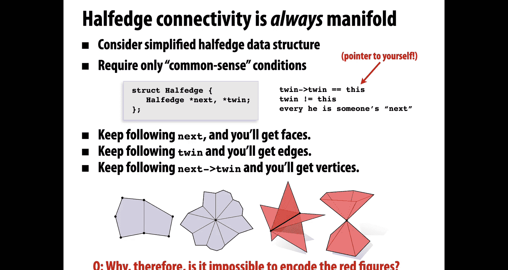

Alright。One thing to be really， really clear on， and this can be very confusing when you start working with polygon meshes。

Is that you can have perfectly good connectivity， nice manifold connectivity。

But totally crazy geometry。Okay， so remember that our。Notion of having nice manifold geometry。Said。

 well， every edge is contained in two faces and every vertex is contained in one fan。 We have。Fans。

 but not fins。And the critical thing to notice about these conditions is they say nothing about the vertex positions。

Neither of these conditions is a condition on the XYZ coordinates of your vertices。

So you can have a perfectly good correct。Valid manifold connectivity for your mesh。

 even if the geometry is totally awful。So here's an example， here's a nice cube。

I've taken a cube and in this case， I've split it up into triangles。It's a nice manifold。

 I could check that every edge has。Is contained by two triangles。

 I can connect check that edit every vertex， I have a loop of polygons。Okay。

 here's exactly the same connectivity， I didn't change the half edge data structure at all I only moved the vertex positions around。

 and I moved them to random locations and now faces that are intersecting and all sorts of crazy stuff is happening。

But from the perspective of connectivity， this is not a problem。

 I can still find the vertices of a polygon。 I can still find the edges touching a vertex。

 No problem。Right。In fact。One thing that's a little。

Weird about this half edge data structure when you first start working with it is you realize， oh。

 I can actually have perfectly good manifold connectivity。

Even though there's no possible vertex positions I can assign that give that good geometry。

 so here's a really simple case。I can have a half edge mesh consisting of one triangle。

Two vertices and two distinct edges。 And what this picture means here is I've kind of taken this flat triangle and I've glued together two of its edges。

I can represent this with a half edge mesh。I can put little you can imagine drawing little half edges in here and setting up their twins that are next to describe this kind of cone shape。

But I really only have two vertices I and J。And so if I try to do linear interpolation。

 if I try to use berrycentric coordinates to interpolate these vertices。

 well the best I can do is draw a line segment。So even though this is a perfectly valid manifold with boundary from the point of view of connectivity。

It's kind of collapsed when I try to draw it with linear geometry。Okay。

 here's another similar example I can have。Maanifold connectivity consisting of two triangles。

And two edges and just one vertex。 so here the edges marked with double arrows get glued together。

 the edges marked with。A single arrow get glued together conceptually this describes kind of a taurrus。

But I only have one vertex position， so if I try to draw this with my rasterizer。

The best I can do is draw a point in space。Okay， so the geometry that you see on the screen might betray how the mesh is actually connected up and this can lead to confusion when you're debugging right the mesh looks bad。

 it looks like something's broken， even if the connectivity is perfectly fine so you have to be really careful when you think about this here's another case that shows up a fair bit。

 especially in low quality mehes badly scanned messhs， you open up a mesh。

 you look at it and you think what the heck is going on here。Is this a triangle mesh。

 I have these kind of three triangles， but this edge is just meeting at the middle of another edge。

 is this manifold， is this valid？And then you check your connectivity and nothing is wrong。

 it looks perfectly fine and what's actually going on here is there is another triangle there。

 it's just really， really skinny。Okay。So this is a distinct phenomenon。

 This is just a bad small triangle， but the other ones you really should think about right what's going on there。

 how is it that I can have，Perfectly good manifold connectivity。

 but I can't put any good geometry on it。That can happen。Okay。All right。

 so why do we like half edge meshes， why， why are they a good。

 why are we going to use them for this class well for one thing？

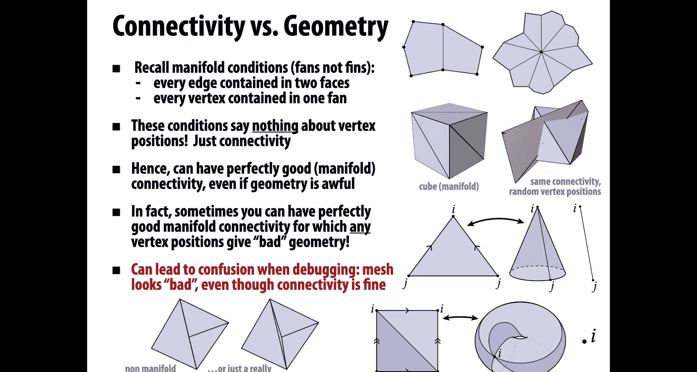

Remember， a key feature of linked lists， linked lists。

 we liked them because we could insert and delete elements。We take it out。

 we link up the ones that are remaining and everything's good。

Same story with a half edge mesh you can kind of think of a half edge mesh as like a linked list on steroids。

 we have all these linked lists all over the place。So for triangle meshes， for instance。We can。

Do lots of little atomic operations， little local modifications of our connectivity that。

Preserve this structure of half edge so we can take an edge and we can flip it。

 right connect the opposite vertices， we could take an edge and we could split it。

 we can insert a vertex in the middle， and we could also take an edge and we could collapse it。

We could identify two of the vertices and delete some of the triangles and edges。And lots more。

 you'll get to experiment with this in your coding assignment。

How do we implement these kinds of operations， these kinds of connectivity modifying operations with a half inch data structure？

Well， if we're doing it in a language like C C++， what we're going to do is allocate or delocate elements and then reassign some of these half edge pointers。

And we just have to be really careful that we preserve manifoldness。

 that we assign these pointers correctly so that they satisfy these basic invariants that we talked about before。

 the twin of my twin is myself， I am not my own twin。

 every half edge is pointed to by some other half edge。

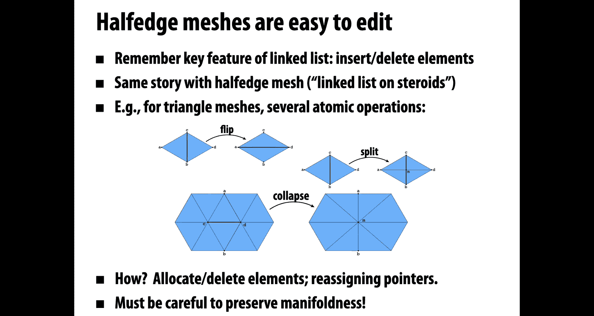

Okay， in a little more detail。What does an edge flip look like。

 so I have two triangles with vertices， A， B， C and D， right sharing this edge CB。

I'm going to replace those with the two kind of opposite triangles sharing the edge AD。

How do I implement this with my Ha data structure， I just go through a long list of pointer reassignments。

The edges half edge is some new， half edge and so forth。However。

 no elements are created or destroyed， I don't have to delocate any elements because nothing got deleted。

 I don't have to allocate anything because nothing got created。Question。

 what happens if we apply an edge flip twice？We flip and then we flip again。Okay。

 hopefully not too hard to see that we just get back to where we were before。Challenge。

 just kind of keeping your code tidy。 Can you implement an edge flip operation such that not only are the two figures the same。

 right the two。Drawings of the connectivity the same。

 but then actually the pointers are unchanged after two flips。

This is something important to be aware of， I can have two different sets of pointers that represent the same triangle。

You can imagine like kind of rotating all the。All the half edge pointers in a polygon。Okay。

Another operation is an edge split。The way this works is I have my same two triangles， ABC and CBD。

 and I insert a new。Vertex M somewhere in the middle， giving me。

Four triangles and four edges on the interior。This time I actually do have to go and add new elements。

 what do I have to add？I guess I need to add three new edges and three new faces and a new vertex and a bunch of new half edges right。

 do lots of pointer reassignments。Can we reverse this operation？Right， once we've inserted a vertex。

 can we。Reverse it kind of like we reversed the。Edge flip。Well， yes and no， I mean。

 if we load up a mesh that had come from a split operation。

 it might not be immediately obvious which vertices were the inserted ones。

And which were the original ones？But okay， if we were to tag these elements。

 these new elements in some way， then we could， of course。Remove them again。

So this is an operation that preserves completely the geometry of our original mesh。

Another operation is an edge collapse okay so here again I have two triangles。

 the two triangles touching my edge。And I'm gonna。Put C and D at the same place。

 and I'm going to actually turn those two vertices into one vertex M。Okay。

 and I'm going to delete any elements that。That edge was touching。

 I had these two triangles that contain that edge， that edge doesn't exist anymore。

 so I have to delete those triangles and so on， do all sorts of point re assignmentsigns。Okay。

But once I've implemented these basic operations， I can kind of build on those to implement other algorithms。

One thing you also notice about all these operations is they all assumed that I had two triangles incident on one edge。

 so this is a really good example of how making a simplifying assumption。

Lets me also kind of treat this common case， I just have to implement this edge flip split and collapse for the case of an edge contained by two triangles。

 doing this for a general mesh could be real pain in the but okay。Question。

How would we implement operations like this， how would we implement。

 let's say this edge collapse with an adjacency list？Well。

 the short answer is it'd be really annoying。I mean first。

 I'd have to do some linear search through the list to find the elements。

 the triangles that are going to get affected by this operation。

Then I'd have to delete elements from the middle of the list。So I don't know。

 I'd have to kind of copy these into a new shorter list or something like that。

So really we're also benefiting here from this half edge data structure that behaves more like a linked list。

That lets us insert and delete at will。Is there any other good way to do it？

So if I was going to pick a different data structure to do this with。Could I do that。Well。

 maybe I could do this without too much pain with an incidence matrix representation。

 I could zero out some rows and columns of that matrix， effectively eliminating those for my mesh。

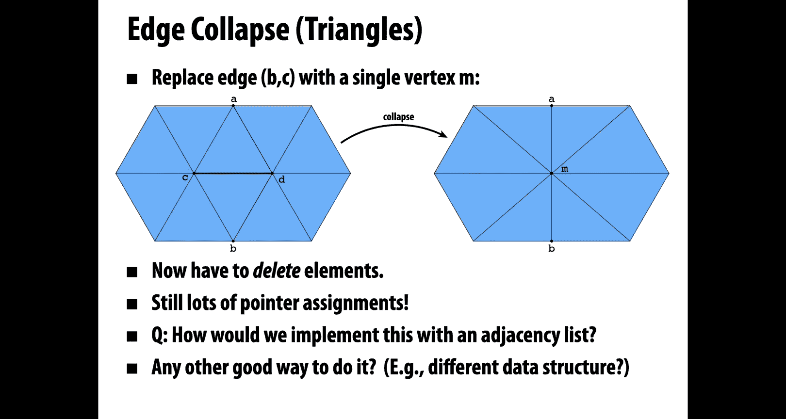

Right。Or I could consider any one of many alternatives to a halfhead。

 so if you go off after this class and you're learning more about meshes。

 you might encounter all these other things， sounds like there's so many possibilities。

 there's wing edge and there's corner tables and there's quad edge and there's all sorts of other things。

And these are a little bit different， there's subtle differences between all of these。

 but all of these different representations are。Taking the same idea as a half edge mesh。

 they store some local neighborhood information and then you use that local information to kind of walk around the mesh and do manipulations。

OkaySo so none of these is really fundamentally different from the half edge concept。

 they have very similar trade offs relative to a simple polygon list， the downside is。

 well you have additional pointers， you have additional storage。

 you're kind of keeping track of a lot more data， you have pretty incoherent memory access just like a linked list。

 you're jumping around memory。But on the other hand， you get much， much better access time。

 asymptotically better access time for looking at local neighborhoods。And in fact。

 if you're a little thoughtful about this。I think half edge data structures catch a little flak as being kind of memory and coherent and don't support nonmanifolds and so forth。

 but actually with just a little bit more thought you can actually come up with half edge type data structures that do have coherent data storage that do support non manifold connectivity and so forth and there's a link to one such example at the bottom。

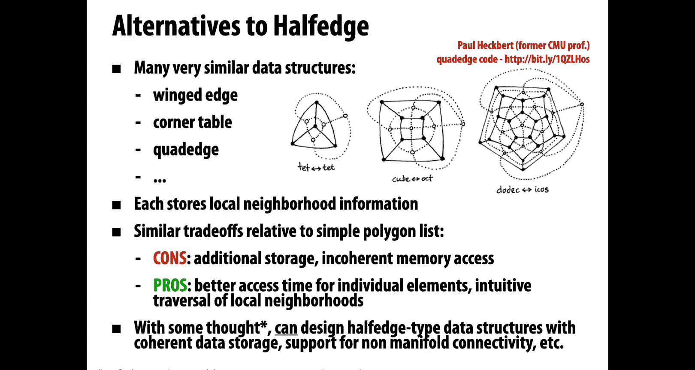

Okay， so let's take a step back and just compare a little bit all these different polygon mesh data structures we've looked at right we looked at adjacency lists。

 we looked at incidence matrices， we looked at half edge meshes。

 I'm not including polygon soupup here because。There's almost nothing you can do with polygon soup other than to just fire those triangles down the rasterization pipeline other than to visualize。

Okay， so one thing we can ask is。Can I access the neighborhood of a mesh element in constant time with each of these representations？

With an adjacency list， the answer is no， we have to go through our list of a billion polygons just to find the ones that contain vertex 2 okay so that's bad news。

 but incidence matrices， no problem， I just look up that row or column halfed mesh， no problem。

 I just look at my next and twin pointers until I find the elements I want okay。Um what about？

Adding a removing mesh elements。Here， the half edge mesh really shines。

 It's a lot like a linked list。 It's designed from the ground up to be easy to add and remove elements。

 The other two are either going to be a pain or just take a huge amount of time to change。

The number of elements in the mesh。And finally， can they deal with non manifold geometry。

 this is where half edge mesh is weakest。Adjacency list。

 it's super easy if I want to represent a non manifold mesh。Okay， fine。

 I just store a bunch of triangles that contain the same edge。

 I just store whatever triangles I like， same with incidence matrices。

Okay so what you see is in the end， there's never just one right answer。

 there's never one right data structure for the job。In fact， again this。

Polygon soup representation is itself sometimes exactly the right data structure for the job。

 it's the right one if we want to do rasterization。

The rasterization pipeline only knows about one triangle at a time。

 so we can just use polygon soup there okay？So what's most important as you learn this kind of material is not to learn about one and discard the rest。

 but understand which situation。Is most appropriate to apply each of these different data structures。

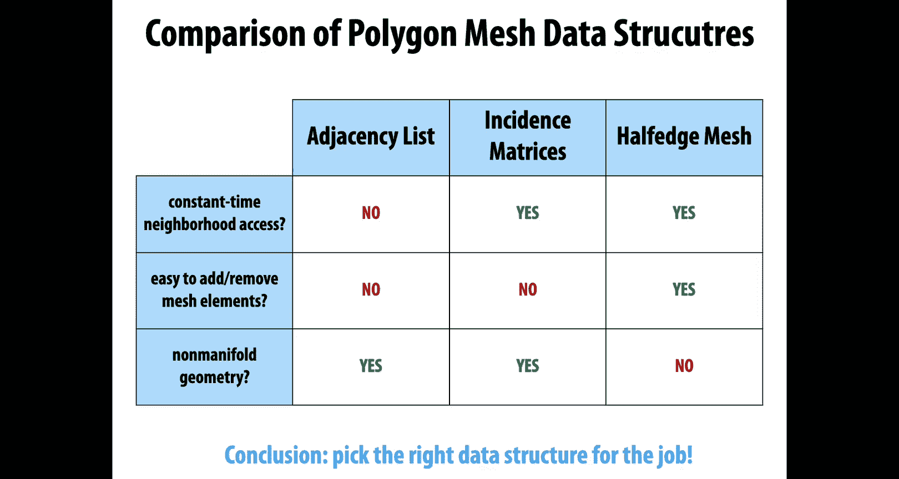

Okay。So to wrap things up。What can we actually do with these fancy new data structures。

 why are we bothering to have really sophisticated data structures for polyagonal meshes？Well。

 one that we're going to see。

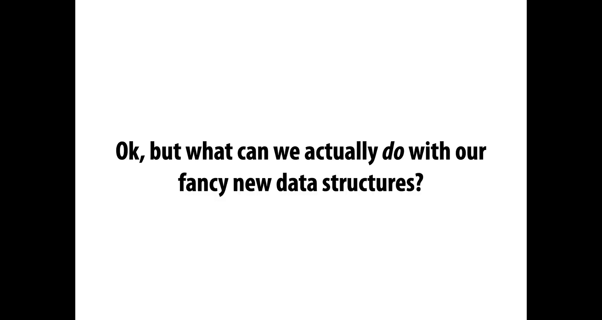

A lot of， in fact， that you're going to implement in Scotty 3D is the idea of subdivision modeling so do where do meshes come from。

 where do these models come from one way they come about is through a process like this。

 you start out with a cube。And then you do all these connectivity modifying operations。

 I split it into。

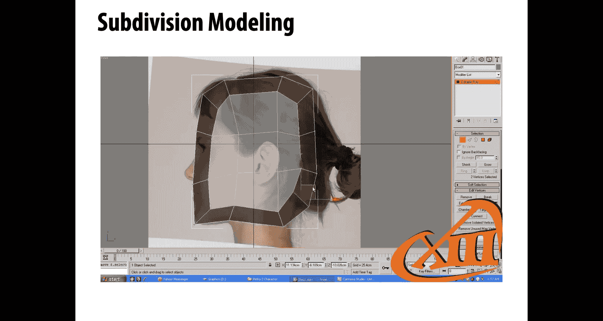

Smaller pieces， you drag the vertices around。

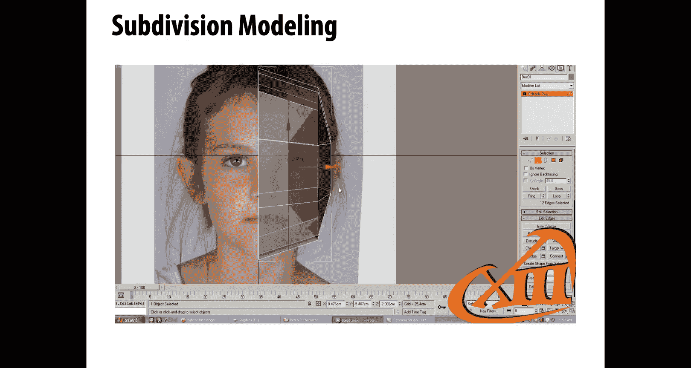

Right， you start。Pushing things around and tweaking them until eventually。

 you get a high quality model of。

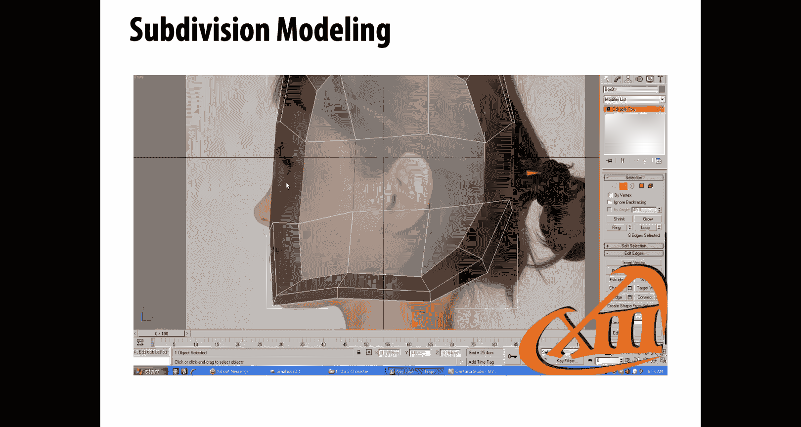

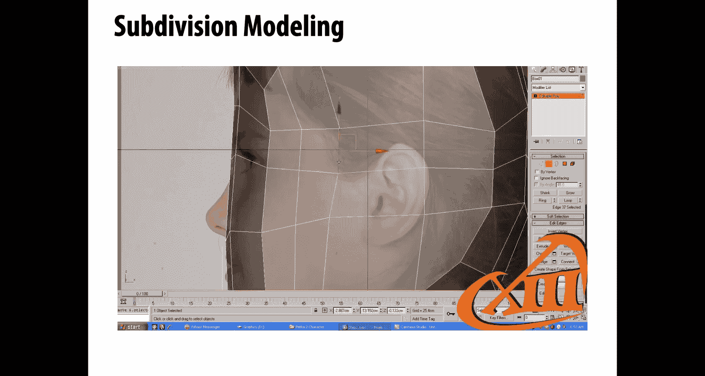

Sam。Nai ship。

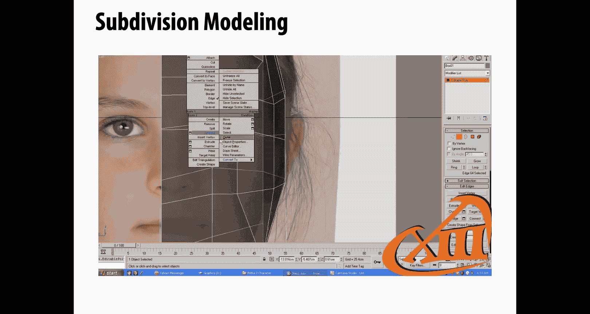

Okay。So maybe something like this。And this is a really common modeling paradigm in 3D tools。

That you start with some course control C， you perform local operations to control or edit or even animate the shape。

And then you just let a subdivision process determine the final surface。So this is a really。

 really nice way of defining surfaces。Not only from a kind of data structures or mathematical point of view。

 but from kind of a。Interactivityivity or user interface point of view。

You kind of get to put controls， you get to put degrees of freedom where they're most interesting。

Okay， so I can just drag around a few points and get a lot of control over the shape。

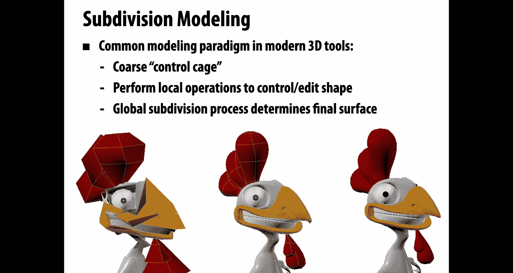

And。There are a lot of different local operations you could do to manipulate your control cage。

You'll implement a bunch of them so you could beyond just flipping and splitting and collapsing。

 you could do bevels。You could do， you know， other kinds of。

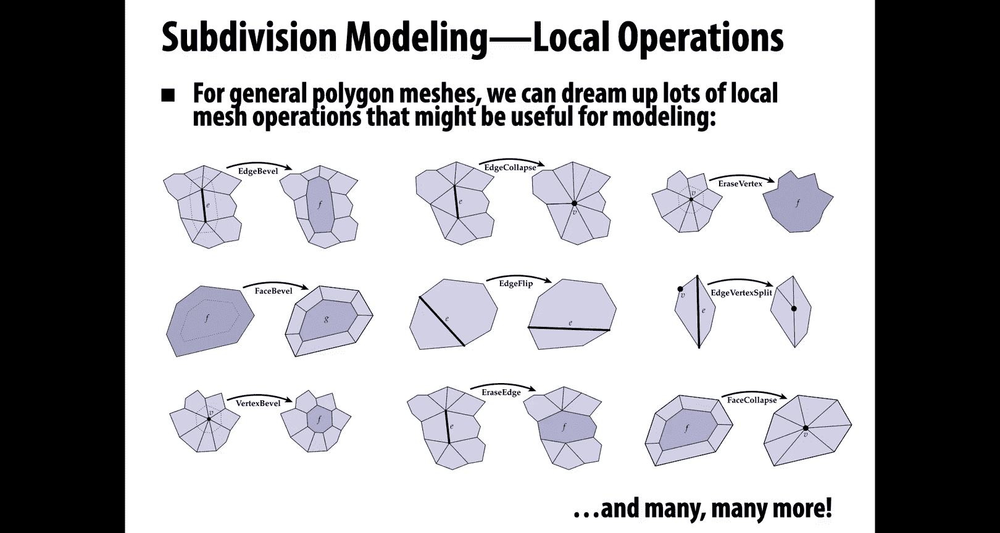

Esing and collapsing and so forth。Beyond subdivision modeling。

 why do we want sophisticated mesh data structures well because we want to be able to process geometry in much the same way that we can process other types of signals。

 audio and video， and so forth。And this is the field of digital geometry processing。

 which kind of generalizes traditional digital signal processing。Okay。

 so that will be the subject of our whole next lecture。And we'll see that as always。

 these issues of sampling and reconstruction and aliasing will rear their ugly head once again。

All right， so that's it for today， talk to you next time。

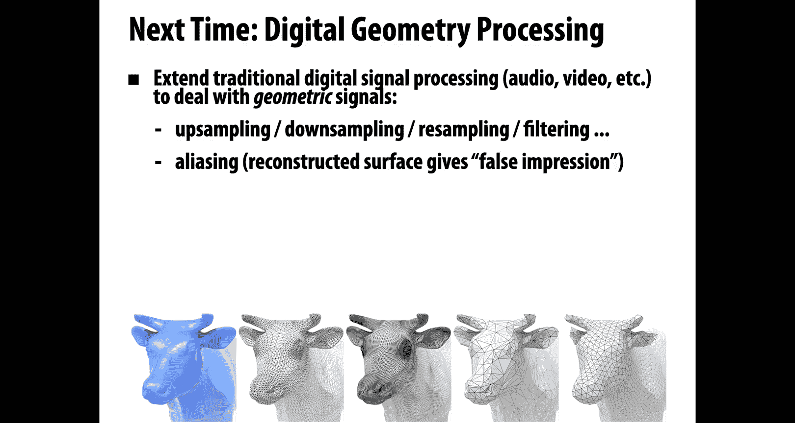