# CMU《计算机图形学｜CMU 15-462  COMPUTER GRAPHICS 2021》中英字幕 p12 -12-Lecture 11_ Digital Geometry Processing -BV1H3NBemE5E_p12-

Welcome back to computer graphics。 So last time we got deep into mesh data structures today。

 we're going to talk a little bit about what you can actually do with those data structures。

 So remember last time we started out by。First thinking about mathematical descriptions of geometry。

 what are some simplifying assumptions we can make about shapes that make them easy to think about。

 and our main assumption was to assume that the shapes we're working with are manifold。

 that in some sense， each little tiny piece of our shape can be stretched out into the Euclidean plane。

For meshes， this became a lot more explicit。 we can say that the connectivity of a polygon mesh is manifold if it has fans but not fins。

 so if we have just a single loop of polygons around every vertex and for every interior edge we just have two polygons containing that edge and we said this simplifying assumption just like with images is going to make it a lot easier to develop algorithms。

 we have a regular structure that is predictable that we can depend on and it simplifies our not only our thinking but also our code。

We looked at some data structures for polygonal surfaces。

 starting with really basic stuff like polygonal soup and building up to half edge meshes。

 something that gives us a lot more sophisticated access to the connectivity of a mesh。

 and we talked about the various tradeoffs between storage costs and access time and so forth。

So today， now that we have these data structures， what we want to understand is how can we manipulate and process geometry。

 so this brings us to the topic of digital geometry processing。

 which is kind of the next wave of digital signal processing。So traditionally。

 digital signal processing looks at images and audio and video。

 and now we want to generalize it to geometric signals to shapes。

And we have a lot of the same basic challenges we want to upsample or downsample or resample or filter geometry。

 we're going to run into problems of aliasing。Where depending on how we acquire and reconstruct the geometry。

 we might get a false impression of what it looks like。And beyond just purely working with geometry。

Geometry processing and mesh algorithms are really basic building blocks for many areas of computer graphics。

 so if you're doing rendering， you're going to need some representation of geometry。

 if you're doing animation or simulation， you are going to need some representation of geometry。

So the kinds of things we've been studying in these lectures are really fundamental to a lot of the things you need for computer graphics。

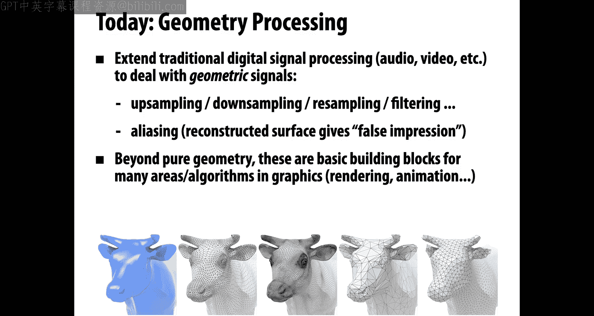

Right now is an especially exciting time for geometry and geometry processing because we're starting to see all sorts of interesting and affordable hardware for dealing with geometry so both bringing it into the computer and also taking digital geometry and turning it into real physical geometry So at the top here we see kind of a 3D scanning process actually this is being done with just a cheap consumer video game console you dance around in front of the screen and at very high frame rates it's bringing in some information about position and depth。

On the bottom we're seeing one technology for 3D printing， so we have a digital model。

 a polygonal model of a bunny， and it's printing out slice by slice in some kind of plastic resin。

 a real physical solid bunny， this video has been sped up a lot but this is the basic idea。

And these are really representative of a much broader set of things that are going on in the computer graphics world。

 people are coming up with all sorts of interesting ways to acquire geometry via different kinds of sensors。

 things that are showing up in autonomous vehicles， for instance。

 and also digital fabrication is really taking off people coming up with ways to produce not only hard。

 rigid plastic pieces， but also elastic， soft， materials that deform and chain shape and time。Okay。

So how do you get all this to happen， well， when we talked about restization and real time graphics。

 we had the restization pipeline。For geometry， we kind of have a geometry processing pipeline。

 it's not quite as precise， it's not like the OpenGL pipeline。

 but we have this idea that we're going to take some physical object in the real world。

 scan it into our computer， so acquire it， sample it， turn it into a digital representation。

Then process it in an algorithmic way， so edit it， transform， it， analyze it。

And then when we're happy with the changes we've made。

 we print it back out again to give it some new function。

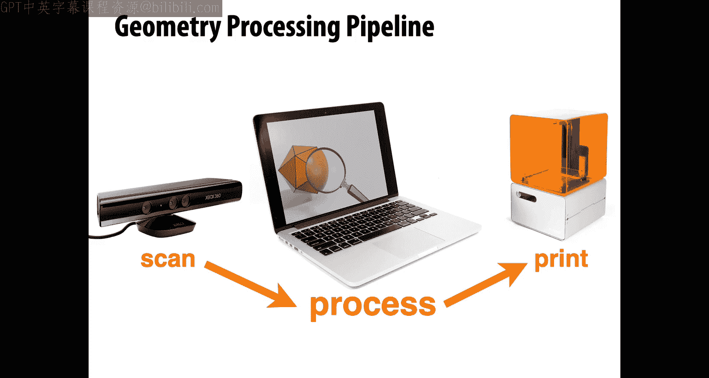

What kinds of processing tasks do we have in the middle Well a lot of these look not so different from traditional signal processing tasks。

 we might be reconstructing a surface from samples。

 we might be filtering the signal so removing noise or emphasizing certain frequencies。

But then there's tasks that look quite different from what we do with traditional signals。

 for instance， taking a curved surface and flattening it out over the plane。

Okay and that's something we already saw that we needed for texture mapping。

 right so there's natural motivation for these kind of new and different questions。

So let's just take a brief look， I'm going to give kind of a high level overview of a lot of these different tasks just to give a general sense of what is geometry processing all about？

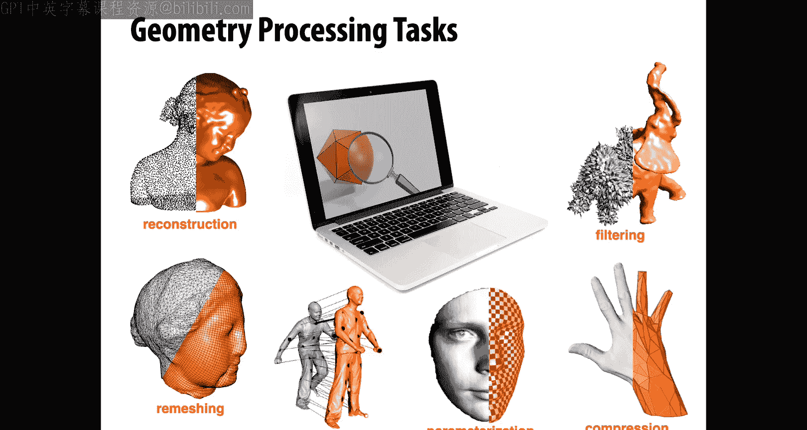

So again， one basic task is reconstruction。You're given some samples of the geometry。

 maybe you're given a point cloud。And you'd like to reconstruct a surface。

 so you want to turn that point cloud into some other useful representation。

 maybe that's a polygon mesh， maybe it's a level set。Right。What are samples could be points。

 or quite often what you have is a little richer information you might have points and normals。

At that point， what was the surface normal direction？You might have yet richer information。

 you might know that those points and normals came from images from photographs or sets of photographs。

 so then that might also give you color information or other information about occlusion where things aren't。

Very different kind of sample that you might have are line density integrals so in medical imaging。

 if you're trying to image bone and tissue you have let's say MRI or CT scans。

 which measure things like what is the total density of that material along a line through space and then you need very different reconstruction techniques to go from those samples to some surface representation？

How do you do it， how do you get a surface， Well again， there are many techniques。

 of course it depends on what kind of data you have。So you might use just silhouettes of an object。

 there are a lot of techniques from computer vision， like a visual hull of an object。

If you have point samples， you might take those and use something called a Vorennooid diagram to get a sense of where the surface is。

You might use techniques based on partial differential equations。

 we'll talk a little bit about those later in the class if you're dealing with line density integrals。

 you might use something called the radon transform。

And then take your volumetric data and turn it into a surface using something called marching cubes。

 there's just kind of an endless list of different techniques that you might need to know about。

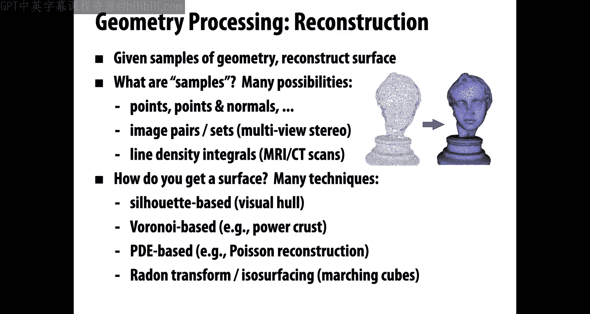

Okay。Another basic task， just like in all of signal processing is upsamp。

 you have a signal of a certain resolution， you've sampled it at a certain frequency。

 and now you want a higher resolution signal， you want it at a higher frequency。

So we've already looked at this a little bit for images if I have a low resolution image and I want to upsample it。

 that's kind of the same as zooming in on a texture map and there I could use well we've seen one technique by linear interpolation。

There are other interpolation techniques that might give you higher quality results。Likewise。

 if I have a very coarse polygon mesh， I only have a rough sense of what the surface looks like。

 but I want a nice smooth surface to render， I might want to upsample it and there we've already seen a little bit about the technique of subdivision。

 but there are other techniques， bilateral upsampling and so forth。

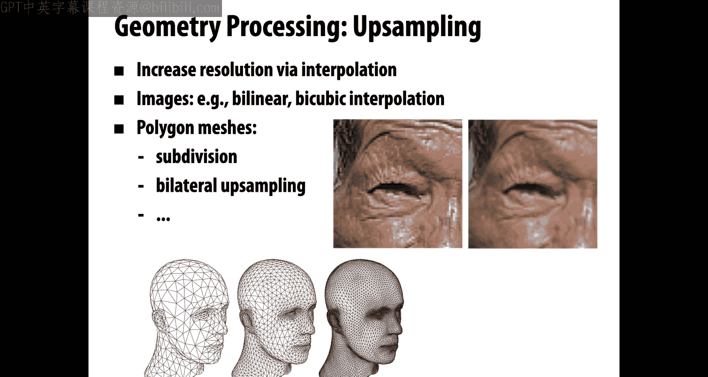

You could also go the other direction。You have a mesh that's too high resolution。

 there's more information than you strictly need， and you want to downsamp it。

 you want to find a coarser， simpler， mesh that's stored in a smaller file， but in that process。

 you still want to preserve the basic shape and appearance of the model。

The object going off into the distance， you want a course in it。

 but you still want it to look the same as it goes off in the distance。 So for images， again。

 there's some very basic techniques， you could just do a simple nearest neighbor filtering or bilinear or pick other ways of interpolating。

If we're dealing with geometry described by point clouds。

 how do I get a coars or point cloud well a really simple thing you could do is you could just randomly take a subset of points。

 it's not clear that's the best downsampling operation right because you might have way more points in some region。

 dense regions and sparse regions and okay which one should you remove points from so it's even interesting to think about how to downsample point clouds。

For polygon mes， there are all sorts of techniques and we'll look at one of iterative edge decimation。

 but there's others like variational shape approximation。

 you find patches of the surface that roughly have the same surface normal and replace them by single polygons。

 things like that。

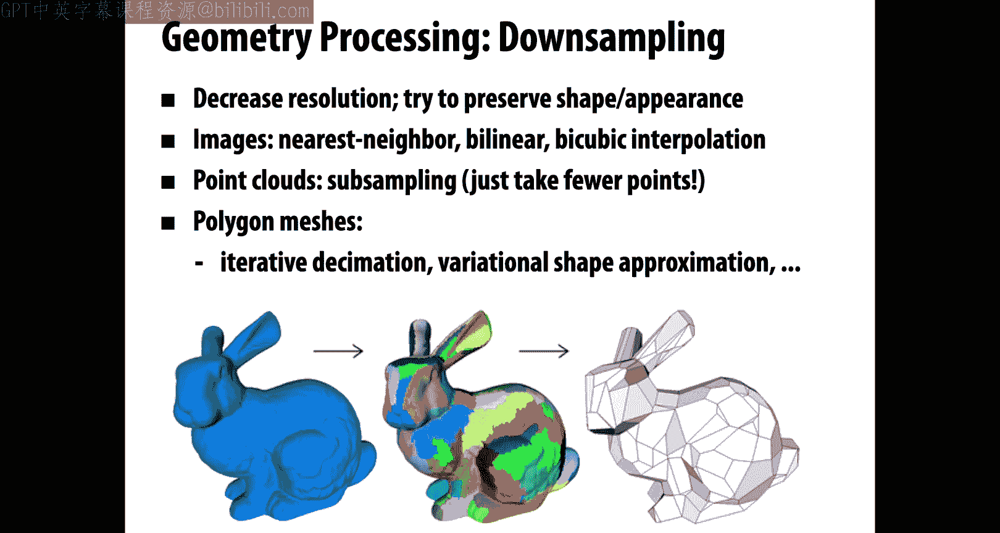

Okay。In addition to up samplingling and downs， when we work with geometry。

 there's something we might do that's a little bit different than what we would do with a traditional signal。

 which is resampling。And we do this not to decrease the file size or increase the resolution。

 but rather to improve the quality of individual polygons individual elements。So for images。

 this is not really an issue， I have pixels stored on a nice regular grid。

There's no reason to change the shape of the pixels。

 maybe going from square pixels to hexagonal pixels in some very exotic case， but with meshes。

 this is quite common that the shape of the polygons in our mesh is extremely important。

 and depending on what kind of algorithm we're going to run。

 we might have different criteria for what it means to have good quality meshes or good quality polygons。

So for instance， if I want to do rendering， if I just want to visualize the surface。

Then I want to use those polygons to get as much geometric detail as possible。

 I don't really care so much about how the individual triangles in a mesh are shaped， for instance。

But if I'm solving equations on a surface， again， if I'm solving partial differential equations。

 for instance， I'm doing simulation of some kind， then I care very。

 very much about what the shape of each polygon looks like with triangle meshes， for instance。

 it's usually helpful if they are close to equilateral， and we'll talk a bit about that。

Another common task in all of signal processing is filtering。

 we might want to remove noise or emphasize certain features， so do edge detection， for instance。

 in images， common things are to， let's say， take something noisy and blur or do bilateral filters to get rid of noise so we can better see what's going on in that image。

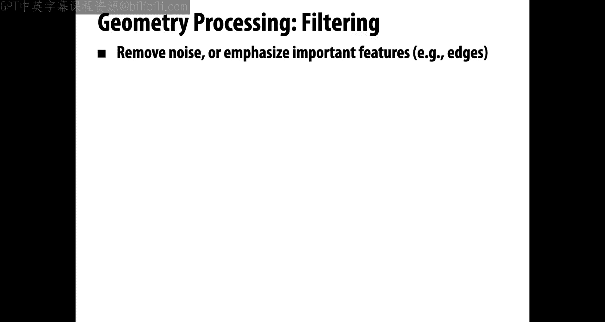

With polygon meshes， there are techniques for doing this kind of filtering but they look algorithmically a bit different from what you typically do for images。

 so we have things like curvature flow， there are generalizations of things like bilateral filters we can do spectral filterings to enhance features so for instance in this model on the lower left。

 you see that we can emphasize or overemphasize features of the face， for instance。

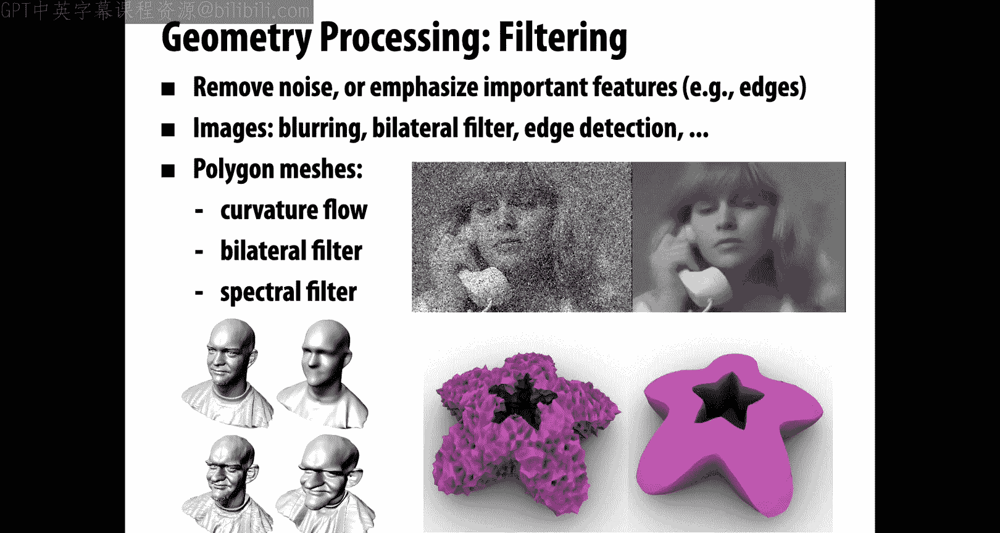

Compression is another classic signal processing task， so what's the goal of compression， well。

 you want to reduce storage size by eliminating redundant data or by approximating unimportant data。

 for instance， data that is not perceptually relevant。So for images， for instance。

 we have a couple different categories of compression schemes， there are lossless encoding schemes。

 things that actually preserve。The exact color of every single pixel。But change the file size。

 reduce the file size， or lossy compression schemes。

Schemes that say we can get even smaller by changing a little bit the color values。

 but in a way that maybe the eye doesn't catch very easily。So here， for instance。

 the image of the elephant gets compressed about 100 times without changing too much the way that we perceive the image。

Now for geometry， say for polygon meshes， compression gets a little more complicated because。

It's not just that we have to compress the positions where things are in space。

 but we also have this connectivity data that we don't have with images。

With an image you just have a regular grid， the only thing you need to describe the connectivity of the pixels is two numbers。

 the width and the height of the image。As we've seen to encode a polygon mesh。

 we need to actually store quite a bit of data to say which vertices are connected up to which other vertices。

Right。And so that's a new and very different problem that people have looked at in the geometry processing regime。

And just like images， there are many different techniques， lossy techniques， and lossless techniques。

Okay， so once we start to get our hands on some of these basic operations up sampling。

 downs filtering。We can start building up higher level algorithms on top of those operations。

 so for instance， we can try to do different kinds of shape analysis。 I have some model。

 It's a long list of vertex coordinates X， Y and Z and some encoding of connectivity。

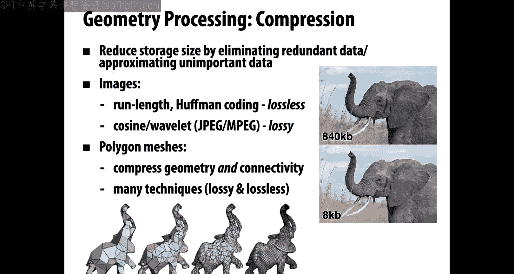

Well， what is that shape， how would you get the computer to automatically decide this is a mesh of an elephant or this is a mesh of a human being？

Right。And with images， this is really kind of the domain of computer vision。

 So there in an image you might be trying to segment the image into meaningful pieces or detect faces or maybe even determine the mood of somebody's face from the image。

What about polygon meshes。Well， again， there's a lot of similar problems。

 I might take a raw list of polygons and try to break it up into meaningful pieces like， oh。

 these polygons correspond to the legs of the chair， these correspond to the back of the chair。

How would you do that， I mean， can you think about how you would do that somebody just feed you this long list of polygons and you're supposed to figure this out。

It's a really interesting challenge。There's also things you might want to know about the relationship between two different geometric models。

Like I have two different scans of the body and I want to figure out， okay。

 I pick a point on one model， let's say it's a fingertip。

And I want to find the corresponding fingertip on another model。Well。

 these vertices aren't given in any particular order， the polygons might not even be consistent。

 different numbers of polygons triangulate in a different way。So how would you go about doing that。

 How would you find you know， how to match the nose to the nose？

Lots of very interesting challenges in shape analysis。Okay， so hopefully that's enticing。

 you believe that geometry processing is a really interesting and challenging problem。

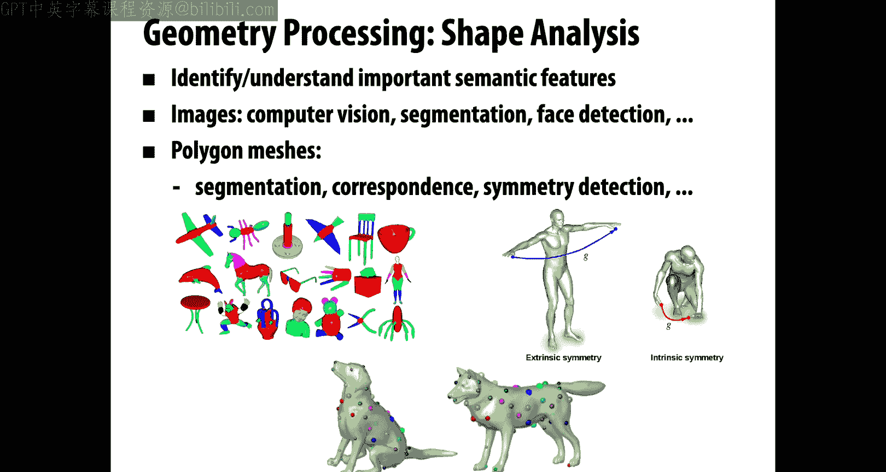

Let's go ahead and do some， let's actually process some geometry。

And let's start by talking about this problem of resampling geometry or what's more commonly known as remeshing。

So remember our discussion of aliasing。This is something that shows up all throughout computer graphics。

 what is aliasing？Well， it means that a bad sampling and then reconstruction of a signal can make it appear different than it actually is。

So， for example。A curve with lots of features， a really high frequency curve。

 if we under sampleamp it， if we only take a few samples， then our reconstructed curve。

 this piecewise linear green line。Looks flat right even though we took samples that are perfect。

 they're exactly on the original signal， we get a bad impression of what this signal looked like。

Well， geometry is no different。Even if we put our points exactly on the surface。

 even if we get the individual coordinates exactly right。Unders can destroy features。

And on the flip side， okay we could just be really aggressive and put samples all over the place。

 but oversampling is bad for performance， we end up using a ton of memory。

 we end up using a ton of processing power， and we might not be getting anything valuable out of it。

So it's a bit of a balancing act to make sure that we are kind of sampling signals at the right fidelity at the fidelity we need for our task。

So how do we know when we have a good sampling what makes a good mesh？

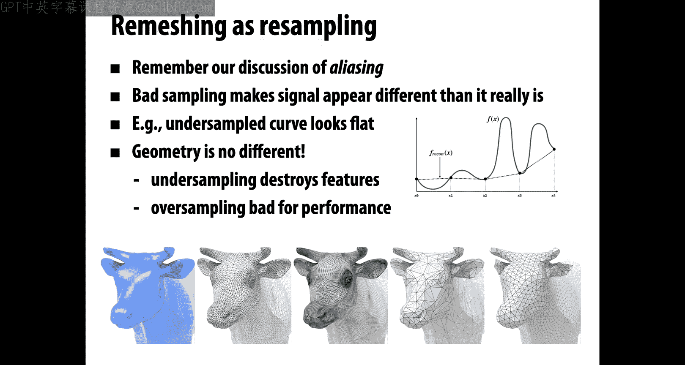

What's a good sampling of a geometric object？Well。One reasonable idea is to say it's a good mesh if it provides a good approximation of the original shape。

So if you really want to be sort of optimal about this。

 you'd imagine you keep only elements that contribute some useful information about shape。

In this example， for instance， we have this。Cylindrical tube with these spherical end caps。

 and we've kept track of more information where it's needed。

 we need more vertices at the end caps in order to represent this more curved region of the surface。

In the middle where it's kind of straight， we can get away with using fewer vertices。

 So this is a pretty good mesh。 It's a pretty at least efficient approximation of the original shape。

However， that's not the whole story。

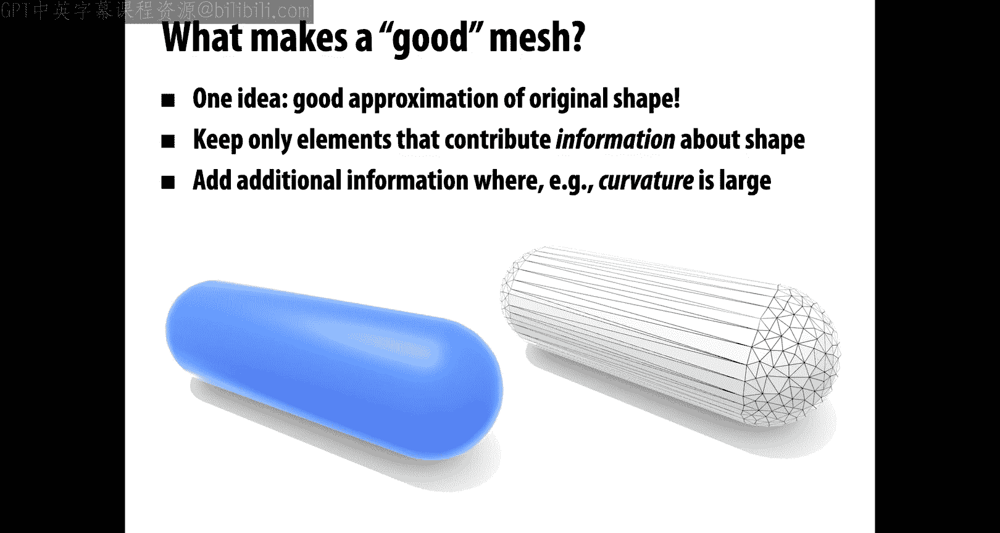

Approxiation of positions is not enough。 So in particular。

 just because the vertices of a mesh are close to the surface or exactly on the surface。

That does not mean that we have a good approximation of that surface。What can happen is， we get。

Even though we have these perfect vertex positions， weak the wrong appearance。

 the wrong surface area， the wrong normals， the wrong curvatures。

 we can get everything wrong about the geometry， even if the vertices are on the surface。

 so even if we go back to just this example of the cylinder。

I'm going to take this smooth cylinder on the bottom left， and I'm going to。

Sample points on the cylinder。And I'm even going to put these on pretty nice places。

I put them in pretty nice， orderly rows and columns。Okay。

 and then I connect them up into reasonable looking triangles a bunch of。I saw C triangles。Okay。

 what happens here？Well， you notice something funny already from just the rendering of these。

 these two polygon meshes， which is。There's this kind of checkered pattern， light and dark pattern。

 Why is that happening？Well， because some of the normals are tilted up and some of the normals are tilted down just by the way that I sampled this。

And so even though all the normals of the cylinders stick straight out。

If I don't triangulate this cylinder carefully， I get a very。

 very bad sense of what the surface looks like， what the shading looks like。Even more damning is。

 it's not just about how it looks。 it's actually about things like the surface area。

 if I measure the total surface area of these two different approximations。

 this coarse and fine approximation of the cylinder。

I'm actually going to end up getting completely different surface areas。

Even though the points are exactly on the surface and even though the triangles have totally reasonable shape。

Okay。So。When we think about getting a good approximation of geometry。

 we really need to consider other factors beyond the basic question of are the positions close？

For instance。We'd like it to be the case that the normals of our polygon mash are also close to the normals of the smooth surface。

And it turns out if that's true， then actually a lot of the properties that we care about of the surface are going to be well approximated。

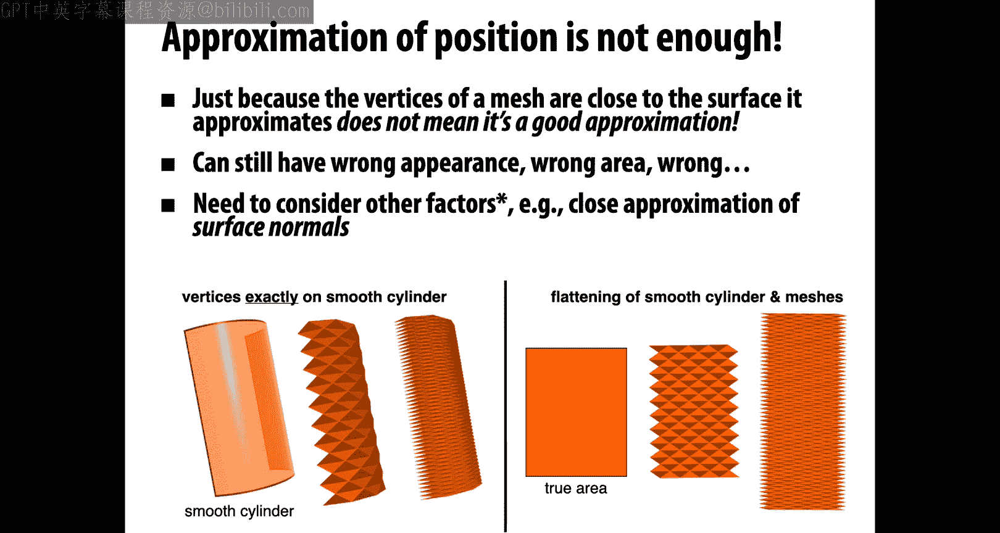

What else makes a good triangle mesh， I mean， all of these are just rules of thumb。

 I'm not being very formal or precise here， but there are some really good rules of thumb。

So I mentioned earlier on that the shape of the triangles can be very important for different applications if I'm doing some kind of numerical simulation。

Then for instance， I might want the triangles to look more like the ones on the left and less like the ones on the right。

This is again kind of a crude rule of thumb， but if you go through and start to learn about a lot of different algorithms and start working with meshes。

 you'll generally have this experience that meshes with long skinny sliver triangles cause nasty problems whereas meshes with nice fat round triangles generally do the right thing。

 so for instance we might ask that all the angles should be as close as we can get them to 60 degrees。

A more sophisticated condition and one that's much less obvious。

 I'm not going to try to justify wild only tell you that it is true that meshes that are delani tend to have very nice properties for a lot of algorithms。

 What does this mean， Delaney， one way to say it is if I have a triangle mesh in the plane。

Then I can look at the circumcircle of every triangle。 so for each triangle。

 I have a unique circle passing through the three vertices。And a mesh is delani， if the。

Circleles are empty， meaning they have no vertices on their interior。By the way。

 just as a mnemonic Delani， you can think this is something like the word bologney。Okay。

Dlani meshes often help with numerical accuracy and stability。Okay， that's a very loose statement。

 but it's approximately true。Also， Delani meshes show up all over the place in very surprising and also natural ways。

So things I can say about delaning triangulations， well， for instance。

 they are going to maximize the minimum angle。Of the mesh， in fact。

 it's going to do that lexxiographically。They're going to provide the smoothest interpolation of data on vertices。

 so if I use barrycentric coordinates or linear functions to interpolate data avertices。

 a Dlani mesh is going to give me the smoothest interpolation of any triangulation of those points。

 that's something called Ra's theorem。And more sophisticated things。

 so when we talk about partial differential equations， we can talk about Laplace equations。

Solution stillapplace equations satisfy something called a maximum principle。

 and that will also be satisfied if we have a delani triangulation。

So just all sorts of good things come out of delani triangs。The trade off。

 there's always trade offs in life。The trade off here is that you might not get as good of a geometric approximation in general if you're trying to optimize the shape of your triangles。

You might be giving up the accuracy of the approximation of your underlying smooth surface。

 so for instance， it might be the case depending on your shape。

 that long skinny triangles are much more efficient at just approximating the surface like that cylindrical thing that we saw earlier。

 right。So it's a balancing act， do you want to do a good approximation of the geometry。

 do you want to have good quality elements， well really you want to be somewhere in the middle or you kind of want both。

Okay。

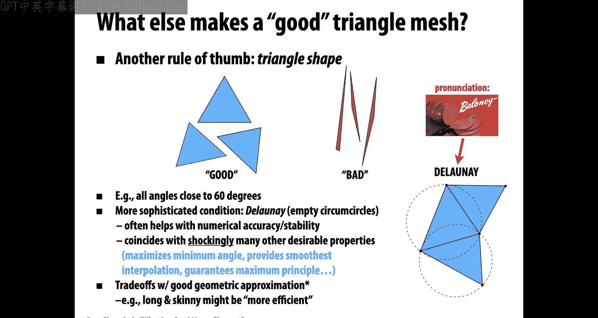

What else constitutes a good me， here's another rule of thumb。Having regular vertex degree。

 so the degree of a vertex is the number of edges touching that vertex。

What does it mean for that degree to be regular， Well， if I have a triangle mesh。

 we're going to say I have a regular vertex degree if all the vertices are degree 6。

 Why is that Well， if I tile the plane by equallateeral triangles。

 then every vertex is going to have degree 6。 Likewise， if I tile the plane by regular squares。

 then every vertex will have degree 4。Okay。So if we see a mesh like this one on the left where vertex is degree 6。

 that's a pretty good mesh， if we deviate a little bit from 6。

 that's not so bad if we're degree 5 or degree 7， this is a pretty pretty reasonable mesh。

 but if we start getting really， really high degree vertices or really low degree vertices。

 okay we can only go down to three really。Those are starting to get worse in some very loose sense。

Well， why， why would we care about the vertex degree？For one thing。

 we just talked about the fact that we want good polygon shape。

 we want triangles perhaps that are close to equilateral。Okay， well。

 in order for triangles to be close to equilateral， they have to have a tiling that looks， you know。

 something like this， something like a tiling of the plane。

 so generally they'll have degrees that are close to6。Okay。On the other hand。

 if we have triangles that all have very irregular degree， it's very， very hard to arrange them。

So that they have good shape， right， So there is some kind of。

Tension or relationship between vertex degree and triangle shape。

Another reason for having regular degree is it leads to more regular computation。

If you have regions of your mesh that are made up by just tilings by regular polygons。

 the connectivity is regular， then it becomes easy to do things like map that region of the mesh onto a regular array。

And then you can do really efficient， parallel computation， this kind of thing。

Another reason is regular degree helps with subdivisionions。

 so if I take a regular degree vertex like this degree 6 vertex and I subdivide all the way to the limit surface。

 I'll get some really nice smooth subdivided surface if on the other hand。

 I start with a really high degree vertex degree 20。And I run my subdivision。

 I'll often get nasty artifacts like this， so rather than having this smooth bump。

 I get these little wrinkles all over the surface。And in general。

 what I'm going to get is shading artifacts， normals are going to look wrong。

 reflections are going to look wrong， and so forth。Now。

 an important mathematical fact is that in general， you cannot have regular vertex degree everywhere。

If I have the sphere， there's no way to arrange triangles on it so that all vertices have degrees 6。

 there's no way to arrange quadrilaterals on it so that all vertices have degree 4。

But we can be thoughtful about where we put these irregular vertices and try to keep them to a minimum。

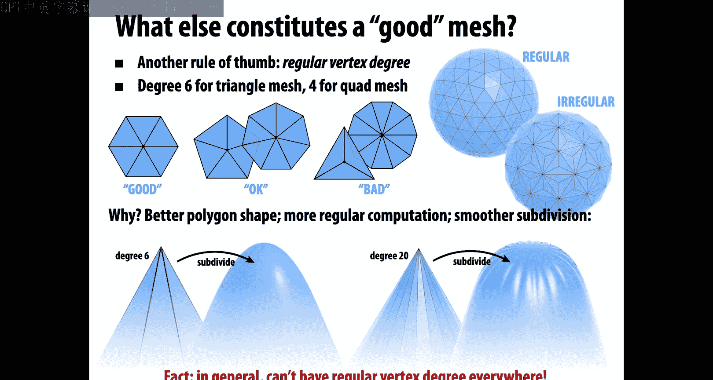

Okay， so how do we do some basic tasks like up sampling a mesh？Well。

 our basic tool for up sampling is going to be subdivision。

The basic idea of subdivision is we're going to repeatedly split each element into smaller pieces。

So that's a statement about the connectivity of the mesh。Once we've subdivided the connectivity。

 we're going to replace the vertex positions with a weighted average of the neighboring vertex positions。

 so that's a statement about the geometry of the mesh。

What are some considerations when we're thinking about how to do this averaging or how to split these elements。

 what are things that we would like out of this subdivision scheme。

 right that we could do this in a completely arbitrary way， but what's a good subdivision scheme？

Well， one question or one criterion we might think about is whether the scheme is interpolating versus approximating。

Does the limit surface exactly pass through the vertices of the original control cage or does it just come near those vertices？

AndFor some applications， we really care that it goes through the vertices。 for others， we may not。

We also care about the continuity of the limit surface so the whole reason for doing subdivision is that we in some sense。

 want to make the surface smoother。And so we'd like to have it have kind of as many derivatives as possible。

We could ask that it be once differentiable or twice differentiable and so on。

We also want to know how does it behave at irregular vertices if I do happen to have a few really high degree vertices。

What happens there， I it really， really bad and crazy or do we just lose one degree of differentiability？

There are lots of different options for subdivision schemes。

 lots of good subdivision schemes that have nice properties。

 the most common for quadrilateral meshes is something called Camel Clark subdivision。

Perhaps the most common for triangle meshes is something called Lo subdivision。

 but there are other schemes like butterterfly， square root T， and so forth。

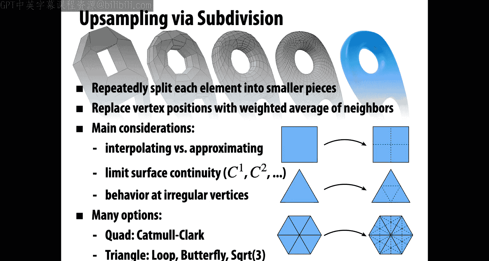

So how does this work in more detail， so Camel Clark's subdivision actually is not just for quadrilateral meshes。

 but we can start with polygons of any kind and through the subdivision process they will all turn into quadrilaterals so the first thing we do is insert somewhere in the middle of this polygon and new vertex and connect that to new vertices somewhere in the middle of each of the edges。

How do we actually decide on the？New vertex positions。Well。

 they're a weighted combination of the old ones。So we can break this down into a few steps。

The first step is to determine the coordinates of this new vertex we inserted in the middle of the face。

And for that， we're just going to take the centroid。

 we're just going to take the arithmetic mean of all the polygon vertices。

Once those have been determined， we then compute the edge coordinates。

 the locations of the new vertices we put in the middle of each edge。How do we do that， well。

 we average the two endpoints of the edge and the two new face points that we just made。

And then comes the only complicated part， which is computing the new coordinates of the vertices。

 and I'm not going to try to explain where this rule comes from。

You can look up Kael Clark's subdivision if you're interested in。

 but basically this rule has been designed in such a way that we get nice properties so that the limit surface is a nice regular surface。

Okay， but what do we do。Well， let's see。 so if the vertex is degree n。

 it has n edges sticking out of it。And Q is the average of all the face points around the vertex so just the arithmetic mean of all the face points around the vertex。

And R is the average of all the edge coordinates around the vertex。

And S is the original vertex position， then you see it right there。

 the new vertex coordinate is Q plus 2 r plus n minus3 times S over n。

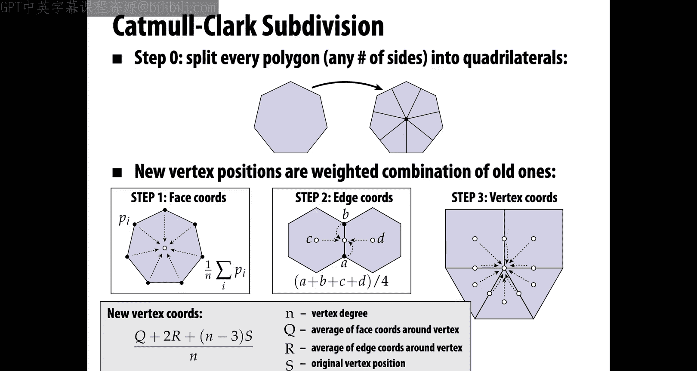

Okay， so let's look at what this actually does to some mesh， so we start with this coursear mesh。

And we apply exactly the rules from the previous slide。And we get this mesh。

And what you notice about the subdivided mesh。Is because of the way we decided to update the combinatorics。

 we have very few irregular vertices。In the subdivided mesh。In fact。

 the only reason we would have an irregular vertex in the subdivided mesh is because there was an irregular vertex in the original mesh。

It doesn't introduce any new irregular vertices。And for that reason。

 this limit surface is well behaved almost everywhere， if we stay away from these irregular vertices。

 it has really nice normals and curvatures and all the other nice properties you'd expect to have in a smooth surface。

Why does this matter， well， let's say we wanted to render some really glossy mirrored surface。

 we turn this face into this mask and if we zoom in。

 you notice that we have really nice smooth reflection lines。

something you wouldn't see in a coarse polygon mesh we also have nice smooth what are called caustic so if you have a really shiny surface like metal and you shine a really bright light on it。

 that light is going to get focused in interesting ways， kind of like a magnifying glass focus light。

And here we see that that pattern of light is really nice and round。

 like you might see in the real world。Okay， so just as a point of comparison。

 let's go ahead and try to apply this same CAel Clark subdivision scheme。But this time。

 we're going to start with a mesh where all the polygons are triangles。RightAnd remember。

 we can apply Cael Clark to triangles， we can apply Cael Clark to any kind of polygon。

By just sticking a vertex in the middle of the polygon and away we go。

But what's going to happen here is because all of our vertices are degrees 6。

They're not regular from the perspective of a quad mesh， a quad mesh wants to have。

Vertices of degree 4。So when we subdivide this mesh with camo Clarkk。

 we get irregular vertices all over the place， we get really kind of erratic surface normals。

 if we look at the reflection lines， they look really jagged。

 if we look at the caustics that reflect off this surface， they also look jagged and erratic。

So for this reason， if we want to do subdivision on a triangle mesh。

 we need a different scheme and one basic scheme is loop subdivision that's our basic scheme for triangle meshes。

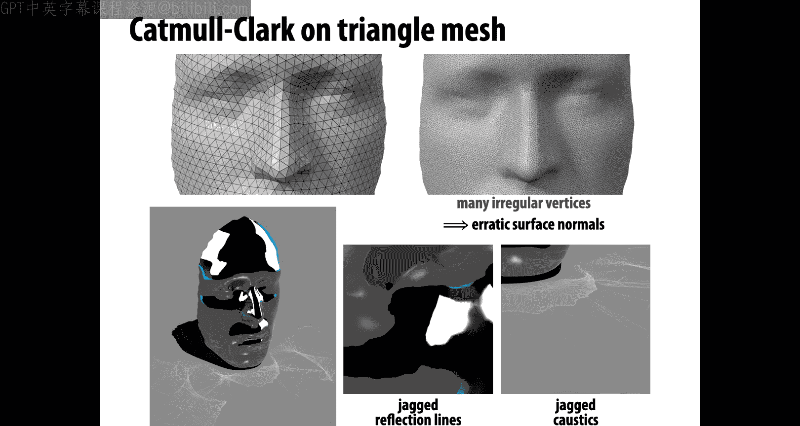

The limit surface will be nice。 The curvature will be。Continuous away from irregular vertices。Okay。

 so it'll be twice differentiable。And it has a very similar flavor of algorithm。

 but with different rules。So what are we going to do this time well first。

 we're going to split each triangle into4。By just inserting vertices on the edges。

And then we're going to assign new vertex positions according to some other set of weights。So first。

 we put the new vertices on each edge at a weighted average of the four vertices from the triangles containing that edge。

So the two opposite vertices get a weight of 1/8， the two endpoints get a weight of 3/8s。By the way。

 you notice something interesting here，1/ eighth plus 1/ eighth plus 3/ eighth plus 3/ eighth is equal to 1。

So that means this new vertex is a convex combination of the neighboring vertices。In general， points。

On the subdivision surface are going to be。In the convex hall of the points used to generate them。

 and that's a useful property， for instance， if we want to do collision detection。

 that kind of thing。To get the new locations for the vertices， we again have some formula。

You can go look up loop subdivision if you're interested in where these formulas come from。

 but what we say is if n is the degree of the vertex。

Then we have a value u equal to 316th for the special case where it's a degree3 vertex and U is equal to 3 over 8 n otherwise。

Okay， and then the value of that vertex is going to be。

 well we take a weighted average of all the neighbors of the vertex， we give them each weight u。

 and we give the center vertex a weight1 minus n U， so another convex combination。Now。

 one thing you're going to have to think about at some point is how do we actually change the connectivity if we have our half edge data structure。

 for instance。What do we do to update the connectivity？

We could do a ton of pointer reassignments to build in those new elements。But actually。

 you might remember last time we talked about different local edge operations like splitting。

 flipping， and collapsing， and conveniently enough。

 if we already have these basic atomic edge operations。

 we can use those to implement this subdivision process。

So the first thing we do is split the edges of the original mesh in any order。Right。

 and I'm going to draw the。New edges in blue， the new vertices in blue as well。

And this might seem a little surprising， you'd think， okay。

 depending on what order I split the edges， I'm going to get a different triangulation。

But what we're going to do next is flip any new edges。

 so any of these blue edges where one of the endpoints is a new vertex and the other endpoint is one of the original vertices。

And if you do this， if you look at this little picture here and you imagine in your head， okay。

 I'm going to flip that edge and that edge and that edge and that edge。

 what you'll discover is the connectivity you get is， well， it's exactly the one we wanted。

 it split every triangle into four smaller triangles。Of course。

 to complete the loop subdivision process， we have to update the vertex positions according to the rules that we just saw。

All right。So now let's go the other direction that was up sampling if we want to make the mesh higher resolution。

 we just keep subdividing。What if we want to go the other direction。

 we want to make the mesh lower resolution。 Well， if we happened to have generated the mesh from subdivision。

 maybe we could just undo the subdivision。But in general。

 that's not true somebody could just hand us a triangle mesh and we'd like to downsamp it。

So one way to do this is to do some kind of simplification based on edge collapses。

So this is a popular idea， we're going to iteratively collapse edges to simplify the mesh。In fact。

 we're going to do a greedy algorithm， we're going to give some kind of cost to each edge。

Then we're going to just figure out of all edges， which one has the smallest cost。

 which one basically changes our surface the least， okay。

And then we're going to keep on collapsing edges until we reach some target number of mesh elements。

And although this is a greedy algorithm， although this sounds like it's not going to do the best job。

This turns out to be really， really effective， especially if you use a particular cost function called the Quadric error metric。

 which by the way was invented here at CMU back in 1997。Okay。

 so this image at the bottom is an example of using the quadric errormetric to do this greedy edge collapse simplification。

 we start out with this high resolution mesh of the skull。

We start collapsing and we get down to a mesh of 3000 triangles。

 so 10 times fewer triangles still looks pretty good。

Especially if you imagine this is some small object off in the distance in a scene。

 you really probably couldn't tell the difference。Now if we go down even another factor of 10。

 we go down to 300 triangles still looks quite good。

 it's not until we get down to 30 triangles that we really kind of lose track of what this looks like。

Okay， so this was pretty cool that a simple， greedy， heuristic can do a really。

 really good job of simplifying geometry。

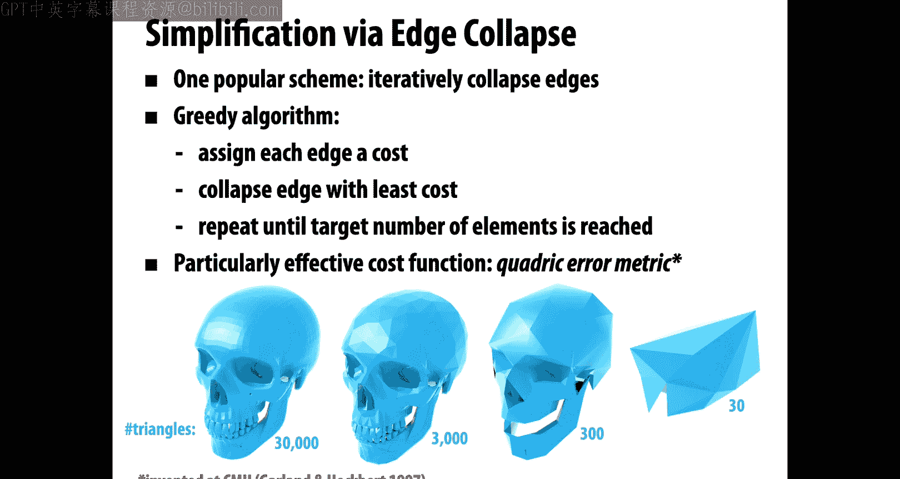

All right， so how does this actually work？Well， let's start out by talking about how we measure error。

And the basic idea is to store， keep track of something called a quadric。Which， intuitively。

Keeps track of the distance to some collection of triangles。So for instance。

 we might have a quadric that tells us how far are we from all the triangles around a point。Okay。

 so how do we build this thing up， Well， let's start with a really basic calculation。So question。

 how would I compute the distance？Of a given point X to a plane。

With normal N that passes through a point P。What's an expression for that distance？Okay， well。

 one way to think about this is we could say。How far along the direction N is the point X？

So if n is a unit vector。Then that's just the inner product of n with x。

And we are going to subtract from that how far along the direction N is the point P。

P is a point on the plane， so we can do n dot p， so n dot x minus n dot p。

 or equivalently we could write n in a product with x minus P。

 What is the extent of the vector from P to x in the direction n in the direction of the normal of the plane。

Okay。So that distance function will look something like this or actually here I'm plotting the square of the distance function。

And the quadric error is then the sum of the squared point to plane distances for all the planes in this set。

So for instance， if I want to quadric for all the triangles around this point P or a really。

The planes of all the triangles around this point P。

 then I'd say my quadric Q of x is the sum from i equals 1 up through k。

 in this case 5 of the normal dot x minus p squared。Okay， how can we think about this quadric。

 How can we kind of。Visualize what's going on here。 Well。

 one way to do it is we could plot level sets of the function Q。 We could find。

Places where Q has a constant value。So if we set Q equal to 1。

 we get this kind of ellipsoid centered at the。Vertex， if we set Q equals1/ half。

 it's a little smaller。 Q equals 1，8， It's a little smaller。 Q equals0。We just get the point itself。

that's pretty interesting。 So why is the quadric error equal to 0。At the point， P。Well。

 we said that the quadric error is the sum of squared point to plane distances。

He gives us the tells us。How far are we from all these planes in total？

And the only point that is on all of these planes simultaneously is the vertex It's the vertex of this little region of our mash。

Okay， but in general， the quadric is a lot more interesting than just the distance to the vertex。

For one thing。Imagine that this vertex neighborhood is kind of flatter。 Well。

 then our quadrick is going to get。Squash down like a hamburger。

If the vertex neighborhood is tall and skinny， it's going to also get elongated in the vertical direction like a hot dog。

 right so it really is keeping track of kind of the distance to this little region。

 not just to the point。Okay， the other thing that's interesting about this is we can use this quadric errormetric to measure the distance to any collection of planes。

 It doesn't have to be a bunch of planes that all。Come from triangles around a vertex。

 it could be a bunch of different triangles from all over our triangle mesh。

And that's really how we're going to use it， we're going to use the quadric error metric to see how far we are from some region of the mesh。

Now to make this all work a little better， we're going to express。

The quadric error in our favorite representation， which is homogeneous coordinates。

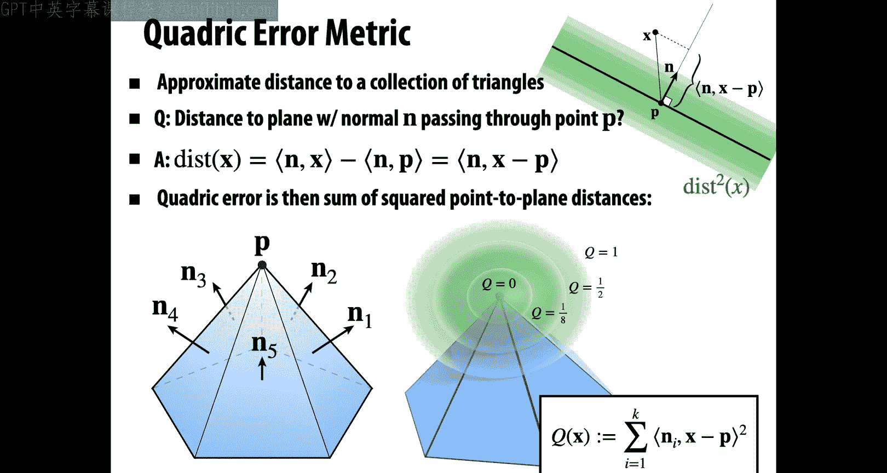

So let's say we want to write the quadric error to just a single plane， again。

 we have a plane passing through a point P with unit normal N。

And suppose that in ordinary coordinates， we write our query point X as three components， x， Y， z。

 right this is where we want to measure the distance or the error。

We're going to write the unit normal N as three components， A， B， and C， and we have an offset D。

 which tells us how far the plane is from the origin。So since p is a point on the plane。

 that's going to be equal to n dot p。In homogeneous coordinates。

We can write the query point as u equal to x， Y， z1。

 so we just add this fourth homogeneous coordinate to the query point。

And we're also going to have a homogeneous point V equal to A，B，CD。Okay。

 so the first three components of V encode the normal of the plane。

The final component encodes the offset。And by the way， this is really interesting。

 this is a really kind of cool fact about homogeneous coordinates。I can represent a plane。In R3。

A plane that doesn't pass through the origin necessarily with a single point in homogeneous coordinates。

And so points and planes are in correspondence。In this case that lets me do something really nice。

 I can express the signed distance to the plane as just the inner product between U and V。

 if I take the inner product I write it out， I get A X plus B Y plus Cz plus D。

 So is my usual distance formula。The square distance to the plane is then。

 well the square of that inner product， which in matrix notation I can write as u transpose v times v transpose U。

And。If I group those two V terms together， then I can also write this as a quadratic form。

 u transpose K U for some fixed matrix K matrix that looks like this。So this matrix K。

Or VV transpose encodes the square distance to the plane， if I have a query point X。

 I can just stick it on both sides of this matrix， I get the square distance to the plane。

And the key idea。Of this quadric error metric or the thing that makes it work really。

 really nicely is that if I want to take a union of planes。

And measure the distance to that union of planes or the sum of square distances。

Then I can just sum up these matrices K。So no matter how many planes are in this set。

 everything boils down to just a single4 by4 matrix。

I don't get a growth in the size of my distance function as I add more planes to my set。Super。

 super cool So if I have two quadrics， K1 and K2 from different planes。Then。

U transpose K1 U plus u transpose K2 U is equal to u transpose K1 plus K2 U。

And so then I can just store the sum of the matrices rather than the individual matrices or the individual points and normals。

Right。Okay。So。Let's think about how we can now apply this quadric errormetric to our E collapse operation。

So let's say I have this edge in my mesh EIj with npoint I and J。

How much does it cost to collapse this edge？Well， one thing I could do is I could just go ahead and perform the collapse。

And stick the。New point somewhere like the midpoint of the edge。

And then plug that midpoint into my quadric。What does that tell me？In essence。

 it tells me how well does this new collapsed region？Approximate the original region。

This is kind of a score for saying。Is this a good edge to collapse or not？

If the quadric value is really big， that means moving these endpoints to the midpoint is really changing the geometry of the surface。

If on the other hand。This vertex neighborhood， let's say it was really， really flat。

Then my quadric is also going to be really， really flat。

 and it doesn't matter as long as I keep my new points somewhere in the plane of those original triangles。

 I didn't change the geometry at all。So different edges are going to change the geometry more or less kind of depending on how curved the surface is in that region。

Okay。Something even smarter we could do rather than just sticking the new vertex at the midpoint is we could try to find the best possible points。

To put the collapsed vertex， where should I put the new vertex to best approximate this little patch of surface that I originally had。

Okay， and how do I do that， well I minimize I could move the point x around to minimize the quadric error Q of x。

In general， I should be able to find a point that's better than the midpoint。

 So I've really plotted here。 this green plot is really showing the actual quadric for this。Edge。

 the sum of the two quadrics at the two endpoints。Okay。

 and you can see that x moving it a little bit away from the midpoint actually does a better job。So。

How would we actually find that point， how would we minimize the quadric error？Well。

 as always in life， we should start by thinking about a simpler problem。

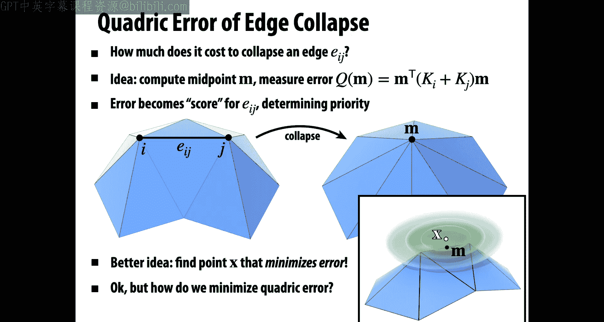

So let's go back to just ordinary calculus。And let's say we have a function。

 f of x equals aX squared plus Bx plus C。Okay， so first of all。

 what does the graph of this function look like。Well， it depends a little bit on our choice of A。

 B and C， but generally it looks something like this， it's a parabola。Okay， now importantly。

It could also look like this， it could look like a upside down parabola。Right。Okay。Question。

How do we find the place where this function。Is smallest， How do we find the minimum of F。

hopefullypefully if you took calculus， then one thing you remember if one of the most important things you remember is。

 well， the first derivative test right I'm going to find where the function looks flat。

 if I really zoom in close， that's kind of where the interesting point is， in other words。

 we want to find the point x where the first derivative vanishes， where f prime of x is equal to0。

Okay，If we actually go ahead and take the derivative over function a squared plus b x plus C。

 the derivative turns out to be what？We just get 2 a x plus b is equal to 0。

 and we can solve for x to get x is equal to minus b over 2a。Okay。

 so is x the point where F of x has the smallest possible value？

What does x described for the second function， the function on the bottom？

All we've really done here is figured out where the function looks flat。

 we' found where the function has a critical point。

 so for the first function it's a minimum for the second function， it's a maximum。Okay。

 but what I want us to just remember。For now is that to this critical point。

 we take our quadratic function。We calculate its derivative and we solve for the place where this derivative is equal to zero。

Okay。Minimizing a quadratic form is really not much harder than just minimizing an ordinary quadratic polynomial。

Okay。And it turns out actually we can always write a quadratic polynomial in n variables in terms of a symmetric matrix A。

 so for instance， let's say we have a polynomial f of x Y。

Is equal to aX squared plus Bxy plus Cy squared plus dx plus Ey plus G for some constants， ABC， D。

 E G。Okay。Then we can write this in kind of matrix notation by encoding the two arguments x and y in a single vector。

X。We can build a matrix A that stores the coefficients of the。Qudratic part。So， a。

Be over to be over to see。And a vector U that has the coefficients of the linear part。

And if we do this， then we can write F as x transpose Ax plus u transpose x plus G。

 if you don't believe me， multiply it out and you'll see you get exactly the same formula as before。

And by the way， we can write a quadratic polynomial this way。No matter how many arguments it has。

 no matter how many variables n。Okay， it's always going to be。

X transpose AX for some symmetric matrix plus， blah， blah blah。Okay。Most important question。

How do we find a critical point of this function， how do we find a point that is a minimum maximum or saddle？

What do you think。Okay， if you don't know what to do。Then what you should try first。

 the first thing you should think is， well， what did I do in the one dimensional case。

 what did I do when I just had F of x？What was the basic strategy to find a critical point？

What you did is you set the derivative to zero。You set the derivative to0 and solve for x。Well。

 that's exactly what we're going to do here as well， we're going to take the derivative of F。

With respect to X， or if you like， you could imagine taking the derivative with respect to the two components。

 x and y。If you work this out， what you'll discover is that the derivative is。2 AX plus U。Okay。

 so we want to solve 2 ax plus u equals0 for the vector x。 How do we do this well。

 we move u to the right， subtract U from both sides， divide by 2。

 and apply a inverse to both sides to get x is equal to minus1 a inverse U。Okay， if。

 if this felt tricky to you， then you should take a moment and just。

Make sure that you can show it's true at least in 2D。

 I think once you do this once you do it in two dimensions， okay。

 you'll be convinced for all other dimensions and this won't seems so mysterious。Okay。

 but but importantly， what we notice here is we compare with our 1 d solution。

 It's really not so different， right， How did we get x before We did minus B over 2 a。

 How do we get x now we do。Mus。U over 2 a sort of right we're kind of dividing by a。

 so not much changed here。Maybe we have to invert a matrix， right？Okay。

The one lingering issue is this question of， is this point really a minimum or is it a maximum or is it a saddle。

Okay， and just like in 1 D， this critical point is， of course， not always a minimum。And so。

We have this question， when is this actually going to give us a minimum。

 if we're in two dimensions or three dimensions or n dimensions。

When is this critical point giving us a minimum？Do you know。Well。

 the answer it turns out is it'll be a minimum as long as the matrix A is positive definite。Meaning。

 if x transpose ax is greater than 0 for all x， then we will get a minimum。Okay。

Maybe you think about this in a simpler case。 What about in 1 d。

 what this means is just that x times a times x is greater than 0。 A x squared is greater than 0。

 In other words， as long as a is positive。So if a is positive， then our polynomial。

AX squared plus Bx plus C describes a parabola that is kind of convex up so the only critical point it has is at the bottom at the minimum。

Likewise， what does this positive definite condition mean？For our matrix A， if we were to plot。

 let's say f of Xy for all points Xy。Well， if a is positive definite。

 then we have a graph that goes up that looks like a bowl。Okay， and for that reason。

 the only critical point we can find in this bowl is at the bottom。Is at the minimum。

If this matrix is not positive definite， let's say's。

Only positive semi definite So there's some vector x such that x transpose Ax is equal to0。

 some nonze vector x， then we get multiple minima。Let's say along the bottom of a kind of cylinder。

 an extruded pararabola。And if it's indefinite， if x transpose a is sometimes positive and sometimes negative。

 then the critical point will be a saddle。Okay。So the case we really want is we want。

Our matrix to be positive definite。 If it's positive definite， we can really find this minimum。

 no problem。 We just solve this。Linear equation we invert this matrix。In general， by the way。

 positive definiteness is a really， really important concept in computer graphics。

 If we can formulate our problem in terms of a。Energy or a function that uses a positive definite matrix。

 Then we can easily find minimal or optimal solutions by just solving linear equations。

 and this is the starting point for all sorts of algorithms across geometry processing and animation and simulation and so forth。

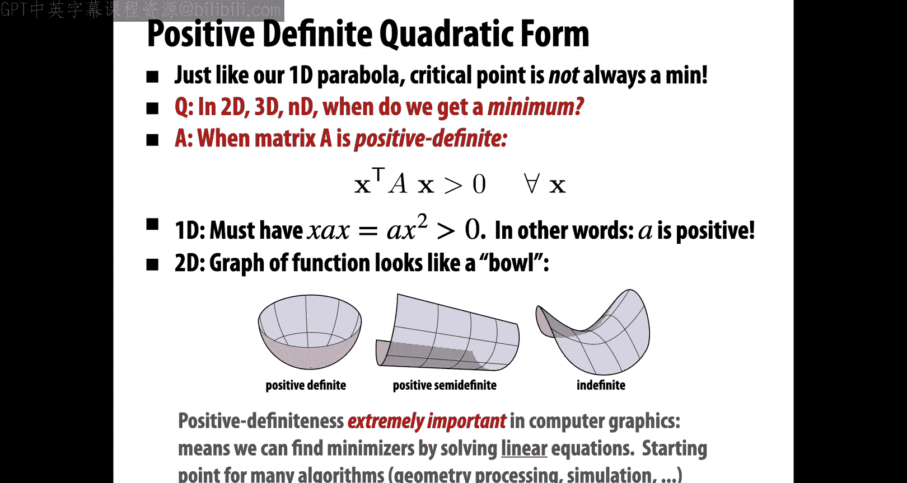

Okay， so let's come back to this problem of minimizing the quadric error。

 which we need to do to place our collapsed vertex。

 right we wanted to find the best point for an edgech collapse by minimizing this quadratic form。

So among all points U and R4， among all homogeneous coordinates。

We want to find the one that makes the sum of the square distances to all these planes as small as possible。

Now， one thing we know already is that any point can be encoded with a homogeneous coordinate of one。

So in fact， we don't need to solve for all four components of our unknown point。

 just the first three。So we're going to break everything up into two pieces。

Our unknown will break up into an unknown vector X with just three components and the homogeneous coordinate 1。

 and we'll break up our matrix K into a 3 by 3 matrix B， a。3 by one vector W and a scalar d squared。

Okay， so we multiply this out， we get。That the thing we want to minimize is x transpose Bx plus 2 w transpose x plus d。

 where x is unknown。So we now have a quadratic polynomial in three variables in the unknown position X。

 and we can go ahead and minimize just as before。We know now how to minimize a quadratic polynomial in any dimension。

We take the derivative of the polynomial with respect to x。 We get 2 bx plus 2 w is equal to 0。

 and if we solve for x， we get。What do we get。We can just get x is equal to minus b inverse times W。

Okay， if you've been。Paying careful attention， you're maybe thinking at this point， wait a minute。

Is this really a minimum y？Why should B be a positive definite matrix？

Is this really a minimum or is it just a critical point？Okay。

So a really good question to think about， answer in the comments。Is B really always a positive。

 definite matrix。Could it ever be indefinite， could it be semi deffinite what's going on here。Okay。

 but you'll probably guess that things work out pretty well。

 otherwise we wouldn't be using it for this algorithm。Okay。

 so let's go and look at our final algorithm， we can put all these pieces together now。

So the first thing we're going to do is initialize our simplification process by computing。

A quadric K for every triangle in our mesh。Which just measures the square distance to the plane of that triangle。

At each vertex of our input mesh。We're going to sum up the quadrics of all the triangles containing that vertex。

And for each edge。Yaiize。We're going to also compute a quadrick。

 which is the sum of the quadrics at the two endpoints， KI and KJ。Okay。

To assign a cost or a score to that edge， we're going to find the point x minimizing。

The quadratic error for that edge and set the cost to K IJ of x。Okay。

 so where we are at the beginning is we haven't touched ourMS yet。

 we've just gone and assigned a score to every edge that says， if I were to collapse this edge。

 how badly would I change the geometry？If the quadric error is small。

 I'm not going to change the geometry very much， it's okay to collapse those edges。

 if the quadric error is really big，ooof， that's really going to change the way the surface looks。

 maybe I should leave those alone。Okay。And then until we reach a target number of triangles。

 we're just going to do a greedy collapse procedure。

 we're going to find the edge with the smallest cost。We're going to collapse it to the optimal point。

We're going to set the quadric at the new vertex。To， well， actually。

 the same way that we did it during initialization， right， to the sum of the。Two endpoints， okay？

And then we're going to update the cost for all edges that touch this new vertex。

All those edges kind of have an invalid score now because well， the geometry changed。

So we update the cost of those edges by just summing the quadrics through two endpoints。Okay。

And there's， more details about exactly how this works in the assignment right up。

 but it's good to take a moment to think about what's going on here。We start out with our fine mesh。

We start collapsing these edges， and in a sense， we start accumulating the quadrics。

 So this matrix that we're adding to and adding to and adding to and adding to。

Is actually keeping track of at any moment in time。

 it actually represents the exact sum of square distances to all the triangles from the original mesh that contribute to that coarse edge。

So even though we're collapsing and collapsing and collapsing and summing up these matrices。

 somehow we're retaining some exact information about the original surface。And that I think。

 is why this ends up being such a good heuristic， why this does such a good job of approximating the input mesh。

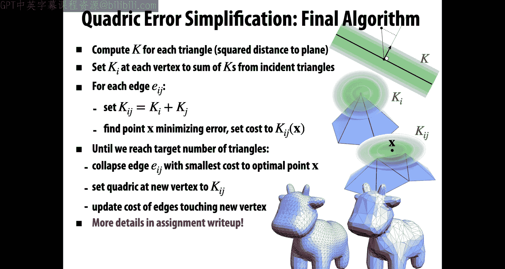

Now there are a couple things you have to be careful with from a practical point of view when you apply this kind of simplification。

嗯。And one that is kind of not well documented is that depending on where you put the new vertex。

One of the new triangles might be kind of flipped in an ugly way。 So， for instance。

 let's say this black edge she is the one we're going to collapse。

 And if we were to collapse it here， if our quadric era tells us to put it kind of right in the middle。

Everything's good， all these triangles look perfectly reasonable and we can keep this edge collapse。

But you could imagine a situation where the new vertex is in some other place that causes the mesh to not look so great。

 so it causes things to maybe flip over， so these red triangles are ones that flipped over during the collapse。

What do I mean by flipped over， I mean that the normals of the red triangles and the normals of the blue triangles are pointing in kind of opposite directions。

So an easy solution to this is for each triangle IJK that touches the collapsed vertex。

 you can consider the two normals， the normal of the triangle IJK and the normal the triangle KJL and if the inner product of those two normals is negative。

 then just don't bother collapsing the edge， just put it back and try another one。Okay。Otherwise。

 the algorithm works pretty well， it's pretty mean and clean and gives really nice results。

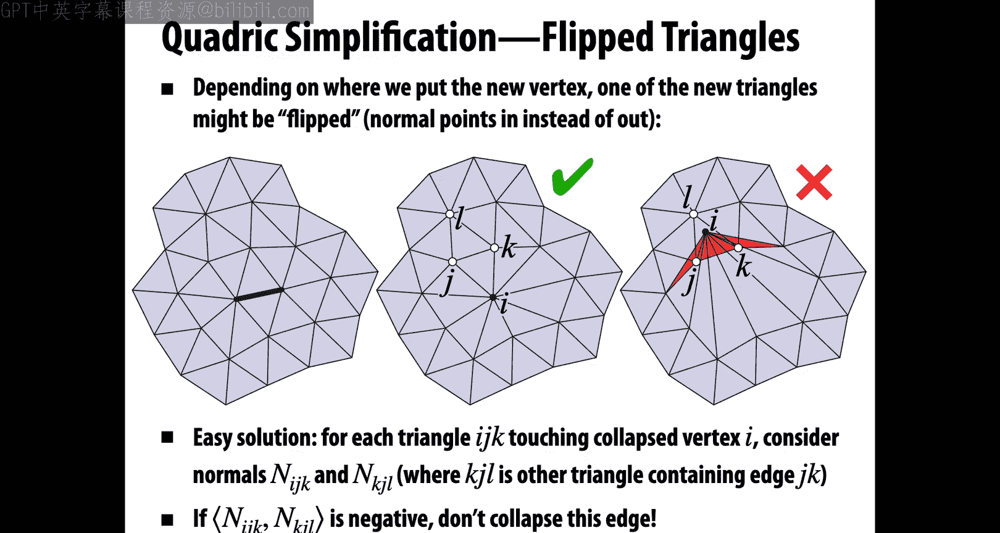

Okay。So。That's it for down sampling， we've done up sampling with subdivision。

 we've done down sampling with quadric error simplification。

What if we're actually happy with how many triangles we have。

 but we just want to improve their quality， we want to get better triangles shape。So， for instance。

How would we make a mesh more Delai， We said that the Dlaney condition is a nice property， right。

 Every triangle has an empty circumcicle。 Were maximizing the minimum angle， all these nice things。

 Well， actually， there's a really， really simple。A toolol， there's a really simple algorithm。

For making a mesh more delani and。We said originally that Delani means that every triangle has an empty circumcircle。

 actually you can show there's an equivalent condition。Which is that if。

Every edge has an angle sum if we look at the two opposite angles alpha beta。Then amehes Delani。

 if and only if that angle sum is less than or equal to0 for every edge。

So what is our strategy for turning a mesh into a delani mesh， at least in the plane， well。

 if we find any edge whose angle sign is greater than pi， we just flip it。And in fact。

 flipping in a completely greedy way。 if we just do greedy， flip， flip， flip， flip， flip。

 then we're guaranteed to always get a delani mesh， at least for。A planar triangulation。

Now the theorist would tell you， well， first of all。

 this is not a great algorithm for Delani triangulation because in the worst case。

 it's order end squared， which is pretty bad if you have millions of triangles in your mesh。Also。

There's no guarantee that this works in three dimensions if I have a surface mesh in 3D。

 I can get stuck in a loop where I keep flipping forever。

I will tell you that in reality this algorithm works really well for real data， it's really fast。

 you don't hit this order n squared case and even for surface meshes in 3D these kind of pathological events don't really happen and if they do you can easily detect them and stop it or you can just do only a certain number of flips so in general。

 again it' kind of a rough rule of thumb， this is a pretty good way to improve the quality of your mesh。

Of course， we talked about other criteria for what makes a good mesh， so for instance。

 let's say I don't care about the Delaney property at all。

 but I do care about having regular vertex degree if I'm going to do a lot of loop subdivision。

 for instance， I might want to have nice regular vertex degrees。

 so for this I can just apply the same tool I apply edge flips。So I could look at an edge。

And if I flip that edge， well， of course I'm going to change some of the vertex degrees。

 I'm going to change the degrees of the endpoints I and J and the degrees of the opposite points K andL。

So what's a reasonable rule for improving the vertex degree。

 I could say if the total deviation from degree6 gets smaller， then go ahead and flip it。

And by total deviation， I just mean you go to each of those four vertices and you see how far it is from six。

 absolute value of D minus6 plus DJ minus6 and so forth。Okay。There is no。

Clean guarantee on this flipping algorithm。 There's nothing like this theorem that says oh。

 if you keep flipping， you'll get to Delani。 It's not like if you keep flipping。

 you'll always get to all regular degree。 In fact， we already talked about the fact that in general。

A triangulation of a surface has to have irregular degree vertices somewhere。Okay。

But there are some things you can say for sure， so if I have a。Triranangulation of a smooth surface。

Then actually， you can prove that the average vertex degree of any triangulation approaches 6 as the number of mesh elements increases。

Okay， and this is good news because it means there's hope that you can get regular degree almost everywhere。

Also what you observe in practice is that this iterative edge flipping algorithm for degree acts kind of like a discrete diffusion of degrees so if you have lots of high degree vertices concentrated in some region and you start doing these kind of flips。

 those irregular vertices kind of diffuse out to the rest of the matchsh。

 they become more regular and so forth and so again there's no known guarantees on this algorithm but it works well in practice。

Today we just want to give you some basic tools and basic rules of thumb for getting going with geometry。

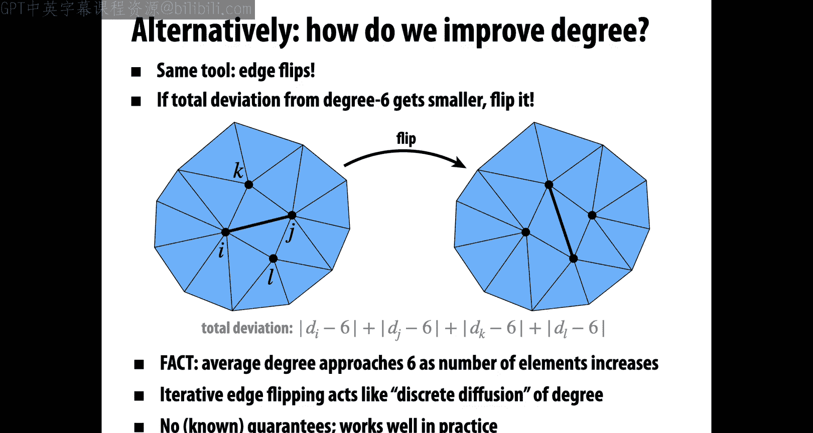

How about making triangles more round， this was another property that we said was important in a lot of applications。

That your triangle angles are close to 60 degrees， so actually this Delaney condition。

 even though it is quite nice， it doesn't really guarantee anything about the roundness of triangles。

 you can have a mesh is actually where all of the triangles are long and skinny and they're delani。

So one way that you could try to improve all your triangle shapes to make them more round and more equilateral is to repeatedly center vertices。

So really， really simple， I could take every vertex and I could move it to the mean of all its neighbors。

This is a simple version of a technique called Laplaceian smoothing。

 you can make this fancier and more sophisticated， but this is the basic version。

 there's also something called optimal delani triangulation which has a very similar flavor。

One thing you have to think about is， well， if I'm moving vertices on a curved surface， right here。

 I've drawn something in the plane， but imagine this vertex is on some curved surface。

Then to preserve the shape of that surface。I might want to only move in the tangential direction。

I do want to increase the quality of the elements， but I don't want to distort or deteriorate the geometry。

So what I could do is I could figure out okay， what would be the direction I should move to go to the average of my neighbors？

But actually go ahead and just remove the component in the normal direction。

And only slide tangentially。Okay。

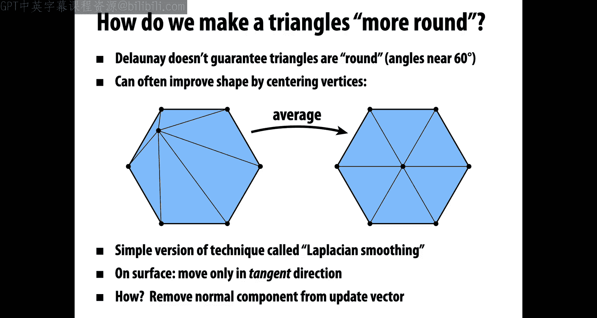

So here's a。Remeashing algorithm or resampling algorithm that we can apply using some of these techniques to try to make our triangles uniform in shape and size。

And here's an example of what we're going to get at the bottom。We take these triangles。

 which are a little skinny and maybe irregular vertex degree and make them nice and close to equilateral with very irregular vertex degree how do we do this。

 we just repeatedly apply four steps。Okay， and we're going to use a lot of these little local operations we've done so far。

 so first。We are going to split any edge。That is longer than four third of the mean edge length。

In our mesh， or maybe we have some target edge length in mind， right。

 we want to make all the edges close to length one centimeter。

So then we can split any edge that's over 43 that target length。Likewise。

 we're going to collapse any edge that's less than four/ fifths of that length。Okay。

 so if the edge is。Too short， we just get rid of it。

And flip edges to improve the vertex degree and finally center vertices tangentially。

 like we did on the previous slide。If we do this simple algorithm， do it over and over again， again。

 no guarantees， but we tend to get these nice beautiful meshes that are good for things like simulation。

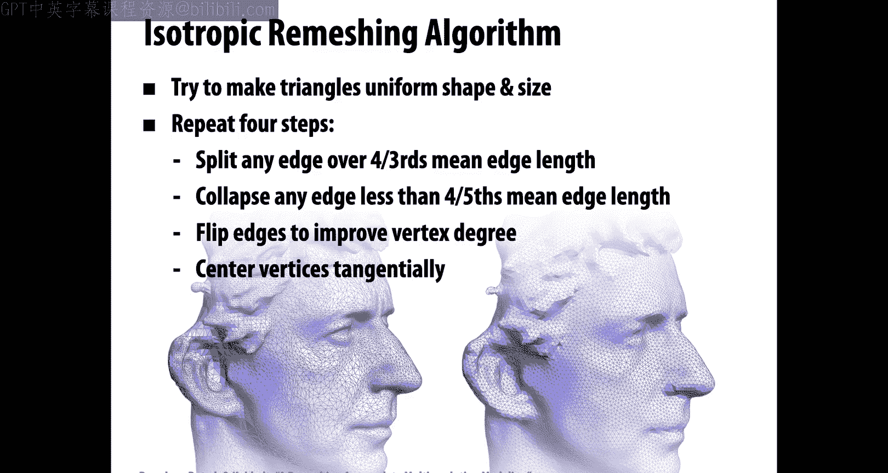

Okay， so。As we're having fun up sampling and down sampling and resamp， we should pause to ask。

 well wait a minute， what can go wrong when we're resampling a signal。

So there are dangers to resampling， and that's true， not just in geometry processing。

 but in any kind of signal processing。You record this nice high fidelity signal。

 you stretch it and warp it and resample it。At some point， things are going to go haywire。 So。

 for instance， what happens if we repeatedly resample an image， Let's say we took this nice。

 beautiful image of a cow。What do you think is going to happen if we， let's say downsample it。

 then upsample it， then downsample it， then up sampleample it， then downsample it， then upsample it？

Are we just going to get the same image back or what's going to happen？Okay， well。

 let's give it a shot， so we'll take the cow down sample to a much smaller image。

And then we'll upsample it in some way using some kind of interpolation。Okay。

 already you notice it got blurriier that that kind of makes sense， right， I mean。

 I lost information when I downsampled it， there's no way I can recover all that information again when I upsample it。

but then let's downs sampleample it again and upsample it again andooh you notice it changed even more。

 there are kind of these almost looks like we did some kind of edge detection and okay if we downsample it。

 we upsample it again， yeah it gets even worse and if you kept doing this it would turn into a total mess。

You know why is that well， because there's some interpolation scheme and it uses cubic polynomials here and so on and so on。

 and in general， when you compose different resampling operations。

 there's no reason to expect you're going to preserve the fidelity of the signal。

 the signal quality is definitely going to degrade over time。

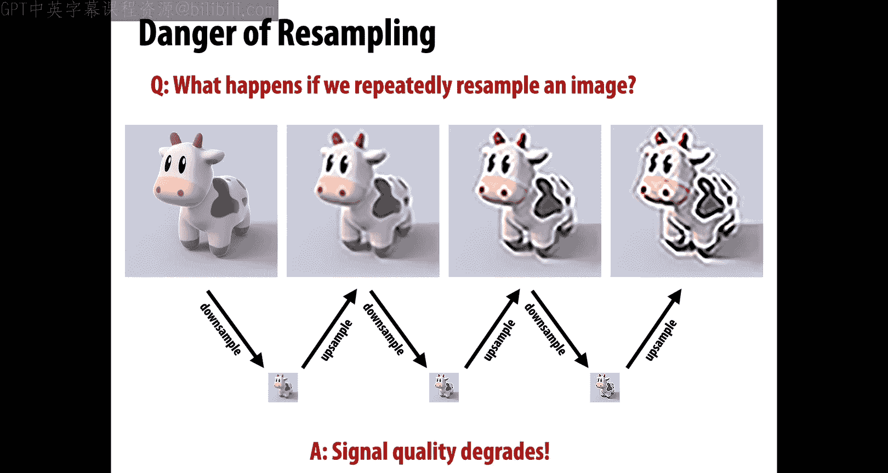

And so you can ask the same question for geometry， what happens if we repeatedly resample a mesh？

Let's say we take this。Cow， right。And we downsample it and then we upsample it and we downsample it。

 what do you think is going to happen？Well something similar right so if I I could downsamp it using this quadric error simplification。

 I've done a pretty good job of preserving the appearance。But some information was lost。

So maybe I want to go back up to a mesh of the similar resolution。

 so I upsample it using loop subdivision， hey， it looks pretty good。

It's not exactly like the cow I started with， but it's still recognizable。

But if I keep processing this， if I have a lot of stages in my algorithm。

 over time the signal also degrades， I really lose the appearance of the original shape。

So what can we do about this？

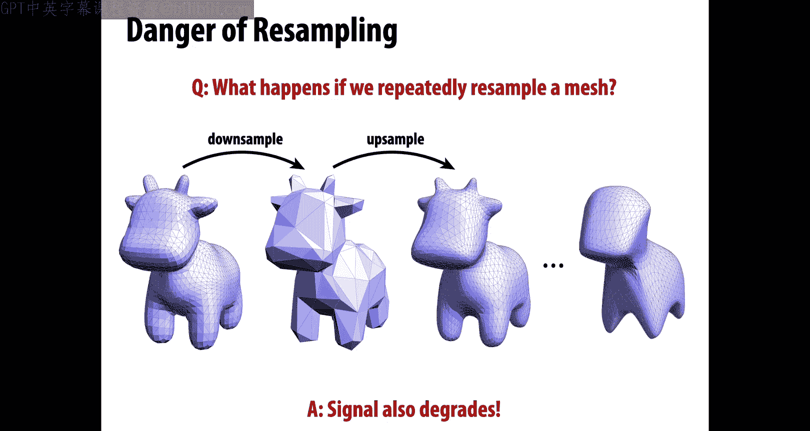

Well， one interesting thing when we think about geometries， we say， hey， wait a minute。

We might have changed the triangulation and the connectivity and all this stuff。

We still have the original input mesh right so we could play a trick。

 we could do all our processing and then we could say at the end we still want maybe these vertices to sit on the original surface。

 So why don't we just take the vertices of the process mesh and project them back onto the closest point on the original mesh。

Well， that sounds like a great idea， but it begs a question。

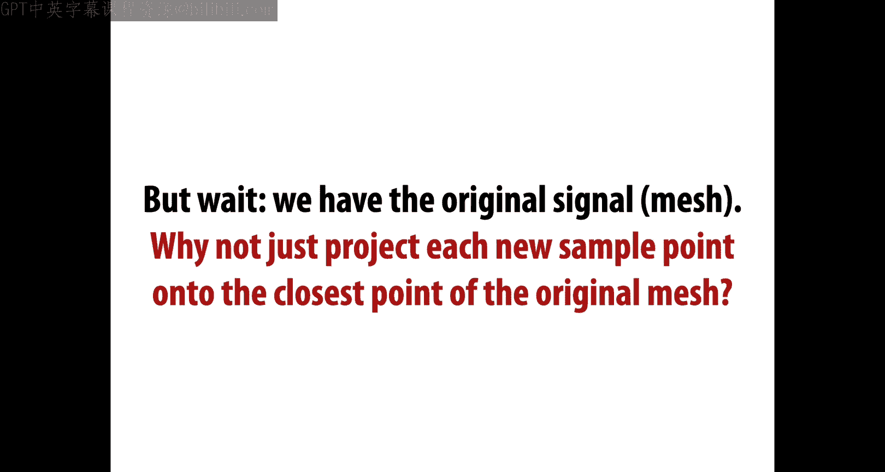

Given a point in space， how do we find the closest point？On the original mesh。

And so next time we're going to talk about these kinds of geometric queries。

How do we find the closest point on a surface， Are we inside or outside of the surface。

 how do we find an intersection between two triangles？All sorts of geometric queries。Now。

 do the implicit and explicit representations that we've been studying so far make such tasks easier。

 does the half edge data structure help with this， or do we need new solutions？

And how much does this cost， you know， if we do this naively？How much time does this take。

 can we accelerate queries for large meshes， lots and lots of interesting questions Okay。

 so look forward to it and talk to you then。

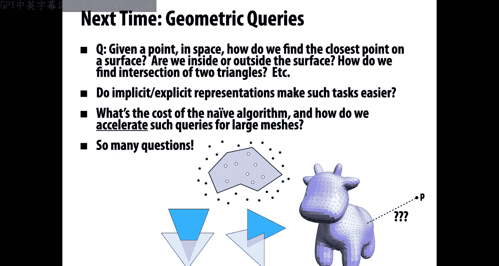