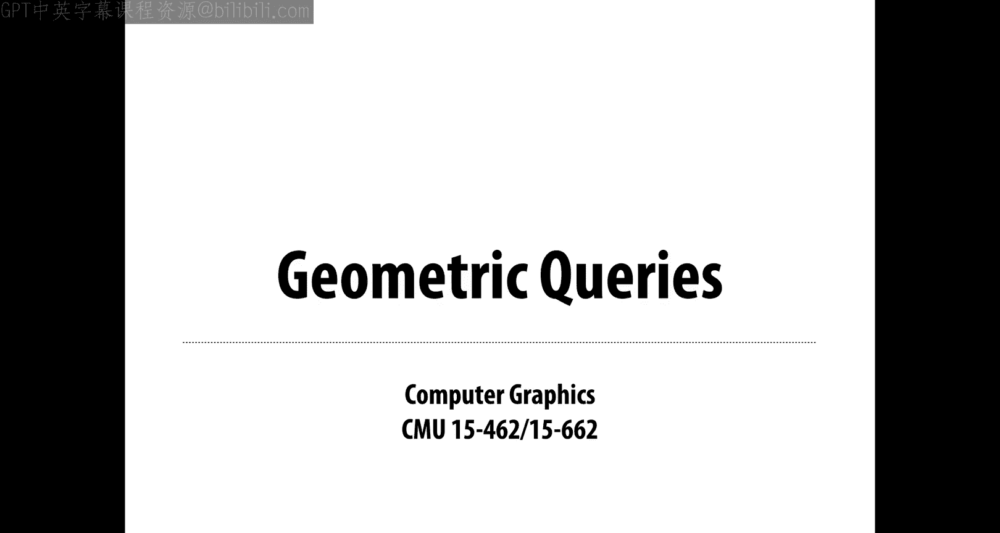
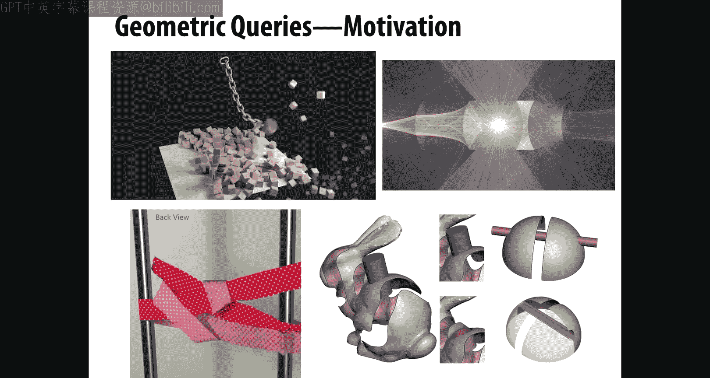
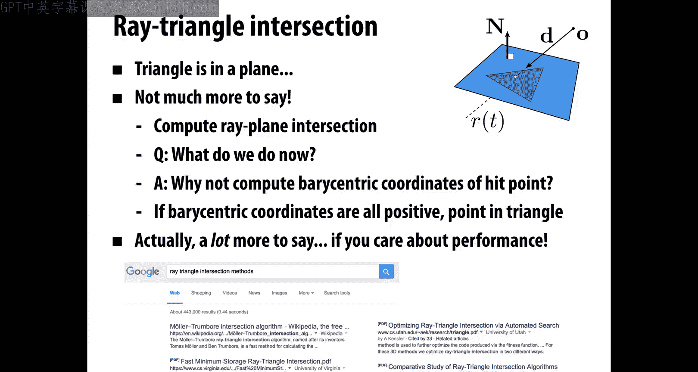
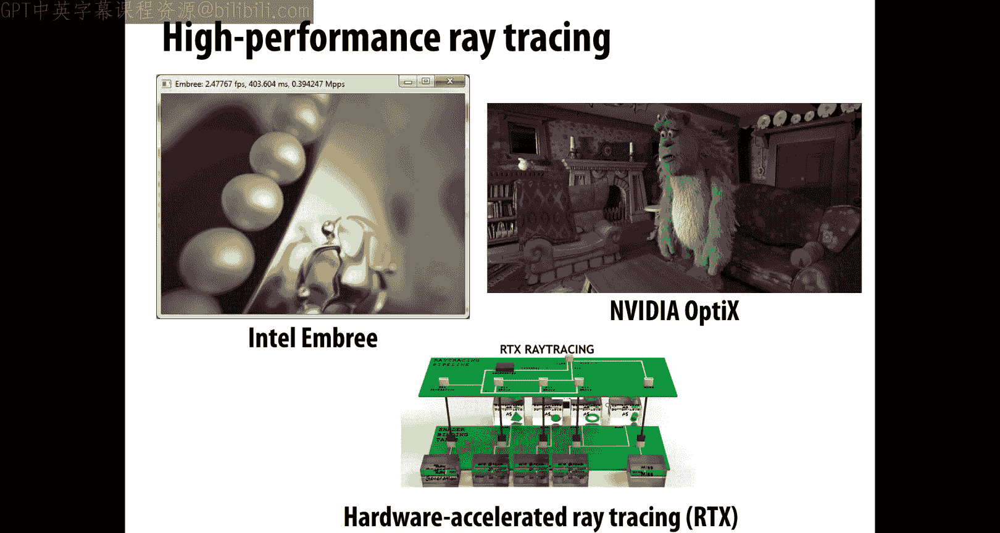
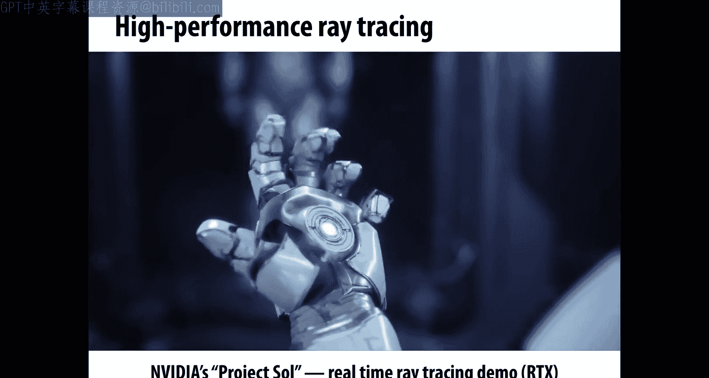
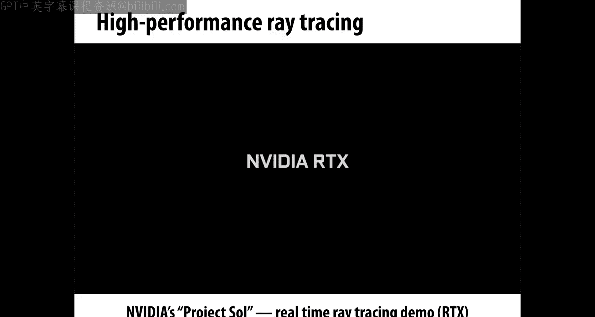
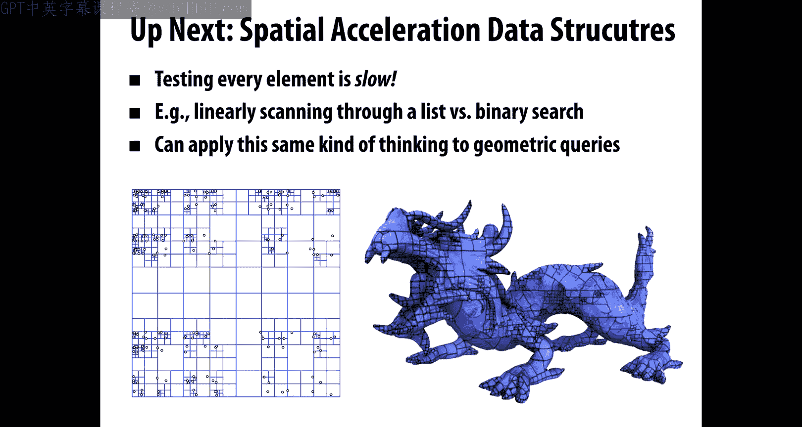

# CMU《计算机图形学｜CMU 15-462  COMPUTER GRAPHICS 2021》中英字幕 p13 -13-Lecture 12_ Geometric Queries -BV1H3NBemE5E_p13-

All right。Welcome back to CMU 15462 Comp graphics today we're going to be talking about geometric queries so in the last few lectures we were talking about geometry in general。

 what are different kinds of representations implicit versus explicit and then also getting into a lot of the details about mesh data structures and doing geometry processing。

Today we want to talk more about how do we answer specific queries about geometry。

 things like the distance to a point or the intersection with array and there's actually a lot of ways to motivate these kinds of queries not just within geometry itself but in all the other areas of computer graphics so whether you're doing animation or rendering or geometry processing these kinds of queries show up and are quite important today we're going to be talking about how to do the basic queries next lecture we'll be talking about how to accelerate them。

 how to make them fast if you want to do really large problems。

Just to give a little motivating example that's connected to some of the things we've been talking about is to look at geometry processing and think about what happens to a geometric signal as we operate on it so you can imagine we start out with some nice initial mesh。

 this cow on the far left， we downsample it， we upsample it， we subdivide， we do various operations。

 and even if we're very careful about how we implement each of these operations。

 what happens over time is that the signal degrades。

 so it becomes something that looks very different from what we started with。

 we get aliasing we keep talking in this class about how aliasing is a phenomenon that shows up all over graphics。

And the question is， in this geometric context， how might we do a better job of preserving this original signal。

 this original shape？So there were a lot of good answers to this question。

 but one thing you might think about doing is saying， all right。

 well I might have processed my signal， I might have remeshed it and move the vertices around。

 but I can still keep track of what the input geometry looked like。

 I still have my original input mesh and so what I could try doing is taking every vertex of my newly processed mesh the one where I'm starting to lose signal fidelity and I could take each vertex and I could try to push it back onto the original surface so that at least the shape。

 the overall shape still looks like what I started with。In order to do that， well。

 we need to find some point on the original surface and not just any point。

 we might really want to say well。Where should I put the vertex that's kind of drifted away from the surface。

 maybe I should put it on the closest point of the input surface。If we could do that。

 we could get a better looking result。 So just one possible way to motivate this we'll talk later on about lots of other places where these geometric queries show up。

So then our whole task here kind of boils down to just one simple atomic question。

 which is given a point in space， let's say we have a sample point P。

How do we find the closest point on？The surface。So maybe we have our mesh of a cow。

 we want to find the point that's indicated by the dash line。And。

There are lots of questions you could then ask about how to answer this question， for instance， well。

 okay， what kind of representation is appropriate for this task。

 should we use an implicit representation or should we use an explicit representation？

We'll see one example at least where an implicit representation might make this a easier？

 We can also ask things like well does it matter so much what choice of data structure we use is a half edge mesh going to be better for this is an incidence matrix going to be better for this。

 I would say generally this is not the main concern when it comes to queries like this。

 although you might find that some of them will help in small ways we can also ask questions about cost So whats what's the cost of doing a naive version of this algorithm I have this one point and I want to find the closest point on the surface。

 Well do I maybe have to visit every single triangle of my mesh to figure out which point is closest。

m and。Even if we are just talking about a single triangle right。

 even if we've identified which triangle contains the closest point。

 we still need to figure out what is the closest point on that triangle right so how do we talk about the distance from a point to a triangle。

 how do we find the closest point so there are lots and lots of different questions that we're going to need to answer in order to do these closest point queries。

Beyond just closest point queries， there are lots of different kinds of geometric queries we might like to apply。

 right， So we're talking about closest points。 we might like to know other things like do two triangles intersect and if they do intersect where and how do they intersect。

 We might want to know， are we inside of an object or outside the object， We might want to know。

 does one object contain another， So geometric queries are all just about asking relative questions about two pieces of geometry。

The data structures we've seen so far are really not designed with this task in mind right when we talked about half edge meshes and incidence matrices and adjacency lists。

Those data structures were really designed from the ground up for getting local neighborhood information for seeing which vertices are next to which other vertices。

 things like this。They didn't really help with these spatial queries。

 So we're going to need some new ideas。 We're going to need to。

Really examine this problem and see what the fundamental computation looks like and so today again。

 we're going to come up with some simple algorithms which are going to be pretty slow。

 especially if we have large data sets， but next time we'll talk about intelligent ways to accelerate these geometric queries。

Okay。So just as a warm up， just as a little hopefully easy exercise。

 let's do kind of the world's simplest closest point query， which is that we have a point。

We have a point。A， this one on the bottom right here。 and we want to。And we have a query point P。

Okay， so A has components A1， A2， P has components P1p2。And I'm going to ask a stupid question。

 which is， what is the closest point on the point A？I mean， this is。A vacuous question， right。

 obviously， the only point there is is the point A。 So the closest point to P is a。

But that helps us to start think about calculations we'll need to do when we talk about closest points。

 in particular the distance， so can you remember what is the distance。

 how do we compute the distance between two points？Hopefully the answer is yes。

 we've done a lot of of review of this kind of thing。

 so we can just use the Euclidean distance formula square root of the difference between。

Component squared。 So A 1 minus P1 squared plus A2 minus P2 squared。

 The square root of that will give us the distance。 Okay， so this was。Super elementary。

 you might ask， why are we even talking about this is so stupidly simple？Slightly harder question。

Is what is the closest point on a line。 So in particular。

 let's say I have this description of a line。 I have a line described by the implicit equation。

 n transpose x equals C， where n is the unit normal vector for this line。

 So this is going to be a line in the plane。Like this。 And is this unit normal vector and。

All the points on the line are characterized by the impimlicit equation that says。

 how do you know if x is a point on the line， Well， you know if it's a point on the line if。

And transpose x is equal to some constant C。Okay。And so the question is。

 how do I find the point closest to my query point P？Well。

 the first thing that you should do before you solve any problem of this kind is just to kind of get an intuitive sense of what the answer looks like。

 So if I draw this picture， how would I draw in。A little dashed line that tells me what the closest point on the line is。

Right。And you， certainly， okay， it's not that every point on the line is the same distance to P。

There are definitely some that are closer than others and okay。

 I think it's not this is not really that hard of a question right， it looks something like this。

 This is the closest point。 you kind of take the orthogonal segment to the line and slide it along the line until it hits P That's the quickest way to get 2 p from the line。

Okay， so the intuition is straightforward， how do we actually calculate it， right。

 How do we actually write down an expression？That gives us that closest point。Well。

 there are lots of。Different little calculations you could do to get the， the closest point。

 Here's one way that I like to do it is I like to say， okay， well。

I can just take my implicit equation and transpose x equals C。And I can ask， what are the x's right。

 what x's am I going to consider？Okay。So here I'm going to say， all right， if I start at P。

And I move in the normal direction。By some distance。

 or I move in minus the normal direction by some distance T。Then eventually I'll get to the line。

Right。And so I at this point， all I need to say is figure out is what is that distance T or how much time do I have to travel in the normal direction before I hit the line？

So I can write that by saying n transpose p plus Tn equals c。

 I want to move in the direction n by distance T。Until I satisfy the line equation。From here。

 it's just a little bit of。Linear algebra， right， So I distribute the transpose across the sum。

 I get n transpose P plus T N transpose N equals C。And now I remember that n is a unit vector。

 so I can just replace n transpose n with1 right n transpose n is just the squared norm of n。

 which is1。And at this point it becomes very easy to solve for T。I say， okay， fine。

 so now I know the distance or the time that I have to travel is T equals c minus n transpose P。

Great， so that's how long I have to travel or how far I have to travel to get from P to the line。

 What is the actual point that I reach， Well， I just take that t value and I plug it back into the expression P plus T N Start P move this particular distance T in the direction N。

 and I get P plus C minus n transpose P N。Okay， and maybe that boxed equation means something to you。

 maybe it doesn't， but either way it is giving us a very explicit expression for the closest point on the line。

Okay， let's make this a little harder， so so far we've been asking what is the distance or what is the closest point from a given query point to an infinite line。

Now let's restrict our attention to just a small segment。 Okay， so again， I have a。Query point P。

And I want to find the closest point on this segment。Here。

 what we can do is we can take advantage of knowledge that we've already gained。

 we can break down the problem of finding the closest point to a line segment。

Into two problems we've already solved。RightSo we've noticed。

That a line segment kind of has two different types of points， it has points on the ends。

 the endpoint A and B， or it has interior points。And we already know how to compute the distance to each of these components。

 right， we know how to find the closest point to a point。Like the endpoints。

 we know how to find the closest point to align。Okay。

 and we just have to do a little more work to combine these two steps to figure out what is the closest point to the line segment。

Okay， so I'm just going to let you think for a moment。

If I now have a query point P and I want to find the closest point on the line segment。

What is a little algorithm I could write down to figure this out？Right。I think it's also helpful。

 at least for me， it's helpful at this point to draw a picture of all the things that could happen。

So here's a bunch of different possible query points， P。

 and for each of them I've drawn with a dashed line。

 the segment that tells me where the closest point is on that original line segment。

So what you notice is there really are these two different cases。

 points that are kind of off one end of the line segment or the other for those query points。

 it's pretty clear the closest point is。An end point of the line。For points in the middle。

The closest point is some interior point of the segment。So there's two different kinds of behaviors。

 depending on where in space the query point P is。So how can I write down kind of a high level algorithm。

 a pseudocode that tells me what is the closest point？Well， here's one way to do it。

 I could say how about first I'll find the closest point on the line。

 just like I did in the previous slide。Just plug in this little expression that gives me the T value。

 I plug the T value in that tells me the closest point on the line。Okay。

 and then I have to ask myself， is any point on the line an acceptable answer to this query？Well， no。

 because this closest point on line calculation might give me a point anywhere on the infinite line。

 whereas what I really care about is points within this little interval。 Okay。

 so once I find the closest point on the line， I really need to check is that closest point between the two end points。

If not， if it's not somewhere in the segment。Well， then I just take the closest endpoint。I say， a。

 the closest point on the line itself。Is not。Actually on the segment。

 so the best I can do is say that the end point is the closest point。Okay， so that's。

Not quite an algorithm because I haven't really spelled out the details of how that all works。

 So now I have to ask myself well how do I know， how do I do the check to see if it's between the two endpoints？

One way to do this is we could write down the closest point on the line as a little linear interpolation of the two endpoints。

So if A and B are the two endpoints， then I can write any point inside the segment as a plus T times b minus a for some scalar t。

Now， just to be really clear here， this T is not the same as the T that we used in the。

Cllosest point online calculation。T in this case is just a parameter that tells us how far along the line do we walk from a to B or from a toward B？

Okay。And what we know is that as long as t is between 0 and1。This point is inside the segment。

 right If the closest point on the line has a t value between 0 and 1， it's inside the segment。

 Why is that true， Well， just look at this little expression If t is equal to 0。What do we get？

We get just A。If t is equal to 1， then we get a plus b minus a， which is B。

So for values between0 and 1， our point can only be between the points A and B。

If t is less than 0 or greater than 1， we know we're on some point that's on the line but not on the line segment。

 and we have to take one of the endpoints as the closest point。Okay。All right。

 so we're going to keep building this up more and more and more。

 basically you start to see the strategy。That we answer a very， very stupidly simple question。

 what is the closest point to a point。Then we say， what's the closest point to an edge？

And we use our closest point to a point in line to figure out that and then we can say well。

 what's the closest point to a triangle， well hopefully we can use some of the knowledge that we gain by asking about closest point to a segment to understand closest point to a triangle。

And again， a really good thing to ask yourself before getting into the nitty gritty of the algorithm is just intuitively or visually。

 what are all the possibilities for the closest point to a triangle？

So let's say we have this blue triangle and it's in the plane， right， this is in two dimensions。

And I want to know， what are all the things that could happen。

 I'm going to plop down some query point P somewhere else in the plane。

And I'm going to try to find the closest point on the triangle。 What could that possibly look like。

Well， here's a pretty good。Illustration。Again， depending on exactly where I put the query point in the plane。

 the closest point on the triangle might be a vertex of the triangle。

Or it might be an edge of the triangle。Are there any other cases？

Is it always going to be on a vertex or an edge of the triangle。Well， no， I mean。

 we could have a query point。That is actually inside the triangle。Right， so。

We've almost reduced the problem of closest point to triangle to one of our earlier cases， right。

 we could just say ah all I have to do is call as a subroutine the closest point to segment routine three times for the three different edges。

But actually， the first thing I have to do is check， well， is the point actually inside the triangle。

 if it's inside the triangle， then the closest point is the point itself。Okay。

How would I check if it points inside of a triangle？Hopefully。

 you have a pretty good answer to that question because it's exactly what you implemented in a1。

 right Every time you rasterized a triangle， you were checking if sample points were inside a triangle。

 This is exactly that same test。Right， so in some sense。

 you could think of this closest point query as a strict generalization of your。

Tests that you were doing your geometric queries you were doing for your rasterization。In that case。

 you were just doing simple inside outside tests。Here you're getting a little more rich information。

Okay。All right， and now that we have conquered this challenge in 2D， let's go to 3D。

 let's say we have a triangle in three dimensional space， we have a query point somewhere in space。

 and we want to find the closest point on that triangle。

And I've drawn a picture here that's suggestive of the way we can think about this problem。So again。

 rather than reinventing the wheel and solving this all over from scratch again。

 what we can do is say， okay， how can we leverage what we already did in the 2D case to get closest point to a triangle in 3D？

Let you think about that for just one second。How would I find the closest point to a triangle in 3D？

Okay， well。Here's the algorithm that I came up with。Which is first。

 I'm going to do something that's very similar to how I found。The closest point on a line segment。

I'm going to first take that point and I'm going to project it onto the plane of the triangle。

I know the triangle sits somewhere in this plane。So I'm going to first just project the query point onto the triangle find the closest point on the plane。

And C is that point already inside the triangle？Okay， if so， then I'm already done。

How specifically can I test if the point is in the plane of the triangle or sorry if the point that's projected onto the plane is in the triangle？

Well， I could try to write down some 2D coordinate system I could do a change of coordinates。

 but actually a much simpler thing to do is rather than doing half plane tests like you did in your rasterizer。

 I can now do half space tests。And so given the query point。

 I can see if is it on the intersection of three half spaces。

 whose intersection is this solid wedge that looks like the triangle kind of extruded up and down in the vertical direction。

If the query point is inside that solid block。Then all we have to do is again。

 project it down onto the plane of the triangle and we're done。If not。Okay， then we just。

 in some sense， recurse， right， okay， if it's not in the triangle， it could be on an edge。

 if it's not on an edge， it could be on a vertex right， So again， we take that projected point。

 we find the closest point on some associated vertex or it。Or edge。

One thing that we haven't spelled out， right， the one little detail that we're missing at this point is how do we find the closest point on the plane itself？

How do we find the closest point on a plane？That's very similar to the question we asked before。

 how do we find the closest point on a line？In fact。

 the expression we get out is going to be exactly the same。This is an important thing to realize。

 it's really useful to know when is a calculation that I did in 2D。

 when can I just easily or immediately generalize that to 3D？So let's think about this。

How do I describe a plane in three dimensions？ Well。

 an implicit way to describe a plane is with an equation that just looks like our line equation。

 We just say the normal transpose times。The point x times the point x that's on the plane is equal to some constant n transpose x equals c。

Right？And so then from then on， all the calculations we did for the line。

Immediately generalize to the plane。The line was just a linear subspace of the plane。

 the plane in this case is a linear subspace。Of three dimensional space。They're both。

One dimension smaller than the space they sit in， everything works out the same。Okay。

 good thing to work through if you don't believe it， just sit down， think through it， work it out。

 and you'll see that you get the exact same expression for the closest point。

The only difference being that now these are 3D vectors rather than 2D vectors。Okay。Okay， great。

 So we're going to keep building up more and more and more。

 We figured out how to do closest point to a point to an edge to a triangle， to a triangle in 3D。

 Finally， we want to solve this original problem。 What is the closest point on a triangle mesh in 3D。

Well， good news。A triangle mesh is made out of triangles。

 we already know how to find the closest point to a triangle。

So at least the naive algorithm is straightforward， we can loop over all the triangles。

We can compute the closest point to each triangle。And then do what？If we know for each triangle。

 what the closest point is。How do we find the closest point overall？Well。

 as we're walking through our list of triangles， we can just keep track of the closest point we've seen so far。

For each closest point on each triangle， we compute the distance from P to the closest point。

If the new distance is smaller than the previous distance。Then that becomes our new closest point。

It's really that easy。So that's an easy， easy algorithm if we have a closest point to triangle algorithm。

But what's the computational cost？Right。What's the asymptotic cost if I have n triangles in my mesh。

How much computation am I doing？Well， hopefully it's pretty clear that it's order N。It's big O of N。

I have to check every single triangle in this algorithm。

I don't really have the opportunity to skip any triangles。And so what now if we have？

Billions of faces in our mesh， which is actually not that。Remote of a possibility。

 There are plenty of meshes that have millions and billions of。

Triangles or quadrilaterals or whatever in them。This is going to take billions of operations just to do a single closest point query。

And so this is something we're not going to improve on this time。

 but next time we'll talk about better data structures that in a very beautiful way will let us accelerate these kinds of queries。

Okay。So。So far， we've been talking about closest point queries when we have an explicit representation of geometry。

A polygon mesh is an explicit representation。But we talked about the fact that there are two major categories of geometric representations。

 there's implicit and explicit。So let's change gears and think。

 what if we want to do closest point query on an implicit surface representation？

And we're really going to start to see what we said was true in that lecture a couple lectures ago。

 we said， yeah， depending on whether you choose implicit or explicit。

 different algorithms become easier or harder。Well。

 how is this going to impact our closest point algorithm？Right， so in in particular。

 let's say that now our geometry is represented by an implicit。Surface， meaning we have a function。

Dfined everywhere in space。Where。If the function is equal to0。Those are the points on our surface。

 if the function is。Different from 0， those points are not on our surface。Now actually。

 we're going to be a little more specialized here and we're going to say the value at any point is not just one or0。

 the value is actually going to give us the distance to the surface。

So a good example is this bunny down here。And。What you can see is this bright white band。

 that's where the function is equal to zero， that's where the surface is。

As we walk away from the surface， the distance value increases more and more and more。

 So we're getting into these oranges and dark reds。 those are larger values。

So if you have this kind of data， it's a nice informative description of the surface， actually。

 it contains quite a lot of information。How can we do closest point queries？ So again。

 I give you some point in space or in the plane， and I want to find the closest point on this white bunny。

 What do I do。Well， one idea is， okay， start the query point。And I have some very useful information。

 I know that if I look at the gradient of the distance， if I look at the distance in which。

The direction in which the distance is。Increasing or decreasing， actually in this case。

As quickly as possible， that's taking me toward the surface as quickly as I possibly can go。Okay。

 so I'm going to compute the gradient of the distance or minus the gradient of the distance。

 I could do this using any technique like I could use finite differences on my grid。

And then I could take a little step in the gradient direction that'll bring me closer to the surface。

 my distance value will go down。And then I do it again and again and again。

 until finally I arrive at a point on the surface。So this is a very。

 very different kind of computation than when we did with the polygon mesh。With a polygon mesh。

 we had a completely different structure to our algorithm。

We looped through all the elements for each element we found the closest point we took the minimum over all of them。

Here we're starting at a point we're using only local information to move our query point closer and closer toward the surface。

And so you can see there's different trade offs that you have when you're doing implicit versus explicit representations。

 the algorithms really change。In fact。You know， if we take a step back and think about what we did here。

 we could say， well， wait， we're doing a lot of work。

Just to push this point closer and closer to the surface。In the end。No matter what point we start at。

 there's a unique， closest point on the surface。 so wouldn't it be smarter to just store at each cell of our grid。

Every pixel of our image that stores the distance， shouldn't we also just store the location of the closest point。

So we can make a trade off between speed and memory。

 Do we just want to store the distance values and run a little algorithm to get the closest point or do we want to just store the cached result directly。

But now we have to store more data， and this is a very common thing in computer graphics to make the trade off between speed and performance。

Am I willing to use a ton of memory and just pre computeute everything， if so。

 maybe it's worthwhile to store that？Now， of course， you don't get off Sc free at some point。

 you actually have to figure out those precomputed values right。

 so at the very beginning of the algorithm， you still have to run through every single grid cell and do this same gradient ascent calculation。

But the idea is that the amortized costs may be much lower。

 that if you're then doing millions and millions of closest point queries。

 while perhaps that initial pre computationut。Doesn't make a difference overall。Okay。

So that's it for closest point queries。The other direction we can go here is to say， well。

 what about other kinds of geometric queries， what are other things we could ask about？

When it comes to geometry。And one that's going to be very。

 very important for us as we move on to our next unit is Ray mesh intersection。

 So this is going to be really at the core of。Of photoreistic ray tracing。What is the problem， well。

 first of all， what is array？So array， when I say array。

 I just mean an oriented line or oriented line segment starting at a point so you could really think about array of light traveling from the sun。

It's not like a line， right a line is this whole infinite line that goes in both directions。

 whereas array has a definite starting point and a definite direction。Okay。It's kind of a half line。

But it's got an orientation。And what do we want to know， So so what we want to know is give an array。

 where does it pierce。A surface。 So that the picture， the picture is a little off here。

 But you can imagine that this ray travels from the sun。 It travels down to earth。 And at some point。

 it goes through the cow。Right， and we want to know what are the locations where this ray pierces the surface。

 those two black points。Why do we want to know this， Well。

 I already mentioned that this is going to be really important for photorealistic ray tracing。

 but actually it's important to realize that ray mesh intersection shows up again all across graphics in geometry。

 it's used for inside outside tests so I can， if I can intersect array with a surface。

I can actually use that to figure out， am I insider outside the surface？How do I do that。

 here' here's a really nice observation If I'm in a closed surface。

 meaning a surface that has no holes in it。Then I know that if I'm inside a surface。

The ray has to pierce the surface an odd number of times to leave it。If I'm outside the surface。

 it has to pierce an even number of times。So I can just do a mesh intersection test and count。

 did I do an even or odd number of intersections？Am I inside or outside。

I'll let you think a little bit about why is it even or odd。

 it's helpful maybe to draw some pictures in 2D in 2D it works just the same。Of course。

 ray mesh intersections， as I said， are also important for ray tracing Y because they help us test visibility。

 So here the analogy of the sun is perfect if I want to see is a point in shadow or is it visible from the sun。

Well， I just have to shoot array to the sun or from the sun to the point and see did it。

Hit anything or not。 If it didn't hit anything， then there's a lot of light shining on that point。

 If it hits something， then that point is in shadow。 right， So this is at the root of very。

 very basic shadow algorithms in ray tracing。Also in animation。

 so if you want to do collision detection， you want to see if two objects are going to collide。

 there are algorithms that might use ray tracing to decide if that's going to happen if I keep moving along my current trajectory am I going to bump into something。

One thing that we notice about ray tracing that is。

Maybe a little different from how we were talking about closest point queries is that a single ray may pierce the surface in many。

 many places。It's quite common， actually， almost。In some sense。

 almost all rays will pierce any given surface in more than one place。With closest point queries。

 actually， if you go back and think about it， there are some very special situations where the closest point is not unique。

 right， where there's multiple closest points to the given query point。

 We didn't really address that point。So that's something to go back and think about。

 but in ray tracing， it's really fundamental。You have multiple intersection points for any single ray query。

And we'll see exactly why that's true。Okay。So let's get a little more precise about our definition of array。

 We can express array as。Something like this， we say， okay， we have some starting point。

 the origin O， like the center of the sun。And the rate is going to travel in some direction D。

And just for convenience， we'll say that D is always a unit vector。Okay。

And so what we can say is where is this ray or we think about this as like a particle of light leaving the sun。

 Where is this particle after a time T， So what is R of T， Well。

 it's we start at the origin and for time T， we walk in the direction D O plus T D。Okay。

 so that's our array equation。How do we intersect our with a piece of geometry。

 Well this time let's start with an implicit description。So this time。

 imagine that our geometry is described by a function F。Where the surface is all the points x。

 such that f of x equals 0。That was our basic idea for an implicit equation。So the question is。

 how do we find points where array pircces this surface？Okay， and and here is the general strategy。

 We're going to look at a lot of special examples， but here is the general strategy to always keep in mind when you're asking。

 where does a ray intersect an implicit surface。 Well， look。

 we know that the ray has an equation R of T equals O plus TD。Okay。

And so what we can do is just replace R。With。X。And then solve for t values such that f of x is equal to 0。

Right。Our implicit function F is a test that asks， is the point X on the surface？

So what we're going to do is we're going to consider all points along array， all points。

 X along array， or all points R along array and see which one of them are。In the surface。

To make this more explicit， let's consider the unit sphere。

What is the implicit description of the unit sphere。What is the function F in this case？Well。

 the function f is just f of x is the norm of x squared minus1。

Any point that has unit norm will evaluate to zero， those points are on the sphere。Okay。

So now we're looking for。Points along the ray that satisfy this equation。

 We're looking for points along the ray。That are on the sphere。Okay， so we plug R of T in for x。

And we get O plus TD squared minus1。At any time T now for which this value is0。

 we know that we're intersecting the sphere， we know that we're at a point on this sphere。Okay。

So a convenient way to write this out now is to expand this quadratic term into three different terms。

With three different powers of T。 so we can expand this into norm of D squared。

Times t squared plus 20 dot d times t plus norm of o squared minus1。And if we。

Give a name to the three leading coefficients， if we call norm of d squared A20 dot d is B and norm of o squared minus1 is C。

Then we have a quadratic equation for T。 We just have A squared plus Bt plus C is equal to 0。 aha。

 So this is an equation that hopefully you've seen before， actually long before。

 long before multivariable calculus and linear algebra。In some algebra class。

 at some point in your life， hopefully you learned how to solve a quadratic equation。

And maybe you always wondered， why am I solving so many quadratic equations。

 What could this possibly be good for， Well， it turns out the answer was computer graphics。

So do you remember how to solve？The quadratic equation。AT squared plus Bt plus c equals 0。

Maybe you remember that there was something called the quadratic formula。

 maybe don't remember the exact form， but there it is。

 quadratic formula says if I have a general quadratic equation。

 then in general solution it can have two solutions。

And they have the form T equals minus b plus or minus square root b squared minus 4AC over 2 a。Okay。

Now， what's interesting about this equation is。It has more， in general， has more than one solution。

It could have only one solution。Or。It might in fact have no solutions at all。Right。

So what's going on there？I mean， we have this very definite geometric problem。

 We want to know where does the ray pierce the sphere。

How could we have all these different possibilities that this equation has？

Only one solution or no solutions or two solutions， what's going on there geometrically。Okay， well。

 hopefully the picture makes it clear in the case that we show here on the bottom right。

It's pretty clear that the ray pierces the sphere twice it goes into the sphere and then back out of the sphere ah。

Those must be the two solutions to the quadratic equation。B plus square root of blah， blah， blah。

 or b minus square root of， blah， blah， blah， ah， interesting。

What does it mean if there's only one solution to this equation？Well， there's something very。

 very special that can happen， which is the rate might just graze the sphere。

 so rather than going in and then back out again， it's just tangent to the sphere at a single point。

That's when the quadratic formula has only one solution。 and then finally。There are cases where。

There's no solution to this quadratic equation， what does that correspond to？Aha， okay。

 there's no reason why the ray has to intersect the sphere at all。

The ray could just fly by and never hit the sphere。

 and the quadratic equation wouldn't have any solutions。Okay。

Another thing to think about is what does it mean if the t value we get out of this equation is negative？

T is the distance that we have to move along the direction D， starting at O。

In order to hit the sphere， what does it mean if T is negative？Well， if T is negative。

 that really is telling us that actually the ray also doesn't hit the sphere。

 at least not for that T value。Right。It means I'm moving along a line that intersects the sphere。

But not for the half of the line that I care about。

So I might be starting on the other side of the sphere and going away from it rather than intersecting it。

Okay， so really， this is a nice example of how the quadratic formula is not only useful。

 but tells us some really important geometric information about what's going on。Now。Of course。

 you can go ahead and write out explicitly the solution to this equation， just out。

 plug in A B and C in that quadratic formula and you get some nice little expression t equals minus O dot D plus or minus bh。

 blah blah。There's nothing deeper to know about this formula other than that's the final form。

 That's the kind of thing you can plug into your code。Okay。Okay， so that was Ray。Sare intersection。

Let's consider a different important surface， which is the plane。

 How do I test if a intersects the plane， Well， again， I have an implicit expression for the plane。

 the one that we've talked about all along。 We say suppose we think of a plane as the set of all points X such that n transpose x is equal to C for some constant C。

N is again， the unit normal C is some offset in the normal direction， right， So if C is 0。

 the plane is passing through the origin， otherwise it's offset from the origin。

In some by some amount。How do we find the intersection of the plane with array R of T equals O plus Td？

We do exactly as we did before。We just replace the point x in our implicit equation with the position of the ray R of T。

So we say we want to find now times t such that n transpose r of T is equal to c。From there。

 it's just a matter of solving for T。 now this is just algebra or linear algebra。

So we expand our definition of R， R becomes O plus Td。

And we're going to look for t values such that n transpose O plus TD is equal to C。Okay。

 so we can expand。We can distribute the transpose over the sum。

 so we get n transpose O plus T N transpose D is equal to C。

We subtract and transpose O from both sides。We divide by n transpose D and we get T is equal to c minus n transpose O over n transpose D。

Okay， let's think about this。So now we want the intersection point。So what do we do。

 We plug T back into the ray equation， so we found the T。

 the time at which the ray intersects the plane。 We want to know where the ray intersects the plane。

 so we just plug this time value back into the ray equation。O plus TD。In the sphere case。

 in the sphere example， we had all these interesting cases to think about。

If there's two solutions for T， this happens， if there's no solutions， if there's one solution。

 what about in the case of the plane？Is this just a lot easier， the ray always intersects the plane。

 if I give you any ray at all， will it always intersect any plane？Well， no， again。

 we run into this thing about， well， what if T is negative， What does that mean。

 the time at which the ray first intersects the plane is less than 0。

AhThat means actually we're just moving away from the plane and we'll never intersect it。Rui。

What else could happen here？What's another funny case here that we have to consider carefully？Well。

We can either approach it from the geometric side or we can approach it from the algebraic side。

So from the geometric side， we could say， well， what's a funny case？

Of a ray and a plane and whether they intersect or not。

 a funny case for me is if the ray is traveling parallel to the plane。

So it's flying above the plane and it never， never intersects the plane。

 it's not getting closer and it's not getting further away。

So that's another funny case where the ray doesn't intersect the plane。

 but not because t is negative， but rather because t is sort of infinite。

 I'll go along this ray forever and I'll never intersect the plane after an arbitrary amount of time。

How does that show up algebraically？We notice that this expression for T has a denominator。

 n transpose D， the inner product of the normal and the direction of the array。

What happens if n transpose D is 0？Right so the direction of the normal and the direction of the ray are orthogonal。

 Well， that's exactly this case that we described， right， the ray flying over the plane。In that case。

 n transpose d is 0 and t is some number over0。So we get infinity， T is infinity， right？So again。

 the equation that we solve gives us important information about what case we're looking at。

Are we going away from the plane， are we going toward the plane， did we intersect。

 When did we intersect， where did we intersect or are we going parallel？

So thinking carefully about all the different cases with these equations actually tells us a lot about what's going on。

Okay。So now we can start to do something like we did with closest point queries and build up more sophisticated intersections from simpler ones。

In particular， if we're going to do ray tracing， if we're going to make beautiful pictures of triangulated surfaces。

 then we need to do ray triangle intersection。Well。

 one important thing to keep in mind about a triangle is that the three points of a triangle always sit in some plane a triangle lives in some plane。

That plane has a normal N。And so maybe a first good step。

For finding a ray triangle intersection is to just first figure out。

Where does the ray intersect the plane containing the triangle？We know how to do that， right。

 we just did it。From there。There's not a whole lot more to say。

If we want to check if array intersects a triangle， hopefully you start to see the pattern。 In fact。

 hopefully you've done enough in this class already that you can see immediately。 aha。

 if I figure out where the ray plane intersection is。And I want to know。

 does the rate intersect the triangle， I'm home free， I already know how to do the rest。Right？

Why is that the case， Well， okay， let's say we first compute the Ray plane intersection。

So we know where this white point is in the plane， it could be inside the triangle。

 could be outside the triangle， we've drawn it here so that it's inside， but it could be outside。

What do we do now？How do we know if the rays intersecting not only the plane， but also the triangle？

Well， this is again one of these inside triangle tests。

 that's exactly what you did in your rasterizer to check。If a sample was covered by a triangle。

One way we could do this。 There are many different ways to do this test。 one way to do it。

 I like to think about it this way is。Why not compute very centric coordinates of this hit point。

So we could figure this out by lots of different formulas we had for veryrrycentric coordinates。

 one way to do it would be to compute areas， so I compute the signed area of the three little triangles made by connecting the hit point。

 this white point to the three vertices of the triangle。

I divide those signed areas by the area of the triangle and I get the veryry centric coordinates。

 okay， but you can do it however you like。I get those very centric coordinates and we know that if all the berry centric coordinates are positive。

If all of them are positive， then it's a point in the triangle。 right。

 That was our basic definition of very centric coordinates is that their points inside the triangle have。

Cordnates that sum to one and are each positive。 They a partition of unity。Right。

But no matter how you slice it， you just do your point in triangle test and now you know whether the ray intersected the triangle or not。

Okay， so whether you completely kind of deeply understand all the little calculations or not at this point。

 the really important thing to say is。Try to think when you're doing computer graphics about whether you can reduce。

A problem you're about to solve to a smaller， more atomic problem that you already know how to solve。

When when you see this picture， when you see this picture of trying to find is a point inside a triangle。

 an alarm should go off in your head that says， oh yeah， I've solved that before。

 rather than writing brand new code for this or coming up with a brand new algorithm。

 I can try to use that thinking or that algorithm or that code as a subroutine for what I want to do。

Right。And this is a great thing to do because you can benefit from all the knowledge and from any optimizations and from anything you know about this problem。

Now， actually， I'll say。Beyond this very， very basic description we've given in these slides。

 there's a lot more to say about good ways to do ray triangle intersection if you care about making it fast and if you care about making it numerically robust。

Okay， so the algorithm I've described here will work。But if you want to shoot lots and lots of rays。

 millions of rays， and you want to make sure that those calculations work。

 no matter which case you throw at your computer， there's a lot to read about and， and in fact。

 if you just go and Google Ray triangle intersection methods。

 you'll find all sorts of people who' spend their lives studying and optimizing this problem because it's such an important atomic query in graphics。

Why is that true， why is it so important to optimize ray triangle intersection？

Well， basically， because if you want to make photorealistic imagery。

 here's a beautiful shot from Pixar's coco， right， This image is made by shooting rays around this scene。

 millions and millions of rays that intersect with extremely complicated geometry。

 There's interesting lights and materials and everything， right， But fundamentally。

 the geometric query that you have to do is intersecting rays over and over and over again with geometry。

😊，Even with all the engineering effort and the expertise of people at Pixar。

 making an image like this， even a single frame like this takes about 50 hours to compute。

And then they have to crank out 24 of these frames every second to make animation。

 and then do that over several hours。 you can see this is a huge amount of computation。

So optimizing low level queries like ray triangle intersection is super。

 super important for making photorealistic graphics happen。For this reason， there has been。

 as I kind of hinted at in the last slide， there's been a huge amount of work on high performance ray tracing。

How do we do lots of ray triangle intersections really fast。

 How do we organize you know batches of rays and intelligent orders so that we're getting cash coherent access and all sorts of interesting questions。

 So Intel has put a lot of effort into this， they've made this library called Em。

 which does very high performance ray tracing on the CPU。

NviIDdia has put a lot of time and energy into this。 they've created a library called optics。

 which is a GPU ray tracing library and actually ray tracing people have finally kind of figured out。

 yeah ray tracing is super， super helpful Atomic primitive in graphics we're actually going to finally bake this into the hardware so just in the last few years。

 NviDdia has started putting what's called RTX pipeline into their ray tracing pipeline into their GPU hardware and so this has really enabled a lot of things that weren't possible before is really starting to open the door to using very different kinds of graphics algorithms for realtime computation。

And so if you're interested in graphics， you want to kind of be on the edge of the next big thing。

 I would definitely check out kind of realtime ray tracing。

 GPU ray tracing and see what people are doing there。 Here's just one kind of cool demo。

 This is a ray tracing realtime ray tracing demo made by Nvidia。

 You can Google this it's called Project So。

And actually， the thing I should say about this first is this is not 100% sure ray tracing。

So what this is is kind of a mash up。Rassterization， which you did in assignment1 and ray tracing。

 which we're about to talk about a lot。Or basically they say， okay。

 rasterization is really good at certain things。Tray tracing is good at certain things。

Let's rastrize an image， but then if we want to figure out the color of different fragments of the image。

 we might shoot rays to determine things like is there a reflection？

Or is there a light shining on the point is？And so you see the defenses as mirrored。

It's really realistic， effective。Characs are being reflected。And we'll see lots of other cool。

One last query to talk about， so we've talked about closest point queries。

 we've talked about ray triangle intersections。Let's talk about a query that is very relevant for animation。

And that is mesh mesh intersection。 actually， animation and geometry。 You know。

 it's hard to get away from geometry because ultimately。

 you know you have to you have to render shapes and you have to animate shapes。

 So one one question you might ask while you're animating a shape or working with a shape is does it intersect itself。

 I'm modeling a hand or I'm trying to animate a character who's closing their hand。

 How do I stop the hand before it runs through itself。

And how do I test if a mesh has self intersections？

Another one that comes up in animation is just knowing if a collision occurred。

 so I want to know if a ball hit the ground so I can make it bounce。

 or I want to know if one piece of a dress ran into another piece of the dress so that I can simulate the right dynamic so I can have some kind of contact resolution rather than just letting the pieces of cloth pass through each other。

Okay。So how can we do this kind of test， well， let's go back and play this game again where we start out simple and we build up toward more complexity。

So the first thing we want to ask is， how do we do point point intersection tests？

I give you two points， P and A， and your task is to check do they intersect？

Do the do the points collide well this is a stupidly simple test to do。

 it's either if the points have the same coordinates。Then they intersect and if they don't。

 then they don't。Really dumb or let's say， simple thing to do。Sadly。

 that's going to be the last time this problem is so easy point point intersection test is easy。

 everything else is going to take a little work。Okay， so let's make this just a little bit harder。

And rather than doing point point intersection test， we'll do a point line intersection test。

 So now the question is。How do we know if a given point intersects a given line？

Let's say again the line is given by an implicit equation and transpose x equals C。

And so we have a point P， we want to know， does that point P intersect the line， what do I do？

hopefully it's not too hard to figure out I just plug in P for X。I want to see。

 does the point collide with the line。 That's just the same as saying is the point on the line。

 And hey， I have an implicit equation that directly tests is a given point on the line。

 So I just evaluate n transpose P。And C is it equal to C？Okay。

 I keep promising life isn't so easy when it comes to these these geometric queries。

 okay we're about to see that it does become harder。

 so finally we get an interesting intersection test， which is a line line intersection test。

I have two different。Lines。And I want to see， do they coincide at some point， actually， hopefully。

This reminds you a bit of linear algebra。Right， there's。

 there's ways of thinking about linear algebra in terms of， you know。

 thinking about solving systems of linear equations in terms of。Checking whether。

Two lines or two linear subspaces intersect or not。Okay。

 so let's say in particular that we have our two lines， Ax equals B and C x equals D。Actually。

 let's say that should probably be a transpose x equals B and C transpose x equals D。

 How do we find the intersection， Well， we just see if there's a simultaneous solution。

We see if there's a single point x that simultaneously satisfies the two equations。

 a transpose x equals B and C transpose x equals D。Okay。

 and hopefully this is a connection that you have made before that I can。

Formulate this as a linear system。A transpose x equals B。

Is the same as saying I have the first row of my matrix with the components of A。

C trans was x equals D。 I do the same thing for the second row of the matrix。

If this matrix equation has solutions， then these two lines intersect。Okay。

 and there are lots of different techniques for checking if that system has a solution。

Here's an important question， though。 So when you study linear algebra in a， in a math class。

 everything is。Kind of assuming that real numbers work well。

 like you can do operations on real numbers， there's never any numerical problems with working with these numbers。

This is unfortunately not the case when you work with real computers。

 computers have only a finite amount of precision if you're working with floating point numbers。

 you get 32 bits of precision or 64 bits of precision， but at some point things start to break down。

And so really， really important thing to ask when you're doing calculations with lines is to think about what happens in sort of neardegenerate cases。

 For instance， in this case， what happens if the lines are almost parallel。

 So you have these two lines at the bottom and you want to find where they intersect。 In fact。

 even just looking at the picture。It's even hard to pinpoint on the picture where the intersection point exactly occurs。

If I ask you to draw on the screen， okay， where is that intersection point。

 you might only get it to within some little margin of error， you might be a few pixels off。

Another way， saying this is just a very， very small change in the normal can lead to a big change in the intersection point。

 if I were to rotate one of those lines ever so slightly。Boy。

 that intersection point might shift really quickly one way or the other。

And this kind of instability is very， very common with geometric predicates and geometric queries。

So to really do a robust job of doing these geometric queries。

 you need to think carefully about robust numerical linear algebra。

 really making sure that you're analyzing this matrix in a reliable way。

 and I won't go into techniques for that， but there's a very nice citation down at the bottom。

 which is kind of a classic and plenty more written sense then about how to do robust linear algebra。

Okay。So。That being said， you know， with that warning out of the way。

 let's get back to this more geometric picture and say what we really wanted to do was find interesting intersections between different。

 different geometric sets。 we said how to do a point point intersection。

 That was easy point line intersection。That was pretty darn easy， too。 Line line intersection was。

 well， it was basically what you learned in linear algebra。

 but with a little bit more care about numerics。 Okay。

 but now let's do triangle triangle intersection。 This is what we really need to do， for instance。

 if we want to do those applications I mentioned before。

 keeping the hand from going through itself or animating the dress。So how can we do this？

How can we find an intersection between two triangles？Well， hopefully， at this point in the lecture。

 I've said this enough times， hopefully some of you are thinking， oh， well， maybe I should see。

If I can break this problem down into smaller problems that I've already solved。Right。So basic idea。

 do you have any ideas？If I look at this picture， I have these two triangles。

 and I want to find out if they intersect or not。 and if they do intersect。

 I'd very much like to know where。They intersect。So what is a query？That we've already done。

That really， really helps us with this problem。One way to do this is we can reduce this to edge triangle intersections。

 So before tackling the whole triangle triangle intersection， we can just say。

 how do I know if a single edge of a triangle intersects another triangle。Ah well， that sounds very。

 very close to just doing a ray tracing query。Right。In other words， roughly speaking。

 we want to check if each line passes through the plane of the opposite triangle。

Once we've done that or once we've found where that line pierces the plane。

 then we can do an interval test to check。If that intersection point is on the edge。Right。

Once we found that that point is inside the segment or if it's inside the segment。

 we can finally check， is it contained in the opposite triangle？Okay。So for each edge。We do a。

 let's say a ray tracing or a ray triangle test， we see where the ray pierces the plane of the triangle。

We check if that piercing point is contained inside the edge。

 we also check if that piercing point is contained in the other triangle。Okay。

 and that gives us information about。Whether the edge intersects the triangle。Certainly。

 if the edge of one triangle intersects the other， the triangles intersect。

Are there any other possibilities， is it possible for two triangles to intersect。

 but neither edges of neither triangle pass through the opposite triangle？Okay。

 I'll let you think through that。 That's a really great exercise in trying to break down a bigger problem into these smaller pieces。

Going beyond this basic triangle triangle intersection test。

 something that we care about a lot for animation is not just。Do two surfaces intersect or not？

But will they intersect over time？So I might know where a triangle mesh is at one moment of time。

And then I might know where it is one。Quarter of a second later or 124th of a second later。

In between， between the initial time and the final time。

 was there ever a moment where the two triangles intersected？So this is again。

 an important case for animation， this question of continuous time。

 collision detection or figuring out did two things intersect in time？

This is a much trickier question。 There are nice answers to it。 And again， to solve them。

 you would build up on things that we've already seen。So you could start thinking about， well。

 maybe I think of time now as an additional dimension。

I can think of triangles as at least as an approximation。

 I could think of triangles as some kind of prism in time。

And then that would turn this dynamic problem。In n dimensions plus time into a completely geometric problem。

In one dimension higher。Also very interesting about this point of view， yet again， we're saying， oh。

 well， you can solve a certain problem by going one dimension higher。

 just like we did with homogeneous coordinates。In fact， there are techniques for doing。

Triangle triangle intersection tests in time using homogeneous coordinates， yet again。

 homogeneous coordinates show up。Okay， so that's all I have for today。

 Next time we will discuss spatial acceleration data structures。 So as we saw。

 testing every single element of the mesh is slow if we do it one by one。😊，So we want to say。

 how do we speed up this kind of query and if you think back to arrays， right。

 we used arrays as an analogy for our mesh data structures。Then we said that if I have a list。

 for instance and if I want to find a certain element of the list that satisfies some criterion。

 well one way to do it is just walk through the risk。

 the list and check the property for every element of the list。

 but a more efficient way if I have like a sorted list is maybe I can do some kind of binary search。

So just as a sneak preview， the general strategy for speeding up these geometric queries is to generalize this idea of binary search to higher dimensional problems。

Okay。And we can really apply this to geometric queries to speed things up enormously。All right。

 that's it。 See you next time。

