# CMU《计算机图形学｜CMU 15-462  COMPUTER GRAPHICS 2021》中英字幕 p14 -14-Lecture 13_ Spatial Data Structures -BV1H3NBemE5E_p14-

Okay， welcome back to 15462 Today we're talking about spatial data structures so last time we talked about basic geometric queries。

 how do we test things like does array intersect with a scene what's the closest point to a given query point and so on and today we want to talk about doing those same things but greatly increasing the size of problem that we can work with the motivation here is that if you go out into the world and look at real geometry。

 it can be extremely complex it can have detail at all different scales it can be massive and so the question is how do we deal with this level of complexity from a computational point of view how can we efficiently perform a geometric query on a scene of this complexity and a very important use case for us as we start to move toward doing ray tracing and photorealistic rendering is intersecting array with an extreme。

largearge scene。So just to review how that works， the problem is， I have a primitive。

 let's say a triangle with these three vertices， p0 P1 p2 And I have a ray starting at an origin O and traveling in a direction D。

 And I want to figure out， first of all， does the ray hit the triangle And second of all。

 if if it does hit the triangle， where or how far do I have to travel along the ray from the origin to get to that intersection point。

 So the way we formulated this was to say， okay， we have an implicit equation for the plane of the triangle。

 something like n transpose x equals C or n is the normal direction and C is an offset in the normal direction。

And then we just plug in for x， the equation of the ray。

 So we want to see for any point along the ray is this equation satisfied。

 So that gives us this second equation and transpose O plus td equals C if we solve for T。

We find that it has a nice little expression C minus n transpose O over n transpose D。

 and then finally if we really want to find that intersection point。

 we can just plug it back into the ray equation， we can plug T back into the equation at the very top。

 and that'll tell us where the ray is piercing the triangle。Okay， of course。

 that doesn't completely do it that really is only testing does the ray pierce the plane of the triangle if we want to test if the point of intersection is actually inside the triangle。

 we still have to do a standard triangle inside outside test。

 basically compute the very centric coordinates and check that they're all positive。

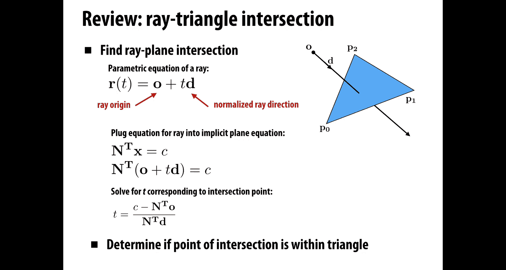

So that's how we did it last time。 Now there's lots of different ways you could do it。

 Here's a different way， which is also kind of fun to think about we could。😊。

Parameterterize the triangle with vertices P0 P1 P2 using our barrycentric coordinates。

So if we have these very centric coordinates， U V and well the third one is always going to be 1 minus u minus v because they have to all add up to1 right So if we have U v and 1 minus u minus v。

 we can write a position on the triangle in this way。

1 minus u minus v times p0 plus u times p1 plus p times v p2。And we can think of。This map， really。

 if we think about， okay， what is the set of all coordinates。

 U and V that are valid very centric coordinates。 Well， those are coordinates that are， first of all。

Non negative， right， greater than or equal to 0， and which sum to 1。

So we can plot the set of valid becentric coordinates in the plane as this little blue triangle。

And so we can really think geometrically of this map F as taking that standard right triangle and warping it or turning it into the triangle that we want to talk about。

That's really what F is doing here。Okay。So how can we incorporate ray intersection into this picture？

Well， we can just plug the parametric gray equation directly into the equation four points on a triangle。

We have an equation that says what are the points in our triangle and we're searching for a point on the ray that is one of these points。

 so we just say p0 plus， we write it in a slightly different way。

 plus u times p1 minus p0 plus v times p2 minus p0 equals o plus td。

So what we're really saying here is now we have three unknowns。

 We don't know what is the time T where the ray intersects the triangle。

 and we don't know what are the becentric coordinates U and V where the ray hits the triangle。

But actually， we're in good shape， because even though this looks like just one equation。

 it's actually three different equations。 Notice that。This equation involves vector quantities。

 each of these bold symbols， P0， P1， P2， O and D， those are all vectors in R3。

 So actually this equation is actually three scalar equations。

And that's nice because what it means is we have three unknown degrees of freedom。

 UVv and T in three equations。So we can build a little matrix equation。Here's at the bottom。

 we have the matrix M and its columns are P1 minus p0， P2 minus p0 and minus D。

And we can solve simultaneously for all three variables， U V and T at the same time。Of course。

 we're going to have all the same kinds of things go on that we had before， right。

 We might find a U And V that's not inside the triangle。 We might find a T value that's negative。

 which means what。It means the ray is actually going away from the plane rather than toward the plane。

 right so we still have to check all the same things。

 but we can just solve this little matrix equation to get the solution。

 It also has a really nice geometric interpretation。

Which is that if we think about applying this matrix to the vertices of the triangle。

It's really transforming it back into this standard triangle。

 If we think about applying this matrix to the ray。

 it's transforming it into a array that's orthogonal to the plane of this standard triangle。

 So another way of saying this is we're reducing our ray triangle intersection problem into a much simpler problem of seeing where it hits this U V plane。

Okay。So hopefully that's a good refresher of just the idea of intersecting a ray with a triangle。

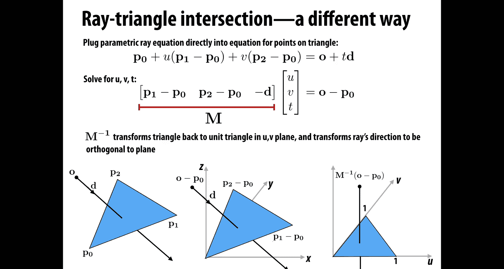

But let's continue， let's think about this bigger problem of not just considering a single triangle。

 but a large scene with lots of complexity。Okay and so one version of the ray tracing problem is this first hit problem。

 which says given a scene defined by a set of n primitives and array R。

 we want to find not just any point where the ray hits the scene。

 but we want to find the closest point of intersection with the scene。

So here the ray hits the cow in four different places， we want to find the spot on his head。Okay。

 find the first primitive the ray hits and the point where it hits。 I mean。

 once we have the primitive， once we know the triangle， okay， we can just do our triangle test。

 right？So what is the most simple thing you could do。

 what's the naive algorithm for solving this problem？I going give you a bunch of triangles。

 you want to see which ones get hit by the ray and where what do you do？I mean。

 the obvious thing to do is just go ahead and okay。

 just intersect the array with every single triangle。

And then as you iterate over all these triangles， doing all these intersections。

 you just want to keep track of the closest hit point。

 take the minimum T value that you've seen so far。What's the computational complexity of this algorithm？

So if I have n triangles。How does this algorithm scale with the number of triangles？Well。

 it's pretty clear we're not doing anything particularly clever here， right。

 We're doing the same amount of work for every single triangle in our list。

We have no opportunity to bypass any of that work， so the complexity is just order N。

 linear complexity。Can we do any better？That's really the question of the day。

When it comes to geometric queries， like ray tracing。Can we somehow speed this up？

If you've never thought about this before， it's maybe not obvious that you can。 It feels like。

You need to know about kind of the interaction of all the geometry with the ray。

So what could we possibly do？Well， okay， so there's at least one simple thing we could do。

 which is we could do some kind of。Crude or course check。

Of whether there's even a possibility of the ray hitting the model before we get going with this long list of intersections。

So one thing we could do， for instance， is put a bounding box around the mesh。

 we could find sort of the smallest cube that encloses all the primitives。Okay， first of all。

 how would we do this？We， we still have to do something that sounds linear。 right。

 We loop over all the vertices in the mesh， and we keep track of the minimum and maximum X， Y。

 Z coordinates of each of the vertices that we encounter。Okay。

 and that'll give us kind of the corners of our box。Okay， fine， we can make this box。

 how does it help us， why is this a useful acceleration strategy？Well， the basic idea， again。

 is to go coarse to fine first。We do a intersection of the array with the box。

There's a chance that the ray actually doesn't hit the box at all。 And in that case。

 we know that we're done because if the ray doesn't enter the box。

 there's no way that it could possibly pass through any of the primitives that are contained inside the box。

So we can just stop computation there and return a flag saying we missed， we didn't hit anything。

On the other hand， if it does hit the box， all we know is okay。

 there's some possibility that it might hit something inside the box。

 and so now we have to go down this whole long list of triangles again and do the intersections one by one。

So did we actually do better overall， did we actually speed things up？Well。

 maybe in a practical sense， we did， maybe just depending on the way that our scene is set up and and you know how our rays are distributed。

 maybe most of the time we hit the box。Or maybe not。 maybe most of the time we do hit the box。

 So asymptotically or in the worst case sense， we're not doing any better。

We're still using order end work to do an intersection query。And in fact， if you think about this。

 we also had to do no matter what we had to do order end work to。Determine the bounding box， right。

 we looped over all the vertices first。So so far， we haven't done。Any better。 you might say， well。

 maybe the cost of building the box doesn't matter because you just have to do it once。

 whereas you might want to do millions and millions of ray intersection tests。 Okay。

 so that's a good point。 So maybe it doesn't matter that it's linear computation。

To build the box because the amortized cost of building it is very small。

But we still end up in the worst case， for a single ray doing linear work。

OkayThe other thing we didn't answer， by the way， is we didn't actually say how to do array box intersection。

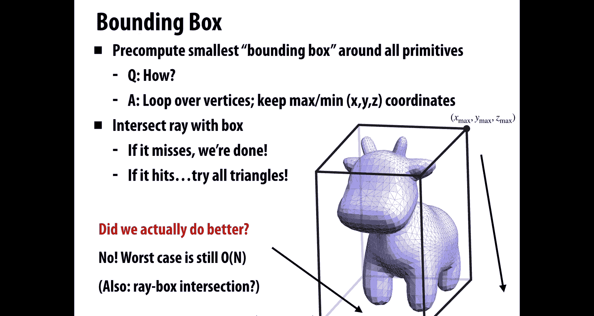

And if you've been following along so far， this shouldn't be too hard， right。

 If you know how to intersect a ray with a triangle， Well。

 you already went through the exercise of finding a ray intersection with a plane。

If you can do a ray intersection with a plane， well， then you can probably use that。

Kind of elementary computation to build up some kind of intersection test with a box。

So how do we do that， Here's our picture。 We have our axis aligned box。And we have array， O plus TD。

Okay， and we want to know。Where and if this ray intersects to the box。So how do we do this again。

 we do a ray plane intersection test and transpose opus td equals C， where for each side of the box。

 we have a different normal n and we have a different constant C。But in this case。

 the math is going to simplify greatly because the planes are always axis aligned。 So in 2 d。

 for instance， the normal is always going to look something like 10 or 01 or 0 negative 1， right。

And so when we go to solve that equation for t， we get a much simpler expression。

 in this case we get t equals x minus Ox over dx， where Ox is just the x component of the origin and dx is the x component of the ray direction。

Okay。So。How do we do a array box intersection that just tells us how to do an intersection。

 you know with an axis aligned plane， The idea is we just compute the intersections with all the planes。

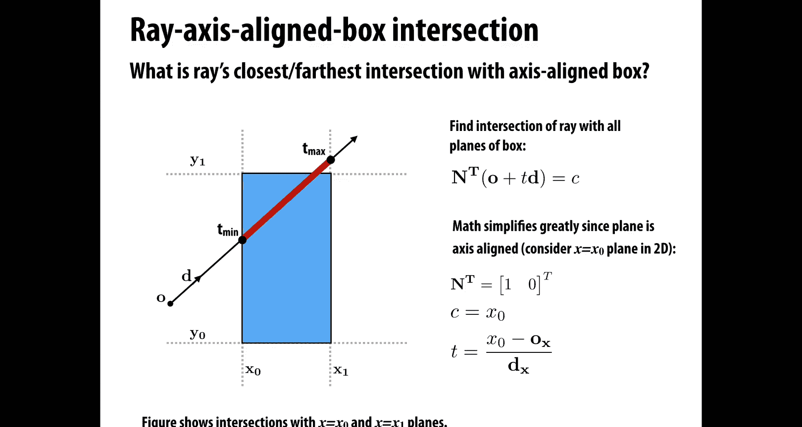

And are we done at that point， well no， not quite， it's not enough to just know that the ray hits the planes because the boxes only cover certain pieces of each of those planes。

RightAnd so we want to take the intersections of TM TMax intervals。

We know the extent of the box along each direction。

 and we can see if the time that the ray spends inside the box in X， Y， and Z if those coincide。Okay。

 so just thing about that like， how do we know when the ray misses the box？Well， when that。

Intersection of intervals is empty。Okay。So that's great， but I'm still just distracting you right。

 we are going through this calculation of how to do an intersection with a box。

 but we still didn't make it any faster。

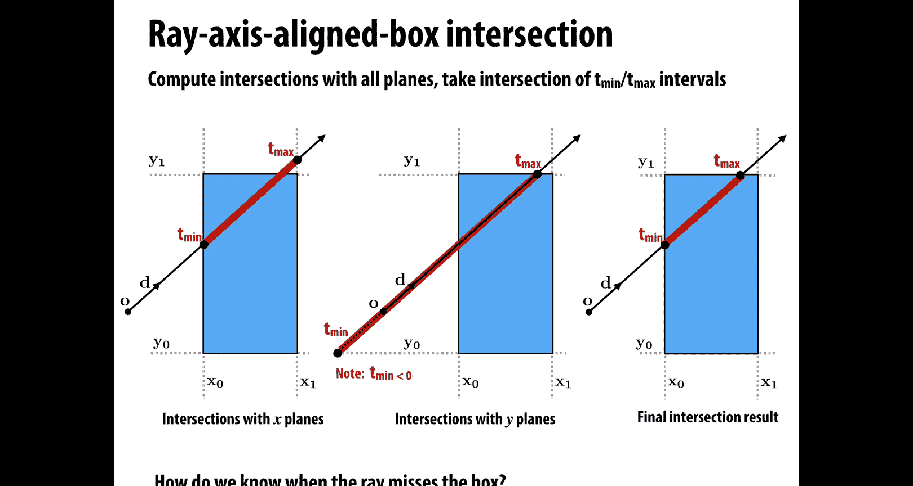

We still didn't do any better than that original， linear time performance。

So we're still faced with this question， how do we speed things up？

How do we do better than the nightive algorithm。

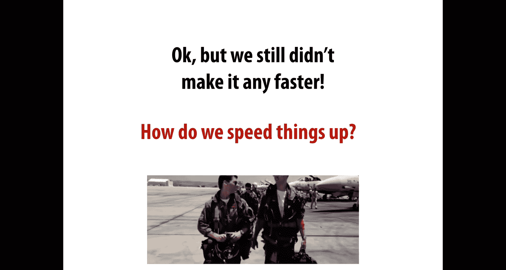

Well， whenever you're trying to solve a difficult problem。

 it helps to go back and think about a simpler problem。

 one that you might maybe already have some intuition for， some tools for solving。

So let's consider a simple problem where I just have now instead of some geometric scene。

 I just have a set of integers。Or let's say I have a list of integers， right， they're in some array。

And the task is given some query integer k， let's say k is 18。

I want to find the element of my array S that is closest to k， closest in value to k。Okay。

So here's my array， 10，1，2，3 to 106， and so on。How do I find this closest integer？

What's your algorithm。Well， the most naive algorithm。

 the simplest thing I could possibly do is just walk through the whole list。

For each entry of the list， I compare the value that I have。

 the query value K to the value in the list。I take the difference and I keep track of the smallest difference。

And whatever entry had the smallest difference， that's my closest value， in this case， 20。Allright。

 so that sounds a lot like our initial naive ray mesh intersection algorithm。

 What is the cost of finding K in terms of the size n of this？List or this set。Again。

 it's just order N。I had to test every single element of my list。

 I didn't do anything to speed things up。Okay， so in this context， can we do better？

For this simpler problem， do we have any idea？Of how we could possibly make this search faster。Well。

 the thing to realize is that we can manipulate the array， we can。

Restructure it so that this problem is easier to solve。When you're doing some kind of search。

 a good thought is to say， can I reorder or restructure my data so that that search is easier？

In this case， a pretty natural idea is to sort the integers first。

 so just sort them according to their value from lowest to highest。Why is this useful？Well。

 now I can do a binary search so I can cut the array roughly in half， and I can say， okay。

 is the value in the middle of the array bigger or smaller than my query value。RightIn this case。

 let's say 30 is roughly in the middle of the array and 18， my query value is less than 30。

 so now I'm just going to say， okay， I don't need to check anything beyond that entry。

 I know that everything after 30 is going to be bigger。

 so I already know that it's bigger than my query value， I don't need to check it。

 I can just check the first part of the array。Okay， and now I recurse。

 I apply that same algorithm to the smaller subaret。

And I do it over and over again until I reach a base case。

 which is just that I have a single element left in my array。At that point。

 I know I must have the value that's closest to the query value K。So that seems nice。

 It seems like we eliminated a lot of computation from that search。 So now let me ask again。

 how much does it cost using this new scheme to find the query value K。

And you have to be careful here because we do have to include if we're thinking about the total cost of implementing this scheme。

 we do have to include the cost of sorting the array。Okay。So what that means if we remember， okay。

 what's the cost of sorting an array with n elements， it's。Order N log n， worst case N log n。

What is the cost of performing the binary search once。It's just log N， so much smaller than N log N。

And so， the overall cost is。Order order and log n。Okay， at first glance， that maybe sounds fastca oh。

 sorting and log n， that sounds fast。 But wait a minute， our original algorithm。

Was just to go down the list， we just had order N work。So actually。

 this binary search strategy is even worse than what we had before。

 we were more clever and it's in a worse case sense， slower。

And that's why we really have to think not about this worst case cost。

 but the amortized cost of doing a single lookup。So now if we imagine we have lots and lots and lots of queries K。

We do a million queries k， well we only had to eat the cost of doing that sort once。

 so that cost at order n log n cost of sorting gets spread out over all our subsequent queries。

And so in terms of the real time performance of this strategy。

 it really feels a lot more like order log N。Which is significantly faster than our original naive algorithm。

Okay。So。That's a great analogy for the kinds of spatial data structures we want to develop。

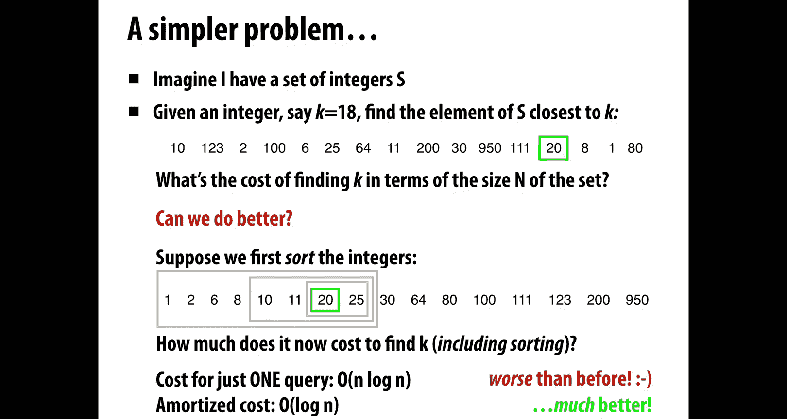

And so now we're faced again with this original question of doing queries on meshes。

And we want to know， can we reorganize the scene， just like we reorganized our array to enable fast。

Ray scene intersection queries。Right， iss there some way of sorting。The triangles in our mesh。

 What does that mean？I mean， when we're in more than one dimension。

 it's not really clear what it means to sort， right。

 We can't just sort in a linear sense like we did with our array。

But we will be able to do something like this to speed up our geometric queries。

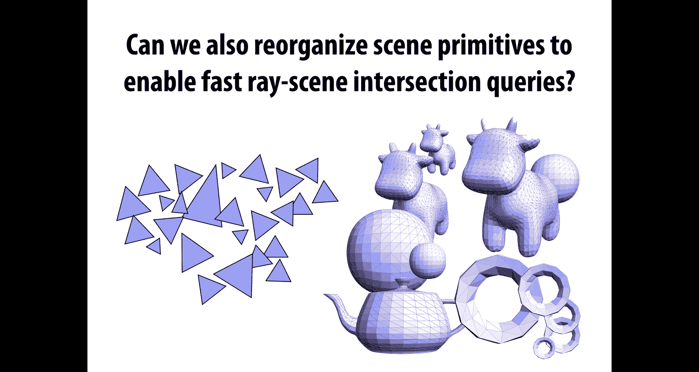

So let's just consider this simple case， we have this scene with a bunch of triangles。

And we have this ray。We want to do an intersection with the scene。 Now。

 if we go with this bounding box strategy that we had before， you know。

 life is kind of good in this case because， O， we miss the box。

 We can skip checking anything inside the box。So the cost of doing this query in the case where we miss the box is。

We do order N pre processing， right， we have to build the box。

We do a constant amount of work to do the rate box test， and again。

 if we amortize the cost over many， many rays。The amortized cost is again just order 1。

 So that's good news。 The amortized cost for not finding an intersection is constant time about as good as we could possibly imagine doing。

But let's consider the other possibility。It could be that the ray hits the box like this。

 In this case， the cost is while the pre processingces hasn't changed。 it's the order n。

The Ray box test is order1。And then well， all we've said how how to do so far is we just go in and we test every single triangle。

 So that's， again， an order N cost， our amortized cost is order。 N even over many。

 many gray queries still know better than the naive algorithm。 We're still testing all the triangles。

 Okay， So how do we do better。 How do we， how do we solve this problem。Well， very。

 very much like what we did with the array look up。 We want to apply this bounding box strategy。

Hierarchically。Don't just do it once， but do it many times have bounding boxes within bounding boxes。

And this is the idea of a bounding volume hierarchy。Okay，So what does this look like。

 so a bounding volume hierarchy means we have a collection of boxes arranged in a tree like structure。

And there are two types of nodes。There are leaf nodes at the bottom of the tree。

 Those nodes actually contain primitives， right， they actually maybe contain a small list of triangles。

All other nodes in the tree are interior nodes， so an interior node。

 you can imagine is sort of a proxy for a large subset of primitives。

It's kind of pretending to capture the geometry of all the primitives that it contains。

 but of course， it's only doing that approximately because it's a box and not a collection of triangles。

Okay， so what does the interior node do， it actually stores a bounding box for all of the primitives in the subte。

Which you can do by just storing the bounding box of the bounding boxes that it contains。Okay。

So here actually we've shown two different examples of a bounding volume hierarchy for the same set of primitives。

There's not just one way to organize these bounding volume hierarchies。

 You can contrast this with a list。 It was really nice in the case of a list of integers。

 There's just one canonical way of sorting it。 Maybe you have some ambiguity。

 If you have repeats or something like that。But here we have a lot more possibilities of how we can group primitives。

 how we can group bounding boxes into higher level nodes in the tree and so forth。

And so from already from this picture， you might ask， well。

Is there a sense in which one of these bounding volume hierarchies is better than the other。

So we haven't even really said what the algorithm is yet。

 how are we going to use this bounding volume hierarchy？

But you can imagine it's very much like what we did with the integer search。 right。

 We combine the integer search with this idea of a bounding box test。 So I do the bounding box test。

If I hit。Then I do the bounding box tests on the children of that node and on the children of those nodes until I finally reach some primitives。

So now it feels like I can skip a lot of computation for regions of the mesh that I don't。

Care about or regions that I'm clearly not going to hit。From this point of view， again。

 can we say that one of these bounding volume hierarchies is better than the other？Well， again。

 without knowing exactly how these rays are going to look， it's hard to say， but I might guess。That。

The bounding box on the right。Is a better one。Right， because the further I go down the tree。

 the tighter fitting these are these， these nodes really tightly fit around the geometry。

 On the left， For instance， I have bounding boxes B and C that have a lot of empty space in them。

So I might easily hit B or C thinking that I'm going to hit a primitive。

But discover most of the time that I'm not。Okay， and we'll talk more a little later on about how to build an efficient bounding volume hierarchy。

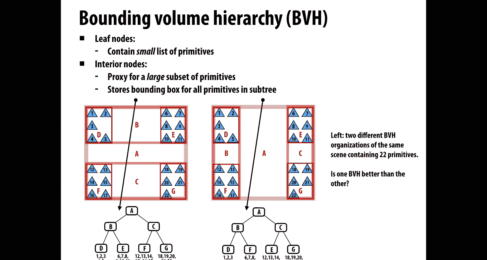

Here's another bounding volume hierarchy example。Again。

 it's going to partition the primitives into disjoint sets。Always， we're going to put。

A triangle or a primitive in one node or another。 It doesn't belong to。Two leaf nodes， for instance。

But what you notice here is that the bounding boxes themselves。

The interior nodes or the bounding boxes can overlap in space。

So array might hit both bounding boxes and might hit the overlap of the two bounding boxes。Okay。

 that's going to be important to keep in mind。And you can imagine maybe that the more they overlap the less efficient they are。

 if they were overlapping almost， you know identically， then you're not really gaining anything。

 You have to test both of them almost all the time。Okay。

So what does our ray scene intersection using a bounding volume hierarchy actually look like So let's walk through this in some detail。

 We'll write some kind of very simple code that captures the idea of this race scene intersection and we're going to start by describing a data structure for the bounding volume hierarchy node。

 So a data structure for a single box in this hierarchy。Okay。

So we have thisstruct or class BVH node that storess some basic data。

 one is a Boolean variable that leaf that says， is this a leaf node？

Does this contain primitives or is it something that contains other bounding boxes？

We have a bounding box which just describes the actual shape of that bounding box， so again。

 the minimum and maximum coordinates bounded by the box。

And then we have two pointers to other BVH nodes。That point to the left child and the right child。

And of course， this tree doesn't go on forever， so these pointers could be null。In particular。

 there are going to be null when the leaf variable is true when this is a leaf node。

They could also be node。 They could also be null if the。Tree isn't isn't a doesn't have two children。

 right， I could have an interior node that doesn't have both a left and a right child。Okay。Finally。

 if I am a leaf node， I need to store a list of the primitives inside this note。

 I just need a list of the triangles that are contained in this final leaf note。Alright。

Then we also have a data structure for keeping track of information about where the ray hits。

The scene。 So that's going to be this hit info structure。

And this just stores a couple pieces of information， the a pointer to the primitive that was hit。

 so which triangle was hit by the ray？And the T value， how far along the ray did that hit occur？Okay。

Okay， finally， we get to。The algorithm itself。 So we have our ray。 We have our BVH node。

And we want to compute the closest hit and store it in this hit info。So how do we do that？Well。

 the first thing we have to do is just check， does the given ray intersect the given bounding box note。

 So we just do an intersection of box ray intersection test。

And this hit info data structure gets filled。If the primitive is null。

 meaning we didn't hit a primitive or a box。Or。The distance T at which we hit is greater than the closest distance we've seen so far。

Then we can stop。Or at least this particular query。

Didn't find a closer point to the origin of the ray。Okay。So we just return。

 we don't update the hit record。On the other hand。If the node is a leaf。RightThen for each primitive。

 we just have to do an ordinary ray triangle intersection test。 so for each primitive P in the list。

 we do an intersection test of the ray with that primitive。If， again， the hit primitive is null。

 meaning the ray missed the triangle。Sorry， if the primitive is not null。

 meaning we did hit some triangle and the distance that we hit the triangle at is smaller than the closest distance we've seen so far。

Then， we。Assign a new， closest primitive and a new closest hit time。Okay。Otherwise。

 if we're not a leaf node， well then we just have to traverse down our children。

So we find the closest hit。For the left child， we find the closest hit for the right child。

 That's automatically going to keep track of the smaller of the two hit times if it hits at all。

 And then we're done。 We've updated the record closest， and the calling routine can now continue。

Okay。So that's the basic strategy。 There's lots of ways we can improve。

The performance of this traversal and generally the strategy for improving performance is to do traversal in a way that's likely to terminate early。

Think about how geometry and rays in your scene are probably distributed or how this query is probably going to go。

And then think， well， can I be smart about the order in which I visit different pieces of this bounding volume hierarchy。

All right， can I traverse the tree in an intelligent way？So here's a modified version of our。

Cllosest hit algorithm。 So we have the same inputs， the ray， the node and the hit record。

And if we hit a leaf node， we just do the same thing。 We walk through all the。

Primitive stored in the leaf， and we do a standard ray triangle intersection， otherwise。

We're gonna do something slightly different。 So we're gonna。

Do an intersection of the ray with the left child's bounding box。

We're going to do an intersection with the right child's bounding box。But then we're going to check。

Is the time that we hit the left child smaller than the right child。If so， we're going to say。

 you know。The first node that we're going to consider is child one。Otherwise。

 the first node will consider his Ch2 and vice versa。Right， so if the。

Second hit time is smaller than the first hit time than we want to look at child two before we look at childil one。

Okay。Next thing we do is we say， all right， we're going to look at this first node first。

 whichever one have the smallest hit time， we're actually going to go into that node and find the closest hit within it。

And after we're done with that， we ask， okay， is the。Hit time of the second child， smaller。

Then the closest thing that we found in the first child。If so。

Then we go ahead and traverse the second child。Okay。And that's， that's that。 So first question is。

 why do we still need to traverse the second child？

We already know the bounding box of the first child is closer than the bounding box of the second child。

So why do we even bother going into the second child？Okay， and the reason is。Because。

We might not have hit anything inside the first child， even though the box is closer to us。

 the ray might have just gone through that box without hitting any actual primitive。You see。Okay。

On the other hand， why in general might this be a good strategy？

Why might it be good to do this front to back traversal？

Where we traverse the closest child node first。So even though we can miss everything in the closer node。

Still， a lot of the time， we kind of expect that for most reasonable scenes。

 for most reasonable rays。If we hit this， if we traverse this， this closer box first。

 then it's very likely then we can terminate early。

If we find a primitive inside the first box that's closer to us than anything in the second box。

Then we can just skip the second box altogether。And that's， again。

 just like what we did with our array。 At some point。

 we have enough information to say with 100 per cent certainty。

That we can skip a big chunk of the search tree。Okay。So in general， again。

 that's one way to improve performance in a BVH is to think about how to switch up my traversal strategy so that I can prune out branches of the tree and reduce my overall computation kind of on average or in a typical case。

Another strategy for improving performance with a hierarchical data structure is to simply build a better bounding volume hierarchy。

Or build a better tree。Okay。But。Again， unlike a list of integers。

 there are lots of possibilities for how I can arrange this data。

 There's many different ways to partition my primitives into this tree structure。 In fact。

 there's two to the n over two ways to partition way more than I could possibly explore exhaustively。

 right。And so we're faced with this important question， how do we quickly build a high quality BVH。

 meaningan how do we quickly build a BVH where we're likely to。Have to traverse only a few nodes。

 not traverse a huge percentage of the nodes in the tree。Okay， so lets let's look at a few examples。

So here， for instance， we have some primitives floating in space。

 we want to build a bounding volume hierarchy for them。

How would you partition these triangles into two groups to kind of get a good？

Efficient bounding volume hierarchy。I think what I would do probably is I would just split them up kind of left to right。

 I would pick， you know， a bounding box that's covering the left half。

 a bounding box that's covering the right half and then you know。

 maybe do that and recursively split those actually not so different from the way that we did our list of integers。

 just kind of do a linear hierarchy。Okay， and I probably would split it right down the middle too。

 like similar number of triangles in both boxes。Okay。What about this case？What's。

 what's a good way to build a bounding volume hierarchy here。So， you know。

 one thing that's tempting is to say， well， I kind of want this tree to be nicely balanced。

 I want I want the， you know， the weight of each side of the tree to be similar。

But that's not really going to help us for ray tracing。

If we say we want to partition the child into nodes with an equal number of primitives。

Then one of these nodes is huge。Even though mostly it just contains empty space。

 so most of the time that we're hitting the node on the left。

We're actually not going to hit a primitive。So it's kind of giving us a lot of false positives。

A much better way to partition， at least in this case， is to favor tighter bounding boxes。

So even though the number of elements in each of these boxes is now quite different。

 this is going to be a much more efficient partition when it comes to doing ray intersection when it comes to traversing the BVH。

Okay， so that' that's pretty good intuition that want we want small bounding boxes without a lot of wasted space。

And also， we want to minimize overlap between children。

RightWe don't want these bounding boxes to be doing kind of redundant work。Okay， so that's。

 that's the intuition。 I mean， what， what are we really trying to do。

We can think about this as kind of a optimization or minim problem， right。

 A good partitioning minimizes the cost of finding the closest intersection of array with primitives in the node。

Okay。So， you know， we could say that we want to consider all these two to the n over two possibilities。

And for each one of those possibilities， evaluate some cost function and find the absolutely best bounding volume hierarchy。

Well。Even if we had enough compute power to do that。We'd still be missing a critical definition。

 which is what is the cost？What is the cost associated with a given bounding volume hierarchy。

And that's not an easy question to answer， but there are some very good heuristics for figuring out what a good cost estimate might be。

So a really easy case is to consider just a leaf node。In a leaf node。

 we know exactly what's going to go on， there's no decisions to be made about traversal。

 we just have to walk through the list of primitives stored in the leaf and do an intersection。

So the cost of a leaf is just the sum over all the primitives from one up to n of the cost of intersecting primitive I。

Right， and it's common to assume just to make this kind of calculation easy。

 We can just assume that all primitives have the same cost。 if they're all triangles。

 then we have to do the same。Amount of compute。 Maybe we invert that little three by three system that we talked about at the beginning。

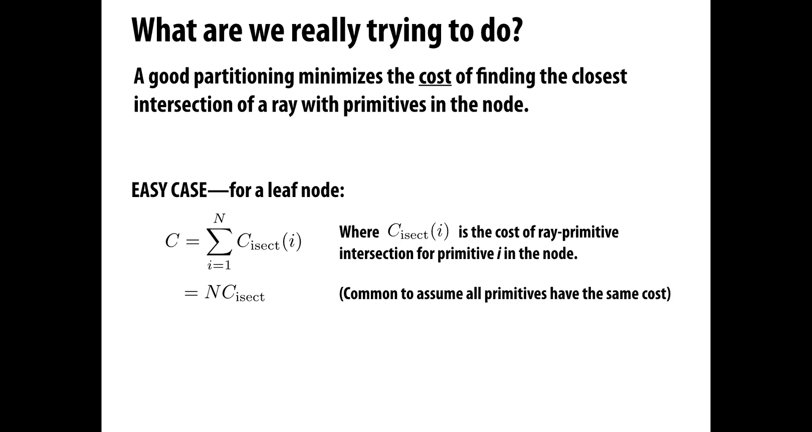

Okay。A much harder case is to figure out what is the cost associated with intersecting an interior node。

So maybe what's the expected cost of intersecting an interior node。

 given that the nodes primitives are partitioned into two child sets， A and B。

 with this binary partition。Well， we can think of the cost or we can model the cost as C equals C Tra。

 the cost of traversing an interior node， so just the cost of doing the bounding box test for that one node。

Plus。P A times C A， meaning the probability that we hit the left child times the cost of traversing the whole left child。

Plus PB times C B， the same thing for the right child。Okay。

So the cost of traversing a given interior node is that any time we spend on the node itself。

 plus the costs associated with its children weighted by the chance that we actually hit its children。

Okay。Now， if you， again， were willing to do a lot of computation。

You could really go and consider this full recursive formula。And evaluate those costs。

 CA and C by plugging in this formula over and over and over again。As we'll see in a second。

There's actually a significant work associated with evaluating the cost。

 And so we don't really want to do that full recursion， right， that's going to be way。

 way more compute that we we actually can do。 So a common of heuristic for the cost of traversing a child is to。

 and it sounds really crude， but turns out to work really well is to just say the cost of traversing a child。

Is just proportional to the number of primitives， the total number of primitives contained by that child。

So if that node is an interior node way up in the top of the tree。

 we're still going to associate with it。The number of primitives all the way down in all the leaves that it contains。

So we've written that here as NA times the cost of intersection。

 NA is the number of primitives contained by the left child times the cost of intersecting a single primitive。

And this is actually a heuristic that people really use in practice after many years。

 even decades of ray tracing research， people have kind of come back to this idea over and over again。

 even though it sounds like a bit of a crude heuristic， it really does work well in practice。

There is however one remaining question， which is how do we get these probabilities PA and PB？

What is the probability that a ray hits the left child or the right child？And of course。

 we can't know for sure， right， the user whoever's sending us rays could send us rays in any possible configuration。

 They could send us the same ray over and over again。 They could send us completely random rays。

 They could send us rays that only touch part of the scene。 So again。

 we need to come up with a heuristic， something that models things well enough to capture the average behavior。

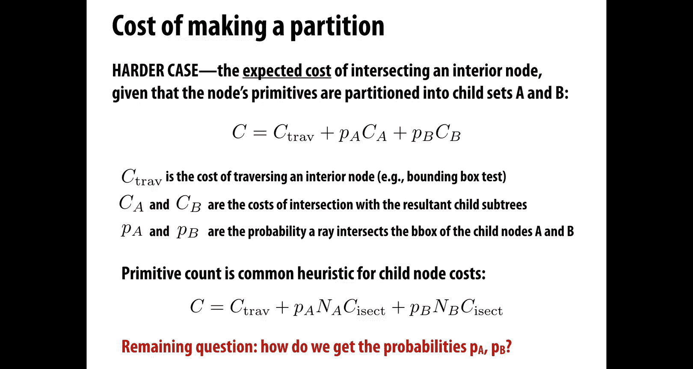

And one common way to do this is。To use something called the surface area heuristic。

So the kind of starting assumption or the kind of model that we start with。Is we say， okay。

 here's something we do actually know for sure。Is if we have a convex object A inside another convex object B。

Then the probability that a random ray from outside。Hititzbe。Sorry。

 a random array that hits B also hits A is given by the ratio of the surface areas of these two objects。

So the probability that we hit the interior object A， given that we hit B is equal to S over S B。

And you can understand at least intuitively why this is true。

Imagine the object inside is extremely small， like almost scaled down to a point。

Then the probability that we hit that little tiny thing。

 given that we hit the outside thing is almost 0， right。And likewise。

 the area on the interior is much， much smaller than the area on the outside。Conversely。

 if the interior object almost fills the exterior object， right， if it's bumping up against it。

Then if we hit the outside， we're almost certainly going to hit the inside。

But you can actually make this formal。 You can really show that this is the correct probability。So。

Even though。The objects in our scene are not all convex。

 We can still use this heuristic to get a sense of what the probability is that we're going to hit the left and the right child。

And， of course。We do know that our bounding boxes are conx。Right。

 so it' it's at least reasonable to say， you know， if you hit this bounding box。

 what's the probability that you hit the child？Well， that we really can use thee。Convexity argument。

 Okay， but overall， our surface area heuristic says what's the cost associated with a given interior node。

 The cost is the cost of traversing the node itself。 So doing the bounding box intersection plus。

The ratio of the surface area。Inside。Over the service area outside times the number of primitives inside the left child times the cost of intersecting a single primitive plus a similar term for the other child。

Okay。Now， we made some assumptions here that may not hold in practice。

One is we assumed this whole convexity argument assumes that rays are randomly distributed。

 which absolutely isn't true。We also assume that there's no occlusion that we don't have one object blocking another。

 And that's also not true In real scenes， that's going to happen。Nonetheless。

 if we need to build a bounding volume hierarchy that's going to work in all sorts of different scenarios for all sorts of ray distributions that we don't know a priori。

 This is a surprisingly good guess。 This works about as well as anything else you can throw at it。

Okay。

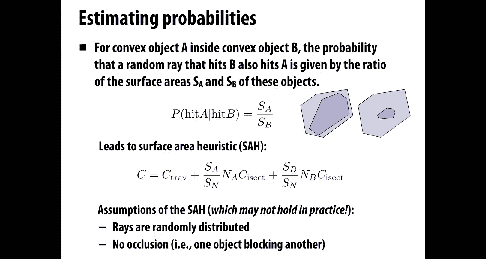

So the next question is how do we actually use this heuristic to build the BVH。

 what is the actual algorithm now for constructing the BVH？So there are， again。

 for computational reasons。Lots of simplifications that we make。 you could。Do an exhaustive search。

 you could try all sorts of different strategies for figuring out how to split things up。

But the reality is a lot of the sophisticated things you try often lead to incremental gains or no gains at all。

 doesn't really make a difference in the big sense。

So a pretty good practical strategy is to constrain the search for good partitions to access aligned spatial partitions。

So we have a set of primitives， we want to know how do we split up this set of primitives into a pair of bounding boxes。

So what we're going to do is choose one of the axes X， Y or z。And then， we're gonna。

Consider all possible ways， at least conceptually， all possible ways we could split these。

Primitives along that axis， you can imagine sliding a plane from left to right。At every moment。Right。

 as we slide this plane from left to right， we're basically saying which primitives go on the left side and which primitives go in the right side。

 and we can evaluate the cost。Using our heuristic， we can evaluate the cost of that particular split。

And we're trying to find at least for this local problem。

 at least for this current split that we're doing， we're trying to minimize that cost。

Now one thing we can notice is that the cost estimate is only going to change when the plane moves past the triangle when the triangle goes from one bucket into the other bucket。

Right。So we don't have to consider。Too many， but we still have to consider quite a large number of possible split planes。

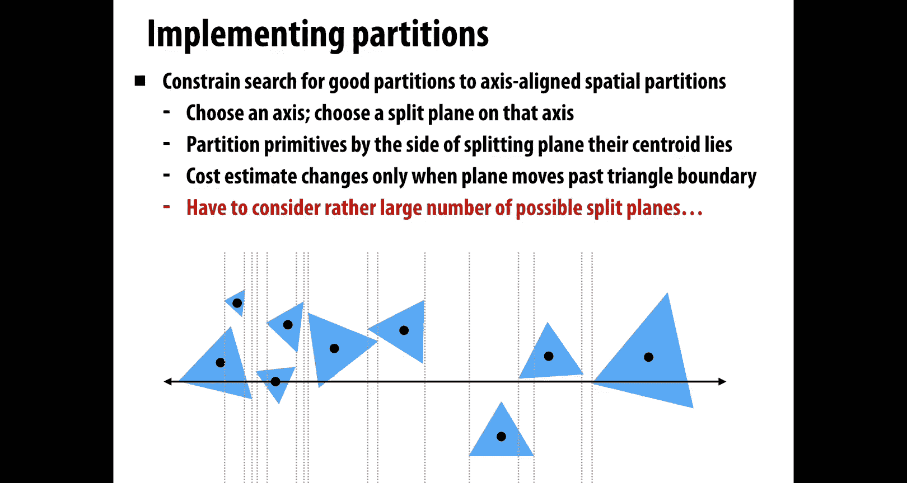

For that reason， we make yet another approximation。 So modern ray tracers will say， look。

 it's really not worth it in terms of the overall performance to consider every possible split plane。

 What we're going to do instead is just pick some small small number of partitions to check or buckets to check。

 So maybe 32 different ways of splitting along this axis。Okay。And so then what we do for each axis。

 X， Y， z， we initialize the buckets。We just say， okay。

 initially there are no primitives in any bucket。For each primitive。Pi。

We figure out which bucket it's in， we just say， okay。

 we take the location of its centroid along the current axis。

And we divide it and kind of find the bucket that it's in。And then， we。Do a union。 So initially。

 the bounding box for that bucket is empty。 It's got nothing in it。

 When we put a single primitive in it， the bounding box becomes the bounding box around that one primitive。

 When we put additional primitives into that same bounding box。

 we do the union of the bounding boxes， meaning we turn。

 we replace the original bounding box with a bounding box of all the things we have so far。Okay。

 and maybe we keep track also of how many primitives are inside that box。

Then for each of the possible partitioning planes， maybe each of the 32 possibilities。

 we evaluate the cost using our heuristic， our surface area heuristic。

We keep track of which partition has the lowest cost。And that's the split that we use。

And then we recurse， we recurse on the lowest cost partition that we found。

Or if we're down near the bottom of the tree， If we only have a few primitives left。

 and we pick some target size 4 or 8 or something， then we make a leaf note。Okay， so we really did。

 in the end， kind of reduce this whole problem of。Searching geometrically to something that feels like searching our linear array。

We kind of have a binary search on it， right， but a lot you know。

 there's obviously a lot richer complexity here， a lot more things to think about。

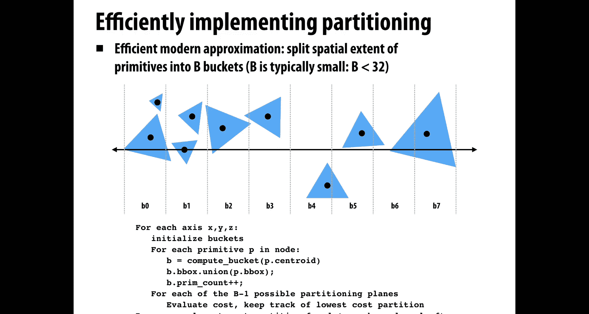

Also。There's kind of no answer that works well in all cases。

 you can always find troublesome corner cases that no matter how intelligently you build your BVH。

 you run into poor performance， so here are some really extreme ones。

 let's say you have all your primitives with the same centroid。Well， then as you're doing the split。

 they're all going to end up in the same partition。

There's nothing really you can do with the BVH here other than to test all。And triangles。

You also might have different primitives with the same bounding box。

Right and so the Ray often ends up visiting both partitions。So in general。

 different strategies might work better for different types of geometry。

 for different distributions of primitives， for different distributions of rays。And so forth。

And there's a lot of work that continues to explore these different tradeoffs。

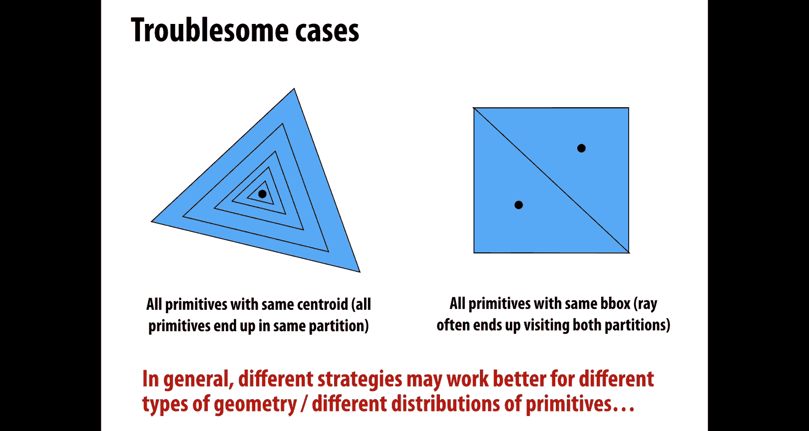

So the other thing we can do from here rather than trying to continue to tweak and improve our bounding volume hierarchy is consider a completely different class of strategies。

 So so far， we've been considering what's called a primitive partitioning strategy which partitions the nodes primitives into disjoints sets。

 right we build our tree by recursively subdividing the set of triangles， let's say。

A completely different point of view is to say let's recursively subdivide space itself。

Let's split up space into smaller and smaller pieces and then test rays intersections with those chunks of space。

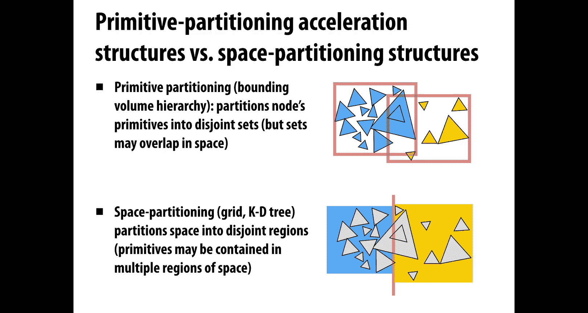

Okay， classic example， this is what's called a Kd tree。

And this is going to recursively partition space via axis aligned partitioning planes。Okay， so now。

What do the nodes in our tree correspond to， Interior nodes are going to correspond to spatial splits。

Leaf nodes。Are going to correspond to these final boxes， these colored boxes you see here。

 and each of those leaf nodes is still going to reference some set of primitives。

Right why even bother considering a different strategy。

 what is good about this spatial partitioning strategy。

 basically that no traversal now can proceed in front to back order if we know how to walk through the nodes of the Kd tree in a particular order。

 then we can really be sure that we're hitting the first thing first。Okay， and so unlike a BVH。

 we can completely cut out as soon as we find the first hit。

 we know for sure that we found the closest thing。So Kd trees are really good at early exits。

 basically。

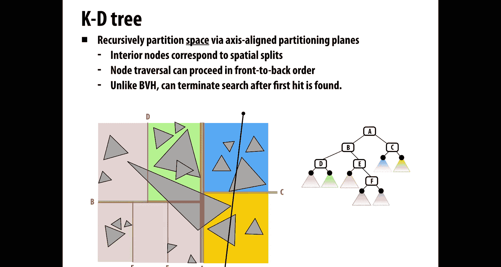

There are， however， some challenges with this approach。

 and the basic complexity we have to deal with is that objects can overlap multiple nodes。

We can have a single primitive that's contained in multiple nodes of the Kd tree。

So what we'd like to do is traverse these nodes in front to back orders so that traverse will can terminate after we find the first hit。

But let let's look at what happens in this example。

 So we have this big long triangle number one that overlaps multiple nodes。And we。

Progress in front to back order， we started the ray origin。

 and we walked through the Kd tree looking at the closer nodes first。

When we're in this pink highlighted node， okay that node stores three triangles。

 it knows about three triangles， and so we're going to do a test with all three of them。

And we find a hit on triangle1。But that hit is not in the pink note itself。

The triangle actually occurs in some other node or sorry the hit actually occurs in some other node。

And this is kind of a problem because。Even though we already found a hit。

It'd be dangerous to cut out early。 We don't know for sure yet that this is the closest hit。 right。

 In fact， we can see pretty clearly in this example that the inner。

 there's going to be an intersection with triangle 2 that's closer than the one we found with triangle 1。

Okay， so what is the solution that's quite simple， actually。

We just require the primitive intersection point to be within the current leaf node。In other words。

 we do the intersection with triangle 1。 Sure we find a hit， but that hit is not in the pink node。

 so we ignore it for now。And then if there are no hits。

 if there are no other hits in the current node， we're going to progress on to the next node。

In this next node， we're going to hit triangle2 first and get the right result。

So what this means is that in the process of traversing the Kd tree。

We may actually do an intersection with the same triangle multiple times。

And so one little optimization we can do to speed things up is we can cache the result。 we can say。

 ah I've visited this triangle before I've done this intersection before。

 I'm just going to store the hit point。Rather than recomputing it。

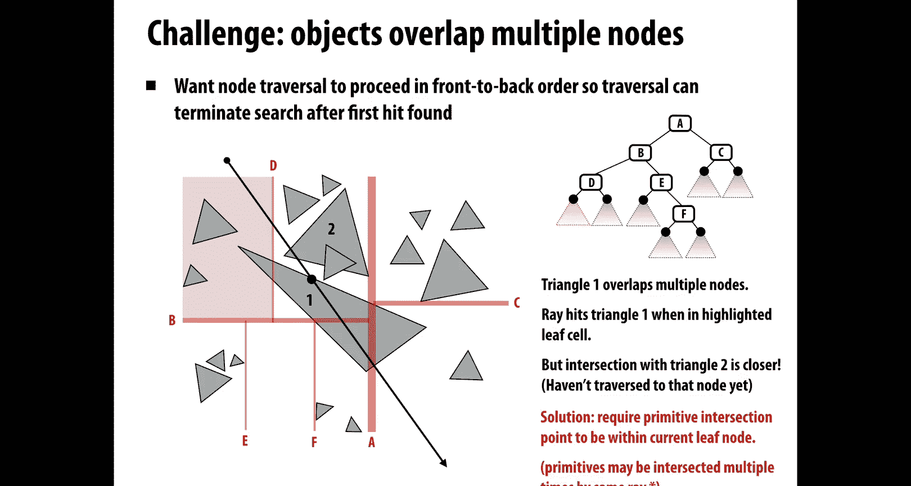

And that's called mailboxing。What other spatial partitioning strategies do we have。

 We don't have to use a KD tree。 In fact， this Kd tree might seem pretty。

 pretty complex in contrast to other things you might have thought of。

 So another really straightforward thing we could do is just partition space into equal size volumes。

These volume elements are what people sometimes call voxels。And again， each grid cell。

 each cell in this regular grid， is going to store a list of primitives that overlap it。

And we can do a similar thing， right， We walk the ray through the volume。In order。

And this is really easy to do actually， this， this walking along array in a voxel grid really should remind you a lot of walking along a line in a pixel grid to do line rasterization。

 The only thing that changes here is we're kind of raizing a 3D line rather than a 2D line。

And so the good thing about this is we only have to consider intersections with primitives in the voxels that the ray intersect。

Right。What is the downside？Why， why is this a bad strategy？ Well， first of all。

 we have to make a choice of what the grid resolution should be。 So if we have too few grid cells。

 right， imagine we just have one big grid cell that contains our entire scene。

 then we're really not doing a good job of acceleration。

 We're still looping over a lot of primitives to find one hit。

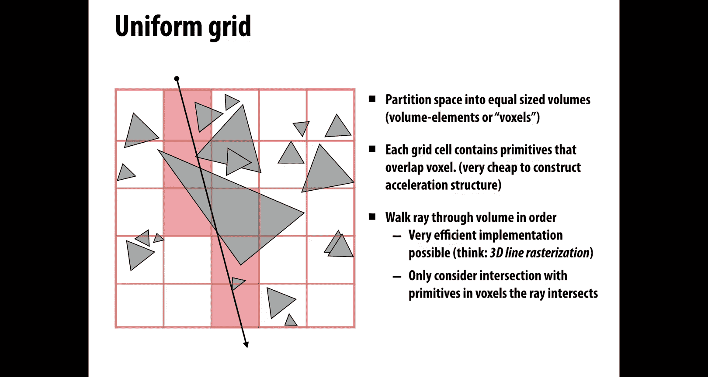

On the other hand， if we use a grid that's too fine。It contains lots and lots and lots of cells。

 Then we're going to have significant cost because we're going to spend a lot of time traversing through space。

 checking each of these cells and not getting much to show for it。

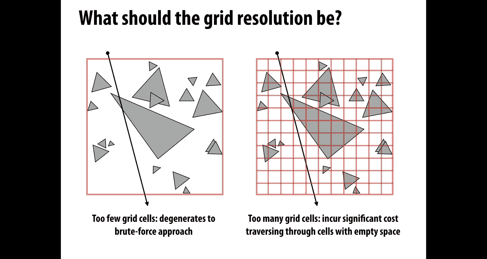

So a common heuristic is to choose the number of voxels to be roughly equal to the total number of primitives。

With the idea being that we're going to then have roughly a constant number of primitives per voxel。

Of course， that assumes something very special about the geometry assumes that the geometry is distributed pretty uniformly。

And there are important cases where that's going to be what our geometry looks like。

And there are plenty of cases where it's not。 So you really have to think is this the appropriate strategy for the kind of geometry that I'm working with？

Right。Also， we can think about this in terms of asymptotic costs。 the intersection cost here is。

Order Q root N Y， Q root N。Right， basically because if we think about。

WhatWhat is the number of voxels in this three dimensional line versus the number of voxels in the whole grid？

RightAnd what is the number of voxes in the whole grid， Well。

 we said that that's going to be proportional to the number of primitives。

So we can contrast this with our earlier data structures。K D3 B， V， H。

 which had amortized log N performance for doing a single ray query。And ask which one is better。

 asymptotically。This grid seems really appealing， it's really simple and slick。

But did we actually gain anything asymptotically， actually no？Right。

 log n is going to grow a lot slower than even Q root n。That being said。

 in terms of real world performance， if we have specific kinds of scenes。

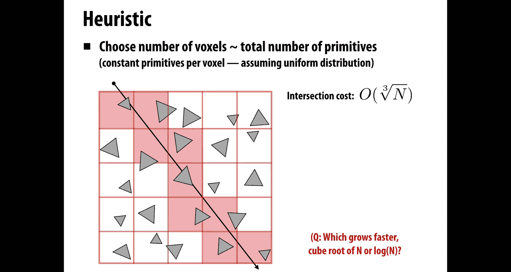

This uniform grid strategy can work really， really well。In particular。

 if we have a very uniform or homogeneous distribution of primitives of geometry in the scene。

 so some great examples would be we're trying to raytrace a height field。

 we have like an elevation map with lots of detail， lots of little triangles。

 so roughly the same amount of detail all over the map or we have a big field of blades of grass we just have millions and millions of blades of grass。

This really looks like our。Are kind of heuristic assumption that the primitives are uniformly distributed throughout the grid。

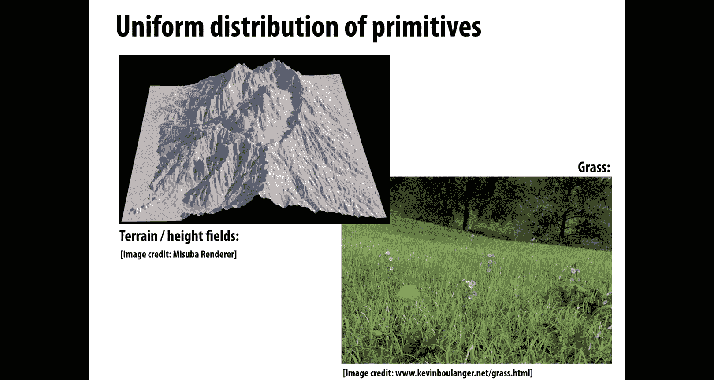

On the other hand， there's cases that are really bad for uniform grid。

Uniform grid can't adapt fundamentally to non uniform geometry in the scene。

 So a great kind of metaphor for this is what's called a teapot in a stadium。

 You imagine you have a scene that's a huge football stadium。 and in the middle， you have a teapot。

 this tiny little teapot。 But actually that teapot has millions of triangles in it。

And so you have this one grid cell with a huge number of triangles in it。 And if。

 if a ray ever enters that cell， if you have the camera zoomed in on the teapot。

 then you're still going to be doing kind of worst case work。To find an intersection。Okay。

 so you really have to be conscious about what kind of。

Geometry that you you're dealing with when you're deciding on what data structure to use。

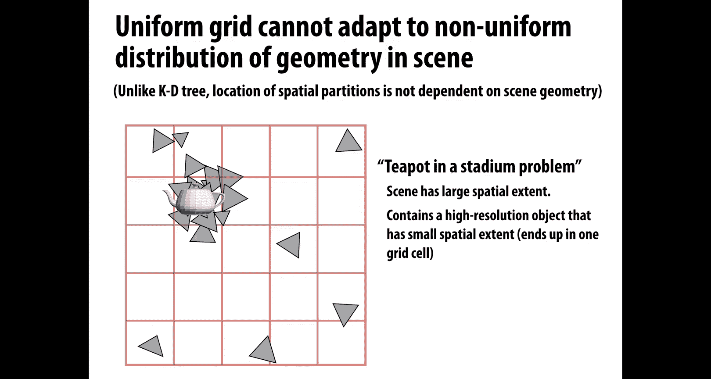

Here's a nice example where we have a well， sort of non uniform distribution of geometric detail。

We have this object with lots of hair and fur on it。 If you think about just ray tracing the hair。

 maybe that's something like our blades of grass。 But then this object is sitting inside this bigger room。

 which has much simpler geometry。 The stool， the stairs， the window and so forth。

And so maybe actually you could think about combining these strategies。

W not have a uniform grid as a node inside of a BVH or a Kd tree？

Why not have a Kd tree as a node inside a uniform grid？So in principle。

 you could mix and match if you wanted to get really sophisticated。

You could mix and match these data structures。There's other very common spatial partitioning data structures。

 one is called a quad tree or an O tree。This is again a hierarchical partitioning strategy。

 but now instead of doing a binary split， we're going to split each cell into well in 2 D。

 we split it into four pieces。Spttting these nodes smaller and smaller and smaller until they contain basically a constant number of primitives。

Or in 3D， we'd split along all three axes， so every node splits into 8。Why do people like a trees。

 Well， for one thing like a uniform grid， they're really easy to build。

 We don't have to choose partition planes。 We don't have to go through all this， you know。

 choice of heuristics。 Where should we put the split plane and so forth。On the other hand。

 it has some advantages that a uniform grid doesn't。

 it's easier to adapt an ay to the location of scene geometry。

 we can solve this teapot in a stadium problem a little bit better。

But generally in terms of real performance， a trees are going to have and quadries are going to have a lower intersection performance than a Kd tree。

 there's only kind of a limited ability to adapt。 We can only shrink down the cells so fast。

 and again， we don't get a choice of where to put the splits。and there's lots of others。

 lot of other strategies people use for both spatial and element partitioning， the summary。

 as with all of the things we study in this class， is to not get too stuck on one way of thinking about this。

 but really choose the right data structure or the right strategy for the job。

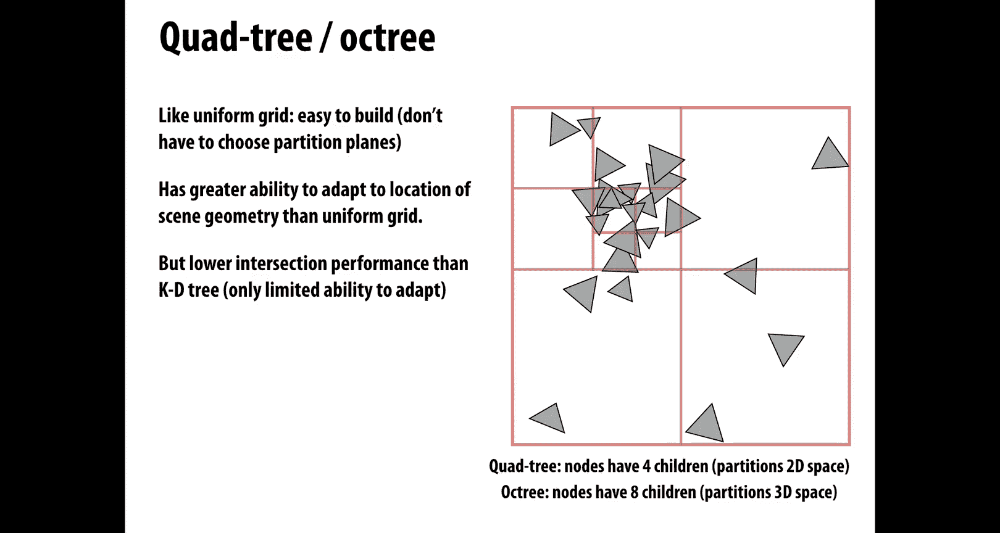

Right and just to recap。At a high level， we had two major categories of hierarchical acceleration structures。

 we had primitive partitioning versus spatial partitioning。

Primitive partitioning says you have a bunch of objects like triangles and you're going to hierarchically subdivide those or partition those。

Good thing about this is， you know， you always have a clear bound on the number of BVH nodes。

The total number of nodes in your tree has nothing to do with how the geometry is distributed in space。

Also， interestingly enough， it has nothing to do with dimension。

The size of your tree is going to be the same whether you're talking about things in 2D or things in 3D。

For some problems， actually， you'll find that you need to do acceleration of things in higher dimensions。

 like maybe you do it in five or six dimensions because you're talking about positions and normal directions simultaneously。

So this is a nice feature of BVH's。 They don't depend strongly on dimension。Also。

 a really cool feature of BVH is that if your scene just changes position a little bit。

If things just wiggle around or you have some animation， even some moderate animation。

You don't have to go through the exercise of completely rebuilding the BVH from scratch。

 you can just do what's called a BVH refit。So you can just grow or shrink the existing bounding volume hierarchy nodes to more tightly fit the new geometry。

 You can imagine you start at the leaves。 Okay， the leaves have moved around a little bit。

 You just recompute the bounding box of the leaves， and then you recurse upward。

The parent recomputees the bounding box of its two children and so forth。

So BVH has become a really popular data structure， especially for like animated scenes。

The other big category was spatial partitioning schemes where we partition space into smaller and smaller pieces。

A key advantage of space partitioning schemes is that we can traverse space in order。 right。

 we're walking along the Ray and we can simultaneously walk through the K D tree， for instance。

 in the same order。That means it's really efficient for doing kind of early exits。

 we find that first hit we' 100% sure that's the thing we're going to hit and we can quit。

On the other hand， there are some challenges like it might intersect the same primitive multiple times we might be wasting work doing that basically in general。

 there's no free lunch， every hierarchical strategy comes with its pros and cons。

Adaptive data structures like BVH and KD3 are generally more costly to construct。

We had to go through this whole question of where do the split planes go and how do we estimate the cost of this particular split and so forth？

But the upside is that after you're done building the tree。

 after you've done with that pre computationut， generally the intersection performance is much better。

Thenhan kind of non adaptive strategies。Especially for non uniform distributions of primitives。

 especially for kind of general handling the general case。

The other possibility we had was to use a non adaptive acceleration structure like a uniform grid。

The good news here is it's simple， cheap to construct， right， You don't have to do any splits。

 you just。Take the primitives and you kind of hash them into their appropriate grid cell。

So construction is almost for free。And intersection performance can be good if the primitives are uniformly distributed。

But in general， it can be worse， sometimes much， much worse。 if you think about again。

 this teapot in the stadium example。And then there's many， many different combinations thereof。

 you can mix and match strategies， you can combine trees in interesting ways。

 this is something that people continue to look at in high performance computing。

 how to build the right hierarchical acceleration data structure for a given problem。

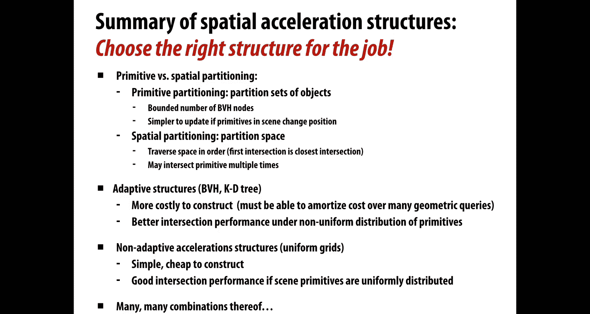

And in fact， if we step away from a moment from the problem of finding ray intersections。

These same hierarchical questions show up over and over again， throughout computer graphics。

In completely different areas。So。In geometry， for instance。

 we might be doing lots of inside outside tests for meshing。

 or we might be doing closest point tests for something like how store distance。

 We want to know what is the difference between two shapes。

 How badly does one shape approximate the other there we have to do lots of different closest point tests in animation and simulation we might be trying to simulate various kinds of particle systems like end body dynamics or fluid simulation Here you run into some really elegant and an interesting algorithms for hierarchical acceleration things like the barns h algorithm that's used to approximate kind of end body potentials every particle wants to interact with every other particle。

How do you do that in a hierarchical way so that you're not doing order n squared interactions？

The fast multipo method is kind of a more sophisticated of。Take on that problem。

And then in rendering， which is what we're really headed towards， of course。

 we need hierarchical acceleration to do things like fast visibility checking and ultimately doing lots of ray tracing。

 bouncing rays around the scene to do physically based ray tracing。Okay。

 so just just to set the stage for rendering before we wrap up here， you know。

 we can ask this question， how exactly are we going to use ray intersection queries to generate images？

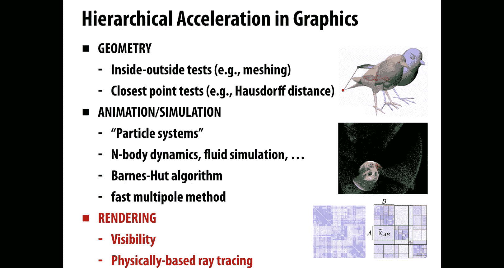

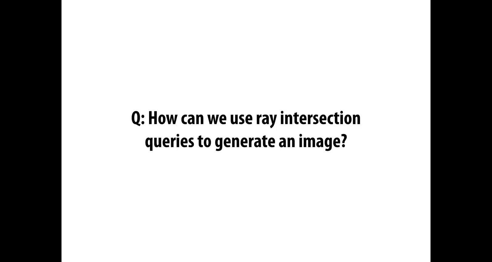

And here we want to recall this triangle visibility problem。So our basic questions。

 we had two basic questions， one is we have these triangles in our scene。

 one basic question is what samples or what pixels on the screen does the triangle overlap and that was the problem of coverage。

Our second problem is， well it's not enough to just know which samples。A single triangle overlaps。

 we also want to know。Which triangle is closest to the viewer or the camera in each sample。

 So we have the problem of occlusion。

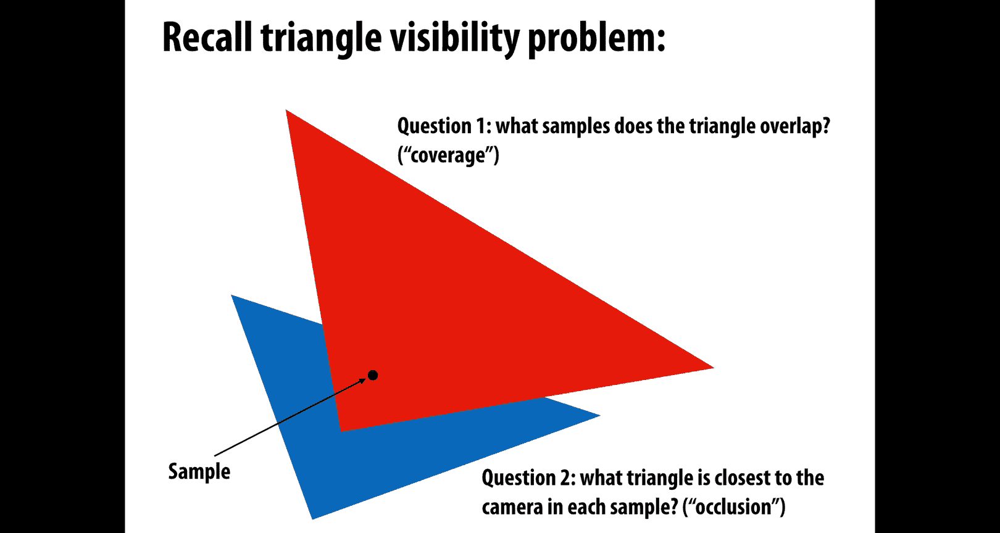

And previously we solve these problems using rasterization and depth buffer。

 rasterization to solve the coverage problem and depth buffering to solve the occlusion problem。

 but we can also do it using our ray queries。So we're going to kind of flip things around just as a quick reminder。

 how did this work with rasterization， the basic idea of our rasterization algorithm。

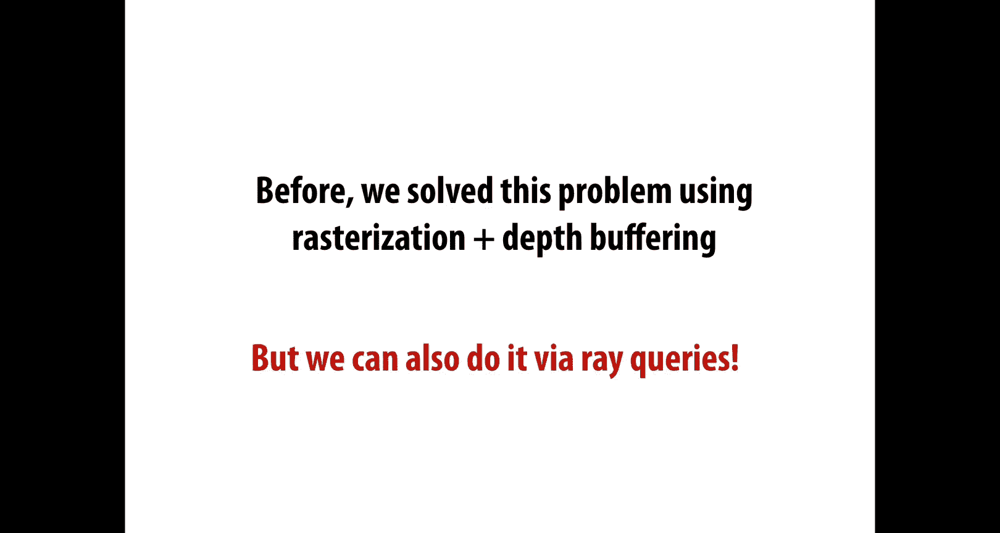

Was to say for each triangle， for each primitive， find the samples that it covers。

We iterate over primitives and for each primitive， find the samples it covers。In this scenario。

 a sample means a 2D point in the image plane。Coverage is saying， okay。

 we want to check for 2D triangles for each 2D triangle。Does it cover。A given sample point。

And occlusion is handled by a depth buffer。 So we store for each sample。

 what is the closest triangle that we've seen so far。

And we have a little kind of pseudocode here for our rasterization algorithm， So what do we do。

 We initialize our Z buffer to store values of infinity or the closest thing we've seen so far is infinitely far away we initialize the color buffer to。

 I don't know， black some default color。And the outer loop is we loop over all the triangles in the scene。

For each triangle， we do whatever we have to be projected onto the 2D plane。

And then for each sample in the frame buffer。We check。

 is this sample covered by the current triangle。If so。

We compute the color of the triangle at the current sample point。

And if the depth at the current sample point， the depth stored in our Z buffer。

Is bigger than the depth。Of the triangle at that point， then we update the depth buffer。

 We store the smaller value， and we update the color buffer。

 We actually write the color into our image。Okay。So that was raization。

 How do we do this with ray queries， How can we。

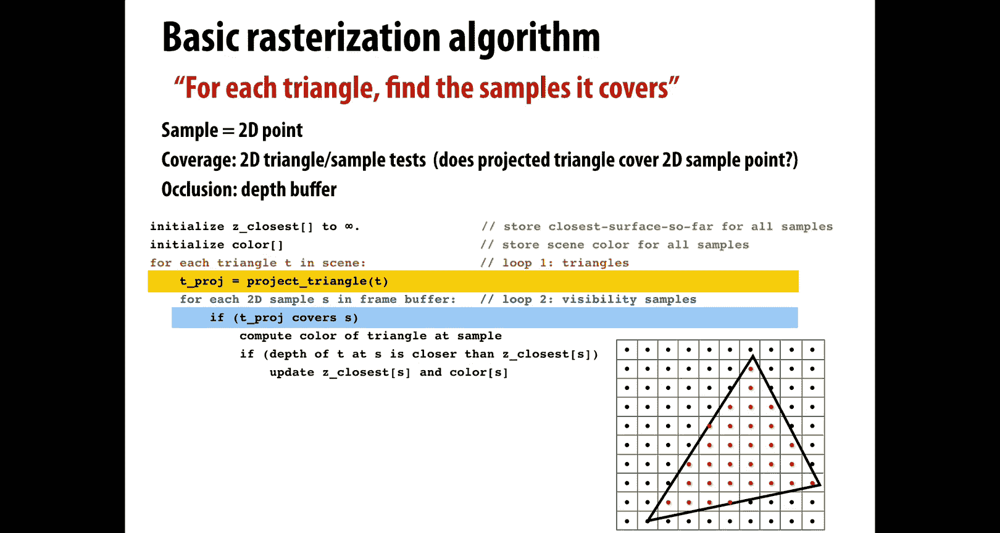

Do this exact same problem by intersecting rays with our scene。So basically。

 the interesting thing that happens is we just flip the loop order。We say， instead of。

 for each primitive。What samples does it cover， We say for each sample， for each pixel in our image。

 find all the primitives that it's covered by。And we do that by shooting array through the pixel。

Right， so in this case。A sample is array in 3D。Finding out the coverage is a matter of doing 3D ray triangle intersection tests。

 so we find， know what are all the triangles hit by that ray？

And occlusion is determined by figuring out what's the closest intersection along that ray of all the triangles we hit。

 which one has the smallest T value。Okay， so here's pseudocode for this version of the algorithm。

 We initialized the color buffer。We don't have a Z buffer anymore。

And for each sample in the frame buffer。RightNow we're looping first over samples。We generate array。

 we construct array。That goes through the current sample。

We say that the smallest T value we've seen so far along that ray is at infinity。

 We haven't seen anything yet。And。We say that the triangle we've seen is also null。

 we're not pointing to a triangle yet。And then we say for each triangle in the scene， we check。

 does the ray hit that triangle？If it does， and the intersection distance along the ray is smaller than the closest T value we've seen so far。

Then we update our smallest T value， and we update our pointer to the triangle corresponding to that T value。

 We just keep track of which triangle did we hit。Okay， and we when we get done with that。We。

Compute the final color for that pixel as just the color of the triangle at that closest hit point。

So both of these algorithms are going to produce the same output。

It's just a matter of how did we structure the computation。

 we can structure them in completely different ways。YouAnd flipping this loop order， you know。

 it's really not just a matter of flipping two lines in our code。

 we really had to switch over from rasterization to ray tracing。Okay。Also， of course。

 we gave the most simple naive versions of these algorithms。 When we do rasterization。

 we don't test every single sample in the frame buffer against every triangle。

 We might limit the test to， say the bounding box of the triangle。 When we do ray tracing。

 we don't test every single triangle against the given ray。

 we probably use hierarchical acceleration like we talked about today。Okay。

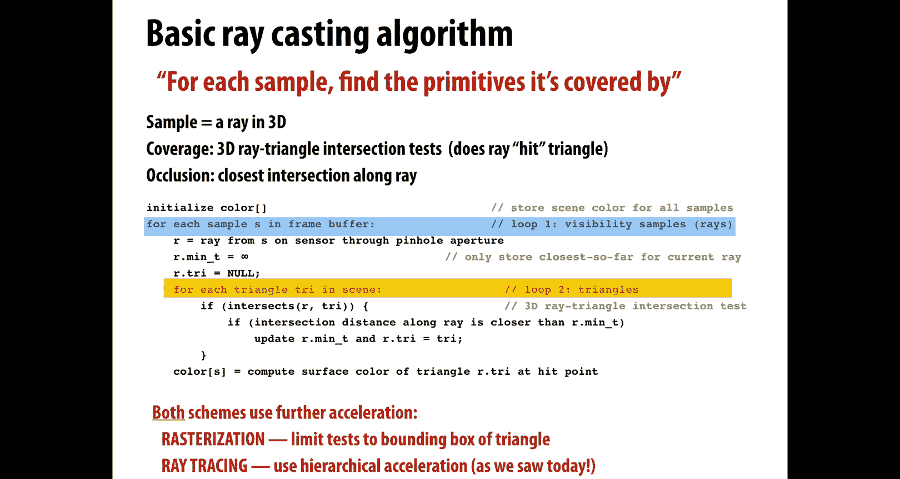

So just to kind of give that the high level view， you know。

 what is the basic difference between rasterization and raycasting。

 Rasterization proceeds in triangle order。And it keeps a depth buffer。

To store the closest thing that we've seen at each。Sample。

So we actually have to store this extra memory， this extra data。On the other hand。

 we don't have to store the entire scene in memory。

 We don't have to store all the primitives in memory。

 Remember the way that the graphics pipeline works is that triangles come down through the pipeline one at a time and are processed completely independently。

So rasterization really naturally supports scenes of unbounded size。

 you can keep adding geometry forever。Raycasting or ray tracing， on the other hand。

 proceeds in screen sample order。We just go through the pixels of the image one at a time。

 and we don't have this extra storage cost of storing the depth buffer。

We just have to store information about the current ray。

Another extremely nice property of ray casting for drawing scenes is it becomes really easy to render transparent surfaces because we know at each sample。

 what are all the triangles that the ray goes through。 So we know all at once。

 What are all the samples that could possibly contribute to the color at the current pixel。

RightAnd so we can just find all those intersections and we have。

 and then we can sort them in front to back or back to front order。

 whatever we need to do to do our alpha blending。And we can do proper transparency， no problem。

You might remember this was a huge pain in rasterization。 How do we do proper transparency？

On the other hand， we have to store the entire scene in memory all at once。

And we probably have to build some acceleration data structure for that scene on top of it。

In general， the performance of raycasting is going to depend a whole lot more on how the geometry is organized in the scene than the performance of rasterization。

 Rasterization doesn't care。 Triangles come in。 Okay， maybe they get clipped。

 but generally doesn't really matter how the geometry is distributed。Both strategies。

 if you really want to make them high performance， they have similar techniques。

 things that are in spirit， similar ways to speed up this problem because， you know at its core。

 it's the same problem。 So you might have hierarchies of rays or hierarchies of samples。

 You might have hierarchies of geometry。 You might use a technique called deferred shading。

And so on and so on。

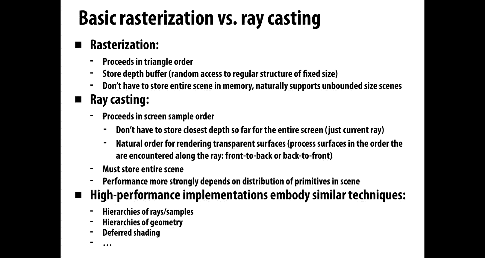

But again， there is a really important difference。 There really are extremely good reasons to use。

Ray casting rather than always relying on rasterurization。

 There's things that you can do with ray casting that you really can't do or just takes a lot of work。

 a lot of hacks to try to approximate with with rasterization。So with ray casting。

 it's very natural to ask not only what object is visible to the camera。

 this basic question of occlusion。But also， we can do other queries。

 we can shoot these rays out wherever we like so we can test what light sources are visible from a given point。

If we're trying to figure out whether a point is in shadow or not。

We can figure out what reflection is visible on a surface。 So if we have a shiny reflective object。

 how should we color it while we have to shoot out array and see what it hits and see what the color of that object is。

These are things that are very hard to do with rasterization。

And so that's really why we have these two algorithms。 One can be very。

 very fast for simple tasks for doing things like 2D， you know SVG Rastrization。

 as you did in your first assignment， Other are going to be helpful for other things like photoreistic rendering。

And so， moving further toward this。

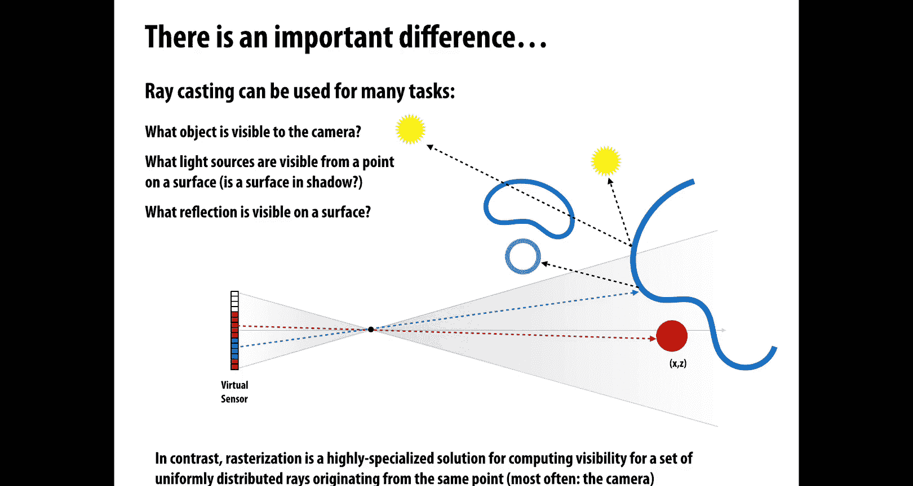

Goal of doing photoreistic rendering next time we're going to do an in depth discussion of color。

So so far， we've had just this vague idea that maybe colors can be represented as RGB values。

 but we're going to go way deeper next time and really understand what color is all about。All right。

 talk to you then。