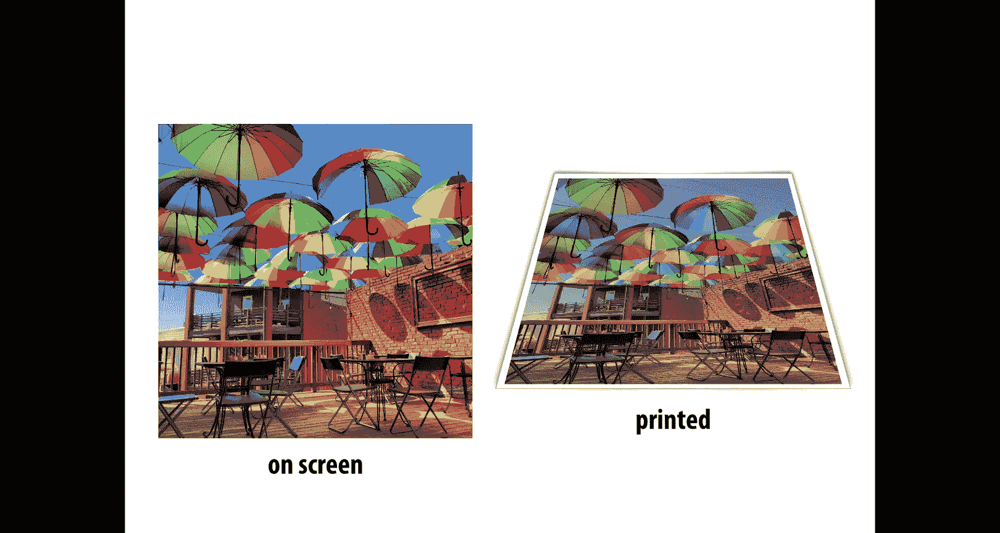
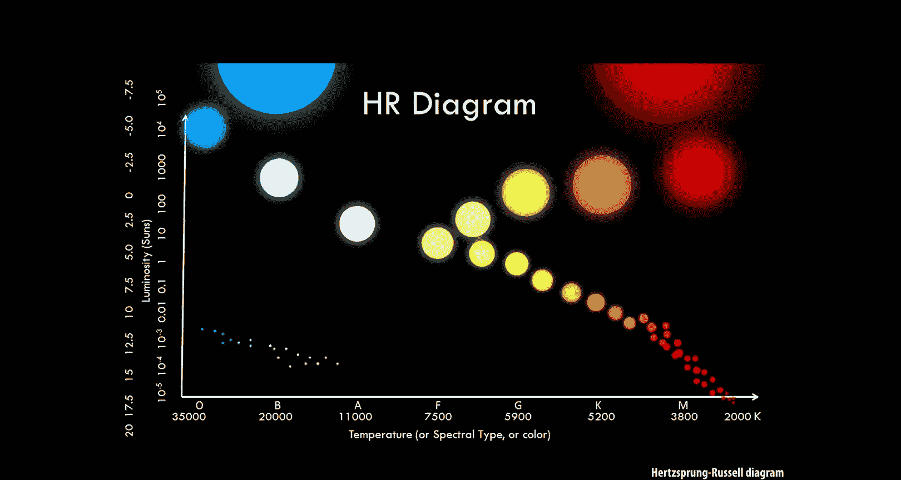
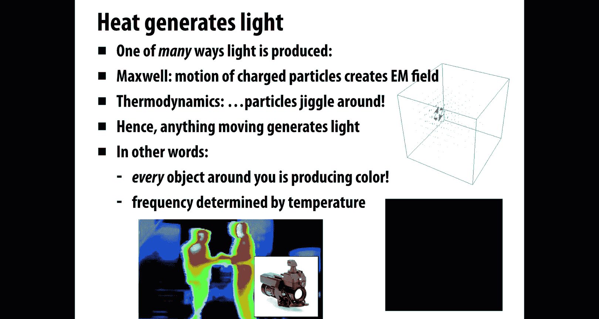
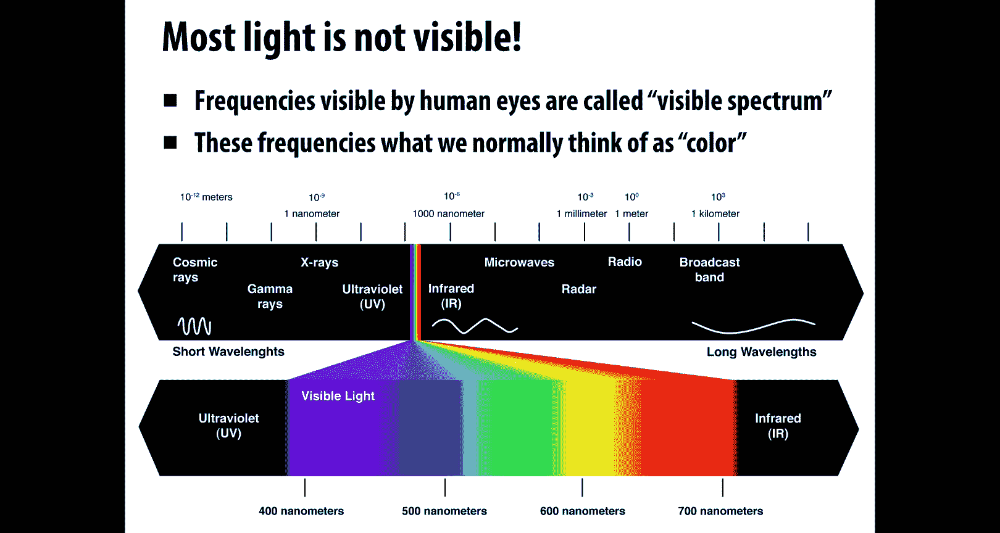
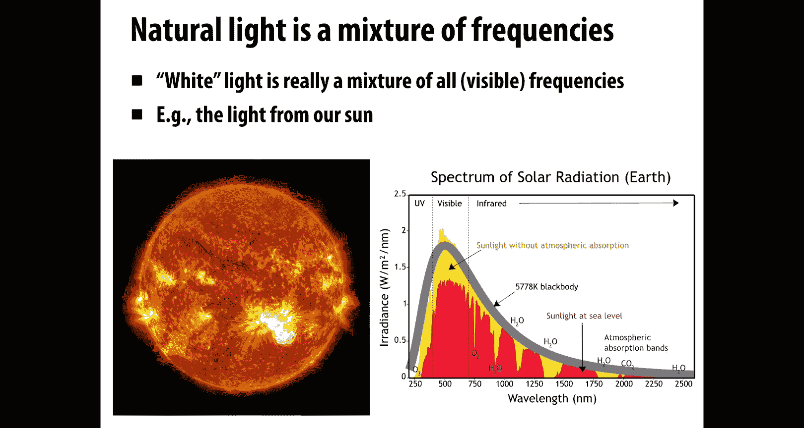
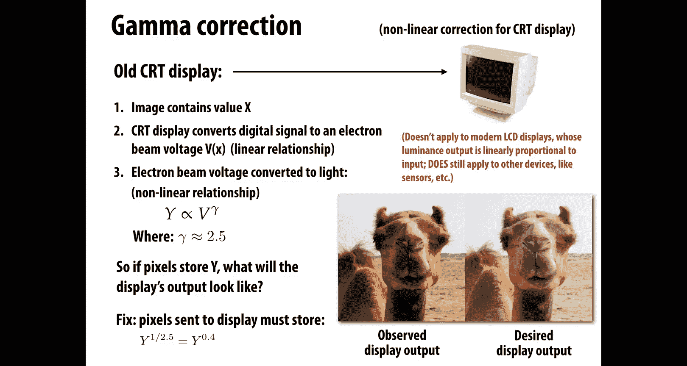
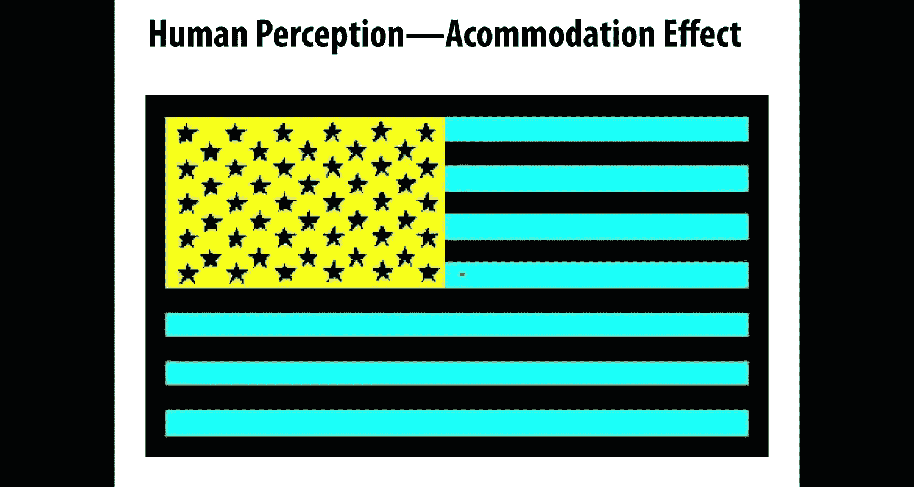
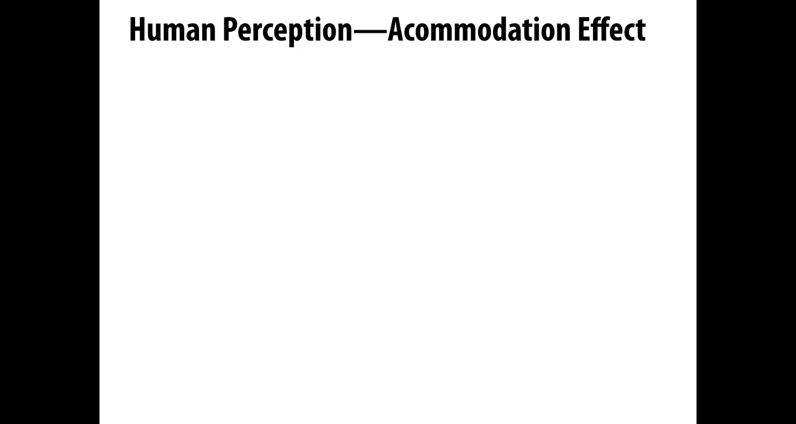
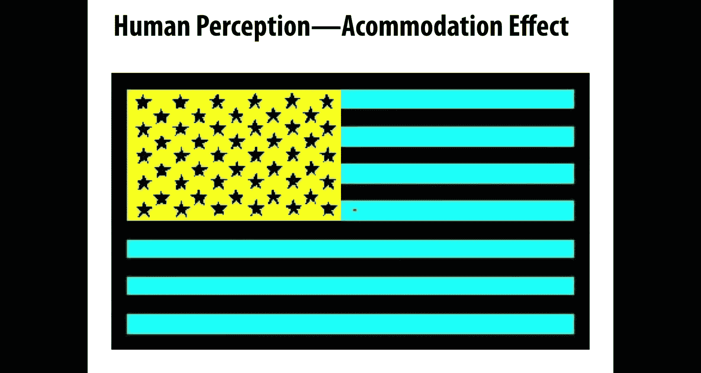
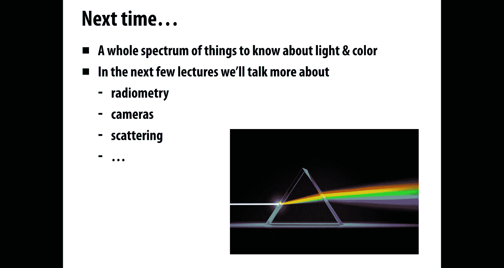

# CMU《计算机图形学｜CMU 15-462  COMPUTER GRAPHICS 2021》中英字幕 p15 -15-Lecture 14_ Color -BV1H3NBemE5E_p15-

Okay， welcome back to computer graphics。 Today we're going to spend the whole day talking about color and you might wonder。

Why do we need to spend so much time talking about color？

 It's something that should be pretty intuitive to all of us。

 We've been studying it since kindergarten。 Why do we need precise ways of talking about color？ Well。

 there are actually a lot of different reasons that you'll really start to recognize after going through this lecture that show up even in your daily life。

 So， for instance， let's say you're trying to paint your house。 You go to the store。

 You find a color of paint that you really like。 You bring it back home， you put it on the wall。

 and you think， oh， really doesn't look the way I want it。

 It really doesn't look like it did in the store。 Why did that happen。 Well。

 maybe there's a very different kind of lighting in your home versus the store。

 and the way that light and color interact can be very unpredictable if you don't have some understanding of color。

 Another thing that you'll see if you just go walking around in an electronic store you look at all these different displays and that really kind of hits you。

Calibrating color across different devices is pretty hard to do depending on maybe how cheap or expensive a monitor is。

 it might have deeper blacks or more saturated colors。

 So when you think about producing content thatll be displayed on a lot of different devices。

 you again have to think carefully okay what should I expect people will be able to see how might I adjust the color for different displays and so forth。

This also shows up in making the transition from digital media to print media。

 if I have color on my screen， but I'm using that to design something that's being printed。

 maybe in a magazine or in a newspaper or something like that You're going to get a very different output from the printer than you will from the display？

 So here's an example of you might have taken this picture very vivid rainbow colored umbrellas and when you go to print out。

 maybe you've had this experience， you go to print it out and it looks really dull Why did that happen？

 I it just because the printer is cheap or is there something deeper going on there。

Understanding color is also extremely important if we want to do science if I have images that are being used for a scientific purpose。

 the colors can indicate really important or really interesting things about the phenomenon being studied so maybe telling me about different geological eras or in astronomy color is absolutely essential。

 something we'll talk about today is black body radiation and that the heat of things in the universe will affect their color and so this is something that people use to get a sense of how stars are evolving over time。

Color of course， also is extremely important in art， so how do you mix colors。

 what happens when you mix paints of different kinds， how does the new color come to be。

 and how does that color at a perceptual level affect the way that people experience a painting？

If if you're trying to paint a sunset， you might need to exaggerate the colors in a certain way that that kind of is adapted to human perception to capture how it felt to really be there。

 Again， many of you have probably had the experience of going out， seeing this beautiful sunset。

 Ta a photo with your your camera to send to your friend and your friend gets the photo and thinks that's okay。

 It's not that exciting， right， what was lost there and how might you reinject that perceptual experience of the colors that you saw in the sunset。

😊，So lots of good reasons to understand color in depth。

 but maybe the first question to ask sounds kind of like a crazy question again。

 because so many of us have day to day experience with this， but what is color？

could you actually explain to somebody， let's say somebody who is blind。

 could you tell them what color is？Well， one really important way of thinking about colors from a physical perspective。

So you might remember from your physics class if you've taken a class on E&M。

That light is an oscillating electric and magnetic field。It looks like this。

 these two complementary oscillating fields。And the key idea， what is color in this setting， Well。

 color is just the frequency at which this field is oscillating。The frequency of this。

 this oscillating field determines the color of the light。

OkayAnd that's going to be a really important perspective for getting our hands on representations of color。

One important thing just to keep track of as we talk about color is。

 what is the difference between when we talk about frequency versus wavelength？Of light。

These quantities both essentially capture the same idea， but they're different quantities。

And they have a simple relationship， just that frequency is one over wavelength。

 wavelength is one over frequency。Okay， so if I have a really long wavelength。

 the field is oscillating very slowly。Then it has a very low frequency。

 very small frequency and vice versa。Right。So using this picture， this physical picture。

 we can start to understand questions about color like。

 why does your stove turn red when it heats up？If you have this old fashionashed kind of induction burner。

 you switch it on， it starts out black as it gradually heats up， you might see。

 especially if you turn off the lights， if you can do this in the middle of the night。

 you turn off your lights， you go to the kitchen， you turn on your stove。

 you'll see nothing at the beginning， but then you'll get this dull red glow。

And then it'll become a brighter red。 And then maybe it becomes an orange。 And if you've really。

 really heated it up， maybe you start to see kind of a yellow color。

So that's something we've all experienced， but why does it happen？

And the basic reason is that heat generates light， this is one of the places in the universe that color comes from。

One of many ways light is produced is， again， we can think about this a picture of electricity and magnetism。

And Maxwell's equations say that if I have charged particles moving around。

 then they're going to create or induce an electromagnetic field。Okay。So。Why， then。

 does heat generate light， Well， let's think about this thermodynamics， if we think about。

What do things look like at an atomic scale， really。

 even solid objects are jingling around a little bit。And then definitely as things heat up。

 this is like an ice crystal here right so it started out as a crystal and we're starting to heat it up and it's starting to melt and so that the things are jiggling more and more and more。

 and you can imagine if we keep increasing the temperature。

 maybe it turns from a liquid into a gas and now the particles are really moving around fast。Okay。

 well， since these particles have some charge to them。Right， they are。

Going to create an electromagagneagagnetic field。 In other words。

 anything that's moving will generate light。And what that means is that every object around you in the universe。

Even if you can't see it is producing some quantity of light。Right。

And that light has some color that has to do with how fast those particles are jiggling。

 how hot it is or how cold it is。 So unless you're looking at something that's at absolute 0。

It's going to be giving off light。 and this is why for instance。

 you can build devices that do thermal imaging。 you want to see somebody through a wall， okay。

 maybe you get their thermal signature。 you're seeing the light that's given off just by the fact that their bodies are warm。

And the frequency of that jiggling。Is determined by the temperature。

 The color is determined by the frequency。

One thing to say here is， well， why， then， don't we see everything glowing at night， right。

 if everything that's hot is giving off some kind of light， some kind of color， why don't we see it。

 And the reason is that most light is not visible to the human eye。

It might be visible to some device， some detector， but it's not visible to the human eye。

 So actually， the frequencies of light that human beings can see are limited to a very。

 very narrow range。Of wavelengths。 And that's what we call the visible spectrum。

So these wavelengths are what we typically think of as color going from kind of reds， oranges。

 yellows， greens， blues， indigo。Outside of this narrow range， there's lots of other stuff going on。

 We have close to the visible spectrum， We have ultraviolet on one end。

 we have infrared on the other。And you might have cameras that pick up these signals pretty easily。

If you go a little further out， you have x rays， really high frequency light。

Microwaves really low frequency light that actually is used to warm your， your food。And on and on。

 it keeps on going。And。So even though we can't see this stuff， it's there。

 even though we don't usually think of this as light and color，Essential。

 X rays and microwaves and so forth do have a sort of color to them。 They have a frequency。

Another important thing to， to realize is that when we talk about white light。

When we turn on a really nice light bulb and it shines this beautiful white light。

That's really not one particular color of light。 White is not a color of light。

 White is really a mixture of all colors。 It means that we have。

Energy being emitted in all of these frequencies， simultaneously， all the visible frequencies。

A really great example of that is our sun。The sun is just pumping out energy。

 pumping out light in all these different frequencies。And in fact， if we look at the spectrum。

 so this plot on the bottom right here is the spectrum of how much light the sun is emitting in each frequency。

What you notice and is kind of important is this curve has a peak in the visible range of the spectrum。

 in the area of the spectrum that humans perceive。Right， and in fact， that is why。

This is the visible spectrum。 Why is it that human beings see a certain range of light， Well。

 because that's kind of the most advantageous set of wavelengths to see the ones that the sun is shining most brightly。

Okay。So this spectrum that we just saw。Is called an emission spectrum。

 It's telling us for each frequency of light， how much light is produced by whatever source it could be by heat。

 It could be by fusion， which is what's happening in stars in our sun。But whatever the source is。

 the emission spectrum is saying how much light in each frequency？

And an emission spectrum is really useful for certain tasks， for instance。

 if we want to describe the color of a particular light bulb。

 we want to just characterize what kind of illumination it's giving off。

 we might show an emission spectrum。If we talk about something like paint。

 we want to talk about the color of paint。 Well， if I paint my wall。

 that paint is not emitting any light right， so we need to talk about a different kind of spectrum。

Maybe an absorption spectrum， an absorption spectrum is saying for each frequency。

 if I shine white light on it。What fraction of that light is absorbed or how much of that light is absorbed？

And what does it mean that it's absorbed， It means the light hits the paint and rather than being scattered back off。

 it might be turned into heat， right， It starts particles in the paint jiggling。

 it turns into kinetic energy。So absorption spectrum is useful if we want to characterize the color of paint。

 the color of ink， and so on。Okay。Here are some examples of emission spectra， again。

 which described light intensity as a function of frequency。

 These are different kinds of light bulbs or different light sources。 So we have daylight。

 kind of the light just coming out of the sun。And as I claimed before。

 we see that it has a pretty uniform distribution of。Light in all different wavelengths。

We have an incandescent bulb， which has a different distribution。

 It looks like fewer blues and more red。 So if you have a older style light bulb。

 it has that kind of warm orange red feeling when you turn it on。

Flororescent light looks very different。 It looks very spiky。Right。

And this actually may be why if you've ever been sitting under a fluorescent light。

 you've been sitting in a cubicle or something under a fluorescent light， you think， oh， this。

 this feels kind of sickly。 It doesn't feel nice。 It doesn't feel like sitting outside in the sunshine。

 Well， part of the reason is it really is not like sitting outside in the sunshine。

The distribution of light， even though it might appear roughly the same color。

 it might appear kind of white to you。The distribution of frequencies is very different。

 it feels very unnatural。Very icky。And so then there are different kinds of light bulbs that have different distributions of frequencies。

And this kind of explains why there are so many different light bulbs on the market。

 if you go to the hardware store， you'll see a ton of different kinds of light bulbs if you go online。

Boy， you can find even crazier and wider variety of light bulbs。

 Why are there so many different designs for light bulbs， Why don't we just have， I don't know。

 one or two or even a dozen。 Well， again， it's because of the quality of the light。

 You're really trying to match， I mean， human beings really are used to or they really like this natural sunlight？

 And so the question is， how do you build a light bulb that matches the kind of light that you like while still being power efficient。

😊，So incandescent lights are good because they kind of pump out。Light in all different frequencies。

But they're more power hungry。 They suck up a lot of power to do so。And so the observation is， well。

 you can kind of trick the eye， you can fool people into believing that a light bulbs showing the same color of light。

But with a very different spectrum。 And we'll talk a little bit about that in a minute。

 why it is that you can fool the eye into believing that two different spectra of light are essentially the same color。

So a compact fluorescent bulb， a CL is going to be like a。In the other fluorescent ball。

 it's got this kind of choppy spectrum， but it's more power efficient。

It's based on principles that use up less energy。Okay。Again。

 we can also talk instead of about how much light something's emitting。

 We can talk about how much it absorbs， right， So emission mission。

Was intensity as a function of frequency。Absorpttion is fraction absorbed as a function of frequency。

Okay， so here's an example of an absorption spectrum。

Along the bottom we have the wavelength going from short wavelengths。

 bluer wavelengths to longer wavelengths， redder ones。And in the vertical direction。

 we have the percent absorption。If I were to shine a perfect white light on this。Whatever this is。

 this piece of material。What fraction of that would be absorbed in each frequency？

And just looking at this plot。What color would you say this roughly looks like what if。

 if I were to actually look at an object that had this absorption spectrum under a white light。

What color would I perceive。Ri。Well， maybe the title of this figure gives the answer away a little bit。

 it says absorptionorpt spectrum of chlorophyll。Chlorophyll is。What's found in plant matter， right？

 It's what makes plants green。And we can really see that here。 So chlorophyll is。

Going to absorb the reds， it's going to absorb the blues， but it's not going to absorb the greens。

 Me if I shine white light on a plant。What's going to bounce back at me is just the green light。

That's why it appears green。For this reason， you might sometimes hear people saying， oh。

 did you know that plants are actually red， They're not green。 It's， you know， the fact， no。

 this is not true。 This is not the way that color works， right。

 Things are the color that we perceive them to be。 But what they're trying to say is that plants absorb。

The red and blue light。 And they reflect the green light。Okay。So。This idea of talking about spectrum。

 this is really the fundamental description of color。

If we know the intensity or the absorption as a function of frequency。

 then we know everything that we could possibly want to know about the color。

everything else that we'll talk about today， every other way we have of modeling or encoding color is merely a convenient approximation of this picture。

For practical reasons， we might not always want to encode this extremely detailed spectrum。

 but this is really at the root of it what color is。So in other words。

 if you remember to use this spectral description as a starting point。

 if you always use this as your mental model for what's going on with color。

Then all these other issues surrounding color theory and practical encodings。

 digital encodings of color will make a lot more sense。On the other hand， if you。

Always think about color in terms of。Approximate digital encodings， right。

 if you've heard about RGB color or CY K color before and you continue to think about color only in this way。

 there's certain phenomena that you simply won't be able to understand。

Mysterious things will happen in life， and you'll think。How could that be， you know。

 if color is RGB triple， how could that happen， I don't understand it， Well。

 it's because really something's going on with a spectrum。And not this oversimplified model of RGB。

Okay。One thing to think about carefully when you think about color is， okay。

 we've talked about emission and we've talked about absorption。How， how do these two things interact？

That's really going to affect the ultimate color that we perceive。Here's kind of a toy model。

 a simple but pretty representative model of what happens when light gets reflected。

And let's say for the moment that the symbol new is the frequency。

So we'll say that a light source has an emission spectrum F of new。Right， for each wavelength new。

 we get an amplitude。F of V or an intensity， F of V。We will also have a reflection spectrum。

This time， reflection rather than absorption。 So just the complement。

 rather than what percent got absorbed。It's what percent didn't get absorbed。

 what percent got reflected。 So we'll call that G of new。Okay。

So what we have here on the left is F of new is a light source。

And what color roughly would you say this light source is if you had to sum it up into one word。

To me， this light source looks pretty green。 It's emitting a lot of green light or maybe kind of green yellow because there are these reds and oranges and yellows in there。

 too。What color would you say the object is on the right。

 the one described by the reflection spectrum。Now， you should be careful here。

 This is different from our example we saw before with the plants。

 with the plants we were looking at the absorption spectrum Here。

 we're working it with the complementary reflection spectrum。Okay， so this one is really saying that。

A lot of the blues and the greens got absorbed。 They didn't get reflected。

And a lot of the red light got reflected。Right。Okay。

 and then what we want to understand is how do these two interact if I shine a light of this color on a surface of this color。

 what am I going to see， what's going to come out？Well。

 the answer is that the resulting intensity is going to be a product。For each frequency new。

The final intensity of this light reflected off the object is how much light got emitted times。

 how much got reflected。And so in this case， we're going to get a curve like this。

It's something where just a very little bit of kind of red orange light is shining off this surface。

Does that make sense？Why that should be the case？Shi。Right。

 we sh some green light on something that absorbs most green light， so we don't see much green。

The light still does have a little bit of red in it。 So we see a little bit of red。Okay。

And even from this very simple picture， we start to understand why is color reproduction hard。

Co clearly starts to get complicated as we start combining emission and absorption or reflection。

So we have this light。 It has some interesting spectrum。

 We have some paint we're putting on our wall。 The light bounces off the paint。

And then also something that's challenging is that light goes into the eye。

Which we haven't even started to talk about。So how how do we use light and paints to get the desired appearance？

Well， that depends on yet another factor， which is perception。Right， how do humans？Perceived color。

 once that light leaves the surface and enters the eye and then gets transmitted into the brain。

What is the signal that we ultimately receive and how does that affect how we perceive color。

 So many of you may have seen this example。Of this picture somebody took and put online and said， oh。

 this is a blue dress with black lace。 And other people said， no， no， no。

 this is a white dress with gold lace。You're just kind of seeing it in shadow。

And there was this online raging debate about whether this is a blue dress or whether this is a white dress。

 I think there's even a Wikipedia page on this if you want to look it up。

I don't know what the final answer was， but actually it's not so important the really important thing here is to realize that。

Color perception is very psychological。Perception of color has a lot to do with what people think the context is。

 what people think is going on beyond just the raw spectrum that's entering their eye。

Right so we have this question。How does electromagnetic radiation with a given power distribution end up being perceived by a human as a certain color。

Okay。Well， to understand this question， we have to start thinking about what does the human body look like。

 So here's the eye。 Here's kind of a detailed cross section of the eye。

 And there's all sorts of interesting things going on。

 And the basic thing that happens here is if we look to the left。 you know。

 this is where the the eyeball is looking， light might be shining in from the right。

It enters through the pupil， which is this little hole in front。And travels， you know。

 through the eye， hits the back of it， hits the。The phovea。

Or hits the neurons sitting on the back of the eye。Okay， and actually。

 this is a good moment to stop and realize this is not so different from our pinhole camera that we talked about before。

Remember， we talked about a pinhole cameras like a cardboard box。

 you poke a hole in it and put a piece of film on the back。I mean。

 the eye is just a much more sophisticated version of the pinhole camera， right？

So you might have light coming in from different directions， depending on where it comes from。

 it's going to hit different locations on the sensor or it's going to hit different neurons。

 and that's going to stimulate our perception of what the image looks like。Interestingly enough。

 just like the pinhole camera， that image is going to be upside down。

The image that actually hits the back of our eye is a flipped version of what is actually out there in the world。

 so our brain is actually going to turn that upside down image back right side up。

And it's pretty remarkable， actually， they've done experiments where they'll give people sort of special glasses that turn the world upside down。

And the brain will again， adjust it so that it's right side up。 So the brains a pretty amazing。

 adaptable piece of machinery。Okay， but what we really want to understand here is the color response。

 how does the eye perceive color？Okay， so， so here's a， again， a rough model。

 but one that kind of captures the right idea。Which is talk about the photo sensor response of the eye or of a camera。

 pinhole camera， whatever it is。So the idea is that we have some input， some photo sensor input。

 which is light。And we can describe that as a power distribution over wavelength for each wavelength in this case。

 lambmbda。What is the corresponding amount of life， the corresponding power。

And the photo sensorensor output is going to be some response to this wavelength。

Encoded as maybe an electric signal， right， So depending on what brand of sensor you have or how it's designed or。

 you know how your eye looks。That device is going to respond more strongly or more weakly to different wavelengths of light。

Right a digital camera sensor is not going to capture all frequencies or all wavelengths of light。

Equally， some of it。It might ignore some of them it might really strongly respond to。

And that's encoded by this spectral response function， F of lambmbda。

So this describes the sensitivity of the sensor to a given wavelength of light。

A larger value of F of lambmbda corresponds to a more efficient sensor。So when F of lambda is large。

 a small amount of light at wavelength Lada will trigger a large sensor response and vice versa。Okay。

 so if we think of。We can think of a photo sensor maybe as just a single pixel on a sensor。

And the total response of that pixel is going to be the integral over all wavelengths。

 We just walk through from low to high wavelength。Of the incoming distribution。

This incoming power distribution fee of Lada times。

How much the sensor responds to that frequency F of Lambda。We integrate that up。 and that's how much。

Signal that sensor is going to report back to the camera。 Okay， that's what we'll call R here。

So what is this？Kind of look like for the eye。 Why would the eye respond to different frequencies or wavelengths in different ways。

 And you know， how does that work？ Well， if we look even closer at the eye， we really zoom in。

To what's going on on the back of the eye。We have these。Receptors。

The things that are really responding to the incident illumination。

And there are two kinds of receptors。 There are rods。

 and there are cones which kind of describe roughly the geometry or the morphology of these different types of cells。

And they serve two different functions。 rods are。Things that can help us see things when we have very dim illumination。

Okay so what they're doing is they're just capturing intensity， they don't really care so much about。

 is it red light， is it green light， is it blue light。

 they're just going to integrate whatever light they can get because it's dark outside so they want to get all the elimination and respond to any of it。

So you can think of these as very， very sensitive photoreceptors。Cones， on the other hand。

 are what we're going to be using more of in daylight。

So when we have a lot of bright light shining in， then we can afford to be more。

Picky about which light we respond to。 So we might have some cones that just respond to red light。

 some that respond just to green light， some that respond just to blue light。 I mean， this is， again。

 a very rough analogy。 It's not exactly red， green and blue。

 but there are three different types of cones that respond to different colors of light。Okay。

 and you can see there's a big difference in the number of these receptors。

So there are about 120 million rods in the human eye。

 There's only about 6 to7 million cones in the human eye。

So what does that tell us that tells us that the eye is actually a lot better at discriminating between different intensities or brightnesses than it is at discriminating between different colors？

And that's going to be really important when we think about。

Doing computer graphics when we think about how we generate image and what we prioritize。

When we generate images or when we compress images。That the eye is going to catch。

 it's going to see differences in intensity more than differences in color。

Here's another really interesting view of the eye that might inform the way that we design graphics algorithms is that the density of these different receptors is not uniform over the eye。

So what this picture is is saying on the left， it's saying as we get closer and closer to the center。

 kind of where， if you imagine light just shines straight through the pupil and hits the back of your eye。

That's that's the center。 So as we get closer and closer to。The sensor to the center。

We actually have more cones， the cones are going up， but there's also this dip in rods。Okay。

 so what does that tell us， that tells us that our color vision should be better right in the middle of our field of view。

Whereas our ability to detect differences in intensity。Is going to be， well。

 it's actually quite good over the entire eye just because we have so many rods， right。

 But it's really that we prioritize color in the middle of our center of view in whatever we're directly looking at。

And in fact， you notice that these cones， they fall off so fast as we get away from the center that really your color vision in your periphery。

 your peripheral color vision is really quite poor。Okay。By the way。

 there's also another interesting thing to notice here。Right， which is this gap。

 We have these two dashed lines where there's this gap where there's there's no neurons at all。

 There's no photoreceptors at all。 Why is that， Well， that's the place where your eye。

 your eyeball is hooked up to the rest of your brain。

You essentially have this cable called the optic nerve that connects your eye to the rest of the brain。

 and at that place， well there you can't put in any photoreceptors there。

 So that's why you have a blind spot。Even though your brain fills it in and kind of makes it seem like。

 oh， there's there's nothing being missed there， there are really things you can't see in that blind spot。

 that's why you have to be very careful when you're in your car。

 when you're driving and you're changing lanes to look around and make sure that there's not。

 you know， some。Bcyclist in your blind spot， right。So。You can accept all of this on faith， right， O。

 I'm telling you that there are these distribution。

 different distributions of rods and cones in your eye and all this all this fascinating stuff。

 Or you could try to confirm it yourself。So here's a fun activity that you can try at home。

 you know if you have somebody else that can can help you out with this。

 so what you do is you go and you grab a bunch of colored objects， it could be anything。 it could be。

 you know I like to do different colored markers， marker caps because they come in really bright colors。

 but maybe you have colored blocks or you have colored pencils， whatever it is。But just different。

 very vivid colors。And what you want to do is say， okay， grab one of these， I'm not going to look。

I'm going to not look at which one you're choosing， please。

 whoever's helping you grab one of these at random。And have them very， very。

 very slowly bring the object into your peripheral vision。

 So just tell them to stop as soon as you can detect that they're there， that something is there。

And when they stop， when you know this is right all the way out on your periphery。

 really far from the center of your vision。You're supposed to guess what color is the thing that they're holding up。

Okay， so for this for this reason， it's actually pretty important that all these objects have the same shape。

 you don't want to be distinguishing which one it is based on how they're shaped right so if they're all blocks。

 maybe they should all be cubes， if they're all markers。

 they should all be markers of the same kind right。What I claim will happen。

 and it's fun to try this out。Is that you will do a very poor job of guessing what the color is。

You'll get signals from your brain that say， oh， it it's definitely a color and it's blue。

 and then you'll turn around and look at it and it'll actually be yellow， right。

And the reason for this。Is that your brain is very good。At filling in the gaps。

 it's good at guessing， oh， well， I don't actually have information from the eye about what color this thing is。

But I'm going to use context to try to color in the picture。

Maybe if you've ever seen or if you know that old black and white movies。

 movies that were filmed know the beginning of the 20th century。Sometimes people recol them。

 So they go in and they guess， oh， you know， this person's hair might be red or this dress might be green。

 That's essentially what your brain is doing all the time。On your periphery。

You have this feeling that you can see color in your peripheral vision， but you really can't。

 The reason that that's happening is that your brain is running some pretty sophisticated algorithms。

To figure out what that color might be。And that is one of the reasons why color is so hard to deal with in computer graphics。

 because。It's not a linear relationship。 It's not a very simple mathematical relationship。

The brain and the mind are doing a lot to turn the data that it gets into a color image in a very unpredictable way。

Okay。But we can keep going and try to understand more and more about the physiology of the eye and the way the brain works to get a better。

 better handle on this。 So one thing we can look at is， you know。

 what specifically is the spectral response of these cones。

 I said that there are three different types of cones。And we can actually call these instead of RGB。

 we can call these SMN L， short， medium and long wavelength cones。And on the bottom right here。

 we've plotted what does the response function look like for each of these cones？

What is the power output？As a function of wavelength。So what you notice is， okay， well， first of all。

 they're different curves they're going to pick up different information about color。

But you also notice that theres two curves that are very similar in shape。

 the M and the L cone are very close together。Okay。And。You know， why is that the case？ Well。

 both of them are really kind of。Clumped or clustered near kind of the greener part of the spectrum。

 This first one， the S cone。Is。Is more near the the blue part。Right。

 and the medium1 M is more near the green end， And then L is just kind of getting some of the red wavelengths off on the right。

Okay， but really prioritizing green light。 Why is that， Well， again。

 if you look at the spectrum of the sun， the emission spectrum of the sun。

 it shines a lot stronger in the green region。 So just as a matter of efficiency。

 the eye wants to pick up on。The light that it's most likely to see in a daylight and an outdoor scenario。

Okay， and likewise， this explains why there's this uneven distribution of different types of cones in the eye。

About 64% of them are L cones， 32% of them are M cones。

And you can see that on this image on the bottom left is a close up view of what the retina looks like。

Another way we can visualize these response curves is to say， well， okay。As a function of frequency。

 for as we increase the。As we increase the wavelength， sorry， not the frequency here。

We can ask what is the response in SM and L and we can plot that response as a point in three dimensional space so we get some response curve like this。

Right。Okay， so。How overall does the human visual system work。Well， the important thing to realize。

 the important thing to recognize is that the human eye。

Simply can't measure the full spectrum of incoming light。

 It doesn't know this complete function of what， what is the intensity as a function of wavelength。

But a spectrum， in a sense， contains。Infinitely many values for any。

Wavength at all that you ask about， it gives you a intensity。The I knows only about three values。

It knows the integral of the spectrum。Times the response function。

And those integrals give just three numerical values。 S M and L。 Well， they're not numerical。

 Your brain is not storing numbers， right， but you're going to get three electrical responses coming out of the eye。

Okay， so this is how it works。 The spectrum comes in on the far left。It goes into the eyeball。

 The light gets focused on the retina。The cones in the eye measure this light that's that's shining on the retina。

The response functions effectively say how much electrical signal is then going to come out from these different types of cells。

Those responses， those electrical impulses are carried along the optic nerve。

The impulses go into the brain。And then who knows what happens。

Then there's a whole question of psychology and perception and how do people perceive images？

But we can at least get a pretty good handle on the first three steps of this process。

One question we can answer by even just looking at this simple picture is， well。

 is it possible for two。Different。Stra to give us the same color。Right。

 we said that color is described by a spectrum， but when it comes to human perception。

 can two distinct spectra still be perceived as the same color？ Well。

 that's basically asking this question here。 Is it possible for two different functions。

To integrate to the same value。Can two different curves have the same area underneath them。Yeah。

 of course。Right。There are a lot more curves than there are different areas， and likewise。

 there are lots of different spectra that can integrate to identical S M and L responses。

 And those are what are called metamers。So metas are two different spectra， two different incoming。

Incident illumination that integrate to the same。Physical response in the eyeball。And。

The fact that metas exist， the fact that we can have different spectra that are actually perceived by a human being to be the same color is critical to color reproduction。

Right it'd be super annoying if this wasn't true。 let's say I want to go around the world and take a picture of a sunset and then take a picture of a person and then take a picture of my。

 you know， beautiful food that I got at the restaurant and I， you know。

 and I want to then reproduce all of these by a printer。😊，Well。

 if I had to reproduce the spectrum exactly， I'd really be in trouble。

I'd have to get some super precise printer that could print inks of all different frequencies and exactly reproduce how much light is reflecting off the surface so that it matches how much light was going into my camera of every single different frequency。

The fact that the eyeball is kind of a crude measurement device when it comes to color is actually helpful。

It means we can， We can cheat， right。 We can find mixtures of inks。

That produce the same perceived color， even though it doesn't produce the same spectrum。Okay。

On the other hand。This causes us a lot of trouble。 It causes a lot of unexpected things to happen when we work with color。

For instance， combination of a given type of light bulb and a different kind of paint。

Could really look wrong。 It could look very different than we expect。 right， Again。

 we go back to the scenario we talked about at the beginning。 We go to the store。 We buy this paint。

 we like。 It looks great in the store。 We bring it home。 We look at itoo。Why。

 why does it look different well， Because we're filtering that color through a different spectrum。

Or there's a different interaction。Okay， one really cool example of this kind of interaction that that's used for kind of a functional purpose is counterfeit detection。

😊，So many countries print currency or passports or other official documents with special inks that look different under UV light。

So if you're trying to counterfeit the， the money， you might think you're getting away with it because you've produced a good metamer。

 right， You've produced a ink。That you print on the paper。

 you look at it with the naked eye and you say， oh， yeah， this looks exactly like the official stuff。

And so the， the sneaky way they get around this is they say， aha， but we're。

 we're going to print a very special spectrum。Of ink so that if you look at it using a more sophisticated device or in a different setting。

 that's not the usual setting of the naked eye， you actually see these spectral differences。Right。

 and you could imagine taking this even further。 Suppose you had a camera。

That was much more precise in color measurements than the human eye。

 something that had instead of three responses， maybe it has a dozen responses。

 These are called hyperspectral cameras， things that have very kind of narrow bands of spectral responses around a lot of different frequencies。

Well， that's also going to be able to do a good job of detecting， is this ink。

The actual ink that was printed by， the authority， or is it the ink that was used by the counterfeitter？

Okay， this， this kind of camera， this hyperpectral camera is actually also used by people who are studying art history。

 you know， what was going on， what kinds of paints were people using， Is this a fake， right。

 Did somebody touch this up with a different kind of paint 100 years later。

Lots of really beautiful and interesting stuff you can understand by looking at color。

In the spectrum。Right， same with looking at。Morology of animals， of creatures。

 of insects over the years or over different species。You know。

 there's a lot of different color distinguishing colors that maybe humans can't perceive。

 but animals can。People also use this kind of hyperspectral camera for understanding plant growth。

 So if you're in outer space and you want to look down at the earth and you want to detect what kinds of plants are in a given forest or a jungle。

 Well， that's hard to do from space。 Everything's really， really small。

 You're not going to look at the leaves and look at the shape of the leaves。

 But you can look at the spectrum。 You can have a more precise spectral camera that picks up on， oh。

 well， this is green and that's green to the naked eye。

 But this green is very different from that green。 If I look at the spectrum。

And if I know ahead of time， which kind of plants give off， which kind of spectra。

I can make some good inferences about what kind of plant growth are in a forest。Okay。

So that's really cool and really useful and also really complicated color can get really。

 really complicated。 And so the question is for kind of day to day use in computer graphics。

 for creating images， displaying things on a computer， how do we encode color in a simpler way。😊。

So we're going to break it down into two ideas。 One is a color space and。

Another distinct idea is a color model。Okay。So first of all。

 there are lots of different ways to specify a color。

And there are different trade offs we might care about。

 how much storage does it take to represent a sample of color， is it convenient to specify。

 is it convenient for a human to specify a color using this encoding？In general。

The idea is we're going to specify a color from some color space using a color model。

So to make that distinction clear， we can think about a color space like an artist's palette。

It's the full range of colors that we could possibly choose from the entire universe of colors that are available。

To us， that's the color of space。The color model is。

The way we give names or the way we identify points in the color space。Okay。

 so if we think about just traditional painting。If I have an artist's palette。

 how might I specify a color， I might just give it a name。 I might say， oh。

 please hand me yellow ochre。That's picking out a particular point。

 a particular color in the broader palette that's available。In。

Kind of standard digital encoding of color。 We use something different。 Maybe the RGB color model。

 where we give three numbers，204，1，1934。 that also specifies this same color， yellow ochre。Right。

 in a different way。And it probably also specifies that from a bigger or different color space。

Not necessarily bigger， not necessarily smaller， but just a different set of available colors。Right。

So in these examples， the model is how we're specifying the color。

 yellow ochre or this triple of numbers。 The space is， what are we picking from。Okay。

It's also important that depending on the task， we might be specifying things in an additive or subtractive color model。

So just like we had emission and absorption spectra。

 we also have additive and subtractive color models。Right。Additive is used for combining。

Illummination， right， let's say we have colored lights。

 We want to combine different colored lights and talk about their color。

 The prototypical example of this would be red， green and blue。

 if you really go out and get a light bulb that emits red， another one that emits blue。

 another one that emits green。RightThen you'll see something like the pattern on the right here。

 red plus green light is going to give you a yellow light。

 red plus blue light is going to give you magenta light and so forth。

A subtractive color model is appropriate for。Something that absorbs light， like paint。Right。

 so the idea is that rather than。Illummination， adding up to generate some color。

 Every time we paint something on the canvas， we're taking away some color。

 something's going to get absorbed。So if we paint some yellow light or sorry。

 if we paint some yellow paint on the canvas and then over top of it， we paint some magenta paint。

Then both the yellow frequencies and the magenta frequencies are going to get absorbed。

 and we're going to see red。The standard example here is C MY K， cion magenta， yellow and black。

Which are common colors used in printers， like in your inkjet printer。

And what you notice something funny about this diagram is you notice， wait a minute。

 So if I put down cion， magenta and yellow paint。Then that kind of absorbs everything。

 and nothing gets reflected。 And I should just see black。Why， then do I have K。In this color model。

 why do I have specifically a final fourth color that specifies black？

And the reason is basically efficiency。It's really hard to get deep blacks， by mixing together。Menta。

 yellow and cion， paint or ink。Black is a really obviously common color that we want to print。

 so we're going to actually inject some black。Ink into the picture as well。

 And that that further complicates our our discussion of color right。

 That makes things even a little trickier than it than it would be otherwise。

Here's just a picture to make that idea clear， you know what's going on with additive versus subtractive light。

So here what I did is I created a scene， this is a digital scene that I've rendered。

 but it is physically accurate。 So I have these three spotlights， red， green and blue shining down。

And you see that if red and green light combined， we get yellow， If blue and red light combine。

 we get magenta and so forth。 And then what's floating in the air here。

 This is the the only non physical part of those picture that they're kind of floating you know。

 without any gravity， these three。Basically， filters， these three kind of camera filters。

 so you can imagine it's a piece of glass， a circular piece of glass。

That absorbs light of certain frequencies。So we have this magenta filter， the can filter。

 the yellow filter。And what we notice is in the middle， the red。

 green and blue light that are shining from the top add up to give white light。

 and they're kind of shining some light in all frequencies。

And then as we pass this white light through these three filters。They're going to subtract out。

Some of that white light。 So the magenta filter well turns things magenta。

 the yellow thing turns things yellow。 But if we look at the region that's absorbing both yellow and magenta。

 all that's left is red light。Okay， so you， you might actually。

 people talk about this as a subtractive color model。 I。

 I think it's better to think about this as a multiplicative color model。

 Some percent of the light shining in in a certain color is going to then shine back out。Okay。

There are， of course， many other color models that can be quite useful。

 So if any of you have tried selecting colors using RGB or maybe in your code you've been writing。

 you know， you've been trying to pick RGB colors that give a nice appearance。

 it's really not that intuitive unless you've been working with RGB color for a long time。

It might be hard to immediately translate， okay， I want orange， how do I turn， you know。

 how do I get a nice orange color with RGB。So for that reason。

 a more popular way to specify a color or another popular way to specify a color is HSV。

Which is giving the hue saturation and the value。So the value is just how bright it is。

The saturation is how rich the color is。 So0 saturation would be really dull， kind of gray。

Full saturation would be really bright and vivid colors。

 And then the hue is just this color wheel that goes around as I start， you know。

 maybe I start out blue and then magenta and then red and then yellow。

 That's just letting us pick which color from our palette。😊，SML is the model we just talked about。

 this physiological model。RightThe corresponds to the stimulus of cones in the eye。Nice。

 maybe if we're talking about perception and psychology and physiology。

 probably not practical if you want to do real color work。

Coors are going to get squeezed together in a way that makes them hard to specify。So， a。

Model that tries to be a little more perceptual， but still convenient to work with for color work is the X。

 Y， Z model。Which has a different kind of feel to it than than the other ones。

 which is to say that y captures the luminance。 Again， it's， it's like the intensity or the value。

 So it's not different from H S V in that way。 But X and Z are capturing what's called chromatities。

 So they're called or they're giving the， the deviation from gray along two different directions。

 we'll talk about that more in a little bit。And so this is related to， but different from SML。

And then another nice color space is or sorry， color model is lab。

 which is a perceptual uniform modification of X， Y， Z。

 So basically the idea is as I tweak these parameters， X， Y and Z。

I'd really like it if a constant change in my parameters gives me roughly a constant change in the perceived color。

 And that's what lab and other color spaces try to do。

One thing you'll also encounter when you start working with color is the way that people encode colors digitally。

 So how do we encode these colors， one really common encoding that you'll see， for instance。

 in HTML and CSS is these hexadeadecimal values。 So you have this strange string pound 1 B1 F8A or hashtag 1 B1 f8A。

What does a string mean， Well， this is a common encoding of RGB colors。

 So the idea is we have these three channels， red， green and blue。

 and we want to specify an 8 bit value。 We want to specify an intensity of red。

 an intensity of green， an intensity of blue。In the range 0 to 255。Right so two to the8 is 256。

And so rather than using the digits 0 through 9， we use the digits 0，1，2，3，4，5，6，7，8，9。

 and then also ABC， D， E F。 So we extend our usual number system。To this hexadecimal system。

Why do we do that？ Well， now a single character encodes 16 values and two characters encode 16 by 16 values。

 So ordinarily in decimal， right， one digit corresponds to or lets us specify 10 values if we have two digits next to each other that gives us 10 times 10 or 100 values。

 or just enriching that a little bit。And so that lets us pack。

These 8 bit per channel descriptions of color into this hexadecimal number。Okay。

 so just as a little check of our understanding。What color would， would you expect。

The string to specify。Pound F F 6，6，0，0。So the first channel is red。 The second channel is green。

 The third channel is blue。 So the first two characters F F。 That's how much red we have 6。

6 is how much green we have and 0，0 is how much blue we have。Since F， F are really big values。

 that means we're going to have a lot of red Since 0，0 is， well， really small。

 That means we're not going to have any blue and 6，6。 Okay。

 we're going to have a little bit of green。So what does it look like if we take red light and then we start adding in green light？

Well， that ends up looking orange。If we go all the way， if we had F， F， F， F 0，0。

 we have all the red and all the green we can have， that would be yellow。

So this is somewhere between red and yellow， we get this orange color。

What are other ways of specifying color？You know， there are plenty of other ways you could digitally represent color or just just name a color。

 right， so other color specifications are not based on a continuous color space。 For instance。

 you have something called the Panone matching system。 So there's this industry standard。

For specifying colors that might be used in construction， you're painting the walls in a building。

 so you have this industry standard of 1114 colors that if you know you specify the pantone color you'll always get the same color of paints and all of these colors can be produced by combining 13 standard kind of reference pigments。

Of course， there are even further ways of specifying color that you might have already seen。

 you know， a young age， right， How do you specify a color from your crayon box。 You have all these。

Wonderful names like eucalyptus and cedar chest and tulip， right。

So why do we have these different color models， Well， one。

 why do we do it with crayons for convenience is it easy for a user to choose the color that they want。

 Some operating systems have even adopted exactly this cran box model they'll show show you a bunch of crayons and can you can pick that one of them to specify your color。

Another reason why we have different color models is because of the way we are intending to process or composite colors。

 So think back to this discussion of of transparency of blending one primitive over another or one color over another。

 if we do B over a with the over operator。Does it matter what color space we interpolate or blend in。

If we take two RGB values and apply the over operatorator。

 and then we compute those values or convert those values into HSV and perform the over operator。

Are we going to get the same color。Does it matter what color model we use when we're doing。

Manipulations on P values。Yeah， totally it totally matters， right？

A point that's halfway between two points in RGB won't look anything like。

A point halfway between two points in HSV。Okay。Also our choice of color models。

Is going to affect the efficiency of encoding。So this is why we were saying certain color models take perception into account。

We really want to use as much of the numerical range as possible。

 We don't want all the interesting colors to be squeezed into just some part of the floating point range。

So depending on what color model we use， we're going to get more or less efficient compression。

A good example of this is the Y prime CBCR color model。

 So there's know endless different variations on these color models。

 This is one that's used commonly in modern digital video。So y prime here is the Luma。

 the perceived luminance， so just how bright the image is。

CB is how much does the color deviate from gray along an axis where in one direction things are becoming bluer and in another direction things are becoming more yellow？

And C R likewise， is the deviation from gray along an axis that goes between red and cion。

So here on the bottom left， we have just a little example。

 we have this beautiful input image and it has all sorts of interesting colors in it。

 and we're going to break it up into y prime， which is just the brightness of the image。And CB。

 B and C， R， which are giving information about the color or the chroma。Okay。So why。

 why can this help us with compression？ Why does it matter， you know， whether we do。

This color model or RGB， aren't these things going to compress the same。 Well。

 here's a great example。 So let's take this picture。This is just our original full color picture。

And we're going to take the color channels， the CBCR color channels。

 and downs sampleample them by a factor of 20 in each dimension。So we get this blocky color image。

 which gives us a 400 times reduction in the number of color samples we need to store。

To encode this image。For the luma， for the brightness。

 we're just going to keep the full resolution image。 We're not going to downsample it at all。

And then we can reconstruct an approximation of the original image by。Combining the two。

 we ups sampleample that very low res color image or those two color channels。

 and we combine them with the full resolution Luma and we get this image。

 which actually looks pretty good。Right here's the reconstructed image。Here's the original picture。

RightAgain， here's the reconstructed image。So really quite remarkable。

 This really shows that the human perception system is much more attuned to brightness than it is to color。

You really don't pick up with a naked eye very much on these blocky artifacts in the color channels。

And that has nothing to do with。The actual digital information that's there。

 If you were a different kind of creature。You might really think that this image is jarring if you were a creature that perceived color more strongly than an intensity。

Right。But what it does tell us is。It informs the way we should design algorithms that work with images that compress images。

 that generate images and so forth。By the way。You do notice some artifacts here。

 so places where the color shifts quickly。You do pick up on these little blocks of color， right。

 like that are circled in red。What's a really， really simple thing that you might do to reduce this artifact？

So we generated this image by taking our low resolution color image。

And up sampling it using a nearest neighbor filter。What's a really。

 really small modification we could make to this process to get a better looking final image？Well。

 what I would probably do is simply use biline filtering rather than。Nearest neighbor filtering。

That's going to at least smooth out the edges on that block of color。

 even if it doesn't completely give you the correct color。Okay， so why， again。

 why use different color models while one is convenience。

 is it easy for a user to choose the color they want？Another is efficiency of encoding。

 as we just saw， you want to use numerical values that really fill out the range of perceptually significant colors that can help with color image compression。

Another issue is gamut。So another question is， which colors can be expressed using a given model？

And here， what we can think about in designing our color model is what colors can be used by our output device。

If we're trying to encode colors for a display， we might use a different model than we use for a printer because we know that the range of values that our display can show will be different from the range of values that our printer can show。

 so why would we bother storing values that can't be represented？And。

The thing that this kind of tells us is。That we should also be careful when translating between color models for different devices for display versus print。

 So， for instance， here's a picture of the pouch bridge with some， you know。

 beautiful light show going on with vivid colors in RGB on the top。 I took this with my。

 with my cell phone camera。😊，And then on the bottom。

 we have a what basically a preview of what this would look like if it was printed out on an inkjet printer。

So the colors look really muted。You know， why is that， Well。

 just because the printer works differently from a RGB display device， one is emitting light。

 one is reflecting or absorbing light。So。This raises is a very important question whenever we think about color models。

 RGB， CMMY K， we can return to the spectral picture。We can ask which actual colors。

 Which actual spectra does a given。Point in our model get mapped to。

 What is it producing the real world。So to talk about this， we have a kind of reference color space。

Called the C I。e 1931 color space， this is a standard reference that encompasses basically all the colors that are visible by most human observers。

 kind of the average human observer。The associated color model X， Y， Z captures perceptual effects。

 For instance， perception of color， chromatity changes with brightness。

 luminosity as I increase or decrease the brightness the way that color is perceived will also shift。

 as we discussed。This is different， by the way， from specifying S ML， right。

 We're not working directly with human response curves。

 but something that is kind of a numerically better version of this。In general， this diagram。

 this funny looking picture or shape， is called a chromatity diagram。

So chromatity is the intensity independent component of a color。It's's saying， okay， for the moment。

 let's not think about brightness because brightness is going to work more or less the same across different color models。

But the chromatity， the color is used to visualize the extent of a color space。

 what colors are available in our palette？And what we can draw in this diagram is we can show for a given color space how big of a chunk of visible colors does it allow us to use？

So for instance， we might have a display device。That has three primary colors， P1， P2 and P3。

 some red， green and blue， and all the colors that can be produced by the device are convex combinations of those three primaries。

 We can mix together P1 and P2 and P3 and get any color in this triangle inside the chromatity diagram。

A very standard color space that's used to model what we can see on a digital display is the S RGB color space。

 So this C I。e 1934， that was this funny， this funny shape that's this this bigger piece that captures all possible human visible colors。

S RGB is a subset of colors that are usually available on most display devices。

 most printers and so forth。 It's just this smaller triangle， this less rich set of colors。

That explains， by the way， a little bit why it is that pictures of sunsets don't look as beautiful on your。

 you know， when you take a digital photo as they did to the naked eye。

 you're really cutting out a huge set of the space of colors。

 these really rich reds and greens and blues。Another thing to know is that there's a nonlinear relationship between the stored RGB values and the intensity。

RightSo this is going to make better use of a limited set of numerical values。 again。

 we really want to encode these values in a way that gives us a good range so that we're using up most of the floating point precision。

When looking at one of these diagrams， we can also ask questions about color acuity。 So this。

 these ellipses or what are called macAom ellipses are giving us a sense of。

How sensitive people are to changes in color。 If I were to pick two different colors from this color space。

 would somebody be able to tell that they were different colors， And these ellipses are saying， well。

 if you don't leave the ellipse around a given point。

 probably this is too small of a difference for somebody to perceive。

This is also extremely important in designing computer graphics and designing interfaces。

You know you want to present two different objects as having different colors。

 you want people to be able to understand that those are distinct， well。

 if you put the RGB values too close together， they won't be able to discriminate。Okay。

This also makes you realize or makes you think about the fact that not everybody perceives color in the same way。

Because different human beings are different in many different ways and in particular。

 there are morphological， there are physical differences in the eye that cause people to see different ranges of colors。

 so maybe certain people have only two types of cones rather than three。

Or maybe those cones have a slightly different response function， even if they have three。

Maybe they see red shifted a little bit in one direction or the other。

 They'll see longer or shorter wavelengths of red more strongly。So for this reason。

 people have designed all sorts of alternative chromatity diagrams。

 which help to visualize the color gamut， the range of colors that are visible for people with different kinds of color vision。

And this is super important for designing interfaces that are accessible by lots of different people。

Okay。This all makes you realize， you okay， all these different color models。

 these different color spaces。That as you go between different devices or different file formats or whatever。

 you're often going to reach a point where you have to convert a color specified in one model or one space to another model。

Maybe you're given a color in SRGB， and now you have to convert it to CMYK。

There is kind of an ideal way to do this。 If you knew exactly what spectrum。

Was going to be produced by the first device and what spectrum would be produced by the second device。

 then you could kind of optimize the output color so that the spectrum that was produced exactly matches the input spectrum。

If you could do this， then you'd be done because you know no matter what the perceptual effects are。

 no matter how the brain works and what funny things go on inside。

 there's no way to distinguish between these colors because they have the same spectra。

And that would be great。 In reality， it's sadly not always possible because different output devices have different gamuts。

 They have different colors that they can actually display。

 I can't display an arbitrary spectrum on every device。Most devices， it's extremely limited。Right。

So if I'm trying to match， you know what I saw in my VR headset with an inkjet printer that I'm going to put on my wall。

I'm really going have to think about this。 How do I trick the eye into believing that perceptualally the color is basically the same。

 This is a really， really complicated task。And for this reason。

 this is why if you start using programs like Adobe Photoshop and so forth。

 you'll quickly see all these dialogues and funny things about color management and color profiles and you think。

 know what is the big deal here， Well， the big deal here is color management is really hard。

It's a really challenging problem and it's challenging because of perception。

 it's challenging because there's so many different models and it's challenging just because conceptually there's a lot to get your head around。

Yet another issue that you have to deal with kind of for hardware reasons is gamma correction。Okay。

 so if you think about an old fashioned computer display。Like a CRT， a cathode ray tube display。

 it had this kind of scanning ray that would shoot electrons onto the display。

And there's something that's converting the digital signal。

 the image into an intensity for this electron beam。Okay， so it turns it into a voltage。 Well。

 the relationship。Between。Voltage and the intensity of the light is a non linear relationship。

It looks roughly something like Y is proportional to V to the gamma。

Where v is the voltage and y is the light intensity。And so if you're not careful and you just say。

 oh， I'm going to store in my pixel values， I'm going to store。The light intensities。

 But then I'm going to send them to the device as voltages。I'm going to get the wrong image。

RightSo I might have wanted to display this。Camel on the right， this lighter image。

 and because of this nonlinear relationship v to the gamma， I'm going to get this darker image。

And the fix to this is to kind of。Invert this gamma relationship first ahead of time before you send it to the device。

So raise it to the power1 over gamma。So if gamma is 2。5， you raise these values to the 0。4。Now。

 you might think， well， big deal， we don't have know these CRT displays anymore。

 We have these nice LCD displays where the output of luminance is actually proportional to the input。

 but it's super important because other devices like camera sensors。

Still have this same gamma relationship。So if you get raw data from your camera。

 which is something photographers you love to do， work with raw images and really get all the information from the camera and process it the way that they want。

Then you really have to think about this gamma correction。

Okay。One final thing to say about color， you know， there's so many different perceptual things that we haven't even gotten into。

 One thing that's true about the human nervous system in general and in particular in the eye is something called accommodation。

So your neurons are not things that just measure a value。

There are things that actually respond to change。So the cones in your eye， for instance。

 are not actually measuring the intensity of color。They're measuring the change in color over time。

And。One way we can see this， we can actually prove this to ourselves by doing a little experiments。

 So here've， I've got this picture of the American flag。 It's been turned into these。

These kind of ugly colors， I promise this is not a political statement。

 it's really just a perceptual experiment。And so what I want you to do is you'll notice there's a little dot in the middle of the flag。

And what I want you to do is just。Turn off all the lights in your room。 You know， close the blinds。

 make the room as dark as possible， and then sit and stare。Again。

 I promise this is not like a cult indoctrination， sit and stare at that little black dot。Okay。

 sit here and stare at it with me if you need to pause the video to turn off the lights。

 go ahead and do that now。And we're going to come back and we're just going to stare at this dot。

And try not to move your eyes， Try really， really hard not to let your eyes wander off and look at something else。

Okay， and I'm gonna give this。Let's say，10。9，8，7，6，5，4，3，2，1。

Okay， what did you see。Hopefully， what you saw is。A positive image of the flag。 you saw the good old。

 red， white， and blue。

Why did that happen， It's because the image that we were showing before。Is the inverse image。

 It's the inverse of。Red， green and blue。

And so when you switch over to white， your eye。Ajust it measures the difference between the inverse image and white。

 which is the positive image。 So you have this accommodation effect。Okay。

 so you can see that human perception is really， really important when it comes to。

Image generation and color perception。Beyond just color。

 there's a whole bunch of things to say and know about light and so in the next few lectures。

 we'll talk more about radioometry， how do we quantify different amounts of light。

 and then we'll talk a bit about how that light interacts with cameras with materials scattering and so forth。

 basically building up toward photorealistic rendering。All right， that's it。 Talk to you next time。

