# CMU《计算机图形学｜CMU 15-462  COMPUTER GRAPHICS 2021》中英字幕 p16 -16-Lecture 15_ Radiometry -BV1H3NBemE5E_p16-

All right， today we're going to talk about radioometry。

 which means quite literally measurement of light， so if we want to generate photorealistic images。

 we really want to make them indistinguishable from a photograph。

 it's going to be important that we quantify light and illumination in a physically accurate way。

Last time we had a long discussion about color。And one of the most important ideas is that the color of light has to do with its wavelength。

 the rate at which an electromagnetic field is oscillating。And when it comes to human vision。

 we have this。Very narrow actually band of wavelengths that human eyes can see。

 which we called the visible spectrum。

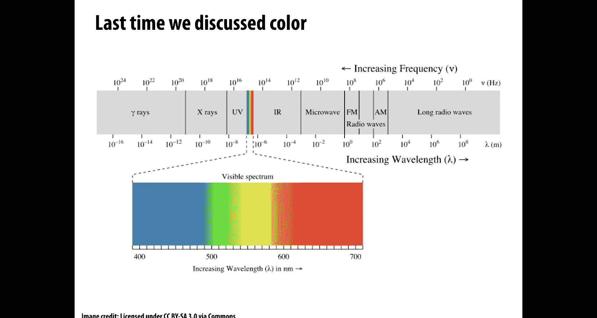

Right。Well， of course， rendering is more than just color right if all we knew about an image was the wavelength at every point。

We'd have kind of an incomplete image。 We really also need to understand how much light is hitting every point in the scene or how much light from the scene is hitting our camera。

And so these two components together in some sense make our final image。

What color of light and how intense or bright is it at every point？

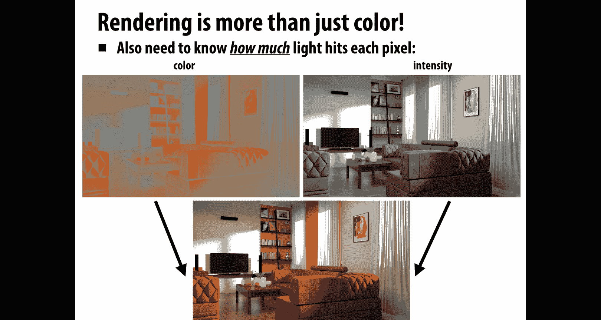

And that leads to a natural question， how do we quantify measurements of light？

So radioometry is all about developing a system of units and measures for electromagnetic radiation。

And there are a lot of interesting phenomena that go on with light。

 If you look at it at a very small scale， there's quantum mechanical effects， diffraction。

 all sorts of interesting stuff。 but for the purposes of generating an image。

 we really only need a macroscopic model， one that is tuned or modeled in a way that's appropriate for human perception。

 And this is what's called the geometric optics model of light。 So here。

Some important ideas are that photons travel in straight lines through space。

 so little particles of light are just going to travel straight through space。

 and so we can represent those geometrically as rays。

 that's why we spent so much time talking about ray scene intersection and thinking about how to accelerate those queries。

We're also going to assume that the wavelength of light is much。

 much smaller than the size of the objects in our scenes。

So we don't have to worry about these small scale effects like diffraction and interference and so on。

There's going to be lots of terminology in general， whenever you get into radioometry。

 there's lots of different terms that you have to kind of memorize。

 but the important thing to do first is understand what are the concepts that those terms refer to。

It's really easy to get lost in this strange new vocabulary。

 but actually the concepts of how much light shows up when and where is actually pretty intuitive if you look at it in the right way。

 so first we're going to look at what these quantities mean and then we're going to give the names to them。

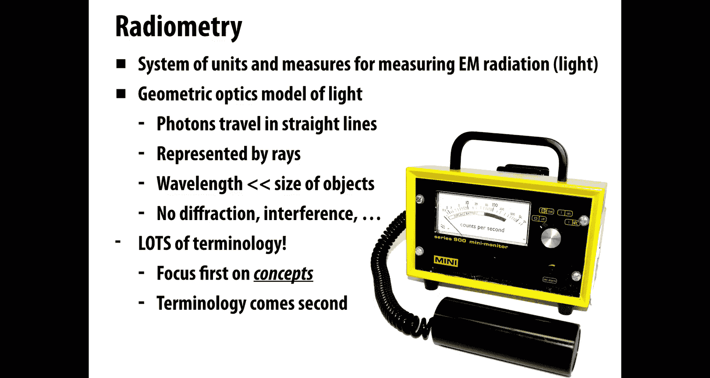

There's this great story by Richard Feynman about how names don't constitute knowledge。

 really knowing the thing is more important than knowing the name of the thing。One Sunday。

 all the kids were all walking in little parties with their fathers and the woods。

And the next Monday we were playing in a field。And the kids said to me， sayy what's that bird。

 what's the name of you know， the name about bird says I'm the slightest idea。He said。

 well it's a brown throated thrush， he says， your father doesn't teach you anything。

But my father had already taught me about the names of birds。

 he once we walked and he says that's a brown throw the thush she says" what the name of that bird it's a brown throw the thrush。

In Germany， it's called a freak flgo。

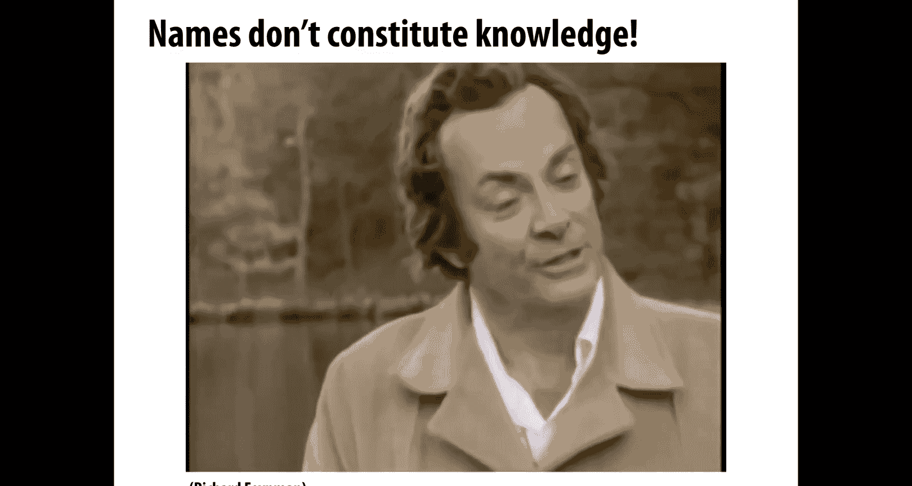

In Chinese it's called a T Long Pong Japanese or Tahahara and so on。

 and when you know all the names in every language of that bird。

 you know nothing but absolutely nothing about the bird。😡。

Then we would go on and talk about the pecking in the feathers。

 so I had learned already that names don't。Constitute knowledge。After knowing the name of something。

That's caused me a certain trouble since because I refuse to learn the name of anything so when someone comes in and says。

You got the explanation for the Fitzconan experiment I says what's that he says。

 you know that take long。Lived Camear and disintegrates into two pies oh oh yes now I know but I never know the names of things what he forgot to tell me was that knowing the names of things is useful if you want to talk to somebody else so you tell him what you're talking about but the basic principles of knowing about something rather than just knowing its name is something that you stuck toism Yes of course where you have to learn these are kind of disciplines in the field of science that you have to learn。

To know when you know when you don't know and what it is， you know and what it is you don't know。

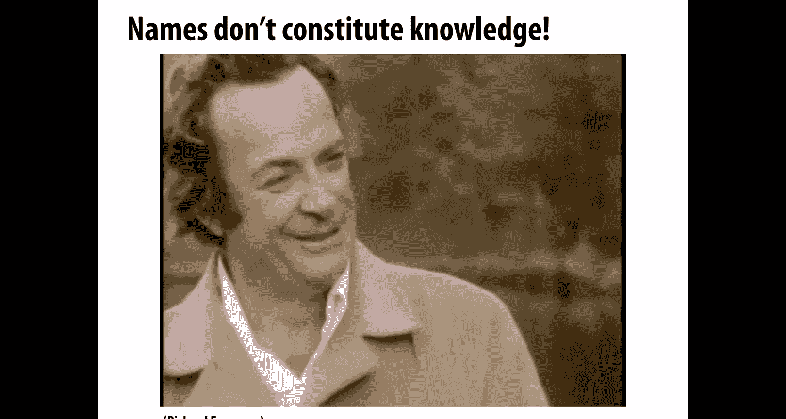

You got to be very careful not to confuse yourself。Okay， so with that all in mind。

 let's talk about what do we want to measure and why。

 why is it important to measure this quantity of these quantities？

The basic idea that we talked about last time when we said where does color come from。

 where does light come from， well many physical processes convert some kind of energy like heat into photons。

 incandescent light bulb turns heat into light， via this process of black body radiation。

 nuclear fusion in stars might generate photons， etcter lots of different places photons can come from。

 but all photons are， in the end， essentially the same， they each carry a small amount of energy。

And what we want to do is we want some way of just recording how much energy。Do we have total？So。

The reason for image generation is that the energy of photons hitting an object is really what we mean when we say brightness。

 how bright is the image， well， oh， that's how many photons are hitting the object we're looking at。

That could be in the context of photons hitting the film of a camera。

 photons hitting the retinas on the back of our eyes or hitting sensors on a CCD。

 or it could be where and why we get sunburned or how much energy is collected by solar panels so understanding radiometertry is actually going to help us understand and quantify lots of different phenomena。

 not just generating rendered images， but we do need this if we really want to make images that are accurate that really do reflect physical reality。

Another simplifying assumption we're going to make is that light transport is a steady state process。

Meaning when I flip on the。Lights in a room， you know。

 how long does it really take the light to reach a steady state， okay。

 initially there's some light traveling from the light sources and then bouncing her off the walls and so forth。

But very quickly。Things kind of settle down and we get this steady state。 In fact。

 we we can look at how just how fast light propagates through a scene。

 So this is kind of a amazing recent experiment of just showing how quickly a single packet of light travels through this object。

 This is something you couldn't possibly see with a naked eye because it goes way， way too fast。

 And so what some researchers have done both at MIT and here at CMU is to repeat the same exact。

 very precise experiment of light traveling through this soda bottle many， many times。😊。

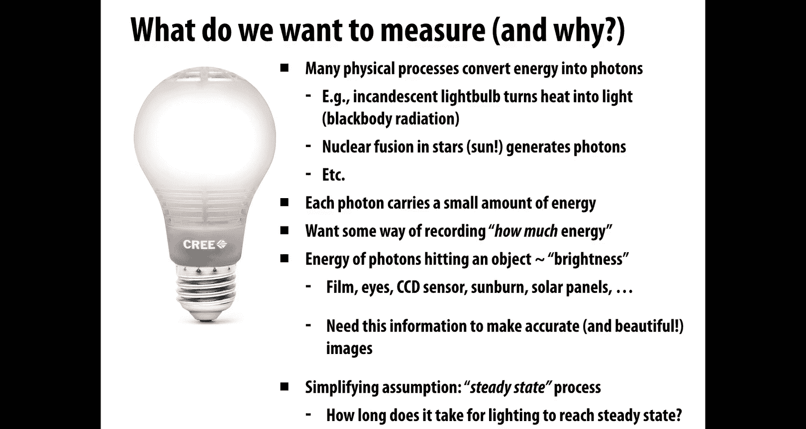

Taking different kind of snapshots in different ways at different times and then combining them together to generate this movie。

RightAnd so the point here is if you think about your day to day experience of looking at light of switching on the lights in a room。

 you never see a phenomenon like this， things settle out into the final state very quickly。

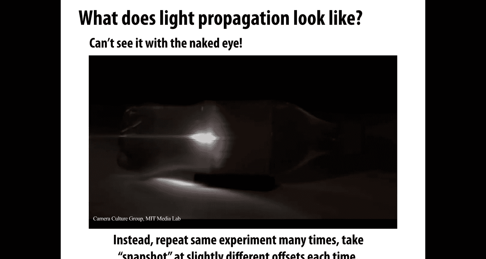

It's still a useful mental model though， to imagine that we have light coming from some source。

 maybe the sun， and with these little particles， these photons。

 and they hit some surface and then they bounce off and they hit another surface， they bounce off。

 they hit another surface， and also these photons have different colors， perhaps。

I'm coming from a yellowish light or a blueish light。And。

So the question is if we wanted to record all the information about what was going on in the scene。

 it seems very complicated， right， we have to record the trajectories of every photon and where it lands and where it goes。

In general， what information do we need to store in order to generate a photorealistic image？Okay。

 so let's break this down a little bit into pieces。

The first quantity we're going to consider is very simple， it's the radiant energy。

 so the radiant energy is nothing more than the total number of hits。

 the total number of times any ball hits any surface， right。

And we're going to consider the total number of hits over the total duration of time from the beginning of time to the end of time。

 so this quantity captures the total energy of all the photons hitting the scene。

So you can imagine if this is our scene， there are going to be all these photons that come in and hit it somewhere。

The radiant energy is just the total number of hits in this case， you could count there are 40 hits。

Okay。That's all radiant energy is， it means nothing more than this picture。

What is the total number of hits？Of photons on surfaces in the scene。Okay。

 eventually we can quantify this in terms of units and put some constants in there and so forth to make this a little more precise。

 but conceptually there is nothing more to radiant energy than total number of hits。Raddiant flux。

 similarly， is the total number of hits。Per second。So again。

 because we care only about the equilibrium distribution of light。

 then if we want to get a good picture of what's going on in a scene。

 we can really just ask how many photons are hitting the surface every second。And。Again。

 for human perception， it's usually safe to assume this equilibrium is reached immediately。

 We have the same radiant flux at every moment in time。

 So rather than record total energy over some arbitrary duration of time。

 it might make more sense to just record the total number of hits per second。

 And so if we do the same experiment， we have photons flying in， hitting this scene。Well。

 it takes our video here about 0。05 seconds to display each hit and since there are 40 hits。

It takes about two seconds total， so we get 20 hits per second。That's the radiant flux。Again。

 conceptually nothing more than this。How many photons hit the scene in a given unit of time？Okay。

So we've broken down the total energy。Over time， we can also break it down over space。

And that's going to be irradiance， so irradiance is the number of hits per second per unit area。

Typically， especially if we're generating an image。

 we really need to get more specific than just the total amount of energy hitting the whole scene。

We need to know where the hits occurred。 For instance。

 where on the camera sensor did these photons hit。Okay， so。

What we're going to do is compute the hits per second in some really small area。

And then divide by that area， so we have our same scene here， a bunch of photons came in and hit it。

And for a given area， you can imagine maybe this is a little pixel on a camera sensor。

We're going to record the number of photons that hit it。And then divide by its area。

 so here the radiant energy density is 2 over epsilon squared。If we divide that then by time。

 we get the。Hits per unit area per second， or in other words， the irradiians。Okay。

So this is really at the end of the day， what we want to do to generate or estimate an image。

From this point of view， our goal in image generation is to estimate the irradiance。Meaning。

 the hits。Per unit area per second。At each point of an image。Okay。

 so you can imagine if on the far left， these are all the photons that hit our camera sensor in the middle。

 we kind of see where the pixels are on the center， then on the right， this is the。

Information that we're actually going to record within each pixel。

 how many hits per second did we get？Okay。So this is our recap so far。Our main quantity。

 the most basic quantity that's easy to think about is the radiant energy。

 just how many photons hit the scene。How many times did one of those little rubber balls hit the ground。

We can then break that information down into space and time。

 we can kind of make get a fine grain sense of where and when。Those photons hit the scene。

 so if we break things down over time， we get the radiant flux， the number of hits per second。

If we break it down over space， we get the radiant energy density that hits per unit area。

And because at the end， what we really care about is the equilibrium。

Distribution of light in some small region like a pixel。What we really care about is the energy per。

Unit area per time， In other words， the radiant flux density。

 which is commonly abbreviated as the irradiance。Okay。So hopefully no big deal there。

 and now we can add in all the units， all the funky names that get a little harder to remember。Okay。

 so what about radiant energy again， imagine we have a bunch of photons。

 they're hitting a sensor and we just want to know the total amount of energy that was absorbed by that sensor。

OkayHow can we be precise about that quantity？First question we should ask is。

 do all hits contribute the same amount of energy are all photons created equal？Well。

 here is an expression for the energy of a single photon， so the energy Q。

Is equal to one over the wavelength， which remember determined the color of the light。

Times some constants， which conceptually are not that important。

 so we have ps constant H and the speed of light C。

 These are just two numbers that are always the same。

 They have no effect on the meaning of this quantity。

 and then we have our wavelength that determines the color。So do all photons have the same energy。

 no。If we have smaller wavelengths， blue or light。Then it's more energy if we have longer wavelengths。

 redder light than it's less energy。So if you're trying to get the total radiant energy hitting a sensor。

 you're kind of taking a weighted sum of number of photons in each wavelength。Okay。

 so given that Punk's constant is in Juules time seconds。Speed of light is in meters per second。

 and wavelength is in meters。 What are the final units for a photon？Well。

 we can just multiply through we have joules times seconds divided by meters。

 times meters per second is just equal to joules。And that sounds right， energy is measured in joules。

Now， one thing you might ask， why am I thinking so much about units。

 I said these constants aren't particularly important， well units， it turns out。

 are a really really powerful tool for debugging your rendering code。

If you're multiplying and dividing all these variables in your code to try to compute some final color quantity。

Often you'll get it wrong， you'll make a little bug and a good way to check is， oh， well。

 if I track the units throughout this calculation， do they give me what I expect？

Am I getting energy and jewels and so forth？Okay。How about our other quantities。

 What are the units we can associate with those？ Well， we said that flux。

Radian flux was energy per unit time。Received by the sensor or emitted by a light right it's not all about what's coming in。

 but maybe you want to quantify what's going out。Okay， and so we can say that flux capital fee is。

 well， think we said this is the。Amount of energy per unit time。Right， so if we take some。

Change in total energy。Delta Q over some change in time Delta T。Then over some very。

 very short time that's DQDT， which has units of joules per second， otherwise known as watts。

We could also go the other direction and say the time integral of radiant flux is total radiant energy。

Right， total radiant energy is the integral of。The radant flux phi from T 0 to T 1。

 that will have units of。Well， jewels， right？Radian flux has units of joules per second。

 we integrate it over time， the seconds go away， we just have Juules。Okay。How about irradiance？

What was irradiance， Remember that radiant flux is。Energy per unit time。Iradiance is。

Radant flux per unit area。Or energy per area per time。OkaySo given a sensor of area A。

We can consider the average flux over the entire sensor， just Vhi over a。

The irradance E is given by taking the limit of area at a single point on the sensor。

 so you can imagine have a little region around the point on the sensor。

 you're letting that area get smaller and smaller and smaller。So， irradiance is the。

Change in energy over that sensor divided by the change in area。In other words， it's DP over DA。

 which has units watts per meter squared。Okay。So。In the end。

 we didn't really say anything new conceptually， we just added a bunch of additional language and terminology that makes this sound more complicated。

But the concepts are still the same， radiant energy is still the total number of hits。

 radiant flux is still the total hits per second， radiant energy density is the hits per unit area and radiant flux density is the hits per unit area per second。

Okay，The only thing that we did was add units， energy comes in jos， radiant flux comes in watts。

Radant energy density comes in joules per meter squared。

 and radiant flux density or irradiance comes in watts per square meter。Okay， that's it。 Now。

 one thing we haven't really。Kind of narrowed in on or honed in on yet is， what about color？

So if we have light coming into the scene， hitting some service， hitting the camera。

 coming out of a light bulb。How might we quantify the amount of， let's say。

 the color green in that light？Okay， well， let's think about this is so far we've split up the total energy across space and across time。

we could also break up the total energy across different wavelengths。

To get what's called the spectral power distribution。

So this is going to be irradiance per unit wavelength。What do you think the units on that are？So。

What we have is energy per unit time per unit area per unit wavelength。We said energy was in jewels。

Energy per unit time is joules per second or wts。Energy per unit time per unit area is wts per meter squared。

And what are the？Units for wavelengths。Well， wavelengths are a length， so they come in meters。Okay。

So our total unit for spectral power distribution will be。Wats。Per。Meters cubed， right。

 watts per meter squared divided by meters once again。Okay。

 and now we've really broken down light into pretty fine granularity。However。

It's still not completely clear why certain regions of the image are brighter and darker。

So given an image like this。Why do you think some of these pixels。

Look closer to white and some look closer to black。 This is a photograph of some stone sculpture。

It's not because somebody went in with a paintbrush and painted some regions gray and some regions black。

It has something to do with how much light is hitting different parts of this surface。

So why do you think， why do you think that is， why do you think different parts of the service are？

Daarker and brighter， there are actually a couple different reasons。

Okay but here's a really basic one to think about and actually we can go to a slightly different question which is。

 why do we have seasons here on planet Earth？Why is it。Warmer。In the summer and colder in the winter。

It's not， by the way， because the earth is closer to the sun in the summer and further in the winter。

 that's simply not true。There is some very small variation in the distance between the Earth and the sun。

 but not nearly enough to cause a change in temperature。So why else。

 why do you think we might have seasons？Well， one important thing to know about the earth is that the earth is spinning not on a perfectly vertical axis。

 but its axis of rotation is actually tilted a little bit。It's tilted relative to。

The plane that it's orbiting in。Okay。And so what happens is just think about that。

 I have the spinning earth， it's spinning around this off axis， and it's going around the sun。

And at some point in that orbit。It's going to be tilting sort of toward the sun and in some some point of that orbit it's going to be tilting kind of away from the sun if we look at things from the side。

Okay。And when it's tilting。Toward the sun， the normal。At a given point。Looks different from。

When it's tilting away from the sun， relative to。The direction toward the sun。

 relative to the direction where beams of light are coming out of the sun。Okay。

 so we get the sense that something interesting is going on in summer versus winter。

 why should this make things warmer or colder？Well。

 let's think about the power of this beam of light coming from the sun in terms of irradiance。

So consider a beam of light。With radiant flux phi。Incident on a surface with area a。

So radant fluxes energy per unit time。The irradiance E。

 the energy per time per area is going to be p divided by a。By area。Or equivalently。

 the radiant flux is going to be equal to the irradiance times the area。Okay。

 so how does that help us Well， now let's consider。The surface tilting away a little bit。

It's no longer perfectly vertical， it's tilted away to the right。

And we can ask for this same cross section of light coming in through the area A。

 it's now hitting a slightly larger piece of material。Right， and those two are related。

 we can just do some simple trigonometry， just write triangles and see that the area。

This cross section of area that the beam is passing through is related to the surface area a prime by cosine theta。

Okay， so the projected area is always smaller， no bigger than the。The true physical area。

What that tells us is that the irradiance。Is equal to phi over a prime。

If it's tilted completely vertically， it's phi over a， but now that it's tilted off to the right。

 it's phi over a prime， in other words， it's equal to phi cosine theta over a。

What that means is the more we tilt this plane away from the beam of light。The smaller。

The irradiance。Becomes and that should be very intuitive。 I have the same total number of photons。

The same radiant energy or radiant energy。Per unit time。But now distributed over a larger area。

 those photons have to get smeared out over bigger areas， so things are darker or colder。

When the earth tilts away from the sun， things get colder。

This in fact gives us the most basic way to shade a surface in computer graphics。

 which is to just say how bright should this point be on my triangle。

 let's say you're running your rasterizer you've decided you're going to draw this sample。

 you want to figure out a color value， well okay go to that point。

 grab its unit normal N and the direction L to the light， let's say those are both unit vectors。

And then you just take the dot product between those because N dot L is going to be equal to the cosine of the angle between them。

So that'd be a really simple way to make a kind of gray looking surface that gets darker when it's pointing away from the light and it looks brighter when it's pointing toward the light。

And here's kind of a little pseudocode for that。Just return N L。What， by the way。

 is wrong with this code？What might be less than satisfactory about this code？Well。

 it's always good to consider you know what are all the possible cases and one thing that could happen here is we've drawn the picture in one way。

 but you can imagine that L is pointing in a very different direction than n。

 like almost in the opposite direction so that the stop product is negative。Okay。

Can we have negative？Iradians， can we have negative energy， I mean。

 it doesn't really make physical sense。So maybe the right thing to think is， oh， well。

 if the light was on the other side of the surface。Maybe we shouldn't shade it at all。

 so we might return the maximum of 0 and that dot product if it goes negative， we just return 0。Okay。

Where can these light direction， we didn't talk about where L comes from。

 So where do these different light directions come from， Well， one kind of very。

 very simple model for a light in a scene might be a directional light。

 So it's kind of a strange abstraction。 We imagine we have an infinitely bright light source all the way off at infinity。

And the thing that's nice about this is because it's so far off in the distance。

All light directions are identical。 We just have a constant vector L that tells us this direction that we're dotting with。

Okay， this looks pretty good right for distance sources， for the sun。

 this is a reasonable thing to do。We could get a slightly more realistic model of a light by using what's called an isotropic light source。

 ass just kind of just like a light bulb shining in all directions with equal strength。Right。And。

So the way we can quantify this， talk about how bright the light is is we're going to associate with the light。

An intensity I， which is kind of a nonphysical idea。

 There's no such thing in the universe as a point light source， but okay， we have this intensity。

 and we're going to say the total radiant flux is just the integral over the unit sphere。

 the integral in all directions of this intensity。 So the total radiant flux coming out of the light is just four pi times the intensity four pi being the area of the surface area of the unit sphere。

In other words， the intensity is the total radant flux divided by fourpi。Okay。

This model is going to behave differently than our infinite。lightighted infinity。

 it's going to fall off with a distance in a natural way like you experience a real light bulb doing。

 the further you get from it the darker things get， why is that true？W is it？We think about okay。

 light maybe photon just traveling straight through space， it doesn't decay， it doesn't fizzle out。

 right， it just keeps traveling， so why should things get darker as you move away from a light bulb？

Well， let's assume that light is emitting flux in a uniform angular distribution， again。

 this is isotropic， nothing different depending on what direction you're talking about。

And we can compare the irradiance。For two spheres around this light bulb。

 you can imagine let's imagine that I put a solid sphere around the light bulb and I measured how much light was hitting that smaller sphere。

 and then I put another sphere around the light bulb and a bigger one and I asked how much light is hitting that one。

Okay， well， we can quantify that。By looking at the two irradiance values。

 the energy per time per unit area for these two spheres。So for the inner sphere。

 we have an irradance E1。Which is equal to this total flux fee。Divided by 4 pi r1 squared。

 divided by the surface area of the inner sphere。Or equivalently， phi is equal to 4 pi r1 squared e1？

Same thing for E2 E2 is equal to phi over4 pi times the radius of the larger sphere squared。

Which means that the。Fluux is equal to 4 pi r2 squared2。 Well since these two quantities are equal。

 we get the relationship that e2 over e1。Meaning how bright is the bigger sphere divided by how bright is the smaller sphere？

Is equal to r1 squared over r2 squared， or equivalently r1 over r2 squared。What does this saying。

 What does this mean geometrically， It means that， well。

 since the same amount of energy is distributed over the larger and smaller spheres。

It has to get darker， what we see has to get darker quadraically with distance。

As the radius of the sphere increases。The brightness goes down with the square of this radius。

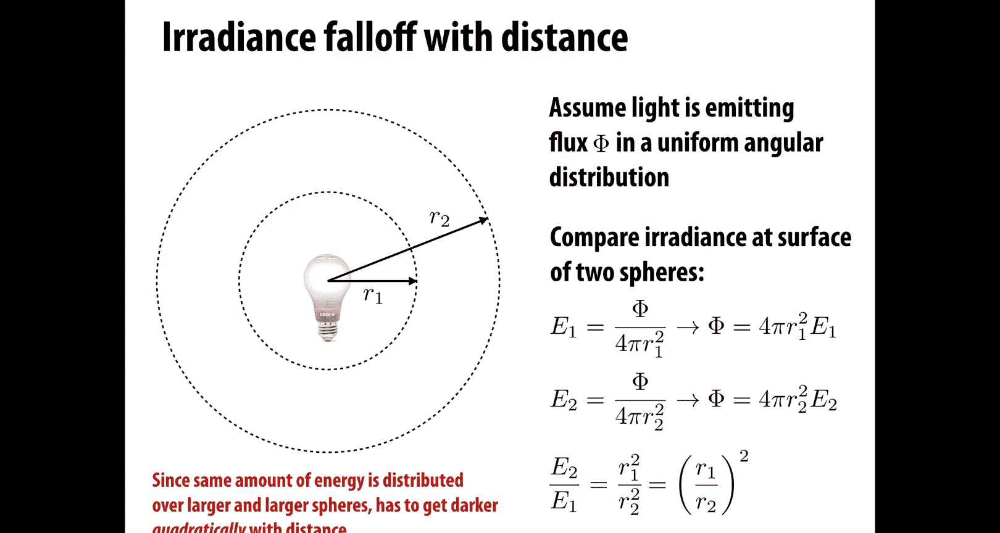

What does that look like， it looks something like this， it looks pretty natural。

 pretty much like what you would see in real life。So if I have a little point light。

 what I've done here is just moved it for each of these frames， I've moved it vertically a bit。

And you can see that as the light moves away from the ground as it moves up into the sky。

 things get dark really， really fast。This， this point light has a pretty local influence。 I mean。

 this is the same as if you try to light your house。

 if you have a really big room in your house and you try to light it with little light bulbs。

 you'll find you have to put a lot of them all over the room to get a nice distribution of light。

And that's true also when you're lighting virtual scenes。

 so actually one of the great things about computer graphics is you don't have to obey the laws of physics and what people will do sometimes is say you know。

 it's really a pain in the butt that things are falling off quadratically。

 I'm just going to make them fall off linearly instead。

Or fall off in some other way that's easier to light。

Okay but if you want a physically accurate rendering。

You really know by how the area of a sphere behaves that you should do it according to the square of distance。

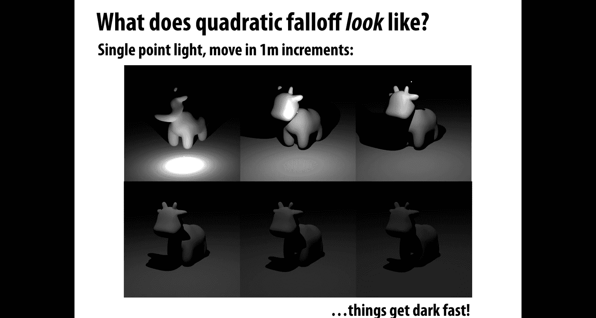

When talking about distribution of light in the scene。

 it's also really useful to break it down not only over space， but over angle。Okay。

 so how do we think about an angle angles or something that we think we have a lot of intuition for but okay how do you define an angle。

 well one way to look at it is to say an angle is the ratio of an arc on the circle to the radius of that circle。

So if I have this red arc on the circle and it has length L， and the circle has radius R。

Then the angle made by that arc is theta。And you can check yourself on this by saying， okay， well。

 let's see length of the going if the arc was going all the way around the circle。

 then its length would be2 pi R。And if we divide2 pi R by R， we get2 pi aha good。

 I know that a circle has two pi total angle， right， two pi radance so that things check out。

A concept that you may be less familiar with is something called the solid angle。So now。

 rather than an arc on the circle， I had a little patch of area A on the sphere。

And the solid angle is the ratio of this area。To the squared radius。

So capital omega is equal to a over r squared。The total sphere has four pi， what are called stadians。

OkayThe area of the unit sphere is4 pi。So if this patch of area， a is， in fact， the whole。

Surface area of the sphere for sphere of any radius。 then when we divide it by r squared。

 we're going to get four pi。Okay， so solid angle just generalizes our usual notion of angle to the sphere in a very natural way。

To get some intuition for， you know， what does solid angle tell us。

 what we can think about if we're standing here on Earth and we're looking up into the sky at various objects in space。

We can ask kind of what is the size of the shadow that they cast back down on earth？

It's not a literal shadow， but what is the size of their projection onto earth。

So kind of a cute fact is that the sun and the moon actually have a projection that's almost the same size on Earth。

Which is pretty surprising， actually， the sun is way， way， way many， many。

 many times bigger than the moon， but also the sun is much， much。

 much further away from the Earth than the moon。And so these two factors cancel out。

 and so the projected area or the solid angle。Is about the same。

 Both the sun and the moon subtend about 60 me stadians as seen from the earth。Or 60 micro stadians。

So if the surface of the Earth is about 510 million kilometers squared。Then the projected area is。

 okay。 We take the total surface area and we multiply by the stadians。 What is the。

Solid angle kind of on the unit sphere divided by the area of the unit sphere。

60 milliseadians over four pi staddians， well that's equal to 5 10 times 15 over pi。

 which is about 2400 kilometers squared。So that's how you do a calculation with stadians。

We can also talk about a extremely small solid angle on。The sphere， an infinitesimal solid angle。

 So a differential solid angle is going to be imagine that you sweep out a tiny angle by just jiggling a direction a little bit in。

 let's say， theta and phi， right， if we've parameterized the sphere by。Longitude and latitude。Okay。

And we can relate。This change in angle to a change in area。By saying the differential area D。

Is equal to the product of the two changes in angles along longitude and latitude， D theta and D P。

Multiplied by， well， factors that have to do with the way we express the sphere so if it's a sphere of radius R。

 well okay a sphere gets bigger and smaller。We're going to multiply by that radius。

 and we also have a factor of sine theta in there just to account for the fact the way we parameterize this sphere。

In other words， the differential area， D。Is equal to r squared sine theta， d theta dhi。

That's how it relates to the differential angles in each direction。Okay。

So the differential solid angle。Is just that same tiny area projected onto the unit sphere。

It's D divided by r squared， or in other words， we just kill that R squared factor。

So differential solid angle we can write as sine theta， d theta， dhi。Okay。For instance。

 if we integrate differential solid angle over the whole sphere。

RightThen we're going to get a total solid angle omega。

What is that going to be equal to while it's equal to integrating from 0 to2 pi？

So all the way around。The latitude， and then integrating from zero to pi all the way along the longitude of sine theta d theta d phi。

 which is4 pi。In other words， if we integrate differential solid angle over the whole sphere。

 we get the surface area， so differential solid angle you can also think of as the ingr that shows up in an area integral on the sphere。

Now there's a little bit of aive notation in rendering people also just。

Use little omega to denote a direction vector。Really just a point on the unit sphere。

 okay and those are going to be used interchangeably a lot。Okay， so so we've broken down energy over。

Space， time， frequency or wavelength。Right。To get a really fine grained picture of where light is in the scene。

 we can also break it down over direction。In other words， we can say。

How much energy do we have per unit time per unit area and per solid angle？

So radiance is the solid angle density of irradiance。

And we're going to use the letter capital L always， this is very standard in all rendering。

 capital L is the radiance。So the radiance at a point P in a direction omega。Is。The change in。

Iradiance， E。Over the change in。Solid angle， so D E omega over d omega。

Which has units of watts per meter squared， same as irradance per staddian。Again。

 how much energy per solid angle？Okay。In other words。

 radiance is the energy along a defined by some origin point P and some direction。Omega。

 Ands a measurement you could take anywhere in space， right， You pick a point in space。

 You imagine there's a little tiny patch of surface。And you can write down。The radiance Sir。Okay。

Equivalently， we could say that the radiance at a point in a given direction。I。

DE over d omega cosine theta。Or equivalently d squared phi over D d omega cosine theta。

 so basically in the previous slide。We were talking about measuring raddiance at a little service oriented in array direction。

Now imagine that we're actually on a surface that has its own normal direction。Okay， in that case。

 we can also write radiance。Using this cosine Theta。To account for different surface orientations。

Okay。To summarize。Raddiance is radiant energy per unit time， per unit area per solid angle。

 and to really get a completely final description of light that loses no information whatsoever。

We have to break down this information into just one more piece。

 which is to divide by wavelength to say what color is。This light at every point in every direction。

So radiant energy per unit time per unit area per solid angle per unit wavelength。

What information do we get， again， we get color right。

 dividing it over how much energies in each wavelength gives us color information。Okay。Why。

 why are we going to the trouble to break down light to this crazy degree of granularity， you know。

 all the way down to spectral radiance。 Well， because once we have spectral radiance。

 we have a complete description of light in an environment。

 if we know at every point in every direction。Over any area， over time， what the light looks like。

 then we can reconstruct whatever image we want from the scene。

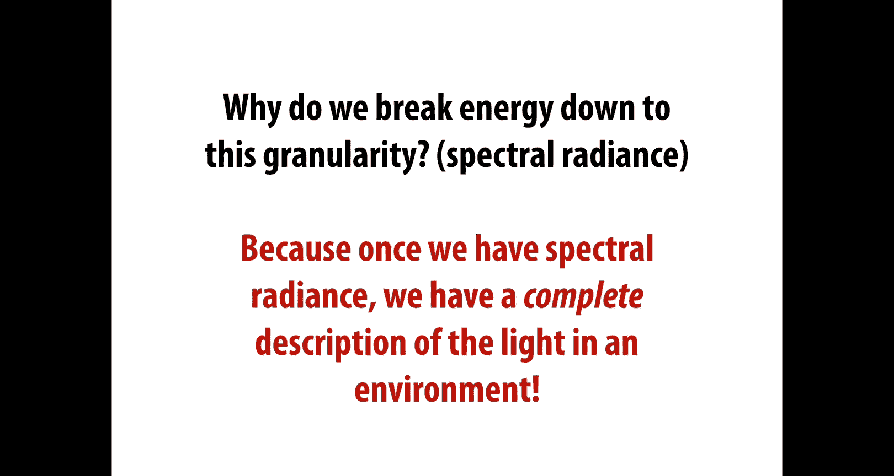

And。In fact， this information of what is the radiance or the spectral raddiance at every point in space in every direction is something called the light field。

So the light field is just going to assign to each ray。

To each possible ray that you can write down in space， the light field assigns to it a number。

Which is this radiance， or maybe you do it in color， you do the spectral radance。

Why is this everything you need to know， well， because radiance is at least in a vacuum。

 radiance is constant along straight rays？And there are actually physical devices that will go ahead and capture at least some chunk of this light field。

 so here's an example something called the spherical gantry。

Which captures the four dimensional light field leaving an object。

 so you can parameterize these rays in this scenario over X， Y， theta and phi。

And you're recovering a lot of information about how this looks and can reconstruct it in different ways。

 and this leads to this really beautiful idea of light field photography。

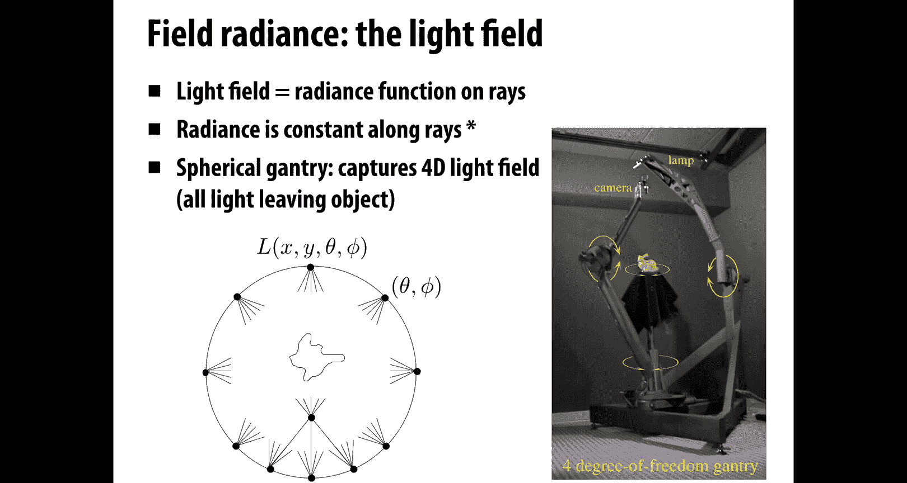

So。You know，If you take a step back and think about what a camera is doing。

 a standard camera is just capturing a small slice of the light field。

It's capturing the radiance for a very specific set of rays。Those that， well。

 if you think of it from the perspective of the camera。

 you have rays going out through the different pixels， or you can say flip those rays around。

 the rays that are coming in， you're recording the raddiance for each of those rays。

You could imagine getting a lot more information about the scene by maybe shifting the camera around a little bit up down。

 left， right， maybe rotating it back and forth a little bit。Okay。Or。

You could replace a standard camera with one that has a funky looking lens。

 so maybe you turn your ordinary single lens into an array of these little what are called micro lenses you can see on the picture on the left。

And each of these little lenses is going to capture the scene from a very slightly different position and orientation。

In other words， it's going to capture a different little slice of the light field。

 maybe at lower resolution， but from very different directions。And so once you have that information。

 that richer information about the light field， then rather than just having a single static image。

 you can reconstruct a bunch of different images。That are different from what the photographers saw when they were looking through the camera lens。

So maybe initially you had your photo focused on the flower in the foreground。

 but you really meant to photograph the person in the background。

 well this light field has enough information about it that you can refocus the image and get this sharper image in the back。

 or maybe you can move the camera or move the viewpoint slightly to the left or to the right。

 but purely in algorithms purely using software that manipulates the light field。Pretty cool。

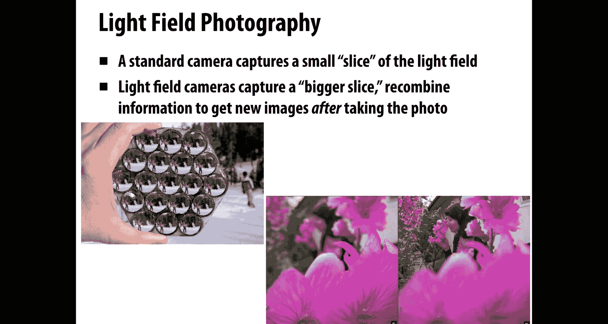

All right。One thing to keep track of carefully when we're talking about image generation or photography or whatever it is is the distinction between incident versus accident radiance。

We want to know， is this。Radance coming in or going out。

And we'll use L sub I to denote incident radiance。Raddiance coming in and L sub O radians going out。

 Exent radians in general， there's no reason why these should be the same。

RightThe light coming in in a given direction at a given point could be very different from the light going out。

 a great example would be a light bulb。 There's a lot more light going out than light coming in。Okay。

 what other things can we say about radiance radiance is a fundamental quantity that characterizes the distribution of light in an environment？

It is the quantity fundamentally associated with a ray。

 so we talked a lot about the geometric problem of ray tracing。

 what quantity are we going to put on those rays radiance。

And rendering or photorealistic rendering is all about computing radiance for rays。

Raddiance is constant along a that's very important right why can we just associate a single number with array because as long as that ray is not hitting like fog or smoke or anything。

 the radiance is constant along the array。And also a pinhole camera。

 that camera model that we talked about on the very first day。Is really directly measuring radiance。

 So you imagine this pinhole is infinitesimally small。

 So the value being stored on the sensor at each point is。

The radiance for a single ray through space。 If that hole gets a little bigger， well。

 now each point on the sensor is getting hit by rays in slightly different directions。

 So it's really integrating radiance over some region。And for image generation。

 that's in fact exactly what we want to do。We're going to use information about radiance along particular rays to integrate or get a sense of the total irradiance。

Somewhere in our scene， or on our camera。So if we want to compute the flux per unit area on a surface due to incoming light from all directions。

 in other words， we want to know the irradiance E at a point P。

Then we're going to integrate over the hemisphere H2 h squared over that point。

Of all incoming directions， mega。We're going integrate the incident radiance L sub i of P。Omega。Wait。

 how much radiance is coming in on the ray in the direction omega that hits the point P。

As a simple example， imagine that we have a uniform hemispherical light source。

 so so what this means is。Rather than thinking about a light bulb or a light source that's in some direction at infinity。

 you just imagine that you have light coming in from all directions。By the same amount。

 a good example， this would be like a cloudy day an overcast day。Right。

So what is the irradance hitting a point P in this case while we're going to integrate over the hemisphere H2？

L， Dmega。Where this is L of P omega。Since the incident radiance doesn't depend on the position or the direction right。

 it's a uniform source， we can pull this factor L out of the integral。And hey。

 now we're just integrating over the hemisphere。So we get integral cosine theta， sine theta。

 d theta d phi is equal to L pi。Okay， doesn't sound very interesting。 right。

 We're gonna to get the same value no matter what point we're we're sitting at。 Well， actually。

 this is what it looks like in practice。 So if we actually do have a hemispherical light source。

 we get something that looks like this， as I said。It should look like what things would look like on an overcast day。

You have light coming from above， but there's not hard shadows anywhere。 Well， why， though。

 mathematically。Didn't we just get the same constant L Pi everywhere。

 why isn't this just a completely flat white image？Well， the reason is because of occlusion。Right。

 the one thing that we didn't really write explicitly into that equation is that actually some of the rays。

That are coming into our hemisphere。Are actually blocked。

 they don't hit this hemispherical light source that's sitting over the scene。

 but they get blocked by the geometry。And that's why we spent so much time trying to find intersections between rays and scenes so we can do this binary check。

 did it hit something or didn't it， if it did hit something。

 it's not going to contribute to the integral， if it didn't hit something， okay。

 then it adds something and so that's why things get darker when you're underneath the cow here。

In fact， this idea of storing the。Iradiance due to a hemispherical light source。

Is a common technique that's used for maybe real time shading or making things look just a little bit more realistic。

 which is you say， okay， I don't know maybe in a realtime environment exactly where the lights are going to be and you know how the shadows could go so I'm just going to do an approximation and say。

 well I kind of at least know that the object is going to occlude itself。

 it's going to cause some kind of self-shadowing。And so you assume， again。

 this hemispherical or maybe spherical light source。

The irradiance is now completely rotation and translation invariant。

 It doesn't matter if the model moves around， if it gets translated。

 And that's nice because it means we can pre compute。 We can bake these irradiance values。

Into the surface we can compute at every point of the surface。

 the irradiance due to this uniform light source， and we can store those values in a texture map。

So this is what you see at the bottom here。 I have this hippopotamus model。And on the left。

 I have just the original geometry。I run some kind of ray tracing calculation to figure out at each point。

What is the irradiance do to this hemispherical light source？I then look up that。

Point on the surface， I say where does that correspond to in the texture map and I store the irradance value in that texture map。

Now when I go to render it。Right， I can I can skip all the lighting calculations because I've already computed them in this。

Texture map。And I can just texture the surface with this ambient occlusion map。

So I just pull the values back from the texture map onto the surface。

And you can see it looks a little more realistic， right， if you look inside the mouth， for instance。

 there's this dark shadow。Over the years， people have come up with clever hacks and tricks and ways to approximate ambient occlusion。

 so one popular technique is something called screen space ambient occlusion。

 and the observation here is that actually you have a little bit of information about the geometry just in the depth buffer。

So if you imagine you render a bunch of polygons into your scene using a rasterizer。

You have this depth buffer and just by looking at a given sample in the depth buffer and the depths of the samples in a nearby vicinity。

You can guess or kind of approximate what would be this irradance value。

 how much of this sample is likely to be includedcclude by the neighbors。

And so when you do this trick， you get something like this。

 you get this kind of darkening around corners and so forth。

So we can look actually just at just the screen space ambient inclusion map looks something like this。

It's not。Not a huge difference， but it really does help to add some depth and realism to the image。

Okay。We can also think about rather than a point source or direction source or a hemisphere source。

 we can think about an area source。So an area source this means a little patch of area floating in space like this blob on the upper right。

That's emitting light uniformly。And this starts to be a little more realistic model for how real。

 let's say light bulbs look。 If you imagine you have a fluorescent tube。

 maybe your patch is a cylinder。So what's the irradiance from a uniform area source？Well。

 if the source emits a radiance L。Then we can say the irradiance at a point P。

 arriving at a point P is the integral over the hemisphere around that point。Of。

The incident raddiance L at the point P in the direction omega， cosine theta d omega。

Because we assume it's emitting the same radiance everywhere。

 we can pull the factor L out and we just get the integral。Over。The region。Omega。

Of cosine theta d omega， so omega here is the projection of the light source onto the hemisphere around the point。

Okay， and if we knew。What the area of that projected onto the plane of the surface was equal to。

 if we knew the projected solid angle， omega perp。Then the final irradance would just be L times omega perp。

Okay， so projected solid angle is just the cosine weighted solid angle。So as a concrete example。

 we can consider a uniform disk source， we have a circular disc。And just to keep things simple。

 have it oriented perpendicular to the plane。Okay。And we want to work out， what is the。Iradance。

 due to that disk。Okay， well。Just from a geometric derivation。

We can figure out just kind of using trigonometry， we can use the fact that the projected solid angle omega per is equal to pi times sine squared alpha。

If you want， you can also write that out in spherical coordinates mega perp is the integral from 0 to2 pi times the integral from 0 to alpha Al is this angle that the disk makes at that point。

 cosine theta sine theta d theta d phi。Okay， now you just do your usual tricks for integration。

 you get two pi sine squared theta over 2 evaluated from zero to alpha， which is， again。

 pi sine squared alpha。Okay so for each kind of light source。

 you have to figure out how do I integrate it for most light sources， by the way。

 you're not going to be able to get this closed form integral。

 we're just showing some simple examples here where you can really write down the irradiance directly in terms of quantities that are easy to measure in this case the angle made by the disk。

 but in general we're going to need numerical techniques for doing these kinds of integrals and that's going to come in our next few lectures。

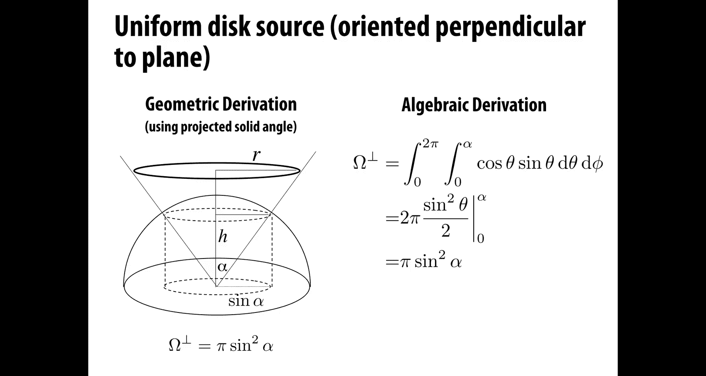

To see what this light source looks like， generally it's going to have kind of a softer appearance than point lights because the light the emitted light is spread out over a larger area。

 So here on the left， we have this square light source shining down on the cow。

You can see this kind of soft glow， likewise we have this cylinder light on the right。And generally。

 this is， again， a better model for how real world lights behave they're not。At a single point。

 maybe you can get away with thinking of the sun as a single point or maybe a distant star， but。

 but not for most things that you see on a day to day basis。

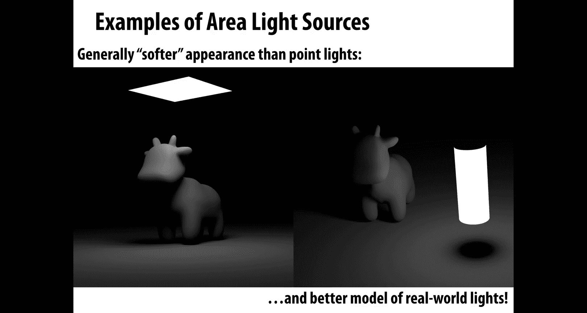

Okay， so just like we can cook up a very fine grained description of the light coming into a point。

 we can also talk in a very precise way about the light being emitted from a source like a light bulb。

So for instance， we could talk about the power per solid angle emanating from a point source if we didn't want our point source to have a uniform distribution。

 and that's going to give us a lot more realistic model again of real light bulb so you could take a real light bulb and you could do this kind of measurement and get what's called a goometric diagram。

 which measures the light intensity as a function of angle and since people have done this for you。

 then you can go and download these measurements in these models and use them in your scenes to get kind of realistic lighting effect。

And actually， this is one important use case of photorealistic rendering。

 not just for making cool looking images， but for actually doing pre visualization。

 you're building building， you're doing architecture。

 and you want to get a sense of how is this really going to look when we build it。

 Are we really doing the right thing here。Finally， so far we've been talking about everything in a very phy centric way。

Right in terms of geometric optics and electromagnetism and so forth。 But the reality。

 as we talked a lot about in our lecture on color， is that human perception plays an important role in the way that we。

talk about and generate images and in fact， all of these different radiometric quantities that we talked about have equivalence in photoometry。

 which is kind of the human centric version of radioometry。

So photometry accounts for the response of the human visual system and in particular。Luminance。

 which is often represented by y， is a photometric quantity that corresponds to radiance。

 and so we went from L to y。We're going to integrate radiance over all wavelengths。

 but we're going to weight by the eye's response， by the eye's luminous efficacy curve。

So we say that y at a point p in a direction omega。Is going to be the integral over all wavelengths。

Of。L。The incident radiance at the point P in the direction omega for the wavelength Lada。

Times v of Lambda， which is this response curve。Okay。And。

One thing you can also think about here is that actually the eye is not even just one static model。

 depending on whether it's daytime or nighttime， for instance。

 your eye is going to behave in very different ways。

So if you're trying again to make predictions of what a scene is going to look like， well。

 especially if you're doing it for something like architecture。

 you want to know what is it going to look like to a person。

And so it's important to take these perceptual phenomena into account。By the way。

 what information have we gotten rid of？In why。What can we not determine from this luminance？Well。

 we integrated over wavelength， so there's no information left about color。W。

 as written doesn't tell us， is this bright blue or bright red or bright green。

 but we could do a kind of a spectral luminance， we could break this down further。Okay。In general。

 again， the names are much more complicated than the concepts。

 and part of the reason is that people in different walks of life use different names for the same or analogous quantities。

So in physics we talked about energy flux flux density， angular flux density intensity in raometry。

 you talk about radiant energy radiant power， irradiance raiosity。

 which is kind of the outgoing version of irradiance。

 radiance radiant intensity in photoometry in the human centric version you talk about luminous energy luminous power。

 Iuminous luminosity， lu luminous intensity and if that's not complicated enough the photometric units are also different in different areas of science and also in different systems so for instance for the British they might use the Talbot。

 the lumen， the foot candle， the foot Laert and the kdela or as James Kajiia says。

 is one lux per staddian is one kla per square meter is one lumen per square meter per staddian right？

Okay， so the point is don't get lost in all the terminology and all the units。

 the point is to if you really want to ever make sure you understand what's going on with illumination is just go back to this picture of photons or if you like rubber balls hitting the scene and counting。

How often did they occur over what area in what wavelengths？If you can get that picture straight。

 the rest is just details。

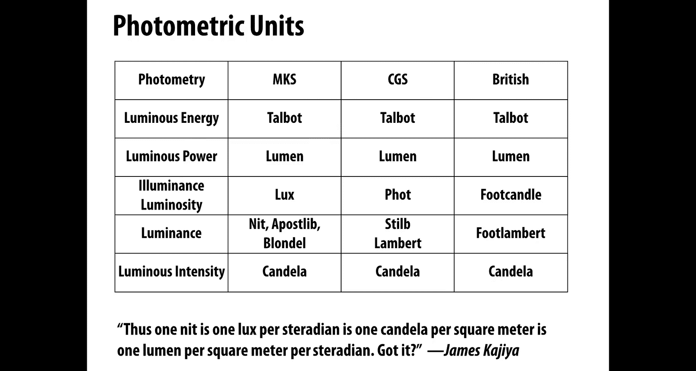

What information are we missing， What else have we not accounted for in our measurements here？Well。

 at the beginning， we said we're going to adopt this geometric optics model of light。

We consider things going on at large scales， that means we miss out on small scale effects。

Like diffraction or irideescence。Actually， it also ignores some extremely large scale effects。

 things that are going on on a galactic scale， so for instance。

 a truth about light that's amazing is that it will bend around massive objects in the universe if you have very large stars or black holes。

 it'll actually cause the light to bend and what you're seeing on the bottom right here is what's called gravitational lensing so you have a very massive object passing in front of a bunch of bright objects and the image gets warped and people actually use this to get a better image of what's going on or a better understanding of what's going on deep in the galaxy。

OkaySo if you really want to understand light， there's always more to know。

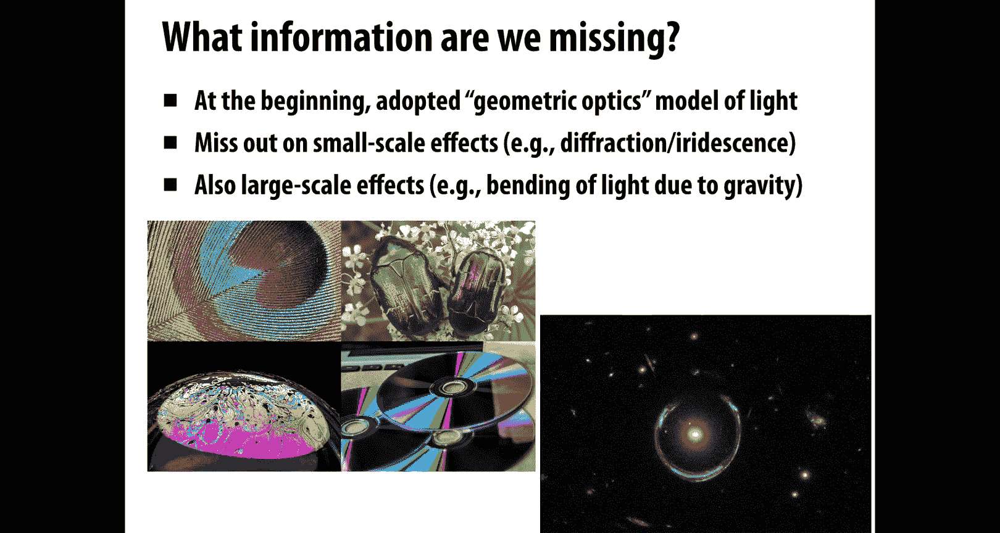

Next time we're going to move towards understanding how light interacts with materials。

So how does it scatter off of objects， how does it scatter through volumes and so forth？Okay。

 and understanding of all of that is going to bring us ever closer to our goal of generating photorealistic images。

So talk to you next time。

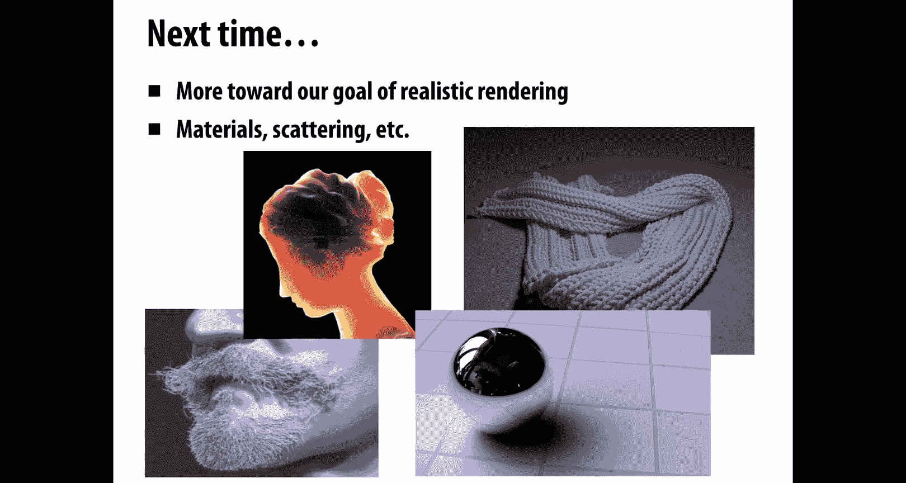