# CMU《计算机图形学｜CMU 15-462  COMPUTER GRAPHICS 2021》中英字幕 p17 -17-Lecture 16_ The Rendering Equation -BV1H3NBemE5E_p17-

Okay， today we're going to bring together a bunch of ideas that we've been talking about for a few lectures now about color and measurement of light and so forth into the equation that's going to let us render photorealistic images。

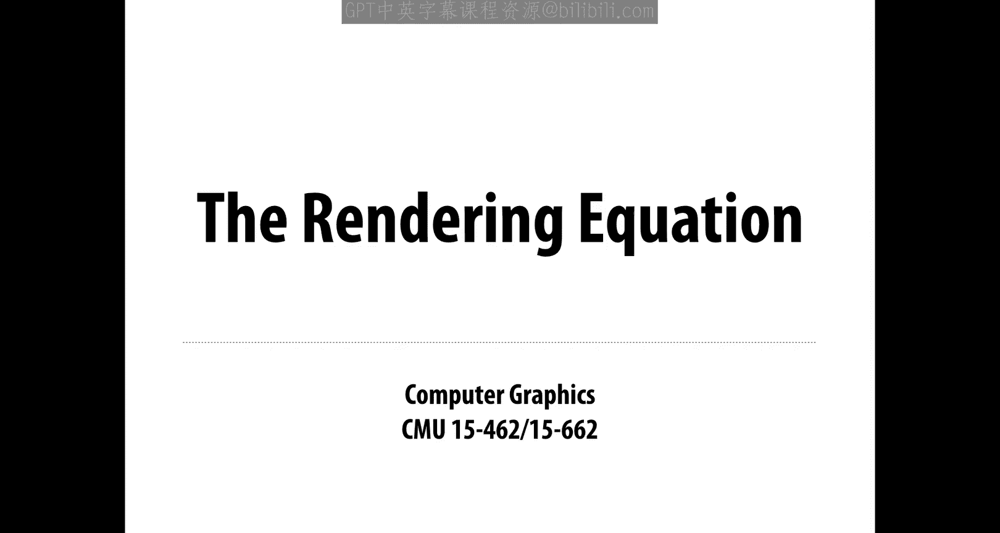

Just to recap a little bit of our discussion about radioometry from last time we had different terms we were talking about。

 The most important one was radiance。 So we said that radiance really captures all of the information about the light in a scene。

 at least the spectral radiance。 So if we know for each point in space in each direction。

 what the color of the light is， then we really know everything about what's going on and we can use that to generate images。

 One important distinction that we made was between incident and accident radiance。

 these are not different physical quantities。 but they're different conventions for how we're referring to radiance in the scene。

 So incident radiance means light coming in。 if you imagine I'm sitting at the corner of the street and I'm looking up at the sky at all the buildings in every direction。

 There's some different incoming color， whereas。If I'm talking about exit radiance。

 I might be thinking about a light source and depending on which direction I'm looking out of the light source。

 I'm shooting light of different amounts and different colors in different directions。In both cases。

 the important idea is that in both cases， the intensity of illumination is highly dependent on direction。

 not just location in space or the moment in time， and what that means when it comes to image generation is that when we want to determine the total illumination at a point。

 we're going to have to consider all the illumination coming into or going out of every direction。

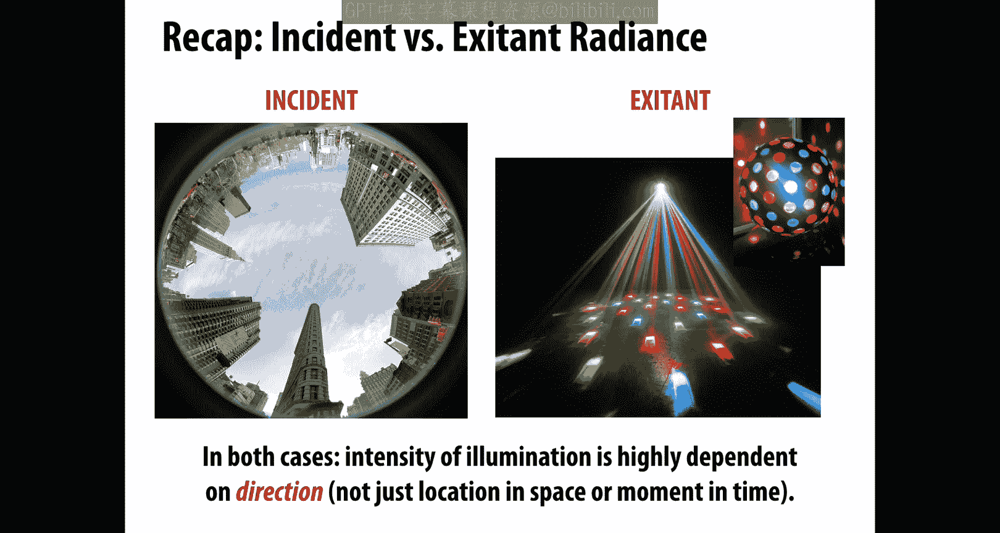

We also made this distinction between radiance and irradiance。 What was the difference there， Well。

 it's exactly this picture of adding up light from different directions to get the overall illumination。

 so in particular， the irradiance E is always going to be the integral of radiance。 for instance。

 if I want to know the total light coming in in that hemisphere looking up at the sky。

 then I'm going to integrate over the hemisphere H2。

 the incident radiance L of omega omega being the incoming direction， cosine theta d omega。

So a little more precisely， what is raddiance， we said radiance at a point P in a direction n or for a surface with normal n is the radiant energy per unit time per solid angle per unit area perpendicular to n。

We want to think about how much radiance comes in some little patch on that hemisphere projected down onto the plane。

So we say that radiance L is the radiant flux phi， meaning energy per unit time。

Per solid angle omega。Per。Projected area a cosine theta。

So a slightly confusing point here is that the cosine here has to do with the way we parameterize the sphere and not Lambert's cosine law。

So this is a confusing thing the first time you look at the equations for photorealistic rendering that this cosine theta shows up for two completely different and unrelated reasons。

 one is for a physical reason due to Lambert's cosine law which says， well。

 if we tilt a little piece of material to the side。

 then we get a beam of the same total energy hitting a area that's slightly larger。

 and so that energy gets spread out over a bigger region and becomes darker。

The other cosine is coming purely from the way that we write down spherical integrals。

 from the way we parameterize the sphere。So if we want to integrate a function f over the sphere S2。

 one way to write that is to integrate over theta and phi， latitude and longitude。

 the function as a function of those two angles， cosine theta， d theta， d phi。

So here the cosine theta term is just accounting for the way we stretched out。

Our domain of integration theta phi over the sphere。Okay。Okay， so。

Coming back to the main question of the day， how do we use all this stuff to actually generate photorealistic images？

And the answer really is given by the so called rendering equation。

So the core functionality of a photorealistic renderer is to estimate the radiance。

Add a given point in a given direction， omega not。The incoming or incident radiance。

How do we write this radiance down Well， it's summed up by this rendering equation。

 which says the radiance。That's observed or that's leaving a point P in a direction omega n。

Is equal to the emitted radiance。At that point， so how much light is actually being generated and being shot out of that point in that same direction？

Plus， the integral over all incoming directions of the incidentci radiance LI。At that point in。Well。

 the incoming direction， the current direction that we're。Integrating over。

We have this cosine theta term， which is just the angle between the incoming direction and the surface normal。

And we have one more term that we haven't talked about yet that's new for today。

 which is this scattering function F sub R。Which says。

How much light that comes in from the direction omega i actually gets reflected back out in the direction mega O。

The key challenge with the equation that the thing that's so hard about solving or evaluating this expression is that it's recursive。

So what you notice is we want on the left side to evaluate the outgoing radiance。

 and in order to do that， we need to be able to evaluate on the right hand side the incoming radiance。

Well， what is the equation that governs the incoming radiance？It's exactly this same equation。

We just get another instance of this equation。But at a different point。In particular。

 at the point we find by tracing that ray backwards until it hits a different point in the scene。So。

 this whole task of。Estimating or computing radiance comes down to recursively evaluating this rendering equation。

 I want to know how much light is going into the eye。Okay， so I follow that ray。 I hit a point。

 Now I want to find out how much light is coming into that point。 Well。

 I look at all the directions above that hemisphere， just like I saw on the city corner。

And for each direction， I ask， what is the radiance for that incoming ray。Well。

 maybe I pick one ray and I say， okay， I follow that back to where it started。And at that point。

 I need to know the radiance and so on。How does this recurrence？Terminate， well。

 eventually I have to hit something that's emitting。

Remember that the ray tracing or the rendering equation has two terms。

 it has the emissive term and this scattering a reflection term。

Our base case is when we just have something emitting like a light bulb。Okay。By the way。

 the fact that this equation is so hard to evaluate and it has to be done recursively and so forth。

 this is why we need to do this by ray tracing。 We couldn't easily do this by running a rasterizer。

A rasterizer gives us very little control over essentially which rays are we evaluating？Okay。

So this is the basic task of a photorealistic renderer is to measure or compute the radance along array。

 at each bounce we want to measure the radiance traveling in the direction opposite the given ray direction。

So it's kind of a little counterintuitive， you'd think， oh。

 we should start at the light and trace particles until they hit the camera。

But since we know where we want our path of light to end up。

 we wanted to end up at a particular pixel， right， we want a color for each pixel。

It really kind of makes sense to do things in the opposite direction。

Trace ray backward through the scene until we hit a light。Okay。Keeping track for each bounce of。

How much light got reflected off a surface？And so that brings us to this new term。

 this new topic for today， which is how does reflection of light affect the outgoing radiance。

 What is the meaning of this scattering term？So at least in our geometric optics model of light transport。

 reflection or scattering is the process by which light that's incident on a surface。

 that's coming in and hitting a surface interacts with the surface。So that it leaves。

The same side of the surface。Meaning it kind of bounces off the surface without changing frequency。

 It's the most basic thing that can happen to light that comes in and hits the surface。

 bounces right off。 It stays the same color。 Nothing funky happens other than it gets reflected。

And the choice of reflection function， what do we use for F sub R。

 that's ultimately going to determine what the appearance of the surface is。

Did we absorb a lot of green light and allow red light to get reflected or vice versa？

In what directions does light get reflected strongly versus what directions will it be absorbed a lot。

 that's going to influence the way that the surface looks so we could get different kinds of materials。

 some of which are illustrated here。Now， one thing to say actually is that this is a simplified model of the way that light behaves。

 as usual， we're sticking with a model of geometric optics。

 So remember in our last lecture we said we want to pick a model for light transport。

That is suitable or is appropriate for。Human level vision of a scene。

I'm talking about macroscopic objects， I'm talking about the way that humans see things。

 I'm not going to account for effects like diffraction， very small scale effects。Okay。

 so its just a simple reflection function。

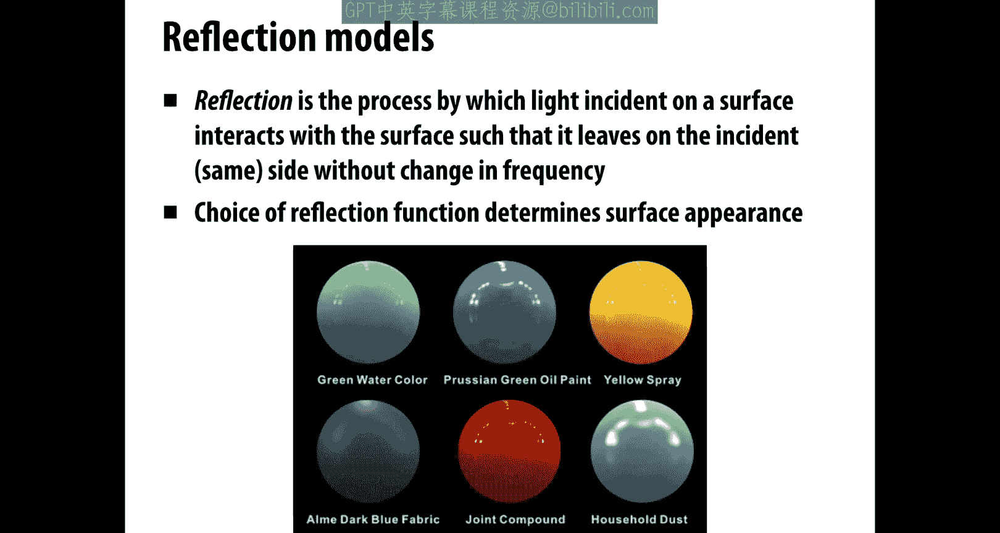

Some basic examples， important examples of reflection functions are shown here。

 so one is what's called a specular reflection， whenever you hear somebody say specular reflection。

 it's safe to think of something like a perfect mirror or a mirrored surface。

The light comes in and it bounces off the surface in a very particular direction。

 the direction that you get by reflecting around the surface normal。

Another very kind of important case is diffuse reflection。

 which means light comes in from some direction。But the direction that it goes out has nothing to do with the direction that it came in。

 it gets scattered equally in all directions。So something like a diffuse paint on the wall or a clay terracotta pot is pretty similar to a diffuse reflection。

And then we have all sorts of things in between。 So you might have a glossy specular reflection。

 which means light comes in in a particular direction。

 And rather than bouncing exactly off the normal， it kind of gets smeared or scattered out in。

A bunch of directions around that specular reflected direction。

So this slightly glossy appearance shows up in things like plastic and actually most real materials are somewhere between these extremes of ideal。

 specular and ideal diffuse。There's also some very funky kind of reflection functions that show up here and there like retroreflective materials。

 so if you have a reflector on the back of your bicycle。

 this is really designed so that if a headlight of a car is shining on the reflector。

 it actually bounces back in the direction that it came from or almost perfectly in the direction that it came from so that that driver knows there's something in front of them。

This same kind of behavior actually happens when you look up at the moon next time you look at the moon。

 you might notice that。It doesn't really look so much like a shaded sphere right We know that the moon is spherical。

 but if you look at this image， it doesn't really get darker around the side。Why is that， well。

 it's because the reflection function is something like a retro reflectlective function。

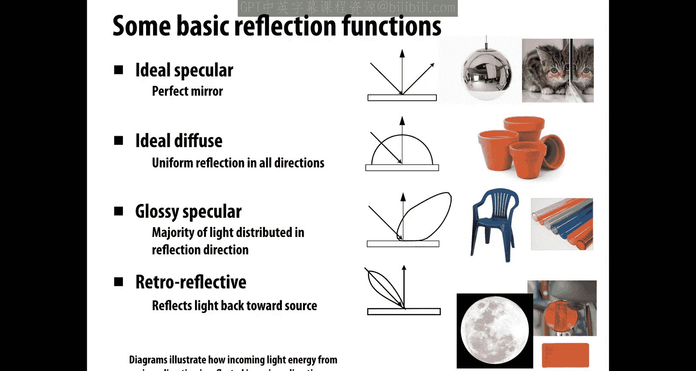

And you get this different appearance。Here's some examples of what these different materials look like on the same surface。

So here we have a teapot and we're showing just a diffuse。Reflectance function。

 so the incoming light gets equally scattered in all directions。It looks very kind of rough。

We can use a material that's a mix of specular and diffuse or somewhere between specular and diffuse。

 and we get this glossy kind of plastic appearance。

We could also control how much light gets absorbed versus reflected in different wavelengths。

 so here we're going to absorb greens and blues and reflect more reds。

 we get this semi glosss red paint。And if you really start playing around with this reflectance function。

 doing funky stuff， you can get interesting appearance that you might have seen on more exotic paints on car paints or something like that。

Finally， if we use a perfect specular reflection。

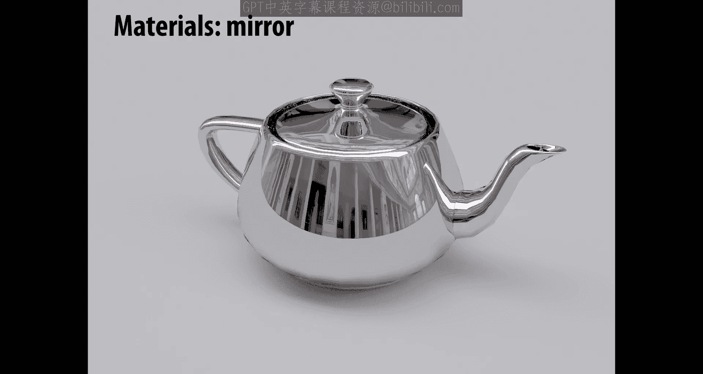

We get this mirrored kind of surface。This super polished surface。And you can go on and on。

Different glossy materials show up like gold or whatever。

So this idea of having a single simple function。That turns input directions into output directions。

 It's kind of a crude approximation。 if you look close up at a real surface， a real material。

 it has a lot of interesting stuff going on you。 why does a surface look the way it does。

 Why do we have glossy materials well maybe at a microscopic level you might have imagine lots of little tiny reflectors that are almost perfect mirrors。

 but they're oriented in kind of random or unpredictable ways？

And that's one way of thinking about what's going on at a much smaller scale。

 why do we get these different appearances of light bouncing off of surfaces？So。

How can we model the scattering of light in general beyond this simple reflectance function， well。

 there's a lot of different things that could happen to a photon。

The thing that we've been talking about so far is we imagine， okay。

 it comes in in some direction it just bounces off the surface。

But it could also get transmitted through the surface。

 This is what happens for a material like glass， the light might go through。More interestingly。

 and what happens with a lot of real materials is that it might bounce around inside the surface for a short amount of time。

 when light hits your skin， for instance， it doesn't immediately bounce off and it doesn't pass through。

 it bounces around inside the skin and then comes out maybe somewhere else。

Also in more exotic materials， it could be absorbed and remitted after some amount of time。

And this is the phenomenon of phosphorescence。And so on。

 there's a lot of interesting things that we can do or different models we can have for scattering。

 even in this geometric optics view of light transport。

One thing that should always be true is that what goes in must come out。

Total energy must be conserved。Right and so for that reason。

 when we start to mathematically model these different types of scattering。

 we're going to want to talk about kind of the probability。

 loosely speaking that a particle arriving from a given direction is scattered in another direction。

 Now， it's not really a probability。Because there's not 100% chance that it leaves the surface。

Some light is usually going to be absorbed。But that's the general idea we want some function that keeps track of。

 given the light that came in， where does it go out？

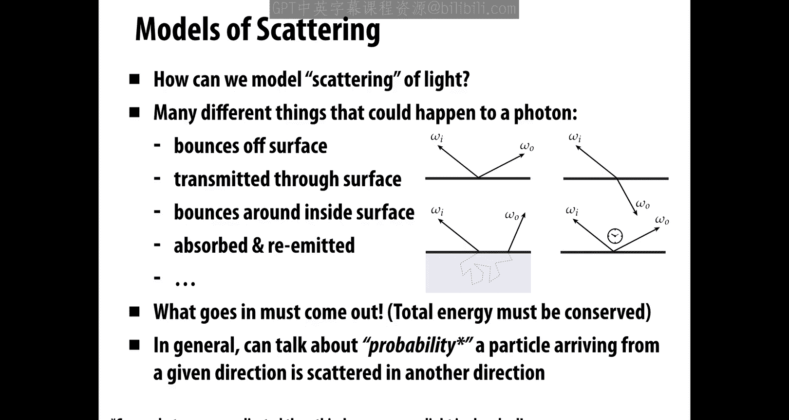

Here's a good mental model for thinking about what happens with scattering。

So if I imagine that I'm a little bug on the ground。

 I can consider the view of the scene from this point， I can look up。

 and here's what I see you can see in the upper left part of this little image is actually the back tire of the car。

 maybe you can see the tailpipe in the bottom and so forth。And so we can think about。

What do different scattering functions do to this incident？Radance。This is L sub I。

 the incident radiance。 What does the exit radiance look like Well， if we have a perfectly。

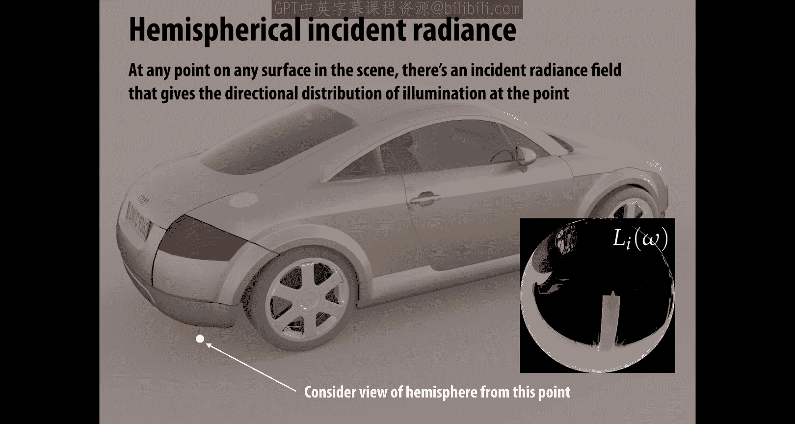

Diffus reflection。Then this incident raddiance is going to get sent out uniformly across all outgoing directions。

 it's going to kind of get averaged or blurred into all these outgoing directions。On the other hand。

 if we have a specular reflection， we get an name like this。RightThe incident radiance。

In a particular direction， goes out in a very special direction， the reflected direction。

And so the only thing you notice that happens here is the image kind of gets flipped。

Just due to bouncing off the mirror。If we have a material that's somewhere between ideal。

 specular and ideal diffuse， then this would be kind of the mental model， the incoming。

Radance gets blurred out a little bit， it gets flipped and it gets sent back out again。

If we have something that has some color to it。It might look like this， okay， it comes in。

 it gets flipped around， it gets blurred， and it gets sent out。

 but different amounts in different wavelengths。

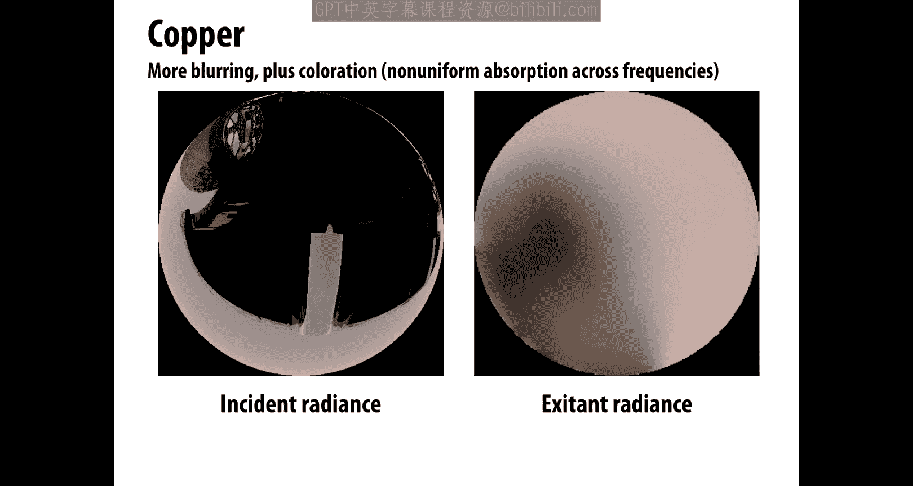

How do we describe this reflectance function where we have something called the BRDF or the bidirectional Refance distribution function？

And what this does is it encodes the behavior of light that bounces off the surface。

 so given the incoming direction omega I， how much light gets scattered in any given outgoing direction。

 omega O。We're going to describe this as our function F sub R。

And just to make it clear what's the incoming and outgoing direction will sometimes write it with this little arrow。

Okay。Here's a pretty good way of visualizing what this function describes or what it looks like。

 so if we have a green incoming direction。Then we have a lobe of possible outgoing directions。

 so these are all the different directions that incom that incoming radiance might get scattered out。

 and you can see that in different directions it has bigger or smaller magnitudes。

So we describe this as a distribution。Which is non negative at every for every pair of incoming and outgoing directions。

 and which integrates to no bigger than one over the whole hemisphere。Why less than or equal to one。

 Where did the rest of the energy go， Why is it that some light can come in but not leave。

We know from physics that energy is never created or destroyed。

 so shouldn't this always be exactly equal to one？And the answer is no。

 because some of that light doesn't leave as light， it might get translated into heat。

So remember we said heat is really just kinetic energy of little particles jiggling at an atomic scale。

And that's why things get hot in the summer。 If you have black leather seats in your car in the summer。

 the light's going to come through the window and rather than getting absorbed by the seats。

 I'm sorry， rather than getting reflected， it's going to get absorbed and the little particles are going to start jiggling and that's why when you open up the door and sit down。

 it's hot。Rg。So that's why we only ask that the reflectance function be bounded by one。

Another thing that is always true about these scattering functions is they have a certain symmetry。

So if I know the。Kind of amount of light that gets scattered in the direction Oomega， not。

From coming in in the direction mega I， well， then that's going to be equal to how much light gets scattered out in the direction omega I if it came in from the direction omega O。

Why should that be true， why should we get this symmetry or what's called helmholt's reciprocity？

Well， think back to that idea of at a very， very small scale。

 every material being made up by little mirrors。That's the basic intuition to understand why helmhol's reciprocity works。

So far， our discussion of scattering oms any discussion of units， but that's pretty easy to work out。

Basically， we can just say， well for given change in the incident irradiance。

 how much does the exit radiance change？And just working through the units。

 we find that we get one over stadians。Okay。So as a concrete example。

 let's consider a Laberian reflection。Again， assuming that light is equally likely to be reflected in each output direction。

Okay。Well， then to evaluate the outgoing radiance L O in a particular direction， omega O。

 we integrate over the hemisphere。The scattering function F R times the incident radiance L I in the current direction。

 omega I times the cosine of the angle theta between。Omega I and the normal。

Because a Lamberian reflection is uniform because it has the same amount of scattering in every direction。

 this function FR doesn't depend on mega I or mega O， so we can just pull it out of the integral。Ri。

And what we're left with is just that constant， this constant reflection。

 basically how bright the surface is。Times an integral。That's just giving us the irraance E。

The integral of incident radiance over the whole hemisphere is the ir radiance。

There's a common name for the brightness factor， which is the albedo。

 so because we want to think in units between0 and 1 or values between0 and 1 to talk about how much got absorbed or scattered。

We can。Say that FR is rh over pi， just normalizing by the area of the hemisphere。

Here's a nice photograph illustrating the example of perfect specular reflection。

 So we're shooting this beam of light in， hitting this mirrored surface。And we see。

This beam of light coming out in this direction it looks。Symsymmetric in some way。

 So what exactly is the direction of specular reflection。Well。

 we can express it in two different ways if we want to think about angles。

Then we can think about two angles， one theta， the angle made with the normal。Yinde。

Planin of reflection。 So if we consider the plane spanned by the normal and the incoming direction。

 we have this this angle theta to consider and if we view this same reflection from above。

Then we can talk about this angle phi， kind of the angle around the plane。Okay。

 so for a speculular reflection。In this side view， theta I and theta O。

 the incoming and outgoing angle are going to be the same。

 We want them to make the same angle with a normal。How do we distinguish between the two。

 Well the angle around the plane phi is going to be opposite P out is equal to minus V in。

Another way to write this is just in terms of the vectors。

 if we think now of omega O and omega I as the incoming and outgoing unit vector。

Then you can work with this little picture and discover that omega O is equal to minus omega i plus 2 times omega i dot n times n。

One way to work that out is just figure out what do I need to subtract from omega I to project it onto the normal direction N and then subtract that again。

 and that'll give you your reflected direction。In terms of the actual scattering function F sub R。

 we could write the specular reflection BRDF down like this。

So we could say as a function of the input and output angles theta and phi。F of R is equal to。

Something involving the Dak Delta。So the directak Delta is。Kind of like an indicator function。

 what it's going to do is if I give it a value that's non zero， it's going to be equal to 0。

If I give it a value that's zero， well， it's going to kind of be infinite。

And so in terms of probability， what we're saying is there's only a chance that we're going to scatter if these angles are the same。

 if theta and phi are the same， or at least theta is the same in its cosine。Okay。Strictly speaking。

 F sub R is not a function， but it's a distribution， it's a probability distribution。In practice。

Because this specular reflection distribution has this very singular behavior。

 there's no hope of finding it by just sending in ray and then saying， okay。

 I'm going to pick some random direction and see how much light gets transported along that direction right we really should just only consider the specular reflected direction。

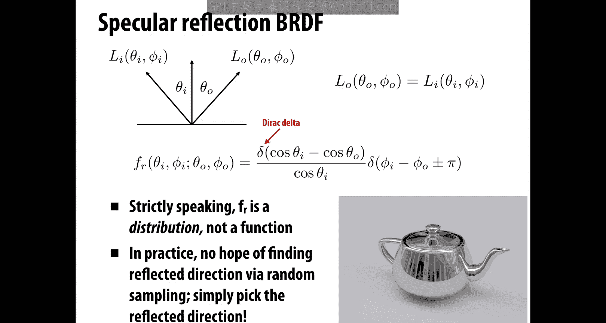

As we discussed before， in addition to reflecting off a surface。

 light might also be transmitted through a surface。

Which is what happens with glass and water and so forth。

 and one important thing that happens is that it doesn't go straight through。

 but it generally refracts when it enters the new medium。 So if I'm going from air into water。

 I'm going to deviate indirect a little bit。

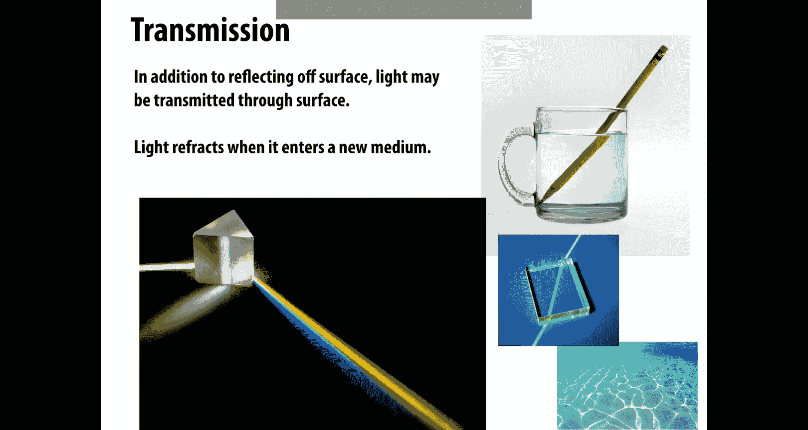

In this case， the new direction can be determined by what's called Snell's law。

 which you might have seen in your physics class， the transmitted angle depends on the relative index of refraction of the materials the ray is entering or leaving。

So basically。Different materials have different densities， air is not as dense as water。

And so as I go from one medium into the other， I get this refraction event。

You can see on the right here the index of refraction for different materials。

And generally when we're doing computer graphics， a pretty reasonable assumption is that light is traveling through a vacuum。

 you can see that air at sea level is not so different from vacuum。Okay， so in particular。

 if we want to figure out the relationship between the incoming and outgoing angles。

We have this equation at the bottom， theta I is the index of refraction of the incoming ray。

 Eta T is the index of refraction of the transmitted ray。

 theta I and theta T are the corresponding angles made within normal。

And so depending on whether we're coming in or going out， we can use this law， Ss law。

 to determine the refracactive direction。The other angle fee just stays the same。Now。

 an important thing to realize is though we keep drawing these pictures of light getting transmitted and passing through a surface。

 Snell's law actually tells us that something else can happen。

So if we work through what happens with the cosine of the angle， kind of the x component。

Then actually in some situations， if we're traveling from a more optically dense medium to a less optically dense medium right from water back into air。

Then it's possible that light incident on the surface from a large enough angle might not exit the medium。

In other words， instead of getting refracted or transmitted through the surface。

 it's going to bounce off， it's going to behave more like a specular reflection。

And you can see this phenomenon， for instance， if you're diving under the ocean。

 you can look up and you'll just see this kind of cone of directions where you can see through the surface of the water。

All the rest of the light is getting reflected back down。

 and so if there's no light sources underneath the water。

 you get this kind of dark shadow on the outside。There are lots of other optical phenomena to account for when thinking about the behavior of real light。

For instance， in a lot of real materials， reflectance is going to increase with the viewing angle。

 so something that you kind of want to model in your scattering function。

A great example where all these different phenomena that come together is again。

 if you're out on the ocean and you kind of see look on the horizon。

 it looks like you have a perfect mirror。That's reflecting the sky。Or the trees up close。

Where you don't have this grazing angle， you have something that looks just like。

Ordinary kind of transmitted light lights going through and getting refracted and maybe magnifying a little bit the things that you're seeing under the water。

And likewise， when you generate synthetic images， it really becomes apparent if you have or if you're missing these phenomena。

 so here's an example of two glass spheres or we're trying to render glass spheres sitting on this this kind of crisscross pattern on the ground。

 this is without this finall reflection。Just fixed reflectance and transmission that doesn't depend on angle in any way。

 And here's the glass with the fernel reflection。 So it can make a really big difference in the appearance and the realism of your materials。

Another thing that's extremely common in real materials is that reflection is anisotropic。

 so it depends on the aziuthyl angleist angle phi。And you see this really strongly in things like brushed metals。

 so if you look at a polished doork knob or a tea kettle。

 you see this kind of orientation of features on the surface。To do this in a renderer。

 to do this in a synthetic image， what that means is you actually have to decide or determine which directions should be these directions of anisotroppy。

And that's something， for instance， you can bake into a texture map。

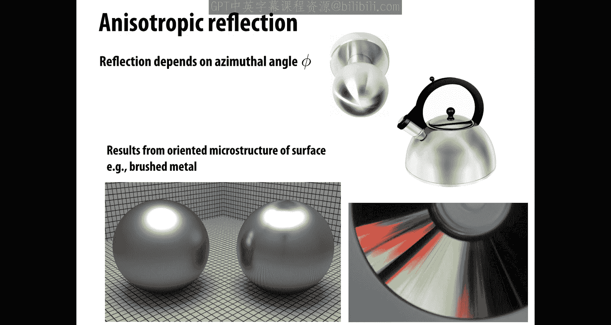

Okay， as we start to look around the world at more and more materials。

 we noticed that this idea of light just coming in and then bouncing off or coming in and getting transmitted through that same point is really not sufficient to capture a lot of real world appearance。

 So here for instance， is some thin jade。Kind of sculpture。

And you notice there's this kind of blurring of light as it passes through the surface。

 This same kind of thing shows up when you look at skin。

Another good example is if you look at somebody's ear that's lit from behind。

 it'll actually look red because you'll see kind of the color of the blood and the ear shining through。

 or if you look at leaves， there's this kind of translucent material appearance。

How do we model this kind of appearance？With a scattering function。

What we're really talking about here is the phenomenon of subsurface scattering。

The visual characteristics of many surfaces is caused by light entering at some point and then bouncing around inside the material and then leaving at a different point。

This idea so far violates a fundamental assumption about R。

Biodirectional reflectance distribution function。Namely， that。

RightThe light coming in at that point goes out at that same point。

 so we need to generalize our scattering model to handle these more complex phenomena and talk now about a BSSRDF。

 a bidirectional subsurface reflection distribution function。

And here's that example of the ear that I was talking about。

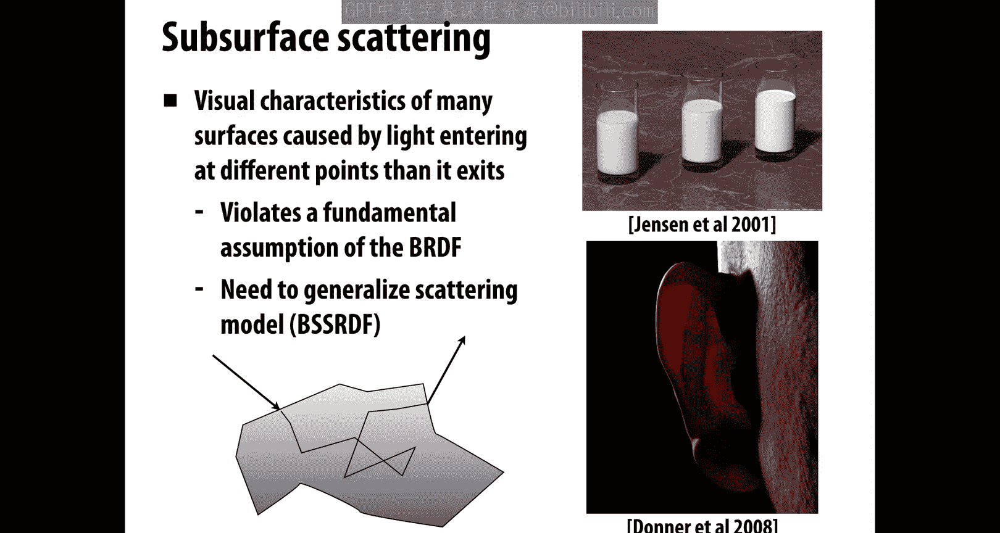

Okay， so we can generalize the BRDF。To describe the exit radiance at one point due to incident。

Differential irradiance at another point。We have a function S now instead of f sub R。

That has four arguments instead of two， it has now the input or the incident point x sub I。

 the incident direction omega sub i， the incident or the outgoing point x sub O and the outgoing direction mega sub O。

Okay。Now to write down the reflection equation。This term in the rendering equation that accounts for how does light get scattered。

 we have to integrate not only over the hemisphere。

 but we now have to integrate over the entire surface。Right， we have to say。

The light coming out from some direction is， well， we integrate over all positions on the surface and all hemispheres around all those positions。

 the incoming radiance times this。BS S RDF。That sounds really hard， right， We have to do this really。

 you know， multidimensional integral over very complicated geometry。

 So things just if you start to think about what it would take to compute this。

 things started to get really expensive。

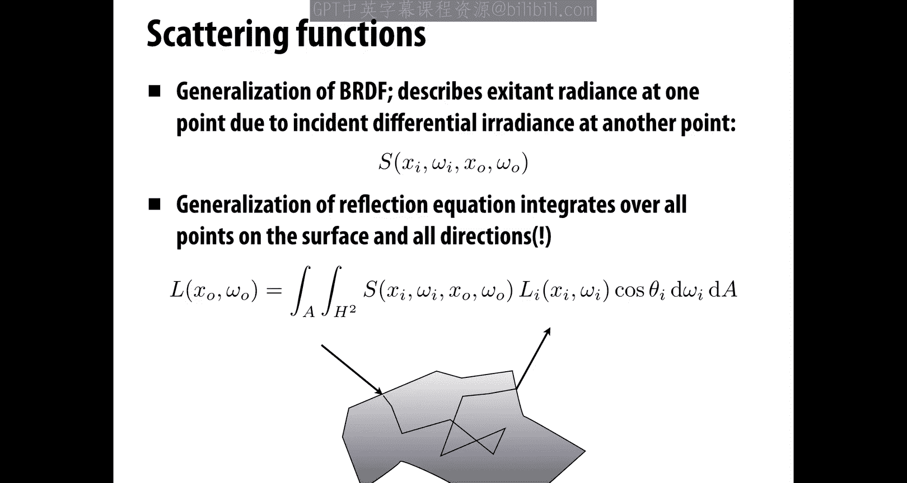

Okay but they do pay off， so here's a side by side example of what happens if you have a BRDF we're trying to capture the appearance of in this case。

 a marble statue。And this is lit strongly from the side。

 and here's our BSS RDF and you notice the second one really， this is a synthesized image， of course。

 you notice the second one is much more realistic than the first。

So this is a phenomenon worth capturing。Okay， and we're not going to get into all the details right now of how do we handle all these different scattering functions。

 but the point to get across here is that scattering is really complicated。

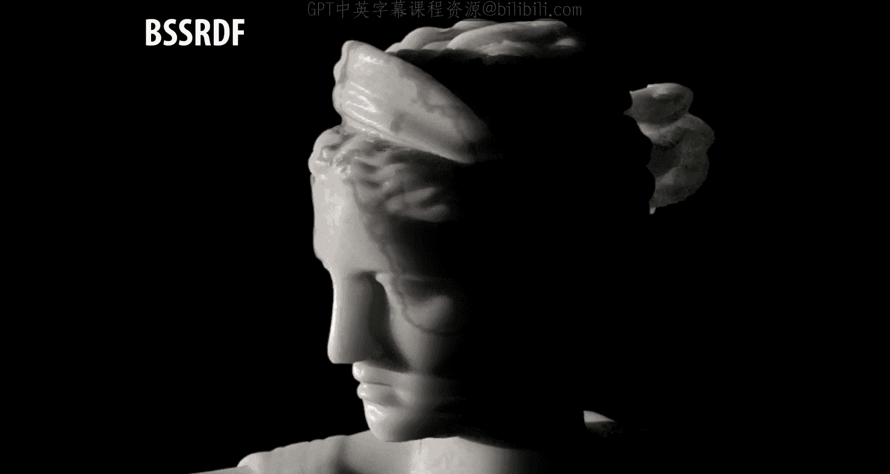

This one little term， this one little function inside of our rendering equation is itself opening up a whole can of worms。

And so we should ask， well， what's a relatively simple algorithm that we can use to capture a lot of this behavior？

Well， let's go back to our reflection equation。So basically the rendering equation without immissivity。

Which says。Again， the light or the radiance reflected in the direction of omega R。

At a point P is the integral over the hemisphere H。

Squared or H2 of the scattering function times the incident raddiance cosine theta d omega。Okay。So。

This is really a key piece， this is kind of the key piece of the overall rendering equation。

And the way we're going to approximate this numerically or computationally is to use a technique called Monte Carlo integration。

 In fact， we're going to spend the whole lecture next time talking about Monte Carlo integration。

So in the context of the rendering equation， the way this works is we're going to randomly sample directions。

 some number n of directions， omega J from some probability distribution， for instance。

 we could just pick them uniformly at random from the hemisphere。

And then we're going to estimate this integral， the reflection equation。

By just evaluating the integr。At these random directions。And then taking the average。

So that's what this sum on the bottom says。We're gonna do the。

Some from J equals 1 up to n of the scattering function applied to our random direction times the incident radiance coming from our random direction times cosine theta。

Divided by probability， and then take the average divide by M。

This estimate is not going to be perfect。 right， The more samples we take。

 the better it's going to approximate the actual。Outgoing radiance and so there's going to be lots of techniques that we'll use to reduce the error or the variance in this estimate。

 for instance we could make this probability kind of match up with the shape of our scattereding function so that we're measuring more of the integr in regions where there's likely to be a lot of scattered light。

Here's a little bit of sort of pseudocode of what the algorithm for estimating the reflection term in the rendering equation might look like。

So we're going to assume that we have a ray that hits the surface at a point， hit P。

We're going to assume that the normal of the surface at this hit point is hit N。

And we want to know the radiance in the outgoing direction， W R， which is the opposite of the。

Ray direction。And then we're going to sum up， so we're going to just keep a running total L of R。

 which is a spectrum， it's something that keeps track of the intensity in different。Wavvelengths。

 right， so we're going to sum up over our N Monte Carlo samples。

The first thing that we do is we generate a。Sample a random direction。

To represent the incoming direction。Then， we evaluate the。

Scattering function for that randomly sampled incoming direction and our desired outgoing direction。

Okay， and then here is the critical step。 this is really what makes rendering or photorealistic rendering hard is how do we get this term LI。

 the incident radiance？Well， we have no idea。How much light this random incoming ray is carrying other than two。

Recursively call the subroutine。That does this same estimation。

And so what we're going to do is we're going to trace array。

In this incoming direction or back along this incoming direction。

It's going to hit a point in the scene。And then， we're gonna。

Run this same routine to estimate the radiance for that direction。Okay， once we have that estimate。

 once that recursive。Call terminates and returns a value。 we can finally add to our running total LR。

 the value of the scattering function for this pair of directions times our estimate for the incident radiance。

Times the cosine of the angle， and then divided by the probability that we used to sample this incoming direction。

Some of this might be a little bit mysterious right now and why are we dividing by the probability。

 we'll talk about that in detail next time。Okay。Okay。

 so now that we know how to handle this this most complicated term， the reflection term。

How do we solve the full rendering equation？Well， a key idea in rendering is to take advantage of special knowledge to break up integration into easier components。

And this leads us to the idea of path tracing really to the first algorithm for that we're going to use for。

Solving or approximating the solution to the rendering equation。

So the basic idea is to partition the rendering equation into direct and indirect illumination。Right。

Indirect illumination meaning light that we get from many， many bounces。

Whereas direct illumination is。The illumination we get from light hitting the surface。

 and then that's what we see from the eye。And we can use the same random sampling strategy。

 this Monte Carlo sampling strategy to estimate each piece of this equation separately so we can。

 for instance， say okay， we're going to use one sample for each term in this equation。

Maybe we'll be doing hundreds of samples per pixel so that any error kind of averages out。

And we're also going to have to think about， well， what about paths that never terminate。

 what about light that just keeps bouncing around forever and never hits a light source。

We can deal with that by just kind of cutting it short at some point now we can do that in a careful way so that we still get on average the right image。

Okay， so that gives a rough sketch of pass tracing we'll really get into this more as we go on just to give a sense of what these different terms contribute to the image。

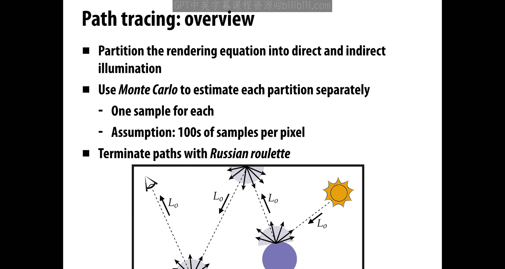

Right， here's an image of。Two spheres， one that has a perfectly specular surface， a mirrored surface。

 one that has a transmissive surface， something that has a。

Kind of refraction and if they're sitting under this area light source on the top。

And what we're visualizing here is just the direct illumination plus reflection and transparency。

We can now add in paths that come from our recursive rendering equation from following the light around the scene or the ray around the scene until it hits a light source。

 And what you see is this indirect illumination， really。

 really is important for capturing the realism of the scene。 If you don't have this in there。

 It looks way too dark。 It looks really synthetic。 It looks like computer graphics。 If you。

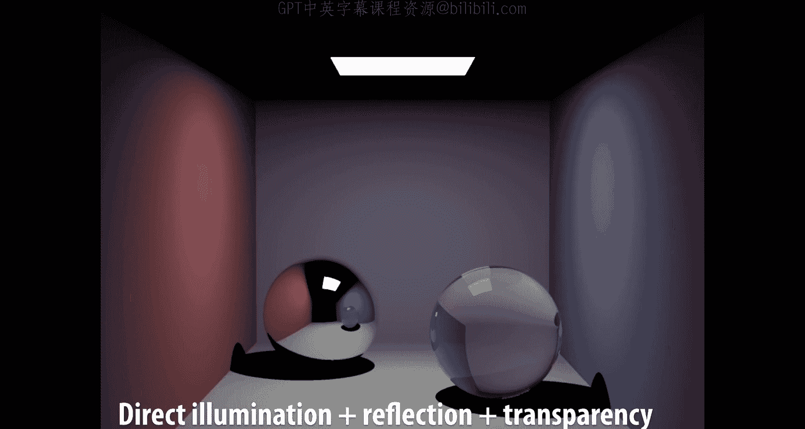

Add all these pads in， it looks more like a photograph。It becomes easier to fool the eye。Okay。

 so that's why we go to all the trouble of adding these secondary and tertiary paths into the equation and why it's really important to say。

 well， you know， rasterization is cool， it's really fast。

 but it doesn't get us to this level of realism。So next time we're going to talk in greater detail about this process of Monte Carlo integration。

 how do we estimate an integral by adding up a bunch of random samples and how do we apply that to our rendering equation？

All right。 Talk to you next time。

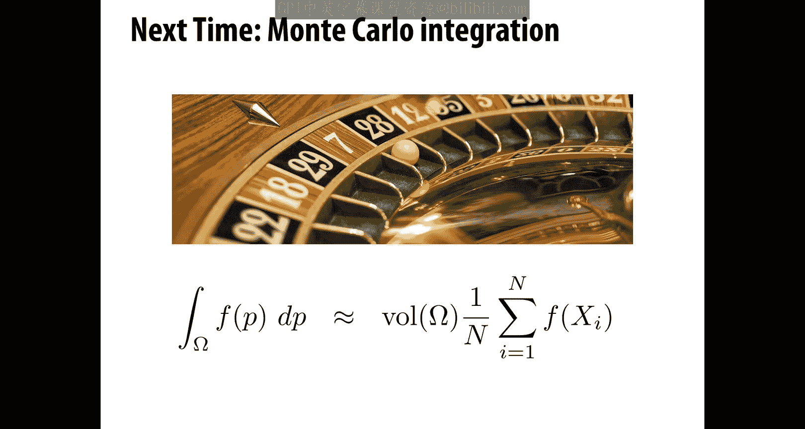