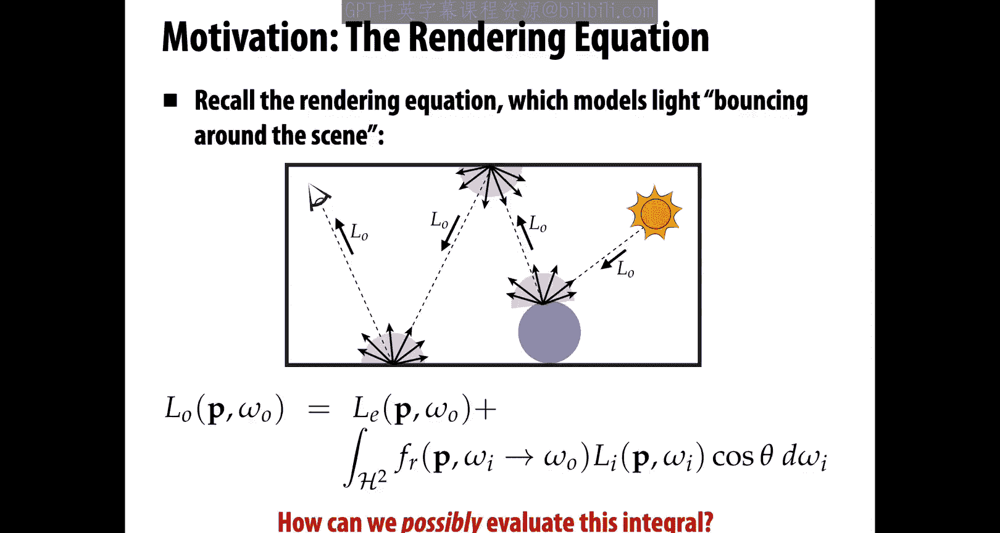
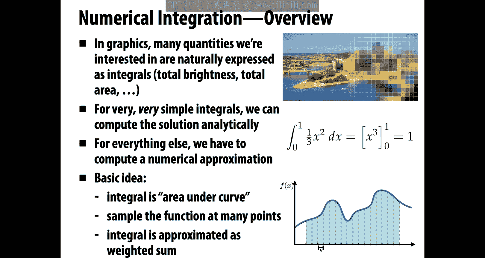
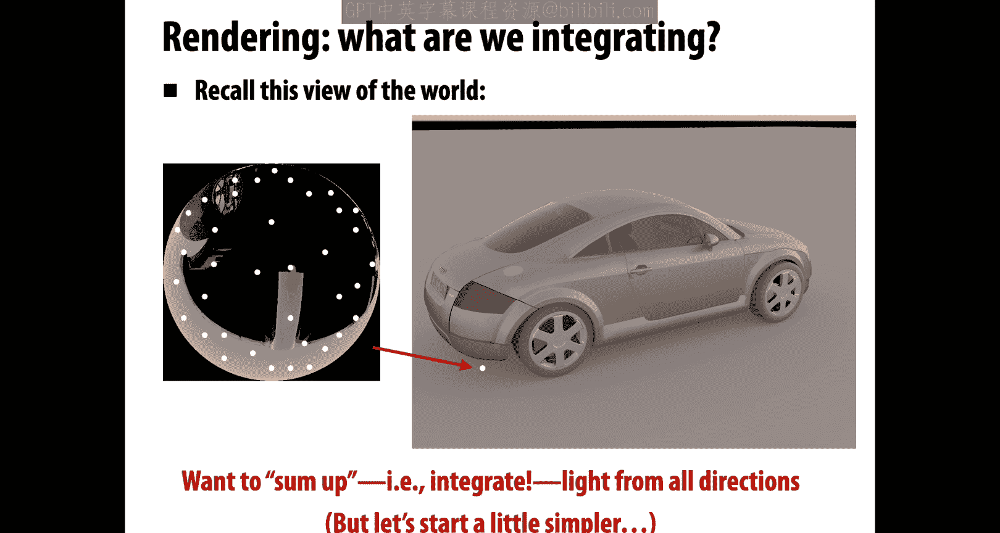
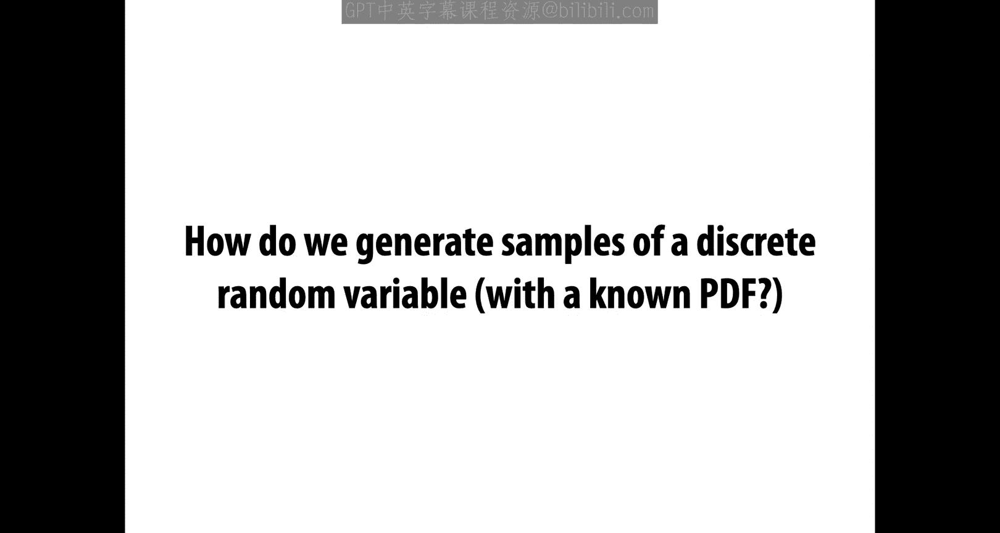
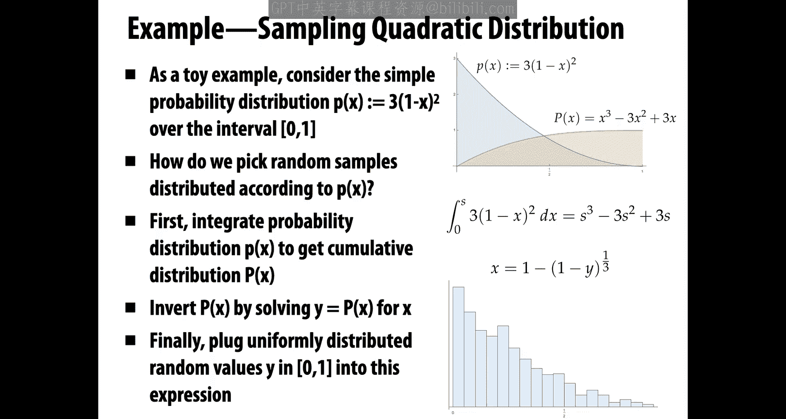
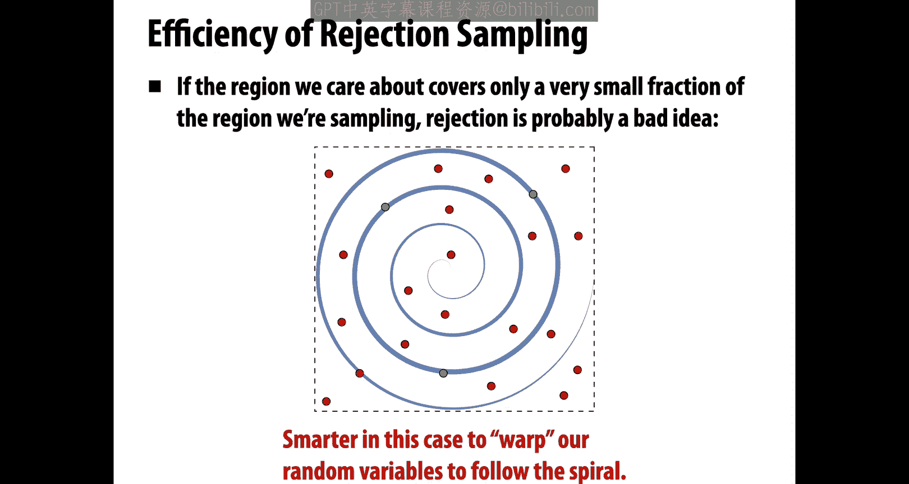

# CMU《计算机图形学｜CMU 15-462  COMPUTER GRAPHICS 2021》中英字幕 p18 -18-Lecture 17_ Numerical Integration -BV1H3NBemE5E_p18-

Okay， welcome back to computer graphics today we're going to talk about a extremely important subject not only in computer graphics but across lots of different areas of computer science and scientific computing。

 which is numerical integration。Our motivation of course。

 is going to come from an important problem in computer graphics that we've been talking about these last few lectures。

 which is photorealistic rendering， so last time we talked specifically about the rendering equation which is the basic thing that's going to let us model essentially how light bounces around a scene in order to generate an image。

And the thing that we saw with the rendering equation is that it's a recursive integral equation。

So to determine how much light or radiance is coming out of a 0 p in a direction omega n。

 we're going to have to integrate over all incoming directions， omega i。Right。

And in general， in graphics， many of the quantities that we're interested in are naturally expressed as integrals We might be talking about the total brightness。

As we do in rendering， we might be talking about even in imaging。

 the total brightness hitting a pixel， we might be talking about total area， total curvature。

 just something that comes up over and over again is this need to compute the total quantity of some complicated function。

So for very， very simple integrals like the ones you studied in your calculus class。

 we can compute the solution analytically， if I give you something as simple as a polynomial 13 x squared。

 hopefully you remember how to integrate that in closed form。

What you discover very quickly when you start doing real problems in computer graphics。

 computer vision， in scientific computing， simulation and so forth。

 you'll find that most integrals cannot be integrated in this way。

 there either are no closed form expressions for the integral or they're so ridiculously hard to come up with or write down that it's not worth the trouble so for everything else。

We have to compute some kind of numerical approximation。This is especially true。

 actually if some of the terms integrals come from data。

 then there definitely won't be a closed form expression for the integral。Okay。

So how do we numerically approximate integrals， well actually all we have to do is go back to the definition of an integral。

We said conceptually an integral is the area under the curve that we're integrating。

The way that we got our hands on this area in calculus was to chop it up into intervals。

 chop it up into these columns， and kind of add up the area of each little column。

As the columns get skinnier and skinnier， we get a better approximation to the integral。

 leading to our definition。In fact。This is what we're going to do numerically。

 we're going to sample the function that we want to integrate at a bunch of points and then express the integral as a weighted sum of these。

Columns by the values of the function at each point。So we approximate the integral by awaited sum。

Now one thing it really gets really easy to get lost about when it comes back to rendering right we're used to looking at this picture when we talking about integrals we're used to looking at these pictures of a function on the real axis and it's easy to think about the area under the curve when it comes to rendering what are we integrating what is the area under the curve Well actually that's not the greatest way to think thinking about area not the greatest way to think about integration and rendering again we can come back instead to this picture of sitting at a point on the ground here we're sitting at a point underneath this car and looking up and seeing that there's light coming in from different directions in different quantities。

And we just want to know what is the total arriving light， or really we want the total。

Incident radiance。And then we're going to modulate it by our scattering function right so we want to sum up light from all directions。

 that's why we need to do an integral。Okay。But before getting into this rather complicated integral。

 let's start a little simple。 Let's go back to our picture of。

Functions on the real line。And we remember again that the integral is the area under the curve。

 so if we integrate from a to B， the function f of x， we just care about this blue region。

 we don't care about the area to the left of A or to the right of B。Another good way。

 another helpful way of thinking about an integral， just slightly different。

 rather than thinking about this as the area under the curve。

 we could think about this as the average value of the function over the interval from A to B times the size。

Of the domain times B minus a。Why is that an equivalent quantity。Basically。

 we're saying the area of a rectangle whose base length is b minus a and whose height is equal to the mean of f is the same as the area under the curve。

You can imagine chopping off the pieces of the function that are sticking above this dashed line and filling in the holes below the dashed line。

Right。So when it comes to numerical procedures， sometimes it's easier to think about adding a bunch of values up。

 taking their average and then multiplying by the size of the domain to get the integral。

An important thing we'll need to recall to talk about integration is the fundamental theorem of calculus and this theorem is so fundamental。

 so kind of。Straightfor in a way that people forget what it is。

 So what does the fundamental theorem of calculus say， it just says。In essence。

If I integrate the derivative of a function。Then the value at。

The end minus the value at the beginning is the integral。Because。

What I did was I said how much total change did I experience？Going from A to B。

Right what was my total increase or decrease in value as I went from A to B， It doesn't matter。

What I did in between。It doesn't matter if I had some little wiggles that went up or little wiggles that went down。

All that matters is what is the total amount of change I experienced。

 and of course that's going to be the same as the ending value minus the starting value。

Okay so hopefully you caught that in your calculus class。

 a very simple case of integration is we want to just integrate a constant function。

So we want to integrate from A to B， some constant C with respect to X。

And what is this integral equal to？Well， just the area of this rectangle， right， B minus a times C。

A littlettle more interesting is an aine function。F of x equals cx plus d。

And just remember for a moment， we made earlier on the distinction between linear functions and affine functions。

Even though this function has a graph that looks like a line。

 we don't call it a linear function because it has this plus D term。

So we don't get the basic property of linear functions that f of x plus f of y is equal to f of x plus y。

Okay。But we may use these words a little bit interchangeably as we start talking about piecewise affene and piecewise linear functions those are usually meant to be the same thing。

Okay， so anyway we have this aine function， f of x equals c x plus D。

 we want to compute the area under the curve， we want to compute this blue region。And。

One thing that's really nice about Aine functions is that we can compute the integral by just sampling the function at a single point。

We only need to know the value of the function at a single point if we know it's Eine。

Why is that true， well we can think again about this story of the average value times the size of the domain for an aine function。

 the average value is always going to be the value that the function takes halfway between the two endpoints。

So the average value of f between A and B is just1/2 f of a plus F of B。

Which means our integral is equal to1/2 f of a plus F of b times b minus a。Okay。

And we can keep going。How do we integrate， for instance， more general polynomials， say。

 let's say we had quadratic polynomials or cubic polynomials？

Is there an easy way to get this integral， It was super easy with a constant function。

 We just multiply the constant by the size of the domain。 It was super easy with an aine function。

 We just take the value at the midpoint times the size of the domain。What about for polynomials。

 I mean， certainly we can sit down and write out the rules that we knew。

Or that we learned in calculus for integrating polynomials。

But what's our final algorithmic procedure for getting our hands on this integral？Well。

 there's actually a very nice strategy。Which there's no reason you would have seen in your calculus class。

 but it's quite useful it's called Gaus quadriature。

And it says that for a polynomial of any degree n， we can always obtain the exact integral of the polynomial by sampling the function at a special set of n points and taking a weighted combination。

So we already saw the first instance of this， which is。

Integrating a degree1 polynomial and aine function， where we have a special point at the midpoint。

 We evaluate the function there， and we take a weighted。Some in this case。

 the weight is just one times that average value times the size of the domain。

For higher degree polynomials， these points have more complicated expressions。

 but you can always use them to get the exact value of the integral。

And so this is our first instance of what's called a quadture rule。

A strategy for approximating a function by sampling it at a finite set of points。

 taking a weighted combination of those sample values。And adding them up。For Gaus quadature。

 if we're integrating polynomials， it won't be an approximation， it'll be the exact result。

But in general， we might approximate an integral by sampling it at some points and adding up the values。

Okay， let's move on to another very interesting kind of function， which is a piecewise Aine function。

Peacewise a fine just means over。Little sub intervals， the function is a fine。

 so in this picture we have a function f of x， which is an aine function if you restrict it to the interval between x0 and x1。

 it's a different aine function if you restrict it to x1 to x2 and so on。OkayHow would we integrate？

This function， this piecewise function。This time around， it seems like a pretty bad idea。

To just use a single point somewhere in the middle。

Right because we're going to miss out on all sorts of important information about this function。

We're going to have under sampling。RightAnd in a sense， we're going to get error or。

In our previous discussions， we called this aliasing。So what's the smarter thing we can do here？Okay。

 hopefully it doesn't take too big of a leap to see。That for a piecewise function。

 for piecewise I function， we can just sum up the integral of each piece。

Just think of these in this case as four separate integrals。

Well that's particularly nice in this case because we have a perfect rule。

 perfect quadraature rule for integrating aine functions， we just grab the value at the midpoint。

So f of Xi plus f of  Xi plus 1。Divided by2。And we multiply by the size of that little interval。

Xi plus 1 minus X。Okay， so one thing you could very easily do with this sum now is just write it。As。

A bunch of weights， times， sample values。If I expand out this sum。

 if I multiply out the term in the sumand。I'm going to get Xi plus 1 times f of Xi plus Xi plus 1 times f of X i plus1 and so forth。

And in the end， all I have is a sum。Over some sample values。

 F evaluated at certain points of the domain。Times some weights。In this case。

 weights that have to do with where the endpoints of the intervals are and the factor 12。Okay。

So the key idea so far is that whenever we want to approximate an integral。

We're going to need two pieces of information。We need to know what are the quadraature points。

 where do we want to sample the function？And two， what are the weights that we associate with these sample values。

 how much does each value contribute to our final integral estimate？Importantly。

These weights and sample points are， of course， not arbitrary。

 if I just pick completely bizarre weights and。Completely arbitrary locations for the samples。

 there's no reason that this must approximate the integral。

OkayBut there are some simple strategies we can use to come up with these quadraature points and associated weights。

So far， we've done that by assuming very specific forms of the function that we know how to integrate exactly。

But what do we do if we now want to integrate an arbitrary function f of x， it's not constant。

 it's not a fine， it's not polynomial， in fact。You can imagine you don't even know what form it takes。

Somebody's just handed you a black box function F of x。You don't get to see how it's implemented。

 you don't get to know what algebraic expression it corresponds to。

 but you still want to integrate it。Well， first of all。

 it's pretty cool that we're going to be able to do that。

 That's definitely not something you could do in your calculus class。 In your calculus class。

 you had to know what the function F of x looks like in order to。😊，Get its integral。Nummerically。

 computationally， we don't need to know， we just need to know the values of F at different points。

Okay， so how specifically can we do this integral， well， here's one possibility。Which is， we can say。

 well， I don't know exactly。How to integrate this function。

 but I can always approximate it by a piecewise a function。

I can always pretend that the function I'm integrating is pieceYs Eine。How do I do that？ Well。

 I just pick some intervals。And I sample the function at the endpoints of the intervals。

I connect those sampled values by。Straight lines， I use an aine function that interpolates those two values。

 and then I apply my integration rule for piecewise eine functions。So for instance。

 if five equal length segments， every interval has size b minus a over n minus1。

Then I can write out my integral like this。Just by shifting the sum around that we had on the earlier slide。

Okay。Let's think now about。What is the computational cost of using this quadraature strategy of using this so called trapezoid rule？

How much work does this take。Well。We can think about it in the following way in order to get an accurate estimate of the integral。

 we need to make these intervals smaller and smaller and smaller and smaller。

And so we can ask about the asymptotic cost as the number of intervals goes to infinity or as the size of each interval goes to zero。

How much does this cost。And this， by the way， is the typical way of quantifying or measuring cost in。

Nummerical quadraature schemes。It's not that you want to know how much it costs for a single integration of a particular function。

 but rather you want to know how much does the cost grow as the accuracy of the approximation increases。

Okay。So in this case。It's pretty easy to see that the work required is order N for every interval that we use in our approximation。

 We have to evaluate the。Function F1。And we have to do just a little bit of arithmetic to get the integral of one of the trapezoids。

So here we're going to assume that evaluating the function。

F F is a fixed function that doesn't depend on n or H， right。

 these are just parameters used to estimate its integral。

So a single evaluation of F is considered an O of1 operation。Okay， so the overall work is order N。

The error in our integral。If we assume that F is a pretty nice function。

 a pretty nice smooth function， no pathological behavior。Then without much work you can show。

That the error in the approximation is order h squared。Meaning。

 as we make smaller and smaller intervals。The error is going to shrink at a rate。

Order h squared or order 1 over n squared。Okay。So we did a linear amount of work。

 we got a quadratic decrease in error。This is， by the way。

 a little bit different perhaps than how you might have thought about。

Asymptotic analysis in computational complexity there maybe you're always thinking about， oh。

 as the size of the input grows， the amount of computation grows larger。Here you have to be careful。

 it's kind of the other way around as the size of the input or the number of sample points grows。

 you're asking how quickly does the error go down towards zero？Otherwise， it's the same idea。Okay。

So that's one way we can。Estimate an integral。What if we want to go up in dimension？

So what if no longer do we just have a function on the real line。

 but let's say we have a function F of two variables， x and Y。

 which we can visualize as a function over。The plane or over a region in the plane。Integration again。

 is just asking。What's the area under that graph under that surface？Well， not really area anymore。

 but now volume， it'll always be some kind of n dimensional volume。And so the question is。

 how do we approximate the area or the volume underneath this function？Well。

We can just apply the same rule that we did before。Twice。We can if we think of the function f of x Y。

As。Actually， a function where we can fix one of the arguments， so let's say x is0。

 then f with x restricted to0 is just a function of one variable。

And so we can apply our usual trapezoid rule to that function with one fixed variable。

Then that function， the integral of that function， is again a function of one variable。

 it's now a function of x。Okay so for instance， if we want to integrate f of xy。Over the interval。

AX to BX and A Y to BY。Then we can write that as the integral from AY to BY of。

Our numerical approximation。Our trapezoidal approximation of。F。With fixed， why。Coordinate。

So we can write this as the Psm from i equals 0 up to n， the number of intervals n。

Times some weights times F at X I Y。Okay。And now we want to integrate that approximation with respect to Y。

So why don't we again approximate that integral again with the trapezoid rule？

So we can write this as the sum from i equals0 up through n of。

The weights along the y direction times the sum from j equals 0 up through n of the weights along the x direction times。

F at a sample point， X I Y J。Okay， and you've noticed that in this calculation。

 I've also written these terms plus order h squared。

 So this is just reminding us that the trapezoidal rule is not an exact。Expression for the integral。

 it's an approximation whose error goes to zero like h squared。Okay。So how did we do。

 how does this scheme do in terms of efficiency and accuracy？As we can see from the calculation。

 the errors still add， so the overall error is still order h squared。

But the work that we're doing is of course， much larger rather than just taking a bunch of samples along a line。

 where we have order n samples， we're taking n samples in one direction times n samples in another direction gives us order n squared work。

Okay， so when we go from 1D to 2D。We're doing a whole lot more work。

But we're getting the same accuracy。And in fact， things are only going to get worse as we keep going up in dimensions。

 so now imagine instead of F of x Y， we have a function F of X， Y， Z or F of X， Y， Z W。

And in general， if K is。The dimension， the number of arguments。Then we're going to be doing order。

N to the K work if n is the number of samples along each dimension。

 but our accuracy is still only going to be order h squared。

It's only going to go down as we refine one of those dimensions。

And so this is what's sometimes known as the curse of dimensionality。

How much does it cost to apply the trapezoid rule as we go up in dimension？In 1D it's linear in 2D。

 it's quadratic and so on， in KD， it's end of the K。

 but we're not really helping ourselves in terms of accuracy。

 we're just having to do more and more and more work。

And the reality is that in a lot of problems in computer graphics， like rendering， k can be very。

 very big， can be not just two or three or four， but it could be tens or hundreds or thousands。

For instance， in rendering。We actually have， because of this recursive rendering in our equation。

 we actually have lots of parameters in our function。

 basically what direction did we decide to bounce at each moment or at each point？

So for a single path between the light and the eye。

 we might have tons of parameters to integrate over。

And so applying the trapezoid rule is really not going to scale。

We need to consider a fundamentally different approach to numerical integration。

And that approach the one we'll take is called Monte Carlo integration。And in fact。

 this is one of the has been named one of the top 20 algorithms of the 20th century。

 this is one of the most important algorithms in all of computer science。

 There's so much you can do with Monte Carlo that's just completely infeasible with any other technique。

Okay， so what is the idea， what is Monte Carlo integration？So。So far。

 we've been doing all of our sampling based on some very deterministic。

 straightforward rules like sample the function in the middle of the interval。

Or use these fixed Gaus quadature points or whatever it is。Well。

 what we're going to do is we're going to throw randomness into the picture。

So rather than always sampling at some known location。

We're going to estimate the value of the integral using a random sampling of our function。

What that means is。That our estimate is going to be different every time we run the algorithm， right。

 The value of our estimate depends on which random samples we use。 It's kind of a weird property。

Okay。But。😡，A couple important things， first of all， this is just an approximation after all。

 we knew that there was always going to be some error。So okay。

 now we're getting different approximations each time as long as each of those are pretty good approximations。

 we should be reasonably happy。The second thing is that。

Even though we're getting this variation in our estimate of the integral。

The algorithm is still going to give us the correct value of the integral on average。

Another way of saying that is if we ran our algorithm over and over and over again with different random samples each time。

We get different estimates each time。But if we took the mean of all those estimates。

Then as we did more and more of these runs of our algorithm that mean。

Would start to look more and more like our true integral。Okay。

 we'll talk a little more precisely about that in a minute。

Things that are really nice about Monte Carlo integration is， well， for one thing。

 it only requires the function to be evaluated at random points in the domain。So。

Before when we talked about the trapezoidal rule， we said the function F has to be pretty nice and smooth。

For this trapezoidal rule to work for it to make sense。

Now we can apply Monte Carlo integration to functions with discontinuities， functions that are。

Impossible to integrate directly。And that's especially important for rendering because we have discontinuities all over the place。

If I have the silhouette between my face and the landscape， that's a big jump。

 a discontinuous jump in radiance。Right。Another thing that's really nice about Monte Carlo and the reason why it。

Is the appropriate tool for rendering is it the error of the estimate is independent of the dimensionality of the integra。

 We get around the curse of dimensionality。In particular。

The amount of error is going to depend only on the number。

 the total number of random samples that we use。 It's going to go like。1 over square root of n。

 so this should say order n to the minus12。Okay。So that's the upside。Now。

 if you're doing integrals in one dimension。Then maybe this isn't such a good idea。

The trapezoid rule will do well， itll be efficient， it'll be a linear time algorithm。

But as you go up in dimension， you really start to see this， this breaking point where you say， yeah。

 I'd rather have some。Eimator， that doesn't depend on。What dimensionia I'm in。Okay。

So to really get our head around Monte Carlo integration。

 we have to review some basic ideas from probability。

And one of the most basic ideas is the idea of a random variable。

So a random variable which in this case we'll call x， represents， in some sense。

 a distribution of possible or potential values that that variable could take。

A way that we describe a random variable that we describe that distribution is by a probability density function or PDF P of x。

So this function or this density is going to describe the relative probability of a random process choosing a particular value x。

Good example， just to make this concrete is a uniform probability density function。

Which says that all values that x could take are equally likely。

A very simple example is I have a single unbiased die。

so little cube with numbers one through six on it， there's no funny waiting。

 nothing tricky going on here if I roll that die。Then it's going to randomly take one of the six values。

 one through6， all with equal probability。So， that is。

All of the information that I need to describe how my random variable is going to behave。

 just what is the probability that each value appears？Okay。So this is an example。

 this example of a die is an example of what's called a discrete probability distribution。

It means we have a finite number of possible values that our random variable can take。

 and we'll call those little x subi。And we say that little x sub I is going to occur with probability little p sub I。

Okay， these are probabilities， they represent the chance that something happens。

 so there's some basic properties they have to satisfy for one thing。They have to be non negative。

Right， if you asked me。Hey， how likely is it that it's going to rain tomorrow and I said， minus 30%。

 you'd look at me like I was crazy。RightSo these values have to be。Greater than or equal to 0。

The other basic property of these probabilities is they have to sum to 100%。So for one thing。

 if you said。Hey， Kean， what's the probability it's going to rain tomorrow and I said 117%。

You'd again look at me like I was nuts。And if you asked， hey。

 what's the probability that it either rains or doesn't rain tomorrow。And I said， oh， it's 39%。

This would also seem totally crazy。So the chance that one of the outcomes happens has to be 100%。

It can't be more than 100% and it can't be less than 100%。

Did this work out in our example with the die， sure， all of the probabilities are just one over6。

There are six different possibilities， so6 times 16 is one。

 all of those individual probabilities are greater than zero。Okay。Another very important object。

 especially if we want to simulate random variables。

 is something called the cumulative distribution function or CDF。

So if we start with a discrete probability distribution。Given by values。

 little P of I for each possible。Value x sub I。Then the cumulative PDFF or the CDF。Is the sum。

Of the first J probabilities。So capital P sub j is a sum from i equals on up to J of little P sub I。

One thing we'll know for sure， if little P is indeed a discrete probability distribution。

 then big P must satisfy the following properties。Big P for any I will be between 0 and 1 inclusive。

Why is that。Well， for one thing， it's a sum of non negative values， so it can never be negative。

And for another thing， it is summing up things that sum to one。

 so the biggest value you can possibly take is one。Also。

We know that the last value piece of n is exactly equal to  one。What do these values represent？Well。

 they represent the possibility or the probability。That one of the first J events occurred。

 or one of the first。J values was seen。When we looked at our random variable。Okay。

Why do we want to compute the cumulative distribution function well because we have to answer at some point this question？

So how do we generate samples of a discrete random variable with a known PDF？

You give me probabilities for。I die， maybe they're not all uniform。

 how would we get our computer to generate？One after another， values that are distributed like。

Our desired probabilities。Well， we can use the CDF， so here's how this works。

So if we want to sample from a discrete probability distribution。

We're going to first compute its CDF capital P。And all that means is we compute this cumulative sum。

 right， we just start adding up the little Pas。And we store at each moment the sum that we have so far。

Okay， in a list。Capital P。Now， if we want to generate a random sample。

 we actually first draw a random sample uniformly from the range zero to 1。

 and this is something you can just ask for from your computer。

 you can call some random number generator that will give you a number between zero and1。

Once we have this random number， psi。We just look in our cumulative distribution for。Where。si sits。

 so we look for P minus1， such thatsi is greater than P minus1， but less than P。Okay。

 and the picture on the right really tells a story here， so if at top。

These uneven bars are our initial probabilities， our little Ps。Then on the bottom。

 we have our cumulative distribution function where we've kind of stacked these little Ps on top of each other。

Right， and you can see that the probability that Psi lands in。

One of these ranges on the vertical axis。Is exactly proportional to the little probabilities P themselves？

Right， so that's it。One question I could ask， which is important to think about。

How do I actually implement this final search， how do I find Psi such that Psi is greater than P minus1 and less than or equal to P？

Well， there's a naive algorithm， which is I just run through the list of all the capital Ps and I stop。

When Si gets bigger。Then the one I'm looking at。Can you do even better。Well， sure。

 one thing to always think about when I have a sorted list， if I'm looking for。An element。

Of that list， let's say closest to a given value or。No bigger than a given value。

Then I can use binary search， I can start somewhere in the middle of the list。

 I can decide whether my query value is too small or too big。And then recurs on the。

Remaining sub interval。Okay。All right。So so far， we've been talking about discrete probability distributions。

 We're talking about things where。I can only take one of a finite set of possible values。

 like flipping a coin or rolling a pair of dice。A lot of the probability distributions that we care about in graphics。

 in rendering， in lots of problems。Have a different flavor， they are continuous。

Maybe the weather is a good example。What's the probability that it's going to be exactly？

55 degrees tomorrow。Well， there's a whole continuum of possible temperatures。

 I could be 55 and a half degrees。 I could be 55 and a quarter degrees。

 I could be 55 and an eighth degrees。So how do I talk about probabilities in this kind of scenario。

 well， rather than having a discrete probability distribution。

 where I have a finite set of things and I assign them each probability。

I now have a function that takes me from the domain of all possible values that my variable x could take。

Two， their probability density。So for example， in the case of the weather or the temperature。

 my domain might be the real numbers。my random variable x， which is tomorrow's temperature。

 could take any value in that whole continuum。The probability density P of x。Again。

 has to satisfy some very simple rules for one thing， it has to be non negative。

Probability still can't be negative。And it has to integrate to one over the whole domain。

The chance of something happening has to be 100%。When I wake up tomorrow。

 there will be a temperature。Now， one question you might ask is。

 why do I call this a probability density rather than just a probability？

And the answer is that to get the probability of something。

 I actually have to integrate the probability density。So for instance。

 if I want to know what is the probability that the temperature will be between 50 and 60 degrees tomorrow？

I just integrate little P of x。Over the interval from 50 to 60。Okay。

The cumulative distribution function。In the continuous setting is no longer a sum。

But it's an integral， so rather than taking a cumulative sum， we just do a cumulative integral。

If I want to know in particular， the probability that。Something happened between 0 and x。

Then I integrate from 0 to x。 if I do that for all x， I get this function capital P。

 probability the cumulative probability distribution。Okay。And by the fundamental theorem of calculus。

 we know that the probability of x taking a value between A and B is just。

The value of the cumulative distribution at B minus the cumulative distribution at a。Okay。

How do we now sample continuous random variables， how do we simulate computationally？

Something that spits out values according to our probability density function， little P。Well， again。

 the first step is to compute this cumulative probability distribution function。

Comp this cumulative integral。And then to sample our random variable。We， again， pick a。

Value psi uniformly at random in the interval 01。And we look for。The place， the value X。

That corresponds tosi。X is equal to P inverse of Psi。By the way， how do we know that P is invertible。

 well we got it by cumulative integration， so it's monotonically。Non decreasingecre。Right。

This all sounds good， it's a little challenging though because now okay in the discrete case we could just take cumulative sums。

 we just do binary search that all sounded pretty straightforward in the continuous case we need to know a formula for the integral of little P of x and we need to be able to invert this cumulative integral。

Both of which can be challenging， as I said at the very beginning。

 there's a lot of integrals out there that you can't do in closed form that you can't do by hand。

So we kind of turned in a funny way our integration problem into another integration problem。

 but the hope is that in many cases， this second integration problem。

 the one that we do for the cumulative distribution function is way easier than our original problem like this is nowhere close to the difficulty of solving or integrating the recursive rendering equation。

This might be just integrating some little function of one variable。Okay。To give a concrete example。

 let's think of a simple toy probability distribution， p of x equals 3 times 1 minus x squared。

 so this blue curve here。It's more probable that things are going to happen towards zero than they're going to happen off toward one。

How do we pick random samples distributed according to little P of x Well。

 first we're going to go ahead and integrate the probability distribution P of x to get the cumulative distribution capital P of x。

Fortunately， little P of x is just a polynomial， so how do we integrate3 times 1 minus x squared well you've done this a million times in calculus and if we integrate that from0 to S。

 we get s cubed minus 3s squared plus 3s。Okay。Then we invert p of x by solving the equation y equals p of x for x。

Okay， so now this just goes back to algebra。I solve for x and I get x equals minus1 minus y to the 13。

Okay， so finally。If I want to sample from this original distribution。

 the blue function little P of x， I'm just going to grab uniformly distributed random values in the interval 01。

 plug them into my expression。For x， right， So my random values are going to be wise。

 I plug them in to my expression。 I get x， which is the location on the。

Domain on the unit interval where my random sample occurs。And what I see if I do this many。

 many times and do a histogram。Is that the histogram starts looking a lot like that original blue curve。

In fact， if I keep taking more and more and more samples， this histogram really will。

Approach or really look nicely like that original distribution。Okay。

And just to connect this again to rendering， you might wonder， boy， this sounds。

 this sounds really tricky。 to do this integral girl。 I have to invert it and so forth。

 The reality is for the。Kds of probability distributions that you want to sample from in rendering more often than not somebody has done this already。

 there's distributions for different kinds of materials or for different kinds of lights and so forth。

 and this is something that people have already developed good strategies for although occasionally you come up with a new material。

 new kind of environment that you want to render and you have to go through this exercise again。Okay。

So。

Here's。Another question， so let's say。You can't invert your CDF， in fact。

 let's say you can't even compute your CDF。All you know is the probability distribution that you want to sample from。

That's also a very common scenario， there's plenty of things in rendering。

 where it's not clear at all how to write down en closed form this inverse CDF。Well。

 how then can we still sample from the original probability distribution？

So here's a completely different technique。It's conceptually very simple。

And we'll start with a very simple example， which is how do we uniformly sample the unit disk？

so I just want to draw。Points Px PY inside the disk with equal probability。

No region of the disk is favored more than any other。How can we do this？Okay。

 so there's a couple of challenges here for one thing。

 so far we've been talking about single variant probability distributions。

Things that are just a function of x。All of a sudden we have essentially a probability distribution that's a function of two variables。

 x and Y。It says the probability density outside the disk is0。

 the probability density inside the disk is。Well， it's one over the area of the disc because it has to integrate to one。

Okay。So we haven't said it all how to apply this inversion technique to multidimensional。Settings。

 you can do it， it's even more of a pain。Right， now you have to do。

Kind of more integration and more tricky version。It doesn't sound like the right thing to do in this case。

But if you think about this for just a second。You might even come up with a much simpler。

 much much kind of more naive strategy for doing this。

So how would you randomly sample points inside the disk？Well， here's a reasonable first attempt。

So one thing I could do is I could say， okay， well。Actually。

 every point inside the disc I can describe in polar coordinates。

As something where the angle theta is between 0 and 2 pi。And the radius r is between 0 and 1。

So why don't I just go ahead and uniformly sample at random angles between0 and two pi。

 just call my random number generator and multiply by two pi？And then call it again to get a radius。

And then just。Return a point R cosine theta r sine theta。

Will this always give me a point inside the disc。Yeah， of course， I mean， it's how I， know。

 constructed this formula。 I want the radius to be no bigger than one。

Will it produce a uniform sampling of the disc？Think about this carefully。

Is it equally likely given this description that I'm going to sample points in every different region of the disk？

The answer is no。It doesn't produce a uniform sampling of a disk Y because。Our sampling。

 the way we set up the sampling is not uniform with respect to area。

Points farther from the center of the circle are a lot less likely to be chosen。Right。

So how should we pick samples？How can we pick samples so that they show up uniformly inside of the disc？

Okay。Here's one way to do it， as I said， we can do this using the inversion method so we can go through the whole exercise。

saying okay， the area of the disk is the integral from 0 to2 pi of the integral from 0 to 1 of R R theta。

Which is the integral from 0 to 1 of RDR times the integral from 0 to2 pi of d theta。

Which is equal to r squared over  two。From 0 to 1， times theta from 0 to2 pi is equal to pi okay？So。

 our probability density should be。Something like R over pi so that we integrate to one instead of area。

And because r and theta are independent， right， picking R doesn't have any influence on theta and vice versa。

We can think of the probability。For the joint probability for RN theta as a product of PR and P theta。

We can say P theta is one over two pi。So， capital。P of theta is 1 over 2 pi times theta。

And theta is equal to 2 pi Psi 1。R is equal to square root of Psi 2。Then we plug those in and。

We get the right。Sampling okay， I went through this fast intentionally because the details of the calculation are not critical。

The point is just to say， we can apply this same idea of。Integration and inversion again。

 but it gets really complicated even for something as simple as sampling from a circular disc。

So you can imagine how tricky this gets in general。

but maybe sampling from a disk is common enough that it's worth going through this exercise in the end we end up with this really simple procedure right。

 just pick two uniform random numbers， multiply the first one by2 pi。

 take the square root to the second one， and this will spread out the samples properly over the domain。

If we're naive about it and just sample them both uniformly， then okay。

 we get too many samples near the center。But it was a lot of work to get there。

 it was a lot of work to find these final formula。Okay， so how else can we do it。

 what's another stupidly simple strategy that we could get use to get uniformly sampled points inside the disc？

Well， here's a completely different idea， why don't we。

 we don't know how to pick points inside the disc uniformly。

 but something that's really easy to do is pick points uniformly inside a box。

I just pick x coordinate between minus1 and 1。Yhy coordinate is between minus1 and 1。

I can do that by just calling my random number generator twice。You know。

 kind of shifting the values around， okay？Then we just check。

 we just plop down that sample and we ask， did it land inside the disk or not？

If it didn't land inside the disk， we say， whoop， that one's not in our domain， we should ignore it。

 just toss it out and go again。Pick another random sample。

We keep doing this until we land inside the disk。 We get one of these green samples and。

We know that this is going to be uniform because。There was nothing。

Different about how we picked points in different parts of the rectangle。 right。

 we had a uniform sampling over the rectangle of the square。We restricted it to the disc。

 we just threw out anything that didn't land inside the disk。

 and so it's still going to be uniform inside the disc。Okay。In this setting， it sounds like， oh。

 why didn't we just do this from the beginning， this sounds so stupidly easy。

Whenever we want a sample from a probability distribution。

 why don't we just use this strategy of rejection sampling？

We put a box around our probability distribution， we pick a uniformly random sample。

 if it lands outside the box， we throw it out， if it lands inside。Well， in this case。

 it works out really nicely because we're not tossing out too many samples， right。

 these red samples are。Definitely no more than half of the total samples。So yeah。

 we get a factor of no more than two wasted samples。Okay。

But let's say that instead we wanted to sample from a set like this。

 we want to sample points inside this dark blue region。

Well now rejection sampling sounds like a really bad idea。

 I'm just going to keep throwing samples down over and over and over again and almost all the time I'm going to be throwing them out and having to do it over again and by the way。

 random number generation does cost something。It's still kind of an order one operation。

 but it is a pretty significant operation。In this case。

 it would be a lot smarter to really go back and think， can we apply the inversion technique？

Even if it's a pain to do it， even if it takes some work to do those integrals。

It might bias us a lot in terms of efficiency， in terms of efficiency and ultimately if we think about applying this to Monte Carlo integration。

 ultimately to how accurately we can estimate our integral。For a given amount of computation。Right。

 and that at the end of the day is what。Our whole game is， how do we improve the accuracy of。

Our integral estimate as a function of how much work we do。

 how good looking is our image as a function of how many samples do we have to use？

Okay， and we're going to really get into that next time now that we have our head around Monte Carlo integration in general。

 we're going to put these pieces together and apply Monte Carlo integration to the recursive rendering equation to generate some really beautiful images。

All right， that's it， see you next time。