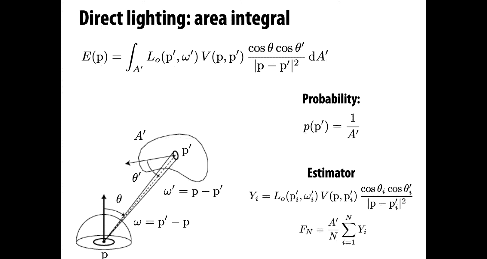
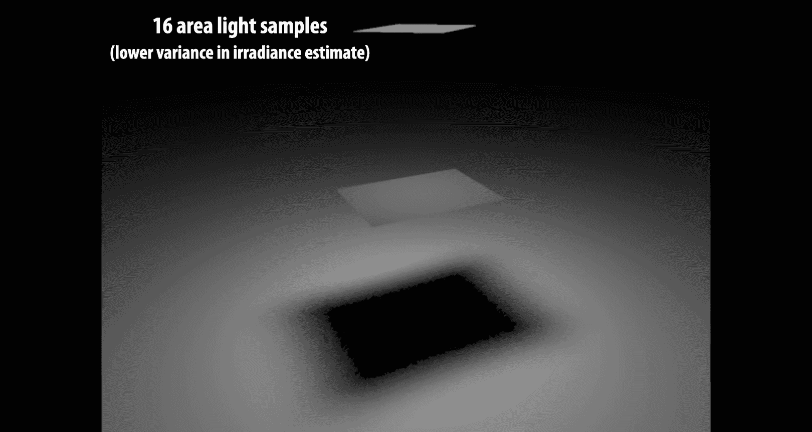
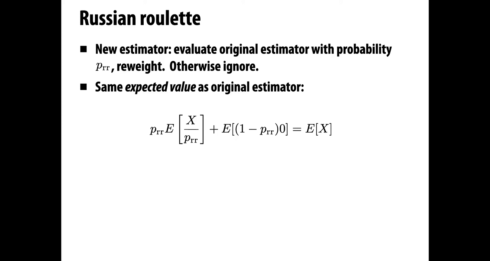
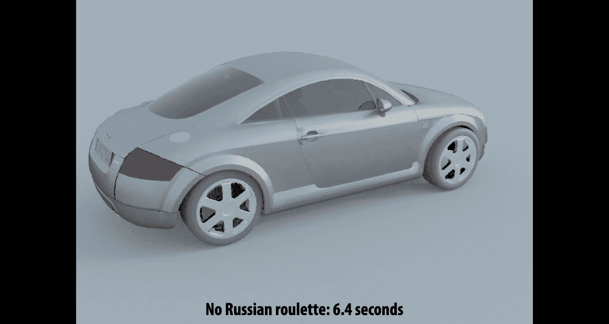
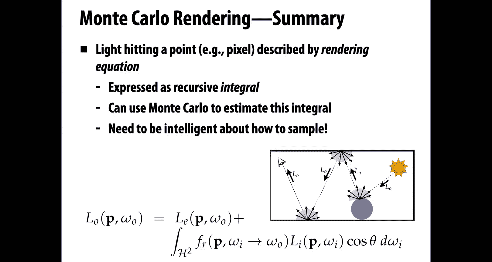

# CMU《计算机图形学｜CMU 15-462  COMPUTER GRAPHICS 2021》中英字幕 p19 -19-Lecture 18_ Monte Carlo Rendering -BV1H3NBemE5E_p19-

Welcome to computer graphics today we're going to talk about Monte Carlo rendering so we're really getting to this final core question of how do we render。

 how do we generate photorealistic images so for instance this image you see here is not a photograph it is a completely synthetic image created starting from 3D models and running through algorithms like the ones we'll talk about today。

And generating a picture like this really puts together a lot of the ideas that we've studied in this class。

 our discussion of colors of how to talk about material models of how to measure quantities of light radioometry of how to do numerical integration like we talked about in our last lecture we're going to need geometric queries。

 especially ray tracing， we're going to need spatial data structures to accelerate those queries。

 and finally we're going to bring all that together in the rendering equation to figure out what are the final color values for pixels in our image。

OkaySo we're going to combine this all together to get our final Monte Carlo rendering algorithm。

And this is， in a sense， the second big algorithm we've seen in this class for generating images。

 the first was our whole discussion of rasterization。

A completely different path toward image generation。

The benefit of doing Monte Carlo rendering is we can generate things that are a lot more realistic。

 a lot more like a photograph， usually at much greater cost so we have a big quality versus speed trade off。

 but Monte Carlo rendering is going to let us render whatever we like。

To be a little more concrete about what are the inputs and outputs of our photorealistic rendering algorithm？

Well， the inputs are going to be a complete description of the scene。

 so not just the geometry of the scene， not just where things are。

 but also what material each object is made out of， also a set of light sources。

 and some description of how they emit light。In which directions in which colors and so forth。

 and also a camera， we have to talk about what is the final illumination going into？Okay， and。

Once we have all those inputs， we're going to hand them off to our ray tracer or our renderer。

And its basic output will be an image， just a pixel image， maybe with additional data。

 we could output things like depth and so forth， but our basic task is to generate a photorealistic image of that scene。

So before we really dive into the ray tracing approach。

 let's look at a little comparison in contrast between ray tracing and rasterization。

So both of them have the same outputs， they both generate an image。They both have similar inputs。

 right， we have to describe the geometry， we have to describe in some way the lights， the materials。

 the camera。So what's the difference， same inputs， same outputs？Well。

 from an algorithmic point of view， one basic difference is the order in which we do our computation。

 the order in which we process samples。So you'll remember that in rasterization。

 the high level structure of the algorithm is to loop over all the primitives。

 maybe all the triangles in a mesh。For each primitive。We figure out which samples it touches。

 which pixels on the screen， for instance。And then for each of those samples。

 we want to know two things， the coverage， how much of that pixel is covered by the primitive and the color。

What color is sitting under that pixel？Okay。In order to determine visibility。

 in order to deal with occlusion， we had something called the Z buffer。

 which kept track of the closest value we'd seen so far， the closest sample that we'd seen so far。

 and we just keep the closest one。In ray tracing， we kind of flip this loop around。

We reorder these two outer loops， so this time we're going to iterate over samples。

 we're going to iterate over pixels of the output image。

And then at least the naive strategy would be to say， okay。

 now I'm going to walk through each primitive。Each triangle。And see。

 is that primitive scene through this pixel， Is it visible when I look at this particular sample。

Again， I need to determine coverage， how much of that pixel is covered by the primitives that are seen and the color。

And this time， if I don't want to loop through all of the primitives。

 I can accelerate this question of visibility by using a spatial data structure like a bounding volume hierarchy。

Okay。So in some sense， this feels like a superficial change。

 do we loop over primitives and then samples or samples and then primitives？But。

This little change is going to make a huge difference in how sophisticated our illumination can be。

Right。Because of the structure of these algorithms。

They're going to be better or worse at dealing with different kinds of illumination。

 So because a rasterizer processes one primitive at a time。

It's really hard to answer questions like is Triangle A in the shadow of Triangle B？

The viewpoint of the ra riseizer， all it seas of the world is one triangle coming down the pipeline at a time。

A ray tracer on the other hand is processing one ray at a time。

 but that ray knows about everything in the scene that it intersects。

Each sample knows about every primitive。And so it becomes really easy to talk about things like shadows or reflections or other global illumination effects。

So here， for instance， we take the same set of objects。A sphere， a cube， a cone， and a plane。

And we run them through。The two algorithms， rasterization and ray tracing， same materials。

 same lighting， same input description。And you notice that， okay， the images are different。

So when you look at these two images， what do you notice what is？Yin。

One of the images that's missing in the other。Well， hopefully you do see some differences。

And some of them are pretty stark for one thing， there are no shadows in the image on the left。

And that makes it really hard to determine， for instance， how far above the plane these objects are。

There are no reflections in the image on the left， which makes it difficult to appreciate。

 for instance， how close the cone is to the box。There's no refraction。

 there's no transparency on the left， so on the left we have no sense that this sphere might be made out of glass。

And there are other more subtle things going on we'll talk about indirect illumination。

The image on the right is just slightly brighter than the one on the left due to light bouncing around the scene and eventually entering the camera。

Okay。So it makes a pretty big difference in terms of the images we can generate which algorithm we use。

I should say， you know， as a disclaimer。You can do better using raurization over the years。

 people have come up with different tricks for， oh。

 here's an approximation for shadows and here's a kind of hack that looks like reflection and here's some cheat that kind of looks like refraction and transparency。

And so you can build these effects up one at a time， in each case there are some gotchas usually。

 some things that are hard to do， and it's usually really hard to integrate these all together at the same time to have your reflection trick and your shadow trick and your transparency trick all working together。

And generally， what that means is you're compromising on not only the realism of the image。

 but also maybe the complexity or the kind of scene you can render or the scenarios in which the algorithm will work。

Basically， these rasterization tricks are not as general purpose as a photorealistic ray tracer。

Photorealistic ray tracers really catch all， you hit the button， it does what it's supposed to， okay。

 and that's what we want to do today。So to develop a full blown realistic renderer。

 we will need to apply Monte Carlo integration， this technique we learned about last time。

 to the recursive rendering equation。The basic task is for each pixel of our image。

 we want to integrate all the incoming light。To be more precise， what exactly are we integrating？

We're integrating all the illumination or all the radiance incident on that pixel。

Over all possible different paths of light。Coming from a light source。

 coming from something immissive。Into our camera。Okay。When we talk about a sample in this context。

If we're really thinking about this whole picture of light traveling from light sources to the camera。

 a single sample is actually。A whole path of light。Okay。

So we want to integrate over all paths the incident illumination。Here again is our。

Rendering equation， just to remind you a little bit about what this means and what the pieces are。

At a high level we have something on the left equals the sum of two terms on the right。

The something on the left is。How much。Illumination， how much radiance。

Is leaving the point P in the direction of omega not。

The two terms on the right are how much light is being emitted from that point。

 plus how much light was getting reflected off that point。 So the first term。

 the emissive term is just saying how much light is emitted from P in the direction omega n。

The second term is saying。I want to integrate over all possible incoming directions， mega sub i。

The incident radiance， L sub i。On the point P in the direction， mega I。Times。The scattering。

 how much light got bounced off that point in that direction versus how much got absorbed。

And then we have a cosine theta term。Just to account for。The way we parameterize integration。Okay。

So how do we approximate this integral？Well， we started looking at this idea of Monte Carlo integration in our last lecture on numerical integration。

And the general idea of numerical integration was to say， well。

 most integrals will never be able to do by hand in closed form。

 so our general strategy for approximating an integral。

Kind of goes back to the definition of the integral。

We grab the value of the function at a bunch of points。

 and we take a weighted combination of those sample values to get an estimate for the integral。

Monte Carlo says that。One possible strategy for choosing sample points and adding them up is to just do it totally at random。

 pick completely random points in the domain， and average all the results。And in some sense。

 this is kind of a stupid strategy， if we have very special functions and so forth。

 we can come up with better rules， but the cool thing about Monte Carlo is it works in basically any scenario you can throw at it。

The other cool thing that we saw about Monte Carlo is it gets around the so called curse of dimensionality。

So as the dimension of your integral goes up， as you have more and more parameters to the functions that you're integrating。

The performance doesn't suffer。To apply this idea to Monte Carlo rendering。

 we're going to need to flesh out some concepts that we didn't really get into last time。

About probability。In particular， we need to talk about the expected value and the variance of a random variable。

 so what value do we get on average from a random variable and what's the expected deviation from that average？

And in the context of Monte Carlo， we'll also want to talk about a concept of importance sampling。

So how can we be a little more intelligent about where we place these random samples so that we're getting the most out of our computation？

How do we put samples in more important regions of the inte？On the bottom。

 we have the statement of our basic rule for Monte Carlo integration。

 it says if we're trying to get the value of the integral on the right。

 we want to integrate the function f over a domain omega。

Then what we should do is take more and more and more random samples x sub I。

 so just pick random points in the domain of F。Grab the value of f at those points， add them up。

 divide by the number of samples n， and multiply by the size of the domain mega。Okay。

And this average times volume will converge to the integral。As long as F is sufficiently nice。

 doesn't have to be very nice， but for most functions， this will work。All right。So。

Basic concept in probability is the expected value。

The intuitive idea to remember whenever somebody says expected value is。

 what value does the random variable take on average？If I keep。

Getting values out of this random variable， what will the average value be？So。In particular。

 if I have a random variable， why？Then it expected value E of y。Can be obtained by summing。

Over the possible outcomes， so in this case this is a discrete random variable。

 so I'm going to sum over all K possible outcomes。The probability of each outcome occurring times the value of that outcome。

I'm just taking a weighted average of the possible values where the weights are given by the probabilities。

As a simple example， consider a fair coin where heads is equal to 1 and tails is equal to zero。

So I'm going to flip a coin， look at whether it lands， heads or tails。

I'm going to add a one if it heads zero if it tails。

And I'm going to tell you that the probabilities of heads and tails are both exactly one half。

This is a fair coin it's no more likely the land heads than tails。OkayIn this case。

 what is the expected value？So the expected value is then going to be just the sum of the probability of landing heads times 1 plus the probability of landing tails times 0。

 1/ half times 1 plus1 half times 0 is1 half。Okay。Important properties of expectation。

One is that it's linear， so if I take the expected value of a sum of random variables。

 that's the same as the sum of the expected values of those random variables。Also。

 if I multiply a random variable by a constant A。Then the expected value of that new random variable is the same as a times the expected value of the original random variable。

A nice exercise just to help you remember all these definitions is to go through and show that these equalities are true using really nothing more than the definition that we see on the left。

Okay， maybe pause the video and try that out if you like。

Another important concept when talking about random variables is the variance。So the intuition。

 the thing to remember when somebody says variance is。How far off。

Is our random variable from its average on average， How much does it deviate from average。Okay， so。

More specifically。We can say the variance V of a random variable Y is the expected value of。

The random variable minus its expected value E of y squared。So just as a really simple example。

If why。Was always giving the same value If it's a coin that always turns up heads。

What would its variance be？Well， the variance would be zero。Because the expected value would be one。

 it's always turning up heads。Rin。The value would always be 1， y would always evaluate to 1。

 and so we'd get0。Saying there's no randomness in this variable， really， there's no variance。Okay。

Here's another example if we just look at the probabilities。Associated with some random variable。

Which one of these do you think has higher variance？Okay， think about this one carefully。

This could be counterintuitive for some people。If we look at these two probability distributions。

The probabilities on the right seem more uniform。We have about the same probability for every event。

The probabilities on the left seem less uniform， we have very different probabilities for each event。

So。A first impulse might be that， oh yeah， the one on the left has higher variance。

 It's varying more than the one on the right。But let's think back to this really simple example I mentioned just a moment ago of a coin that always shows up heads。

What does its probability distribution look like？In that case。

 there's just going to be two bars and one of them is going to have height 1 and one of them is going to have height zero。

So the heights of the bars are very different。But we said that the variance was zero。Ri。

So the probabilities are extremely different， but the variance is0。Likewise， in this case。

When we see that one of the probabilities is really big on the left， x4。

 and the other ones are pretty small。What that tells you is the random variable is going to tend to be close to that average value。

 it's going to be close to x4， it's going to be really uncommon that it deviates a lot and takes the value x1 or x7。

On the other hand， in the example on the right， the probabilities are nearly uniform。

So the values that are coming up are spread out all over the place。And so on average。

 they're going to be far from their average。So the distribution on the right。

 the random variable on the right has higher variance。Okay。Again。

 we have some basic properties of variants that you can work out from the definition。

It's not linear anymore。But it has a similar flavor。So one important thing we can say is that。

The variance of a random variable， y。Is equal to the expected value of the square of that variable minus。

The square of its expected value。That's a useful little formula。

We can say that the sum of the variances。Of a bunch of random variables。

Is equal to the variance of the sum of those random variables。That's nice。

And we also have that if we multiply a random variable by a constant A。

Then it doesn't change the variance by a factor of a， but rather by a factor of a squared。

 in that we can kind of see， know in the definition there's a square so we expect that。

Really important fact。About all random variables that you ever encounter。

As we do more and more trials， as we look at more and more values of the random variable。

The average value that we get approaches the expected value。This is true。

 essentially just because of the definition of expected value。Okay。

Another important thing we can notice。Is that the decrease in variance？Is always linear in n。

So here's a little calculation。If we take our random variable。

 why we repeat some experiment and times。We average the resulting value。

 what is the variance of that？Well， using the rules from our previous slide。

 we can say that's equal to 1 over n squared times the sum of the variances。Ri。

And since if all of our random variables are the same， then they all have the same variance。

So that's just n times the variance of y。Times 1 over n squared or 1 over n times the variance of y。

Okay。So again， this is telling us as we do more and more and more experiments。

 the variance is going to zero， which means。The average value we're getting is approaching the expected value。

And so we can use this， this is the basic idea behind Monte Carlo estimation。

As we can use this fact that the variance is going to zero to get our hands on something like the expected value。

 the average value an integral。So here's a fun example。Well， kind of fun。

 imagine you're stranded on a deserted island out in the ocean and you know it's going to be weeks until somebody comes and picks you up。

All you have is a big coconut palm with tons of coconuts in it， so what are you going to do for fun。

 Of course you're going to try to estimate the value of pie。How do you do that？Well。

 you climb up into the tree。You grab a coconut。And you drop it down into the sand and in the sand。

 you've drawn this little figure， you've drawn a circle， unit circle。

 and a square that goes around that circle。And what you're going to do is count。

What fraction of the coconuts lands that land in the square also land in the circle。Right。

 and that fraction， because you know that the area of a。Unit circle is， well it's pi R squared。

 but r is 1， so it's just pi。So you're going to get a good estimate of pi as you drop more and more and more coconuts into this square。

And so we can really， okay， I didn't do this on a deserted island。

 but I can easily do this on my computer。 I can pick random points in the unit square。

 check if their norm is。Less than or equal to 1。 If they are， I add them to my count。 I divide by。

The total， and I see that as the number of samples goes up from 1 to 10 to 100 to 1000。

 I approach this value of pi 3。141。Okay， and you can see it takes quite a few samples to get even reasonably accurate。

Estimate。Nobody said that this random sampling idea is fast to converge。

 but it does always get us there。So why is the law of large numbers then important for Monte Carlo ray tracing？

Moni Carlo rendering。Well， because no matter how hard the integrals are， if you have crazy lighting。

 you have crazy， weird geometry， strange materials。It might take you a while to get there。

 but you know you'll always get the right image by just taking more and more samples。

Now there is a little bit of an asterisk here， and we'll talk about this。

 especially in our next lecture on variance reduction。That you have to be careful。

When you're doing rendering。That you actually draw samples from the entire domain， in this case。

 meaning you actually consider all possible types of light paths that could go through your scene。

 and this is a little trickier than you might expect。But。In general， you can do this。

 You can get a correct image via Monte Carlo。Okay， so we've talked a little bit about how。

Moonte Carlo can be slow to converge， you have to take a lot of samples to get an accurate estimate。

So how can we do a better job， how can we accelerate this estimation strategy？Well。

 so far we've done something very simple， we've picked samples uniformly from the entire domain。

 every point is equally likely。Okay。Now， suppose we play a little game。

 Suppose that we pick samples from some other distribution other than the uniform distribution。

 So we're going to now。Concentrate our sample points more in one part of the domain than another。

So we might say that our random variable x is sampled from a distribution P。Can we。Use these samples。

 these what we'll call biased samples to still get a correct estimate of our integral。Sure。

All we have to do is account for this bias， account for how much more we're taking samples from one region than another。

When we go to write down our weighted average。In particular。

 we're going to say now the integral of F over the whole domain is approximated by one over the number of samples。

Times。The sum overall samples of the function value at sample I divided by the probability that we picked that sample point。

 X。Okay。This again， might feel a little counterintuitive。

Are we really doing the right thing by dividing by P， why aren't we multiplying instead？

P is how much we want to concentrate samples。In a particular part of the domain。

 So why are we dividing rather than multiplying Well， a good， simple example to think about is。

Let's say we want to compute the average color in this square。The square is half red and half blue。

So we think that the average value， the average colors should be。

Some purple that's exactly halfway between red and blue。Okay。So if we do this。

 if we sample uniformly， we'll get this purple color。But now we're going to bias our samples。

 so we get eight times as many samples in the red region as the blue region。

What we want is still to know the average color we don't now want something that's red her just because we're putting more samples in the red part。

Okay。So how should we weight these samples？Well， because we know we have so many more in the red region。

 they're going to overwhelm our average if we don't do anything。We really need to divide。

By this bigger factor in the red region and divide by this smaller factor in the blue region。

Every sample that lands in the blue region should count for more because we know we're going to have fewer of them。

 every sample that lands in the red region should count for less because we know ahead of time we're going to have a lot more of them。

Okay。So again， if we multiply by P instead of dividing， the average is going to be too red。

 we really need to divide。Okay。So this idea of biasing the samples leads naturally to the idea of important sampling。

We know that we can shift our sampling pattern around。

 we can put more samples in one region than another。But we have to answer then， well， where。

 what is the best place to put those samples so that we get a good estimate of our integral quickly？

Here's a good way to think about it。All right， let's say we want to estimate the integral of f of x。

And we have two candidate probability distributions， P1 of x， this yellow curve， and P2 of x。

 the green curve。If we sample according to these two different distributions。

What is the behavior of the quotient。If we， we think about the quotient of these functions。

 F of x over P1 of x or F of x over P2 of x。How do these different quots。

 this is now really the function we're taking the average of。How do these different quots behave？

And how does this impact the variance of the estimator？Well。

 one thing we can see from this picture is P1 looks a lot more like F than P2 looks like F。Right。

And so if we divide F by P1， we're going to get a function that looks relatively uniform。

If we divide F by P2， we're going to get a function that looks very different from a uniform distribution。

Right。And so one way of thinking about this is we want to find a P。

That makes the quotient look relatively uniform or putting about the same amount of work。Yinqu。

All the different areas under the curve。Right。Another way。

 maybe similar way of looking that is to just say we want to take more samples where the function is large because large values are going to contribute more to the integral。

So if we take more samples。Where F is large。Then those are going to be more useful for computing the area under the curve。

We can think about this important sampling thing not just for functions on the real line。

 but for all sorts of integrals that show up in rendering。 So for instance。

 if we think about the scattering function， the bidirectional reflectance distribution function。

 or B RDF。Remember， that's a function that says， if I have light coming in from a certain direction。

 how much of it gets reflected out in a different direction？

And if we parameterize that function in terms of。V。Let's say， outgoing angles。Phi and theta。

Then for a lot of materials， it's going to be bigger in some places than others here， for instance。

 this is maybe a glossy material where most of the light is reflected in some particular direction。

Okay。So here， again， if we're trying to do this integral。

I really shouldn't waste time putting a lot of samples。

Where there's essentially no reflection occurring where nothing is getting contributed to the integral。

I should really try to lump all of my samples around this lobe of the BRDF where all the light is getting scattered out。

Doesn't help me to add zero to my estimate， it does help me to add these interesting non zero values。

Similarly， I might have a scene that's being lit by an image。

So rather than having a point light source or something like that。

 I actually have a image that wraps around my scene。

 you could imagine this image gets warped onto a hemisphere， maybe。And now when I go to say。

 what is the incoming light， well， I just do a look up into this image。

Much like my BRDF important sampling， again， I really am going to be better off if I place samples in regions of this image that are really bright。

Putting a lot of samples in regions in the image that are dark or black。

Is adding nothing to my estimate， I'm just doing completely meaningless， useless computation。

So I really want to focus all my samples or bias all my samples towards bright regions of the incoming light。

Here's an explicit example of that idea of important sampling the light。

So let's say we have a light source that's a little square patch。

And then we have a little piece of material floating in space and a cluter that just blocks the light。

 it just absorbs it。And then below that， we have a plane that's getting lit by this light source。Now。

 one thing we haven't talked about so far， but is obviously really important for generating an image。

Is。The issue of visibility。If I have a point P on the ground。

And I'm trying to determine how bright it is。Then I care very much about whether a that goes from that point to a light source hits anything else。

 or maybe more physically， if I imagine I have points on the light source that're shooting out photons。

Do those photons actually hit the surface I'm looking at or do they get occluded？

Somewhere along the way。So we can express this idea with the visibility function V。

Which takes two points， P&P prime is input。And returns one if P is visible from P prime and vice versa。

And zero otherwise。So in this picture for this P& P prime， V would evaluate20。

The question we want to answer for this scene is how bright is each point on the ground？

What is the irradiance for each point P on this plane on the bottom？So how do we do this？Well。

 we can。Estimate this direct lighting。let's start out with something very simple uniform sampling。

So we're just going to uniformly sample all possible directions。On the hemisphere around this point。

With respect to solid angle。Okay。So our probability distribution P as a function of solid angle is 1 over 2 pi。

So as a function of the incoming direction， the irradance integral is going to be the integral。😊。

Over the hemisphere of the incident radiance L。At the point P in the incoming direction omega。

Cosine theta d omega。A。Way of thinking about this in terms of random variables is to say， okay， well。

 we have this random variable X。Which is giving us the direction in which we're sampling。

So x is really a direction that's sampled from the probability distribution P of mega。

We can use that random variable to define another random variable why。Which is。

The function we want to integrate evaluated for that incoming direction， F of X。In this case。

 that function is the in。L of P omega I cosine theta。Okay。So our integral。Is just。

The expected value of。That random variable， the average value of the integr times the。

Volume of the domain of integration。In this case。The domain of integration is a hemisphere。

A unitphere has area 4 pi， so a hemisphere has area 2 pi。

 so we get2 pi times the average value 1 over n times the sum from i equals1 up through n of y subi。

Okay and that will give us a correct and consistent estimate of the irradiance hitting each point。

We have to， of course， put a visibility term in there if we have a blocker and o cluer。

 but this will give us the right result。One thing we have to think about practically if we really want to implement this estimate is how do we uniformly pick points on the hemisphere？

We asked these kinds of questions last time。Right， how do you pick a point on the unit disk？ Well。

 okay， how do we apply that thinking to picking。Directions on the unit hemisphere。

One way to do it would be to use rejection sampling。Okay， so remember， for instance。

 if we want to pick uniformly points on the unit disc。

A really easy way to do that is pick uniform points in the unit square。

So just get two random values between0 and1。Check if that random point has norm。No greater than one。

If so， you keep it。If not， you throw it out and try again。Okay。

And because we're picking uniformly from the unit square。

 the restriction of that to the unit disk is a uniform sampling of the unit disk。

How could we apply this same thinking to uniformly sampling the hemisphere？

I'll let you think about that for a second。Okay， well。

 let's start by thinking about a easier problem。And then modify that until we get to our original problem。

This is a good general problem solving strategy if you don't know how to solve a problem。

 try to solve an easier one and see if that can help you。Get to your original problem。Okay。

 so let's say instead， I wanted to sample points uniformly from the unit ball。 so the solid。Sphere。

 the solid ball， all the points of magnitude less than or equal to one in three dimensional space。

Okay， well there I could do something just like I did for sampling the unit disk in the plane。

I could pick uniformly points in the unit cube， just ask for three uniform random values between zero and1。

Then check if that point has norm less than or equal to1， if so， I keep it， if not， I throw it away。

Then。How do I turn those points in the unit ball to points on the unit sphere？Oh， well。

 I can just take the coordinates and normalize them so their norm is one。I just divide X。

Yz by square root of x squared plus y squared plus z squared。Now I get points on the unit sphere。

Are those points uniformly distributed on the unit sphere？Yeah。And here's， here's why。

If I believe that I had a uniform sampling of the unit ball。Then no directions are preferred。

I can forget about the fact that these came from the cube。 That doesn't matter because I threw away。

All of the samples。Outside the ball。And so just by symmetry。

 there's no way for these samples to show up more on one part of the sphere than on the other。

In contrast， if I had just picked uniform points in the unit cube and normalized them。

Without doing any rejection， I'd be in trouble。I'd have more points near the corners of the cube and less points near the middle of the faces of the cube。

Okay， so that gives us a really simple strategy for uniformly sampling points on the sphere。

How then might we pick uniform samples on the hemisphere？Okay， easy enough。

 we just throw away samples。That are below the plane and keep samples that are above the plane。

Or if you want it to be a little more efficient， you could say。Just sample from half the box。

 the top half of the box。Before doing this rejection sampling。Right right。So that works pretty well。

 but you are wasting time by rejecting these samples。So another way you can do this is in this case。

The functions we're dealing with are simple enough。That you can apply this inversion method。

You can write down a map from the square to the hemisphere。You can see how that map distorts area。

And adjust for that area distortion to get a uniform sampling strategy。Okay。

 and this is something that's a nice exercise if you really want to understand that inversion method to go through the exercise of deriving this warping of uniform random variables into uniform variables on the sphere。

Okay。So coming back to our task of estimating direct lighting。What do we do？Well。

 we uniformly sample the hemisphere directions。As we just described。Right。

And for each of those samples。We have our random direction omega sub i。

We compute the incoming raddiance L sub I at our point P from the direction omega i。So basically。

 we make a call to our rate tracer。Which shoots out array and sees does it？

Hit the occludeder before it hits the light source。

So there we can plug into our whole bounding volume hierarchy and all the stuff we talked about when we talked about geometric queries。

If there was no intersection before we hit the light。

 or if the light source is the first thing we intersect。

Then we compute the incident irradiance due to the ray， which is the。

Imitted radiance times cosine theta。And we accumulate these estimates into our estimator。

We add two pi over n times this value， add that up， and we get our estimate of the direct lighting。

Here's what that's going to look like for our little scene。So we have our square light source at top。

 we have this square occludeder， and then at every point of the plane we've estimated。

The incidentdent illumination。In this example， we used 100 samples， so we at each point of the plane。

We chose 100 directions on the unit sphere， shot them out to get this estimateament。Okay， and。Okay。

 on the one hand， you look at this image and you think yeah。

 this looks pretty realistic if I imagine I was really there。

 if I really had this light and this occludeder， this is basically what it would look like。

 but you do notice that the image is pretty noisy and grainy。

 it looks like we took a photograph in a really low light setting。

So why is the image in the previous slide noisy， we really set this up nicely。

 why did we get so much noise？And the reason is that this incident lighting estimator。

Uses different random。Directions in each pixel， right？ So for every point of the plane。

 we're calling this random number generator， it's giving us completely different random directions。

Some of those directions point towards the lights， some of them don't。Okay。

 and so our overall estimate is a random variable。The estimated value will have some variance。

So as we move from point to point on the plane or point to point on the image。

We're going to have this noise， this error in our estimate that changes from point to point。Okay。

How can we reduce that noise？We want a nicer photograph of this scene， how do we do better？Right。

Well， there's one really， really basic thing we can always do。Based on the law of large numbers。

 which is just to take more samples。We know that。If we take more and more and more samples。

 eventually this will converge to the true estimate。

 eventually the variance will go to zero and we won't have any noise。So that's our basic idea。

 take more samples。But what's the problem with taking more samples。 Well， it just costs a lot。

 We saw even with estimating pi， we had to take millions of samples。 This really simple thing to do。

 estimateimate the。Rio of areas of a circle to a square， we need to take millions of samples。

 so we want to be smarter about this。So here's another idea。

Rather than integrating over the entire hemisphere of directions。For most points on the plane。

 most directions are just going to shoot off into space， they're not going to hit the light。

So rather than integrating over the entire hemisphere directions。We're going to integrate only over。

Directions that correspond to the light source。Shoot。

 raise out only in directions that would hit the light source。If the occludeder wasn't present。Okay。

So。This is a light source important sampling strategy。How do we do it for our area light？Okay， well。

 in general， let's imagine again， we have the same setup。

 we have a point in the plane and we have an aerialite source， this funny shape up above the plane。

And rather than integrating over the hemisphere， we're just going to integrate over the light itself。

So we're going to replace this integral at the top。

 which was integrating over all incoming directions with this second integral。

 which is going to integrate over the light source itself。Now we do have to be careful here。

 we can't just arbitrarily change the domain of integration。

Without modifying the thing we're integrating。Okay， so what are we doing here。

 We're saying that rather than integrating the incident radiance。In the top integral。

We're going to start integrating the outgoing radiance from the light source。

That goes from a point on the light source to the point of interest。To the point P。Okay。

We have our visibility term。Actually， we really also have that visibility term in the first integral。

 right either way， we have to account for the fact that the thing the light source might not be visible。

And then we have this change of variables to account for the fact that we're integrating over the light or're integrating over this blob region rather than integrating over the hemisphere。

So the way we can work this out is we can say for some infinitesimal solid angle， d omega。Well。

 we can write that as。How much area？Divided by how far away it is D over p prime minus P norm squared。

And。A little patch of area on the light。Has an orientation。

Relative to the direction that we're looking。Or sorry， relative to the direction of the surface。

 so we can also write this as D prime cosine theta over the distance squared。Right。

 a little patch of area， but accounting for the relative orientation。

So now if we want to do this estimate。We uniformly sample points on the areaial light source。Okay。

 how do we do that， maybe by rejection sampling again？We draw a box around。The 2D light source。

We pick uniform samples in the box。 We throw out ones that don't land in the。Light source region。

 okay？So we uniformly sample by area。And then our task is to。Estimate the average value of the inte。

So now we can think about the integr as a random variable y subi。

That gets evaluated at these uniformly random points。Okay。

 and it has all the same terms that we just talked about。Our final estimate for the irradians at P。

Is then the area of our new domain of integration， the area of the light source divided by the number of samples N。

Times the sum from I equals1 up through n of。A random value y sub I， a random sample of the in。Okay。

So we do all this， and it sounds a little complicated。But it's really worth it。 So if we do all this。

And we run our estimator again， wow， that image now looks so much smoother。

Here we're doing the exact same scene。We're using the same number of sample rays。

 just 100 sample rays per。Pixel per point on the plane。But the image is way smoother。Why。

 why is the variance so much less now？Well， because if there's no occlusion。

Imagine this occludeder wasn't there。Then 100% of the directions that we choose are going to hit the light source。

And we're going to have no directions that go off and hit。You know。

 go off into space and don't hit anything。So every sample we have contributes something useful to our estimate of the integral。

Again， we're biasing our samples towards regions where the integr。

 where the function we want to integrate is large。Okay， so this does much better， in fact。

 even now if we we go back and say， well， rather than 100 samples， let's just try doing one sample。

 even that looks better。Than what we were doing before。So you really get this idea。

 important sampling is really， really important， it really makes a huge difference or can make a huge difference。

To the quality of your estimate， to the speed of your rendering algorithm。Even if we take 16 samples。

 we really don't need to go all the way to 10，  hey， this is beautiful， right？

Important sampling really saved the day here。

Okay。So when you think about different techniques， different Monte Carlo rendering techniques。

This is one of the key questions to ask is about variance。

Variance in your estimator is going to show up as noise in a rendered image。

And you can think about how efficient a given estimator is by saying， well。

 efficiency is basically inversely proportional to both the variance of the estimator。

Our uniform estimator has much larger variance， so its efficiency is lower。

 Our light source important sampling has much less variance， so it's much more efficient。

But also you need to care about the cost。It's not necessarily free to do all that work we did。

To find the samples that head toward the light。We had to somehow uniformly sample the light source。

 we had to do a slightly more complicated or slightly more costly expression in the in Grand。

Prob not a big deal， right， So overall， probably we still got more efficient。

 but you do have to balance these things very instant end cost。

The kind of rule of thumb to remember is that if one integration technique has twice the variance of another。

 then it's going to take twice as many samples to achieve well， the same variance， right？

But likewise， if one technique has the cost of another technique with the same variance。

 then it takes twice as much time to achieve the same variance。So it really is a trade off。

Here's another useful importance sampling strategy。

 so far we've talked about important sampling the lights。

 let's talk a little bit about important sampling the hemisphere。

We know that not all incoming directions are going to contribute the same amount to our integral。

 Why is that well because。When we're computing irradiance。

 we're integrating the incident radiance L sub I times the cosine of the angle theta。

Between the incoming direction and the normal of the plane。Right what that means is。

These directions that are really shallow angles are always going to contribute less to our integral than directions that come in kind of normal to the plane。

And so it would make sense to try to shoot fewer directions in these。At these shallow angles。Okay。

So here's how we would do it。The naive Way， the uniform sampling strategy。As we'd say， okay。

 we want the probability。Density with respect to the direction omega to be equal to 1 over 2 pi。

 just one over the area of the hemisphere。We can go ahead and work out using the inversion method。

 some strategy that will take a pair of unit random values， uniform random values。

si 1 and Psi 2 to three points on the hemisphere。That gave a uniform distribution。Right。

 and then we go ahead and write down our usual。Expression for our Monte Carlo estimate1 over n times the sum over the samples of the function value in the direction omega divided by the probability that we picked that direction。

We can plug in the inte here li of omega times cosine theta divided by。

The probability1 over 2 pi and we get2 pi over n times。The sum of samples。

 So you can really see this final expression is just saying we multiply the area of the hemisphere times the average value of incident radiance weighted by cosine theta。

Okay。How do we take advantage of that cosine theta term？To get more efficient estimation。

Well we can use this cosine weighted sampling， we can say now our integr is the same。

 we're integrating the same function F， but our probability distribution。

 let's try using one that looks like cosine theta over pi。Why cosine theta， Well。

 we want to say if the angle is。Shallow， if the angle is small， we want to sample there less。

If theta is close to zero， it's close to the normal direction， we want to sample there more。

Why do we divide by pi well we need to make sure that this thing integrates to one over the whole hemisphere。

So that's just that constant of normalization。Okay。

 and now we run through the same expression for our estimator。

 so we want to estimate the integral of F over the hemisphere。That's equal to 1 over n times。

The sum of F over P。In this case， we have the same FLI of omega cosine theta divided by this new probability。

 cosine theta over pi。Okay， and now， actually， interestingly enough。

 our important sampling strategy is。Even simpler。Then our original estimator。

Now we just can do pi over n。Times。The sum of the incident radiance。Okay。So if we do this。

 we're essentially gonna。Bias samples toward directions where cosine theta is large。If L is constant。

 if we have like a， let's say， a hemispherical light source also。

 then these are always going to be directions that contribute the most。Okay。

 and this looks even simpler。The only thing we have to answer now。

 the only complexity that's kind of hidden here is how do we choose samples from the distribution P？

How do we choose cosine weighted samples on the hemisphere？Okay。

 but that's no different from the question we've been asking for the last couple lectures of given a probability of distribution。

 how do you sample it from it。 So there's a little additional cost of generating the samples。

But the efficiency of the estimator should be a lot better。And usually this wins out。Okay。All right。

 so so far we've considered light coming from。Light sources just scattered once。

 meaning it comes from the light source， it hits a surface like our plane。

 and then it bounces into our eyeball or into the camera。How can we go further。

 how can we use Monte Carlo integration？To really get the final color values for each pixel。

 accounting for all the different things that light can actually do。

All the different ways it can bounce around the scene。

So here we return to the Monte Carlo rendering equation。which says， okay。

 we've got some lights in the scene， we've got some surfaces。

 the lights's going to hit the surfaces bounce around and eventually hit our sensor。Well。

 the basic thing we need to know when we'reestimating this integral on the right is we need to know the incident raddiance。

So far we've only computed incoming radiance from light sources。

Now we want to account for indirect elimination。This incident radiance might be due to light reflected off another surface in the scene。

And that light might have come from。Light reflected off a different surface in the scene and so forth。

Okay。So we come back to this idea。That， because。The rendering equation is recursive。

 We're also going to have a recursive algorithm for estimating。Radance values。

 they come out of the rendering equation。And this algorithm is called path tracing。

So this is perhaps the most basic algorithm for。Photorealistic rendering for Monte Carlo rendering。

What do we do？Well， let's just think about this。Reflectance term。

All right so we're integrating over the hemisphere around the point of interest。

 the scattering function F sub bar， which says how much light that comes in from the direction omega I goes out in the direction omega O。

We then multiply that scattering by the。Raddiance coming in from the direction mega I。

 but we've written that in a funny way。So the little observation here is how much radiance is coming from the direction of omega I well。

We can trace array。From the point P back along the direction mega i。

And then ask at that point at whatever point we hit， how much radiance is going out？In the direction。

 minus omega i。In the direction that heads towards the current point that we're considering。

Then we have our usual cosine term integrated with respect to solid angle。Okay。So。

What we're going to do is sample the incoming direction。Omega I from some distribution， for instance。

 maybe we use cosine weighted sampling。 Maybe we do it proportional to some more specific BRDF。 Okay。

 but whatever we do， we sample all directions。我明噶， i。

And then we recursively call this path tracing function to compute incident indirect radiance。

And actually， we're going to do something that seems a little funny， usually。

We're going to just do a single sample。We want to estimate this whole integral。But at a given moment。

 we're just going to trace one ray。 we're going to follow one。

Incoming direction back towards the point that it came from at that point we're going to follow just one incoming direction and so forth。

It's a little bit of a funny thing to do， but what you should remember is that the expected value of the estimator is always going to give us the true value of the integral。

So even for one sample， the expected value we get will be correct。

Which means if we then average this whole path tracing procedure over many， many paths。

We'll also get the correct value for our final illumination estimate。All right。

So what is this bias doing this？Buncing around the scene until we hit a light。Well。

 here's an example。Nice。Moodeled scene where we've only used direct eumination。Okay。So in this case。

 the only paths that we consider are paths that go from a light source to a point on surface to the eye。

Now suppose that we add to this image。Pas that are a little longer。

 so we now allow the light to go from the light source to a surface。To another surface。Into the eye。

 into the camera。Here we go。So what do you notice here。

 you notice that things that were previously in shadow， well they actually weren't in shadow。

 right if you were really there， you'd see all this hidden stuff because you'd have this indirect eumination。

And so that really inspires you to say， okay， well let's keep going。 I mean。

 if that was only one bounce， what's going to happen with more bounces。 So here's two bounces。

 things get a little brighter。But if you look just at these two images， you might think， ah。Okay。

 this seems like diminishing returns， right？We're doing a lot more work now。

 but all that happened was things got a little brighter。

 we'll pay close attention now to the lanterns that are hanging from the ceiling。

So if we now go from two balances to let's say four balances， wow， okay。That made a big difference。

 Look at the top of the image。What we actually see now is that thing that used to look black。

 we realize is actually glass。Why is that happening Well， for light to travel。

From the light source to the camera through that glass， it might now have to do several events。

 It goes from the light。 It hits the glass。 it refracts through it。 It goes through the inside。

 It refracts out of it。So we realize actually， it's pretty important to。

Keep these longer paths in the equation。 They might not be super important everywhere if we go again and compare 2 to 4 for a lot of the other parts in the image didn't make a huge difference。

 You might notice also in the background， there are glasses sitting on the table that were dark and are now light。

 They look more like glass。Okay， we can keep going here's eight poundsce elimination。

 things got again。A little bit brighter。16 poundss and so on so at some point you say okay。

I think I've done a good job of exploring the space of paths。

I've sent out lots of rays and I think that I've captured all the important illumination in this scene。

But how do you know？You know what numbers should you go to before you stop。

When do we stop this past tracing procedure？One answer is you just pick some number and you stop there。

You'll never be sure that you might have missed out on some important light paths。

 So a strategy that is more principled is something called Russian roulette。And so the idea is。

Rather than picking some hard cutoff。What you say is every single time you do a bounce。

 there's some probability that that path gets killed。Likewise。Every time you do a bounce。

 there's some probability that that path keeps going。

So even though they probably gets smaller and smaller and smaller。

 there's some chance you'll keep on going to longer and longer and longer paths。

So you know that if you keep doing Monte Carlo integration。

You'll ultimately never miss out on any important paths。But you also gain some efficiency。

 So the other idea with Russian Roette is that we want to avoid spending time evaluating the function for samples that make a small contribution to the final result。

Most of the time we're just getting a little bit brighter， it's not really helping our image。Okay。

So let's consider a low contribution sample。It looks like this。

 it looks like our scattering function times the。Raddiance times the visibility term。

 times a cosine term divided by the probability。What's Russian Re going to do？Right。

It's going to say， okay， if the tentative contribution。So if， meaning if。

We forget about visibility for a second and say， even if this segment of the path is visible。

Even if there's no occlusion， how big is this， how much does this matter？

If that tentative contribution is small， its contribution to the final image is going to be small no matter what happens with a visibility term。

The visibility term is something we want to avoid computing because it's really expensive， right。

 it's this geometric query。 we have to shoot array into a scene of millions of triangles and figure out where it hits。

Okay， so we'd like to be able to skip out on some of these computations if we know they're not going to contribute to our image。

If we just toss these out， if we just say， oh， whenever the radiance is small。

 we just throw out this path， well， that's going to introduce systematic error。

That's going to introduce what's called bias into our estimate。

 and we can no longer be sure that we're going to converge to the correct value。So instead。

 we're going to again use randomness to help us out and say we're going to randomly discard low contribution samples。

In a way that leaves this estimator unbiased。In particular。

 our new Russian roulette estimator is going to evaluate the original estimator。

With some probability P sub Russian roulette。And then reweight the samples according to this probability。

If you know， this， if we don't evaluate it， then we just ignore this sample。 We ignore this path。

 right。 So another way of saying this is we flip a coin。

We pick a uniform random variable between0 and 1。And we check that value between is that value less than or greater than P of RR？

If it's less than P of RR。Then we go ahead and keep integrating， otherwise we kill it。

To make sure that our final value is correct， we can write down a。

New estimator that has the same expected value as the original estimator。In particular。

We have an estimator。That says， okay， if x was our original estimator， our original random variable。

Then。Either one of two things can happen， we're going to contribute X。With probability P of RR。

 or we're going to contribute0 with probability 1 minus piece of RR。

And so the expected value of this new estimator is going to be p times the expected value of x over P。

Plus， the expected value of 1 minus p times 0， which is the same as the expected value of the original estimator x。

Okay， so let's see how this works。

Our original image where we didn't use Russian Roulette。And this is a scene where。Essentially。

 every light path will eventually reach the light。 if we started the eye and start bouncing around。

 the reason is because the light source is huge。 it's a image based light around the scene。

 So as long as we eventually bounce off to some point in the sky， the path will terminate， However。

 in this case， it takes a little while to get all those paths to finish， it takes 6。4 seconds。

 no Russian roulette。😊，Now we're going to go ahead and terminate 50% of all contributions with illuminance less than 0。

25。So on each bound， we're going to flip a unbiased coin。If it comes up heads， we keep going。

 if it comes up tails， we stop， we reweight our probabilities。In this case， the time went down to 5。

1 seconds。Down from 6。4， image didn't change a whole lot。

 You do notice you start seeing a little noise in the shadows。

This time we're going to do terminate 50% of all contributions with luminance less than。5。

Termininate 90% of all contributions with luminance less than 0。125。And then finally。

 let's terminate 90% of all contributions with luminance less than1。

 so what you notice each time is the amount of time it took goes down， the amount of noise goes up。

So as with all variance reduction strategies， this is something where you need to figure out what's the right balance between efficiency and accuracy。

And that's also going to depend a lot on what type of scene you're rendering。

What do the lights look like， what do the materials look like， and so forth？Okay。

 so to summarize everything we've talked about today。

The basic idea is that the light hitting a point on the screen， pixel。

Is ultimately described by the rendering equation， which is this recursive integral equation at the bottom。

And our basic strategy for。Solving this equation for getting the color of every pixel is to estimate this integral。

Using。Monte Carlo integration。If we go ahead and apply Monte Carlo integration。

 we take one sample of this integral。And recur， then we arrive at the path tracing algorithm。

And we know that because the values we're getting out of tracing each path are unbiased。

The expected value or the average value over many， many paths will converge to the correct。

Value for this integral。We also saw that depending on exactly how we choose this sample， how we。

Pick up probability distribution， how we weight our samples。The estimate will be better and worse。

 and we can make a huge difference in how nice this image looks by being smart about important sampling。

So next time we're going to talk more generally about this question of variance reduction。

 how do we get the most out of our samples and how can we go beyond the basic important sampling strategies that we talked about this time？

All right， talk to you then。