# CMU《计算机图形学｜CMU 15-462  COMPUTER GRAPHICS 2021》中英字幕 p20 -20-Lecture 19_ Variance Reduction -BV1H3NBemE5E_p20-

Welcome back to computer graphics， so today we're going wrap up our discussion of physically based rendering with a discussion of techniques to reduce variants。

 so last time we talked about Monte Carlo ray tracing where we said that the basic way we're going to generate an image is through the rendering equation which gives us a recursive description of the incident illumination。

And because this is a recursive integral equation， it's very difficult to evaluate to get any kind of estimate of what the solution should be。

 we really need to go pretty deep into numerical integration。

 and that leads to a lot of sophisticated strategies。

 so we've been talking about sampling strategies， we've talked a little bit about variance reduction and today we're going to see more interesting things。

 Markov chain Monte Carlo methods and so on， which help to get a better image with fewer samples or less effort。

So today we want to get kind of an overview of a lot of these different kinds of ideas and also keep in mind that the techniques we'll discuss are quite valuable even beyond computer graphics and rendering。

 in fact， the Monte Carlo algorithm， the Monte Carlo integration was named one of the top 10 algorithms of the 20th century。

 so this is useful essentially anytime you need to estimate a difficult integral。Okay。

 so just to review what was Monte Carlo integration all about， well in general。

 we just want to integrate over some domain， omega。

 some function F this doesn't have to be a function that has anything to do with rendering or computer graphics。

 right we just want to compute an integral。

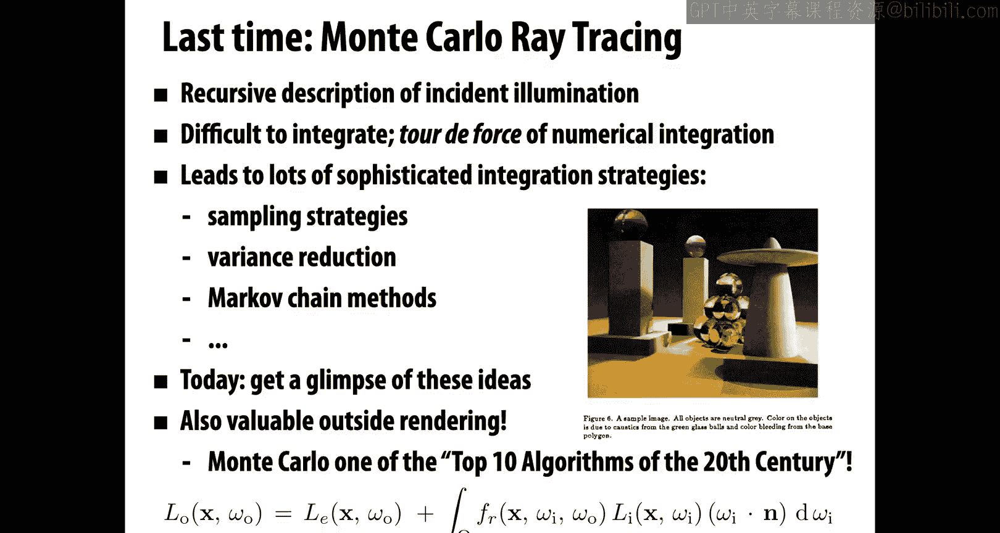

So our general purpose strategy for doing this is something called Monte Carlo integration。

 and the way that works is we pick a bunch of random samples of the domain and we'll call those capital X subi。

And then we can say that as long as this function F actually is integralgrable。

Then summing up the values of the function F at the random samples。And then taking the average。

Multiplying by the volume of the domain will give us the value of the integral。

In the limit as the number of samples goes to infinity。So of course， in practice。

 we stop at some point and the more samples we use。

 the more accurate our estimate of the integral will be。Okay。

 so to really understand Monte Carlo integration， it's important to recall a few basic ideas from probability。

 one was the expected value， so if we have a discrete random variable。

 meaning a random variable that has n distinct outcomes x1 through xN。

And those events occur with probabilities P1 through PN。All of which are。

Non negative and all of which together sum to one。Then the expected value E of x is the sum over all the events of the probability of that event occurring times the value of that event。

Essentially just the weighted average of all the events by their probabilities。

So here is a simple example， let's say we have a coin。We flip it and we say if it comes up heads。

 we assign a value of one if it comes up tails。It is assigned a value0。

We say that this coin is fair if these two possibilities， heads or tails are equal in probability。

 they both have probability of1/2。So in the scenario， what is the expected value for the coin toss？

Okay， hopefully this is pretty simple， it's just one half times 1 plus 1 half times0 is1 half。

We also talked last time about continuous random variables as opposed to discrete random variables。

 so a continuous random variable x takes values， little x anywhere in some set mega。

This could be like a region of the plane， for instance， or an interval on the real line。And。

The probability density P gives or describes the probability that x appears in some given region of the domain。

So it kind of a silly example。Let's say that this probability density function P of T gives the probability that you fall asleep at different times T during a computer graphics lecture。

Okay， so you could think， okay， in this 90 minute period at the beginning。

 there's some cool motivating examples。 you're staying awake。

 then we start to get deeper into the theory and you kind of drift off but then maybe the professor makes some stupid joke。

 Okay， you're paying attention again。 but then there's more theory you drift off and finally。

Class ends， you get out of there。One really important thing to appreciate about continuous random variables。

Is that the probability that you fall asleep exactly at one given time tea。Is 0。

It's a little counterintuitive。 How can that be， O， you fell asleep at a certain time。

 If that happened， how could it be probability 0 that it occurred， Okay。

 But the idea is that when you have a probability density function P。

 you can really only talk about the chance of falling asleep in a given interval of time。

Or in a given region of the set omega。So in this example。

 if I want to know what chance is there that I fall asleep between T0 and t1。

 then I should integrate from T0 to t1 this probability density to get the probability。

That's why we call it a density， essentially。Okay。So in this continuous context。

 we can still talk about expected value。So the expected value of a continuous random variable is in spirit。

 again， just the weighted average with respect to probability where the probability density is providing the weights。

So we could say that the expected value of a random variable x is the integral over the domain mega。

Of the probability density at each point。Times the event value。

And sometimes we'll just call this quantity instead of E of x， we might just call this mu。

 which stands in for the mean。Kind of awaited me。So what about this example？

For this probability distribution， if you look at this picture。And I said。

 what time do you expect somebody would fall asleep in this class？What might you say。

I think it's actually pretty natural to say， oh， well。

 probably you fall asleep at the top of that first peak。

That's the time you're most likely to fall asleep。But the time that you're most likely to fall asleep is different from the expected time of falling asleep。

Expected is more like the average time of falling asleep。So if we compute this average。

 actually what we'll find is。That the expected time is 44。9 minutes somewhere。

In the middle where actually the probability density takes a fairly small value。Is this。

 is this result counterintuitive， is it。Seem weird that the expected time is actually a pretty low time。

Well， this is just a matter of。Appreciating what really is the definition saying？

And also always keeping in mind something called the flaw of averages。

So looking at the average of a quantity is really throwing away a lot of information about that quantity。

If you just know about the average of a probability distribution。It really doesn't tell you， oh。

 is that distribution fairly uniform or does it have lots of really high peaks and really deep valleys？

Okay， so。When we talk about numerical integration， when we talk about Monte Carlo。

 beware the flaw of averages。Another important quantity when talking about random variables was the variance。

 so if the expected value is the average value， then the variance is how far we are from the average on average。

We can write this by saying the variance of a random variable x is equal to the expected value of。

The value of x minus the expected value of x squared。So how much does it deviate on average？

For a discrete random variable， we can write this explicitly as a sum。Over all the events。

 I equals1 up through n of the probability of that event。Times。

Now we're just applying this formula again。Xi， the value of that event minus the sum over j of the probability of event J times the value of xj squared。

The continuous formula looks almost identical， except that we replace the sums with integrals。

really nothing other than that happens。Now there's a quantity very closely related to the variance。

 which is the standard deviation， the standard deviation， which we usually write as sigma。

 is just the square root of the variance。And。In some sense， this can be more intuitive。

 So if we're talking about our。Probability distribution of falling asleep in class。

 We know that the expected。Time of falling asleep is 44。9 minutes， but the variance is pretty big。

We kind of expect that on either side of that expected value。

 we may be falling asleep somewhere in plus or minus 15。

8 minutes is a rough guess for when we might fall asleep。

Is this any any better of a characterization of the probability distribution， Yeah， maybe。

This gives at least a little bit more information about what's going on， what's likely to happen。

Why is variance so important for photorealistic rendering well last time we talked about how if we use different sampling strategies。

 then our estimator has different amounts of variance。

 different amounts of variance equate to different amounts of noise in the image。

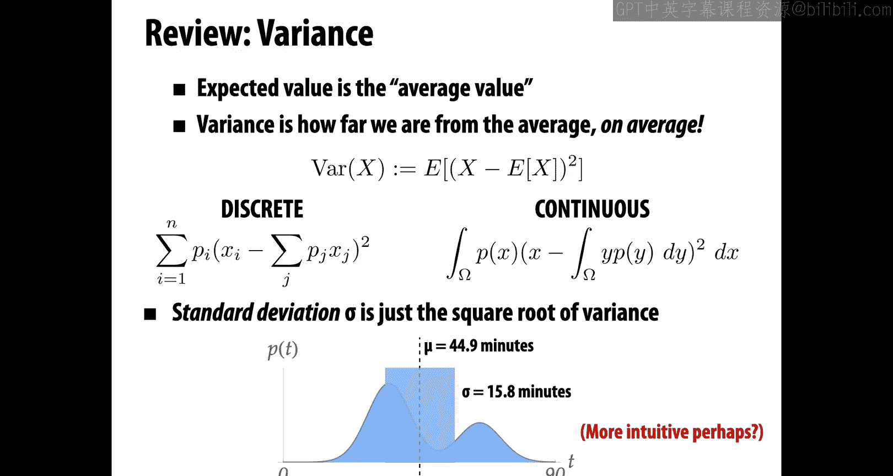

Because we're doing independent estimates at every different pixel of our image。

We're going to have different random error at every pixel which shows up as this noise。

 it looks like taking a photograph at night。If we come up with better variance reduction strategies。

 we're going to get much more smooth， beautiful images with much lower computational effort。

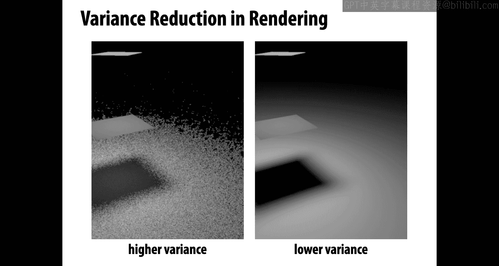

That's what we really want to talk about today。So how do we reduce variance？Well。

 let's go through a really simple example。So let's consider a region of the plane omega。

 just the interval 02， cross 02。And we're going to put a function on that region， f of xy。

 which is equal to1 if the floor of x plus the floor of y is even and0 otherwise y。

 so it just looks like this checkerboard pattern on the right。Okay。

 and then we're interested in the integral。Of F of x Y over omega。Okay， so question。

What is the expected value of the function F？Remember。

 the expected value is kind of the average value。So what is the expected value of F？

Well if we associate。Black with zero and white with one。 then we see that okay， just by inspection。

The expected value must just be one half， half white， half black。What about the variance？

What is the variance of the Integr F？Okay， well， here you might need to get out your pen and paper。

Sribble something down。But it's just a basic application of the。

Calculation we did on the previous slide or the formula we had on the earlier slide。

 which is to say we do one half the probability of one event times0 minus1 half squared。

 okay times the deviation from the expected value squared plus one half the probability of the other event。

Times minus minus1 half squared， we work that through and we get a variance of1 fourth。Okay。

 here's the critical question。The variance is one fourth。What can we do to reduce the variance？

Of this。Of this function。We want to make smoother， better images。 How can we reduce the variance。

 varianceance is bad。 We want to reduce it。 What can we do。Okay。

 and the answer is that was actually a trick question。It's really。

 really important to realize you cannot reduce the variance of the inte。

 you can't reduce the variance of the function you're trying to integrate。You're handed a function。

 it has some variance， you have to integrate it。The only thing we can do is reduce the variance of our estimate of the integral。

We can reduce the variance of the estimator。OkayThis is a common point of confusion when you first start getting into this。

 it's really the Monte Carlo estimate whose variance we want to reduce。Okay。

So an estimator in general is a formula used to approximate an integral。

Our key example is a Monte Carlo estimate， right if we want to compute the integral。I， on the left。

 we can estimate it with the Monte Carlo estimate with the sum on the right。And the point is。

 we're going to get different estimates of this integral for different possible collection of sample points。

So。What we want to do is pick these samples。In such a way that we reduce the variance of this estimate。

Again， why is it that we're trying to reduce the variance of the estimator and not the function we're integrating well because the integral only has one value？

Right， the， the function is a fixed function。But there are lots and lots of different techniques for sampling the integra for combining those samples to get an estimate。

OkaySo we're going to review some key examples for rendering。

 but a lot of these techniques can be applied more generally。Okay。

So two important things to ask whenever you have an estimator。I mean。

 these are like the most basic things that you really want to think about is。

 is bias and consistency。 Is it consistent， Is it bias？ Okay， well， what do these mean。

 consistency is。What you probably naturally think of when you hear the word bias。

 there's a lot of confusion between these two， so consistency， let's be precise means。

It converges to the correct answer。If I have a consistent estimator。

 I know that as I add more and more samples to my estimate， I'll eventually get the right result。

To be a little more precise about that， we could say as the number of samples approach infinity。

The probability that the estimate deviates from the true integral。Approaches 0。

Why do we have to be so subtle about this， Why can't we just say， oh。

 consistent means that as we add more samples， we get the right answer？Well。

 these are random samples。So there is some vanishingly small probability that we're picking random samples out of a hat and we're just getting unbelievably unlucky。

 like we're always sampling the same point in the domain。This is really， really， really improbable。

 and that's why we're saying we need to see that the probability of something going crazy goes to zero as the number of samples goes to infinity。

Okay， but just take a step back again， the point of consistency is it saying。

 are we getting the right result or not？Bias is a different concept。

Saying that an estimator is unbiased is saying that it is correct on average。Okay。

Distint from saying you eventually get the right result。So to be more precise。

 we can say an estimator is unbiased if the expected difference between the true integral and our estimator for any number of samples。

Is equal to 0。We're saying that。On average， we're actually always guessing the right thing。Okay。

Importantly， consistent does not imply on bias just because you're approaching the right value。

Doesn't mean that at any moment your expected value for your estimate is the true value。Again。

 people get these confused all the time， it's really important to see the difference sos。

A good example。Really， simple， trivial example。I'm going to present an estimator and I'm going to ask you。

 is it consistent or is it unbiased？So， here's my。Task， I have an image。I have a photograph。

 and I want to just integrate。The photograph， I want the total brightness of the image， basically。

Okay。So here's my。Here's my first estimator， my first strategy for estimating this integral。

I'm going to take M by M samples at fixed grid points for some value M。

And then I'm going to do kind of a Rimand sum， I'm going to sum the contributions of each box。

So some really simple quadraature rule。And then I'm going to let M go to infinity。

 so you imagine I have an estimate when m equals 4。

 I'm going to approximate the integral of the whole image by just these 16 blocks add up their total brightness。

For M equals 16， I'm going to have these 256 blocks and so forth。So my question for you is。

 is this estimator consistent and is it unbiased？Okay， let's think about this one at a time。

Is it consistent？Well， consistent means as I increase the number of samples。

Do I eventually get the right result？And the answer is yes。

Eventually the number of samples I'm taking is， well。

 let's say we could even say that the final image is actually really a digital image。

 so we could say there's even some finite value of M for which I'm really just adding up the。

Pixel values， I'm getting exactly the right answer， right， or even if it was。

 even if the image was a continuous image， right， this is an image in the real world。

It would still be consistent as M approaches infinity， we're getting the correct integral。

Is it unbiased？So is the expected estimate we get always equal to the true integral even for a small number of samples？

Well， no， pretty clearly not， right if I just keep M equals 4 and never increase M。

My first estimate will never be equal to the true value， not even on average。 right， There's no。

 there's no randomness here。 So there's kind of nothing to take the expectation of。Okay。So。

Let's contrast that with a different estimation strategy that hopefully makes the difference clear。

Okay， so I have another estimator。

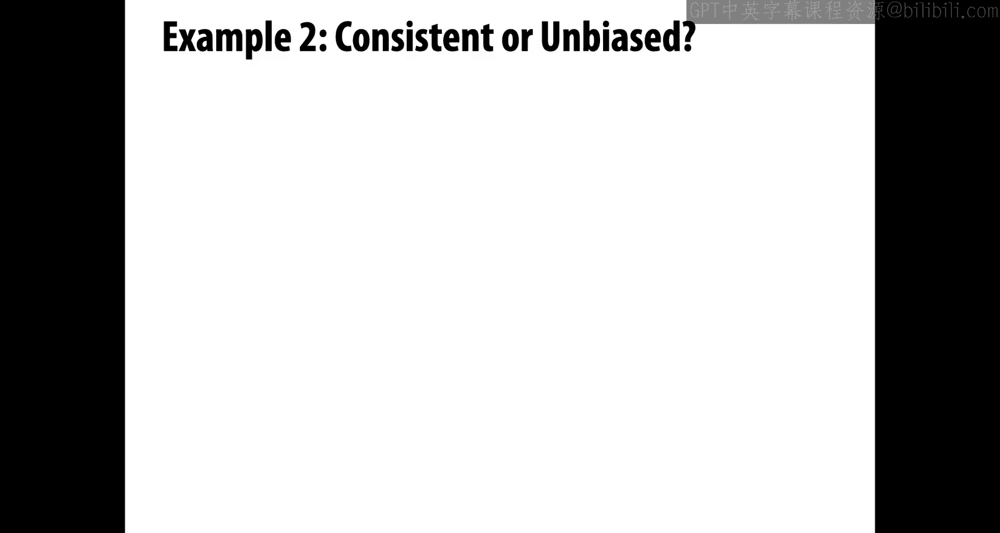

For the same problem。Which is。I'm just going to take a single random sample of the image。

 I'm just going to pick randomly some point in the square。I'm gonna figure out what the。

The color value， the brightness is there， and I'm just going to multiply that value by the area of the image。

Okay。Kind of a funny estimator， but sure。嗯。Is this estimate。Consistent and is it unbiased。

What do you think。Okay， so again， let's go through one question at a time。

 is the estimator consistent？Well， now we're kind of in the opposite situation we were before。

If I only ever take one sample， if I only ever look at one point of the image。Boy。

 it seems pretty impossible that I'm gonna be able to ever compute。The integral over the whole image。

So just to be clear here。My estimator doesn't have a parameter。 it's always taking only one sample。

And so there's no way that my estimate can ever consider more than one point on the image。So no。

 it's not consistent and it can never give me the true value。Is it unbiased。

Does it give me the correct value on average？ Now， it's really tempting at this point to jump to conclusion and say。

 oh， well， it's not even consistent。 So how could be unbiased。But let's think about this。

Do I get the right value on average if I repeat this experiment over and over and over and over and over again？

And compute the average value of all those different estimates， do I get the correct answer？Oh yeah。

 because every time I'm picking a random point in the image。

Even though none of those estimates are approaching the correct value， the average estimate。

 the expected value for the estimate is， because actually it's just equivalent to Monte Carlo integration。

Okay， so weirdly enough， this is a strategy that is。Not consistent， but is unbiased。

 The last one was consistent， but not。Unbiased， okay。Of course， what if I now let N go to Infinity。

 what if my estimate， each estimate actually gets to take more than one sample？

it gets to take as many samples as you want， okay， then this really is our Monte Carlo estimator。

Or it is the limit of our mono Carlo estimator， right， and so it is both consistent and unbiased。

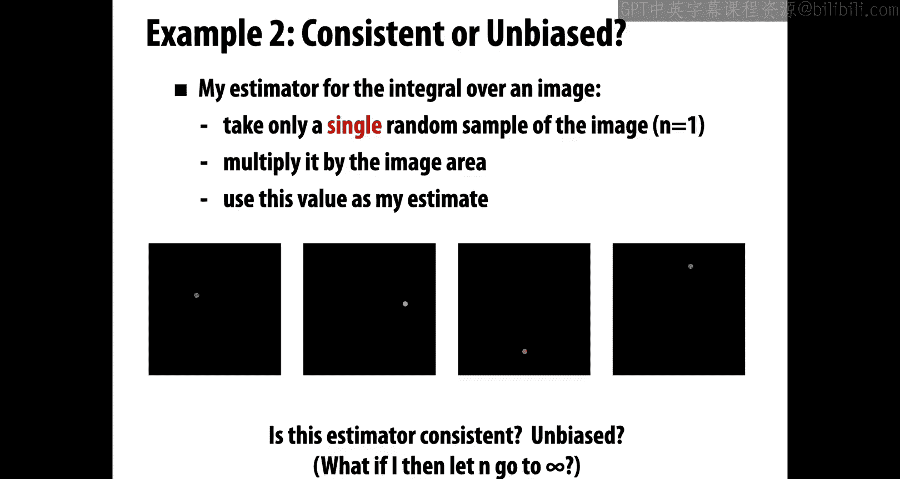

Great， why does it matter， why are we spending so much time talking about this？Okay。Well。

 the rule of thumb is that if you have an estimator that's。Unbiased and consistents。 I mean。

 you want it to be consistent always right， You want to be able to get the correct answer eventually。

 Why does it matter whether it's biased or unbiased。

Unbi  seimator tend to have more predictable behavior， and you know。

Especially with Monte Carloestimator， you really know that the error is decreasing at some predictable rate。

So you really know how much computation you need to do。To get a result of a certain quality。

To bring the error below a certain threshold。They also tend to have fewer parameters to tweak。

We'll see that a little bit when we talk about rendering algorithms that。Moonte Carlo estimators。

 you might be playing around with how much you know variant you have。

 but it's always it's always consistent。 It's always unbiased。

 Other rendering algorithms you might have to play around with with parameters to even kind of get things working the way that you'd like。

Okay， so here's a little table of rendering algorithms that we will talk about。

And whether they are consistent or unbiased。Actually。

 one that we talked about a long time ago was rasterization。

 a really common way of generating images。And rationalization is neither consistent nor unbiased。

 why is that well？There's just no way for it to ever generate the correct image because it ignores all sorts of effects like shadows and reflections and so forth。

I mean， maybe with enough tricks， you can get this to work， but for the most part。

 you're not going to get the correct answer。Why， then do we use it， I mean。

 it doesn't doesn't mean it's a worthless algorithm just because it's not unbiased and because it's not consistent。

It has something else going for it， which is that it is unbelievably fast。

 We have hardware that'll render billions of。Primitives in a fraction of a second。So。

These issues of consistency and bias really are something we care a lot about when we're doing photoreistic rendering。

But they're not the whole story。Path tracing， our basic algorithm for estimating the rendering equation。

 which we talked about last time， is more or less consistent and on biasased。

 as we'll talk about today， there's important types of light paths that are missed and that contributes to some of the bias and lack of consistency。

 but for the most part it's doing the right thing。So we'll see a bunch of other techniques。

 bidirectional path tracing and so forth。And think about， are these consistent antibied？

So first it's worth understanding what actually is the challenge with path tracing。

 why is there any problem， it seemed like a pretty good idea last time。

So let's think of this example of a coffee cup sitting on a table。And。

One thing about this cup is it has a really glossy finish。

 So if we shine a bright light on the coffee cup。Some of that light is going to get reflected off in an interesting way。

 it makes this what's called a caustic pattern on the table。

 this bright ring of light around the bottom。What's kind of happening here， okay。

 well if I'm sitting at a。Place and I'm an observer and I look at this surface。

 this kind of mirrored or glossy surface， and I have a point light。

Then what can happen is I have a path that goes from the eye onto the table where that caustic is onto the mirrored surface and then into the light。

And if this surface is a perfect mirror。Right then the only path if I now think about going from the other direction from the light to the mirrored surface to the floor。

The only path that's going to carry any light at all is the one that bounces in the reflected direction。

The bounces off。At the kind of equal and opposite angle。

So if we think about the path tracing algorithm， what is the probability that we actually sampled that reflected direction？

We shoot an array out from the eye， it hits a certain point on the table。

Because that's a diffus surface， we just pick a random direction。

If that random direction happens to hit。The mirrored surface。

 now we connect that to the light source。What's the chance that in that process。

 we just happened to find a from the mirrored surface to the point light that had an equal and opposite angle to the ray from the。

Mrred service to the。Floor。Well， it's basically zero。

We picked this diffuse bounce completely randomly。 There's just no chance we got so lucky that we。

Came in at the reflected direction。Also， let's say that on the mirrored surface。

 we didn't directly connect it to the point light， but we actually just randomly sampled some direction to go next。

 then what's the probability that we hit a point light source？Well， again。

 it's0 of all the possible directions on the hemisphere。

 What fraction of them correspond to this point light， none of them， essentially。Okay。

And so what we see is that naive path tracing misses some really important phenomena。

Especially these extreme cases， point light sources and mirrors and so forth。

 so formerly the result of path tracing is biased， it's not correct。Okay。But you might say， well。

 okay， but isn't this example kind of pathological。

 in the real world there's no such thing as a perfect point light。

 there's no such thing as a perfectly specular mirror。Everything's just a little bit glossy。

And that's true。So in that sense， okay， pass racing does fine。

 but the reality is that real lighting and real materials can be close to pathological。

So let's think about this scenario， we have a disco ball lit by a small directional light source and a near perfect mirror。

 it's not a point source and it's not a perfect mirror。

 but it's pretty close to the situation we described。

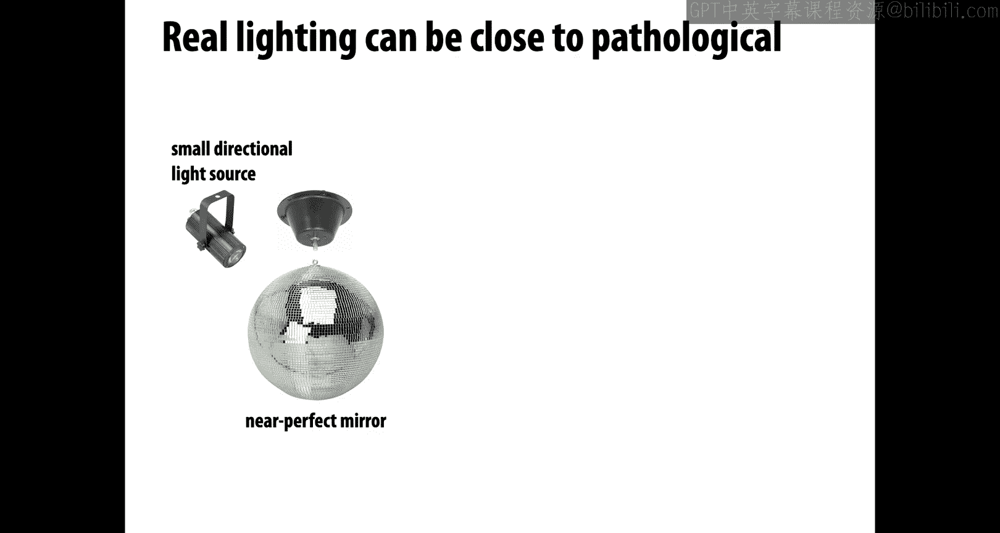

We still want to be able to render a scene that looks like this。 It's some disco scene。

 And we want to do a good job of it。 We want to render it efficiently。

So let's think about what goes on when we try to apply path tracing to a scene like this。

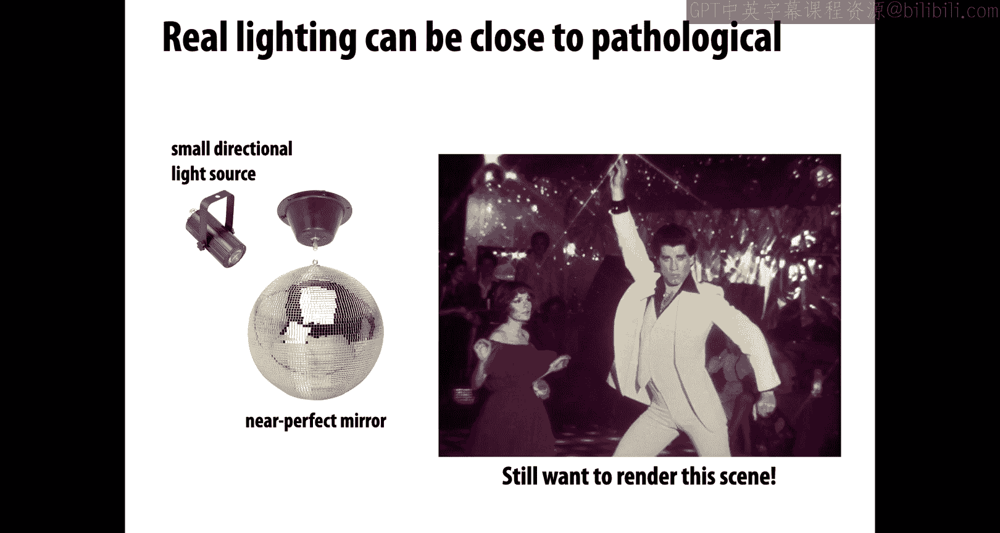

And what we're going to learn is that the important light in a scene。

 the light that contributes brightness to objects。Can have a very kind of spiky distribution。

 It can be distributed in a very non uniform way。Okay。

So let's consider the view from each bounce in our disco scene。

And you see a 3D view of the scene on the right。And the camera near the bottom。

 looking up at the the disco ball and the light shining on it。

So we start out looking from the camera and just to make the images a little clear。

 I've made the disco ball bright， pink and the light source is this black and white object。Okay。

 so I'm looking from the camera and for one of the pixels in the image， I shoot out a ray。

The ray hits the wall。Okay。And now， Im gonna。Do the view of the room from the point of view of the point on the wall。

 so imagine I'm a little bug on the wall at that blue point and I'm looking out at the scene。

And what I notice in this image is even though okay。

 a diffuse surface is going to try to integrate light coming in from all possible directions。

But you notice that the。The only things that are kind of directly bright or lit in this scene are extremely tiny。

 This little tiny pink dot， being lit by this little black light。Okay。Well， let's keep on going。

 Let's say that we still get lucky。 We shoot out a random ray。

 and it just so happens to land on that pink dot。Okay， here's the view now from the。Point of view。

 the disco ball。So the disco ball now looks out again at the whole world。

 it has all these directions to consider， but only this tiny little fraction is being lit by this white light source。

Okay。The light covers a very small percentage of solid angle。

So the light that ultimately arrives at the camera is a very small percentage of a very small percentage of the light source。

And you can imagine this gets worse the more。Bunces we take。

 You can have a very small percentage of a very small percentage of a very small percentage。

If you're naive about how you sample， if you just shoot rays randomly in all directions。

 good luck ever finding any useful light。Right。So the probability that a uniformly sampled path carries light。

Is very small。Especially if we consider long bounces。

 so one answer always to reduce variances is to say， yeah， but that's okay as long as I know。

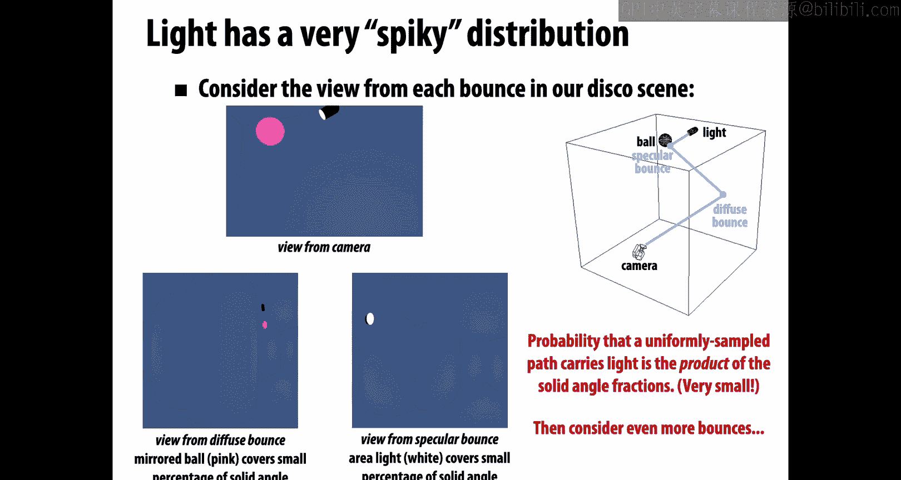

My estimator is unbiased。I can just keep taking more and more and more samples Oh and consistent。

 right。 Keep taking more and more and more samples。 And eventually I know I'll get the right answer。

 So let's just try it。 let's say， look， we're not going to be smart about this。

 We're just going to use compute power to solve this problem。

 So we start out and we shoot out for every pixel in image 16 samples per pixel。

And that's what we get and we look at it and we think。

 what is this an image of I don't even really know。

Is there an object in that image and milk looks maybe like there's a light？Okay。

So let's crank up the samples， we now do 128 samples per pixel。

Maybe I start to see that something's going on there， I'm not really clear。But I'll keep going。

 so now I'm going to do 8192 samples per pixel wholy。This is a lot of work。

 This is a lot of sampling。 And finally， I start to see， oh， O， there's this ball。

 this kind of noisy disco ball， and it looks like it's shining。Kind of caustics on the walls。

How do we get here， How do we get to a nice， smooth， beautiful image without going totally crazy。

With computational effort。And the answer is not that we need know faster processors or anything like that。

 it's that we need better sampling strategies。 We need to figure out how to shoot rays in places where we have useful information。

 useful light in this case。

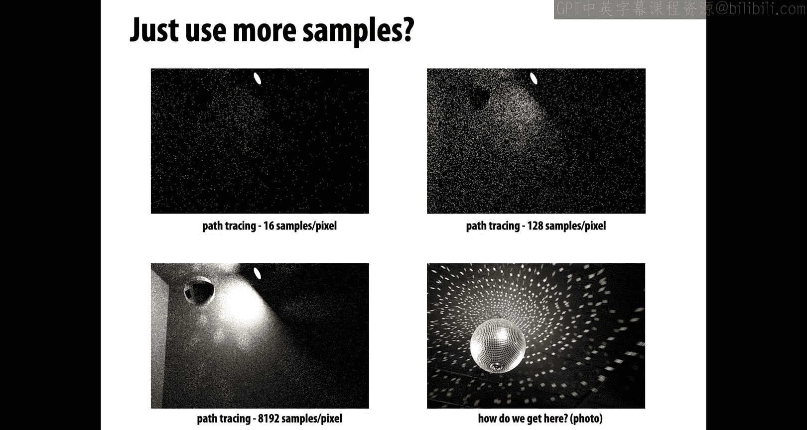

Okay。So let's think back to this idea of important sampling。

 which we've already talked about a little， we have a simple idea。

 just try to sample the integr according to how much we expect it to contribute to the integral。

So let's say we have this really complicated in， we want to integrate the function F。

Our naive strategy is to sample the do main uniformly。

 sum up the values of F at those uniformly sampled points， take the average。

And multiply by the volume of the domain。As we do this。

 what we notice is there's really not much reason to put samples in this flat region of the integr。

 or at least not many samples， because most of the time they're not contributing much。 I mean。

 I'm putting lots and lots of samples in this flat region， they're just adding 0，0。

0 or some small epsilon to my estimate。So。What we could do instead is we could say， well。

 maybe we don't know exactly what the integr looks like。

 but we have a reasonable guess for where the inte is big and where it's small。

Let's call that function P。OkayThat's now a probability distribution。

Different from the uniform distribution that we're going to sample from。

And this gives us our importance sampled Monte Carlo estimate。We pick random samples from。

The distribution P。We still evaluate the in grand F at those random samples。

 but now we divide by the probability density。At each sample point。

We say if this region was sampled more often we're going to wait it less， if this region was sampled。

 less often we're going to wait it more so that everything balances out。Okay。

If I sample x more frequently， each sample should count for less， if I sample x less frequently。

 each sample should account for more。This is going to help， right。

 We're going to spend less time sampling stuff that doesn't matter。

 more time sampling stuff that doesnt matter。What's way of seeing why things get better。 Well。

 here's kind of an extreme case。 What happens。What happens if P is proportional to F directly。

 what if our probability distribution， P is actually just a constant multiple of F？

What what funny thing happens with our Monte Carlo， our important sample Monte Carlo estimate。Well。

Good thing to think about is what is that constant of proportionality now？

The thing I remember about a probability density function is it has to integrate to one。

So if I start out with F that integrates to something， let's call it I。Then in order to get P。

 I need to take F。And divided by I。So actually， this constant of proportionality is。

The integral that I want to compute。And so even if I take one important sampled Monte Carlo estimate with P as my distribution。

Then the first term in my sum is going to be。The constant of proportionality。

 which is equal to the integral that I want。 In other words。

 I'm going to get exactly the right answer for the integral with exactly one。Sample。

So this would be a perfect important sampling strategy。

 just sample proportional to the integr itself。As you might guess。

That's not something we could do in practice， it's a little bit of a chicken and egg problem。

If you remember， how do we sample from a distribution well？We have to do some integration， right？

But in spirit， that tells us why picking a P that looks like F is going to do a good job of reducing variance。

 the closer and closer P gets to F。The closer and closer this quotient just looks like the integral that we're looking for。

Okay。What about in rendering？What kinds of Ps， what kinds of probability distributions can we cook up to help reduce variance？

Well， there's two important classes of local important sampling strategies。

We talked a little bit about last time one is to important sample according to materials。

 so for instance， if I know I have a very glossy material with some really strong reflectance in the direction in the reflected direction or near the reflected direction。

 I can kind of sample a lobe around that reflected direction。If it's more of a diffus surface。

 then I know I want to sample more uniformly， but maybe I use cosine weighting like we did last time。

An important special case， kind of a limit case is a perfect mirror。

 right if we know that the only light that gets reflected is along this reflection direction。

 then we should really only sample that direction。We can also do important sampling of lights。

You might remember last time we did important sampling of an aialite， integrate over the aialite。

 rather than integrate over the hemisphere， and that really。

 really helped to really reduce the variance of our image。Again。

 an important special case is a point light source。

What should I do if I want an important sample of point light so as well。

 it'd be pretty stupid to do anything other than。Directly send are rays toward that point in space。

Okay。What else can we do， how can we go beyond this local important sampling of the light or the materials to reduce variance？

Well， here's a really valuable perspective on。Rendering is to think about things rather than in terms of sampling the current hemisphere around our point。

We can think about。The whole space of all possible paths of light through our scene。

We think about that as the domain that we're integrating over。

And then think about how do we pick out interesting and important。

Subsets of that paths that carry light through our scene。Okay。

 so so far we've been thinking about everything in terms of this recursive rendering equation。

One step at a time， we estimate this integral， to estimate that integral。

 we have to estimate another integral that looks like it and so forth。

And so we've tried to make intelligent local choices at each step。

The path integral formulation says actually we can think of the estimate or the integral I。

As an integral over all possible paths for the scene。

Each sample is now a whole path going from the light to the eye。

And F is just how much total light is carried by this path。

so it's any light that came out of the light source。And that at each bounce。

 modulated by the reflectance function， may be adding some emission on the way there。

And then we have this tricky question of well， how much？Of the path space does this cover。

 how much does that contribute to our inte？But this picture really opens the door to much more intelligent。

 global， important sampling strategies。It's a really nice perspective， it's still hard to do。

 it doesn't immediately solve the problem， but it lets us think about this in a broader way。

So here's a nice way to visualize this path space is to say， well， look。

No matter how we're doing our。Our paths， how we're parameterizing our paths， at the end。

 they're always determined by a sequence of random values in 01。

 we're always making calls to the random number generator on our computer。

That thing's always returning values in the range 01。And so we can think of actually。

Any path is being described as a sequence of values between 0 and 1。Or a little more， I don't know。

 Gemetrically， we can think about。Those that sequence of points as describing points in a unit cube of dimension k。

If I have two random variables between zero and 1， that's the same as a single random point inside the unit square。

For each point inside that。Unit hypercube。We have an associated value。

We have the radiance carried by that path。Okay。So then our whole idea of rendering instead of this recursive rendering equation becomes。

 well we just want to integrate over cubes of each dimension k。So for instance。

 let's consider a scene in 2D just because we can draw the pictures。

We have a scene that's like a blueprint for a house。The little white regions are windows。

 there's some doors and so forth。And。We just for the moment want to focus our attention on paths that have two bounces。

Okay， so we started the eye。We shoot out array。It hits somewhere we have to pick a random angle theta 1。

For the next direction of our array， we hit another point and we have to pick another angle theta 2 for the next direction of our ray。

Each of those angles。Even though the angle is maybe between zero and pi for the hemi circle around that point。

We initially generate those values with values in the range 01。Okay。

So what we can do is pretty cool is we can plot for each pair of angles。

Did this ray hit a wall or did it hit a window。In this kind of simplified picture。

 we're going to assume walls are black， they don't contribute anything， and windows are white。

 there's just bright light shining through the window。Okay。

 and so this is what the view of the world looks like through this， you know， picture of。

Two bounces in this square。What do we want to estimate we just want to estimate。

The total brightness of this two dimensional image now。We consider all possible paths of length too。

Then all of the light that those could possibly transmit is the integral of this image。Right。Now。

 one thing we talked about last time is that as we add longer and longer paths。

 we actually get some important stuff in our image。

 right longer paths do quite often carry important stuff， important amount of illumination。

 for instance， going through glass or water。Or something like that。

So if we really want to get the whole image， we're going to have to integrate over a one dimensional cube。

 a two dimensional cube， a three dimensional cube， a four dimensional cube and so forth。

 and probably use Russian roulette to decide when to stop。Okay。But if we want to find good paths。

 we still have to answer this question， how do we choose which paths to use and how do we choose？

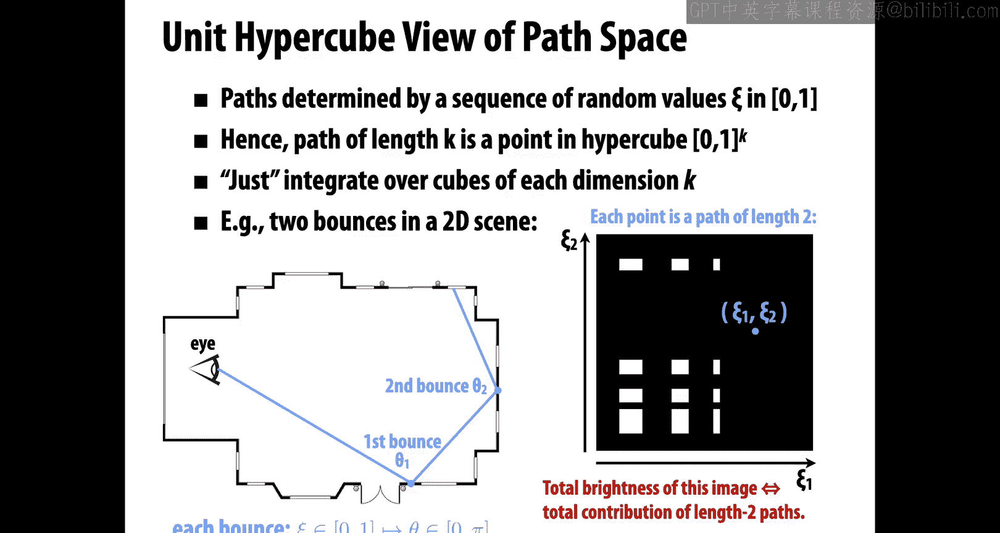

Which path lengths to use？So one nice idea is the idea of bidirectional path tracing。So far。

 we've been always tracing paths from the eye， hoping that we'll hit a light source。

Now we're going we're going to think about going the other way。 Well。

 what about starting from the light source and seeing if we hit the eye。Well。

 what about combining those two strategies somehow？So with forward path tracing。

 we have no control over path length。We shoot out a， bounces around and。

It hits a light after n bounces or it gets terminated by Russian roulette。

The idea in bidirectional path tracing is to connect paths or subpaths from the light and the eye。So。

 maybe we。Start at the eye， we do you know one bounce， we start at the light。

 we don't do any bounces， we just hit the surface， and then we say， okay。

 if we connect those two subpaths up， we can still compute for that total path。

 what is the amount of light that it carries？To correctly add that to our。Estimate。

 we need to carefully weight the contributions of paths according to the sampling strategy， but okay。

 that's something we can。Sit down and figure out， and I won't go through all the details here。

 but you can find it in this article。It's interesting to think about bidirectional path tracing。

 even in the case where we're just considering length two paths。In standard forward path tracing。

 a length two path would look like this， I started the eye。I hit the surface， and。

Then I bounce and hopefully I hit a light。I could also。Have a path where I。

Shoot out a single ray from the eye， I hit a surface。

 and I connect it directly to a point on the light。That's what we do when we do direct lighting。

Which is usually a pretty smart thing to add to your estimate。Or we could go the other way。

 we could start the light， shoot out a array， see where it hits the environment。

 then connect that directly to the eye。Or we could do full on backward path tracing。

 shoot out array from the light。See where it hits the scene。Boce it off again。

 and hopefully it hits the eye。Okay。And these。Upper left and bottom right。

 strategies corresponded to。Kind of important failure cases One is， well。

 if I just do this two bounce thing， I'm going to fail always to see point light sources。

There's just no chance this。Balance actually bounces into a point light source。Likewise。

 if I do this backward path tracing， it's going to fail completely for pinhole camera。

 There's just no way that I bounce off the table and perfectly bounce through the pinhole。Okay。

So different。Not only path lengths， but actually different combinations of eye。

 subpath and light subpath lengths are going to contribute。

Different features are they're going to handle different phenomena。

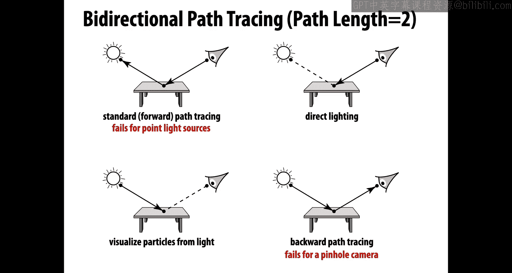

Here's a nice。Image that decomposes the light by these。Path lengths are by these subpath length。

So on the upper right， we have the final image， kind of the true image that we're trying to render。

And then in each row， we're increasing the total path length。And as we go across a row。

 we're saying how many edges of the path belong to the eye versus how many belong to the light？

OkayAnd you can see all sorts of interesting things going on。

 especially with this glass egg on the table。There's some choices of eye and light subpath lengths that really capture the brightness of this egg。

 the light that really travels through this egg。But it's not intuitive at all。 You couldn't sit down。

And write very easily a general expression saying， oh， yeah， for all scenes that I'll ever encounter。

 these are the kinds of paths that matter。It's really hard。

 and you can just tell in general from this image that you know good paths are hard to find。

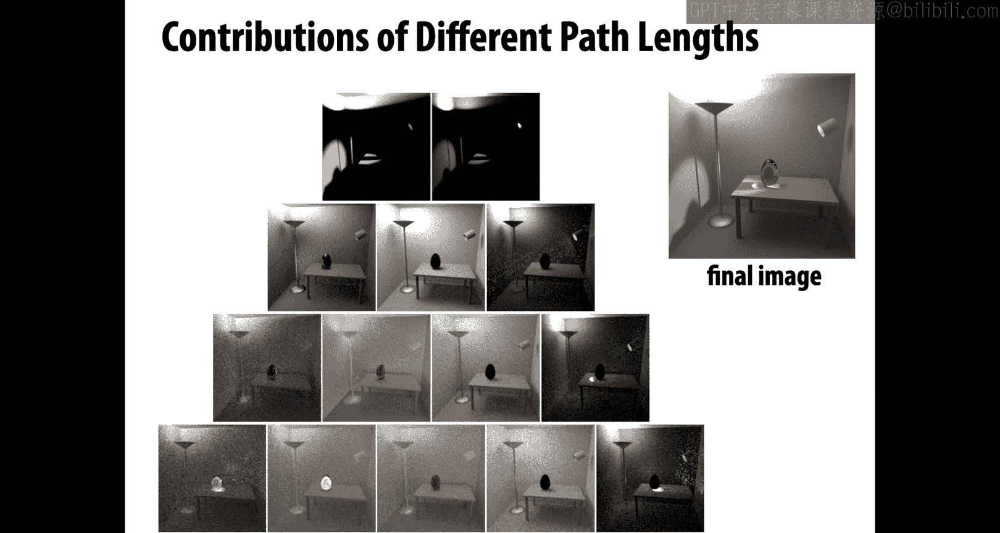

Another great example that has more to do with。In some sense， geometry then。Then path length is。

This little example again from Eric Beach， this room。

 so we're looking at a room from above or a layout for a building from above。And。

The eye or the camera is looking at a table with some objects on it。

And we're going to do path tracing。 So we shoot out a path from the eye。 It bounces around the scene。

 even after multiple bounces。It fails to find this little crack。

 this little place where the door is just barely open。And the light is shining from the other room。

So in this scene， there's no light anywhere except in that other room。 And so that path is dark。

 It doesn't contribute anything。 We try it again。 It bounces around。

 It fails to find this cracked door。 doesn't get any light。 You know。

 you try this again and again and again and again， doesnn't find this cracked door。 Well， eventually。

 maybe you find finally， we found one path。That carries some light。

And even if we do bidirectional path tracing， even if we also try to shoot out。Paaths from the light。

 Well， they're going to have the same problem。 They don't go through。The door。

 and so if we even try to connect eye subpaths and light subpaths that。

Line or that segment connecting them is usually going to be occluded。

 It's going to pass through a solid wall and won't contribute anything to the result。

So here's a new idea。Which is to say， look， some paths， some good paths are really。

 really hard to find。 they might carry most of the illumination in the scene。

 but they're really hard to find。 So what we're can do is once we find a good path。

Rather than throwing it away and starting over again， we're going to perturb it a little bit。

 We're going to just move。Or。Degrees of freedom a little bit maybe change the angles ever so slightly to find nearby good paths。

And that's the idea behind something called metropolis light transport。

 so here's an image generated of the same scene， much less noisy and in much less time。Okay。

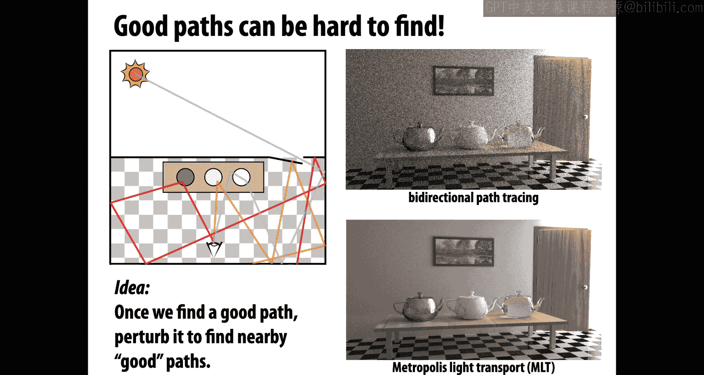

So in general。Metropolis light transport is based on something called the Metropolis Hastings algorithm。

So in standard Monte Carlo， we sum up independent samples as we've always been doing。

In metropolis Hastings。We are actually going to take a random walk。Of dependent samples。

We're going to start with a sample and then we're going to change it or mutate it to get the next sample。

The basic idea is that we prefer to take steps that increase the sample value。

 So if we found a good sample， one that has a large。Value in the integr。

Then we don't want to move too far away from that sample point if we're really at a low point in the in。

 then we'd be very happy to walk away from it and go somewhere with a larger value。Okay。

So maybe I start at this blue point， I start wandering around。

The probability that I move to a new point has to do with。Hao。Much the in changes。In particular。

 I could say。That alpha is the ratio of the function value。

 the ingr value at the new point divided by the ingr value at the previous point。

That value is something I'm going to call the transition probability。Now， one thing to be careful of。

 it's not quite a probability。Because it could be much bigger than one。

The value at the new point could be 100 times bigger than the value of the old point。Okay。

 but what we're going to do with it is very。Much like what we do with a probability， we'd say， okay。

 if we pick a random number between0 and1 and it's less than alpha。

Then we go ahead and actually transition， we actually move to the next point。

 otherwise we just stay where we were。So if the new point is very。

 very small in value relative to the old point。And it's extremely unlikely that this random number。

Is less than alpha。And so we'll just stay where we are。And vice versa。Okay。

And so if we're careful about how we do all this， then as we start wandering around in the domain。

The distribution of sample points， where our sample points land in the domain are actually going to become proportional to the integr itself。

One thing we have to be very careful about is to make sure that the mutations are ergootic。

 which is just a fancy way of saying， make sure that our paths can actually reach everywhere in the domain of integration。

So you can imagine maybe there are big regions of the domain where the integr is zero。

Well based on our little algorithm here， we'll never pass through these zero regions。

Which means we'll never maybe move into some more interesting regions on the other side。Yeahep。

We also need to make this really work， we need to do this for a really， really long time。

So that there's not a bias towards values at the initial point， right。

 we picked some initial random starting point。Initially this random walk is going to be more concentrated around that starting point than anywhere else。

 even though that has nothing to do with the actual in。Okay。But if we're careful。

 we really do get the right result and here's kind of a simple。Example， we want to。

Integrate or we want to take samples proportional to the density of an image。Okay。

 so I have some just image。F I'm going to start at a random point。

And I'm going to take steps in a random direction。And how far am I going to walk in this case？Well。

 I'm just going to pick the distance that I walk from a normal distribution from a Gaussian distribution。

Every once in a while， I'm also going to jump to a completely random new point to make sure I'm exploring the whole space。

So that is a really simple strategy for making sure that my。

Random walk is agotic is just every once in a while I'll say， okay。

 I do kind of more like the original Monte Carlo thing， just pick a completely random。Sample。

The transition probability is the relative darkness。

 I'm just going to look at how bright is the new point of the image versus how bright was the old point of the image。

Typically if it gets brighter， I'll move there， typically if it's darker， I won't move there。Okay。

So here's an example of what that looks like。We started out at some point in the middle and what I'm plotting here is every single time I land at the point in the domain。

 I'm just making that point slightly lighter。And so the longer I walk。

I'm going to start to see a distribution emerge。Bririghter points are places where I've stayed around longer or I've seen those points more often。

Daarker points are places where I quickly left those regions。

 I didn't think they were very important。Okay， and I'm going really。

 really slow here intentionally so you can get a feel for what a random walk looks like。Now。

 if I speed this process up a lot。And I start taking。Lots and lots of steps。

Over a long period of time。What you'll start to see is an image that fades into existence。 Again。

 I'm just plotting the distribution of where this random particle has ended up over time。Okay。

 and at some point。Thoseho of you at。CMU should be able to guess。What is the image that I'm。

Looking at。So what is this？😔，Well you see a lot of。Bridges， so this must be downtown Pittsburgh。

Right。So pretty cool by just looking at a very， very simple local rule， oh。

 go places that are brighter more often。This completely random walk ends up being distributed proportionally to this image。

It's pretty cool。And why is that useful or why is that interesting in rendering？

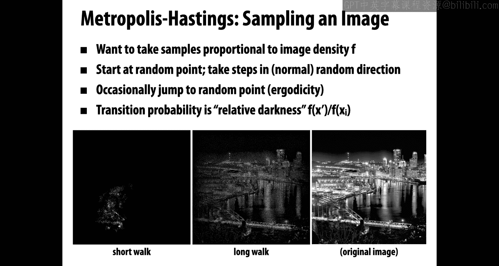

Well， again， because for a lot of scenes。I don't really know ahead of time， which。

Paths are going to carry a lot of light。It's a really hard thing to figure out。

Ahead of time in general for all possible scenes。So then the idea is to say， well， fine。

 I'm just going to start randomly exploring the space of paths， I'll shoot out some random path。

 maybe with bidirectional path tracing。And to get the next one， I jiggle it a little bit。

And just like we were walking around on the image， now I'm essentially walking around in path space and I'm going to spend more time integrating places that have paths that carry a lot of light。

Okay， and that's about all I'm going to say about the algorithm。

 The details take a little bit of work， but again， you can read about it in this article。

 but just to show the payoff， this is a example of a swimming pool， you know。

 like coming into the swimming pool that has to hit the surface， refract in， hit the bottom。Bce out。

 refract out， hit the eye， and with pass tracing， it's super noisy with metropolis light transport for the same amount of time。

 you get a much clearer image of what's going on。

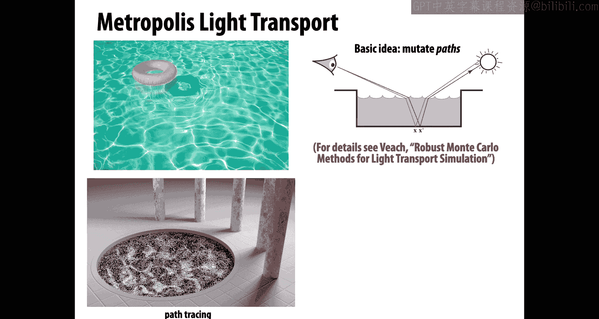

Okay。What else can we do to reduce variance well one thing we've started to see is that we have lots of different important sampling strategies now。

Right， maybe we have。You know， two different functions， P1 and P2。

Which one should we use for a given in grand？If the picture looks like this。Right， well。

 maybe we can guess， oh， okay， well， P1 looks like the left lobe of the function and P2 looks like the right lobe。

 but。The right lobe seems a little shorter， so maybe we use P2 a little less often。

When we're talking about。Important sampling over path space or doing you know different kinds of light and material important sampling strategies。

 it's really not so clear there's not really a picture you can just look at and say， oh yeah。

 these are the ones we should use and this is how often。

So there's this idea of multiple important sampling。

Which is an automatic way to combine different important sampling strategies to preserve the strengths of all of them。

And these are all a little bit heuristic， but you can prove。

That certain heuristics are sort of asymptotically about as good as anything else you could do。

So one is called the balance heuristic， which says， okay。

 have these different important sampling strategies。

I'm going to take samples using all of the important sampling strategies。

And then my estimator looks like this。 I have one over and is the total number of。Samples。

 overall strategies。I'm going to do an outer sum over the different possible strategies， so here。

 for instance， over P1 and P2。Then I'm going to sum over all the samples I took with each important sampling strategy。

And F of X Ij is the Jith sample taken with the IF strategy。I'm going to divide by。The some。Overall。

 strategies of the fraction of samples taken with a CAith strategy times the k importance density。

Okay， very， very simple formula to plug in。And。What it does is it makes sure that no pathological behavior happens if you have a。

Really bad， important sampling strategy and a really good one。

 this will tend to give you something more like the good one than the bad one。Okay。

 and then there's several different ways you can do even better than that。

But this is a pretty good technique。

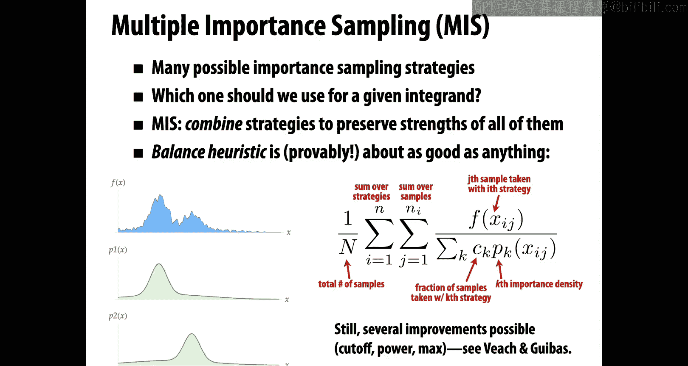

Here's a nice example。Showing the effect of using multiple important sampling when you have either the choice。

Two important sample based on the light or on the materials。Okay。

 so we have this really kind of clever scene where we have lights of different sizes at the top。

Going from small to large。 And on the bottom， we have these four panels that have different materials on them going from really。

 really。Almost perfectly mirror like at the top to almost diffuse like at the bottom。

 we have these kind of glossy materials in between。And so if you think about this for a minute。

 you think， okay， well， for which， you know， which panel and which light source is it good to sample from the light importance。

Distribution versus the material one。 So we know that like for a point light。You know。

 it's really pretty important to shoot rays directly towards the point。For a diffuse material。

 it really doesn't matter which direction you shoot。

So maybe if I'm a diffuse material and I'm looking at a point light。I should be sampling the lights。

 and that's what you see on the bottom right of the rightmost image。And so on。

And what you see in the middle is that even though each of these individual sampling strategies can kind of fail and not really do a good job when I combine them with multiple important sampling。

I get this beautiful combination the best of both worlds。

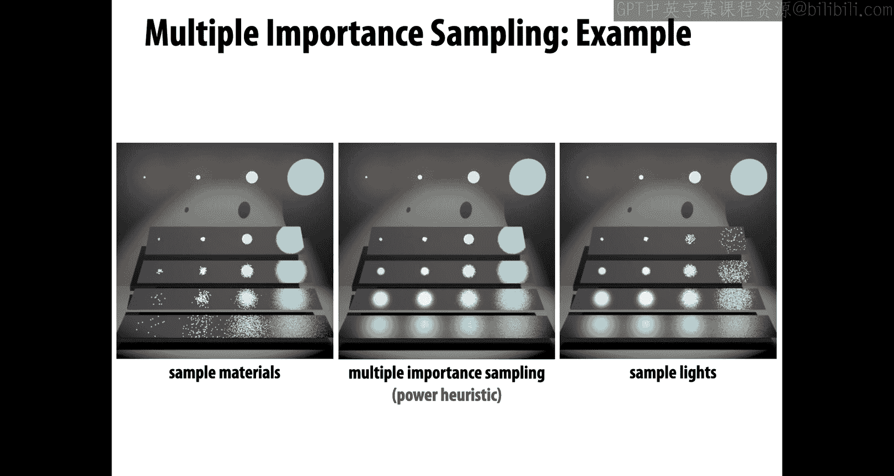

All right。So importance is important。But it's not the whole story when it comes to variance reduction。

There are other questions we can ask completely different。

Aspects of this numerical integration process that can reduce our variance。 For instance， we can ask。

 how do we sample our function in the first place， How do we come up with samples。Okay。So in general。

 what we want to be able to do。When we're doing， let's say important sampling is pick samples according to a given density。

Okay。And so far we've been suggesting， let's say we have a uniform importance。

 then we've been saying， oh， just pick uniformly at random values between0 and1。

The reality is that uniformly random samples don't actually look as random as you might expect。

So I believe that in this array of three by two boxes in the bottom left， the bottom rightmost one。

Is actually uniformly random and what you notice is that samples kind of clump up in an ugly way。

If you call Rand many times， you'll see this kind of behavior。And because of that。

 you're going to get more variance than you really should from this uniform estimator that you could。

 let's say， you could try using these other sample distributions that at least to the eye look a lot better。

 look a lot more uniform。Same story if I have a non uniform density。

Let's say I want a sample proportional to this image， this little image of a face。Well。

 I'd like to get a sample pattern that looks roughly like the one we see here。

There's fewer samples in certain regions than others， but within those regions。

 they're spread around nicely and evenly。Okay。So how do we get sample patterns that will give us low variance for our estimator？

Here's one basic technique。 that's almost always a good idea。

So how do we pick n values from 01 again， if we just pick them uniformly at random。

We get something that doesn't look that uniform are these points。

 these blue points were values that I got by just calling the random number generator。

is supposed to give me uniform values。 It does indeed give me uniformly distributed values。

 but uniformly distributed random values behave in a weird way。 They can have large gaps。

 they can have clumps。Okay。So a different idea is to say， no， no， no。

 I want these to be nicely spread out， so I'm going to split the domain into N bins。

And then pick uniformly in each bin。So here I've broken up the domain into bins of size 1/8 within each bin。

 I've picked a uniformly random value and by construction they get spread out a lot better。Fact。

 in fact， the stratified estimate can never have larger variance。Thenhan the original。Eimator。

And typically lower， often much lower。Why is that true， Well， here's some good visual intuition。Okay。

If I'm。Picking over the whole function。Then I am kind of suffering from the variance of the whole function。

If I'm picking in these little intervals， then within each interval。

 the function has much smaller variance。And you can actually prove that the stratified estimator is never worse just by using a very basic property that we have seen a couple of times now。

 the linearity of expectation， the fact that the expected value is a linear map。Okay。So。

Simply replacing uniform samples with stratified ones already improves the quality of sampling for rendering and lots of other graphics and visualization tasks。

We could do this not on an interval， but we could do this on interesting sets that we need for rendering here。

 what we're doing is sampling actually not the hemisphere， but a triangular region on the hemisphere。

So you could think maybe this is the projection of a triangular light source onto the hemisphere。

And if we do this with uniform sampling， we get this clumpy sampling pattern。

 if we do this with stratified sampling， we get a much nicer sampling pattern that actually has less variance。

So this idea of not having clumps in our sample pattern hints at one possible criterion for。

Good sample， good set of samples， which is。The number of samples in a given region should be proportional to the area of that region。

Sounds very natural。And。Discrrepancy。The notion of discrepancy is。

The measurement of a deviation from this ideal distribution of samples。Okay， so for instance。

Let's say I have a box with these black samples in it。And I have a region S。Then I would say。

 the discrepancy of。Li。Sample points x over the region S。

Is equal to the absolute value of the difference between the area of S， the area of this blue blob。

Minus the number of samples in x covered by S divided by the total number of samples in x。

So here we're assuming that the box has。A unit area。We can then define the discrepancy of the。

Sample X。Independent of which region we're considering by taking the maximum over all possible regions。

 or maybe we consider some reasonable family of regions like all possible boxes or all possible circular desks。

Okay。And。This is something we generally can't directly evaluate to be really expensive to evaluate。

 but this at least conceptually gives us the idea of what does the discrepancy of a sample mean？

We can also ask， well， if we replace truly random samples with low discrepancy samples。

 why should it be true anymore that we actually get the correct value for our integral？

This whole idea of Monte Carlo integration was predicated on the fact that we're using random samples and kind of the expected value that we get from a single random sample is equal to the true integral。

With these quasimon Carlo methods that use just low discrepancy samples rather than random ones。

 we have a different reason why this works called Koxma's theorem。Okay。

 which basically says that the。Dviation of R。Esimator from the true integral is bounded from above by the discrepancy of the sample X。

And the total variation of the function we're integrating。

 so just the integral of the derivative of that function。So intuitively。If the function is really。

 really variable。And our samples aren't doing a good job of spreading themselves out over the domain。

We're going to do a poor job of estimating the integral and vice versa。Okay。So for low discrepancy。

 samples X， we approach the true integral， and this is just a one dimensional expression here。

 but similar bounds can be shown in higher dimensions。One thing that's maybe weird about this is。

 well， for the kinds of functions that we want to integrate in rendering。

The total variation isn't bounded。The derivative of the function is infinite whenever we have a discontinuity we go from。

You know， the foreground to the background， something like that。Still。

Things tend to work out in the way we expect。Also， this theorem only applies if we're talking about access aligned boxes S。

 but okay， this is a reasonable notion of discrepancy。

Even though edges in real images can have arbitrary orientation。Again。

Discrpancy is still a very reasonable criterion in general for deciding。

 is this or isn't this a good sampling pattern？Okay。

 so how do we actually generate some low discrepancy samples。

 we can't just call our uniform random number generator anymore。

But we can actually generate samples with near optimal discrepancy pretty easily。

So just to sketch this out， I won't go into gross detail about everything。

 but first what we're going to do is define something called the radical inverse。

So the radical inverse takes an integer eye。Expresses it in base R。

And then reflects the digits around the decimal。 So， for instance。If I have the integer 1234， 1，234。

 I express it in base 10。Okay， it's already expressed in base 10。

 and then I reflected around the decimal， I get 0。4321。So。

I can get a certain kind of low discrepancy sample called Halton points， x1 through xN。

In K dimensions。Bai。Taking this radical inverse function。And applying it to。Integer I。

 so if I want eye samples， I is the one that I'm looking at right now。

And I'm going to look at the radical inverse for all the bases that are prime。

From the first prime up through the Caith prime。Canne get it。

Set of samples that look like what we see on the bottom。Why does this work I won't try to explain。

 but this will give you a low discrepancy sample？Another thing I could do is use what's called a hammersly sequence。

So again， using this radical inverse function， I do I over n， and then I do the radical inverse。

With respect to the base of the first prime number of I， second prime number of I， and so forth。

All the way up through k minus1。On the bottom right we see an example of a hammersley sequence that actually looks a little better than our Heelton sequence there's less clumping。

 it looks more uniform， the downside is we have to know ahead of time how many samples we're going to take。

So often in Monte Carlo rendering， you want to keep going。

 adding more and more and more samples until you're happy here we have to pick that number ahead of time。

Okay。So if you've been paying close attention to these definitions， this idea of low discrepancy。

You might say， waitai a minute， this is a lot of work， you have to do some really funky stuff， but。

Isn't a regular grid already a pretty great example of a low discrepancy sampling pattern？

If I take a random box and throw it down in that region。

 the number of samples that I contain is really going to be proportional to the area of that box。

So what's so bad about using a regular grid。 And the answer is well there's more to life than discrepancy。

 there's other things that will cause problems with your estimate。

So even low discrepancy patterns can exhibit poor behavior， especially this regular grid pattern。

So just to really put the finger where it hurts， let's consider this function。

 this kind of sinusoidal function。And let's say we want to integrate that over the square。Well。

 if I put down a regular grid of samples。In just the wrong place。

I evaluate the function at those sample points and I take their average。

Depending on exactly how the grid lines up with the function。

 I could get completely different estimates。On the left， I might get one。

 if the grid shifts a little bit or the function shifts a little bit on the right， I get zero。

So this is clearly an undesirable behavior， this is going to cause all kinds of aliasing when we go to render an image。

And so what we'd really like is for this pattern to be at least anisotropic。

 it doesn't have a preferred direction。We'd also like it to be something that doesn't have any preferred frequency。

 it doesn't line up with。Features of a certain size。But is kind of。

Equally treating features and frequencies of all different sizes the same way。

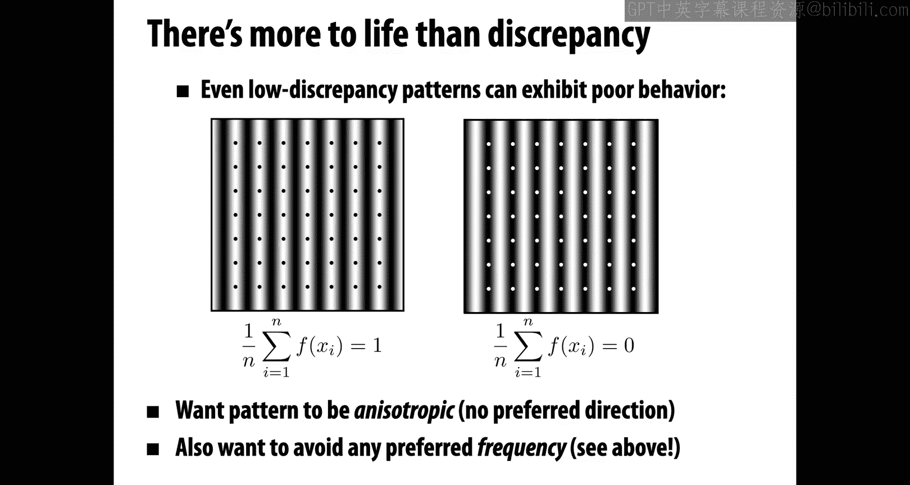

So one type of sampling pattern that does a pretty good job at this is something called blue noise。

 and this has got some biological motivation that if you look at the retina of a mammal like a rhsus monkey。

Then you'll see that the cells on the retina have a nice distribution。

 and if you plot the centers of these cells， they're going to look something like this pattern on the right。

 which is known as a blue noise pattern。 We'll talk a little bit about what that means in just a second。

 but the high level is there's no obvious preferred directions in this pattern。

And there aren't really preferred frequencies， you might say there's a kind of smallest scale。

 the separation between the points， but otherwise。I don't see clear grid lines or something like that in this pattern。

How can we be a little more precise about this notion of an isotroppy and uniform frequency distribution where we can analyze the quality of a sample pattern in the Fourier domain？

We've looked at a couple of examples of this before。Where we can take an image。

And express it in terms of its frequencies along different directions。

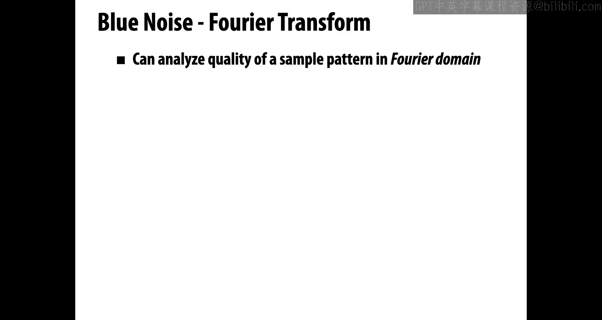

So here we'll do this for our different sample patterns。

We can just take an image of our sample pattern。And we can ask in each direction and at each frequency how much。

Does that pattern line up with a kind of sinusoidal wave along that direction and with that frequencyr。

 with that width？So in the center of our plot。R is a number just representing how much does the pattern line up with a constant function？

As we go。Out from the center。The radius on this plot is representing the frequency and the direction that we go out is representing。

 well， the direction of this sinusoidal wave。So if we look at the Fourier transform for the regular pattern。

 what we see is。That the Fourier transform looks really kind of ugly。

 there's some frequencies that really line up really well with the pattern basically anything that's a multiple of the grid spacing。

Along the x in the Y direction， we have some clear preference and so forth。

If we look at this blue noise pattern on the right， it looks a lot more uniform。

 it's not perfectly uniform， but it looks a lot more uniform。

We notice especially for higher frequencies。There's not much of a， you know。

 preference in direction or in。Frequency。And in the middle， we have this very bright ring。

Which really just corresponds to the spacing between sample points。Okay， so in general。

 you get the sense that this blue noise pattern is going to do perhaps a lot better job at avoiding aliasing。

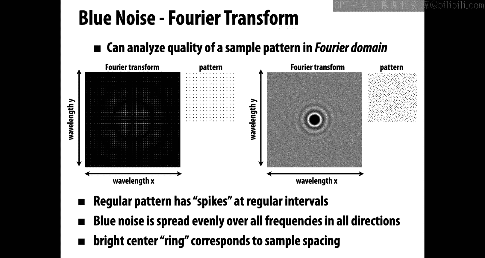

And in fact， if we use it for some kind of integration task， we'll see that that's really true。

So at the top， we have three different sample patterns， something that's uniformly random。

 something that looks pretty good， but is not quite the same as our blue noise pattern。

 And then on the top right is the blue noise。To really see kind of look under a microscope or get a sense of are these really good patterns。

 we can look at the spectrum？And the uniform pattern actually does really a good job in the spectral domain in the sense that there's no bias。

But it has these other problems we've talked about， it has actually very high discrepancy。

This middle pattern， although it looks pretty nice when we just look at the samples。

 you can see it has some artifacts in the spectral domain， some preferred directions。

 and if you go back to the pattern， you see actually there are kind of these little regions that are almost regular grids。

And on the right， we have this blue noise pattern that really is uniformly distributed in both frequency and direction。

It has it much better。Discrrepancy than the。Uniformly random pattern， much lower discrepancy。

So what are we going to do with these patterns， we're going to take the zone plate image。

Which is just an oscillating。Concentric circles of higher and higher frequencies。

And we're going to use this pattern to average that function onto each pixel of our image。Okay。

And so what you can imagine that this function kind of should look like as the frequency get higher on iron and higher and higher。

 you'd imagine that the value is just average out and it becomes a uniform gray color。

The uniformly random sample on the left column still has a lot of noise in it。

The pattern in the middle column does a little better job， but you can notice in the upper right。

 this kind of weird stretching artifact， it's not really clear what that is supposed to be。

And in the bottom right， things still aren't perfect。

 but at least for a while we do a good job of turning this high frequency oscillations into a nice uniform gray。

Okay， so sampling perfectly is never an option， eventually things are going to break down。

But we can try to have low discrepancy， we can try to have good spectral distribution。

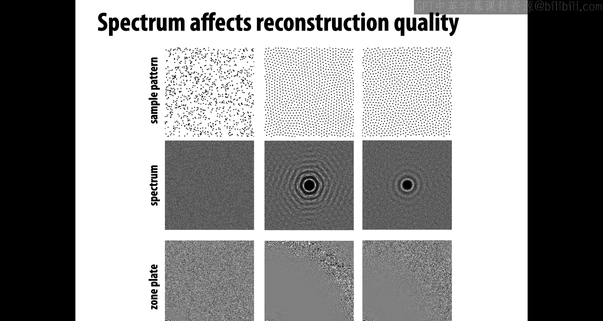

How do we get good samples， how do we get something like a blue noise sample， Well。

 one of the earliest algorithms is something called Poisson disk sampling。

And the basic idea is to just iteratively add random non overlapping discs of some fixed size until there's no space left。

So I plop down a disk， I plop down another disc， if my new random disc overlaps one that's already there。

 I toss it out and I try it again。If you use this strategy。

 you get a sample pattern that has pretty decent spectral quality， but you can do better。

So the next best thing you can do is take these points and iteratively move。

Each point to the center of its neighbor。You， it's local neighbors。

 so kind of try to find your can nearest as neighbors， find their average。

 try to move yourself toward that average again without bumping into each other。

 do that over and over and over again， but you'll eventually settle into a nice pattern。

This does a little better， it's slow to converge， we can do even better and actually drawing from an idea that's common in geometry。

 which is to use the voronnoi diagram。 So this is a natural evolution of this lloyd algorithm。

 which is to say we're going to associate each sample point in the plane with a set of closest points。

The so called voronnois cells。 So here the black dots are。Our vnois sites。

 the points that we want to arrange in the plane， and the colored regions are the regions that are closest to each of those points。

Okay。And we can then optimize qualities of this diagram。 So we could say， okay。

 this original one has cells that have all these different shapes and and sizes。 Well， at very least。

 maybe what we want is that each。Site is at the center of the cell at the center of mass。

Or maybe you also want to optimize these cells so that they have roughly uniform area。

And as you do this， you get a set of sample points， these sites that look really nicely distributed。

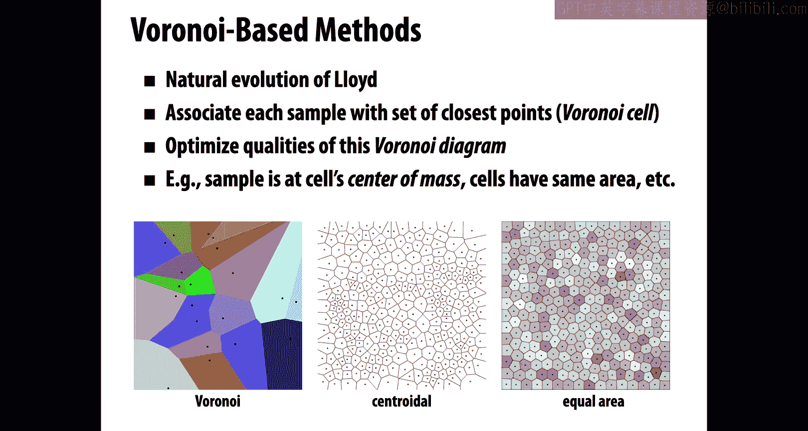

So we can do this not only for just uniformly sampling the plane， but also if we have。

 let's say image based lighting， we want to distribute the sample points over the region of the image so that there's more samples and regions that are bright。

 fewer samples and regions that are dark， it's low discrepancy。

 and it has good spectral distribution， right， one it all。

And here we have this nice beautiful sample pattern。

 the computational trade offs is well it's pretty expensive to precompute。But on the other hand。

 once we have this pattern and we reuse this sample pattern over and over and over again to do lighting。

 the amortized cost is a lot lower because we have lower variances for the same number of samples。

Okay。Okay， finally。One thing we have to grapple with。

 especially in an example like this image based lighting is。

How do we efficiently sample from a large distribution？

RightIf we're sampling from an image map that's providing lighting for the scene。

 we have a huge number of。Variables。So。When we talked about sampling from a cumulative distribution function before。

We had this inversion idea， we take our probabilities。

 we take the cumulative sums of those probabilities to get a discrete cumulative distribution。

And then if we want to sample a value from this distribution。

We uniformly randomly sample the interval 01。And we use a binary search to find which event we got from our CDF。

How much does this cost？In terms of the number of possible events。

What is the cost of drawing a sample from this distribution？Well。

 if you ignore any of the pre computationut。Then。The cost of each sample is。Log N。

 doing a binary search。Right。So， if we're doing。M samples。

 then the cost is going to be order M log N。And if we have a lot of pixels in our environment map。

 for instance， this can start to get fairly expensive。So a different strategy that's quite nice。

Is something called an alias table， we can get amortized order1 constant sampling by building this thing called an alias table。

 the basic idea is rather than build a inverse CDf， or rather than building an CDf and inverting it。

 we're going to rob from the rich and give to the poor。

 we're going to turn our probability distribution into something in some sense more uniform。Okay。

 so the way this works is we have our probability distribution， x1。Through x4。

 we have these four events and we have the associated probabilities。

And we're going to go through the list。 And if we have a。

Event whose probability is greater than the average， we chop it off。

 and we move it into one of the events that has a lower than average probability。

And we keep doing this。Until we've filled out a table。

Where every column has two at most two possible events in it。

And those two vents have different labels。Okay and we know that this is going to work out because there's as much stuff above the average as below the average when we start it。

Okay， so now we have this table， this alias table。That stores two identities。

And a ratio of heights per column。To sample from this thing it's really easy。

 we just uniformly pick a value between1 and n， which column do we look at？We do a。By East coin flip。

 we get a value between0 and 1， and we see is that value less than or greater than the ratio stored in that column？

If it's less than we store or we return the first event。

 if it's greater than we return the second event。Super simple。In some sense。

 even perhaps easier to implement than this idea of inverting a CDF。Okay。All right。So that's great。

 so now that we've mastered Montete Carlo rendering what other techniques are there。

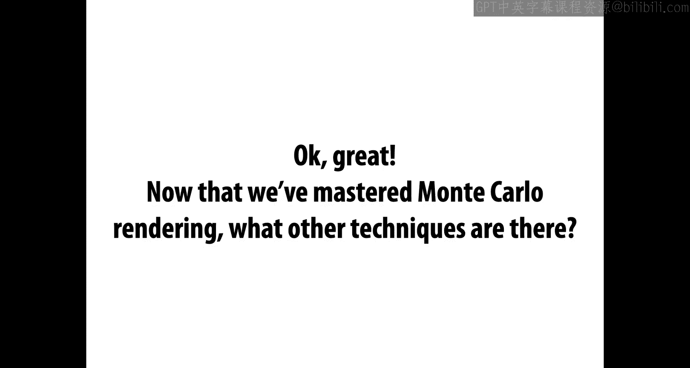

Just to wrap up， you know there are a lot of things that we haven't talked about in terms of rendering algorithms。

 one of the most popular ones is something called photon mapping。

So here the idea is really a strategy from the light source rather than from the eye or。

Something that combines the two in some sense， like bidirectional。Tracing。

 so we trace particles from the light。 and rather than immediately constructing pads。

 we're just going to store。These。Photons， these paths that we got from the light in a spatial data structure in something like a KD tree。

Now when we go to render our scene， we shoot rays from the eye and we see which photons are nearby。

And we gather up this。Illumination to computer estimate。

This is especially useful for features like Coustics。

That really have to do with light getting focused through reflected material。

 it's also useful for things like fog， participating media。And here again。

 we can use these ideas about sample patterns to improve quality。

 so maybe you take the locations of these photons in the scene and you run some kind of ld relaxation or orrenoid diagram to get a better distribution。

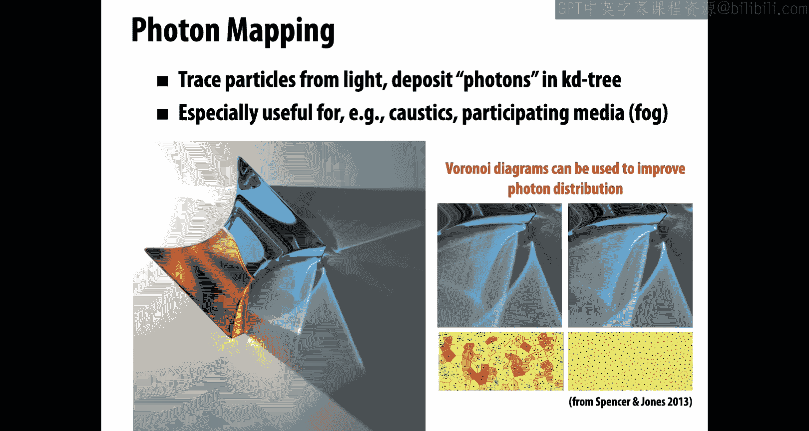

Finally， a strategy that is。Kind of one of the first methods for global elimination is finite element Raity。

So this is a very different approach， rather than really thinking too much about rays and ray tracing。

 we're going to chop up the geometry of the scene into little patches。

And then ask how much light gets transmitted from one patch to another。

This sets up a large linear system that we can solve for the equilibrium distribution of light in the scene。

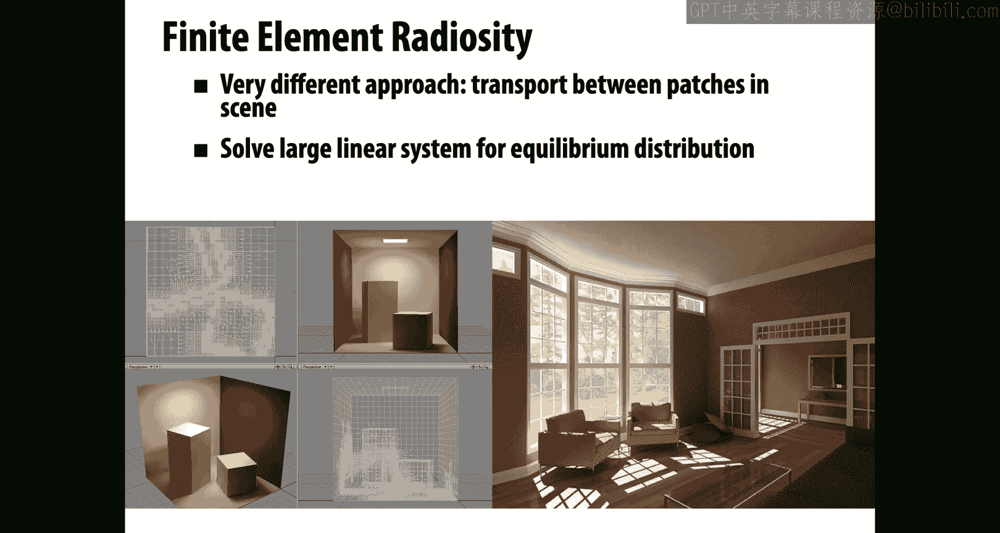

So this is really good for diffuse lighting if you have mostly painted walls and so forth。

On the other hand。It's very challenging because you have to solve this hard meshing problem。

 you have to cut up your mesh or your scene into nicely shaped elements。

And that can be a huge headache in practice。Okay。So we can return now to this list of。

Consistency and bias and get a sense of， how did we do in each of these algorithms？

We said rasterization is not consistent and it's biased。

 path tracing is almost consistent and unbiased， but can miss certain types of light paths。

Biodirectional path tracing gets them all because we can trace from the light or from the eye and connect them up in any way we choose。

Metropolis light transport can also capture all paths。

 usually it's seeded with paths from bidirectional path tracing。Photon mapping， interestingly enough。

 is consistent but biased。So as we add more and more and more photons to the scene。

 we'll approach the correct answer。But for a given set of photons。

 the expected image we generate is not the same as the true image。And finally。

 radioity is neither consistent nor unbiased because at least in its basic form。

 it can only model diffuse elimination。Just like。Raststerization and to some degree path tracing。

 it ignores important types of light paths。

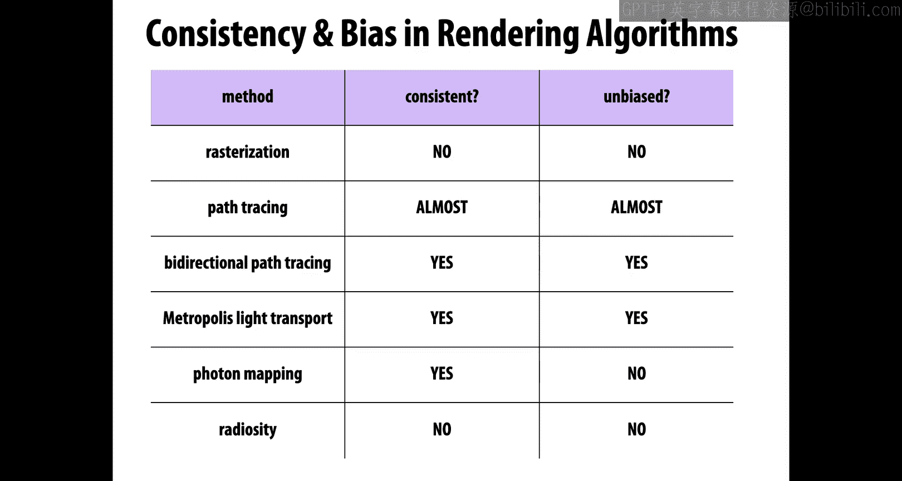

Okay。One final question that's really interesting to think about from the perspective of computer science is。

 can you certify a renderer？So can you come up with a renderer that comes with a certificate。

 a provable， formally verified guarantee？That the image it produced correctly represents the illumination in a scene。

And even though Monte Carlo estimators are。Consistent and unbiased。

This is harder than you might think。This is kind of an inherent limitation of sampling。

 something we've been kind of hinting at all semesters is that if you're sampling a function。

 you're taking a finite number of samples。You can never be 100% confident that you didn't miss something important。

It could be that the。Next feature， the important feature is just one sample away。

There's this thing you've never seen yet， but if you just took one more sample。

 you would discover something really important is there。

So we can think back to this example of the two rooms connected by a small hole or a small slit。

But take that to an extreme。 Imagine the rooms are connected by this。Absolutely tiny pinhole。

And in one room is the observer， the other room is。An incredibly bright light source。

And if you think you have an algorithm that works， you can always make that pinhole smaller and you can always make the light source brighter。

So really hard to prove。

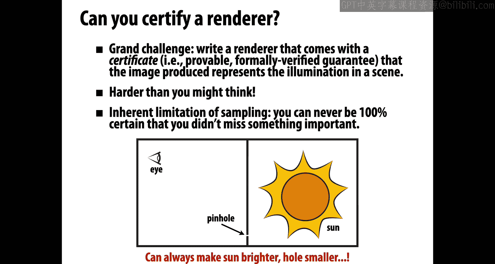

That a rendering algorithm is correct。