# CMU《计算机图形学｜CMU 15-462  COMPUTER GRAPHICS 2021》中英字幕 p21 -22-Lecture 21_ Dynamics and Time Integration -BV1H3NBemE5E_p21-

Welcome back to computer graphics。 Today we're going to talk about how numerical simulation can be used to generate computer animation。

 So last time we started talking about animation and the basic idea was to add motion to our models of the world We've talked a lot about how to model geometry。

 how to model materials and interaction of light with those materials and that geometry and now we want to bring things to life by adding motion the basic technique we looked at last time was interpolation of keyframe So this really goes back to the origins of animation where somebody would draw frames of animation。

 key poses of animation by hand and then those would be filled in or in between by another artist Well in the digital age we can do our key framing on three dimensionmensional geometric models and get the computer to fill in。

Those in betweenwes with spline interpolation。 we spent a lot of time talking about splinees last time。

 but still even this semi automated process is a lot of work because there might still be a lot of parameters to keyframe if we look at this rig on the right。

 There's all sorts of handles and controls that need to be set for every keyframe to get just the right pose。

 So today we're going to look at a different type of animation of computer animation。

 which is based on physical simulation So the basic ideas is we're going to set up maybe some initial conditions and we're going to hit go and the computer is going to predict all the physical behaviors or pseudophysical behaviors that might govern how the rest of the animation unfolds。

 Why is this valuable well For one thing it's often a lot less manual labor we might only have to set up initial conditions or maybe some very key events in the physical。

Sin。on the other hand， it's often a lot more compute intensive。So。With splinees。

 it was pretty easy to just go ahead and evaluate the spline at any moment in time with this physically based animation or the simulation based animation。

 we're going to have to wait often quite a while for our computer to churn through all those calculations。

The way that we're going to build up tools for this kind of animation is to leverage tools and ideas from physics。

 so we're going to look at dynamical descriptions of animation of motion， so why does motion occur。

 what are the forces that cause it to occur？And then we're going to use numerical integration in time to。

Approximate the solution to these dynamical equations。

 So we've already talked about one kind of numerical integration。

 Monte Carlo integration for kind of estimating the area under the curve。

This time we're going to look at numerical integration in a slightly different way in terms of taking steps forward in time。

The payoff to doing all this to working with physical models and doing numerical simulation is that we can get complex and beautiful behavior from some very simple models again。

 without doing a whole lot of work from relatively simple scene descriptions。

 a lot of beautiful complexity can emerge and these types of techniques have become widely used in film and games because of all the rich complexity you can easily get out of them and because computer systems are getting faster and faster。

 it's becoming much more feasible to run large simulations than it was 1520 years ago。Okay。

 so what is a dynamical description of motion？Well。

 this was really captured nicely by Isaac Newton in one of his famous laws of motion。

 he says a change in motion is proportional to the motive force impressed and takes place along the straight line in which that force is impressed。

 a more modern description of dynamics is that dynamics is concerned with the study of forces。

 and their effect on motion， as opposed to kinematics。

 which studies the motion of objects without reference to its causes。Okay。

So dynamics is about understanding the forces that give rise to motion。

Kinematics is just trying to describe the motion without needing to understand the generating forces。

So given that description， if we think back to our last lecture on keyframe interpolation on splinet interpolation。

Would you call that a dynamic or a kinematic description of motion？Well。

 if you think back to the way we set things up， we just said， oh， well。

 we want the motion to go here and then here and then here and then here at these different moments in time。

 and we're going to have a nice smooth sp curve that maybe interpolates those key frames。

 those key moments。That's not a very dynamic description。

 we're not really understanding what forces would cause an object to move toward those points。

 we're just saying that's what we'd like to see。So。

Key frame spline interpolation is a kinematic description of motion。

So what's an example of a dynamic description of motion？Well。

 in rendering we had the rendering equation， it's only natural that in computer animation。

 we have the animation equation。And this one is one that you may have actually seen before the animation equation is just。

F equals MA。Something you've seen in your physics class， force equals mass times acceleration。Okay。

 so this is ultimately what the equation that we want to solve to generate motion。

We want to go in and describe what are the masses in our system。

What are the forces acting on those masses？And then we can solve this equation。Well。

 we can solve for the velocity that corresponds to this acceleration。

 and then we can solve for the trajectory that corresponds to that velocity。

 we can solve this second order differential equation。Okay。Well， actually， if we really are honest。

 there are some more equations that we have to think about here， so let's be more careful。

So one point of view we can take is that any system。

 no matter what kind of scene or motion or modeling。

Any system has a configuration Q that's a function of time。

And that configuration is just basically a big， long list of all the variables。

That describe what the system looks like at the current moment in time。

The system also has a velocity。The velocity is just the time derivative of all those quantities。

And however， we've chosen to describe our scene。Maybe geometrically。

 this is the change in time of that description。We also are going to associate with objects in this scene。

 some kind of mass。How heavy is it or what's its moment of inertia？

There may also be some forces acting on objects in this scene。So like gravity or wind。

 things that are causing things to move in a certain way。

And there also will be typically some kind of constraints， something that says。

What rules must the objects obey at all time？For instance。

 if our configuration is the position of a roller coaster。

 we might have a constraint that says that roller coaster remains on the track。

And we will be able to express a lot of these constraints with a function that looks like this。

 a function G。That's equal to0 if the constraint is satisfied。

So you plug in the current position and velocity at the current time。

 and if the constraint is satisfied if you're on the rails，Then。The function evaluates to0， if not。

 you're violating the constraint。In this terminology， using this。Convention。

 we could write Newton's second laws as Q double dot equals F over M。

 so the double dots here just mean we're taking two time derivatives。Likewise。

 when we wrote velocity， we wrote Q dot for one time derivative。Okay。

Why do we write things in this way？Well， it makes a couple of things clear。First of all。

 it makes clear that acceleration is the second time derivative of the configuration。

 right if we just write f equals MA， we might forget that acceleration is this second time derivative。

And it reminds us that ultimately we want to solve for the configuration Q。

If we know the state of the system at every moment of time， well， hey， then we have an animation。

If we know the state of the system at any moment of time。

 then we can generate an animation by marching along in time。

Looking up the configuration at that time， plugging it into our renderer and generating a beautiful image。

And then those sequence of frames that generates our animation。So often。

 we're going to be describing systems with many， many moving pieces。

 not just a single roller coaster on a track， but maybe， let's say， a table of。

Biard balls that are all bouncing around and hitting each other and bouncing off the walls and so forth。

And。We can keep going with this view。Of encoding。The state of our system into a single vector。

Of coordinates， which we're going to call generalized coordinates。So for instance。

 in the case of the billiard balls， this one vector is going to store maybe the location。

XY in the plane for every single ball。So in this case we have six balls， it'll encode 12 coordinates。

And so rather than thinking about the evolution of our system as the individual trajectories of each of these balls in two dimensions。

We can at least imagine。A trajectory， a path。That's moving around in this higher dimensional。

 in this case， 12 dimensional space。We just concatenate the motion of all these different balls。

 and that gives us some curve in a high dimensional space。Why do we want to think about it this way。

 well， for one thing， this naturally maps to the way we actually solve equations on a computer。

 often what we'll do is we'll go ahead and we'll stack all the variables that describe the system into a big long vector。

 and we'll hand that off to a solver， and itll update it and return the new vector。

 the vector describing all the positions at the next moment in time。Okay。

 so if this is how we're going to write down our algorithms。

 we're ultimately going to work with the scene computationally。

 why not just model things this way in the first place？

It's going to make life a lot easier in many ways。Just like we have a notion of generalized coordinates。

 we can also have a notion of generalized velocity。

 there's not a whole lot more to say about general velocity。

 generalized velocity it's just the time derivative of the generalized coordinates right so each of our billiard balls for instance。

 at a given moment in time has its own little two dimensionsal veloc vector， x dot0。

 x dot1 and so forth， and we can concatenate those all into a big long list of velocities which together we call Q dot。

Now a nice mental model here is to think， well， that Q dot。

 that velocity vector for our generalized coordinates。

 can be thought of as kind of a tangent to the curve。

That describes the trajectory of our whole system in this higher dimensional space。

And we start to see why this is a useful mental model When we start to build up algorithms for numerically approximating this trajectory。

 we can do it in a unified fashion， we can see as long as we have an algorithm that figures out how to trace out that curve。

In whatever dimension we're in， then we can apply it to any system we want。

 any kind of animation we want。And so in this way， we start to see that all of life and much of physics is just。

Traveling along some curve。Right。Okay。So how do we take advantage of this point of view， Well。

 a lot of dynamical systems， dynamical descriptions of physics can be described via what are called ordinary differential equations。

You might have encountered this briefly in your calculus classes。

 maybe you've taken an intro to differential equations。Okay。

 but the basic idea is not too hard to get your head around。

 So if we keep going with this story about generalized coordinates。

 then the equation that we're interested in is the one that says。The change in time of the。

Positions of the generalized coordinates。Is just equal to。Some velocity function， F。Evaluated for。

The current position， current velocities and time。Okay。

This ODE doesn't have to describe some mechanical phenomenon like balls bouncing around。

The simplest example that you'll see in an intro to differential equations may be something like this that just says I have the change over time of some scalar value you。

Is equal to a constant A times the current value of U。So the bigger you gets。The faster I change。

If I。Then get bigger。 Well， that means I'm going to change faster and I'm going to get even bigger at a faster rate。

 I'm going to change even faster。 So this is saying the rate of growth is proportional to the current value。

Can you guess what the solution might look like。Actually， this is。

No different from a problem you already solved in intro calculus。What's a function。That's equal to。

It's derivative， up to a constant。Well， one solution is。exponential function。

If I differentiate B E to the AT。Then I get A BE to the AT。Okay。

 so the function u of T equals B to the AT is a solution to this differential equation。In fact。

This is a really important example of a differential equation because when we start solving linear problems。

 linear differential equations in generalized coordinates。Often。

The solution reduces doing some version。Of this。Exponentiation。

Another thing to be aware of is to think about， well， what is the difference between？

Different values of A。 How does that change the behavior of this equation？When we already said， okay。

 if a is some。Positive constant， some big constant that means I'm accelerating。

 I'm growing faster and faster。 it looks like exponential growth。

 but I could also have an a whose value is pretty small， less than one。

 in which case we're getting exponential decay。Things are getting smaller and smaller and smaller。

 and they're shrinking slower and slower and slower， and never quite getting to zero。By the way。

 the fact that this is called an ordinary differential equation means that it involves derivatives in time。

 but not derivatives in space。Notice we're only talking about how this function changes over time。

 we'll talk about spatial derivatives and partial differential equations in another lecture。Okay。

Another really important example for us is Newton's second Law。

 this thing that we said was the fundamental equation of computer animation。Right。

 Newton's second law is a。Differential equation。It says now the second time derivative of the configuration。

Is equal to the force over the mass。And by the way。

 the force is probably going to depend on the current configuration。

 where we are in space or where all the objects in our scene are arranged in space is going to change how much force is acting on them。

If I have a particle that's really far from the Earth， a distant planet。

 it's going to have a smaller force on it than the moon， which is much closer。Okay。

Unlike the equation we saw on the previous slide， this is a。Second order， O DE。

 because we take two time derivatives。 We have Q double dot。

How do we think about and how do we solve a second order？ODEs instead of first order ODEs。Well。

 one trick we can play often is to write this system， rewrite the system as two first order ODEs。

So we can split this up by introducing a new dummy variable for velocity。

We can say Q dot is equal to V。 The change over time in configuration is velocity。

And then v dot is f over M， the change in velocity over time is the force divided by the mass。

Why do this mathematically it's equivalent， right， we didn't really change what the equation means。

 but splitting things up this way will make it easy to talk about solving these kinds of equations numerically。

That's nice。Okay， so here's a simple example to think about that gets us a little bit more toward doing animation。

So let's think about taking a rock。And just tossing it， throwing it upwards and ahead of us。

And the only force we're going to consider is the force of gravity。

There might be drag or wind or something like that。

 but we're just going to assume there's only gravity。And the rock has some mass M。

We're going to stick with our picture of describing all our coordinates with Q and all of our velocities with V。

Okay， and so it's pretty easy to write down these dynamical equations。We just say that Q double dot。

Is equal to G over M， F over M。Right， or。We could split this up into two first order differential equations；

 Q dot is equal to v and v dot is equal to G over M。What's the solution to this equation？Well。

Even if you can't figure it out based on what we've said today， maybe you've seen this in your。

Physics class。Right， the solution。Is something like this， we can first say。

The velocity at any given time。Is equal to the initial velocity。Plus。The time。Times G over m。

Why does that make sense。Well， because。In this system， the force doesn't depend on the velocity。

Right。The right hand side of the equation V dot equals G over M is just a constant。

How do you integrate a constant？Well， you're just multiplying by how much time eappsed。Plus。

 the constant of integration， what was the initial velocity。

 what was the velocity that we threw the rock out with？Okay。So then， what's the。

Solution for the configuration Q。Okay while we just go through the same exercise。

 we copy the solution to the first equation to the right hand side of the equation Q do is equal to V。

Okay， and now we're integrating a。Linear function， and we get something that is quadratic in time Q of T is Q n plus T times v n plus t squared over 2 mg。

If you don't believe me， well， you can just go ahead and check。

By taking the time derivative of Q and checking that it's equal to V。

And taking the time derivative of V and checking that it's equal to geoM。So that sounded really。

 really easy。We could do that by hand， we've maybe done that a bunch of times in our physics class。

What do we need a computer for， why do we talk about this in computer graphics？Well。

 here's a slightly harder simulation problem。Which is simulating a pendulum。Okay， so we have a mass。

 this blue mass on the end of a bar， and the pendulum is just going to swing back and forth under gravity。

And what we want to know is what are the equations of motion？So in fact。

 this is exactly the same as the problem we just looked at。

 the problem of throwing a rock through the air， except that now we've added a constraint。

We didn't change the mass， we didn't change the forces， we didn't change。The configuration space。

 we still just have the two coordinates of the rock or the end of the pendulum。

 but we have a constraint now that says the end of the pendulum has to sit on a unit circle。

 the rock has to sit on a unit circle。Okay。How do we solve an equation like this or how do we find the？

Equations of motion that describe the behavior of this system。Well， one thing we could do。

 a technique you might have learned is to use a forced diagram。

Like the one that you see on the right， this is probably what you did for many hours in high school or college if you took a physics class。

 a mechanics class。But let's do something new and different， let's do something else。

That will generalize a little bit better， perhaps to interesting systems and will also lead very naturally to ways of simulating systems on a computer。

Okay。And that's to use the techniques of what's called Lagrangian mechanics named after Joseph。

Lagrange。And。This technique has a beautifully simple recipe。

 it's almost surprising that they don't teach it this way in the first place because once you know it。

 you really don't want to go back to these forced diagrams。So what do you do？Well。

 the first thing is you write down the kinetic energy of the system。

So something like one half mass times the velocity squared or some appropriate generalization of that for whatever system you're working with。

You write down your potential energy。So for instance， if you know you have gravity in your system。

 you write down the gravitational potential energy， something like mass times。Gravity times height。

Okay。And then you write down the Lagrangian L， which is just the difference。

 kinetic minus potential energy。Once you know the Laangian， no matter what system you're looking at。

The dynamics are then given by the so called Euler Lagrange equations。Which say this， they say。

The time derivative。Of the derivative of the Lagrian with respect to velocity。

Is equal to the derivative of Lagrangian with respect to the configuration。Okay。

And if you work through this Euler laggrange equation for a simple system。

 what you very quickly realize is that this term on the left becomes kind of a generalized version of mass times acceleration。

And the term on the right becomes kind of a generalization of the idea of force。So again。

 we have this basic law of Newton。Right。Mass times acceleration equals4。Why is this useful， I mean。

 if all we got back at the end was F equals M。Why is this useful point of view。Well。

 what we're going to see is， first of all， it's often easier to come up with scalar energies than forces。

When I'm talking about energies。I don't have to talk about directions。

 I don't have to talk about coordinate systems。It's harder to make mistakes。

 I just have to figure out what is the total quantity of energy in the system， this scalar quantity。

Another nice thing about this formulation is that it's very general。

 it works in any kind of generalized coordinates。I don't have to treat objects in my scene one at a time。

I can just think of this picture of a single curve traveling through a high dimensional space that describes my entire system。

And finally， the reason why。We might like it for computer graphics for doing simulation is that it leads directly to a very nice class of numerical techniques for。

Simulating the motion。It makes it really clear what the algorithm is that you should write down to get an approximation of the dynamics。

and if you want to go deeper into this subject， here's a beautiful reference that talks about both the physical side and the computational side。

So let's look at an example， let's go back to our example of the pendulum。

Which we didn't maybe immediately know how to solve。And the first thing we want to ask is just， okay。

 what are our generalized coordinates？What is Q for this system？Well。

 one thing to appreciate about this kind of problem is you can always write down maybe different coordinates。

 There's not just one way of encoding the state of a system in。Variables in coordinates。In this case。

 a pretty natural thing to do would be to say， well， rather than bothering with X， Y。

And then worrying that x squared plus y squared has to equal length squared or something like that。

 why don't we just describe the state of the system by the angle theta？

That the pendulum makes with the vertical direction。Okay。

So that's a perfectly good encoding of the state， and we know it always respects the constraint。

 no matter what theta we have， we're describing a point on the circle。The next thing we want to know。

To build up our Lagrangian is what is the kinetic energy？Okay， so we'll assume again that this rock。

 this pendulum end has mass M。And you may remember that the kinetic energy。

For something that rotates like this is1 i omega squared。Where I is the moment of inertia。

And mega is the angular velocity。So another way we could write this down is1 half mass times length squared times theta dot squared。

Write it in terms of velocity in terms instead of。This moment of inertia。

What is the potential energy of the system？Well， again， the only force we have here is gravity。Right。

 the force of the rod is already taken care of by the fact that we have the。Angle coordinate。Okay。

So our potential energy is just MGH mass times gravity times height。

 which in terms of theta we can write as MGL co theta。Right。

 we're just getting the vertical component of the vector from the center of the circle to。

The end of the pendulum。Multipliied by Mg。All right， so here's the interesting part。

Now that we've written down the kinetic and potential energy using standard formulas from our physics textbook。

We can work out the equations of motion， the Euler Lagrange equations。From here。

 you can really just plug in the formula that I showed。Right。

 you could even get your computer to do it。 It's simple enough， and。Work out。

What the equations of motion are， So the Laangian is。K minus u kinetic minus potential energy。

 which in this case。Both terms have a mass in them so we can factor that out and multiply by one half length squared to theta dot squared plus。

G gravitational constant times L times cosine theta。How do we get the Euler lagge equations。

 we want to just now evaluate these derivatives。Okay， so let's do the first one。Let's。First。

 take the derivative of the Laangian with respect to Q dot。Okay， and this is a partial derivative。

So maybe a good way to think about the partial derivative is。

We want to forget about any kind of secondary dependencies of variables。

 we just want to say anytime we see Q dot or in this case theta dot in the equation。

 we just take a derivative as we would normally of that variable and we stop there。Okay。

So what is the partial derivative of L with respect to theta dot？Well。

 theta dot appears in only one of our two terms。The first term。

And so if theta dot squared becomes 2 theta dot， overall， we end up with just Ml squared theta dot。

All right。What about the partial derivative of L with respect to Q with respect to the configuration of our system？

Well， in this case， Q is simply the angle theta。So we want the partial derivative of this script L with respect to theta。

What does that look like？We only have one term that directly involves theta。GL cosine theta term。

Derivative of cosine with respect theta is。Sine or minus sign。Right， and so we get。

Minus Mg L sine theta。All right。Finally， putting this all together。

 we can easily take the time derivative of that first term。

So ML squared theta dot becomes ML squared theta double dot。And。

We can then solve for theta double dot。Just equate those two quantities。

 move everything to the right side， except for theta double dot。

 and we get theta double dot equals minus g over l sine theta。This is our F equals MA。It says。

The acceleration。TheAngular acceleration theta double dot is equal to minus this constant determining the strength of gravity G over the length of the rod L times the sine of the angle theta with the vertical。

That was pretty easy to do， we didn't have to do much reasoning about what the system looks like or how it behaves or what direction the forces point。

We just had to write down the kinetic energy and the potential energy and take a few derivatives。

Okay， so that's great， we have now our equations of motion。How do we actually。Solve them。

 how do we actually know where the pendulum goes over the course of time？Okay， well。This is， again。

 something that' hard to do by hand。Hopefully you've gotten a sense in this course that a lot of the things that you did in calculus。

Taking integrals， especially and even taking complex， complicated derivatives。OrGet really。

 really hard to do by hand， maybe impossible do do by hand when you start to solve problems of real world complexity like you find in computer graphics and computer animation。

That's also going to be true for solving equations of motion。So if I have this equation of motion。

 theta double dot equals minus g over l sine theta， I might say， h well。

 I don't immediately know how to solve it， but。Let's at least get a sense of what the solution might look like by making an approximation。

In particular， I could just consider very， very small angles。

 I imagine the pendulum is almost vertical and is just moving back a little bit。

 back and forth a little bit to the left and the right。Okay。Well， for small angles， theta。

Then we can approximate sine theta as just theta。Near zero sine theta looks like theta。

And so we could pretend that this equation was instead theta double dot equals minus G over L theta。

So we're saying now we're looking for a function over time， a function， theta。

That looks like its second derivative。Actually， minus its second derivative。

So can you think of any function where if you differentiate it twice？You get the same function back。

 maybe up to a sign。What does that function look like？Or in this case， up to a sign and a scaling。

 we have to scale by G over L。So what does that look like？Wowen。

Example is a function that looks like this， a cosine。So if theta of t is equal to a cosine。

T times root G over L plus B。Then if I differentiate this once， the cosine turns into a minus sign。

And I pull out a factor root G over L。If I differentiate it again， the minus sign becomes。A o。

Minus cosine， and I pull out another factor of root G over L。 So overall I have G over L。Minus times。

Cosine of the same argument。They've solved this second order differential equation。

What does this describe？If I think of the。Angle is a function of time now what's happening oh。

 well something pretty reasonable， it's moving back and forth over time just a little bit。

This is what's called a harmonic oscillator， this is also something that describes the behavior of a spring。

 for instance， kind of an idealized spring without any。Other forces on it。Okay。

What if we want to go back though and really solve this equation。

 this approximation is only accurate for very small displacements。

For just this kind of boring pendulum that's only swinging back and forth just a little bit。

So how do we solve the original equation？What is the closed form expression for theta as a function of time？

If you have trouble answering the question。That's okay because actually， in general。

 there is no closed form solution。To this equation。

Meaning there is simply no function you can just write down that gives you to the solution。

To the equations of motion for all time。Okay， so even with this very， very simple example。

 we took one of the most basic things we could think of just taking a ballistic trajectory。

 a rock flying through the air。And we added a super simple condition。

That just said it has to stay on a circle， it has to have unit norm。And already。

We run into trouble already， we cannot do this the way we might have done this in our intro physicsics class or our intro calculus class。

We have to actually use a numerical approximation if we hope to animate this system。

Even for these very simple cases。And so you can imagine that as we want to start to animate more and more interesting and complex phenomena。

People moving around a dress moving in the wind， know， jumping into the swimming pool。

 wearing your dress and seeing the interaction between water and cloth。Boy。

 that's going to be really hard to do， we're not going to be able to solve it the way we did it in our physics class。

 we're going to have to use numerical approximation， numerical simulation。Okay。And。

To really drive this point home， I mean with a pendulum。

 you at least have a sense of roughly what it should look like right， I mean。

 it should swing back and forth at some reasonably regular predictable rate。

 but let's just see how quickly，Things can get really， really complicated。

We're going to set up a very similar system。We have a pendulum， this blue pendulum， just as before。

And then off the end of that blue pendulum， we have a green pendulum。Okay。

So the first pendulum is going to swing around and the second pendulum is going to swing around on the bottom of that one。

All， and we can parameterize the system， we can write down now generalized coordinates。

 theta 1 and theta 2。So I didn't get that much bigger， we had one coordinate before。

 now we have two coordinates。What do you think this system does？

If I start letting these pendulums swing around。Picture， try to picture in your head for a moment。

 What do you think the motion is going to look like。

RightMaybe one question you could ask yourself is。What curved does this trace out over time。

 like if I have just one pendulum， it traces out a piece of a circle over time？

What shape is this going trace out over time。Okay， so that keep that picture in your head and let's see。

 let's see what happens here。Okay， so this is a really simple system， but actually turns out。

It has some not so simple motion。Okay， so here's an example of a real physical double pendulum。

Start swinging in motion and boy， what is happening there？Swinging all over the place。

 It's really hard to say what it's going do next。 Okay， maybe towards the end。

 it it gets stamped out and does something reasonable。 But let's。

 let's try it again with a different initial configuration。Yikes。

 this is now completely different from what it did the first time。And in fact。

 if you study this system a little bit， what you discover is it's a chaotic system。

Meaning that even extremely small changes to the initial conditions。

Can result in extremely large changes to the trajectory。Okay。And so too。

Simulator to get any sense of what a system like this might do。Even a very rough approximation。

 we're going to have to use numerical approximation。

We're going to have to use some kind of simulation on the computer。

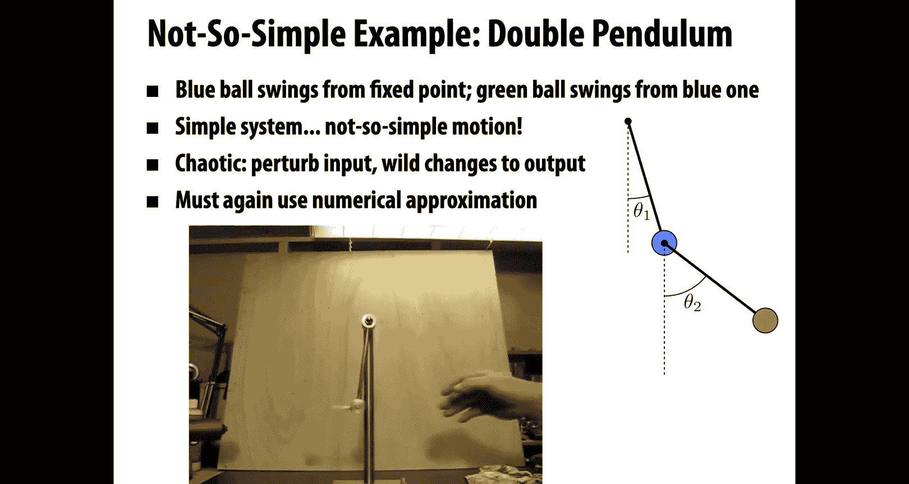

Here's a not so simple example of dynamics， which comes up all the time in modeling the natural world and in computer graphics。

 as we'll see in a minute。Which is endbody problems。Okay。

 so maybe the one of the earliest examples of this is people thinking about。

Bodies in the solar system。 Let's say we have the earth and the moon and the sun。

Were to mention those are the only three bodies in the solar system。

 and we want to know where they go over time。 it's a very reasonable question to ask。

We want to predict the phases of the moon or whatever。Well， this is really。

 really easy to do for two bodies。Maybe just the sun and。The earth。

We could assume one of these bodies is fixed， hey， why not keep the sun fixed at the center of the universe？

I know that's a bit of a heretical idea， but let's do it。

 and then we can just solve for the position of the earth。 Well， that's really easy。 in fact。

 that's going to look not so different， maybe from our pendulum problem。Okay。

But as soon as we add that third body in， as soon as we put the moon in there。

 we put Jupiter in there or whatever。We again get chaotic solutions we get。

Dynamics that have no closed form that you could never hope to solve on pen and paper。

So then what if we want to simulate way more than three bodies。

 what if we want to simulate entire galaxies and in fact， this is something that people。Are very。

 very interested in doing people want to understand what is the origin of our solar system。

 the origin of our galaxy。Why did mass take shape the way it did。

 why are stars distributed the way they are， why is Earth？A place that we can live， are there places。

 other places in the universe we can live， okay。What you， what do you do。

 You get out of your computer， You put a huge number of bodies， little particles， which are actually。

Maybe the size of planets and you start simulating the dynamics and see what happens and you see all this interesting behavior。

Right， mass。Acretes into disk like formulations。You know， thingsh might get denser or less dense。

 and stars might form and so on。This is really something that you have to use numerical simulation if you ever want to。

Get any sense of what might happen。

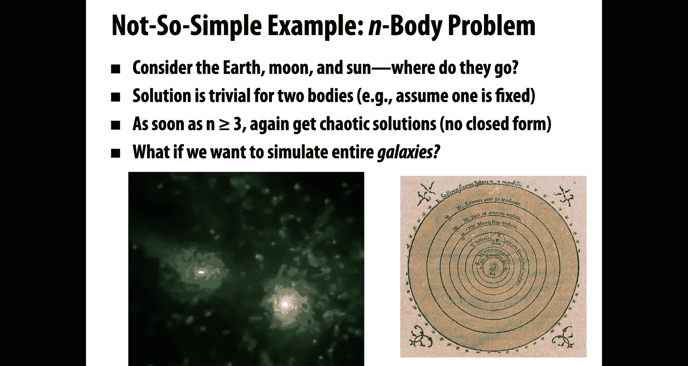

Okay， and for animation too， you know， not just for understanding the origins of life universe and everything。

 but for you know， just fun computer animation， we also want to simulate these kinds of phenomena。

So one nice example is flocking of birds。 This is a real video， not a simulation of a bunch of。

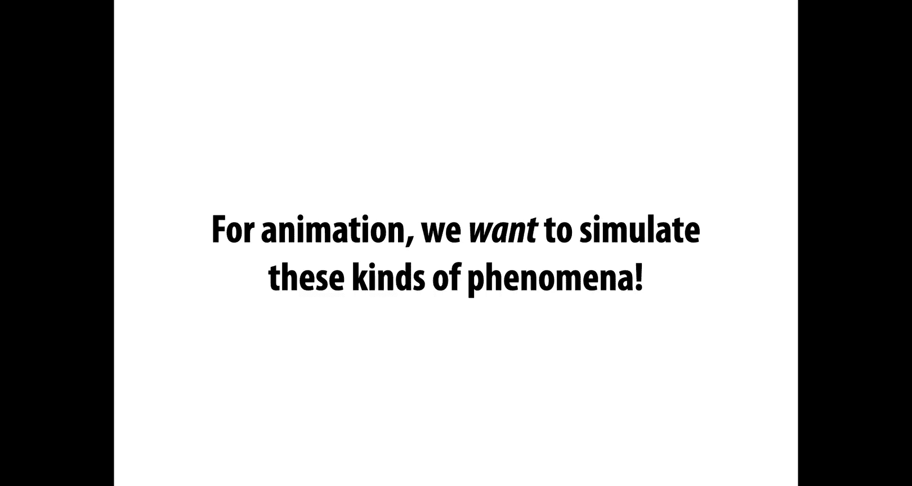

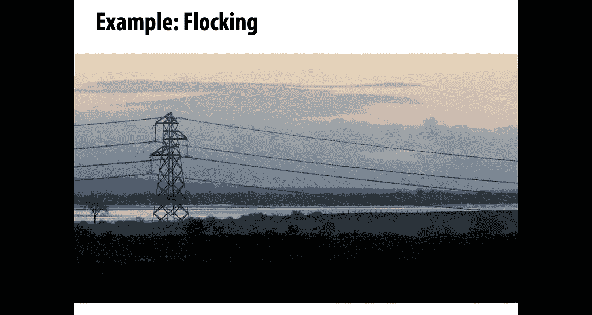

Starlings， I think， is the kind of bird。🎼And。🎼If you watch them for a while。

 they exhibit this really， really interesting behavior， they just start。Kind of following each other。

Informing these shapes in the sky。Not so different from this。🎼Idea of having these。

Different bodies in the galaxy that influence each other。And have this emergent behavior。

So how would you simulate a system like this？Well， we kind of have the tools to do this， I mean。

 just today we've kind of set up the right mental framework for modeling a system like that。

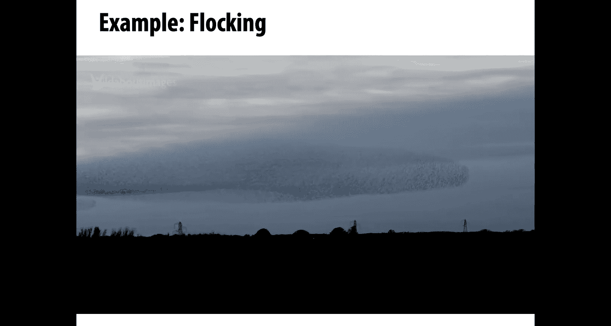

So here's how we can think about simulated flocking。As an ordinary differential equation。

 And now on the right， this is a movie of。A numerical simulation。

A bunch of particles that are supposed to kind of capture this bird like behavior。

So instead of billiard balls， we now have birds， right。

 every bird is a particle with a con with a position in space。

Our generalized coordinates are just the list of all those positions。

 our generalized velocities are just the list of all。The individual velocities。

These particles are subject to very simple forces。Okay， so this is a really。

Classic model developed by a guy named Craig Reynolds。 And the forces are are these。

 They all the birds want to be attracted。 They want to move toward。Sort of the average of their。

Nearest neighbors， so maybe each bird knows about it。

Kay nearest neighbors and wants to move to the center of those。

 or every bird knows about the birds that it can see。 That'd be more natural， right。

 Every bird knows about the birds within some radius around it。

Those are the ones that it can look at and see where they are。

 and it wants to move to the center of those。Okay。Another force is repulsion。

A bird doesn't want to get too close to another bird because then they'll crash and fall out of the sky。

 that would be no good。Okay，So there's going to be a force pushing it away from the center。

And they also。Want some kind of force of alignment。

I look again at this neighborhood of birds around me。

 and I want to go roughly in the same direction they're going。 And I don't want to get left behind。

 I want to go with the crowd， see what they're doing， see where they're going， right。Okay。

 so those are my forces。You know， in this case， maybe I don't even need to write down the Larangji and I just start with F equals MA。

I sum up all the forces from all my neighbors。And then， I solve numerically。

This ordinary differential equation or really this system of ordinary differential equations。

 you can think of it either way。You can either think we have a single generalized particle。

And I just need to know the acceleration of that particle， or I have all these different particles。

 all these different birds。 I'm solving for each of their accelerations。 of course。

 these two points of view are equivalent right one way or another I have to solve。

This ordinary differential equation。If I do this， and may be a little bit of tweaking at the parameters。

 how big are these forces， how many neighbors do I use and so forth。

 then I get this beautiful emergent， complex behavior and you also see this in other types of swarms and fish and bees and so forth。

This idea of flocking is one specific example of a more general idea in computer animation of particle systems。

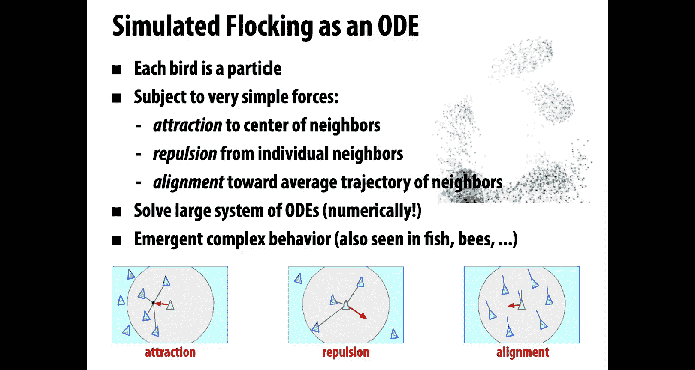

So more generally， there are just a lot of different phenomena that you can model。

As large collections of particles， fireworks， maybe kinds different kinds of fluids or granular materials like sand。

Depending on what system you're thinking about， each particle has a behavior described by some kind of force。

Now in physics， these would all be physical forces that arise from some principle dynamics model。

In computer graphics， you can have more fun and you can just toss in random forces and see what happens right oh what happens if I use this crazy function as a force that makes some nice behavior oh what if I use this other one all this is kind of boring or blows up in a nasty way okay so？

However you come up with this particle system， this is an extremely common model that's used in computer graphics。

 in interactive computer graphics， games， and so forth。Why， well， it's very easy to understand。

I just have all these particles and I'm going to track them over time。

 I have a simple equation to integrate for each particle。

 and also it's really easy to scale up and down， depending on how much computational resources I have。

 I can increase the number of particles get more detail or decrease the number of particles to get things running faster。

For some phenomena， like fluids。You might need a ton of particles to really get a good， accurate。

 correct looking approximation。And you might start to think about， well。

 how do I accelerate these kinds of interactions between a huge number of particles like we did in that galaxy simulation？

Well， if you think back to some of our earlier lectures。

We've actually already talked about tools that are kind of appropriate for these systems with lots and lots and lots of。

Primitive geometric primitives that are kind of interacting。We talked a lot about。

Hierarchical data structures， hierarchical acceleration。

 using things like Kd trees and bounding volume hierarchies。

 and I think I even mentioned the Barnes h algorithm and maybe the fast multipo algorithm。

So these are algorithms that you can use to speed up interactions between lots and lots of particles by kind of lumping together distant particles if I have a bunch of。

Interesting particles， but they're really， really far away。Well。

 maybe it's okay just pretend there're one big particle and compute my forces based on that assumption。

Okay。Another thing I can do and we'll talk about this when we talk about partial differential equations is to say。

 you know what doing millions and billions of particles at some point gets really expensive。

 why don't we use a continuum model， why don't we？Think about this in terms of a different kind of differential equation。

 and we'll get to that later on。

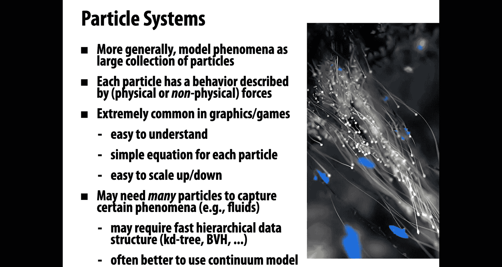

Here's another fun example of kind of a particle system or an agent based system。

 so much like our birds， we have particles moving around。They might have forces acting on each other。

And they might have discrete behaviors as well， you might have kind of a little program that each one of these particles is running。

That when it sees a certain behavior or measures a certain quantity in its environment。

 it makes a decision about how to move。 Maybe you can think about this as adding an impulse force if you want to keep thinking in a dynamical point of view。

 But one way or another， there's a kind of a policy where this。Particle or this agent。

Changes its behavior here。This is being used to model crowds。

 I think the idea here is that somebody wants to get a sense of。

 let's say there's a fire in a building。And you want to see where the bottlenecks。

 Where are people going to get stuck。Right and so maybe this is not a perfect simulation of how people behave。

 right， you're not really simulating human psychology and human physiology and so forth。

But it still gives a pretty good sense of at a large scale， you know how things might play out。

 and so these kinds of tools， even when they're crude。

 can be really valuable for understanding physical systems， you。

 even even outside of the domain of sort of entertainment。Okay。That being said。

 here's a really fun example of kind of crowds and dynamics mixed together。

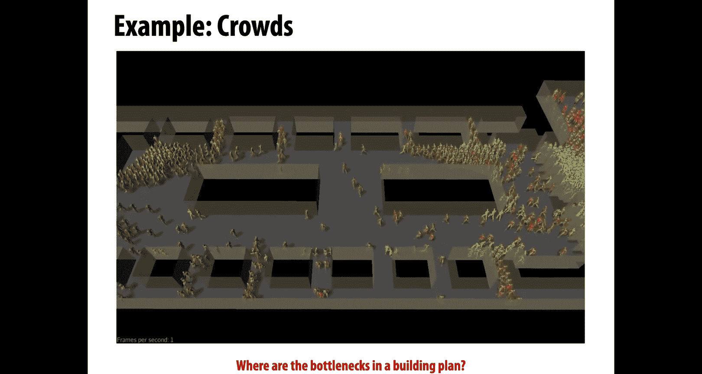

Just。😔，Just for your entertainment。Okay，And we have a little bit of this ballistic behavior， too。

 when people get。Kind of smacked by this spinning rod。

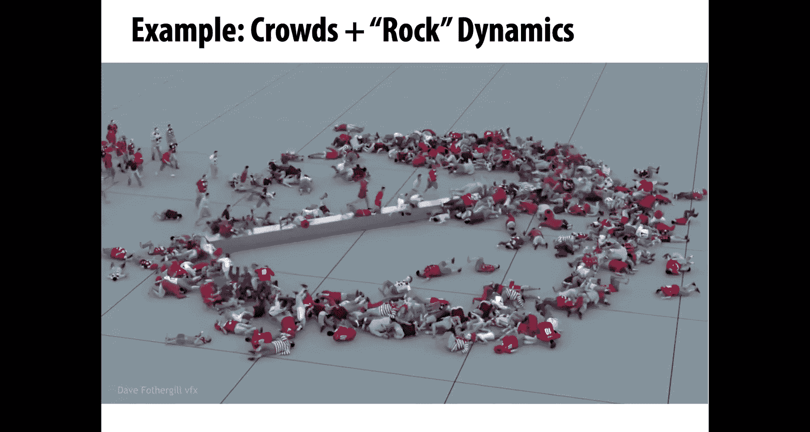

Here's another fun example of a particle system。 I said it's possible to model one way to model fluids is with particles。

 And here this is rendered in a way where you can really see the particle nature right see these red and blue particles。

对。Are willing to be close to each other， but not too close。

 They have forces or constraints that push them away from the solid ground。

And you get this very fluid like behavior， and in fact， if you rendered this in a more realistic way。

Right if you put some material on there that had a high degree of specity， it was also。

Had some transmissiveness to it， right， something that tried to model the properties of water。

 This would look a lot more realistic。Another nice example， granular materials， so modeling sand。

 or maybe I think in this case it's supposed to be popcorn， perhaps。

Also interacting with some rigid bodies here。So it's interesting to think in this scene。

 you know what are the generalized coordinates， what is all the state that describes this system。

We have the state of each individual particle。 we have the state， maybe the not just the position。

 but also the rotation of these rigid bodies。 And we also have the state， the position of this。

Pllow that's driving through the granular material。

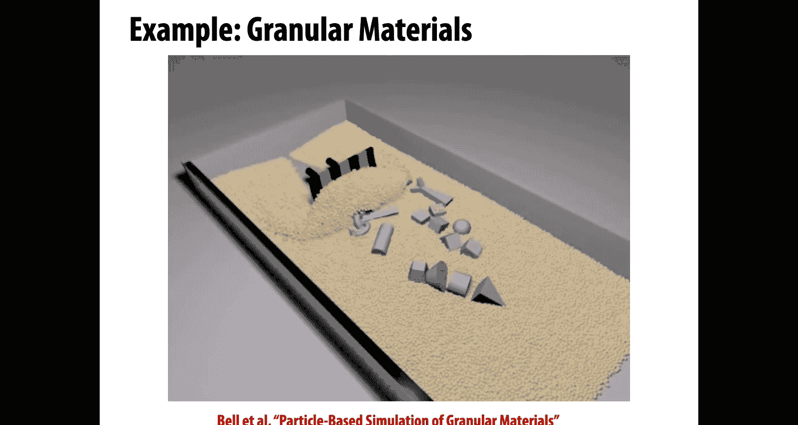

Another example of kind of particle systems is molecular dynamics。

 So when people do computational chemistry， when they really want to figure out what's happening at a。

Very， very small scale。You have simulation that behaves in a similar way， you have little particles。

 which are called atoms。And you have various models of how these are going to behave over time。

 typicallyypically here you want to simulate things on an extremely short time scale。

So I think what this is is an ice crystal that's melting。

And the jiggling around is coming from the kinetic energy。 right。

 We talked about this when we talked about color， where does color come from。 Well。

 it comes from electromagmagnetic fields that arise from things jiggling around at a very small scale。

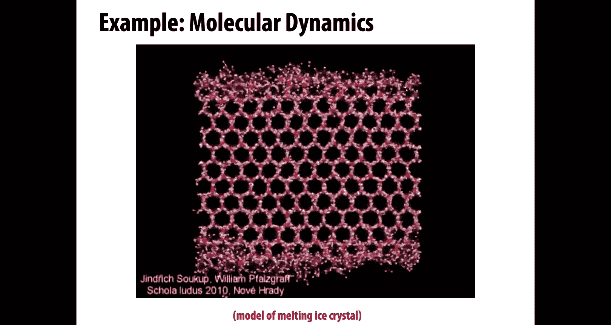

We can also go to a。Much， much bigger scale and a much。

 much longer time scale coming back to this cosmological simulation。Okay。

 so this is another kind of body type simulation that's trying to understand now the distribution of dark matter in the universe。

And so in general， you get a sense that this。idea of simulating lots of little particles。

 interacting with with each other is super powerful。 It's super flexible。 You can do a lot with it。

 and it all starts with just。Throwing one little rock through the air。

Another example that shows up a lot in computer graphics is what's called a mass spring system。

 so again we have particles that are going to move around， they want to follow little trajectories。

But this time we're going to add an interesting force。

 we're going to connect the particles by a spring of length L not。In this case， you might remember。

 know， springs were something you may have talked a lot about in your introphysics class。

 You might remember the potential energy of a spring is given by。

U equals 1 k times L minus L not squared。What does this mean， K is the stiffness of the spring。

 so the bigger this number K is， the more the spring is going to resist being compressed or stretched out。

L is the current length of the spring， and L not is the rest length。Okay， so again。

 the more we pull on this， the bigger the potential energy gets， the more we compress it。

 the bigger the potential energy gets。We could also write this as。1 half k times the。

Norm of the difference between x1 and x2 squared minus L squared。

 we can express the current length as just the distance between the two endpoints。

Why are springs cool well， because we can connect up a lot of springs to describe interesting phenomena。

 right because just like we。Use a lot of particles floating around on their own to get interesting phenomena。

 we can use lots of springs， this is extremely common in graphics and games and so forth because again it's really easy to understand what's going on there's a really simple equation for each particle。

And。We can usually numerically simulate this for a lot of little springs in a pretty efficient way。

Again， later on we're going to see that for certain things， if I'm trying to use springs to model。

 let's say， cloth or something， there might be good reasons to think of this from a more continuous point of view to think about partial differential equations。

Okay， but for now， we'll think about hooking up a lot of different springs。

Writing down their total energy， working out the equations of motion and so forth。

 and then hitting go to do a simulation and we'll get something maybe like this， right？

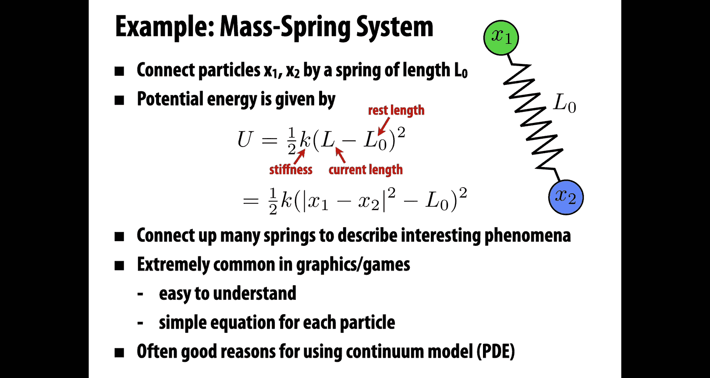

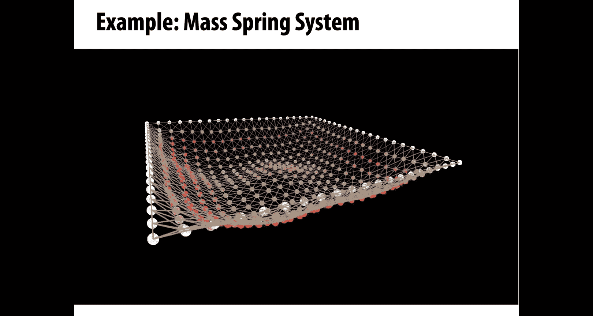

So we just have a bunch of little particles again， but they're connected by these spring forces。

 make get this。I don't know， trampoline type behavior。

Maybe a more common use of this type of thing is in simulating cloth。So here again。

 we can imagine every vertex of the mesh making up the dress is a particle。

 every edge in that mesh is a spring。AndWe have these spring forces that are keeping them。

Close to each other， but not too close。How do we get to work together with a character will maybe we pin some of the。

Particle， some of the vertices two points on the character model so that it gets kind of pulled along with the motion of the character。

One other thing we would have to think about for an animation like this is how do you avoid。

Collissions， how do you avoid。Particles from passing through the cloth are passing through the body。

OkaySo this was a big challenge in computer animation dealing with collisions。

 collision detection and collision response。We talked at least a little bit about collision detection when we talked about geometric queries。

Rand， how do we do inside outside tests and things like that？

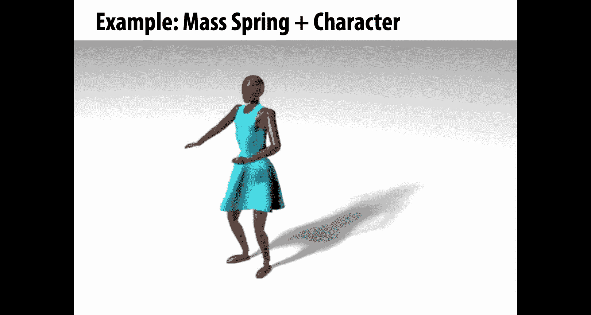

Another example of a phenomenon that can be simulated using particles connected by springs is hair。

So you can imagine each strand of hair is just a。Polyline。

 a long sequence of particles connected by little springs。As we move this around。

 there might be different forces on different particles。

 but the springs kind of keep them from stretching out too much and you get this beautiful looking。

Hair behavior。Okay。So hopefully you're convinced right。

 hopefully you're convinced that using dynamics is a useful way to generate animation that talking about things like particle systems and mass spring systems can。

Create a lot of interesting phenomena。The one thing that we haven't yet answered yet， actually。

 kind of swept it under the rug so far is。How do we actually solve these equations numerically。

 we've been writing down the equations of motion， and I keep saying， oh。

 then you just hit play and watch the animation evolve。How did we numerically solve those equations？

Right。So that brings us to one of our core topics for the day， which is numerical integration。

How do we take a ordinary differential equation， for instance。

And turn it into an approximation of the solution。The key idea。

Is that every time we see a derivative in our differential equation。

We're going to replace it with differences。Okay， thingsh that we can really compute。

In an ordinary differential equation， actually the only derivatives we need to think about are derivatives in time。

We said an ordinary differential equation is one that involves derivatives in time。

 a partial differential equation is one that involves derivatives in time and space。Okay。

We're going to replace our time continuous function Q of T the configuration over time with samples Q sub K in time。

So basically， we're going to have a bunch of little snapshots， what's happening at one second。

 what's happening at two seconds， what's happening at three seconds or probably。

Finr grain intervals than that， maybe we have one snapshot once every 30th of a second to generate animation。

Okay， so if we have a differential equation like this。

The time derivative of the configuration Q is equal to。This。Vellocity function F of Q。Well。

 that's going to become an equation that looks like this。

The configuration at the next moment in time。Q sub K+1， which we don't know yet。

Minus the current configuration， which we do know， where are things now divided by a time step tau。

Meaning how much time elapsed between the current state and the next state？

That's going to be equal to the speed， right， the speed。Evaluated for our configuration。Okay。

Now there's one。Thing we're missing from this equation， one thing we haven't really pinned down yet。

Which is。When do we actually evaluate this velocity function？In the original equation。

 we said the equation at the top， we said the time derivative at the current time T of the configuration Q of T。

Is equal to the velocity function evaluated at the configuration of the current time。But in our。

Numerical approximation at the bottom， which one is the current time is the current time Q of K？

Or is the current time Q of k plus 1， Does't this equation need to hold it both moments。

 K and K plus 1。Okay， well， actually， what happens is we have a choice。

We have a choice of when to evaluate this velocity function。 So the most straightforward thing to do。

 you might think seems the answer is obvious， right， the obvious answer。

It's to just evaluate the velocity of the current configuration。We know where we are now。

 and we know how to evaluate the function F。Anywhere we like。

 so why don't we just plug in the configuration we know into the velocity function？If we do this。

 then the new configuration can be written explicitly in terms of known data。

I can say the configuration Q at the next time K+ 1 is equal to the current configuration Qs of k plus the time step times the velocity at the current time。

All I did was shuffle around the equation that I had on the last slide and was careful to evaluate F at QK。

This is really pretty intuitive。 What are we really saying here， all we're saying is。

To figure out what happens， well， let's just walk a little bit in the direction of the velocity。

Walk in the direction of velocity。And how far well kind of we use tau。

 however big of a time step we use， we kind of walk that far。Sounds pretty good。Unfortunately。

 it's not very stable。What do I mean by stable？What I mean is。

 let's consider our case our example of the pendulum。If we start running this simulation。

 if we start now repeatedly applying this rule， Qk plus 1 is equal to  Qk plus tau f of qK so Q1 is equal to Q not plus tau F of Q not。

 Q2 is equal to Q1 plus tau Fq1 and so forth。Well， something kind of surprising is going to happen rather than this pendulum just going back and forth nice and slowly。

 what's going to happen is it's going to speed up and go faster and faster and faster until it's actually spinning around and around and around and around。

That's weird， that's not what was supposed to happen。Right。In our original system。

 the one we really want to simulate。Well we know this is a physical law， right。

 this is something where energy should never be created or destroyed。

Where is all this extra energy coming from？Well， to understand this。

 we can do a little analysis of our forward Euler algorithm。

So let's consider the behavior of forward Euler for a rather than this pendulum problem。

 let's just think about a simple linear ordinary differential equation。

So we go back to this equation， u dot equals let's say minus AU where a is a positive number。Okay。

So importantly。You， in this case， should decay。In fact。

 we can write down the exact solution that U is equal to。E to the minus A T。Actually。

 I should pause here for a moment to apologize Earl， I said。That if I have E to the A T and A is。

Less than one， it'll decay。 And if it's greater than one， it'll。Blow up， actually， that's not true。

RightIt's that if a is less than0， it'll decay， and if a is greater than 0， it'll blow up。Okay。

 so in this case， we know that the true behavior of this equation should be that it decays over time。

Let's look at what happens if we apply forward oilers。

 So the forward oiler approximation is while we get our next value for you by taking our current value and subtracting。

Taau times a times UK。Some constant times， the current value。

That's the same as multiplying the current value minus times 1 minus tau times a。

Which means that after taking n steps， we have 1 minus tau a to the n times u not。

So the value at time step N is just a multiple of the original value that we get by taking that constant and raising it to the n power。

Is the value at time step N always going to be smaller。Then the value at the start。Well。

The answer depends on what value tau takes。How big of a time step do we take？

Because what we can see this from this equation is it's going to decay only if the norm of1 minus tau alpha。

 the absolute value of 1 minus tau a， sorry， is less than1。If this number is bigger than one。

 then of course。Its n power is going to be much bigger than one。

 and so the value at UN is going to be much bigger than the value you not。

If this value is smaller than one， then a small value raised to the nth power is much。

 much smaller than one， and so the value at time step N is going to be much smaller than the value at time step 0。

Right。In particular， we want to make sure that tau is less than2 over a。So what does that tell us。

 it tells us that if we want to use For Eer to integrate our equations。

 then we're going to need to take very small time steps， especially if that constant A is large。

 especially if we have a stiff system， think about our stiff spring the bigger that constant K is on our spring。

 the smaller steps we're going to have to take with forward Eer。Okay， let's think about hair， right。

 hair doesn't really stretch， so it's like a really stiff string。Or it's really stiff spring。

 So if I'm trying to simulate hair。Again， I'm after I take these tiny， tiny time steps。

 I want to generate animation at a rate of 30 times a second。

 but I might have to take time steps thousands of times per second。

To avoid my simulation from blowing up。Okay， so for that reason。

 I want to look for other ways to integrate this equation。

And another thing I can do is go back to this question of when do I evaluate the velocity function？

Well let's just go ahead and try something else， let's try evaluating the velocity at the next configuration rather than at the current configuration。

Okay。What happens in this case is we no longer have an explicit equation for our new configuration。

 we have an implicit equation。Remember when we talked about geometry。

 we talked about the difference between explicit and implicit descriptions。Implicit。

Descriptions give us a sort of test to see。Have we satisfied the relationship。

 explicit descriptions tell us exactly how to satisfy the relationship。So in this case。

 we have an implicit equation where the new configuration is equal to the current configuration plus the time step times the velocity at the next time。

 well we don't know yet what the configuration is at the next time。So how could we。

Evaluate the right hand side， we can't do it directly。

We have to solve this whole equation simultaneously。Okay， and in general， this。

 this can be much harder to solve because。F can be a very nonlinear function。On the other hand。

 something nice happens is that our pendulum now gets stable。

 meaning if we start swinging the pendulum back and forth。It starts moving at the beginning of time。

 it'll swing back and forth it won't explode anymore。

 it won't start spinning around and around and around。Actually， what happens is the opposite。

So what's going to happen is the motion is going to become damped out。

 it's going to go slower and slower and slower until it stops and doesn't move at all。

And that's also kind of sad。Where did all the energy go？We weren't modeling friction， I mean。

 maybe in a real physical system， you have friction， some of that energy gets dissipated as heat。

But in our mathematical model， there was no friction。

 Energy shouldn't have been created or destroyed。So what happened here。Well。

 we can go back again and do。A little analysis again for our。

Our simple linear ODE just because it's one that's easy to really get our hands on。All right。

 so again， we say。The time derivative of a scalar quantity u is minus a constant A times u。

For a greater than0。Again， you should decay the backward Eer approximation is something like this。

 U plus 1 minus UK over tau is minus a times U plus 1。That's the same as saying。

UK plus 1 is equal to 1 over 1 plus tau a times U， which means after n steps。

 we have U n equals 1 over 1 plus tau a to the n power。Times you not okay。

 which means that this is going to decay as long as1 plus tau a。Is greater than one。Well。

 Tus a positive number。And A is a positive number， so this is always going to be true。

What that means is backward Oer is unconditionally stable。For linear ODEs。

 no matter how big of a time step we take。It'll never blow up。 And that is an attractive property。

 especially in computer graphics。 You're building a system that somebody's going to use to do simulation。

They very complicated scenarios。Right， you never know what's going to happen。 Well。

 here you can at least provide them a guarantee that you're never going to have a simulation that。

Gains a huge amount of energy and goes crazy。Instead of might look kind of damped out。

How do you mitigate that damping， Well， unfortunately。

 the one answer is just take smaller and smaller time steps because you're going to get a better and better and better approximation。

Of the derivative from your original equation。We said we're approximating time derivatives by taking differences。

WellIf you remember the definition of a derivative， what you know is that as tau goes to zero。

 you're getting a better and better approximation of the derivative。

 so eventually you will recover the behavior of the original system。

But are the costs of taking small time steps， and that's what we were trying to avoid in the beginning。

We'd like to， ideally。Compute only as many time stepsps as we need for our frames of animation。Okay。

So let's consider one other possibility， which is called Splectic Euler。Okay。

 so backward Oer was nice and stable， but we also saw empirically that it exhibits numerical damping。

So damping that's not found in our true physical equation。One way to deal with this。

 and this isn't the only way， but this is a nice way to deal with it。

 at least for simple systems like this is something called Sctic Euler。Okay。

The basic idea is that we're going to update our velocity using the current configuration。Right。

 so we're gonna go from。Li。Current velocity to the next velocity using data from the current configuration。

And then we're going to do something a little weird， we're going to update the configuration。

Using our new velocity。So in some sense， the configuration and the velocity aren't moving forward in lockstep。

 we're updating the velocity and then updating the configuration， then updating the velocity。

 then the configuration that are kind of staggered。

This is a nice scheme to use in practice because it's really easy to implement right there's really nothing to it。

 it's almost something you might do by mistake if you're implementing forward Euler。

And there's other variations on this， leapfrog， vert， and so forth。

So the cool thing that happens now is the pendulum now conserves energy。Almost exactly forever。

 so you start out。This pendulum is going back and forth and back and forth。

 and you can keep on running your simulation forever， essentially for days， for hours， for weeks。

And it'll keep on going。Back and forth。With basically the same energy as of the painting。

What's the proof that this happens， Well， it's not quite as easy。

 but there's a lot of really nice stuff written on。Nummerical integrators。

 if you want to get deeper into the subject， we really barely scratch the surface today。

 there's lots of different integrators。Why are there all these different integrators well。

 because there's many different notions of what it means for a numerical integrator to be good。

 you might care about stability， the property that we talked about a lot today。

You might care about accuracy。Okay， if you're doing computer animation。

 maybe you only care if the motion is pretty pretty energetic， doesn't blow up。

 but if you're doing something for engineering or science。

 you might care that you really get a precise approximation of the true solution。Likewise。

 you might care a lot about consistency and convergence。

You might care about conservation and symmetry right if you're simulating bodies in the solar system。

 you might really care that over long， long time scales。

 you get the right behavior like our pendulum that keeps going back and forth and of course。

 computational efficiency is very important in all of this right you can't sacrifice。

Computation time for all these other things， otherwise you'll never finish your simulation。Okay。

 so in general， like many of the other things we talk about in this class。

 there's no one best solution。 You really have to pick the right tool for the job， right。

 And that's why it's worth knowing a lot about different numerical strategies。

 A lot of people who work on computer graphics these days are really。

Diving deep into numerical methods for different types of equations， physical equations and so forth。

 in fact we could do。Probably entire course just on time integration。

So here's a great book if you want to know more。Okay。One other thing we need to do。

 something practical we need to do to evaluate these equations is to take derivatives。

 We keep talking about taking derivatives。 And so far。

 we've been taking all these derivatives by hand。But very often in simulation and in graphics more generally。

 we need to differentiate extremely complicated functions。

 right we might have some really interesting potential energy that we need to get forces。

So there's several different techniques that we can use to calculate these derivatives。

One is to just keep doing it by hand。You know， it's not that bad sometimes to just write out a formula for the derivative that we can then evaluate algorithmically。

This is laborious， it's sometimes error prone， but the good thing is。

If you work out kind of critical derivatives by hand， sometimes you get really nice， fast clean code。

Okay， and accurate code。Another one is to do numerical differentiation。

So this is what we've been talking about， how can I get a numerical approximation of a derivative。

 oh， I take a difference。So I perturb my configuration a little bit。 I evaluate the energy。

 I put the configuration back to where I started。 I evaluate the energy。

 I take the difference of those quantities， and I divide by the size of the perturbation That gives me a derivative in the direction of the perturbation。

This is， in some sense， a really nice strategy because I can use it no matter how my。Energy。

 or my potential， is defined。If I have black box code。That describes my potential energy。

 I can still use numerical differentiation， so that makes it a very general purpose technique。

On the other hand， it's usually pretty inaccurate。And beyond just being inaccurate。

 it can be hard to even know how big of a perturbation should I make to get a reasonably accurate estimate of the derivative。

Another thing that's kind of a pain about it is I have to do these little perturbations once。

For every variable in my generalized coordinates。So I have to do lots and lots and lots and lots of evaluations of my energy。

 so I think this can get really slow。Another technique is something called automatic differentiation。

 and I won't say too much about it。 these days there's a lot written about it because people are interested in what's called back propagation。

 So back propagation and automatic differentiation are somewhat synonymous， very similar concept。

And the way it works is that you actually have to change your code。So if you're working。

 for instance， in C++ like we're doing in this class。

 you might have an automatic differentiation library where you have to replace your numerical types like floatat or double with types from this automatic differentiation library。

And then it'll know somehow when you do calculations。

 when you add up numbers or multiply or whatever， rather than just calculating。The value。

It's also accumulating information about the derivatives， along with those calculations。

So the good thing about this is it's very accurate， it tends to be quite fast。

 you might do a little better by hand because you can do certain simplifications。

 but generally very good performance。The downside is it's a bigger code investment， as I said。

 you have to go in and swap out all your variables with these automatic differentiation variables。

But something that people do a lot in practice。And finally。

 a closely related technique is to use symbolic differentiation。

 so if you've used a package like Mathematica or Male or you've gone to Wolf from Alpha。

 and you've ever wondered how does it compute derivatives？

Basically what it does is it builds up an expression tree。

 if you write out some algebraic expression， you can imagine encoding that as a tree。

And a derivative on the expression can be expressed as a transformation of that tree。

So these tools will take the expression， perform the transformation。

 now you have a new tree that represents the expression for the derivative and you can evaluate that whenever you need a derivative。

This can。Often help if you're just trying to work through some calculation by hand。

 you can run one of these symbolic differentiators， you can't quite figure out what you want to do。

 you can bake it into your code。 It's often a bit slower。

 it can be quite a bit slower than automatic differentiation。

 especially if you have large expressions。And often gives you much more complicated results than you get again。

 by doing it by hand， by really thinking about what the derivative should look like。Okay。

 and finally， there's a technique that I would call geometric differentiation， which is just to say。

You look at the quantity you're trying to differentiate。

 maybe you're just trying to say I want to take the gradient of the area of a triangle with respect to the location of a vertex。

Right， I can reason through geometrically what direction that gradient should point and what its magnitude should be without actually going through all the kind of standard methods of calculus。

 so you can use geometric intuition to very quickly arrive at expressions for derivatives and that can be。

Kind of the best of a lot of worlds as long as it applies to your problem。Okay。

 so lots of different strategies。So let's just think a little bit about derivatives。

 Suppose I have a function F。Because from R to R is an ordinary function on the real line。

How do I define its first derivative with respect to x at the point x not？Well。

 hopefully you know this because we've been using this idea all along。

 we say that the derivative of f at x0 is the limit as epsilon goes to0 of f of x n plus epsilon minus f of x n over epsilon。

In dynamics， we often need to consider functions instead that go from RN to R。

 A good example is we have a potential。Let's say we have end body interaction。

 We have something like a particle system where every particle has some influence on every other particle。

 So our forces is a sum over all pairs of particles of some kind of some kind of。Potential。Okay。

The directional derivative。Is a way of talking about differentiating multidimensional functions？

We talked about this in our review of。Factor calculus。

So the directional derivative looks a lot like the ordinary derivative。

We evaluate the function F at a point， Q n or a configuration Q n。Wei。

Also evaluated at Q n plus sum epsilon times x， some little perturbation of the configuration in the direction x。

And we divide by epsilon and the limit of that as epsilon goes to zero gives us a derivative。

Good question and think about is the resulting quantity a vector or a scalar if F is a scalar valued function？

Well， hopefully this isn't too hard to figure out because the quantities in the numerator are both scalarrs。

 the quantity and the denominators of scalarrs， so the whole thing had better be a scalar。All right。

The gradient then is the vector grad F that yields the directional derivative when you take the inner product with the direction。

 who， that's a mouthful。What I'm saying is the inner product of grad F at a point Q n with x is equal to the directional derivative along x of F at Q n。

Good example is the gradient of potential is force。Okay。So。Nummerical differentiation。Is， again。

 this idea of。Pertuurrbing。The function F。In some direction。

Subtracting the original value and dividing by H。Okay。

And this is always going to give you an approximation of the derivative。

 but how good is that approximation， The thing that you have to worry about is how do you pick H。

So that you get a。Accurate， numerical derivative。Well， the first thing that comes to mind is to say。

 well smaller should always be better， right， the definition of the derivative says as H goes to0。

 I approach the true value of the derivative。Unfortunately。

 that is not so when you're working with floating point numbers which have finite precision。

If you get down to a certain size。Then。There's not any separation between numbers anymore。Okay。

 so you have to be really careful when doing numerical differentiation。

 What I've plotted here in the bottom right is the error that you get for smaller and smaller and smaller H。

 So as you go from right to left， H is getting smaller， you see at some point。

You get down to a pretty small error， but then it shoots back up again when you make H2 small。 Okay。

 so this is part of the annoyance of working with numerical differentiation。Here's a very。

 very basic view of automatic differentiation。So。This is what you might call forward mode automatic differentiation as opposed to backward mode。

But it really starts to give you a sense of how this works。

So this is very different from numerical differentiation， completely different idea。

 which is to do arithmetics simultaneously on a function and its derivatives。

So rather than work with values F， you're going to work with pairs， F and F prime， two numbers。

 one that represents the value， the other represents the derivative。

How do you operate on these pairs or on these tuples while you use the chain rule to understand how any arithmetic operation is going to transform these pairs？

Good example is the function F of x equals a x squared where a is some constant。

So let's say we want to know the value and the derivative of f at x equals 2。Okay， well。

 what we're going to do is start out with a pair。21。2 is just saying that x equals 2 at this point。

And one is saying that the derivative of x with respect to x is 1。

So right now we can imagine this pair 2，1。Just represents。The quantity， x。If we evaluated at 2。

 we get  two， if we evaluate it' derivative with respect to exit at 2， we get 1。

How do we multiply pairs？Well， we use the chain rule， or in this case， the product rule。

So I know that the derivative of u times v is。U times v prime plus v times u prime。

So how do I update the value in my pair， if I multiply together two pairs。

 I multiply it together U and V to get the new value， and to get the new derivative。

 I compute Uv prime plus V U prime。Okay， so in this case。

 to evaluate the x squared term in our function at the point x equals 2， we do 2，1 times 21 is 4，4。

Right。And then if we finally multiply by a， well we know how does a act on the value？

It just scales the value by a， how does a act on the derivative， it scales the derivative by a。Okay。

 so we get 4 a4 a。Did we get this right？Let's， let's do it the good old fashion way。

 What's the derivative of the function F of x equals a x squared。 Well， it's 2 A X。

What is the value of 2 Ax。For x equals 2。It's。4 a。And what's the value of the function ax squared at x equals 2。

 it's a times 2 times 2， so it also just happens to be in this case for a。Okay， so we got it right。

What are the pros？Good accuracy， right， we really get up to floating point error， the right results。

 and it's reasonably fast。What are the cons， well we have to redefine all the arithmetic operations in our code using some new type。

Okay， then we have symbolic differentiation。Very closely related。

 close cousin of the automatic differentiation approach。As I said。

 we can build up an expression tree corresponding to a given expression here。

 I've got the expression sine minus z over x plus 5 y。

So I can represent that as the tree depicted here。And once I have that tree。

 if I want to evaluate the expression， I just plug in values for X， Y， and z。Maybe。

Percollate those values up the leaves。If I want the derivative。

 I transform this tree into a tree for the derivative and I can evaluate it in the same way。

Why is this a good thing， Well， I only need to do the work to compute the derivative once。

 Once I've computed the tree representing the derivative。

 I can evaluate it for new values as many times as I want。

Contrast that to forward mode automatic differentiation where I might have to go through。

Kind of the same calculation over and over and over again for different variables。Not true。

 by the way， for backward mode， but we haven't talked about that today。

The cons is that it's a serious development investment most。

Animation packages probably won't integrate something like this。

 so this is something that you tend to use through maybe something like Mathematica or maple to get some nice expressions that you then might translate into code。

I'd also say that a lot of current computer algebra systems like Maematic and maple are also not very good for whatever reason at dealing with it giving you nice expressions for vectors。

Things involving matrices， things that you really need for 3D calculations， 3D geometry and physics。

No fundamental reason why that should be true， just the available software is not great at it。

The other thing is， symbolic differentiation often produces formulas that are unnecessarily complicated。

So here's a good example。Let's say we have the area of a triangle。

Which we can write1 half as1 half the base times the height。

And we want to know what is the gradient of the area of the triangle with respect to the position of the vertex P。

If I do this in a computer algebra system， in this case， Mathematica。

 maybe what I do is I write out the area as something involving the cross product of edge vectors and then I take the norm or something like that divided by  two。

Write out some standard expression for the area， and then I go ahead and sayMathematica please give me an expression for the gradient Well here's what it gave me。

This long jumble of symbols is what Mathematica thinks is the best expression for the gradient of area。

 And this is even after applying simplification。Okay。What's another way we can do this。

 what's a way we can see that the gradient of area is actually a pretty simple expression？Well。

 let's again think of this area as1 half base times height。And I can ask you。

 what direction would I want to move P？To increase the area as quickly as possible。

That's what the gradient is， it's the direction of quickest increase。

 so let's think about it in terms of this picture。How should I move P to increase the area as quickly as possible。

Well， one thing I know I should not do is try to move it parallel to the vector E。Wai。

Because I know area is1 half base times height。I can't change the length of the base by moving P。

In this case， the base is the length of E and moving P around isn't going to change the length of E。

And also if I move P parallel to E， I'm not changing the height。The triangle takes a different shape。

 but it has the same height。So I know that the gradient can't be parallel to E。

Because that doesn't change anything about the area。And so the only other direction I can go。

 the complementary direction or the orthogonal direction， is the direction orthogonal to the base。

The direction that's a 90 degree rotation of E， that must be the direction of the gradient。

How much do I change the area if I move P a unit distance。In that direction。

How much do I change the area if I move P a unit direction in the direction of the height。Well。

 again， I just look at the formula。If H increases by1， area increases by1 the length of the base。

Okay， so if I put that all together， what I know is that the gradient of area must point in the direction perpendicular to E。

And must have magnitude proportional to E。Well， how do I get a vector that has the same length as E？

But is perpendicular to E。In the plane。I can just take the cross product of the unit normal of the triangle with E。

 and that'll rotate it by 90 degrees。 in fact， I can do that not just in the plane。

 but in three dimensional space。So in general， I have a triangle。In 3D。

 I want to know the gradient of area with respect to the location of overtex。No problem。

 I just take the opposite edge。 I take the cross product with a unit normal。 I'm done。

 That little expression is so much simpler than what I got out of Mathematica that when I got out of symbolic differentiation。

By the way。Roughly that amount of calculation。All that jumble that Mathematica does。

 That's also what symbol that's also what automatic differentiation is going to do。

 It's going to go through lots of kind of complicated calculations。

 so it can sometimes pay off to do little derivatives by hand and especially think about it geometrically。

Okay。

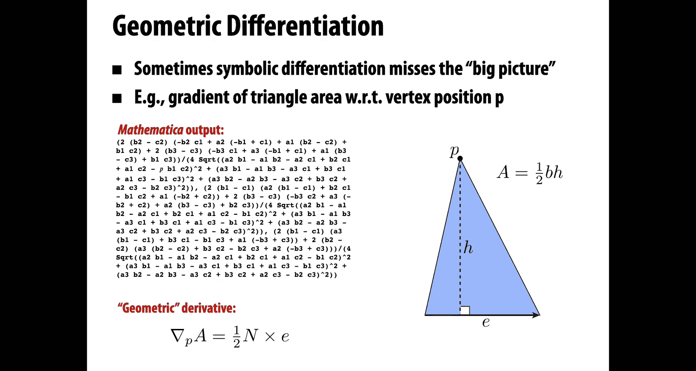

One topic that I didn't talk about today， but I mentioned was really important is dealing with contact and collisions and collision response。

This is obviously super important in the physical world where objects can't pass through each other。

 right but。

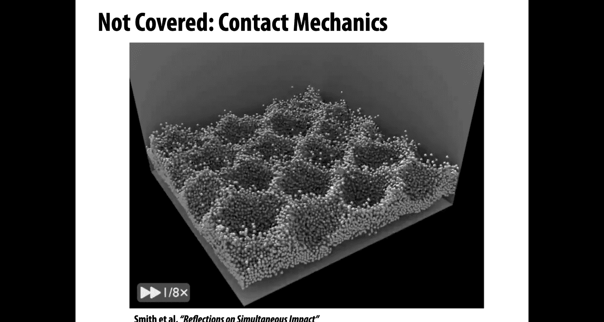

That's for another time。Coming up next， we're going to talk about optimization。

So how do I get the best possible outcome in a given problem。

 whether it be an animation or design of geometry or any number of other things that come up in computer graphics？

All right， talk to you then。