# CMU《计算机图形学｜CMU 15-462  COMPUTER GRAPHICS 2021》中英字幕 p22 -23-Lecture 22_ Optimization -BV1H3NBemE5E_p22-

Hello and welcome to computer graphics。 Today， we're going to talk about a very important topic in not only animation and not only computer graphics。

 but broadly in computing。 Of course， we're going to use。😊。

Graphics and animation to motivate our discussion of optimization so last time we started talking about physically based animation and saying that if we use dynamics to drive motion。

 then we can get a lot of complexity， we can get a lot of rich and interesting behavior without doing a lot of manual labor right without key framing lots of different pieces of the animation。

And so we really get a lot of complexities from some very simple models just from essentially solving F equals MA。

The basic technique for solving those kinds of equations numerically was numerical integration。

 where we formulate the equations of motion， and then we take little steps forward in time by replacing time derivatives with differences。

That's how we got an update rule to take us from the current configuration of our scene to the next configuration。

 and this is a really general， powerful tool for generating all sorts of animation。Well， today。

 in very much the same way， we're going to see another very general。

 powerful tool that lets us do various kinds of animation。 And that's numerical optimization。

 So the basic idea is we're going to have some。Function some objective。

 some that quantifies how well we're doing， how good our solution is。

 and then we're going to sort of ski downhill， maybe follow the gradient of this function to figure out how to get a better and better solution。

Again， this is a technique， of course， that's used not only in graphics and not only in animation but in all sorts of problems right so today we will talk a bit about how optimization shows up in animation。

 but a really， really important thing to understand for graphics in general。For image processing。

 for geometry， for rendering， for all the things we've been talking about in this class so far。

So before getting ahead of ourselves， we have to really say what is an optimization problem？

And this is a pretty natural way that people like to think about things， right。

 you have some task at hand， some problem you want to solve and what you'd like to do is get the best possible solution among all possibilities。

Now in reality， you typically also have some kind of constraints， right。

 you want the best possible solution， but you have some amount of money you're willing to spend or amount of time you're willing to spend on it。

So you might want to find the cheapest flight， the shortest route， the tastiest restaurant。

 whatever it is。This general idea of optimization has been studied since the dawn of time。

 maybe one of the first kind of interesting examples of an optimization problem is the so called isOparmetric problem。

So there's a little story here， basically there's this Princess Dido who shows up in a new land and has some really you know sordid story but she shows up in this new land and the people there say okay well to kind of honor you will give you as much land as you can possibly enclose with an ox hide kind of a weird thing to say。

 but okay and so this princess Dido is very clever and she said， okay。

 well I know how to actually encircle a lot of land with this oxide you think it's going to be small but first of all what I'm going to do is cut it into a really really long strip。

And then this is the interesting optimization part。

 I'm going to figure out what is the biggest piece of land that I can enclose。

With a strip of fixed length。Right， this really nice geometric optimization problem to think about。

 What is the biggest shape you can enclose。With a strip or a piece of string of a fixed length。

Okay and you may say， if you think about this for a second， you may， some of you might think， oh。

 it's obvious that the solution is a circle。Why is that obvious， actually。

You you really have to show that's true， but this is indeed what what Princess Didto did。

 She made a circular path with this strip enclosed a bunch of land and really made out well Of course。

 in this picture actually it looks like she wanted some coastline too right she wanted a little beachfront property。

 but in general， if you want the most land encircled by a curve of fixed length that would be a circle。

 so this is optimizing an objective the total area maximizing area subject to a constraint。

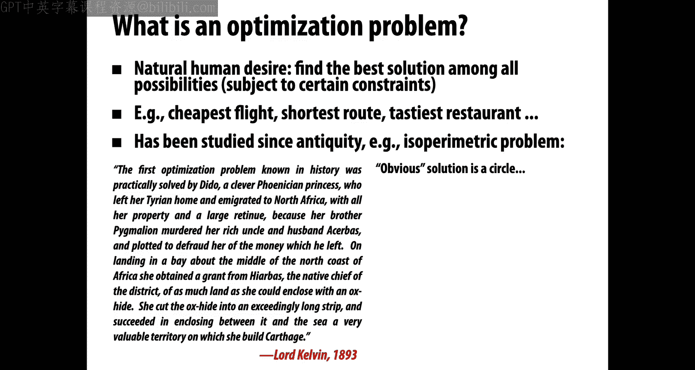

The length of the curve is fixed。Okay， so that's a very simple example of an optimization problem when it comes to graphics by pal character can be easily made to balance the 1 f by changing supporting polygon to be just。

 Once the characters， we add some pose of behavior and make the character member a give character The programmer can also play with the friction coefficient to generate motion and the defeat when the character stands on a slip。

 her feet slide on the floor。 make sure that character more small steps are required to recover balance。

 when rec a strong push， the character decides place her hand on the wall for additional and balance for itself。

 when the wall is too far， she has to take a step before reaching it。

 by introducing an additional wall， the character chooses to use both walls for support。

 note that in these examples， the character is controlled by the same balance controller and receive two same as to her were doing and a variance in the output motion is entirely。

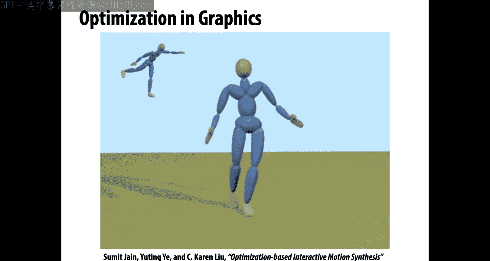

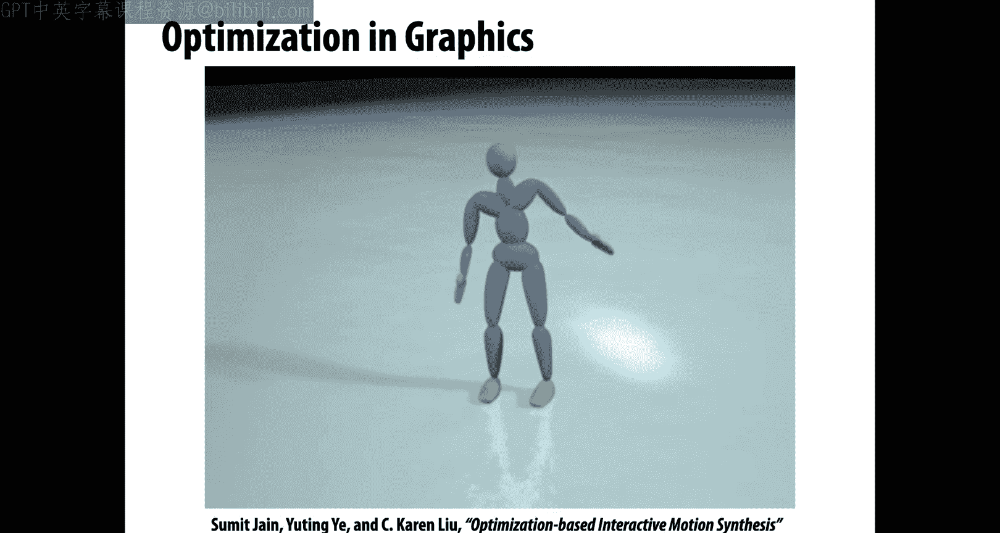

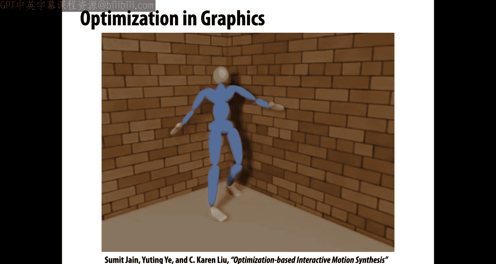

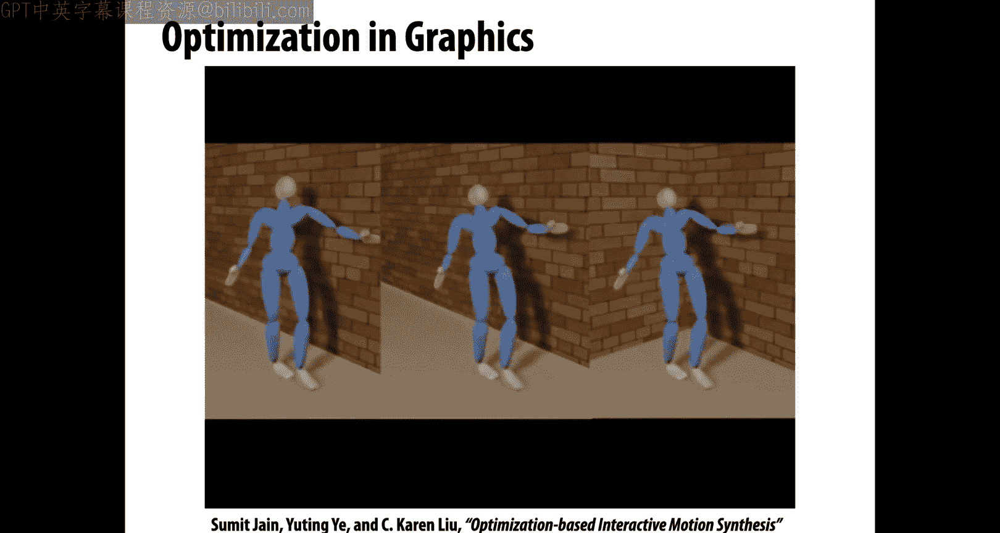

Other interesting examples outside of animation in geometry。

 you know very natural thing is to say I want a model that has a lot of symmetry。

 so here we start with this dragon model。That's just a triangle mesh with no clear notion of symmetry and you do some computation to figure out not only where the symmetries are。

 but how to deform the model to make it more and more symmetrical。

This could be useful for simplification。Compression or fabrication or all sorts of interesting things。

 editing， you want to do edits to the original model in a symmetric way。

 well maybe it helps to detect or produce these symmetries ahead of time。

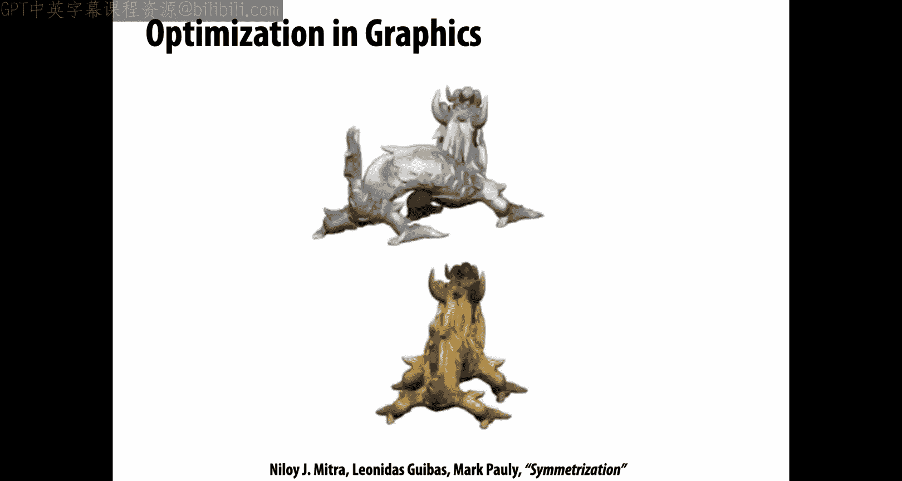

InAnother fun example from 3D fabrication optimizing dynamical properties So here the idea is you want to take some shape and turn it into a top。

 something that really spins well So here what you're going to do is do some kind of optimization involving the moment of inertia resulting the spin adjust the geometry difference between the dominant and later of inertia。

Another fun example， the shape of surprisingly airplane or a glide in this paper we introduce a new airplane model and a design that enablevice users to designs that actually fly design interesting shapes that can Our approach consists of two parts and offline machine learning design core learning some of flight use our novel flight modeld we optimize as graphics gets more and more connected fit the shape So lets talk about different kinds of optimization's kind have a little bit of a taxonomy of what optimization problems can look like。

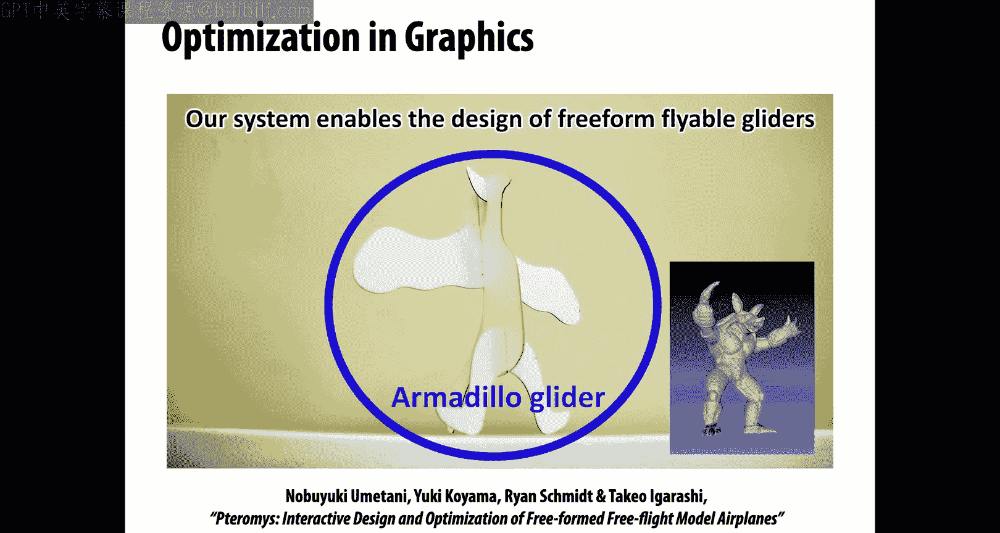

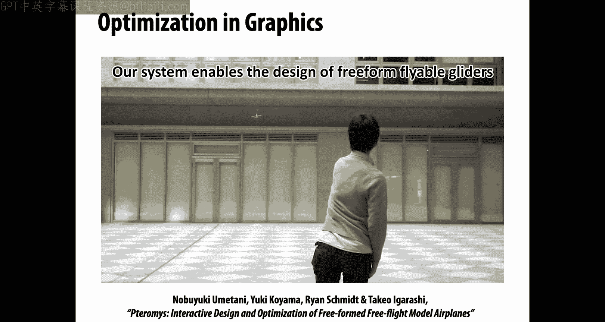

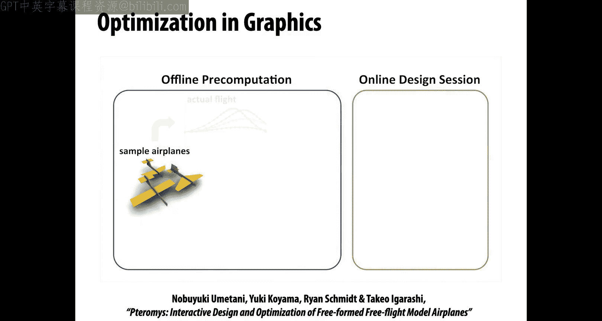

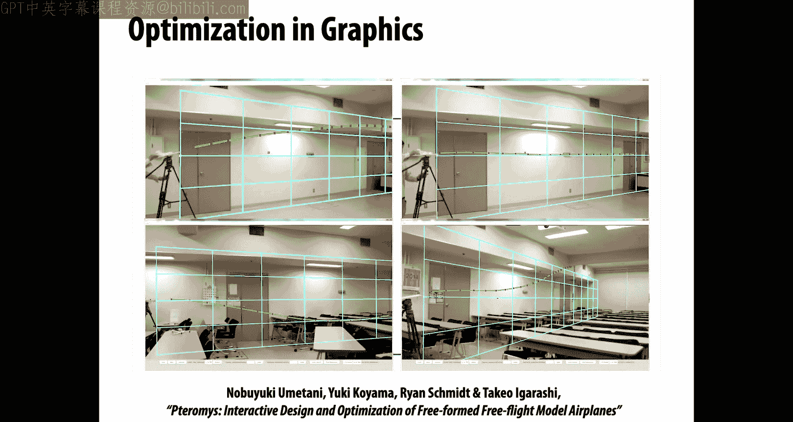

So for one thing， a big distinction between different types of problems is whether they're discrete or continuous。

 so in a discrete optimization problem， the domain is a discrete set。

What does that word mean discrete， Well， to be precise about it。

 a set that's discrete either has finitely many elements， right or at least。

Elements that can be put into correspondence with the integers。

OkaySo that's what we mean by a discrete set， usually when we talk about discrete optimization。

 we're talking about a finite set of possibilities， but not always。A concrete。

 kind of silly example is what's the best vegetable to put in a stew？

The set of possible vegetables is a discrete set。What is an optimization strategy that might work here？

Well， the first thing that comes to mind， the most naive strategy is to just try every possibility。

We put in a carrot， we try the soup， we ratete it， then we put in a potato instead。

 and we try the soup and we rate it and so forth， we try every possibility and we assign a score to every possibility。

This is obviously a bit of a costly procedure。RightIf now I said， for instance， okay。

 of all vegetables， I want to put three vegetables in the soup， which three are the best。

 well now I have to do know and choose three different soups right this is a huge amount of work and that is the basic flavor of a lot of discrete optimization problems。

Then unless you have some clever idea about how to solve it。

What you have to do is try out these exponentially many possibilities until you。Find the best score。

Now。For a lot of important problems， even discrete ones， people have cooked up clever strategies。

 for instance， if you look at various graph algorithms。

 you can think of graph problems sometimes as being connected to optimization problems。

 so maybe if you've heard of a minimal spanning tree。

I have a graph and I want to pick a set of edges that touch all vertices。

 a tree of edges that touch all vertices， and such that the sum of all those edge weights is as small as possible。

 that's a minimal spanning tree。Okay， you could do that in a naive way。

 you could try every single possibility， every single possible subte of the graph。

 there'd be a huge number of them right and then just some of the weights for all of them。

 fortunately for this problem， people have figured out clever algorithms， Pris algorithm。

 Cruescle's algorithm that let you do this in a reasonable amount of time。More often。

When somebody throws a just completely new and arbitrary discrete optimization problem at you。

Chances are it's going to be pretty hard a lot of discrete optimization problems like the traveling salesman problem is our NP hard you want to know I have a bunch of cities to visit。

 basically I want to visit all the nodes on a graph I might cross the same edge。More than once。

 but I want the total amount of time I spend traveling to be as minimal as possible。 That's NPR。

 not much you can do about it。Okay， so that's discrete optimization problems they give you a flavor。

 and there are various ways to approximate solutions to discrete optimization problems that don't look so bad。

 don't look as bad as this NP hard case if you're willing to give up a little bit on being guaranteed that you get absolutely the best solution。

What about continuous optimization problems， What does that mean， Well。

 that now means that the domain is no longer a discrete set。So， rather than。

Values are variables that take values in a discrete set。

 and you might have something like real numbers that can take any real value。Um，A kind of， again。

 silly example would be what's the best temperature to cook an egg？So there。

 I can't try all the possibilities。I simply can't， right。

 There's an infinitely many or uncountably many different temperatures I could try to cook the egg at。

And check which one is the best。Well， that'll take me literally forever。Right。

So I have to come up with a different strategy， maybe I could approximate it with a discrete problem right。

 I consider only integer temperatures okay， but does that really make it any easier was that the right thing to do？

嗯。Even within continuous optimization， there's still a lot of and be hard problems。 in fact。

 a lot of discrete problems can be transformed into a continuous problem。

But there are also large classes of easy problems。So one good example is so called convex problems so。

Convex optimization problems are things that you can reasonably solve。

 you can solve in polynomial time and get the optimal answer。And so that is。

A kind of problem that people sometimes aim for when formulating algorithms， especially in graphics。

 it's nice if you can boil your graphics problem down into a reasonably simple convex optimization problem。

 boy， then you're in good shape because they're really good， reliable。

 reasonably fast tools for solving these kinds of problems。Okay。

 what does an optimization problem look like？ Well， a really nice thing about optimization is that。

Many or most continuous optimization problems can be put into one standard form。

Once you have it in this form， you can kind of think about solving many different。

Optimization problems， many problems that come from different graphics problems， for instance。

 using the same tools and techniques， that's why we put it in standard form。

This standard form looks something like this。 It says I want to minimize。A function， F not。

With respect to a set of parameters X。 So if we have n。Distinct parameters。

 we can think of that as a point in RN。And we also have some constraints that need to be satisfied。

So。The functions F sub i of x。Need to always evaluate to less than or equal to。

B sub I for any X that we consider。What do these functions look like well。They're often。

 but not always continuous。Differententable functions that would be nice if we can take derivatives of these functions。

And what they do is they。Take our state。Or are parameters x and assign them a score， right。

 the n parameters x in our N get assigned a single value in R。Likewise。

 our objective is this way it takes all the parameters as input and assigns a score as output。Okay。

What does the subjective represent， it represents basically how much does the solution cost。

 or maybe another way of saying this is how bad is X？We want the best x， well， how bad is this x？

The constraints say what must be true about X？What are the conditions on x such that there。

Such that these parameters are feasible， they're allowable。

So if we think about this isoparametric problem。We might have said， oh allowable。If。

They describe something that has the given length。Okay。The optimal solution to this problem。

X star has the smallest value of F n among all feasible x。Okay。

Opttimal just means it's the best we can do while satisfying all the constraints。Now。

 when you look at this problem， you think this doesn't feel that general， it feels pretty specific。

 right， maybe we could write down any objective that we care about this way。

 we can always come up with some function if not that describes our cost。Or in machine learning。

 what people sometimes call the loss function。But what about these constraints， They don't look very。

They don't look very generic。 I mean， there are all these inequality constraints。

 What if I have other kinds of constraints。 And also I'm minimizing here。 What if I。

 what if I want to maximize something， right， I don't want to find the least bad thing。

 but I want to find the best thing。 I want to， I want to maximize the value of the objective。 Well。

 what can we do， I mean， what what can we do to this problem if we wanted to maximize。

Rather than minimize。Okay， it's pretty straightforward。

 all you have to do is change the definition of f n。

 we just flip the sign on the definition of f n and now we've turned our maximization problem into a minimization problem。

There's really no reason to ever write an optimization problem as a maxim instead of a minimization。

Okay。What if we want different kinds of constraints。

 what if we want things to be satisfied with equality rather than inequality？

We don't want to just say that the。Value of some constraint function is less than a given value。

 but we want it to be actually equal to that value。Okay， well。

 one answer is we could just add equality constraints to our list。

 but actually we don't need to do that， we can just include two complementary constraints。

Because these are inequality constraints that if we want to get equality。

We can just have two constraints that say， let's say g of x is less than or equal to c and G of x is also less than or equal to minus c。

If both of these constraints are satisfied， then we've satisfied something with。Equality right。

 and so the point of this is not that you always have to write down your problem in standard form。

But more that when you go to formulate algorithms for solving optimization problems。

 it's nice to be able to reduce everything to this standard form because then you only need to come up with an algorithm that handles problems in standard form。

And this is how some optimization packages will work。

 you'll state an optimization problem and it'll transform that problem into a standard form。

And then hand that transformed problem off to a solver that can handle any problem in standard form。

Okay。So let's talk a little bit more about what it means to solve an optimization problem。

And this is something that。You know， there's sometimes a bit of confusion or misdirection about。

When have you solved an optimization problem， well， one question is。

 are you talking about or do you want a local or global minimum？

What we've been talking about so far in this previous slide is global Minma。

The global minimum is something that's absolutely the best among all possibilities。

You considered all possible triples of vegetables that you could throw into a stew。

 this one is the absolute best。In contrast， a local minimum is。The best among immediate neighbors。

 or maybe another way of saying that is。A local minimum is something where。

I can't improve the solution by just perturbing it a little bit。

 I would have to make a big jump to ever find a better solution。Okay， and so you can ask this。

Kind of philosophical question。Does a local minimum solve？The problem。

Are you happy with a local minimum rather than a global minimum？And the answer is， well。

 it depends on the problem。For some problems， it's really that you're trying to do the absolute best and you want to find a global minimum。

For other problems。You may be happy with a local minimum， not just because it's kind of。Good。

 but because。The fact that you're at a local minimum tells you something important。

About the system you're looking at。And actually， you'll find in nature examples of things where the kind of solution is a local minimum rather than a global minimum。

 One example is the proteins in your body。Try to arrange them in some configuration that has kind of optimal energy。

In terms of intermolecular forces。And the proteins that you end up producing。Are often local minima。

 rather than global minima， they're in some configuration that's a local minimum。

 and it's actually really important that they're in that local minimum because that shape is what causes healthy cell function。

If you went to a global minimum， you might get a different shape that would behave in a different way。

So global is not always best， but hopefully it's clear what the distinction between the two is。

Another good example would be machine learning。Machine learning， essentially。

Never or very rarely for big complicated machine learning problems get you a global minimum。

But people are pretty happy with local Minma。Why is this true this is going to be true for a lot of graphics problems as well。

 And essentially the reason it's true is because local minima satisfies some condition on a derivative。

And it's satisfying that conditional and derivative that gives you the good behavior。

You're in some kind of。Equiilibrium。Okay。In some cases， locomadema can be really bad。

If you're trying to plot a path through the city。And you take some crazy， crazy route， imagine you。

You start at your home and then you head off to your destination and all the time you're carrying a spool of string。

When you end up at your destination， you might say， okay。

 I could make that path a little bit shorter by pulling the string tight。

if pull it all the way tight until I can't pull it tight anymore。

 then I'm kind of at a local minimum for that path I took， it might get caught on some， I don't know。

 buildings or street lights or trees that I passed by。But if I take a crazy route through the city。

 right， I wind around every city block to get to my destination。

 this local minimum could be really awful。What I really care about is that the。

Global path is pretty good。It's a lot to think about in terms of global versus local Minma。

Let's take a look at some optimization problems。 So let's think about。This problem。

 I want to just minimize over two parameters。 X1 and x2。 The function x1 squared minus x2 squared。

Subject to the condition that x1 squared plus x2 squared minus1 is less than or equal to 0。

How can we visualize this optimization problem？You know。Typically。

 we won't be able to concretely visualize optimization problems involving a huge number of variables。

It's hard to visualize things in dimension greater than three or maybe four。

But if we know how to visualize low dimensional problems。You know，T involving maybe two variables。

 that at least gives us some mental model， something to grasp onto when we think about optimization in general。

So how can we visualize this optimization problem？Well。

You all know how to plot the graph of a function in two variables。

I can think of this function x1 squared minus x2 squared as describing the height over the plane。

Okay， and you can think a little bit about what that shape might look like。

And the constraint I can think of as a set of allowable points。

 a set of points over which I want to plot this graph。

So what shape does this describe all the points such that x1 squared plus x2 squared minus1 is less than or equal to zero？

This is an implicit description of a shape。And that shape is， of course。

A circle are really the unit disk。Okay， so if we were to visualize this problem。

 we might draw something like this， a satellite like function plotted over the unit disc。

Looks like a potato chip。By the way， is this an optimization problem in standard form？Just to recall。

 that definition， is this in standard form？Yeah， we're minimizing an objective subject to an inequality constraint。

Okay， more interesting problem。Where is the optimal solution， Where is the globally optimal solution？

Right。😔，Where do I find。Something that achieves the minimal value。Okay。

 and actually even for this simple problem， we see something interesting。

There can be more than one global minimum。Here there are two。Both the 0。01 and the 0。0 minus1。

Both have the smallest value。 They're both at the point where this potato chip touches the ground。

Okay， and so seeing an example like this makes us really think like， okay。

 what can happen in general， I thought， you know， initially kind of felt like the global minimum was。

 was maybe unique， right， It's the absolute best one， but now。Now I'm not so sure what can happen。

So let's talk a little bit about existence and uniqueness of minimizers。We've already seen。

That the global minimizer is not。Necessarily unique。

DoesDoes that tell you anything about uniqueness of local minimizes？Yeah， sure。

 all global minimizers are also local minimizers。So if global minimizers aren't unique。

 then local minimizers are not either。Okay。So if there are global minimizers。

 they may or may not be unique。Are we maybe we're jumping the gun here a little bit because we also have to ask。

Does a global minimizer always exist？Why， why should you be so sure that there's always a point。

That achieves the minimum possible value。Does this sound like a crazy question？I mean。

 if you go back， for instance， to this。Point of view of discrete optimization， you can say， well。

 of course， right？Just consider all the possibilities and take the smallest one。

 How could it be that there's not a global minimizer？Okay， well。

 let's think about this for continuous optimization problems。In fact。

 I'll give you a really simple one。Let's think about minimizing the function X。That's it。

I have one variable in my problem， it's x x is a real value， can take any value on the real line。

And I want to find the point X that minimizes the objective function。F of x equals x。

Where's the global minimum？Right， here's a， here's a plot here， here's a graph of。

At least part of that function。Okay， so maybe just in this interval， I say， oh。

 the smallest value is the point on the lower left， but。I'm not just considering only this interval。

 I'm considering the entire real line。So how could I ever find a。Minimal value。

 I could keep moving x further and further to the left。

 and the value will go down and down and down and down。

So we set up a perfectly reasonable optimization problem， it doesn't involve any crazy。

Objective functions are any crazy constraints。But it clearly has no solution。

 We can always pick a smaller。X。So we cannot。Always find a global minimizer。

 We can't always just take the smallest。Value or the smallest input。

 because not all objective functions are bounded from below。Right。

 and you can think about it this way。 you've always heard that， you know， no matter how good you are。

 there's always someone better than you， right， That's very true， by the way。

 And it's also true in optimization problems。 You can have objective functions where you can keep going up and up and up and up to get better or down and down and down to get worse。

 okay。That's not the only reason。Why there might not be a global minimum。

 but this is a very important one。Let's also talk about。Feasibility， so。Let's say， okay， fine。

 forget about this crazy case where the objective is bounded。It is not bounded from below。

 Imagine that the function itself has some minimum value。Okay。Well。

 then surely we can just take the best feasible solution。Right。I mean， if the function。

doesnn't just keep going down forever， then okay if we can consider all possibilities。

 and among all possibilities， keep the one that has the smallest objective value。

So let's consider another problem。 Let's say we want to minimize。Or solve this optimization problem。

 minimize the function 0。 Okay， this is kind of a funny function。 I hand X。

 I handed my parameters x1 through x n， and it always just returns 0。

 That's the function I want to minimize。 Okay， but this is interesting because I have some constraints。

 I want to minimize it。😊，Subject to these inequality constraints。

 whatever points I'm considering to have these functions FiI evaluate to less than or equal to BI。

Okay， so the objective。Doesn't depend at all on the choice of X。

Any feasible solution is equally good。Our problem now reduces to simply finding points。

 actually any point at all that satisfies all the constraints。Okay。So， our optimization problem。

Reduces to solving a system of inequalities。One very simple example would be。Actually。

 let's say these inequalities are。Equivalent to a set of equalalities right before we said we could have a pair of inequalities to get an equality。

And let's say that all these。Functions F are linear functions。Okay。

 then our optimization problem is no different than just saying。

 please find me any solution to a given system of linear equations。Solve a linear algebra problem。

Okay。Can I solve all linear algebra problems？Can I always solve A X equals B。For some matrix A。Well。

 no。No， hopefully you remember from here。Linear algebra class。

That's not all linear systems have full rank。So if I ask you to minimize the function zero。

 subject to a linear condition。That doesn't have full rank。Then there's no solution。

 There is no global minimum because there's no feasible points。

A stupidly simple example of this would be minimize0 subject to x equals 1 and x equals minus1。Okay。

 that is a problem in standard form， it doesn't have a solution。

 and so therefore it doesn't have a globally optimal solution。

We can't just take the best feasible solution because there might not be any points at all。

Another thing that we get out of this is to realize that every system of equations is an optimization problem。

So if you have a general purpose solver for optimization problems in standard form。

 then you also have a general purpose solver for systems of equations。Okay。

But we have to be careful here。 it's not like there's some。

Great solver that's going to solve all problems for us ever。

 especially because not all problems even have solutions。Right。Not all problems have solutions。

 and you'll appreciate this more and more as you get older。So。Let's look at a concrete example。

Maybe make this a little easier to understand。Let's consider the optimization problem minimize。

Over points in the plane， the function。Sine of x1 plus x2 squared。

Except that we're not actually optimizing over the whole plane。 We have these conditions。

 We say that x1 minus2 squared plus x2 squared is less than or equal to 1。

And x1 is less than or equal to minus1。Is this problem feasible？

Are there points that satisfy those two inequality constraints？Well。

 let's think about what do those constraints describe？So the first one certainly looks familiar。

It looks a lot like our implicit equation for a unit disk， except that we've shifted it。 right。

 We subtracted 2 from x1， which means we're going to shift the disk over。Two units to the right。Okay。

And what about this second constraint， what does that describe geometrically。

 what region in the plane does that describe？Well， it describes all points。

First coordinate is less than or equal to minus1， so it describes a closed half plane。

Where the boundary of that closed half plane passes through。

A vertical line x1 equals minus-1 so it looks like this。Okay， so is this problem feasible。

 what's it asking us to do， it's asking us to minimize this interesting looking objective function。

Over points that are both in。The blue disc and in the blue half plane。Are there any such points。No。

 right？These two sets， what I'm going to call sublevel sets。Have no common points。

 They don't overlap。Okay， so not all problems are feasible， even pretty nice looking ones。

May not be feasible。And so we may not be able to find minimizers。Okay。

So so far we know that if a objective function is not bounded from below。Or。

Our constraints are not feasible。Then we can't find minimizers。Is that it。Right or on the other。

 you know， other way of saying that is if the objective function is bounded for from below and。

We have。A nice feasible set， there are points that satisfy our constraints。

Then surely we can find a optimal solution， we just look in that feasible set。

 we look at all valid points we test。The value of the objective functioning we keep the smallest one sounds pretty good。

Actually， it's still not that simple。So even being bounded from below is not enough。How can that be？

Well， let's consider again， a really nice， simple optimization problem。

Really not very complicated at all， it says。We want to minimize over all possible real numbers x。

 the function E to the minus x。What does this look like。

 what does the function E to the minus x look like it looks like that。Okay， this nice， smooth curve。

 perfectly differentiable defined everywhere on the real line。

 We just want to find where that function is smallest。Well， sorry， we're out of luck。

No matter how big X gets。We never actually achieve。The lower bound of the function。

 we never actually achieve the value0， which is the value we approach as x goes to infinity。

so this function does not have。A minimizer on the real line。Okay。So。

 so you see some examples like this and you think， boy， this is， this sounds complicated。 I thought。

 you know， I thought it'd be easy to talk about when。There is a global minimum。

 this idea of their being a global minimum is so intuitive。

 but now I don't feel confident at all that I even know given a problem that it can be solved。So。

 so what can we say， So when how can we kind of。Write down a simple list of conditions that gives us a sense something can be solved。

 Well， there's two sufficient conditions。These are sufficient conditions， right。

 these are enough to guarantee that a solution exists。 they're not necessary。

 there might be other ways to know there's a solution， but these are sufficient。

One is something called the extreme value theorem。Okay， so we have a。

 we want to have a continuous objective， an objective that doesn't jump in value as we change x by a small amount and a compact domain。

Meaning， the set of。Feasible points。Is a closed and bounded set。Closed and bounded subset of Rn。Okay。

And。Coerciivity。Coerciivity means。That the objective function， loosely speaking。

 goes to positive infinity as we travel far， far away in any direction。RightSo this example here。

 either the minus x is not a coercive function。 As x gets bigger and bigger and bigger。

 the value is not going towards positive infinity。 It's not。

 it's not looking more and more like a steep wall。Right。It's getting smaller and smaller。

 so coercivity。Is kind of saying。There's going to be a global minimum because if you allow yourself to get too big。

 too far from the origin， things are just going to keep going up， that's not a good place to look。

Right and the extreme value theorem is asking that we have a compact domain that the set of points where we have to look is sort of in some sense。

 finite， I mean， it's not actually a set of finite a finite set of points。

 but it is kind of a finite region， a closed and bounded region of RN。Okay。Okay。

 so now we have some sense of when a minimizer might exist。

But we haven't yet said anything about how we know or how we test whether a given point X is a minimizer。

So let's look at this picture again， we have local Minma， we have global Minma。You know， how do we。

 how do we know how how do I。You know how did I， how did I draw this picture。

 How did I know to draw points， those black points on this picture。

 Why did I think that those might be。Good candidates for local and global Minma。

Maybe the global minimum is easy because it was the smallest value on that curve。

Why am I drawing those local men about those points？Okay。So。In， in general， I'll actually say that。

Checking if a point is a global minimizer is typically hard。If I just hand you a point X and I say。

 I claim this is the global minimum。And you want to go check， is it or isn't it the global minimum。

 do I believe that this is actually the optimal solution？That's usually hard。 actually。

 checking that a given point is。The global minimum may be as hard as solving the original problem。

 you have to just go back and do it。Yourself。But we can certainly test if a point is a local minimum。

Okay， so what's。What's a good idea， maybe something that you have seen in your calculus class？

To figure out whether a given point is a local minimum， that we should be able to do。Okay。

 and this will also， by the way， help us， at least determine if a point is， you know。

 a global minimum is， is got to be a local minimum。 So this is the first thing you check。

 if I said this point is a。Global minimum， well you can at least check is it a local minimum。

 if it's not a local minimum， then you know I'm lying。

But how do I check that a point is a local minimum？Okay， well， let's think about a function。

 an objective function F， F not that goes from R to R， just a function on the real line。

How do you find a minimum of this function？How did you do that in calculus？So here's a nice function。

And you might have kind of memorized how to do this in your calculus class。 But let's。

 let's go through it。 We want to find。Points where the derivative of the function is equal to 0。

 We want to find points x star where the derivative is equal to 0。 So something like that。Right。

If we kind of draw what the derivative or the gradient of the function looks like at that point。

 we get this。Straight line， this， this tangent line。Okay， great， so that's the answer。

 right if we want to find。A minimum， we just take our function， we differentiate it。

 we set it equal to0， and we solve for x， right？Well， not quite。Right， what about this point。

 This point also has a。Derivative equal to zero。So does that mean that that point is a local minimum？

No， not really。It means it's a。Critical point of the function。

 but it's not necessarily a local minimum。So what else do we need to do to know that a point is a local minimum？

Right， we also need to look。At the second derivative。We need a second derivative test in particular。

We want to make sure that the second derivative is positive。Right。It has this。

Convex behavior at the critical point。Okay， so that's something we can easily understand for functions on the real line。

What about more general functions， I mean， obviously， when we w to do computer graphics。

 we're gonna be dealing with extremely。You know， big。

 complicated optimization problems with mini variables。

What does it mean to do these first and second derivative tests for more complicated？

Optimization problems。So let's talk about these conditions。

 what are called optimality conditions for unconstrained optimization problems for now we'll assume we only have an objective we don't have any constraints。

And in general， we think of this objective as a function f n that goes from RN to R。

 it takes n variables as input and assigns a single score。Okay。How in this case。

 in this multivariable case， do we test for a local minimum？Well。

 the idea is really not so different。We still want to do some kind of first derivative test that tells us we're at a critical point of the function。

And we want to do some kind of second derivative test。

That tells us that this critical point is not a maximum， and it's not a saddle point。

 but it's actually a local minimum。Okay， well。The first derivative test is going to be something that uses the gradient。

Rather than just the ordinary derivative， we already hinted at that。

 and the second derivative test will involve the hessian of the function。

Which we reviewed at the beginning， but okay， let's take another look。Okay。

 so remember that the gradient of the function， grad F。

Kind of describes the slope of the function or the direction of steepest ascent。

That was a good way of looking at it。So if we're walking around on a hillside。

And we keep following the gradient。To go down and down and down， we're trying to get。

Down to the bottom of the valley。Then there's going to be a point or there may be a point。

Where the gradient vanishes where we can't walk down any further。Likewise， if we're going up。

 there may be a point where the gradient vanishes， we can't go up any further， right？Okay。

The Hessian is our generalization of the second derivative to multivari functions。And。

The way you usually learn this is it's a big matrix of all possible second partial derivatives。

So if I have variables x1 through xn。Then I take the second derivative of F with respect to x1 and then x1。

 then I do it again with respect to x1 and x2。X1 and x3 and so forth。And。What does this capture。

 well， just like in the one dimensional case， the hesian kind of captures the curvature of the function。

Is it concave， I it convex？Is something else happening。

I can also think of the Hessian as kind of the change in the gradient。

So if I apply the Hessian to some direction。You。Then actually。

 what that's telling me is how does the gradient change along the direction U okay？

So what are our optimality conditions then？Well， they really don't look any different。

 Once we've generalized the first and second derivative， we say to be at a local minimum of a。

Function if not as long as it is。Twice differentiable as long as we can define the gradient of the hessian。

Gradient and the then we'll be at。An optimal point if the gradient at that point is 0。

And if the hessian of the point is。Positive， semi definite。Okay， importantly， this little symbol。

Is different from just the greater than。Equal to a symbol。

It's not saying the Hessian is greater than or equal to zero。

 it's saying it's positive semi definite meaning。U transpose AU is greater than or to u sorry is greater than or equal to zero for all U。

One way to think about this is if I have a matrix A。That's positive semi deffinite。

And I graph the function u transpose A U for all possible U， then this looks like a bowl。Right。

 rather than a hat or a saddle， it looks like a bowl。And。

If my Hessian is bowl like at X star at this point I'm considering。

 that means I'm sitting at the bottom of the bowl， I'm really at a local minimum。Okay。Okay。

 so that's what we can check to see if we're at a local minimum， what if we have constraints though？

Is it still just a matter of checking the first and second derivatives？Well。

 let's consider this function that we looked at before。Right， this kind of potato chip function。

And we said that it has two。Globally optimal solutions。 In fact， in this， in this case。

 those are also the only local。Minimma of the function。Do these points satisfy？Ourour。

 first and second derivative conditions。I mean， they clearly are the optimal solutions we couldn't possibly get any smaller than these two points。

 but do they satisfy these derivative conditions？For instance。

 is the gradient of the function zero at these black points？No。If I was standing。At that point。

The direction of steepest ascent is taking me upward， it's a non0 vector。Okay， so these points。

 even though they are minima。Don't satisfy our derivative conditions。

 Something changes when we have constraints in the problem。

Is the Hessian positive definite at these points？Maybe not as clear from this picture， but no。

 it's not。Right。So。It's not generally true that a constrained optimization problem。Has Minma。

Where these first and second derivatives。Second derivative tests are satisfied in general。

It gets more complicated。In general， any local or global minimizer must satisfy the so called。

Kuch kun Tucker conditions are what people always abbreviate as the KKT conditions。Okay。

 I'll just write these down so you can see at least once what they look like。Okay， here they are。So。

They get quite a bit more complicated。 You see that there still is kind of a first derivative condition in here。

 but now it involves derivatives of the objective function and derivatives of the constraint。

There still are conditions saying， oh， well， we should satisfy all those constraints。

 but then the funny thing is。There are these additional variables in here。

 we were optimizing just with respect to x's， and now we have all these lambdas in here。

 We have these kind of dual variables that help us understand are we at an optimal point。Okay。

 so we're not going to work with these in this class。

But these do show up all the time in computer graphics when you're talking about constrained optimization problems。

So I wanted to say at least once where to look if you're trying to understand what optimality means for constrained problems。

Okay。Let's now talk about。A special class of optimization problems。That are ones that are nice。

 ones that we would like to。Use or like to have to solve。At the beginning I said in general。

 optimization problems can be NP hard， they can be super difficult to solve and definitely can't find the global minimizer。

Convex problems are a special class of problems that are。

Almost always easy to solve in polynomial time。What I mean by almost always is not that every time you go to solve it。

 it may or may not be easy to solve， but rather that there are kind of harder and harder classes of convex optimization problems。

 and at some point they get hard enough that they're not all just nice polynomial time solvable。

For more basic ones， like the ones that often show up in graphics， you can usually solve these in。

Not only polynomial time， but really quite fast， really in a time that's sufficiently fast from making beautiful images。

What does it mean for a problem to be convex， it means that it has a convex domain and a convex objective。

Okay， well， to make sense of that， we need to say what we mean by convex domain and convex objective。

So what is a convex set？Okay， here's an example of a convex set。How do I know it's convex。

 how do I test whether or not a set is convex？The basic idea is I should be able to， if it's convex。

 I should be able to take any two points inside the set and connect them by a straight line segment。

That doesn't leave that set。So here we can take these two points。

 draw a straight line segment between them。That segment is contained in the blue region。

If you imagine repeating that for any possible pair of points in the set。

 there all of those segments are contained inside the set， so that's a convex set or a convex domain。

Here's an example that is not convex， you can pretty easily find a pair of points where if I connect them by straight line segment。

 that segment goes outside the domain， so that's non convex。Okay。

What does it mean for an objective or a function to be convex， kind of a similar idea？

If I look at the graph of the function， here it is， graph of F of x。

And I take any two points and connect them by straight line segment。

I want that line segment to be above the graph of the function。For all possible pairs of points。

 you can imagine if I repeat that again for a different set of points。

 the segment is still above the graph。So we call that a convex objective。

Here's a function that is not convex， I can very easily find a pair of points where if I draw a straight line segment between them。

That segment is not always above the graph。 So this is a non convex objective。

Why do we care about convex problems in graphics， well for one thing。

 we can make guarantees that we always get the best solution。Right that's nice。

 We're really getting a really， really nice result。Also。Because。

We don't have little local minima all over the place。We know that the result we get won't depend on。

Finding a good initial guess。At least if the problem is strongly convex。

Meaning this line segment always strictly above the graph of the function。

This is not generally true for all optimization problems。

If I have a general optimization problem might have lots of local minima。

 we can't guarantee we always get the best solution。

To try to get a solution that's even reasonably good。

 we might have to about think really hard about how to initialize optimization。

 what's an initial guess that kind of sort of looks like it might be good and then find a nearby local minimum。

With convex problems。Strongly convex problems， we don't have to worry about this at all。

 We can start with whatever random guess we want and we'll always get the same optimal solution。

What this means is algorithms built on top of Co VX optimization are also。More reliable。

 you can make kind of guarantees about their behavior because you know a lot more about the global minimum than some arbitrary local minimum。

Also。Convex optimization solving these problems is often efficient， but not always。Okay。

 for kind of simple convex optimization problems， these are about as fast as any other problem you might have to solve。

 numerical problem you might have to solve for graphics。

As you get into more sophisticated types of convex optimization problems。

 they can actually be quite expensive。Okay。So let's take a look at one really important class of convex optimization problems that show up all the time。

Day and night in computer graphics， both in animation and in geometry processing and in image processing all over the place。

Which are convex quadratic objectives。In fact， we've already seen an example of this when we talked about quadric error simplification。

We wanted to place。The collapsed point， we were simplifying a mesh。

 and we want to place the collapse point at the best location。

 Well we defined this notion of best using a quadratic form。Minimizing that quadratic form was a。

Convex quadratic problem。Okay。This is also a very valuable way of looking at many common equations。

 there are a lot of equations that pop up in graphics。That you might not realize are minimizing a。

Convex quadratic problem， but they are， and thinking about it this way can help you understand。

You know， how the solutions behave， how to solve these things and so forth。

So how do we write one of these down， we can express it via a positive semi definite matrix。Okay。

 so if we have an objective that looks like this， F naught of x equals 1/ x transpose Ax。

Minus x transpose B。Where a is a positive semi deffinite matrix。

Then that is a convex quadratic objective。The degree of the highest term is quadratic because it involves x twice。

And it's convex， because。A is a positive semi definite matrix。 If we drew the graph of this function。

 it would look like a bowl。And if we drew little line segments between any two points on this graph。

 they would all sit above the bowl。Okay。All right， so here's a good opportunity to。Practice。

Checking these optimality conditions， so what is the first order optimality condition for this function？

What is our？Analoggue of a first derivative test。We said we have to take the。

Graadient of the function。And set it equal to0。How do we take the gradient of a？

Function involving matrices and vectors。This was actually part of your linear algebra review at the beginning。

So hopefully the basic idea that you remember is that differentiating matrix value to functions。

Behaves at least superficially a lot like just differentiating ordinary scalar functions。

In particular， if I have。An ordinary function， A X squared。

 and I take the derivative with respect to X。 I get。To a X。Here I have a term。

It kind of looks like that。I have a term that looks like x transpose AX。

And A is a nice symmetric matrix。So what happens if you？Grind through the calculation。

 as you may have done for your homework。Is。You get something very similar。 You get two。

Times the matrix A times the vector x。Okay。And then that gets multiplied by one half。

 So we're just left with A X。 What is the gradient of x transpose B with respect to X。 Again。

 you can kind of remember the scalar analogy。 What's the derivative of just an ordinary function。

 B X with respect to X， It's just B。Likewise here， the gradient of x transpoes B with respect to x is just the vector B。

Okay， so putting that all together。We get a first order optimality condition of hey， Ax equals B。

So that's interesting。If I'm ever solving a。Linear system involving a positive semi deffinite matrix A。

I could also think about that as minimizing。This quadratic function as trying to find the bottom of a bowl shaped function。

Cool。What's the second order Opity condition？If I take another derivative of this objective。

 what happens？Well， B is constant with respect to X。 so that goes away。And A X depends linearly on x。

So basically， I just peel off this last x factor and I'm left with。The matrix， a。

 and I ask that that is positive， semi definite。Okay。

 so now I know that for a vector x to be an optimal solution to this problem to be a minimizer of f n of x。

I have to find an x such that A x equals B， and such that。A is positive semi deffinite。Okay， well。If。

😔，This objective is convex， that means I already know A is positive semi definite。

And so to find the optimal point。I just have to solve this first order optimality condition。

 I just have to solve a linear system。Right， because I know that。

The second condition is satisfied by definition。OkayAnd I keep talking about this picture。

 it's good to kind of have a mental picture of what's going on here。 you know。

 why does this work out if my matrix A is positive semi definite。

Then the graph looks like this cylinder in the middle。It's going up。In some directions。

 it maybe straight in some other directions。If it's strictly positive definite。

 if it's a strongly convex function， then it looks like this bowl on the far left。

 and if it's indefinite，If x transpose Ax is greater than0 for some x and less than zero for other x。

 then it has this satellite behavior。On the right。And so this kind of gives a sense of why should it be that convex problems are easy to solve。

 well， if I have this bowl and I'm looking for the minimum of the bowl。

I can imagine just kind of skiing down to the bottom if I keep just going down， down。

 down following the gradient and I'll get to the bottom。This is a coercive function if I go out。

 you know， I go out away from this inner bowl， it's going to get bigger and bigger and bigger。

If I'm positive semi definite， I'm still in good shape， I can still ski down to the bottom of this。

 now it's more like snowboarding。 This is like a half pipe or something right。

 and I get to some point on the bottom。 I don't have to get to a unique point on the bottom。

 There's this whole line of solutions in this case。 Okay。

 but I still get to something that has a minimum value。

Whereas if my objective has a matrix A that's indefinite if it's not a convex problem。Well。

 then actually in this case， there is no minimizer。

I can just keep skiing down this saddle forever and we'll never get to a minimum value。Okay。So sadly。

 life is not usually as easy as solving convex quadratic。Optimization problems。

 unconstrained convex quadratic optimization problems If it were。

 we'd be in good shape because we'd just have to solve linear systems as we'd be done。

The reality is the kinds of optimization problems that show up in graphics are way more complicated。

And Saly are often not convexx。Even if that's a good way of getting our head around optimization problems。

So how do we solve optimization problems in general？And a very old idea。Very intuitive idea。

Is exactly what we've been talking about， skiing downhill。

 following some decent direction to make our current guests better and better and better until we can't get any better。

Some people like to talk about this in the other direction。

 they say we'll do a hill climbing method we keep。Following the gradient uphill until we get the best value。

Well first of all， you all know that that's equivalent to flipping the sign on the objective and minimizing instead and second of all。

Hill climbing sounds。Way more exhausting and painful than skiing。

 I would much rather ski downhill than climb uphill okay。So。

The most basic version of this descent method is something called gradient descent。Okay。

 and the basic idea is to follow the gradient downhill until。The gradient is 0。

 so follow the direction that's minus the gradient。Right， because we know that the。

First order optimality condition says we're looking for points at least where the gradient is0。

 those are local。Minimma， well， they may be local mini of R function。Okay。

So here's what that looks like in one dimension。 I have a function F n of x。

 I start some initial point on the top left。 I compute the gradient， which in this case， is just the。

First derivative of the function with respect to x。And then the change in my guess for the position。

The change over time in my guess for the position is just equal to minus that derivative minus the gradient。

Okay， so maybe helpful to。Really plot some of these quantities on the x axis。

 So if I start at the point x not。The gradient of the function at X0 actually points to the left。

 so to decrease the function， I'm going to start moving toward the right。

If I take just some small step in the direction to the right。

I'm going to end up at a new point at that new point。

 there's a new gradient that new gradient tells me to travel。Possibly in a different way。

In this case， it tells me to continue going to the right but。To go even faster， right。

 there's a steeper gradient。And then as I keep going， as I keep following the gradient。

 eventually I reach a point， that's a local minimum。Where the gradient goes to zero。Okay。

In this case we did really well， we found the absolute smallest value of the function。

Do we always end up at a global minimum？No， I mean。

 we could have started on the right side of this graph and。

Ended up in that other local minimum on the right side。Another important question， how do we。

How do we compute or how do we implement gradient descent in practice？Okay。

 so let's write this down gradient descent algorithm in 1 D。Okay。

 so one thing that maybe you noticed after our last lecture is that the gradient descent equation。

The gradient descent evolution is an ordinary differential equation。

It says the change over time of the quantity x of t is minus。

The derivative of that function evaluated at x of T。

 So the function itself or the derivative of the function is our velocity function。

How do we solve this equation numerically， We already spent a lot of time last lecture talking about how to solve in general。

 ordinary differential equations numerically。So this should be no trouble。Well。

 we said one way we can do this is to apply the forward Eer。Algorithm， the forward Euler。

Time stepping strategy。Where we said， OK， let's replace this derivative Dx DT with a difference in time。

 our next x minus our current x divided by some time step tau。If we then solve for the new。

Point the new location of x。We can write that like this。X k plus1。

 our next location for x is equal to xk plus tau times the derivative of f not at xk at our current point。

One thing we didn't spend too much time talking about last time is how do we pick this time step tau？

When we were talking about animation， what we observed is that if we pick a time step that's too big。

 we can get undesirable behavior like our pendulum。You know。

 that was supposed to swing back and forth， gently actually blew up。

 it starts spinning around like crazy。So we have a sense that it can be dangerous to pick time stepss that are too large。

Of course， we also want to avoid picking time steps that are too small because we're going to end up doing a lot of work。

 We're going to have to repeatedly evaluate the derivative of this function over and over again。 So。

 so the the game usually in something like gradient asscent is to ask。

What's the biggest time step we can take without things going crazy？Because if we're not careful。

 we take a huge step， then we're going to just start randomly jumping all over the domain。

 evaluating whatever the gradient happens to be there。Jumping to some new point。

 and it's not clear we're going to make progress towards the local minimum。Okay。

So the basic strategy is to use step control。To determine a step size based on the value of the objective and its derivatives。

At our current point or maybe at our point and some nearby points。There are lots of different。

Strategies for step control。One of the most common is to do line search。Okay， and。

If we have a carefully designed lineert strategy， for instance。

 one standard one is called Armeo Wolf。Then we can be guaranteed that we will always at least converge to a local minimum。

And if our function is。Sufficiently nice。 And we apply this line search strategy。 We know that our。

Grading descent algorithm will always reach。A local minimum or always will get within some given epsilon of a local minimum。

For now， we're going to keep things simple rather than trying to come up with some fancy line search strategy。

 we're just going to make Tau really small。 We are just going to take lots of small steps， okay。

What if we go up in dimension， what if we have a multivari function。

 how do we write down gradient descent？Well really not different at all。

 we just replace our first derivative with guess what， the gradient？Okay。

 so we get another ordinary differential equation。That says the change in time of our guess X。

Is equal to minus the gradient of the objective function evaluated at the current guess x of T。

What's the corresponding discrete update？Again， it doesn't look any different。

The next point we want to visit is the current point minus this small time step tau times the gradient of the function evaluated at the current point。

Okay。Sounds pretty good and again， if we use a reasonable line search or whatever to pick our time step town。

Or if we just set it to be a teeny， tiny value， then we'll get to a local minimum， life is good。Okay。

 but now we can start asking questions about efficiency， not only will we get to a local minimum。

 but how quickly will we get to a local minimum？So a basic challenge as we start going up in dimension is that gradient descent can exhibit some really kind of dumb behavior。

So here's a very， very common phenomenon where our objective function in the vicinity of。

A local minimum looks like a long slender valley。And so if I started a point and I walk for a little while along the gradient at that initial point。

And then I stop， I update the gray， find the new gradient， I walk a little bit along that direction。

 and then I do it again and again and again。The solution can oscillate back and forth。

we as people who can see the global picture。Know that the best thing to do probably would have been。

To just head straight for the middle。It doesn't actually make so much sense to follow the gradient direction in this picture。

But if all we do is look at the derivative of that point。We just have a very。

 very local view of the function around that black point。Then it seemed like。

The best thing to do was to go along that initial blue segment。Okay。

And so this is the major shortcoming of gradient descent it really only gives or considers a very。

 very local picture。Of the function we're trying to optimize。And for that reason。

 it can end up taking many， many small steps， can be very slow to converge。So for this reason。

 people consider lots of disscent strategies beyond gradient descent。

One technique is to consider higher order derivatives of the function。Not only the gradient。

 but perhaps the Hessian。Okay。And the general idea what we want to achieve。

Intuitively is to sort of apply a。Transformation to our function or really to apply a transformation to the domain over which the function is defined。

So that the local energy landscape doesn't look like this long skinny valley。

 but instead looks like a nice round bowl。Right， because we know if we were optimizing a function like this that looks nice and round。

 then actually， the gradient direction is a good direction。 It points right toward the。Minimum。Okay。

So the gradient now points directly toward the nearby minimizer。The kind of classic strategy。

 the most basic strategy here is something called Newton's method。Now。Just a little note。

 it's easy to get confused when people talk about Newton's method。Normally。

 you're introduced to Newton's method as an algorithm for root finding。

 for finding places where a function has zeros。Here， Newton's method means something else。

 is a method that means something about minimizing an objective function。Actually。

 these two algorithms are essentially the same。 They're just different ways of looking at Newton's method。

But when you。Use Newton's method for optimization。You actually have a little bit more。

 you know the function that you're optimizing。Okay。

 so for now we want to talk about Newton's method as an optimization strategy。What does it look like？

Well， it does what we said we wanted to do， try to transform the problem so that we have a round bowl rather than a long skinny valley。

In particular， we do an update now that looks like this。So our new position x。

K plus 1 is equal to our current position X K minus the time step times。Well。

 no longer just the gradient， right， before ingredient thecent， we would have just。

Moved along the direction of the gradient， now what we're going to do is instead apply the inverse of the hessian to the gradient before we take this step。

Why does this make sense？Well。It makes sense， because the hessian。

Gives us a local quadratic approximation of the function。

If we did a local Taylor series approximation of。The objective function are round of the point x。

It would have a term involving the gradient and have a term involving the Hessian。

So the Hessian is really the thing。That's making our function look like a long skinkinny valley。

So if we apply the inverse of the Hessian， we're kind of unstretching that valley and turning it into a nice round bowl。

This strategy isn't perfect because the hessian at X and the hessian at the minimizer X star。

Are going to be a little different。But as we get closer and closer to the minimizer。

 we get closer and closer to transforming。Our problem into this perfectly round bowl。And in fact。

 as we approach the minimizer， we're going to get really， really rapid convergence。Okay。So。

This is particularly great for convex problems。In fact， there are even proof showing that in general。

You're going to take only about five or six Newton steps。

To get to a local minimizer once you're kind of in the。Bll like region around the minimizer， okay。

 and so super fast。For non convex problems， however， we need to be more careful。

The reason we need to be more careful is that the hessian is not always positive definite。

And so the point that we find with Newton's method might not be。Kind of a local minimum。

 but it might be more like a saddle point， it's not really making progress towards the minimizer。

Okay。But for convex problems， Newton's method is a rock solid strategy。In general。

 non convex optimization is a black art。There's just no good strategy。

 no good go to algorithm that works for all convex problems， no matter what you might hear。

You might have a friend who tells you that they tried out or they heard about the new latest and greatest optimization algorithm。

You know， stochastic gradient asscent， whatever it is。Sorry。

 this does not work well for all problems。 You really have to understand something about your problem structure。

How it behaves to pick a good solver for。A given optimization problem。

 and even then different implementations of different algorithms can behave differently。Again。

 it's really a black art。What should you do， what is the practical approach then to solving optimization problems？

You have some nice graphics problem， you're trying to do computer animation。

 you're trying to do physical simulation， you're trying to do geometry processing。

 you just want to solve the dang problem。What should you do？Well。

 I wish I had a great answer for you。Unfortunately， the。The real story is。

You have to just go out and try a lot of solvers and see what works。

You maybe dig up you know some literature on people who've tried to solve similar problems before。

 see what they did， try that out， see if it works for you。

And there are tons of different optimization strategies。

 far more than we have time to talk about in this class。

 quasi Newton methods which approximate the hessian to make things faster。

Or make sure that it's always positive definite。 You have trust region methods rather than doing line search。

 which can help avoid。Crazy behavior。LBFGS first order methods that only use the gradient but try to sort of simulate something more like Newton's method。

 there's just a billion different ways to solve optimization problems and the more you know about optimization。

 the more you know about these different algorithms and different techniques。

 the more power you'll have to set up and solve cool graphics problems。Okay。So so far today。

 we've been really focused on just optimization in the abstract。

Let's look a little bit at how optimization shows up in graphics。

 So here's a great example from animation， something called inverse kinematics。So， we talked。

Last time about how or a couple lectures ago about spline animation and keyframe animation。

 where the idea was you have a。A rig， you have a character that has lots of degrees of freedom to animate it。

 you can go to each moment of time and you can set exactly what these degrees of freedom look like and use splines to interpolate between them well that's a lot of work because you have to set up all these joint angles and all these different variables。

So the idea behind inverse kinematics is to say actually。I just have a simple goal for my character。

 In this case， I simply want the robot arm to。Go and touch one of the dinosaurs or grab one of the dinosaurs。

 Once it's done that， I want to go put it in the box。 Okay。

 and I don't want to have to myself set up all those little joint angles on this telescoping arm。

 That would be a huge amount of work。So what I can do is formulate this as an optimization problem。

I want to。Optimize。Or minimize the difference between the end of the。

Robot arm and the location of the object that I'm trying to pick up。

And I'm going to minimize that difference with respect to。

All the variables that control the configuration of the robot arm。

 maybe all of these joint angles or twist angles or whatever they are。

OkayThen I use an algorithm like gradient descent to move me toward that goal。That is the。

Rough idea behind inverse kinematics。OkaySo let's talk about this a little more precisely。

 let's talk about first before inverse kinematics， let's talk about forward kinematics。

So a lot of systems， a lot of。Characters in animation or robots or vehicles or whatever are well described by a kinematic chain。

 which just means I have a collection of。Objects may be rigid bodies。

 and they're connected by joints。Right so I could think of the the body as being somewhat like this。

 I have different components， my。Different pieces of my arm or different pieces of my leg。

 and they're connected by joints。And these joints have various behaviors。

They might freely rotate like a ball。They might move in and out like a piston。

 they might rotate only around one axis。I might also have constraints。

There might be a range of angles that are allowable for a given joint。 right。

 I can't twist my arm around by 360 degrees。 There's a minimum and maximum angle that's allowed。Okay。

 so you start to see。This idea of an optimization problem， creep in。We have these variables。

 they have constraints on them， we want to minimize some objectives subject to these constraints。

For a kinematic chain， we also have kind of a hierarchical structure。

The configuration of the leg depends on the configuration of the body， if I rotate the whole body。

 the leg rotates along with it， if I rotate the leg， the foot rotates along with it and so forth。

In animation， people often call this a rig， just a short name or colloquial name for a kinematic chain。

How do we specify the configuration of a rig， well again。

 we could go through and an animator could sit down and in every key frame set all the joint angles individually。

Or we could do this through optimization。We could use computation to reduce the work required for the artist or the animator。

Here's a really simple example of a kinematic chain。

 let's just consider a path like chain in two dimensions。So we're going to have these three vertices。

C0 c1 C2， and the vectors U0 and U1 between them。At any given moment in time， we're going to use P0。

 P1 P2 to denote the positions of。Those vertices。And the angles， theta n and theta 1。

To denote the angles。 So theta n is the angle of the edge between P 0 and P1。

With respect to the horizontal direction。And theta 1 is the angle。Of the edge between P1 and P2。

With respect to the current direction of the first segment， P0 P1。

That's why this is a hierarchical chain， the meaning of the angle theta 1 depends on what the current angle theta0 is equal to。

If we rotate theta zero。Then the whole rest of the chain rotates along with it。Okay。

How do we write down， for instance， the location of P1？

In terms of the root position P0 and all of our angles， theta and all of our vectors， U。Oh。

 we can write it down this way。Right，We could say P1 is。A translation。Away from P0。

And what does that translation look like when we take the reference direction u0？

Which has some length that has the length of that edge。 And we rotate it。

 How much do we rotate it by， We rotate it by theta 0 Here。 we've just written down a little。

2D rotation matrix。We could also do this， remember we talked about how complex numbers are a really nice way to write down rotations。

 simplifies conceptually a lot what's going on， we could just write this down as P1 equals p0 plus e to the I theta not u0。

What does this either the I the or not mean， it means nothing different from that rotation matrix。

 It just means a rotation by the angle theta not。 It's just a nicer expression。Okay。

So then how do we write down the location of P2？Well。

 this is why we did this in complex numbers just to make these expressions a little more concise。

So we do a similar thing， we can say P2。Is an offset from P1？Which。Is itself an offset of from P0？

In particular， p2 is p0 plus E to I theta u n。 So P1 plus。

And now I have a product of these two rotations， E to the I theta not E to the I theta 1， right。

Rotate by both theta and by theta 0 and theta 1。And apply that to the vector U1 to get the offset from P1。

Okay， let's just stare at that for just a second。Make sure it makes sense。

So what we have now is a kinematic chain。Where the positions P are controlled by the angle's theta。

And it's these angles theta that we need to figure out to generate an animation of this chain。

So let's do this using a very， very simple inverse kinematics algorithm。

The basic idea behind this algorithm is that we want to write down the distance between the final point and some target。

We want to make an arm reach for something in the environment。So we want the point P2 to。

Kind of meet up with some given point in space。And to make this happen， we're going to。

Compute the gradient of the position。Of that endpoint， with respect to the angles。

And then apply gradient descent to move it closer and closer to those angles。Okay。

What is the objective that we use in this case。What would be a simple objective？Well。

 let's say that for end point or for point PN。We want it to。

Get as close as possible to a given point， P Tilda。Then we can just say。That the function。

 the objective function f n of theta is equal to 1/2 Pn tilde minus Pn。Norm squared。

 just the distance between those two points squared。What about the constraints。So in this case。

We'll just say there aren't any。The joint can just take any value at once。

 but we could if we wanted to limit the joint angles。Okay。

And so the cool thing that's going to happen now， and this is what you'll do in your final assignment on animation。

Is if you build some complicated character？It has all these joints and angles， and so forth。

And simply run gradient descent on， let's say， the location of the hand。

You say oh PN is the location of maybe one of the fingertips and you want to move it towards some object in the environment。

 if you now take gradient descent with respect to all variables in this character。

 the whole body is going to move and deform，To do a good job of reaching out for whatever object。

You want to touch。Okay， so I'll let you see how that unfolds as you implement your final assignment。

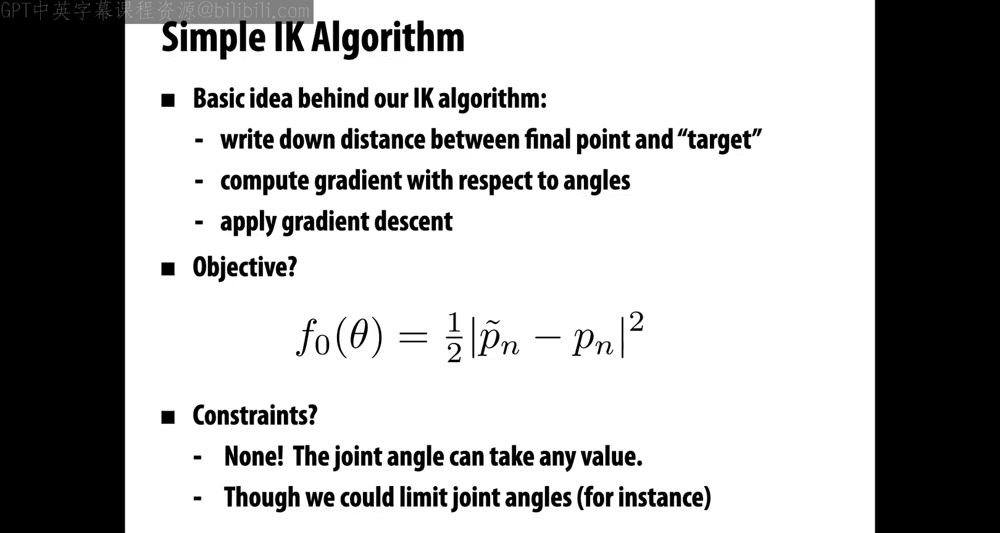

Next time， we're going to go back to our discussion of differential equations。 but this time。

 talk about。

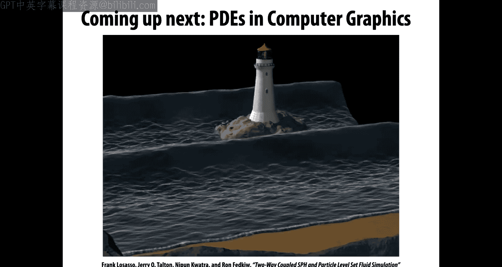

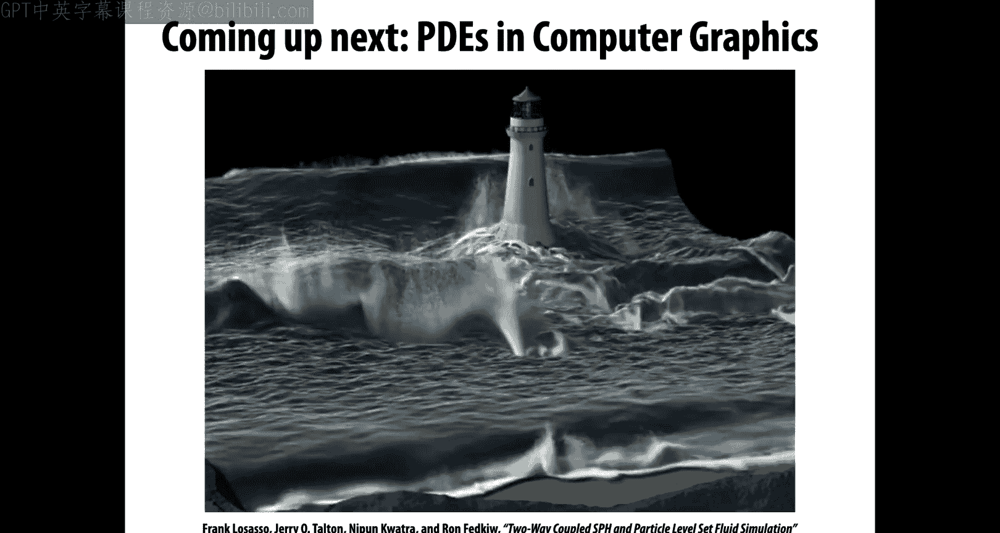

Partial differential equations talking about things that have derivatives in both space and time。

 and this is going to let us model all sorts of amazing phenomena。

 like crashing waves and other physical phenomena that you see a lot in computer graphics these days。

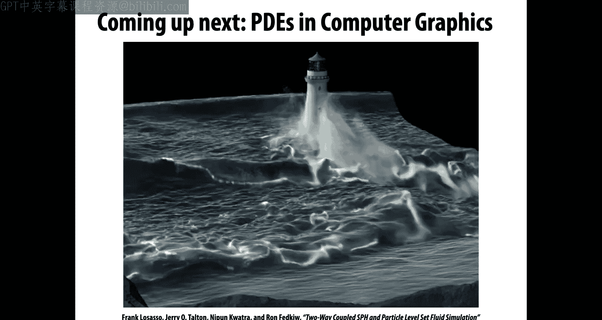

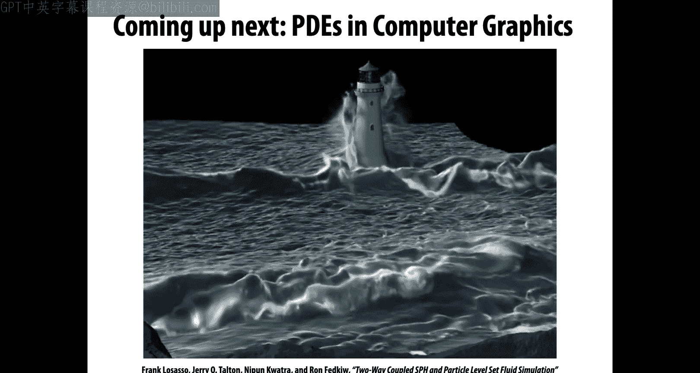

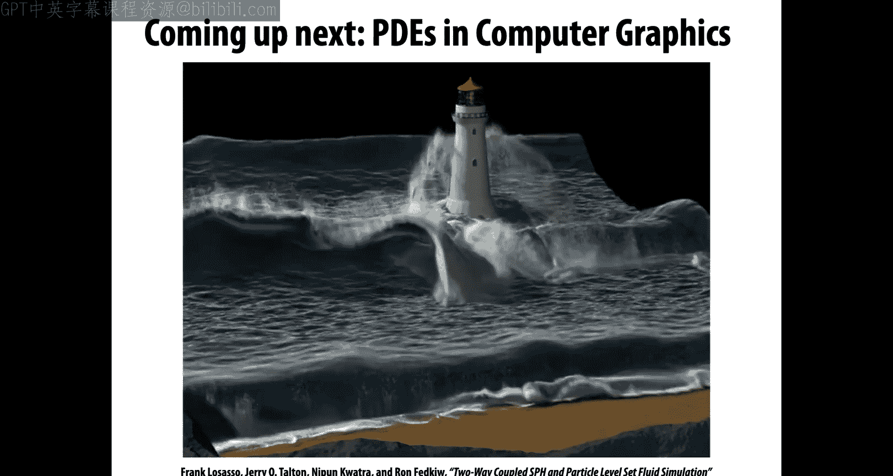

All right， that's it， see you next time。

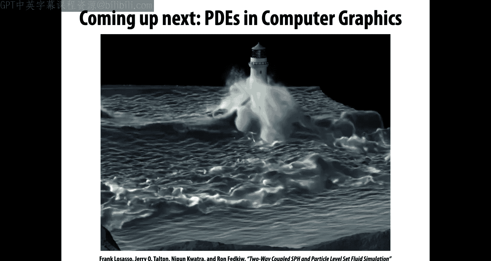