# CMU《计算机图形学｜CMU 15-462  COMPUTER GRAPHICS 2021》中英字幕 p23 -24-Lecture 23_ Physically Based Animation and PDEs -BV1H3NBemE5E_p23-

Welcome back to computer graphics so today we're talking about physically based animation and how we can do that by solving partial differential equations so just to recap last time we got a brief introduction to optimization really just saw the tip of the iceberg maybe the most important message is that modern computer graphics really does use optimization in many different ways and there can be many。

 many complex criteria and constraints that show up in graphics optimization problems but the basic technique tends to be the same we want to do some kind of numerical descent to minimize an objective function so we pick some initial guess we start skiing downhill and we sort of keep our fingers crossed that if we follow the downhill direction long enough we'll get a good solution。

If we think back even one lecture earlier， what we realized is that gradient descent and other disscent strategies are really just examples of ordinary differential equations。

RightAnd so today we're going to return to our discussion of differential equations previously we had been talking about these ODEs that involved only derivatives in time and today we're going to add a lot of richness to that story by considering partial differential equations PDEs that also have derivatives in space why do we want to study PDEs and graphics。

 well they describe lots of natural phenomena， water， smoke， cloth， hair。

 all sorts of things that we experience in the physical world and there's been kind of a recent or maybe not so recent revolution in computer graphics and visual effects because we've been able to solve these really hard PDEs to capture a lot of what goes on in the physical world。

Okay， so again， the basic idea of an ordinary differential equation is that we're going to implicitly describe a function in terms of its time derivatives。

So for instance， let's say we wanted to model a rock just flying through the air。

Along a ballistic trajectory。We might say that the position of the rock X at any time t。Has。😔。

A second time derivative。Equal to the direction of gravity。

 so we're saying that the position or the rock is accelerating according to gravity。Now。

 why do I see that this is an implicit equation？Well。

 just like our implicit descriptions of geometry， we haven't actually said where precisely this rock is at any moment in time。

We've just given a relationship that has to be satisfied in order for this to be a valid trajectory。

Right。Okay， likewise， a partial differential equation。

Is going to be a implicit description of some phenomenon。

 but now involving both time derivatives and spatial derivatives。

 so you can imagine this rock flies through the air and it lands in a pond and now some ripples spread out from this pond。

And so the equation we might use to describe the height of these ripples at every point in space could look something like this that the second time derivative。

 the acceleration of this height is equal to the Laplaceian of the height。

 so the sum of the second derivatives in the x and the y direction。Okay， again。

 this is an implicit description we would have to actually go ahead and somehow solve this equation in order to see what the water is doing and that's exactly what we want to do today。

Okay。So。We're going to talk a lot about how this all works， but to kind of make a long story short。

 you know， we said the most basic strategy for solving an ODE is to sort of add a little velocity at each time step so if we have some current configuration QK。

And we know that the velocity at Q is some function f ofq， then we add just a little bit of that tau。

 some small number of tau times F ofq to get our new state QK plus1。Okay。

 and solving a PDE doesn't look so different， we're still going to be marching forward in time。

But now our velocity function is going to do something like take some weighted combination of neighboring values。

Okay， so for instance， in our wave equation， it's going to turn out that our combination of values is going to look something like add up my immediate neighbors and subtract four times my own value。

And otherwise， I have a very similar looking equation， right。

 this next state QK plus1 is the old state QK plus tau times this little velocity function。Okay。

Obviously， there is a ton more to say about solving PDEs and lots of different techniques。

 but we just wanted to give you a flavor first of how this works before getting into all the details。

In fact， it's surprising how very， very simple code can give rise to some quite beautiful behavior。

 and this is really why people like to use PDEs for graphics。So again。

 it can get really intimidating to see all the terminology and mathematics and so forth and feel like how could I ever possibly do this kind of simulation。

 but when you actually look at the code it's not so bad。

 so let's just step through a little example we won't completely you know understand why everything is going the way it is in this code but at least this will give us a flavor for what this kind of code looks like。

So if we want to simulate the wave patterns that we see in the background here。

 then we can write a little routine where we say， okay， first of all。

 we're going to solve our problem on a grid， let's say it's a 128 by 128 grid。

And we're going to keep track of just two values at every grid point。

 we're going to keep track of the height of the wave， so how far it is from a flat surface。

 we'll call that U and a velocity V， how quickly is that height changing over time？

We're also going to pick a step size tau that says。

 how quickly do we want to march this equation forward in time？And just for fun。

 I've added this little damping factor alpha that's going to cause these waves to dissipate over time。

 this is what happens with real waves， they eventually fade out。Okay。So what do we do Well。

 we're just going to run a loop forever， just keep running an animation loop and at a few random times we'll check you know what frame are we at okay if we're at a multiple of 100。

 we're going to imagine we're dropping a stone at some random location。

 so we're going to set the height of the wave view to minus1， everything else is zero。

And then the interesting part， we're going to update the velocity。

OkaySo what should the velocity of the wave look like， Well。

 we are going to iterate over all the grid cells from I and J from 0 to n。

We're going to look to our left， our right， our bottom and our top。

 so look at the grid cells one index away， and here I'm just using this modD end to wrap around the grid so I don't have to think about what happens when I get to the boundary。

Okay， and here it is， this is the only complicated equation in this this whole code。

I'm going to say that my velocity， I'm going to add to my velocity。

 the time step times some function。Okay， and what is this function doing。

 basically it's measuring the deviation of the height at the current point from the average height。

Of the neighboring points， so if I'm flat， then there's no velocity。

 nothing interesting is happening if I have a big bump， I'm going to add a lot of velocity。

Okay that's just like if I toss my stone in the pond。

 it's going to cause stuff to start moving if the pond is just sitting flat and still。

 there's no change。I'm also going to multiply the velocity by my damping factor just to gradually slow things down over time。

 and that's it for velocity。To update the height， the actual thing I'm going to see。Well。

 I'll just again iterate over all the grid cells。And now really simple。

 how much does the height change in each step， well it changes by the time step size tau times the velocity at that grid point。

Pretty easy， okay， and then I go ahead and somehow display this you know。

 I've displayed this as a pixel image， you could also draw it as a height function or something。Okay。

So that's it。Pretty prettyty simple code and pretty beautiful behavior and obviously it gets a lot more complicated like this if you want to do real you interesting graphics。

 but the basic flavor of the kind of codeji write is right here on the screen。

So let's look at a few examples of some real stuff。

 some really interesting graphics you can create with partial differential equations here's a much much more sophisticated liquid simulation This is involving liquids of different densities so you can kind of see these interact in interesting ways and then at this moment the density of one of the liquids has changed artificially so this is something you couldn't do in physical reality so now it floats to the top now we drop another ball of different density on there there's lots of different representations that could be used for simulating fluid so this last one was using a grid here what you're going to do is something totally different you use a polygon curves in space to define the vorticity of the fluid basically how much it's spinning around so you get these nice wispy smoke。

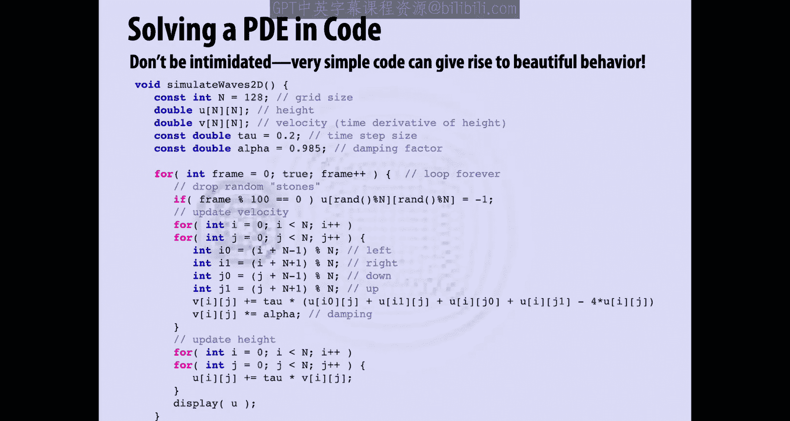

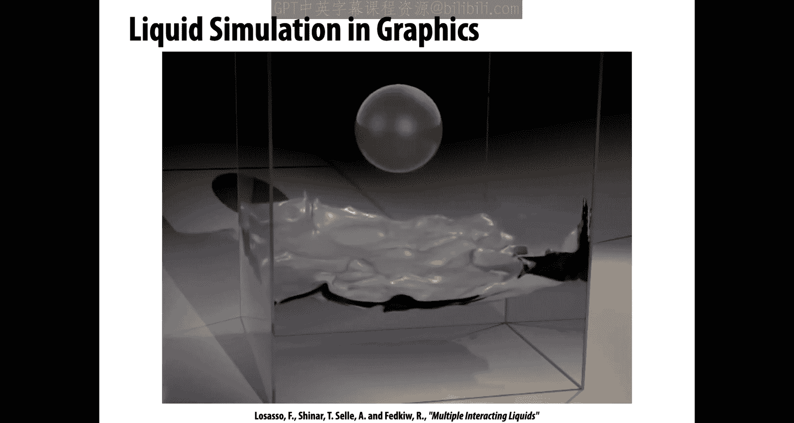

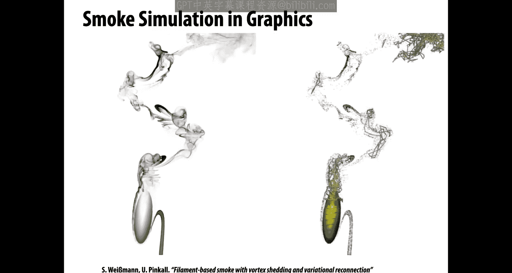

You might simulate other phenomena here simulating cloth。

 so the wrinkling and buckling of cloth as these pillows are dropped from the air。Or elastic bodies。

 so a lot of the physical objects that we interact with are pretty well modeled by elastic bodies。

 things that can deform but like to restore their shape if you bend them， they want to go back。Okay。

 so here's a fun。

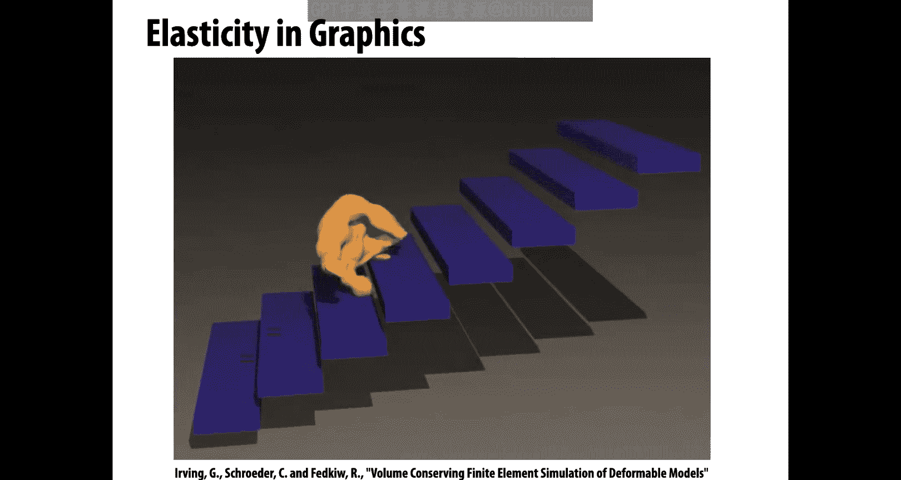

Example of that or hair， hair is， you could think of it as another elastic body。

 but it's kind of one dimensional， you have these strands。

 maybe they're able to bend and twist a little bit， but they want to restore their their shape。

You can also think about what happens with elastic bodies when they go past the point of how far they want to be stretched。

 so if they go past a yield point， they'll fracture and you'll get all this interesting and beautiful behavior。

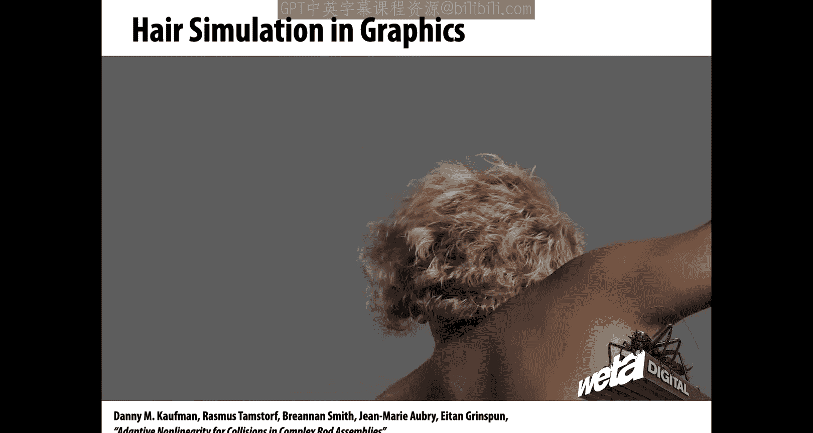

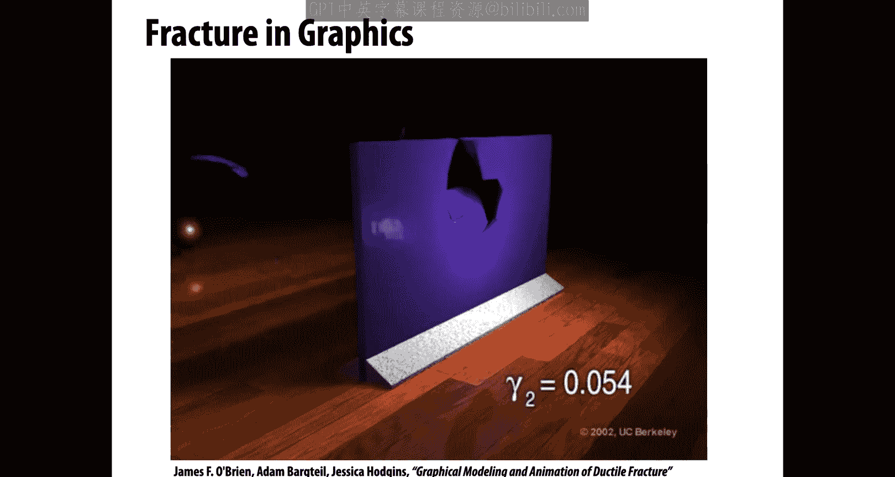

Or you could simulate visco elastic materials things where if you bend them far enough。

 if you push them hard enough， they actually permanently change shape。

 so pushing this poor bunny through the box。

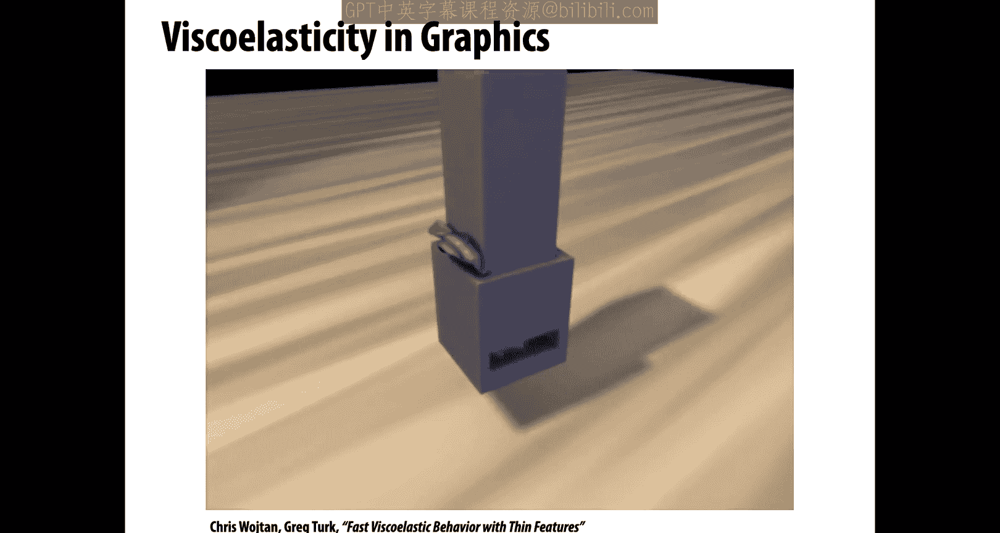

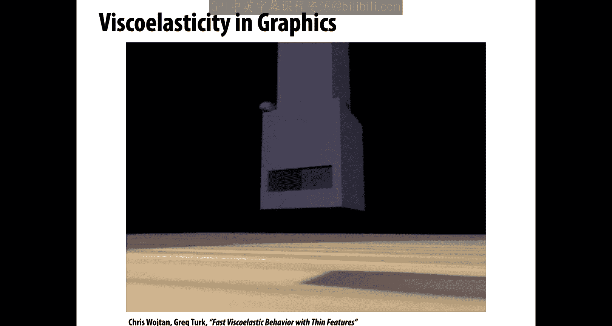

Recently there's been a lot of interest in what are called material point methods。

 this was one of the early examples used in film for doing snow simulation by Disney for Fzen。

So using particles and grids mixed together in an interesting way to get some very rich effects。

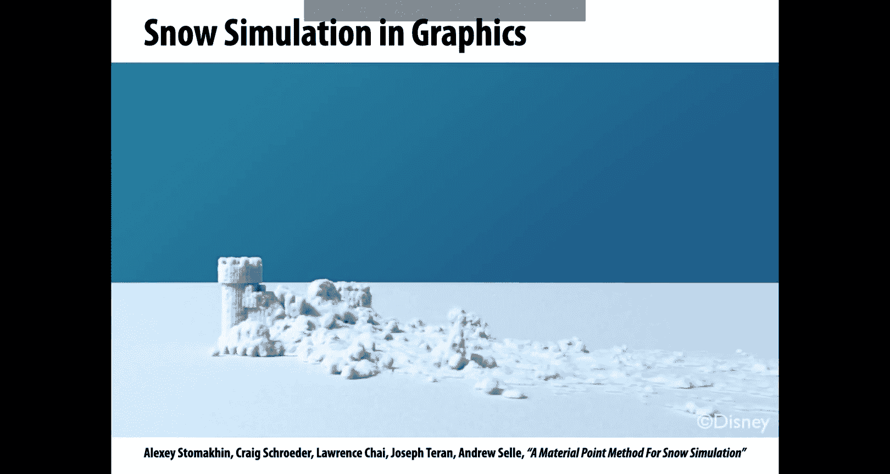

Okay， so how is this all happening， how do we get to this point， do we。

 how do we develop these kind of techniques？Well， let's go back to the basics and think what really is a PDE？

So we said a PDE is something where we're really trying to solve for a function that depends both on time and space。

For a rippling wave， for instance， we were saying what is the displacement at each moment in time and at each point in space so we could call that u of T and x where x could be any number of spatial variables。

The function we want， the final function U is given implicitly in terms of derivatives of U。

And so we could have time derivatives of many different orders， so u dot。

 meaning the first time derivative， u double dot meaning the second time derivative and so on。

And also spatial derivatives， partial U， partial x1， partial U， partial x2。

 the second derivative of U along x1 and x2 and so on。So just as an example of some。

Random PDE that mixes together space and time derivatives， is kind of a classic equation。

 Burgers equation， which says that the time derivative of U plus the value of u times the space derivative of u equals some constant alpha times the second spatial derivative of U。

And what does this describe， Well， it kind of describes a wave that is gradually forming a shock and this alpha parameter is。

Governing how quickly this wave gets diffused or dissipated。Okay， just as some example。

So there are a lot of different terms that we can use， a lot of different jargon。

 essentially we can use to talk about different kinds of PDEs that have different kinds of behavior。

 and this behavior is going to inform how hard and easy it is to solve these problems and what kinds of computational techniques we might use。

So one very basic question you could ask about a PDE is is it linear or is it nonlinear how are derivatives combined。

 so for instance， we have this Burgers equation and we have， let's say the diffusion equation。

 something that looks similar to the wave equation。Which one of these is linear。

 which one is nonlinear？Well， generally， we're going to say that if。

We have things like the function being multiplied by itself or multiplied by one of its derivatives。

 or you push the function through some function like sine or cosine or whatever。

 then this is a nonlinear equation。In Burge's equation。

 we have this non nonlinearity of u times u prime， so it's kind of quadratic in U。

The diffusion equation， on the other hand， is linear。We have。

One instance of the time derivative of U on the left side。

 we've got two space derivatives of U on the right side， and then we just have a constant A。

Okay so linear equations is generally easier to solve。

We can also talk about the order of a PDE when people talk about order。

 they mean how many derivatives in space and time。So again。

 if we look at Bger's equation versus okay， how about the wave equation。

 so we'd say this this first one is， well it's first order in time， it has one time derivative。

And it's second order in space because the highest order spatial derivative is a second derivative。

Okay。Likewise， the wave equation is second order in space it has at most two spatial derivatives。

And second order in time， it has it most to time derivatives。And again。

 the rule of thumb is that if an equation is nonlinear， it's harder to solve。

 also if it's higher order， it tends to be harder to solve。When you first start learning about PDEs。

 it can seem like there's。A whole sea of possible equations and that's true。

 there are so many PDEs and no completely orderly way to organize them。

 but there are some really basic model equations that give a feel for different kinds of PDEs and really understanding these model equations will give you a really。

 really good sense of what different equations are like and also what kinds of solvers you might need to attack a given problem。

So。One of the most basic equations is the Laplace equation。

Which says that if I apply the Laloian to my function U， it's equal to zero at every point。

And this is the canonical example of what's called an elliptic equation。So intuitively。

 what is this equation asking， it's saying if I have some boundary data。

So if I have some known values on some part of my domain。

The function U is going to be sort of the smoothest function that interpolates these known values。

Okay， and we'll talk more about the Lalosian later。We can change this equation just a little bit。

Into something that now depends on time， something that says the change in time of the function U is equal to its Laloian。

That is called the heat equation， which is the canonical example of a parabolic equation。

 Intuitively， it's saying how does an initial distribution of heat spread out over time。

 So if I turn on the stove。How is the heat from the stove going to radiate into the rest of the room。

Over time。Okay。And then finally we have the wave equation， again， really not so different。

 you know really artificial change to the algebra， but really very different character of this equation。

 so the wave equation says that the second time derivative u is equal to the Laplaceian of U。

 this is the classic example of a hyperbolic equation and this is like our wave we were talking about before if you throw a rock into a pond。

 how does the wave height evolve over time。Okay。So we can think about how easy or hard it is to solve each of these equations and they're put in this order for a reason。

 which is that elliptic problems are generally the easiest to solve。Generally speaking。

Parabolic equations are a bit harder， but still have some very nice properties。

 hyperbolic equations get pretty advanced and now if we go into nonlinear hyperbolic high order equation。

 well these get really difficult to solve。Also， by the way， nonlinear。

 hyperbolic and high order equations are things that show up all the time in graphics。

 so we're really going to want to build up our ability to work with these kinds of equations。

So let's look at these equations in more detail， So we said first we have the Laplace equation and an elliptic equation that basically ask what's the smoothest function interpolating given boundary data so you can imagine in each of these pictures initially I only knew the height of the function around the outside around the boundary。

And when I solved this equation， let'llplace u equals zero。

I got values on the interior that give me a nice smooth interpolation of the boundary data。

We've talked a little bit about interpolation before， if I have two values in 1 d。

 how do I interpolate them well maybe I connect them by a straight line segment？

But it's not so obvious as you go into higher dimensions and you have funky shaped boundaries。

How you should be doing interpolation Well， Laplace equation gives you one answer to that question。

What does the equation really say how does it get this interpolating function。

 well conceptually it's saying that every value should be in some sense the average of its neighbors and you can see that by looking at this picture if you look at any point。

 the neighbors nearby kind of have an average that looks like the height of that value。

Why is this an easy equation to solve， why is this nice numerically？

One way to think about it is if the solution is found by just you know looking for the average of my neighbors。

 then this is kind of robust to errors I can just keep averaging my values over and over and over again until things converge and if I make some little mistake along the way。

 no worries that's going to be averaged out。The heat equation。

Is somehow related to the lowplace equation， so the heat equation says。

 how does an initial distribution of heat spread out over time。

 It's this picture of turning on the stove and seeing how the heat spread throughout the room。

 or I could think about this bunny I touch a hot needle to a point on the surface of this bunny and if this bunny is made out of some kind of like conducting metal。

 then that heat might spread out over the surface and I can see where it goes。Okay。

How is this related to the Laplace equation， Well if I keep letting this heat flow longer and longer and longer？

Really interesting point。 The solution is the same as the solution to Laplace equation。

 right So if I pin the heat on the boundary here， I have some hot spots in white and some cold spots in black。

 and I let that heat diffuse onto the interior of the domain， Well then in the long run。

 The solution is going to be the same as the Laplace equation。 How do I know that。Well。

 the heat equation says that the time derivative of u is equal to the Laplacesian of U。

The Laplace equation says the Laplace equation is equal to 0。So if we reach a steady state。

 that means u is no longer changing in time， we have Laplaceche u equals zero。

This heat equation is really important or this kind of diffusion term is really important and a lot of problems beyond。

Diffusion itself， because it's used to model damping or viscosity in a lot of physical systems。

 so any real physical system will have some kind of friction or energy loss that can be modeled by diffusion。

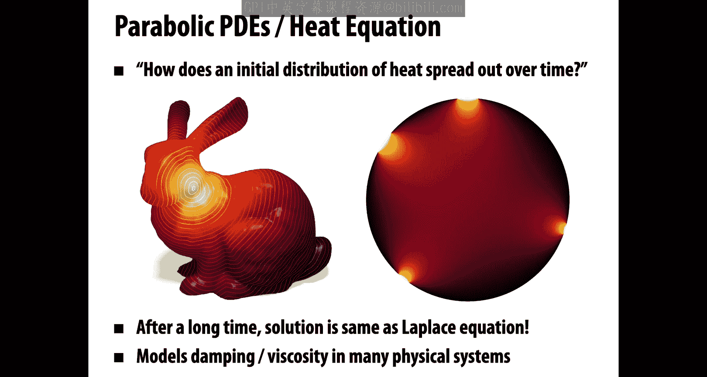

Okay。And finally， we have the wave equation。Which is this idea of okay。

 if I throw a rock into a pond or I'm standing at my swimming pool and I just touch it very gently on the surface。

 how does the wave evolve over time？Okay， and why might this equation be a little bit harder to solve？

Well， one thing you notice， even from looking at this this movie of a real swimming pool。

 is that little bumps in the surface。Kind of get carried along the way for a long， long time。

And so what that means is if you make any kind of numerical error when you're solving the wave equation。

 those errors also will be propagated in kind of a nasty way forward through time。Okay。

 so that's kind of one intuitive reason why wave like equations might be a bit harder to solve。

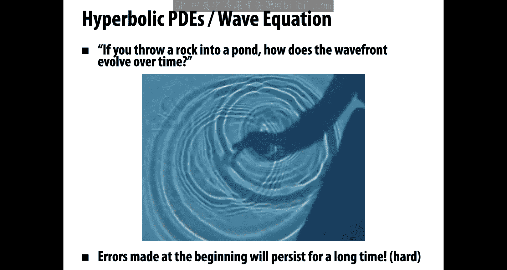

Okay。So again， we said a couple times that PDEs really only give me an implicit description of the solution they tell me。

What are some properties that the solution has to obey？

But if we actually want to draw this on the screen， we want to make make movies。

We need to compute the function explicitly， so how do we do that？

So like ordinary differential equations， most PDs are impossible to solve analytically。

Remember with ODEs， we had this example of， okay， the pendulum， you know。

 it's not so bad that you go to the double pendulum and now things get totally crazy。

And especially if you want to incorporate data， you have user interaction。

 you have models or scans or whatever it is。You're not going to be able to write down an answer on pen and paper。

 you need to do this numerically。Okay。So the basic strategy is going to be， well。

 we pick a time discretization when we talked about ODEs。

 we talked about forward oiler versus backward oiler and so on， that's going to be exactly the same。

And we also need to pick a spatial discretization， how are we going to turn those derivatives with respect to x into numerical quantities that we can really compute？

Okay， once we've made those choices， well， there's not much left to do as with ODEs。

 we're going to perform some time stepping to advance the solution。And historically。

 because you know you need to do this on a really big high resolution grid for many， many time steps。

 this has been really expensive， so it was a long time before PDE started to get used in the movies。

 maybe late 90s， early 2000s， and even then people were only using them for real hero shots。

 really important moments in the movie， like there's a wave crashing into this boat and Poseidon。

Right， but computers are。Ever faster people keep coming up with clever ways to make them faster and faster and faster。

 And so what we're seeing is more and more use of PDEs in animation and games and interactive tools。

 and well anywhere that graphics is used。 So here is just。

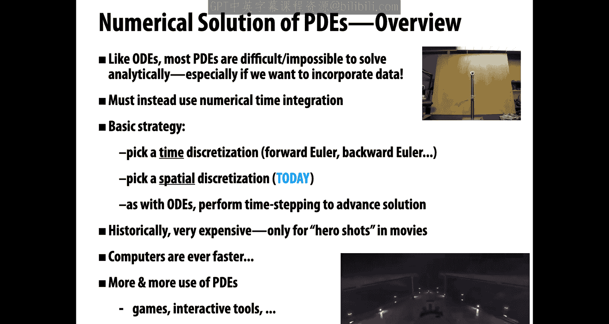

Recent example of real time simulation of some complicated PDE here for simulating fire right so we've come a long。

 long way from just having that one hero shot in a movie， maybe not quite the same fidelity。

 but actually pretty good。Here's another example of fluid simulation， water simulation。

Being done on the GPU。Again， not perfectly realistic。

 but pretty amazing to be able to do this kind of stuff in real time and this is already pretty old。

 I mean things have gotten even better since then。Okay， so。

There are a lot of different ways that we could discretize our spatial derivatives。

 a lot to talk about there， one basic distinguishing feature of how we're going to break up space is to talk about Lagrangian versus earian discretization。

So good example is suppose we want to encode the motion of a fluid right like we just saw on the previous slide。

The Lagrian description。The Lagrangian view of the world is that I have particles。

Maybe I can imagine they're almost like little water particles and I'm going to track their location in space over time I'm going to follow them along and see where they go。

Okay。A kind of dual viewpoint is an erian discretization where I'm actually going to stand in one spot。

 I'm just going to stay still for all time。And I'm going to look and see how things pass me by。

How many of these particles are passing me per unit time， something like that？Okay。

 and with these two very different perspectives come different computational trade offs。

So for a Larangian discretization， well for one thing this is conceptually easy right if you're comfortable with polygon soup or maybe better yet point clouds。

 this is very familiar， you have points， they have ordinary coordinates X。

 Yz and you track how these coordinates change over time。

The resolution of the simulation isn't fixed a priori by some choice of grid size。

 You're also not forced to stay inside the bounds of some grid。 So that's nice。 On the other hand。

 getting a good distribution of particles that resolves all the features that you care about can be really tough。

 Where should you put particles when。 And if you want to。

Do some kind of spatial derivative you might need to find your neighbors。

 finding your neighbors can be expensive right so there's some good things and there's some bad things likewise with earian discretizations on one hand from a computational point of view。

 you get very fast regular computation we talked a lot about why are images on regular grids because you know you always have a left right。

 bottom and top neighbor well same thing here， this can be very cache friendlyrily and so forth。

It's easy to represent， for instance， nice smooth surfaces using things like level sets。

 we talked about that when we talked about implicit representations of geometry， on the other hand。

 your simulation is kind of trapped inside the bounds of this grid。

And also the grid itself will cause some numerical artifacts。

 so the fact that you have finite resolution means that high frequency features are going to get blurred out a little bit。

 you have aliasing right。I think also grids are a little more challenging when you first get started because you need to understand maybe a little bit more about PDEs to start making some interesting dynamical simulation。

 but you will understand some of that that's the point of what we want to talk about today。

And of course， as with all things in life， it's not a decision between you know one or the other。

 you can mix these things together and many modern methods do mix together laggrangian and earian descriptions so for instance for fluids。

 you have things like flip and material point methods you have particle level sets。

 you have mesh-based surface tracking， voroid based arbitrary laggrangian earian and so on and so on and so as with everything else that we've learned about in this class。

 the goal is to really pick the right tool for the job。

to learn about these things as deeply as you can and make the best judgment about which kind of discredtization。

 which kind of algorithm is appropriate for the problem at hand。Another choice you can make。

 we won't get too deep into this is you can make a lot of important choices about how to formulate the PDE in the first place。

So many different。Partial differential equations have other mathematically equivalent or near equivalent partial differential equations。

And so you don't even really need to assume that the equation you're given is the one that you have to solve。

 you're allowed to apply transformations to that equation to get something that's computationally easier or better in your setting So again。

 taking this example of fluids，There are a couple different quantities you can consider。

 one is the velocity， very intuitive， how fast is each particle moving？

Another is the vorticity may be less familiar。 how fast is the fluid spinning at each point。

 so what is the curl of the velocity？Okay， mathematically these are not super different。

 computationally it can make a huge difference， you can for instance get much better maybe swirling smoke with vorticity than a velocity formulation okay。

 so again， try to understand these different tradeoffs so you can pick the right tool for the job。

Okay， but we are getting way ahead of ourselves here。

 what we'd like to know first is how do we solve easy PDdeEs， what is the basic strategy？So。

The strategy is well okay first we have to decide what our PDE formulation is。

Which quantity do we want to solve for， for instance， velocity or vorticity？

Then we might pick a spatial discretization， how are we going to approximate derivatives in space？

And then we're going to pick a time discretization。

 how do we approximate derivatives in time so for instance。

 when we talked about ordinary differential equations。

 we had to choose when do we evaluate forces leading to forward oiler or backward oiler or whatever。

Okay。Finally， all of those choices give us an update rule they tell us。

What is the relationship between the data that we have and the unknown data at the next moment in time？

And so we can repeatedly solve this update ruler update equation to generate our animation。Okay。

So let's dig in a little bit to these basic equations we saw before。

And all of our model equations featured the Laplace operator。

Laplace operator is pretty fundamental in physics and in geometry and in image processing and in graphics in general。

There are different symbols can be a bit confusing。

 different symbols that people use to denote the Laloians， some people like me like to use capital。

Delta。Okay， but some people don't like that because they use deelta to mean a finite change。

 other people like to use Nabla squared。But other people don't like to use that because that can be used for the hessian and optimization。

 so there's really no good choice， just pick one that you like and stick with it。

More important than how we write the Lalosian is what it means。

 the Laplian is unbelievably important in physics and geometry and signal processing。

And it has many different interpretations。Okay， and the more you understand these different perspectives。

 the different interpretations， the more power you'll have to understand and solve these equations。

So maybe the most basic thing to say about the Lalaian is it's a differential operator。

Meaning it takes a function as input and it spits out its second derivative。

 some kind of second derivative as output。Okay， so in particular。

 let's consider a function u from Rn to R。How can we write down the Lalosian。

 well one way is we can say the Lalosian of U is the divergence of the gradient of U？

Okay so we first look at the vector field that tells us what's the direction of steepest increase of U。

Okay， that vector field has a curl， we take that curl and get thelaion。Another one。

 maybe the most basic one is it's the sum of second derivatives and so I have。

 let's say coordinates x1 through xN， I'm going to take the derivatives second derivatives along all those coordinates and add them up。

One thing I don't like about this expression is。From this expression。

 it's not clear that your choice of coordinates doesn't matter。

If I had a different set of coordinates y1 through Yn。

 actually little plotian would be unchanged and that's important Lo plotian is not going to depend on a choice of coordinates。

More intuitively， the plot of a function U is really telling us what is the deviation of U from the average value in a neighborhood？

Okay， and that we kind of started getting at with our our wave equation。

 how fast is this wave going to start moving， well if there's some kind of perturbation if if somebody threw a rock in the pond。

Then there's a big difference between the height of the water where the rock landed and the height around that rock。

 and's okay。It's going to start moving there。 The Laloian is big。In places where the pond is flat。

 every value is equal to the。Average value in a neighborhood and nothing needs to happen right the little plotion is zero。

 no motion。Okay。So if you want to get a lot more intuition about the LaPaian， in fact。

 I have a whole video lecture about that that you can get at this link。Okay。

 so how do we discretize a applaian right to solve any PDE。

 we need to approximate our spatial derivatives with some finite thing that we can actually compute。

So let's start。Easy with the first derivative rather than the Lalosian。

 So let's say we know a function U of x only at regular intervals H right So this blue curve is the the true function U。

 but we only know the value of U at x1， x 2 and x 3 and so forth。 and those。

Points are separated by distance H。So。How can we approximate？The first derivative of you。

Let's say we wanted to know。The first derivative at x2。

 how could we approximate that using the data that we have？Well。

What we can do is just remember what is the definition of the derivative。

 we can recall that it is expressed in terms of a limit。

 right the derivative of U at x is the limit as epsilon goes to zero of f of x plus epsilon minus f of x over epsilon rise overrun。

 if you like。Okay。So we can approximate the derivative using values that we know。 we can say。

 all right， I want to know the derivative at X I。 I know the value at Xi。

 and I don't know a value infinitesimally close， but I can at least just look at my closest neighbor。

 U I plus1。Take a difference， divide by H， the spacing the distance between these samples。

And as you might imagine， this approximation will get better and better and better。

As the grid gets finer。Okay。What about the second derivative？

approximateroximate the first derivative， surely we should be able to do the second derivative。

What do you think？Well， one idea is to say， hey， we。Know how to take a first derivative。

 we know how to approximate a first derivative。So why don't we approximate the first derivative？

Of our approximate first derivative。We still have sample values at every grid point so we can apply the same approximation again。

So we might say the second derivative at X I is approximately equal to， well。

 the difference between the。Derivative at UI and Ui minus-1。

I've shifted things slightly so that we end up with a nice expression， okay？

And if I then approximate each of those terms in the numerator by my。Differences。

Then I get UI plus1 minus Ui over H。Minus Ui minus Ui minus1 over H， all over H。Okay。

 and if I simplify that a little bit。I get an approximation that says the second derivative at Xi is roughly。

Well， the sum of the values to my left and to my right minus twice my value。Divided by H squared。

By the way， this starts to sound a little bit like what we said about the Laloian。

 we're comparing kind of the values in a neighborhood to the values at the center。right。Okay。

 but in general， this approach of approximating derivatives with differences is called the finite difference approach to PDEs。

This is not the only way to do it， there are finite element methods or finite volume methods。

 there are a lot of interesting ways to approach PDEs。

 but finite differences are very natural and work very well for regular grids。Okay。

So if we keep going with this finite difference idea， okay， how do we approximate the laplasian？Well。

We have a choice。 We could use a grid。 We could use a mesh。 We could be oarian。

 We could use something Laangian。But there are some very common ways to discretize the Lalaian in graphics。

 one is to stick with this finite difference idea， so we're now on a twodimensal grid and if you work through the arithmetic。

 you think about Taylor series and so forth， you say yeah。

 a good approximation of laplian is I add up my four immediate neighbors。

 I subtract four times myself， and I divide by the square of the spacing， the grid spacing。

If on the other hand， I'm on a， let's say on a triangle mesh， well I need to do something else right。

 if I'm on a triangle mesh， especially if the triangle isn't all equilateral triangles。

 but let's say there could be any kind of triangles， any angles。

Well here there's a well known formula for the Lalosian called the cotan formula。

 so it says if I want to know the Lalosian of a function u at the vertex I。

 then I'm going to sum up over all neighbors J the difference between UJ and UI。

Times a special weight， a weight that depends on the two angles， alpha and beta。

 so cotan alpha Ij plus cotan beta Ij， and there's all sorts of ways to derive this expression。

 interestingly enough if we have a very， very special triangle mesh。

 which is a regular grid split along diagonals，This formula will become exactly our grid formula。

 Okay so all of these things do kind of fit together。

 It's also not too hard to cook up Laloians for point clouds and polygon meshes and other kinds of representations of geometry that we talked about earlier in the class。

All right。So now that we know how to discretize space。

How do we go ahead and solve some of these model equations， so let's say again。

 we want to solve the Laplace equation， Laplaceci equals0。

When we could plug in one of our discretizations， let's say we liked doing things on a grid。Okay。

 so we know now that the Lalosian can be approximated by this finite difference formula。

 we just set that finite difference to zero at every grid cell。

Or equivalently what we're really saying if you rearrange this equation， what you realize is， oh。

 what we're looking for actually。Is a function U？Where the value of U at every grid cell is equal to the average of the four neighbors。

That's what I keep saying， Laloian is measuring the deviation from the neighboring values。

 so if we say Laplaceia equals0， I want my value to be equal to the average of my neighbors。

If I have a function U。Where every value is equal to the average of the neighbors。

 that's called a harmonic function， a function that is in the kernel of the Laplian is a harmonic function。

How do we solve this？What would you do if somebody said， okay。

 I want this to be true at every point in space， I want every value to be equal to the average of the neighbors。

 what might you try to get this to be true？Well， there's a natural thing that's pretty tempting to try。

And actually it works so you could just keep averaging your value with the value of your neighbors。

go to every grid cell and replace that value with the average of the neighbors。

If you do that enough time， enough times it will converge to a harmonic function。

 this is called the Jacobbe method， Jacob iterations。This is correct， but it's really， really slow。

 it's going to take forever， especially on a really big grid to converge to a solution and you can kind of understand why if I have a grid that's a million cells wide。

Well， then I need to do at least a million averaging operations。2。Get this to work right。

 information has to have time to go from one side of the domain to the other。Otherwise。

 how could every grid cell know that it's the average of its neighbors？So。There's much。

 much better ways to solve big systems of linear equations。And。

What we want to do generally is turn a PDE like this。

 turn a system of equations into some matrix equation that we can hand off to a linear solver。So how。

 for instance， would we do that with a Laplace equation， well， again。

 we have a bunch of equations that look like this。And four times Ui J minus Ui minus1， bh blah blah。

So to get this in a matrix form， the first thing we need to do is assign a unique index to each of our grid cells。

 so maybe I'll just label them top to bottom left to right，1，2，3，4，5，6，7，89。Okay。

And then we can substitute instead of UIj， and now we'll just talk about you with a single index referring to these indexed grid cells。

And we can write out all these linear equations as a big matrix equation。

And if you read off one of the rows of this equation， you'll see， oh yeah。

 that looks like what we want to be true at that grid point。Okay。

 you get this big matrix with a very regular structure at fours minus fours along the diagonal and so forth。

From here you can just hand this problem off to some existing package。

 some sparse linear solver like well these days there's something called sweet Sprse or iigen or whatever you like but the point is that these packages have been optimized like crazy to solve systems that look just like this so you'd be crazy not to use them you should not try to do Jacobbi iterations but really try to use a real a linear solver it's also very important by the way for an equation like this that you use sparse matrices we talked about those when representing geometry so we hear you notice that most of the entries of this matrix are zero so you're going to waste a ton of time and compute power storing and computing with all those zeros asymptotically worse。

By the way， some important food for thought， what is wrong with our problem set up here？right so。

Claim that we correctly converted the Laplace operator into a finite difference expression。

 we correctly encoded that as a matrix， but there's still something wrong。

With this problem we've set up， can you， can you see what that is。Well。

 one really basic thing you can notice is that on the right hand side， we have a bunch of zeros。

And now we're looking for values U。Such that when we apply the Laplace matrix to you， we get zero。

There's a trivial solution to that problem， which is， why don't we just set all the U values to zero？

Right， so what I'm really saying is that this equation that we've set up so far。

Doesn't have an interesting solution。And actually， it doesn't even have a unique solution。

 I could also put a constant value for all the U's and also get zero。Okay and。So， the reason。

has to do not with our matrix setup， but with the equation that we set up to solve and we kind of said that。

 well what's the idea of a Laplace equation， a Laplace equation is supposed to take boundary data。

 values on the boundary and interpolate it into the interior。So far。

 when we talked about the Laplace equation， we said， okay， you take your left neighbor。

 right neighbor， top neighbor， bottom neighbor， and you want it equal。

The average of those values and to get this matrix to work out， we okay。

 we said we wrap around if we go off the left side of the grid or the right side of the grid， okay。

 but to get some interesting behavior， we need to actually say what the boundary values are。

We need to think about how do we compute averages near the boundary？

So let's say we're the boundary point A。And when we look to the left to grab our neighboring value。

 what do we do there？Okay， so our average is sort of one， fourth B plus C plus， I don't know plus E。

And the answer to what to put there is， well， you get to choose。

 you get to choose what data to put along the boundary。

 this is exactly the data that you want to interpolate。So these could be height values。

 they could be color values， whatever you like。In general， there are， well。

 there are lots of different boundary conditions you might encounter in PDEs。

 but there are two very basic ones that show up over and over again。

One are what are called deerschlet boundary conditions。

And that just means we want to set these boundary values to fixed values。

I want to replace the question mark with some known constant。

The other very common boundary condition is a noummon boundary condition。

That says rather than the value， we want to specify the derivative。

 the change in value as we go from A to this question mark node。Okay。

You can from there formulate all sorts of other interesting boundary conditions。

 maybe like robin boundary conditions or you have a linear combination of values and derivatives and so on。

 but these will really get us started。Now， one really basic question that you need to ask。

When you start prescribing boundary data is。Can I do this？

Am I allowed to prescribe this boundary data if I fix the values and the derivatives at the boundary to certain constants？

Will this system of equations actually have a solution？

It's really easy to fool yourself when you first start working with PDEs。To say， okay。

 I'm just going to put this data here， I'm going to hit solve and I'll get my solution。

And often the problem is your solver is not smart enough to tell you hey， wake up。

 this is not a real problem， this is not a well posed problem， right you can't actually solve this。

 so it's really important that you understand what you can and can't do when it comes to boundary conditions。

Okay， so let's look at this in a little bit more detail in just one dimension。

 we're just going to go back to functions on the real line。

And for the moment we won't even think about a PDE right。

 we just want to look at what do these different boundary conditions mean Okay。

 so we said Deers Schchle means we want to prescribe the values。So for instance。

 if we have a function fee on the unit interval from zero to1。Our boundary points are 0 and 1。

And we might prescribe constants A and B at those boundary points。Okay， we can ask。

Are there functions that interpolate those boundary values？Well， sure there are tons of them。

 I just put my pen down at A and I draw any curve over to B right there are lots and lots of possible functions in between those two points。

Okay。What about Neymon conditions， Neymon meant we want to prescribe the derivatives rather than the values。

 so for instance， we might say at zero。The derivative of v is equal to u at 1。

 the derivative of phi is equal to v。Okay。Are there functions that have prescribed derivatives。

 does that restrict？Kind of what these things can look like， well， just a little bit， but yeah。

 there's still a lot of functions that have these derivatives。Again， I just put down my pen。

 I start going along the initial slope。And I need to just make sure that when I exit。

 when I get to the right side of the domain， I have the desired outgoing slope。Otherwise， many。

 many possible functions in between。What about both。Nyman and Deerschleade values right。

 Does it make sense to think about prescribing some values and some derivatives like I want to prescribe the slope at zero and the value at one。

Sure， nothing wrong with that I could think of a lot of different functions that start out with a certain slope and end up at a given point。

Could I prescribe the derivative and the value at the same point？

Could I say the derivative of p at 1 is v and the value of p at1 is B？Sure， why not。For instance。

 I could take any function that satisfies the derivative condition and I could shift it up and down until it satisfies the value condition？

What about other interesting things so we could also maybe ask about。

 you know setting the value plus the derivative is equal to some constant？

And that's what's called Robbin conditions and you can convince yourself， yeah。

 that's that's also something that's。Not too hard to satisfy as long as we have no other conditions。

 right again， it's pretty easy to draw this kind of curve。Okay。

 so what you kind of see is that in the absence of any PDE to solve。

 satisfying boundary conditions is no big deal。Where this gets interesting is when we actually have some equation that we want to satisfy at every point of the interior。

So in particular， let's look at a very simple PDE， the 1D Laplace equation。In one dimension。

 the Laplace operator is just the second derivative of the function。

And so this Laplace equation says the second derivative is equal to0。Okay。

What do solutions to this equation look like？If I I had asked you on the first day of class。

What's a function that has no second derivative？What would you， what would you think。

 what would you write down？Well， basically all functions kind of have to look like this。Cx plus D。

 something that is linear in x。Okay。Can such a function can a solution to the 1D laplace equation satisfy any given deerschlet boundary conditions？

So let's say I tell you that at the left endpoint， I want the function to be equal to a。

At the right end point， I want it to be equal to B。Can we always find a function fee。

That hits these points and solves the Laplace equation。Well， sure， we said that。

These solutions look like。Straight lines， so we have two values to interpolate。

 we draw a straight line through them， we're done right a line can interpolate any two points。Okay。

So so far it sounds good， we can put whatever data we want in and we get a solution to our PDE。

What about Neimon boundary conditions？Can we prescribe the derivative at both endpoints and satisfy the Laplace equation？

So let's say。I want phi prime of0 to be equal to U。Phi prime of 1 to be equal to v。

 and I want the second derivative to be zero along the whole interval。Well。

 one thing to think about is okay if the。Incoming derivative is different from the outgoing derivative。

And the second derivative is zero。Then I'm in trouble because a second derivative is telling me how much does the derivative change？

And if the derivative can't change， then I can't go from one derivative at the start to another derivative at the end。

Put that more simply， a line only has one slope， I can't have a slope of U and V。Right。

And so this is our first example of a PDE。That does not have a solution for all boundary conditions。

 I can't just throw whatever data I want at it and hope that things work out。Okay。

So this gets even more interesting if we go up a dimension。And we talk about。

Two dimensional problems。 so let's talk again about the Laplace equation。

 but now we're in two dimensions and we have deerschlet boundary conditions。

So we want to function phi on some， let's say， region of the plane。

We want the Lalosian of that function to be。Equal to 0。And we want to know。

Can I satisfy any given Deerschlet boundary conditions？So for instance， maybe I'm on a circular disc。

And I've prescribed some。Temperature values on the boundary。

 and now I want to interpolate those temperature values onto the interior。

Can I always find a function phi that's harmonic， so Laplacepher equals0 and has the given boundary data？

Okay， well， I claim that the answer is yes。Okay， so here， for instance， I've put some。Hot values。

 some cold values， and interpolated them to the interior。

Why do I claim that this will always work out。Well。

 because I can think of this solution as the solution to a long term heat flow。

 I can really think of this as a physical metal plate with heat on the boundary。

And if I just let this heat flow for a long enough time， I'll reach a steady state。

 and that's the solution to my Laplace equation。Okay， not a rigorous proof。

 but at least some intuition for why it's true。I can always find a solution to the Laplace equation that interpolates given。

Deer Schlelate boundary data。Because this function is just the steady state of a very natural physical process。

What about Neummon boundary conditions？So we again， want a。

Harmonic function of function satisfying Laplace phi equals0。

But now we're going to prescribe the derivative in the normal direction。

So if we're standing at a boundary point and n is the unit normal。Then。

We want to prescribe the value of n dot grad fee。 how much is the function changing as we move in the normal direction？

Can this always be done。Is it always possible to prescribe whatever derivatives we want？

And find a corresponding harmonic function。Now remember， this was not possible in1D。

Doesn't mean for sure it's not possible or is possible in 2D， but okay， it wasn't possible in 1D。

So how can we start thinking about this this question， Well。

 one thing you may remember from vector calculus is the divergence theorem。

So the idea of that divergence theorem is， okay， I have some vector field on a domain like these black arrows on the right。

And I can measure two things， I can measure the total flux through the boundary。

So if I go to a boundary point， I see how much that vector field is sticking out of or sticking into the domain。

I'm going I take the normal dot， the vector， and I integrate that up over the boundary。

That's telling me know kind of what's coming in or going out。

And the other thing I can measure is the total divergence。

So I go to every point on the interior of the domain and I measure how much is the vector field spreading out or converging in？

Okay and the divergence theorem says these two quantities are equal。

The amount of stuff that I'm pumping into the domain or sucking out of the domain is equal to the total flux into or out of the boundary。

So more precisely， it says that if I integrate over the boundary， the normal dot the vector field。

Then that's equal to integrating over the interior， the divergence of the vector field。

And we can use this to understand the situation with our Noiman boundary conditions。

Because we can notice， okay？The normal derivatives on the boundary N dot grad feehi if we integrate those over the boundary。

Well by the divergence theorem， that's the same as integrating over the whole domain。

 the divergence of the gradient of our function fee。

ABut the divergence of the gradient is the Lalosian。And in order for this function to be harmonic。

 we need the Laloian of V to be equal to zero。Okay。So。😔，What we can conclude。

Is that in order for our Neimon data to be valid。It must integrate to zero。Over the whole boundary。

capturingpturing this idea。Of the divergence serumem， kind of what goes in must come out。

There must be a total flux。In and out of zero。Because on the interior。

The divergence is zero everywhere。Okay， so our PDDE can't have a solution unless the net through the boundary is zero or if the integral of。

And do grad fee is zero over the boundary。Okay。It's important to understand this again because numerical libraries will not always tell you if there's a problem。

 you can certainly go ahead and throw whatever numbers you want into the solver。

And often these solvers will just come back and say okay， thanks for this great problem。

 here's the solution and you might go about your business using that solution to do the next step of your algorithm。

 never knowing that this solver actually failed you。Okay。

 so a really important thing to do when writing numerical code is trust， but verify。

You've made a call out to this library that somebody else wrote， it's trusted。

 it's well used and well loved。Still go ahead and verify。

 so after you solve the linear equation AX equals B， for instance。

 just go ahead and compute the residual B minus AX and see if that's equal to0。 If not。

 it may not be a problem with your solver， It may actually just be a problem with your boundary conditions。

Okay。Okay， so。That's our brief glimpse at boundary conditions。

 boundary conditions can get pretty hairy， maybe the hardest part of working with PDEs is figuring out and managing the boundary conditions。

But。In a lot of the common cases， it's not so bad。So we can come back now to。

Solving are three model equations。We've already talked a lot about the Laplace equation。

 let's not think about the heat equation， which was our basic model of parabolic equations。

So the heat equation says rather than Laplaceche equals 0。

 it says that the time derivative of u is equal to the Laplaceian of U。Okay。

 and we're in pretty good shape to solve this， we already know how to discretize the Lalaian。

We also know from our discussion of ordinary differential equations， how to do time integration。

 how to replace this time derivative with backward Oer scheme or forward Eer scheme or whatever。

So perhaps the simplest one is forward Eer。 we say， okay， if we know the solution at time step K。

 we have UK， how do we get the solution at time K plus one， Well， we just take UK and we add。

Laplace of UK to it， or maybe some small time step times Laplace of UK。Okay， so on our grid。

 what does this update look like？Well， the new value of U at any grid point Ij at time K plus 1 is equal to the old value UK IJ at the previous time plus the time step ta divided by h squared times all this stuff that represents our Laplaceian。

Okay and this is really not hard to implement me if you look at this formula。

 you realize okay I could do that right， I have a grid of values， I go to each one。

 I plug in this little formula and I iterate and this is going to give a solution to the heat equation。

 this is going to let us watch the heat diffuse from the boundary to the interior of the domain。

How about the wave equation？This was our final example， in fact。

 that we already wrote a little bit of code for it at the beginning of the lecture。Not。

Superficially so different from the heat equation。So now instead of saying the first time derivative is equal to the Laloian of U。

 we're saying the second time derivative is equal to the Laloian of U。Actually。

 as much as this looks like a minor change， it completely changes the character of the equation。

The way that this thing behaves。Diffusion of heat versus waves propagating a very different behavior。

How do we do this， we now have a second derivative in time。

And we actually know already two different techniques for dealing with a second derivative。

The first one we learned about in our lecture on ordinary differential equations， we can split up。

An equation that's second order in time into two first order equations。

So we can say the time derivative of u is equal to some new function v and the time derivative of v is equal to the Laplaceian of u。

Okay。And from there， we can just go ahead。And solve these equations as we normally would。

The other possibility is to use a。Second order finite difference in time。

When we went to discretize the Laplaceian， we said we can get a second derivative by taking the first derivative of the first derivative and get a formula like this one。

So if we knew。Not just one previous step， but if we know two previous steps。

Then we can just plug in the formula for this centered difference。And solve for U plus one。

 move the rest of that stuff to the right hand side。Nowao。

One interesting thing to think about here is in either case。We need some initial data。

In the first case， we need to know what is the velocity at the beginning of time。

 how quickly is the wave moving？At the start of our animation。

And the second one we need to know two consecutive steps。Of the wave equation。

 so what was the displacement from time zero to time1？Okay。All right。

The only other thing we have to do to make this a real numerical integrator is discretizal applaian。

But we have all sorts of knowledge about that now and in fact there's lots and lots of other ways to discretize space and time that we didn't discuss。

 but this will get us a pretty good wave equation solver so here's an example of what that looks like the one on the left is the one we coded up at the beginning of the lecture。

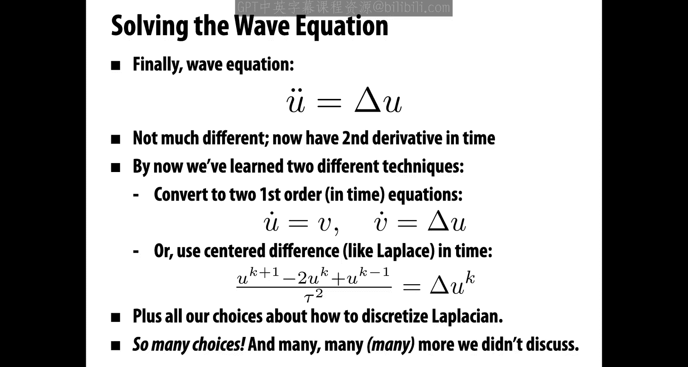

On a grid， the one on the right is running on a triangle mesh using this cotangent laplosian。

Apart from swapping out different expressions for the Laplaceian。

 these two pieces of code are exactly the same， the same time integrator and so forth。Right。

 so it's pretty cool that these。General principles of PDEs can be easily ported to different geometric representations。

And actually， this is a very powerful way to develop algorithms if you can formulate your。

Graphics algorithms， your simulation algorithms， your geometry processing algorithms。

 your image processing algorithms in terms of PDEs， rather than in terms of discrete data。

Then it becomes kind of easy to port those algorithms to different contexts without much effort。

If you start out by always thinking of things as a graph or a grid， well。

 then it might not be as clear how to translate an algorithm from one domain to another。

Okay and you can imagine from here you can build this kind of behavior into all sorts of fun and interesting graphics applications。

 so here's just a fun interactive demo that solves a wavelike equation。

 in fact this is not just solving the you know linear wave equation。

 but it's doing some other interesting stuff it's doing a low Res thinin shell simulation using a technique called position based dynamics and then up sampling that low Res simulation using something you already know about loop subdivision。

 so that lets this run in real time。

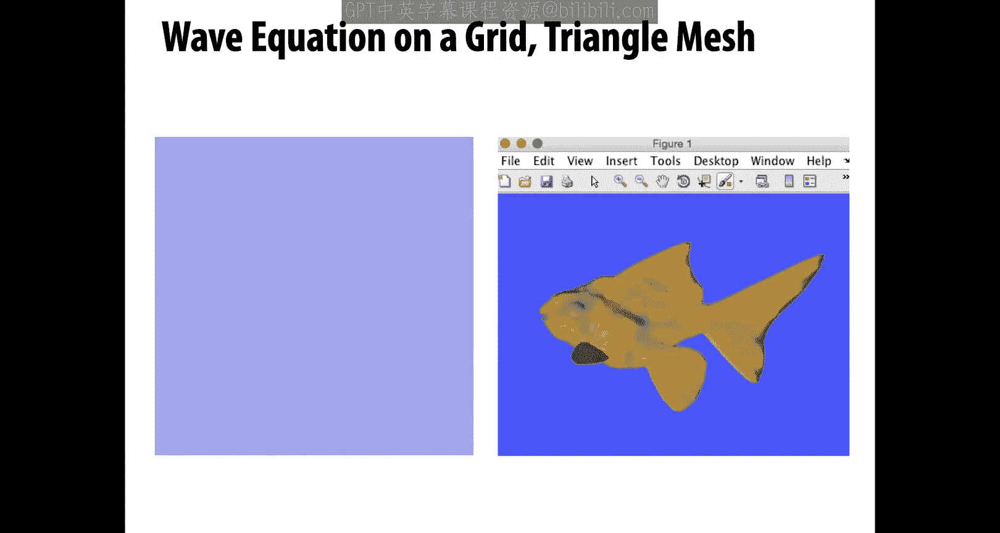

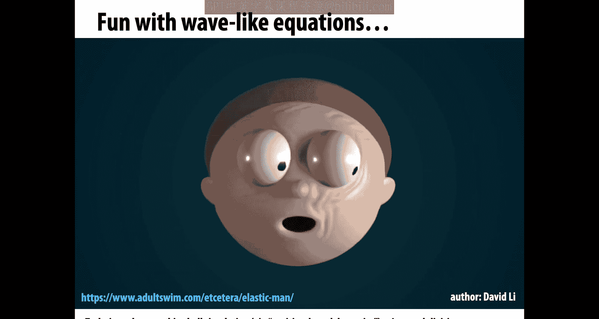

Okay。So。That's great， but what about all that other cool stuff we saw。

 we saw these beautiful movies of fluids and hair and cloth and so on。How do you do that？Well。

 the good news is there are some really good books about physically based animation。

 there's lots of good papers and blogs that talk about this。

 and it's also worth considering you know if you think， this is really cool。

 I want to make stuff that looks like this， I want to invent new techniques。You should think about。

 well， what did the people who invented these techniques read。

 how did they figure out how to do all this cool stuff？

Very likely they didn't start out by reading graphics papers。

 they've started out by going and digging deep into the literature from computational physics and applied mathematics and geometry and so forth。

 so if you really want to do cool new stuff， I'd encourage you to dig deep and learn about these subjects which aren't beautiful and satisfying all on their own。

Okay。So that's it for PDEs and physically based animation， see you next time。

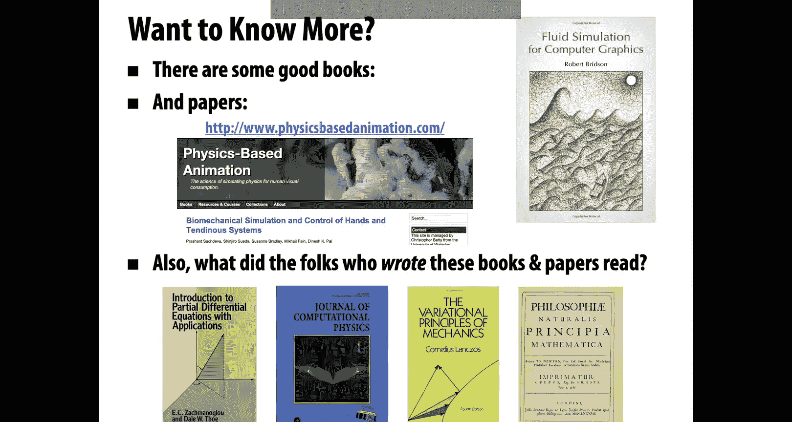