# CMU《计算机网络基础｜CMU 14-740 Fundamentals of Computer Networks 2020》中英字幕（deepseek p06 -P06-2020_09_17_Lecture06.zh_en -BV13J6uYpEZm_p6-

All right， thanks， Kdick。All right。Homework one will be posted hopefully today it is a。

An opportunity for you to use some different networking tools， things like Traro。

 which we've already talked about and Dig， which uses DNS that we're talking about today and a few other tools。

 mostly to give you a chance to see how to explore the network and what you can do with them。Also。

 these are the kind of tools that。Any network engineer should use and understand pretty well and certainly if you were。

You knowIf you were in a network job or interviewing for a network job。

 these are the sorts of things that you would be expected to already know and to be able to use。

 but they're also just kind of useful diagnostic tools to figure out you know。

 did I manage to get the coffee shop wfi working， yes。

Once when someday we are allowed back into coffee shops to use their wfi。

Just be able to check out what's going on and things like that。

 There are a couple of questions at the end that are also。More homeworky sorts of workout。

Do some calculation sorts of questions as well。I always have students who look at this and realize。

 oh， I don't know how to answer， you know， especially I think the last question。And that's right。

 you won't know because we're going to talk about that later thats so if you look at something that doesn't make any sense for you。

 just be patient， you can do the other problems， we'll get to all that material。Okay。

 I point out now a because I'm going to post it today， but also。

There is a period coming where we have a lot going on where we have a lab do and a quiz do and a you know all sorts of stuff。

 so take a look at the schedule and manage your time well。

Last time we were talking sorry a question about that， given all those things。

You do have a sense of like how long each should be taking in the rough neighborhood so I get a sense of how to prioritize。

 how to make sure we stay on top of everything。Sure。是的。The homework is a。About the size of the labs。

 it is an endeavor that it's not something you can pencil whip out in 15 minutes。

 but it's also not something that should be sucking up。You know， more than。

I don't know want to say two hours， maybe two， three hours sorts of time。Okay， thanks。

 I mean that sounds like true you said the same thing about lab zero is that also true of lab one？

Yes， it is。 Okay' all none of them should be multi day efforts。 That's for sure。 Thank you。

 That's good context。 Yeah， yeah。All right here we are we're in the application layer we have understood that the application layer's mission is to allow us to get to the network and run a program that will use the network resources and we talked about HTTP last time that's an interesting one because that normally in each of the layers you're just kind of abstracting what's going on below you。

 you know that the here I am in the application layer I have some data that I need to get from the program running on my computer to the program running on that computer over there and the transport layer will do that for me that's going to be its mission is to connect applications together。

And you would think， okay， that's good， I'll just give it to the transport layer and let it go and a lot of times that's true。

But as we saw last time， having some knowledge about what's going on in the layer below you can help you when you try to optimize。

So the transport layer without optimization will get your data from your application to that application over there。

😡，But if you understand it a little bit better you can make it go better and do better for you and that was for instance。

 the whole thing with the pipelining and the persistence connections and things like that。

 if we understand what's going on at the transport layer。

 we know that it's better to keep these persistent connections open and be able to reuse them。

Today we're going to talk about another application protocol， one that。

Is part of the glue that lets the applications actually operate well。

So we'll talk about what's going on with that， this is the domain name system which is as you read in Maccapitrus there's a lot going on with it and hopefully this one tends to be a long lecture。

 hopefully we'll get to content distribution networks today as well and see how we can actually help distribute our data around。

DNS is the first of an example of an address conversion protocol we're going to see another one of these coming up later on in the semester。

And what I mean by that is let's recognize that each of the layers and technically the protocols running in each of the layers has its own form of addresses。

 and so here are some of them， URLs， which we talked about last time for HtTP domain names which we'll talk about a lot today。

 courts are a transport layer addressing mechanism， IP in the network layer has some IP addresses。

 Ethernet Mac and Wi-fi Mac， our example of data link layer addresses， their addresses everywhere。

And the addresses are designed， how you work with them。

 what the bits are and what the bits mean in an address。That's designed to work with that protocol。😡。

So the people who are putting together Ethernet， for instance。

 have reasons for why the address works the way it does。

 how many bits it is and you know if there are some of the bits actually are tell you what company is made that adapter and things like that those are design decisions that are made。

When that protocol is being put together。There's no sense of a universal address here and so that means oftentimes we're going to need a way to translate to be able to take an address from one layer and when our data travels down to the next layer we have to somehow do some conversion on that and that's what's going to happen with DNS today so can you clarify what you meant about a universal address or lack of one。

Yeah， there's no。So I guess the cross side of that is we have many addresses right。

 we don't have a single address that does everything for everything。

And part of that is because each layer is addressing different things。At the transport layer。

 it's going to need to address applications whereas。

IP is going to have to address computers and so there's no one number that would say， oh。

 this is you know the identifier for an application running on that computer you know whatever。

Got it， yeah， so what you so in other words， that each layer has its own address because they are addressing different things and and because they were still designed independently。

 yeah yeah。Yeah。Also， there's another thing in the application layer， it's helpful。

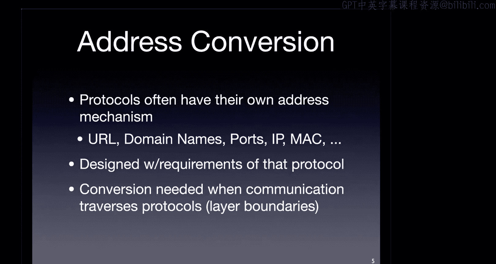

That our addresses。Be usable by humans。So here's a fun cartoon Foxtrot。

 we've got the two nerd kids in it who are sitting around。You know talking。

 so have you checked out the site at 204。167。480。4 yet？

You know that's an IP address he's using and so he's kind of playing a round of layers here as well that we should recognize。

And when it comes to the punchline， it's over here， it's basically saying， text URLs are for wimps。

We want to use numbers instead and that of course is not true for normal for humans and in fact we would have trouble using IP addresses alone for a variety of reasons that we will learn as we become better network engineers right also I do think it's cool that obviously the cartoonist。

Understood how IP addresses are put together because none of these are actually valid。

 you didn't want to like be specifying a particular address that would then get somebody in trouble。

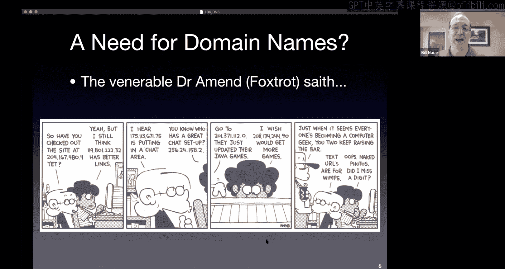

So if we are using these addresseses as humans。We often call them names in that case。

 we say this name for the thing is something that humans can easily use and that name identifies some entity that we are talking about。

 oftentimes， for instance people also have names names。Are human readable。

 they're things that I mean we can read you know in that last cartoon we could read the numbers what I mean is they are values that are part of the human language that we can easily interpret and understand。

Sometimes the formatting is important， so for instance we can put together name and when we do we often say you this is the title。

 you know Professor Bill Nace that is here's the title piece of it here's the first name piece but here's the family name piece of it。

 of course in different cultures we may switch some parts of that around。

 so the formatting that how you put together that name is important as as are all kinds of identifiers。

Names though often are not unique。😡，I'm sure there are other Bill Ns in the world， in fact。

I had like six of them at family reunions because Bill was a common name in my family and so my grandfather and I have two uncles who are all named Bill。

So they're definitely not unique。Maybe unique in a certain area right oftentimes parents don't name their kids with the same first name because that would be crazy to have two kids to both have the same name。

 although I once called for service across telephone and ran into a lady who when I asked for her son Ryan got confused because she had named her other son Brian。

 and I figure if you call your kids Ryan and Brian。

 you're basically just asking for a lifetime of explaining that to strangers。

The issue though is names are easy for humans to use。

 but they're a little complicated for computers to use computers prefer just straight numbers we often call these identifiers versus names a name is a string it takes up more space and memory in order to compare it we have to do some sort of string compare mechanism and that doesn't even get into things like oh is that string comparison dealing with cases。

 is it dealing with casefolding in a unicode sense or not you know all that kind of stuff computers would just prefer here's a number that I can use。

The domain names we use we're used to www。google。com is a domain name cmu。

edu is a domain name those are names they're human readable they're strings right those need to be translated。

 those are an address at the application layer， we need to translate it into something else。

And so what we do is we have an application that will。

basically send a request to a DNS server and say， hey CMU。edduu， who is that， what this is the name。

 what's the address for CMU。edduu and that server will respond and say oh yeah， here's the address。

Yeah。I forget what it is offhand。That turns out to we think it's easy。

 we're going to talk about some of the complications that come along with this， however。

 but in our mind we can think of this protocol as being a request response protocol we saw this with HTTP as well very very common model of computation won't be the last time we see it let me ask a server a question let me get a response so you know where is this URL or I'm sorry where is this domain name。

Here's the IP address for that。So that's the kind of overview where we're going today， the DNS。

Specifically has a bunch of pieces to it。 In fact， DNS itself。Is kind of one of those。

Words that mean slightly different things depending on your context。

 and so there are at least three of them that we're going to have to juggle today whenever we say DNS。

So DNS is a service that provides this mechanism。Almost directory it's almost like you're looking up phone numbers back when we used to do that it we're giving names and getting addresses and that's the service that runs is the domain name system or sometimes called the domain name service。

Because of this， it does this translation for us。DNS can also refer to the data that is used to answer those questions。

 which turns out to be this。Very interesting， distributed database system。 It is by far the most。

Common distributed database in the world。It's。So the picture I showed you in the previous slide was just there is a server that knows the answer。

Turns out there's enough data here and it changes rapidly enough and we need to have answers from all over the place so it needs to be distributed and so there is a system of those servers which we call name servers。

 a system that works together to answer your questions。

 so there's not just a single server that has all the answers。

 it is this collection of quite a few different name servers that are distributed all around the world managed by thousands of different organizations and thousands of different people。

DNS also refers to the particular protocol we use when we make that request。

 so when we send the message where is CMu。edu to a DNS name server。

 we are using the DNS protocol to make that happen the protocol of course involves the bits in the message and how the message is put together and how it is transmitted and what's done with it。

Okay， so a couple different。Different terms that we have to kind of think about。

 they're very related terms， unlike peer peering and peering that we talked about last time。

 DNS all refers to the same thing， but different aspects of it different facets of the same thing。嗯。

Oh and yeah， there's a good question chat， domain name versus URL， what is that？

This is one where you can go down a long ratd hole where people are trying to be very specific about it。

The domain name is part of the URL that specifies the domain or the computers where you are are trying to get at something。

 but the URL itself has more than just a domain name in it it often also has you know slash something slash something else slash query slash comm you know all that other stuff there so the URL is the whole thing there are other pieces to it and so there is a。

There's a structure where some parts are called URIs， but yeah。

 the domain name is which computer are we talking about portion of it。Okay。

DNS has been around for a long time because the need for this sort of stuff is。I very useful and。

And I guess this。Ties in nicely to Jeremy's question why in the 80s did we need DNS that was before the web happened turns out the internet and the web are different things right the web is a series of web servers that run using the internet to connect things。

 but there are other services that are around where you would want to be able to identify other machines and talk to computers in different organizations and so DNS served that purpose of being able to identify computers in other organizations and other places in the internet which happened before there was the web so when the web came along and the URL scheme was being devised DNS already existed because it had been around since the early 80s and been in use with all those other protocols that to you all our ancient history things like net groups and gopher and ways and RF FTP servers and things like that。

Marcaitrus is the guy who wrote the paper， I'm sorry。

 the guy who wrote the paper that you read last night is the guy who invented DNS and he wrote。

Rorote it up in RFC 1034 and 1035， he described how RF I'm sorry。

 how the DNS system would all work and made the standards。And it's really taken off since then。

 if you look at this， the original 1034 RFC is only 53 pages long。Okay。

 and so the concept itself is fairly simple and the 1035 is the implementation RFC， so combined。

 of course there're more than 53 pages。But in the years since we've got an additional 223 other RFCs。

So there's an awful lot going on in here to make DNS work in different situations。

 a lot of these are the DNF sex stuff that is trying to make it secure so that you can't have a malicious actor step in the middle so that when you ask where is Facebook and they give you their computer instead of a Facebook server。

That would be a bad thing and so there's a lot of work in standardizing a security mechanism for TNS as well we won't talk about that today。

But just recognize that DNS is a still a growing concern。

 it's not technically a solved problem' and part of that's because it's being applied in many new fields to do new things。

DNS。I guess alluding to that right DNS does many things its core mission of course。

 is this mapping of domain name to IP address so I ask you know where is。Well， you know。

 some domain name www。ini。cuu。edu is a domain name。And I would ask。For the IP address。

 and I would be given a reply of here is the actual numbers for that machine。

Buttianist does other things too， one is it allows for a mechanism to alias the names。

Alias is another word for nickname。So nickname is a nickname， yeah。My formal name is William。

 for instance， but I much prefer the term Bill， which you can see as my alias as my nickname。

And we have the same thing with domain names you're allowed to have multiple different names for the same machine for whatever reason you like。

 maybe it's just I prefer Bill Ben William or you know。

 maybe I'll take up an alias because I don't want people to be able to find me and I'll pick a new name or something like that。

We do the same thing with computers and we call them we say that there are aliases and canonical names。

 so William is my canonical name， my real name， my official name。

 my formal name and Bill is an alias we do the same thing with the computers so it turns out。

If you are trying to get to CMU's website。The real name for that website is wwwcmuprodvip。angw。cu。

edu。that's a mouthful right， aren't you glad that we're able to just say， oh yeah。

 that's actually www。cu。edu。Okay now you can still use that。

 you can type that stuff that whole thing into a browser， and you will get CMU's website。Okay。嗯。

It's a real machine name。 In fact， that is the real machine name。

But obviously we want something shorter， we want something people remember。

 we want something that we can more easily put on marketing material to send out to future applicants and things like that。

 and so we'd like to have a shorter name now this name I'm sure has reasons。Okay。

 I'm sure that the people that are running the network you know that this is maybe this is a production machine instead of a development machine machine or maybe and VIP。

 maybe this is in their very important。Persons， they're very important pile of computers or who knows？

Okay。That's a canonical name， and that's the real thing that they chose。

And they're able to use DNS to get shorter names as well。嗯。Are canonical names unique。 Yes， yes。

 they are， in fact。I'm going to guess that the domain name is going always going to be unique。

I 95% positive with that answer。嗯。Whether it's a canonical name or an alias。That's not true， no。

 there are cases right there are cases where you have like a backup machine will have the same the same name。

As well， so not quite unique。Other stuff。In fact， the whole idea of， in fact， you read it in Macits。

 the idea of DNS was that it was supposed to be this distributed database system that would be used for not just domain names。

 but for other things as well。The other things as well mostly turned into email。

It turns out that the DNS contains the name of the computer that you should contact in an organization if you have email for anybody in that organization。

 so you can look that up separately in DNS。And that's just one of what was expected to be many， many。

 many different services so that you would have a way to look up。

you know maybe a Facebook name for your friend by doing a DNS query that turns out that's not how you do it these days。

 but DNS was designed with that sort of flexibility in mind。And we。

It turns out that mail servers also get alias and so when you send email to somebody this this email address。

Something at andrew。s。edu。The male clients that are trying to deliver that mail two mail servers who try to deliver that mail want to be able to look at this and figure out which computer do I contact and so they want to know who is Andrew。

Thats you got A you and more specifically， what is the mail server at。Atandrew。su。

edu that we can contact to deliver this mail。And again， there's some aliasing going on。

 there are many different choices。We actually have seven computers called Andrew Dash MX。

 MX stands for mail Exchange。Dash0 or one or two。A wait minute， no。

 this is six different machines at 010203 up to through 06。andw。cuu。edu。And so technically。

 you could send me email at wnace@andrew。mx05。andrew。cu。edduu and it would get to me。OkayThe cmu。

edu addresses。Actually， that's a separate set of addresses， you might think， well。

 if it's at CMU if it's W CMUedu， that's the same as WN Andrew。

Turns out they're separate systems and the CMU EDU addresses are handled at a slightly different set of computers as well。

Jeremy's asking why is the Andrew here， there's some history there。

 I'm not sure I know the whole history of how that happened and why。But yeah。

 as as student and faculty and staff at CMU， you get it at Andrew address and then you have to go off and。

Request and get the CMU version of that as well， I don't know why those are separate。

Other things that happen as part of DNS load distribution is built into the protocols as well。

 you are required in an organization if you're going to run a DNS name server。

 you're required to actually run multiple name servers you have to have at least two。

 oftentimes big organizations will have more than two。And the idea is that we want the requests。

 we may have many， many computers in the world who want to know how to deliver mail to CMU at the same time。

 and we'd like to kind of balance that out among the machines now there's no the protocol doesn't have a。

Precise load balancing algorithm。😡，Basically it just says there's going be these lists of addresses for things so when you're trying to contact a mail server at CMU turns out there are many of them and the DNS name server will just rotate that list and so if you ask for if you try to send email to somebody you'll be told oh yeah there's you know this MX dash0 zeros then01234 and the next person to request will be told yeah there's 01。

020304 and 00 and so those get rotated around and different people get lists in different orders。

And that way， they have some some understanding of the multiple choices available and the load gets spread out among the different machines if I sent out a list。

Even if I sent out a list but didn't rotate it， everybody would just pick the top thing on the list。

And so that one machine would get pounded instead of having the load spread everywhere。

 and so the DNS server itself will go ahead and rotate the list whenever it responds to a query about that。

All right， so now let's talk about the actual protocol behind DNS。

 what bits do we send if we would like to know how to map some address into some IP address or something else？

As we mentioned before， this is a very simple query and reply mechanism， let me ask a question。

 let me get a response back。The query and the response use effectively the same format。

We saw in HTTP that the format for the request and reply were similar。

 but they were not actually the same， for instance， they had different status lines to them。

 although they could use similar headers。Right that sort of thing so similar but not exactly the same here。

 there's a one bit difference between what there's actually a bit that says is this a query or not and the rest of the actual format is the same。

The DNS messages are sent using UDP so there's a choice of what transport protocol there is uses port 53 there are a few other transmissions that happen so this UDP 53 thing is the most common is the let me ask a question get a response thing。

There are places where name servers need to talk to each other and they need to。

 for instance deliver the records of the entire zone from one computer to another and you can ask for that using DNS。

 that goes over TCP because that record is a very large bundle of data and needs to be delivered reliably。

And you can actually ask for it。For a question using TCP， if you like。

 and the reason you do that is because the answer may be longer than will actually fit in。

In the UDP packet。Now， first thing when I say this is running over UDP。

We haven't looked at what TCP and UDP are， but you should know by now that TCP is the reliable one and UDP is the not reliable one。

And so it seems like if I'm asking for。These sorts of records。

 I would like a reliable protocol right and DNS is definitely different from the examples we have of other protocols。

We talked a little bit about why delay was a problem in audio and visual。

Delivery systems and why it would be better just to drop stuff than to delay and wait for a retransmission。

It doesn't feel like DNS fits in that same mold。So what do you think， why UDP？

I think this is one of the most interesting design decisions。Perhaps of the entire network stack。

This is because maybe probably this is the most popular or the most overuse protocol。

 arguably so because of which if if we make it TCP， then it might end up clogging the network so。

So I think Ktik， you're making a bandwidth argument， right， You're saying UDP uses less bandwidth。

 and that's true。Because from what you understand so far。

 TCP requires that setup and requires a couple extra messages to go back and forth。

And it's true that UDP doesn't need that， and so therefore UDP is a little bit more efficient。

So that's a true statement。However， it is rarely the actual reason for why an application designer would choose UDP versus TCP。

 usually the characteristics。Are far more important， so for instance， with HTP。

 the designers chose to use TCP and get reliable transmission because they needed the reliability。

It wasn't that they had extra bandwidth to spare and were like， sure。

 let's go ahead and use a couple extra messages。It was because they wanted that reliability for their data。

 they were going to be sending many， many segments back and forth。

 they didn't want any of them dropped or duplicated or anything like that okay。

So yours is often the answer students will give when I ask a TCP versus UDP question。

 and I just want to make sure you understand that's usually not the motivation。

It's a byproduct sort of thing。Okay， so anybody understand got an idea for a motivation of why UDP versus TCP？

You get， can you say why availability？What do you mean by that？

Professor because the D server needs to be available at most times or different people are making requests to it。

 so if it is like doing a lot of handshake and extending a lot of messages it might be。

Like busy with some other client rather than serving a lot of them。

So yeah this I'm going to basically say the same thing I did to Car。

 you are right that that is what's going to happen okay if you have a server using that have a lot of connections with that are TCP connections。

 then it has to spend more time。mananaging those connections and more memory keeping track of them so that's a true statement。

 but again it's generally not the motivating reason behind this。Okay， the reason we want UDP for DNS。

It's not that we don't want reliability。😡，It's that we have a better way to achieve reliability。😡。

Okay， so if a segment gets lost。TCP masks that from us by retransmiing。

 right so there'll be a short delay。After the thing gets lost。

 there's a delay until we figure out that we haven't gotten feedback yet and then we retransmit it okay。

With DNS， that's usually not what we want to happen if I try to contact a name server and I don't hear anything either because my segment got lost。

😡，MyTCP would help cover this one， but it also might be that that name server is crashed right now。

Okay， and so retransmitting to a crashed name server isn't helpful。And we have a better option。😡。

Right。Because we got this list of name servers， so we have an alternative if I sent something to name server A and name server A does not respond。

 retransmiing to server A。May work， but may not。 I might as well retransmit to B。😡。

Where B is the rep is the duplicate of a。Okay， and that one may go through right so I have a better option here for getting the reliability that I'd like。

And so therefore。DNS decided to use UDP， but then that meant if it wanted reliability。

 it had to build it into the application layer itself。

 it couldn't rely on it wasn't going to get any reliability guarantees out of UDP。

 but it still wanted reliability guarantees。😡，But it wanted them in a different way than it could get through the transport layer。

And so therefore it needed a different mechanism。Now I do point out that TCP sets。

 this is the bandwidth argument that Cardik was making and sort of the availability argument that Yugen was making。

Yes TCP setup does take long time and if we're talking about small transmissions that is a percentage wise a huge overhead right if i'm sending a request that is only you know maybe 100 bytes total。

Then doing an entire round trip to ask for permission to connect doesn't seem to make a whole lot of sense。

But really that isn't the motivating factor， the different sense of reliability is the motivating factor。

All right， so this protocol is going to have these requests and reply messages with a very soon let's call it the same format except for one bit being set。

And what we're doing is we are querying this distributed database and we're getting a response from that database。

 and the data in that database is known as a resource record。😡。

So there will be a resource record that specifies that www。ini。cmu。

edu has this particular IP address that that will be a resource record。

And so what I'm doing when I do a query is I'm effectively trying to figure out is there a resource record that matches this particular domain name？

And so the resource records themselves。Are part of the specification of DNS course。

What what the database holds and how it holds it， each of the resource records has five different fields to five different pieces。

It has a name and a value。 probablyb if we were building this today。

 we would call that a key in a value。😡，Okay，Those will depend upon what type of record we're talking about。

For instance， for the main mission of DNS， I would ask for a name which is a domain name。

 and I would have a value that is the IP address for that。

Now there are different types of resource records so that's an A record， for instance。

 or we'll talk about a few other types of records， the type field tells you the meaning of the name and value fields。

Okay so for different type records， the name and value get filled with different things。

There's also a class field， this one I think is interesting that shows how oftentimes designers don't。

Have a perfect vision of how their protocols are going to be used。

 the class was there because there was this feeling that DNS would be useful on many different kinds of internets or of networks。

So they left， I think it's 16 bits to specify which class we're talking about and it's always internet。

And then there's also a TtL value， a time to live value。

 this is a cash timeout that specifies the number of seconds that you are allowed to keep this answer around this answer is going to be good for。

X number of seconds and therefore can be cached in some other name server for that amount of time。

And that value can be zero， there are some situations where you do not want the record to be cached at all。

 so that works。Did you guys know that there's a length limit on domain names？

If you want to try to buy a really， really huge long domain name that goes on forever， you can't。

The domain name itself has a limit of 255 bytes that's because this resource record here only holds 255 bytes and each piece。

 the piece the WWW dot， that part， that piece， the WWW is known as a label and each one can only be 63 bytes in size。

SoYeah。好。All right， the different records， resource records， the A record， as I've just mentioned。

 is the one that maps the domain name to an IP address。Okay， so here is a domain name。

 Here is an IP address。This is hypothetical IPfs that resource record would be you would answer for you if I ever wanted to know where pi。

ec。c。edu was。We're moving into the IP version 6 world， which has longer addresses。

And so somebody decided there were going to be a clever boy or girl and create the AAAA record for IPV6 since the IPV6 addresses are four times as long。

 theyre 128 bits long instead of the 32 bits of an IPV4 address。

The name server type is a record that keeps track of who the name server is for an organization。

 so if you want to know。I've been given a domain name I'd like to know who to talk to there to get IP addresses。

 I'd like to know who can tell me an A record for somebody at CMU。

 this is the name server we'd want to go to and this says this is the authoritative source for who this is。

So I can give you a domain and I will get the host name of the name server there。

 so here's some domain here you know dnS。sedduu is the host name for it。

This is how does aliases work， there is a record type for canonical names。And so I can give you any。

Nickname， any alias name like www。cmu。edduu and this record type will hold or will return to me the value。

 which is the canonical name for that。For that name。Okay， so who is www。su。 oh yeah。

 that is actually wwwsUprod， all that stuff。So this is the nickname， who is Bill， oh。

 Bill is actually William。The conling。There's a mail exchange type。So this is answering the question。

 which computer， which server at this domain serves to handle the mail。I have mail for wnace@cmu。

edu if you don't know anything about the organization， you're just looking up， okay。

 who handles mail for the part after the at sign， who handles mail for the cmu。edu crowd。Oh。

 that is CU Mx 0，3。DotAndw。miu。And we said a minute ago that there are multiple of these。

There are multiple these mail exchanges。 That means there are multiple resource records。

The resource record itself cannot have a list in it。The resource record can only have a value in it。

 so if I have multiple mail exchanges， I actually will have multiple resource records。

 one for each one。In this case， I was it four mail exchanges for CMU。edu。

I have four resource records。And there are a bunch of other types。 So these ones here， these four。

I'm going to say kind of the core types。Text and pointer types are also incredibly useful。

 but there are a bunch of others last time I checked there were 32。

 including the sync type that I will let you look up。All right。

 so those resource records are kept on the name servers in some format。

 some minor little database on each name server。How do I get to it how do I ask for one of them well I send a DNS message this is the DNS protocol portion and the DNS protocol is a fixed format protocol。

 which means that the bits in specific locations mean things。

HtTP was not like this right talked we showed that last time and we had to describe it using Baus Now form to be able to say。

 well this comes first and then this or that comes later。

All the other protocols we're going to talk about from here on out are fixed format ones where we say things like。

 well， the first two bytes。That's a 16 bit number that you can take to mean identification。

The next 16 bits are the flags field， and each of those bits has a different meaning。

So it's based on the specific location in the string of bits that is being transmitted across the network。

And that means when we describe them， we show them usually as this bunch of boxes。In this case。

 I'm showing it starting in the upper left corner。Here is a box。That is two bys long。

 you can tell that because it's roughly half the width and I have labeled the whole width as four bytes。

 so this is a two byte field that holds identification。

That identification is just a number that you come up with when you make a request。

Because you a name server may be making many， many， many requests。

 and we want to be able to figure out when the replies come in。

 which they will do at various times and various delays So they're going to come in out of order。

 I need to be able to match the answer to the question I asked。

 And so the identification is a number that the。Requester。Specifies and the answerer， the reply。

 will use the same number when it's replying。There's a 16 bit field for flags。

And there are a bunch of flags for stuff， the ones we care about are there's a one bit field that says is this a query or reply so this is the actual question I'm asking or the answer。

嗯。I would like recursion。Or not and recursion is available or not。

 we'll talk about what I mean by recursion in a minute I know some of you are probably shuting right now because you remember learning recursion in your intro programming class。

 this is a slightly different version of recursion。

There's a bit for whether the answer that you're getting is authoritative or not。

 that is did it come from the actual organization or not？And others。There is。

 so I'm going to jump now these four fields， by the way。

 the first part of this I put in light purple versus blue。I'm sorry， poor design choice。

 color choice。Just to show that it's kind of the header section and oftentimes these fixed formats have some header and then some data the message payload here is the data。

And that will tell you， here are the questions I'm asking and it turns out I can ask multiple questions。

Each question is a resource or each question is pieces of a resource record that have been clumped here to say。

 oh， I'm asking for an a record that has this domain， this name on it。

 I'm asking for an MX record with this name。The answers are。

Some number of resource records right so oftentimes I can ask one question what's the mail exchange right and I get a list oh here are the four mail exchanges I will get four resource records back in the answer section of the data field。

There is an authority section that lets me know who is the authoritative。

Specifier for this who is the authoritative server will i'll describe what that means in a few slides and there may be additional information it may be that the server thinks you may need more information and is going to just go ahead and include it you've asked a question。

Here's the answer to your question。And here's some other stuff that will be useful。

 One very common example of this is if I ask for。A mail exchange or a name server。

 The thing I get back is not the Ip address。 The thing I get back is the domain name of。

This name server， for instance， okay。And so my next question， if I want to contact them。

 is what's their IP address？And so rather than make me ask another question。

 usually you'll get the name server record as well as the a record for that name server and that A record will be listed in this additional information field。

All right， so。That seems fairly simple， ish， oh what。By the way， since。Right。

 I need to get back to the header each of these question answer authority and additional information fields can have a variable number of resource records in them。

So if you're looking at the bits you need to be able to figure out you know where do the answers start well the answers start after one or two questions I don't know and that's why we in the header we have these four fields that let you specify oh yeah I have two questions and there are four answers here and you know zero authority and six additional resource records right and that knowing those numbers now you can parse out a receiver can parse out the。

The data package in this。In this particular UDP packet。

 in this DNS message to be able to figure out which ones are which。

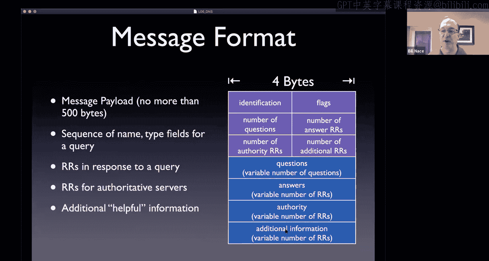

All right， so here's the。The model I showed earlier for how this works。

 I asked a question of a server and the server gives me an answer。Oftentimes， however。

 I can ask a question that that server doesn't know。Because the database that is DNS is huge。

 there are a lot of domain names out there， and there are a lot of them that are changing often。

And so no one name server is going to know them all。So oftentimes we'll get back an answer that is。

 I don't know。So you get back zero answers in the answer field。

 but then you'll get some additional information like， hey。

You should go talk to this other name server who may be able to help you out。

 and that process is known as navigation， how do I navigate my way from name server to name server to get to my answer。

And there are a couple different forms of this， I'm going to show them as if they are strict forms and I'm going to show you a particular picture that uses them。

I want to point out they can get mixed up okay you can do one step one way and another step another way so pick up the idea of each type of navigation from these pictures the first type is is called iterative navigation right and so what we have is we have a client machine that's your laptop that talks to a local name server this is the name server you always ask。

For your DNS questions。And oftentimes this name server is， for instance。

 that router box that's down in my basement or in your apartment or something like that。

So that name server， I'll ask you a question。And oftentimes it doesn't know right it does not have a complete list of the website。

 so I'll ask a question to name server and it'll say， I don't know， go talk to name server zero。

 which is some other computer。And usually it'll also give me the IP address。

 the a record for that name server so that I can go ahead and just send a query straight to that name server hey。

 do you know where this thing is and he'll say yeah I don't know either but maybe you should talk to name server one now this looks a little random right I just keep asking different name servers until finally I get the name server that has the answer。

The key to make this all work is that。😡，When the local name server doesn't know this name server that it gives me is a hint is a。

Pointter along the way to the path and so we need a way to ensure that name server zero is not just randomly selected。

 but name server zero actually helps get us closer to the answer。

And that's the key through all of this every time we get a response back。That says I don't know。

 go talk to this other guy that other guy that other name server is going to be closer to the answer。

 so as I make more and more of these requests as I iterate through these name servers。

 I'm getting closer and closer to the name server that has the answer。

That name server that has the answer we call the authoritative name server。Okay。

 that's the one that actually knows。Usually it's the one for the organization。

 So if I'm if my question involves。Its a CMU machine， this name server。

 name server2 is likely the name server at CMU where that manages that particular machine。

Now it may be that this iteration is too much and so the server can take over the navigation job from the client。

Okay， so it starts off the same way the client just asks the local name server， hey。

 how do I get to this guy？And instead of getting a response back。

 the name server itself can go ahead and just ask on its own instead of telling me to go talk to name server zero。

😡，That local name server can take over the job。 Okay， And so he can ask name server 0， hey。

 have you ever heard of this place， name server 0 still doesn't know。

And responds with you know say saying go talk to name server one and this local name server because he's taken over the job does that directly instead of telling me to go to name Ser2。

 it just goes ahead and asks name server2。And eventually gets to that answer。

OkayWhen the answer comes in， this local name server then just gives me the answer。

 so from the client's perspective， it's almost like the local name server actually knew the answer。

In fact， it's hard to tell this whether the local name server actually knew it or whether the local name server went off and asked on its own。

One reason that we like this mode is because now the local name server knows the answer and the local name server can cache that answer。

So that if anybody else in the local organization asks for that question。

 now the local name server has the answer。In the previous iterative mode。

 the only one who knew the answer was the client。And yes， the client could cache it。

 but that's only useful if the client machine asks the same question in the future。

And so in this case， it's handy， if this is local name server is managing everybody in my coffee shop。

 my organization， my company， then it maybe be other people will ask for the same domain name and it'll have the answer。

嗯。I've also heard that this method is sometimes used for security reasons if we don't want the client to be able to just ask in general any question if we're trying to control something for the client。

That almost offends me， but apparently actually happens。So in this case， all that happened was。

The local name server took over the job， and then the local name server iterated over the remaining name servers。

And so in some sense， this looks。Very much like the previous picture。

 except now the local name server became the client and did the actual requesting of name server 01 and 2。

Instead。It's also possible for this to be a recursive method。😡。

Which now kind of takes what happened at the local name server and just does it all the way through。

 So in that case， the client would ask the local name server for something。

And the local name server would ask name server zero that same question。

 there's nothing stopping name server zero from instead of responding by go talk to name server1。

 name server zero could itself go ask name server one。

 and that in fact could follow all the way down the chain with name server one also instead of responding with a go talk to name server two method。

 instead just goes ahead and does it himself， talks to name server2。

 and then the answer kind of filters back from name server to name server to name server。

This is called recursive method。Okay， and what is happening is each name server is individually choosing to just go ahead and answer the question themselves instead of。

Passing the hint on the hint back。Okay， and so you can view these。

This is kind of two sides of some spectrum， the iterative method I showed you previously was。

Nobody wanted to do any work and just would reply with hints。

And the recursive the fully recursive view that I have here in the second situation is everybody is willing to do the work on behalf of others and goes ahead and ask the question themselves。

Of course these at any point in this chain， a name server can decide to answer it recursively。

 that is do the work themselves or just give you the hint and make you do it yourself。Okay。

 so they can be mixed themselves。Somebody started asking a question Yeah so we we discussed how it's we're using UDP for the DNS request and replies。

When we use re the recursive method， the recursive navigation。

Is it not possible that our we might not get a reply in time because it's going through different name service and we might believe that we the response probably got dropped off or the reply probably got dropped off Yes so you're correct we need to be a little careful and how we set the timeouts and have a feel for how long this process could take now if。

If we didn't get an answer back in time and we went ahead and retransmitted it。

The client generally knows just a single local name server or often。

 I guess it's a somewhat true statement， I guess at any point。

You might go ahead and ask somebody else and so let's imagine I had a backup local name server。

 so I asked the question to the local name server and this recursion took too long and so I went ahead and asked the backup guy。

At some point， that backup guy is going to end up。Liinking back into this chain。

Okay and that backup guy will go ask name server zero and maybe by that point name server zero knows the answer and so that would it would still get to you and in fact that second request would probably go quicker than the first one did and so eventually you would。

嗯。You would get your answer and not not think it went a strike， but yeah， it is true that if I don't。

If I。Make my timeout period too quick， I don't provide enough time for this recursion to work out。

Okay。You catch up with the chat here。SoSo song， I'm guessing that this question about name server Ze was before I talked about recursion。

 because that's effectively what recursion is。And Svar is asking about how the name server knows and that we'll talk about in a minute that's a very careful design choice。

 how do we know that when we ask name server zero and1 and two that we're getting closer to the name server that has the answer？

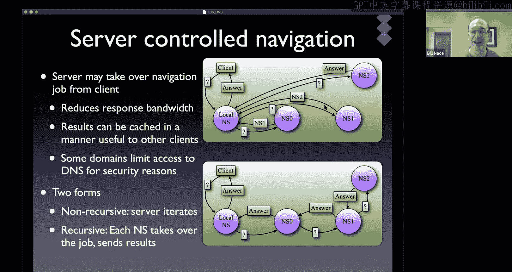

Good question。Before we answer that， though lets just put just point out I've mentioned caching before I said these name servers now that they have the answer can cache them。

 we mentioned this TTL thing okay， this every resource record has a time to live that is the maximum amount of time you're supposed to cache the answer。

Usually that is set at a two day value because the domain names don't change too often sometimes for other reasons we set it to other things if we have something that we you know that we think changes often we might set it differently or if we know that we're going to be switching machines and we want to you know two days from now or I don't know sometime this week i'm going to get around to。

tearing down the old name server and putting the new name server in its place。

 maybe I would want to go ahead and set the time to live to zero or 12 small value so that people won't be asking that old machine when it's down or something like that。

嗯。And so this caching works pretty well。 We're going to talk about something called the top level domain name servers and。

They typically end up being cacheed， and so that saves a lot of time in talking to what is known as the rootot servers。

 which we'll talk about in a minute as well。In fact， let's go ahead and talk about those。嗯。

The domain name service， the process that was used for DNS， preDNS， actually was a single server。

 and so there was one machine somewhere that had all these answers and there was a protocol that was used to ask that server for these questions and get their responses to them。

Okay， now。That centralized， anytime you centralize something， there are a couple of。

Immediate questions that come up about its operation。 right， One is。

 if all the answers are in one place， what happens if that machine happens to crash。Okay。

 if it's the only one there， then all of a sudden nobody can get to anything in the internet if it's not responding。

And so that's a problem that is one of the。Primary reasons that we like to distribute stuff around。嗯。

That server， by the way， it started off fine because the internet was kind of small at the time and there weren't that many questions and answers being passed out and so it worked for a while。

 but eventually the internet got big enough that just the amount of traffic that was going into it meant the one server wasn't going to do as well。

Also， the internet was getting global and so a single machine saving in California。

Meant that if you were in California， that was great， but if you were in Pennsylvania， not so great。

 all your queries have to travel to California and back。And if you are in London even less so。

 and if you are in Berlin getting worse， if you're in you know Bangalore even worse， if you you know。

 so if you have to choose a central location， how you choose that will make some people happy and some people mad。

Turnned out maintenance was a problem you actually at this point we sending forms in to get your values updated and just it doesn't scale at all and so therefore we're going to move because the single point of failure we're to move to a distributed design because of the scale the number of records that have to be stored in the amount of traffic that's going to we're going to make it into a hierarchical design as well。

And the way that's done is the domain name。Sstem actually breaks up domain names， machine names。

 host names or whatever into a hierarchy that has a bunch of different namespaces and you are if you've been using the web for any length of time you're familiar with this hierarchy even if you may not know some of the formality pieces of it there's a structure to it there's a root that's called slash and then below it are a bunch of top levelvel domains and in each domain there are subdomains and in each subdomain there are sub subdomains etc。

 so it's a completely hierarchical system。Oftentimes we end up with kind of two layers or maybe a root plus two layers so that we have cu。

edu and in a lot of places you know it's just facebook。com or something。

 but it could be very you know it could be a dotmachine。@the。eas。cot。cus。ov。

cmu you could have a very， very long and thus a very deep hierarchy to this namespace。

And we read these from specific to general we read， we put together it together in the left to right。

Ordering from bottom to top， we don't actually write anything for the root because it's。

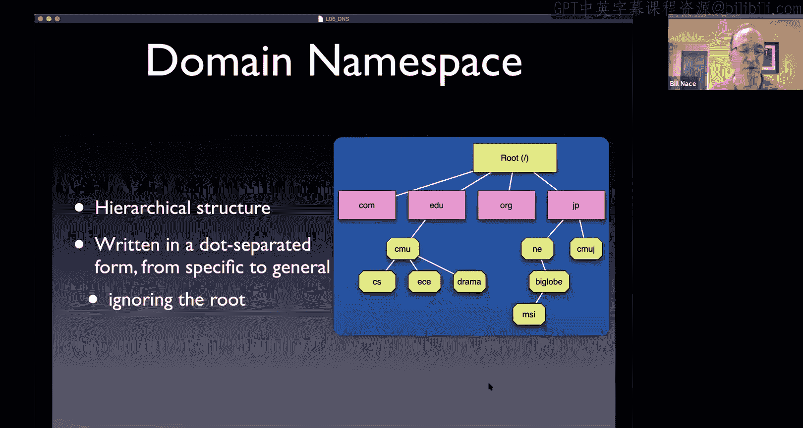

It's assumed to be part of every domain name。There are different types that roughly match to this hierarchy。

 the top level domains themselves can be generic or country coded or infrastructure top level domains。

So for instance， there is a dot ARPpa that is the only infrastructure top level domain that's just a relic of the old days of the network。

And that's used for reverse lookups in the domain name system。There are。

Some domain names that are passed out by country code， and so there are a whole bunch of different。

 you know some organization I think it's in the UN had specified a two letter combination for every country。

Dot us， you know。Cn， whatever those are， those country codes all become top level domains as well。

For a long time， there were just a few others that were known as the generics， the。com。org。edu and。

govand。m， I think were the only real generic ones。And those basically are like others。

Within the last couple years though this sponsored version has really blown out if you have enough money。

 you can basically I could just go buy you know dot NAce and some companies do I think Canon camera for instance has dot Canon as as their domain name and there' are some other kind of weird ones dot wedding because somebody thinks that people are going to want to have web pages for their wedding and so are going to want to purchase a domain name from them and so those have exploded in the last couple of years and you probably seen some of that as well。

NowThis is a type hierarchy it's managed by Aana， the Internet assigned numbers authority that is part of Ican。

 which is the overall。I want to say governing body of the internet。

 although the internet is only loosely governed sort of thing and basically what I can does is they they hire a registrar for each of the top level domains so dot co there's a company called Verign that that is the registrar that manages that and so if you want a dot co。

Address you。Well， turns out。Vaign goes ahead and subcontracts out so when you go to hover。

com to buy a domain name they effectively have to communicate back to Verign and they have that worked into their infrastructure so when I say I'd like BillNce。

com they can quickly check and see if anybody else has Billna。

com and then let you register to make that happen and so each top level domain has its own registrar although that may get subcontracted out。

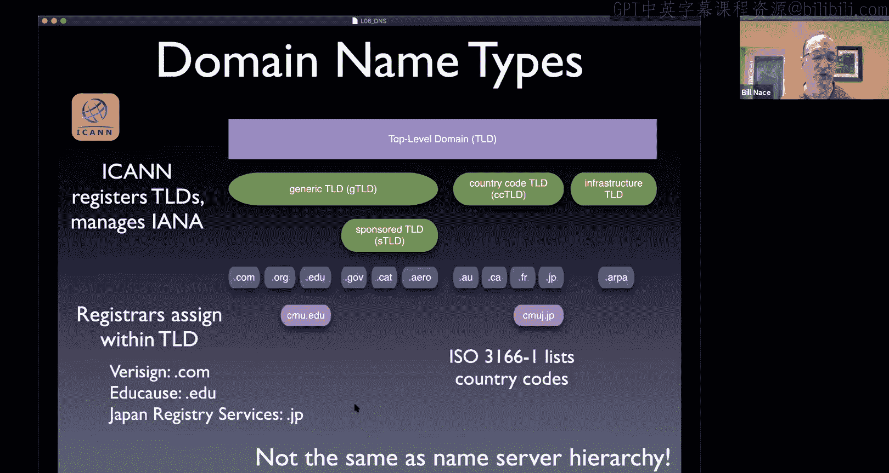

The name servers themselves are in a hierarchy I mentioned a few minutes ago that there are things called root name servers and there are then top level domain name servers in each of these top actually the registrar for the top level domain has to run a name server as well for them and then there are within the。

The actual organization's name servers as well。Now what happens here is there is a mapping that's not complete between the namespace chunk between a CMu。

edduu cmu is a part is a partitioning of theedduu namespace and sometimes that partitioning。

foollows some authority administratively and sometimes it doesn't and so an example I don't actually know whether this is true。

 but in CMU you know the compite department has the skills and wants to run a name server fine。

 let them so they can have so CMU would decide yes。

 we're going to have a subdomain called CS and CS is going to run a name server to make it happen。

And so now we have cmu。edu。 I'm sorry cs。cmu。edu maybe some other organization wants a subdomain but doesn't want to run the name server。

 I'm picking on drama here。Maybe they want drama。cu。

edu they just don't want to run a name server that's fine cu can run the name server for can include that in the name server they already run and so you end up with this partitioning called zones where each zone has a name server in it and has the authority over a piece of the namespace and that authority gets delegated from the parents at the top of the hierarchy down the hierarchy so CMU is saying okay CS we're going break off a zone for you。

 you're going to run your name server in it and we're giving you authority over all the names that are something cs。

cmu。edduu。And so you end up with。And namespace hierarchy that would include there is a drama。sumu。

edu， there is an ini。sumu。edu， there's an ece。edu， but then some of those are combined in the zone with the organization above。

 so CMU has broken out separate zones for c and ECE， but maybe not for drama。

And then each zone has a name server in it。The name server is the actual computer actually has to have two name servers。

 has to have redundancy。嗯。Those name servers are computers that run the database for all of the names within their piece of the namespace。

 So all of E C E do sumi do Eduu， their bunch of machine names or host names and other。

Names within that。That。Zone's entire knowledge is going to be put into the name servers but then become the authority for all of the names in their zone。

It is possible， by the way， for the name server to support many zones and that's what would have to happen with J and CMU。

And so here's the hierarchy map and then we put a single name server in each one and you notice the CMU name server then would be taking care of the drama space because it's in the same zone as the CMU name server。

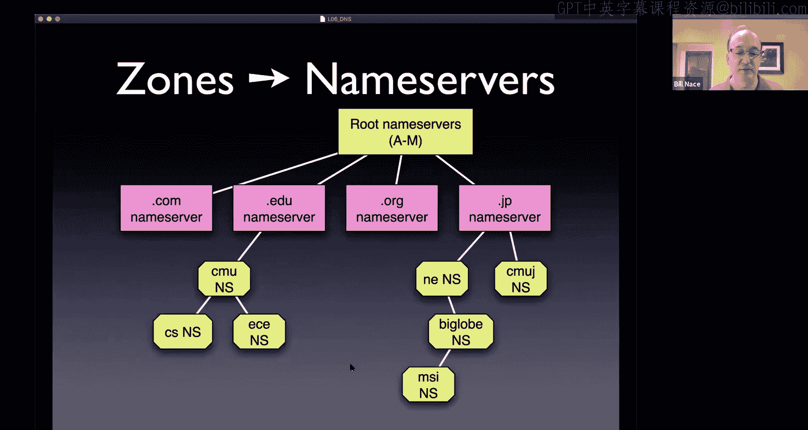

All right， so let's talk a little bit quickly about some of these name servers and what they look like at the root there are 13 name servers they're labeled A through M。

And each one is actually a cluster of many， many distributed and replicated servers okay and so if you look at this unfortunately is not a current map。

 this is wow now seven years old I like this map because this shows the location of each of the replicas。

 so for instance， you notice L is all over the place。

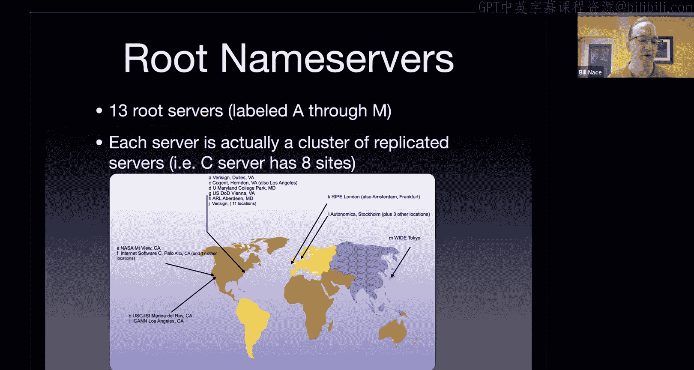

You think of the L rootot server as being a single machine， it's not。

 it's a lot of machines and they're spread geographically throughout the world。Okay B， by the way。

 is a mistake， it's not actually at zero to zero that long， it's actually in California， someplace。

 I think USC。But you see these are nicely distributed around the world and there are lots and lots of them that's good because that means there's usually a name server near you and it means if there's you know a big disaster that takes out you know a come lands on New Zealand it would take out those name servers but we'd have a bunch of other replicas of the data of course if a come took cut New Zealand we'd have bigger problems than DNS I'm sure。

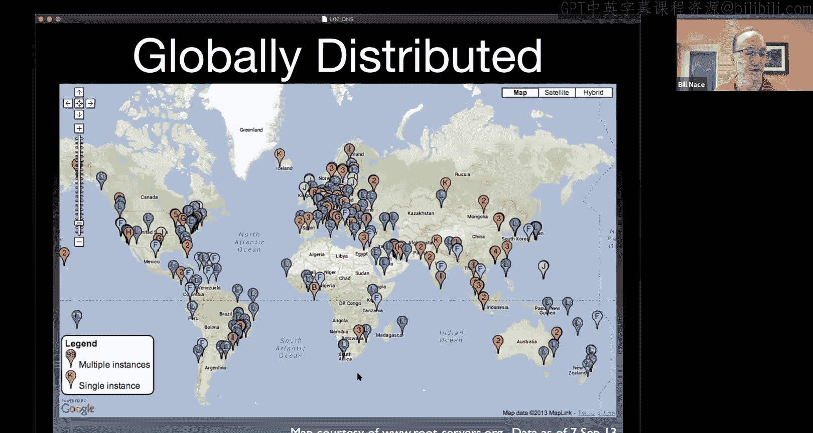

The root server， what does it do， it actually doesn't know a whole lot。

 it knows the top level domain name servers。😡，Okay。

 so I can ask the root a question so I can ask actually I can ask for anything so here I'm going to ask for where is www。

library。sumy。edduu if I ask the route that it's unlikely the root knows this in fact。

 the root doesn't know this。Okay but here's the answer to Sriva's question。

 how do we know how will that name server， how will that root name server be able to tell us someone closer to the answer because it can look at this name and say oh you're looking for doedu let me point you towards the top levelvel domain name server for doedu that's an edge of cause name server and here are the IP addresses and the name server names for those so here's an NS record and here's na record for each of those top level domain servers。

And so then I would go off and I'd ask and say， okay， let me go ask those guys。You can。Actually。

 I discovered when I was updating the slides recently that I couldn't easily get the zone file。

 it used to be there was a website that was just like here's the zone file。

 but it's changing more often and getting bigger because there are a lot more top level domains in it but。

It's still small， you know， as of a couple two years ago， it was only 2。

3 megabytes and only changed about once or twice a week。So if I look at a particular name server。

 this is the K root name server that I chose randomly。You can actually go to k。rootservverers。org。

ToIf you use the domain name system， you can find a web page about this root server。

And it's distributed around in a lot of different places。And this is a statistic。

 one of the cool things you can see is the stats page at each of the root serverver。org locations。

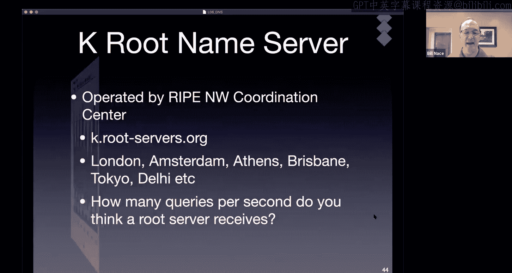

And this shows that this week。The K root server is getting in the high1000。

 maybe peaking a little bit over 150，000 queries per second。Okay， so that's。

that's a lot of work that's happening there。 and so all of a sudden you look at this and you say， oh。

Maybe these this does have to be distributed， maybe there is a lot of scale。

Yeah who he's asking who runs these， there are 13 organizations K is Re， yeah。

 there's a coordination group called Re that runs networks， it's a network operations center。

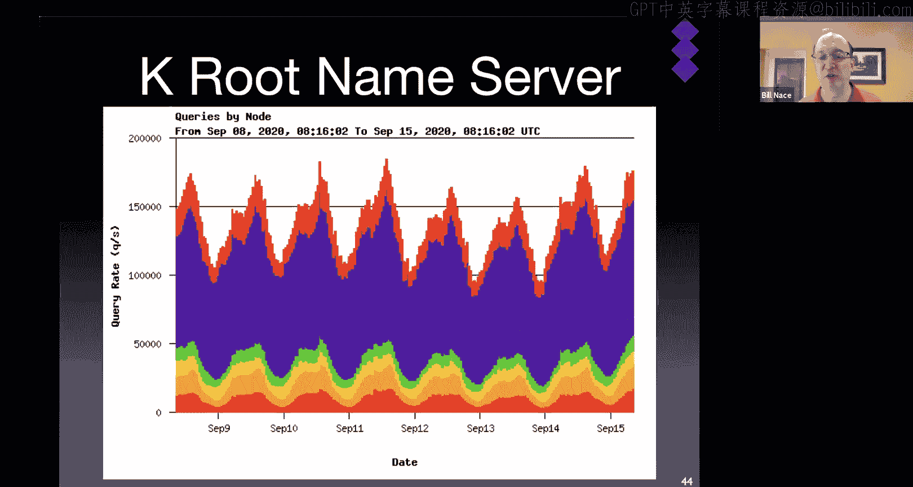

A lot of these are or were academically oriented， and they're just different organizations that are part of managing the internet。

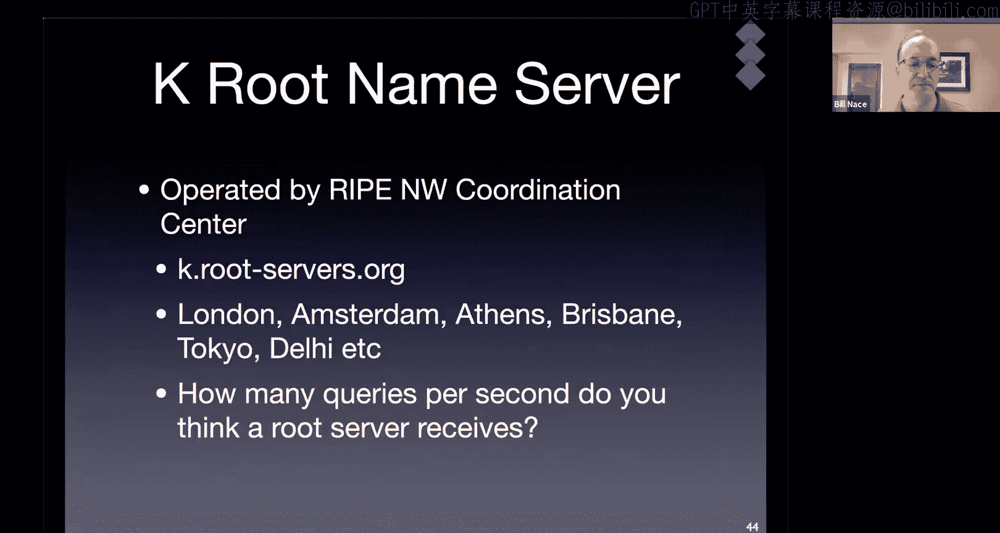

And they you know， they get funding from various government agencies or some of。

 I think a couple of them are registrars as well。

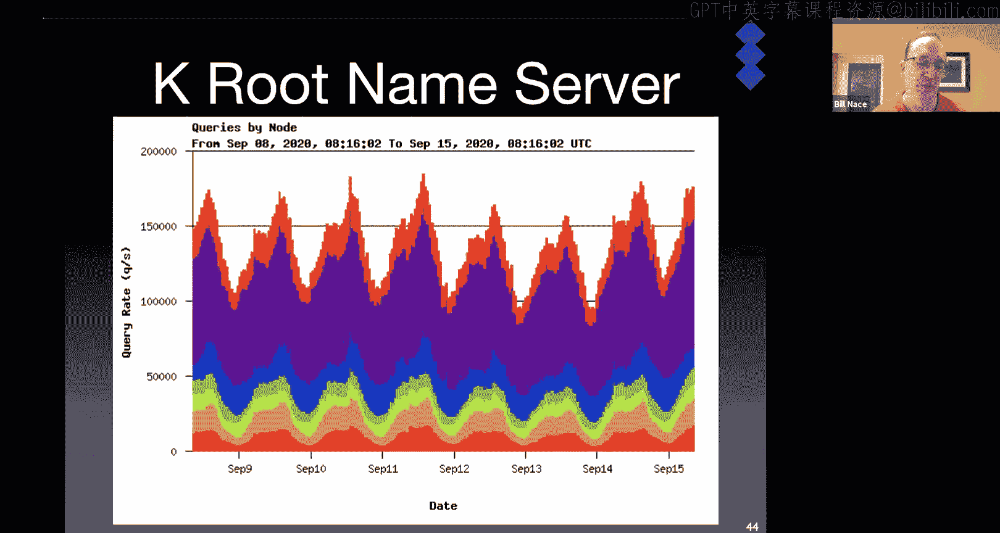

All right， so the next level down is the top level domain。

And and so those each of those different registrars manage their server for either a global generic or a country code top level domain and their job is to know the next layer down who are the authoritative name servers for each domain somewhere so now I would。

I asked the route， he told me to go talk to EucAuse and so I would ask EucAs， hey。

 how do I get to this location again， unlikely that EucA knows every computer at every campus in the world。

 but it will know where CMu。edu is and so it'll say。

 oh go talk to the name server at CMU and here are a couple of them and here are their A records their IP address is。

This is not library。cu。edu， this is just getting me on campus to CMU。

And so then I have to go talk to that organization and eventually I will get to somebody who is authoritative in this case get I think library is in the main SiU。

edduu zone and so when I ask those guys they'll say， oh yeah。I'd say， hey， where is librarylibrary。s。

edduu and they will tell me for sure they'll say this is an authoritative answer。

Because that's in our zone， it's this machine， libsearch。viP orvip。endroidw。cmi。edu。

 and here's the a record。Okay and so that's the process we're going to go down to。

To run from root to top level domain down many layers， maybe。

If probably was looking for something in CS， then when I queried CMU。

 they would pass me on to another name server and that's how we get closer and closer until we eventually get to the authoritative guy who gives us a real answer。

There's one other participant in this process we need to talk about and I promise i'll shut up after this that's the local name server this is often called the resolver every machine needs to know where to start with dNS so what you don't want is every laptop in the world talking to the root name server。

Even though that theoretically would work， they would get crushed by that load so instead what you do is you have some default name server。

 some resolver that is local to your network that is where you start that's that first step on the navigation process and maybe they have the answer cached and so that becomes easy。

If not， maybe they will recursively hand it for you or maybe they will respond back to your laptop and say。

 I don't know， go talk to the root name server to get started on this。Okay。😊，All right。

 we did not get the content distribution networks that does not surprise me。

 we're often stopping at about this point we're just a couple slides short。

 don't worry we'll catch up next time。Okay。If you want to hang around ask questions， that's fine。

 if not， I will say do to you， have a great day， have a great weekend， we'll see you next week。Bye。

 bye， everybody。Thank you。 You too。 Bye bye。 Thank you， bye bye。Bailey， great， great data point。

 where did you get it？That's straight from the reading oh was it okay？

The mockcaattrisll I need to reread it again， it's been a year or two since I read it。

Cool thanks that puts that in very nice contrast one root server is getting 150。

000 times that traffic and we've got 13 root servers。😊，At this point in time。

 so thanks for letting us know。Andi， you say what does a company get out of running？😡。

Got to be careful I understand what you mean by running a DNS remember DNS is an overloaded term that means different things so if you mean running a name server part of it is that's the responsibility if you're going to run a network。

So it's not like CMU said， oh， goody， we love to run a name server。It's more that they said， okay。

 we're going to provide a network for our students。And as part of making that work。

 we need to have a couple machines that are named servers。Okay。

 if what you're asking is what does a company get out of running something like the top level domain？

In that case， they are a company that is working as a registrar and they get to charge fees to people who want to register a domain name so when you go off and decide that you would like Abdul Hai dot co you have to。

Give some money you have to give you 25 bucks or something to hover。

com or some other registrar and that money is what the registrars get as for doing their job it turns out that's a lot of money and so there's usually a lot of competition to become the registrar。

And and in some cases， for instance， it's actually part of government。

 so a lot of the top level domains are run by the postal service in company in a country or something like that and they can still charge。

Registration fees as well。Does that answer your question？Yeah。

 I'm going to say there's no economic benefit to running a name server in fact it's an economic cost。

 you have to hire people who know how to run it， you have to have a machine。

 you have to provide electricity and network connection to it。

But you do it because you get to run a network then and that's you can make money out of running a network or like at CMU。

 it's not like we make money out of running a network， but we without it。

 none of you would want to come here so we make money off your tuition。

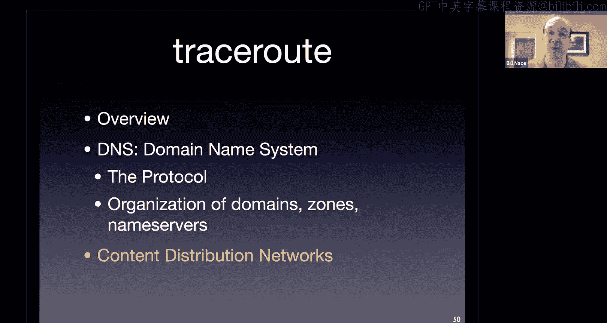

In part， because we have a network。Yeah。All right， a zone transfer happens。

That's the way that the redundant name servers actually become redundant and keep data from each other。

 so if you upload if you change a record to say， oh now there is BillNce。

com in your zone so that's probably bad example let's say that I convinced the ECceE department that I should have billnace。

 ece。cmu。edu， they update their zone record and then the name servers transfer that among themselves so that they all have a redundant copy of the zone。

 you also use a zone transfer for instance when you boot up a new name server。

 it goes and talks to the primary name server and gets a copy of the zone file and things like that。

嗯。够。All right， have a great weekend everybody。We will see you later。Thanks， Winroy。

