# CMU《计算机网络基础｜CMU 14-740 Fundamentals of Computer Networks 2020》中英字幕（deepseek p10 -P10-2020_10_06_Lecture10.zh_en -BV13J6uYpEZm_p10-

This is 147，40。 Welcome， everybody。I noticed today we have a very thin crowd in economy。

 So I'm guessing that a little bit of chill weather is keeping some people。

Snug in their beds as they watch Zoom or something like that， I don't know。

Hopefully there's some benign reason like that for it。Today。

 we are going to dig in a little bit to our。To our transport layer。

 we're going to start getting ready to start learning about TCP。

 So this is not a lecture where we're actually learning TCP， but one。

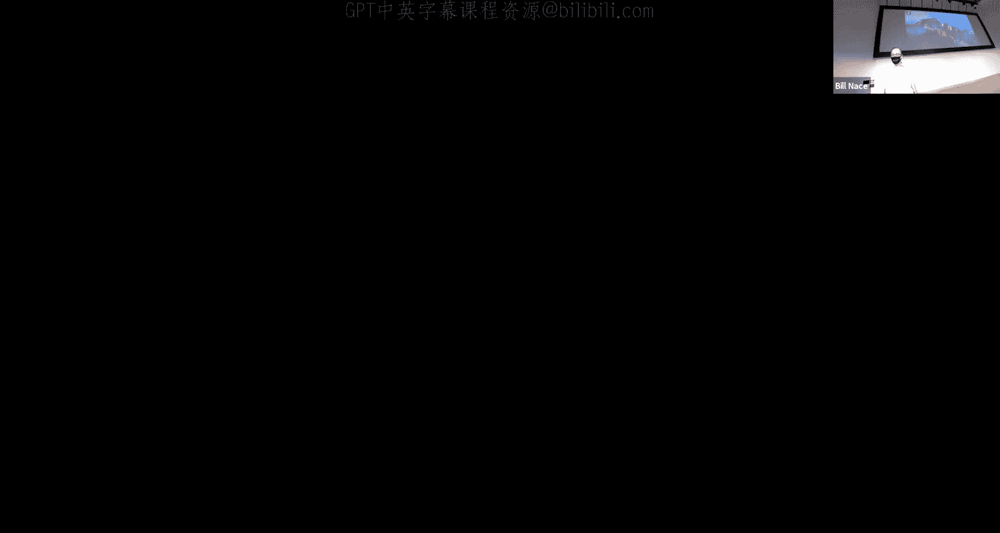

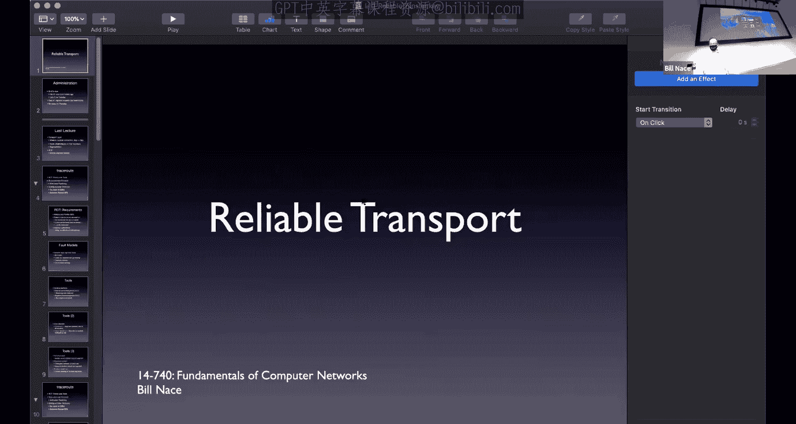

Where we're going to learn the tools so that when we do learn TCP。

Next time we don't have to spend a whole lot of time kind of。

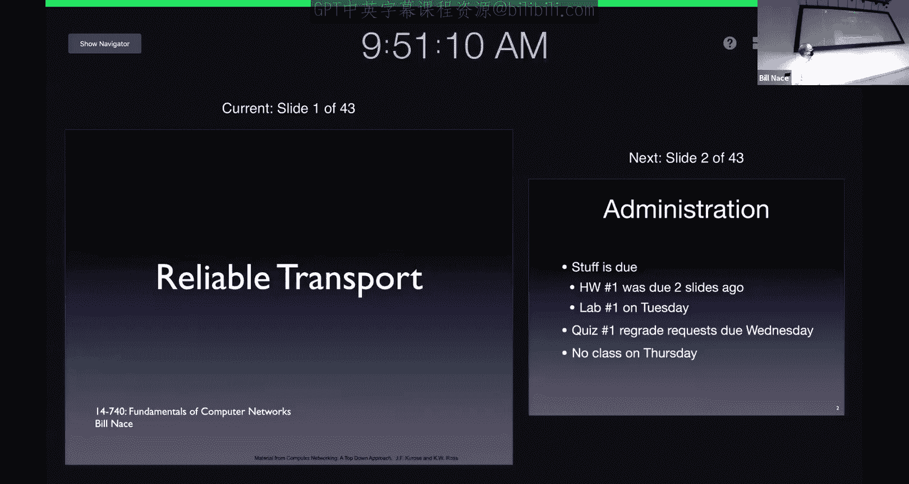

Futing around and trying to remember how things are working。

 and so today is a preparatory lesson for that。A couple administrative things before we get started。

 yes， stuff is due， you guys just turned in homework one and you've got a week to work on lab one。

And。Yep， if you happen to have any regrade requests， please get them in rapidly。

I also want to point out I will not be available on Thursday morning。

 so we're not going to have class then or just。Basically， skipping it。And so I mean。

 you're welcome to come to economy Thursday morning just I won't be here and we won't have Zoom okay。

 so I will see you next Tuesday for our next class， okay？All right。

 so last time I was here we started on the transport layer。

 We dug in and and so these are some of the things the transport layer has to do。

 So kind of the theoretical knowledge of a a protocol at the transport layer。

 and we talked about the mission。 we talked about some of the things that had to happen in the transport layer。

And then we looked at one of the simplest protocols we're going to look at all semester long。

 which is UDP， which is basically this really thin layer over an IP packet that is effectively nothing more than a couple of addresses on a check some that gets sent on that packet and that allows us to do all kinds of cool stuff。

What it doesn't do is provide any reliability。 And that's often what we want out of the transport layer。

 And so we're going to spend a significant amount of time in this course learning how to make the transport layer or how to make the network more reliable by using a transport layer protocol to do that and we'll be examining TCP。

 which is a highly optimized。Protocol to do this exact thing。As I mentioned before， though。

 I don't want to just jump into TCP TCP is a very complex beast。

We are literally going to spend four lectures on TCP and various aspects of it throughout the course。

It's very commonly used and so it's important that we understand how it's used。

 but there's a lot going on and so what I want to do today is make sure we understand the basic tools。

 the building blocks that are used to make TCP。And so we're going to go through and take a look at that。

And as a way to understand those tools， I'm going to introduce a bunch of academic protocols。

I want to point out these protocols I'm going to teach you， things like stop and wait， go back in。

 select the repeat。They're academic protocols， okay they're designed to teach you these tools。

 they're common， but you pretty much any textbook you open。😡，About networking。

 we'll have these protocols in them。And it gives you the impression that this is like a real protocol and you know wouldn't this be great and I've actually had students come to me and say。

 hey Id like to you know I'd like to do a research project where I implement go back in or something like that and I look at them crazily like why would you ever want to do that What's the point this is an academic protocol It's here。

Just to learn a few things， nobody would actually ever use this。Okay。

 because TCP is going to do this job much better。Okay。So as we go through this。

 I keep that in mind because there can be pieces of this。

That if you have they're going to raise the hackles at the back of your neck。

 your engineering spy sense is going to go off and you're going to say。

 why would you ever do that a couple times today？Because we're going to say this is just the way this protocol happens to work。

Okay， so。Don't get overly up in arms about there must be a better way because there is a better way。

So we're going to first think about this idea this we call it reliable data transfer。Or RDT。

 what is it we actually want？Good place to start when you're doing any engineering task take a look at your requirements。

 what is it that we think is too important。To do reliable transfer。

 to get my information from a sender to a receiver in the network。

What we want is we would like it to act like the network is a reliable channel we would very much like for me to be able to send some bits from a sender and have a receiver get those same bits。

We don't want to have them corrupted。 I don't want to send a one bit and have my receiver get a zero bit that wouldn't do me much good。

 I would like it to be reliable。I'd like them all to be delivered。 right， If I send 1000 bits。

 I want my receiver to get 1000 bits。 I don't want them to get 999， So I don't want anything missing。

 and I certainly don't want them to get 1001。 I don't want any added。 Unfortunately。

 the base network will do both。So the network we have causes all these troubles。

 and so we're overcoming those problems。I'd also like the bits I sent to be delivered in the same order I sent them if I send this piece and then that piece of let's say I'm sending a file or I've typed a command at the command line for remote login。

 I very much like those characters to get delivered in the same order I sent them。

Otherwise I'm going to be seeing into some directory and instead it will show up as a DC on the other side。

I mean， I should also point out that。We're going to want this in both directions。

 when I'm sending from my laptop to your laptop， I would like that to be reliable。But also。

 you're going to want to send stuff back to me。 and that should be reliable as well。

 So this should be a bi directional channel。But for today。

 I'm mostly going to just pretend it's unidirectional。 I'm going to pretend it's one direction。

It's trivial to go ahead and just do this twice once each direction。Okay， and in fact。

 if you do it twice， there are some opportunities for a couple of optimizations。

 we're not going to worry about that okay， we're just today going to have a sender。

Sending data to a receiver。And of course， if you want to be able to reply， you know。

 I can send my HtPP request over that reliable channel。

 of course that web server is going to want to reply to me using a reliable channel as well。

Everything we talk about in one direction that server could do。

In the other direction to make its own reliable channel。

So we're just basically going to get rid of some annoying accounting。By saying it's undirectional。

All， I've already mentioned that the network has issues， and we call that default fault model。

These are the things that we are protecting against and anytime you're trying to build something reliable。

 you want to have thought this through ahead of time。Okay。

 and these are the things in our fault model。 We say the network has these kind of faults， right。

 It does bit errors。 It is lossy。 It duplicates delivery so I can have less or more data showing up at the the receiver。

 I can get so out of order now。There are other problems that could happen in the network right。

 you could have an earthquake somewhere that destroys a router。

 right you could have terrorist activity take out a connection somewhere。

Those are faults that could occur and cause trouble to our data。

 we have decided by not including them in this fault list that we're not going to try to engineer around them。

And that's just because at some point you decide these are the common things I care about。

And if you know if an earthquake destroys a data center somewhere， yeah。

 maybe I could have engineered around that， right but that's a rare event。

 so I'm not going to worry about it right now， these are not rare events。

So these are the sorts of things we want to get around。I mean。

 these are the sorts of things that it's fairly easy to get around。There's one other very。

 very common network fault that is not on this list， and that is network partition。Okay。

 it's very often the case that。Something happens， a failure occurs， a router crashes。

 a network link goes down， and all of a sudden the network is now split into two pieces。Okay， and。

That's a fault of the network。And we could put it on this list。

 the problem is if I put it on this list， it's really hard to engineer around that。

It's very hard to actually communicate between two networks。That are completely separate。Okay。

 and so。We've decided that， yes， that happens。 And we're just going to live with it。 Actually。

 we're going to do other things to。You to kind of get around it， right？CMU， for instance。

 has redundant network length， so if one goes down， there's another path。

So we're going to address it in those ways instead of putting it into our protocol。Okay。

 so that's the purpose of this fault model list is to just be able to say this is the stuff。

 I mean when I say reliable is I want it to get around all of this stuff。Okay， not other。

Other troubles that may happen or maybe very， very rare things that would happen。

 I don't want to spend effort on those。And we're going to learn how to get around these problems using a couple of tools。

Okay， these are。Parts of the protocol that we can employ。

That we can basically the building blocks of our protocols。

 and so I'm going to call them tools today and the purpose of today's lecture of course is to learn how these tools work and some of the subtleties around them。

And so we're going to go through all these in much more detail one of our first tools is receiver feedback。

 this is just a message from the other side when I send something to the receiver。

 the receiver sends me something back to say yes， I got that or no I didn't we call that an acknowledgement or a knack。

 an aack or a NAack。To be able to say yes， we got that or no， I didn't， you know。

 I got it but something was wrong or something like that。Other tools we have are for error detection。

Go ahead， let's see， I guess I should get chat up here sorry。Let's see。

Okay so I see a question about the data link layer doing bit error detection and that's correct。

 the data link layer does generally do bit error detection， sometimes correction。

 the problem is that's not an end to end error detection technique right that only helps across the individual link that it's looking at。

And as the salttzer paper talked about， does not cover us if there's a problem in a router somewhere。

And so we generally want end to end sorts of checking。Okay。嗯。So yes。

 we'll use some error detection to let us figure out whether the data that was received was actually the same as the data that was sent。

 and so we've already talked about check sums， we saw that in UDP， basically some math。

 some not too complicated math that both sides performed to figure out whether there was a problem or not。

We also detect some errors through the use with timer。So this is a software timer。

 This is something the sender does when he sends out。A segment or take some action。

The sender can set a timer which basically says， hey， you know in 200 milliseconds。

 I'd like to get woken up， I'd like an interrupt to happen in 200 milliseconds that would then let me know that that amount of time has gone on and usually that's used to detect some sort of loss to figure out whether we lost something。

If I didn't get it in 200 milliseconds， I'd like to know about it and if I do get feedback before that。

 I'm going to cancel the timer what's。Checkさ。So so the question is， what's the difference between？

The the feedback， the NAC that I might have gotten here and the check sum。

 so the check sum is a mathematical check that will tell you there's a problem。

 the feedback is actually the action that is taken by a receiver to tell the sender about it。Okay。

 so don't worry， we'll see how this works in a minute。

I'm just getting the list of tools in front of you right now。

Other tools we use rate retransmission retransmission allows the or has to send or send a segment again。

 so if I think there was a problem with it wed just go ahead and retransmit it this requires for instance that we actually kept a copy of the segment so that we have it in a buffer somewhere ready to go ahead and retransmit if we need it and that will of course mean we need to manage that buffer and know when to throw things away。

We're going to use sequence numbers。 This is going to basically put a number into each of the segments we send。

And that lets us individually identify each of the segments and know whether they're the same segment we've seen before。

You cannot just look at the data in a segment and say， oh， I've seen this data before。

 therefore it must be a duplicate。Because we may send the same data twice。

If I'm thinking about that remote login scenario yes。

 I sent the change directory to my home directory command。

 but then I wasn't sure it took and I sent it again right that's perfectly valid for a user to do and the receiver can't look at that data and say。

 oh， I've already seen this before。Let me let me you know throw that away and so we put sequence numbers on things to identify them specifically and say this is。

The same as this other piece of data or different。And then we'll talk about windowing and pipeing that lets us actually manage the transport of multiple segments at once。

Okay， so。I'm not expecting you to actually the whole point of the lecture is to learn these tools in some detail right and so right now you probably have questions about what these are and how they work and that's okay right that's great be curious about them we're going to then look at some protocols now。

To learn how they work and look at the details and figure out what's going on with them。

So the first of my protocols is called stop and wait。Okay， it is a protocol that is very。

 very simple， in fact it's pretty much the simplest we can come up with that will actually do a reliable transfer of data。

It will employ all of our tools except windowing。Okay， but we'll get， we'll get there。 Don't worry。

 It'll also motivate us。 It'll will learn some of the deficiencies of stop and wait。 And from that。

 decide， oh， we should actually use windowing to go forward。

 I'm going to build this up in a couple of versions。

 I'm going to start with the very simplest protocol version， right。

 This is version 1 of stop and wait。 and it's going to use a check some。

 and it's going to use some receiver feedback。 It's going to use an act and an act。

And I'm going to describe this protocol and in fact。

 I'll do this with many protocols we talked about as a sequence of rules of the actions that must be taken by the players now。

 of course the players are the sender and the receiver。

And so we're going to have rules for what the sender should do in certain situations and what the receiver should do in certain situations。

 and that builds up my protocol， the sum total of all of those rules。Is a major piece of my protocol。

 And so I'm showing that here with a list of things on the left that the sender has to do and on the right that the receiver has to do。

Okay， so for instance， the sender， when he sends a segment。Okay。After sending that segment out。Okay。

 so I guess we should back up a second。 when does the sender send a segment？Well。

 in order for the send to have sent a segment， he must have data to send。

So this is not going to be triggered just the sender saying， oh， I guess I should send a segment now。

 that's going to be in response to the application telling the transport layer， hey。

 here's a message I have， please send it and the transport layer that's running this protocol we'll take that data and do the segmenting。

 it'll do the demxing multipleing it'll figure out some addressing mechanism like port numbers to put on it。

Okay， it will then go ahead and take that segment that it has created and send it on the network。

 how does it do that oh of course it hands it to the network layer network layer。

 please deliver this to that computer over there。Okay。

 so that's always going to happen in the transport layer。

For us here in this particular version one of stop and Wait， we're also going to have these rules。

We're going to send a segment and then we're going to wait。

Okay we're going to wait around twiddling our thumbs。Until we get receiver feedback。Okay。

 until we get either an act or an act， the act will tell us that that segment got there correctly。

Okay， and thus we can be done waiting。And go on to either waiting for the application to give us more data or to take the next segment that we have prepared and transmitted。

However， if I get an， I'm going to have to resend the segment。Okay， so this。

Means that I have to have a buffer with the original data from that segment。😡。

So when I give it to the network layer， I can't throw it out。

I have to still have it sitting in memory waiting to retransmit if I have to retransmit。

And when I retransmit， I'm not done。Because anything that happened to that first segment could happen to this retransmitted segment。

And so I'm going to go back to waiting。Alright， now on the receiver side。

The receiver side also has some rules， and the receiver is basically sitting around waiting。

 And when it gets a segment coming in。What's it going to do， it's going to check the check some。

 it's going to do the math and figure out are there any bit errors with this particular segment？Okay。

 and so we're protecting against one of our fault in our fault model of bit errors by checking the check sum。

And that check sum is basically going to be， yes， it's correct or no， it's not。And if it yes。

 correct， I send an act。Okay， if I。If it's not good。

 then we send in that so the receiver is always going to transmit feedback back to the sender telling the sender。

 yeah， you did a good job， no， you did a bad job， one of the two。Now of course。

 if it's a good segment， then yes， we've just done some reliable data transfer。

 we've gotten some data from center to receiver。And so we need to remember where we are in the network stack。

 we're in the transport layer。That data that we've received now needs to be given to the application。

 Hey， here's the next chunk of data in that cat video that you wanted。To receive or whatever。Okay。

 so this is a perfectly good protocol for what it does， it works。Okay。

 we don't actually duplicate anything。 So I want to point out we're dealing with one segment at a time。

So there's no issue about whether this is a duplicate or anything like that。

There is a problem though。We are correctly using the feedback tool that we have。Okay。

 and we're using check sums to make sure that our。the data that we transmit that when that segment is sent。

 we're making sure that that's correct。But we're not doing the same in the other direction。

That a or NAack that comes from the receiver back to the sender。

 that act is also a segment that is sent across the network。

And so that act ornack is also liable to any of the faults。 And so it might。Get a bit aired in it。

 right， So maybe that gets sent as an act， but received as a knack。

And our version of the protocol won't detect that。We don't know because you'll notice the sender is not checking the check some on that feedback that it gift。

So we should fix that right， let's go ahead and update our protocol to handle a corrupted acknowledgement or not acknowledgegments。

And before we do that， let's just make sure we understand where we are right now。

And I'm going to do that， I'm going to illustrate all these protocols with sequence diagrams。

 which are those pictures with the arrows going back and forth。Right。

 so I have a sender and I have a receiver。This one works， right， If the sender sends a segment。

 but see my little lighten bolt， that's the symbol that something happened in the middle and bit got flipped。

Okay，And so the receiver， when he checks and checks him， is going to look at this and say， no good。

 let's send a knack back。The sender when he gets the neck is going to retransmit。And so。Yeah。

 good enough， except that if the lightning bolt occurs on the neckack or the a line on any of those arrows going from right to left。

Then we have trouble。So it's a revise our protocol。How do we do that， Well， it's easy。

 Let's just add a check some to the actual。to the receiver feedback as well。

 right so that we can tell if that's good or bad。The problem now。

Is we're going to be retransmitting some of these segments and we need a way to tell them apart。

And so we're also going to employ a sequence number。

We're basically going to keep track of this is segment zero。

 this is segment one I choose there's no reason to keep counting we only need a single bit for this。

 it turns out so i'm using a one bit sequence number。It's okay， you could imagine you know。

 a thousand00 bit sequence number， and it wouldn't be a problem。

So we have to change the rules a little bit to handle the the sequence number as well as this check sum and the feedback so what do we do well we have more rules right the sender has to be a little bit more careful when sending the segment we'll see in a minute why we're using the sequence number。

When we send the segment， we're going to have to put a sequence number in it。

This effectively we're writing on the envelope remember from our demo right we're putting an extra field in the header for a sequence number and in this case it's a single bit and I just need it to be different from the last bit。

Okay， so I'm going to one minus the last bit will give me the next bit。 So it's going me 0，1，0，1，0。

1 kind of sequence。And then we're going to go ahead and send that segment。And then over on the。

The receivers side， the receiver is going to get that segment。And when it comes in。

 it's going to do the check some， figure out whether it's a good segment or a bad segment。

 it's going to reply with an act or an act。That segment that we send back is going to have a sequence number in it。

 so we're going to know this is the sequence number for this particular of our segments right so I sent segment zero。

And I'm going to get back an acknowledgement with a zero and I'm going to send segment one。

 I'm going to get back an acknowledgement what the one is。Okay。

 now that set that feedback is going to come back to the sender and the sender now is able to take a look at it and see whether it's good or bad。

Okay， and if it's。You knowIf it's bad， we're going to have to retransmit。

So we're going to go ahead and resend， we're going to send the same segment again now if it's the same segment。

 it's going to have the same segment number on it。Okay。

 so be a little careful that resend there does not mean go to the top and redo that rule Okay。

 it means take the segment that you had sitting in memory。Which included the header。

Which includes the sequence number in it， let's just go ahead and retransmit that。

If I get an act back and the act is correct。Okay， then great， fantastic。嗯ん。Now。

 maybe now you start to see why we need the sequence numbers because the sender is going to be sending these segments。

Okay， and the receivers got to be able to tell whether it's a duplicate or not if the。

If the feedback comes back。The receiver doesn't know whether that feedback got damaged or not。

And so it doesn't know whether the segment it's getting is a duplicate or not。

In the previous version， there was only one segment being dealt with at a time and so we didn't have to make this distinction now。

 however the receiver could be in the situation of not knowing whether this segment is a duplicate because the feedback was corrupted or whether it's a new segment and so that's why we need the sequence numbers on them。

One rule I haven't covered yet is on the receiver side， if the sequence number。

 so if the receiver receives a good segment。Okay， that's good data。

And it's different from the last segment we got。 So that means it's new data。

 So if it's good new data， we're going to deliver that to the application。 Okay。

 that's the next piece of the cat video the application can look at。And so this protocol is great。

 right it's going to handle the fact that the acknowledgement may be damaged or not。

 it does have a problem because it still we can't lose a segment yet。

But we're dealing with retransmission and duplication of segments， which is good。

So here's our picture of this ina and we start off the same way we did on the previous picture。

 right the version one protocol was able to handle the first half of this picture。I send a segment。

 it gets damaged。We reply with a knack， therefore we resend。

 the only difference to this is now there's a number on it。Right， we're sending segment 0。Okay。

 it gets damaged。And we get a not acknowledgement。 Then we resend segment 0， other than that。

 it's exactly the same as。Our version 1 protocol。The bottom half of the picture， of course。

 is where this。Is good in this second version， right In that case， I'm sending another segment。

 that segment one， and in this case， the feedback gets damaged。

So that my lightning bolt is now in that acknowledgement， the sender。

 when he gets the acknowledgecment does a check someone and it fails。

Can't trust any bit of that segment of that thing coming back so you can't look at it and say， well。

 it mostly looks okay， it says acknowledge but you know maybe this other thing was damaged right you don't know which bit it was and so it could be the bit that changed it from an act to an act。

So we have to retransmit and we'll go ahead and send segment one。Okay， and this is why we have the。

The sequence numbers now on the receiver side， the receiver is getting a new segment。

And it needs to know， is this a retransmission of what I've seen before or is this new data？

Because from the receiver's side， nothing has gone wrong。

🤧The receiver sent an acknowledgement and now is getting a new segments。It needs to know。

 is this new segment Is a segment a new one or not。 And so in this case， it's segment  one again。

 it's going to say， oh， wait a minute。 I've already got segment  one。

So I'm going to go ahead and not deliver this to the application， it's not new data。

I still have to send an acknowledgement though， because we have to tell the sender that we actually got some data and so it doesn't have to retransmit anymore。

Does all make sense。🤧Yeah。Let's see。 So in the chat， somebody is saying， wait a minute。

 What if the I'm showing here an act gets damaged， What happens if it was a actack that got damaged。

 So let's go back to the beginning of our picture here。Right， and so let's imagine。

We sent segment zero and segment  zero got damaged。 The receiver sends a knack。

 and the NA gets damaged。Okay， the sender is going have to retransmit because he will have gotten a feedback that fails the check some。

Okay， so at that point， it doesn't matter that it's an act that failed。

Our actual protocol says that when the sender will wait to get an a ornack and if it's corrupted or a knack。

Either one of those cases we're going to have to retransmit so if the feedback comes back damaged。

 I don't know whether it was an a or an act。Or if it's an act saying the original thing was damaged。

 then we're going to have to retransmit。Okay。So both of us would handle it。And Amet's saying。

 what about sofed stuff， Let's not worry about the malicious actors here， right。

 malicious actors were not in our fault model。Okay。

 so I know many of you are very security conscious， and that's great。Let's just remember。

 these are protocols that were developed in the three digit RFc era before security was a problem。

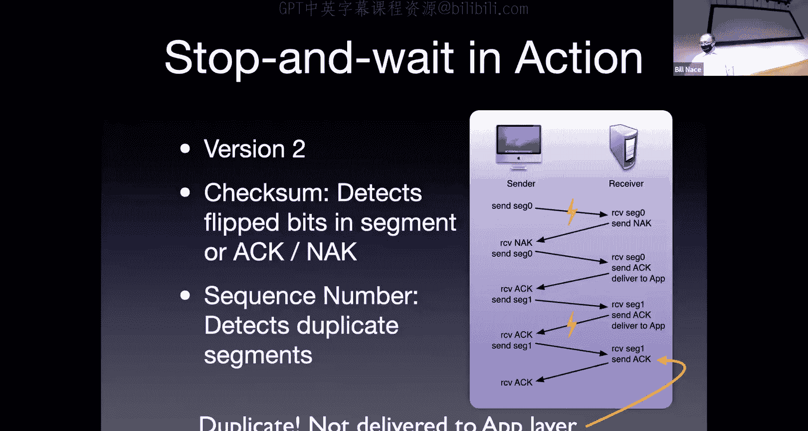

And。I don't know what just happened。A projector start up again。Veryry soon。If you're hearing me。

We have projector issues。好了来。New projector， yes。

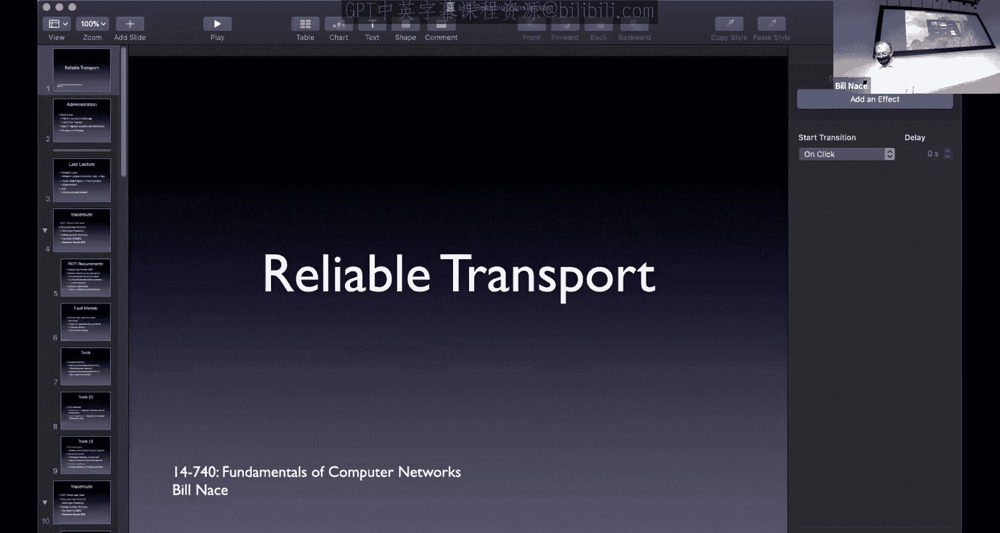

Are we free to unmute ourselves and ask questions or sorry， Zoom？

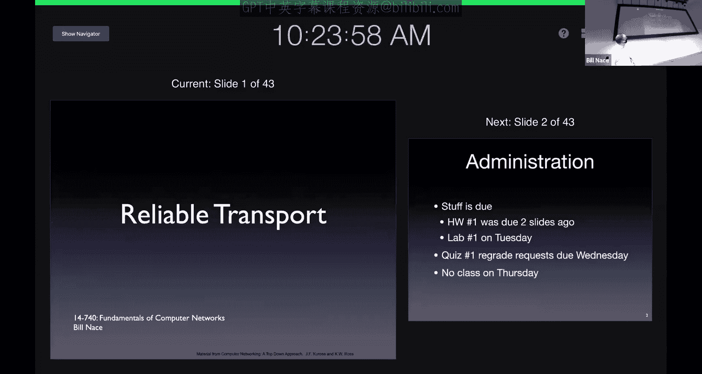

嗯。Many clicks ago。ItApprimately or yes， okay。어我 거。Yes， is it possible for a nap to get。Yes。

 the question， is it possible to have any feedback that is corrupted so badly that we think it's the other thing？

We're using checkum as a tool， okay， and the assumption there is that the checkum is going to detect any of the bit errors。

now we talked last time that check sums do have limits。

And so you would want to do things to try to design your the format of the data that's get sent back so that if there were two bit errors。

 maybe it wouldn't。Damage it so much， but there is the problem that it is possible to have checks on failure。

We assume that that's such a rare case that it's not going to come up。Okay。But。Yeah。

 if it bothers you a lot， then you need to do more， you need more redundancy in that checkum。

 or you need to do more in your error detection than the simple checkum algorithm we talked about last time。

And you can do that， it just requires more redundant data and more processing to make it happen。

 so that was that trade off we talked about last time。

And if you're worried that that trade off is going the wrong way。

 you need to throw more processor and redundant data at it。Okay， so my apologies。

For our Zoom problems there， I have no idea what was happening。嗯。

We were finishing up with version two and we were saying this is a great protocol。

 it appears to do everything we want except and we would go back to our fault model and we'd say， oh。

 does this cover bits that get。Muned， yes， it does does it cover additional data， it would。

 so if the network actually delivered segment one twice to the receiver because of the sequence number。

 the receiver would know that it's duplicate。So it looks like we're in great shape until we get down to the O。

 the network occasionally loses segments。What happens if an entire segment goes missing。

 we're in trouble？Okay， and I guess。Let's just make sure we understand that what happens if it goes missing。

 so let's imagine that that first segment up there does not get a lightning bolt that flips a bit。

 but instead just goes missing entirely。Okay， well， what happens， Well， at that point。

 the receiver is sitting around waiting for data to show up， and that data will not show up。Okay。

 and the sender is also waiting around， right， The sender is waiting for feedback That will never come。

Okay， so if that instead of just flipping a bit had completely erased an entire segment。

 this protocol is in trouble， so let's fix that。Version 3。In order to fix that。

 we're going to bring out another tool and that tool is a timer。Again， this is a software timer。

 you can think of it as the kitchen timer that you use to tell you that your eggs are ready。You say。

 hey， Alexis set a timer for 200 milliseconds every time you handle this。 and in a software sense。

 you get woken up after 200 milliseconds。And you'll be able to say， oh。

 let me respond to that timer going off。Okay， so let's see how we use that。 Again。

 we're going to change a few rules。Now the sender， when he sends a segment。

 he does everything he did before， right， puts a sequence number in it， right。

 goes keeps a copy of it in a buffer Now when he sends it， he sets a timer。AllIt says okay。

 kitchen timer， Alexa， whatever， please start my timer。Iues I should be careful。 out in Zoom La。

 there may be a bunch of people who have Amazon devices now going off。

Sorry if that's happening to you。We're we're going to start that timer from a software perspective okay and then we will sent the data。

 we hand it to the network layer， the network layer takes care of it。Okay。

 and then we have the same sort of rules， right， when an acknowledgement is received。All。

 I'm going to go ahead and use that feedback。I'll look at it and say， oh， is this a good。

A good piece of feedback or a bad piece of feedback right if it's passes a check some and it's an acknowledgement that means my data got through and the an acknowledgement for the right segment Okay I sent segment zero I got an acknowledgement for segment zero if that's good。

 then that means my data all got delivered properly bit error free all that sort of stuff。

And so what we need to do is we need to cancel that timer。Okay。

 so you just stop that timer from ever going off right， you set it for 200 milliseconds。

 This happened after 50 milliseconds， you just go ahead and cancel that timer so that it will never go off。

Okay， and then you're ready to send the next segment， you're done having gotten that data through。

If something happens， okay，s a if your feedback comes through and it's a not acknowledged。Okay， oh。

 my data was corrupted on the way there。 I need to retransmit it。

 We're going to go ahead and resend it。We got to be careful， though， we want to reset the timer。

 so we're going to every time we send something， we're going to want to put a timer on it。Now。

 since I'm retransmitting that segment， I want to have another 200 milliseconds to go。

 so I'm going to cancel the first timer and I'm going to reset a new timer for this new segment going off。

Okay， we'll go ahead and resend it。And then there's also the case that possibly the timer goes off。

If the timer ever goes off， what does that mean？That means we did not get feedback。

For this segment of either the positive or the negative source。Since we set the timer。

 so in my example， in the last 200 milliseconds。I have never gotten feedback。

And we use that as indication that the segment must have been lost。It's not proof that it was lost。

But by this point in time， I should have gotten feedback and I didn't。

 so therefore we're going to assume it was lost and we're going to go ahead and resend。

And when we resend， we're going to follow the rules。

 we're going to send the same segment with the same sequence number that we sent last time。

And we're going to set a timer again。Okay。On the receiver side。哼。Actually。

 the receiver's side is exactly the same。 right if you look at these rules for the receiver and you compare it to a couple slides ago。

It's exactly the same stuff。The receiver does not need to know that you're retransmiing segments or that you have a timer waiting for lost stuff。

Okay， the receiver will react exactly the same way。It's just the sender。

That we have to make these changes to the sender is the point where we are detecting loss segment and doing all the retransmission。

If the receiver detects that there was a well how would it detect。

 how would it know that there was ever anything that was supposed to be sent？

So it doesn't know that the lack of something showing up is means that a segment got missing。Right。

 so， so the burden， therefore， is all on the sender。And so the sender has to manage this。

 and luckily the timer helps us do that。And now。I'm retransttting segments， right？

Every time the timer goes off， I'm going to retransmit the segment。

 that does mean we have more duplicate segments。Okay， that's not a problem， though。

 because we have segment numbers on them and our receiver will be able to tell that they are。

The same segment， if it happens to get it twice。🤧K。

Austin's asking if this is still a1 bit sequence number， yes， at this point，1 bits fine。

For all of stop and wait， we never need more than one bit because we never it turns out we never have more than one segment that we're worried about at a time。

We're stopping and waiting until that one actually gets delivered。Okay。

 so here here are my pictures for version three right if nothing goes wrong。

 then we send a segment that is segment zero， we get an acknowledgement for zero。

 we then send segment one， we get an acknowledgement for one， we then segment segment zero。

 we get an acknowledging hopefully back and forth no problem。Okay。

The it is possible if things go wrong， so I'm going to show that in this case。

 not with a little arrow， a little lightning bolt because lightning bolts are hitting individual bits instead in the second scenario I have my segment one that gets retransmitted and it goes into the bit bucket。

Okay， somewhere in the network， it gets lost entirely， not sure why it's just gone。Okay。

 and what happens， Well， the receiver doesn't know it was ever since。

 So the receiver can't take any action。It's okay， there was none specified in the receiver protocol instead the sender had a timeout and I'm showing this timeout with this braces here。

The sender has decided this is the amount of time。 Remember in our sequence diagrams。

Time is going down the page so I can specify this amount of time by showing this amount of space on that diagram。

That's the amount of time for the timer。 So when I sent segment1， I started a timer。

For that amount of time， whatever that braceless amount of time is。And when that timer goes off。

We say that we've had a timeout event。When the timer goes off， then we say， oh， wait a minute。

 the timer went off， I have not gotten an acknowledgement since then。

 so I will therefore retransmit the segment， hey， here's segment one again。

I should point out for clarity on my diagrams， I am not specifying the timeout for every time we send。

But accurate exists。Right， so if you think about segment zero there at the top of。

Of this particular sequence diagram， when I sent it off， there was also a braces below it。

I set a timer when that went off and I said， you know， I'm waiting around 200 milliseconds。

But in that case， I got the acknowledgement， you know， at whatever，150 milliseconds later。

That acknowledgement came in and so we canceled the timer。So it's there。

 I'm just not showing it in my diagrams。Does that make sense？Look good。Sure。

 we actually get transmission。 I lost a segment。 We retransmitted it。 everything good。

Here's another scenario， what if it's not the segment， but the feedback that gets lost？Okay。By。

I send segment 0， It comes back fine， or I get acknowledgecment for it fine。 I send segment 1。Okay。

 segment one goes through correctly。Segment one is acknowledged and acknowledgement is sent。

 but the acknowledgement goes into the bid pocket。Okay what happens？Well。

 it turns out exactly the same thing happens。In fact。

The send side of this picture is exactly the same as on the previous page for the sender side of the lost segment scenario。

exactly the same， I'm pretty sure I just copy and pasted it。From one picture to the other， okay？

This is interesting。 This tells us that the sender can never tell which segment was lost。

When we set that timer， we don't know whether it was。I'm sorry， when the timer goes off。

 we don't know whether it was the segment I sent they got lost or whether it was the acknowledgement coming back they got lost。

Can't tell。Right。I don't have。That kind of visibility in the network to know。

I just know something got lost， so I'm going to go ahead and retransmit。

And this is where the sequence numbers become so important。Right，Because now the receiver。

 you'll see what the receiver got， right， The receiver got segment 0 and acknowledged it。

 It got segment 1 and acknowledged it。 It then got segment one again。

And it needs to be able to look at that number and know that that's a duplicate。

It'll still acknowledge it， but that second time it got segment one。

 it knows that that is not new data， and so it does not give that to the application。

Those sequence numbers turn out to be very important for exactly this unique reason。

There's one other scenario I'd like to mention。And that is that it's possible I did a bad job of studying the timer。

Right， I told。My timer device that I wanted to wait around 200 milliseconds。But you guys know by now。

 right， you saw in homework one that the network is very dynamic。

It's possible that things were going fine one second and the next second they don't right you saw in some of your trace routes。

 I'm sure that you know sometimes it goes one path and sometimes it goes another suddenly sometimes even in the middle of your trace trout process。

And so that can happen to me here right， I can set my timer for 200 milliseconds and then the network just takes 210 milliseconds to deliver。

Okay， could happen。 We call that a premature timeout。Which sort of puts。

 it's almost like saying it's the fault of the sender for not setting the timer correctly。

When really， it's more the fault of the network for not being consistent all the time。

OkaySo let's try not to place too much blame instead let's work around it。So here's what's happened。

The sender send segment zero goes through fine gets acknowledgement for it send segment one。

 which goes through fine， which gets acknowledged。However， my timeout goes off first。

Because that acknowledgement just took the long way home。Okay， and hasn't gotten here yet。

 And so when the timeout goes off。At that point in time， the sender thinks， oh， something was lost。

 let me retransmit it。And it will go ahead and re transmitmit segment1。

 and we talk about how important that sequence number is for the receiver to be able to determine that this is different。

Well， notice what's also happening on the other side， on the other side。

 the acknowledgement then comes through， that's a good acknowledgement。It's just late。Okay。

 so when it shows up， we're going to go ahead and say， oh， okay， segment  one， got through。

At that point in time， we actually don't know which of the two that we transmitted got sent off。

 in fact， the senders probably going to think that it was the retransmitted segment one that suddenly got acknowledged。

Okay， from the centerer's perspective， I just sent segment 1。 I got an acknowledgement for one。唔仔。

Not a problem。 We're ready to send segment zero。 We go ahead and send segment zero。Okay。

 on the receiver side， we're going to get the duplicate。 It's okay， we have。

Sequence identifiers to let us know。Hey， look， we have a protocol。It seems to work， right。

 it handles bid errors。It handles the loss of a segment。 It handles duplication of segments。

It handles stuff out of order well， nothing ever gets out of order。

Because we never have a scenario where we're sending segment one before segment zero。

 we know has gotten to the other side。Hands been errors， right good protocol works。Well， it works。

 but it has this problem。And the problem is one of efficiency。

So now I'm trying to zoom in on one of my sequence diagrams and let's look at what happens during the actual transmission。

Of a particular segment right， so now my segment is going to have a certain length and take a certain amount of time to transmit instead of just being this arrow。

All so in my case， I've picked some numbers， it's a thousand0 bytes。

I've got a certain transmission rate。Okay， and so that means L over R。 It's going to take。

 you know a certain amount of time for my data to get transmitted。

I have a round trip time that is dependent upon the network there in this case， 45 milliseconds。Okay。

The problem with stop and wait is it's not very efficient。😡。

If I measure the amount of time I'm using the network。

I'm actually transmitting for L over R amount of time， which turns out to be 5。3 milliseconds。Okay。

 but I then wait an entire round trip time to get the acknowledgement before I transmit anything else。

That means we are not transmitting stuff for 45 milliseconds。So out of a 50。3 millisecond period。

 I'm only using the network。For 10% of the time。Okay， that pretty much sucks。

I'm not going to go to Verizon and say， hey I'll pay you 100 bucks a month for a network that I'm only going to use 10% of the time。

 I want my full bandwidth usage。I want to do better and stop and wait while it does everything correctly。

Has this， this problem。With with。Efficiency。So how do we overcome that。

 how can I make my utility be closer to 100%？I'm going to bring out what is known as the fundamental law of networking。

Okay， other， you know， physics has equals M squared or E sum a， you know， other。

Arenas have their own fundamental law in networking， this is it。Okay。

 if you want to get 100% efficiency。It depends on this bandwidth delay product。

 that's the amount of data that you want to be sending。It's the product， if I take the bandwidth。

 and I multiply it by the latency by the round trip delay。Okay。

 that's the amount of data that it would be possible for me to have in transit at any point in time。

And， and it comes from， know， basically this picture。Right， my bandwidth。

Tells me how much I can transmit， how fast and the round trip time。

 The delay is the amount of time before I。Get acknowledgement。

That my data has been received properly。And so what I want to do is I want to fill in the rest of that graph with more more data being transmitted。

 and so I want to increase the amount of data up to my limit。Of the bandwidth delay product。

And so for our example， we had a round trip time， a delay， 45 milliseconds， we had a bandwidth of 1。

5 megabits per second if you multiply those together， bandwidth times delay okay works out the 67。

5 kilobits。Okay， and so what that's telling me is I would like to be in that same time that we sent one segment。

I would like to transmit 67。5 kilobits。And since my segments were like a thousand bytes。

 that means I could get eight segments in flight at once。Now。

 how do I get8 flight segments in flight at once？ I can't do that with stop and wait。

The stop and wait protocol is waiting。Okay，And while it's waiting， I'd like to be retransmiing。

 I'd like to be transmitting more data。 I'd like to actually be pipelining。Okay。

 what that means is I want to instead of sending one segment waiting around for。The feedback。

 I like to actually have several segments in flight。

My math just said that I'd like to have eight segments in flight at a time。Okay。

 and then as I get acknowledgegments back， I'd also like to have eight acknowledgeledments coming back at the same time in flight。

Okay as those acknowledgecments come back， then I want to send more data。And if I do that。

 then I can actually use the network more efficiently， I can get my efficiency closer to 100%。

so what I'm trying to do here， I've increased it by factor three。

 what I want to be able to do is I want to transmit multiple segments。Okay。

 and get acknowledgements for each of those segments。Right。

And so I need a protocol that will allow me and be able to control what's going on with those。

So we have protocols for that。 We call them sliding window protocols。

 I'm going to show you two different examples of that。

 The sliding window protocols are called that because。We， we say that there is a window。

Which tells me how much data I'm allowed to send or how many segments I'm allowed to send。

 that window is going to be controlled。 somehow。 We will come up with that size。

Hopefully we came up with it because it's equal to the bandwidth delay product。

That window will give the sender permission to send some segments or not。

 so you can imagine the application just handed an entire cat video to the transport layer and says。

 please transmit this right Here is two gigabtes of data。

The sender in the transport layer using our protocols is going to chop all that up into segments。

 and then it's going to want to know， well， which segments allowed to send。

And if you just dump them all one after the other after the other。

 you're going to now have trouble keeping track ofs in flight， which ones are acknowledged。

 which are not。So we use this window concept。To say that there are some number。

 you are allowed to send eight segments at a time， let's say。

Somehow we come up with that window size。And the protocol is going to check。

Whether every time the senator wants to send data， it's going to check， is there space in the window？

And that will give me permission to send that segment or not。 And then。As we move on。

 like in reaction to positive acknowledgement that comes back， we're going to slide that window over。

 we're going to slide it down the sequence of segments that I can send that will then give me permission to send more segments。

Once I have。Proof that some of the segments that I had previously sent have been received properly。

It's a sliding window， protocol， yes， ma'am。这给他法院。And I get。怖れで。你是通。

I love this question This question is the key to these protocols that we're going to talk about right The question is what happens if I get my acknowledgements out of order。

 what happens if this sliding window abstraction that I've painted for you doesn't come out exactly right and it's not going to come out exactly right and so the answer to your question depends on what protocol we're using and the protocols are going to have to be designed to understand this and take into account the fact that。

😊，We may not get acknowledgegments in order。Yeah。All right， so our first protocol we call go back in。

And I got to warn you there's a couple pieces of this that are going to annoy the engineering you okay。

 remember， academic protocol。Okay， the go back n protocol on the sender side。

 the sender is now going to have to， well， we're going to have more segments in flight than just one。

 which means we're going to have more sequence numbers。That we have to assign。

 So one bit sequence number is not good enough anymore， because now。

 if I have eight segments in flight， I have to be able to tell them all apart。

So I'm going to have some number of bits。That is a sequence number that I put in the header of。

Of each of the segments， when we create it。Somehow we know N again。

 we're not going to worry about that right now， Some we know that I have a window。Of8 segments。

 or however many segments were allowed to send。Now we're going to go ahead and send the segments。

Every time we send it， we're going to set a timer for each of them。Okay， so as we send the segment。

 here's your 200 mils whatever， somehow we've come up with the amount of time that the timer should be set for。

And we're going to set a timer for each one of those as they go。 Now， the rule is。

If I get a timeout for a particular segment， So I just sent off segment 87 right。

 and then 200 milliseconds later， I get a timer telling me that segment 87 has been lost presumably somewhere。

Then the rule is we're going to go ahead and retransmit that one that makes sense。

We're also going to retransmit all the higher sequence numbers that are in the window。Okay。

 so if my window is currently from， let's say，85 to 90 and I have sent segment 85，86，87，88，89。

Maybe I haven't sent the last one。Right， and then 87 gets lost。

 or we think it's lost because the timer goes off。 We're going to retransmit 87。

 We're also going to retransmit 88 and 89。Okay that's how this protocol happens to work to handle loss。

Okay， we're also going to get acknowledgegments and the acknowledgecments are going to have these segment number or the sequence number of the segment that it is acknowledging。

And so when we get that acknowledgement， that acknowledgement actually tells us not only that that segment got here。

 but we call this a cumulative acknowledgement， it's going to tell us that all previous segments got here as well。

Okay， so let's say the sender again， the sent off segments，85，86，87，88 and 89。

If instead of a timeout on 87， I get an acknowledgement for 87 under this scenario that tells me 87 got there。

Makes sense as any sequence or any acknowledgement would。ItTlls me 87 got there。

 it also told me 86 and 85 got there。So that means I can move my window over。Okay。

 so that the window now starts at 88。Okay， because。

The window represents all the unacknowledged segments that I'm allowed to have in flight。

I moved the window over to 88， now I may be able to send 90，91。

 9293 because that window got moved over。So that's what a cumulative acknowledgement is and really learning how cumulative acknowledgeledments work is the point of go back in。

Is the reason some of this looks a little weird？Okay。

 the receiver side this gets easy then on the receiver side。

 we're going to be getting segments coming in。We're going to acknowledge them if they are in order and we'll acknowledge the highest number we've received。

Okay， so that's always an acknowledgecment for Lee。Segment that we got correct， right。

 if it's got a bit error， we're not going to acknowledge it。We're not going to send an act forth it。

And we're going to send for the， you know， in order， right， if they。If we got segment 85， 87， 88。

 skipping 86， I'm going to send 85， I'm going to acknowledge 85。

Because I'm using cumulative acknowledgements， if I were to acknowledge 87。

 it would mean that I had also gotten '86。So I have to acknowledge them the in order aspect。Okay。

 now that means that if I get something。And there's that gap。So I got 85 and then they got 87。

 I'm going to re acknowledge 85。I already sent 85， I'm going to send it again。Okay。

 that's how that's what I'm acknowledging， I can't acknowledge87 because that would be a they would cumulatively acknowledge 86 which is missing。

Okay， and then I'm going。Discard anything that I get out of order。

If I get 87 and haven't kept 86 yet， I'm going to throw it away。Now the rationalization you'll hear。

 you'll say， oh， this is good for small devices that don't have memory。

 they don't have to store these out of order segments。Okay。

 mostly that's howash and we have to remember academic protocol right。

 memory is cheap enough these days that。You're not going to probably get in any scenario where you don't have the space to save them。

And again， academic protocol。 So instead we're if I get something out of order， if I get 87。

A third way because I haven't gotten 86 yet， and then I reacled 85。

And here's kind of a picture of how this window may work。

I'm showing here a bunch of segments from left to right in order。OkayAnd I'm showing a window。

 Now the window we traditionally specify a couple of variables to just keep track of the state of that。

OkayOne is the send base， which is the sequence number of the smallest segment that's in the window。

Okay。We know what the window size is， so based upon send base and the window size。

 we know what segments currently are in the window。And so all those between the two arrows there。

 those guys are all in the window。Now， some of them have been transmitted and some haven't。

And so that's the difference between the purple and the blue up there。

 which is a little subtle on this projector sorry about that luckly there's that next sequence number。

 this is another variable that we traditionally use to keep track of the state right this is telling us。

The next。Segment that I transmit which should be its sequence number。

 and that tells us where we are through the window of this segments we've sent。Okay。So wait a minute。

 If I'm allowed to send all the segments in my window。

Why would I ever have some of them blue and some of them purple。 The purple ones have already sent。

 Why haven't I sent the blue ones yet。 I'm allowed to。What do you think？

This is one of those audience participation moments。Okay， Dion says bandwidth limitations。

 You're on the right track。 Can you specify a little bit more precisely what you mean by that。

Can I just say it？Might be easiest way。Anybody， what do you think？Why would I not have sent the that。

 you know， that one there that's pointed out with next sequence number。

 Why hasn't that one been sent yet。So you're saying the receiver might have a limitation。

If there any limitations the receiver had would have been worked out in setting the window size。Okay。

It's a good thought。 And' we'll dig into that more when we get into TCP。 But yeah， for right now。

 I don't have any of that。 Why would I not have sent that blue segment。Okay。

Yahhui saysm not sure about client server， actually we don't care。

 client server is a concept at the application layer and we actually learned with peer to peer networking it may not exist anyway。

Here send a receiver is just anybody who has data to send to a receiver。Okay。

 and so this could be your browser client sending an HTTP request。Okay。

 it also could be a web server sending an HTTP response we don't know at the transport layer。

 we just know the application gave us some data， we want to send it。Okay。嗯。Okay。Okay。

 so I'm not seeing many answers here， what do you think？Currently seeing on the。

Well the window size is the limit for is that limit for how much I can send， right。

 that is delay the bandwidth delay product。Okay， so in theory。

 I should have no trouble sending in number of segments， but I haven't sent them。

Right so why is that M you yeah， you're on the right track。

 it takes time to send these segments right， it takes L over R amount of time to send each one。

 and so it could be that I'm actually in the process of sending that one right now。Okay。

 and after L over our amount of time， I will have sent it and then move on to the next one。

There's also another possibility。Okay， the other possibility is that my application hasn't given me any data。

I'm done。 up to purple is the amount of data I was asked to send， and I've sent it。

 and I'm waiting for acknowledgecknowgments on it。Okay， but until the application gives me more data。

 remember the application is working at its own rate， doing whatever it wants to do。

 it's waiting around for you to press a button in your browser so that it can send some more data。

Okay， so yeah， two good reasons why my window might not be be full。

Now I'm then waiting on acknowledgements for all of these， Okay， and when acknowledgements come in。

 we will go ahead and slide that window over。

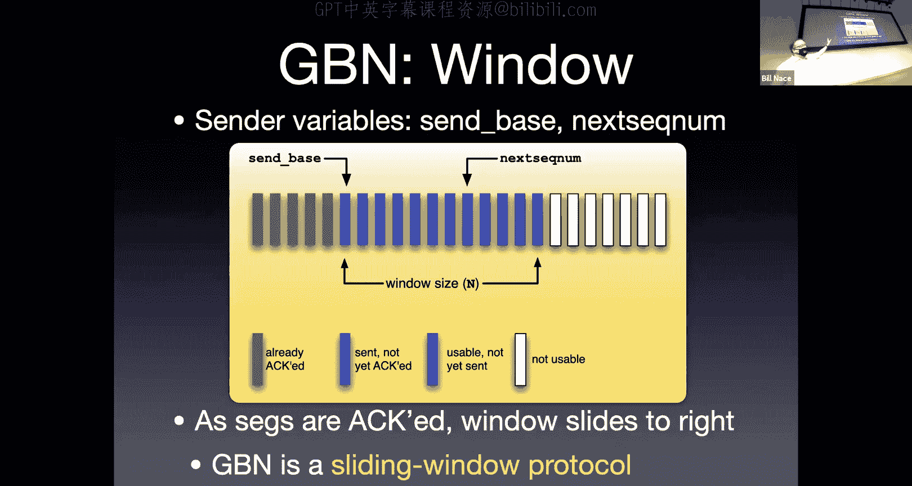

And so here we go for a sequence diagram now for go back N。All right， now to my sender side。

 I'm going to send some segments， hey， here's segment zero， here's one， here's two， here's  three。

For some reason， segment 2 goes missing or gets killed or something， right， runs into the bit bucket。

Okay， but segment zero goes through， the receiver will receive segment zero and will retransit I'm sorry。

 we'll transmit an acknowledgement coming back。It'll say， hey。

 I'm acknowledging that I got segment zero segment one comes through， let's acknowledge that。Okay。

Segment 2 does not go through segment 3 does。Okay， what does the receiver do when it gets an out of order segment。

 it discards it。Okay， that's what throws that away。 And it will re acknowledge。

What it is already acknowledged， It has already acknowledged up to one。

 so it's going to resend the acknowledgecment for one。Okay。

 and then let's see the center waits around a little bit。Now why is it waiting？

We don't know specifically， we have two good guesses， though。Okay， it could be。

That our window is only4。And so I sent off 0，1，2， and 3。 I'm not allowed to send any more data。

So I go ahead and stop here。It's also possible that my window is eight。

 but I only got enough data to send four segments。Same prettyt much the same answers as the previous slide。

OkayWhen we get an acknowledgement for zero， we go ahead and slide the window over。Okay， oh， great。

 We're done with segment 0。 Let's slide the window that now。

This is more evidence now that my window is of size 4， right， because as soon as。

We get that acknowledgement， we're able to actually send another segment the same when I get the acknowledgement for one。

 I slide the window over， so my send base is now two and my window size allows me to send segment five。

Okay， all of which when they get over to the other side， are discarded。

And you can imagine the frustration on the receiver's side if we could anthropomorphize them， right。

 the receiver's like， dude， I told you， give me give you know here's acknowledging one， give me two。

 I'm acknowledging one， give me two， hey， no I don't want five， give me two。

Okay that happens eventually， right， my timer eventually goes off。We go ahead and retransit segment2。

And all。Of the segments above it right so if you go back to a couple slides the rules on the sender when the timer goes off。

 we retransmit two， and then we also resend three， four and five。Why do I send three。

 four and five again because I know that the receiver discarded them？So I have to retransmit them。

Makes sense。Alright， so G BN， yeah， has some good parts and bad parts， right， The good part is， well。

 this is that rationalization again。 Yep， minimum state at the receiver。

You're not actually having to keep around segments。That can't be delivered。 right。

 So from the receivers side， you can imagine the receiver needs enough buffer to space to keep track of one segment。

 Again， I think that's a little spurious in this day and age when。Actually。

 our networks have too much memory in them， not the lack of that。

And that's the part that bothers people usually about this protocol Wait a minute。

 I just did all this work。To get a segment from one side to the other across the network。

 And you're going to throw it away。Okay yes， that's exactly what's going to happen。

 we have this waste Anytime there's an error right。

 we saw a single error here that had a problem with segment2 and all of a sudden we're throwing away a bunch of stuff retransmiing a bunch of stuff。

 Yes， the protocol is not perfect， What did the protocol do。

 The protocol showed us how to use a window。S us how to use cumulative acknowledgeledments。

Go us familiar with this idea， and frankly， it is a protocol that works。

The protocol will transmit data and it will do it better than stop and wait。

Even though there is a lot of wastage。We're not wasting time， we're wasting some network usage。

All right， so let's fix this up a little bit。With perhaps a better version of our sing window。

This is the selective repeat protocol okay and so this one feels better now the receiver is going to individually acknowledge each of the segments it receives。

 which means it can keep segments around even if they are out of order。

So that means it will buffer them， it has to have memory for each of those。

The sender therefore knows that the receiver has copies of those segments。

 and so it does not have to retransmit whenever there's a failure。Okay。

 it'll still go ahead and use a timer to detect loss of each of the segments individually and we'll still have a window which will do the windowing thing。

 it will keep keep us limited to n number of segments that we actually send off at any point in time and number of unacknowledged segments that have been sent。

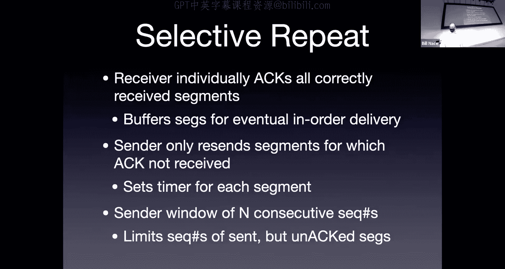

So here's another picture now enhanced for selective repeat peak。Up at the top。

 we see what the sender is saying， Okay， the sender has sent off a bunch of segments。Okay。

 it now has a window of which some of them are purple， Some are blue。

 This looks a lot like go back in， except now we have， look at that。

 They in the middle of the purple。 We have three greens。

What' does that mean those segments have already been acknowledged？Under Go back in。

 we could never have a scenario like this。We could never have a scenario where some segment has been acknowledged but the segments before it have not。

 that's because in go back in we were using cumulative acknowledgement here we do not have a cumulative acknowledgement here we have an individual acknowledgement each segment is individually acknowledged。

Once again I've got some blue ones there， I don't know whether it's because we're in the middle of transmitting and just haven't gotten to them yet or whether my application is not giving me data yet。

Okay， and then I have。Some white ones on the side there those are not usable right again。

 I might not have data for them， but if I do have data I'm not allowed to send it anyway because they're outside the window。

Okay now。The receiver turns out， has a different view of what's going on， this shouldn't surprise us。

It takes a while for things to happen in the network。And。

So the thing that's happening at the center does not instantaneously occur to the receiver。

 the receiver has to wait for segments to travel across the network before it can see the effects of those segments。

And so it has a different window。Right， you'll notice its receive base is different from the send base on the sender。

 That means the receiver has already received and acknowledged。Some of those segments。

That are purple in the sender。 What's that mean， How can that possibly be。

 We've already acknowledged them， why。Does the sender still think they are unacknowledged？Yeah。

 that's exactly correct， right， An acknowledgement is in flight。

 The sender has not gotten that acknowledgeknowgment yet。Or the acknowledgement has been lost。

And we're going to have to deal with that。I have， you'll see in the。Well， in the receiver window。

 I also have some that I have received and and acknowledged and some I haven't。How could that be。

 how could I have like that one there at Re base， it is still is shown as acceptable I'm willing to take that segment。

 but I haven't seen it yet。系。How do I know， by the way， other than the color。

That I have not received that segment yet。What happens when I received that segment？

 I wish I had a pointer， the segment that is at receive base。

 the very first of those light beige ones。What happens when the receiver gets that one？

Assuming it's correct。We're going to move the window over right。

 and so therefore because the window is here， it means I have not received that one yet。

How could I have not received it？ The senator has sent it。

Clearly it's one of the purple ones we've already transmitted。What might have gone on there？Yeah。

 it could have been could have been bad， right， had a bit error。Okay， so we did not accept it。

Could have been lost entirely right， or it could be in flight and the network reordered the segments and managed to get me those dark brown ones。

Before this one。Okay， and if I just waited around a second to draw the picture。

 that one would show up。Okay， yeah， that things can happen out of order。Okay。

 so we've got stuff happening。One center receiver， it's really important to understand that we're going to have different views of what's going on。

 And that's one of the reasons that the protocol rules are so important to spend time thinking about we as。

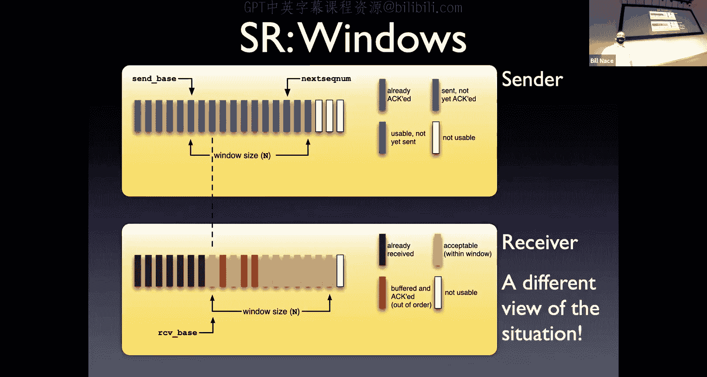

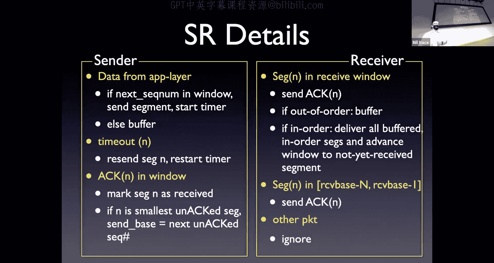

Designers look at this picture and we understand what's going on everywhere in the network where we think we do。

Right， the sender and receiver do not have that that kind of Gods eye view of what's going on。

 They only know what's happening locally。

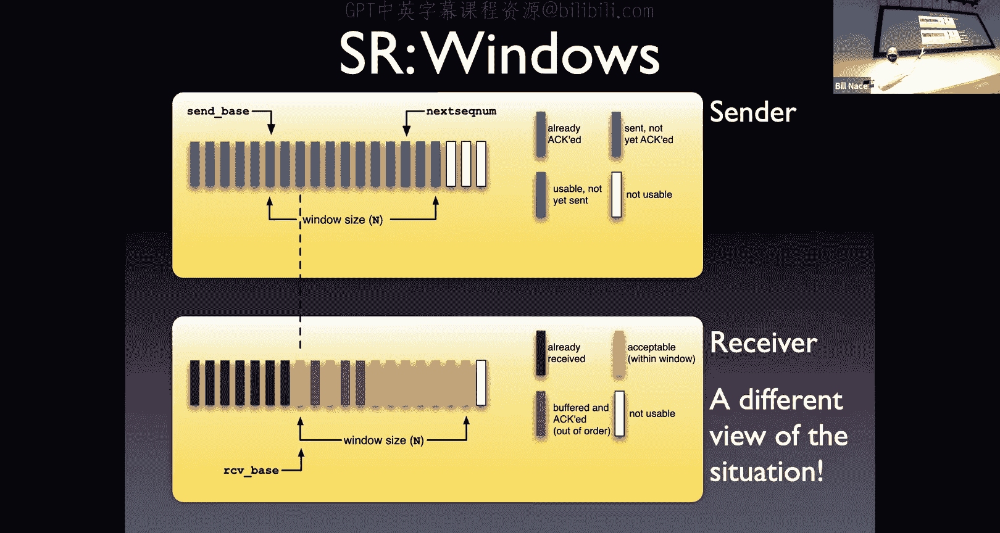

And so the protocol has to be able to handle what they know。

 not what we know seeing the whole situation。So here are the details， right？

The sender has rules right whenever he gets some data from the application。

 he's going to make segments out of them。 He's going to put sequence numbers on them， right。

 He's going to set a time or send it off all the tools we know。When that gets over to the receiver。

 when the receiver receives a segment。It's going to acknowledge that particular segment。

 assuming it's a good segment。Right， if it's out of order， we're gonna have to buffer。

 We're gonna have to keep a copy of it。So that we can eventually put it in order if it is in order。

 it may be the one that filled in the space， right。

 so I may end up getting that that one at the very beginning of my window。

 And when I do I now will have two segments that are in order。

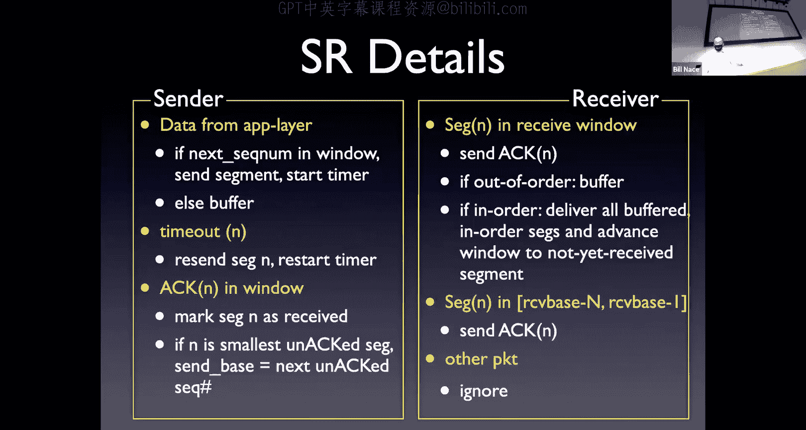

I will deliver the data from both of those to the application and slide my window over。

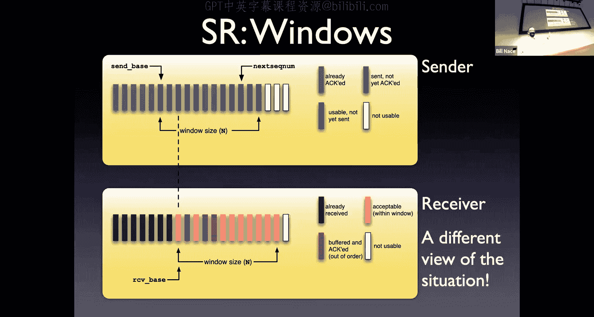

Okay， so that's what's happening in that。Third bullet on the receiver's side。Back on the sender。

 if we get a timeout， that means we lost something。

 we don't know whether it's an acknowledgement or the actual original segment。

 but we're going to retransmit regardless。We're going to send the exact same segment with the same sequence number。

And we're going to set the timer again。Whenever I get an acknowledgement。

 I'm going to mark that segment as received。And that may give me the opportunity to move the window over as well。

This one I like。 This one would not have occurred to me on the receiver side。

 that second big yellow bullet。If I was just writing this protocol。

 that's one of the subtleties I might not have noticed and it's one of the reasons that as our protocols get more and more and more complicated。

 we actually do more and more to verify that there are no corner cases。

Here's what might have been a corner case。 if you get a， if the receiver receives a segment。

That is in the range， receive base minus n to receive base -1。 What do I mean by that？ Well。

 what happens if I receive a segment that is one of those brown ones on the left。

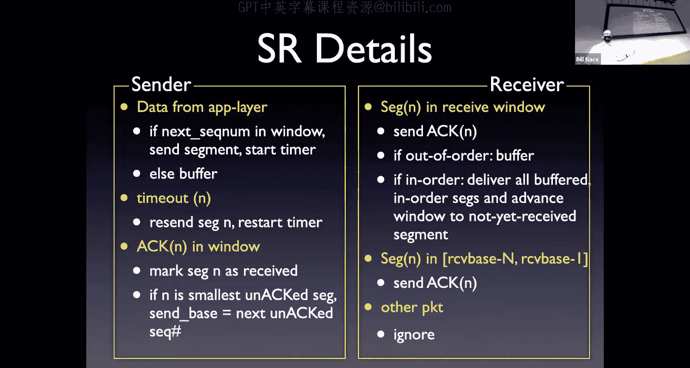

That's outside the window。 what， that doesn't make any sense。 Why would I be getting that。

 I'm expecting stuff in the window， right， I've already acknowledged everything。

And that's how I moved the window over。 So why would I be getting those segments again。没。

Something I lost， right， Something went wrong。 My， in this case， almost certainly my。

My acknowment going back got lost。 And so the sender sent it again。

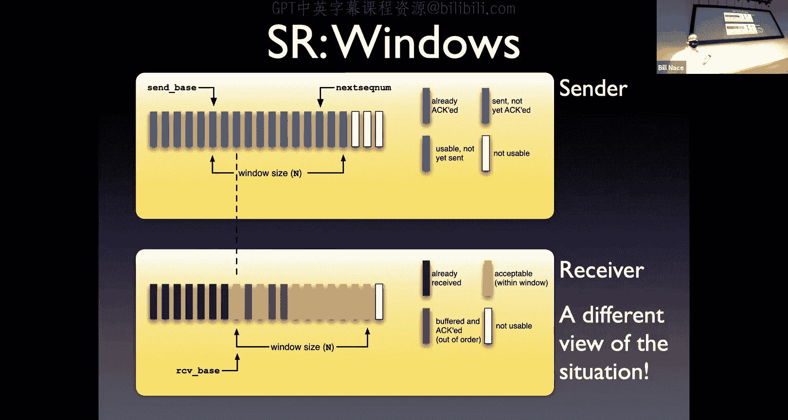

Okay， what should I do about it？The protocol says I need to acknowledge it。

Why do I need to acknowledge it？It's outside my window， right， I've already gotten this。

 been retransmitted。I have to acknowledge it so that I can move the sender's window over until the sender gets an acknowledgegment for that segment。

 And he hasn't。 otherwise he wouldn't have sent it to me again。Until he gets that acledgment。

 his window is not going to move over。 And so we could， because an aknowledgment got lost。

 actually get wedged。Where he's not going to send stuff to me and I'm not acknowledging the stuff he's retransmittting to me。

Anything else we're going to go ahead and just ignore？

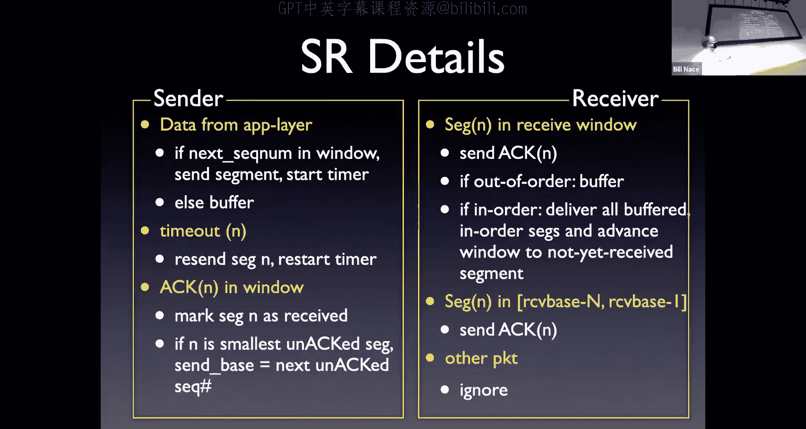

And so we get pictures like this， oh man， I'm out of time。

 I'm so sorry I didn't even look at the time。Yeah， I am very quick if you can hang on for two more minutes。

 we'll finish this up。If not， go off and disappear and watch the video later。Okay。

 so here's my sequence diagram for our selective repeat going on and I have a in this case I'm specifying I have a window of 0123 and you can see I send segment zero I send segment one。

 I send segment to I send segment three， my window stays the same。

because I haven't received any acknowledgements， I can't move that window over once skin segment two gets lost for some reason that's always the bad way。

The receiver， when he gets segment zero， goes ahead and acknowledges it， when he gets segment one。

 acknowledges it and those acknowledgements when they come through。

 they will move the window over on the sender。OkaySegment two is lost。

 so it's not till the timeout goes off that we actually resend that and so for a while our window is going to get stuck at two。

We transmit four and five， but I can't go beyond that until I get any acknowledgement for two。

 I can't get the acknowledgement for two until I retransmit it。And so that window gets stuck there。

That's okay， that's the point of the window。There are some issues。 Okay。

 so just real quickly to show you a scenario of kind of shortened things up a little bit。

 In this case， I have a three segment window and you'll see up the top， I send segment 0，1 and 2。

They get received。They get acknowledged， but all the acknowledgecments get lost。Okay。

And so after time out amount of time， we're going to retransmit segment zero right。

 everybody would agree that's how selective repeat works。Okay， different scenario done at the bottom。

 I send segment  zero1，2 and three， Okay， I they all get acknowledged zero1 and two get acknowledged Okay。

 we re transmitmit segment three。OrI'm sorry， we transmit segment three because the window moved over。

 but that segment gets lost。Okay， I also transmit segment zero because the window moved over。Okay。

 another scenario， will you agree that's how selective repeat works？Here's the problem。

 if you are the receiver on these two pictures， you see the exact same sequence of actions。

If you are the receiver， you get segment 01，2 and then segment  zero again。

And you can't know that these are different scenarios and even worse that the segment0 is a different piece of data。

Up top， it's a retransmission down bottom， it's not a retransmission。What this telling us。

 this telling us， this is telling us that we're reusing sequence numbers too quickly。Okay。

 I that segment there on the bottom should not be segment 0。 It should be segment 4。Okay。

 I have a window of size3。I need to be able to actually specify more than just three segments。

 There's a relationship there that we have to worry about。

 If you think about this view of the center and receiver， both having their own idea of the window。

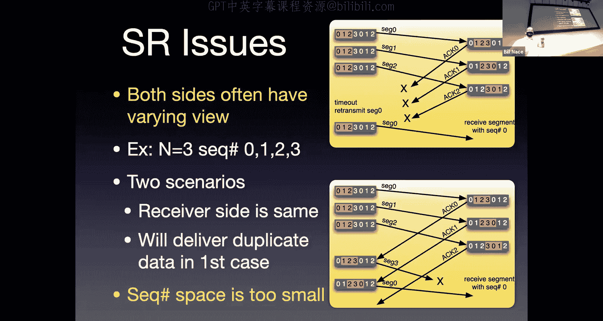

This tells us at worst case， I could have the windows that are almost completely not overlapped。

Where the sender has sent a bunch of stuff which has moved the receiver window over。

But because the acknowledgecledments haven't gotten back or something like that。

 the center's window has not been moved over。And we need to be able to distinguish between all of the segments in the sender's window and all of the segments in the receiver's window as different segments。

So they need their own sequence numbers， so I need enough bits to cover two full windows worth of segments。

咁。All right， that's the end of。Selective repeat， I want to point out that the textbook author has a couple of applets at the textbook's website where you can watch。

You know you get little segments moving back and forth between a center and receiver and you can click on them to kill them and you can make them go fast or set timeouts and things like that and so you can explore how these applications actually work。

Today， what I' wanted you to do is I want you to learn a couple things about the tools。Okay。

 we're going to throw away our knowledge of the protocols well we're not going to throw it away because who knows。

 make show up on a test someday。We're going to recognize that those are academic protocols that taught us how these tools work and next lesson we're going to look into TCP that we'll start using these tools so we need to recognize we have acts and acts right those are designed to provide feedback when the receiver gets a segment he sends us one of these to tell us what happened to that original segment it's feedback and that's great。

The problem is now I have something else that can get lost。Okay。

 so there's a good and a bad to this tool。The retransmission timer， right。

 the retransmission timer's job is to detect a loss。

It helps us know that something went awry not we don't know whether that's the original segment with data in it or the feedback coming back。

 but we know something went wrong so we should probably retransmit stuff。

The bad part of that is now I'm retransmitting things， now I have duplicate segments。

Because I've sent the same data twice。So therefore。

 I need some sequence numbers to put on them right the sequence numbers allow the receiver to tell that these are the same or different sequence segments。

Right， oh， this is segment 87。 I've already got 87。

 It's an easy check to know that this is duplicate or not。

 problem with that I I have to be careful about the number of bits I use to keep track of those。

 I have to be able to distinguish between all of the potential segments that we are actually transmitting。

Okay，The sliding window itself， this idea of a constraint on the spender。

That is there to constrain us to keep us from sending more than bandwidth delay amount of data。

 and it allows us to actually send a lot of segments and keep track to them。

And that's fantastic really its main use is this one。It lets us reuse the sequence numbers。

 right it lets us know when we're done and so that we can use those again so that they can be detected as new segments。

Okay。And with that we're done， I'm so sorry that I kept you for extra 10 minutes。Tell you what。

 Let's take Thursday office， as a way to， to make up for that。 Okay， I'll see you all next week。

 We'll dig into the TCP， start learning how it works in in real life。 Al right， have a great week。

 everybody， Bye bye。😊。

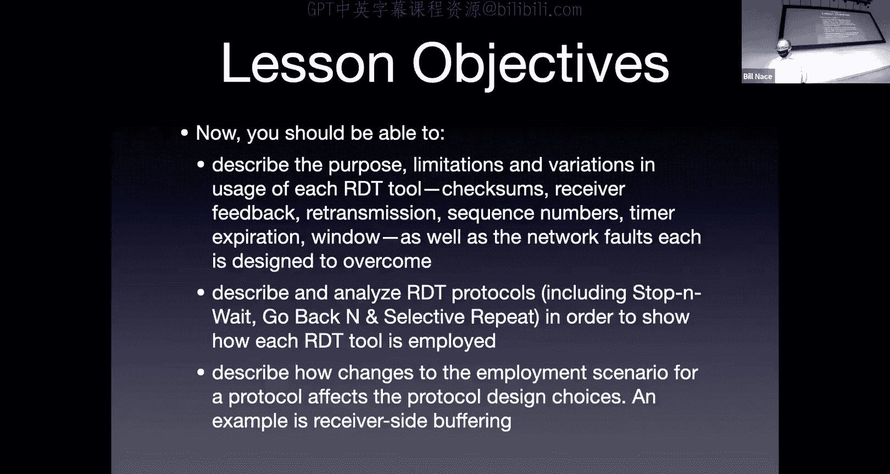