# CMU《计算机网络基础｜CMU 14-740 Fundamentals of Computer Networks 2020》中英字幕（deepseek p11 -P11-2020_10_13_Lecture11.zh_en -BV13J6uYpEZm_p11-

This is 147，40。Welcome everybody。Glad to see you all back。

Today we're going to get started on what is definitely the most complex of the protocols we're going to attack。

In this class and that。

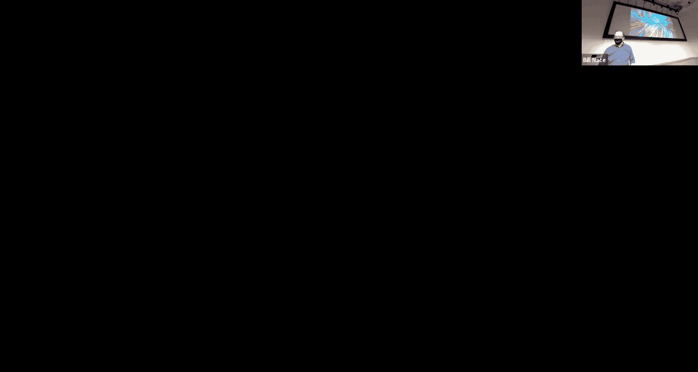

Partially because it is a super popular protocol and also one that does a lot of really good work and is very optimized。

 and so。

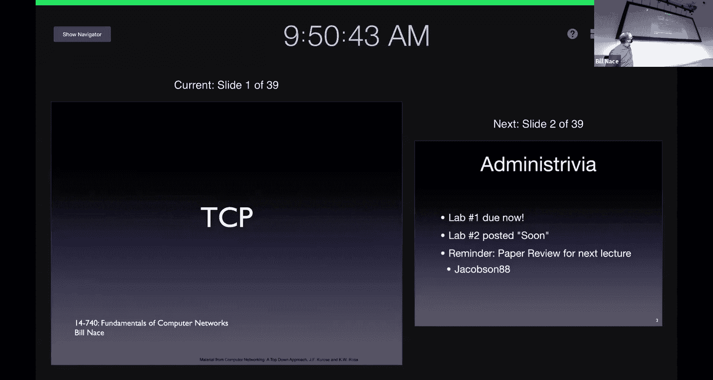

There's a lot going on with it and it's super important for us to learn about it。

 and so we're going to spend several lectures talking about several different aspects of this particular protocol and that protocol of course is the transmission control protocol TCP。

Before we get started though a few administrative notes， hopefully everybody got lab one in on time。

 La two is due， I don't know， something like two weeks from now。

 I will get it posted in the next day or so still got a few polishing things to do on that。

 hopefully detect some of the problems early that we had stuff that we had with lab one and get those fixed。

And also， we have a paper review coming up。 So be careful about that one after that。

 we'll have a little lull for a while。Before we get into more stuff。

It's been a week since we last talked and so。It's helpful maybe to think back and remember what we were doing then we had covered a bunch of these tools in some academic protocols so that we would understand how the tool is used。

Okay， and today， we're going to。Obviously see them in TCP that was kind of the point of all that was so that when I say something like。

 oh， there's a retransmission timer on it， you understand the implications of that because you understand how that tool works and how it is used and so put in the context of a complex protocol like TCP。

There's less of a learning curve for this particular protocol， even though there's a bunch going on。

So we'll talk a little bit about what TCP is and then its formats and how you get started and how it does what it's supposed to do。

 which is the reliable data transfer。So if I were a salesman and I was trying to sell you on a protocol。

 this is kind of the brochure bullet points that I might bring out and say， oh。

 you should be using TCP because TCP is a point to point protocol。

 that means it connects a single sender and a single receiver。

 it may not have occurred to you but there are protocols that do more than that。

 there are multicast and broadcast protocols that would， for instance let you send a single message。

 but have it received by many people， I don't know that Zoom is doing something like that。

 I think it's straight UDP， but you could imagine for instance that that my computer sending frames to all of you could be done through some sort of multicast instead of me having to set up a separate connection with each of you。

The main bullet point of course with TCP is it reliable it's going to do use all those tools we talked about last time to make sure that you get your data。

 that you get it in order， that you get it once。😡，That you know， everything that is sent is received。

 That's what's happening with TCP and a lot of。The complexity that makes TCP is because it has to use those tools to fulfill that mandate。

It is an in order by stream now that also seems obvious to us today because we're used to。

 for instance， our file structure doing that right when you write a bunch of。

Bits to a file or to store them in lots of places you expect， well。

 I just have you 27 bytes here they are kind of thing if you look back in early computing history。

 that's not always been the way we've set things up in many cases our networks were set up to send records of information And so you'd say。

 oh， this is how big a record is going to be think like a payroll record for an employee and then let me send a bunch of records。

Of those sizes。TCP has none of that okay you're just sending here's B number zero。

 B number one follows flight number two。Doesn't matter how many bytes you send at a time or what their structure is。

 you manage that at the application layer。It's also a pipeline protocol。

 it uses sliding window algorithms to optimize the bandwidth。

 to let it use all of the available bandwidth。In that kind of， you know。

 whatever our bandwidth delay product is that we should be getting close to that amount of data in flight at any point in time。

It is a full duplex data stream that means that sender and receiver both can be talking to each other across the TPCP connection both at the same time。

Again， we're going to attack this as if it was UniIA。

 we're going to think mostly about a single sender sending to a receiver。

But recognize that once that's open， we're going to allow the other end to communicate back to us as well。

 which is often what we want with。You know， for instance， client server computing。

 let me connect my browser to that web server over there。

 let me send HtTP requests and let the server respond with HtTP responses。Yes。

 that could be done over two separate connections， but why go through the troubles of making sure there two happens if I can connect to him。

 but he can't connect back to me， let's just have a single connection and that's how TCP works。

It is also connection oriented again， this is not something you typically are headed towards you're not writing your application and saying oh。

 I wish I had a connection oriented protocol， this is more of a result of the fact that we have a reliable data stream and that both sides are going to have to have synchronization of some data like what the segment number is and how much stuff has been acknowledged and so that means we end up setting up this connection between us。

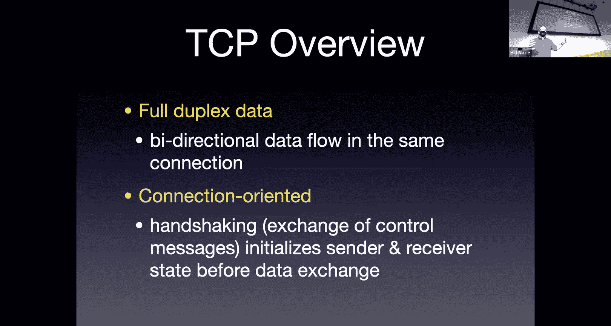

One thing to keep in mind always with TCP is that there are a lot of buffers going on。

And a lot of what TCP is doing is managing those。 And so I've shown this picture just to kind of set the stage for where we are in the transport layer。

We're getting data from an application， so on the sending side that's on the left side of the picture。

 right the application every once in a while has data to send。Right， at its。You know。

 it's not scheduled。 It's just whenever it feels like it。 In other words。

 whenever you press a button or whenever you do something。Perhaps。

The application has some data that it's computed and it wants to dump it into TCP。

 and there are no bounds on how big that data is or when it shows up。

And so it may be that TCP just is sitting around and all of a sudden here's this big data dump and it has to have a place to put it so it's going to have to have some buffer。

To manage because it can't just take， oh， you have a gigabyte file。 Now I need to send that out。

 right， It's， it can't send it all in one piece。 It's going to have to buffer it until it can get rid of it all。

 And so it's going to be managing a send buffer with all this data in it。Notice also。

 I've included the socket。We talked a little bit about it。

 I think in response to a question last time， the socket is an API that is commonly used。

to do the programming of the transport layer。It's not the only API and frankly it doesn't， I mean。

 it's popular because it was the API that was used in the very first TCP。

Implementations and therefore through the years it has become the one people。Youth。

 I was about to say the one people love， but nobody loves sockets。On the sender side。

 we also should recognize that there's kind of a buffer in the network。

There is a limit to how fast you can send the segments and the bandwidth delay product tells us there's a limit to how many segments we can send and so we can think of that as if the network is a buffer that we have to manage as well。

And then on the receiving side， the receiver is also in this asynchronous situation where it's kind of sitting around and every once in a while the network says。

 oh， here's another segment for you， here's some more data for you。

And the receiver can't just take that data and force it on the application。😡。

The application code is running， doing whatever it's doing。

 it's rendering pictures or computing big things or talking to databases。And every once in a while。

 that application will come around and say， oh， by the way， TCP connection。

 do you have any data for me again through the socket interface？

And so that means that the receiver actually has to buffer this data。

 has to have a way to take these segments as they come in and store them someplace。

So that when the application comes around and scoops it up， it can say， okay。

 now this is your responsibility I'm done with it， but it has to hold on to it for a home and this means we have these kind of producer consumer problems where producers are creating things at different speeds and asynchronously compared to the consumers。

And so we need to manage those properly so that we don't lose data or think the data is duplicated or anything like that。

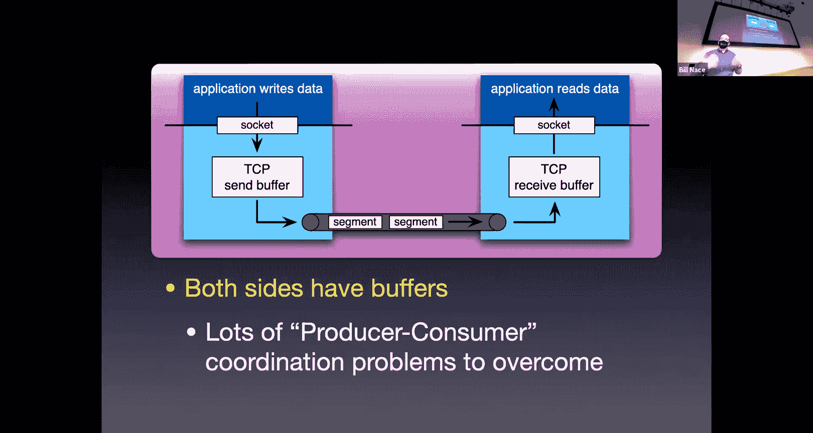

There is also some transmission control to handle this。

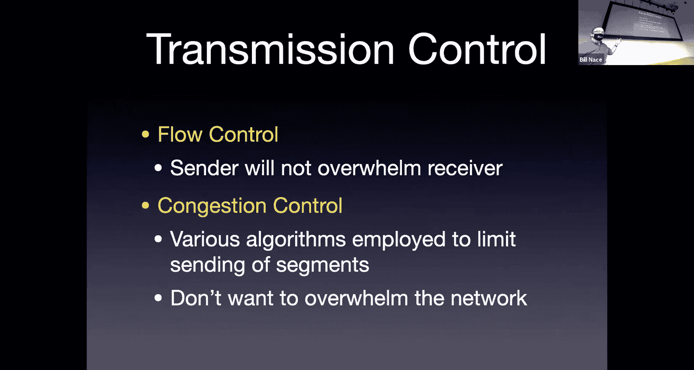

And so these are aspects that are there because of these buffers。

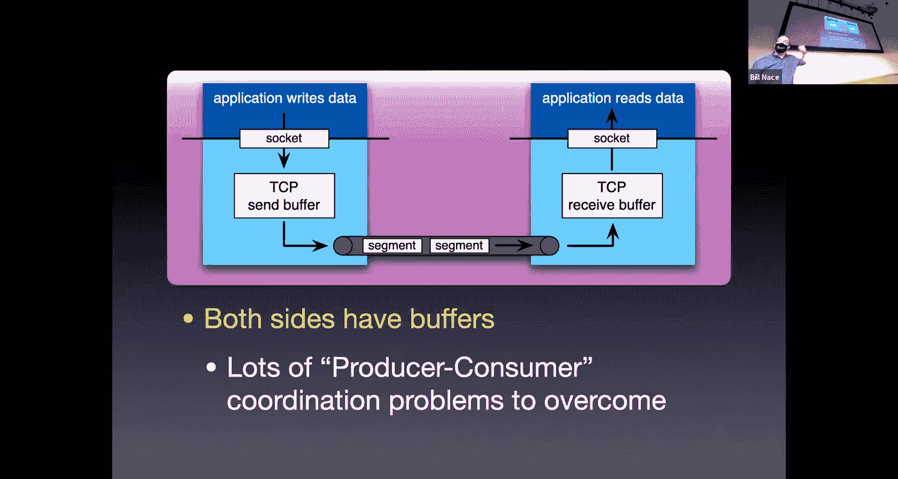

The first one is flow control。Flow control is to manage that receive buffer on the receive side。

 we want to make sure that the sender doesn't send so much data that that gets overwhelmed。

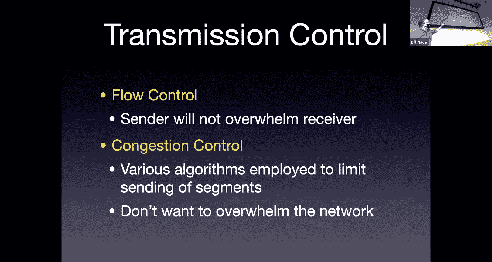

And so we have to make sure。To restrict the sender in a way so that they never give us more data than we can hold on the receive side。

And then the congestion control is a mechanism because the network has an inherent amount of data it can hold。

In its kind of buffer， which is a distributed buffer across all the routers of the network layer。

 but at the transport layer we don't know that。We just know there's a network layer underneath us。

And so we need to be able to control ourselves to keep from overwhelming a buffer that's in some router somewhere。

And so we use congestion control algorithms to make sure that the sender does not send too fast to overwhelm anybody else we will talk about congestion control next time as well as a couple other future lectures out there that's a very interesting and very complex topic that deserves its own own work。

All right， so what's the protocol look like？As we've seen before。

 every protocol has its own data format to be able to figure out what the bits mean and tCP is no different from that we have another fixed size。

Or fixed format to our segments and， and look at all those boxes we're going to fill。

 The header for a TCP segment has lots of information。

Because there's a lot of this kind of communication we have to have and a lot of places to keep track of some variables and send those to the other side。

 and so that's what all those boxes are all about。And we're going to fill them in with fix with things。

It starts off。Kind of almost it's trying to lull us into a sense of complacency， right。

 It starts off with something we know。We've got some port numbers。

 a source port number and a destination port number again。

 I'd like to point out this is TCP's addressing scheme。Okay。

TCP chose to have 16 bit source and destination ports。

It's not that transport layers require you to have this kind of port。

 it's just those numbers happen to work。😡，4 TCP and since the same guys who are designing TCP were designing UDP。

 they ended up with the same place， but they didn't need to right those could have been 32 bit values。

 they could have been character strings or something like that。

 they happen to be 16 bit values that are handled exactly the same as UDP with some well known port numbers for services you know our web servers。

 port 80 or 443 things like that。Next up， we have 32 bit sequence and acknowledgement numbers。

Okay these are the numbers that we used for the reliable data transport right we needed sequence numbers。

 what was the point of sequence numbers。对对。It helped us detect duplicate segments right if I'm the receiver and I receive a segment with a number in it。

I can immediately tell whether I've seen this before or not。Okay。

 because I can look at that number and know something about it。 Those what。

 that's what those are for。 And there's the sequence number is one way。

 and the acknowledgement number comes the other way。Okay， so sequence number is going tell us， hey。

 this is。Oh， it's going to work a little bit differently than we learned last time were not going to be numbering the segments。

 So I don't send segment 0， then segment 1， then segment 2。Instead。

 we're thinking about the data that we send as this byte stream。

 so we have byte number zero that gets sent on byte number one， Bte number two。

 the sequence number is actually the number of the first byte in this particular segment。

So I might send segment with a sequence number of zero， and if it has 100 bytes in it。

That means that those bytes are numbered  zero through 99。

And that means the next segment I send would have a sequence number 100 on it。Okay。

 so they're numbered by bytes， not by segment number。The acknowledgement number coming back。That's。

A form of receiver feedback， right， The receiver is telling the sender， hey， I've gotten some stuff。

And so that acknowledgement number is a cumulative acknowledgement right you recall from the go back in protocol。

 right， we use cumulative acknowledgegments to basically say。

 I've gotten everything up to this number。And again， this is in bikete count。Not in segment count。

And there's one other slight difference here。And that is that this acknowledgeledment is not an acknowledgegment of the bite that has been received。

But it's the next number， basically one more than that。 It is the number of the next expected bite。

So if I got a segment coming back that had an acknowledgement number of 100 in it。

That would tell me that the receiver has received everything up to B number 99。

And is expecting that I send segment with the pipe number 100 in it。

 which would be a sequence number of 100 in it。At some point in the future， does it make sense？

So a couple slight differences still performing the same function doing the same job as the sequence numbers we talked about last lecture。

Let's see next up is a flag field。That next 16 bits includes a length field。

 what were the two questions I always told you you have to ask if you see a length in a protocol。

What is it include， right， What's at the length of Is it the length of the header。

 the length of the data or the length of both。 Okay， And in this case， we've got a header length。

 It's one of the reasons we put that in the name is to kind of remind us of that。

 We are gonna measure just the length of this header。 And you might look at that and say。

 why do I need to do that。 That's the header right there。 Why do I need to know how long it is。 Well。

 it's because that options field at the bottom。May not exist。Okay， or it may have some length to it。

 It could be different sizes。And so we need to know how big that's going to be。

Or the receiver needs to know how big that's going to be so they can figure out where the start of the application data is。

Okay， this， what's the other question asked that you need to ask？Where are the units？

What does the bit value in there represent？😡，So here I have a four bit value and it represents the number of words in the header。

 the number 32 bit values in the header。Okay， and so that means if you look at basically each。

Row of my picture is one word。You can see that we have five words plus adoption field。

So it means the header length is never going to be less than five。Okay， and it's a four bit value。

 which means it could be as big as 15。So that means I could have 10 words worth of options。

Included it， and I'll know that because of this header field or header length。点 know。But just start。

So Dion is asking a very great engineering question I don't know the answer to that okay we yeah we could have had so we have a restriction on the size of the options field right the options field is either zero through 10 bytes we could have gotten a little bit more we could have let it go up to 15 if instead of using those four bits to count the five words that we always have let's just go ahead and make that a length of the options field instead。

And we could that could have happened。I don't know whether there were technical reasons。

 but I'm not sure I understand them if there are， or if nobody just really worried about it at the time。

So but that's where we are and it's a header length， always going to be five or bigger。There are。

A couple bits there I'm calling not used。😡，OkayThere are RFCs that specify uses for those。

But they're commonly not employed or they're employed in only certain circumstances。

 and so I'm calling them not used。Okay， but again with all things networky。

There's a little asterisk next to that， but for our purposes， it's good enough to say， yeah。

 just never use them。The next thing up are those flags and there are six of those flags Okay so a flag is a single bit value that acts like a flag。

 it's either up or down right you run a flag up the flagpole to signify something like oh， it's day。

Or you take it down to signify nothing same thing with these bits， you have a one or a zero in them。

 and they tell you something boolean。Okay， and the things they tell you。Well。

 there are a couple of them there， Okay， first up。Well。

 I'm not going to talk about the first one first， I'm going to talk about the most important one first。

 which is the AC flag， the act flag tells us that this segment includes a good acknowledgement number。

And so we can't tell by looking at the bits in the acknowledgement field。

You can't just look at bits and know whether it means anything。😡。

There will always be 32 bits in that acknowledgement field。

 and it may be that the segment being sent does not actually acknowledge anything。

You can imagine the first segment that ever gets sent， right， It's going to have that header。

 It's going to have bits in the acknowledgement field。

OkayThe receiver needs to know pay no attention to those。

And so this bit tells you whether or not to pay attention to the acknowledgement field。

There are also three of them that help us do connection management。

 help us set up the connection and tear it down the S flag SYN stands for synchronize it's used at the beginning to kind of set up the connection we'll talk about that in a few minutes。

There's also a fI which is the other end of things， it helps us tear down the connection。

 helps us to signify that this is done， we're over with this。

 we're not going to send you some more data。And there's also an RST which resets the connection that's basically an error message。

It says， hey， all that stuff we've done before， we got to restart this connection somehow。Okay。

 so that yeah， that also may be some error like， you know。

 we'll talk about a couple of those as well。The two others there， the push and the urgent。

 those are not frequently used。Okay，They're specified in a couple protocols。

Push basically tells the receiver you need to get this data to the application as fast as possible。

Okay， now， unfortunately， the way our applications work， they're all asynchronous。

 So there's no good way to tell the the， you know， how do you tell the browser， Hey， browser code。

 I've got data for you。Okay， you do that by waiting for the browser to come back and check， usually。

 not by having like an interrupt mechanism to say， oh you're in the middle of drawing that beautiful gift on the screen。

 please stop that and come get some data。but that's the intention of the push the urgent is kind of the same way we're saying。

 oh look， some of this data is actually more urgent than others， you should look at it first。

And there's actually a way to kind of point into the data of the the payload and say， start here。

Again， we typically don't use this。So I'm not going to worry about too much about explaining it。

Moving on， the receive window， 16 bit value。Okayy， this helps with the flow control problem I described earlier。

 we want to make sure the send does not overwhelm the receiver。

This receive window field is a field sent by the receiver that effectively gives the sender permission to send this many bytes。

Basically the receiver is saying， this is how big my buffer is right now。

And it would be okay if you sent this many bites because I have a place to store it。

But don't send more than this。Otherwise， I won't have a place to store it。Next on is a checkum。

The check some algorithm works exactly the same way as the UDP check some algorithm does and in。

Practical use， oftentimes the checkum here is calculated in combination with an IP packet and often done by hardware。

 but the protocol specifies that you're going to fill in a 16 bit checkum value using the same math that you used that we learned in UDP。

There's an urgent data pointer， that's that pointer that I mentioned with the urgent flag。

Don't worry too much about how that works。And then there's an options field。好的。

You don't have a whole lot of space for that。Okay， you have a potential 10。Words 10 by 32。

 so 40 bytes of data can be put in there along with whatever control you would need to specify what option you are using。

There are a couple options that are。That you'll see out there， you'll see for instance， timetamping。

 so you could kind of do something sort of like trace route to tell you。

 you this I sent this at this time， what time did you get it sort of information？

There's some window scaling factors we discover。The 16 bits for the receive window in some scenarios is not enough。

Okay， so that， that receive window。That becomes a limit on how much data can be in flight。Okay。

16 bits means two to the 16th 64K of data can be in flight at a time。And in many scenarios with。

Bandth delay products。 that means for high bandwidth and long delay， think， for instance。

 satellite communication has a very long latency。 you want to be able to have more data than that in flight。

And so you can send an option that basically says， oh yeah， that receive window value。

 multiply it by four or multiply it by 16。Okay， so you can get more data in flight。And also。

 we can negotiate our MSS as well to discuss。How big that should be， M S， what is that。MSS tells us。

How much application data we can have。Okay， now you recall that we。We would like to send。

 I guess their competing engineering pushes here， right we would like to send as much data as possible in a segment。

Because that means that the bites we are sending as the header。

Which are overhead are used over more data and therefore we're more efficient。 right If I have。

 if I'm only sending a byte at a time， well， I'm sending all this header stuff plus one byte。

 that means I'm not using the bandwidth efficiently。 So we'd like to have bigger segments。

Do you know， however， we talked early on lecture two or three where we talked about segmenting right and we said。

 oh， it's really good in a storing forward network to chop stuff up into pieces。

And it turns out that the network is going to have different sizes for the allowable pieces。

 it's not just going to allow you to have as big a segment as you want。

Those sizes are all determined by the technology of the data link layer。So an ethernet frame。

 how big can it be， there's part of that ethernet spec says how big it can be。

 and that has an implication for how much data we can then put into this segment。

And we call that limit the maximum segment size。Now we got。

 I got to point out that it's not really the maximum segment size。

 even though it says maximum segment size， what we're actually talking about is the maximum application data size。

 the maximum payload size for my segment。Because the MS does not include the header of the segment。

Okay，And when I hear the word segment size， I think of， oh。

 that must be the size of the whole segment。But MS is not。

 MS is the size of the payload of the segment。 Okay now I'm going to calculate that based upon the fact that in that application data。

I'm sorry， the application data I send plus my header is going to have to fit。

 going to have to be encapsulated in a segment， I'm sorry in a packet at the network layer。😡。

Which is itself going to have to get put into a frame at the data link layer。

And the frame at the data link layer is the one that has a size limit。

 We call that the maximum transmission unit， or M U。And so that MTU， that frame size。

 actually that's the payload of the frame。That payload has to include my MS。

 that is my payload size plus a segment header， plus a packet header。From the network layer。

And so if I take MTU and I subtract out the packet header size and the segment header size。

 that will tell me my MSS how much data I can fit into this segment。patric。随便是个。know到来。是觉得问。Oh， so。

 oh， you don't actually know it from this from this protocol。

 you're going to be told by the network layer how big is the thing you're getting。

How big is the segment you're giving and you're going to subtract off the header length。

To figure out how much is left， I'm sorry for Zoom people， the question was。

 how do we know how big the application data is？And we can't from just the information I've shown here。

Yeah。All right， by the way， there's some numbers， 1460s。

 a very common MSS that corresponds to Ethernet， which has a 1500 byte MU。

So we've subtracted off the packet header size and the segment header size to get that。

But other values are available now just to make sure we understand this I got a quick question for you。

 let's imagine that I'm I want to send some file okay。

 and I'd like to know how big that file can be if I'm going to send it over TCP and so in this case let's imagine I have an MSS of 1200 bytes。

So 1200 bytes worth of data can fit in each segment。The TCP sequence field， as we've seen。

 is 32 bits。Okay， so based on that， how big can this file be？Anybody？

I guess I should actually have my chat window open so I can tell， sorry， chat people。就什么。Oh， okay。

All right， so some of you may be doing this math and saying okay。

 32 Bs2 to 302 is big number right it's what 4 billion or so and if each of those has 1200 bytes in it that's really big okay。

And you might also be recognizing oh wow， that means that the guys who made this spec back in the 1970s were imagining that I would today want to be sending you know a video of this amount of size over TCP。

 which would be really dramatic okay I asked this question mostly just to make you think about these numbers and then tell you that it's wrong that the thinking you're doing this is incorrect okay。

 this is basically a trick question。嗯。To point out a couple things， one is， of course。

 that that sequence numbers I mentioned earlier is based on the byte number in the stream。

Not the segment number。 So it doesn't matter how many bytes each segment would be holding。Okay。

Each I'm going to send out you know sequence number zero and then sequence number 100 if I just sent 100 bytes。

And then you may say， okay， well， that means I can only send two to the 324 billion bytes worth of data and you might say。

 okay， that seems reasonable but I'm sure some of you are sitting out there saying， wait a minute。

 I've sent more than that amount of data in the past at some point。

And it is true that that sequence number is a modular 32 thing， so if you happen to count too big。

 it just starts back over at zero。So there actually is no effective limit。

To how much data you can send in a single TCP stream， which is great。

 I think that's a fantastic engineering choice。That was made way back when to set this up so that you don't have a limit。

It'd be kind of annoying because I'm sure whatever if they had chosen a limit in 1970。

 they would have said oh， I can't imagine anybody would ever need to send more than 100。

000 bytes or something like that and we would have had to scrap the whole protocol。All right。

 so let's。Using this knowledge now of how the format works。

 let's see how we actually manage our connection， how do we get a connection started。

And how do we get it， how do we turn it off when we're done？

And what we're doing with this whole process is we are synchronizing information。

From the the sender to the receiver， we want to know that it's okay to connect to the receiver and we want to make sure this receiver has the same kind of view of。

The connection knows where the window is， for instance。That we do。

 And so that's the whole point of this， this initial process。 And we're going to then。

Also want to tear down a connection when we're done because we'd like to free up whatever resources are used to keep track of those things。

Another point I had not mentioned was the receiver is going to want to set aside a buffer space to store this data when it shows up and the receiver may have a limit on how much memory it has。

And so。You know， we want to make sure to use that properly。

 we want to make sure to initialize it when we begin a connection and then return that。

That pool of memory when we're done with the connection。

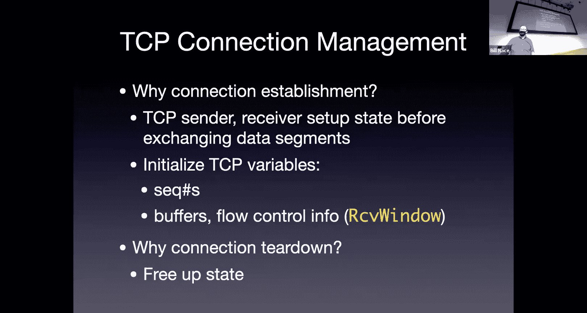

So we're going to start off opening the connection with what is known as the three way Handshake。

 which I think is a terrible name。I'm picking apart the names today for some reason。

MSS three way handshake to me， a three way handshake would mean there are three participants because you're handhaking three ways。

Okay， instead， we call the three way handshake because there are three segments involved。Okay。

 we still only have two participants。 We have a send and a receiver。

And they send back and forth these three segments to get things started。

And that's why we call it the three way handshake。We've seen touches of this before。

 I described it briefly when we talked about HTTP， this is the process we go through when we say。

 hey， pretty please， may I connect to you and get a response saying yes。

 you may remember that with HTTP。We're seeing the same thing here now just done。

 this is how the actual protocol does that。So we start off at the， I'm calling client。

It doesn't necessarily the sender， the originator of this connection。

They're going to go ahead and send that connection request。They're going to send a TCP segment。

 it's not going to have any data in it yet it's just going to be a segment header and that header is going to have the S flag set。

 remember the S flag was one of the six flags。SY N， the synchronization flag。

This is exactly why we have that flag。 I'm going to send a。Segment with that flag set。

And I'm also going to choose what we call an initial sequence number。

It turns out I have described sending， you know here is segment zero as your first one that says this is byte number zero。

 we're actually going to not start at zero or sometimes we'll start at zero。

 but we're going to randomly choose a 32 bit value to start with。That is my initial sequence number。

 So I could actually start off saying， you this， I'm going to start off。

 the first segment I send you is you know， by number 3042。

Okay I just choose some 32 bit number to make that。 and that's my ISN， my initial sequence number。

So I'm going to send that to the server。If the server is cool with me connecting to them。

Then they will go ahead and do whatever they have to do to set aside data structures。

 set aside some receive buffer space。To keep track of this。

And I'm not going to send a segment coming back。And that segment coming back。

 we call the S act segment because it has the S flag set。

Because it's part of the synchronization sequence。That's what that sin flag is for。

 It also has the acknowledgecment flag set。Because the acknowledgement number that it sends is good。

 is useful， should be looked at。And so it's going to send back a segment。Sin and act are both set。

The sequence number is going to be the server side initial sequence number。

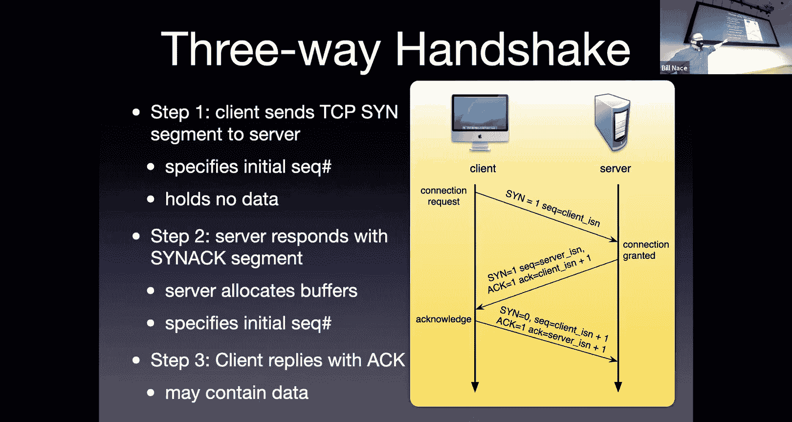

Remember， this is a bidirectional connection。And so we're doing the same thing the other way。

 We're choosing a random 32 B number to start with， as our first。

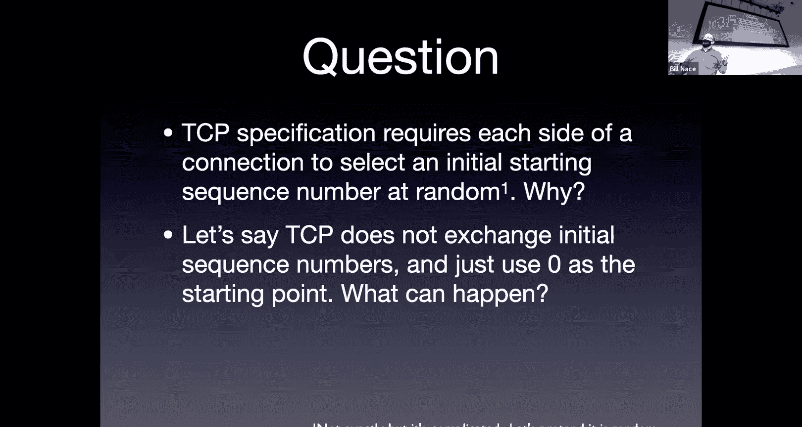

Sequence base。 So we。That one coming back is going to have some other random number in the sequence space。

 that will be the sequence number for data flowing from the server to the client in this picture。

And then the acknowledgement field， we're going to go ahead and。

This feels a little weird if you look at it too closely， so don't look at it too closely。

 that acknowledgement numbers just give me one more than the initial sequence number that the client said。

It's not that they actually sent data and you're asking for the next flight of data。

 it's just we always add one to that and send it back。So that's one， two parts of the handshake。

The third part of the handshake now is kind of like the client is saying， okay， I acknowledge server。

 I give you permission to respond back to me。And so we're going to send another one， this one。

 we're done with synchronizing。Okay， so the S flag is not set。

 Those first two segments are the only segments that the S flag is ever set for。

As for those first two。This one now， the syn flag to zero。

 I'm going to go ahead and use a sequence number that is one more than the acknowledgement number we or the sequence number we got last time。

So the server gave us the server initial sequence number。

We're going to use we're going to acknowledge that with one more than that。

 and we're going to go ahead and add one to our stream since he was acknowledging client ISN plus one。

 we're going to go ahead and number our data starting at client plus one。Okay。

 so what did I say a few minutes ago 3042， this would be bite number 3043 is my first bite in the stream。

And however many bytes I have， I just send them out。

This segment actually can contain data and usually does contain data。

Because the reason I connected was to send you some data。

Did all make sense？Yeah， cool。嗯。😊，So we've got these random sequence numberss。

 what's the point of those？Okay， why would I do a random seat and I got to admit。

 it's not technically random。Because we don't want to randomly choose the value we just used and so we actually control it a little bit more by counting and adding things and stuff like that。

 but let's pretend it's a random number。Why is that random what badness could go on， I mean。

 why not just always start at zero， be a lot easier to read these streams and not have to。

Subtract out that from how much data we're transmitting all the time。Anybody。Why not just use zero？

这是。So you're very close right what happens if I use zero as my sequence number and some other application uses zero as as a sequence number now I notice you're using application。

 which is great right because other clients， other machines could use zero sequence number and those would be distinguished because they come from network connect different network addresses。

Okay， and so we'd see those the receiver would see those as different anyway。

 but it's possible that there are two applications on my computer that are sending to the same server。

 okay and or one application using multiple TCP connections or something like that。

And what happens if the receiver gets a zero from both of them？Okay， in that case。

 we would end up using different port numbers。And so the receiver would still be able to distinguish them apart because the source port number would be different。

Okay。拿证据签出来。嗯。Okay， yeah， I love how I and I always goes to the security and the militias， right。

 That is true。 Some can predict the number。Again， not completely sure what you could do with that and。

 remember also designed in the 1980s that was before。

 I want to say before malicious players on a network or at least before people were all that defensive against them。

There's actually a much more。Mundne reason to not do this。 And that's because。

What happens if a segment is taking the long way around to get somewhere what they're worried about is actually I have a connection that I shut down and I immediately start another connection with the same server。

Okay， what would happen if a segment was just lost in a in a router and getting there slowly。Okay。

 and it showed up， you know。Again， it's not going to be too slow。

 but we imagine that the packets in the network can take up to two minutes before they die is kind of the official spec。

So if I reconnect to the same server using the same port numbers from the same IP address within that two minute window。

 it's possible that an old segment could show up and。

And mess up some of my data and be accepted as good data， and we wouldn't want that to happen。Okay。

 so kind of mundane。Reason for that。I should point out just because we start this three way handshake doesn't mean it has to be accepted。

It's very common， in fact， for us to try to open a port。

And we do that by sending this first segment right I send a sin segment to a server saying， hey。

 please may I connect to you， I'd very much like to send you to I'd like to connect to port 80。

 I'd like to know send stuff to your web server and that computer says， wait a minute。

 I don't have a web server running。There's nobody at Fort 80。 What do we do， Okay， Well。

 this is where we use that kind of error message。Instead of sending back a SN act which says yes。

 you can connect to me， we send back a segment with the reset flag set。

And that tells the sender you're done， you can't connect to me at that port number。Okay， by the way。

 we didn't talk about it， but the same thing can happen under UDP。But under UDP。

 I have no connection。Right I don't have nothing set up to make that we just sent some data to you the mechanism there is that an ICMP packet。

 which is a network layer error message， will come back to the sender if you do that if you try to open up a port that's not there。

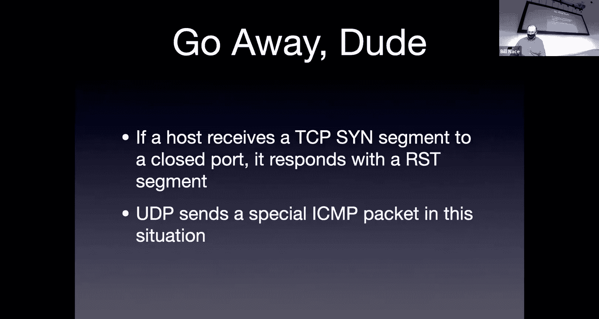

All right so we use the three way handshake to open a connection。

Then we send a bunch of data at some point we're going to be done。Okay and how do we close it up。

 we'd like to close it up nicely a， because you know our mothers taught us to clean up after ourselves when we' you know clean up our messes and this is one of those messes。

 we'd also like to release the other side from the obligation to hold any of the data structures or buffers that are associated with our connection。

Okay， so the way to do this is to go ahead and send a segment with that Fin flag set。

The fin for finish。Was there right is this is its purpose。If I ever send a segment with the fin flag。

 I'm basically saying， I'm done。 I will never send you any more data， after this point。Okay。

 and that will be acknowledged by the other side。Like to point out。

 we can close one side of it without the other side closing。

It'' possible for me to connect to a server。You know， to some application on some server and say。

 hey， you know， I want the stock market ticker for the day。

And please send it to me and then I close up I'm done， I finish。

 but that server is going to send me stock data for the next eight hours。Okay。

 and it can use the same TCP connection for that to happen， it is possible to close up one side。

 but not the other。From a protocol perspective。The server when they're done。

 when they're so typically once I connect and once I send a fin segment， the other side says okay。

 we're done， I will close my site as well， so we send an acknowledgement， we send a f segment。

I believe those two can be in the same segment， actually。And then we acknowledge that。

now it turns out。When both sides are done， that acknowledgement does not actually close the connection。

Instead， TCP goes into what's known as a timed wait period。And for some amount of time。

 that connection is technically still open。For 240 seconds。In that timed wait period。We will。

 the the purpose of that is that we will still respond to Finn。

Segments that come in with an acknowledgement。And when that 240 seconds is up， then we're done。

 the TCP connection is closed。Okay， now why do we do that What's the point of having a this time to wait。

 This seems like extra complication， wouldn't it be nice to just。Go in， be done with this connection。

 close everything up， close up shop。Go away。What do you mean stuff and in which buffer？翻得开。

There's a okay， well， if that's true， then I would not have sent a f right。

 if I had stuff to send I wouldn't。Have closed it up or if I for some reason did close it up。

 then I'd know that I can never send that data anyway and I throw it away。So no。

 the fact that I have data still sitting in a send buffer is not the reason for the time wait。

The 240 seconds should be a hint。240 seconds。Some small amount of time。嗯。

The issue is during this time period， I will have sent that acknowledgement back。

 but it's possible that that acknowledgement gets lost。

And what's going to happen then on the server side， the server tried to close by sending a f。

And then the server did not get an acknowledgement back。He's going to think， oh， that thing got lost。

A timer is going to go off。Because he's got a timeout on these on these。

 that timer expiration goes off， he's going to retransmit。Okay。

 and if we have closed everything up at that point。

 that means what we get is a f segment coming in to a port we or to a connection we never believe was open at that point because if we'd thrown away all our data then。

And even worse。What if I tried to reconnect to that server。And just sent us in segment to open it up。

 and now I get a fin coming back from it。Now that f from a previous connection would be interfering。

With this reopening that I'm doing and if you don't believe we never reopen。

 think back to the HKTP scenario as we talked about earlier。Where we were doing a lot of that， right。

 Oh， I just got a H file。 I closed out the connection。

 I recognize that now I need to get these 10 images to fill in the H file。

 Let me open a connection to the server。Okay， so this is not， I mean。

 this is a little bit of good engineering to make sure that's not going to happen， but it could。

 you know， there's a non zero non negligible probability that you would be reopening a connection to the same server you just closed。

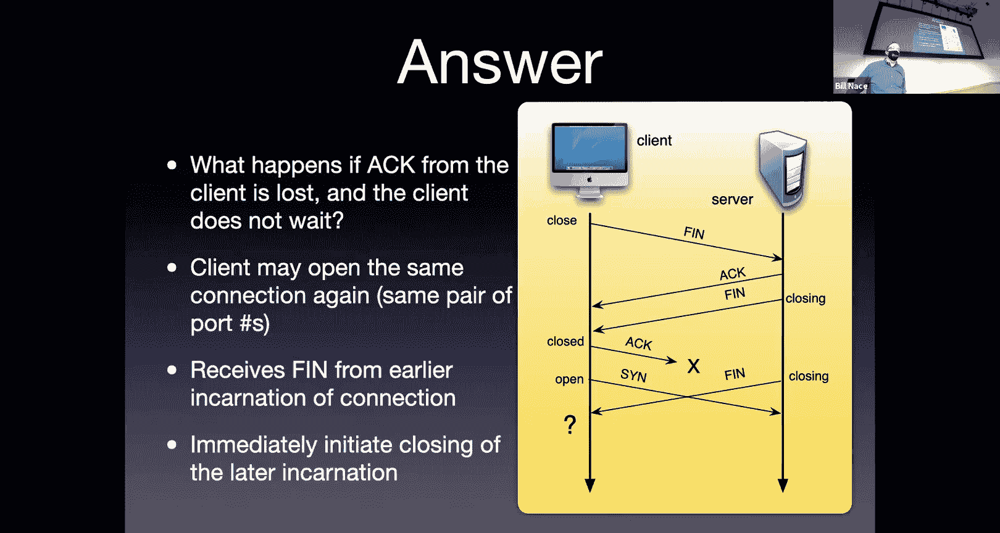

Okay， so that's kind of the how we start a connection， how we finish a connection。

 now let's go ahead and make sure we understand how the actual data gets transferred。

So that we know that that's happening reliably so that we use all those tools we talked about last week。

To to get our data from one side to the other properly， what's the actual TCP？

Protocol look like in terms of reliable data transfer。Okay， well， TCP uses these tools。

To overcome the the problems and faults that happen at the network layer like we talked about last week。

 right， we're going to go ahead and。嗯。And allow ourselves to send as much data as possible。

 That's going to mean we're going to need windowing。To be able to control。

 keep track of the multiple segments that we are sending。

We're going to use cumulative acknowledgements， as we've already discussed， that Act field。

Acknowledges stuff cumulative。 Now， we saw with Go back N。

The reason go back in had that horrendous problem where it threw away all the segments was because it was using cumulative acments。

We're going to overcome that by mixing in some of the selective repeat features。

 even though we are still using cumulative acknowledgecments。

We're going to use a retransmission timer that's going to allow us to detect that something got lost and needs to be retransmitted。

And that that is TCP's reaction to loss is to go ahead and retransmit something we've mentioned this a few times when we've said that this is a problem sometimes we talked about it with UDP。

 for instance。In many scenarios， we'd rather。Have some other form of reliability。

 We'd rather lose a segment。Then have the delay caused by retransmission or in DNS's case。

 we've got better ideas on how to do reliable transfer。The retransmissions themselves。

The timeout of course is going to cause a retransmission。

 we're also going to see something called duplicate acknowledgeledments if we get the same acknowledgement coming back a couple times。

 that's going to be an indication of loss。And that will cause our retransmission。

 we'll see in a minute why we would see those multiple acknowledgeknowments in the first place。

So we're going to start off simple， in fact I'm going to I just told you there's a thing called duplicate acknowledgeledgments and the next thing I'm going to do is say let's ignore it for a second。

 we'll add those in later on today。We will ignore flow control and congestion control entirely。Okay。

 so those are questions that we're going to leave for Thursday。For how that happens， let's just。

Imagine that the sender would have to check both of these to see whether he's allowed to send the segment before he does for today。

 we're going to pretend the sender can send the segment whenever they want to。

And we're going to be using round trip time to calculate the timer expiration again。

 we're just going to assume that gets figured out somehow。

 we'll talk next time about exactly how that happens。

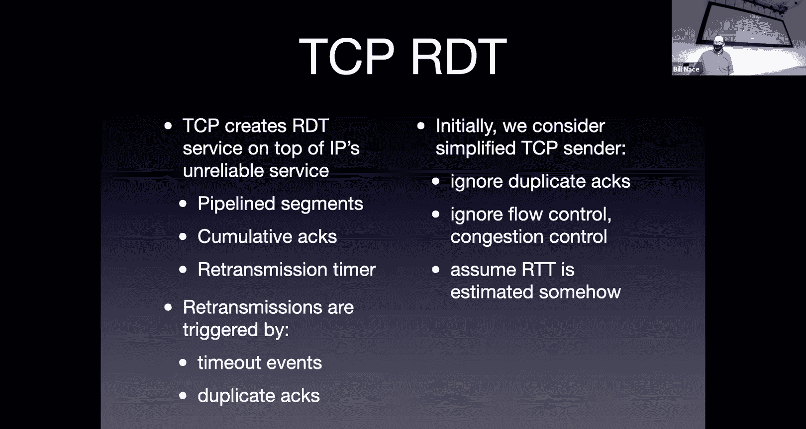

We've talked a little bit about these sequence numbers。

 but let's make sure we understand them and how they' are actually used in the reliable transfer of this data。

The sequence number is the byte number， the index of the byte。

That was the first bite of this segment。When I think of all of the data I'm sending。

All of that is offset by my initial sequence number。

I'm going to be using numbers today as if we chose zero as our initial sequence number。

These are all kind of role。Duues that are relative to each other instead of some absolute value。

 you can imagine， however， that the sequence numbers。

 and you'll see this when you do wire shark in the lab。We can imagine that the sequence numbers。

 since they're randomly selected 32 B numbers， often。

 are these large monstrosity numbers to deal with。The acknowledgement that's coming so I'm going to send out a sequence a segment with a sequence number in this case I've got sequence number 19 is my first segment。

 that just means that the first bite in the bys I'm sending is byte number 19。I've seen 18 before。

 here's the 19 point， so all that number is sending。The other side， of course。

 sends an acknowledgement coming back that acknowledgement is cumulative。Okay。

 so when the other side sends me an Act 20， okay， that means we've seen everything before this。Okay。

 if we're missing， you know， I just sent a segment with sequence number 19。Previous to that。

 I must have sentd some more data and that acknowledgement means we've gotten all that data。

we're good up to this point。OkayWith that acknowledgement。

 remember that that acknowledgement number tells you we expect this next bite。Okay。

 that's the expected next thing to show up， not the acknowledgecment of what we've actually seen。

So we've sense sequence number 19， the acknowledgement number 20 comes back。

Because the next bite we expect will be a 20。That means I must have only sent one bite of data in that segment。

Okay， and that's true。 We'll talk about that scenario in a second。It is possible， by the way。

 to piggyback data coming the other way， so if the server in this case has data to send back and also wants to acknowledge a segment。

 it can do both of those in a single segment。😡，It does not have to send an acknowledgement segment and then send a separate segment with data in it。

 It can go ahead and collapse those into a single segment。

 we call that piggybacking the data with an acknowledgecment or piggybacking acknowledgement with some data。

So here's the scenario， this is a very simple just we've got some remote login scenario going on or something。

I'm one of my client remote logged into the server。

 if you've ever done this with SSH or something like that。

 this is easy right you get a connection and it looks like your command line is actually on that other computer and you type stuff and it happens as if it's over there。

 right？One thing you may not recognize is normally with those kind of clients when you type a character。

 when you type in， you know， LS minus L， something， something， something right as you type it。

Those characters appear on your terminal as if you were just typing them in？Typically， though。

 those characters are not printed on your terminal because you type them。

They're printed because that character you typed got sent to the other side and then got acknowledged coming back。

Okay， so that way， you get a little feedback as you type to know that those that data is actually being sent。

 And usually in those scenarios， the data is sent character by character or。

Depending on how fast you type， maybe you get a couple characters into a single segment being sent。

 So that's kind of the scenario， right， I' at my keyboard， I typed the letter C。

Okay a segment goes out with that letter C as the data。OkayAnd so in this case。

 that's sequence number 19， I may be acknowledging something previously happened for the last character。

so my acknowledgement number is 87。I have the data， the character C is in this segment。

 that's the only data。The host gets that segment looks at it says， oh， a C here。

 Let me put that into my remote login server application to keep track of the characters that have been typed and let me echo back the character we got。

 And so the application on the server side is going to want to send the character C back to。😊。

The the client in this case， so he's going to send a segment that has the C in it。It has。

 in this case we see that it's sequence number 87， how do we know it's 87， oh。

 87 was acknowledgement last time？So that means for this segment。

 we were expected to send something with sequence number87 and we are。Okay。

 and then we need to acknowledge the data we got in the last segment。

 And so that segment had sequence number 19。 We're going to send back an acknowledgement 20。

 I've seen 19。Please send me 20 next time It's the meaning of that。The client gets it。

Atchoes it types it on your terminal， here's the character C。

 usually that's fast enough that it looks like I type the C and it just appears。If I'm a slow typer。

 then the client doesn't have any more data to send。

 but does need to acknowledge this message that came in from the other side。

 and so we'll send a segment out that just has an acknowledgement of ADA in it。But no new data。

Kind of makes sense we go back and forth sequence number， acknowledgement number。

 sequence number acknowledgement number。

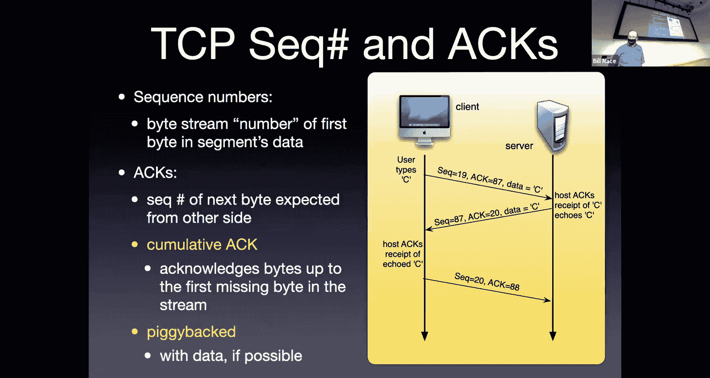

On the sender side。What's the protocol look like？上别。Let's see， I saw several missed TCP packets。

There's different kind of message sent in that case。嗯。

So if there's a missing TCP packet and actually in water shark， we also sometimes see。

Surious TCP segments or something like that as well。

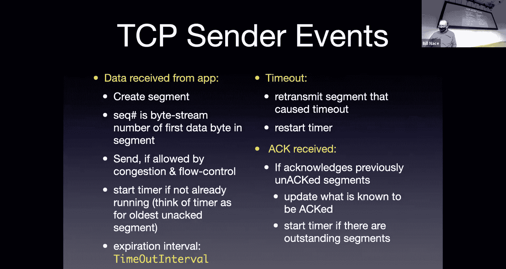

So yeah， if that segment， so this is the reliable data transfer happening in action， right。

 what happens if let's imagine that second segment gets lost somewhere。

The second segment is carried by the network。The network has reliability issues。

 It gets lost somewhere。 What's TCP going to do。Right， and this is what you'd see in wire shark。

 right， if that guy is lost。Then after some time out amount of time。

My client is going to retransmit the timer is going to go off say， oh。

 we think we lost something because we didn't get an acknowledgement back in time。

 let's go ahead and retransmit this We'll see more of that in just a second and more slides。

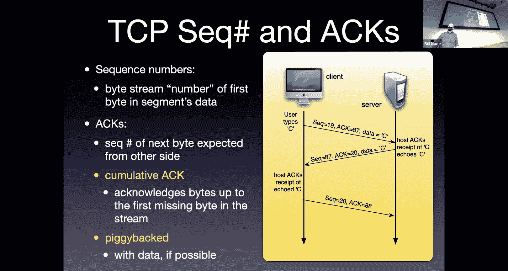

You recall last time we defined a lot of the protocol things by saying。

 what are the actions that happen on the sender and the receiver？

Based on various events right that was basically the definition of the stop and wait was here's a list of sender events and here's a list of receiver events for TCP。

 here are several of the things that sender is going to do when certain events happen right So for instance。

 if the application hand some data to the to TCP and says， hey， here's my next。

You know my next TikTok message， go ahead and send us。

Right what do we do well we take that date and we create a segment。

 what do we mean by that well we have to chop it up into the correct sizes。

We got to figure out what's MSS， I'm going to take MSS number of bytes of the beginning of that message and put it into a segment。

 I'm going to put a header on it， I'm going to fill out a bunch of the header fields。

As I'm doing that， I'm going to put a sequence number on it。That sequence number is。

 I've got a counter someplace that keeps track of what sequence numbers have used in the past。

And so I know， oh， this is bitete number x。Because I know what my initial sequence number is。

 And I've kept track of all the bytes I've sent so far。Okay。

I will check with congestion control and flow control。 Am I allowed to send this。If they say yes。

 then I will， if they say no and we'll talk the next time about exactly how that works。

 if they say no， then I'll wait until they say yes。I'm gonna then， okay。

 I'm ready to send this thing。 Let me go ahead and set a timer。Okay。

 so that can keep track and know whether this one got lost or not。 So I'm going to start a timer off。

 I'm going to go ahead and send it。Okay， if I don't get a response in some amount of time。

 we'll calling that at the timeout interval， we'll learn how that's calculated next time if I don't get a response in that amount of time。

 then it must have been lost。Okay， so that's the event when I get data from the application。

 what if timeout actually occurs？If that timeout interval goes by， well， that means。Well。

 it means one of two things。It means my segment got lost。Or what's the other thing it could mean？

Acknowledgement fell lost， right？I don't know which one I just know I sent something。

 I have not gotten in a response。So one of those two things happened， so I have to retransmit。Okay。

 and when I do， I'm going to reset the timer because it's possible for my retransmission to get lost as well。

If on the other hand I get an acknowledgement back， that's great。

 right the acknowledgement tells me that some data was received。Okay。

 and I'm going to have to keep track of。Of where the acknowledgecgments are。

 so I know you know where I am， of all these segments I have in flight。

 which ones have been acknowledged， that acknowledgement since it's a cumulative acknowledgement means that that segment and all before it have been received or that bite number and all before it have been received？

Does it。Sorry。Your respond。Do doesn't have to re on that。Okay， so Deion is basically I think asking。

 what if I'm sending multiple segments so I have one timer or multiple timers or how do I handle that right and that's going to be implementation dependent okay。

It is possible so in some operating systems timers are expensive and you don't have1 thousand0 of them available to you at the operating system level and in that case TCP has to be smarter about how it manages it and so in that case it will keep offset values and it'll know oh when this one timer goes off that meant that one got lost and now I still have six others in flight and I know how much later they got sent out and so I will have to figure out which one to restart a timer for。

You， you can imagine with a little bit of coding， it's as if you had as many timers as you want。

 so oftentimes。I will think of it and describe it as if there is a single timer per segment。

Even though technically on some OSss， that's not actually what's happening。Okay。

 so let's draw some pictures， make sure we understand what's going on here。

So here's the sender sent something， okay， so we've sent off a segment that has sequence number 92 with eight bytes of data in it。

That means 92 through 99 are in the segment。Therefore， when that gets received。

 the server responds with an acknowledgement。He's going to acknowledge saying， oh。

 I've gotten up to 99， please send me things starting with 100 and that acknowledgement gets lost。

Okay， well， what's going to happen？WellAccording to the rules you know from here。

 we're going to get a timeout we're going to retransmit right so after some amount of time we'll go ahead and retransmit that thing。

Okay， here's sequence number 92，8 datates， exactly the same segment gets sent out。Okay。

 and then the acknowledgement 100 comes back。So the question is， is the server okay。

 the server got the same segment twice。I you going to be cool with it？

Okay we hope that he's going to be cool， we hope that he's not going to think those are two different pieces of data。

And he's not because he has the sequence number。 He's actually keeping track of。

The acknowledgement number he sent last time is the expected sequence number that he's looking for in the future。

 and if he doesn't get it。92 less than 100。 Therefore， I have not gotten this。 Therefore。

 this must be more duplicate data。We're still going to acknowledge it。

 but we don't give it to the application。It's not new stuff。Okay。

 what happens if the timeout gets set incorrectly so here I have two segments get sent right my old friend segment 92 with 8 bytes of data the next segment would be sequenced number 100 with 20 bytes of data so it would have 100 through 119 as the bytes of data in that particular segment。

The server then will acknowledge。Presumably， he would asent the acledgment as soon as he got the first segment。

 I might have。Draaw that a little differently。 He sense acknowledgement for 100。

 He sense acknowledgement for 1，20。Prem sure timeout means that the timer went off before it should have。

We miscalculated how long that timeout should be or the network suddenly got slower on us。

We never can tell it always could， and that means acknowledgements come in after we expect them to。

Okay， we have already re transmittedmitted sequence number 92。Okay， and we started the timer。

 you'll notice we did not retransit sequence number 100。

protocol would not require us to do that because the timer just went off for that particular segment right？

是的。When we get the acknowments of 1120。系。Those come in， those will cancel my timer。

Because I've received acknowledgegments for the sequences I've sent， I however。

 I've already retransmitted 92， and so that means that some time in the future we get an acknowledgement for 120。

Okay， when I get that that acknowledgement， I say hold， that was an acknowledgement， you know。

 I sent out 92 and it got acknowledged， do I then retransmit the next thing？And how do we know？Okay。

 yeah， there's no reason to retransmit that sequence 101。And we know this， well。

 we've gotten an acknowledgement for 120， that one that last one coming in has a 120 acknowledgement。

Telling us that the receivers already gotten everything up to 119。Okay so we on the server side。

 we're also keeping track of some numbers and we're just saying， oh look。120。

 that means everything before this has been acknowledged。Okay， I don't need to retransmit anything。

With sequence number before 120。How about another scenario。I've send sequence 92。

 so now I've separated these a little bit in time， I' send sequence number 92 and the acknowledgement gets lost。

Okay，This one we dealt with a couple slides ago， the interesting part now is I send out a second segment。

Sequence number 100 holding 20 datates， and I get the acknowledgement for 120。Okay。

 what do I do when I get that 120？Okay， well， I haven't gotten an acknowledgecment for that first sequence。

For the sequence number 92 segment， should I retransmit it？

I got a timer going for sequence number 92 when that timer goes off。Am I going to retransmit？

Segment 92。No， of course not。 right。 In fact， when that 1，20 comes in。

 because it's a cumulative acknowledgeledgment， I know that the previous one was received。

 I can go ahead and cancel all of the timers for any segment before。

The one I got an acknowledgement for。And I can do that again， looking at the numbers， right。

 120 greater than 92。Therefore， we can go ahead and cancel that。Okay。

 so this is kind of centerside thinking。What about on the receiver side。

 how do we go about deciding how to respond to events and how to generate stuff？

You would think this is easy and it mostly is right。

 the receiver gets a segment with a sequence number， the receiver acknowledges it。

How hard could it be？Well， we're going to make it a little bit harder。

 we're going to add in another facility called delayed acknowledgement。Okay。

 and how this works is when I get a segment。That's the normal segment， right， It's in order。

 You know， I had previously act 1，20。 Look， I just got a segment with sequence number 120。

 That's what I'm expecting。Right， everything's good， Everything's wonderful。

 When I get that segment in。😊，I don't acknowledge it。Okay。

 I'm going to do what's known as delayed acknowledgement。I'm going to pretend that， well。

 if I just am a little bit lazy， I can do less work。If I just hang on a second。

Maybe another segment will come in。Okay， and if another segment shows up early enough。

 then I can acknowledge both with a single segment。

Instead of acknowledging this one and then acknowledging the next one when it comes in。

And so that's what we're going to do， we're going to wait we'll wait up to half a second。

 turns out to be a long time typical modern day implementations won't wait that long， okay。

 but we can wait up to 500 milliseconds。Okay， hoping that another segment comes in。

 if another segment does not come in， then yeah， we'll go ahead and acknowledge this one。

But if I'm in this， we're kind of expecting。And so you， you know。

 this is the optimization for bulk transport that TCP does。

 I'm kind of expecting that there are lots of segments coming into me。And so when I get this one。

 if I just wait around a little bit， maybe I'll get another segment coming in。And E？啲费一嘅系上。

So the next segment coming in is the second line here。Okay， so Ed is saying wait a minute。

 if I always do that， I'll wait around forever before I respond right yeah we can't wait around forever。

 we have to send back some feedback at some point。So the second one coming in is the second row。

 right， If I get a segment coming in， it's in order， it's the 1 I expect。Right。

 and I have one waiting。 I've already delayed。That's when I will send back an acknowledgement。

And so what this means is you will often see。I send segment。I send segment A and segment B。

 and then an acknowledgement of B。 I send segment C and D， an acknowledgement of D。

 And so you'll have a sender that is sending。Many segments and only getting half the number of acknowledgeknowgments back。

Because。And that's an indication that things are going well， that means we're getting them in order。

 there's a slight delay， the next one comes in and both of them get acknowledged at once。

Now that's that's the good scenario， right， If nothing's going wrong。

 then those first two rows are what's going to happen。Okay，However， stuff goes wrong。

 We got to be able to handle it right， So what happens if we get a segment that comes in that's out of order。

Right， so segment 92 came in。I think segment 100 should be the next one， but instead I got 120。Well。

 I can't acknowledge 120。cumulative acknowledgecledgments right。

 can't do that because if I did that I'd be acknowledging some data I haven't gotten yet。Okay。

We don't want to do the thing。 Go back and did， right， Go back in said， well， let's throw this away。

Okay， and just acknowledge what we have。We don't like that throwing away part so what we're going to do is we're going to keep track of this we're going to keep this segment that came in that is out of order。

😡，And I'd like to acknowledge that I got some data， but I can't acknowledge this one。😡。

Because the cumulative acknowledgecments。 So instead what I'm going to do is I'm going to acknowledge。

The segment that I've already gotten。That I already acknowledged when it came in。When 92 came in。

 acknowledged with the 100。Okay， now1，20 is coming in。I can't acknowledge it。

 but I'll go ahead and reacled。WithBy sending another 100 back。

We call that a duplicate acknowledgement。Ca it's the same thing as we've already sent before。Okay。

So we're saying a couple things with that acknowledgement。The feedback we're giving is。

 we got something。Okay， but because this is a duplicate。There's a gap here。

 There's something missing。 And so that may be seen as。Some an indication of loss by the senatorer。

Eventually hopefully we'll get that segment that fills that gap right， so I got the first segment。

 I got the third segment and now I'm getting the second segment。Great， right， that one。

We do not consider for delayed act， right， We want to immediately acknowledge this because it fills in that gap。

 makes everything work out。 And so we will immediately acknowledge by acknowledging。Not it。Okay。

 because I also have a third segment there as well。

And so I'm going to acknowledge all the data I've received so far。

Which will not be the numbers for this particular segment like got in。🤧。So。Back to the send side。

The sender is sending stuff。OkayAnd if there's ever a delay。

 we've got this timer period that'll figure this out for us。Okay， and the original version of TCP。

Worked。Just in the kind of， as we've expected so far。

 I send the segment when I get an acknowledgecgment， timer goes off I re transmitmit。Soon after。

 a fast re transmit patch came out and said， oh， we can actually do a little bit better。

 On the sender side， I can use this duplicate acment。😊，To let me know something， right。

 If I get a duplicate acknowledgement from the other side。Just said a minute ago。

 that's a couple pieces of information that the receiver is telling me if I get a duplicate at acknowledgement。

 that means something is getting through。Okay but it also means something is missing。

 there's a gap going on。And now I could wait around， I could say， well， I think there's a gap there。

 but you know， I haven't got my timer go up for it yet。Okay， that would be regular retransmission。

 the fast retransmission says let's go ahead and use that duplicate acknowledgement as an early indicator that there might be something lost。

And let's go ahead and retransmit it。 Let's go ahead and。

And send the thing that we suspect might have been lost。

 even though the timer hasn't gone off to tell us it definitely has been lost。Okay。

 and so the rule is。If you get three duplicate acknowledgegments。

That's the indicator something's lost and we'll go ahead and do a fast retrans。

 we'll go ahead and resend that segment even though the timer hasn't gone off yet。

So here's the scenario， the picture we see for this。

I send off segment with sequence number 92 with 100 with 120。

 I send a whole bunch of these segments out， one of them gets lost。Okay， so on the receiver side。

 the receiver gets the first one acknowledges it。getss the third one。

 of course it thinks that's the second one。And says， wait a minute， these don't add up。

 I've acknowledged 100 and you just sent me 120。Just comparing those numbers。

 the receiver knows something's lost。I haven't got nothing yet。 I'm not gonna。

To delay the acknowledgement， I'm going to immediately acknowledge。

 but the only thing I can do is send back an act 100。I can't actually act 120。I'm sorry。

 actually that one would be 120 with 15 bytes of data right I can't actually act 135。

Which is the acknowledgement for that segment Instead I have to act 100 because I can't。

Skip over this data that's missing。And as， and that's the first duplicate that gets sent。

As the next couple segments come in， we again send out a second and then a third acknowledgement with 100 in the acknowledgement number。

And that's our second and third duplicate。And now， on the sending side。

We start seeing this evidence build up， right， I get acknowledgement 100。 That's great。

I get acknowledgeledment， wait a minute。 this is acknowledgement 100 again。

 You've already sent me this to me。 That's a duplicate。 Oh， a second duplicate， Oh。

 a third duplicate。Okay， great at this point in time。

 we will say I have enough evidence I'm following the fast retrans rule。Right。

3 duplicate acknowledgecledments。 I'm going to go ahead and retransmit the thing that I think is missing。

 the thing that you've been acknowledging over and over again。 You've sent me this ask for 100。 Okay。

 I'll send you 100， even though the timer hasn't yet gone off。没 true。F future is that also reset。说。

Yeah， so anytime I re transmitmit something， I'm going to set the timer again because it's possible that gets lost。

 right， So， yes， when I retransmit segment 100， I will go ahead and set the timer again for the same period。

That I've normally been using。Okay。In some sense， this triple Date Act is a not acknowledgement。

 right？TCP does not use NAs。It has no way ton anything instead， it just。Acknowledges things。

But by acknowledging the same thing over and over and over again。

 what we're doing is we're telling the sender， I haven't gotten this gap thing。

 the segment that's in the gap。Please send it to me。And it's fair to ask why three。

 three seems to like a long time， why not two， right， why not one？What do we do there？Well。

It turns out that it's not uncommon for one segment just to go a little slower than others。Okay。

 so getting them out of order is not uncommon and we don't want to be retransmiting too often。

Because that's using bandwidth that we don't need to use， right？A retransmission。

 if there's no loss is wasted bandwidth。 So don't necessarily want to do this too often。

And you'll see here in my scenario here， I've sent out three segments and just two of them。

 one of them late， I'll get a duplicate acknowledgement in that case。

 and I don't want to respond to that because it's just a little out of order。

By requiring there to be three duplicate acknowledgecgments。

 we're basically saying this is more evidence that there's loss。OkayOr in order for this to happen。

 you have to have one that was seriously late。If it's still got through， okay。

 I call this a voodoo constant。Why3。It seems to work。😡，We don't have any。

 I can't point to some math to prove that three is the right number。Instead， we simulate some stuff。

 we try three， we try four， we try two。Yeah， three seems to work out best。sort of thing。

so it makes sense。Alright， at this point， you've got T C， Well， you've got the easy part of TCP。

 We know how TCP works to transmit data from center to receiver。

 We know how it works to use the tools of reliable data transport that we've talked about。

Still more common on Thursday we'll talk about flow control and congestion control and see other aspects of TCP as well okay。

All right， great seeing you all we'll see you on Thursday for more TCP goodness， bye bye， everybody。

我唔写实通实发。This directly re。没个。非常。Right。まさね。What a great idea， let's talk about that on Thursday。

I've got some slides to do that。

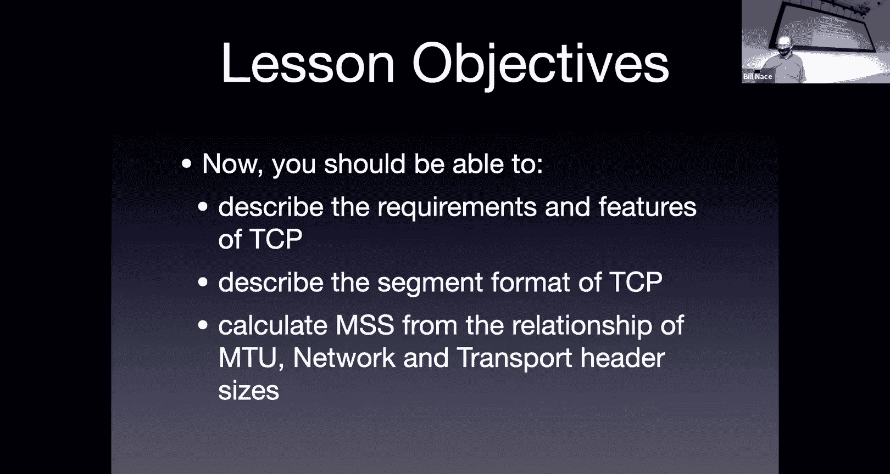

Okay。嗯。Okay。Yeah。