# CMU《计算机网络基础｜CMU 14-740 Fundamentals of Computer Networks 2020》中英字幕（deepseek p13 -P13-2020_10_20_Lecture13.zh_en -BV13J6uYpEZm_p13-

This again is 14740， welcomel everybody。We are continuing our conversation about TCP today。

 We've been working on this for a while。 actually， we began with some techniques about。

How to do reliable transfer， and then last time we got into the congestion control side of things。

 which we will continue today because there's more to say on that topic。

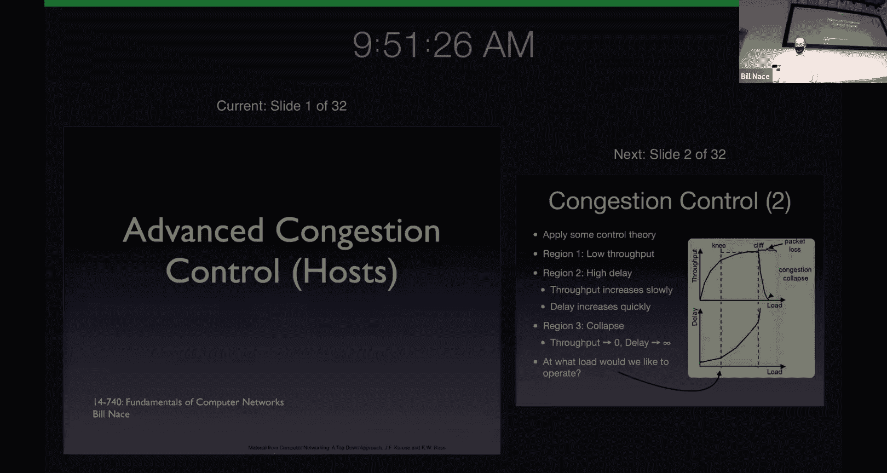

Okay。Let get Zoom all worked out here。

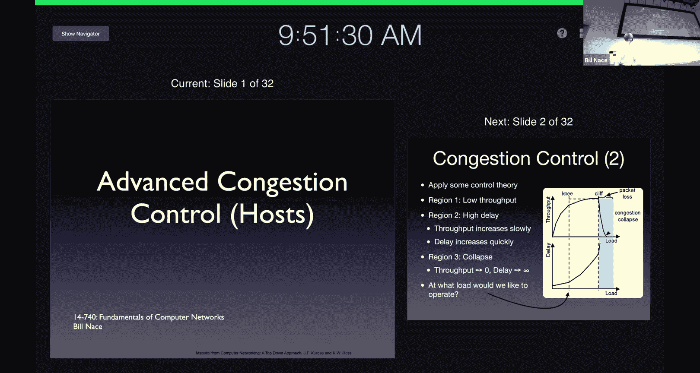

嗯。Okay。All right， okay now。Excellent。Okay， so we are going to more congestion control。

 you'll notice the title says advanced congestion control at the hosts。

And that's what actually last time we talked about was the idea of congestion control at the host。

 and that's a little bit of foreshadowing that there are things that will come up in the network layer that also deal with congestion control and we will get to them as well。

 So you're going to have three lectures on congestion control throughout this entire course。

 This is number two。Remember where we were last time we said we wanted a way to control the congestion。

Because if we just dump all our traffic onto the network。

 the network has a finite amount of space to handle all of the packets that are being sent from router to router to router。

 and if we pile too many into those routers， then we overwhelm them。And if we overwhelm them。

 then things eventually get really bad。 We get what's called congestion collapse。

 where the routers aren't moving much real traffic。 Instead。

 they're mostly delaying things long enough for the end host or the sender。

To go ahead and think there's been a loss and to retransmit。

 And so most of the things that are happening at a congestion control point。Our retransmissions。

 which is not good。 We don't want to get there。 And I should point out this is a very real phenomenon。

 Jacobson points that out in his paper。 he talks a little historically about what was happening And people were seeing this occur quite commonly in wondering。

 you know， gosh， what's going on with my connection between my computers。

 I think I should be able to send more traffic instead of over there。

 And Jacobson and some others were the ones who investigated and figured out， oh。

 we should really not be just sending as fast as we can。

 And that LED to this whole idea of congestion control as a way to。Control the sender。

That's what I mean by congestion control at the hosts。

 the sender is actually the one doing this control。

We're trying to do control control theory says we need some feedback and so we talked last time about this idea that the feedback。

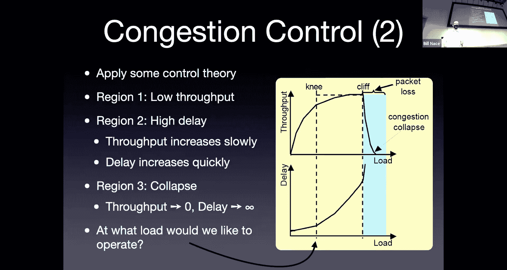

Necessary for that congestion control could come from several sources。

It is possible that the network could send us some notifications because the network is the entity that actually knows that it's congested。

Or it's possible that the receiver feedback mechanism we already have。

 the acknowledgements that we're using to know that a segment has been received properly。

Possibly we could use that as well。 and that's what TCP does。 The idea being that， hey。

 we have these signals anyway， we have the acknowledgements。

 let's just go ahead and use them instead of requiring the network。To have another mechanism。

 another thing to do， especially when the network is underload， when the network is underload。

 the last thing you want the router to do is extra work。

Especially if that extra work means sending more messages。So instead。

 let's just go ahead and use these。

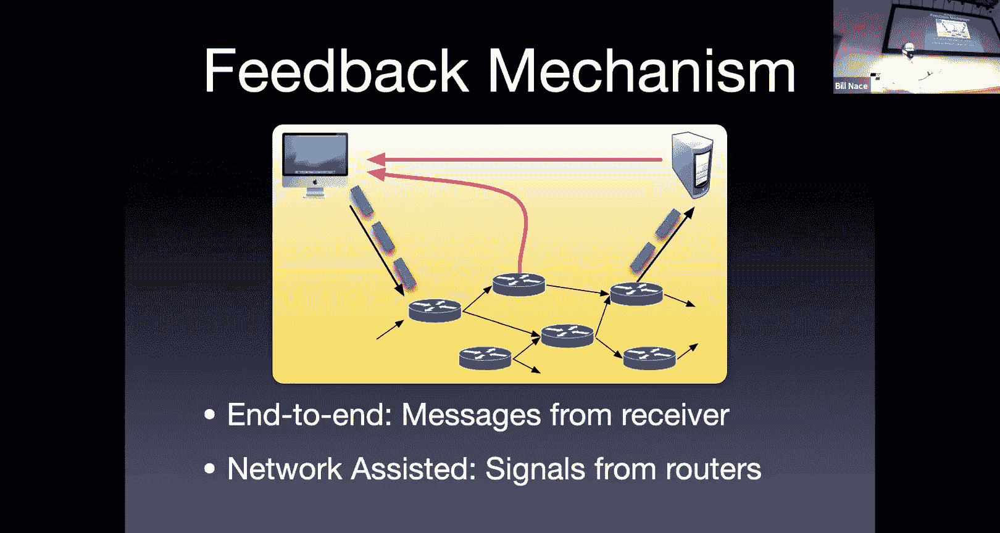

This feedback we get from the other center。We talked about several components of TCP， one of them。

 it' a critically known component called slowlow start。That gets us from the， oh。

 I'd like to send some data。 Let me open a connection and begin。 Let's get from that very beginning。

State into something where we're actually moving a fair amount of data along and have some sense of what's going on in the network connection we have and during slow start the key was that we're going to start off with a congestion window being equal to one segment and then we're going to double that。

That window， every time there's a round trip， but every round trip time that window will double in size。

 we do that very simply through a self clocking mechanism where we。

Just add one segment to the window every time we receive an acknowledgement and that in effect doubles the size。

Because every acknowledgement you get removes one segment from the congestion window because one was delivered succfully。

And also if we increase it by one。That's adding to the permissions to send two more segments every time we receive an acknowledgement for one of them。

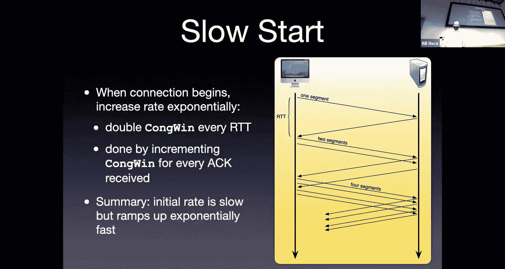

And then at some point， we get to usually a threshold。Where we say， okay。

 we're now time to move out of the slow start phase， stop that component controlling。

Congestion window。 and instead move to a congestion avoidance phase where a different component。

 a different algorithm is used to manage the congestion window。

And that algorithm goes through some form of additive increase， multiplicative decrease。Basically。

 that means we're continually probing for more bandwidth。

We're going to continue to push the window open a little bit more， a little bit more。

 a little bit more。Every round trip， we're going to want to add one MSS to the window that's an additive increase。

And then if there's some loss event， if there's some trouble， we say， oh。

 there's some router that may be in trouble somewhere， let's back off quickly。

 let's stop sending and let that router have time to recover。

And that's the multiplicative decrease where we cut the window in half anytime there is。

Some form of loss event。And those one way to view this is these components work together kind of in a big state machine。

And so we started off。With， with the original congestion control in TCP Tahoe。

And that version had a slow start and a congestion avoidance phase， and that was it。

 and they had these two algorithms， these two processes。

That I've just discussed that would double the congestion window every round trip or if you're in congestion avoidance would continually probe。

That originally， the original version of Tahoe， whenever there was a loss event。

 whenever there was a timeout would move from congestion avoidance back to slow start。

 so actually did not do a multiplicative decrease in congestion avoidance。

 it simply moved back to slow start back to let's send one segment。Let's send two segments。

 let's send four segments。Rno then was the next version of TCP congestion control to come out and that the TCP Reno version said。

 hey， turns out going back to slow start is a overly pessimistic thing to do。

We're slowing things down too much。 Instead， let's just go ahead and do this divide by two thing。

 But we're only going to do it when there's the loss event is not that terrible。

If the loss signal that we're getting from our acknowledgeknowledments is that we're getting three duplicate acts。

That's a suggestion that something may be wrong， as opposed to the timeout。

 which is a more heavy handed， yes， somethings wrong。And so in Reno you go back to fast recovery。

 that is the divide， the window by half idea。If there is a triple dip act。

 otherwise if there's a timeout， if you've actually believed you've lost the segment。

 then you go back to slow start。

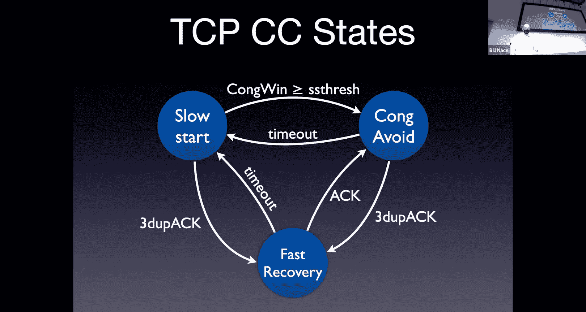

And so you can imagine。Something like this happening Heres kind of a picture of what we're trying to accomplish if we put those。

 this all together。And look kind of through time what's happening to the congestion window。

 you know as we start off slow and so you see on the very left side there。

 we're doing an exponential increase， we're starting off with a very small window， double， double。

 double double double。And eventually we get to some point where we stop doubling。

 and I like this graph because it points out it shows this over on the side。

 it has these two arrows there that are indicating something about what's going on with the network。

It says Q saturation point and Q starts to fill。Not that there is a single queue somewhere。

 what it's saying is the network layer has a certain capacity that to the sender looks like it's all been abstracted away and looks like there's just some big cu that。

When it's full， things are bad and when it's empty， they're not。Okay。

 and so those lines are starting to say， hey， there's some capacity in the network and when you get to that bottom line。

That's the point where you're kind of operating at the， oh， the network load is starting to get bad。

Okay， so maybe that knee point in our earlier graph。And then the Q saturation point， that's when oh。

 there actually is some router somewhere that's full up。

 the network is starting to really slow down because there's just so much data in it。

And so what we want to do is kind of oscillate around these points， right？We discovered， oh。

 we've saturated the network， then let's go ahead and multiplicatively decrease。

And give the network cu time to pull some stuff out of that head of the queue and have the capacity of the network recover。

And we will， in the meantime， probe and probe and probe and see if we can get more bandwidth。

This is a little bit of a static view of the network。

One of the themes that you probably have picked up on in this class so far is that the network is a very dynamic thing。

 and so there may be this Q and its saturation point。

 but probably it's not a nice steady line like that。

Okay and you're going to instead see if you were to measure this and you will do some of this with wire shark。

 you'll see that that's a much more dynamic picture right as the sometimes those the diagonal lines get higher and sometimes they get chopped off lower just kind of depending on what's going on in the network。

 So this is kind of a theoretical view。

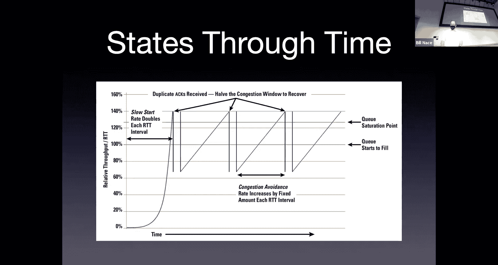

Of what we're trying to accomplish。Now， today， I want to move into some advanced ideas。

 And it turns out there are a lot of these。And one of the reasons is it is incredibly easy。

At least relatively compared to other network topics。

 It is relatively easy to do network research in congestion control。

If you have a new idea for how you should do congestion control， where do you have to implement that？

Let's think about this if as opposed to other things。

 if you had a new idea for how to disseminate information and wanted to create something called the web。

Right， like。Sir of Bernard Lee did many years ago， right。

 he had to at the very least get his code running where。In two different places， right。

 he had to build a server， he had to build a client and show that they could communicate。Okay。

 so minimum of two。 If you had， let's say， I don't know。 a new protocol for the network to use。

To move packets around the network， let's say we'd call it IPV6。

Where do you have to get your code implemented to make that work？😡，The answer。

 every router in the world， that's an incredibly difficult problem to solve and we'll talk about this in the network there。

 we haven't solved that been 20 years and we haven't got that working。Congestion control algorithm。

 if you're looking at this and saying， oh， I like this thing。

 but maybe dividing by two isn't the right answer， maybe you know multiplying by two/ thirds is the right answer and you wanted to test that out。

Where would you have to write your code， where would you have to get your code implemented to try it out？

😡，I'm sorry。At the clientYes， so let's call it the sender right yeah。

 because at the transport layer we don't really have a client sender or client server relationship at the sender right that's the only placed。

You'll notice everything we've done is to control a congestion window at the center。

 We haven't even involved the receiver in any of this。

The receiver for TCP does what the receiver does all the time。

Regardless of whether there's any congestion control happening or not。

And that means that it's really easy if you have ideas， code them up。

 put you run them on your laptop and you can have you can be running your very own TCP congestion control algorithm。

Comparatively with very little work。Compared to other network research。

And it's an important problem right， there is a lot of congestion wouldn't it be great。

 can you imagine your light your name and lights on Broadway if you solve the congestion control problem and all of a sudden nobody had any congestion in the network right everybodyd be happy to have networks that operate that quickly。

So maybe the router manufacturers who would be selling less routers。

So there are lots of these algorithmic variants out there。

I'm going to pick out a couple today and tell you about them okay so these are some variations and probably in no case are we going to go deep enough for you to understand all the bits and pieces that's not my goal here。

Okay my goal is to show you a few of the things you can do with congestion control that is different from what we've talked about so far。

 so some different ideas will show up so we're going to pick at each of these variants。

And I'm going to say， okay， let's take a look at and in this case。

 I'm going to take a look at these five today。Because each of them has some feature。

That lets us understand congestion control a little bit better and understand things one can do to make congestion control a little bit easier。

But let's much together version。I'm sorry it's like Vi oh actually I don't know what Vino is I've seen it in a list somewhere I've never actually bothered to go learn about it so maybe maybe。

A quick Google search will handle you that answer。All right。

 so I'm just going to step through pieces of each of those showing you the things I like。

That I think are important to understand about each of them。 So the first is one called new Reno。

Okay， this is almost as bad as calling it my reno， right。

 when you come up with a new algorithm or something， right， you know。

 this obviously is not a great name for it。 It's just， oh， it's reno with。With a few improvements。

And so this is kind of the first thing one does when one sees that。There is an algorithm in place。

But maybe it's not working as well as you'd like， you go into that algorithm and you try to tweak it a little bit。

 you try to see if you can improve it somehow and that's exactly what new Reno does。

So new Reno does not rethink congestion control or anything like that， instead it sayshu。

 Reno added fast recovery and now that it's been deployed， we have some data。

 we can improve that a little bit。And that's exactly what happened。

 So there's a couple of RfCs that define this new version of congestion control。

And its job is basically。To go ahead and deal with the situation where you might have multiple segments that have been lost。

Okay， so。

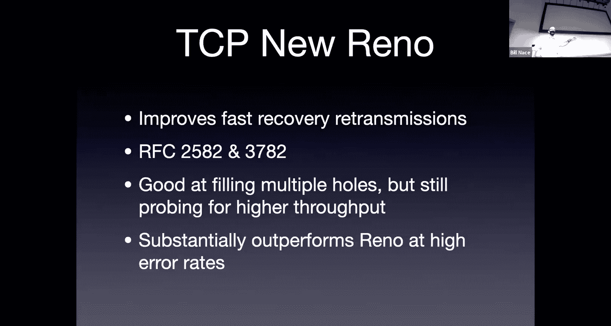

Look I'd say loss and it immediately falls。What happened。Consume running。Sorry， those of you on Zoom。

 we've had a。Projector malfunction， I think。Hopefully just a projector tweak。嗯。嗯。Okay， very're right。

哦。你十快八分钟。Right。

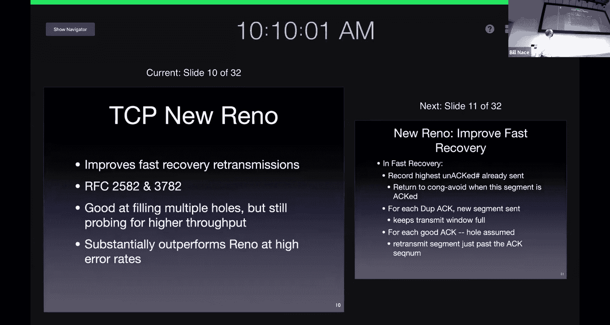

。嗯。Okay。We're good on Zoom now。 Okay， so sorry about that。Where were we， Oh， yes。

The whole idea of new Reno。Was to look at this possibility that you're going to have multiple problems at the same time。

 it turns out to be very common that errors end up being bursty Okay so when you have one error。

 let's say a segment is cut somewhere does something weird。

It's common for another one to happen soon thereafter。And with Reno。

 every time it's got this triple duplicatelic act coming in。

 it's dividing the congestion window in half。 and so a burst of three or four problems can all of a sudden really decrease your congestion window and so new Reno is saying let's go ahead and think this through a little bit carefully。

And in those situations when there are lots of errors happening。

 new Reno will do substantially better than Reno does。So what does it do， Well。

 it it mingles with the algorithm in fast recovery。 It messes around with it a little bit。

 First thing it does。 It wants to know when to leave。

The fast recovery get back to congestion avoidance。Okay， and in standard reno。

 that's just whenever you get an acknowledgement。 This process is going to continue on until the acknowledgement you get is for the largest segment you the already sent。

Okay so you're kind of saying well I have this pipeline of segments I have already transmitted。

 I'm going to continue managing this in a fast recovery scheme until all of those I know have gotten there because I get an acknowledgement for the last one so if I have 17 segments outstanding。

I'll be done when the 17th of those is delivered and then what it does is every time a duplicate acknowledgement shows up well。

 a duplicate acknowledgement is an indication that there has been some traffic getting through right Something got to the to the other end that's why the receiver acknowledged it。

 Okay， so if that's the case， then let's go ahead and try to keep the window a little bit full。

 And so so we're going go ahead and transmit a new segment in that case。Okay。

So we don't just kind of stop entirely。 we're going to keep pushing a little bit。

 and then if a good acknowledgement comes in。Okay， well， that good acknowledgement。嗯。

Might have will move the congestion window over if everything is in order。

 I guess it always will be because it's con cumulative acknowledgement。 It'll move the window over。

 But this also in fast recovery for new Reno says， let's go ahead and。

We haven't gotten out to fast recovery。 Let's go ahead and assume there's a hole right after that。

 The reason this one is being acknowledged and not the one following it。Maybe that next one。Well。

 that next one definitely hasn't gotten there。 Maybe that's the one that's lost。

 So let's go ahead and retransmit that actual segment。Okay， so a couple of tweaks to the algorithm。

And。New Renos does better than reno as youd kind of expect and this is this is normal right we build an algorithm。

 we test it out， we try it out， we find scenarios where there's some corner case and we go ahead and optimize optimize it that's exactly what's happening here in this particular network algorithm。

Yeah。Other people， however。Said wait a minute， let me rethink what's going on with congestion control and that's what Vegas does right Vegas does not try to tweak existing algorithms。

TCP Vegas instead says， hm。We have other signals we should be responding to and。And in this case。

 Vegas is looking at what is known as the delay behavior of the acknowledgegments that are coming back。

So Vegas doesn't care whether segments get lost or not。 I mean， it cares。

 but from a congestion control perspective， it does not respond to that。 Instead。

 what it's doing is it's actually looking at the round trip time。

Now we're already sampling the round trip time right， why are we sampling the round trip time？对。

We need to set the time on， right， And so we talked last time about you know。

 that exponentially smoothing the a bunch of of sample values to get a moving average， right。

 and deviations from that and setting the time out。So we already have a mechanism in the code。

 in the sender that's going ahead and doing this measurements anyway。And so Vegas says。

 let's go ahead and look at those numbers。And if those samples that we're getting。

 so we're measuring round trip time， if the sample round trip time starts increasing。

If I get more and more and more a larger number for that round trip time。

 that means there's more delay。And the。The assumption that Vegas is making is that when you see that delay。

 it's because there's some congestion happening。There's some router somewhere that's taking a little bit longer to deliver my segment。

And if that's the case。Then that means congestion is coming。We should， in that case。

 then decrease our congestion window。 Let's go ahead and do some control。Lower the window。

 have less segments outstanding。OkayIf on the other hand， that sample that I get starts decreasing。

If things are coming back quicker， that means that there's no congestion。

So that's a signal to go ahead and increase my congestion window to send more stuff。Yeah。Okay。

 and this works pretty well。 This is， I would not say this is a congestion avoidance mechanism。

 This is actually a prevention strategy。 right， We're getting way before the congestion。

We're detecting that it's coming and we're reacting in such a way that the congestion never happens in the first place。

Okay， and so a very different mechanism in Vegas。And so we're going to。

Going to do this sampling of the round trip times。 We're going to affect the congestion window based upon。

Their dynamic behavior， whether they're increasing or decreasing。

 and it turns out this gives us a much smoother flow rate and in fact， a higher throughput。

Now why do I get a higher throughput if I flip back to this picture we saw a few minutes ago。

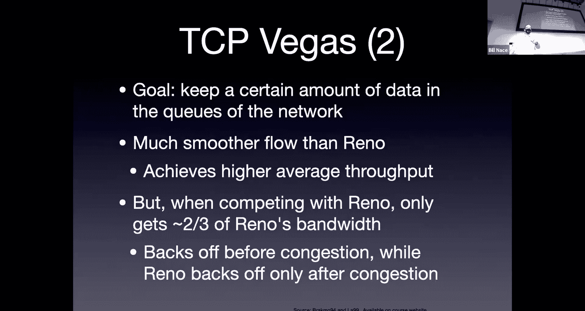

With Reno， we have this saw tooooth wave。Right， we have big spike。 and then back way off。

 big spike back way off。 And you can kind of think about the actual data delivered as being the integral of that of that of that function。

 right， that line that I've drawn there。Okay。Becauseuse when I， you know， I'm backing off。

 I'm sending less data。 I'm now probing ahead。 I'm sending more data， and that's good。

What Vegas is doing is instead of having a saw tooth like that。

 it's more like a little sine wave around the saturation point。Okay， it's increasing a little bit。

 in fact probably a little bit less than that a little bit before the saturation point we're going to back off increase back off increase and so we end up kind of filling in those valleys。

At the expense of chopping off a few of the peaks。

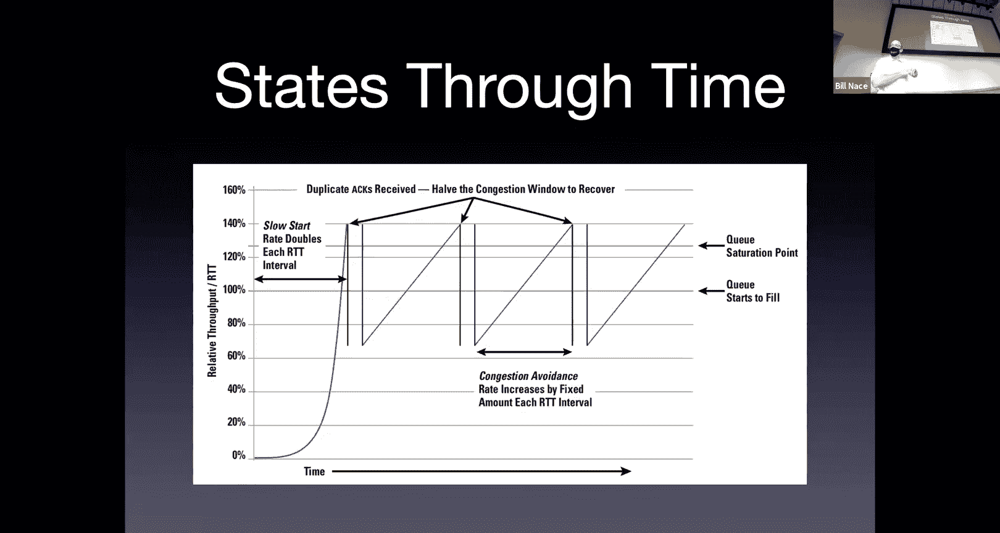

And that means that overall the total integral is actually a bigger number。

 we're actually sending more data。When this happens。Now that sounds great， right fantastic。

 why isn't Vegas you know？In lights on Broadway， right。

 Why aren't those guys knighted for solving congestion control problems。

 But one of the problems that happens that they realize when they start playing with this is。Oh。

 what happens if I on my laptop am running Vegas and you on your laptop are running Reno or new Reno。

 which is the environment you would move into。 What happens in that case。 Well。

 turns out we're action competition for the bandwidth of the network。

And the delay based algorithm is kind of like a very polite person right you see these people that you know driving on the road。

 they're like letting everybody go ahead of them sort of thing， oh yes， go ahead， you know。

 kind of thing it's not because they want them ahead。

 but this is this this algorithm is saying I think there's some congestion so I'm going to slow down。

I'm going to be a good citizen and the problem is Reno goes ahead and takes advantage of that if Vegas backs off。

What does Reno do， Reno， keeps probing， keep probing keeps probing。

 finds the bandwidth that Vegas just gave them and uses it。

And so you end up when there is some congestion。Reno wins big time over Vegas。

Whi is kind of an interesting idea。All right， here's another variant， high blood。

This is attacking a particular problem， so this is kind of interesting we have congestion control algorithms that are tweaked to certain scenarios。

Okay， and this is one of them， Hy blood is used for a high latency， high error rate length。Okay。

 think satellites or undersea cables or things like that high latency。

 meaning there's a long round trip time。Okay，It takes a long time for that segment to get to a satellite and back to Earth or across the ocean。

 right？And oftentimes those are high error rate things as well。

 if fiberraic tends to be low error rate， but certainly satellite transmission。

 anything that's wireless or radio tends to be a higher error rate than the normal。Okay。

 so what's this mean well， because it's long distance because it's high latency。

 that means the round trip time is a bigger number。In some cases。

 a much bigger number than we're normally expected to see。

It also means that we're going to end up dropping some segments because they have bit errors in them。

Now， as we'll talk about when we get to Wi Fi towards the end of the semester。

 oftentimes the link layer in those cases has to do some error detection and redundancy work。

To cover that。But some of that's inevitably going to leak through and you're going to have some of these errors and to TCP。

 if a segment is lost， it looks like congestion loss， even though in this case。

 it might be a bit error loss。so what do we do about this？Well。

 high blood is trying to solve this particular problem， and I'm using this to。

To illustrate this problem， you may see this problem。 It's called the elephant problem。 E。

 the animal， because it sounds like LFN， long， fat network。Okay， long fat network is one of these。

Highlight and see， right， long， big takes a long time to get there back。But fat， it's got a big pipe。

😡，Good big hand。For an LFN network。How many segments are we going to have in flight at any point in time？

Big bandwidth is， it can be a big number of segments。Big latencies。

 It can be a big number of segments。 Yeah， how many。Fundamental law of networking。Anybody got this。

 Oh man。It's the bandwidth delay product。I multiply those two together。To figure out how much。

Data I can have in flight at any point in time。 My bandwidth times my delay。For an LFN network。

 you're multiplying a big number by another big number。

 right You're going to be able to get a lot of segments in flight at any point in time。

because you're multiplying product of two big numbers is a big number。 How many。Here's an example。

 right， This， This comes from an RF that was published in 2003 at the time。

 these numbers were seen to be pushing the edge of the envelope of what's available。 Okay。

 nowadays we can get 10 gig Ethernet easy。Okay， so if I've got a 10 gigabit per second bandwidth。

A big number for the time， right， And I'm working over a 100 millisecond round trip time。Okay。

 can you remember from your trace route experiments in homework one， Hu your milliseconds。

 is that cross country， is that global， is that from one side of campus to the other。

 what kind of scale are we talking there？Maybebody do a trace route to China or something like that？

You're talking， yeah， definitely cross country， cross country tends to be like 40 to 50 millisecond round trip times。

So this may to Hawaii。You know， Japan， China is probably 150 milliseconds。 Okay， so we're talking。

Large distances， although very real possible distances。Okay。

And let's imagine I have a segment size of 1，500 bytes， that's one ethernet frame。Okay。

 very reasonable numbers。 If you multiply those together， if you do the math right。

 bandwidth delay product10 gigabits per second time so 100 milliseconds。Okay。

 and then that's the number of bits that you can have in flight。

 divide it by 1500 and convert it to bytes。Okay，And you'll discover that you can have 83333 segments in flight at one time。

That's a lot of segments。Do you remember from the Van Jacobson paper。

 what kind of numbers was he talking about about the size of？

The cues and the number of how big the windows were do you remember？It was like eight。Okay， yeah。

Okay， we're definitely solving a problem that was outside of。

The range of what Ben Jacobson was thinking about。Here's the problem because this is a high error。

 or let's take a look， let's go the other way， let's see what the error rate needs to be to make this work。

Now this math isn't going look intuitive to you okay and I tried redoing the math this morning I've done it before I know it works it's a published example okay it just you look at this you say wait a minute that doesn't look quite right if you know anything about exponential and multiplying by two but if you wanted to get the congestion window to be 83333 that is you wanted to actually be able to control that many segments in flight at one time。

You're going to start by sending how many segments。

How many segments does TCP use when it first starts up？Sinceense one， right？And then， two。And then 4。

 and then 8。Okay， turns out if you look at the transmission time for each of those and add them all up。

To get to the end of the slow start will actually take you an hour and 40 minutes。Okay。

 it takes a long time。I know this is the part that doesn't look intuitive right you and you're probably sitting there saying oh 82 to the what power is 83 what's the log base2 of 83。

000 you're saying it's like 16。Right。Okay， and so you' you're saying wait a minute。

 16 round trip time doesn't make sense， that's because you're not working in the transmission time as well。

Okay， if you fit all that together。I know works have done the math before。

 just couldn't remember it this morning。嗯。If you work all that out， hour and 40 minutes。

To get to slow start out to be able to send that many segments。Okay。

 and that means in order for that to happen， you must not have had any bit errors。

Because if there's any error that happens， you're going to go back to one。

So that means that over an hour and 40 minutes during which you're going to end up sending a total of 5 billion segments。

You can't have any errors。W whichch means your bit error rate， since each segment has 1。

500 bytes in it， your bit error rate is a 10 to the minus 14th number， which is very unrealistic。

Okay， usually we're talking like 10 to the -7，10 to -8 kind of numbers。So this is way。

 way unrealistic。For this kind of network。So you're going to have to do some other things right you're going to have to get lots of segments in flight quickly so you can't do this just doubling is not exponential enough right you've got to be able to send more stuff。

To get out of slow start， and then when you're in congestion avoidance。

 you also can't just be adding one。Right， can you imagine， you know，83001 round trip。

83002 round trip，83003， right， You need to be able to do more than just add one to your congestion window each time。

And so we've got other algorithms that。And Hy blood does that specifically to solve that problem。

Here's another。Way of handling congestion control， the big algorithm。

 binary increased congestion is a binary search。The idea here， I think is kind of clever。

Imagine you're searching for a particular number what is the correct bandwidth to use for this network at this point in time。

 that's the that's the search you're doing with congestion control and instead of trying to control it。

 you're trying to search for it and you get clues。You occasionally get told， nope。

 that number's too big when you try sending a bunch of stuff and you get an error。Right。And， oh。

 that worked properly。 That number's too small。You've you've done this before。

 you've done binary search。 that's effectively what the binary search algorithm does I'm searching for。

You know， a value in this list of things。 You know， let me look in the middle。

 Is it too big or too small， Let me look a quarter of the way， one way or the other， right。

 You remember doing that。 The binary increased congestion algorithm is doing effectively the same thing。

 It's doing a binary search looking for， is this too much bandwidth， not enough bandwidth。

And the way it works is it's got some target congestion window that it's looking that it's headed towards。

 and it has these two control variables it's going to manage called Max and min。

And it'll move the congestion window， increase increase increase right every time you get something back that's basically a signal that your congestion window is too small。

 so let's increase it。Okay，And if it ever gets to this target value， then。

You reccapculate them in in the max。Control variables that are managing this process and so if you get to the target。

 then you set the minimum to that target and recalculate the target target's going to be halfway between men and max。

And then if there's a loss， you set the maximum value to what you currently are at。That's too big。

 And then cut the minimum to some recovery point。 I don't know how that's actually calculated。

And then the target will be halfway between men and Max。

And so you end up with this kind of graph right where green at the top is the max blue at the bottom is the min and red is the target that's always halfway between them。

And your actual congestion window is that purple curve right that is starting trying to grow up so at the very left of the picture the target is right near men and you keep increasing the target increasing I'm sorry。

 increasing congestion window， increasing the congestion window until it grows to the point that it is equal to the target。

And when that happens， you bring the men up to the target to the point you're at now。Okay。

 and put the target halfway between men and mats， and then you start growing towards that。

And then the next thing we see is there must have been a loss event。Because we work it the other way。

 right， The max comes down to be equal to the current value when the。

Event happened and the recovery point is where the men is set targets halfway between。

And so it's just a way of controlling this and keeping it between these two variables。

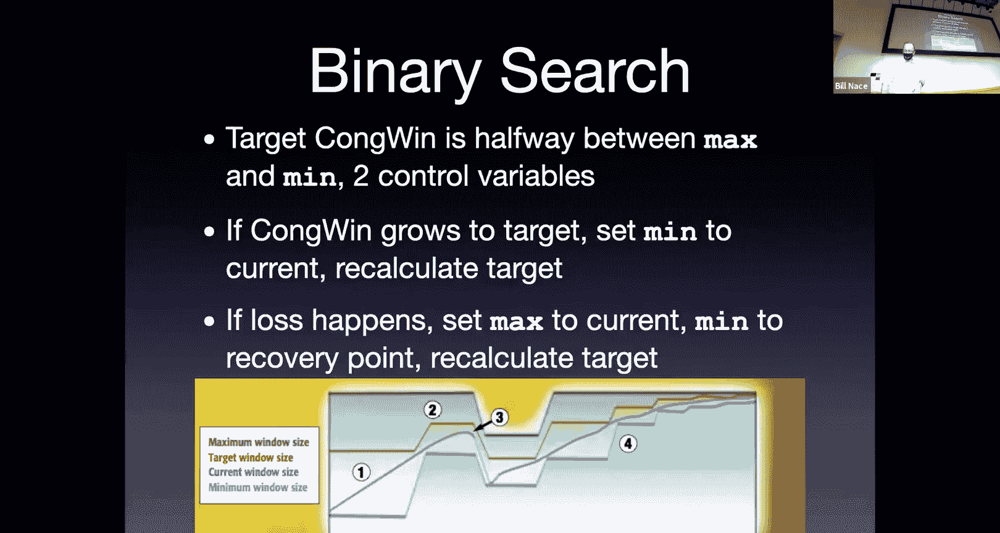

Cubic is an extension of this okay， so bigic binary increased congestion is the searching process。

Cubic is trying to be a little bit more aggressive， and you'll end up with。

In the congestion control or congestion avoidance phase。

 you'll notice we don't have the saw tooth anymore right instead we're being more aggressive to fill that window when we're recovering we cut it in half and then instead of linearly increasing we end up with these big jumps at the beginning and then we plateau out at the end so you end up with these curves。

And again， your total transmission data is the integral of that curve。

And so this is going to be an increase because this is a bigger。Value under the curve。

As compared to those straight triangle salted waves。

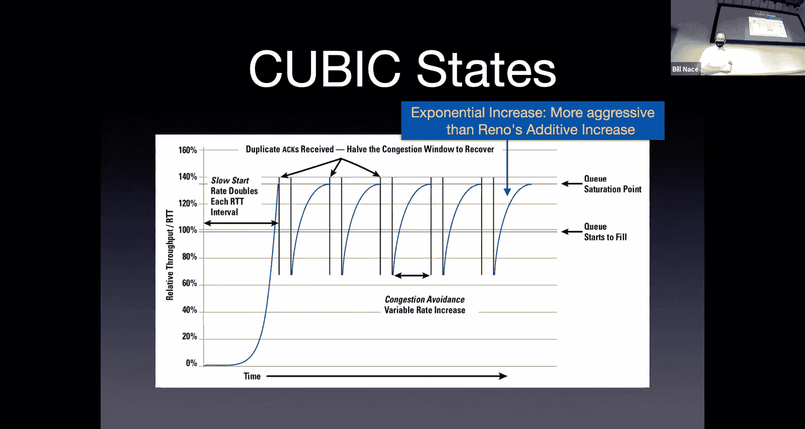

On the question on the previous side。Okay well so first off。

 the target is always calculated to be halfway between the min and the max。

 so anytime you change the min and the max variables you rec calculateulate the target to be halfway between them。

Yeah， I'm not entirely sure how the max is set， I believe it's kind of like the the slow start threshold it's a value that you go ahead and have programmed into the implementation or you know set by some FIG file or environment variable。

Just like at the beginning， I don't know how the min is set either， same way， I think。Okay。

 the big algorithm also。Takes this idea that we talked about briefly。

 previously with the delay based Vegas variant， and there's some work in the algorithm trying to be fair to other flows。

Okay， so if。We can sometimes see from the responses that we might be competing with somebody else and。

You'd want to be able to be nice in those cases sort of thing B actually tries to be fair tries to incorporate this fairness also in its algorithm by being less aggressive that's kind of why you want to curve that off when you're towards the top is you don't want to be taking bandwidth away from somebody else who may be giving it to you。

And so that gets curved off。And hopefully allow others to play fair with us。All right。

 so so far we've seen a bunch of different variants。Some of them just tweaked algorithms。

Okay some of them dealt with particular network problems。

And some of them had different fundamental philosophies about what the congestion was that we were seeing。

 right， And we'd say some of these algorithms that are loss based algorithms。 that is。They use the。

 and depend upon。The fact that some segment got lost and we detect that through the timeout。

 of course。They use that knowledge as a way to understand that there is some congestion and back off from。

And then the other version is Vegas， which does not use loss based。Signals it all。

 instead is a delay based algorithm。That looks at the actual round trip time and says oh this is slowing down that must mean congestion is coming somehow Okay and so we say some algorithms by their nature are delay based and some are loss based so that is I think a general guiding principle here yeah delay based is going to see the congestion coming early and respond to it。

And the loss space won't make any response until it actually sees until there's hard evidence of congestion until there actually is congestion at that point。

 and so there's a timing difference of who sees the congestion at first。

And so that's probably going to lead to this kind of behavior where。

Delay backs off and lost space grabs it。Okay。And so what could we do。

 could we kind of find some middle ground， some fairness thing that would happen and that's what。

Comes out of another glass variant I'm going to talk about today， which is called compound TCP。

 that tries to be both loss based and delay based。And so the idea is that we'd like to seek bandwidth when we think it's there。

 okay， but if we see any evidence of that， then it's time you know to back off a little bit and。

Be fair if' if you're competing with another delay based algorithm， you won't be as mean to them。

This is an algorithm that was， I believe developed them at Microsoft。

 but it's an algorithm that's firmly known as being implemented there and it' shown up in Windows for a decade or so it might not surprise you that seems to like Cal Microsoft operates in its DNA you know it's kind of like if you could solve a problem with A or B。

 Microsoft will say let's do both。Okay， and that's kind of what what we're doing here。

 We have this hybrid that's going on。The idea is in this particular congestion variant is that we have instead of a single congestion window variable that we use to calculate how big the window is now we have two。

Okay， so there's going to be a congestion window related to loss based。

 and that's going to be the sea wind thing。 Okay， that's just， that's my congestion window。 Okay。

 but we're also going to add in a delay based congestion window variable as well。 And that's D wind。

And the total congestion window is going to be the sum of those。 So when you're wondering。

As a sender， am I allowed to send this segment and I need to check。

 you I check the flow control window and I check the congestion control window。

 What I'll actually be checking is the sum of these two numbers。Is the sum of those。

 which is my actual window， does that allow me to send this segment or not？

And then each of those individual variables becomes a control variable that we use to respond to the different sorts of congestion and so sea wind is going to be updated as if you were a loss based algorithm and D windd is going to be updated as if you are a delay based algorithm Okay so for instance。

 if you were in。The congestion avoidance， the additive increased multiplicative decrease phase。

 and you're dealing with congestion window， the sea wind variable， you add one Ms。 right。

 That's what you would normally do。 You have to tweak it a little bit because they don't want to add one Ms just to that half。

 They want to add one Ms to the whole thing。 There's a little bit of math to make sure that that's scaled over the total congestion window。

 but that's pretty easy to handle。And then if there's a loss。

 you divide your congestion window pieced in half。On the delay window side。

You're going to update your delaying window variable to get a new value。

If you look at the round trip times。And you analyze them and you say， oh。

 it looks like the round trip time is。falling or steady， we believe the network is underutilized。

We would like to have more bandwidth。I'm measuring these round trip times and it looks like there's more bandwidth。

 yes please， I'll take it。OkayAnd so what we do is we want to increase that delay window variable a little bit and so we have a K value that is ir responsiveness parameter once again。

 it seems like Microsoft DNA right， let's just go ahead and make some registry variables that people can update to be what they want。

And so K is a parameter that will tell you how responsive you're going to be。

 you're going to take your old delay window and raise it to some power。

And then you're going to multiply it by some mouth of that parameter， another one that's。

It is user setable。Okay， and add that to what you had so。The point is not what A and K are。

 The point is if we think that the delay measurements show that there's more bandwidth there。

 we would like to increase the dwin variable。OkayAnd if we think there's somequeing happening。

Which we see， because the round trip time is increasing。T， let's bring some queuing theory into play。

 You can actually do some queing theory math to try to figure out what the queuee length。

Of the sum of all the network cues that are there。 You can kind of measure that and say， oh。

 I think this many segments are probably in the queue are waiting already。 little bit of。

 you can see shades of little law here。 right， So let's just go ahead and subtract that out。

 If I think there are five segments in the。In the network。

 let's go ahead and subtract five from the delay side。Okay。And then if there's an actual loss， right。

 The timer goes off， we're going want to cut the delay window。Down a bunch。

 And so we're going to multiply it by something less than one。

 And there's going to be some beta parameter that the user can set to scale how big a loss you're going to have。

Okay， so， beta can be like 18 or something like that。Okay。Yeah。And then you take these two window。

 D window C window at them together， get your total congestion window。

 you now have an algorithm that responds。To loss and delay。Both of them to， to manage。

What's going on Okay， and this turns out to be a nice fair algorithm。

 right It ends up being a little less aggressive。Because the loss based thing is only half of what's going on。

 it sees and is a little bit preventative because it has half of it being a delay based variant as well。

Okay， which is great。Okay， and that gives us some of this fairness sense， which is。

sing to be very useful， especially if we're going to encourage other people to use delay based algorithms。

Okay， and so that's great compound works。Nicely and is fair， E。

On that point or last slide providing additional bandwidth to the director。

I guess like kind seems to I ideally work。Yes， so this is one of those kind of。

 let's encourage the world to move away from Reno and new Reno if we didn't be nice。

 wouldn't you know， we'd have unicorns and and rainbows if everybody was using a delay based brain。

then I could use my delay based variant， I would get more bandwidth right that's the key thing we want out of a delay based variant。

I I want more overall average bandwidth。But I'd like to not have bandwidth with taken away from me by others。

And so that's why we'd like everybody to be fair to be using some algorithm that。

It doesn't compete with us so much。Which brings us to the next thing I'd like to talk about。Okay， is。

Smoothness。Meaning this tuning parameter。So I think alpha is a tuning parameter there that this looks a little bit like the exponential weighted average thing one plus alpha times my variable is what gets implemented and that so that。

If I ignored the K， let's imagine K was one in that first equation。

 then updating my variable with one plus alpha times the thing is the same smoothing function we used in the exponentially weighted moving average algorithm and that's what that alpha is doing and it's going to tell you kind of how smooth you want。

Your average to be。Let's see。 So Kyle's asking about， okay。

 so Bill's just gone through a bunch of these algorithms。 What does the real world do， Okay。

 and mostly the real world， I mean， did you sit down anytime， Did you sit down today and say。

 what algorithm am I going use to interact with the Web today。

Turns out you did okay and you did it by picking up this kind of laptop versus that kind of laptop with this operating system wanted or something like that usually what happens is our operating system vendors choose for us which algorithms they're going to use and so if you're using Microsoft guess what it's compound TCP that's their thing right and Cubic and BC show up in Linux。

Okay， I actually don't know for sure what's going on in Mac OS。Okay， and frankly， they could change。

 right， some versions of Linux were using BIic and then they decided to use cubic。

There are situations where you can override that， right if you are setting up a system that you know is going to。

Going to operate over you know over satellite network or something like that。

 you could replace the algorithm you want and usually there hooks in the operating system。

 kernel extensions and things like that to allow you to do that。

 but most people aren't going to do that Most people are just going to go with whatever shows up in their operating system or they may have you know I've got my Windows machine and I just signed up for satellite。

嗯。Internet， because I happen to live in rural Montana somewhere and it's the only thing I can get and my vendor is going to give me an application say。

 please run this to set up your network。And that would do the install stuff to put in a new algorithm for me。

One of the benefits for congestion control at the host is we can do that。

 I just have to change what's going on on my particular host to get the algorithm I want。等。All right。

 so we were talking about fairness， and I wanted to discuss something called the prisoner's dilemma。

You may have heard of this I'd like to think that you all at some point in your career have come across some form of the prisoners dilemma This is a game theory。

Statement dilemma that was generated back in the 40s and 50s when game theory was getting off its ground。

 it was actually was。Devisised as a way of understanding strategic behavior in a nuclear deterrent world okay。

 so I mean， that's kind of high stakes research if there's ever been high stakes research。And。

It has some really interesting implications for us in networking， as well。

So in its classic form and I should point out game theory is a big area of research。

 there are people who there are conferences on game theory algorithms and things like that and people will talk about many different forms。

 you repeated prisoners' dilemmas be different from this。

 you know how many times you're going to play there are all kinds of things going on in its classic form for today。

 all we need to do is look at the classic form and understand it。

 and that is set aside in this idea of there being a couple prisoners。

So the idea is that these two criminals， two people have committed a crime。Okay。

 and the police nab them both and what do the cops do when they grab prisoners。

 one of the very first things you make sure to do is separate them because you don't want them to talk and be able to coordinate the defense。

You don't want them to get their stories straight or anything like that。

 so you separate them and you interrogate them separately。Okay now that the interrogator is going to。

 you know， go into that room that's got nothing but a little table that the prisonerers handcuffed to and slapped down a big file on it and drink out of his coffee and say okay here's the deal right you have a choice basically the choice comes down to this。

And it's the choice is given to each of the prisoners independently。And basically。

 the choice is you as the prisoner， you can be silent， you can shut up or you can rat out your buddy。

Okay， that's your choice。And what's going to happen to you is determined by this matrix。

Okay the idea is， if you're， if you're， know， if you rat out your buddy， that's great。

 when you will not be found guilty of the major crime。 He will instead。Okay， and。

You end any thes sees and so you end up with this matrix that shows what's happening for each side you have two prisoners A and B and they each independently make the choice are they going to rat out their buddy or they going to。

Go to stay silent okay and the way the matrix works you figure out okay if a is silent and B is silent this is what happens and so for instance if both of them shut up the cops you know won't have anything to go one for the major crime but you know maybe there's some gun related charges or something they'll stick something on you and you'll get a minor penalty six months each of you。

Okay。嗯。If A betrays B， if a says， oh yeah， he did it， okay， well that's great for a， A goes free。

 he's rewarded for that， he gets immunity from prosecution， you know okay， thank you very much。

 you've done good service B， you're screwed right we now have evidence against you， you get 10 years。

Okay。And。That box in the upper right corner is symmetric to the one in the lower left。

 if B betrays A， then A gets 10 years and B goes free。Here's the catch， though。

 This offer is given independently to each of them。 And if both of them betray each other。

 then you end up with both of you going down， but maybe not so much。 Maybe it's five years apiece。

Okay， and so this is known as the payoff matrix。In game theory。AndNow， here's the key。

 Here is the reason that this is a dilemma。Okay， if you are a。

And you don't know what B is going to do。 right， So you， if you look at this matrix。

You are making a choice of whether you want the upper row or the bottom row。Okay。

 and you don't know which column you're going to end up in。

 You just know you're at the top or the bottom。And you'll notice。In each for each column。

Things are better for you on that bottom row。I don't know if B is going to be silent。

 if he is silent， it would be better for me to betray him。😡，Right， because I get， I go free。

Instead of getting six months。Okay， or if B betrays me and again。

 I don't know that it's going to happen or not， then I'd rather get five years than 10 years。Right。

And so the dilemma portion of this is this。Seems to say。That if you are a prisoner given this choice。

 it's better for you to betray your buddy。Because no matter what your buddy does。

Things are better for you。And since both sides are going to make this choice。

 you end up with that bottom right hand box， both of you are going to betray each other。

 you're always going to end up with five years problems。Okay。

 this seems to be like a bad thing happening in with strategic dilemmas。

 you can imagine when this was first proposed in the 50s， when this was not， let's betray each other。

 but this was let's push the button and nuke the other guy。

It seemed to say the best thing to do is nuke each other first。Because you're going to end up。

 you no matter what things are going to be better， but you end up driving things to that five year point where。

Actually， we've got nuclear winter happening because both sides are going to nuke each other。

All right， so it's an interesting dilemma， there's some interesting research。

 interesting stuff you can read about this。And certainly， you know。

 I know if I'm ever planning a crime with somebody buddies before we do it。

 we're going to have a long talk about the prisoners dilemma。

 make sure we understand why it would actually be better to be silent。

And trust that the other person we silent。Okay， so why am I bringing this up about networking？Well。

 it turns out TCP shows us that this prisoner's dilemma is also happening in our networks。

The TCP restrictions we've talked about are all self imposed。Okay。

 we talked about competition between a fair， I'm sorry。

 between a delay based and a loss based algorithm。In theory。

 there's nothing other than the algorithm running at your computer， the computer you own。

 the computer you can control and you can replace components of。😡。

There's nothing other than that keeping you from just sending as much as you want and taking as much bandwidth as you can have。

There's no TCP police that are going to say， wait a minute。

 you sent a segment that was outside of your congestion window bad boy go to jail。

 there's no TCP police at all。诶。😊，Which means that it's possible for us to get in a world where bad behavior can have short term consequences。

Okay， can you give me some examples？ What kinds of rules， Let's be imaginative。

 Put on your slightly gray hat。 Now， What kinds of。

Things could you do if you were writing your own implementation of TCP。

And your goal was to get as much bandwidth for me as possible。What sort of rules could you break。

 anybody？D know。Like do the minimum I reading。Okay， so if there's a loss， you're like。

 no way am I dividing in half， I'm going to。Okay， I can modify my algorithm so that I don't。

I don't take as much of a cut when there is a loss detective， right？Okay。

 I thought it interesting you also you said， but I got to make sure not to cause congestion for myself。

 So there is some self serving in there。 You don't want to just。You know。

 you blow as fast as possible， but let's go ahead and not be quite as unaggressive on our decreases as we need to be okay。

 that works anybody else。Stephana says， let's just ignore the congestion window。

 send stuff as soon as it's ready。 There's nobody going to stop you。 Yes， you could do that。Okay。

 sure， definitely。Okay， that， you know， Dion saying that might be a bad thing because you're going to cause congestion for yourself。

 but maybe not， okay， and Stephanna says， hey， if I've got a gigabit link。Let me take it。

 Let me have it。 Love that， okay。You guys are not thinking broadly enough。

 think about TCP as a whole， not just what we've talked about today。

 what things in TCP could we mess with？Can we send extra act packets to increase the sender's window。

 yes， this is exactly what I'm thinking about， right？The receiver can send an acknowledgement。

HWait a minute， let me think about this if I send another acknowledgement。

 that's going to be seen as a duplicate acknowledgement though。

And receiver my sender is going to go in and cut its bandwidth in half， that's not what I want。嗯啊。

The next question is， is it going to check the sequence numbers and detect it this is I love this answer right let's fill ahead and a packets that haven't shown up yet。

😊，Okay， guess what？ We saw sequence number 0。 We saw sequence number 1500。

 We saw sequence number 3000， right， Oh， it's obvious this guy is going to send us 1500 byte。

Segments， let's go ahead and app 4506000。Yes， I haven't gotten them yet。 Okay。

 so there's a danger there。That I'm going to actually lose some data。 Okay， But if I have a reason。

 you know， if it looks like it's reasonable， if it looks like we're getting everything through， sure。

 let's act packets we haven't gotten yet。Okay， I love it。Just send massive values on our own。

thenSo you're just saying， let's。Let's not even go 6000 right， let's just act 10 million。O。

We' got to be a little careful because you don't what you'd like to do is be acting things that are in flight already。

Okay， if you act something that's not in flight， then your receiver is going to get or your sender' is going to get confused。

Okay， but yeah， you could make some calculations about what you think is in flight and act them already。

 okay？嗯。And Abdul Hadi is saying， wait a minute。 that's not work。 What if we don't actually get them。

 Okay， well， okay， that's you're going to have to deal with that。 That's right。😊，Okay， what else。

 anybody？Anything around flow windows receive windows？Any ideas？man。

 you guys normally are so creative around， hey， can we have a security hacker on this here we don't even need real security breaches to be messing with our protocols。

Right。Oh there we go， Stehanos is stepping in， let's he's breaking out of her own channel。

 let's go ahead and spoof bin packets to everyone else。Okay。

 so the problem there is we're going to have to have figured out what ports they're running so that we can kind try to f those off。

And。There will be complaints if。If nobody else can use the network。

 then some IT guys are going to show up and do things， so you'd have to be little careful about that。

 but maybe。嗯。So I was when I was a grad student， this was 1999。

 I was sitting in a room over in Porter， I saw a talk by a guy named Stefan Savage who is a new PhD graduate who was going on looking for a job and it was one of the best talks I've ever seen and I know CMU offered him a job but he went to UCSD because he liked to serve for something I don't know。

But during this talk， he brought up this idea he said， hey， you know。

You don't have to follow the rules about about using TCP and about making this happen。

 And he demonstrated it for us that day， where he downloaded。

A huge amount of data It was a developer CD amount of data， which today is minuscule okay。

 but at that time it was something that we did， I was doing it all the time downloading these developer CDs for Microsoft that were you know。

 it would take you like an hour， hour and a half to download this thing okay。

 and he downloaded in less than a minute。Okay， and that was because he he was actually acting things that hadn't been sent yet or that were in the pipeline to be sent and messing around with some other rules。

Okay， and。I thought it was fantastic。 It was great。 I didn't have to break into anybody's system。

 Let's just go ahead and do this。😊，Okay， now。Why after seeing that。

 didn't everybody in the auditorium we all computer science people。

 we all have the capability to this， why didn't we all run out and code up our own versions of TCP that would do this？

Well， some people do， right， You can see some of these。less prevalent these days。

 but it used to be people were selling download managers right you'd buy this code that would run on your Windows XP box that would be a download manager and what it was doing was messing with the TCP stream to let your data come down faster than others it was its own implementation of TCP and it led to an arms race where servers would detect that that was happening and then your connection would not work on that particular server and then you'd complain and they'd say oh give us 10 more bucks and we'll give you an upgraded download manager kind of thing。

嗯。And whyhy don't we all do this？Why don't we all go ahead and run a download manager。

That will give me twice as much bandwidth。At the expense of everybody else。 This is why not。

This person's dilemma。 Yeah， it'll work now。 But if everybody does it。

 we're all in this smer for five years together。It only works as long as nobody else betrays。Okay。

 and if everybody starts doing it。We're all in trouble。And that's the way a lot of network is。

We're all kind of。This is the great power comes great responsibility speech right。

 we all want to make sure that we have a good network and really what we'd like is a good network for everybody。

😊，Not just the few people who are screwing everybody else because if that gets out。

 then the network goes down for everybody。Oh， yeah。All right， so what do we talk about today。

 I introduced you to a couple other variants of TCP congestion control。

And I chose the ones to show you some of the differences。 show things like， yes。

 we can optimize an algorithm by tweaking a little bit。

Or we can step back and understand loss in an entirely new way。And say， oh。

 let me then get a better scenario。By measuring delay instead of loss， for instance。

We saw that sometimes you have algorithms for particular situations。

 like I'm running a lung fat network and it let me point out what that is to you。

As well as see some of the versions that are actually running these days that are much more complicated and much different from the original Tahoe and Reno versions。

And we see that in Cbic and the compound TCP。It's iss in Windows， okay？All right。

 thank you very much， everybody。 I will see you on on Thursday。

 and we will dive into the next layer down。 We're network layer bound this week as well。

 and we will have finished up with TCP。😊，And congestion control for now。

 we'll hit the congestion control at the network layer later， okay。Bye bye everybody， see you later。

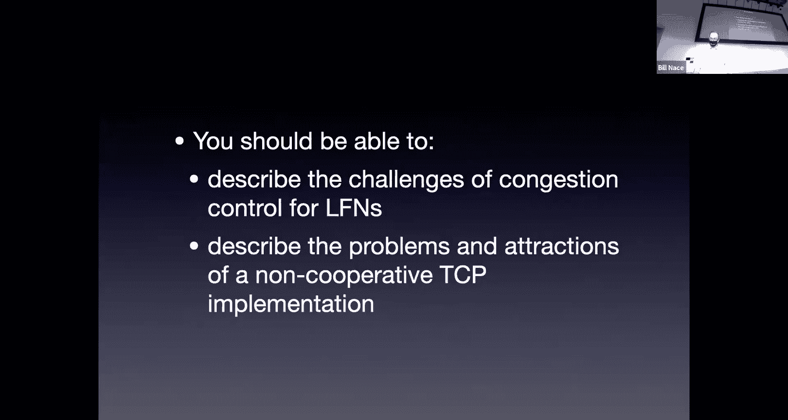

是。嗯。Yes。

Yes。