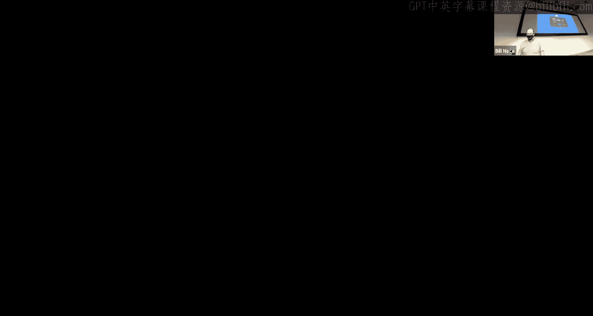
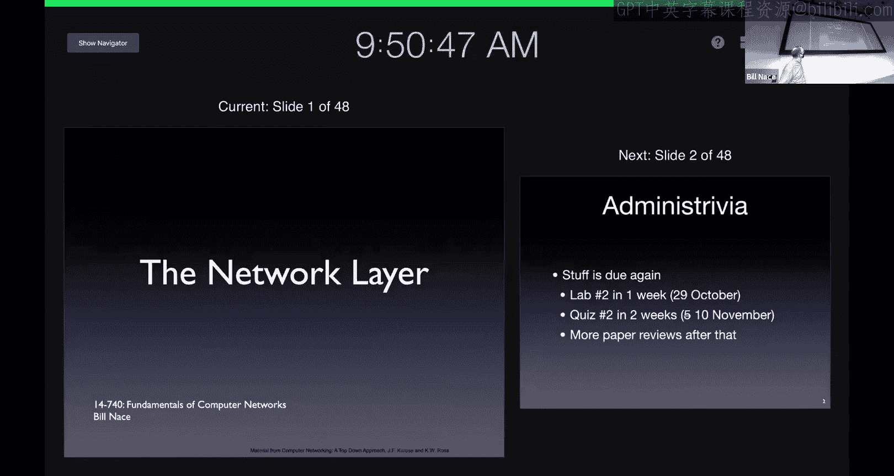
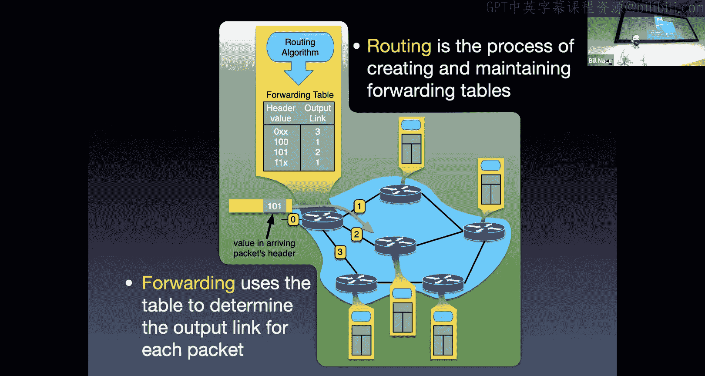
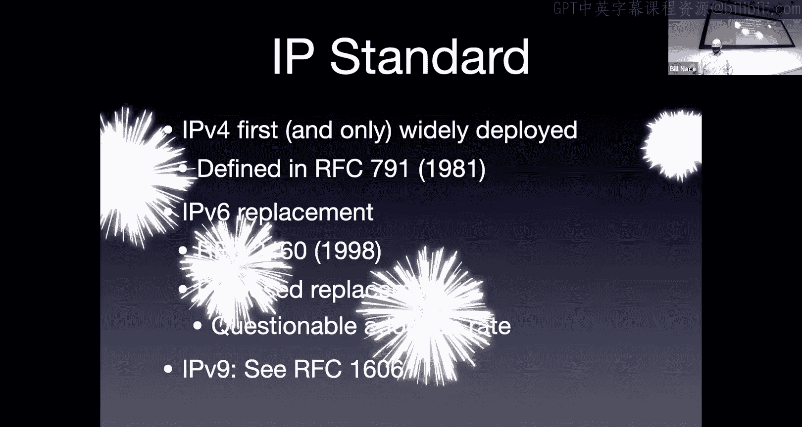
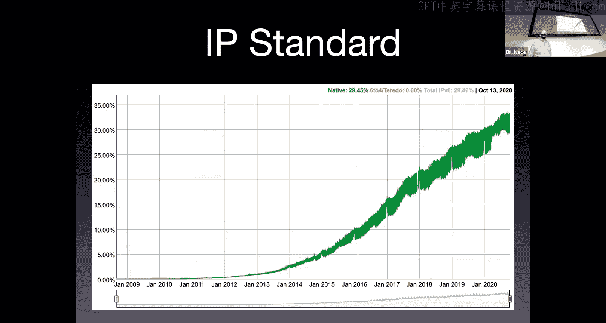
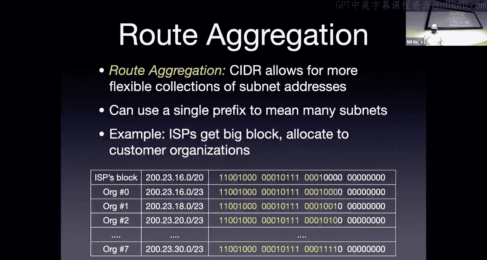
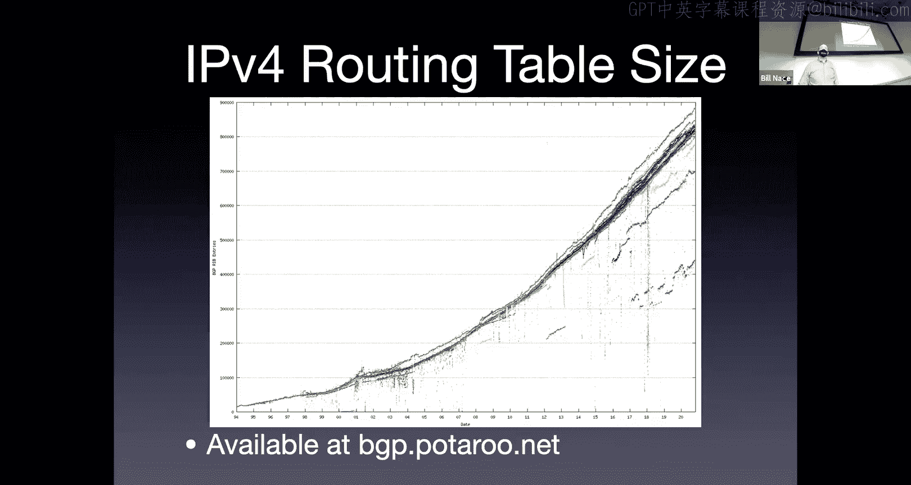
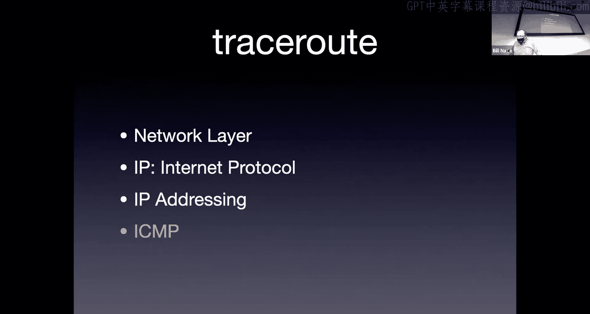
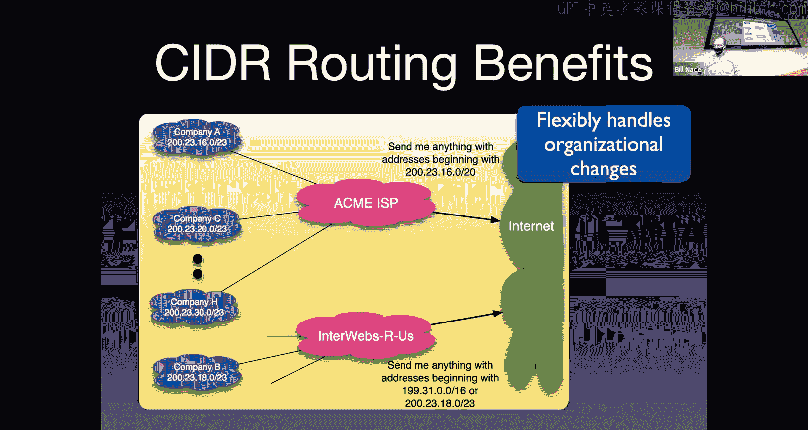
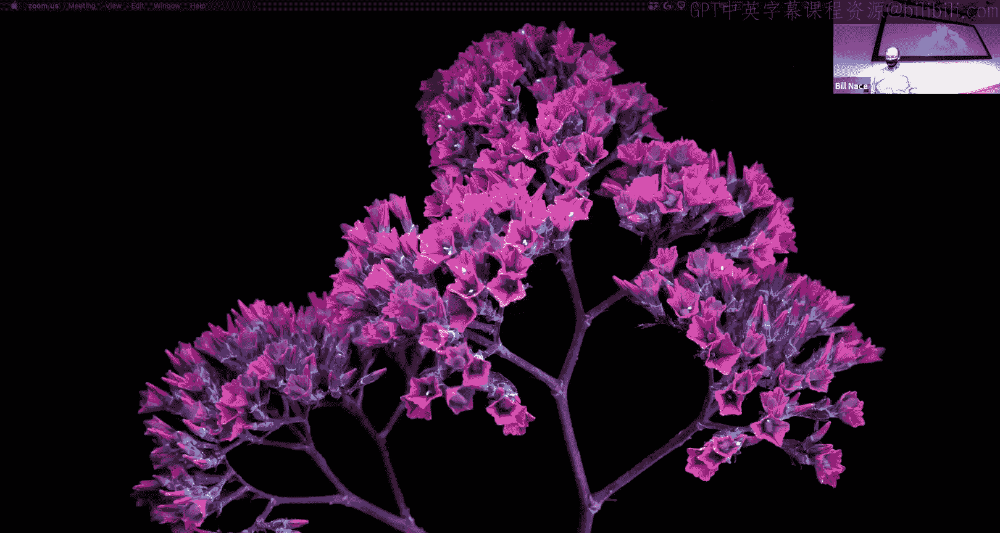

# CMU《计算机网络基础｜CMU 14-740 Fundamentals of Computer Networks 2020》中英字幕（deepseek p14 -P14-2020_10_22_Lecture14.zh_en -BV13J6uYpEZm_p14-

This is 14，7，40。 Welcome， everybody on another。😊，Beautiful fall day。 Once again。

 I hope you get a chance to get outside and enjoy it。😊，Actually。

 and I hope it's a beautiful fall day wherever you are。As well， today， kind of exciting。

 We're going to move into our next layer of the stack， which is fantastic。

 So let's get started with that。😊。

As soon as I get all my Zoom buttons pushed properly。Yeah。

Alright， so first couple of administrative points to make。1 is， yes， stuff is coming up。

 So just a warning。 You guys know that hopefully， within one week， your lab 2 is due。

You may or may not have seen the announcement on Piazza that I posted that I'm going to have to cancel next Tuesday's class。

And as a result， I' basically just pushed all of the lectures back one session for the rest of the semester。

 which means you've got a five day respite and your quiz two will actually occur on the 10th of November instead of the 5th of November。

And we basically just pushed one lecture on data center networks off the edge of the course。

 apologize for that， if you want to learn about it。

 there is a nice paper in the readings on the website or go take 760 advanced real world networks to learn about data center networks。

I also normally give this talk after we've done midterm grades， but because。

You know because of the fact that we're canceling I didn't want to wait until Thursday。

 so I just wanted to let you know that this weekend I will be assigning a midterm grade for everybody。

Okay， and。The point of that， the sole point of that。

 There's no other point is that I want you to have some feedback on how you're doing。Okay。

 it's based upon some grades， so it's based on some of the things you've done so far。

 in fact I think we've got everything you've done so far graded。

And so it will be calculated based on all those， it will be calculated using the exact same algorithm that I will use at the end of the semester。

Those grades obviously will go into that same calculation at the end of the semester。

 but other than that， there's no effect of the mid semester grades。Okay， so don't worry well。

 I guess worry or not worry right I like to say it's not destiny because it's only 30% your grade So if you end up with a mid semester grade you don't like。

You've got plenty of room to go ahead and improve。Okay。On the other hand。

 if you do get a grade you like， you need to continue performing at that level， okay， you can't say。

 oh， I got an A for mid semesterster I can now slack off because that is only based on 30% of your grade。

 but it's some good feedback for how you are doing。And those I think show up in SIO or wherever。

 I'm not sure whether they're as soon as I push the button or whether they're Monday afternoon for everybody。

 so expect to see that over the weekend。Yeah。All right， then into this new layer。

 it's kind of cool actually mid semester we're halfway through the course and we're halfway through our layers right we have finished the application layer。

 the transport layer。The only two we're going to deal with for the rest of the course are the network layer and the data link layer。

 we're not going to do physical layer。In the course， so time for a new layer。The network layer。

 what's it all about， The network layer is going to provide a logical connection between the hosts of the network。

Now， that sounds a lot like the mission of the transport layer。 right。

 The transport layer's mission was to provide a logical connection as well。

The difference there is that the transport layer is providing that connection between applications。

The network layer is just providing it between hosts。

So its job is to get a chunk of data from my computer， from my hardware。

 to any other hardware in the network。😡，whereas the transport layer was to get from Zoom running on my computer to zoom running on your computer。

 okay？Again， it's a layered architecture。 So it does this。

 It makes this work by using the services of the layer below it right， in the layer below it。

 the data link layer is going to be able to move data between any two connected hosts。

So data link layer is going to be able to get data from my computer to the first router。

 whatever CMU has set up， the network layer is going to make use of that and ask the data link layer to do that over and over and over for every hop through my network。

Architecturally， this is the center of things in some sense this is。The hardest layer。

 this is the glue that's holding everything together。

 it's some very interesting algorithms go on here， and we're going to learn a lot of cool stuff here。

The network layer moves data and of course every layer has its own name for that data。

 so the thing we are sending in the network layer is called a packet。

And we got to be careful because a lot of people are not as careful about that and you will see people using the word packet for something that TCP sends or something that travels over Ethernet。

The network layer is sending a packet from those host to some other host and so that means if I have a sender。

 my sender is up in the upper left corner of my little cartoon internet here。

 it's sending something which means the transport layer has just given it a segment。

And the network layer is going to take that segment and encapsulate it。

 which is a fancy word for put it into the packet。So the segment is going to become the payload of a packet that we send。

 and then that gets sent from router to router to router to router throughout the entire network。

And so all of the routers are going to be running network software。😡，Or hardware。

And that doing some network processing on each of the packets as they flow through。

Until we get to the final endpoint。Where the network layer on that end host will take that packet。

Extract the segment that is in the payload and give that segment to the transport layer。

So there are a couple key functions， a couple of things that the network layer is going to be forced to do all the time。

 It's going to do routing， and it's going to do forwarding。

 And we call this the control plane and the data plane。

 The control is all of the kind of algorithmic questions about where is this going to go and how do I get it to that location。

 How do I control the processes that are happening。In the network layer。

And so this is the end to end path planning， this is where all of the routers in the entire network communicate enough information to determine what is the best way to get a packet from my laptop to your laptop。

 what particular routers should it get sent throughout the entire network？

And so that's a kind of interesting， very distributed， very difficult algorithm。

 and the kind of fun to learn about。Athwarding is a process that happens in each router for each of the packets as they come in。

Okay， so routing happens to determine a route forwarding is something that occurs on the data that's being sent。

 so that's why we call the data plane。The packets， as they show up。

Get processed at the router and the work that's done per packet is known as forwarding。

I also include here something about connections。Because in a general sense。

 some network layers do require some connection management。Okay， I P doesn't。

because IP doesn't need the state being initialized about any connections。

 it doesn't have any concept of connections， but there are network layers that do。

 and so I think it's only fair that I point out that if you work on some other network you might need to do some something else here in the network layer。

Yeah。So here's this difference between the two processes， the routing and the forwarding。

 and I try to be very pedantic about this， this is another thing that you will see people using the word routing。

In a more general context than I do。Okay so I think it's important to note that routing is the thing that happens when we run a routing algorithm。

And that algorithm produces the data that becomes the forwarding table。And it is something that runs。

 It's that， you know， in my little cartoon picture here， it's that blue bubble there。

That's an algorithm that is running on all of the routers and all of the routers are going to have to communicate between each other to process that so it's a very distributed algorithm。

It's running。 And in theory， if the network were completely static。

 we could run that routing algorithm once and be done with it and never have to run it again。

And it would output a forwarding table。That each of the routers would then use。

The forwarding process is what happens when a packet shows up at the particular router。

And the process is that the router will look in the header and find some information and use that information to look up in the forwarding table what to do。

Okay， so for instance， here I have a packet showing up and in its header it has a 101 in it。

And the router will forward that packet by looking up the 101 in the forwarding table。

And so it looks up， it finds the correct row that matches 101。

 and it sees that it should send that particular packet Alex link number two。

Now remember our vision of routers right a router is basically a box with lots of cables out of it in my picture I've only got four which for many routers is is you chunk changed many routers will have you know 96 different connections or something like that and the output of this forwarding process is figuring out which of those 96 wires。

The particular packet should be sent down。Okay。This is process， by the way。

 many people will talk about。Routers are routing packets。系。And I think that that works at some scale。

 right， but us who know networking should know that routers do not route packets。

 they forward the packets。They route as part of the routing algorithm to figure out what's going on there。

I did mention that some networks have these connections and have to manage them。Okay。

 and the network layer， it is true， can be connectionless or connection oriented。Okay。

 and we have different words for those， a connection less network。

 we call it a datagram or a packet switch network。And a one that has connections。

 we sometimes call those connection circuits， we call it circuit switch network。

This sounds a lot like the TCP UDP choice。We talked about in the transport layer， we said， oh。

 there are these connection less unconnection oriented protocols。

This is a completely different choice， though， it doesn't work like that okay。

 this is a choice that is made when the network is constructed。

If you want to build a connection oriented network。

 you go by different routers than you would if you were building a connectionless network。

 So it's not something that an application can decide， oh。

 I'd like to have the connection oriented service happening at the network layer。

It is something that was decided when the network was constructed。

And there are going to be different protocols at the network layer for these two different kinds of networks。

And it's not a service choice at all。Yeah。In a packet switch Datagram connection list network。Okay。

 there are no connections。 There's no sense of state。

 Every packet is handled individually and independently。

OkayAnd so we're just looking at it at each packet and that meant means that the packets have to have an address in the header that tells where they're bound。

 so it has to be an address of the destination computer。In the header。Okay。

 and those packets as they go through the network router to router。

 each router is going to look at that address。And decide which connection to send based on that address。

And it's possible that those packets get sent down different paths。

You've seen a little bit of this probably in your trace route that you've done for homework one。

You probably saw， oh， at some point， you know trace routeute step 17。

 it shows two different routers on that line Okay that's because some router in the middle there made a different decision on the two different probes that were being sent。

Because it can， it's a network that is thinking about each packet independently。

 It's the fact that a previous packet went down a different path has no bearing on the forwarding of this particular packet。

It just means that the forward ring table at some router got updated between probe 1 and Pro 2。

Such that there's a different desk， different outbound link at that router。In a datagram。

 in a packet switched connection， less network， the addressing。Is of the and host。

 so that means every computer in the network has to have a unique address。

And we use that address to specify where the packet is supposed to end up， this sounds very natural。

 right？So we have things like， okay， I don't know， let's imagine I've got a 32 bit address。

And that means that the forwarding table that each router has to make these decisions has to have ranges for those particular addresses because that router has to be able to look at any packet coming in with any of those 32 bit addresses possible and to be able to say。

 oh， this one goes out wire number two， this one goes out wire number 83。

And so that forwarding table is going to look something like this。Where you have a range。

 you say from this particular bit pattern up to that other bit pattern。It goes out on wire zero。

 obviously the use of the ranges is just to collapse a bunch of roads。

You could imagine just having two to the 32 different rows of my table。Okay。

 here's the output for each of them， nobody does that because that's way too much and so instead we have these ranges that we collapse。

Edric， so are the higher order bids？Are those associated with some particular yeah we'll get to that and Ed is asking is there some structure to this do the higher order bits tell you something and they do to help us manage these the size of these tables yeah we'll get to that in a couple slides。

对。Does this all make sense for Datagram networks？Yeah。

 you may actually have some sense that this is how the internet works because that's how the internet works。

And the internet is a packet switch network now just for completeness and just。

So that we understand that these are not fundamental choices about networking。

 but fundamental choices about a packet switch network。

 Let me just describe briefly how a circuit switch network is different。 So once again。

 this is a circuit switch network。 This is not the Internet。

 This is somebody else built another network。Okay， which。I mean， was very common。呃，So。

You the internet has kind of blown all this away， but these were， in fact， up until the '60s。

 this was the only way you did network。So the idea is that if I want to send some data from a source to a destination。

 I can't just send packets， I'm going to have to set up a circuit first。Okay。

 I'm going to have to in the first stage of this， send a message through the network that will move from router to router to router following some protocol to choose a particular connection through the network。

Okay， and so that's the purple wire that or line that I have done at the bottom that is selecting a bunch of routers and those routers all agree that they're going to be part of the circuit。

And they set up some state in their forwarding tables to make sure that happens。

And then there's an accept message that would come back that kind of a reddish。

arrow going back from right to left is。Is it confirmation that the circuit has been established？

And then once the circuit is established， now I can start sending data down this network。Okay。

 and so the yellow is the data that is flowing from sender to receiver。Now。

 one of the reasons people like this idea is once you've done that work to set up the circuit。

 you can have some sense of guaranteed bandwidth and you will have a more static， more regular。

Experience for each of the packets in your network。Okay。

 because you've already got all these routers agreeing。 Oh yeah， this is what we're doing。

 we're sending all the packets this way。 It becomes a much simpler process after the circuit has been established。

OkayAnd then of course， once you're done sending your data， you would need to tear all this down。

 you would need to tell all the routers， oh we're done with that circuit。

 please go ahead and release any guarantees you had given us。

 release any state that you had set aside。This also means that the actual forwarding process is going to be different。

So the forwarding in a circuit switch network uses something called a circuit address or a virtual circuit address is something that's very commonly used now the way a virtual circuit address works is it has a number。

 the number is not associated with the end hostst。The number is associated with each of the links between router and router。

 so from router A to router B， there is a number， a virtual circuit number that is established for that particular step of the entire connection。

And that means that a router when it sees a packet coming in will look in the header for a number。

 but the thing they're looking for is this virtual circuit number。

 and they use that combined with the link that the packet arrived on。To look up in this table。

 which row of the table we're working on。 So you see that on the left side of the table。

 I have a link number， which wire did it show up on and a virtual circuit number， Oh，19。

 That's the value in the header。 And that's how I figure out what row of the forwarding table I'm dealing with。

And then that tells me， okay， which link do I send this out and what number do I replace in the header。

 so I'm going to change the virtual circuit number to a number that is used between this particular router and the router we're sending it to。

Okay， the virtual circuit number that was agreed on between that pair of routers。 And so。

 for instance， if I got a packet coming in on link one with a 19 in it。

 you'll notice there are several 19s in the in the table， the numbers are not unique。Overall。

 they're only unique between pairs of routers。So I would have to say， oh， this came in on link three。

With a 19 in it， I'm going to change that number in the header to a 99。

 and I'm going to send it out on link number one。Now， the reason we have， well， let me ask you what。

 Why would I have these different virtual circuit numbers？ It seems a little confusing。

Seems like a lot of work to manage these。Why not， for instance。

 just have a single number for the entire path？Kind of like we do with a packet switch network。

Could it have a single number for the entire circuit？Edry。To kind ensure that single number。

唔 use every single。So oh you're so close， yes， yes， so the Edric is saying， hey。

 it would be difficult then to make sure that all the routers are using the same number。

That's the thing we would have established during the circuit setup phase。Okay， the real problem。

 though， anybody got it。The real problem is maybe what Stehanos is saying on chat。

 the real problem is I somehow have to make that number globally unique。

If I was using the same number for that route， right。

 every router involved would have to make sure that that's the only route they use that number on。

 otherwise they would get confused about which of the two routes。

This this particular number appeared in and so that global coordination turns out to be really difficult and we need really big numbers to be able to to manage that so instead。

It's much easier to do coordination just between each pair of routers。And actually。

 each pair of routers already knows the numbers that those pair is using so they can pick one without even having to ask the other side。

 which one to use。Okay。I'm going to back off of circuit switch networks。

Okay go back to packet switch networks。 In fact， I'm going to go back to our packet switch network。

 The one we know and love， and that is IP， the Internet protocol and a bunch of pieces we're going to talk about with with IP right IP also has many components like other protocols right。

 We'll talk about the format。 We'll talk about what we do with packets， how we actually route them。😊。

And we'll finish up today talking about the error reporting protocol that goes with IP。

So IP is a standard。So far， the only really widely deployed network， certainly of this scale。

 it was defined way， way back way back when right in a three digit RFC number 791 way back when。

Yes it is so you may have heard of a networking standard called ATM this is not the get money out of the machine ATM it's a asynchronous transfer mode network and we will actually talk a little bit about it in the data link layer for weird reasons when we get there but I actually have a friend who worked for Marconi which is a local company that made networking equipment and he's trying to get it killed off but it's still being used for telemetry for Air Force drones and Air Force data。

Because it's able to travel very nicely and smoothly and jitter free over these networks and because the Pentagon can afford to have their own little network going and so they're still building ATM network equipment for that。

 I imagine there are other little places of the world where the similar thing is happening。

And there are other， I don't know the details of。For instance。

 what NASA is using to talk to some of its satellites and it could very well be using a circuit switch networking technology for some of those for all I and there are probably use cases like that where shows up。

Okay， but yeah， Ip is overwhelmed in terms of。it's overwhelmed everything in terms of number of users。

We will talk about IP version6， okay， we're now using version4。

 we will talk about version6 coming up in a week or so it's a replacement that。

We've been kicking and trying to move everybody， the problem with changing the network layer is it's that glue that holds everything together。

And there's a lot that depends on it and a lot of moving parts and a lot of things that you didn't think should be depending on it but are and so to change it。

 you're effectively asking everybody in the world to change their routers and we like to do that at roughly the same time so one way to have changed to version 6 is just to shut down version4 and Monday morning we'll start back up with version 6。

And of course nobody likes that idea that has way too much risk associated so instead we have been trying for the last two decades to move IPV6 along and here's a graph this was from a couple days ago when I was preparing this lecture。

This is a graph that Google puts out showing the percentage of traffic showing up at its data centers that is IPB6。

And we're actually doing okay， we're over 30%。I've been showing the same graph since 2009 since before actually you it still went on for a couple years before that。

 but it was like you know very， very small， so I'm happy to say 30% is good。For a couple years。

 I was really excited because it looked like it was growing exponentially。😊。

And then it looks like it's gone back to being linear。

 but yeah so and keep in mind this is one data point right this is Google it's a big data point because they're in a lot of places。

 but this does not mean that 30% of the network traffic is IPV6 okay just what Google is seeing。

Did end you have a question。で itそは。somes it both like I need before and I need everything。

Even if we don't reach up 100% of even wait。I think it's a good。So Dena is saying， hey。

 we saw a lot of dual traffic。We saw a lot of the same things being sent using IPV6 and IPV4 in one of the labs or homeworks right and that's a very common tactic with in a lot of cases and so he's saying well couldn't we just shut off IPV4 at some point because you know we're doing this in dual train anyway one of the problems with just shutting off IPV4 is that decision is not made in one place there's no big switch or oh we're going to stop IPV4 IPV6 we've got 40。

000 different organizations actually I think it's more maybe 60。

000 different networks in the world each of whom is making their own decision about whether to do that or not and so there's no governing body that will say you know as of。

I don't know， let's pick November 4th as the date that we're going to go ahead and all be IPV6。

You'd have to get 60，000 people to agree to that。So it'll happen maybe possibly。

 but it's just been really slow slog。

Okay in IPV4 what does the actual bits look like we've done this with every protocol so far one of the most important things about the protocol is figuring out what the bits are and how to interpret them and once again we have a fixed format。

Header， right， which means I've got a lot of little boxes to talk about and man。

 look at all those boxes。There are lots of things going on here。

Its you know's TCP level of complexity， lots of pieces。

So let's look through some of them first field up is version version numbers a four bit field okay and for IPV4 it holds a four for IPV6 it holds a six right those four bits are how a router looks at the packet and says。

 oh， this is an IPV6 or an IPV4 packet。Okay， so in some sense， if you're a far looker， you could say。

 oh， no， we're going to be in trouble because we only can go to IP 15。Okay。

 but if it takes this long with each one， that's not a problem I think I'm going to have to worry about。

The next up is header length， it's a length field， what two questions do we ask about every length？

I'm sorry。What are we counting， Okay， and that's the header length。 So we're asking。

 what's the length of the header of the packet。Justs true。 Yeah。

 That's what we're talking about here。 What's the other question。What are my units？Okay。

 and so in this case I have a four bit field， which is small。

 but it's okay because our units are going to be 32 bit words。

 so we're counting big things with small number of bits。Okay， and so。Our header， you could see each。

 each of these green boxes I've drawn is 32 B wide。 And so my header 1，2，3，4，5。

Plus that sixth field done is options， that's why we need a header length。

Because we could have options in there that make the header longer。

 we need to be able to detect that。Next up is type of service。

This is another one of those fields that there was a vision that network operators would want to use this to provide called differentiated services。

 we want to be able to look at this packet and decide， oh， has this guy paid extra money。

 should I route it fast， for instance？Okay， or should I do something else with it Okay。

 and those are the bits that are supposed to manage that This is not a field。

 this is not something that is really taken off partially because。

Kind of back to the previous question， I got 60，000 operators all that would use those bits differently。

 and so there's no good。No good worldwide global process for using them。

Next up is the datagram length。 Oh look at that two lengths in the same packet header。So again。

 I'm asking， what is it the length of？Of the datagram。 Okay， so this is the。The whole。

 the whole thing。 So the whole packet， that's the header plus the data， not just the payload。Okay。

 so in some sense， we're counting the length of the header twice。Because it's in the header length。

 but it's also included in the datagram length， no big deal we have lots of bits there and we mostly don't use them right because in theory that means I could have 16 bits。

 I could have two to the 16th， I could have a 64000 by long packet。

But you and I know that that's a bad idea to send long packets。

 so instead it's going to be more like 1500 or less， which we could do with。What 12 bits or 11 bits。

All right， next up， I'm going to come back to how these exactly work in a few slides。

 but the next row down， the identifier flags and offset all are used for a process called fragmentation。

 which we'll talk about in a second。Next up is a time to live feel。

This is a number that gets decremented at each router and now originally it was supposed to be decremented by the amount of time。

 the number of seconds that the packet took in the router to be forwarded。Okay。

 that's kind of laughable now because it's never going to take more than a second。

So now it's kind of become a hop count thing every router is going to subtract one from that number。

And if that number ever gets to zero， then that packet is just killed。

 it's it's not actually forwarded on。This is a process that makes sure that we'd never have packets existing in our network for very long and that if we had some routing loop that would send packets back somewhere and back you know send them around and around and around。

 we want to eventually kill those off Yes， it would be nice for us not to have the routing loop in the beginning。

 but this is kind of like a safety net to make sure that if we did have a routing loop。

We're not going to bring down the entire network by having too much data circulated around that loop。

嗯。And next up is a protocol。 another aphid field。 This is used by the receiver to figure out。

What the upper level protocol is， what the transport level protocol is that should get this data。

Okay， so there's a number that means UDP， there's another number that means TCP that's how the receiver。

Figures out， oh I just got this packet， let me decapsulate the segment， take the segment out of it。

 who should I give it to and because there could be multiple transport layers running on your computer。

 in fact it likely are。Then we have to have a way to distinguish between them。

Kind of like port addressing。At the transport layer。

 the receiver had to know which application to give the segment to。And it's kind of the same thing。

Yeah。There's also a header check some。Okay， another 16 bit value gets calculated using the same。

Process the same algorithm that we've talked about before， add all the things up。

 you've flipped the bits， that kind of thing。This one， though， it's a header check some。

 It's only checked on the header。Here， and I guess I should point out in。

IP requires it to be calculated just on the header in many implementations。

The management of the check sum is done using something called a pseudo header where we actually combine the TCP or UDP and the IP check some and do all the math at once。

Okay， that's an implementation mechanism that is not part of the actual standard。

 the IP protocol requires， you know you just to calculate this particular checksome。Now。

 interestingly， that check some has to be recalculated at every router。Okay。

 so as I send my packet through the network， the check sum is actually going to change。

That seems weird。 Why is that going to change？Etric。Yeah， we one of the input bits。

 one of the values that's coming into the the calculation I check some is the time to live。

 And you just dectrimented the time to live。Okay， so that has to therefore mean that the check sum has to change。

And now。One might look at this and say， wait a minute， UDP is already doing check zones。

IPP is doing check sums， why do we have to do both？Why do we have to have separate things going on。

That ones a little bit more subtle and a little harder to see from our perspective。

 but I paid back in 1981。Wasn't sure about what other networks。

 what other transport layers it was going to be working with and neither were those part of the calls。

 So UDP， for instance。Can be run on other networks， other than Ip。Okay。

 and so the calculation mechanisms it uses。Have to be。

Have to be understood in the sense of just UDP as its own thing， for instance。

 or just TCP as its own standard， because they could run on other networks。

If you have and this is why if you have UDP or TCP running on IP。

 you can do that pseudo header thing to do the computation at one place because you know that these two are going together。

 but that's in general， not true。It there's no forcing function that requires UDP to only run over IP。

 for instance。Make sense。Now somebody in the Abdul Hadi has asked in chat says and this is back with the upper level protocol field asked does this mean that there's a limit on how many upper layer protocols there could be and yes it is right I've got eight bits there。

so that means I can only have two to the eighth upper layer protocols running。Okay， and so。I mean。

 we don't typically have that problem。But and got， I haven't looked to know how many of those numbers are actually in use。

Obviously TCP and IP are the big players there， but as I've said over and over。

 there are other transport layer protocols so you've got to be careful about that。

We're not doing the project involved data。Sort of error protection within and elsewhere。

That is correct。And that's one of the reasons that IP is doing this is they're saying we're just going to check some of the header。

Okay， if you want to be running another protocol and you care about the。

The integrity of the data in that protocol， then you should check somemit yourself in that protocol。

I guess one of the other ways we're looking at is that forced UDP and TCP to include a check some in their own protocol。

There's an options field here kind of like we had with TCP。

 except this one is rarely used Okay TCP had a few that were。Not uncommon。Okay。

 but it turns out doing options here。Is problematic for some routers and so some people see that as a reason not to do it。

Because who knows which router you're going to be sending your packet through and if that router doesn't handle options。

 then it's going to scope your packet。Okay， and so so the and I guess I should point out the reason that is problematic for router。

 The router you got to remember is doing stuff as high speed as it can and oftentimes has a lot of hardware support for the things that is doing。

So it's not a piece of software that is interpreting this header。

 oftentimes this header gets chopped off of the incoming packet and is delivered to a separate piece of hardware for interpretation and the data is put in memory somewhere the actual packet is just put somewhere else and then the hardware chopmps as much as it can on the header before invoking some software to do some some checkup things or stuff like that。

Okay， and but that split is really hard to do if you don't know how big the header is。Yes， you could。

Build into your hardware that it looks at the head or length and then knows to take that much。

Into the header， but that means then I've got to have。My the hardware。

 the chunks that hardware is dealing with have to be different sizes and things like that。 Okay。

 so it's not impossible to do。 it's just at high speed。Can sometimes be problematic。Okay。

 so we often don't deal with options at all。And then finally is the reason that we're doing this。

 the whole reason the packet is being sent in the first place is because it has a payload。

That payload data is going to be a segment。Okay， so you know， some transport layer， PCP。

 UDP or something else。 It's going to be some of the segments。 or as we'll see in a few minutes。

 it may also be an ICMP piece of data as well。Good so far。All right。

I mentioned fragmentation earlier， so there were three fields in this header that I said I'll get to in a couple slides so this is the couple slides where we're doing that。

The issue is that sometimes when you send a packet。

 it may be too big for the link layer to handle it。

 so some router in the middle of the path somewhere has done the forwarding and said， oh。

 I have this packet okay it should go out on link number two and then suddenly discovers that the MTU for link two is too small。

 do you remember what MTU is？Sorry， one yet another of the acronyms in the class right。

 MTU is the maximum transmission unit。Okay， that is the。

A piece of a number that's specified by the technology in the data link layer。 right。

 Ethernet has decided this is how big the frame is and this is how much data can be held there。Okay。

 and so M T U is the， the biggest thing that that ethernet frame or that Wifi frame or whatever data link layer we have has specified for how big it can handle in a frame。

 And depending on the technology， those could be different。Okay so a router may discover， oh。

 this has to go over this microwave link that has a 526 byte MTU， but the packet is too big。

 right the packet is 1200 bytes， what do I do this won't fit in that。Okay。

 so the router can then fragment the packet into pieces。Okay， and send it instead of as one chunk。

 now it gets sent as two or three chunks， whatever it takes。

And these fields in the header are used to manage this fragmentation process， there are three fields。

One of them is the identifier field， the identifier field is a number that the fragmenting router will use。

And it gets to choose it， it's got to be something it hasn't used recently。Okay。

 so it can just add one to the last time it fragmented and it's got to put the same number in each of the fragments so that the receiver who's going to get these separate pieces and try to put them all back together can identify that these pieces all go together because they have the same identifier。

There's a flags field，3 bits there。 And one of them is a flag。 So this， again。

 the flags are single bit things telling me something should be true or not。

 One of them is a dont don't fragment flag。Please， if you get this and need to fragment it， don't。

Okay， instead， drop the packet and send me an error message。OkayAnd so the idea is， hey。

 I've got a whole lot of data to send down this path。

 if you're going to end up fragmenting every one of the next million segments that get put into packets and sent out。

 that's going to slow things down just tell me that there's an error and I'll go ahead and fix I'll start making my segment smaller。

Okay。😊，And so that's that's the purpose of the don't fragment flag the more fragments flag is used by the by the fragmenting router to specify which one is the last or I guess more fragments means。

It's not the last。 so the idea is I'm going to be sending a book several fragments to some end router who has to put them all together。

It needs to know， oh， I've gotten all of them。 I got the first。 I got the second。 I got the third。

 Is there fourth one coming， I don't know。Okay， and they look at that more fragments field to know whether there are more fragments coming or not。

The third bit is called E bit， I'll leave that to your own research to figure out how that is used。

The offset then is going to specify which fragment is which。So if I have this。Big packet。

 And I got to chop it into three pieces。I want to be able to say this one goes where in the stream of bytes that are in that original packet。

Okay， so this one starts at by zero， this one starts at by x do what whatever in the packet。

 depending upon how I fragmented them up。Okay now this is a little weird because we chopped three bits off for the flag。

 we only have 13 bits left。And because in theory， all IP packets could be the size of our datagram length。

 which is 650016 bits， we're going to end up using eight byte units for the length。

Or this offset field in my fragments。Okay， so we're going to be counting eight bite chunks。

Let me show you an example and hopefully this will become a little bit clearer。Here on the left。

 I have ascending。A sender who has transmitted a segment that got put in a packet that ends up being 1。

500 bytes in size。Okay， and it gets to some router in the middle of the network there。

 that guy at the top center who's going to fragment it。Okay， and that's because this is too big。

 right the MTU are the numbers I've put in yellow， the boxes on the length。

The link coming in was able to handle a 1500 by packet。But the link going out is 536。

It can't handle this packet as a single frame at the data link layer。So instead。

 we have to chop it in three pieces。Okay， so how do we do that， Well。

 we're going to make these three fragments。Okay， the first。

Let's see and I guess I've got to figure out well， how big should they be。

 right they have to be smaller than 536。And so we're going to break them into pieces that are。

It turns out not to be 536 exactly because of our numbering system。

 but they have to be slightly smaller than that。 So we're going to end up with 512 bytes of data from the original segment。

Okay， and。20 bit header on that。Because it is another IP packet we're putting together。

 so it has a 20 byte header for a total of 532 bytes。

Turns out 536 is not a or eight by unit of count does not divide evenly into 536， it does into 532。

 which is why we choose 532 total bytes to send。So each of these would be 532， 532。

 and then what's left。What's left over， so I have my original 1500 bys less the 20 byte header that was originally there。

 So I actually have 1480 bytes in the payload of the original packet。1480。

 if I've done my math right， is 512 plus 512 plus 456。

Each of which requires their own 20 byte header。So that's how my data gets chopped up into these three pieces。

I then choose some identifier， right 1987 is good number， so we'll use that for all three of them。

 it has to be identical so that we're identifying all three of these fragments as belonging to the original packet。

More fragments coming， yes， more fragments coming yes， more fragments coming no right。

 so that's the 110 there that lets the and know once they've gotten three of these fragments that there isn't a forthcoming。

Okay， and then I have to specify what the offset is so that the end guy knows how big these go and which order they go in。

Okay， actually， it's clear that we know that the third one is the last one。

Because it has more fragments being zero， but the other ones， we don't know what order they go in。

 And so we used the offset to tell you that。The offset is the number of bys。

 you know this packet has 512 bytes starting at what location in the original packet。Okay， well。

 the first one's going to be start with the first bitetes， right。

 so it's going to have an offset of zero。And it's going to go from bike 0 to bike 5，12。I guess 511。

 zero to 511。Which means the second fragment starts at 512。5，12 is。64，8 B units。Okay， and so。

That's why the offset is a 64。Okay， and then likewise。The third segment is going to start at 1024。

Okay， which is 1288 byte。Size chunk。Edric， you have a question。I guess first thing is。而I。

We can check it out。Yeah we'll talk about that in a minute so Edric's asking who's responsible for putting these back together the end host will put these back together。

We'll talk about why in a second。questionion I guess is。即 there你况嘅。所な。Se the bottom route there。

Just so happens it also split out packet with the same identifier。And told the same。

I think that would be an issue。So had if I happened to have data from the same source。

Going to the same destination。Okay， those packets would be not be able。I mean。

 they would be all collected together at the end host and if。

We had fragmentation in two different places。And they happen to use the same identifier。

 who which they could。 There's no coordination across the routers。 Then yes。

 I think we'd be in trouble。Yep。So don't do that。Okay， so stuff in addition to that problem。

 there are other issues we ought to talk about。 So one is。

 as Ed has pointed out or is asked about the fragmentation。Could be reassembled somewhere else。Okay。

 instead， they're not。 It's an engineering choice was decided that。

We don't want to have a situation where one router is fragmenting and the next router is putting them back together and then fragmenting them again and putting them back together。

You know we don't do that right， which routers main job router's main job is to forward packets right not to be reassembling stuff。

So yeah， we'll now have more packets to send Okay， oh I guess I should point out if it's not clear the fragments are all packets。

The fragments all follow all of the rules of IP packets， they have headers that look like IP headers。

They get handled as if they were a standalone。 Okay， They are their own。 They， in fact。

 can be fragmented again。Okay， if you have 1，500 to 1200 to 530。

 you could have multiple layers of fragmentation。Okay， kind of sucked。

 but that would be legal and this process would all work。Okay。

But so the fragmenting sorry the reasse of all the fragments is done at the end host。

Make sure you know that guy's gets spare cycles， let him deal with it。

There is no reliability in the network layer。Okay so if a fragment is lost。

 there's no way to go back and say， oh， I'm missing fragment number two out of this。

 Can you please retransmit it。There's no reliability at all。

 just like there isn't with any other package。Okay， so if a particular fragment is lost。

 then that means you're going to lose all pieces of that packet。

All of the fragments that belong together will be thrown together。嗯。This is a complicated piece。

In the 1990s， nobody liked fragmentation， it was seen as an evil part of the network。

 and so when IPV6 was designed， it was actually just thrown out， they said we're not doing this。

 this is too much crazy stuff going on， so IPV6 does not include fragmentation at all。Okay。Question。

So he said there can be multiple areas where graviation happens at the MGU of the language。

Along the route change it。So my question is， so a route job also is to fragment the messages。

Or fragment the packets。 The packets， yes。But it's like a logicaling from ins to ind to network layer。

So does it know the MTU E or？Or is the fragmentation happening at the link layer because it's link to win？

Okay， so so question is kind of。This fragmentation is a facility of the network layer。

 how does that interact with the other layers around it？

I can is the layer right because M T U is a link layer。Aspect a fact。

Why is it happening up the network layer see if it feel like it messes up the logical connection of an right。

 so you're right the mission， the mission of the network layer is to make this logical connection and it's going。

 but that's a mission that it's providing to the layer above it as a service， right？

Now you're asking the question， I think more like， well。

 shouldn't the recommending be something that a link layer does because the link layer is does MTU stuff and that's its own fault right and so maybe it should be done there。

And I guess it's not， and maybe you're right， maybe it could be done there in the link layer that happens to have a small MTU。

But that would require every link layer to be able to do that， have that as a function。

 And were one of the reasons that the network works so well is that we don't put too many burdens on。

Which particular kinds of link layers are allowed in the network and which aren't。嗯。

But there are a couple of inner layer things going on here that I think are bound up in this question as well。

 for instance， who's choosing the length of the packets？

It turns out it's not the network layer choosing that this should be a 1500 byte packet。

It's the transport layer， right， the transport layer is where the segmentation actually happens。

And so。And this is one of the difficulties of fragmentation is that it deals with these different layers and the information about it doesn't flow particularly well across the layers right when fragmentation happens。

 the network layer fragments and hides the fact that it did the fragmenting。And so a transport layer。

 if it were able to know which path there the segment would travel。

 would make a better choice about how to segment。The message is in the first place。But it doesn't。

 And， and that's， and that's part of a packet switch network。 right。

 The packet switch network may choose on different packets to go different ways。

 So it could be that this。This packet that is getting fragmented is the only packet out of an entire stream that will be fragmented because it's the only one that happens to go this route。

OkayOr it could be you're watching Netflix and every single packet is going through that router and every single one is being fragmented。

Okay wouldn't it be nice if we were able to send a signal back and say， hey， dude， stop doing this。

 make your segment smaller， and so there are some difficulties there。Yeah。

 no I agree it's it is an ugly part of the from an engineering perspective。

 this is like you know Mike gives me the engineering shivers over over fragmentation that's just part of how it works out Yes ma'am。

Yes来。Rightgmatic。Yes， fragments are IP packets that may be fragmented again。前要。So。

The question is then， okay， if it's if it fragment has been fragmented， how do you put it together。

 The answer is that the second fragmenting router has to be little careful about how it fragments them and so for instance。

 the second fragmenting router when it fragments。You know，A particular one of these。

 it has to fragment it and fit it back into the original scheme。And so let's say。

 so this could be difficult right， of these three packets that we now have created。

 they get sent maybe only the second one goes a particular route and needs to be fragmented again。

Okay， when it needs to be fragmented again， that router will have to use the save ID for the fragments。

Okay， we'll have to say， oh， wait a minute， this is a are there more fragments coming or not。

 in this case there would be， so both of the fragments would have the MF bit set。

As opposed to if it were0， then。You'd fragment one would have a one one would have a zero right so you have to think about it in the entire scheme of things and you have to make sure the offsets work out oh。

 this started at 64 so therefore when I fragment it I know where my second fragment starts and I know how to put its offset there。

Okay， and then the end host doesn't actually know that they got， I mean， it could inspect and say。

 wow， I have two big fragments and two small fragments that must have gotten fragmented again。

 but in general， it doesn't need to know as it's putting these back together。It just needs to know。

 oh， I got all of them， the offsets make sense and I got one that has an MF bit zero。我没我没分了。

fuse them all back together。Yeah，Okay。喺呢个。完个文 can do changes during the process。

What if the MTU changes during the process， So the M toU。

Isnt isn't something that is that flexible that a particular link is going to change。Right， so。哦。

I think that's， yeah， that's's I can think of one case like Wifi will actually start changing the size of the frames it sends。

But it does that on its own， and it doesn't actually change its own to you。Okay。

 so that's the only way the MTU is going to change is if you take a different route。Okay。

 and so that means they would be fragmenting differently for that other route。Okay。

 what are the questions do have。No， the A5 boundary comes out because of the header。Okay。

 and the fact that we have a datagram length that is 16 bits long。 And so in theory。

 you could have a really huge。Packet that you're fragmenting。Okay， even though we never actually do。

 in theory， you could have something big。 but then we， since we used three bits for flag。

 we only had 13 bits left。For the offset value to fit it in the header。

And so that 13 bits has to still cover the 16 bits of the theoretical size of the data gra。

And so that means we have to use eight bit units。Yeah。

And then there's one about IPV6 not including fragmentation and saying well does that mean IPV6 cannot send huge data no IPV6 we'll talk about this when we talk about it IPV6 but the short answer is。

IPV6， when it needs to fragment， instead sends an error message back to the sender。It says， hey。

 dude， this would have had to be fragmented， so I dropped it instead， you should segment differently。

但周出长你解议。Yes， actually， I see MPV6， yeah。That's how that error message is returnedturn。

It turns out fragmentation is complicated， not everybody's going to get it right。

 and so therefore it's a nice place to look around if you're looking for ways to mess with somebody from a security perspective and there are a bunch of security issues around this which is another reason people didn't like it。

 so for instance jolt to attack is a denial of service attack where you end up sending some fragments which means you don't have to send that much data because you're sending small amount of bandwidth for each of your small fragments。

 you just never give them the first one。Okay， you just say this one is fragment， you know。

 with offset 64 and the end user then has to buffer that waiting around for fragment zero to show up。

Or in many cases， you can do stuff like give fragments that overlap okay or aren't aligned properly and。

This has been cleaned up， but a lot of early Oss that were dealing with this would never have imagined that you would end up。

 you know， How would I， How would I get 0。0，64 and， you know， 60 as my offsets。

 What do I do about that。对。嗯。So the security problems was another reason that nobody liked fragmenting and it went away。

All right， next up， we need to talk a little bit about addressing in IPV4 and how that works。

We have a connectionless network that means that when we send a packet。

 we are identifying an end host it needs to go to， that end hostst has to have an address。

 and so we use these addresses in IP to specify the end hostst。

OkayAnd they need to be globally unique so that when I send a packet， we know who it's going to。Okay。

Turns out I just want to by contrast， point out that you also on your computer almost certainly have other addresses and ethernet address is a good example okay the Ethernet address is a 48 bit address that is also globally unique。

So why don't we just use that right Why do we need these different schemes it turns out each layer has its own addressing mechanisms that are needed for its own requirements。

And the fact that the addresses are globally unique is not enough。

Okay the Ethernet addresses are assigned in a flat manner they're assigned effectively as the device is constructed right so when my Apple laptop was rolling off the assembly line。

 somebody virtually stamped it with an Ethernet Mac number and the one right behind it got the next Mac number right but then mine got sent to the US and the one behind got sent to Italy or something like that right and that means that yes they're globally unique but they're no help in the routing process。

Theyre no help in figuring out which destination this thing has to be。

And so IP uses a hierarchical address that will give it some help as it's trying to figure out how these work out and so the addresses that IP uses are split into two pieces。

And we will see when we get into routing algorithms， actually even aggregated more。So， that。

The upper X number of bits specifies a network。And the lower remaining bits specify the hosts in the network。

So right now there are seven of us in this room， we almost certainly are on the same subnetath。Okay。

 that means that the IP addresses that we have been assigned。

Almost certainly have the first sum number of bits that are the same。Okay。

 and then because our computers have to be globally unique。There has to be some difference。

 so there are some bits at the end that are going to be different。Okay。

 so and I don't know how that is actually split up for this particular subnet and this particular network Okay but there's some distinction that's made that some administrator has chosen this many bits are going to be the host bits and these many bits are going to be the。

So no bits。So NIP， our addresses are at least 32 bit numbers。

And we typically write them in this dotted decimal notation， you've seen this before。

 almost certainly right 192。168 dot something， dot something else。Right， and that's just the。

A commonly used format that lets us look at it and say， oh。

 that must be an IP address right underneath of course it's just 32 bit number that's just how we happen to display them。

There are ranges of those that are usable for different things。Okay。

 and you probably have seen some of these， right， There is， In fact， I used 192 do 1。

68 as my example here because it's really common。 right， That's you， it's。

 it's known as a non routeable address。 We'll talk more about it when we get to network address translation devices。

Okay， but it's very common for us to see that。Even though they're supposed to be globally unique。

 don't worry， we'll get to how that works。There are ranges set aside for virtual private networks from multicast。

 there is a broadcast address， don't try it， it actually doesn't broadcast to the world。

 which is a good thing because otherwise you would be getting messages from some new kid in Germany who decided oh。

 this is cool， let me send broadcast to everybody in the world。It sends out to the network。

But that usually gets stopped at the first router。Okay， so the。When I want to specify a range。

 which I often do， I just specified， for instance， that the network has the first number of bits。

That are going to be the same for every address in that network。 I want to be able to say， oh。

 from this address to that address。 And the way we do that is by using a thing called prefix notation。

And the idea is we're going to write a bunch of bits。

That I'm actually going to write an address where the first number bits all are the ones that are important。

And then I'm going to put a slash。And then I'm going to write a number that tells you how many of the bits。

 how many of the most significant bits of the number will be the same throughout this range。Okay。

 so smaller numbers there mean smaller numbers are the same。

 which means more bits are available to specify hosts。 So that is actually a bigger network。

 if there's a smaller number。So for instance。128。2。101。64， that's an IP address。Okay。

 that specifies 32 bits。Right because it， something that something， that something， that something。

All of them decimal numbers， that's a 32 bit number。And then after I put a slash 26。

 which means only the first 26 bits of that number。

Are going to be the same are in this prefix or in this range。Okay， so what I actually mean is， well。

 if 26 bits are the same， then that means IP addresses are 32 bits in size。-26， leaves 6 remaining。

Okay， so that means that I'm going to have six bits to specify hosts in the network two to the six is 64。

This network is of size 64 that prefix specifies 64 different addresses。

And the addresses all start with 128。2 dot， let's see each of those dots。

 each of the number pieces is eight bits。So if I want the first 26 of them to be the same。

 that means all of them are going to start with 128， all of them are going to start with two。

 all of them are going to start with 101。But that's only 24 bits。So the next two bits。

Haveve to be the same for everybody and what are those next two bits well。

 the first two bits of the number 64 if I look at 64 is a binary number。Okay，0，1。0，0，0，00。

 that's a 64。Okay， and so that means the two bits I'm looking for are the 0，1。And Xx X Xx。

 that means those are the bits that are changing。And so my range is actually from 128 to2 to 101 dot 64。

 which would be 0，1。 and all those x is being zeros。Up to 127， which is 01， all those x's being once。

So do you see how this prefix by having a slash something at the end that gives me a range？Okay。

 lets me specify a range of values and。Depending on that number。

 it could be a lot of values or a few right a slash 31 means only the last bit can change。

So I could only have two actual values in that range。

Now here's a common question that I've seen for like job interviews and like the network testing。

 which seems really silly。That anybody would ask this， Okay， but you'll see stuff like this。

 which is why I put it here。 Okay， I'm probably not gonna ask something like this on an exam because I think it's too silly。

 but you'll commonly see， oh， we've got this， this range， right，2，23 do 1 170 slash 24。

That's a range。 And we'd like to split it up。 I'd like a subnet that has125 interfaces。

 That is 125 different addresses to it。Okay， what's the next biggest power of 228？

I need to have two ranges with 60 andM， which's the next biggest power to 64。

 so I'm basically taking a slash 24， I'm chopping it in to one range that has 128，7 bits。Okay。

 so that's。Going to be a slash  25 right and then two slash 26es which are for 64 bits and so if you understand binary at all。

 you can easily figure out those are the values that you need to create。Okay， so。

If you're doing any network interviews， be able to do that， if you're taking the Cisco tasks。

 you need to be able to do that。But yeah。Yeah。Alright， I showed you this forwarding table earlier。

 right in which I said， oh， look， there's these ranges of bit patterns for addresses to specify whether I go out a particular link or not。

Now that I have prefix matching or prefix values， I can use those to reduce my table now to。

Prefixed values， so I have a bunch of bits slash 21 tells me how many bits are in that range I have a bunch of bits slash 24。

 etc cetera。Okay， and I just want to point out this turns out to be a little bit important。

It's possible to have addresses that fall within multiple of these rows。Okay， it's a lot of bits。

 so I'm not surprised that it didn't instantly jump into your head， that there's an overlap。

Between the first and the second row of my table， between a links one and 2。 sorry。

 that would be the second and the third。the first 21 bits match in both of those cases。

 and so if I had that 32 bit value coming in， it turns out to match。

The slash 24 and should go out on link1， it also matches the slash 21 and should go out on link two。

How do we decide which one do we use Well， there's a thing called the longest matching prefix rule Okay。

 if you ever have this problem， you actually forward it to the one that is most specific。

The one that has the most bits in it that is the longest prefix that's the biggest prefix number。

 and so we would send it out on link one because that's a slash 24。Instead of out on link two。

 which is the slash 21。It turns out that here's another historical anomaly that people bring up a lot back in the early 90s。

Networks were allocated with prefixes that were known as class A， plus B， class C， et cetera。

 and in those cases the prefix， the slash value could only be a slash 8 or a/lash 16 or a/lash 24。

And so if you went to find a you know you were going to start up your own network。

 you'd go to Ian and you'd say hey I need a I'm going to need a network of this size and they'd say。

 oh you need a slash 16 here have it and you'd say wait a minute that's way too big I'm never gonna have that many posts and they say well。

 slash8s are too big you get a slash 16 and so in the early 90s they came out with a thing called cider classless interdomain routing CIDR that let you basically put any value there you want。

Okay so you could and this was an effort to give us more IP addresses available by taking the ones that were not being used in cases where the assignment of a prefix didn't match the actual numbers they had。

This also allows for a thing called route aggregation， this I'm sorry。

 the longest prefix matching rule allows for us to do route aggregation。

Which means that I can specify a bunch of subnets and aggregate them together。As a single prefix。

 I guess I should say I could take a bunch of prefixes， a bunch of ranges。

And specified them by combining them together。In a bigger range。Okay， and so for example， I might。

 you know， if I go off and build my own network， I might have gotten 200。23。16。

0 gotten some IP address， whatever， I don't know what it is， slash 20。And then I go out and I。

I want to somehow break that up into pieces for different customers。I could。

 if I was in a perfect world， I'd go find 8 customers。Okay， each of whom actually needed a slash 23。

Okay， and that would that each 23 is one8 of the size of a slash 20。

 And so I could take my my range that had been assigned to me， break it into eight pieces。

 give it to each of the eight。Customers that I'm serving。And。

As we will talk about in the routing lecture in a。I guess it's next week I would then be able to combine all their prefixes together into one prefix which when I'm using for routing announcements in the internet。

So basically， short view is my company， my internet。

 my network sends out announcements of all the addresses that you can get to。Okay。

 and it does that by saying， here's the prefix。 right， I can get to 200 to 23 do 16 do 0 slash 20。

 So send that traffic to me。And you can do that with a single announcement now。

 even though there are eight subnets behind you。Okay， and even better， this lets。

Whoever we're connected to now aggregate a bunch more together somehow。 Okay。

 And that that what this means is we can have routers with small routing tables。

 They don't have to have。You know， I can have like one announcement or one prefix one。

One row of my forwarding table for like all of Europe。

Because I've aggregated all of their prefixes together。It probably won't lay out exactly like that。

 but I aggregate them down as small as I can。To be able to to send you know。

 still send the data there， still forward the data there。

 but have less rows in my routing table and be able to manage that as one entity instead of eight entities。

It also could allow for this in real life would rarely happen。

 but I could imagine that one of my customers， let's say customer company be there。

 the second guy down， they're a bunch of weasels and they go and find a different company。

 they go to interwebs R us instead of acme。And they want to take their IP addresses with them。

 that's the part we never would allow these days。But if they were to take their addresses with them。

I don't have to change my announcement I'm still telling everybody I can get to the slash 20 that covers my entire prefix。

And Interwebs are U now adds to its announcement， it previously had been announcing just its own prefix。

Now it says， oh， in addition to that 16， I can get to 223，18。0/23。

And that means the internet is seeing two different announcements for the same address。

One for me where I've aggregated a bunch of them。And I'm actually announcing that I can get to places that I can't。

But it's okay because。The actual company is sending out announcements that are more specific and thus have a longer prefix。

And so the internet's not going to be confused and send traffic to me to ACme ISP that should go to Company B。

Because they will have seen the more specific announcement coming out of interwebsar else。

Does that make sense？Yeah。This， by the way， does mean one of the things we do have to be careful of is the size of the routing table。

 So this is kind of if you were in the middle of the Internet， this is how big the routing table is。

How many places you can get to。 And through time， that has grown quite a bit。Okay。

 so we're now at the point where we've got 800000。Different announced prefixes in the center of the internet。

And that occasion causes this trouble a couple years ago when that went across 512 k。

 there were a bunch of Cisco routers that fell over because they never imagined they'd have a table that big。

Alright， I'm out of time。 So I'm going to deal with ICMP next time。Which will be in a week。Okay。

 I'm sorry to say we will not be here on Tuesday。So， I mean， you're welcome to show up。

 although the Zoom window will not open for you。But you're welcome to come into economy if you want。

Okay。Okay， what's the chat question。就是这么一个是。佢啦边据上啲要诶。

When company B moves again。So yeah， they could in theory。

 just whoever they moved to will go ahead and change their announcement。

 So if they moved off to a third ISP。Then Interwebs RRS would stop announcing that prefix because they no longer would have them as a customer and the new ISP would start announcing them as that prefix。

Okay。好。I since see there's a question about IPV6 versus IPV4。

 yes you're going to have a router that does both that's going to have to have two different routing tables because these prefixes。

We're going to learn that the prefixes for IPV6 are going to be different from the prefixes for IPV4。

 so yes routing is going to have to deal with that。Entry。me anything with the's something that。

Somebody it's a public protocol。 We're going to talk about it in a couple lessons。 That's BGP。

 It's a public protocol。 Any could send it。 Nobody will pay attention to it if you send it。

Because there's a router on the other end who's going to receive this and we'll have to act on it。

And that that receiving router knows who's sending it to it， and there are a couple hacks they use。

 there's a very interesting TTL hack that we use in those cases where the receiving router expects to be directly connected to another router who's sending this。

And so we'll never accept a BGP message that has a time to live of less than 254。

So you know that it's only one hop away to get to you。For instance。

 instead of two hops or three hops。 And so there's a bunch of security there about， you know。

 you can send the message， just nos can pay attention to it。

Theorely you could in real real life it's harder in real life people black holely the ISP through those BGP messages by making mistakes instead of maliciously doing anything。

So this only works if like。Ane has most。发嘅。 so let's say instead of just being。

B oh could I select a bunch of them so the interwebs RRS also has to say every other A this broadcasting would not because he'd have both sides to slash Kni。

Right， yeah， and so in that case， you would have to coordinate and one or the other would have to send out。

 you know， So you'd send out just for a and just for H has two different announcements instead of the aggregate or something like that。

你先这样。唔八到。So yeah， and actually， yeah， and in reality。

 these days nobody's going to give up the IP addresses so this。Oh， that's the other question。

 I'm actually reading knew that they were different that was related to the job post that accurate of the gu support and your company still have a。

Okay。てます。So I don't know it Ford Butter Company specifically why they would have a slash8。😊，I mean。

 in some sense， it could be that they actually have that many different computers。

And also it's something they own those addresses are actually valuable。

 I mean nowadays we actually have a market for IP addresses these days。

 so who knows maybe that's how Ford motortor companies is making their quarterly sales figures。

But selling IP addresses， I don't know， but there's a bunch of those in the early days you know these things happened and I was actually tempted when I was learning about networks back in you know like 9091 I was like oh all I need to do is send this form in and I can get a slash B right and was like I could have done that and then you know and had I happened to do that that would have been really valuable five years later when I could have you know sold it back to somebody。

Oh， well。We are， in fact they're all gone， there are no more IP addresses。Yeah。

 we will talk about that a lot more when we get to IPV6。Alright， sorry， bye， everybody。

O perfect on Zoom is gone。

Yeah。Yeah。Yeah。讲。是。