# CMU《计算机网络基础｜CMU 14-740 Fundamentals of Computer Networks 2020》中英字幕（deepseek p15 -P15-2020_10_29_Lecture15.zh_en -BV13J6uYpEZm_p15-

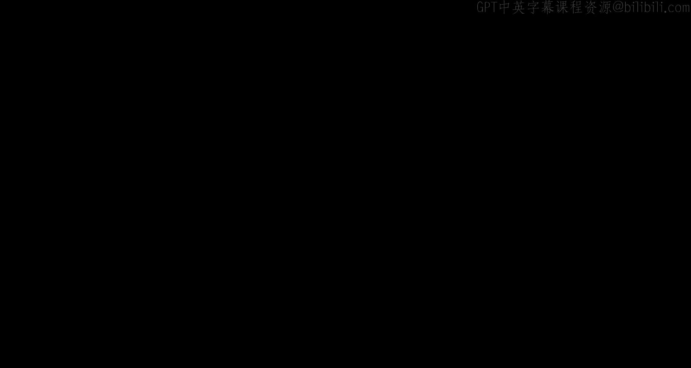

This is 14740。 Welcome， everybody。Today， we're joined by the sound of vacuum cleaners in an adjacent room。

 So I've been told that our microphone is very sensitive。

I hope you guys in Zoomland aren't being distracted， however。

 hopefully that's a filtered out sort of thing that who knows we'll find out on the recording。

 I guess。But welcome today we are。Embarking on a。Kind of the fun part of the network layer。

 we're going to get into how the actual routing works and how the network makes the decisions to get your information。

 your packet from one computer to another。Which I think is well。

 it's definitely the the most complex part of。

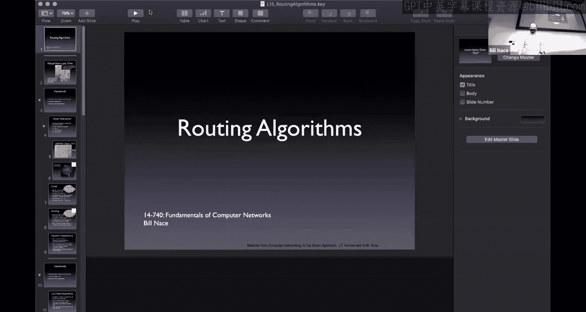

Computer networking and also part of the funnest so let's。Well me get my。Sharing working。

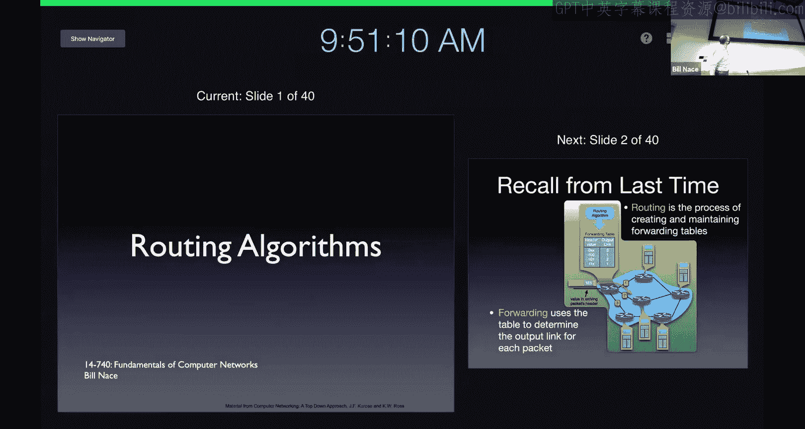

And let's dig in。To the routing algorithms。I showed you this picture last time to point out that there were two main things that were going on in the network layer。

There is the forwarding that happens on a packet by packet basis。 a packet comes into a router。

The router looks at some information and address， perhaps in the packet header and then makes a decision based upon a forwarding table of which direction to send that okay and that。

That decision， that data that drives that decision comes from a different process。

 it comes from a routing process。And so today we're going to look at that routing process。

One of the things to recognize， we in fact， in this class have used the analogy several times about using sending data across the internet kind of like the mail service right we did the envelopes in the demo with thatquin。

One thing that we really should drive home here that I hope you understand is that the way that the routers work to get your information to you is not like the mail service。

The mail service is very static and it kind of collects all of the mail at these sorting centers that kind of look like routers。

But the decisions that they that made are made there are based upon information about how the network was structured when it was built and that does not happen with our network layer right the way we actually delivering the mail the packets in the network layer。

 it's almost like。TheThe maleman picks up the packet。

 the envelope from your house and carries it down to the corner of the street where there is another male guy。

And that guy has to figure out to look at the address on the letter and figure out which of the different roads to send the mail down。

Okay so it's a decision that's made every step of the process so you know that first male guy would say oh yeah。

 good on you know Main street here with that letter and then that letter would then get traveled down the street to the next street corner where another。

Person would look at that and figure out where it would go and the big question of course is how would those people get this information that's the routing process how would the male guy standing at each corner know oh if you want if this letter needs to get to Canada it should go down this road instead of that road。

And of course， our network is even worse because。Because we're constantly doing construction right we're constantly putting in new roads。

 we're changing the way the routers work， we're making some roads be able to carry more traffic or less traffic。

And so it's a much more dynamic environment than this analogy of envelopes and our street corners would suggest。

The big question is how do we how do the routers communicate。

 how do they come up with the information that will let them put stuff in the forwarding table and that's a really interesting question and a very very fun one to solve。

So we're going to start off talking about routtting theory a little bit。

 understanding what our abstractions are。And then we're going to look at several different algorithms that are in two big categories that help us solve the routing problem。

 there are link state algorithms and distance vector algorithms。

But first a little bit about the abstractions we're going to use。

We're going to look at the network as if it was a graph in fact。

 the algorithms we're talking about today are basic graph algorithms。

 you may have seen some of them depending upon what other courses you've taken because some of these are incredibly useful graph algorithms and we happen to have a network that acts like a graph right well a graph as you probably know from your data structures class。

 a graph is，Well it's two sets right it's a set of vertexes and edges and those vertexes。

 those two us are going to be our routers right those are the things that connect stuff and then the edges are the links between them that allow information to travel from one particular router to another particular router。

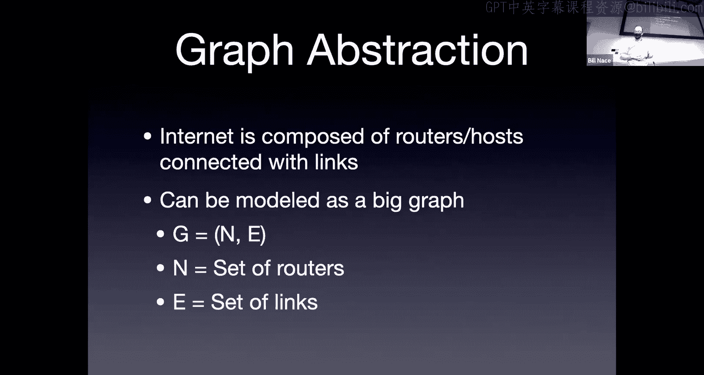

And this you know this graph abstract works really well。

 here's a picture of what the network looked like in 1973 way back when this is early AAt days。

 in fact， by the way， today is the anniversary of the first linkage in the ARPAE between UCLA and SRI chapter many。

 many years ago， I don't know。1958， something like 59。So here we are。 And look， you know。

 we're on the map， right， Of course， we are。 Carnegie Mellon， who was where a lot of the。You know。

 a lot of the early network research happened as you know like we're seeing now with a lot of other interesting network research。

And so you see here， this is a graph， so it has vertices， those little circles。

And I guess actually the squares are the vertexes， the Imps and the tips。

 those were the machines that made the ARPA network。

 and then there are links connecting them to show where there had been some least line usually that would allow information to travel from one to the other。

Of course， this graph has gotten a touch more complex。

 Here's a picture I like because of its nice beauty and also because of it's still a little on the comprehensible side。

 This is from 2006。😊。

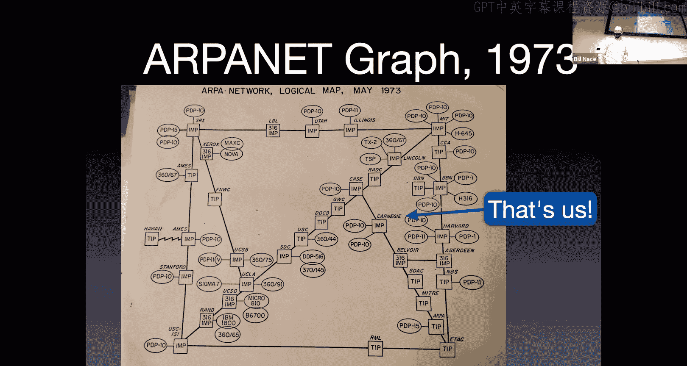

Okay， and this one。Well， it shows not quite down to the machine level， right。

 This graph actually showed all of the hosts on the network at the time。

 right that if you look at Carnegie， it says Imp。 that's the message processing unit that connected us。

 the gateway that connected us。 But then next to it， there's a PDP 10 and the PDP 10。

 Those are the actual computers that were on the network。 Those are the host machines。

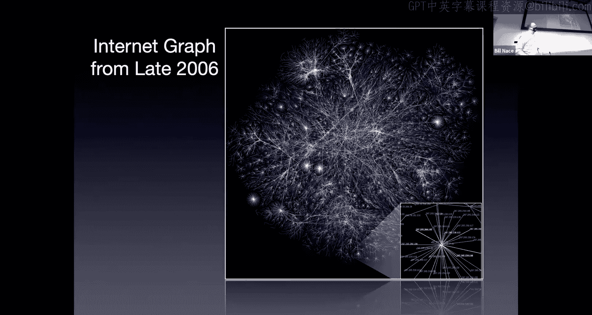

This isn't quite down to the host machine level， it's more the subnet level。Okay， and you'll see。

 of course， the graph has gotten a lot more interesting。Now I'm not going to show you one from today。

 right this is 14 years ago。Obviously， the network has gotten more complex。

 There's been more hosts added to it since then， I haven't been able to find one that has any sense of beauty and proportion to it。

 although there are interesting projects out there trying to。

Have network visualization as as a mechanism My point is our network is a graph。

And so we're going to have to run some algorithms on this graph。

The algorithms are going to be driven。By the connectivity， the edges that exist。

 but also by the sense of whether we like a particular connection or not， how good that is。

 and we're going to abstract this into a cost。The goodness of a link may have something to do with the latency or the bandwidth or the cost。

 the actual dollars you use to run it or whatever。We're not going to worry about exactly what that is instead we're going to say there is some cost between two of the vertexes in my graph and we're going to say that is C。

 and we'll be able to say there's a cost for a particular length so I'm using CW comma Z。

 meaning between router W and router Z， there is this particular cost。

And I'm showing it in the graph， you see the little purple little purple numbers there that specify the actual cost of each particular length。

 and so you could find w which is in the upper right corner and z which is in the very far right and you'll notice there's a line between with a5 one because that's the cost You'll also notice that we specify that there is a cost for everything。

 even if a link doesn't actually exist。And the way we manage that is we just say that there is a link with an infinite cost。

So for instance， between x， which is in the lower left and z， which is on the far right。

 there is no line on my graph。And so I'm going to represent that as an infinite amount of costs we don't actually use that right it's not really a link and so you would have to pay an infinite amount of money and I don't know about you。

 my paycheck will not allow me to use anything that costs an infinite amount。Yeah。Again。

 whatever that cost is， that's a pure abstraction。I should point out also that we're going to want to send。

Our packets from router to router that often are larger distances and so it makes sense I'm going to have a path that is constructed about with a bunch of links as that path goes from router to router to router。

And the cost of that path is just going to be the sum of the cost of all the lengths we use。

So the routing question， once I have my graph， once I have my cost。

 the routing question comes down to， I have some data at some point in the graph and I'd like to get it to some other point in the graph and I'd like it to be the least cost path。

And we can look at a graph like this。 We'd say， oh， that's probably not that big a deal。

 But even on a graph like this of the scale with six routers with， you know。

 less than a dozen routes。 It turns out there's 17 different paths between U and Z。

 between the left and the right of。Of my graph。Okay， that's just perhaps a surprising number。

 and it gives us a hint as to how complex this problem is because this graph is certainly much。

 much simpler even than the 1973 ARPt graph。And so making these routing decisions clearly are not going to be something we're going to be able to just kind of wing we're going to have to have some nice algorithms that handle it so I need to have an algorithm that will find this least cost path。

And actually， what we want is we want to know， well。

 what's the least cost path between some particular router because we're going to run this algorithm at a router。

In fact， all of the routers there。 So let's imagine you're on router W。

 you would run this algorithm and what you want is to know your least cost path from you from so you need to be careful from the router called W。

😡，Okay， to every other router so and。Actually， what we don't even need that。

 we really don't care about what the cost is。We just want to know what the first step in that path would be。

If I met router W and I'm trying to figure out how did I get mail。

 how do I get a message to router you？Okay， I would like it to travel along the East Coast path。

But really， all I need to know is what goes in my forwarding table of which link。

Leaving my router is on that least cost path。So we're going to run an algorithm that will come up with this lease plus path。

 and then we're going to throw away most of the information。

And keep just the next step in that particular wrap。Now， as I mentioned before。

 we have several different kinds of algorithms。We're going to talk about two of them today。

 there are many， many， you know you can imagine there have been a lot of grad students in CS chomping on routing on graph algorithms for a long time。

We're going to talk about two broad classifications of those。

 one of them is called link state algorithms and those work on global information。

The idea is that if you give me this draft。If I know all of the costs and all of the edges and all of the routers involved。

 so if I have global information， then I can run this algorithm。

 a linked state algorithm to come up with the least cost path。Okay， and presumably。

 every other router in the entire network would also have access to the same information。

 the same graph， the same costs。And so those other routers running their linked state algorithm would come up with the same answer I have。

Which is going to be good， we need a consistent view。

 we don't want different routers coming up with different ideas because that leads to routing loops and inefficient routing。

Global information， I don't know about you， my computer science Spy sense goes off when I wonder about that and I asked myself how efficient that's going to be and so there are other algorithms as well there are distributed algorithms or decentralized algorithms we call these distance vector algorithms。

And the idea with them is they don't actually need global knowledge。

 they just start with the knowledge of what they have around them， they know， oh。

 I am a router and I have you know these 96 links and they have these costs。

And then what each router does is it trades this information with its neighbors。

 it sends a message down each of those wires to its neighbor saying， oh。

 I have these costs to my neighbors， I know what the cost is to get to each of them and this is basically a long list。

If I start up with a router that has 96 wires coming into it。

 I'm going to start with a list of 96 different neighbors that I can get to and their costs。

And I will send that list。Let's go back into the computer science line。

 let's call it a vector instead of a list， and I'm going to send that vector to each of my neighbors。

And say these are the distances， the costs to get each of my destinations。

And by trading this information back and forth， I send it to my neighbors。

 those neighbors take this information and incorporate it into what they know because now they have information about what it would cost to get to some locations that are two hops away from them going through this original router and so they get more information and so they have a longer list a bigger vector。

And then they trade that with their neighbors and their neighbors learn about stuff that is three hops away。

And then they pass that on to their neighbors and learn about things that are for hop away and that trading back and forth of this information。

Of these vectors of distances。These eventually lead to all of the information we have if enough of the routers trade enough of the information enough times。

They will all the routers will eventually know what the distance vector should be。

 what the least cost path is to get or I'm sorry， what the least cost is。

 they won't actually know the path， they'll know the least cost and they'll know the next step。

 they'll know who to send it to for every location in the entire network。Okay。

 so that's a much more distributed algorithm that does not require any global knowledge。

But it turns out to have its own issues as well。So let's take a look at each of these。

 we'll start with the link state algorithms。So we need Ed。So。四然系佢嗰个有。Some network。那对。That是。あさ以前か。Yes。

 in fact， next lesson we're going to learn so today we're going to talk about the theory and learn about these these particular algorithms Next lesson we're going to discover that the actual network。

 the actual internet uses a combination it uses multiple algorithms to get this information around and the reason I'm showing you both is because it's very common to have the link state algorithms used at a local level right like maybe CMU runs a link state algorithm over all its routers and then the internet as a whole uses a distance vector algorithm or a version of a distance vector algorithm to actually get information from network to network。

对。Yeah。ありますけど。Okay。So let's take a look at this link state algorithm。

 I mentioned earlier that the Li state algorithm needs global knowledge。

So all the routers are going to have to have all the information about what other routers exist and what links there are and what the costs of those links are。

And the way this information is learned is through a flooding process。

 we talked about flooding when we talked about peer to peer networks。

We said this mechanism of like let's。Do know query flooding to talk to our neighbors about questions we have。

 we're doing kind of the same thing here right what we we will do is we will start off the algorithm by passing the information we have to all of our neighbors who'll pass that information to all of their neighbors。

And at some point after this flood， we will have discovered what's going on about our network right we're going to start off by saying let me send the information I have。

Which when a router starts up is very little right a router when it starts up only knows the connections it has to neighbors and what the cost of those connections are which。

Basically， those are things that are programmed into it by whoevers running that particular router and so that information is passed on。

To router to router to router until at some point everybody's got all the information。

And so that means after the flood is over。Each router then has the graph。

And so this is kind of where the linked state algorithm starts is with。With the graph。

 once I have the graph。That shows all of the routers and all of the costs between them。

 then we run a link state algorithm。And it's a deterministic algorithm。OkayIt has no randomness。

 it has nothing like that， and so that's important because we want to make sure that all of the routers who will all have the same information from this flooding process。

They all will run the same algorithm， they all will run come up with the same answers as to what the least cost path is。

In a sense so the question is， is this flooding that's going on is this like the decentralized thing and in a sense it is right you're going to start off passing information to neighbors so we're going to pass it to neighbors。

 the difference is the distance vector algorithms actually continue to do that。And。

And don't wait until the end of a flood， so in some sense we need to know oh we've flooded we've got you know at X point in time we know we have all the information now let me run the algorithm。

The distance vector is kind of constantly running based on this information that's coming in。

 you can imagine that you know the router when it starts up with only its local knowledge。

 it doesn't say let me wait a while until I build my forwarding table。

 it just builds its forwarding table from what it's got。And deals with what it has。

And we'll see some other differences as we understand the distance vectoror algorithms as well。

There are many graph algorithms to solve this problem many the most famous is Dkesster's algorithm and so that's what we're going to learn today it's a fairly simple approach to this it's a fairly optimal version for many。

Versions of the world word optimal， so it's the one that we'll pick up here and that many of our algorithms are based on。

So this is Dykester， he was a Dutch computer scientist。

 did a lot of really great stuff in concurrency and distributed systems。

But this is the algorithm he's known for， which apparently， which isn't that complicated。

But you know， it's one of those when you get there early， if you're the early guys in the field。

 then you get your algorithms named after you， right。

Newton's laws aren't all that complicated you guys would have picked them up if you happened to have been there in the 1600s。

So Dyketra。Is wondering how do we figure out this least cost path in a graph？

And he comes up with what's known as an iterative algorithm right he's going to go on the loop。

 do this several times and at each step we're going to add complete knowledge about a route to one of our neighbors。

I'm sorry to one of the other routers in the network， so we're going to。Start off at step zero。

 not knowing the least cost path anywhere， and then we're going to take a step。

 learn the least cost path to one router， and we'll take another step learning the least cost path to another router and we'll just continue this until we know the least cost path to every router。

Okay， in the in this。Algorithm， we're going to use， well， we've got costs。

 right we've talked about this cost idea before， and so we're going to use that same notation。🤧。

We're going to。As we run this algorithm， we're going to be making guesses or estimates to what the actual distance is from the current from a location to some particular router。

That may not be the actual class， it's an estimate。😡，And so we're going to call that D。

 it's the current value， the current cost we know so far。Of how， how。

What it would cost to get to a particular destination。

 we may discover a shortcut in some coming iteration though。

We're going to keep track of the predecessor。So we're going to。For each step， want to know， okay。

 I now know the least cost path to this particular node。To this particular router。

 what's the step before that， just tell me which router that would have to go through to get there。

Okay， and we'll discover that if I know that that this is actually what I'm looking for。

 if I know the predecessor nodes， then I can build。

An actual understanding of what the actual path would be to get to， you know， once I'm done。

 if I have this predecessor and information about every router， right。

 then if I want to know how do I get to that router over there， well， what's what's the predecessor？

The predecessor is the router one shorter。And then I'd ask， well， how do I get to him， well。

 let me look at his predecessor and you just work the predecessor notes back until you have the bull path。

So it's a way it's a notational way of keeping track of what the actual path will be。

And we're going to start off with this set of nodes。

And prime we need to complicate things with primes， but that's commonly done。

 This is the the set that we're going to start off。In beginning。

 not knowing the least cost path anywhere， and we're going to every iteration add a new router to this set and eventually this set will be full of everybody and that's how we'll know we're done because everybody's least cost path is known。

The algorithm itself。Well， there's an initialization step Okay。

 so where we get our data structure set up properly and then we have this iterative loop that we run around for each of the of the routers we're dealing with。

 So we're going to start off with。Well， that end step set， right。

 that's the set of all of the routers to whom we know the least cost path。Actually， when we start up。

 we know the least cost path to one router， and that is ourself。

And so we're going to put our into that set， and so I'm calling ourselves to you。

Can put you into the set。Okay。And all the other sets。Well， I don't know know。

 I'm sorry for all the other routers， I don't know a whole lot of information about most of them。

 I do know information about my neighbors。So my neighbor routers。

 I'm going to go ahead and note that their estimate of the least cost path to get to them is the cost it would take just for me to send something straight to my neighbor so i'm directly connected to a neighbor I know what that cost is。

That is at least a good start， that's my estimate for that particular neighbor。

 everybody else I don't know， so everybody else gets an estimate of infinite amount。诶。

And so that's just kind of initialization setting stuff up。

 We're then going to go around the editor loop。 And each time around the loop， we're going to add。

One router to this set， because we will have discovered the least cost path to that particular router。

So how do we choose which router we're we're going to go with Well we're going to find some router that's not already in the set。

 so I don't already know about them， and it's going to be the one whose cost is the least。

Think about this。 If I have estimates for how to get to a bunch of places。Okay。

 and the reason an estimate may change is that I would find a cheaper way right Well。

 the only way to find a cheaper way is to go to some other router and then be able to go from that router to this router。

Okay，If I'm choosing the one whose estimate is the smallest。

 then's no way to go to some other router and from that router to this router with a smaller cost because the cost to go to that other router would have been more than this one。

So each step we're going to take the minimum cost router that's not already in my set。

And I'm going to go ahead and say， okay， this is the one。 I've now discovered the cheapest cost。

 the least cost to get to that particular router， let's throw them into the set。

 know we now know that that is the least cost path。

 It's no longer an estimate it's an actual cost to get to them。

and then we're going to update all the neighbors of that guy okay。

 we're going to look at everybody that that particular router is connected to。

 some of whom we know about， some of whom we don't know about。

 some of whom may will already be in our set。😡，Okay， well。

 if the neighbor of that guy is already in our set。We can't improve on the number we have。Okay。

 but we're going to look at all his neighbors and say， okay。

The cost to get to that neighbor through this guy would be the cost to get to this particular router。

 which is now the least cost pass。Plus whatever the cost is to get from that router to a neighbor。

And。That may be new information， right， Oh， look， I now know how to get to this this router I didn't know how to get to before。

 And I know how the cost should be。 I should send it to this person and then their cost to get to that person。

Or to that router。Okay， alternate， it's possible that I already know about this router。

And the cost to get to this particular neighbor through this W。

 this new router that I now know the real cost to could be more or less from the estimate I already have depending upon the costs that are involved if it turns out to be cheaper we're going to update the estimate for that particular neighbor。

Okay， and so I'm going to go ahead and say the estimate to that neighbor of W is going to be either the estimate I already have。

If it's small enough or it's going to be the cost to get to。The W。

 the one we just figured out plus its cost for its particular length。Which should make sense， right？

And then we'll just continue this around。Go'll find the next router that I is not in my set that has the minimum cost。

So Jeremy's wondering what about data structures， yeah， priority cues or。

Or min cost hashes are the things that are going to pop to mind because those are the ways we're going to be finding the least cost thing of a bunch。

And so putting them in them in heap is probably your best bet。Allright， so just an example。

 make sure we understand this。 Let's imagine that we are running on this example graph with our simple six little router setup。

 Okay， let's imagine we're running it at the far left at router U。Okay， and so how would you run。

Dykester's algorithm on this particular graph。 Well， you would start off with itself in the set。

 So N prime is the set。 It has you in it。And you knows about the estimates to get to each of its neighbors right so you'll see U is connected to W over the top。

 it's connected to V it's connected to X and so it notes those costs as the estimates。

 it doesn't know that that's the cheapest way to get there。That's the best it can do at this point。

 though。And we don't know how to get to why we don't know how to get disease。

 So those costs would be infinite。Okay， and then we this is the initialization now let's run the loop right and so。

The first step of the loop is， which is the minimum cost。 So we're going to look at these and say。

 okay， of 2，5，1 infinity and infinity， which is the least number。 Okay。

 and one turns out to be the least number， right， And so we're going to pick X。 we're going to say。

 okay， previously， I had estimated that my cost to get to X was one。

And now I know that it actually is one。 There's no other way that I'm going to discover that would get me there any cheaper。

Right， so therefore x goes in my set。Okay， it is known。

It's part of the group that we actually know the men class to。Okay。

 and then let's look at X's neighbors。 X is connected to V， W and Y。And for each of those。

 I'm going to say。Is my estimate that I had the best， or should I update it。Okay， so for instance。

 why I had previously estimated that I could get there at a cost of infinity。Okay。

 I now know about Y， and I know a path there。 I can go through X and pay one more to get to y for a total of two。

Okay， so now I can actually make an estimate for what it would cost to get to why。Okay。

 let's see other neighbors。 W， right， Well， W is a class of  three away from x。

1 to get to x plus 3 is 4。Okay， four beats the previous five。

 so I'm going to update my estimate and say， oh， I can get to W and4 and notice I now I'm changing the predecessor node。

Right，If I get to W at a cost of 4， I will have gone through X to do it。Okay。

 because that's who we're dealing with right now， So I have to update the predecessor node to X。

Getting to V， I have an estimate of2， X could get to V。

 but that would have been one to get to x plus2 to get to v for a total of three。

 That's not better than I used to have。 so let's just keep the estimate of  two。All right。

 we're done with that iteration， next iteration， choose the smallest number。Two， two。

 four an infinity。Okayy， which do I choose？ Well， I can choose either of the twos。

OkayI'm tied at this point， it turns out not to matter which one I choose。Okay， yes。

What I'm basically saying is I can get to both of those in two。

 there's no way that my new information is going to change the estimate for the other one。Okay。

 so I'm safe picking whichever  one I want。 And so I'm going to pick why in this case。

Costed2 going through X。And so I'll add y to the set。Okay， and now I'll look through Y neighbors。

 Y is connected to W N to Z。 And I get new information。 right， Oh， look， I can get to Z。 Well。

 my class to get to Y is 2。 Notice that's in my data structure。 I know that D Y is 2。Okay。

 plus to get to y is 2 plus2 to get to z total of four。Okay， and if I do that， I go through why。Oh。

 look at this， why has a new way to get to W？Right。

And so we're actually going to update for the second time， our knowledge of how to get to W。

 We found yet another shortcut to W。Okay， I used to know cost of 4。

 Now I can go to y for two plus one to get to y for a total of 3。 Let me update my D Y。

 I'm start my D W to make it a3。And keep track of the fact that to get there， I have to go through。

Through why。All right， that iteration is done。 Next iteration。 I've choice the 2，3 and 4。

 let's choose the two。 right， so V gets included in my set。 Who are these's neighbors。

 these's neighbor。I'm sorry， who are these neighbors who are not already in the set？

 so these neighbors who are not in the set already is W。

Turns out getting to V at the cost of2 plus3 to W is no better。😡。

So we don't actually change any of our estimates。Three to four。

 I choose the three W goes into the set。Okay， I update my knowledge well， W's neighbor is Z。

 but it doesn't really help for to get to W plus5 is8 that's no better than the root I already know about4 through y。

And finally， I can choose the list of four。So I choose that。Right， let's put。Z into the set。

 and now we're done。Okay， that's Dykester's algorithm。Well。

 that's the running of Dkesters diagram right now I have a bunch of data。

 What do I do with this data， How do I use this in actual operation for my route， Well。

 what Dykester has let me do is build what's known as a shortest pass tree。So I took a graph。

 what's the difference between a graph and a tree。So yeah。

 I'm glad to see several people in the small audience I have here immediately did this right。

 and graphs can have cycles in them and trees can't。

so trees are acyclic right and so what we're doing is we're building a shortest path tree。

 we're building a tree out of that graph we're basically taking particular links。

Particular edges and removing them from the graph until we're left with a tree and not just any tree。

 it's the tree of the least cost path to each of the leaves in the tree。Okay。

 and so these are kind of cool， in fact， I found one here， you know。

 the saying all all roads lead to Rome。I don't think it's true anymore， but one day it used to be。

 and this is the shortest path tree for Europe。Right if you can kind of see the outlines of Europe in there。

 if you were in Rome。And wanted to know how to get to any place in Europe。All， oh。

 I'm going to go on vacation。 I'm going to go to， you throw a dart at that map。

 So I want to go there。 Oh， I'm going to go to Warsaw。 How do I go to Warsaw。

Well this is the road the if you follow the links on the shortest path tree。

 you'll get to Warsaw at the least cost， that' that's what we've done right we've built a shortest path tree out of this knowledge。

Whis that looked like for our graph Well， all I did was I said， okay。

 for each of the nodes in my graph。The predecessor。

 the link to the predecessor node is the link that has to remain。Okay， so from my data。

 I knew that the predecessor of Z was y， and so that link has to remain。Okay， from W。

 the predecessor was why that link has to remain。The other links disappear。

 they're not part of the shortest paths， these are the shortest paths。Okay。

 so diykes lets us build this shortest path tree。Okay。

 and if we follow the predecessor node back far enough， we actually don't need to build the tree。

What I do is I say， well， how do I get a packet to Z， Oh， I send it to Y， How do I get it to Y， Oh。

 I send that to X。Using the predesocial links。 How do I get it to X， Oh， that's my link。

 So therefore， if I'm going to send to Z， I actually need to set X as the output destination in my forwarding table。

And so the data that's actually in my forwarding table is that table there that says， oh。

 if I want to get to Z， I send it to X。Right。Fly straightforward。Not too bad， yeah。嗯。

It's an algorithm right what's the complexity I like Jeremy's question about like what data structure because that leads to you know what the computational complexity of this and how to manage it properly so if I have。

A graph with some number nodes in it， I'm going to be going around this loop and times。

Every time're around the loop， I'm picking one of the end nodes and putting it into the set。Okay。

 now the problem is in the。In the actual operation of each loop， I actually have to find the minimum。

And if we do that poorly， we will look at all of the。The nodes that are there。 Okay。

 so this could be an n squared thing in for each hammer on the loop and N for looking for the minimum。

 As I mentioned earlier， using a heap， though， is a more efficient way of finding the minimum。

 That's a log N operation。 So I end up with an overall。Overall。

 computational complexity of and log in。Not bad。We should keep in mind， though。

 that n is a really big number。For our internet。Okay sorry I'm been paying at all attention what the chat is is this Ravi's question Yeah。

 Ravi you are you've gotten to the core of this so Ravi is asking with Dykester I just ran all that information what happens if there's a change？

嗯，我。What do I do？Well， in with Dyke's information。every time there is a change to the network。

 you have to rerun Dyktras。OkayAnd that's one of the challenges we'll talk about next time is that。

 you know， doing something n log n isn't bad， but if n is really huge， let's say like 800。

000 routers in the world。Okay， then that takes a while and it probably takes longer than as Ravi' is pointing out。

 we get new information， so we're going to have to do something different。Yeah， and so Dkesters is。

Nice， not all that。Doesn't handle change well， a little fragile。

The next big category of algorithms is distance vectoror algorithms。So。

Distance vector algorithms solved the exact same problem just in a slightly different way。

And they do it by managing the information differently。AndWith the Dkesters algorithm。

 we're going to be doing this flooding of some sort to get the global information around to all of the routers。

And then we run the algorithm。With disinor algorithms。

 we're going to be passing information from neighbor to neighbor through exchanges of。

Routing messages。And that's how the information flows and a distance vector algorithm finds a way to update each of the routers as that information comes in。

And so you're。Doing step by step more iterative than Dykesters。

 which is get all this information and then run an algorithm。Sending information。About the。

About what it knows in terms of routing。 And so it will tell me for each of the destinations it knows about what its cost is to get to that destination。

We call this the distance vector。 It's a list of all of the locations it knows how to get to。

And it's called。To get to that okay， and I can use and each app when it receives this information。

Can update its own knowledge about how to get to places based upon that and knowing the cost between it and the neighbor who passed them this information。

So it's an iterative algorithm。Anytime there's a change。

Then a neighbor is going to send information to all its neighbors。 So a particular router。

Can experience a change in its distance vector in the knowledge it has it can experience that change a couple ways one is assistss admin logs in and says oh。

 this link is no one has a cost of10 it has a cost of five。Okay， well。

 that's a change that that router has seen that will change its understanding about the costs in the network。

And so it will then use that information to update its neighbors。Okay， it's。

 its distance vector will change。 And so it'll tell neighbors， oh， got new information。

That new information also is a change that would trigger an iteration。

Because the neighbor gets this and says， oh， I now know cheaper ways to get places。

So I now I'm going to change what I know about how to get places。

 and I'll tell my neighbors about it。And that distribution of knowledge makes it a nice。

Decentralized distributed algorithm。Each router is not waiting around for global knowledge to show up instead you're just。

As you get new information， you're working on it and passing it around。

And so you end up with this idea that。If the network were magically stable and no changes were happening。

So let's imagine we turned off all the routers。Because all the routers in the world needed to install IP version 6。

 Who knows why， right， we turned off all the routers right and rebooted them at the same time。Okay。

 they would start off only knowing the information about the links that are local to them。

Which they would pass to their neighbors， their neighbors would pass， you know incorporate that。

 pass that to their neighbors。And after each router has gone around this。This loop enough times。

 information would have been distributed at about one hop per per iteration。

And if all the routers were doing these iterations at the same time。

 you'd see like whatever the diameter of our network is， after that many cycles。

 everybody would come to convergence， everybody would have all the information about the network。

piilled into their own distance vectors， and then there would be no changes after that。Unfortunately。

 our network is not， I guess fortunately， our network is not that stable。

 things are constantly changing， and so this is， I think more of a theoretical idea that you would ever get to converges。

Because by the time you've gone around these loop some other router somewhere has crashed or some other router somewhere has been upgraded。

But this is the way the algorithm works to handle this。Now。

 I've said a couple times we need to get this information from our neighbors and incorporate it into our own knowledge。

The router' own knowledge about distances and to build its own distance vector。

 And that incorporation is done using what's known as the Belman Ford equations。

Two very famous computer scientists。Who simultaneously came up with this also seemingly very simple idea。

And that is that if I have a cost。A least cost path from x to y。Okay， well。

 that cost can be computed。By this equation， which says the cost from x to y is going to be if I look at all my neighbors。

Okay， the minimum of the cost to get to that neighbor， right。

 the cost from X to some neighbor V plus the neighbor's cost to get to the destination Y。Okay。

 so if I'm connected to 96 different other routers。And I knew， you know， I basically。

 I know the cost to get to each of those routers。 So I know the cost of each of those links。

 I would basically just go through each of the 96 and say， well， what's that guy， You know。

 link number 0， right， What's his cost to get to my destination。And I add in the cost to get to him。

Okay and I do that 96 times I take the smallest number。

And that tells me what my cost would be to get to that destination。

 it also tells me which neighbor I would actually do the routing for it。

Which neighbor goes into the forwarding table to send that packet to？Okay。So simple example right。

 we look at the router on the left， we look at you right and we say， okay。

 I know the cost to get to my neighbors。Right， so distance from。I'm sorry。 we're all targeting Z。

 right， So I want to know what's the cost to get from U to Z from the left to the right of my graph。

 right， I ask each of my neighbors what their cost is to get to。To Z。 And then I add in my cost。

 right， so I have a minimum there in big brackets。Mim of my cost from U to V plus V's cost to the destination。

Or the cost from u to X。😡，Plus， x X is cost。 I'm gonna I do all those， right， I end up with。

2 to get to a V plus 5 from Vta Z，1 to get to X plus 3 from x， et cetera。

 And the minimum of those turns out to be 4。And that four comes from using X。

So x goes in our forwarding table。And。😊，We now know what our distance is to Z。

 we would then go ahead and tell our neighbors about that。You basically tell our to say， hey。

 neighbors， I can get to Z at a cost of four。Okay， so。Each node， each router。

 right is going to tell its distance vector to its neighbors。Whenever that information comes in。

 we're going to incorporate that using the B Ford equations。rightWe're going to go ahead and say。

 okay， I just got a message from my neighboring router who told me this vector。

 let me go ahead and use that vector plus my cost to that particular router to see if that changes any of the distances I have。

And if it does， then I'm going to pass this on to my neighbors。Let's work through the example。

To make sure we understand this one。Now distance vector and examples are around distance vector。

Require a lot more arithmetic and bookkeeping。Okay， sos little you know， we're doing。

That much math for every number we come up with。Okay。

 so we got to be a little bit more careful about that。

 One of the other things that we're making an assumption on is's actually a very big assumption that is。

 in general， not going to be true。 And that is that everybody kind of does things at the same time scale。

So we're going to talk about this as if we had， you know， here we are at time zero。

 here's the knowledge that happens。 And then at time1。

 what would have happened by then everybody would have changed all information with everybody else。

And everybody would be updating at the same time， that， of course。

 doesn't actually happen in reality。They just some routers take longer to calculate than others。

 some messages take longer to get there。But we're going to assume that we have these rounds we're going through。

Where everybody updates everybody else okay？All right， so here's what would happen at the beginning。

 Basically every router。 So you know， pick a router， router X。Has this distance vector。

Which basically says， hey， I can get to U and one， I can get to V and2。

 I can get to W and3 right those are the costs of the links to its neighbors。

OkayI can get myself in zero。 I don't know how to get to Z， right， Z is infinite。

OkayAnd every router， of course， has different distance vectors because there're different places in the graph。

Okay， so they have different neighbors that they're connected to。

 and so if I looked at every router at the beginning， that's what I would have。

So what would happen then they would each send this message to all their neighbors。Okay。

 and then each neighbor would incorporate this。 So let's look at a particular case of that to make sure we understand the math that goes into updating。

1 router。 Okay， so let's imagine where it node you。Okay， and work in a。we have we started out。

 so you started here okay， everybody sent information to each other right。

 so you is going to get these distance vectors， it's going to get those copies of the things from its neighbors。

 Wx and Wv and X， who are its neighbors， and now it has to just do math。

 do Belman Ford equations to figure out if its distance vector changes。Okay。

 and so I've picked that one particular value。 we're going to update。

 We're going to update our estimate of the cost to get to W。From you。Okay， and we basically say。

 okay， for all of the routers or for all of the neighbors or for all of the information I have。

 right， let's go through each of them。 So the what's my cost to get well， from me to me is 0， right。

 Plus， my cost to get to W， because we're gonna update the W value in our vector。

 What's my cost to get to W， Well， I think I can get to W and 5。I wish I had a nice。

 I guess I do have a nice way of point right I can get to W。 There's my number in five。Plus 0 right。

 or my class， let's look at my next neighbor。 I'm going to look at V。 right， Well。

 V can get there in3， right， and I can get to V in2 for a total of 5。Okay， let's look at my neighbor。

 W。 Okay， How can， how was it cost for W to get to W cost 0， because he is W。Right。

 it my class to get to W is 5。Okay， or how about X， X can get to W and 3。

 And might cost to get to x is one total4。That turns out to be the minimum of these numbers。

 So let's go ahead and take that number 4， put it into。My distance vector， I can now get to W and4。

Okay oh， and by the way， I keep track I get I got to that by going through X right。

 so X now goes into my actual forwarding table。For when I'm sending anything to double。

But there's my new distance vector， which I then pass off。To all of my neighbors。Right。

And so after one of these exchanges， we're going to get a few things changed right。

 so we just did the calculation， we saw that this five became a four。

It also turns out if you do the math， shouldn't surprise you a couple of infinities become real numbers。

Okay， because there is a neighbor who is connected to that。

That router who we didn't know about before right and so I get a scattering of of these pink boxes。

 these are the ones that got updated。Okay。What would happen。 Oh， look， we have updates。 right。

 Every router here had a change。And so whenever they get a change。

 they pass that new information off to their neighbors。

 so every one of them is going to go ahead and take this new vector and pass it off to their neighbors。

Okay， so what do we get， well， there's the second exchange。OkayHere's what happens after two。

 Something things still change。Okay， and in fact， after three， well， finally， after three。

 we settled down。Nobody has any changes so no need change to send anything anywhere else。

 This should not surprise you。 if you look at that graph， you would realize， oh。

 it's got a diameter three。So by this point， information is traveled from neighbor to neighbor。

To neighbor。 To neighbor。And so all the information in the graph has gotten everywhere in the graph。

And so everybody has nice distance vectors， nobody needs to update them。However。

 some something happens some， you know， let's， let's imagine， you know， though whoever's managing。

Rr number y over here comes in and renegotiates this contract and gets a cost of one。

That would change wise cost to get to Z， that would change that two to one and so then they would go ahead and pass this off to neighbors and if pink boxes showed up in other routers。

 then those neighbors would pass it to neighbors as well。Yeah， that's the dynamic stuff happening。

 right， as things change。The algorithm reacts to those changes。

So this kind of getting back to Ravi's question， Ravi was asking about the Li state algorithm about Dyster。

 what happens if something changes。What happens if something changes in our network is the algorithm keeps going。

With with the distance vector algorithm， it's less like that there's a beginning and an end。

 It's more like the algorithm keeps going and just any change you see。

 you go ahead and tell your neighbors about it。诶。Well， how does that happen well。

 if something good happens？If a cost goes down， we say that good news travels fast。

If a cost goes down。Like we renegotiated that that contract， you know， the cost went from 2 to one。

 We tell our neighbors about it， right that。Now becomes a minimum point in that math。

The changes there。Distance vector algorithm， and so they tell neighbors about it。

 who tell neighbors about it， who tell neighbors about it so usually a good news piece of information will travel the distance it needs to travel in the network at basically one hop per per round of the algorithm。

To get the information as fast as it can go as ma'am。这か。い。我该吃。Yeah。

 so what happens if the cost increases instead of decreases？ That's still a change。Okay。

 one of the problems with these algorithms is that the bad news doesn't update as quickly。

We say good news travels fast， bad news travels slowly。Okay，If a link cost increases。

 that's bad news。Okay， what happens is it may take a while to figure out what the right cost is。

 it may take several back and forth and during that time you may have created a routing loop so that you're actually forwarding packets back and forth to each other until it gets stable it will eventually get stable。

Okay， ish for some。You knowUntil some other bad news happens， right？Okay。

 but it may take O while to settle out okay we call this the count to infinity problem。

We don't actually count to infinity。 Okay， It's not quite that that bad。 We still do some counting。

 So let's imagine I have a very simple network here。Okay， I'm thinking about Y and Z。

Here over on the left and their knowledge about how to get to X。Okay。

 and so bad news is that four becomes 60。Does any number greater than 10。

 this would would be a problem， so it's not that it's so big a number。Okay。

 it's just that it increased a bunch and so we have this this problem going on Okay。

 the problem and the problem is in what。Z and Y know about their cost to X。Okay。

 it's going to start off Y thinking can get to x and four is E thinking can get to x in5。

And when that change to 60 happens。Why doesn't instantly say， oh。

 I should go through Z for 11 and Z say， oh， I can get there in 10 Instead they start passing back and forth bad information。

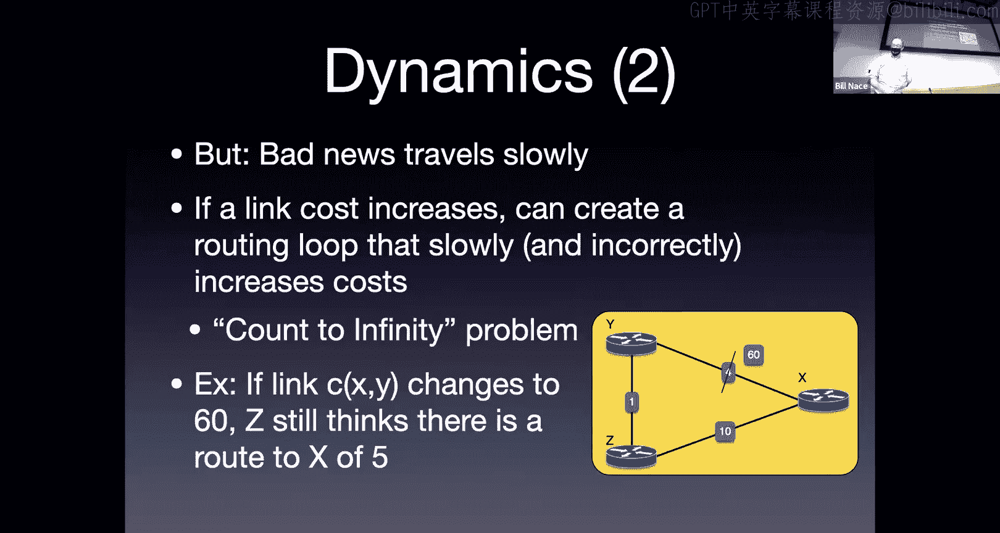

Okay， and in fact， on the next slide， I've laid out all of the rounds we go through until we get to stability。

So starting up here in the upper left hand corner， that's the picture I showed you from the previous slide before there is a change。

basically y says he can get to x and 4， Z says he can get to x and 10。Okay。

 they use that information so that y sayshu， my cost is 4 versus 10 plus 1，11。 I like four。Okay。

 and Z says， oh，4 plus one， that's better than my cost to 10。 I'll pick the five。Okay， makes sense。

 right？Then if I change that， that cost to 60。The problem is。

 they both still have this old knowledge， right， X is 4 or 5。And they use that knowledge。 So now。

On the next round， they would trade that information， right， Why says， oh， I can get there in4。Okay。

 Z says I can get there in 5， and they update that knowledge。

 update what's going on with that knowledge。Okay， well。You picks up the four plus  one is 5。 right。

 I think I can get there in 5， why。He is still using the knowledge coming from Z， he says 5 plus one。

 that's six。Okay。😊，Instead of picking up this， this 10 route is the only route there。

 Neither of these can get there in that that cost amount。But they for this instant， believe that。

Okay， they have changed their route so they will go ahead and pass information back and forth。

 they will pass back the bad information from the previous slide， the five and the six。

Right which they then will add one to and let's see and who changes Z will change this time right Z says。

 oh， I guess I thought I could get there in five， but actually it's going to take。

 you know I now have a choice of going down the path for10 or going through y y says he can get there in six。

 I'll add one for that and get seven。Okay， there in the middle， right。

 I then pass that7 back to Y who still believes he can get there in five。 I'm sorry in6 right。

 So he adds one to the7 to get to 8。Notice they're counting up。

They're passing bad information back and forth to each other。

 adding one or adding their own count to it happens to have a cost of one。eventually， so this。

 you know， step by step by step， eventually X comes to a census and says， wait a minute。

 y says he can get there in 10， but I have a straight length there in 10。10 is better than 11。

I'll advertise the 10。Going down the straight length。And why will then add one to that to get 11。

Because that's still better than the 60。Okay， so they eventually stabilize。

The problem is they go through many， many rounds to get there。Okay。

 we run into a similar issue like a。ゃす。Yeah， so if I remove a router， that's also bad news。 right。

 And so I can build cases like that like this that are going to happen where， you know， so imagine。

Imagine x is five hops that way through this whole thing， and instead of going to 60。

 the router that Y was connected to just disappeared。Okay。

 so that would be effectively the same case and we'd end up with the same kind of conversation about it。

 yeah。So I'm sorry， Zoom， the question was what happens if a router is removed instead of just a link cost gets bad and the answer is that's still bad news。

这个考始呢。Oh， so there's some questions about the timing of all this。 right， This looks like。嗯。You know。

 well， I've took nine steps is that at the microsecond scale of us sending some messages back and forth or is that over longer periods of time very interesting question we're going to get into some of the real world dynamics in a paper we read in a couple of lessons about this the short answer is the algorithm just specifies you know when you learn something new go ahead and tell your neighbors about it Okay and so this could be as fast as you know。

Ethernet frame， ethernet frame， frame， frame frame， you know， back back and forth back and forth。

 so it could be relatively quick to happen。The way many router manufacturers implement this is。

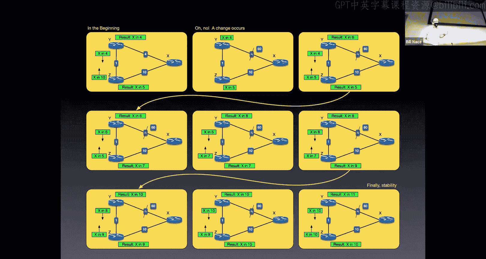

Sorry， Zoom， something is。Going on with her。

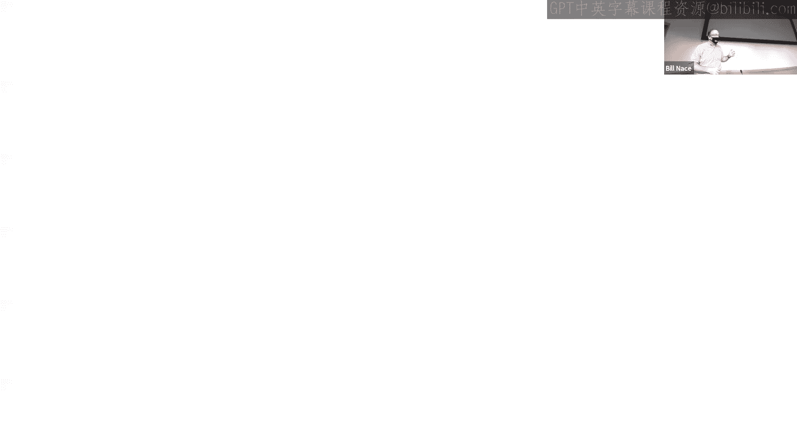

Connection to our screen。Okay。Okay， Zoom is here。

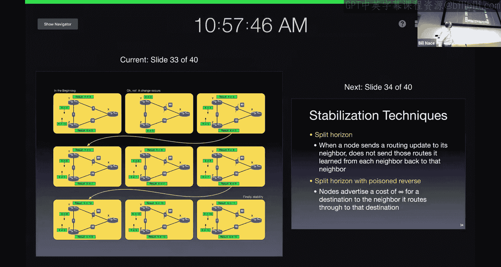

All right， sorry， all of you out in Zoomland， it's almost like I started to say something bad about a router manufacturer。

took took yeah so the actual implementation that happens in the routers oftentimes， for instance。

 doesn't want to send messages too quickly when stuff happens and so they try to bundle it and try to to rate limited and things like that and so sometimes these will happen at 30 second intervals right and so that could you know if that was happening at 30 seconds that's a couple of minutes。

And during the time period， by the way， notice what's happening during the time period。

 if I'm in that screen in the middle right， and some router or and some message comes into router Z headed for X。

 what happens to it？Where does it get forwarded， Oh， it gets forwarded to Y。

 What happens at rather Y when y gets a packet going to X。 O， it gets forwarded to Z。

OkayAnd so during this time period， we've just created a routing loop there。

Where all traffic going to X will get passed back and forth between Y and Z for the entire period that this is happening。

Okay， so the router manufacturers know that they don't want this to happen too often， you know。

 they don't want this process to take too long。Right， but。

They also don't want to spend all the routing resources sending messages back and forth with each other when know during the middle of this。

 what happens if that 60 was just a very temporary 60 right and now it's back to four because you。

Some you know link just happened to go down for a microsecond and it's now back up。

So it's a tough question of what's going on with this and what the right answer for the time period should be。

Yeah。

Okay。Sure。So and there are， by the way， a couple things we can do to make this not take quite so long。

 so these are we call them stabilization techniques， things you can do in the algorithm。

 tweaks you can make to the algorithm that will help out this counter to infinity problem。

And they both deal with， well， what information do you pass your neighbors Okay so we call the split horizon or split horizon with poison reverse a split horizon just means that you keep track of who you're sending the information to。

Okay， and any route that I learned from a neighbor。

 I'm not going to send that particular distance vector back to that neighbor。

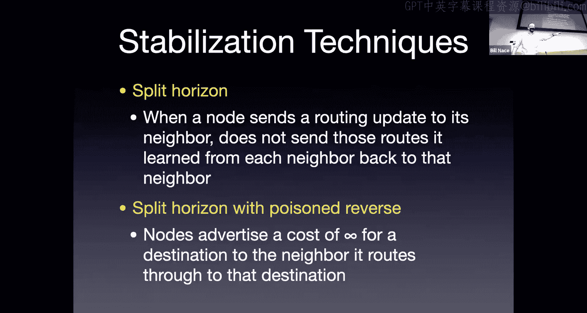

So the idea is， in the previous slide， we had Y and Z arguing back and forth because they were passing information that was computed from stuff that they had just gotten back to the source of that information。

Okay， and so split horizon says well， Y and Z just don't tell each other about what happens to X right once you know。

 on slide what you know， on some slide here， hey， I got that7。

 So on the second middle row on the left， Z has a result。

It knows it can get to X in 5 from the previous slide。 Okay。

 and it knows it computed that based on information from Y。

 So it doesn't send the X in 5 message back。To why。

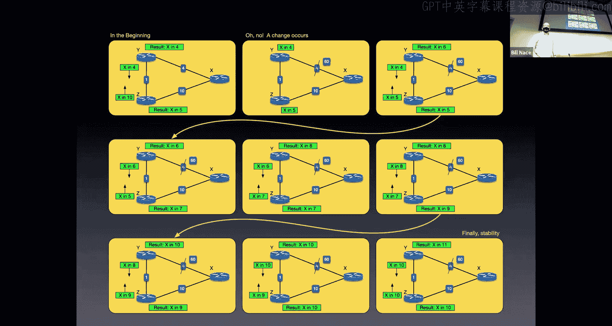

Because why I told him about that。And a poison reverse actually tries to kill things faster。

 you actually do send the message back， but in those cases you make the cost really high。Okay。

 you say， you know。I know I computed this a data value from you based on information from you。

 so I'm going to tell you the cost is infinite amount to get there。Okay， and so in that case。

Duncing back and forth on here， right， Z would tell why that my actual cost is infinite instead of the actual cost being five。

Okay， and that way， why immediately would use that and say， okay。

Should I go 60 or should I go one plus infinity。Okay one plus infinity is really big。

 so six is a better choice。Okay， and， and so it would go ahead and say， okay， I'll do 60。

It will then tell why， hey， I can get there in 60。 and so you'll say，60， I can do it in 10。

And so pretty much instantly， we react to this bad problem。嗯。And yeah。

 infiniteities big numbers got a lot of bits to it。 So oftentimes you'll have some。

Specified big value。That you go ahead and send， which is the。The poison the amount that happens。

For a long time， we actually thought you know we knew that the count infinity problem happened。

 we thought that poison reverse and split Horiz would deal with it and those got built into how things go it turns out。

We're going to read a very interesting paper in a couple lessonss that talks about this。

 It turns out that it's not really a settled problem Okay， in the real Internet， we do have。

This oscillation that occurs， we do have situations that are much more complicated than the simple little three node。

Example that I've shown， oftentimes， if the problem occurs。

 know a couple layers deeper away from you， you'll go ahead and bounce a while figuring out exactly what the shortest route is。

 And there will be a lot more than just two routers involved in passing bad information back and forth。

Okay so you can construct， you certainly can construct pathological cases that are going to be a problem。

 but there are real world non pathological cases that also even with split horizon techniques don't get solved entirely。

And so that's where bunches of router implementers try to tweak with this or tweak with that to make stuff work。

우게てだと。All right， so the question maybe， well， what do I do？

How would I compare these choices that we've been given。

 we've got link state that is Dyster's algorithm。Right。

 what do I have to know to make this happen and how much how many messages would we have to construct to get all that information around。

Okay well， if I have n nodes and E lengths， I'm going to end up having to pass information to each of the nodes about each of the edges that are passed around and so there's a lot of messages that get sent during that flooding period。

Okay， and so obviously if n is big or e is big， that's a problem。Distance vector， overall。

You have as many messages， in fact， you may have it more messages。

 but those messages only go between neighbors。And so that from a message complexity perspective。

 distance vector tends to be simpler， smaller number because we're not having every node。

 flood information to every other node sort of thing。

Link state in some senses a lot faster right you give me a good graph。

 I run dikesters on it right order and log n amount of time later I've got an answer。

And that's a good answer， it's well， it's good until something changes。

 right but at least we converge very quickly。Right with distance vector。In theory。

 I'm converging at the rate of one。Message exchange per diameter or one。

One round of messages being exchanged per diameter of my network。

But we may end up with capfinity problems and things like that。If there's a problem， right。

 if there's some change， well。Link state actually has got this nice。

Issue that if you have if you made a mistake。In the actual computation somehow and put a wrong value in your forwarding table。

 It's not affecting the rest of the world。 right， That's just the router that made the mistake that has to deal with that。

Okay， in theory， every other router has the graph and did the right thing。Okay。

 and so it's not that bad。Distance vector， though。You can make a mistake in your computation。

 and that mistake will then get sent out to your neighbors。

 who will then incorporate it in their own corpus of knowledge。

And compute based on that and that mistake can actually。

 especially if it's a mistake where you set a cost lower than it should be。

 that mistake can travel quickly through the internet。And we have many， many examples of cases。

 We'll talk about some of them next time of。Routers making a mistake。

 advertising the low cost to someplace and that then getting propagated around the entire internet and everybody using that value to actually forward to the wrong place or through the wrong paths。

So in some case， that's a problem。With dis inspectors， okay？Alright， then。

Now we've taken a look at the theoretical routing that has to happen in the network layer。

We know some algorithms and how they work。Next time we will learn how these get deployed in real protocols in the actual internet。

OkayAnd so and obviously those protocols are going to be based upon these ideas。

 is why I taught them to you， so you should be able to understand these algorithms。

 you should understand the problem that we are addressing。

 as well as being able to actually calculate using disters be able to actually calculate using Belelman Ford equations to in an actual scenario obviously it would not be a full internet scale scenario but some scenario to show you understand how the algorithms work。

Okay。Any other questions how we doing on chat？好。Alrighty， looks like we're caught up then Okay。

 and thank you all very much。 I will see you next week。Go enjoy the rainy day。Whatever。

 enjoy your fall day。 Have a great afternoon， everybody， goodbye。不。

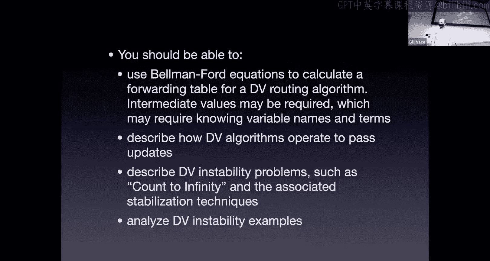

Okay。Okay。