# CMU《计算机网络基础｜CMU 14-740 Fundamentals of Computer Networks 2020》中英字幕（deepseek p16 -P16-2020_11_03_Lecture16.zh_en -BV13J6uYpEZm_p16-

All right， so I just ended up giving away all the answers to the quiz。To the people who were here。

 no I'm kidding you Okay， so what were we saying。Basically to start over today we're doing cool stuff and internet routing next week we've got a quiz coming up please be prepped for it it will run very much like the quiz did the quiz one it will be on canvas closed book closed notes。

It's non comprehensive。 So it only covers the material since the last quiz。

That's basically the transport and the network layer。There will be a review session this weekend。

 we have not finalized the details of the time and whatnot。

 so please pay attention to Piazza for that。Which I think is yeah， okay， that's all about the quiz。

All right， so now you're cut up。嗯。Today we're going to take the ideas we learned last time。

 which were theoretical how to do routing algorithmic ideas。😡，And today。

 we're going to talk about how those actually get implemented as real protocols。

That are really running the internet。That our core， in fact。

 to making the internet work the way it's supposed to and so we're going to talk a little bit about this idea of hierarchical routing and how you can take different algorithms for different pieces of the network and kind of meld them together。

 which is why we learned about several different algorithms last time。

And we'll talk a little bit about several different what we call interior gateway protocols。

 those are protocols that are used inside a network。

 so you think CMU is running some protocol inside its network。

 and then we have exterior gateway protocols that help the different networks get along together。

So first off， here's the problem。Last time we learned about Li state。

 that's Dkester's algorithm right and distance vector algorithms。

 that was the Belmand Ford equation version。And。You may be wondering， well， gosh。

 why don't we just use those right， aren't those these great algorithms we talked about。

 wouldn't they be fantastic？😡，And the problem is， as of yesterday， there are 70。

0070 different networks， different organizations running networks in the internet。

 there are close to 850，000 routers。Hey， those， by the way。

 that doesn't count like the router in your apartment。

 these are the big scale routers in the networks。 and。Okay， so let's run Dykesters on this。Right。

Do you remember Dykes's complexity was order analog N， rights？Not bad for an algorithm。

 but that's a big M。Okay， and it's going to be a while before Dykester would work itself out。

And so that's going to be a problem。 In fact， we have two problems。 This is just one of them。

 This is the scale problem。And I guess I should point out。Scale would not be an issue。

If the network was also not dynamic。If we could have run these algorithms back in the 90s and had everything set up and now it's been working ever since。

That wouldn't be a problem。Okay but you know， you've seen it。

 you've looked at trace route and other network traffic indicators。

 You know that the network is not static， not dynamic， right， Those numbers， by the way。

 are obsolete， I'm sure you know， I looked them up yesterday， I'm sure by today they have changed。

Right， and so that means that。We need something that will converge quickly or allow us to handle the scale problem we have and so。

아 여기서 아서。My video is off。3。You're right。 My video is off。Maybe I should ask Zoom。

 is everything correct now？Yes。Wow， okay， interesting。😮，Okay。

 I hope everybody heard what I was saying， here are the slides。ItSo。Alright， so。

I had this great class intro was not working out today。😊，So scale is one of our problems， right， Sc。

 and because it's dynamic， scale is a problem。 right The other problem is actually the fact that we have organizational autonomy。

We don't have one king of the network who is telling everybody this is how you will route stuff in your network。

😡，And this is how everything will work in your network。

 every organization wants to be able to make its own choices。

Think about Carnegie Mellon as an organization right we have our own network guys who want to be able to buy whatever routers they want to buy right they don't want some king in the internet saying thou must buy this Cisco router。

They wouldn't be able to choose whatever fits。The nature of the traffic here and the way they want to manage it。

Right， they want to run。Whatever algorithms they want to with whatever link weights they want to。

 whatever makes sense for running their network。Which yeah， sure makes sense。 It sounds great， right。

 that allows organizations to be different and flexible。

And that's going to provide better service for the rest of the Internet， presumably。Okay。

 so how do we manage then to route stuff around the internet when I can't have a king telling everybody exactly what to do。

 Every group gets to do what they want and I have a lot of those groups。This is where。

Computer engineers pull out one of their superpowers right Computer engineers have a couple of these superpowers that we just。

 wheneverever we see this kind of problem， we say， oh， this is the answer， right。

 If you ever have a performance problem， you pull out concurrency， right， you parallelize stuff。

We do the same thing with scale， anytime I have a lot of things have to manage。

 I throw hierarchy at it。Okay， if you have， you know a million files on your hard drive。 Well。

 let's put them in folders。 Let's folders in folders。

 and that helps us organize this and make make it all work out。

 We're going to do the same thing here。 We're going to say， okay， I got a scale problem。

 Let's pull out some hierarchy and allow that to work。

 And so the way hierarchical routing is going to work。Is we're going to have kind of two layers。

 we're going to allow organizations。😡，To autonomously choose what they want to do to run their own network。

 In fact， we're going to call them autonomous systems。A S。

Those are the organizations that are running some network somewhere。And within the A S。

 within that organization， they get to do whatever they want to。 Okay。

 they just have to move the packets somehow across their network。

And then at the higher level of the hierarchy， we're going to use another algorithm that will connect all of the ASs together。

Okay。And that one is a controlled。Protocol that everybody has to use。Okay。

 so what these what are these autonomous systems， what goes with those those are anybody running a large size network。

Iue I should say anybody running a large size network that has routing issues。

And the primary routing issue is going to be， can are there multiple ways to get to your network？

Okay so you end up with things like internet service providers or autonomous systems。Companies。

 campuses。My house is not an autonomous system。Okay， my house， yes， I have a， Okay。

 I've got a lot of devices in it because I'm that kind of guy right。

 I probably have you know 60 to 70 different IP addresses on my local network in my house。

But I only have one way to get there。There's only one ISP。

 the rest of the internet when it needs to send a packet to my house， to any machine in my house。

 doesn't have to make routing decisions。So I don't have to be an AS。

 I'm just part of the AS that is whichever internet service provider connects to me。

So my addresses are included in that AS。Carnegie Mellon is not like that。Alright。

 Carnegie Mellon has several different connections to it。 And so it has to be an A S。

Because it has to be able to advertise to the rest of the internet。

Through those different Internet service providers， know we want to be able to say to level 3。

 Here's how you get to Carnegie Mellon and also be able to say through the Pen Re network that we're connected to。

 Here's how you get to Carnegie Mellon。 That's a routing problem。 And so that means that。

Carnegie Mellon has to be its own AS。Each ASS is going to get a number。

You call them the AS numbers or ASNs， and they're just a number that's handed out sequentially。

And so the fact that Carnegie Mellons is number nine may tell you a little bit about where we were in the history of networking。

嗯。So each as is going to have a number and we're going to use that number then to represent， oh。

 if I need to get to Carnegie Mellon。I know that I need to somehow get to AS number nine。

 and so the protocol is me able use this number instead of the words Carnegie Mellon University。

 basically。It is possible then for ASs。It makes sense Carnegie Mellon is an as it has a number。

 there are some other scenarios that work。It is not uncommon for a particular organization to have multiple AS numbers。

That's typically just through history and bureaucracy。 And， you know。

 here's my example of one company buying another company。 and that company had。Some AS numbers。

 in fact， they had four different AS numbers， I'm not sure why they had four。

 maybe they had bought some other companies or maybe who knows。

Right and so it's not like a fast rule that you can only have one you'll have several you can use some。

 you can leave some legacies， leave them lying around not really used or you may have some interesting weird operation reason to have multiple as numbers。

And then it's also possible for organizations not to have an AS and that's kind of the same scenario I described as my house。

Right， if I'm a single home， that is， there's only one network I'm connected to。

Then I have no need multiple to have an AS number， I just am included in the as of whoever I'm connected。

All right， and then this hierarchical routing， I described the idea briefly。

 Here's a picture showing some of it。 I now have ASs， I have networks that are。

Constructed that are built， that are autonomous， that' are being run entirely within themselves and in our case I have four ellipses there。

 each of those is an AS and they've been given as numbers， one， two， three， and four。

And the hierarchy works by allowing some routing protocol to operate inside each of those asses we call this an interior gateway protocol。

Remember， Gateway is one of those kind of archaic words for router。Okay。

 so an inter gateway protocol allows us to do routing inside of a network。

And so AS4 has a bunch of routers inside it， right it's an organization and runs a big network。

It's got stuff inside it， it's got to be have ways to figure out how do I move packets from one computer。

 from one router inside my network to another and。😡，The interior gateway protocol will handle that。

And then we all run an exterior gateway protocol。Outside of our networks that allows us to connect to the others around us。

Okay so that lets us between the different ASs figure out how do I get packets around from AS1 to AS3。

 for instance。So that's at a bigger scale， that's the larger problem。So here's， you know。

 if I put some numbers on this and maybe show a slight example of how this might work within AS4。

 I have a whole bunch of different computers of different routers， I have a range of IP addresses。

Okay， and if I can look at some of them， I can say， you know， 128。2130。

2 is down there in the lower portion of as4。 If there's a computer that is sending from that place and wants to get the packet to 128。

2。 130。1。Which is also within the organization。 The interior gateway protocol will have。

Run and will have populated the forwarding tables to make that happen。喂。And then all of AS4。

 remember we use prefix notation to specify a range of IP addresses。

 I have a prefix notation I have a slash 24 for all of AS4。

And we use that to announce to the rest of the world using our exterior gateway protocol。

The routers on the edge of our network， we call those border routers because they're on our border or border gateways。

Those big black dots， those will take our prefix and announce it to neighbors。

Using this exterior gateway protocol。😡，So the exterior gateway protocol will be used on those black lines。

To tell， hey， As1， if you'd like to get to someplace in my prefix range in 1282，1，30 s 24。

 if you'd like to get anywhere in there， you can send it to me。

That's what that exterior gateway protocol is doing。 It is announcing。The reachability information。

 And， of course， then As1 is going to tell its neighbors。

It's possible to get to this prefix by sending stuff to AS1。

And that's done with the exterior gateway protocol。So this works out pretty well。 It is scalable。

 right， It allows。 I mean， we have an extra gateway protocol that will handle 850000 routers。

that will handle all of the ASs we have in the internet。70000 or so。

And would it's nice also because it aligns with our goals of the automous autonomy that we have in each of our autonomous systems。

 so Carnegie Mellon can announce to the world， here's how you get to Carnegie Mellon。

Without having to be specific about how you get to Bill's laptop inside Carnegie Ves network。

They can just say， get to Carnegie Mel this way。And that information is also often influenced by policy。

Okay， so what I， what I mean is。It may be more than a just technical。

 here's how to reach Bill's laptop that's important to Carnegie Mellon Carnegie Mellon has business relationships with other ASs。

 it pays money for transit for those。And it may want to guide the traffic in some way。

It may want to well， have a policy about how you get to Bill's laptop。

And the exterior gateway protocol is heavily biased towards policy。

 and it allows you to communicate that to your neighbors。

 we'll see that very much when we start to look at that。Inside the network。

 then Carnegie Mellon can worry about what's the fastest route to Bill's laptop from that border gateway port that the packet comes in。

How should it go among the routers within the network to get here inside the UC to my laptop。

 and that's a performance question right that's not a policy question。Good question。So the 847。

000 route are those just the border gateways or do they include the ones that are actually in the Yeah。

 I'm being a little fuzzy with that number that's actually the number of prefixes that have been announced that are being managed。

And so maybe that is related to the number of border gateways that we have running around it's it's a fuzzy number just to give you some sense of scale I'm sure Cisco has sold more than this number of routers in the world Okay so in many cases those will be。

All of Carnegie Mellon is being announced as a single prefix that counts as one of those。对。Okay。

 so let's quickly take a look at some interrogated protocols， there are several in fact。

If I want to look at them， I can lay them out and say， oh， I have infeor and extra gateway protocols。

Okay， and so you'll notice on the top row， I have four different protocols there that do inter gateway。

Management right let a organization run performance flies and route stuff for the right packet it's the right place and then on the bottom row there's one extra gateway protocol to talk about and then have also divided them with our knowledge of the different types of algorithms into a column for length state and a column for distance vector。

Okay， so we have a variety。 I'm going to touch on several features of each of the top four here。

Not going to make you an expert in any of them， but I' found these are kind of like bullet points about them so you know a little bit about them and also so you get a feel for the differences in what you need to worry about with an exterior gateway protocol versus an interior gateway protocol。

So the first step I want to talk about is OSPF。This is a very commonly run protocol。

 it's the open shortest path first， this is basically Dkester's algorithm packaged into a protocol。

And so we can't just say we're going to run dikester's algorithm because we somehow have to actually have messages to send around to。

 you know， I need to， for instance， you know， we need to flood all of the length state information to everybody。

So therefore， we need to build a protocol that handles that that has messages that say， oh。

 here's the information that you need in order to run bikesters。

So OSPF is taking Dkester's algorithm and making a protocol about it。

 it's open in the name right' the idea is it's an open standard anybody could build to this protocol that you want。

 it's not owned by any particular company。You send。

 so I think it's kind of interesting in a couple ways。 One is all the messages run。

Like they are their own transport layer。you'll notice all of the OSF messages are sent。

Just using I P。Okay we have our own protocol number we're not so the point there is it's not a TCP or UDP thing we have routers that've got to talk to other routers and so they're going to put values into an IP packet and send them off the IP packet when to get to the other side is going to look at that protocol number and say oh this is noPF number let me give it to our OSPF code。

So it's kind of like its own。Managing its own transport layer。And that， by the way， means that。

If it once any of the features that one would have gotten with TCP。It's got to build it and solve it。

 And OPF does have reliability。And error correction as part of the actual protocol call。The OF。

Protocol allows the system administrators， the network administrators to go ahead and specify some link weights。

Right so， you know， Dykester's runs needs to know what the cost to get from router A to B。

 right Those are what we mean by link weight and。OPF doesn't care what those numbers mean。

 the protocol just has a way to communicate the numbers around。

And so the network and administrators get to choose。For whatever mechanism。

 whatever policy they want in place， what numbers should those be？

So they get big numbers become the slow length we have to pay a lot of money for or something like that。

Whatever they want to do。There is some security in this you can see it would be important that my routing be done securely because I don't want to be able to send out an OSPF message that a router believes and thus we call it hijacking a route I don't want to know oh yeah everything all the traffic that should be going to SIO to report grades instead send it to my laptop we don't want that happen so there is some security in it。

And， interestingly。OSPF also manages its own scale problem。Okay， what do I mean by that？ Well。

 there's hierarchy in there。 If you have enough routers in your network。You now have。

 the network administratords now have a hard to administer sort of problem running on。

 And so OSPF allows you to build a hierarchy。Where what you do is you take your whole network and you break it into some pieces they call it areas。

Okay， so you'll see here I have a network with a bunch of routers， one of which is my border router。

Because this is all in a single asS， we're all running this。You knowWithin my organization。

I could have multiple border routers， by the way， I just happened to have one in this case。And then。

 we've taken。Bunches of our network， and we've split it up into different areas。

And don know why we do this， right， This is the protocol doesn't care。

 This is a mechanism that is included in the protocol to help network administrators solve problems。

One， maybe those areas actually are like geographically。

We want to allow the guys in some know in a different part of our network to manage things more easily on their own instead of having to coordinate across a large network。

That's a hierarchy or a scale problem， so we're dealing with hierarchy to make that happen。

The different areas get pasted together by another area， a special area called the backbone。

That the area border routers， which are particular ones in each area。

 then are included in this backbone。And what this means is you do the flooding of Dkester's algorithm and all that calculation only within each area。

Okay， so those， those five routers there on the left， they flood。They do Dykester's algorithm。

 they come up with what the appropriate shortest path tree is to allow you to forward to every place within that area。

And then there's some communication that goes on in the backbone， people'll say。

 oh you want to get to that particular place， Yeah， send it to this particular area router and oh。

 we're going to flood。Do diysters within the backbone？

So that everybody knows how to forward packets to each of those border routers。

and that then paste together because in order to get to someplace in area one。

 I need to send it to that particular border router and I know how to do that because we've done Visters in the back。

Does that makes sense？Question the area just decided by administrator so question is who decides on the areas and yeah it's a network administrator thing this is a tool that's provided to anybody running this protocol the protocol allows for these areas。

If you don't want to use them， if I've only got five routers， maybe I don't need areas。

And so I don't need to employ， I don't need to open that chapter of the manual to figure this out。

Okay， so that's an interesting feature about a common protocol。

Another commonly used protocol is called ISIS。Okay。

 this is intermediate system to intermediate system。It's kind of supposed to be used。

More intelcommunications areas and we see more of the ISPs。

 especially the large ISPs running ISIS it's a linked state algorithm as well。

 so it's basically running diyster of some format there are and I should point out it is a standard as well so there's an RFC behind that OSPF also is a standard。

🤧。It I I has just been tuned a little bit and optimized so that it's supposed to work well at large scale。

 I actually don't know much about it other than like the marketing points you get about it。 Oh， yeah。

 it's less， it sends less messages about stuff because we've optimized a bunch of things。

 And so therefore， it's supposed to be。Work better at sizes of large ISP and is's very common in large organizations to run ISIS instead of OSPF。

🤧。On the distance vector side， we also have a very common algorithm。 Rth is an algorithm。

 The routing information protocol is， I don't know。 what were you thinking Rick stood for。

It''s a protocol and an algorithm that is actually very commonly used because it was part of UniX from Way back plan。

 and so a lot of ciss admins who kind of grew up and you know who remember what BSD means as part of your UniX we're using R in order to set up the small networks。

That came when they started building these things。It is a fairly simple implementation of distance vector algorithms it makes some。

Some assumptions that mean that it may not be suitable for larger networks one of them is that the link count is always one。

So there's no way for you as a system and administrator to kind of move the traffic away from an expensive length。

 for instance， or a slow link。It's always one， so it's just counting what's the smallest number of hops to get to a destination。

Also in the protocol， when it's describing the cost of a path。

 there's a four bit field to handle that。Which means you can't ever have a path that has a total cost larger than 15。

😡，Okay， so right there， we've limited the diameter of the network。有有有。

Comcast is not going to run this just because it won't work。 They have paths that are longer than 15。

In in their networks， works fine for small networks。

And this is one of the reasons it took off is because a lot of people are building small localary networks in some organization with a couple of spark stations back in the day running units。

 this was fine for and they grew up and used it。🤧So R starts up on the routers。

And every 30 seconds they do the distance vector thing right remember what distance factory thing was well。

 oh I have information about routes about costs to different locations let me tell my neighbors about that and so we're going to send out messages to that effect to our neighbors。

Every 30 seconds and they work as a heartbeat as well。

 so one of the things you need to to know and you're actually building any distributed system。

 especially something like this。If a router crashes。

 he's the router is not going to tell you about it beforehand。

 So if you have a neighbor that's having trouble。😡。

You may just all of a sudden not be able to send packets to that neighbor and you kind of like to know that right and so what you you do is you're sending these messages every 30 seconds。

 if a neighbor isn't sending you stuff， you use that as a failure detector So if you don't get these messages。

Well， there's a hundred80 second timeout。 So if for some reason。

 six of these should have come in and they don't， then you just go ahead and assume， oh。

 that neighbor must have crashed。😔，Guess what？ I now have to remove。

And recalculate distance vectors and tell my other neighbors that I can't get to the routes that normally would have gone through the guy who just crashed。

对。The message is themselves。Sent from router to router to router， they use UDP。

 particular port to do that communications。Wch brings up an interesting question。

If we're sending our messages using UDP， that means the actual code is in the application layer。

Right。But is aren't we done with that that was before the last quis。 We're in the network layer now。

 aren't we。Yes， we are。But it turns out the actual running of the routing algorithm。

Can happen elsewhere。The， the issue we have for the network layer is we need our forwarding table filled in。

And so the way this works is there's actually application layer process that talks using UDP to other application layer processes at other routers adjacent to it。

 and then it does the distance vector math right it runs Belllman Ford， all that kind of stuff。

 figures out if there's new information。And if there is。

 it then has to be able to talk down to the network layer。 Basically。

 here's an operating system call。 Let me talk to the the， the。

 the network layer and set up the actual forwarding table that's going be used at the network layer when stuff is going on。

Edre。Where where。つ。是。YeahEric is bothered because this feels like it's breaking the network layering thing and that's one of the reasons I pointed out to us here is just to show。

 oh， from a communications perspective， stuff is happening with' not really network layer。Right。

In fact， we had a little tease of this that nobody noticed when I talk about OSPF。

 right and said OSPF is its own。Kind of transport layer to do that communication。Here。

 all we're really doing is we're saying， I have some code that's got to run and it's got to talk to other code。

 And I'd like to use the capabilities of the transport layer to make that happen。Okay。

 so I'd like to use UDP because it's already a protocol standard。 I can。

 I can go ahead and piggyback on top of that。Okay， now the。

The part that feels the most like it's breaking the layers to me is now the application layer has to somehow give information to the network layer。

😡，That last arrow where somehow that route demon has come up with an entry that needs to go in a forwarding table and has to somehow tell the network layer about that。

And that part definitely is doing an end around the layered architecture because otherwise we'd have to have a way to tell the transport layer。

 hey， would you tell the network layer for me， here's a forwarding value。Okay， and so that part。

 yeah， maybe that breaks the。Delayed architecture。Okay。Another way to think about it might be， well。

 the route de is actually in the network layer so that it can talk to the forwarding table。

 but it's going to go ahead and use the transport layer to communicate whenever it needs to communicate。

That also may feel a little bit weird。The part that actually feels the weirdest to me is I'm sending a UDP packet。

Have you thought about this yet， I'm sending a UDP packet that needs to get forwarded。Right。

It needs to， the network layer needs to know how to take the well。

 the UDP packets going to get handed to the network layer and put in an IP packet。 I'm sorry。

 UDP segment into IP packet。The IP packet needs to get forwarded。Right。

So there is a little bit of a bootstrap problem here。Okay。

 and that's all by making sure the network administrators set up。

The forwarding to the neighbors at the beginning。Because who you're talking to with that UD packet。

 that UDP segment in an IP packet is a neighbor。And so it never has to get。Forward it far。

 But you do need to know。Which wire do I send out this particular。P back it to。

When you're doing the routing process。That'll get a little bit weirder when we talk about EGP in a minute。

🤧There is another acronym in my little。Box showing which which things there are and there's another so that's another interior gateway protocol but it is a distance factor algorithm。

This is the enhanced interior gateway routing protocol， EIGRP。

This is one that Cisco developed and again I don't know a whole lot about it other than it exists。

 it has fairly recently been standardized， so there is an RFC about it。

And I know it's distance vector， and if you look at Cisco's webpage about it。

 it talks about all these great things that it does， but doesn't tell me much about how it does them。

Kind of like I S I。 So they they will bullet points that come straight from the marketing department。

 I'm sure that say， oh， it's dis factor， but it converges quicker and。

Doesn't use as much route of resources when it's being run。I don't know。

 I don't have experience with that， but just thought it should be included in your。InIn the list。

 for some completeness sake。Okay。So that gives us four different algorithms。

 two of them links state two of them distance vector that can be used by any autonomous system。

To do the routing。Within its own borders。Those are all interior gateway protocols。

 so basically you know CMU when it starts up its network gets to choose oh all of these four。

 which would we like to use？OkayAnd they get to choose and nobody has to tell them which one they have to use or anything like that。

Okay。😊，Next step， then， is the exterior gateway protocol。How does。

Carnegie Mellon know how to send traffic to other。Autonomous systems。

 and that gets handled by an exterior gateway protocol。So next here gateateway protocol。

 the whole reason is there is to allow。A network to advertise and for other networks to get those advertisements that give them we call network reachability information。

Basically the prefix。How do I if I need to send a message to some other place？

How am I going to do that Well， Carnegie Mellon needs to collect those advertisements and to know how do I reach that other network somewhere？

And the exterior gateateway protocol is going to allow that to happen。

This announcement that every network makes will then get propagated from AS to AS to AS。Okay。

 so running this protocol， all of the networks cooperate to pass around this reachability information。

And it also lets。That propagation， those announcements have information associated with them that will help the networks make decisions about which way they like to go。

So the issue is for any， let's say， imagine we're here at Carnegie Mellon and now looking out at the rest of the world for a particular network somewhere。

 for a particular prefix somewhere， we may get multiple announcements。

We're connected to three different ISPs。All three of them probably have reachability。

 You could send packages to any of the three， and they would get to wherever your destination is。

So Carnegie Mellons to the side。And so there needs to be more information that allows Carnegie Mellon to decide which of these to use。

And so the announcements are going to allow us to not only say you can connect to this prefix。

 but also tag on some other information。And that other information then is used to make the decision about which ones。

Which ones to accept and which ones to propagate to our neighbors？

That is oftentimes a policy based decision。 again， not based on performance in which way is actually。

Technically best。😡，But based on things like， oh， I'm peering with this neighbor。

And that means I have different obligations than if I was paying for transit from them。Right。

 do you remember that？ Wow， that's a kickback to an early lecture， right。

Do you remember we talked about when peering， we said appearing is a relationship between two networks？

That are peers， They're about the same size and scale and whatever。 And they connect to each other。

 and they decide to send information only to customers of that other network。Right， you do not pass。

You traffic for Facebook through this peer。😡，You only send traffic to that proll。

How does that actually happen， this is how it happens。Using our exterior gateway protocol。

 we send that announcement out and we tack on enough other information。

The receiving network is able to look at this and then make the business decision based on the policy to say。

 oh， right， this prefix is in a here， I can accept that so that I can send traffic to them。

But I'm not going to tell anybody else about it。Okay， if so。

 then those other places would send traffic to me， which I would then send through this peering connection。

And I don't care that that guy over there can talk to my peer。

 let them pay for transit to make that happen。😡，Right。I don't want them to go through。

 that's a policy choice and so our exterior gateway protocols have to be able to handle those policy choices and so we need more information than just the prefix。

All right， so that's in general what an exterior gateway protocol is going to do， in particular。

 we run an exterior gateway protocol called the border Gateway protocol。😡，It's the one and only。

 it's the de facto， we have version four， so you'll see a BGP4 oftentimes that's the one that all of the ASes have to run。

It's a little hard to think about how you would have multiple。X here gateway protocols running。

Because that would mean that the information you were passing around was different。

And you'd have to then figure out how to convert that knowing， you know， oh。

 I got to be able to talk BGP to this guy and something else to that other network。

So nobody wants that there's enough trouble just having BGP around， so BGP is the one and the only。

I put it in the distance vector column。And that's only partially correct。

The algorithm itself is not a distance vector algorithm， we call a path vector algorithm。

So that means when I send the information to my neighbor and I say I have a cost。

 this is my cost to get to that particular destination。With BGP4， we don't pass on a cost。

 instead we send a path。😡，We actually say these are the ASNs that you would send your traffic through if you accept this one。

Okay， so if you're goingness send traffic to me， it'll go to me and then here's the rest of the path。

 here's everybody else in how it gets there。 we'll see how that works in a minute。

I mean it's a heavily policy based protocol， it is heavily policy based because lots of different organizations have different needs for how they communicate to their neighbors and you how to make this all work out。

The protocol itself is。Relatively simple， I don't know if you are an expert at BGP。

 you can make good money because it's not the sort of thing you just pick up a book and read over the weekend to pick it up okay。

So it is a。It's a lifestyle kind of protocol that you get into。

But thinking about it and understanding isn't too hard to figure out one of the problems though。

 is that if you screw up， everybody knows about it。If you screw up， that's。

That's reflected in the announcements that you're sending out to the world and the world will then use those in their routing。

 and that we'll talk about a few instances that will cause trouble for the internet and everybody will know about it。

So BGP4 has been around a while， in fact version 4 has been around since 1994 and that actually was not a big change。

 it didn't change how the protocol itself really worked。

 it was mostly the previous BGP3 when it was talking about prefixes used those classes I don't know if you remember when we talked about IP addresses we said back in the day you had slash8/ 16 or/lash 24s there were class AB or C and then in 1990 early 90s we saw that oh we're going to run out IP addresses。

 let's reallocate that and allow you to have prefixes with any number in it。Well， when that happened。

BGP4 had to。Or BGP had to evolve so that it could express those。

 it didn't have a way to say slash 19 before in the actual protocol that was being passed back and forth。

Most of the work since then on BGP has been about finding errors when they occur and securing it。😡。

The protocol itself from 1994， that was， you know， the first internet worm was what 1988。

So this was still being generated kind of in the good old days and so there have been a lot of tack on things that have been done to make BGPU more secure as it goes。

Here's how it works， You have two ASs。They communicate because they have border routers that are directly connected。

That's just the way we hook our networks together is I have a router somewhere。

 and if I want to connect to that router， then I connect to them right I have to run a wire to their network。

 And I'm in particular， going to run to a particular router in that network。Now。

 you know from previous conversations that that wire may involve public peering， for instance。

 an IXP， but somehow we're connected directly to some adjacent network。

And so that means the two border routers are going to run what's known as a BGP session。

And they're going to pass PGP messages back and forth。To each other。 And so they basically start up。

 The BGP messages get put in TCP segments。Again， kind of a throwback to what happened in R right we've got information we're communicating。

 but we'd like them to take advantage of reliability and all that kind of stuff and so we go ahead and use TCP to make that happen。

And we basically just start up a TCP section between these two that we call BGP。

 and we send BGP messages back and forth to each other。And the messages themselves。

There are four basic kinds of BGP messages。 There's one that opens up says， hey。

 I'd like to start a BGP session with you。 There are heartbeats that are called keep Live messages。

Much like we talked about with R， you want to know if the router next to you is crashed。

And so if you haven't heard from him in a while， if you haven't heard a keep alive message in a while。

 then you assume that your neighbor is crashed。There is a notification message that if I'm going to shut down。

You know， like if the Siss admins have come in and said， oh， we're going to turn this off gracefully。

 then the router can send out a notification message to his neighbors to say， hey。

 I'm going to go down and take my routes out of your forwarding table。Most of the work， however。

 comes in this update message。So the update message sends information about a route and says this particular prefix。

I can either announce it or I can withdraw it。 All I can tell you。

 you can get to that prefix through me。 That's an announcement， or I can withdraw 1。

 I can say you no longer can get to that prefix through me。

And so both of those are in this update message。There's another piece of this， by the way。

We have our connection between our two exterior。Border routers， right。

 the connection between AS1 and AS2 that I kind of showed a couple slides ago。

 right that's this connection。It turns out within AS2， the information we get。

 we also need to be able to pass around to our neighbors。

And so BGP allows us to communicate between all of the border routers in my particular AS using BGP。

So that we can pass the。Policy information about these routes。

So that they can be past to neighbors that those other border routers are connected to right so I've got in this case。

 I have five border routers。Presumably， they are all connected to other A Ss。

 And so anything that comes in from As 1， I'd like to be able to pass around to those neighbors。

 So I'm going to use IBGP。Is just an in it's effectively BGP， but between。

You knowBetween my friends kind of thing。So that they can then pass those on to others。

I want to stress here。Within AS2， there are probably many other routers as well。

IBGP is used to communicate between the border routers in my AS。Not all the routers within my asS。

All right， so what is it， I'm sorry。对对。系啲。There are a few bits here and there that're a little different and we'll see a few of them show up when we talk about path selection in a minute。

 knowing that the information is coming from a friendly router can help you make slightly different decisions about what you do with the prefix and says one of the reasons to have a different protocol is that。

And the protocol is not hugely different， it's basically just a couple bits。

 those bits help you make those decisions。I'm sorry， for Z the question being unasked was。

 if you haven't figured it out from that is is there really any need for a different protocol。

 is there a need for something different between IBGP and EBGP and yeah there is because we want to be talking to friendly we want to know when we're talking to friendly。

Ruterers。All right， so these messages that come in they are。They announce a prefix。 So they'll say。

 hey， here's an I range that you can get to。 That range may be， you know， some other。

Complete A S somewhere。 It could be a customer of an ISP。 who knowss。

It is some range of IP addresses that are in this prefix。

 and then we want to add on some extra information we call that attributes。

And there are lots and lots and lots of different attributes。I've listed some of them here。

We will talk about four of these。Not all of them， okay。

The attributes are extra information that we can use to make decisions or to communicate important stuff to our neighbors and so when we send the the announcement of a prefix we will include here's the prefix and here are。

One or more， actually， technically， I think zero or more of these attributes go with it。 Commonly。

 you're going to put a bunch of them。哦，我问说，我想一下。So Kyle's saying， hey。

 couldn't and an A administrator decide that it doesn't want to have traffic moving through it and so it doesn't。

Pass on this routing information。 And， yes， that's true。 right， That's a policy decision。 Presumably。

 we're doing it for some reason。And I want to be able to do that。 And so VGP lets me decide， oh。

 that neighbor I don't want to tell others about because I don't want that traffic moving through me。

Okay， now， if that neighbor wants traffic to move through you， then。

They need to convince the network administrators in that AS to change their mind about how to handle these BGP messages and that usually involves。

 oh， let's have a contract and here's some money and we're going to have a transit relationship with you or whatever。

And so that becomes part of the relationship already。And yes。

 that will be reflected in the particular BGP messages that it passed around。

Which is the way it should be。 That's what we want。Okay， so I'm going to talk about four of these。

 as I mentioned， AS path is really important that AS path is an attribute that we put on this prefix and that lists the path。

 this is what I was talking about a few minutes ago when I said it's not a distance vector algorithm。

 it's a path vector algorithm。This lists the path it lists the AS numbers。That。

You would go through to get to this prefix if you accept this announcement。Okay。

 and so basically that's what we use these as numbers for。

 the number nine for Carnegie Mellon right that number。We then use in this BGP message to say oh。

 this is how you get there and we would announce a prefix so Car Mellon， for instance。

 announces a prefix with a BGP message and says oh the AS path is9 because that's where this is coming from that announcement gets passed on to our immediate neighbor let's say level three who is ourISP。

Level three would take that and want to tell the world， hey。

 here's how to get to Carnegie Mellon through level three。

 and so they would take that AS path and put their own AS number at the front of it。😡。

I don't know what their number is， let's pretend it's 200。So the path then has 209。

And then that gets sent off to all of the neighbors of level 3。

Many of those will put their own A S number in front of it。And send off 600，209 to their neighbors。

so when you get one of these announcements， you can look at the as path。

And have a sense for how far away things are。Okay， it's hierarchical。 It's abstracted。Right。

 you don't know exactly how many routers things are going have to go through。

 But you can look at the the number。 You can say， oh。

 this one's got five A S numbers in the A S path。 and this one has 7。This one sounds like it's。

 it's shorter。 Let's go ahead and use that。 And so we do use this in route selection。

 basically looking at the numbers that are there。We。

slide here next attribute I want to talk about this one also incredibly important。

This would not work， hierarchical routing would not work without this attribute。😡，Next hop tells。

Whoever I'm communicating with， if you'd like to actually use this prefix。

And that means that you're going to send traffic into my network。

Here's the actual IP address that you should be sending that traffic to。Okay。

 so this allows the receiver to actually use this value and calculate what should go in its forwarding table。

Okay， because as S numbers， you know， we don't know， right。Now， instead， I have this prefix。

That I want to get to a neighbor has told me if you want to send traffic to that prefix。

 send it to this IP address， the next top IP address。Okay， and then within my network。

 I can use that because my internal gateway protocol。

Runs and tells me how do I get to that IP address？Okay， so some router， you know。

 some machine buried in my network， seven steps away from a border router will know how to send traffic to that prefix。

Because， well， the Inter gateway protocol told me how to get to this IP address。

 and now I know that that IP address and that the destination prefix are connected。Okay。

 so this incredibly important。And that's basically those are the rules about how you would choose it。

 and this is where Dan， we see the ex gateway protocol and inter gateway protocol make a difference that lets somebody on the inside know who told me about this。

 where did you come from。Next attribute， multi exit discriminator。 This one is not a critical one。

I include it here because it's one of those that shows how you might communicate information to a neighbor and how you might have that neighbor react to this information。

The multi exit discriminator only makes sense if I have two ASs that are connected at more than one place。

So in my picture， I have S1 and S two with two connections between them。And。

The multi exitit discriminator is used by AS2 when it sends announcements to AS1。

 and what it's doing is it's saying hey， AS1， here's how you get to some prefix， right。

 some customer down there。That's what we're announcing is the path to the customer。And yes。

 there are multiple ways to get to that customer， but I'd like to ask you to please use this particular one。

Okay， so。For instance， AS2 probably wants traffic to this customer to come in the connection on the left。

Because there's only two routers there between it and the customer。

Whereas if it comes in on the right， then weve got to travel through a bunch of different routers to get there。

And so multi exit discriminator is a way we would still make both announcements。

Both of those border routers are going to talk to the AS1 border routers。

And they're both going to announce and say， you can get to the customer this way。

And the next top is going to be the IP address on those particular border routers。

So both those announcements would give AS1 the impression that they could send traffic to either one。

Okay， now the normal behavior for。For AS1 is something called hot potato routing。Okay， I don't know。

If you played this game as a kid， hot potato is a game where you like you pick up a rock or something。

 it's supposed to be something hot。 And then you and a bunch of friends basically just stand around tossing the rock to each other。

 My mother was very important。 You don't toss the rock at each other。

You pass it to them as quickly as possible， so as soon as you get the hot potato in your hands。

 you want to toss to somebody else as fast as possible。The same concept applies。

 Think about AS1's job。 Let's imagine AS1。 maybe it's a national Canadian ISP。

That is connected to a national United States ISP。And that means we have two connections。

 One of them is in Vancouver， and one of them is in Boston。Okay。

 now if A S1 has traffic for this customer。And that traffic is originating， let's say。

 Nova Scotia on the very far eastern side of Canada。If one has a choice。

 they can either hot potato this thing。 They can get it out of their hands as fast as possible by giving it to Boston。

Okay， or they could take it and allow it to go all the way across their network to the very western portion of Canada。

 to Vancouver。Thus， they are paying to move that data all the way across their network before they give it to As 2。

Okay， so the normal behavior is the hot potato scenario。 We would normally just say， oh。

 this is close。 Let's go there and the interior gateway protocol allows us to do that。

 The interior gateway protocol we've run in AS1 knows。That if you're moving from Nova Stia。

The exit route is at Boston' is closer than the exit route at Vancouver。Okay。

The multi exit discriminator allows AS2 to communicate to AS1 and say， hey， please don't do that。

Please send the traffic in at Vancouver instead。And now。

 why would As1 agree to accept the M D and use that。

They would agree because we have a contract with them。

And then that contract it basically says we're going to send you MEDs， please pay attention to them。

And hopefully some lawyer got involved there and was like， oh。

 we're only going to accept that contract if you pay us extra money。

Because otherwise it's going to cost us money to move our data all the way across the Vancouver。Okay。

 but this lets us communicate。BGP now has a way to actually communicate this information to our neighboring ISP to say。

 please do this。And if something happened， if we suddenly made a lot of those routers go away。

 we could use BGP to automatically just change the MED values。

And now we're telling our neighbor to do something else with that particular prefix。

The last attribute I want to talk about is local pref。This is a local preference。

 so you'd guess this is just a way for me to basically put my thumb on the scale and say this is how I want you to handle this packet。

This announcement has higher priority than some other ones and the ciss admins basically get to put a local preference number on this。

 so let's go ahead and assign a priority to this particular route。

 which basically says do this instead of that。It's kind of a blunt axe in terms of moving my traffic where I wanted it to move。

All right， so now that we know a little bit about a BGP message and what's involved。

 how do we actually use them， how do we actually see them in practice？

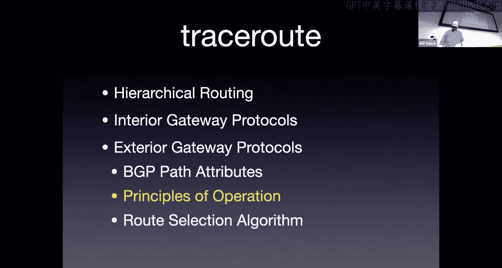

Well， we're going to make these announcements。When I have a prefix that comes online。 So。

 for instance， if I have a customer here， I'm sorry。

 if A1 has a customer here on the left of my picture。

As1 would like to announce to the world you can get to that prefix by sending us that those packets。

And so it will create BGP messages that it sends out to all its neighbors。Advertising this prefix。

 Oh， here is my prefix19 at 87 to 42 slash 24。And I'm going to tell you this， hey S2， hey， S3。

 here are the messages that announce that there's a prefix there。

 If you'd like to send information to them， you have any packets that go in that range。

Please send them to us。 And here's the attributes of this message。 I have a next top。

The next top will be the IP address of the interface on the router。

That AS2 or S 3 should already know about。Because those are in the subnet that the border router knows about。

 And so they get。Put into the IGP process。And we also have an AS path number on that。

 we have our own， you know， this is AS1， so we put as1 there。Those announcements then get propagated。

All right， so much like distance vector algorithms。 When AS2 hears about new information。

They pass it on to their neighbors。Right，And so。We see now AS2 got this BGP message。

 They then go ahead and send another BGP message over to AS 4。

 and you'll notice that the BGP message has changed a little bit。 The attributes have been updated。

Okay， so for instance， we have a different next top。It shouldn't surprise you at all。

 right a router in AS4 depending on its internal gateway protocol has no idea how to get to 19。87。3。

1。Because that's an I address over an As1。 So the next hops have to get updated and the as path gets updated。

We put our own AS number in front of the AS path before we propagate it on， so now we have two。

 one or three1 as the actual AS paths。As our traffic moves through。

Other stuff could get added as well。By the way， notice。

That this as path gives us more information than just a distance vector。And that is used to。

 for several things， one of them is to look for loops。Okay。

 so if we're seeing the propagation of messages from as to As to As， the As can look at the message。

 and if they see their own As number in it， then they know that there's a loop somewhere。

 and they should not accept that announcement otherwise they will be sending traffic。

 So in this case， if as1 accepts this looping prefix they will send traffic to As3 that will get sent to as2 that will get sent to S1 creating a loop。

 we don't want that to happen And so we can detect that with these the as path。 In fact。

 As3 can know not to send it in the first place because they can look at the path and say。

 oh as1 is already in here。 I don't need to send it to start with。

There's arguments about which to do in BGP， whether to。Pre filter or post filter， the loose。

I mentioned earlier that we use BGP to announce a prefix or to withdraw a prefix。

So let's imagine now that I have announced previously about this customer。

 but then something happens and that customer decides to go elsewhere。

And I no longer can get to 19 at 8742 through a direct connection with AS1。

 As1 then has to withdraw the routes that is previously sent。

And so it will use BGP to send a withdrawal message。

The withdrawal message does not actually have any attributes， It just says。Withdraw this prefi。

So everything I've told you previously about this， please ignore it。Okay。So if you wanted to。

 for instance， change values， you withdraw a route and then renounce it。You can't。

There's no way to just say， oh， change that MED value to something else。Okay。

 so we would send these withdrawal messages and of course those get propagated as well so that AS4 eventually knows oh。

 if you I can't get there that way anymore， hopefully there's some other way to get to that particular prefix。

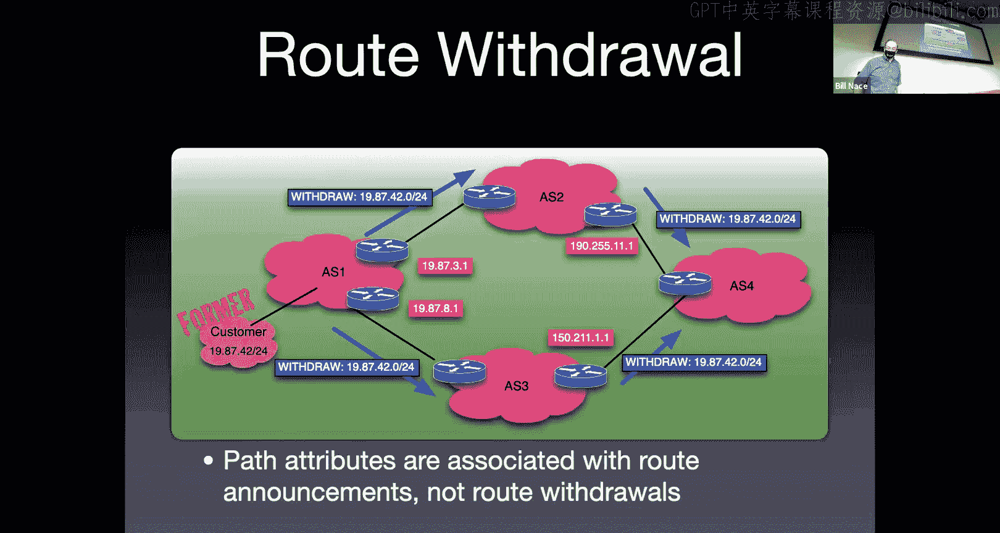

The next question then， once I've got all these messages is。From an ISP perspective。

 from an autonomous systems perspective。How do you look at the。

 the messages that are coming in and make a decision， You're going to be getting several of them。

 You'll notice As 4 is getting。

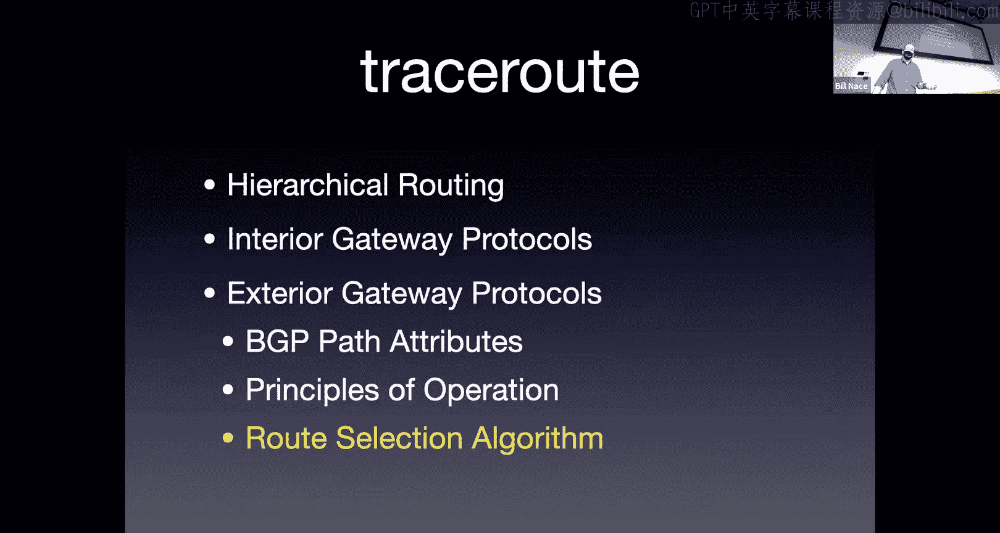

BGP messages about the same prefix from different destinations， somehow we have to make a choice。

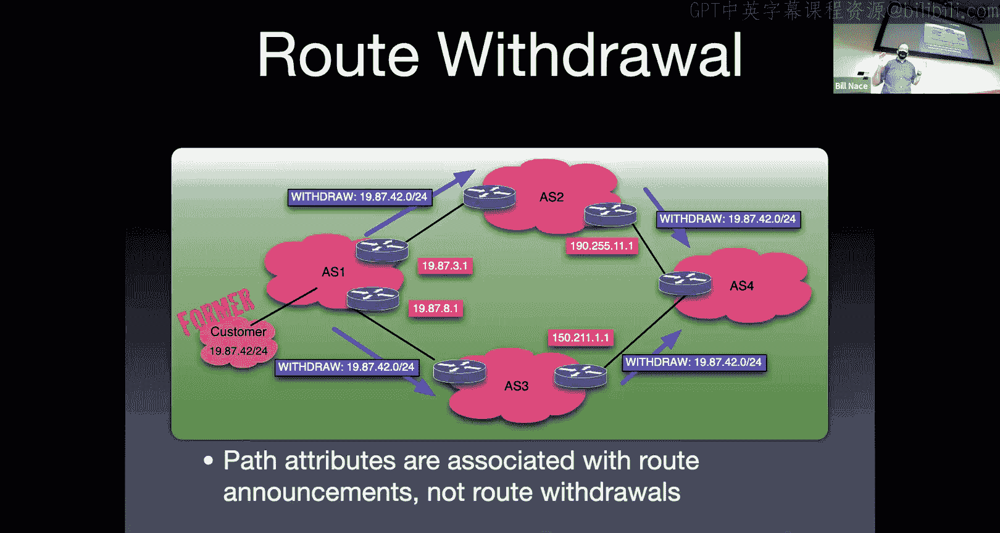

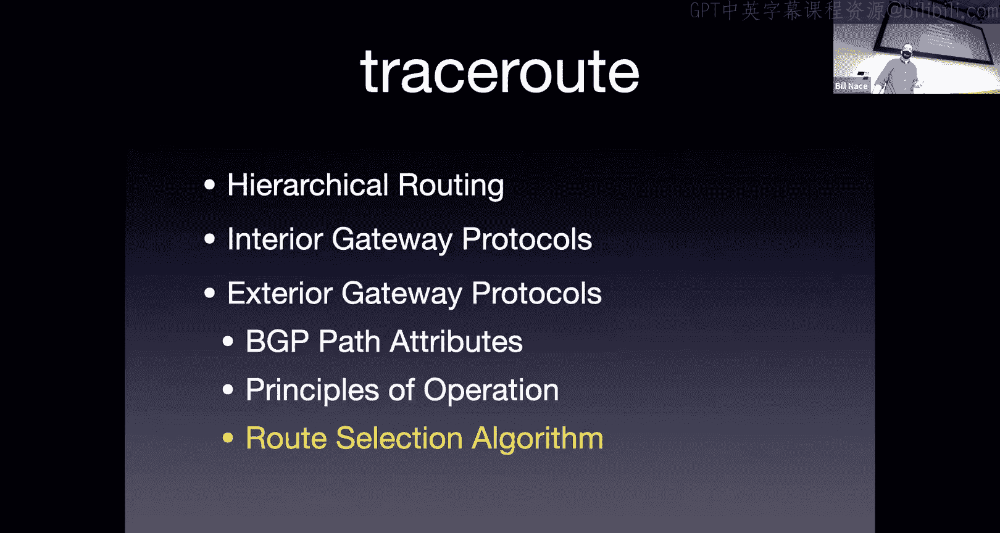

And so how do we actually select which one we should go with and so back to kind of our previous situation。

 but focusing now on AS4 right AS4 has these two routes coming in and that border gateway gateway that's looking at these has to decide kind of okay。

 which one will I tell which one will I accept？Which one will。

 I think is the correct route to get to that prefix。

 And then that information is going to get mixed in with the interior gateway protocol so that the routers within the network now know how that when they want to get to 1987。

42 prefix。That they send it to either。Of the I P addresses that are which based on whichever message that router chose。

 So you have to make a selection。

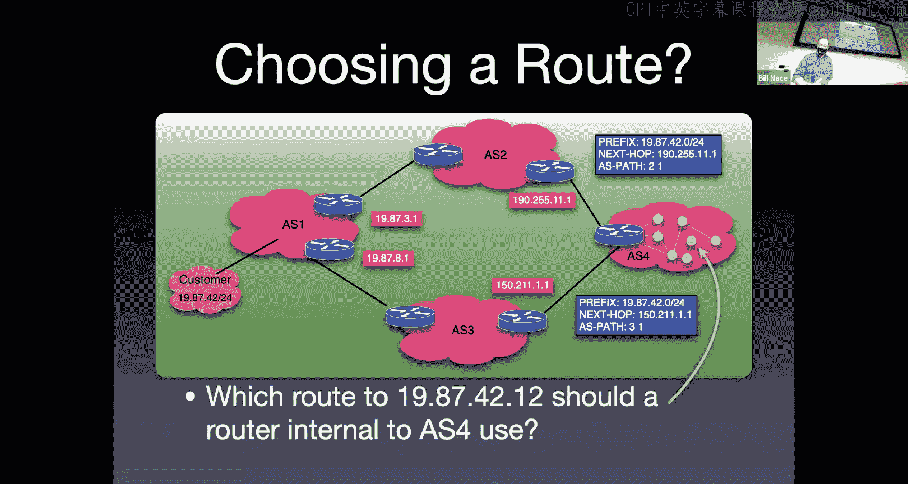

Okay， now that selection， there's。Here's one version of the standard of how you would choose。

 there are lots of tweaks on this， but basically they look at these attributes。And then they'll say。

 oh。If I can't get to the next top。 right， So if the next top does not appear in a forwarding table that the interior gateway protocol has calculated。

 then I should not accept this message。 right， somehow it got to me some weird way。

 And I don't know what to do with it。So it wouldn't help for me to accept it because I can't get there anyway。

 So throw that out。 This is mostly an error。Catching mechanism。Next。

 let's look at the who's got the largest local pref？

The local prep is a preference that my network administrator has specified。 It's a priority number。

 So， of course， that should be very high in the list of how I choose。 Basically， the。

 that's a way for the network administrator to say， no， don't send it that way。

 Send it this way instead。So we should pay attention to that。

 that's going to be second step of the algorithm。Then I'm going to look at the as path。

 The As path is kind of like the distance vector metric， right， that tells me。

Like I mentioned earlier， it doesn't tell me exactly which one is closer or further away。

It's not a hop count metric。 It's an AS count metric。But I can look at that and get some sense of。

 well， this， it's going to take4。Networks to get there this way， it's going to take9 that way。

 I'm going to do with four instead。🤧Okay。If I have， then。If I have two routes coming from a neighbor。

Then I'm going to use the multiex discriminator that's my neighbor asking me politely。

 hey would you please send it this way instead of that way and so I'm going to choose the one based on the med and then we we really get in in the weeds。

RightThen we're like， okay， we choose the things that our neighbors tell us。

 we choose things that are closer to us。 Actually， this step 6 is the basis for the hot potato routing。

 right， This is my own internal gateway protocol。 It said this way is cheaper than that way。

 So let's go the cheap way。 And then you break ties with Id numbers and things like that。

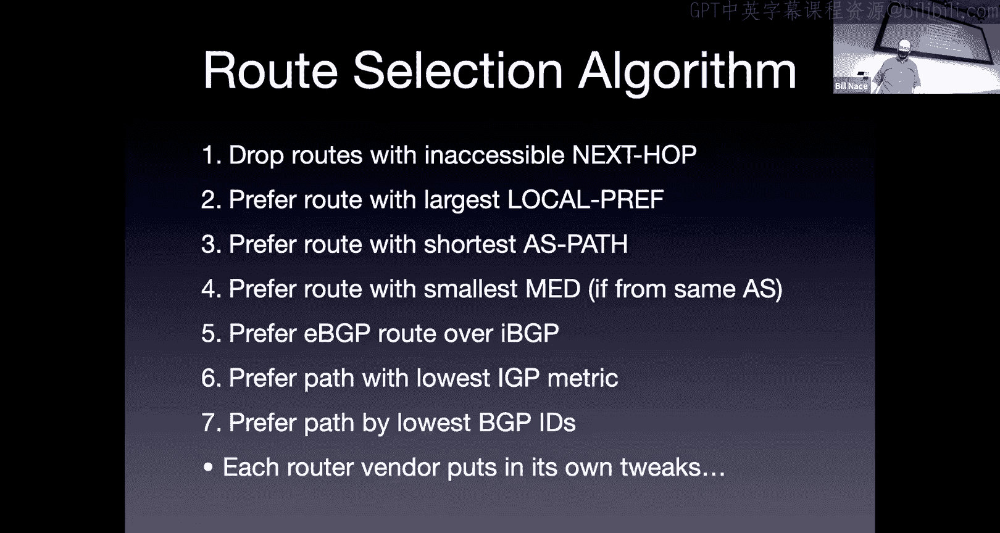

So back to my picture， how would。As for decide which one of these BGP messages to pay attention to。

OkayWell， we've got the algorithm， we've got the numbers， what would we look at。

 it turns out this is a little bit of a trick question。

Okay because I didn't give you enough real information。

 We don't know what the local pres are the as paths， right， I got a21 and a31。

 So both of them are at the same length。 So I don't know based on that which way to go and I don't know most most of the other things to happen。

 So in this particular case， I don't know which one would get chosen。

It would be basically the randomness of ties of which BGPID is bigger than another。

Presumably in real world situation， I have more data。嗯。So Pete， I'm sorry， can you？不感这。That's fine。啊。

谁得。something want to have。So Dan is saying， hey， could we load balance in a situation like this。

 could I。Could I somehow say， hey， half of the traffic， I'd like to go one way or half of the other。

Right how would I communicate that？ Because that's not really。

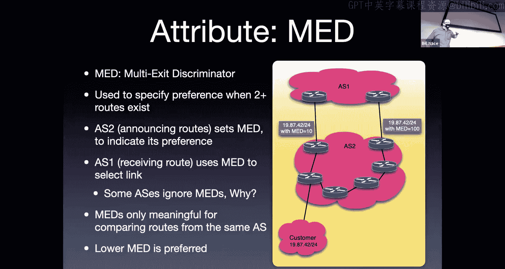

What's being communicated here， right？Speaking things that aren't being communicated。

Hey， we go。Sorry， my external display once again got disconnected， Not sure why。

And so we will unplug it and plug it back in。I hate it when， I mean， I'm glad it works。也部这个。

Everything。we should start keeping track at this time。Alright。

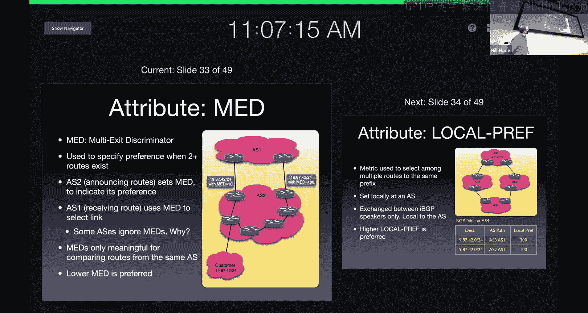

Okay。Sorry， so we're back now so the question was。This MED。

 can I use it to do some form of load balancing？And I'm going to answer you a bit more generally and say。

 actually， BGP is not really great for load balancing scenarios anywhere。

Right ME D specifically between you know， in a case like this where I have two different routes I could choose。

BGP is mostly about finding the chosen route to get somewhere。Okay。

 and we'll talk about other forms of traffic， what's called traffic engineering， which is the。

You knowThe process that lets me kind of look at the traffic in my network and say。

 oh I need more over there， I want less over here and do that kind of load balancing stuff but one of the things to recognize is that the basic mechanisms we have for forwarding really aren't。

Good for any kind of load balancing， right， A router has a single way to get to some。

 some I P address。And so it will always send it that way。 It doesn't have a， well。

 if there's congestion that way， let's go some other way sort of scenario。Okay。

 there there's always just here's the right way the differences you see in the network that are happening are not because。

 oh， there's some congestion there and a load balance or pushed it some other way in many cases。

But usually they're the oh， that router crashed and so therefore， you know。

 this is we moved it this way that way or some， you know， oh。

 the Ciss Eds finally brought that new expensive router online。

And so now we have a different route somewhere。 And that's dynamic enough in our network。

Within networks。We do have the traffic engineering does allow us to do more of the load balancing and you see that in sophisticated。

ISSPs and sophisticated data center networks and places like that。But at its basis。

IP really is not a。A protocol that is designed to be that dynamic and react to load in that way。Yeah。

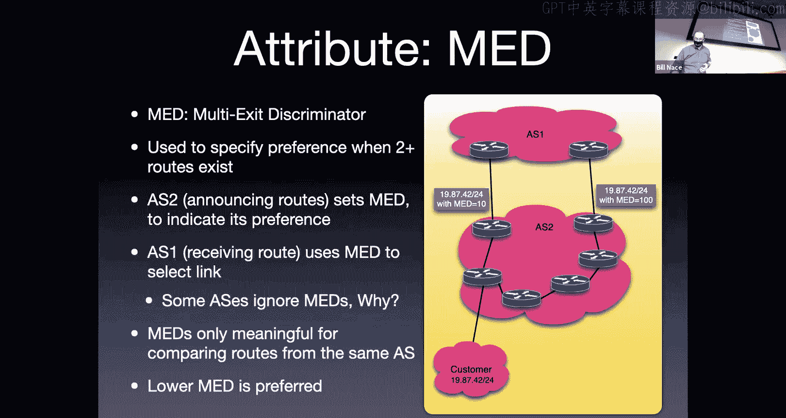

Yeah。Okay， Okay， so。We've learned a lot about BGP and about how this works。

 and it's a complicated topic， especially because how it works connects with a bunch of other things。

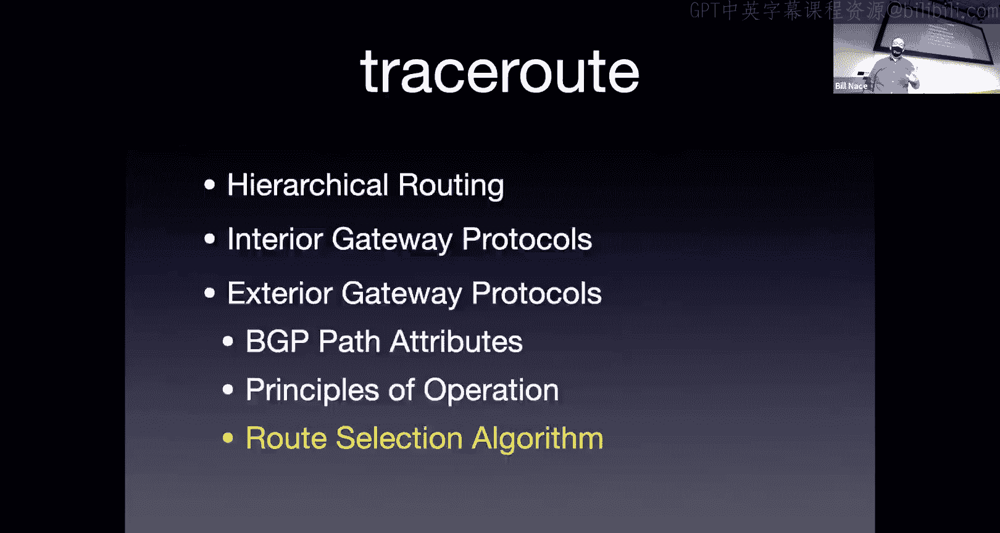

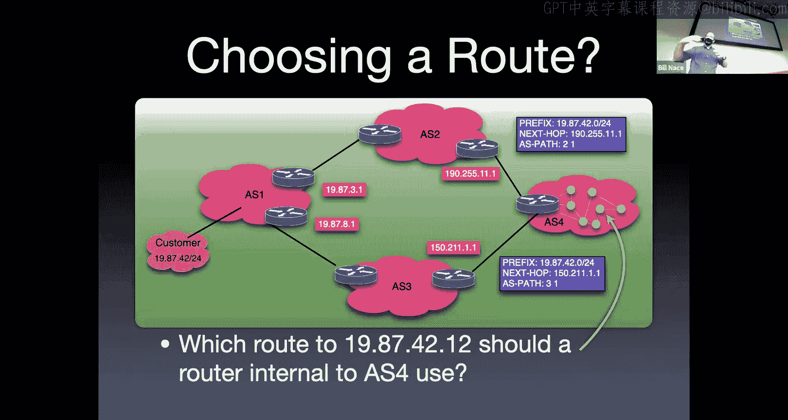

I'd also like to point out if you're confused about this， you're not the only people right。

 there are things that happen in the real world with BGP and we all see them。

Okay so here's just one example that I picked out there are tons of these this is not like a oh this is the only time this has ever happened right every year I just go search for BGP stories and I picked like the top one and it turned out not too long ago there was a situation where a BGP route got announced in Nigeria that announcement got accepted by an ISP in China who then passed it on to an ISP in Russia who also accepted it and as a result。

Much of Google's traffic and， I think Twitter was part of this as well， got routed to Nigeria。Okay。

 but it shouldn't have been there at all。 Okay， but somebody made a mistake。 and for 72 minutes。

Google's traffic was you know， your Gmail was going to Nigeria instead。That's obviously a bad thing。

 that's why Google pays engineers to pay attention to this sort of thing and to figure out what's going on and they get on the phone and talk to somebody in Nigeria and say。

 hey， you're making a mistake， you got to fix this。And hey， China， you're making a mistake。

 you' got to not accept that route， and so that's what happens in reaction to these。

Or maybe it was a man in the middle attack and somebody wanted to get。

Something out of that Google traffic and meant wanted to divert it somewhere else。

Probably the former。 Okay， but it does happen that there are。

 there are people who've made money by diverting traffic in certain ways and being able to manipulate it。

 Blockchain is one of。The obvious targets for this。

And so knowing how BGP works and what's going on with it is going to be important to understanding how networks work。

Especially if you want to continue on this area， BGP is one of those things that you could have a fairly good career working on researching BGP and how to fix it and how to make it operational。

 how to do different things with it。Okay。Etric， are there any sort of？China measures for。

Well let just see try。我觉得是。好了。And least something。Edric is asking are there countermeasures to that kind of rat hijacking。

 and there are。So there is a security structure that is being put in place。

 unfortunately not everybody does it， but there's a PKI and signed BGP messages and all that sort of crypto stuff。

 you know， the crypto engineers that basically wave their magic wands over BGP and that's helping to change things。

One of the other very interesting things I think that has been used for many years is effectively a half。

 but one that works really nicely。If you look at the external gateway protocol communication。

 it is directly from one router to another。Okay， and so the idea is。That any border router。

 when it looks at a BGP message coming in。You go ahead and you look at the time to live field of the I P packet。

And if that time to live is not 254， you throw it away。Why 254， Well。

 that's an8 bit field and the biggest number you can put into it is 255。

 And so my neighbor puts 255 in his IP packet。And then， it gets sent to me。

And it should have a 254 for that time to live， right， because it would be decremented at once。

If it's decremented by more than one， then that packet didn't come from my neighbor。

It came from somewhere else。That got forwarded a couple steps before it got to me。Okay， and so。

Clearly a hack。 That's not what the time to live was intended for。 Okay。

 but it' a really good way of making sure that you're talking to someone who is your direct neighbor with this packet instead of it coming from somewhere else。

So that's the sort of stuff， E that we use to try to protect against road hijacking。

Someday it will all be nice and beautiful and well all work perfectly good until that。All right。

 thank you very much everybody。 I appreciate your time Hopefully you had enjoyed this。

 I love this part of the network because this is。😊，Complicated stuff， doing cool things。

 nice algorithms， good engineering， and the real world all intruding at once。Have a great day。

 everybody。Yeah。

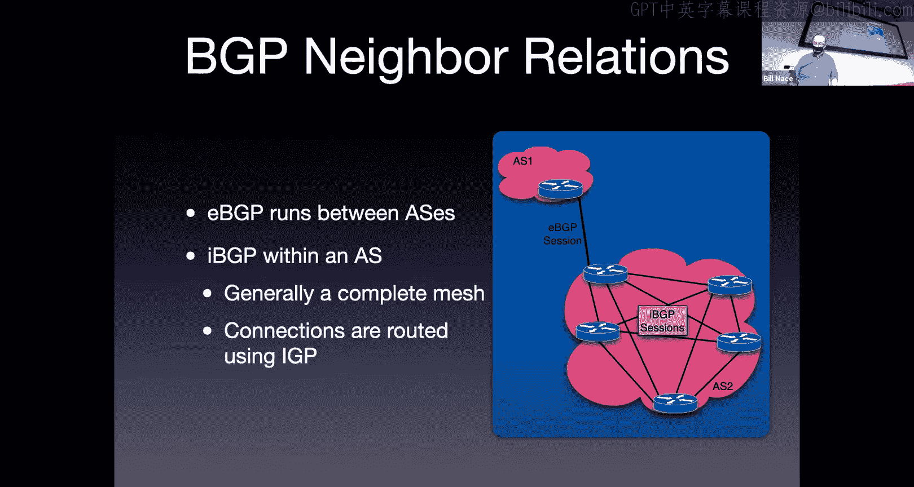

このこし。Okay。

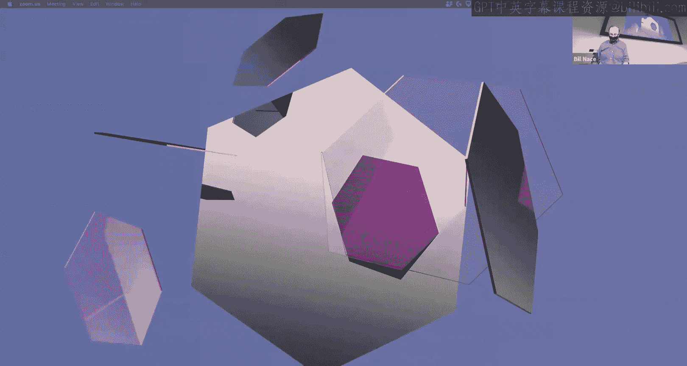

Yeah。Okay。好。Any chance have a printer of last year's quilt， I was not able to find my own。

From last year quizYeah， so that I review for sure。

 I don't mind if if it's an idea generator exactly。Yeah。

 can you send me an email and I yeah then I'll remember when I'm actually in my office don' either。

 yeah， do that I'd also appreciate if you get a chance to just do quick check when the homework case all I need is can you actually follow the first couple of paragraphs of the directions they still all work。

you got。That'd be great， thank you。诶执。What名前き大。Okay。

So I ran the algorithm as specified in the syllabus。 So basically I took。So A。

 I took grades off of canvas。Okay， so make sure that， you know， if you're looking。

It's possible that we have grades out of sync when grades scope can if so let us know what fixs it and then I basically you know average your homework you know。

 multiply by that weight average your paper reviews multiply by that if you have everything above 90 those averages should be above 90 And then when I come up with a you know the total 0。

9 and above is an a actually 0。9 to 0。92 is a minus So if you go end up with outside that range。あ。

So if you'd like， send me an email and I'll be glad to take a look at the spreadsheet I did and see what I'm seeing because I definitely don't want to be calculating off of that data or else。

Yeah， I'll be glad to take a look at it， but yeah， I won't remember by the time I get home。

 so send me an email and care。嗰喺度。No， no， no so what it did was I calculated based on what you've done。

The for instance， have done。Two labs and a homework out of what I expected to be six assignments for the assignment and so I'm like okay。

 that's half of the points for that and so many paper reviews five paper reviews out of eight is whatever percentage and then it basically say so far in midterm you shouldn't have been able to score this many points。

And I divided your score by that number and so instead of being out of 100%。

 I was saying out of you know， points scored out of points possible it was your percentage and if that again。

 if that number doesn't match what you got piece an email be to look in my spreadsheet and see what was going on and make sure because there aren things。

I mentioned the one minute though， I don't know if you heard that we occasionally get grade scope。

 especially if you did a regrade request， sometimes those regrade requests are put on the grade scope but don't make it into Can and I pull all the grades up in canvas。

So take a close look at what those are and if you it doesn't seem to make sense。

 please let me know and I'll be glad to to look in the spreadsheet I'll be glad if you want to show up but office hours。

 I can walk through the calculations with you if you want sure。I'm sure sorry。不。

