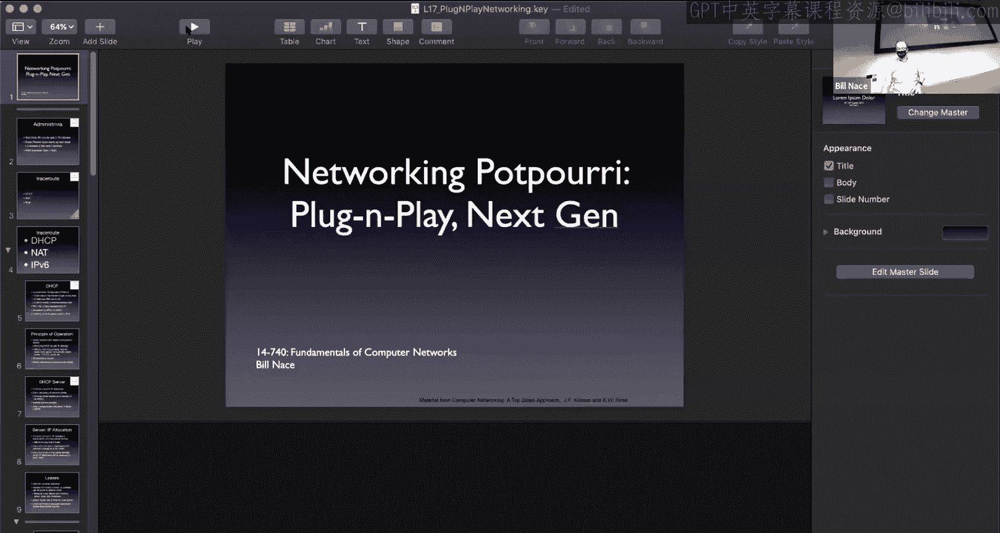
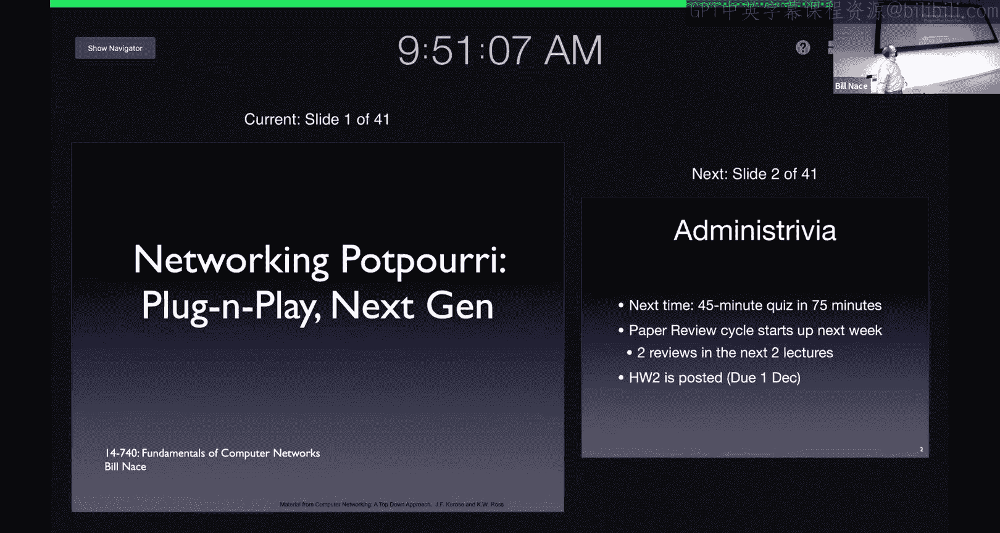
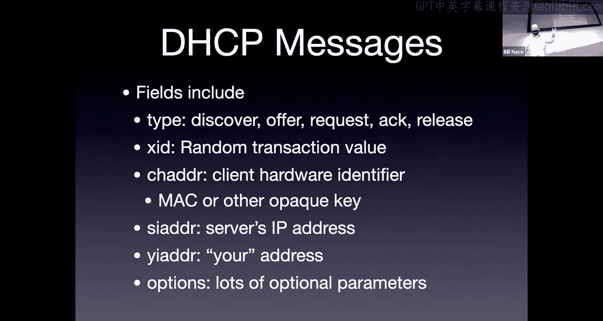
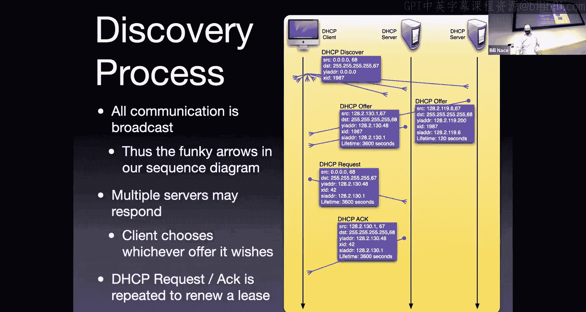
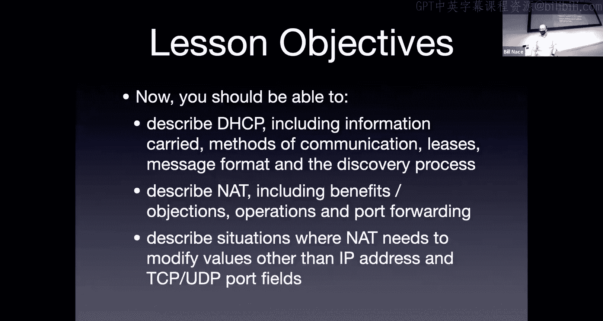

# CMU《计算机网络基础｜CMU 14-740 Fundamentals of Computer Networks 2020》中英字幕（deepseek p17 -P17-2020_11_05_Lecture17.zh_en -BV13J6uYpEZm_p17-

This is 147，40。Today， we're going to。Finish up with the material in the network layer。

 Almost we have。A couple more topics to come after the quiz that will sort of relate to network level stuff。

But today is a data to kind of， well， to do all the stuff we haven't done so far so。

I call this the Pori lesson， we just kind of have a bucket of a couple of topics that。

Go to。 Well， they sortre of go together。

But frankly， there are more of。They're more in the same lecture because it's what's left over as opposed to any real good。

Good linkage between them。 A couple of them actually are important。

 So we're going to basically cover three big topics。

 and two of them are going to say very useful for making the network plug and play。

 which has made it something more useful for。😊，All of humanity than it otherwise may be。

Before we get into that， a couple of administrative notes。Hopefully， by now。

 you know that there's a quiz coming up next week。Right， so next Tuesday。

 the masses who are in economy do not need to show up here。Okay， be in someplace comfortable。

 We'll do a quiz just like we did last time it'll be on canvas。

 You'll have 75 minutes to do the quiz。It will be closed book， closed notes。And。I mean。

 I wrote the first quiz， I'm going to write the second quiz better get on that and so that means that probably the style of questions is going to be kind of similar to what you saw last time。

 I wouldn't expect any great differences in what's coming up。

 I urge you to take a look at the lesson objectives。Those are。

I think I posted the second set on through the website， if not I will get them there。

 but they're the less objectives that are in the slides at the end of each lesson。And。

Those are telling you what I'm going to ask you on the quiz because I literally when I sit down to write the quiz。

 I pick some of those lesson objectives almost at random， not quite， and then I just say， oh。

 you know the lesson objectives say that the student should be able to do X。

 let me write a question that tests whether they can do X。Okay。

 so I'm not going to try to trick you by pulling in other information or things like that they will be driven by those lesson objectives。

 so please take a look at this， please let those guide your study habits。

There will also be a review session this weekend there's a post on piazza with the exact details of where to go and what times so please allow that to help you with your study methods as well and of course if you have other questions。

We have some office hours between now and then or we are， you know， send the questions to Piaza。

 will'll be glad to answer them。 you need to talk to us， send us an email。

 we can set up an appointment to do that as well。 So whatever you need to help you out with your your your preparations。

 please。Please do it and let us help if you need help with us。

I also want to point out to keep an eye on the class schedule。

 because right after the quiz there are a couple of paper reviews coming in。

 we haven't done paper reviews for a while， a couple weeks。So， you know。

 just notice that theyre there so that you don't forget to turn those in。

And also I just posted homework two homework two is it's due in a month。

 so you no big panic right now， however， it is a。It's not a huge thing。

 but you're some you're using some software tools to examine a large data set。

 and it's not the sort of thing you can crank out super much at the last minute。

 so it would help to set aside some time soon to at least take a look at that and get used to it and maybe do it early on。

 okay？All right， On to today's technical material today， we're going to talk about three topics and。

Man， when you look at that slide， it looks like these must be inign little topics， right。

 it's just just what 11 characters on a stream， but these actually I think are much more important than that。

 These are some of the technologies that have made the network really useful to ordinary people so that they don't have to。

 for instance。You don't have to know what your IP address is。

And just becomes more plug and playish because of that。So these are I think， important protocols。

 important technologies to understand， and so we'll bundle them up three technologies for today。

The first is DHCP， you can tell because it ends in a P that it must be some protocol and it is。

 this is the dynamic host configuration protocol。If you are much of a computer geek at all。

 you probably have seen those letters together somewhere。

 You've heard that there is a DHCP server somewhere on your network， things like that。

Today we're going to figure out what all that's about。

The mission of DHCP is to make the the process of joining the network a much more easy and natural and。

automatic process， so the idea is that you want to have some bundle of configuration data that is necessary to operate in a particular network。

 and you'd like to get that data to a computer that needs it that wants to operate in the network。

So what do I mean by that kind of data well things like an IP address the IP address is related to the subnet you're joining you can't just have a random IP address and show up。

That statement， by the way， should be obvious to you because now you understand routing。

And so that means you understand the hierarchical nature of it。

 you understand that the routers have to be able to find your IP address and they do that by looking at the announcements of IP ranges of prefixes and so if you just showed up if you landed from an international flight and showed up at CMU and opened your laptop。

You can't use the same IP address because the network wouldn't have any idea of how to get to you。

And so instead， you need to change your IP address to be a local IP address。

 something that is accepted in this particular subnet。

 and so DHCP allows you to do that allows you to。To automatically get an Ip address from the network itself。

Its history starts way back with a protocol called Boot pe。 This was a protocol that Sun networks。

They used to be a really big computer company that sold Unix workstations and they were started selling these serverless I'm sorry these。

Disless machines that would be very thin clienty， you put them around in a network。

And those guys didn't have a hard drive， so they didn't have a way to save any configuration data through a boot process。

😔，And so the boot pe protocol was born as a way for those workstations。

 those thin client workstations。To ask the server， hey， what IP address should I be using？

It turned out it wasn't broad enough， it was mostly aimed at that particular scenario and only had a couple of pieces of information that you could transmit over it。

And there needed to be a more broadly general protocol that would allow for lots more forms of information to be transmitted because there were some other networks that needed to pass around different kinds of data。

 And so DHCP arose。To， to fulfill that need。Mostly to allow more than just IP address and。

And server and。Rr information to get around。It's worth pointing out we're going to talk about IPV6 in a minute。

 the new shiny coming version of IP， and for that there is a version of DHCP that will handle the details of an IPV6 network。

And pass those around。So how does this work？You wander into a coffee shop， oh， remember those days。

You wander into some other location and you open your laptop and the laptop we can think of it as newly boototed and maybe you did reboot it。

 it's coming out of hibernation， coming out of sleep and the laptop looks around and says hey there's a network here I'd like to join it okay let me figure out let me get the information so that I can join what is my IP address going to be。

There's also some other information that they may need I mentioned the next top gateway that is another very important piece of information because that's whenever your laptop sends information it actually has to go through a router somewhere and so it needs to know on this particular subnet。

 what router am I connected to and so we need to know that piece of information there are others okay a subnet mask tells us you basically how big the prefix is for this particular network finding out what DNS server you should be using。

 remember DNS we had a local DNS server that you would send your query to。

That's bundled in this as well other information as needed for the network theres there are several pages in the RFC of the information that can be transmitted。

 doesn't all need have to be， but in some networks you might need this obscure piece of information and so DHCP allows you to get it。

So the process this newly booted computer follows is it basically broadcasts a request。 remember。

 it doesn't know anything so it can't know which server to contact to ask for this information right because how would it have known which server that is So it's going to send out a request to everybody。

And most of the participants on the network will ignore it。

But anybody who is a DHCP server can go ahead and respond to that。

 And so the the newly booted client will send out this request basically shouting， hey。

 anybody know what I address I should use。And then some server somewhere will send an answer。Okay。

 and maybe several， in fact。Yeah。The server itself， the one who is answering these。

 is responsible for ensuring that this data is transmitted properly， that it has the right。

Numbers to deal with for all these pieces of information。

And that it does things like manage the IPp addresses。 So a lot of the information。

It doesn't matter everybody in the network should know what the next next step gateway is。

 right everybody should know what our subnet mask is。

But every participant in the network needs a different IP address。

 and so that's the server's job is to have a bundle of IP addresses and to pass them out and make sure that we don't have the same IP address being used by multiple computers in the network。

It is possible to set up several DHCP servers in a network that's typically done for redundancy sake。

 you'll have one like main DHCP server and just in case that one crashes you want to have another one also around okay they both can answer queries。

 we'll see how a client might decide which one to use or how to guide that as well in a few minutes。

It's also possible to have a single DHCP server managing multiple subnets。

I want to take a quick aside。 We're going to use the word subnet a lot today。

 And I just want to make sure you understand what we mean by that term subnet。A subnet is a， well。

 it's a piece of a network， right， It's a sub componentent of a network。 So it is a network。

But it's a network without routers in it or well， technically， there's one router。

 the subnet maybe two。The subnet is the all of the network pieces kind of between routers Okay。

 you don't have any places where a subnet。Has a bunch of connections off of a router。

 and then that same router has a bunch of connections off another link。Okay， so for instance。

We sometimes say that a subnet is a local area network， not entirely true， but that's the same idea。

 right， You'll have a network that covers maybe， maybe here at Carnegie Mellon。

 there is a subnet that covers this building。Okay now it's a piece of the overall network。

 and that means that the administrators have a router somewhere and there's one wire out of that router that comes to the machines here in the subnet。

And that means all of the computers in the subnet are managed similarly， for instance。

 they all have to have the same prefix。Okay，They all have to have the same range of IP addresses so that that router knows how to send。

Packets into this subnet properly。Okay，They all， use the the same router next step。

 That is the router they're they're going going head to when they send messages out。Okay， so it is a。

 we're going to talk more about them when we get to the data link layer， another way to look at it。

 it is a segment of a data link that is able to communicate to between servers or to a server or between。

 I'm sorry， to a router or between routers。Okay， so the subnet thing， right， we're gonna。

 it is possible for administrative reasons to allow one DHCP server to cover multiple subnets。

 So you don't have to necessarily。 if you're building CM use network。

 I don't have to put a different DHCP server in every building or every subnet。

 whatever power they've decided to partition the network。You could have。One router somewhere。

 or I'm sorry， one DCP server somewhere。And messages from a subnet can get routed through the router to that particular HCP server if it's set up properly。

Alright， so the DHTP server is mostly a database of a bunch of data， right。

 You want to be on this network。 Here's a bunch of data you need。

And an allocation process for individual I P addresses。

Now that allocation process for the IP addresses。Can happen in a couple of ways。

 The dynamic allocation is by far the most common。 The idea is that you have the server has a pool of addresses and it will assign an IP address to a particular client to a particular host in the subnet。

But it's only for a particular amount of time and the expectation is that that host will eventually wander away。

 think coffee shop or think human economy auditudorium。

 that host will eventually move on and well want to recapture that IP address and give it to some other host。

At some future time， and so it's a reuse mechanism。For some pool of IP addresses。

Some of the IP addresses can be assigned automatically。

 basically the server is set up so that when Dyion's computer shows up in the network。

 Dion always is told this is the IP address you should use。

Now this is a holdover from not so much needed these days。

 but it's a holdover from the '90s when IPP addresses actually were used as an anti software piracy mechanism。

And you would have software that was registered to a particular I P address。

 And so it would be important if you went into this network that you always get the same I P address so that you can use the software you。

 you've registered using that。It's also possible for that process to be manual right the ciss admins basically say know this IPHS goes to this particular client。

 maybe because again， maybe for software registration purposes or some others。The dynamic。

 so the top one up there， the dynamic allocation is the most common use， I said。

The way that works is there's a leasing mechanism。When the server hands an IP address to a particular client。

They also specify a time limit for it， they're basically leasing that IP address to that client。

And the reason is。Before people leave the coffee shop。

 they tend not to notify the network they're going to do it right。

 They just shut their laptop and leave， or maybe even if they intended to maybe their laptop crashes。

doesn't have time to tell the DHCP server， hey， I'm done with this IP address。

 you can loan it to someone else。And so this leasing mechanism is an IP recapture mechanism。

 it's a way of having the server pass out an IP address to a particular client。And then。That client。

 you know that client can use that IP address， but only for some given amount of time， hey。

 you're allowed to use this for the next 30 minutes。Okay， and if you after that time period。

 we're going to assume that or the server is going to assume that the server can use that IP address again to give it to somebody else And it's possible for。

A client to say， hey， I'm going to be hanging out here in the coffee shop longer。

And so at the 30 minute point， instead of just losing their IP address。

 they can respond back to the HCP server and say， he'd like to renew that lease。

 could to have it for another 30 minutes。Okay， and of course。

 the servers couldn't tell them that's okay。Right。It't make sense。

 basically just a simple timing mechanism to allow for the recapture of these IP addresses。Yeah。

Now we haven't talked about the most interesting part I think of。Well， it's a bootstrapping process。

 right， you come into a network。And you'd like to get an IP address。And。

That IEP address will allow you to send messages in the network。But to get that IP address。

 you have to somehow send a message。😡，Right， you can't。Well， you've got to well， what do you do。

 right， How do you send a message， the the IP packet， you know， you've seen the header。

 the IP packet requires that there be a source IP address in there。Okay。

 and also we don't know who to send it to。Okay， so how do we go about coming into a network completely blind。

 not knowing any information， and be able to send information to a server to requests the data that will allow you to send messages？

Okay， and。Stephaos has half of the answer correct， the answer is we're going to broadcast it。

There is a IP broadcast mechanism that lets you specify a broadcast IP address， oh， that's all ones。

Okay we talked about this briefly when we talked about IP addresses。

 as we said it's not a real broadcast， it doesn't go to everybody in the network。

Which is good because otherwise， your computer would be getting messages from everybody in the world。

OkayInstead this will go to everybody in the subnet， so it's a subnet layer broadcast。

A router who gets a packet for 2，55，255，2，55，255 knows that it's a broadcast。

 and the router will not send it on。It'll go to the router and then stop there。The message itself。

 DHEP uses UDP as for its segment formatting， and it goes ahead and sends in its own DSCP protocol。

 it sends this message out to basically the world。And of course， Daniel。

 we hope to get responses from servers， we hope to get a response from one or more servers。

 it is possible to get many。Now the message itself。

 the actual protocol we're using the thing that's being put into the UDP segment data has is a DHCP message and it has a bunch of fields we're not going to talk about specifically how those are constructed instead we're going to just say it has this kind of information it needs to transmit right it needs to well tell you what kind of message it's sending。

 what is this thing and what is the type of this message。

And we have we'll see some of this discover offer right so a client will send a discover message。

 servers will respond with offer messages， there's a request and an acknowledgement。

And there is a release mechanism， if you are leaving the coffee shop and are going to be nice person。

 you can give up your IP address with that release message。

There's a field for a transaction value we've seen this over and over again right we're going to send out a request。

 we're going to hear responses， we've got to make sure those line up。Okay。

 and so we're going to basically fill in a random value。

 And we hope that nobody else in the network just sent a message with that same random value。

We have a field for some identifier value， something that will say this is my laptop。

 This is who we're talking about okay， and that often is just something like an Ethernet Mac address or something that we think is is unique to us。

 It can be in a managed network It can be some opaque key， something that says this is who I am。

Or this is one of a bundle， you know this is Bill's laptop or Bill's backup laptop or something like that。

 it doesn't have to be a Mac address。Which is good because in technicality。

 we may not be sending this over Ethernet。 We may not have a Mac address。

If we were using some other data linked technology。There's a field for a server's IP address。

That's who we're going to talk to， and that lets us identify in a request which server it's coming from in a case where there may be multiples。

There is also the your address。Sometimes think， you know。

 maybe that should be Yin's address for Pittsburgh， right This is。

You know the address we're talking about from the client。

 this is the one that we're asking for permission to use。

 this is the one that a server is responding to us and saying， hey， here's one you can use。

And then tons of other data that goes in the options。

Suppposed to put together a sequence diagram， oh， look。

 I have put together a sequence diagram describing what happens here。

It looks like the sequence diagrams we've seen before， right it's going down the page。

 messages being sent back and forth。I have three participants here， which is a little unusual。

 I'm showing a scenario where I have a client。 This is the computer that needs an IP address that's just shown up。

 And in this case， we actually have two servers。Okay， just to illustrate that it's possible。

 this isn't going to always happen exactly this way， but if there were multiple servers。

 this is what would happen。You'll also notice I'm trying to illustrate that these messages。

Our broadcast messages。In most of the sequence diagrams we've seen so far。Actually。

 I think probably all of them， the message is going from somebody to somebody and so there was an arrow on that saying I'm sending this message to that particular client。

In this case， we're not doing that。 These are broadcast things。

Right so there's no real directionality about it。 And I tried to show that at the beginning with a bunch of arrows going out all over the place that gets a little tiresome for the whole diagram。

 So instead。I put these little chicken feet things on the end of the arrows。 Oh。

 they're not arrows anymore， right， They're broadcast messages。

And so there's no arrow head tip instead this chicken feed is supposed to indicate it's actually a broadcast message going everywhere。

Right。So now that we have the ground rules of my picture down， let's see how this works right。

 we have got a client that shows up and sends out a discover message Okay， so this is a DHCP message。

 It's in a UDP segment Okay， it's sent。In an Ip broadcast packet。

And the contents of that thing are well， here's a source address， I don't know who I am。

 so I'm going to put zeros in that field， got some some port number， here's the destination。

 it's a broadcast IP packet so the destination address is all ones it's going to port 67 because that's the DHCP port。

In the DHP。Message in the your address field， I've got all zeros because I don't know who I am yet。

And we've got some random transaction value。So we randomly just decided， oh。

 this request I'm making is 1987。That goes out everywhere。

Anybody else on the subnets going to ignore it， but we have two THCP servers on the subnet so they will respond。

Okay， they get this message and they go ahead and send back JHCP offer messages。These offer messages。

oo， you'll notice still broadcast。Right。Why can't know we that server would know who they're talking to。

 right， Why can't they send a message that's not broadcast。Well。

 because that client doesn't know its IP address yet。

 so you can't send something somebody who doesn't have an IP address。

 another way of looking at this is that client doesn't know what IP addresses it should be looking for So if it sees IP packets go back and forth。

 it needs to be able to pick them out and say oh， this one's for me。

And so it doesn't know that so these have to be broadcast as well。

They are coming from a machine that knows its IP address， so you'll notice they have IP addresses。

The destination IP is broadcast， as I mentioned， each of them is offering up an address， right。

 1282130。48。Is is basically the server saying， here's an IP address you could use。Okay。

 here's here's what I'm suggesting and you'll notice those are probably in the same sub that。

 a lot of the bits at the front of those two addresses are the same。

These DCCP servers have been coordinated to work in the same subnet。

The transaction ID matches the transaction ID of the discover message that's so that the client knows。

 oh， this one's for me。Remember， this could be happening with multiple clients at the same time requesting messages。

Okay， so we got to make sure that those。Those answers go to the right request first。

Let's see we've got a field for the server address we're sending thats that's in the DHCP message。

 you might look at that and say well wait a minute that's already in the packet and that's true。

 but the information in the packets going to get stripped out at the network layer。

The packet segment is going to get handed to UDP UDP is going to pull the DHCP message out and hand it to the。

To the DHCP application， and so that application is going to be able to look at this server information address field to know who to talk to in the future。

And one of the options is the lifetime， so they're saying， here's an IPHS you can use for 3。

600 seconds or 420 seconds。Okay don't know why these numbers happen to be there。

 That's this the system administrator has set it up this way。

 probably looks to me like this is a main server and a backup server。

And so you're supposed to take the request from the middle server， but if that guy's crashed。

 then this other guy is going to give you something you can use for a little bit to limp along until that guy reboots。

The client then has two offers， looks at them， makes a decision。

 it can decide whichever it wants to ask for， okay。

 it probably is going to ask for the one that has a longer lifetime and so itll go ahead and send a request now。

哎。It's request， so the first one is saying， hey， I'd like to know what IP addresses I could use。

And it got two responses now with this request message it's saying this is the one I'd like to use。

 is that okay？Again， it's a broadcast message because we technically don't have permission to use that yet。

Okay so we're saying， hey， this is the one I want to use。

It's still in an IP packet that has a zero for the source address because we don't know whether we're allowed to use it or not。

It's broadcast， it's talking about this IPHS。 We want the dot 48，1。

 Look at that different transaction I D。 right This is a different request。

 So we randomly generate some different number for that。 This transaction I D is 42。

I'm going to send it to that particular server， you know this is the lifetime of the thing you've said。

And that server responds with an acknowledgement says yes。

That thing you discovered is still available and I'm going going to go ahead and allocate it to you。

 I'm going to go ahead and let you use it， so I'm going to send back an act message for that particular address。

 it has the same transaction ID so that the client knows which one can match that up to the request he made and here are the details here's the 3600 seconds lease that that particular IP address has。

That kind of makes sense。Question， so you said that a DHCP server can serve multiple subnets。

 correct， So let's say my computer direct joined one subnet and does a broadcast network。

 And the DHCP server is not directly in that subnet。

Does and that sounds like the broadcast wouldn't get to them Yeah I'm sorry with the router then oh let's finish see it and like okay。

 this is DHCP I know how to route it directly to the DHP server Yeah so for zoom people。

 the question is about my statement earlier that a DHCP server could serve multiple subnets。

Which implies that that server would not be on the local subnet。Okay。

 so these requests we're sending out， we're broadcasting them。But we're broadcasting them。

 trying to get to a server that's not on my subnet。😡。

And that conflicts with the statement I said a minute ago about how broadcast only covers the subnet you're in。

Okay so yes， if you have a situation like that， then the Cs admins need to know that and they would have configured the router to know and to be looking for a broadcast that is a DHCP message and would know to forward it on somewhere else so that would be a special case that the administrators would have to set up to make it work。

Yeah， for that problem。I'm sorry to't miss any Zoom questions， Okay good。

嗯。This is once again， we have a protocol that grew up kind of in the good old days。

 and there's not a huge amount of security on it。 And in some cases。

 it's hard to figure out how you would get security on it。 Okay， How do you get。

An encryption key to a client who doesn't know who they're allowed to talk to。

RightIt it's a tough security question to ask。 And that means that we have problems that could show up。

 right， It's possible to run a server right， JCP is an open protocol。

 you could run a server on your laptop right now in this in this situation And when I show up and open my laptop。

And send out a DHCP Disc you could answer。Okay嗯。In managed network situations。

 ass one of the ways that those OPEC keys are used is to be able to communicate a little bit more information。

 But that has to be something that's set up ahead of time。

So that your laptop knows to send that and whatnot。It's also possible to be， you know。

 there's nothing in here that authorizes or checks that a client machine is allowed to be on the network。

Okay， and so that does mean， for instance， if you wanted to， you could。

You could go ahead and keep sending requests and collecting IP addresses。Okay， and you just。

 you'd probably want to change the hardware address field of the request。

 but you could pretend to be 30 different laptops and take all the DHCP。

 use DHCP to take all of the DHCP allocated IP addresses for the coffee shop and then you get to use it nobody else does。

If you wanted to。Yeah。Here's what I think DHTP is fantastic。

 it is one of these technologies that has made the network so much easier to use。

You guys have grown up with this network where you do just walk in a coffee shop and open your laptop there was a time before you were born where if you wanted to be part of a network you needed to have the information given to you many times back in the 90s I'd move to a new house。

 I'd get call it my ISP， they'd have to send some guy around my house to install the network。

 the internet into my house and in some cases they would say。

 well here's here's some software on the CD， youd have to run this to get set up to the network or at the very least here's the index card that has your IP address and the guy would type it into your computer or you'd have to know how to get to the right screens administratively to do that and many users are not going be I don't want to say capable of that but not going want to or know how to go through those hoops to set up the network。

The DHCP has really opened that up a lot， which is fantastic。

Second plug and play technology that's really helped from the network level and thats。Net。Network。

 address translation。So network address translation also works on the problem of how to manage the IP addresses that were' given。

It does it in a slightly different way， and it's one where we're using that as a mechanism to present to the network。

 to the public side of the network， a single IP address。

 but to have multiple devices that can respond to that。Okay， so think of your apartment or， you know。

 my house。 I've got 6 or 70 different devices in my house that all are。Want to send network messages。

 That means they all need to have a unique IP address。

But instead of taking6 or 70 of the available IP addresses and making those globally unique。

 instead my house is behind a network address translation device。

 and so the rest of the world thinks that my house has a single device in it。

And that is just that NA device。Okay。This is sometimes called sofing or masquerading。

Because we are doing something a little bit differently， right。

 where the IP address is supposed to identify the destination。

As a globally unique destination for an IP packet。 And now we're kind of changing that。

 We're saying this device is going to be。The whole you know， the destination for that IP address。

 but then it's going to go ahead and translate that into the actual IP address to send it to the actual device on the private side of that network address translation device。

Kind of a。Adddress mapping mechanism。All right so why do we love this well some people do。

 some people don't one of the things that it has really done for us。

 it has helped to handle the exhaustion of IP addresses。You know that IPH addresses are 32 bits long。

 which's two to the 302， to 30 seconds， about 4 billion right how many devices are there on the internet today。

 you think it's more or less than 4 billion right it's way more than 4 billion。How is that working。

 right？ How do we get more than 4 billion devices in a network where every device is supposed to have a globally unique IP address。

AndWell not devices are how that happens。Okay， because we're not using each device doesn't need to have a globally unique IP address。

Each NAt device has to have a globally unique IP address instead。

I mean it does allow for some simple address allocation mechanisms right so this is another one that things that you you've grown to open a network where this isn't a big deal because net devices happen a lot。

 but let me tell you again a story from the old days right back in the 90s I remember。

Trying to convince my Internet service provider that I should have a second IP address because I had a second computer in my house and at least the customer service agents had never heard of such a thing Why do people have two computers in their house right they thought that was weird。

And I guess at the time it was。Okay， and so they wanted me to buy a business account。

So then I could have a second IP address。And it was a big rig of moral role and it was a mess right instead with a network address translation device my whole house has a single IP address if I want to add a new device to that I don't have to contact my service provider。

Right， and man， the less I have to contact those guys， the better right， I just show up， you know。

 I bought， you know， you buy a new device。 Hey， I got one of those new Bradberry5 keyboard things。

 No big deal， right， I just bring it into my my house。 DHTP gives it the I P address。

 The rest of the world doesn't know about it。 It just。Is behind my NA device。

 I have a single IP address for my whole house。Fantastic。

Some people also think that this is a security benefit。Maybe， right。

 The idea is that you can obscure your whole network behind the network edge translation device。

 and so。The so an attacker on the outside would not be able to look through my network and find out。

 oh， you know， is there a vulnerable machine in there we can go looking for。 I put this in quotes。

 I don't think it's。That useful a thing and many of you taking this course are security people or are going to be security people and can recognize that you know that's an obcur technique that's not great and if I'm going to communicate to the world anyway。

 I'm going to have to indicate something about my presence there as I send those messages so whether or not there's a NA device there。

I don't think it should not be thought as a real security device， I don't think。All right。

 so how does this work？The IP addresses to inside in the private side of my network。

 I still have to have IP addresses for all these machines and every device inside my house that is going to send an IP pack It needs to have an address to do that。

 It's got to be able to fill out the field in the IP header。

And that's so that when messages come back， they can hopefully get the responses。

So all of the devices on the private side of the network use。We call them non routeable Ip addresses。

 They use IP addresses from one of these ranges。 right， I don't know。 You know， right now。

 I think in CMU， we're all using the 17216。Rangs， I don't know my house in many places I've been many you know hotels and airlines and things like that。

 you'll look at your IP addresss 192。 168 that something， okay。Wait a minute。

 that means when I'm in a hotel， I have a 198 192168 thing， but also at my house。

 I have a 192168 thing， yes， that's true。Okay， so no longer are all of the devices on the internet。

Assigned a globally unique Ip address。 In fact， many of them are going to duplicate。 right。

 I'm going to guess that theres several million devices that are 1，92，1，68 do 1 dot 1。Okay。

 they're not globally unique。These are， we call them non routeutable devices， okay， they are。

Or non routeable addresses。They are useful within my network。

 but no router should ever take an IP packet that comes into it with 192168， something。

 something and pass it through the router。It should just stop there。

And that's what we mean by non ratable。And that means that there's no， you know， why， why is that。

 Well， if the router was willing to do that， then we would have。

IP packets out in the middle of the network， out in the core of the Internet。

That have this address with there are million machines could go to， Where should it get routed to。

Okay so no router should ever have 192168。Zero， zero things in its forwarding table。

AndThose should just get dropped。The Nat device， I'm calling it a router here is's going to and I'm doing that because it's often included in the router thing right in my house。

 I do not have a separate box that's a router and a separate box that is a Na device and a separate box that's a D HCP server。

 right。You know you spend 100 bucks， you get them all in one box。Okay。

That device that's doing the the that translation， it shows the X outside world。

 a single I P address。And then it has to keep track of the translations it's doing。

Whenever a packet comes from the inside， from the private side of the network through this net device destined for the external world。

That packet has to be rewritten， the address in the source field is going to be 192168， something。

 something or one of these other non routeable addresses。

And so that NAt device is going to want to change that， it's going to want to say。

 oh that number I'm going to use， well， I'm going to use the external IP address that the rest of the world knows the network has。

So it's going to rewrite that。That means it has to keep track。😡，Of where things came from。

 because we're going to send this IP packet out into the world。

 presumably there's going to be a response that comes back。

That response will come back to the net device and the net device then needs to go ahead and change the packet and send it into the private network so that it gets to the right place。

 and so it has to somehow keep track of which devices on the inside。

Got rewritten in which ways so that when these responses come back， we can figure it out。Okay。

 and so there's this rewriting process that's going to go on。

 And there's some state in this device that has to keep track of。How the rewriting has happened。

That process， though details of the rewriting and the state that are kept around。

 are different in different NA devices， there's no no standard that says this is how you do naT。

Instead there are several different versions and depending upon the state cap。

 what that internal table looks like， there are going to be different capabilities。

 early versions of that would only allow， for instance。

 certain mechanisms and would get in trouble if you had several devices on the inside talking to the same server。

 for instance， or things like that。So I'm trying to be a little general about this。

 please don't take my example as the only way this is ever done。

 it's intended as an example to kind of show you how this rewriting process might happen。😔。

So I have an example here of an internal network， I've got three hosts on the left side of。

Of the picture that are all using。Privately routeable， privately non routeable I addresses， right。

 There 1，92，1，68 addresses。 There's a device in the middle。 My router symbol。 Okay。

 that guy's gonna do network address translation。 And I have， the cloud， right。

 There's this bubble out there。 That's the Internet that we're communicating to。 And in particular。

 we're communicating with one server。So I'm going to show you what happens when somebody inside the network sends an IP packet to that server at the end over there who then responds。

😔，Now， first， let's take a look， I'm not going to start at step one。

 I'm going to actually start at step two。OkayWhat would happen。

 would you expect to happen if a device talks to a server and gets a response？

Okay that's what step two and three are right So it's imagine that that。

That device in the middle wants to communicate with that server。 right。

 And so the device in the middle is going to send an I packet。Okay， to that servers。IPI trust， right。

 it has a destination of 22214660 because that's that server over there。

It has a source IPp address of it。Right，1，12820 250。That's it， its own local， you know。

 its own I P address there on the external side。It's sending it to a particular port。

 So it's sending to port 12001。 I'm sorry。 It's sending to port 80。So web traffic， right。

 And it has a source port of 12001。 That's a number that's been chosen on that net device。

 just like you would choose a port whenever you need to send something， right。

 you opened up some ephemeral port and made that choice。 The server， of course。

 then responds with whatever response it's going to send back and it sends that back in an I address where these two values are basically reversed。

 right， Everything that was。A destination has become the source and everything that was the source has become the destination。

None of that should surprise you at all right that's normal how we do responses to some web server。

 for instance。Right，You send it to some port and they send you back。

So everybody shouldn't have that part easy。Now， the， the issue is。

 how do we add on step 1 and four here， Because we don't have。That network。

 the network address translation device doing all of our web traffic， right， we actually， you know。

 in my laptop in my house or on my local network here， I want。

 you know on the inside here on the left， I want to actually talk to that server。

 not have the app device talk to that server。So when I do。

 I'm going to send out something using my IP address and the destination of where I want it to go right。

 so block number one there is an IP packet。That has the source IP address of the actual internal device。

And whatever ephemeral port it is chosen。And it's going out to destination 222。

what comm 80 web traffic。That， by the way， is normal， right， That's exactly what would happen。I just。

 know everything I send out， I send out using my I address in an ephemeral port。

 I send it to some destination that I've gotten from DNS。

And some important number based upon the service I'm asking for。

Notice that means I don't know that I'm nated at all。

 the internal device just is using its IP address， sending as normal， nothing has to change。

All of my packets that I send from the private network have to go through that router anyway。Okay。

 that's the first router out of my sububnet。And so that router is going to now take my packet and rewrite it to become packet number two So what changes did it have to do Well。

 it has to take out this local address， this non- routeable 192168 address。

 it has to take that out and it rewrites that with its own address right so if you compare number one and number two right the source IP address has been changed。

😡，From an internal address to that external worldly visible address。What else has changed。

 The destination has not changed at all。 We still want to send it to that server。

 So the destination address and port number have to stay the same。You'll notice， though。

 we've also changed the port number。 And this is really the key for making general purpose network work well。

 Okay， we've changed something from port 1987 to 12001。 Why， well。

 that port number allows the Na device to identify。

Packets that were sent and thus be able to map the packets that come back their responses。

To know when I get a response So when number 3 comes back。

The net device will look at that port number 12001 and look it up in my table to figure out who this one should go to。

 right， The net device has a problem because it has multiple possible destinations for any particular packet that it's receiving from the outside world。

 It has to figure out you know， hey， this packet。 this number three packet has just arrived。

 Which one of my three computers should this go to。It's going to have to rewrite the IP address back。

 so it's coming back with the IP address 128。0。250， the external IP address。

It's got to figure out which show of my internal guys should that be And so it uses that port number right It looks up 12001。

 which it was able to choose。And looks up in his table and says， oh，12001。

 that was this row of the table。12001 maybe the combination of 12001 and the destination IP address。

Maybe something depends on how the net device is designed and how it's managing its data。

 but that allows it to find a particular row in its。Internal state table and look up， oh。

 who should this go to， Oh， that one should go to 1，92，1，6 gate 1 do 1，02。

 And I know that because I rewrote it on the layout out。So I know how to undo that on the way in。

Does that make sense？Understanding this is kind of key to understanding all of that stuff。Fashion。

一ちやば。What there is even a number of translation billers or advised the amount courts was。

So the question is kind of okay， this mechanism we're using by using a port number here。

 that's going to have some limits and what are the。Edges of that， I think。

 is is probably where you're headed， which is great。

 depending upon how you handle that and what those numbers mean， you have。

 you may have different edges。 Okay， so， for instance。

 early devices only did Ip address translation didn't think about using port numbers。Okay。

 and so that meant that。Well， that meant that there was going to be a one to one of the internal IP address and the destination it went to。

And that meant that only one computer on the internal could talk to the same external server at the same time。

 which may or may not be a problem。It's certainly a problem here right because you all are talking to the zoom server and I'm sure we're na at some point right and so it would be inconvenient if we had a net。

Mechanism that wouldn't let anybody on the inside or let multiple clients on the inside talk to the same place on the outside。

Okay， and so it will depend。 So the real answer is。

 it depends on exactly what you're using to do that translation。Okay。

 and it varies and we call them different things depending upon what they are。

 And it's pretty typical nowadays to have something that's， you know。

 on the symmetric side or definitely you know， down the list a little bit such that。

You have better capabilities， you have the way you know the opportunity to。

knowFor a internal computer to talk to multiple servers on the outside， for instance。

 or for multiples to go or things like that。好。There are some issues that Na devices。These are。

 you know， if I was engineering in that device， I'm not sure I would have spotted this originally。

 but I would pretty quickly discover that some protocols did not work。Okay， and the issue is。

We're changing an IP address in the header of the IP packet。

And if there are any other places in the data where that same IP address appears。

 we should change them。Now you might look at me strange and say why would there be other places in the data that have the IP address。

 isn't that a network layer thing and shouldn't you know that be only visible on the network layer and I would say。

 yeah， that probably should be the case， but there are protocols where it's not the case。FTP。

 the file transfer protocol is a very commonly known mechanism where this is an issue and the reason that's an issue is because FTP actually makes two different TCP connections when it's trying to transfer a file。

 one of which it uses to send the data to actually do the file translation or file transfers and the other is a command channel。

And the idea is that in the middle of transferring a whole bunch of data you could， for instance。

 still want to communicate to the far end server and say oops， I didn't actually want that you know。

 let's instead of waiting for that six gigabyte file to come to me and then be able to send you a response let me immediately interrupt it or something like that and so they wanted two different channels。

The problem then is they have to be able to tell the other side which channels go with each other because if you think about it from the FTP server's perspective。

 he's just getting multiple TCP connection requests。

And needs to know this command goes with which data stream。

And so part of the FTP protocol uses the IP address。To do that。

 so we actually send the IP address as a message。Not in the TCP header， but in the payload。

 actually not even in just its payload in the TCP segment payload right it's part of the FTP protocol and that means that that device is going to have to detect。

 oh， this is an FTP stream that is going through this device and I've got to be able to look through and find and understand the FTP protocol enough to be able to find that IP address and rewrite it as well。

And there are other protocol， S is another protocol where this happens。Okay。

 where we've got to be able to go into the actual data as the application layer。

And change that to match the IP addresses we're using later on。That means， by the way。

What happens if those packets got fragmented？It may mean that the routers got it's going to be receiving some fragmented packets。

It's going to have to put them back together and then be able to look at it and say， oh， this is FTP。

 Here's the correct place to put this back together。 Not a big deal， but more。

More complexity than you might want in a net device。And further， encryption is a big problem。

 If that FTP stream had been encrypted。Then。That Nat device doesn't know the keys， can't look inside。

 can't find the IP address， doesn't know how to rewrite it。Okay so there are some issues here with。

With what the NAt device has to do in some limits and what its capabilities。

Another limit we have is that the data， that table is initialized when somebody on the inside sends a packet to the outside。

 right That's when the net device。Figures out what the translation should be and stores it in the table。

Okay。And that often is what we have， right， when I send a request to a web server somewhere。

 I'm initiating it from within that internal network。But it's not all the cases。

In some cases we have。A device outside my network that would like to connect to somebody on the inside。

Okay， say， for instance， I've got a buddy。 I want to play a peer to peer direct game。Right。

 he needs to somehow， you know， he's starting up。 He needs to send。A packet to me。

 but if the net device gets this packet without anything having gone out， it'll come in and say， oh。

 I'm sending to the address of the house。😔，Hey， please。Well。

 that Na device doesn't know what to do with it， right it doesn't know which of the computers on the inside wants to play that game。

 and so it doesn't know how to actually rewrite that to an internal IP address。

And so port forwarding is one solution to this。Okay， the idea is that you。

 from an administrator standpoint， you go into the NAt device and you say， oh。

 anytime you get some traffic for this particular port number， send it to that particular machine。

Okay， so。You know， anytime I'm gonna play that particular game。Um， you know。

 hopefully we'd figure out what that port number is for that game and then we'd send it to， you know。

 Bill's the only one in the house who's playing that game。

I don't know what should do if you have multiple kids who are playing the same game。It's a。

 it's a solution， but it's a。A sort of working solution right， it means， for instance。

 that inside my house， I can only have one public web server。Okay。

Because I couldn't have multiple computers on the inside。All wanting port 80 requests。😡。

That were initiated from outside the network outside the public mill。There are other solutions。

There are we call them connection reversal solutions and there are other。

Algorithms that can make that happen usually by having a third party server that we communicate to at some point and that third party server can do the inducting between them。

But yeah， just net devices complicate the process of making that happen。All right。

 so that devices sound like they're great。And everybody should love them， and that's not the case。

so there are some real。There are some objections to the use of that devices。First off， hey。

 Na devices are there to solve an addressing problem we don't have enough IP addresses。

 What's the correct solution to not having enough IP addresses Oh， let's move to IPV6。IPV6。

 as we'll learn in a minute， has plenty of addresses。And in fact。

 many people would credit the rise of network Ad just translation as the thing that has slowed down adoption of IPV6。

It has made it possible for us to keep going with IPP4。On which。If you're an IPV6 person。

 that's a bad thing， if you're I just want my network to work person。

 it's not necessarily a bad thing。It also violates the end to end principle right the end to end principle basically said the stuff in the middle of the network should be as dumb as possible。

 right let all this stuff happen at the ends。 but now I have this device in the middle that's actually keeping state around。

Okay， and working to do something that maybe shouldn't be done there。

Routrs shouldn't be processing packets higher than network layer right my nat device。

 which is typically in this router is a network layer device。

 but what's it doing or what's dealing with port numbers it's looking into my FTP protocol to rewrite stuff。

😡，Those are transport and application layer processes and。This should happen at those other layers。

 not in the network layer。Some would say。Also。We're addressing a host。

 We're actually telling this particular computer over there， that piece of hardware。

And we're using a port number to do it。The network address translation device is receiving requests。

 all of which have the same IP address， and so it's using the port number to figure out which of the internal machines it should go to。

Okay， that also seems to be violating a layer of property and not working things properly。Yeah。Okay。

 so you make your in decisioncis， right， You know， I， I can look at these and I can say， yeah。

 you're right。 I， yeah， yeah， sure。 Okay， yeah， I agree to all four of these。 These all four are。

Our objections that are true， and yet I still have a net device in my house because I want to have 60 or 70 devices inside my house。

 And I don't want to have to buy the business network to have 60 or 70。Different I addresses。

All right， so on to our final today， IPV6 again， wow， should be more important than that。

 There we go， Big IPB6， right， There are a couple things to talk about about IPV6。First off。

 the reason it's here。Is this address exhaustion process problem， right， IPV4 has 32 B addresses。

 That's 4 billion devices。As early as the early 90s。

 when there were way less than 4 billion network devices in the world， at that time。

 people were looking around and saying，ooh， we've got a problem coming。Now。

 a lot of that problem was because of the class nature of how the IP addresses were managed。

 I've mentioned this a few times before， before 1996， if you wanted to get a range of addresses。

 you were limited to a slash 8， a slash 16 or a slash 24 prefix。

And there were a lot of cases where slash 24 was too small and slash 16 was too big right if I had a company with 300 computers in it。

That's too big for a slash 16。Okay， I'm sorry that's too big for a slash 24， but a slash 16 is huge。

 right， slash 16 has 65000 computers in it。 and I'm using 300 of those addresses。

So that's one of the solutions to this problem that was worked out was we went through this classless interd routing process。

 which meant upgrading some protocols to allow us to have a slash anything in a prefix。OkayHowever。

 and that helped for a while。 It didn't help entirely As of 2011， there are no outstanding。

IP addresses is just sitting around waiting to be used。Nowadays。

 if you want to buy an address or if you want an address， you have to buy it from somebody。

 basically。喂。So back in the 90s， the decision was made。

 we should make a new version of IP so that we can have bigger addresses and as often happens people said。

 well， we're going to break this protocol， we're going to force a bunch of stuff to change so let's go ahead and clean up a bunch of other things we want。

Okay， so the header got streamlined a bunch。The option stuff that had never worked super well in IP before was changed a little bit so that it works a little bit better now there's a self configuration mechanism we'll talk about that lets computers decide their own IP address as well。

And you know， makes sense let's pile all this in。So first off is the addresses。32 bits is too small。

 right， let's go ahead and change it not just a little。 let's change it a lot。 Okay。

 so the IPV6 addresses are 128 bits in size。Which at least right now seems like a huge vast number。

 right， not just actually bigger than that， bigger than huge。

 it's a really monstrous number of addresses right。

 It's 340 billion billion billion billion addresses。

2 to the 128 is a big number right people typically this is compared to the number of atoms in the universe and said。

 oh， this is a bigger number。Okay。嗯。And and， you know， I'm sure back in 1970s， somebody said， oh。

32 Bs。 That's a really big number。 that should hold us for a ball。 And you know。

 we're saying right now，128 bits。 That's a lot。 That'll probably hold us for a ball。 We'll see。

I'm sure I won't have to live， I won't live until it's a problem。

We write the addresses a little bit differently just so we know these are different from IPV4 addresses we can look at an IP6 address。

And because it's written differently， we know that's what it is。Okay，And， you know， I mean。

 underneath， it's still a bunch of bits。 right We just choose to represent it in this way。

 We represent it in hexadecimal， Okay， which means I've got digits plus ABC， D， EF in it。

And because it's a long string， we put a coal in every four characters。Okay。

 and so that address I' listed there， that is a IPV6 address。Okay， it's huge。 It's big。

s hard to remember because it's got 128 Bs backing it up。

Some of the things we do that help us not have to write so much stuff。Is first off。

 if there's ever leading zero in any of the packets of four the little four character chunks。

 you just don't write them。 Okay， so if you have 0，1，2，4， you just write the 1，2，4。Okay。

And the colons help you know， oh， that should be four characters。 It's just three。

 There must have been a zero at the leading piece of that。And then further。

 anytime there's a string of a whole bunch of zeroes。

The longest string of zeros in the number gets collapsed。

 and we just throw it away and we write our two colons with nothing in between。

And now I was careful about that， I said the longest string， it's possible to have two different。

 you know， you got eight zeros over here and 16 zeros over there。Because we have so many available。

 In that case， I'd still， I'd collapsed the 16， and I'd still have 8 zeros。 I have to write。嗯。

And so that helps us get down to more manageable notation for these。There are。

Different classes of addresses， some set of addresses that are set aside for different purposes kind of like we've done with IPV6 addresses。

 so for instance， all zeros is unspecified so you're not allowed to use it for stuff。Okay， I mean。

 you're not allowed to assign it to a client。 Okay。

 there are some cases where you use it like we used all zeros for our DHCP a few slides ago。

C call and one， so that's 127 zeros and 11 right that address is a loop back address kind of like the 127。

0。0。1 address that means the same computer I'm on。If it starts with eight ones， it's multicast。

 if it has 71010， we call that link local， okay， that basically means this address is a non routeutable address outside of our link。

And there's also a site local， which means it's not routeable outside of some network size。

 so that's allowed to be routed from router to router to router。But for instance。

 Carnegie Mellon would make sure that something that was generated on the inside of Carnegie Mel's network with this address never went outside of Carnegie Mellon。

Make sense， so that allows， for instance， Carnegie Mellon to allocate those addresses however at once。

Because they only get managed within Carnegie Mel。All right。

 the header then it has to change right and there's a bunch of changes that show up here。

 things get cleaned up as I mentioned， and we have humongous addresses So here's our IPV4 header to remind ourselves what that looked like。

And there over there is the IPV6 header。All right， it's got some boxes more boxes。It's bigger。

 what's going on here？Well， once again， we start off with a version number。And the first four bits。

 same as version four， except now the bits are 0110 because it's the number six for version6。

Next thing up is a traffic class。Okay， traffic class。Oh， and the flow label。 the next two。

 these are used kind of。They're available for network operators to do stuff with。😡，Okay。

 I kind of like the。Type of service。 What were the there was another one in I。Yeah。

 type of service field in IPV4 right that never really has a global definition but you can use for different stuff。

There's a payload length。Once again， every time we see length， we should ask ourselves two questions。

One of them is length of what？Okay， so this is the length of the payload of whatever this header is describing。

 it does not include the length of the header。And the second question is what's it measured in what units and that the units are bytes？

嗯。The next header field， this is kind of like the upper layer protocol field Okay。

 this specifies when somebody receives one of these headers。

 I'm sorry one of these IPV6 packets and is looking through this header。Who should they hand it to。

 Who should this data go to the thing that's in this。 It's called next header。

Because if you think about the bites that are put together in this packet。

If I think about that data field。TheThe first thing in that data field is going to be the header of some transport layer thing。

Because that's what's in there， that's what's encapsulated in an IP packet。

Okay so the next header is telling us what the type of data that we see next coming up is。

And we'll see that this gets expanded a little bit in an interesting way。

Okay as well oh I guess I have it on this slide right so so we have numbers like 17 and6 that do the upper layer protocol that say the next header。

 the thing in the payload here is a unDP or a TCP packet。

We also have other values there that let us put options。As a encapsulated。

Pece of the payload that would then get chained on to another header。Yes。To handle the actual data。

I'm not sure I said that super well。 So let's imagine that I have some option。 I want to specify。

 I want to do something different with these packets。 Okay。

 what you do instead of having a separate options field like we did in IPV4， We just say， oh。

 that thing thats going to have all the data about your options。

 We're going to put that as the first thing in our data。Payload， right。

 the first thing there will be the structure of this option。Okay， and we will tell you。

 the next header is you option number 17 or option number 6，49， whatever that option is。

 we're going to have a number up there that specifies， oh。

 the first thing in this field is going to be that option。

That can then chain on right that option then would have， you know。

 maybe there's 32 bytes of data there related to this option， whatever that option thing does。

 and then following that would be aCP TCP segment。Okay， well。

 the option then would tell you in some field there in the option would say， oh。

 the next header that's coming up is a TCP segment。Okay。

 so it's a little cleaner mechanism for options。Processing。We've renamed time to live into hop limit。

Okay， we've taken out the idea that there's any time related to this every time you go through a new router。

 you're going to subtract one。😔，And then of course， we have these huge addresseses 128 bits each。

 which means our header is now huge 40 bytes in size。Okay， but a lot of it's cleaned up right。

 There's a lot of fields that have oh， there are a lot of fields that have disappeared。 Yeah。

 you'll notice there's no fragmentation stuff there。 we mentioned earlier that in IPV6。

 we didn't fragment packets。Okay well， that means there's no need to have fragmenting identifiers and offsets and whatnot and flags in our header to make that happen。

All right， last thing to quickly talk about is there are many cool things in IPV6 Okay。

 so I've chosen one that I think is particularly cool， I'm sorry question here。觉得で very。Yeah。

 the check sum header has been removed。 And that's partially。

 that's because the mechanism we normally do to handle that when Ip is handling TCP and stuff like that is that there's a combined check sum。

 I haven't talked about it in this class。 because it's not。 I mean， it's a real world thing。

 not really a theoretical thing。Doesn't sound quite right。So in reality。

 what is often done is if you know you're running TCP over IP。

 you run the check sum over both headers at once instead of calculating two different checkss。Okay。

 and so we say we create a pseudo header and we calculate the checksum over all of that。

The reason I say that's not theoretically the thing is because in the layered architecture。

 you don't know that TCP is actually running over IP， and so you should be doing it separately。

 which is kind of the way I've thought you。Okay for IPV6， we could look at it as if， well。

 I guess there's no checks on there， so there's no integrity here。In real life。

 what's done is while you're sending a TCP segment that's going to have a pseudo header check on as well。

嗯。Okay，1。One thing I quickly want to talk about is this auto configuration mechanism。

 It's kind of cool。 The idea is that you can be newly booted。

 know nothing about the network and still be able to send data immediately Instead of having to go through a DHCP process to be able to come up with an I P address to use。

😊，The requirement for that address is that it's unique。Okay and how do you guarantee that uniqueness。

 Well， you've got to have some other mechanism that you know is going to be unique。

 but that's pretty common。 We oftentimes have things like ethernet Max。

A Mac address that we know to be globally unique， and so let's just use that data as a mechanism for helping us build a our IP address that we know will be unique。

Okay， so if I， especially if I have some simple， like I don't ever expect to send packets outside of my local network。

 I can do this。And， you know， I've given an example of a printer that's commonly the case that your printer only talks to machines locally and there are other devices and maybe some of them we'd like。

 you know， we like our Alexa devices maybe to only be local or I don't know something like that。

This is called auto configuration。and the idea is if you have this number that you know to be unique。

 okay， you go ahead and put it into what's known as a link local IP address to create an IP address that you know that is unique to your own local environment。

Okay， so this is， I showed you that that link local address prefix earlier。

 I said anything that starts with seven ones and then0，1，0， that pattern in it。

 you know that is only going to be used on this particular subnet。OkayAnd so therefore I can。

 as long as I use something that I know won't conflict with anybody else on this subnet。

 I can go ahead and put whatever value I want for the remaining 128 minus well that's 10 bits the remaining 118 bits I just have to make sure they're unique from everybody else on my local network。

I could probably choose a random number and as long as everybody was choosing randomly how would work instead what we typically do is just take your ethernet Mac。

 which is 48 bits and use it as part of this address。

And now I have an address that I can use if I'm a printer to talk to anybody around， and that's fine。

 or I can use this as a starting address and then go ahead and go through a DHCP like process to ask for what my real IP address should be。

Okay。All right， so today we've done a quick spin through three different technologies。

That are all related because their network layer technologies。

But none of them was big enough to have their own lecture sort of thing。 Well。

 I guess I could have done a big lecture on any of them， but we don't have time for that。

 So weve shoved them all together into， into one lecture and describe these three different pieces that hopefully you see our vital technologies to making the network work like it does today。

 giving us easy plug and play capabilities。 And someday。

 IPV 6 will take over and we'll be able to easily communicate with。All right， thanks very much。

 everybody。 Are we good on Zoom chat questions。 Okay， all right， thanks， everybody。

 We'll see you all next time， not in economy， right， You'll be in your own location。

 We'll be taking in quiz。😊，Good luck with that， let us know if you need any help with the preparation。

 if you have any questions， please throw one piazza。Go to the review session， both the TAs ask them。

Hard questions then， et cetera， okay。All right， everybody， have a great day， goodbye。

嗯。可以。Okay。Yeah。不。See see you。18년 you get。