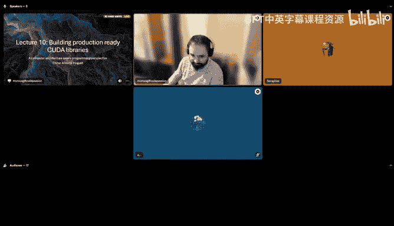
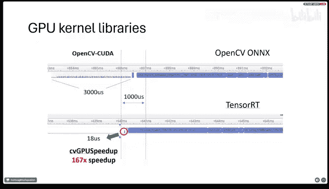

# GPU MODE《CUDA、GPU编程1-53课｜GPU MODE》中英字幕（deepseek-v3.2 - P10：-20240317-Lecture 10_ Build a Prod Ready CUDA library.zh_en - GPT中英字幕课程资源 - BV1QZ421N7pT

We can start。 So welcome everyone here to our 10th lecture or meet up for the Qa mode Discord server。

 Today， I'm really happy to have a professional Qa developer here Oscar who is yeah from from our community。

 a very active member and he yeah today talking a little bit about a production ready Ca development。

 how to get things passed and how to make them easily accessible and prototyping I've seen the presentation before So I'm equally excited as everybody else。

 And yeah， Oscar， maybe you can also talk a little bit in the beginning who you are what's your background on on Qa development and。

😊，Yeah， then get started with your presentation。So in general maybe first of all in we。

 we do this for one hour normally， if you have questions， please use the chat that comes with our。

Stage channel here。 and I or Mark will then try to fill the questions in when it fits。

 And in the end， you can also ask to come on stage if you want。Okay， ask us so。

Stats Okay thank you thank you Ands so thank you guys for being here so today I'm going to to talk about my experience as Andreas said as a good programmer and I'm going to show some some ideas that I hope that you find interesting。

嗯。So as I just was saying， my background would be。

Basically summarizing here。嗯。So I started working on first open C with。Coincidentally。

 3D volumes of data with open C first because I didn't want to take to。Proparetatory language。

 only one vendor and so on。 so I started at the university specifically at the Barceloa Precompeting Center in Barcelona。

嗯。Working on three convolutions for simulating wave propagation of homogeneous homogeneous materials。

And also for medical imaging， 3D volumes and classifying tissues， things like that。

Then I also did some collaboration with。Chris social Pre center in in a language they they were developing or they are actually。

 they still have it。It's called OMP S S。 So it tries to be like。

Like an abstraction for any cluster programmers of those who want to run a supercomputer。

So with OMPSS， in principle， you have a lot of the work done for you。嗯。And it's a nice， let's say。

It's a nice thing to mention that because this lecture is going to be about libraries。

That's one example。Then， I also。The timeline it's not clearer here。

 but just wanted to put the topics， so I I spent nine years teaching Open Ser Qa and other computer science topics at the University of Barcelona as not as a professor because I don't have a PhD I have a master's okay so I was a teaching assistant so in the laboratory classes basically。

Then I wrote some pair of papers with some professors at University University Vacena about some of the topics I mentioned earlier。

And I created my first open source library around that time when I was。before I did my master。

 actually。It was called simple N C L。 And for some reason。

 the Kronos group decided to link it into the official web page。 I was super happy， but。

Nobody told me anything， so okay， it's not there anymore of I guess normal because I didn't do anything about it for many years。

It's， it's a stack in time。And then I worked for a private company doing some really interesting projects。

The most interesting one was supporting Boos compute I know you know， the C+ plus library boost。

But it's like。Modern C plus plus before it's。In the SDD library and the standard C++ library。Okay。

 I was just heard something。嗯。And then we had to port the openCL code in this library to somema similar H H。

 so I have atypo there。So iter system architect architectural。

 so that's the thing and there is an intermediatemedia language， it's a GP assembly。

 it's very it was very interesting。And finally， what I'm doing now is working on the。

On a company called Media Pro for a product called Auto TV。

 which is a software real time application iss based on C++ and coola so。

What I'm going to explain today， is's going to be mainly。C plus plus and codes are not Python。Still。

 one of the things I'm going to show， I plan to make it available from Python because I know that like。

90% of the people doing deep learning and things like that use Python。

 so if I want it to be useful for more people of course it has to be available from Python。But。Well。

 I will explain later more about that。So。Today's lecture。Or talk， I don't know how to call it really。

It's basically going to have this structure， so。First of all， I'm going to review the the topics。

 the relevant topics that we already have seen in other lectures。Very quickly。

That are relevant for this one。Then I'm going to go into the main story。

Why would aku and Ninja want to create libraries？I will explain why this data up。

And then I will show to use cases of this concept of creating。

Tilities or libraries for others that don't know Ka to to use and still get good performance。 Okay。

 so that's basically。My experience and it's not necessarily the the answer to all the problems。 Okay。

 so it's just my take。And the last one， I'm I believe it needs quite a lot。

 it's an open source project， and I think it has a lot of potential but。

I let you comment on that in the， in the chat。嗯。でこじ。オ。

So let's start with the concepts that in theory you already saw。In the previous lectures。

 I mean some you didnt attend all the lectures， but I hope it's not a problem。So we are going to see。

 first of all， the first。Half of the presentation， we're going to see topics related to the host part of the applications。

I know that， I mean， I like Kak Ks， I love working on Kak Ks only。

But if you are working in a real application， the first thing you have to look at is basically the host side of the code and it's where you are going to get。

The biggest speedups or the biggest problems。So you have to take care of this part。For that。

 I recommend a lot inside systems。 Its I'm using it like。

It's like I can't imagine working without it。And， these are three topics。

TPU du latencies and net hiding， a and compute kernels， can fusion。

All this is going to be useful for the second half of the lecture。That so good on CPI is basically。

 but。GPU communication with the CPU or between GPUs will check those options too ka streams。

 of course， I mean， you will see that。We's tens of classroom streams in our application。

The latencies and latency hiding， this is extremely related to vertical fusion。

We also will see the horizontalfu。I would。Playing the w with a slide。And。

🎼It's almost the same memory bound kernel it's related to the di lattice is latency hiding and the kernel vertical coefficient。

 the solution one solution for that。So， and then the the computer on cameras in this part。

 I'm not gonna。So the， the things I'm providing are more， like for。咁么诶。

Architectural programming point of view。So like making the code run fast in the hardware。

 knowing the hardware。ForFor optimizing compute bound colorss like Mark。

 I think commented in one of the rigorous presentations， usually has to be a better mathematician。

I'm not an mathmatician。 Okay， so I'm not going delve into this real into these topics because I don't know much about them。

 So mostly my my experiences in that Okay， you know these kind of things where you detect。Bottlenes。

 latencies， and you try to make the code avoid those things。Let's go for the main。

 for the main story。So。This is the， the typical。Approach when Ka started。 So there were。

 there were no libraries。 There was no Ka code around。

 So the only way to get your application working in a GPU。

Was taking the CPU code and having a gooda inja porting it to to the GP， right so that。

That was the context in which I started working in this project。 Sorry for the for the logos。

 if anyone is。I'll like it， but。It's just one life。诶。So I'm working at this company。

 This is the product that we are doing， this is the link if anyone wants check it。

 So the relevant thing for the talk is this Okay， so to understand what the application does so that we can then discuss problems and solutions。

So。Basically， this automatic TV is's a product， basically。

Wants to record sports automatically following the game automatically。

 there are many solutions in the market。 I guess probably many of you。

No at this one because it's like like a plague right now， we are too many in the market anyway。

And the idea is basically to install cheap cameras， relatively cheap cameras that are fixed。

 they don't move。That's part of why they are cheap。And then you generate an output that is smaller。

 like these are 4K cameras。 This is a4 HDD output。And this is like a clipping of a video game。

 basically you move the bit to a camera around these two source cameras and the nice thing is that we stitch the two cameras so that it looks like there is just one camera。

That's image processing。 So there's some image processing happening here。

 not only for this stitching， but also through the color or things like that。

As you can see the source camera here， it's。Quite burned here。 So but there is this is the source。

 So after that， we we will do some treatment depends on so on to improve these kind of things。Okay。

 so we are going to talk about。Basically， the problems that happen in here。

 there are many things in here， and we can actually relate some of those problems to translated to training neural networks or。

And actually， we are using neural networks also to find players to find ball。 So I think that is。

There's a lot of things here to connect with the topics that I see in this channel。Now。

 following on the story of the company and when I started working there。This is just luive。

 This is to justify why I started making laries of it。嗯。

So that was what I was expecting to find when I started working in this project and。

That's what I was taught at the school at the university， like if you are a performance programmer。

 you should always get a perfectly working code that has snowbs。

And then you should be provided with some unique tests so that you can， when you modify the code。

 you can check that your results are too good。But the reality is much more difficult for the Ka program I let say。

 especially when the team is small， it's a startup and you still don't have the resources to。

Make so many different teams， specialized teams and so on。So。What I found is that actually， I had to。

Help these people， the people that were doing the well， in your case。

 you Google be like the people that is doing the neural networks， but。In this case。

 it's not only the neural networks。Exactly， versus practice。

So here people were doing both traditional computer vision and at that time it started in 2016。

The neural already existed， but。This team still didn't get to， to， to this point though， I think。

There were no。Re。Many tools or something I'm not sure because it's not my topic it's not my field so but the thing is that here we were using still traditional computer vision like optic and flow。

 background subion， things like that。And then there was also the team doing the C++。

Application and so on。 So I had to help on like。Any of them that needs some help and especially for the artificial computer vision team。

嗯。They needed to test what they were doing， so the effects of what they were doing in the behavior of the camera。

So it means that they needed real time code， even for prototyping。So that's the first hint to this。

To the need of making libraries。Then， of course， after their work， I still had to。

Many times to do multiizations because they were testing with small use cases with。

Not so many cameras and so on in have。We have customers with lots of cameras and so on and it's more demanding and maybe the performance of application is not ready yet so after this phase I still have to do some work。

And then。Well， nobody likes QA， but it's extremely important。Basically。

 I also had to work to help on on defining how to measure， how to check。

And what to check in order to find that the performance is fine。And there you have to add cost goals。

 so you have to reduce the cost of the servers you're using and so on。

 so you have to account for all this。Okay， so basically I was too busy with too many things and it was。

Not practical to to。Do many things by hand。 I was doing like repetitive optimizations， things that。

At least in my opinion were quite。嗯。It it should be possible to generalize them to create some sort of a tool or library where you。

Sove this problem once。 And then you use it。 and you don't have to。Going to it again， right。

 So that was my。Very， very early， I started to think this way that I had to provide the other programmers。

With something that they can use and they don't need me。

TheThe first approach was try to make everyone an in， everyone a good an in and try to。

Teach them as much as I could go up， and many of them didn't want to learn and actually。It's not。

 I mean， they have their field their expertise and they are busy already doing features。

 which is a sensible thing to do。嗯So yeah。I came to the conclusion that at the end。

 the best thing to is to provide those that internally do the complex things and for them it's easy to use at least try。

So let's see a little bit。About the problem or application and the。

The performance problems that I found。 And then we will see a bit about the solutions。

So this would be a。Simplification of the。Of the image processing graph。

So these are the cameras getting providing some raw images here we are converting the images。

 we are doing some extra things， these two cameras are stitched into one and then here we have a CPU node that's called it node and this is a graph and so on。

Hear in this note， the CPU decides according to some。AI information， AI generated information。

 by the way， the AI is connected here。And then it decides which of the three images goes forward。

 so we do camera switching also。And then we we take this this full image and we。

Apply some extra image processing， like adding a scoreboard and some image statement。 and finally。

 some。Ims space conversion so that we can encode these image。嗯。So this is the。The problem。

 So the the thing too。To make fast。 But then to， to this， we add the the。

Necessity to make this work to a not one， but two or even threeG systems。

So we have to somehow split this graph。So that 3GPUs up to 3GPUs can be processing。

All this in parallel。In so real time。And then there is where the problems are started。So。

 but we will see how， how we did it， but。You can start guessing a。

 The thing is that we have to cut this graph in some parts。We have to distribute the nodes。 and then。

 of course， we have to move data from one GPU to the other。

 And there you need to make these transfers as fast as possible。

Now let's let's before going into the actual use cases settings and so on。

 I wanted to also comment a bit。Onで。The challenges that you find。

 at least that I found when trying to make these libraries and these abstractions。

And I think it's quite a common problem。 and I have seen libraries from others that are really。

 I mean internal， they have amazing implementations。

They have a lot of knowledge and they did like works of art。

But then there are all the things that make them like。Not no rule， not used by many people， so。

Let's see。So， first of all， you want to。嗯。Create an implementation that is performant of whatever that problem you want to solve。

 You want to make a perform implementation。 And then you want this to be used by some people that don't。

 don't know the details。 don't know cool in this case。 So you know。

 you need to create an abstraction that it's easy enough or。Familiar enough for the for your。Users。

 not for your target users。And usually。The more abstraction， the higher level you go。

 the more difficult is to get good performance and the other way around the more performance you get usually。

It's more difficult to。Get high level abstractstructions。 At least that's why so。So far。

Then you need， of course， to to the final。Which level of abstraction is right for your target。Users。

And which level of performance also is right for your target users。

 so maybe you for some users you want to sacrifice some performance to get more simpler to use library。

 right？嗯。If you don't get the requirements right， this can happen I mean。

 and that's what I have seen that many librariesries suffer from。

They have great driversers and so on， but they created an API that it's so different。

To everything that the users already know and already use。

That they see it as a problem more than a solution。 Maybe they don't care much about the performance。

 And unless the company wants to save cost or。They have really clear that。 They have to。And。

They have to get faster code to serve money or to enable more features in the same hardware。

Unless this happens。The users want to。Want to work on the thing they are good at。

 which is normal I think it's very understandable if they are good at making neural networks or making something else。

 they want to work on that not on learning about the hardware and about the performance tricks and so on。

Fortunately， there is a group of people in this chart in this channel that wants to learn about Qa and so on。

So but still， if you want to make aory for others that are not coas and don't want to be cos。

 you have to care about this。Okay， so that will be the summary of the leverage challenges so。

And now zoom out， let's zoom out again。 And this is what we have discussed so far。

 So the motivation of why making libraries， the problem to solve and the challenges we can face and now。

We are going to see。The first use case。Which is based on， well。

 we have to solve GPU communication and make it as fast as possible。

So GPPU communication could be simplified in this abstract way。 So we have。Two memory spaces。

 And we want to move an image in this case。Of these applications。From this。

 from a source member space to a destination member space。So this memory space can be anything。

 they can be GP， CPU， lets see what they can mean。呃。アショに。Yeah， we have this tape， but this one。

 it' it's still the CPU memory， but。Since we are going to use this one CPU pin memory。

 I don't know if you， I don't know if you saw it in the new talk just in case CPU pin memory is basically CPU memory。

 but it's always re in physical memory。 And then the GP can access it Okay so before moving data from the CPU。

To the GPU， you need a CPU pin pointer， So you need to copy from this memory to this memory and then from this memory to the GPU it's mandatory。

So even if you in your code， you don't see it explicitly。

 it's going to happen implicit and it's going to affect your performance。

 So you want the best performance， you always have to use these CPU pointers in between the copies。

Any any question about that。Let me check if further。

🎼So I have one question regarding the setup of your of the cameras。

 Are they all connected to one machine If this machine has multiple GPus and。And okay。

 what's the frame rate and so the mode of data that comes into the system and the source？对。

The3 GPU system， its up to 60 frames per second and up to 4 cameras。

4 k Okay in as input and the output is up to 6 outputs at 60 frame per second full H， of course。

But there are more types of inputs and output put there are NI cameras there。

 so it's a little bit more than that， but yeah the main。Pack of pixels to process this。Yeah。

 you I will show the the the issues with that It's not it's not。

Difficult any question about the memory space types and so on？嗯。

So we had a couple of times this unified memory model also coming up。

 Is this something you have also looked into， or it。Okay。

 that I would have liked to have a look at this。 The problem is that for driver reasons。

 camera drivers and other other devices like SDI。An interface or something things like that。

We needed to use Windows， which is a big problem for performance。But it was funny。 I mean。

 it was funny。 you know， it was like more challenging。 and I learned a lot， really， but yeah。

 it's not if you can avoid Windows in for coa and performance， of course。

You're much better off with Linux， that's like I can I can。

How to say it's like everyone knows that Linux is better for performance。

 well I can tell you with experience and blood that yes， it's true。Okay， let's go。 Let's go for more。

 for more。Details what on what's going on with with this application。

 so we have these three member spaces， we have to copy between them and so on again。

This is like a mandatory prerequisite if you are going to work in a real time or soft real time application。

You don't want to be doing allocation of memory applications during the execution of your application。

 because this is person Windows， this is going to block your your。CU thread and the CPUU and。

You don't， you can't afford even aover。呃。So it means that you allocate all you will need in every node in every place and then your are。

W to greet and write to these pointers and never allocate them。Okay。Another。Requisite in this。

 in this case is about the， the interface。 So I want to make。

I want to make something at tool that makes this GPU communication easy。And I。This， this something。

 let's call it a manager to be able to handle one case that usually is not handled。

And so if I write this into the code， I want this to take into account that sometimes the source member space is not going to be the same as the destination member space。

 but I I wanted to be able to also handle the case where。They're actually the same。And in this case。

 not do any， any copy。哎。We will see how it's not applicable for all cases， but。

There are some cases where。It can be done with a single implementation is there with a single plus。

 let's say， a single manager。嗯。Now， things start to get interesting。

 This would be like all the combinations of possible source memory space and destination memory space。

And the。The desired maximum number of copies that we want to have， as I said。

 if the memory space is the same0。If there is one change， like from CPU to CPU P， they one copy。

 if it's from CPU non pin memory to GP， then。We want to do this by hand， not with coium CP。

 so we want to do two coium CPI calls。As this will be much faster than directly calling Karonic CI on the CPU as input and of and the CPU as destination。

 because we will avoid the internal kar runtime allocation of the pin memory。

Basically this pin memory allocation will block the CPU thread。1发。Going back。

 I guess I forgot to mention。And back to this problem。

 one of the things that we want to happen here related to the string with the pin memory I was mentioning is that the CPU thread that schedules all the Ka world。

 we want it to go as fast as possible。 we don't want this to be blocked in any anywhere。嗯。

So I'm just seeing as it is in the in the chat。So。Yeah。So this。

 if we don't pay allocate the pin memory and we allow the coolrantan to it。Himself。

 this thread of his going through the graph and scattering all the cools is gone。

Have to do the allocation。 the minimum allocation， wait for it to be used。

 And when the GPU finish using it， then it will have to create this memory and then it will return from the Qda then copy code。

 So that's pretty block。嗯。Okay， so then there is an interesting case here， which is the GPU case。

 So GP to CPU would mean that you are copying。Inside the same device， inside the same GP。

 So we want to avoid any copy。 But then you have the case where you have two different GPS。

 So you have to actually at least do one copy。If the system is compatible with real peer to peer communication。

I I have some questions about that。In another talk， and I thought。WellThat was a good chance to。

 to explain it a bit。So basically， you get GPU to GPU per communication when you have either an mvy link between two GPUs so that you can transfer data from the realm of one GPU to the realm of the other GPU without going through。

 through PCI express or CPU。Or it can happen between two reviews through PC Express。诶。

If the driver allows it and if the motor world allows it， then not all motor words。

Depending on how the PC express is wired。 in the mother world， it may not be possible。

 So you have to check if it's possible or not。 And if it's possible， you do that。

Like colleague who peer， I think。Or if not， if you copy the album city。

 I think you're going to have the same problem as we were discussing before。

 and actually we suffered this problem and until I realized the internal location because it's not explicit anywhere。

 then we did this。Had a much better performance during this。I call it fake peer GPU because well。

 it's not it's not a peer GPU， but it's。It's not， this is not going to behave as you would expect。

 it's going to do this allocation。So you have to do it manually。Okay。

 so we have all this combination。 this is this is the thing we want to abstract from the final user。

 I mean， I don't want。Those。C plus plus Q T programmers or the computer vision programmers to have to worry about this。

 And actually， I don't want to have to worry about this media I prefer to spend my time doing kernels Okay。

 so yeah， let's do something that automatically chooses of the text which are the source and destination of memory spaces and automatically that' whatever needs to be done to do the copies in the mass in the most efficient way。

So what's the problem of doing the copies like？Even if you use pin memory， okay。

 even if you use pinmer what's the problem， what's the situation， let's say no normal implementation。

 one thing after the other。So we have these GPUs， two GPUs， okay， and this one is launchier kernel。

 and we want to move the results of this kernel。To this other GP where we have another can that will print this output as its input。

 Okay， so okay， in order to do that， as we so imagine that we don't have。P to peer communication。

Then we will have to use an intermediate。 It's not represented here。 Okay。

 but we have to use an intermediate pointer， pin CPU pointer and。U when the scale finishes。

 we will be able to copy to this pointer also sorry。I got ahead of myself。So when this finishes。

 we can start copying to the pin pointer， when this finishes。

 we can start copying from the pin pointer to this GPU memory。

 and when this copy finishes then we can start this kernel。

And we took all this time and there is something else I think is quite obvious。In this situation。

I mean， why do you want to use2 bill， It makes no sense right。

 I mean you're wasting your money use one and I don't know。So we need to do something different。

 right we need to do something like that if we want to really take advantage of the two GPUs。

And in this case， what this allowed us is to basically use cheaper GPU。

 So these two GPUus were cheaper than the next GPU that was capable of processing everything on time。

 right So this。This configuration was saving money， let's say in the servers。嗯。So this。

 what does it mean， this means that we have to be able to execute this kernel at the same time that we are executing this copy。

 at the same time that we are executing this copy and this kernel。Wow， I mean， of course。

 there is a clear data dependency between all this。 So how can you break those dependencies。Well。

 as I mentioned， this is a soft real da application。The soft part。Means that you can add some delays。

 so you can add some buffers and the thing a video that comes out of the application。

Can be some seconds delayed respect to the reality。Okay， so here we will start seeing those。

 those delays and why， why are they useful。Now。If any of you is wondering， okay。

 but I'm I'm working on on training the neural networks and and inference and so on。

 why could this be useful for me or for what could this be useful now， to me， and I thought， look。

 this actually。I'd never tried， but if anyone wants to try let me know because I think it's quite interesting。

 but something like that， the solution I'm going to show up。

I think it would be maybe used for some trainings of some networks for multiTCU training， basically。

I know that Pythch has some。Some goes for making multiCP training and so on but。

I think this solution would be like if if this is not perform enough。There's no way to make it。

 I mean， this is like the manual way to do things and I don't see any better possible solution。

 but correct if there's anything else。So how does， how does this work。

 Let's let's get into it a little bit。First of all I'm going to explain this concept because this is an abstraction that is' well known。

 it's nothing new， but it's like the base to the solution I'm going to show you。

This is called the producer consumer model， and it's usually for CPU， not for GP。

 but we are going to use it for the GPU。In this case， for the CPU。We have a thread。

 a CPU thread that is basically doing this， so it's。Calling to this buffer。

 place consumer buffer variable buffer。 So here we have the variable。 We are calling this method。

 Okay， so we are asking to this buffer。 give me a pointer so that I can write stuff into this pointer so I can produce data。

And then when I finish， when this third finish。Then it gives back the pointer to the buffer and says。

 look， I've finished using it now you can keep it and give it to a consumer when the consumer asks for some data。

And in the consumer side， it's another thread and it does something similar， but in this case。

It asks for a pointer to conceal so。To read in this case。 And so it， okay， it uses it。

 And when it consumes this， it sets the pointer to ready。Really to be used by the producer。Basically。

 we are actually writing and reading outside of the Balel does not copy anything。

It just handles the situation where。The consumer and producer might be competing for the same pointer and protects this and makes it thread safe okay。

Another detail， the number of pointers here at the buffer。It's variable。 the minimum it's two。

 so you can make these processor we buffer with only two pointers。

 It's usually called a ping p ping pong。嗯Laer。嗯。But the thing is that the distance between where is the producer writing and where is the consumer reading is variable。

Okay， it can filter to it。So。Basically， you can calibrate the size of your buffer according to the instability on the execution of the producer and consumer。

 So you have to try to test it to measure and then decide what's the proper size of this buffer。

You don't waste too much in I， right， okay。We have the pre consumer model。The goal of this。

 of course， if we have to search， is that these two guys， the producing consumer。

 can do their thing in parallel without。The consumer waiting for the producer or the other way around。

 so this is task parallel and actually that's what we're going to use task parallel with H GP。

So that would be。The implementation for the problem we had before using three producer consumer。

Ps of。Made of only two pointers。So the first column will be writing its output into this pointer that the first copy will be reading for this pointer and writing into this pointer。

And the second copy， so on。 And the last kernel will be reading from here so。呃。

I think the best way to understand。How this works is to see moving， to see it life。

So let's see it life。's see， let's see it moving， right。This is the first situation。

 remember that we are。Iterating and the iterations in this application are mandated by the cameras。

 So when iteration is starts when the cameras send one frame each。And then we process those frames。

 and this is all the processing that happens with this pack of frames is what we consider to be an iteration。

 So travers the graph points， right。嗯。So well， we see the four actions that can execution writing here。

 this copy， this other copy and this other can execution reading okay。

So the iteration ends and this means that we synchronize so all those actions were as synchronous。

 we were using KUa streams for all of them。So at the end of the duration。

 we synchronize all the cooler streams。So that when we start the next situation， everything。

 there's no pending work anywhere in the graph。So when the next iteration starts。

We do this basically we swap the pointers， so this blue color is what we it's like I put it here to track the contents that the data that the producer can generated on the first it lit0。

And so this way， we can see when this gets into the consumer kernel。 and so we can keep。

Iterating so end of iteration。 we have it duplicated。 Okay， normal， now we we suck again。

 and then well。We writeite。The same data was here。 it'， it's okay。 I mean， we have it here。

 It's circulating。Now it's here， okay。Next iteration。

 show up again and finally in the third generationeration， this panel is reading the data。

That originate generated under the rotation 0 with this kernel。ok。

So just to give you an idea of what's going on。So now we want to make。An abstraction of this， right。

 we want to make some object， something that hides all this from the user so。

Let's start with this let's call it iterative memory manager so we take into account the fact that we have iterations that we synchronize every single synchronous work at the end of iteration。

And taking into account this， we can make some object that。Fromox， only has。

Like a producer and a consumer。 So it's getting more similar to the traditional producer consumer。

 But first but it's not quite the same thing。 We will see what。嗯。Before going to the next challenge。

This is one possible solution， but then there is an extra optimization that we can do so but before that。

 I have to explain。So it is this concept of a delay buffer so delay buffer is just。

A buffer that makes。Introduces some delay in the middle of the flow so here you have a producer writing or camera。

 whatever it is writing in here a result and you have another channel here and there is there are like six iterations of distance between the writer and the reader and this distance is fixed it never changes so you don't have more than one CPU threads to handle this right。

Actually， for this case， also we are using one single CPU thread because the synchronous part is happening on the GP。

 the CPU is just going to ask for all of these things and swap the pointers of this stuff。

So it does some difference with the traditional pressure consumer buffer right so we have now this new concept of the new for some I guess of the dairy buffer。

This means that this point there was synchronized like six situations ago， so it's ready to be used。

 right？So if we substitute the kernel with the delay buffer， it means that we have to。

Make a copy here。 We have to copy the。The6 pointer to this pointer in the memory manager because the memory manager by default default will be made to provide this pointer for the producer and provide this pointer to the consumer right so that the interface if it's a producer typical pressure consumer buffer it will do that but we don't want to do that because we can actually do this which is much more efficient we skip one copy。

We don't have to do this graphic。Because we have a pointer with data available for reading during this duration。

So we can we could provide this pointer to the memory manager so that it。

The memory budget schedules the copy from this pointer to this other pointer。

I want the my money manager to schedule all the copies I don't want to have to make copies outside。

And we will save two pointers， the memory manager will not have to allocate these two pointers。Okay。

 so this is a better。Situation， so if we want to have a memory manager that takes into account all the things that we saw before plus。

This extra。Situation， just the optimization， we have to give it a name， so this。Th we in here。

 we have to name it somehow。So what we are doing here。

 we are what's the difference to find a name for that well here the。

The memory manager is providing a pointer to the delivery buffer。

 right and the delivery offer or the producer let's say the code that you have there。

It's like taking the pointer from the memorym manager and scalinging a copy， right？

Let's put this example， I prefer this one so we take the pointer from the memory manager and we pass this pointer to the last kernel we have before the memory manager as an output pointer。

And here's the same we take the point from minimize， so what does it mean to take？

That means that from the outside of a memory manager perspective。

 you are getting appointed from the memory manager and the memory manager are located at this point。

So the memory manager is responsible for providing and allocating and freeing those pointers， okay？

So we have one worth to take。不阵。What's happening here。

 well we are providing the pointer to the memory manager。So let's talk about。

Provided and take it That's that would be an example of an a final abstraction。

 The problem with this abstraction is that it's a new abstraction and the target users will have to understand that。

 and maybe it's not so easy so but。We've seen the results and we've seen how it went。Okay。

 so the difference between producer consumer and products take that。

Pre consumer talks about providing data and consuming data and the provider taker model。

 let's say talks about providing a pointer So the container， not the data。

 but the container and we are talking about the pointer who is。

Providing the pointer who is taking the pointer。Let's see it in a more like a conversational manner。

So， we have。Any any code outside of the manager of the memory manager taking the pointer so that would be how the interaction would be between the taker and the provider if they were talking the taker says there manager I want to provide I want you to provide me with a pointer that you are located so the manager is responsible to allocate this pointer if I take。

嗯。Please do not use this point in this situation because I'm going introduce it and after this situation you can do whatever you need with it。

All these conditions。Apply also all the same in the producer consumer。Moel so the buffer。

 the producer consumer buffer that will be the。According for the interactive memory manager。

 it's not it's going to comply with these three conditions。

 but the last one is the new thing the last one。It's saying， okay， during this generation。

You can do your stuff with the other pointers that you have。

 I will not use and I don't care about them。That's the difference the Mary manager is going to copy。

 it's going to move data between memory spaces。诶ok。So any question about that because that's。I mean。

Yeah， that's the whole thing almost for the GP communication we will see results and so on and a bit more detail。

 but that's the main concept。Any comment on that to here do you more or less follow this？

Well it's like to far from your。嗯。Experience or something。我几耐。

Silence usually means that it's not really clear。Okay。So I think maybe wants to say something。

Its so we have one question here， it feels like a ShaPo implementation in Qa。

Would you agree with this statement？Sharpoint recommendation well。Yeah， I see。

 I guess he's talking about share pointers plus plus share pointers， right？嗯。We actually。Don't use。

 I was trying to find that， but。I mean， the big difference is that we are moving data across memory patients。

 so that's that's what the iterative memory manager is doing。

 which a shared C plus shared pointer is not doing， I mean。

 if it's if the question is about shared C plus plus shared pointers。

But there is something in common。There's something over maybe that's why the question。The concept of。

Ownership。So I didn't mention this word， but actually the concept is present here。

When we take when the outside code takes a point from the memory manager。

The ownership of the pointer is shared during this time。 and when we give it back。

It keeps the ownership， but also means that the ownership means that this one is the guy who is going to。

Free and also allocate and free the point the the pointer。

 So there is some something there is This is the maybe the common part with the shared pointer concept in C plus plus。

The concept of ownership So Oscars， do you， have you implemented some kind of。

Shared like a smart point around this to simplify it in C+ bus to use。

Like I could acquire and release operational or something like maybe it goes out of scope scope or so。

I'm going to show the the interface。 So the code this it's， it's， I mean。

 I'm not going to show the implementation。Because it's， in this case， it's closed source， so。

But I'm sharing the concept， because well we are， we are moving to a different model。

 and this is not going to be used much more in the future in our product。

But I thought it could be useful if you want to to do this multi training， maybe or things like that。

But okay。So we have to take a concept， then we have the provide concept。

 which is completely different from the producer consumer。 In this case， it's like， look。

 instead of taking the pointer from the manager， I will provide the pointer to the manager it needs that。

The outside code， the code outside of the it memory manager is going to be responsive。

 so we're going to be the owner of the pointer。That the ownership here is implicit。

 let's say not very it's not explicit in the code， but we will see it。嗯。So okay。

 I provide this pointer to the memory manager and then。I as the owner。

 I assure you that you can safely use it during this iteration， okay。

 because no one else is going to touch it， no one is going to read or write into it。

And please give it back on the interaction of finishines so it's the same thing as before。

 but the direction just changed and we are talking only about the container we will see。

I think it's going to get clear with。With the final interface。go when you talk about point as you。

 of course， always mean like a whole buffer， which is， I a section of memory。

 which is then either owned by like Bassan party here。And the point is， of course。

 then what's transferred。So when I say a pointer。It's， it's a number， it's a memory others。

 so what you are actually。Moving and passing us a perimeter。Is a memory others。

 not the whole content。所以。Then the the memory manager inside is going to actually move the data point to。

上。Well， so I was mentioning the producer consumer talks about moving data， the prior take。

It talks about who is gonna。Provide the pointer in order to let's let's check it here。

 I think it's this is。有。So here in the processor consumer example， this would be， for instance。

 this one would be occurring as taking。So I'm asking the buffer for buffer to。

Provide me a pointer where I will。FromFrom where I would read。So in this step。

There's no data movement in this step I'm just getting a memory address stored in a variable。

After that in here in this function， inside this function。

 and one of the things that read the actual content of the。Of the data， of of the memory region。喂。

So this is already。The traditional producer consumer model and this is what iss doing so this I'm just giving this a name and say that this means that you are so the consumer is taking the pointer from the buffer。

I'm just naming it。I don't know if it's scared。So maybe you are wondering what would mean to provide。

 right？I guess。Yes， for， for me， the， the main question is like we are talking about pointers is。

 is in your case， always clear how large the memory behind this pointer is or what it So。

 so what what can I read and write into and。Okay， okay， okay。

 and this is something that goes with the with the data structure that you use to represent your pointer。

 So you will have。This variable is gonna to be a class that represents。

The memory region and its characteristics， so something like if it's an image， with faith。

 image type， maybe this kind of things。So。You will get not only the memory others。

 but you will get also the the metadata， the information that you will need in when you consume the。

The data or when you produce the data， also you will need this information on how big is the memorymization。

And in which memory space it is actually。An extra thing that I'm adding in this model。So。啊。

I understand the question it's just getting a little bit ahead of the thing。

 so I'll continue because otherwise I think。嗯。I think it iss what I'll get clear when I show the whole things。

Because now I think you have many pieces， but when you see the whole thing。

 I think it's going to be much much clear。So I was talking about taking and providing。

Remembering that we have a camera that produces some data and a car that consumes some data。

You have the。The possibility to take the pointer from the producer and take the pointer from the consumer perspective and then this would be like the producer consumer we saw the original one but then you can provide intake they can provide and provide and provide and we will see what's provided I will have to still do show some code this option。

So this means that you have to combine these for options for the producer and consumer。

With these other options that we had so this is extremely complex right so let's go directly to the solution because。

呢个呢度。I think youre to understand all this unless you want to implement it。But you to use it。

Let's see let's see the abstraction， I think from the abstraction point of view。

 from the user point of view， it's going to be a lot more clear。So you have。

So you have to find a data structure that represents your whatever it is。

 an image or whatever you're willing to move around。

And then I'm creating an instance of this class and I'm passing to the constructor of the class。

Some information like with his and very important， the memory space in where this data lives。嗯。

So it could be like a flag like the Q MMCPI device to host。

 it would be something like host data or device data， something like that okay。嗯。And then。

I'm also defining in an genome， so like these are like labels。This this small tablebook here。

 so the producer takes the pointer or provides it， the consumer takes the pointer or provides it。

So that's these four options。And from there。呃。This would be the memory manager。

And this would be initializing the memory manager。Where， when you use it。

You will have a producer providing the pointer and a consumer providing the pointer。

 and this is your manager object。And this is the information that the manager needs to know about the。

The producer data that will be provided and the consumer data will be provided。

 So the imagine needs to know in advance the size of each one of the。Of the poters and so on。

 it would take that they are the same size and so on because if they have to。

And then when you use it， when you use the manager， it just。这 just。Call this method from manager。

 which let's call it manage。And you pass the produce data and the consumed data。So。

What does this mean， Okay， providing in here， I think it's quite clear because you are passing those pointers to the managers or you are providing the pointers to the manager。

And you have allocated these pointers。This data structures outside of the manager。

 so you are the provider of this。Asim as a parameter means providing when this returns。

 the pointers means that you are taking。That's the idea of pro taking。So in here。

In the next situation。You will have the data well in the next situation or in three directions you have to calibrate that so that's why you can ask the manager how much delay you will have。

诶。Then you will get the data that was here into this other pointer。Like basically。Like in this。

Representation here。Yeah， exactly。Again here， right。

here we were talking about how we saw this case also。

 but the thing is that this is what's happening inside the code。In here， okay。

 so something like this is happening inside inside of this。

So the complex thing here I see is that you have to think of like， okay， but。I'm gonna have。

I'm going to have the data from here in here in three。Ittererations， this is kind of。

 I guess this is kind of complex。The thing is。I'm going to show more example that I think we will clarify this。

But at least think with any that。Providing means passing the pointers as parameters and taking means。

 for instance， here。We are taking。诶。Oh， I think I have a type of here I didn't update but。

I didn't update this naing sorry， so this would be the producer takes and the consumer takes okay。

 sorry for that。So in here， the manager it's。Giving you the pointers and the manager allocated these pointers and。

You will be able to use them to write into the source and read from the destination。

If these pointers are in different GPUs， you will launch curve for one GPU in here and you will launch curve for the other GPU with this pointer。

So this is the take well take take and this is the take provide。

This one would mean that the producer。Takes the pointer so the procedure will write into this pointer。

And the consumer is providing the pointer so that the manager will write into the pointer。

And this is the other way around， so the producer provides and the consumer takes。

So instead of source this we have destination source so because I didn' I didn't update the namings here like as well as not。

So we have these four cases with a single class with a memory manager by passing these parameters。

The the manage function changes。 The manage function will have。

Two parameters or well have no parameters and return to pointers or head one parameter and return and so on。

 okay， so it's protected against errors in this case。嗯。So it's all around the manager class。

 it's not so much about the date。I mean， of course the data starts just need to have some information。

 but it's quite。Maybe besides the memory space。The rest of information is quite typical for any class that represents an image or anything。

嗯。The idea is that at the end with this single line。You will this manager will implement。

All all the possible cases， depending on where the destination and where the source is and which memory each one is。

And it will know it beforehand when we create the object。

And let's go for the let's go for one case for one。A specific case。So。It much that we have about。点。😊。

We place a memory manager in between this kernel and this delay buffer。Now this manager。诶。

Depending on where these things are and which memory space are， we do different things。

 so in this case everything is in the same memory space。Okay。So as I mentioned before。

 this thing of providing a point there only makes sense if you have a buffer， if you have a kernel。

 usually you take the buffer from the manager。When you take it and you pass it as a parameters to the kernel。

 because this point will be the output of the kernel in here。

You will get the point from the delay buffer。And provide it to the manager so the manager will write into this pointer。

Here the opposite。 you provide the pointer to the manager to to return it。And in here， you。

Take the pointer to read from it in the camera。系いま thats thatて。One possible way to assemble this。

So what does it mean？Well， in this situation， the memory manager will do no copy。

It will basically forward the pointer。Yeah did take it here， but okay。

So that's what we want to have in the situation we are in the same memory space。

 we don't need to do any copy， so basically this memory module will be allocate will be created with this configuration tape provide。

So the source takess so the producer takes and the consumer provides the pointer。Here。

 provide take so the other way around， take provide and provide take so okay。

But now let's move things around， so let's put this buffer in the CPU， for instance， because。

This buffers too big and it doesn't fit in the GPU memory， which。It's easy to eat cups。嗯。

Then automatically， I mean。You will have to configure the memory manager。No， sorry。 In this case。

 you don't have to change anything。 So it's going to be the same the same definition as your memory manager blah。

 bh，h， This doesn't change。 This is the same。What changes is the memory space in which the。嗯。

the consumer pointer leaves and the member space where the producer pointer lives。

And this will be known by the memory manager， as I mentioned here。Because。

Because you are passing this information when you create the manager。So。

When you have this situation automatically the。These managers will be ready to do the copy from this member space to the other memory space and from this member space to the other memory space。

 taking the gu configuration iterations， synchronationial and data iterations on so forth so how would it look like？

How how would this look like in in a timeline？So in terms of execution and biism。

 so how would this behave right that's the important thing。

 so we want things to be as parallel as possible。So in this case。

 we would see the first compute part。Then in parallel at the same time。

 the memory manager is doing their copies。And a little bit before this kernel finishes。

 we will have a little this compute part and then a little bit before this finishes this compute part so it will not take the whole whole line that's of course assuming that we are using up a quoda stream for this a different quo stream for this and a different quoda stream for this Okay I have one question regarding this manage function from the memory manager if if like。

can basically a source and destination buffer or specify them or read out。

 Is it that there's this delay behind the scenes happening so that I basically I've read something into it and I get something up。

 but this is not the same， which I brought into it。

 but something which has been like like put into the buffer earlier， right。Exactly， exactly。

 so that's the delay。Thats the delay so basically you get， yeah。

 you will get what you just provided or taken whatever you produced。

 let's say whatever that they produced in this iteration is going to be consumed。

Dending depending on which memory space are things it's going to be consumed in this current iteration or in a future iteration。

And you can programally know that with the get。Delay function that is here。

 but a total delay and it will value0，1 or two。So you know， you， you know what to do with this。

えトのハワス。It's gonna to be more of a program。So okay， this is one one thing。

 but then let's go for the for the big problem， so this is the same the same sequence。

The same chain of operations。Just they are spread across3Gs。

Why not we keep this directgraph in the CPU。Let's nothing changed here so the memory managers were initialized the same way as before。

 the only thing that changed is the memory space in which the source and destination pointers are for each memory manager so basically。

This is the information that's going to change for each manager。

When you change the place where the consumer info or the budget info。

Besidess so we're going to change where the produced info so the precise info here will say CPU is one for the number space。

 the consume will say CPU。for this memory measure here it will say CPU for the provided info。

 for the consumed info， it would say GP2 and so on so forth okay。So how will this look like。

In in the time again， because this is the。I would say the coolest case， the nicest case。So basically。

 that's what you will see。That。Everything is executing in parallel。

 both the transfers and the compute and you' are using the 3 GPPUs in parallel。

Without anything waiting anything， that's that's what we want。

 That's the maximum performance possible。The only thing you need to do is to manage the delay if your application is already prepareded。

 let's say to manage delays。T you already how how to handle this， I can imagine that。

Let's move this into a training into a training case， training a neural network。

To'll make it name more profitable for you。Imagine that you want to split a graph is this one also graph。

嗯。And you want to。To part of the of the forward passes in one GPU。

 another piece of the network and another GPU another GPU。

You want to transfer the intermediate results， maybe it's too much data it could happen。

 I don't know depending on the network， I guess， but you want to move the intermediate results from one GPU to the other and you want them to work in parallel not to wait for the transfers。

So as long as you have enough memory， that's probably the biggest problem。

As long as you have enough memory in the GPUs and you can fit two times the intermediate。

Results because you need this big bomb by。You can get。Collabor parallel drain with multiCs。That's。

 that's just the。thinking but I guess it's quite complex if anyone is interested in this。We can。

 I mean， I can help on on implementing something like that。

 we can discuss naings because I'm not really good。

 I'm not really good at naming things in a way that can be properly understood sometimes I think this one。

 this naming is that。On the makes things more clear probably， but still， as you can see this， Okay。

 the results are good。 This is this is the this is。P result this is a。Insight systems timeline。

The results are good， but the abstraction is hard。Okay。

 that's a typical problem with creating libraries， okay。😊，But still we are using it。

 it's working fine and okay。For us， it was， it was useful。And then this here we have GP zero。

 this one is executing all this and transferring down to the CPU all this data。

GPU1 is processing basically all the AI and GPU2 is processing the outputs。Basically。

 and transfers this。Let mix explain， this blue tile is co occurrences。

 this pink line is download loadding memory from the CPU to the CPU。This green is from GPU to GPU。

 so when you are used to this， this is from inside systems。

 when you're used to look at this you know what's happening in like very fast。哎い。嗯。

So we can see transfers happening well， complete happening well。This CPU is the AI CPUU。

 This one is like processing almost all the time， and it has a different。Reason it's like。

It has its own CPU thread。It's not blocking the rest of the of the graph。 Okay， so basically like。

It does not process every single frame， it processes one of every2， one of every before。

And so when we have a delay between this and the output。

This clay accounts for the delay of the AI processing also。

Any question could you maybe talk a little bit about the cutest streams you。

 you mentioned them a couple of times。 So I'm not exactly sure。

 So how how do I get this such a perfect parallelization between compute and and transfer of of memory so that it's yeah。

 actually that's made sure that my current with computing not interfering with memory transfer operations。

Yeah I'll also maybe one quick point as well like we should do a time check because like the I thing will be done in like about like 10 minutes like I personally have our hard stops and won't be able to keep recording so I think the stream question is really interesting and if you have other questions for Oscar like whether it's related to anything you mentioned in the Star or about like multistream programming multiGP programming like just please start putting those questions in chat。

And I track down。So I will answer quickly because yeah， we don't have much sign so basically。

What happens is that the manager， let's this one， the manager。

 the tells me this class will create good streams。And we'll use a different color stream for each for each thing and you outside you will be using。

I could stream here for that。So the point is that when you are in this situation where the memory manager is providing you with a pointer。

 this pointer is not going to be used by anyone else so you don't have to synchronize anything。

 you don't have you will not have any issues。When this one provides memory manager provides the pointer in here。

 also you will be able to read this because no one else is going to use the pointer。

That's like an implicit it has to be documented like you have this class and then you have to have a nice amount of comments explain how it works and what to expect so it's。

Itsly dangerous， but。If you know how it works。When you take a pointer。

Here you are taking a pointer and here you are taking a pointer to write here you're taking a pointer to read。

When you taking the point that you are safe， you can use it。When you provides。

The pointer you are passing it as a parameter to the manage managerage method。

You are telling them as look， I'm giving you a pointer that it's safe for you to be used in during this iteration。

 So that's that's part of the of the。Breaking the depends。

I don't know if that was clear and there seems。If you are doing something outside。

 you are using your own steam if the meizer handles the stems for the things that the memory manager does。

 which is basically copy copy data。嗯。Okay， so I think something that I was expecting that could happen happen。

 which is basically that there's no time to go for the。For this part。

 I was thinking that it was a possibility。So。I don't know。If anyone wants to know about this。

AndIn another time， this is basically。This is a lot more related to， I think。

 more easily related to the things that you are doing here。诶 basically。

This is doing vertical and horizontal current fusion。诶。For image prepro with things like。

 let me show this， just this to give you an idea。So this is the open CV way of doing this doing reprocessing crop the size of of oneing boxes in an image and then creating a ten or normalizing the values that are converting to floating point。

 normalizing。 and so on to create creating your tensor before you send it for further in inference。

You would do it this way with OpenC Coa and you would do it this way with the La and creating and the difference。

Well this is for one， only one crop。There is a version with where you can both in obesity and my case where you can use like 150 images at the same time so the difference so what you get with this is this kind of speed。

So you have a neural network here。In this case， it's executing with open C O X in case sensoror our。

 but the preproces is what gets accelerated。 We move from 3 milliseconds to 18。Microseconds。

 that it's like 167 x speed up。Okay， so that was the second part。

 but I think it's better if you are interested， it's better to make another talk only about about this about。

How to do vertical and horizontal fusion。嗯。To make a that where you the final user can do this and can select which things to fuse。

 actually。Instead of relation rationalal way。For the libraries that I at least I have seen so far。

 Yeah， super interesting I in this libraries， which your creating is also open source， right。

 can share that one is open source。 the previous thing it's not。

 That's why I was mention that if anyone was interested in。In this GPU communication thing。

 we could do something outside of。The word， let's say， like implemented specifically maybe for， for。

 for training networks and some like that。 Yeah， I think these。

 these pipeline cases are really quite common。 And it would be also great to have an an open source version of your memory manager to play around with yeah。

 Yeah， but you saw I correct if I know， I think that the。😊，The abstraction， still not。

It's still weird， right。 It's still not very clear。 I think this idea of providing and taking。

Isn't it， Yeah， there are a lot of options， which I'm currently bit unsure So I。

 I think I I could bribe my program almost with all these options。 And， then for me。

 it's not not not clear where， whether like B， is theres like clear best case or or if I really need all these for different options。

 yeah。Maybe I would have to to use it the library then would become obvious Also Yeah， yeah。

 but that would be cheating in my opinion， for the perspective of of really making an interface that is clear and easy to learn that would be cheating from I would aspire to make something that is easier to understand。

 that's， that's a if you like a library for。For everyone， you want need to be easy to， to follow。

But yeah， it's， it's， it's not easy。 In this case， I think it's it， I I succeed quite。

Quite much more。 But maybe let's talk about it in another talk if you want。 And also also。

 I would like to have， I'm writing a paper about this library。

 and I would like to have it published before。Getting into the details of it， so。Yesskaubba。

 thank you very much for， for this presentation for this， yeah， this。

 this insight into like your work and the professional use and how you really get like work on this library to make it easier or like have this abstraction from outside and to like have maximum performance effectively。

 like using the GPU as much as possible in interlead and in parallel。😊，Or the memory transfer and。

 and computations， which is like of use like what we all strive for。Yeah。Super cool。So。Thanks to you。

 I don't know if I'm missing any any questions。嗯。Yeah， yeah， I think everybody's happy。 So yeah。

 give him Jansen。😊，Everyone so it's the thing you so much Oscar。 like。

 I think we'll probably plan to sort of also have like some straight lectures most likely on。😊。

Like multi GPU and multi streams as well， like like I think that'll be like a natural introduction if you're like trying to collaborate like more with Oscar in the future。

Otherwise， I think next week is going to be oh next week is going to be sparsity kernels okay。

 I did want to give people adds up that lecture is happening on Friday。

 it's not happening on Saturday PSC that's just the one exception。

So just like it heads up if people are curious there。

 just like check the dates in the events tab to confirm。Yeah， thanks again， Oscar。

 and thanks everyone for joining us here and see you next Friday then。

So have a nice Saturday wherever you are on the world and see you next time。

