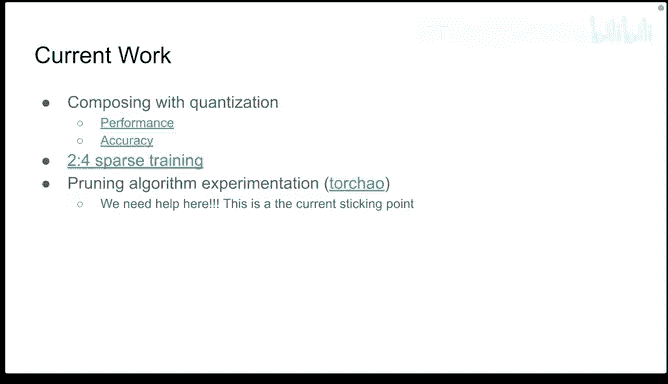
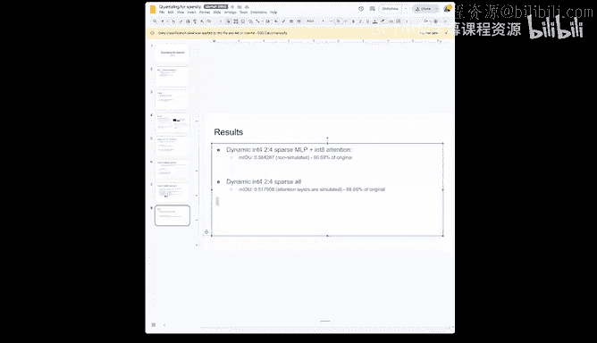
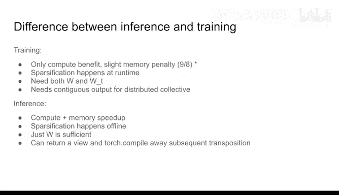
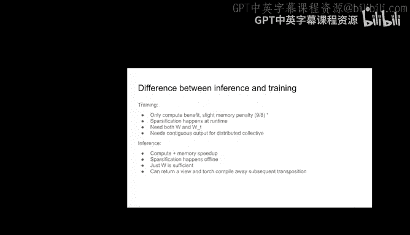
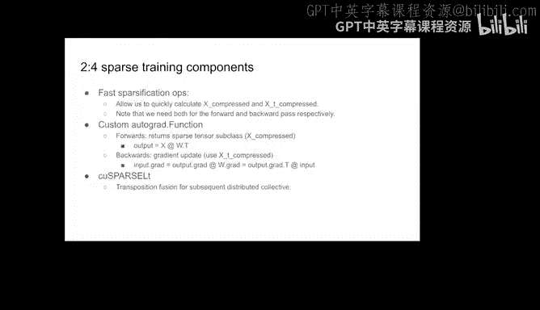
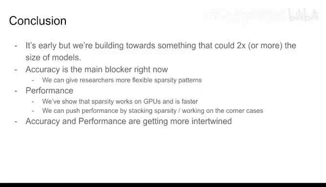
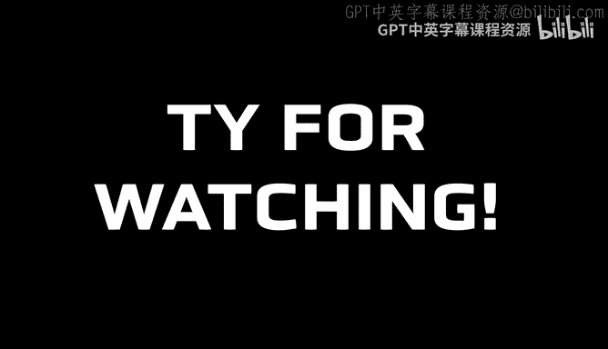

# GPU MODE《CUDA、GPU编程1-53课｜GPU MODE》中英字幕（deepseek-v3.2 - P11：-20240325-Lecture 11_ Sparsity.zh_en - GPT中英字幕课程资源 - BV1QZ421N7pT

Hi everyone， welcomelcome to our 11th Kuda Mo lecture here on the Kuda Mo Disccon Ser。 Today。

 we have a special guest， Jesse K from Meta。😊，Who's an expert in， yeah， in different architecture。

 optimization techniques and especially equiization and pruning。 So this is a very。

 very interesting topic。 I think is a little bit underrated right now because we have so great GPUs。

 which do。which can do dense metrics multiplication so well。

 But from quantization and different things like the lottery ticket hypothesis。

 we know that there's a lot of。Things which， which could be set set 0 or could be omitted in the。

In the weightes matrices of neural networks。 And yeah。

 I think this there's a bright future for for these kinds of yeah pruning and quantization techniques and e sparsity in general。

 and so yeah the the current the the talk today。Will be about a sparsity。 And yeah， I'm。

 I'm super happy to have Jese here。 Jesse， if you are ready， please go ahead and start。😊，Sure， yeah。

 thanks for the great intro， Grace， and thanks everyone for coming。Yeah。

 I'm here today to talk about GPU sparsity。So I guess first。can tell you a little bit like about me。

 I work on the Pytorch corere team on architecture optimization。

 so if you guys remember Charlie Charlie is one of my teammates。

We work on quantization that sparsity， particularly in the last two years。

 it's been mostly focused on like GenAI like LOMs and vision transformers and。

Fcusing on bringing you know these techniques to GPUs before we were mostly focused on like as a team on like edge stuff and like CPUs。

And then now because global models are so big， right？

We have to run inference on GPpUs and we'd like to take a trade model and be able to。You know。

 cut some of the weights out or like make some of the weights a different lesser D type to the performance of the model at the expense of。

 you know some。Accuracy and。Like the idea is that we're clever about how we。IfWe cover that accuracy。

 you know， that drop can be like neurable and then just some contact information if you want to get in touch。

Yeah， so what is farley best recruitruning like the basic idea is is very simple， right？

Bace compute use many parameters when you don't need that many。And there's really two parts to this。

 right？Basically you have your original neural network right and then you've trained it and you have a good set of weights right and then what you want to do is to remove some of the weights and the idea is that if you do this in a clever way right and recover you can do it without affecting the model accuracy。

 for example， like if you just if your model is just like a simple linear layer right。

Like if your' weights。Are like 0。001。Is like 0。1 right that  point。

01 weight doesn't really do anything so if you remove it you can save on some computation right and it's not going to affect your outcome if you're doing something like classification like the logic just won't change right so you'll be set so essentially。

The first step is to like zero out the weights and then there's a second step， which is。

You have these zeroed out weights， right？Make multiplying by zero fast and that's like really the core concept of like sparsity is like how do you accelerate that？

And like this idea is not that it's been around for a long time。

 so like it's the oldest paper that I think people referenced as this like optimal brain damage paper back in like 1989 so。

And it's been like around and like。P with like the Alex net and the imagenet stuff that happened in 2012。

 like there was a lot of。Re interest into this but。Now， especially with the LO Ms and。

AI and the model size is just becoming so large and so many parameters right that there's you know kind of renewed interest in this and like quantization and other techniques like that so yeah that's。

Sort of like an intro into sparsity， any questions before I move on。So far。

 we have no questions from maybe。 So if， if everybody。If anyone has a question。

 please use the chat which comes with a stage channel and I try to then forward them。Thanks。Yeah。

 so now we get to the performance part of this， right？For sparsity。

 idea is that multiplying by zero is fast， right？App apply these two numbers right zero times 1200 and whatever right and I know that's zero so I could do that calculation fast right but if you ask me to do the calculation on the right。

 I can't do this fast oops。That's right， but also like how I do that calculation matters a lot right。

 so like。I do long multiplication like the way that you're taught in school right with like one， two。

3， one， two，3， one on the top and zero and I'm like zero times10 and then you carry and then you also times zero times two is zero and then you carry and you keep on doing your calculation in the same way right then actually multiplying by zero is not going to be any faster it's going be marginally faster right but you're not actually saving that much time on your calculation。

So like this is the idea right， so you have to have a way to multiply by zero thats that's faster that skips out the calculation。

And this is in the instance of a single T， right a single number， right？

Like how do you take that and apply it to a tensor like what does it mean for a tensor to be zero。

 like highly sparse， like if it's 99% zero and there's just one element that is non zero。Yeah。So。

That's sort of like what we get into with like sparsity is like different sparsity patterns。

 right so like。Just's kind of like a trade off right like we want a lot of flexibility， right？

To minimize the accuracy impact we have by removing zeros。But at the same time。

 like we want to be able to do。呃。Computation fast， right， and if you have this sort of unstructured。

 really random。Asssortment of zeros， it's very hard to speed that up versus。Something like。

 for example， like instead of zeros。嗯。You not speak slides Yeah。

 instead of zeros zeroing out like randomly， right， you can zero out an entire。

Entire layer or an entire like part of a network or even like an entire row I get to know slide it good or entire layer or like。

R or a column or like a filter if you have a CNN right that's the idea of like structured sparsity and there right you can make the computation a lot faster easier because you just don't do it right but then what happens is。

Your accuracy impact is really high because you were taking like entire layer out of a network right and being like you can recover that information。

 but you're removing a lot of information it sort of like this trade off between you know。

 preserving accuracy and having good performance and sort of along that being there's sort of intermediate。

Representations for sparsity。Specifically for GPUs like semistructured and B pararsity。

And then those are the things that。Working on really for the like the last couple years。Yeah。

 those are the things that I'm going to talk about today。

So quick announcement but for the people who say that they can't see the slides。

 So we had this in we had this before。 and， and yeah。

 when we tried to resolve it by like stopping and restarting， it didn't really resolve it。

 So this session is recorded and will be released really soon after。After the recording。 so yeah。

 I'm really sorry for this things like disc problems。

 I think some people can see the screens and hear the speaker if， if it's not possible。

 then please wait for the recording， which will be available soon， thanks。嗯。yeah。For example。

 right I'm going to talk about unstructured sparsity。

 so like unstructured sparsity is like when you have no constraints on where you put your zeros so it's basically just like a mask。

 right？And like so like if you have is。That's like a lot of zeros like how you make multiplying by that tensor fast right the answer is that you store the data in a sparse representation and then you use sparse kernels instead of your denses kernels so like instead of doing your long multiplication right you do your fast sparse multiplication and you know you have your shortcuts to cut out computation。

And sort of what this means is like。You want to store the data to structure independently。So。

To kind of illustrate this point， I have this example of coordinate representation。

 This is one of many sparse formats such sparse like。

Documentation has like a list of all the ones that are supported if you guys are curious about like the different ones。

And basically you can see we have this matrix right。

 123000000 a three by three matrix and usually how is this stored。

 it's stored contiguously in memory right and you just have your offsets so you know like your strides and stuff。

Then for。The compressed representation， right， how do we store that is instead of storing the。

All of the elements with all of the zeros right we just store the non zero elements right when we store the data for that element and the index for that element so we store one right as。

One in the data。Elements and then also00 in our indexes right and then two the data elements and then 01 in our indices and so on and you can see how if your matrix is sparse enough right multiplying in this way is a lot faster。

What you do for multiplication is you first you just generate like a zero matrix right and then you just go and you look at your index right。

 and then you just do the multiplication for the parts that are non sparse。

Update in your subsequent resultant matrix。And that way， right。

 you can speed up your sparse matrix multiplication。

And so this is sort of like how like CPU sparsity works。

It's only really faster at high sparsity levels， so like greater than 99%。

And it's because that you need to be faster than doing like the actual dense like Mamal。

And the thing is is if you think about it where like GPs， right， like it's even worse because。

Hence map Mole is so much faster because it's easily parallellyizable right and then GPUs are run in parallel right So what that means is that this kind of unstructured sparsity is even harder like to make fast on GPU。

 So it doesn't really work like you。Think you could make it work。

Essentially you have to figure out a way deserve some sort of structure because you are using like parallel architecture to solve this problem。

 right like。If you get it down to this singular element。

 like it's not going to help and like if you remove stuff so that。The blocks are basically， yeah。

 if you remove stuff。You know， arbitrarily right， that's hard to paralyze on GPPUs。

So how can you get around that right that you can do this stuff I was mentioning earlier about structure clooning right。

 but you can also。Uses these sort of intermediate sparse state patterns。

 so there's like two that in particular that are available for GPUs。

This one is semi structureford sparsity， which is also known as two horse sparsity。

It's basically a fixed sparsity level at 50% like for unstructured block sparsity and structure sparsity。

 the sparsity level is like variable right so you can just pick whatever you want or pick the thing that is faster but like maintain the most accuracy for semistructured your sparsity level is fixed at like 50%。

And then what happens is you have two in four elements are zero。

 that's where the two and the four comes from。The nice thing about this。

 right is that NVIDdia has done a lot of experiments that have shown that there's a very easy way to recover accuracy for these models where you just train once or you prune once。

 and then you retrain。And that seems to be doing good。

The other sort of sparsity available for GPUs is something like block sparsity。

So the idea here is pretty simple instead of having just。Zeros everywhere right。

 you have zeros in a block like 32 by 32 or4 by four block and those blocks are spread out and you keep track of essentially your each block and then for the zero blocks right you don't have to keep track of those。

So like the downside here is for blocks vrssity， the algorithms to kind of and cover accuracy are more complicated and it's a much more like open like research problem where there's not really a good like known like solution。

嗯。Yeah。呃。We'm going to talk a little bit more about semistructure sparssity here。sically。

You could see how。With two in every four elements being non sparse， right？

You can see how like the dense values are stacked together to be like half the size of the original tensor。

 and then you also have to capture the structure right of the information。

 the information of the structure that you lost basically by compressing this all into a dense tensor right。

 because you lose information if like if the white ones were the ones that you kept instead of the ones that you removed right。

 then you wouldnt be able to tell like where it happened in this block。

And what you need to recover that information is is these。It's basically like a bit mass。

 but it's compressed， but it's basically two bits for every element。

And this captures sort of the mask implementationation inside the sparse mamal。So yeah。

 this is like integrated into Pytorch you can try this and use it right now。For like。

Back end there's like two different ways you can do this like you can do this in cut list with the original like instructions and then there's also an Nvidia specific library called like Kusparlt that provides some like additional features and makes it。

Paster and a little bit easier to use。So yeah， we have both integrated into Pytororch。

 we're kind of like deciding which one to pick， but just wanted to let you guys know if you see like K Spse LT or stuff。

 that's what like it's about semester co Sprseity。Just a question to this specific sparsity format。

 is it so。How do you normally like select those elements， which would be specified。

 I it just that you said book for various which are very like small。

 or is it that you take gradients and， and so in this， in this case， specific， you need to like you。

 you know in advance， like how many you will basic discard of each block and you with its yeah。

SoYeah， so I think yeah， to answer your question like how do you pick which elements to remove right。

 that's kind of like active area research， but like。For most of like what we do。

 it's just like the lowest norm weight norm values， so you just take the absolute value。

All the small stuff you remove， essentially。Yeah， okay， May that makes sense。

 And you here this like 1。6 on average in practice。 This is， like an kernel dependent thing。

 or is it do， do you know or do we know where where this limitation comes from。

 But it's not actually two times Yeah， so。The 2 x max acceleration makes sense right because you're having the values。

 the 1。6 S is like basically it' it's a lot to do with the the shapes of the matrices that you're multiplying like。

Depending on the dimensions， you have big M versus big K versus big N， right。

 like the speed ups differ。So like I don't remember exactly， but I think。

You want a big K dimension in a small n dimension I like ideally for the fastest speedups but if that's not the case right then you kind of have you know slower speed ups and I think that's the overhead of you know loading the the metadata。

 which is the the bitm into your。Mamal operation and the 1。6 x is sort of like a kernel benchmark。

 so just like compared to the dense dense kernel。Okay， thank you。哎。Yeah。

 and this is just showing how this map works， you know， you have a dense and then a pruned， right？

Removing。You know the weight norm values and then you compress it。

 you have the metadata too is it's not showing here。

 but it's part of this tensor and then you pass it to your mapmal with a normal dense mapmmal and you get a dense tensor out so basically all you do is you sparsify one of your elements and then if you can make it so that dense is already like the zero is already put here right this is numerically equivalent to。

Mt Mole with the zeros。嗯。Yeah。So just sharing some like N end results that we've done。

Weve on the table on the left， these are the Nvidia original like results from their paper so they did a lot of stuff this came out in like 2020 so these aren't the newest models。

 but they did a lot of stuff with like vision and they think they've shown that like the simple。

one retrain strategy right the sparse FP16 accuracy and the dense FP16 accuracy are pretty much equivalent which is nice And then what we've done right is we've applied this to Sam like last half and that's been like pretty good So for24 sparsity right we get a 1。

4。Yeah， this is not the speed up， but see we get 23 images per second versus。I guess， the。Equivalent。

Would be you know， 20 images a second， right for the non sparse version。

 so we get a speed up of like three images per second。嗯。这呃。Any questions here？

So we have one question from Drexel， I'm not sure if I understand it correctly it says what parts of the VIT of this spa。

Oh， so can you can basically the yeah， okay， yeah， yeah， so the VIT is not sparse initially。

 but we can make it sparse essentially， right？You can make it as far as by removing the weights right that are。

嗯。That are low magnitude and then just trying to retrain and recover the weights。

 recover the accuracy， right。AndEssential what you do is right you have your original weights that are not sparse at all。

 they're all dense， they're all like nonzero right and then you find like a mask that makes it fit the sparse pattern right and then you keep on training and then you hope that you can recover the accuracy and the other values。

And the way that you find the mask， right is by using some like。

Like the simplest is just using like way norm pruning。

 which is just the magnitude of the like the absolute value of the value。Yeah， it's not。

 it's you can apply this to any linear layer right now， or really you can apply it to any map mall。

Its hookooked up， so it's very easy to do for linears， just doing torchdo timessor I can show you。

Yeah。And so like if you want to do it into the MHA。

 it's going to be more work right because unless your MHA is implemented as like a bunch of linear layers theffus thing。

 then you have to go into your fuse kernel and then actually like replace this mamal with the sparse mammal and that's that's a pain。

 yeah， but if you want to just do it to。The linear layers， right。

 and you can apply those instantly and yeah， you can see like this is sort of our。codeode and。

Hot part apply fake sparssity is just the bit that zeros out the the weight and then once thoses are zeroed out like how do you actually accelerate them right。

 that's just this line here like line 31 if you。To set mod dot weight is equal to torch that nn parameter and then you go to two sparse semi I structured mod dot weight and this will take your weight and put it into the compressed sparse representation。

嗯。Yeah。Just is one question you， you mentioned like this like the interform case that。

 that you could continue training in， is like in in the spae model。

 Is this like a general approach that you do the specification。 and then how I fix。If training。

 or is it like that you normally there are other methods to have like spa。

 I don sparsity inducing training or like scarity in aware training or something like that。

Definitely， yeah， I think definitely all those methods like exist like I think it's kind of like an active area of research like。

Like basically what's been happening is that there hasn't really been like sparse kernels like available for GPUs。

It's been very hard to show speed ups。Almost all the papers until like recently have been showing just like the act of these suicide。

Oh， like。I don't think there's been as much like interest right。

 because if you have to work super hard to show like speedups right。

 like that's really what people want and it's like。

Have have to like set up coosears L to yourself and like over like nobody's really doing that so。

I think。Yeah， it's kind of like。Open it like there's like zero shot approaches too where you don't do anything and like one shot approaches where you。

Kin of do like just one one pass like a like a calibration step almost for like quantization something akin to that where you calibrate on some data。

 but you're not fine tuning Yeah so there's a bunch of reroaches a few moments later this out it's a very simple API。

Just using that it's nice， it uses sensor with the classes。 It's compatible with torchch compile。

 which is really nice actually for torchch compile it's。😊，Should kind of necessary。

 so I want something that's kind of annoying about。

Current semi sparse implementation is that it only supports the first matrix being sparse and not the second matrix。

For us in Pikeforge， the way that the linear layers are defined it' xW transpose instead of Wx。

So this is kind of annoying， but we can rewrite it right using transpose properties that's what I've shown here right as Wx transpose and then the whole thing transpo。

嗯。But the problem is is that。If you have this additional transpose right。

 it's it's it will eat into your performance right because you have to。

Copy back into your memory and then back into your GPU and then you do the transpose so with or compile right。

 you canfuse that transpose into the subsequent operations like if you have your re right basically you have。

You know。Srse MMm and then transplays plus Re， and then that whole thing together is much faster and end。

But unfortunately， with tors compile now right， you can't fuse into the sparse MM。

 that's kind of a problem I'll talk more about later。🎼。Yeah， so that's part of， you know， what we're。

Doing is semistructure sparsity and what I've been working on mostlyly there's another sort of thing sparsity pattern like block sparssity that we've been investigating recently so basically we found that some people were able to recover the accuracy really well using the technique like dressed I linked in the earlier slide and the nice thing about B sparssity at least for vision transformers is that。

We can get much faster than a 2x speed up， right because we have a very flexible sparsy level。

Like I think with like a 90% varsity， we get up to like 3。4 x。

And sort of our ET result is we can get a 1。4 x speed up with minimal actors to the loss on IageNe for vision transformers。

 just two percentage points。Wow， that's crazy。 So it's 90% something like isn't a normal number or like something which。

Works often， as often the case that you have only like very low accuracy drop for。Sing out 95%。

I think yeah， the accuracy drop I would say is like this is pretty pretty expected。

 I guess now that everybody can see our slides back to Sam mid H on Cocoa 2017 Eval this is actually zero shot performance so this is。

Two for pruning you don't re trade at all and then MIO over you for Coco 26 to 17 so it's like 90% of the way there which is you know pretty impressive like it's definitely not something I would expect。

And I think this is specific really to vision models that this two force sparsity seems to be very。

Animal， maybe because of like locality or something。Example for LOMs。

 if you do the same thing like zero shot ping on some like sentence classification task。

 like your accuracy is probably going to be like 0。

01 like and before it might have been like 80 or something just or like not maybe not that plastic。

 but you're definitely not getting like close to like 90% with like zero shot。啊。对啊。Yeah。

 I think also like this is something that's like kind of we're like looking into now is just like we really should just fine tune on。

 yeah。I'll finish this so then I answer your question it really just fine tune because this is like a very simple recipe right and we just haven't done it because we've been kind of lazy so if anybody wants to like do that and give it a thought like I think you can basically get this accuracy back into 58。

46 and you just have to try it but yeah yeah there's a tutorial for Bert but you know just take Bert and replace it with Sam and then pray and then。

you'll get it and yeah I saw there was a question about Sprse DBT work， yeah。Yes。

 the Sprse GPT work is very related。S GT is like basically like a one shot calibration method it's the idea is that you don't have to retrain because like for these large Lms if you retrain it's。

Problematic and the reason why it's problematic is because if you want to do masking。

 then you have to store the mask information somewhere and you're already like you know struggling for GPU memory right so like if you also have to store like the mask information right then。

Sort of like defeats of purpose。Or。Like retraining it just makes it so much harder。

 right And then our like already training as is like very hard like you can't really。

Do it like you can find tune， right so。That's why I think people have been looking into these like one shot。

 like， you know， sort of like calibration S， you know。

 techniques or recovering accuracy for these larger models。Oh， and then。

I'm going to talk a little bit about the work we were doing currently so there's basically like a couple parts to this right the first part is like composing the quantization and we have some like interesting findings there。

呃。Let me share this。 This is kind of。Informal， but。I don't know if you guys can see this。Thanksly。

 like。When we compose quantization and pruning together。

 we run into sort of a lot of issues and kind of dealing with like tor shot compile but。

It's just dealing with like fusions， right？哦。Or like a normal MM graph right you have your weight in activation and your output right and this is how it works great great classic then for vrssity right essentially what you have is you have your weight and then you add the zeros right and then you compress。

And then once you get your compressed thing you get your compressed representation that stuff all happens offline and then at inference time you take your compressed representation and then you take your sparse kernel right and you have your output and that's fast right and that's great and then like for quantization right what you do is basically。

Poantize to an int8 or like a lower dimension D type， right？

And then you do in MMM and then you have your output right and then you recquitize into your floating point or higher dimensionality D type and the nice thing with Porsche compile and what Charlie's done and his work is's you con fuse all of this together right but the problem with。

Adding， you know， sparssity to this mix is that you can't fuse into the cousparrsse Lt or like the cutlist stuff unless you write a fuse kernel。

But for Kusfire LT， you can'tfuse them through it at all because it's basically a black box。

What you will have is like a fuse bit， a kernel a coosepartse LT call and then another fuse bit for the decor we found that。

Basically， that makes。That makes it slow， so if you look at these numbers， right？

Baseline for B F 16 is 1600， right we apply to pararrsity。 We get down to 1400。

 We see a nice speed up。 That's great。 We apply dynamic quantization， right， We see 1400。

 which is like a nice speed up。 That's great。 We applied both， right We should get。😊，what is it？1200。

 I guess if it was the perfect world， right， But when we apply both， right， actually。

 we see a very marginal speed up if nothing at all， right like。

20 20 milliseconds and the reason for this is the sort of operator fusion stuff。Talking about and。

What we can do is like basically we can for Kp LT， we con fuse a little bit of the deQut into the Kusp LT Mamal because they have support for like alpha vectors。

 so you do that right？You can only fuse one of the multiplies。

 there's two multiplies for the requetization step。

 but once you do that right you get a much faster runtime like 1，278。So yeah， this is kind of like。

Of the interesting work now where there's like a lot of problems where。For example， like。

Doing this with Kpart Lt right you could only fuse one of the fusions right and you can't fuse anything else right if you were to do this in cut list。

 which you can also do right then you could you know write a fused。Dequant epilogue， right？

For both of the both of the multiplies and you know get speed ups that way and similarly for cutlists。

 right if you wrote。Like something you could write you could write a fuse kernel for the transpose too so like for Cuport LT they has support for merging the transpose as part of the kernel like as one call and that's not something we support for cutlic currently but if we were able to add that right then that's something that would help us you know push push this like performance numbers up essentially。

嗯。Yeah。And I think。Also， there's sort of like an accuracy component to this too。

That's like kind of interesting。And。So is， is this in general。

 we see the like slight performance inc increments or you。

 you get a little bit better performance to use using sparsity and quantization together。

 But is it like worth worth it is it really， because I would I assume now you。

 like you you0 out or this element And then you like remove all the bits and the end it likes becoming really worse and it's。

 I du'n know。 Is it before you show all some accuracy。Yeah， I think it can work。Like， for example。

 the the。The accuracy is degraded。Right significantly， so I can show you。B， which is。嗯。Sorry。

 let me think of how the best is。Yeah， the。Sorry， can you， can you ask your question。 Yeah， so the。

 the question was basically， like， is quantization plus specific a winning team or is it like。

 is it like is still an experimental very experimental phase right now， I think。😊，Yeah。

 from a performance perspective it's winning from an activity perspective it's kind of like up and there for people to figure out like yeah like this intake like quantization stuff we haven't done any accuracy experiments on you know。

 on the actual。Outside to figure out if there's like a huge accuracy impact or not， because like。

 basically， we're mostly focused on performance stuff。

 So like any accuracy work we do is just like zero shot and then just making sure it looks all right。

 And we haven' an invested time in like， actually client tuning and trying out， like， you know。

 different techniques and like。I think there's a lot of active research right。

 and I think people are kind of like looking into this。Spare GT paper actually。

 I think has a section on composing。With quantization。

 and I think some of their results are kind of interesting。Show that like for example。

 if you have like four bit quantization and then you go to two bit quantization said you could do 50% sparsity and like three bit quantization and those lead to better results instead。

 but I guess like you can see how like you can play with it right you can quantize to more or less bits and then like sparsify to more or less stuff and just kind of well。

You around that way。 That makes sense but is curious the， the gold standard to。

 to measure the quality of the quantization or the specification or is other there also other metrics like。

 I don't know， KLD versions or。Several like lost metrics also so that。

Yeah， I think there are for like motivation， there's like S Q andR like。T noise ratio。

 like I' imagine there could be similar metrics that you could use。Or sparsity。Actually。

 something we've been talking about is like evaluating for Sprsity。

 I don't know if we necessarily have the right approach with like accuracy。Really。

 since you have the original model too， you can just do some maybe some agreement score and that's a better metric of how well your model captures your original model。

Yeah， I would say like for us， that's probably something that we haven't really like thought about like for us。

 like the actually stuff is like。Really like back of mind。

 like we're just focusing on getting like the performance and showing that like， hey。

 if you figure out the accuracy stuff， right， then you will get the performance like the way I think about it is basically like know like the clown dunk tank。

We we've built the down clown dump tank and then now like all the researchers have to throw their shots and try and try andnk dunk the clown and like if you hit it right you you're going to。

When because like we've shown on the performance side right that you know there's up to this like 2 x and we can keep on pushing it right and like we know it's numerically equivalent right if you put the zeros in the right place the sparse map and the dense mapm will give you the exact same result so you have to figure out where to put the zeros and。

And you can hopefully win like all the performance stuff。So yeah， I hope that helped。 Yeah。

 I guess it's for， for classification。 It's like the most important metrics that metric that you want。

 Yeah， it's， I think the thing about accuracy is， it's easy to tell， right。

 like if stuff goes up or down。Yeah。Yeah， I think there's also。

The work we've been doing with like sparse training so we've been talking about this in a context of like imprints right just like offline but you know since like in actuality you're just speeding up a Mamal and like the mapmals happened during training too so we could also speed those up and。

For quantization。Like for training， we don't have to worry about quantization at all because that's not really something that we're doing right and then via a way to speed up training。

So this kind of works， the idea is that you have a very fast。

A to sparsify the kernel and you do it with like weight norm like magnitude。

 but since it's a four element thing， I think you can do it without sorting or like without branching essentially and if you do it that way it's very fast。

Essentially， what you can do is you can sparsify， run your sparse mat mall and get your dense result。

A shorter amount of time than just your dense mammal。

 like in inference your sparsan pick your snap happens offline so you don't have to worry about that。

For training right you have to do it all at once right and then that step is faster than your dense mammal and farmers is a team we've been working with them they've basically written the past sparsification kernels which has been really helpful and then they've done some experiments with you know。

Imagenet。Going like a 10% to 20% speed up N end training with like a very small accuracy gap。81。

6 to 80。5。And there's kind of like a lot of， you know， like nuance here。

 like they apply to the activations versus the weights。

And that has to do with like the matrix shapes and also like the activations since they're coming after a re right they tend to be more sparse。

 so I think there's a thought that affects the accuracy less there。Yeah， some results。Yeah。

 I won't go into this too much， I think。Okay， yeah。

There's some differences between inference and training that I think are kind of interesting。

And training。Basically。What's really tricky when you have the compressed representation is doing a transpose if you do a trans you can't really do that on the compressed representation versus on the dense representation。

 a transpose is essentially for free right because you just switch the trieds and then you're set。

 but with the compressed representation since the structure is all stored。

Yeah can't really switch the strides there's nothing analogous to that so since we need both W and W transs for training right for the forward pass and the back of pass respectively what we do is we just keep a copy of。

Like we keep the compressed representation of W and compressed representation of W transpose。

And this is， this means that there's not as much of a memory benefit right for semistructured sprsity for inference there is。

 but for training right since you're keeping both， you actually have a slight memory penalty。

 just like a pure compute play。嗯。And。Another difference is that or。I specifically。

 you need thatfuse transquiition thing that I was talking about and that's only present in Kbars LT。

So for training， you need Ksparse LT in order to get the speed ups with cut lists only it won't work unless you add that functionality。

嗯。嗯。

Yeah。Oh，I'm just going to skip this。Yeah， and then I just wanted to talk really quick about like stuff that I think is like interesting in this field。

We talked about block sparsity and too force sparsity， but like。Reason why you can't combine them。

 both， right？ You could have blocks of two4 sparsity and two4 sparse blocks。

 And then that's really exciting because like， that means you could， you know。

 push the performance like 2 x times 3。4 x。 Like obviously， it's not gonna be that fast， right。

 There's gonna be some competition， but like。😊，I think it's really exciting to think of like spaed patterns。

Being composed in this way。And I think there's also other like very clever stuff like， you know。

 blockwise sparsity is very fast， right， but the sparsity pattern is very inflexible， right？

What you could do is you can fuse， you could add a shuffle。

Into your load into your blockwise right and that's what these people have done here there's this paper i'll link it in the slides。

 but basically by adding a shuffle right they have this they allow for this sort of like。

Tudo unstructured like sparsity pattern， but like that actually like there are definitely still constraints。

 but you can see how this is a lot more flexible from like an actually perspective than blockwise sparsity。

 right？So like I would imagine that this would be a lot easy。Easier to do。

 And yeah the shuffle right pull is costly right so that pays into the performance hit right。

 but with tor shot compile right， you can fuse that shuffle into the other ops right and reduce that performance hit So yeah。

 basically like I'm kind of thinking about it is that having these like sparse building blocks and then you can just kind of like play with them and compose them with like a shuffle and then torch shot compile make them fused and fast if that makes sense and then also like。

😊，With quantization and forcing how to make those  fu them past and just。对。

Be able to like plug in like licenseson seamlessly， essentially。

And there's also some interesting work like you could use two4 sparsity for dropout to because dropout's already 50% and like it's 50% random right。

 but24 sparsity might just be random enough right and you know if you get 90% of the benefits is dropout right but you just you know have to。

Obviously like two poor constraint right it might be worth it and like the idea here is you basically just generate like the random the math metadata right and then you pass that in when you're doing your your dropout。

and then I think like this is like kamo specific stuff I try to think of stuff that I might be interested in yeah feel free to reach out if you're curious。

The cut list who our gap I mentioned about this we've had somebody from Quawanite who's done a lot of really good work here and there's basically。

BtpressLT is like NVdia specific。Versin library that supports this。

 but it's a black box and the fact that it's a black box makes it complicated。

like do this sort of composition stuff like fusing into it。

 you can't do it for cut list right you could do if you wrote the cutless kernel then you could obviously add stuff subsequently right like for example。

 like fusing the transposition， we could add that into the cutless kernel or semistructured sparsity also like fusing the de quantnt into the cutless kernel。

Also like obviously these kernels have a lot of parameters right like thread size warp size stuff like that that's all fixed right for dense mapm you know that's all like configured and there's like tuning and stuff like that and that's not hooked up for the sparse mapmal at the moment right。

Yeah， other thing is like。Larger fuse kernels right this is kind of that was copar L T stuff and then flexible sparks do patterns right like like writing a fast shuffle or some version of that right is actually like very helpful right because it allows us to give。

Different sparsity pattern to like researchers that's like a lot more flexible and hopefully those patterns right makes it easier for them to to。

 you know， click my， I guess。Yeah， and then you know， Lous sparse kernels， this is kind of a。

Different idea but like if you want to do oned spay right you could do it in a way for Lama where you're not computebound and it's like memory bound mostly right you could do something like load as sparse and then expand to dense inside the GPU and then do dense Mamal and the idea here is that your dense Mammal takes the same amount of time right so there's no speedups there but your sparse your low S sparse expand is going to be faster than your load as dense thing and that's how you can you know make a play and try and get speedups that way。

嗯。So that report probably then for like low spaity。 So if you have less than 90%。0 outright。Yeah。

 yeah。And it， it's you make like。 Yeah， sorry。I was just to say like for Triton like Triton doesn't support semistructures sparsity I think they have B sparse support so like it would be very cool right to be able to fuse this end to end。

 but like have just trying to generate all the code like but I think this was not very realistic it's typically like it would be like a lot of work so but yeah。

Yeah， regarding Tri and I actually wanted to ask， like。

 how easy is it to to manipulate like spars structures in and tried because you have like always this or often this indirect that you need to read indices and then like compute new addresses basically on this in indices。

 if it's I think it's possible， but it。Have you liked some experience of performance。

I would say for block Sprsity， it's a lot easier。 I think Tri does have some limited block sparse support because the indices。

 like the way it's managed is more regular for semi structure， the the metadata format is。

Proprietary it's just not documented at all， so you know figuring out exactly that format and how to compress into the compressed representation。

That's sort of like really the tricky part and I think that's like the magnitude of the work if you were to try to add this to try and yeah。

Okay。And as you as you mentioned， like compression like in general。

 as is this it's like not directly quantization also specificrsification。

 but is the some somehow also related that is also a concept of because you you mentioned like loading sparse mattresses and then computing and。

 I think like compression is something similar， right， It's like for normally， of course。

 we have like Jpegs。 And if we load them if， if do imagenet training。

 we also have some form of decompress which takes place at this at some some point。

 But is there also like concept of compression in。😊，During computation or doing， I don't know， like。

It is like s similar。 some spas format are like reminding me a little bit of like very simple compression algorithm like like run length encoding or stuff like that。

 Yeah， yes， yes， yeah， run length encoings like another sort of low spae and run length encoding。

 like to me are like the same sort of like concept。😊，Yeah， yeah。 I'd say。Yeah， yeah。 definitely。

 I agree。Do you see that there could be in the future also like support should there be support for spas？

Representations directly from hardware could they。How to be many elected。organganise differently to。

 to， to simplify and improve the performance of spark applications。Yeah。

 so I think that's that's basically what Nvidia tried to do with some nice structure sparsity with like tensor core。

 I think there， there's probably some special hardware or something that makes like this particular sparsity format like fast。

 I think like。😊，Yeah， like I think the hardware vendors will probably decide。

The true like hardware supported spaity patterns right。

 but like with like the shuffle like that idea right is you could take。

You could take the hardware supported。Blocks varcity and many more different patterns to people。

Yeah thanks。 Did I ask a question。Sure yeah。Maybe a two part question， but so for during inference。

 you do sparsity to you know speed it up and maybe save energy consumption for during training。

 are you doing it like kind of like with quantization to aware training。

 are you doing it to like make the model more robust later， when you to make it sparse？

Oh no for for two four sparse training it's a it's a compute play so we we're just trying to train faster and that's like the main advantage that's why we want to to do it。

 it's like we might be able to train faster slash like bigger models like larger cool and then the second part was。

So if I understand this right， the values you choose to zero out are like the smallest ones。

 basically。So do you do the sparsity during training like later into the training or would you just do it from the start？

So basically what you do is you do it every time like you。Of your dense weights， right， And then you。

You look at it at inference time like right before you do the mammal and then you sparsify it and then you do a sparse mammal and then you keep on going so。

There's it's not like yeah sorry does that does that help Yeah。

 but I I think just like my intuition tells me like would there be any merit in doing sparsity like I don't know。

 later in the training so that you're you know， zing out the right way。Yeah， I think， yes。

 there's like a lot of， I think stuff you could play with here， like， you know。

 like progressively introducing it and then like， you know， turning it off and like。嗯。You know。

 like gradually increasing sparsity is another thing I've seen that like researchers have done where it's like first。

 they do like 10% and then 20%。 and they're just trying keep on pushing it up。Yeah。

 it it's kind of like there's no like wrong answer or right answer。

 it's people just try whatever yeah。对对对。Yeah。Oh yeah。

 this is just my last slide I guess so yeah we're building something pretty cool off here。

 I think really like make these models bigger and I think that's that's really awesome。

Like right now， I think a lot of the issues that we're running into is like accuracy right and just people figuring out how to put the zeros in the right place and I'm optimistic that hopefully someone will figure this out。

And on the performance side， right， we've shown that sparsity works and know it could be used to make stuff faster and you know we can keep on pushing like this sort of like sparsity performance numbers and make it more like keep on incentivizing people to keep on approaching this problem from like an actually perspective。

The last thing I think is like more I think about it。

 I think like the accuracy and the performance stuff is really like intertwined like。

I think as a researcher， trying to find you know blockwise。Way to like prune a network is quite hard。

 but if you can find like， you know。Like a couple version， right， Then that seems like much easier。

 and like。The way that you can add stuff and like have suffused right and not pay as big of a penalty。

 I think is is pretty interesting。Yeah。🎼S cool， Jesse。

 thank you very much for this like details and insights and tools。

