# GPU MODE《CUDA、GPU编程1-53课｜GPU MODE》中英字幕（deepseek-v3.2 - P12：-20240331-Lecture 12_ Flash Attention.zh_en - GPT中英字幕课程资源 - BV1QZ421N7pT

So hi everyone like welcome to lecture 12 of Kuda mode today I'm super thrilled to have like one of our like very own mods like Thomas Veman to talk about like flash attention This is probably like I guess like the hottest Kuda kernel out there today so I'm really thrilled to have someone like as deep as like Thomas come talk to us about today So yeah Thomas please take it away and I'll meete myself。

😊，Yes， so I labeled this introduction to Flet attention。😊。

So I'm short selling you a bit if you wanted to have live coding of the fastest flash attention kernel because I was a bit foolishly ambitious about the timing here there's only one week between GTC and now but hopefully it will be something of interest and it'll be a bit of the progress report。

Obviously， since last time， I think I spoke more or less eight weeks ago， plus or minus1 hour。

 depending on whether you're on daylight saving time。And so nowadays， I do thunder it lightning AI。

 and I'll use this。To plug a bit。That a bit too during the code demo。Okay， so。Let's dive right in。

 This is something I showed you eight weeks ago too when we first discussed tiyling。

And so flash attention kind of takes the attention and takes。Quite a complicated quite a computation。

 which involves two mud mos and and softms and applies that。A similar basic tiling scheme to it。呃呃。

As you do for the， for the mud mos。 But obviously， it has been optimized quite a lot because it is。

One of the one of the things that consumes time and also DP U Ram。In the transformer models。

That basically it or the compute is available right now。嗯。And so the the basic idea here is， again。

Try to avoid writing intermediate St， and we'll， we'll see a bit how， how。Getting good that。Okay。

 so this is also a slide from eight weeks ago。 Obviously we want to avoid writing things to DRA and loading it back if we can avoid like allocating memory and keeping that around for a long time。

 that's an obvious win because we never have enough GPU memory。But also the shared memory。

The SRAM here is quite a bit faster， usually in the order of one magnitude。

 although you always have to。Kind of update your your assumptions in these things。Um。

 similar to the overall scheme that like when I started with Pythto seven years ago。

You could basically seturate a GPU with。With just sending one kernel after another。

 things have changed a lot。Before we dive into how F attention is implemented。

 obviously you're all into QUa programming a lot and you're quite likely all into AI。

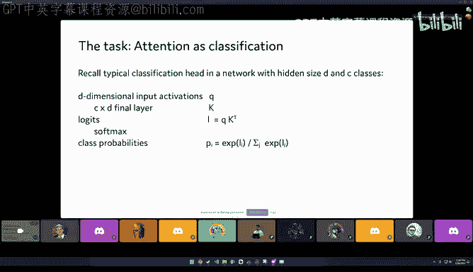

But let's briefly， very briefly recap like what attention is。

 what that operation is that we're trying to compute here。

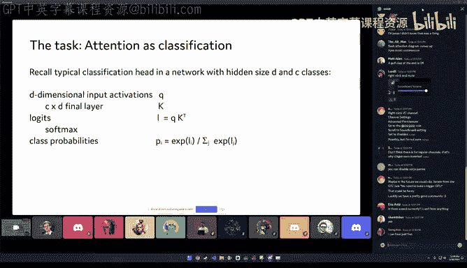

And so I like to think about attention a bit as a classification thing that is inside our model。

 and so if you think about the typical classification head in a network with some hidden size D and see classes for people that are old enough。

To have been around when resonates were thing we had these convolutional things。

 and then at the top there was a final layer， there was a linear layer， a fully connected layer。

And then was the softm to get probabilities。 And so this is what we have here。

 we have D dimensional input activations， then we have this final layer and I'm calling it K for reasons。

That multiplied to the activations， the inputs gives us some locks and we apply softms to get probabilities。

So far this is pre standard， but we can look at this。

 we can rearrange things a bit and so a long time ago。

 if you look at my blog learn up I have a blog post like how many models is rest where I'm trying to tell you that it's actually two models because we can take this final linear layer and consider it as class embeddings by not thinking about it。

 you put a vector in and then you get，Cllass lockets， but you can also think about it。each。

I have to think each row of that matrix。Embbeds is an embedding of one of the target classes and then you take the scalar product of these embeddings to get lockets and then you take softms again to get the class probabilities and what I did here is I added this scaling term that will be also in the attention but which is just the temperature term of thoughts that in the olden days you would probably try to find an initialization there essentially provides this。

The term for us。Okay， now if， if we have here。Q and K coming not。From these things。

 but coming from linear operations， this is just the attention weight and so the attention is a classification problem of which rows of VS。

Of the value part of the attention。 Should we， should we pick。So， this is。I think about attention。

 like as a。Component of neural networks。But now we want to go and make that fast。Because。

Before it was。It was。Like the。Most time consuming operation in transfer， almost by far。

And so here's a thing about multihead attention that was the basic attention mechanism for one head that I just showed you when you have multihead attention you have multiple classifications of this type and the D gets smaller and you have that simultaneously and if you look at the attention is all you need paper。

 the classic one that introduced B， they write multihead attention allows the model to jointly attend to information from different。

Representation subspaces at different positions。 So they propose that or or present that as a。

As a purely。A thing that they want to have for the representational performance。

 but it also is a formidable computational simplification in the sense that the heads are fully independently。

 so like the batch dimension when you feed multiple examples at once。

 these are fully independent and you can parallelize them very easily because。Of their independence。

 So we have， actually。A huge simplification here and in fact。

 if you look at like the things that constrain us in a bit。

This has been like a happy little accident if you want。

 if you believe that it's like not invented also because of the computational complexity it saves。

But so it's really great that we have multiple heads。

Because the size of each head will be a limiting factor and having more heads like lets us parallelize really easy。

And this is， maybe。Maybe already the the next thing so。

When we think about how to write attention on the GPU， this embarrassingly parallel part。

 if we have enough enough items to calculate like enough attention heads and enlarge enough batch size we can distribute those in order to use all the streaming processors that our GPU has。

 and so one head will be calculated in one block because there's too much interdependence in order to give us some。

Is it there。Sorry。Okay， so typically the flash attention trick will try to compute like one attention heads。

Computation in one block on the DPU so we can share memory between all of these。

So we further assume here that query key and value have the same shape。

 which is not necessarily always the case， you could have key and value of different sizes than the query。

嗯。But we assume here that it has sequence length n。And had dimension of D。

And the other thing we need is like we need the Somax operation and so the computation just fits in one line。

P is the probability weights is the soft max of the query times the key times the scaling factor and then the output is a matrix multiplication of the weight matrix with V and we will see that through lots of well yeah happy coincidences or we can actually avoid materializing P which is an intermediate here and。

Again， I've。I studied mathematics a long time ago。 And back then。

 when you did numerical linear algebra， the saying was。For these。

 for large matrices in certain contexts， if you materialize your intermediate matrix。

 you're doing something wrong。Because I。That was prohibitively expensive in terms of memory。

And so we're in a very similar situation here。We want to try to avoid materializing this intermediate。

So Thomas， before you keep going， I set a clarifying question on your very first line。Which was。

 I'm still having trouble mapping what you're saying around like， no， no， just the next slide。

Next line。 this a slide you were on earlier after。Yeah， to really make。This one， no one more。

 like the one you were at when I first started asking my question。Al right， I didn't one more。

 It was low volume。 Oh， I see one more。 Yeah here。 So on the very first line here。

 like I'm having trouble what you're saying， like mapping ahead to the hardware。 So I was wondering。

 like you're basically mapping ahead per As。 What do you mean by block here。

 So I was wondering if you could elaborate on that first line。Okay。

 so when we write or when we launch kuda kernels， we define a grid of blocks and the blocks are the corpoerating threads。

And so the idea is if we have like 80 something streaming multiprocessors and a block is always processed by a single one of them。

 we want to have like enough blockss to seturate all these 80 something streaming multiprocessors。

And so I， I， we want。Like， or we， we will calculate one head in one block of cooperating threads that run necessarily because they want to use shared memory。

 This runs on one streaming multi processorcessor。 and so。

Kind of these fact that we have many heads and many batch items。 hopefully。

 that saves us from only u part of the GPU。 Obviously， you could then do other tricks to。

 to get better utilization。 but this is the basic idea here。 And， and presumably。

 this is the reason why like the head dimension and flash attention is so small and fixed， Basically。

 it's like 128 to56， because otherwise， you couldn't map ahead to a block and it just makes the algorithm breakdown。

 I that， is that also your understanding。Yeah， basically。

 and we will see this and I'm actually I'm still struggling with it so I try and I did implement like a little toy kernel that implements attention for one head and I'm still like way slower than even nonsophisticated attention implementations and we'll see we'll see just what are the limiting factors in a bit。

So yeah， great question。 But yeah， the the reason。What or the largest constraint is to my mind is the dimension here of each individual hat。

Because that will restrict like the registers we have or the shared memory in fact。

 we will have such a need for shared memory that we try to move things from shared memory to registers in a bit。

 So so so speaking of like this because。This really reminds me of a point Christian Perch was a Pirate core developer made to me。

 which is like if you look at the formula for multiheaded detention， you have a Maimmal。

 non nonlinearity， Mamal。And so conceptually， there's almost no difference between multiheaded attention versus a two layer neural network with a non nonlinearity。

 And the main difference is basically that you have a small head dimension。

 And I thought that was a very interesting point。 So yeah I'll shut up and I'll stop it with my comments。

Yeah， so in this sense， that's a great observation by Kris in a very succinct way to also what I try to elaborate on。

 like how to view the attention。I。Yeah， this is。This is like small。To layer network。

 but with a very large batch size due to the heads。 So we trade heads trade like batch size。

 like things for the inner hidden dimensions。 And we desperately need that。Okay， so let's。

 let's look at the tiling strategy。 And so I've tried to like。

When when I try to implement kuda kernels they don't always do not to be very fast。

 but so the first thing I try to look at is like what does it take to compute one element of the output and that's like usually a good strategy。

To try to have like one thread needs to compute one or more outputs。 that would be the ideal thing。

Because multiple threads working on the same output always has a synchronization problem that you need these。

Atomic ads or things like that， and usually that's not a good idea because if you have lots of them。

 they will run into performance travel and it also always presents you with these nonlinearity with the nondeterminism where when you run the thing to twice on the same GPU on the same day you get different results。

 they will be just slightly different from the addition order， but they will be different。

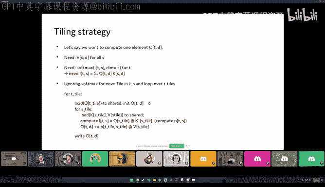

So here we go and think about what does it。Need to compute one element。

 and so the element has a sequence dimension， which I'm calling T here and the D dimension is like the hidden layer like one head。

 think about it as 128 if you like Lama 27 billion。

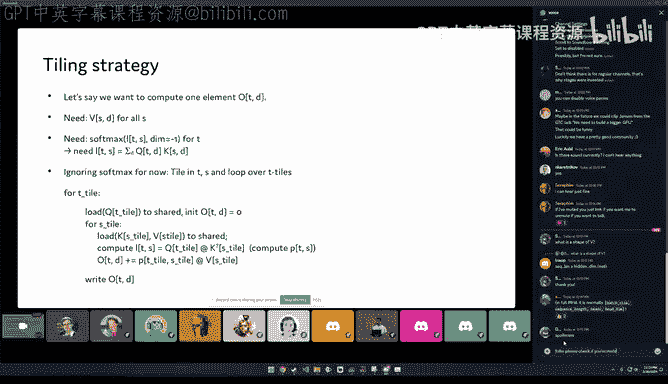

嗯。Okay， so in order to compute this。I need the value and this I need for all the sequence elements。

 S and for all the D's， obviously。And I need the result， the probability。 So I need the soft maxs。

For all the teeths。 And the tea。I need the softaxax for this T and for all S。And so。

The miracle here is that the dimension that we're taking the softmax over is the same dimension as the contraction dimension between the softmax and the V。

 so this S here。This should be it would be clearer as we need the softenags for this one T。

 That is the output T and for all S。嗯。And so the miracle is that the contraction dimension and the Soax dimension coincide and that like enables the entire thing in order to compute the Soax。

 we need the input to the Somax and this is like matrix product again。

 and it has as the contraction dimension just the hidden dimension here。

 the D and here this is also maybe interesting。WhenWhen you feed it into the neural network。

 you have naturally the fastest moving dimension。Is the contraction dimension。

 which is much nicer than in Mamal usually。Because when you want like read consecutive values。

 that's easy。When youre， when you're like。Have the symmetry here in the operas。嗯。Okay。

 so we need for this one T that we want to compute at this thread and for all the s。

 we need to compute this contraction。So if we ignore the soft next for a while。

 we could have the following tiing strategy。And in fact。

 this will be the telling strategy and well just have to have to mutate the the softax in。

 So we tile in the ST direction， which is kind of the easy direction because it's。

The outputs and we we load a Q tile that matches to this， so it is tiled here。

 we load all these and so we have if you want for this matrix multiplication。

We have like in the contraction dimension。 we have tiles that expand the entire。

Contraction dimension。And so if you， if you remember how the tiles were all square when I or in the next lecture。

 Jeremy in more detail， showed like matrix multiplications here。

 you have contraction dimension tile dimensions in D implicitly that are covered the whole thing。

 So it's， it's a huge tile。 yeah， more。😊，I like an entire row or color。

And so we load one of thoseq tiles and we initialize our output and then we need a four loop over the S tiles。

 which is kind of how we had this inner dimension if youll remember the matrix multiplication。

 the inner tiling dimension was the contraction dimension and here it is the contraction dimension of the。

Of the output matrix multiplication of the probabilities with V。

And so here we load one of the K and V tiles。In the S dimension to shared memory。

 And then we compute the。The logs。And eventually also the probabilities of the matrix multiplications of the Q tile with the KT tile。

And then we add， we get。Like logts。 And we compute probabilities from that。

 And I'm glosslossing over this part。But then we update our output with the matrix multiplication of this weight matrix that we just computed with the V here in the last row in this inner loop。

And when we are done， we just the outputter。This is really。Kind of an advanced tiling。

 because we're kind of mixing the tiling ideas of the two matrix multiplications。

 but things align nicely enough that if we solve this。Gap to go from P to。To L。

 and if we can deal with these giant tiles with a D dimension。Then we're good to。You have。

To have a tiling that works conceptually very similar to the metrics multiplication。Well， Mark。

 if there's。系い。If it's all too if I'm glossing over bits， you keep me honest， right？

So if you have questions to interrupt yeah， so like I do think like at least when you're explaining what P and V are。

 like basically you have like L okay， like this basically the path of all the intermediates might need like a picture。

I think Huging F had a really good picture on this。

 so let me see if I can find it and post it and shut。Just give me。I'm terrible with the pictures。

So I have the have the picture that Tdo himself has in the paper。

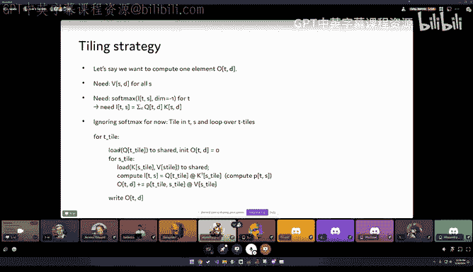

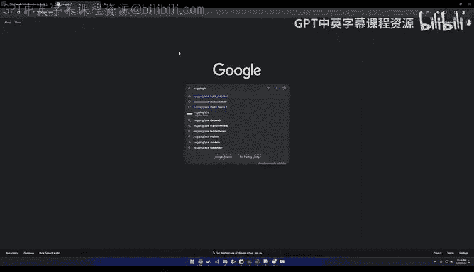

嗯。It's。Not。Probably。not the step we want， currently。嗯。But yeah， so。

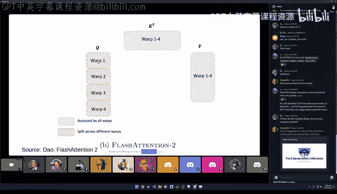

So the idea is that you， yeah no， I don't like that Oh not for this。 I I'm sorry。

 I realized that was muted。 So I did， I did share like a really good picture and chat。

 So if you wantan to open that up， I think it'd be very。

 very helpful to go through that picture with people。

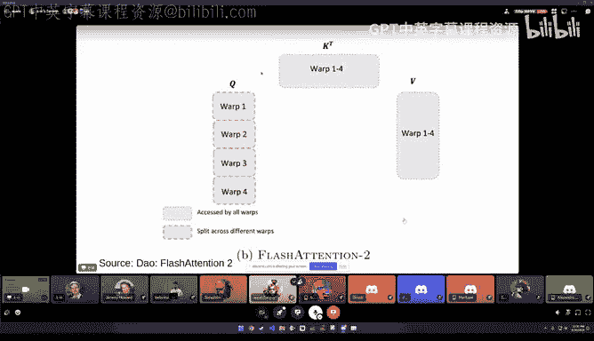

Yeah， let me。

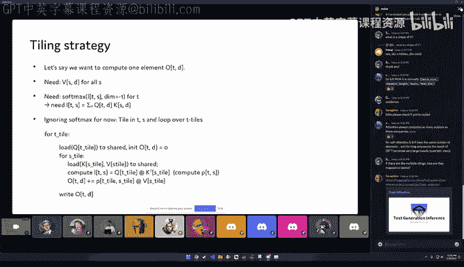

你 guess在这。另外。说。😊，Yeah， that's right。 just because that makes the inter like S and O and T and stuff like that。

 Like I think some of the terminology gets lost without a picture or so。I really like this picture。

 It sort of makes it very clear what the standard versus the flash implementation is actually doing。

Oh yeah。 so basically， basically， okay， you have the， you have writing a lot。 But to my mind。

 this is just the the way of saying， well， we use things like we load all the inputs and then we write all the outputs。

 And if you see here， actually。😊，This is maybe an interesting part here， this explains F attention1。

 and you can tell that F attentiontention1 had the organization such that they add to write intermediate outputs OL and M to the DRAM。

And flesh attention， too， got its speed up from avoiding that。As well by rearranging the tile order。

I， I skippped the， the old picture， but basically， the flash attention。One more or less。

 swap these two tile orders。And that made some things a little bit more complicated。Thoma， yeah。

 you might want to just share your full screening And just like so we get the full screen real estate。

 I know， Yeah， Was it the same have to。Yeah， perfect。 Thank you。Okay， so the thing I didn't。

 I I skipped over here in this little short code。 and I'm really a pseudo code person。

 I don't know why， but。That's just how it is。 Okay， so the bit I glossed over is the softmax bit。嗯。

And so the formula we need to compute is simple enough。In order to get the probabilities， we need to。

Compute the exponent of each component and then we divide this by the sum of all of these and because the input the output of the exponential function is always positive。

 if we have a real argument to it， then。This is always between 0 and one。 And also it adds up to one。

 if we add other the P。 So we get like probability weights or likelihoods or whatever you want。

Called in this context。 But so probabilities in the sense that it's between 0 and one。

 and they add up to what。And this is nice enough the output。

 but the problem is that these things can get really large or really small。

 the numerator and the denominator， and this is numerically not stable and obviously the exponential functions if I input like 100 or 1 thousand00 that already a huge number。

嗯。And。And so。呃。This we have to stabilize。 And so the stabilize soft max controls these by expanding the fraction。

 and I could like multiply here with the exponential of minus M。

 or I can just add it into the exponential。 And this will be like the same result。If we choose。

What you wouldn be。I'm sorry I'm really trying to play wacamole with all the server muts。

 So please mute yourself。 guess it's been So okay， if。

 if there's something you interrupt me more forcefully than that was， okay， Okay， so if we。

 if we do this with a maximum over all the allies， that' is nice because suddenly these terms we have in the numerator。

 they lie between0 and one themselves。😊，And the largest one obviously is just one because the argument is zero and so we have a really。

 really easy。Stbilization here。 The problem is then that we need to figure out the maximum and then apply it。

 And so there's an online version of this where we think， yeah， well， if we have this。

We can also update this incrementally。By observing that if I want to replace the M here。诶。

L I is logggets。嗯。And if I want to replace the。The M here with a M U。

 I just need to adjust whatever I have summed up so far。And so this is like really。

Really neat trick that I can。Swap out the M。 And so the idea is that whenever I have a new M。

 I adjust my outputs。 and in fact， in the in the pseudocode that the flesh attention presents。

This is done block by block。嗯。And。I'm always thinking whether it actually is the best way to implement because sometimes it would be conceptually easier to just implement this element by element。

 but then you have lots of compute because computing the X function is not the cheapest function to compute。

Okay， so this is。Why we need the。Stabilized softenax。Yeah。

 we need the stabilize softmax even for float 32 before there was float 16。

 Float 32 was like the less stable data type。And so when the exponential function is involved。

Arguments get large so fast that we need to need the stabilization in order to have。

Good good weights。 and in fact， if you， if you follow the vital death forums。

 just to give you a sense like how sensitive this softmax calculation is it is a good question。

 why do we need the stabilization when 32 bit so plenty。

But if you want to know like just how sensitive this computation is。You don't need to believe me。

 but。

If you， if you look at the Pyth de forums。I think just last week， there was。嗯。

Boths calledfuseed multily I think that's the one。 Yeah， you found here。

 FMs and softm and floating point considered harmful by H。 and it's an awesome observation。

 And so the rounding differences between fused multiply and add FMA。

And possibly unfred multiply and ad is the rounding differences there are large enough to make it a problem in the softax for the flash attention。

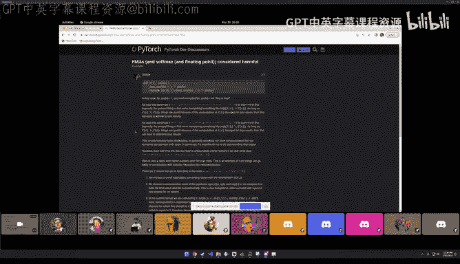

This is still， even if we have 32 it floating points， it is quite。What sensitive。Okay。

 but I didn't wanna bo you with math all the time。 So let's。See if there's something we。

Desperately need。Yeah， so here。We have like the limitations again。

 and I've wrote this with index notation， which I'm not going to read to you。嗯。

But so there are quite a few， like additional things that go into the proper。

Flelash attention to implementation， so with masks， you have a non rectangular block layout。

So youll want to be clever about allocating your blocks to workers too。嗯。

And the F attention to paper goes into some detail for that。

 and it uses different strategies for forward and backward。Also， like in order to。

Be able to utilize Tensor cores。 F attention uses cutlas NviDdia library that implements all sorts of matrix multiplication primitives with Tensor cores。

And this will be thankfully covered in the later lecture because it's obviously a lot too large。

For for today。This makes F attention too like a very， very large C++ file to compile。

 so I chatted with Alban from Pytoch Fame who is one of the two people who answer more questions on the Pytoch forums than me and so he said that the F attention to file is the reason why he can compile Pytoch on his laptop because it uses like。

40 something GB of Ram to compile a flash attention to。And。

So the tellinging options that I mentioned in the paper are basically you can have tiles of size 64 or 124。

 which are quite large already。And I haven't been able to reach these yet。

But so they say they have these tiles and so they have four visions and。You could auto tune that。

 but。They manually did that for the paper。Okay so。With us。

 I went and tried to implement it in number， but we hit shared memory limitations very。

 very large very， very fast。嗯。Obviously， for those that just want to modify a bit about flash attention。

 I should mention that there is a great Triton tutorial example and template。W whichch you。

 which you should look at。 but obviously this would be just have the fun。 And so I went and。

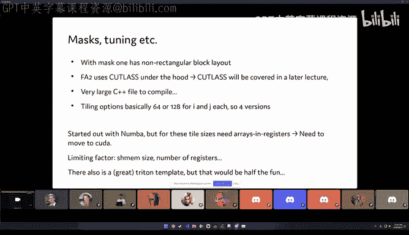

That from tried to implement things more from scratch。

And。好啊。I can。 I can show you like how far it got。 and maybe it's also neat to。To look at。

The differences of implementing this in number versus implementing it in。In。In could directly。

 So what I did is I took the flash attention forward pass pseudocode。

 and I'll just point out some things。 It obviously is an。Aful lot of notation。 but I by the way。

 I'm running this in a lightning studio and I need to do some advertisement for that because I'm now working for them and obviously I love it a lot too。

 because you can just show someone run this thing that I set up for you instead of installing things。

But okay， the advertisement aside。I just took took the F attention pseudocode and it will tell you to load tiles from HBM。

D Ram to the unchpped shared memory。It will initialize like the outputs and the intermediate maximum values for the online softftmax。

It has the outer tile loop pair that I presented on this slide earlier， it has the inner tiling loop。

There it loads K and V。It computes this L matrix called L for logs。They call it S。

And then they compute the online lines of Macs。And there。是。

Output from that that is just here very quickly。 And because the output calculation and the softmax online softmax is。

In this contraction axis， I mentioned it several times that it's the same axis because that is on the same axis。

 They need to update the intermediate outputs with the same softmax adjustment trick。嗯。

And so this is here， the softm。 And then at the end， you normalize with the。

Deenominator from the soft Max， because this was always computed with the only the numerator multiplied。

And then you also save the softm here for the backwork， which， which I didn't talk about。

 And so the first thing I did here was I just took some sample sizes。

And I implemented just literally， the same algorithm。And if you look at it it。系。Looks。

Not that terrible。嗯。Not great， but not that terrible。 And I。

Tried to name like the blocks similar to what they were before。We can run this。

 and we can compare it。And now that I'm still doing this for a single attention head。

But I can compare it to the Pyth implementation。And that will just work and it will yield the same value。

Up to numerical America stability so so actually tells where you going on。

 like one thing I'm curious about， like given that you wrote the kernel and pure Piytorch。

I would be very， very curious to see what the Trident kernel would look like for that after torch compile。

So if you could merge this code in our lectures repo。

 I can take a look at that and I'm if other people in the group are also interested。

 I think that would be pretty I will definitely merge the code into the repo。So I would expect。

 and that is something that has been mentioned on the on the channel a couple of times， too。

 that like the automatic fusion that compilers provide helps with the。Helps with the memory。

Bound things， but not the more elaborate compute bound things。

 And I think this is like too complex for dynamo to recover the。The F attention kernelel。

 if that's what you have in mind。But so it gives me kind of a reference implementation and in particular I can like lots of write intermediate results and things。

And for me， that's kind of。I don't know。 I'm a mathematician， but for this kind of exercise。

 Id like to have running code in Python as Italy it's possible。 And so that。Was this。

 And then the next step for me was try to translate that into a。Numbba kernel。

And I don't think we've seen number too much here on the kuda mode。

 but I think it's actually a very a very neat thing because it essentially gives you almost all of the power of Kuda with the very much the Kuda semantics in a Python style language and it also has like a very rapid turnaround time because it doesn't compile through C++。

嗯。And so。What I did here is I allocated all these things in shared memory。😊。

And this is where I couldn't match the tileal sizes because one thing is I'm using 32 bit D type。

 so I'm trying this on 32 bit。But also， well， it says the。Sutocode says that K， Q and V。

Should be loaded into shared memory。 It doesn't say anything about these things。

 going into shared memory。And so， they likely don't。And I'll show you a bit about that， too。

 And so there are bugs in this kernel， unfortunately。

But for my pinknky little pes gaze and your call this kernel， you just decorate it with N Kudajiit。

And then you can write ka。 like， this is the thread I Here are declarations for shared memory。

 and then I can just loop over ranges。And it looks like code I've written in Python。嗯。

So I can run this by specifying here block size， and I'm just using a one element grid because I'm only doing one block here。

And you just pass， you can just pass the tensors and this is made possible by magic。

 and this magic is like the kuda array interface。Pytoch supports and that Nmba supports and that allows you to just call Numbba kernels with Pytoch tensors。

 which wasn't the case in 1917。 and so I'm just incredibly happy that this inter works all works now。

And so we can run it。 and we can see that。 yeah， there is。In America difference， but other than that。

 it computed the same for this small example。嗯。But so I mentioned that these should not be shared memory。

 And， in fact， from what I can see in the， in the code for flash attention。

 they should be in the registers。 But so the convention is that if you access an array。

With dynamic indices， then you need to like lay it out as an array。

 But if you declare a local array and it's constant size and you don't access it through and you just access it through like plain vanilla indices like full loop indices。

Then Kuda will allocate those into registers。And so this is what I tried to do here。

 like allocate low chunks of O。And I don't think I got that exactly right yet。But basically。

 you can now expand the。So I expanded the Python version to the number version。

 which still was like a little bit more compact than this。

And so the crucial thing here is to get all the full loops right。

 And half of the time I'm hunting down where I like had the wrong looping variable here and or the wrong condition here that didn't match the looping variable and then the kernel would either hit an illegal memory access or。

Or just run forever。But so I translated on the numbermbar code into C+ plus code。

 which also is not that。Deep， but I also rearranged it a bit in order to facilitate。

Having O in the registers。 And this is something that you should really think about。 And to me。

 it's just incredible。 You have like a 48 K of shared memory。 So if you run the fold block sizes。

 this will be used up by Q， K and V。😊，mAnd。I'm still having shared S here。嗯。

so the outputs are allocated in the registers， and this is possible because we actually have a sizable register file on the streaming multiple processor。

 It has 16 k。Right。 single precision registers。And so we can actually locate a lot of registers here。

So it's， I think it's 200 something registers per thread are。That can be allocated。

 And so that's what we do。 And in order to compileel this program， obviously， we saw a lot。

Like running， doing a pythtor extension for that and。Obviously that gets old after a while。

 so I try to think about whether we can also use a new thing from Nvidia called Kuda Python Kuda。

 and they provide bindings for NVrTC， which is the runtime compiler。

And the interface is a little bit yeah elaborate。😊。

But you can compile the sca code to a kernel in line。

And then the calling convention is a little bit worse than you would expect。 and in fact。

 the official tutorial， which I've linked here。It says the following code example is not intuitive and subject to change in the future release。

 And so what happens is that you need to have。Memory allocated for your various arguments that you want to pass to the kernel。

 remember that we said that that would be allocated in constant memory。

 And so what we need to do here is we need to allocate tensors on the CPU that have the right B type that matches our argument B types。

And we pass pointers to those。To the kernels。And for the。For the arrays。

 the tensors we want to pass in， those are coa tensors that we have。

 We allocate a 64 B integer that holds the pointer to the underlying storage。 So the data pointer。

Then we have pointers to all these arguments in these three tens。😊。

And those are the things we pass to the Ka launch kernel function。But through a miracle。

 it all works。And yeah， except when it doesn't work and it will work better when I start the code。

So thankfully， this compels really， really fast。And so， with any bit of luck。I'm getting， yeah。

OhIt shows like numerical differences only that is when I run only part of the cells。

 but you also see that I'm considerably slower， even on this trivial example I'm considerably slower than the built in scale dot product attention。

Which is something to work on and I was' even slower。

 I had like a 10 times factor before I moved the outputs from shared memory to registers that sped up things lot。

But you have to be careful to not spell registers。嗯。And so， this is。

This is how you use Kuda Python if you want to run kernels directly and I want to Thomas a quick question so like you talked a lot about like register spilling but at least like I mean even from my perspective like when you're programming a kuda kernel like you really just control shared memory like you never explicitly say。

 hey， like don't use more than this many registers so I was curious as you were writing this kernel how are you going about detecting whether you had a risk of register spillover or not。

Yeah， so actually you would look at the kernel afterwards and so one thing I did is that I just pasted it into。

😊，Into the。Into the godbalt。In order to see what's going on。

 and the next thing will be to run it through the NCU profiler。And you will get alerts about that。

 but obviously here with the amount of registers that we allocate here， that will be very。

 we try to really allocate as many registers as we can。But obviously。

 there's a limit of 255 with red or salt。So interesting so maybe I'll from now reserve my first question for the Q& A。

 you don't have to do it now， but like I'd be really curious as to how you detect spillover looking at PTX and Godbolt。

 but I'll just let you finish your presentation and we can get back to that point later。嗯。Quion。

 I think there's a， there's a warning flag about that。 I would probably need to， need to check again。

 So when I， when I wrote the CC loss kernelel， the register use was huge， too。

 It was had like 50 registers。P thread。 And then if you have like a large block size， that is really。

 really a limiting vector。But okay， so we will have to look at that。

 one thing I wanted to show you also because I'm so immensely proud of it。😊。

So as you might have heard， we launched Thunder at GTC。 and so I want to plug this as a neat way to。

Include your kernel into a model。 Thunder is a source to source compiler for PyWch。

So what we do is we take。Pytoch functions or Pytoch models。 and we just call thunder grid similar to。

Other Jits and then you can just run the digit function with the same things and here just for testing。

 I took a trivial function but you could also have like a neural network model that includes this。嗯。

And so the neat thing is that we can now say， well， we have implemented our kernel here。

 our custom one。We can register this as an operator。

With Th by providing like an implementation that does the actual thing on tensors and here a little met function that just tells you what kind of shapes are returned from the thing that I call with certain inputs。

And if I do that， I can then say， well， yeah are now my super awesome new。😊。

Tension colonel th is not quite faster than the standard one yet。

That can replace the torch scale do product attention kernel。

 and I can provide a function that kind of does the replacement。

 which is this transform function and it has the same signature as P torch standard attention。

And it just calls my new attention operator that I registered here above。

And then you get a checker function where you can actually provide conditions which you want to have in order for your replacement to be used。

 for example， I didn't implement causal or attention masks or dropout yet。

And so whenever that happens， I just return faults， I don't implement multiple heads。

 multiple batch size yet， so I'm dropping out for that too。And then if I register this。

And I just run it， it will automatically replace this call to that product attention with my attention。

 but if I do something that is not applicable， then it'll just run the standard by touch thing。So。

Once you have your super optimized kernels。Which obviously you will produce lots of optimized kernels after other lectures and hopefully my kernel above will get a revision to。

But so you can， you can plug these into your model in order to like do comparisons。really easy to。

So this is kind of the thing I wanted to tell you about thunder。

 thunderh is also kind of the reason why the preparation time。呃嗯。I was a little bit short。

 I hope you kind of have an initial feel like。How flesh attention goes about doing it。And I hope to。

I will send this version of the attention， but I hope to have a little bit more sophisticated one。

 too。With a little bit more time。So this is what I wanted to show you and it's about time that I finished talking to。

If you have questions， comments。Go ahead。 Thank you， Thomas， this was fantastic。 Like I。

 I actually like one highlight for me was。😊，Like that you showed like basically you're like okay。

 I'm gonna take a stab at writing like a flash attention kernel。

 and here's like the diff between like my kernel versus like the actual sort of production one。

 But I also think it's such an informative exercise to go over and try to get that gap to be as small as possible because like I would imagine that there's sort of like a lot of lowhan fruit and then some techniques might be hard。

 And that's fine。 know， we don't include them。 but just having like this sort of very educational yet performant kernel that people can just step through a debugger profile and see you。

 Look at the PTX is just I think gonna be very， very helpful for the community。

 So thank you so much for that folks， please please give Thomas like a giant round of applause like emojis。

😊，And yeah， like Thomas said， know we， we can start going over questions as well if anyone has them in the audience。

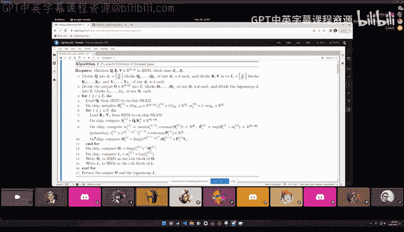

Al right， sweet， I guess like Thomas， while people are waiting for questions。

 I was like really curious to revisit the register spillover question。Like from yeah。呃。

We have other questions that we can do first。 Yeah， I。 Yeah， there there's already one question Like。

 are you replacing at the E level or the refs level。I think that's like。

So what Thunder does is it provides similar to what I did here with the register operator。呃。

Not to this one。It does provide operators for the Py functions。

 So it's very similar to the agent level， but not necessarily。So you could tell also。

 if you have like。And say here， this replace us。Then you can say some。

 some other function that it will replace。 And so Thunder has actually a Python interpreter built in that will redirect all calls into Pythto to do the recording in this thunder。

Under tracece， I showed you a glimpse。And so the idea is that all our intermediate representation is。

Like a Python code too， and you could actually copy paste that Python function and run it。嗯。

This is kind of what we tried to do here is have something that's easy to use， you just run Thragit。

That's easy to understand。 And this is the last trace here that you get Python programs for all the transforms。

 And if you look at like earlier ones here。In this list of traces。

You see that this is like the initial recording where it says L toH scale dot product attention。

And then we wanted it to be really easily extensible， and this is why I had to show that to you too。

 because yeah， we think it's pretty。Okay， so the register billing。So the thing， yeah。

 now I have the got bolt on the other computer， but。it is forkua。And if I。But in my。No。

And so you can see the number of registers。生where。I have to see if I can。咩。嗯そ not。It都是那。Really bad。

Os。And so。嗯。ペース？Good呢。Yeah， I should never do。Do these things live， because。I'm sorry。

 I know I put you on the spot， but like I was just really curious。 And， you know。

 we can always like revisit it like in the repo later if it's the hard。 I mean， yeah。

 the official answer will be in the repo。But so I think there is a。Pillor flag。Yes。

 so there will be thanks。 I will or I will or maybe I get Luca on board。

 but I will gladly also present thunderh here， of course， if there's interest。😊，The。

 the GTC lecture will be publicly available， but they have a kind of a delay。

But there will be something。嗯。Okay， so in the compiler Explorer。

I always have to check if it's still on， it is。in the compiler Explorr， you have。

You can see like you don't see maybe the reuse。 But so the number of registers here goes。Wway up。

And obviously， one of the things that I should be doing is that I set the launch bones bones。

For this kernel， because。It goes like all the way to 243 registers。

And so I check that at 6 and K registers。 if I have a maximum， if I have。I don't know。呃呃。If I have。

64 times，64 threads。呃。should be。I should to have。Like。乜你佢。Yeah， I don't know。It there。

 there is a compiler flag where I can see it in the output。If it doesn't show it anyways。So here。

 it doesn't show it。Oh， Thomas， I think it's all good。

 Like I can just like could visit this like offline with you。 But yeah， like it's I I。😊。

I have a I think there is a compiler flag that will tell you how many registers it used。

And so that will give you the info。 and I'll include it in the。In the notebook。 So yeah， thank you。

Alright， folks， we'll give like， maybe， okay， that you have another question。

So as I understand it in flash attention， we use QKV that are computed from input tokens by matrix multiplications。

 would it make sense to fuse these multiplications into a single kernel as well or won't they all fit into the same registers？

Very limits of what can what you can do in terms of using。Materializing intermediate。Here。

 what people do is that they mud molds into one。And that helps a bit too， but no， you can't。I mean。

 obviously， at some point you're at this what's the name of the company G that had like the thing where they have the entire model in shared memory or the equivalent。

嗯。But yeah， yeah I think for， for flash attention， you can。

Mge more into the kernel just because you you have exhausted your resources。So， so actually， yeah。

 like， I mean， like fusing the Q KV projections from the input matrix is a very common trick。

I will say like one there's been kind of one interesting research trend around like what are called like persistent kernels。

 which is you essentially add like a single ka kernel that represents an entire neural network。

 and it's persistent in that you feed it like different batches and then the kernel will just do the whole thing。

 There is like I think some work around graph Yeah。

 like like there's some work that some of the Intel GPU teams have been doing around this where they have a single kernel for an entire multilayer perceptron。

 It's an interesting research direction。 And I think the constraint is register as spillover。

 but that's a very shallow answer。 And I do expect people to produce more of these kinds of mega kernels in the near future。

I just don't know enough to say why they're not as widespread as I think they are。All right。

 so I don't see any more questions in chat。So yeah。

 let's just give like another round of like a applause and thank you to Thomas。

 The lecture next week will be Andreas who gonna be talking about ring attention。

 So it's a very natural extension of the stock but to scale to infinite sequence length。

 and Ands and Ands and a bunch of folks on Discord haveve been working on like basically a working group trying to reimplement like flash Engine。

 I think I'm personally very excited to learn more about that。 And yeah， and thanks again。

 Thomas this is fantastic。😊，Yeah， I am looking forward to the pro part。😊，From under to。

So see you all next week。 and thanks for joining this week。

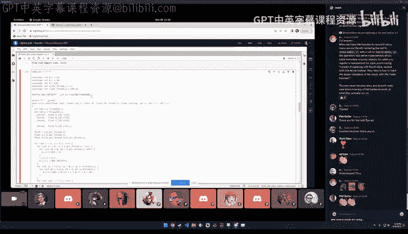