# GPU MODE《CUDA、GPU编程1-53课｜GPU MODE》中英字幕（deepseek-v3.2 - P13：-20240407-Lecture 13_ Ring Attention.zh_en - GPT中英字幕课程资源 - BV1QZ421N7pT

We can get started address do you want me to introduce your or do you want to introduce yourself like tradition？

Yeah， so hi， I'm Andreas。 I'm also here one of the co-fos of the Qa mode Discor server。

 I'm a software developer currently working as an AI AI engineer at the German startup AlF Alpha。

 I also working on large language models and inference and yeah。😊，Some history， also with torch， and。

Deepbling in general and open source work always a pleasure to。

 to be in this position here and also to see this the our like universe of Q demo modes strive and prosper。

 yeah。😊，So， yeah， today， I'm really excited to present about ring attention， which。😊，Yeah。

 caught my attention some like like weeks or months ago。 And it， I think。

 like a really hot topic right now， since we are getting into longer context model。

 So I call this presentation you bring attention sequence parallel attention across devices that you will see today we deal with a topic。

 which is more on a higher level， that means across devices distributed。

 So we have Nvidia nickel would be involved more than the， And， of course。

 like also the individual GPUs are utilized。 But this is like now。

 how we can orchestrate a larger amount of of different GPus。😊。

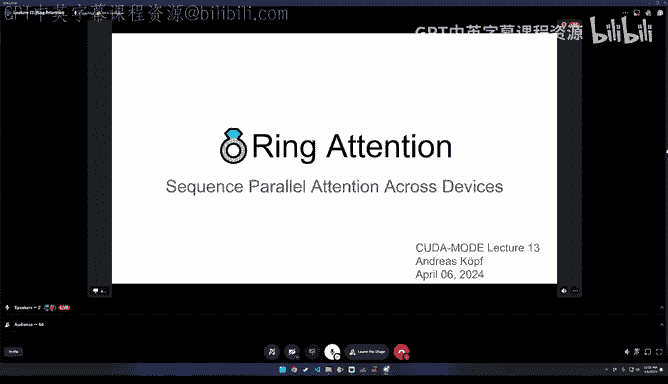

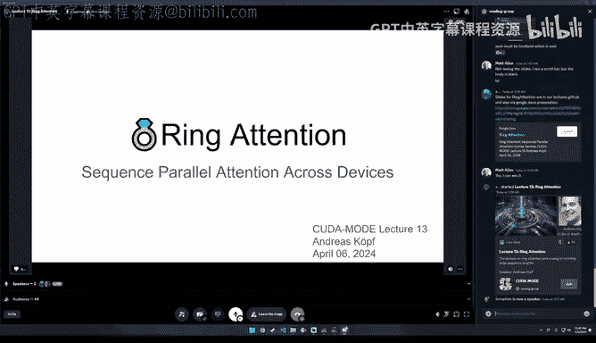

So yeah quick overview what we want to cover want to cover today is first like motivation。

 what's long context transformers and the applications。

 then do a little bit of recap for vanilla attention， online softs and lock some X tricks， so to say。

 which is the basis for plus attention and also ring attention and then dive a little bit into striped attention。

Well see what this is。 And flash decoding These things are very closely related to ring attention。

 So if we start with yeah， long context， L L Ms， probably everyone has。

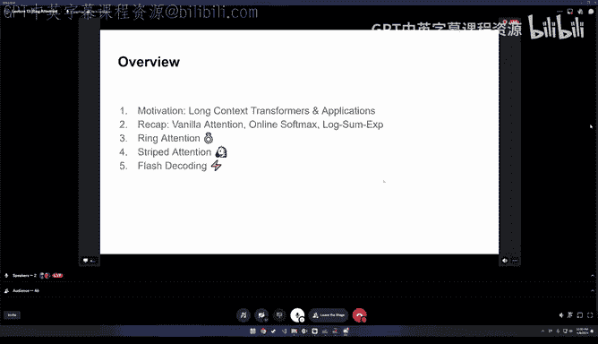

By now seeing things like Gemini， which like officially have this 1 million token context size。

 and in research， they say they have up to 10 million tokens。😊。

Wwhich is now something which allow us say completely different things to what we have had before。

 we can process multimodal inputs of videos and audios and we can like extreme large text documents and also source code。

 of course。And this overview chart we see little bit is like from the Google block。😊。

Po release of Geermini。 we see a little bit。 I edit some of the other open source models which we have currently we have here。

 especially the the large。LB Mo stuff， which is from the authors also of the ring attention paper Bel。

 which is also in this 1 million range。We have yan Mitro。

 which is in the 128k range so on the same as G4 tubo and DBX and in the 32k and the rock from X AI from yeah in this 8k range and in the middle here somewhere like MPT with this like alibi linear by attention is a little bit different like for the position encoding than the others do probably but here also in this middle of 65K So we see there somewhat's available and it's yeah especially it's like dramatically increasing in size if we remember from where where we were coming coming and this long context。

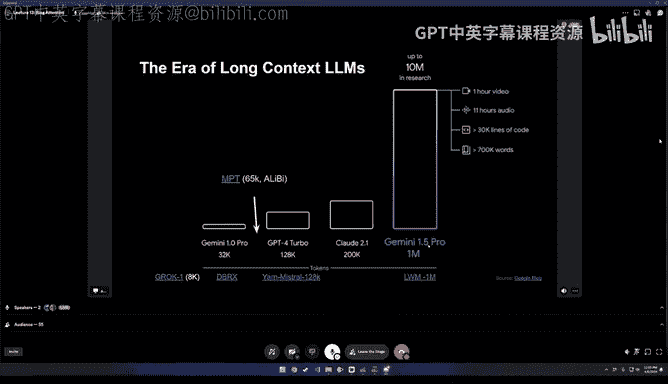

Models， they now allow a lot of new really cool stuff to do。

 So this is an example here from this large word models LWM。

AMo where we see here is like a I think this is some， some form of YouTube video。

 which is which contains many other like YouTube videos and there's one hour。

 And there's like a question video question answering set up here。

The user asks for this one hour video how many lemons were in the person's car。

 and we see like's like all the other ones， they fail to it。 And in this case。

 at least AWM can answer it correctly with there are three lemons in the person's car。

 And we see here this frame， I guess this is referring to this frame。

 and it's working in the paper like admit that it like a little bit cherry picked and in some situations it doesn't doesn't work as well as in this example。

 But yeah overall， I think this like is very promising direction。

 And we will have to see what comes out of it when it's commercialized。

 So in general we know we can process like books， long documents， web content， chat histories。

 code basis like really complete Github repositories， high resolution images。

 And then we go into this more interesting category like audio recordings and videos。

And especially videos together with text descriptions。

 they some sort little bit compliment if you think about like modeling the word around us like not everything can be perfectly captured by text descriptions so sometimes it's just like especially causal events and how things like like very every day things which are most of the time not describe like that things just fall down that there is gravity and stuff from a video you immediately see how a word acts and yeah these models but just become with long contents better in predicting the future and they were also modeling our word and hopefully is like they become better general as like simulators of our word which we can ask questions and also planned into the future。

So a little bit in the background address this third quick question。

 are you familiar like for Claude and for Gemini and for G4 presumably like none of them have published any details regarding how they actually support long sort of like if you're to speculate sorry I know speculation is not very would you speculated that it's something to ring attention or you have some sense of what they might be using so that's a very good question。

 and also think they should be set to like as a disclaimer overall this presentation。

 I don't know exactly what these commercial implementations use and in some some way I also doubt that it's ring attention at least for this very high like 10 million and so on contact links because inference is so expensive if it's like really done in this way for ring attention I'm not really sure about this it could be and it's like the closest we currently。

PIn in， in research。 and they show that it's also feasible to do this into some， some extent。

 But it's like， like I don't know what the cost will be for this like 10 million if it's like really released as a commercial product。

 but it will be substantial。Yeah， maybe we can later talk a little bit about the cost of training which then the。

W paper， there were some some interesting comments that， for example。

 takes like seven minutes for one gradient step。 And like in a 1 million token training set up so you can have like 200 steps per day of course。

 like ridiculously and you have to then first train on smaller smaller context size and then you can scale up and only do a little bit of steps。

 but we come to this maybe if you look at this with the background of this multimodal things work and everything can be process by transformers you maybe like oh no this little diagram here we have like things go into the transformer we have like this multi headed attention and then feet forward network and this like n layers And the question how can we get everything in these token and embeddings which I can process by transformers。

There are different ways， of course， like vision transformers。

 You may know of we have where basically the direct linear projections of the input images into the token dimension。

 And here's like more general the lava case would say that we have like vision encoder。 we take。

 for example， an image and some are converted into like some like tokens for this image。

 And then we have other language que here where we embed the the language tokens and basically can make a question and generate autoregressively than the answer here。

 And the similar thing can also be done for like， of course， videos， not only single images。

 If we have like really long context， you can use， for example，Q again。

As an encoder So this takes in this WM model， it takes 256 times 256 input images and converts them into 144 tokens each。

 And then you can basically stuff in a lot of these images， generate them from。

A video and also do length text token prediction basically and either complete to describe and caption this image or to ask a question。

 depending on what was also trained in the model。What they all have in common that they have this auto regressive transformer here。

 And this is like the same basically setup and like overall broad architecture that we have for lava or that we for lava in general or for。

This LWM， the only thing that we need is， of course， if we want to input a complete video here。

 we need an extreme large context size so that we can really process a lot of like put input a lot of different frames and then make our question about this。

 But this really allows us to do text image video individual inputs or video to text。

 text to video image text and text image way or different combinations。

 we can also generate with things for example， in their paper。

 they have class classify a free guidance as a technique where the auto can steer basically the auto regressive generation。

 and thereby also produce images as not only text。😊，So this is as an overview。

The challenge that we have if we want to go this really long context is we run out of memory quickly at least at some point。

 so here directly quote from the ring attention paper is for the batch size of one processing a 100 million tokens requires over  1000 gigabytes of memory for modest model with a hidden size of124 and yeah this is like obviously still a little small model and we have to realize that for attention to work we have to materialize the input of the attention we can like underfly compute the inner things the score matrix。

We can online compute the soft Max， as we will see。

 but we need to somehow store the inputs and the outputs and also the lockof the lock sum X and the the different。

 like the gradients for the output， of course， for the backboard pass。

And if you look at current high end， really high end GPUs， we have this NVDdia H 200。

 which is 141 gigabys I went with memory and with the AMDMI 300 x with 192 gigabys is a little bit more it's a very good device of course for inference and then upcoming here announced a couple of days ago。

 the NVDdia GB2。😊，Of。Do can we use multiple devices to process these things？

And they are like different approaches to。😊，some years ago。

 there were lymph format and theres linear attention。

 and there are different spas and window attention techniques and so on like this。 would I the A。

 Then we have B rack and vectors with approximate nearest neighbor search and something locally sensitive fashioning。

 So these are also， of course， possibilities to do what we discuss we discuss today with ring attention is just like brute force compute。

 So we don't do anything about the quadratic scaling。

 We just compute what's necessary and do all the operations we luckily can little bit do something about the memory。

 so that we don't have quadratic scaling and memory。😊，But yeah。

 it's still like the brute force method of really computing all attention scores。Yes。

 so if we look at vanilla attention as the basis， maybe only of you know or most of you， know。

 we basically have like two metrics multiplications in that's like this query times the transposed keys。

Which gives us the attention scores and they are passed through a softm function and what we get then as like individual rows in this attention metrics basically that comes out on is the probabilities that each of the values should be used and then we can basically multiply this with the values to predict then one output per query So this is also important like even in vanilla attention。

 we have this opportunity to split the computation so that we could theoretically produce compute each outputs that meets for each query input individually。

 don't like these tokens don't somehow depend on other things。

 So every query can be processed in theory and individually。Normally it's done in a whole batch。

 of course， for like efficiency reasons。 But if you want to like minimize memories also here in vanilla little attention。

 you could do this split at the the queries。 problem is here， we have this quaratic attention。

 which is like sequence length， times sequence length in size。 and probably we all yeah。

 maybe you already have this concept。 This is like the big problem。 We have this quaratic scaling。

 This will kill us at some point。 And therefore we need to do something about this。 And yeah。

 I want to show something that I found in the ring attention paper and the appendix。

 which was a little bit surprising to me。 I would say。

 and that's actually that the the ratio of flops that are necessary to train a given data set。

With different context lengths， so we see here in this context length axis we have basically it says as a basis it takes a4k context size as this would be 1。

1。0 as a ratio and then here we see the scaling side 2 x4 x8 x and so on and here also the resulting context lengths that we have in the then as the context lengths from 8k to 128k and here to 10 million。

context length。 And on the other axis here， we see the model size。

And here in all these fields you see know what's basically the ratio is and if this formula which they present which should be representative for the attention mechanism。

 I guess with a feet forward what layer is 24 sequence length times hidden size squared plus four times sequence length squared times hidden size if this is like really a valid formula which they present then you really get up get these values I was very surprised the computation myself in X and I can confirm that these values are correct so that means if you take something like a 65 Bs and I get like a large Lama which we currently' have and just would train it instead of defaultge。

Context length with， for example，256 k context length we would only need， quote words only 5。

8 times the compute that was necessary to generate the original motor And this is like quite surprising because the context length is already 65 times larger than it was in the beginning and yeah。

 some part of the answers， of course， that you need in total。

 like less batches because each batch now would process 256 k like each sequence instead of 4 k。

 for example。But you can also make the math and also maybe upload my exit sheet。

 which I did for this if you want to do it you say like surprising is that for a larger models where like GT 3。

5 maybe 175 parameters its already getting smaller at some point of course this protic skating kits you so if you get in the really long things here it we will just be killed by the periodtic skating but it was me surprising because it is like really like it's like feasible much longer than I thought initially。

😊，Okay， so then if we go into a little bit into the details about what we want to do with ring attention。

 also do it with flash attention。Is is the softm function here。

 You see the softmax function basically does this explanation that E to the power of x for each element and divides here by the sum of all these things and the challenge is that this computation basically to produce an output value or given X I here it's input we need to know the full denominator。

 the full sum of all these things。Well the pull sum over the row in this score matrix。

 which we get here。And this is like a little bit of a problem because we want to compute this blockwise。

 And yeah， in， in fresh attention on drink attention， we need to do do this blockwise。

 And we now see we will look a little bit into how this is done。

 But this like has to deal with basic parts of this sum in the denominator。

And I want to go to this like step by step also a little bit with torch I have also a Python notebook。

 which you can maybe check online I'll link to this later。

 So maybe we start a little bit by a very naive softmax function。

 So just to convert this formula here into Python we see that we have this X element wise call on this and then divide it by actually the same and it's sum。

So this gives us the softmax。 we can confirm this。 Wed like generate 10 random numbers call the normal softmax function from towards the native one and then our naE1 and basically test if all close and we see basically from the output they are it's like identical from the computation So we are good at least this range of parameters slight problem with our naive function is it's very unstable。

 So if we for example， scale the input here this random like normally distributed random numbers by 100 we already with something which is like obviously like not desirable what we want we have this nonvalue and we maybe see later we see later how this can be fixed but let's for look into the blockwise computation。

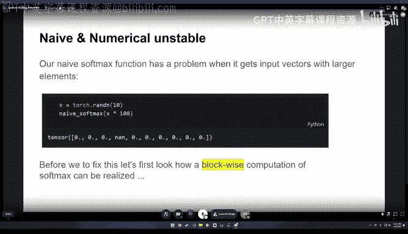

Just is the warning that naif1 can't be used directly。

 So our goal is basically to break the softboxs into chunks here。

 and we can just look what we what we want to do。 We have this this random number。

 and we would like X。 and we now split it into two equally sized chunks， x 1 at x2。

 And for each of these chunks， we compute the naive softboxs function。😊。

So we can print what we get from this one。 And what we actually want later is to somehow combine these again。

Into the target。 So that means the the soft max of the full x for the full 10 values we have only like for our blocks。

 we only see in the individual blocks， these five log log for， which we then compute the soft mark。

 So the it's like easy to do the splitting here， The questions now， Okay。

 how can I get my target back again。 And like a simple trick to do this is a little bit to undo what we did in in the naive soft marks or softms in general。

😊。

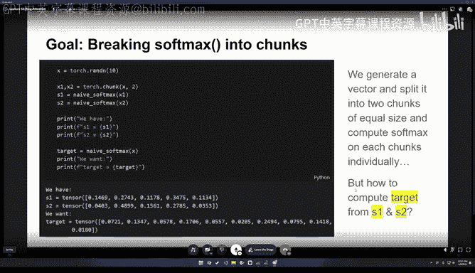

We can see that this is here divided by this Xx。 sum， so this is like a sum x component。

And in in order to just basically compute， what the naive Som function would have computed for the full tensor is we can basically now like multiply again back with this value。

 which we see here， basically this like some X as instance for some X P。 And yeah， if we。

 if we have access to the values in this case。 which would like naively assume then we could compute this values again。

 we could。And then scale basically it back so that we would undo this an normalization here from the softm and corrected by the correct full some X。

 which we would get from like combining both together。 And if we do this for do for both here。

 like as one corrected as two corrected， we can see if we can get this two tensors together。

 we arrive at the same。😊，Value as the as the original like target here， which we had before。

 And we get a local value of true， which was course is good。 But in this case。

 we still need access to the values。 So it's like little bit point。 That's just just be a little bit。

 You would see where this leads to。 So we can now do this also in in a more numerically stable way。

And so here again， we make like a setup with an X we like 20 random。

 normally distributed random numbers。 We compute our like a value， which is like our test target。

 which we want us to get with our function。 And we split this here again here in two chunks to simulate。

Our blocks that we have。 and now we define a little bit different softmax functions。

 So it's no longer naive。 In this case， we do a stable softm。great thing about softms is that it's。😊。

S imvariant。 that means a shift invariance。 Sorry， sorry。

 that means we can add or subtract any value from the individual things unless it's like the same constant that we would at or。

S subtract， which you can basically see from if you look at at the softbox function。

 this addition ends up basically as a factor which is in the nominator and in the denominator so it basically cancels out and that's basically the effect that we can use to shift our input into more easily process range in thereby for example。

 by taking here the maximum of the inputs and subtracting the maximum then from all values that means。

Basically all values are smaller than zero in this case here。

 and that means they are all smaller than one for after they e to the power of x for this element。

And this， like much easier and better for us to handle。 And we can then also。

 if we would now pass over。Input that we had got this nu into this new function。

 we would get a reasonable output and the same output as the official Pytoch function。

 and another thing that we also can do is we can directly return this thing which we on the other slide basically computed externally again。

 we can also directly return here， this some X and in the case for us to have like a little bit more stable thing and to little bit nicer in the value range we can return it in not exponentialplaned again this not E to the power of way。

 but in a logithmic log space and get this value basically here we need to correct for the maximum which we have subtracted。

But basically this gives us the same option that we can like if we would take this exponential it again。

 we could then get basically the original denominator that would be produced by summing up all the exponentiald videos from the X element inputs and here we can now do this the same combination of things which we saw on the previous slide in like a little bit more stable way。

You can see here that here this is basically the naive way to do it written and C1 equals B1 times like we un do the normalization。

 then we have here basically the total os， sorry。The total normalization denominator and divide by this。

 and thereby we get the correct value for the first slice and can do also this for the second slice。

 But the the thing is we can take this formula here。

 which is like basically would be like a divided by a plus B。 So a is here and a plus B。

 and we can like write is a little bit different And one divided by。

In brackets 1 plus B divided by by a。 and this busy can do can be done then completely in lock space so that we don't have to do to really materialize this exponation here。

 But we can yeah， do this by by subtract subtraction。 And this， of course。

 like much neitherr from the value ranges and much more stable。

But a computer is basically the same output。 And yeah。

 thereby we can get here if we do the same thing with A and P。 So a was our original os。Our original。

 sorry。Good I get back。So a was our original softmarks output and B。

 I know what we computed here about this formula And if you to the comparison with our clothes we get through。

 So this is really nice on the question now。 Okay， what does this。

why do would do I tell you ask the the thing is that this like direct formulas that you see。

 see here also appear in the ring attention code directly。

 which we will talk a little bit later about ring attention。 So just like a peek into the future。

 You see we have this update out at LSE lock some X function here。

In the original ring attention code and here and these two lines。

 they basically are the same which we saw on the previous slide where we combine two different blocks together with help of this lock sum X and produce an updated out value。

 The thing is that this cannot what we saw before for directly on the probabilities so the output of the soft block function can also be done for value projections and also for accumulated value projections which are effectively linear and this is the trick which is used by flash tension is also used by ring attention to allow that we can split things into individual blocks and compute them。

Then accumulate basically the different things and always correcting for the factor that the new block gave us for the increase in the denominator so that we can then scale it what we had have so far a little bit add our new output to it and we get the correct value in the end so this really magic here。

If it， yeah， I found this nice animation， which is， I think。

 I'm not sure if it was designed for for this， but it actually exactly showing but。

 what we need to see， so。😊，Yeah， for example， you can see let me first stop this little and。

Talk a little bit about the graphics so you see this and at the left youll see basically the queries which go in and in the horizontal axis we have the keys here。

 we have here the outputs which are produced by our soft Max function and here the values which goes like for every key we have one value and for。

Basically， every query input we produce one output。 If this is like complete self attention。

 everything will be the same。 So we will， we have the same number of queries as keys as values。

 but keys and values are always the same。 And queries could be like for cross attention， for example。

 something different。But we have here， if we can now take like a like a smaller batch。

 like a split this into a little number of queries and then process it first with like a section of the keys。

 which we see， for example， here。 then compute our soft marks only for this individual block。

 and for this have like an in intermediate output here and the output。

 then the next I take basically the next block here。And like compute again。

 my softm here compute again the projection with the values。

 and I need now to somehow combine what I had before and the outputs with like the new output for my block here。

 and this is exactly done what we have seen in the way that we have seen before where I take the existing thing I have the I need this additional log sum information for this to work in order to scale this back to like basically see the difference in that it would have has to have scale this a little bit and can then add and accumulate over time。

 So I really can to the softm computation and the value projection in in an online in in an iterative yeah where I don't need the full materialized score metrics under the materialized softmax and also not。

Yeah， basically all the other values advance。 I can compute them in a blockwise fashion and then always update。

 In the end， I will get the exact same result as I would have in the。Yeah。

 in the E way where had like fully， fully。Materialized this matrix。 So the business cycle， the。

 the basics of the basis of， I mean。Like so this directly， we can see this。

Update out in LS E function， which I showed two sites before is directly called in the ring attention code in the magnetic open source implementation of ring attention。

 which is really nice。 and I can recommend。 And this the great thing about this is that ring attention you can think of as a hierarchical like highest version of flash attention。

 which runs on the device level while on the individual devices they're actually runs then flash attention as the with the same similar algorithm just like splitting blocks inside this device and not over the devices。

 which ring attention does as we've seen in a couple of minutes so。😊，Yeah， here。 you see。

 basically look， we have flash attention。 How this is unfortunatelys not the direct API function from flash attention。

 It's from the treedao repository， but it's an internal function because normally this lock sum X is not directly returned。

 but we can directly use this function and then get this long this block lock sum X where you。😊。

And the block output and then integrate it basically combine it with the existing output that we have。

With this update， we also see here some communication already。 we， we come to this in a minute。

 just you see that like like this is actual implementation of how the ring attention algorithm works can recommend like L ring fresh attention repository if you want。

😊，So now we have like， really looked into the details in our details of this。Rringing attention。

 So let's look what's， what's actually bring attention。 So， therefore， I would。

First I like to talk a little bit about sequence parallelism， so they are different。

 as you may know for distributed training they are different parallelism forms。

 so for example have data parallelism where we just take like different batches or data and have the model directly sh it on all of devices and then we have other things like like for example。

 tensor parallelism or pipeline parallelism maybe like pipeline parallelism is pretty simple to understand you have like a large model with like let's say 90 layers or so and then you could would say take like three devices to process this model and 30 layers on the first device。

 30 layers on the second and so on Yeah and we have a new thing which basically is' coming now sequence parallelism and in sequence parallelism we take the sequence here in this case。

 for example the microbets see like this is sequence parallel and the first two tokens of the sequence we would compute process on the first device。

And the last two tokens we would process on the second device， so basically we split。

We have the same model on on both devices， but we， we split the batch in sequence wise。

 So at this in the sequence dimension so that they are like the same s sequences like。

Secs is split and processed on both devices。So， and how to this like like it first in an evening with our attention。

 And now we need to also look into how this can be done in with attention。 So for each。

Of our inputs here for the ice that would be our tokens。

 they would be embedded and from these embeddings， they would then be projected into like very key and value each and I would then have like for the sequence。

 a certain number like the first end for example on the first device the last and then on and the next device depending on like how many device I have I would split this across devices basically。

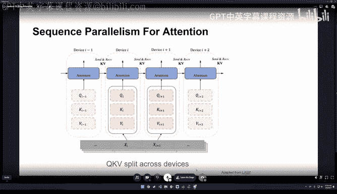

And yeah， the thing and the main concept of ring attention is then that we can also do this blockwise computation on the devices。

the same as fresh tension does it like by splitting across the queries and computing then for queries。

 like every basically like taking certain block of the keys and computing the intermediate output and then taking the next block of the keys and so on this can also be done on the level of multiple devices so we have here。

 for example， this little diagram here set up with four GPUus and we would now split things so that we in the beginning have really like the queries and the keys and various belonging to the first of this first quarter basically the sequences on the first GPU the second quarter on the。

Second GPU， third and so on on the the third and fourth。 And the thing is， of course。

 in order to compute an output。For each query， I need to see all the keys and values。

 at least for let let's assume like not causal must say full attention in the beginning。

 thats the simples of we would assume that we need all keys and value to see all key keys and values and this。

😊，嗯。Yeah， it' it's basically done and for ring attention in the way that these keys and like very stay on the individual devices and the keys and values they are sent around in in a ring fashion。

 So to say this GPs former ring and these keys and value。

 So for some key value pair like one is sent to GP 2。

 while it's like computing its its first update and this update。

 And it's receiving a key video pair 4 from the from the first GPU。

 So keys always to communicate with the next and previous member in the ring。😊。

And the thing to know here， whether why this works or can be done is that the order in which we do these key value chunks is not important for the output so I can take any orderura unless the only thing I need is basically to have seen all key values in the end and of course。

 need to know which things belong together， but as long as I do this， I can direct compute。

The correct output。 So we basically see here the water competitions can be arbitrary that is leveraged by ring attention。

 We， we split the key zipque keys and values across N host。

you see here and then they form a conceptor ring and one pass completes when every node has seen all parts of the key keys and values and the trick now is that we can send and receive why we compute and if the computation is long enough or takes long enough like the sequence is long enough so to say then this is like causing really zero overhead in general because the transfer of the data takes less time than the computation。

 I think in the paper they have an analyze for this and it depends a little bit on the transfer speed that you have。

But approximately like it's， I think 6000 or so something。 it should be amate aortized。 And we yeah。

 maybe you look at the numbers in the paper。 But it some sequence level is basically0 overhead。

 which the communication takes。 is really nice。 can split across the GPUs extend the memories thereby by a factor of number of GPUus and the transfer is for free。

 if you want or like in time。 it doesn't。requirequire more time。

 So what we saw before really in the like real So the link implementation is also as an algorithm in the paper。

 of course， in pseudo code。I can also glance a little bit over that soon。Generally。

 we have this input sequence X and we have the number of hosts。

 which we start with with we split the input sequence into n blocks that so is that each host has one input block。

 we compute the  query key and values and basically then these for each input we haveque and values。

 So for each host has then this of the chunk which is which is safe head at the beginning and then we go all transformal as which we can ignore。

 but then the important part here that we have like we go over n minus-1 steps where we transform and compute。

So each host we have like concurrently， we do basically the attention， which is like， for example。

 fresh attention as it's in the social link flash attention thing。

I'mU the local query key and value blocks and at the same time we send the values and keys to the next and receive also keys and values from the previous host this is in this ringwise fashion done until I've like seen all so this is like n minus one because I of course have in the beginning already like my my local。

It like partss on my my machine。 and then。In the end。

 I can like my my compute my my directly output so that every node basically computes the output for the queries which it it had。

 and then we can later， of course， then combine this again。Yeah， then。I want little。

 for a preparation of， of a striped attention。 Look as the cost masking。

 So this is like cause maybe the simpler aspect here。 But in transformers， and if you have the。

 the score matrix computed。 So for every dot product between the queries and the keys。

you want to ensure for that in order to autoreggressive decoding to be possible that no token attends to something into the which is like in the future or like in a higher sequence position than it has because during decoding we don't have these tokens yet and so it must only depend on what has been already produced in the past。

And this can be done by having our attention， taking the attention mask and ensuring that all these values。

 which are here also above the diagonal that they are zeroed out here in this mask。

 which means before the soft mask that would get a minus infinity。 So normally you see in。

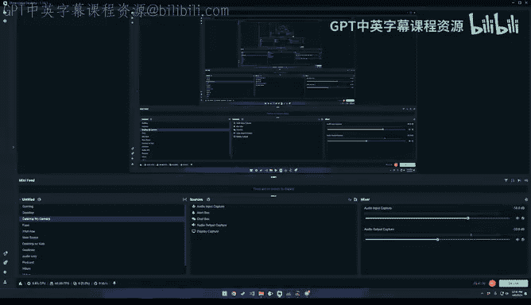

In the soft Maxax so in the in the in the in the dot product intention code that there is like a masked fill where all these values。

 which are should be masked as then replaced by minus infinity before the soft Max is computed。

In like efficient cos， like like fresh tension， for example。

 we don't need to materialize this metrics。 If we just want the standard course or masking。

 we just compute them on the fly， which is like easy just as this formula。

 I see that if this I index is like smaller equal than J， we can take this dot product。 Otherwise。

 we just don't compute it and set it to minus infinity。 And for the whole blocks。

 which we compute like if it this would be a block here， we just could completely skip it。

 So this is， for example， also done by。Efficient implementation。

 I fetch attention to that in reality， it's like almost half only of the computations that we need to do because the others are masked out。

Problem now for ring attention is that this leads， unfortunately if like naively applied to the situation that some nodes will be completely idle and the problem with ring attention is that the slowest like node in in the in the ring like determines the pace in which we can compute。

 So if some things like directly completed because they are idle or they don't have anything to do。

 they they are super fast， while others have a lot of computer do。

 And it can't go to the next step until the last like slowest thing has really completed this computation。

 And this is， as you can see here or this black things they are basically idle while some others are active and in this like third round。

 we only have like the the last。Like GPU is is active and the others would would be island。 This is。

 of course， like undesirable。 and it， of course， takes also longer than than it should be because we。

 we don't evenly distribute the work。 We have not evenly distributed the ques and keys and so on。

 But the work is not effectively distributed。 So we can maybe look at this a little bit。

Clleearer and this this star gumble， I made this ABCD like。To to show where things come from。

 So you see these different causal masking elements here with the different characters and hear from this total causal mask。

 which exists to just understand where these things come from which we see basically this different。

Vertical lines here， which we which they are then materialized by this。 So in the beginning， we have。

 for example， this the hope， the main diagonal。 and then we have these others in this。Yeah， it。

Basically， a problem within Stripe attention addresses。

Maybe just to to to to Lily would go over this year。 We see always the case。

 which which we had before， if the。So I。The right right here。 if， if the eye。

 So the query is smaller than the key index， then we can use this very Otherwise it's like ignore。

 and exactly the same we cannot now see here。 So for all these cases here， we are always when。

The the key value is like higher than the query value we need to mask these out。 So for example。

 here and we see like everything is masked out in the next round we get here from the first GPU gets the K three elements which were here and the first round and these are like have indices 12131415 our queries are 01 to 3 and this of course like the queries are smaller than these and yeah。

 therefore like they have to be they can look into the future and they have to be completely masked while the others here now are nicely utilized because in these cases like all the queries are larger than the key indices here and yeah depending on what's happening basically you get these masks and。

And then this， this problem with the idle nose。And unfortunately， of course。

 costly masked models are very common。 So we should do something about this。

 And the solution now that the authors of the stripe tension paper came on is to reorder just the the very keys and values。

 So if you， if you have like the original thing where everything is like nicely order from increasing from 0 to 15。

Here they have now for strip attention this permutation operation。

 and which basically takes care that the first GPU for example gets like 1，0，1，2，3， but gets 0，4，8。

20 and so on theres the first。GPU， then 1，5，9， and 13， and so on。

 so this is like a very simple permutation pattern。

Which also now leverages that we can compute things in this arbitrary orders。

 like not an arbitrary order of this， these， these chunks， but we can in individually like。

Reorder these things。 The only thing that we need to do in the the end。

 because like for every query is like one thing computed。 So， so for the first， for the outputs。

 for example， of the first device， we would now have， for a sequence the。The zero element。

 the fourth element， the8 and the2 and to have like to restore the full output sequence we would have to undo this permutation after the full computation。

 but the whole computation can be done in this perutation and of course we need also to divide the tension mask accordingly or like if we have this formula with the query is smaller than the key and decs it automatically is like materialized。

 So here we now see what happens if we do this now a similar diagram as we had before。

But now we see nicely， we now have never these completely idle nodes nowhere， nowhere。

 And we have like nearly costly mask， things， everything like these， these and these。

 they are not perfectly costly masked， but trick is， if we just。Drop the first query and last key。

 Then these become like smaller metricses。 I can imagine just to have this three3 by three instead of 4 by four metrics。

 And this is still， this is， again， then pretty costly masked。

 and we can then even use the standard flash tension function for it by just dropping first query and last key。

And this is like pretty nice we can， for example， this leveraged by the。😊，Ziein。Stripe。

 like bringing attention， pressuring attention， implementation， open source。 And yeah， thereby。

 we can evenly nicely distribute the work among the workers。

 as well as the data and the computations。 Yeah， is what it's really。

Nicely optimal like the distributed。 And so last thing today。

 I wanted to look a little bit into decoding and。Something called this flash decoding。

 The problem for a long context is。That's flash attention itself is not really optimized for long context inference。

 And also actually， the ring attention thing itself is not optimized for inference。

 at least not for token by token inference because but during token by token inference。

 we only have like one query or like a small amount of queries。 And these for the batch elements。

 And these are then have to be computed for all the individual。values and keys。

 And this is like different to what we had before with ring attention where we had the queries。

 basically on the individual devices。 And then the keys and values was send around for inference we need to do。

 but this would be like very inefficient to do with like a very。

 very few queries also But we would you， of course。

 could do is to to send around the queries or to send the queries to all devices。

 And this is basically what flash decoding came the fashion holding is developed by treeda and also think something like Francisco matter for I'm not sure if you still at meta。

 but was it decent matter before and。Yeah， then we get one slide further we see now what flash decoding does here。

 it does a similar thing as ring attention， but it doesn't。Yeah， like， send around the。

The keys and values， it directly sends this， the que is to all devices， basically。

 then computes on these devices block wire blockwise basically the。Opo that like block。

Soft attention must block attention output and uses an additional reduction step within does this combination across all the devices。

 So here we can。Then， effectively， also。Leverage the compute of all devices。 So compute all the。

The dot products between queries and keys on all the individual devices also do the value project projections already for this for this like different。

Like the fraction which we have。 And then we'd only need as an additional thing。 the reduction step。

 I have not like seen this really in production on I't not like really experienced with this so that I'm not sure how much the reduction step is in comparison to the individual computations。

 I assume currently that it's very like light。 and it's like only taking in in minuscu fraction the thing that so that in。

 in total， we can really split up。The computations and speed them up like idly it would be up to M in times if we have n devices。

 understand one interesting thing we can do here is like it's actually quite easy to measure this stuff Like there's like so there's like the Pyr profiler should let us know And then there's also this like really nice profiler that comes like from Facebook research called what was it called HqA or something。

 I forget the name。 but it'll sort of like explicitly log your communication versus like comms overlap。

 And so I'd be sort of really curious to just take cleaned up implementations of ring and flash decoding measure measure the measure the overlap。

 and then compare that to like sort of a toy education implementation like in the same way that you had for the online soft bankss in the beginning I think that would be very useful for people next and it could be like a natural。

Then next lecture， if you or anyone else in the audience is interested in picking that up。Yeah。

 definitely a cool thing。 So Ive not found so far really good implementation of flash decoding if somebody。

 So Ive multiple blog posts about it also on the Pto post one and the thing which I link link link I think link to it it's probably in the Xers directly I would imagine I don't know if to implementation that's where most Francisco works good for the stock。

 like I' happy there let's the last last thing because it's also already what I wanted to present today is really this paper history we have like this three course a attention as the initial thing and there was also memory efficient attention papers。

 but then really this work which to also the word models million length video language with ring attention was really with how Leo others which started。

😊，23， we have like to start with the blockquest parallel transformer。

 and then the ring attention with blockquest transformers。

 Then there was somebody else extract attention。 And then again。

 from how you work multiple media length video language。

 And this is basically the state of the art currently and also matching。Like almost what。

 what Google， Google does。Yeah， for， for you have like this link to the ring flash tension。

 which I really can。Like recommend。 we have also in our channel。

 the ring our K discord the ring attention channel where we discuss it。

 And we also want to train our own models。 I'm still working on stripe tension。Implementation。

 I almost finished just like some of the tests done。 I still have some minor errors。

 which I need to check if this like is like a numerical error。

 It probably is some other backward needs to fix my retor。

 But if you want to help if you are seriously bought a training and want to learn what bring attention and training larger models feel free to to join the ring attention channel and and ping me or somebody add there。

If also this lock how to lock some X again as the I pass an notebook if you want to go over it。

 it's like maybe it was a little bit fast today。 And yeah。

 this is like a way to really look into this how and also play around a little bit with this。

 and maybe you can also extend it if you want and send a pull request。Yeah， so this was。

My talk about today about ring attention and and and the surrounding friends of ring attention。

If you have questions， now would be the right time to ask。 And maybe I。

 I guess can look into the chat because I， I didn't。Yeah， paid attention to the。thank you so much。

 Andreas。 everyone， please， please give like a huge round of applause to。

 to Andreas for this awesome talk。 I think you covered like so much ground。 Like like， like， like。

 I feel like I really want to go like deeper and like like with doing all these papers and code reos。

 Like I I'm quite excited about like， like diving deeper after this。 So， so thank you， Andas， really。

 it was an excellent talk。😊。

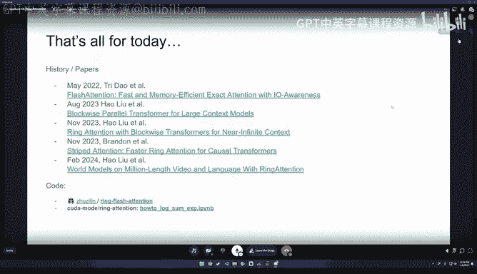

Yeah， thanks。 was An audience seems to agree， perfect。对以。Yeah。

 the cool thing is really that we have this， this word whats now and。😊，Yeah， I like to。

 let we go into the direction of word。 Well I would say that these things allow us video processing。

Yeah， and， and asking questions was unthinkable for me a couple of months ago。

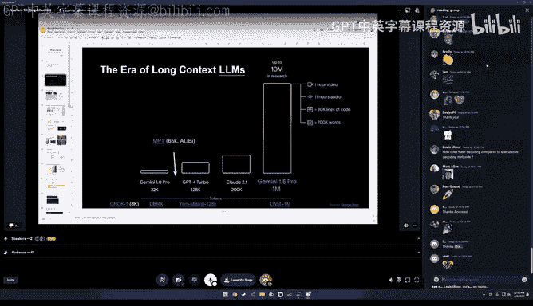

So we already have our first question， which is how does flash decoding compare to speculative of decoding。

 so speculative decoding is something where you have two different models。 you have a drafting model。

 which is a smaller and faster model， which you use to decode some proposed some decoding output and then you verify this output of like the drafting model with what the larger slower model would have been computed and the trick is that you can do this in a batch tool it can take multiple tokens。

 which have already been produced by the smaller faster model and this like， of course。

 to produce multiple tokens and like probabilities for multiple tokens with the large model。

 And if if you find that this the probabilities like like fall into the ranges or cover the ranges which for the produced values of the drafting model you just can。

Yeah， accept them。 and， and the drafting model can keep on。 And only in the case where you say， no。

 this is like my， my latter model would have computed something completely different。

 Let's discard the draft model and do the， the real thing with the big thing。 So this is。also， like。

Spect decoding and flash decoding and can probably just be used together。 They are like orthogonal。

 So if you want， this is that one technology is accusing。P different models。

 other like decoding like decoding fastera for a single model。Yeah， my understanding。

 that's my understanding。 So it's like one is for longer sequence length than the other is just to make your autoaggressive decoding look quicker。

 So they are a thoughtgon now， I believe that's maybe also like something because obviously some communication over So flash decoding probably is not worth if you have only 10 tokens to a certain threshold is probably wise on one machine things also which Im not 100% sure about flash decoing is how they reorganized when they do reorganize the keys and values token by token generation of you start with a certain which you have processed and then you add tokens and tokens and like flash decoding to be optimal the keys and values need to be split across the devices So there needs also to be some next schedule and where the current keys and values that are produced will end up So yeah I have to look deep into this。

 this is actually done。 So there's a lot of questions whether I love the I scroll lot like。

Another one from Al Kon is， do you need shared memory for sequence parallelism？

So this is independent。 Yeah。 So that memory is used inside。Like the fresh attention， of course。

 like the main thing， which is which leverages。 But for sequence。

 like sequence parallelism is on a higher， much， much higher level。 So to say where you， we say。

 okay， I have like some。Some tokens go to the first device of my current sequence。

 Some tokens go to the second device and so on， the other devices。

And so I split the sequence wise across devices。 And this is like on on a device GPU distributed processing layer。

 It's is the independent of the。Individual computers which also， of course。

 then use and make use of shared memory。 So it's always good to have memory and would be better to have more shared memory。

 of course。😊，いや、そs。I for for strictly speaking for sequence parallelism， shared memory is not。

Relevant or。Does't， it doesn't have to be used。Alright， there's a lot of questions left。

 So another one is like， I think there was another one like。

 like with rums around like what is Gemini doing， I think it seems like we don't know。 But like。

 I don't know if you want to speculate Andreas。 or if we want to just go to the next question。

 I'll leave it up to you。Yeah， I S I personally， I'm， I'm really not sure I've no。

 I've no direct connections to。 So I I I I have no insight。 So I doubted a little bit， as I said。

 because there's like so extreme like the， the quadtic scaling at some point just。

Is becoming a problem and 10 million tokens already is a lot。 And there is like biting you。All right。

 another question， I think this relates to your point around like basically comms bottlettlenecks。

 which is how feasible is it to use like something like ring attention with consumer cards if they're connected through PCIE？

So I think this is absolutely feasible。Yeah， we， we currently have， for example。

 in our ring attention center。 we use setup up with 2 a 5000， I think。 So it could also be 390s。

 So this， if you consider this as consumer， I would consider them as consumer GP。

 And they could also be， of course， connected by N V link， then even better。

Why I guess like you can definitely normally you don't have like more than8 probably in in a consumer setup up。

 but for， like dual GPU setups definitely can be used。 And you can also like double the。

 the sequence。 like you， you can double the memory。 It's just a way to。

 for single sequence to compute with yeah， to with all the memory that you have on different GPUs and。

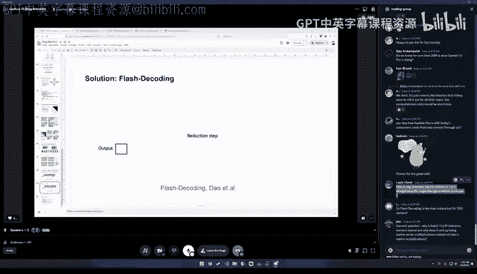

Whether it's like 4090s or like what what people are currently building or maybe like tiny。The。

 the tiny grs。A machine， but's tiny。Tnycos computer in the future， which maybe also an M D。CPU呃 GPU。

 sorry。Yes， so S3 dots is making， I think a reminding us that like consumer GPUs don't support P2P over PCIE。

 I know this is true for 490s， I'm not sure about like if this is like generically true because I would need to buy more GPUs to check for sure。

I think another question is like from Lewis Umer， which is how is bringing attention used in inference。

 is it straightforward for a single few GPUs inference setups。

 or is it mostly like a training technique？It's in my opinion， mostly a training technique。

 the thing is， and that I want to want to figure out what exactly they do they describe in their word model paper。

 this large word models thing that they have an optimized version for ring attention for inference。

And they also describe at some point that they split somehow at the attention heads across the different GPs。

 but I'm not perfectly sure how it's done。 So this flash decoding is much more seems to be much more reasonable Because if you look at this。

 the normal setup is really the this queries。 they sit on the GPus and then you sent around the keys and values And in my opinions in this form doesn't make sense for token by token generation。

 because you then only have like one query。 And yeah。

 the question is like what would you do then So the flash decoding makes sense。

 You sent the same query to all the GPUs and the keys and values stay there。 And then you。

Heav a reduction step after we， this is。I still have to to figure out。

 like maybe look into the code from what they， they published how ring attention our authors themselves use ring attention for inference。

can't fully answer this。 Yeah so you did also end up answering by accident like jamm's next question。

 which is like why is batch by size1 and L inference memory bound and why does it end up being matrix vector multiplications instead of matrix matrix multiplications。

 I can answer this。 like basically just batch size one， it's because like your your Q is a vector。

 So it's like it ends up being like a vector to matrix multiplication。

 It's memory bandwidth bound because like the compute cost of that is like very low。

 but you still need to send the data over to the GPU。

 And so if you take a look at some of the lecture for like arithmetic intensity。

 you'll get like a very strong intuition for why this is the case。

I think the next question which was actually really like this question， so it's my I3 dots。Okay。

 there's a bunch of people here with I 3 dots names like there's N3 dots， I3 dots。

 I think it's like three dot。 Yeah， that's fact stream active you can I guess to， ananym。

I see so I3 dots is saying， so flash decoding is like mapre， but for QKV vectors。Yeah， yeah you， you。

 basically they are already there。 Yeah， they are not。 but you， you map the so to say the。

You duplicate actually the the careers because like the same career sent to all。

The different devices。 And then afterwards， of course， you have this reduction step。 So you can。

 it some， yeah， yeah， you can say like map produce。 Yeah， I guess this is。But to say with this。

Alright， so then maybe like for the for the inference。

 because this is always exceed so many people who because I work in inference and and many like even researchers who worked in training。

 they are not fully aware of like this the difference between training and inference。

 And like how different is like really is because this goes to the vector metric matrix product because you have if if batch size one。

 we really have in inference。 like only one one of this like tiny queries。

 And you have all these keys and which are the key value caches。

 And you basically get one new element here and compute over the all the keys than the dot products and produce your outputs with the various together。

 But this is， of course， very different to having like all the queries also which for the keys。

 which you have during training。 And this is。😊，Therefore this is becoming a problem。Yeah。

 that you that you just basically have like this。Memory bonded less。Guys， Vira here。

So a couple of comments I wanted to make one was on the bed side equal to one。😊。

I think it I'm going to argue on this the reason is that as equal to one is indeed true if you are going to do it on your consumer grid GPUs or in your local machine where you are trying to answer one query at a time。

Whereas if you are in a production deployment， like in the case of my， Google or any of those places。

 who is actually giving you a service。They don't get bads they called one。 It's much。

 much larger larger than that。 right so in a given fraction of a window of a time。

 they have thousands of people who are bombarding。😊，Over there。

 the optimization path is completely different， so that size of one is not practical at that。

The other controlnob here is also the latency and the QOs that is needed quality of service so if you are fundamentally latency dominated and if you do not have a window to wait then hey reducing your batch size makes logical sense otherwise you will go with larger batch size and go for the throughput because larger throughput gives you much more of benefit like energy efficiency and all of those that you would trying to extract。

That is one comment that I wanted to make the other comment was on your initial set of slides where you spoke about 100 million contact band and memory capacity being a。

The thing here is that。Slide 6。 And here。In the entire presentation。

 I could not understand something very fundamental。Why do we care about a single GPU memory capacity？

For going to 100 million tokens。If ring attention is fundamentally driven towards sharing across multiple GPus。

I don't see a single GP P memory limitation being a limiter for the execution of ring attention at all。

 So they are going orthogonal in size。 this was like the motivation for why we need this distributed training。

 I this is like one form of distributed training。 I also like because today。

 omitted like the different parallelizing forms that we have like only like ring intention and and sequence parallelism。

 But this was by the motivation because we at some point can't just handle these things on one single GP。

 we need to scale out into distributed。Okay， that okay， that makes sense。 Okay。

 so I misunderstood it and answering one more question from on the chart on jam。

It's a great question on why LLM inferences are becoming memory bond。

 I think it requires to understand taking a step back on understanding how the LLM inference actually happens。

😊，Fundamently another inference can be split into two particular stages stage one is where you have your system prompts and user query where you perform your computation to perform your like self attention and mass self attention and whatnot and in this case you are primarily generating your first token and understanding your what your prompts are really。

In this scenario， you can do batch meta multiification and it's completely compute dominated。😊。

When batchs are equal to one where you are trying to generate one token after your first token is generated you need to generate your second token second token fundamentally depends on your first token output so you need to look into what your previous data was in this scenario you are fundamentally doing one computation at a time one token at a time and one token at a time you actually have to do QKV and the value becomes a vector and that is where your memory bandwidth comes into picture。

So， this is where your optimization has to change， whether you want to have a trade off with reator compute or a bandwidth and this trade off fundamentally matters when your batch size equal to one。

😊，Yeah， thanks， Viram。 I fully agree and thanks also for clarifying what inference that we have these two stages between the prompt processing and the token by token phase。

 which is like very different。 Also in reality， of course。

 the memory for the key for the keys and various the key and value caches。

 they are a very e challenge to have especially if you want to have for example pipeline parallelism and other forms of parallelism。

 where need to store them even for sequences which we currently don't process at this moment in the GPU。

 but because it's like stage next stages on net other GPU processing。Yeah。

 we what what comment regarding what you said。on production and cloud inferenceency。

 I think this is also like has to be distinguished between on premises deployments and and cloud deployments because like there's also like a lot of people for privacy concerns or whatever they want company things on premise deployment。

 And then of course， the economics are not as good as they are for the cloud people。

 which have especially for the most popular services， like open air。

 And so they probably have over what you exactly what you described that they have this maximum batch size or they can decide and the latency requirements how much they want to batch together。

 they always this is like unfortunately not the case for for smaller like local deployments。

 which have for your own inference or in a smaller company。 of course。

 like many times you only have then really batch size one or like more batch sizes。

 And this is unfortunately also making like the deep。

Also the the professional refuse with like a 100s and H 100 and so on。

 like like quite expensive for on premise deployments， yeah。😊，It's like a check to disagree。Yeah。

 I mean， it's it depends on。 And maybe like some， some companies just value this over like they。

 they just take the cost and say it like it's more important for us to have than this。

 this cost savings that we have like this privacy component is like theres different requirements for different people。

 yeah。But I think we are entering an open debate topic and the open debate onprem that you are mentioning is indeed true。

 then I would argue one single statement。What is your business case Business case is very fundamental here right So if you are an on term deployment and if only you are submitting one job at a time or scenarios that means that your effective LLM usage itself is very very low Why are you even building LLM。

😊，If you're not actually finding much value out of it。

Technically if you create an LLM or if you are going to use an LLM locally。

 you are investing millions of dollars to create that model， train that model。

 fine tune that model and generate insight based on the respective data that you have。

 you actually have to get value out of that generated data point so you need to have multiple applications to use it。

If that' is not the case， why invest？Yeah， I guess like。Current。

 it's also like FOO in a couple of cases， it's like people just want to be elected us to play around and also see what's possible with the technology。

So the different motivations。 Also， I think this， of course。

 depend can be on different time Windows if I example you can at night like embeds documents and new new new incoming stuff and like batch process things beside of direct user queries。

 which kind。 so like， I mean， theres。very， very wide we field of different like ways to to employ and LL Ms and what。

My multimodal models。Yeah， I just， I just want want to say that in some situations， the。What you。

 what you say like this batch size one case is unfortunately still happening。

I mean it is happening I'm not disagreeing but what I'm trying to argue is that hey that is not an optimal way to design your solution and if you are going with that size one you are fundamentally trying to design a solution that may not a to large audience individual user for a mobile developer kind of a thing it makes logical sense but not beyond that。

😊，Yeah， I agree。Okay， should we maybe then close the session for today and。Thanks。

 thanks Why do we need LLMs Yeah Why do we， Why do we need like look， look， I mean， like。

 why do I need alums， I don't know。 I I've met like interesting people while working on them。 So。

 so that that's enough motivation for me。😊，In all case， looking forward to Lama3。 I mean。

 like a big big event this yeah Yeah no comment， no comment。

 but we'll see no comment but but yeah honestly Andreas， thank you so much。 I really。

 really enjoyed like sort of the breadth that you covered and all the references。

 So please share your slides。 I really want to like jump in all these papers。

 I think if you want to pick up any of these papers for future talk it's probably gonna be like a great one。

 And also been like actively working on on a working group like ring attention where people are trying to produce like can train these results。

 So if you're interested in learning how these things actually work make sure to p and enjoying the ring attention channel。

 yeah， just drop a bunch of emojis on Andreas and thank you so much。

 everyone and see see you next week。😊，Yeah， next week we would have Triton， I guess right。

 So this is also a very interesting topic。 Yeah， I think we finally want to understand the programming model。

 So yeah， we're going to have Umer be giving us a nice tutorial there。😊。

