# GPU MODE《CUDA、GPU编程1-53课｜GPU MODE》中英字幕（deepseek-v3.2 - P14：-20240416-Lecture 14_ Practitioners Guide to Triton.zh_en - GPT中英字幕课程资源 - BV1QZ421N7pT

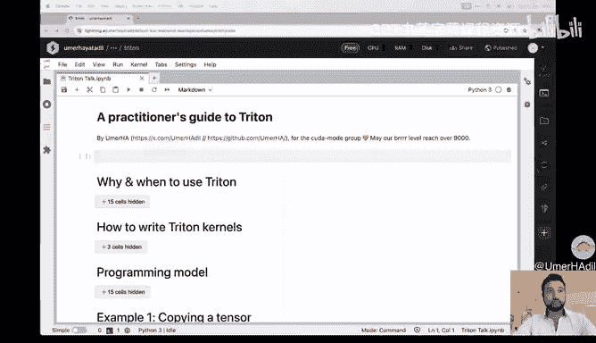

嗯。Hi， guys。 Im Uma。 and welcome to lecture protein in the。Good morning Disc serverva。

This talk is called a practitioner's Guide to Triton and very briefly who am I well Uma from。Germany。

 I actually used to be a management consultant until October。Then decided I wanted to do technical。

Work so I started。I'm doing open source。Contributions。I've done many。

Contributions to stuff like Langin， and then GPT。Engineer where it also became maintain health。

For a while。 and then I decided I want to do more even more technical stuff。

 So I decided I started to contribute to hug face。Confuse us。Now I've done there。

 I've done this stuff like。Controrollnet X S block。Las and。都算で。Also， on the right side of this。Green。

 yep。Is you know， there's just a little。Dno store， that's mine。Disqued。Getit up。 So if you see that。

It's me。And also， there's my Twitter。Okay， let's get the talk。

 so the talk is called a practitioners guide to Triton。

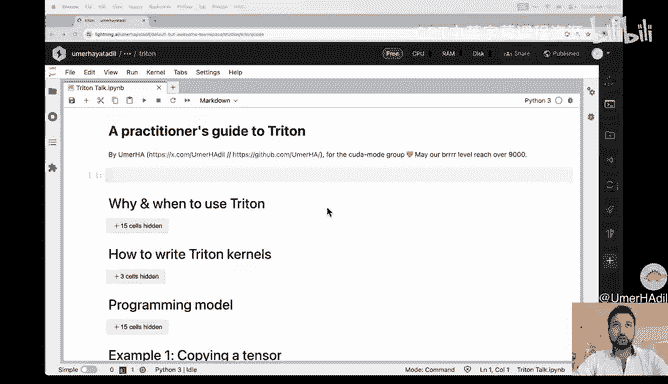

We will talk about actually why。Would you decide to use it and when would you decide to use it。

 how to write it writing？Knots what it's programming。Moel is I。e。

 How does Wrightton want you to think about how to structure your your code。

And that's all the basics。We need because then we can start to double into actual code。

 we will start very easily by。Copying a tensor。And then progressively get do more complicated stuff until at the end we get into。

Actually， not。Not that easy tasks， like。We' were writing an actual fast matrix matrix multiplplication。

今日の。

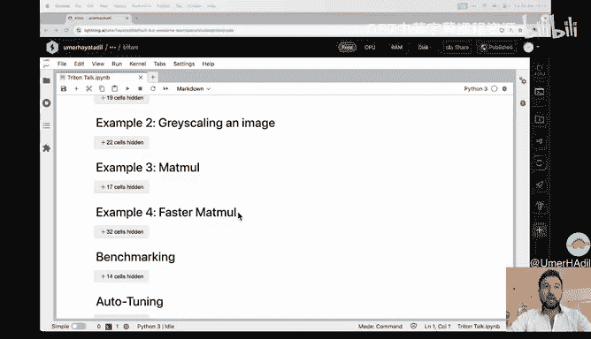

After that， well。你安助さん。Benchmarking and some auto and some auto tuing to。See if we are。

Fast and how we might make it even faster。Cool， let's start。So why it went to use threatened。

What is Triton。 So in very short， Tri is a language that you can use to code your。GPUs。

 and it's way more convenient than。Let's say cool up。肯定。P럽。You write patronythonish code。

Priches then compiled down into。PD X， which is also the the same stuff that。

Could there also compiles too。 So then that's why you can target the same。掏出呀。As with。

Cud during compilation， the trapping compiler actually tries to。Optimize you your code。

 That means it arranges parts of your code without。Making the code means something else。

 but it will be faster。Good， so that's the very high level picture about Rain。

How does it compare to Kuda， The picture that you should take in mind is that。Gooder。

 so there's my mouse。So the picture that you should have in mind is that。

Could I like a high and camera。 It has thousands of knobs。 but you can get the very best of。

Pence that is。Possible。W it right is。More like a high end tophon。Camera。

 you cannot control everything。 so you will likely not get the。Absolutely best performance。

 but you you very easily get very good per performance。

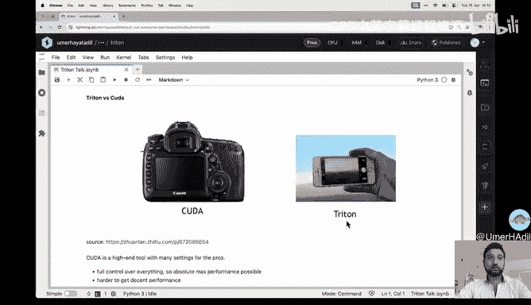

So as I said， you can control everything， but that makes it also harder to get decent。Performance。

 it's way more tedious to。Right and to debug and also to just， you know， to to， to get up to speed。

 it's more。

Complicated。Wreless tri them， as I said， you can control everything， but that also means。

It's way easier to get good。Performance。 and it's also way easier to write in。Tak and in my own。P听。

Its also easier to get started。ごいです。🤧If you haven't。

Dt into the topic of how to make your AI models fast。

 you might also have come across this thing called Toch。Compiled of what's to writeen thevis。

Compile well To。Compil also make a model faster up， but。嗯。😊，Touch compile。

Chain or or optimizes your code， but not the。Clonnels that you could use， so。Trident。

But aage touchrch compile will change your code or optimize your code to make best use of the kernels of the GPU kernels that。

And in some cases， also writing with very simple new。Gs。Yeah， so thats that as a side note。

 those several kernels that that torch compile writes are write kernel so if you just want to get started it might be a good idea to write your code in a Pytorrch use torch compile and then you should have。

A tri codes。Or a tri kernel for your code for the。Details， look at a lecture one of the。

Quite amount series， which was done by。な？嗯。By the way， if you don't know。

 this notebook is also or can be found under the。And then Github a repository author。Ca modeude。

All right。So， when。Would you actually used track。 So let's say use you， you know。

 you start off and have your AI model what what do you about to make it faster and what。To do well。

 the， the very。

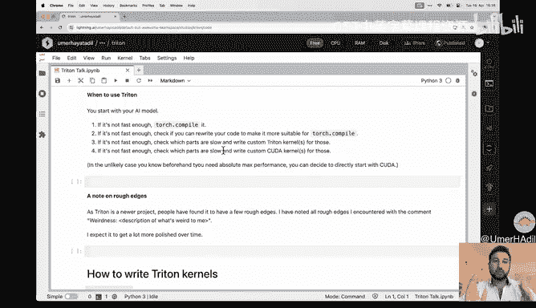

And step is you use， you use watch。Compile， you will be passed up。If after that。

 you are still not fast enough。You can think about if it's possible to。

Rewrite your code such that it's more suitable for torch compile。As an example。

 to watch compile users or make the use of something that's called Koak。Graphs， very， very。

 very totally， I mean， very， very。Briefly。It means that multiple kernels or the intention to start multiple kernels is sent at the same time instead of after another。

Detail on Madam， The point is that。If your code can be represented as one kda。Craect。

 then it will be very。Clas， so if you watch， compile your code and。

As an example and notice it cannot be。Represented as one。

Graph because you go something that's called a graph。Break。Then you could。Look into it if it's。

If you can rewrite your code， so it doesn't have any any graph breaks then so it can be compiled into one。

K have。 So that's one example of。Adaptting adaptpting your code sort makes it more more suitable totor compile if you do that。

 it should also get faster。If after that， it's still not。Tas enough。

I identify which parts of your coat are。Actually， it's slow。 And there those parts。

 you can decide to write a custom track。Gd子。If after all that。You are still not。

F enough the dinner can again identify which parts are too slower and if those parts already have tracking kernels。

 then you can decide to invest time to write extra kuda。그子。Of course。

 if you not before foreignhand that you need absolute max performance and of course。

 you can start with。苦ら。Cool。呃。Small side note on rough edges。 So a triton is a。New is project。

 So there are some rough edges I still Sometimes the code doesn't be。Have like you would expect。

It does shift those sort of edges。Right now， I of course， expect that。Over time。

 it will get a lot more polished。But test those rough edge， if I encountered them in my you know。

 in this。Notebook， I've noted it。Cool， so now we can start into how to write tracking kernel。

 So what's the actual process of writing tracking。Cos。Unlike Kuda， what's cool about Tri is。

 you can actually debug tri kernels just like any CPU program that you can do so if you set on this an environment。

Ptter try and to。ま。If you do so。嗯嗯。A note it is。To be a one So not a number one， but as。Three。1。

If you do so， then Triton doesn't run your kernel code actually on the GPU， but it does so but。

But simulates it on the TiU。It it it behaves or it it。Pretends that it's on。

Pu but it's actually on the CPU。AndThat's very cool for dividing because it means you can very easily。

Acccesess it， interrupted， print stuff and store on。And that's what we are going to do。嗯。😊，So。

 these are now a。Couple of you。Creative functions that I wrote that I find very。MD end， and you know。

 of course。You can just copy， paste them into your code。And also very， very important on that。😊。

Actually。I， I want to put an exclamation mark after。Just point。

Highly encouraging you to write write your kernels purse in the simulator。And then， and use。

Tiny examples to check that your code is really。Correct， and then make it run on the Jeep。九。

I know that people have said that debuging and Tton is not。Possible in that it。It's a nightmare。

But I don't think so， I actually think it's quite。Easy， and so I will hope。

Toably con convince you that it is。Easy and you should also do it。Good。Getting back。

 So these are some you。Telative tillative functions are not going into。Details， but， you know。

 just to state it with very concisely， we check if all the data we get is is is。

The way we want it to be， so it can be used the on the Jeep。不有。And also。We， we that we can set。

Break points and and print stuff， depending on which actual kernel we are right now。あの。But then。

Details associated on the matter。두 어 줘。Good， of course， we need to import stuff。For Tri。

 I need to run this code。 actually， where does it start， okay。Yeah。

 so the quota starts here and let's。Executed， coolant。 Let's done。Thanks， Tom。Tread is importing。

 cool。

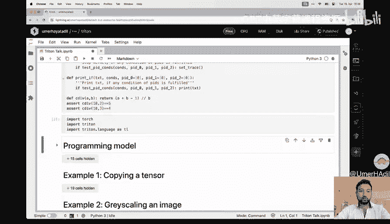

So。Just get to the programming。うんなる。That means， so what is a programming model。

 it means how does Triton want you to think about how to。Toectture your， your problem。So with Kuda。

 we have a two tiered decomposition of the overall computation that we want。To do。

 So we have the overall。Computation， and that Sandy compose into into a something called it。Blocks。

And then those are then also decomposed each into into something called threads。🤧X就是 me。嗯。So。

But some。Important isn't that each thread computes on a on a scalar value。 So on one。うんナんバ。And also。

 as you all know。If you are in。車つが。Every thread in the same log。There are no。They run on the same。

SM cells to remain magic processor and they use on the same shared memory。And trendread。

And Tririghton does not have this two step。 decomposition it just has a one step。Comupposition。

 so this means youre， you're overall。Computation is decomposed into。Blocks。

 but it's not then also decompose into threads。But in the deaths， the main。Essence of Triden。

T them wants you to， or it， it it requires you to do stuff not with scalers， but on。Victors。

That's one and two。Because we don't have this further decomposition into into threats， we have。

We cannot。嗯。Manage a certain memory。Mennually， but we also don't have to， you know。

 to write doesnt that。Cool， so let's make a very simple example， let's say we have two vectors。

X and Y， both of us size8， we want to。Add them into the the C， Also size 8。 And。

 and you know not just。To the example。Let's use a blocks size of4。Yeah。

 you have eight by4 two blocks。So then in Quda， we would have， you know， two blocks and。

Each of those will would contain。For threats。In each thread， then does。

Computation on a single number。嗯。😊，嗯。😊，For example， you was that。T equals xs。To row plus plus wire。

就说。But on Triton。We also have two blocks。 We have no threads， and each block does stuff on multiple。

Deりす。EG Z from。0，2，3， and。Eals x from。0，2，3 plus y plus Y from。最后这退。Very， very important， everything。

 all ops in Triton are。Picctorized， so the data loading in the the the。Doing stuff on the data。

 the storing data back， the checking， we are not。A about it all。Pictureque。Cool。

 let's make one more very simple example。 Now， you also want to add。X and Y， the no details size 6。

 So now we still have two blocks as6 over four the。Next largest。Integer is2。And as an example。

 let's say we have these。pictures。So if you。Brooughad and， and a addition。Colonel and Ka。

 we would get something like this， you know。As you know。Coら。Is not。

Britten in a Python putt tell about， you know， this code is。G。Ide。Logically， what they。

vivalent sea code in Kudo。What to do。So we start off by identifying which part of the overall。

Computation in this specific kernel is what you're going to do。So in our cases。

 the block I is that0 or one is we have two blocks and the thread。Is。

Something from one to is something from。0 to two。As we have per per block， per block for for threads。

Goodol， so now we know which part of。Computation， this kernel should do。

 So now we can identify the data and that we need to do that。Computation。

To check if the data is actually inside of the bound。嗯。If yes， then we can。Didt get the data。Mm do的。

Pation。We wanted in and right then。

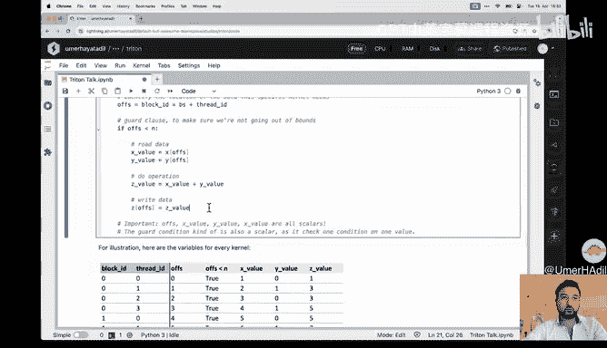

Did abe。As I said now， in Quda， everything is a scalealar so to illustrate that。

There's a table there tros。For each。Thread in each block。 What are what are the the。Vals of the。

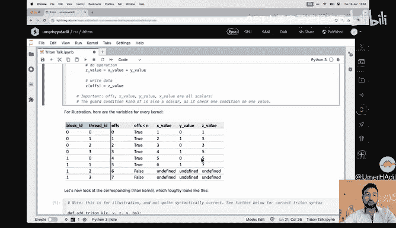

P wordss。Cool， so that's。How could I want you to think about how to structure your your problem。

 but now we are we go onto a to。And that's our tri move。も不はro子。Drature your， your， your。

 your problems， but。You know， just， just to say this， this， the list。Here is not quite。Correct。

Trightton Willright。Correct， tracking below， but you that' just to to to。え。エす。Trade the。Contents。

So it's。Almost the same。Actually， we identify which part of the computation this specific。今日の？

Is going to do we get the data or we will。Looccate the， the data that we need to do in the。

Computation。We check if。We are inside balance， we can get the data。

 we do the something on the data we write it。Daabback， but。Very important。😊。

Is that everything is a vector， so。The location of the data is a vector。

The masks is a vector and the mask is a vector。 The data we get are both vectors and we the output of our our。

Computation is vector， and the data we write We is also a A A a。Victor。2。

Itustrating that this this choice for each of the two。Ks each of。Parable。Actually， is， you know， has。

Contains。This。Con特。Oops， and yes， so it's not as。Tectctorors。Okay。嗯，各个啊。Well。

 one tiny note on the dragon， each kernel that so each kernel。Is't is this shouldn not be blocked。

 it should be。K了。Or each corner， which processeses。It block。

It is called a program and so on our example， we have two。And so therefore， we don't call it。

Block I D， but we call it。P I D。Short for program， I。🤧Okay。Good now。

We can actually get into writing actual。Try and code。Let's make a very easy example。

 so our task is to we want to copy a tensor X of shape N into another tensor of shape Z。

We built just like in k up。We can launch the if we have the kernel， we can launch the。Clonnel in Tri。

 we can we launch kernels or。Can launch them from Python。

So that's the code to do so its it be very or it will look very。Millar to you， if you can。can't do。

구려 조림。Create the output。The space for。The outputboard checked that all of our data is。

Ready to go onto the gym。不要。嗯。Get the title on our data， and get。Yeah。

 these two functions tell you how many blocks we are we are going to。系。And that's qualityed。To read。

AndWhich can be either a 1 day，20 or。TD tablet or it can be a function that returns returns a 1D。

20 or 3D tablet。This line here is actually where the magic happens。Just lying。Launches the。Cons。

For each point in the。就 read。あみ。Now we get to the actual code for the actual tri kernels。Just for me。

 I can note it so for educational purposes。Pcesing this code has a bug。

 It's not a it's not a syntax bug。 So this code is is going to run on the G。P or人。Our case， as we。

 as we are， we are using the simulator， it's going to pretend to run on the G。比如。But it doesnt mean。

Go trick bug and your task is to I tend to play it。So how do actually write the Triton kernel？嗯。

If he， if， if， if you read it。Pyaththon function。 and we。Decorated it with trido。Cit。

Then this function is going to be compiled parts and then compiled into writing。Cool。

So now that's the that's a kernel， it's important that， you know， above we passed tensors。

 but now we don't get tensors in， but we get。P it tenser get a。Pointed to the start of that tensor。

こタ です。T are the context。Ppression means be tail right and that in this number is not going to change。

 so it can。Optimize。嗯。In its optimization， it can use the no and the。Knowledge。That and that doesn't。

Numb's not going to a change。Cool， so we locate。We identify which part of the。

Computation we are going to do by getting the P I we compute then which part we then locate the part of the data that。

We need。In our case， it's it's a。Range going from。0 to the。Block size。Again， it's a。Victor。

Be compute。Mk， we get the data。Into the kernel。 And， you know， you're not going to， to do any。

Computation essence the task is just copying the data。

 So when maybe are encourage to just write exactly that。对 big。But into another location。

Youre on this X pointer plus。Offetss and don't worry too much about it。That should just。

Think about it as you。Like access。Excessing via。Index notation。Yeah， so in let's say non排 or in。

Pt watch。If you did in that， then you would come。Offpsets is a。Is a ten around then this old。

T it's also a a tensor and so on。That's also what's happening here。Cool， so we run this code。

 I hope you。You might have spotted in the bug， so let's move around the code， oops it's not hey。

Copy isn't。Okay， what is copy。That's weird。Oh， okay， yeah。 So I'm this right here， Okay so。

Let me run this code and let's。Cool for deep bug are you。Tility function tilt the print out。

For which。Block or in which block。 What other。The uses of the offset and a mask annex。

So as you notice。Ary Bru。Every kernel doesn't the same stuff。 That's not what we want。

And that's that's awesome。 But we noticed when when when we。Look at the output。

 So only the the the first two values were being copied。 that makes sense。Because you know。

 the block size is too。So we need so our bug isn't that we。Didn't locate the data that we need。

Correctly， of course，It's your time and it depend on the。

On which block we on we are in stored on the PID。Okay， cool。 So second try now we。Offset， you know。

 this。Ranged by the P I D margin in number of。Ilements。Let's do so。

 and now it's also not quite right， you know the offset tool change。

 but not by the right amount aha which。Do not。Advanced by the total number of of of。Data points end。

 but we should advance by the。Block size。PS。So we changed that。 and now it will。Work right。

 It does cool。And yes， Excel now have both these same。Conttain both from the east Tim。Content。Cool。

 so my main message to you at this point is， you know， of course，Right basic cookiea。

But also it' it's easy to do debugging and threaten and especially if you do it interactively。

 it's you know just。

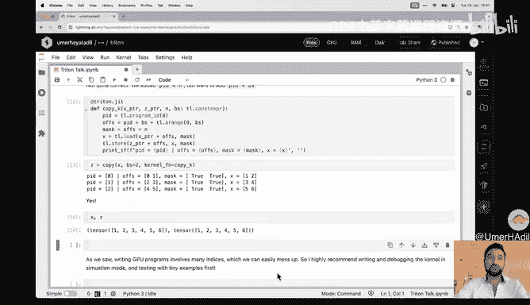

对位的。Okay， cool。Let's close this。Chapter， let's also close the chapter above。Okay。

 so now we are going to exit the template tool and then we are going to restart the kernel here。

Re start。And why do we have to restart the。就是。Actually， I don't know。 I'm be honest， I don't know。

I doesn't。Not just that。If I don't， then you're on this Tens so I To。Vision can't be him。Poorted。And。

I don't know why， but could。And also。呃，村里。An operation that we're going to need for this kernel doesn't right now。

Tk on the simulator。 So we。Donot。Use it。And so that's why to。

We start the kernel so so try it and doesn't or is not or doesn't start in termination。うんもる。Cool。

So this also means we need to run on the GPU， so let's get a GPU。Good so now。Example 2。

 our goal is that we went to gray Sc。Image。嗯。We are now on the Jeeep。

Pure we have who wrist out of the gutter so。Do it， that's just code from that I copied from。

The example from。Jermaine。How what'sよ。Pture in the。これも茶は。じあ。いや。So that' one。

Jeremy chose this puppy as an example。 So we are also not going to use it。

 This puppy is now the the official GPU puppy。

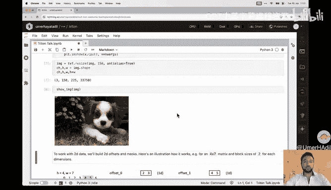

啊。Good so。Why are we going？To do this specific example。

 where this specific example is going to show you how you you can use for how you can do do stuff on on2D。

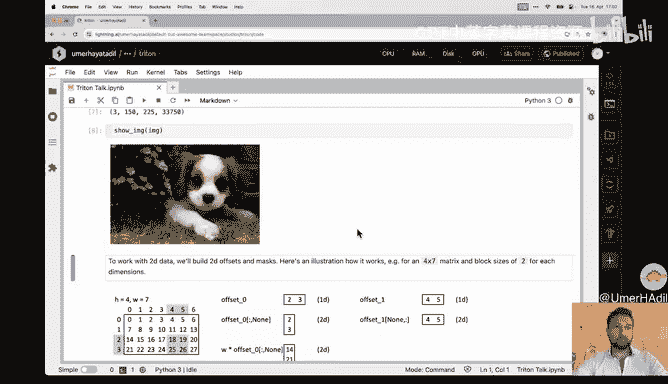

Data like this， you know， so。It's the basic same principle。 We get the data， or， I mean。

 we locate which。Part of the communication， we are doing then will locate which data。We did get it。

 do stuff write it back so and we check that we are in bounds。

But now we have to the data and we can use to the data locations I offsets to the。

Separations to the masking to the writing bag。嗯。😊。

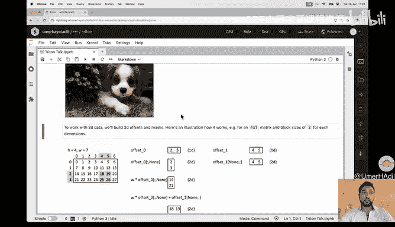

How， well let's make an example to do to show。I would to build8。N toD。Offet。プえ？This example。

 we have a matrix rate。4 times 7。 And you want to get this part of the data， so。

I think in this example we have a。Blocks size of two。 And now we are in the second。Block in this one。

Exs。And in the third block of this。 So that's the data we want to get。We。If you want to get it。

 we start by building the one dimensional offsets just like we did before， so can see。

Oset in the in the in one direction， it's just， you know。

 this two and three and the offset in the other direction。Which is just four and5。

Now we can use non indexing。Notutation to make it。2D， So this is now a2 by one matrix。

 and this is a one by two matrix。嗯。So course， we don't want the offset of set to be too。2 and3。

 We want them to。Indicate the actual data location of the row zone that's plot in 21。

 but we can get that by just。Multiply by the size of the。

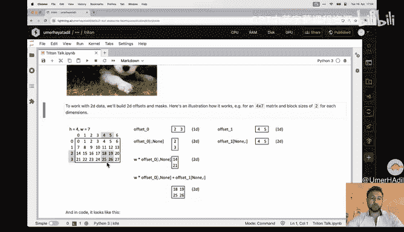

Road cool to know， we have this and that we can just。Atam and Mi。Broadcasting。

 we will get the locations that we。あん。Yeah， so it's not that complicated in code。

 it's also just as easy。

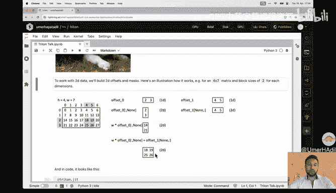

So on that the。Curnel for the grace scaling。Get our P Is， we get the one Dms I mean。

 the one the offsets just like above。 now we build the two d masks， just like in example。

 we just showed。嗯。A tiny comment on a。Andの。Rough edge this London。予定あ meanです。Stuff， you know。

Pment here， this notation you right now cannot use if you are in the simulator， so。If you use that。

 then use this exp function。Instead。Cool， but now there's a two。

All set we create now body masks use them to。Created2 mask。嗯。As you probably noticed， it's a bit。

Different than。How build。To the offset it thats because。You。

Independently check in into each or along each axis。 if you are out of bound。 So both you。

 you must not go。Abound along either the re。 So so it's it's a， it's a just an。And。Good。

 so now we have the masks and offset we can load the data as we know。Colored。

Images are stored in such a way that you first test the data for one channel and。P just the R。

Red the gene。Korean， then be for blue， so。We start at our exploit point， and so our。First。DataPo。

 then add the offsets and times。How often we need to go through the， the size of 1，1 to1，1 channel。

 and so yeah。That's how we get each data for the data for each channel。And now we just use this。

 this formula to get the。Grissco。Value and view。Br on this 2D data back。Into。

By choosing this2 offset and checking this。Pリマス。嗯。Also， a rough edges， somehow。

Right now on this cheap。Pu， which isn't older of。One， you cannot multiply floats and you in but。Cool。

 so that's a corner。 Yep， let's run the corner。 Just a side note， Ive。

G you a buff that you can that the。Git per。Proateital。Can actually be a double 1 D，2D or or or 3D。

 or it can be a a function that outputs a 1 D，2D or 3D tablet。to just show it in this example。

 I've used the function but in this specific example。It doesn't mix。し。Or it's not。

Really beneficial to use a function。And we good。Easily have precom。Cutter the output engines。

Pasttor the tupper。But there there are cases where it is， and those cases will be。

Below buny benchmark and and auto to you， but yeah。Good嗯。Also， the the。

Arguments passed into this function are audit。Kword。Arguments。That we have。Plus， or the extra。

Arguments coming from benchback again and auto tuning。Good。

 let's run the code and we will treat that we have。Great GPU puppy。All right， cool。

 let's go to the next example which is matrix multiplication。For matrix motion。application 系。

don't have oil。We don't have to。We start the good。Yes， notmetric budget。

V we don't have to restart the kernel， but you just to make our core turn club and we will just restart it here。

Also， I've moved all the functions， so the all the utility functions。

It is on a tire just to be cleaner。Okay， so why are we going to do this exercise？全部。嗯。

This example is going to show us。How weekends。Bit up。Computation， you know， as you know， with GPSs。

 we split a large。Computations into tomorrow tracks。

And we as a code have to decide how we should do the decomposition and now to come together。

And were going to see one。为。And also， we are going to learn how we can use H lift how we can use。

Are functionss。Or we can call them from our。Cner and also build。

here that we can do on that inside each kernel， we can do some matrix and vector。Us。Loparations。

Because threatened prove。ぱs them。T us。Okay。So。And our。Our goal is we want to。

Miply the n by K matrix A and the K by N matrix B。Itto the M by N matrix3。 So how do we。

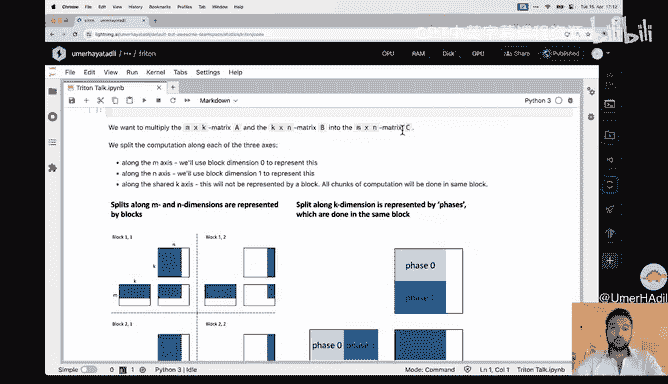

Blit up the competition。 In this case， we'll kinda do it three pulled。The first two poets are going。

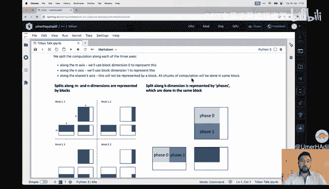

To be that， you know， we are going to compute this output matrix and we're going to split this output matrix。

Along each。Dimenssion， and these tools。Plitz。Will be。Mapped onto the。Blocks， so this means。

If we change the blocks on this multi block 1，1 and this block 1，2。 So if we change blocks。

 then we're going to change。You know， hear which？Partd along this axis will be welcome。

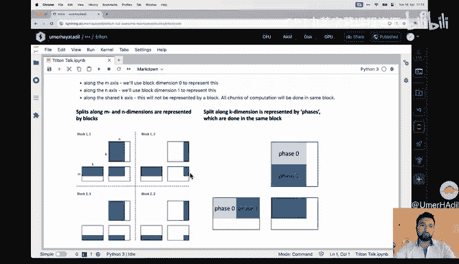

Pauing。So that's two and then three。And that something is。Something we' are not going to。

Present by a separate block is that， you know， as an example to compute on this part。

 we need to multiply this part times。

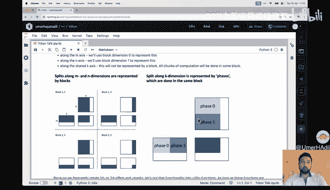

This part be。Copose each further。So we run。But by whats what's mean。Gla test phase one。 I mean。

 phase0 of the a matrix time phase0 of the B matrix and then。Qus one of the。

And we matrix them add them together to get this output。For this。Block， yes， for the block。Which is。

Thisエ。这是。You might ask， hey， Uma， I mean， we can use a 3 D tuples in for the。Grid in Tton。

 and we are。Blitting up the computation now。A threefold， Why don't we you map those onto each？Other。

 why is this。The thing on the right。Not a block。The answer is。That， you know， for this part。

 each you know a。ペーズ？0 and phase one deep pen on Egypt。So to get this output。

 I need to have the output of interfaces to get a total output of this block。

I need the output of what now called faces。0 end。Play one So these are not independent。

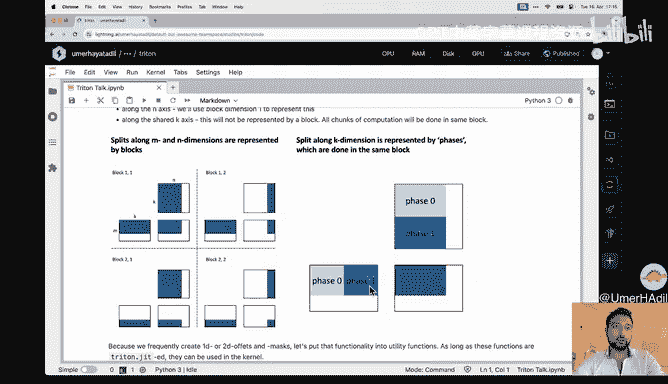

这 why。All right， we have split up the。

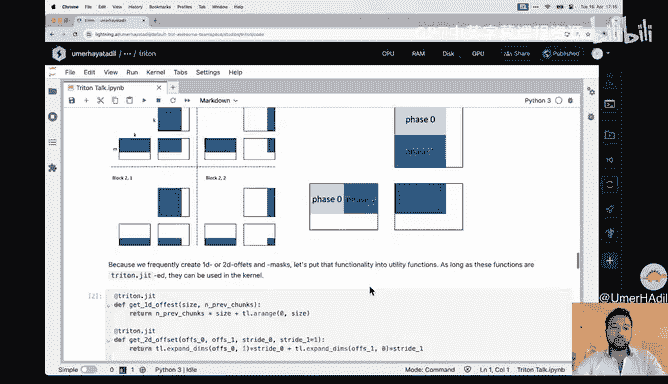

Competition， or we have decided how we want to。Bit up the competition。UYou know。

 making 1D and 2D masks and offset is just something that we are going to use in very。

Oftens of I've made some。 I've， I've， I've put that into。Functions。And in those functions。

 we will be able to call inside our。Go of。Because if you have a function that's also jitted。

 then this function can be called from other trident。Jtter tensions。Cool。

 so now let's go on to the na E matrix multiplification So the example which。T off。

And this should be， you know， shouldn not be that large of surprise to you we get。O Bs。

 we get the offsets along the M and the N。Texas， oops。对る go。否者。

Acces of which offset we need to know in which block we are。 And then we also。

Chunk up the axis so that's， you know， this and this chunking。AndBut we， we。

 we don't need to know which which block we are in because in each block。

 we will start with the first。褪色。And then go， go， go the through。

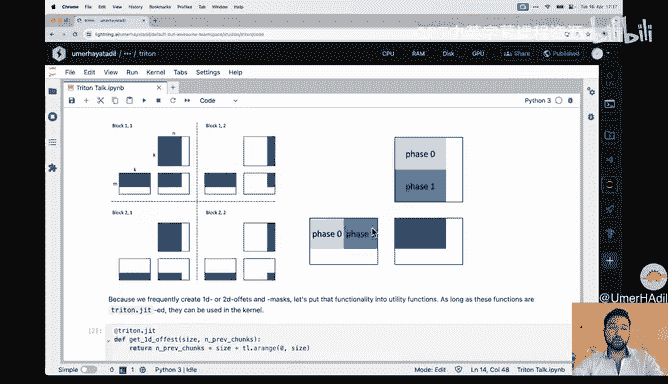

All the phases。Cool， so we have the oney。All sets by。い。Cing them we make our tour。Offetss。Cool。

 and now we will。Eat to read。Through each of the。Pses and do a address multiplication。pon that face。

 and then。Cumulated。Cool， yes， so we load the the data， we multiply it。

 and that's what I wanted to show you that inside a curtain there that there are pre。

Pplemented matrix vector ops that you。Can you use。There test。To be set to falses to on all。Ps。

And cool to now we have this。And we。Added the new。Acom step back to the。

Criminator and we then go to the next phase along K， along the K。

Exes and my comment has don't really masking when we A me actually I。Think yes，It's all体。Okay。

So let's run this。 I don't know if you run this actually， no， we did not。Lets us。

We start the kind so this should be seven number。1， that is。B runや good。

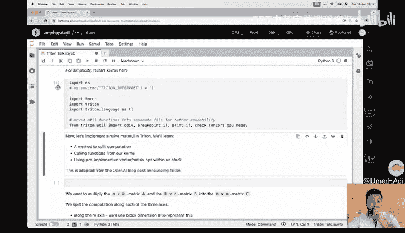

So we go on two， three。Now you have this paththon function to have a coil on matrix module margin。

Pplicationcation， it's not really。 you know， it's not。Co kid it， quit。Let's do a very basic example。

 We have to matrix trace three times four and of。4our by five， which all I have just。

 you know were a。One at each location。And so H and the。Output should be a matrix of。

Size 3 by 5 where each。So。Is the sum of。Onceon， but K times。 So it's4。Do we get that？We do， yay。滚。

And that's also just just just make it larger end。Random example to a test。Again got a pieto。

Iplementation and then， then， then do image。 So that's。困了。All right。

 that was naive matrix multiplication。Let's go on。 Let us do。Pat time matrix multiplication。Okay， so。

How can we。Make a kernel pasta。 What options do we。One option isn't that。Or which。Nobs Louis。

Have one lobbyism that we can。Re on that。 We can choose the。Ordering of our blocks。嗯。Yes。😊，And by。

Dorinks so we have。Influence over。In which O。Memo is。Exist。We get very concrete in。And。Justum。Minute。

 but， you know， we we cannot decide how memory is accessed inside the block， you know。

 that is something that。Tres。Ters auto。We can decide out how memory is accessed across blocks and if you do so the then we can。

Incre the L2 cache。Tick rate and so we need we don't need to load as much data， so we will be faster。

So why is it？A wait。呃，对对对对这。Yeah， right。 so。If he， if he。Previousre data wide。Okay。

 I'm not this is taking a blackout。Just a moment。They I my that whether would to。Okay。Cool， so okay。

 so。Good， we want want to in。Creasing the the change that data and that we。Need in the kernel is。

Already in the。Cash。So loaded。The Lord will be passed。How can we do it。

 Well we can do it by reducing the number of different。Data loads by。 Ive called it consecutive。

Clons by， by consecutive， I mean， I know kernels that。Run around the around the same time。嗯。くる。

You know because。It isnn't。Example， I have two blocks， one and two， and block two needs the same as。

Block 1， and one is。Already exit。Cing then the， the data will are。

Re be in the L to cash so to tenders use that。Cool。How can we use that in a。

Contracts of matrix multiplplication well。This is。If。If you do na matrix multiplication。

 we compute the the first row in this case， 10。Bs。嗯。Okay， it's not actually10 it's a。😊，It's not 9。

 It's a 10。 but let's just say it's a 9。嗯。So let's。Pretend it's 9。

 but I'm matrix and not a 10 per 10。Mattrix， so to。Computer first row。W is9 blocks。

 we need a load9 blocks from matrix A， but all rows from matrix B。

 So 81 M blocks So in total we need 90 blocks we need to。Read 90 different blocks。

To compute the nine blocks in the top row with our na。Wdering。In our another approach。Is that we。

Computっていう。Top right，3 by， three blocks。就不죠种。9 blocks。And to compute those。

needWe need the first three rows and the first。Of a and the three first columns of B。

 So a total 54 blocks。Side note， and this。Grouping is called。It's about grouping in the tton。

Documentation。Okay， so how can we tell try it and which image order to process each block where we take the P ID change them and then just pretend that it's not the changed？

Kty。IV。And these。Choose it as if it， it， it was in the novel once to illustrate this a very easy example。

 so。It you go in the range from， from。进入住 four。An execute on this。We。Process each item sequentially。

 and now you can have to change ID D function， which maps you know。Which written。不就 you。Order。

 but if you just use it as if it's your。Brigial I D we。

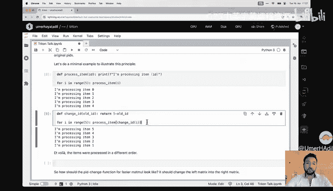

Process in the reverse。Or。Cool， so now the question is what？P I D changing function。Need to get from。

This。Ordering to this one。And so we need one that changes in these。Cl this into this。

What doesn't this block on this this。Picture on the right on the。On the。Left actually mean， you know。

 this is a5 by by 7 matrix。 So we have five times7。E quoteates with the 35。Sales， but again。

 it right。We can just， and we don't。Operate on the scales in the scales。

 but on the vectors in the blocks。 So these show the。Blocks， so these two cellss are one。

Block and we have total 20。Looks。Cool， so you want to。And。Start。By going。いん。If he， if we。

Group together this， this three。Rose。And go down the。Rose。In them。And then go into the next column。

 go down again。 the next column And so on， we notice that the first9。

Processed blocks are the top left3 by3 matrix。AndI mean three batteriesies。こや。

So that's actually what we need。The number of。Rose that you group together is。

 is something you can choose。 It's called a。Group size， and。This。This。

The function that that maps this matrix to this matrix。嗯。我的。

Operation that does so is is called Swwizzling。I think that that。Term comes from the computer。

Gerrifics。Cool， so how do we actually swizzle and do we have to write our own function， No， we don't。

Because threatenton。Provides this ph2 function。What I like to do is to actually check if I。

Understand this function by。Choosing it in a very simple sample and then afterwards。

In the actual exit damp， So let's first make make sure we understand this。Dis function to visit。Judy。

So， we are going to。平部つつ。Have a side goal Then we are going to start by a 5 by5 by4 matrix again20 cells where each cell contains。

でうん。The row majoring location of the tail。 So the raw。Major location is， you know， just this。

Ordering。You know， in。This matrix。The raw order location of this block would be 3。

 and8 it would be 30。 So actually， this matrix here that Im this。Criing is exactly this one。

And we want to transform it from this matrix into this matrix。地铁作风。

This code this code don't matter it matter too much。 It's just， you know， we the are。

Always do and this line changes on the old。Pre this into a new。Pdes。And I rewrite。That big。The data。

At the location of the new P I by Yu and b， But you write the。Okay， I'm just not going to going to。

Details to point is。It。Gives us。Exactly what we want。

So whwizzling does exactly what you want it to do。Cool。Okay， now I'm not a bit curious， it's my code。

 I should understand my code。😊，Okay， so we get to pay， at least then。Numb of blocks we we we sizz。

Get the offsets。Oets2 the mask。 and this is all untoppiled。Then beて。Offsets at a mask of the result。

 or Im using this this this result。P now we load the data be based on the on the end result location。

 but。Write the same data using these。Sizz locations。 Okay， good。That makes a lot sense。うそう。

And just example， we take this three and we want to write it back。Into this location。Cool。

 so we know thatwizzling pay likely。

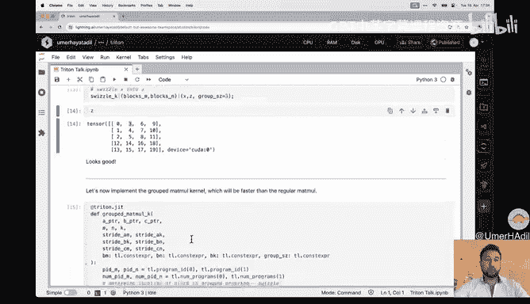

P a two that's good。And now we can write our faster matrix multi application。

Which is exactly the di from matrixtri button。Location， but we added just this line。

 which does the sling。And also， for this。嗯这。Specificallyizzally。

 we need to know the number of blocks。うぷ。We have and that we can get with this command。All right。そう。

这就啊。Grouped matrix multi application kernel as also test that one。えでム。

Looks good and also tested against Pytharch also。And looks good。Cool， so those are all the template。

 we start a very。😊，Easily， I know we。Cha 써。They have done some。Pretty cool stuff。

Just schedule benchmarking。Because we， of course， want to know if we are。Actually。

 fast and and how fast。As the goal is to make on。どれつ。あの past。So Triton。

Provides built in benchmarking tools are not going that much into this code。

 And just knowing you can you can provide。To f。嗯。Functions that you want to benchmark。

And you can write you can provide。Over which。Rachel。Vious you about to benchmark with them。

I'm not going to run the court term。As it takes some time。But to see if we。If our our task is。

Gm matrix multiplication。And we changed the size of the matrix multiplication。

We notice on that for smaller。Matrices。Our kernels are。Itly faster than the piloty。Could it。

But for larger matrices。Ps way way way faster。As for。Why or when I got this plot。

 I asked myself why do all all。う、トムツス。Drop after some point。And so someone in the。

Couldn have amount it might be。Because the1 or a2 cache is just sort pull after。这是从。Point。So。

They kind need to do much。Memoory is just toughling。いや。Right。So now we can also look， okay。

 we had different blocks or we have the blocks size put。

Can change which impact doesn'tt doesn't that have。Well， been。Not just it's not batch size。

 it should be。Block size。 So we noticed that the larger， the larger the。

Block size the better if you still make it larger than this GPU branch2。ある。Me。啊。

Co start let plot same。Graph， but not for the best。Blockes are the largest one in remote to school。

Now， actually for pasta。I mean for larger matrices。Our the performance of our kernels， much more。

Closely。没すんでろ。Plad watch。But。Interestingly， for smaller matrix sizes now tos wave wave faster。

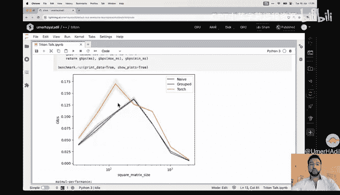

🤧Good。That for benchmarking。And another tip put I on and we vary。

Thereforeful reason that you can use the inside。Compute。

 so we just call it the NCU profiler and to get to get hints about。

How to make your candles even move faster。

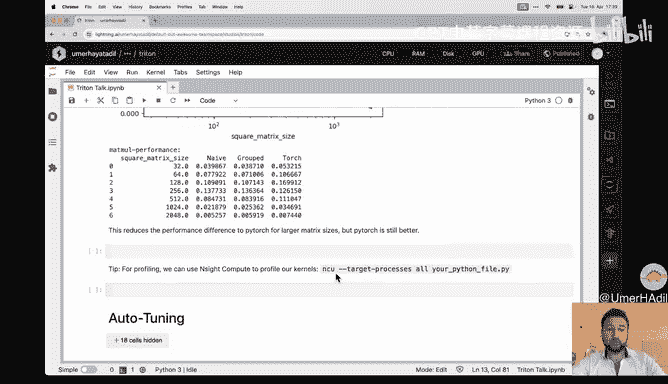

Alright， let's get to onto tune。 That's the last。죄다。🤧う。Okay。それ。

Idea of auto auto is that there are some。呃パ。Meters at。Confits that have no。

Logical impact on the problem。As an example， if you do matrix multiplication and the block size itself should not change the output of the matrix。

The， the block size is just。嗯。Implementation。Detail in。T。So。This means we can actually。

Look into which。Confts。Make our。Ma much。Pcation the fastest。For， for that， trade also provides。嗯。桌子。

We're not going that much yet。Detail， but you can provide conflictts that are then going to be tested out。

Yeah。If your problems。Size changes， you know， know in our matrix1 multiplication the problem sizes are M N N K you。

Because of those define the matrix multiplication problem。Then this outlook。T1 is is going to be run。

Again， from the new problem size。So thats as this is also a。

Creator and just you know we be new when this kernel is is run for the first time it's first compiled and its then auto tuneed。

Good。So this is a。Droed auto of to。

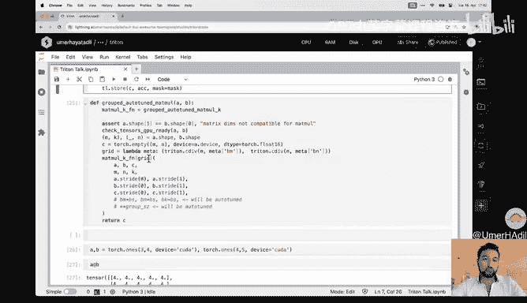

Cour， no， it's they， but that's the path angle that。Ca said， we cannot pass this。

Primeterters now as they are being altitudeed。

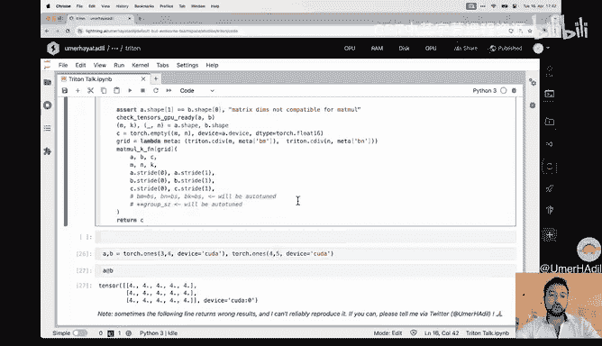

And'm being cancel samemen。answerそ。Cool， for what。Tips and tricks on how to。How to choose this。

Confts， I recommend this talk， also from。Mark。Goodol， and of course。

 we cannot benchmark with the auto。And this is very interesting。

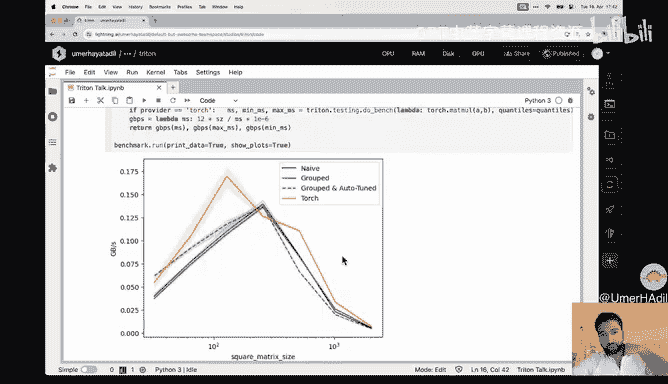

Because I would have expected that the auto current version can be slower than the normal。

The versions of I'm kind of surprised by this。Reult。If you know why then that is the case。

Tll me on on， on the Twitter。

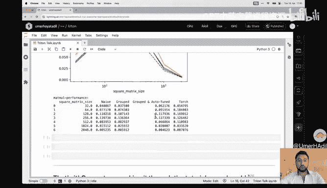

Cool， good job。Yeah， so。Cos， you have。Made it through the。Toilla。

 you can give yourself a large clap on the back。And also， he has some more。嗯。

Resources that you can use to go on in your tdent。Journey。And。Lastly one more sort third note。

 so yeah， that's me， I'm an independent。I'm an engineer。 So who does open source stuff。

 So if you bottom by buy me a。Coffee thats slightly up。Pishche had attempted this。2レ큐。Cool。

 so that's all。Thanks a lot， Ed。拜拜。