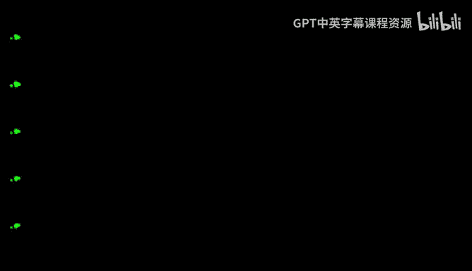
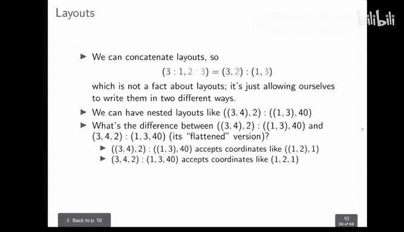
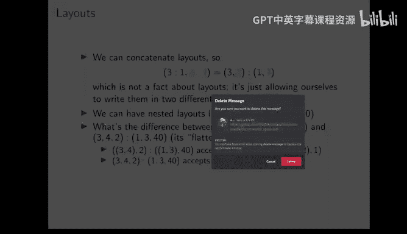
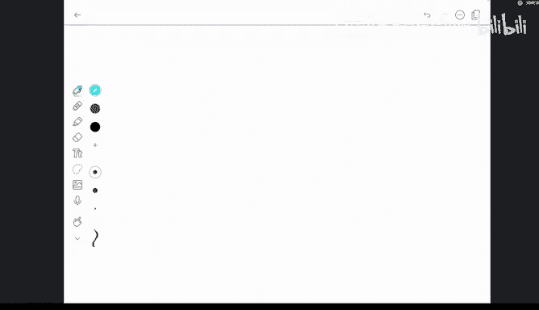
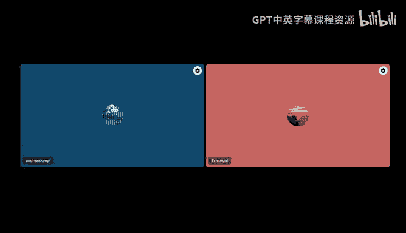
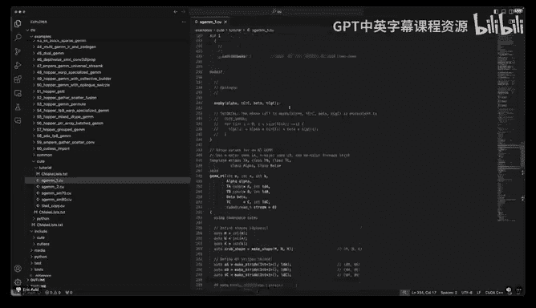
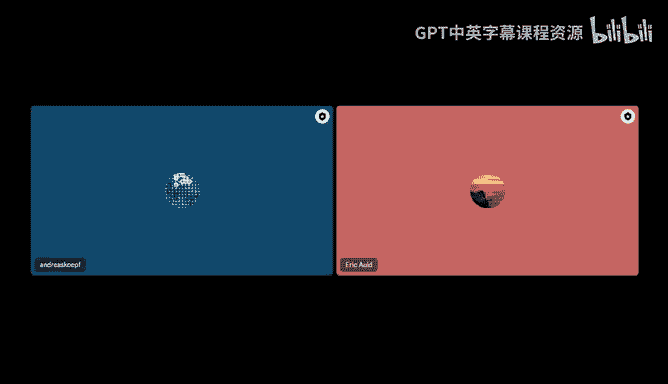

# GPU MODE《CUDA、GPU编程1-53课｜GPU MODE》中英字幕（deepseek-v3.2 - P15：-20240422-Lecture 15_ CUTLASS.zh_en - GPT中英字幕课程资源 - BV1QZ421N7pT

So welcome， everyone to our 15th。Cuda Mo lecture here on the Kuda Moti Scott Serva our highlight event of the week。

 I'm super happy to have Eric Od today here。Who is going to talk about cuts。

Yeah something which I have not looked like deeply into and I'm super excited to learn more more about and it's also something I want to personally spend some time really with this library in the future So yeah this is its really great to have him in general these sessions that we do go for about one。

Our like plus minus whatever is required。 and also we have a Q and A session normally at the end。

So if you have questions， please， the synthesispath you ask them in the chat and we'll try to somehow pass them on and forward them to Eric during the talk。

 I'm really excited。All right。Great， okay， let's get started。Okay， so。

First of all let me shout out some of the authors of this library these are some great people at NviIIdia I'm sure there's even more that I was not I didn't encounter in my travels。

 but these are just some of the people that are responsible for this library and I thought they should be thanked。

嗯。Okay， so what's the point like why would you even want？To learn this library。Well。You might not。

 but if you do， I think that some of the things that are rewarding about it are it's actually kind of pretty。

And from a I'm coming from a math background， and I think that it's interesting about this library that a lot of it almost has a universal quality to it。

 that you would think any library that adopted this task。

Would need to have this structure in some ways， So I think that's kind of pretty from like a mathematical perspective and that is sort of what I wanted to focus on in this talk a little bit So there's a lot of directions that I could go in this there's you know the library has a lot of kind of nuts and bolts and there's a lot of there's kind of a big API for it。

 a lot of moving parts， there's kind of layers to it。

 so as you'll see there was kind of the original cut list and then when Cus 3。

0 came out there was kind of this extra layer added to it but the part that I wanted to focus on and where I think I might be able to add the most value is to think about the conceptual part of it and hopefully I can sort of。

You know loosen the lid a little bit for people that want to come in and like learn it and i'm sure all you guys are you know real good coders and better coders than I am so you can learn the API and everything yourself so i'm not going to focus as much on learning all of the ways into the library but I want to sort of get the conceptual part emphasized。

Okay， and as another piece of motivation， if you go to like， for instance， the flash attention repo。

You know，And once you actually get down to where the code is running， you will immediately encounter。

Coless， so， you know， if we are looking up to flash attention as one of the kind of key examples that motivates。

Our focus on performance in this group， and Cutlas is definitely going to take a large role in learning how to write perform kernels and stuff。

Okay， so how do you even know if you are looking at a cutla？Piece of code。

 So there are these kind of telltale signs。 One of them is these underscores。So。

Pla has this like indexing convention where。If you have a tensor called some tensor。

 you'll have then parentheses so you actually index with round parentheses。

 not the square brackets and then the indices come separated by comms as usual but the underscore is like the colon in Python so it's like the slice you know like give me everything in this along this dimension。

 but only the second coordinate in the first index and stuff like that and then there are these kind of the greatest hits functions that show up over and over and there's got local tile local partition partition D partition S this is an interesting one underscore3。

So that's Atlas's way of representing a static3。 So it's a， it's a three where the。

 the information is embodied， not in the value of the variable， but in the actual type。

So if that's clear to you then great and if not hopefully it'll become more clear as we go on all right so what？

In what situation would you want to adopt out？Well。

If you're writing a pretty straightforward linear algebra computation that people have done thousands of times before。

 you probably don't want to reach for cutlas， you probably want to reach for something like Klos。

So it's worth kind of dividing。The libraries that come from NviA into two parts。The first part。

 the kind of you might think of it as the somewhat more user friendly part are the ones that you just call from the host right so you don't have to write any kernel code yourself these are things like cooBs。

 CoDNN and stuff and they're very customizable you can do a lot of things with them and you just call them straight from the host。

So those things these libraries will infer whether and when to use like Tensor cores for example。

 so they do a lot of the work for you and they're very good for like kind of very straightforward applications is my understanding I've not used them a lot。

But of course， when you do invoke such such a function。

 you are making a trip from and to the device right so that's just to know that you're doing that some of these libraries like I know Kublo。

 for example， does have the ability to do some kernel fusion so that you don't always strictly speaking have to you know if you invoke a function。

 you invo if you invoke the composition of several functions， you don't have to come。

Back and forth to the post each time， so they confuse some kernels together for you。

 but generally speaking， you know you have a limited amount of flexibility there。And then， of course。

 there are these libraries that you call from the device。 and that's what we're talking about today。

 Other ones， besides cut lists are。Excuse me。So you got thrust， you got cub。

So cuttlas is one of these， it has low level control。

 the tensor core operations are exposed directly， so you're going to see that。

And so the time when you would reach for it is like if you want to。

Take a new ML model that has just come out and sort of speck it out and like test whether and how it can be made performant。

So if you are a person who is exploring this space of like kind of performance oriented machine learning models that incorporate a lot of linear algebra as most of them do。

 this can be a good tool for you because you know， if it's a newer model。

 co Blos might not have the requisite flexibility to incorporate it and so this is a good place to start for or to get expertise in for people that want to。

Play that role on a machine learning team of like， okay。

 I'm the person that's gonna go make this kernel。 I'm gonna， you know， come back and say， like。

 the reason why this is not fast yet is this。 And if we wanted to change it。

 we would have to do this。 right， So this is gonna let you get your hands on levers like very directly。

So just a little notation clarification， first of all。

 I'm using this kind of like Donald Canth notation where it's like the square bracket on the left。

And then two integers separated by these two periods。

 So that's like a half open interval of integers。And then there's this term called mode that comes up a lot in cute。

 sorry in cutlesss， cute is cutless 3。0， that's just a term for cutlesss 3。0。急。

Thela tensor or I should say a cutless tensor notation so that's what cute means and this thing that's called a mode that's the notion of like we have these nested tuples that we're going to be talking about and they're tuples of integers and so each element of a nested tuple which is possibly a tuple itself is going to be called a mode so it's easy for me to kind of。

Move on and forget that that's terminology that I was confused by at first。

 but just to kind of clarify right over。Okay， this is just like a very broad overview of。

What we're going to be looking at。 And I hope to return to this。

Picture again so that you don't have to just like store it in your memory this entire time。

 but we're talking about like tensors。And before I describe what these things are。

 I just wanted to get you like the bird's eye view。 a tensor has like an engine。

And that's something like a pointer， basically， so like the underlying memory and then it has a layout and the layout is a shape and a stride。

And each of the shape and the stride are these like nested integer tus。Okay。

 let me just pause for a second， is everything going well are there any problems at this point。

 any questions？I'll just take a breath here。I think it's all good right now。Okay， great。

 So we'll move on questions。 So if somebody has questions， please ask in the chat。 Okay。

 but I'm glad to know that everyone's， you know， receiving this and we'll just， we'll move on and。😊。

Put some meat on this now。Okay， so I want to start。

Building up some of these concepts by just thinking about normal sea style indexing。

So if you work with tensors a lot as you probably do， if you're in this group。

 you see a lot of times that like you start with a coordinate IJ and then in order to get the linear offset of that coordinate。

 you do something like，I plus J times M。 Or if it's three coordinates， I J K。

 it's something like I plus J M plus K M N。And those。The red M and N could come after the eye。

 for instance， depending on how the memory is set up。

So it's not necessarily that the M goes with the J and the Mm goes with the K。

 but this is like the kind of familiar structure of taking a logically。you know。

 tensor coordinate and mapping it to some linear offset of memory and that's like a very fundamental thing about cutlas is like that a lot of the abstractions are meant to do things like this in a way that is less prone to mistakes and less brittle。

Okay。So what I want to do is think of this as a dot product between two。

Little vectors so that the I plus JM plus KMn is actually a dot product of the green thing with the red thing。

That's like our starting place for building up these concepts。All right， so the thing in red。

We'll call that the stride， just to start with。OopsWhat happened here。Yes。Okay。

 so if we are using this M and MN like this， usually it's because。

The allowable coordinates are like zero to M in the I direction。

0 to n in the J direction and0 to K for some K that has not shown up in the problem yet。

And we're going to encode the allowable input coordinates as a thing called the shape。

So that's what we saw before just to back up to our picture a moment ago。We had。So these tensors。2。

Composed of an engine， which is like the pointer and then the layout。

 which is the shape and the stride。So both of the shape and the stride are these like nested integer tus and we're going to have the shape represent the allowable input coordinates。

And the stride is that red thing。So， the stride is。

How you go from a coordinate to an offset to like a memory offset。

 which allows you to get the information that you want to access。Okay。

 so the way we're going to write these shapes， which Eli I was saying。

 specify the allowable coordinates。Is just that their upper bounds。

 So we're going to have like two pole capital M and K。So that's the shape。

 So it's understood that each coordinate。You know， starts at zero so that。

The shape capital M and K means that， okay， I'm allowing。

Coordinates between 0 and M in the I direction，0 and n in the J direction and 0 and K in the K direction。

All right。So we're going to call this assembly of a shape and a stride a layout。

And separate them by a colon。So this is the one we were just looking at。 The shape is M N K。

 Remember， that's the allowable。Inputs。Okay， and then the stride is how to get from a coordinate to an offset。

 right， So I take whatever the input coordinate is。

And I dot it with the stride in order to get the linear offset。Okay。

 so often I will mix up the terms shape and size。Those are definitely not the same thing。

 but you can see why I do because。The shape delineates which coordinates are allowable。

 so it is something like the size。Okay。So another thing we can do is like take this like concatenation of layouts。

So if I have a one dimensional layout that's like three colon one。

 I could concatenate that with two colon three and then that's just the same as saying three comma2 colon one comma3 so this is not I'm not like claiming anything about layouts here this is just。

A notation。And sometimes it's more convenient， so you can see like the red one goes with the red3。

 the one is the stride and the three is the shape。It can be more convenient sometimes to have the stride closer to the shape that corresponds to it as opposed to giving like the entire shape and then like going back and giving the entire stride。

 so this is just a notation that allows you to do that in a more compressed way。Okay。

Looking good so far。Okay， so this is a little bit trippy at first， you can have nested layouts。

So that you can have these like inner So this layout that we're looking at right now。Which is。

The cup three comma4。And then， Conla 2。And the stride， tuple 1，3， comma 40。Okay。

 so what's the difference between this and the sort of flat version， which is like 34，2， colon 1，340。

 just the difference is just that the kind of coordinates that it accepts。

So this one that is not flat accepts coordinates where the first coordinate is itself。A nest a tuple。

 right？And here， we're looking at the coordinate 1，2， comma 1， and it has two modes。

 The first mode is one， comma 2。And the second mode is just one。Right。

 so it has this kind of like tree structure。But the flat one accepts coordinates like one two one with no nesting。

Right， so there's this notion of like。

Congruent in cute slash cut lists。 And it just means that they have the same nesting structure。

 So the shape and the stride always of of a layout have the same nesting structure。

 And also the coordinates that they accept have that same nesting structure。

 So you can see above like。The not flat layout， the  three，4， two with the nesting。

Acepts the coordinate one to comba one with the same nesting and then the flat one accepts flat coordinates。

 so I hope this is clear I can I can clarify if it's not。But just the notion is that like the shape。

 the stride and the coordinates that it accepts all have to have the same nesting structure to make sense。

Okay， now I'd like to talk about drawing layouts， which I think can be a。

Kind of a weird thing at first。To me it kind of so let's just kind of go down the line here。

 so let's take a simple one。And this way of drawing things。Is。🤢，It's。

 it's not to provide like a rigorous definition of what the layout is。

 but it can help you imagine what they are and to help you kind of reason about like what they should be。

 So let's take like a very simple one。 So like three comm of。Holand。One comma three。

 is that coming through， Okay， can everyone see？Yes， it's very， very visible。Great， okay。

Let's start from the left and work our way to the right。

 and we'll see later that we can actually start from the right too it doesn't really matter。

So I'm just going to label these coordinates here， so the first one I'm going to call。Let's say I。

 this one will'll call J。So first of all， I'm going to specify as I draw it like which direction is the positive eye direction and we'll just kind of use this。

Like the one that is typical for matrices where you draw the positive I direction going down and positive J direction going to the right。

 and again， this is just a way of imagining things。Doesn't really。Represent anything。

 the point of the whole cute framework is that abstraction over the actual layout of the memory。

But so what we're going to do is first， we're going to look at， okay， what is the size？

In the eye direction， it's3， or I should say the shape in the eye direction is3。 I see。

 I confuse size and shape。 And what is the stride。 It is one。Okay。

 so the way we're going to draw that is to say。Always starting from zero。

We're going to have three entries。And they're going to be strided by one。 In other words。

 they're going to have a space of one between them。 So that's pretty simple。 It's just。0，1，2。Okay。

 and now it's compositional here。 So as we look in the J direction。What we're going to do is say。

 okay， we have four elements in the J direction。But every element。Is everything we've done so far。

 In other words， it's compositional。 So this now we have to consider everything we did so far as an element。

So the thing that I just circled is one element in the J direction， the way I'm writing it。And then。

 we reproduce that element。Four times。And because the size is four。And the stride is three。

 so I reproduce that element four times。Well， I've already done it once， right，Here's the first one。

There's going to be four of them， one， two， three， four， and they're going to be stride by three。

 which means that each element is offset by three， so I'm going to the zero becomes a three。

 the one becomes a four and the two becomes a five。Okay， and then I do it again。

 that's the second element， the one that I just drew in the J direction。

So maybe this is too clear not laboring the point， but。This is just a。对。thinking about it， so six。

 seven， eight and9， 10。不管。Okay。So let's think about it。Now。Reversed， let's think about。4 commth 3。我。

3， comma  one。Okay。So in a sense， this should be like the same layout except with the I and Js。

Reversed here， so。First， I'm going to draw the positive eye direction again， this is going to be I。

 That's J。系。I'll draw the positive J direction。Okay。

So I'm going to have four elements in the eye direction。So I'll drop them here，1，2。3，4。

 I always start from0， but they're going to have stride 3。Right， so what I'm going to do is。

Start from。Zero。That's one element。Excuse me。So zero is the first element and then I have to stride by three。

 so zero。3， six， nine。And then， in the J direction。What I see is I have three elements。

And I remember that the thing that I just drew， I'm going to consider one element。In the J direction。

 so I have。I want two more of those for a total three。And。They are stride by one。

 So that means that as I move to the right， every element increased by one。So as expected。

 this is just going to turn out to be， excuse me， that was wrong。

This is going to try out to be the same thing but transpose that we just did okay。

 but the point is that once we start to get a little bit more complicated with these layout you can hopefully extend your ability to reason about them so you see how this one is just the transpose of the thing we did before and it resulted from just changing the I and the J modes in both the shape and the stride。

All right， so let's think about a higher dimensional one， let's think about。2，2，4。好吗？1。2，4。Alright。

 I'm going to move this down a little bit。So let's draw。I J okay。于实爱。Here's a check。

And then I'm going to have to draw a decay direction sort of going into the page。

And we'll do that in a second。So first， I have two elements in the eye direction。Right，Because。

This the shape in the eye direction is two and they're stride by one， so I'm going to get zero os。玩。

Okay。0，1， Okay， now everything I've just done becomes an element。

 and I'm gonna go two elements in the J direction。 So I have I've already done one of them in the J direction。

 I drink one more。 tried it by two。 So the0 comes a two。 the one becomes a3。

 And now I have to draw in the K direction。 So I'm basically going have like。

Four pages you could think of it。 So here's the first element in the K direction。

 it's everything I've done so far。back。 Okay， so I'm going to circle the elements in the K direction。

 So here's the first one。Okay， and then。They're all strideed by four。So。

ImGoing to have to increment them all by before。So zero， one， two， three becomes four， five。6，7。

That's the second element in the K direction。 Then I get， as you would expect，8，9，10，11。And then。

My fourth element。In the K direction。Is what you would expect。臭啦个。Yeah。14。5Okay。

 so maybe this is getting tedious。 And if so， that means that it's good because you understand it。

 So there are a couple of like special strides that you can specify。

 And I'll talk about those now briefly。 So given a shape。 So suppose I have a shape like a。😊，BCB。

Like that。I can sort of do a。Really。Automatic。Driide。

 so I can say something that's called layout left。Okay。

 and what is that well it's it's the stride that is the running prefix product going from the left so the way out left stride is in this case。

1。A。AB。ABC。Oh。系。Okay， and what does that mean， so it means that well。

If I have a coordinate and let's say I have like a coordinate。I don't know，3，2， zero。5。

Say that's my coordinate。And if I'm using this as the stride， then the offset that I get is。

Three times one。Plus。Two times a plus zero times a B plus5 times ABC。Okay。

 and this is sort of you can think of this as like a generalized row major。

So you'll often see in the code like。You know， you just want to specify the shape and then the stride kind of comes for for you。

So you don't have to use layout left， but you can。 And another one is layout right。

 So that means that you take the。Running product coming from the right instead of the left。

 So let's look at a。二子。咦。😊，With。right。Okay。And we that is becomes a BC。

 and now I'm going to take the prefix product coming from the right。Exclusive， so one。He。CD。

And then B，D。Okay， is that clear， Let me pause for a moment and just see if people understand what I'm talking about so far and if anybody has any questions if this is boring and that be that it's clear at least and if it's totally muddy then that's bad Yeah I think there's a question from Jonas who says wait。

 shouldn't be generalized column major in the first index if。At the first it index this。Oh。

 did I say row。 Yeah， That's true。 It is column。 Thank you for clarifying that。 Yeah。

 so this one is column。 Yeah， the， the right layout right is like the B row。 Thanks for。

 thanks for catching。😊，It's really nice that you like draw everything。 I write it up。life and。Yeah。

 makes it。But I hope it's I hope it's clear enough Okay， so feel free to interrupt with questions。

 but let me let's just keep going a little bit and then talk about how we can think about this more So what about like if I i'm going to try to think about。

Lets subtile now。 So let's imagine， I don't know if I want to do two dimensions or three yet。

 but let's imagine that。I have this tensor here。And I'm kind of zeroing in on a little subtile of it。

 so let's say that this tensor is like， I don't know M but N is the shape and then let's say it has like layout left so that would be one M as the the stride。

 so just to refresh that means that if I have Ij is the coordinate then I get offset I plus JM Okay Now what if I just want to zero in on like a little tile of it。

With coordinate and， and and actually， I'm going to make this concrete。

 So let's say that this tile size is。Let's say it's like three。And five。 And let's say that。

This is the second。Let's say it's the third tile down in this direction。

And let's say it is the I't like the second tile to going to the right literally doesn't look great。

 but whatever Okay， so then this point here is one to the right so that is the point。5ve。Commer。6。

 so that's the upper left corner of this box， right。So how would I express a subtile？

Of another larger tensor。 Let's think about that。 So， well。

 if I were going to say that this thing here is its own tensor。Well， first of all。

 it's going to have a different offset than the original tensor。

 So this let's call this big thing capital T and let's call this little thing little T。Okay。

 so we saw that this is the。Layout of T。As I said said before， the layout of T is that。Now。

 what is the layout of little T？ That's what I want to get to， so。Well， by definition。

 I've told you that the shape。Of little T is three comma 5。

Right so it's like this smaller version of capital T but what is it stride that is a good that is a question that I want to focus on so in order to answer that question。

 I mean I could sort of pull the audience if I were live and I would see if anybody thought about it。

 but。And move that since we're on electronic here， let me just ask the question if I increment one in the eye direction。

How much does the offset change？Well， it changes at the same amount that it did before in the larger tensor。

 So the stride in the eye direction is still one。Okay。

 but then what if I increment it in the J direction。

 so what if I go from here to here keeping the I direction constant？Well。

 the amount that it changes is still the same as it was before。

 so the upshot of what I'm trying to say here is that when you take a subtile， the shape changes。

 but not the stride。Okay， so。Also， though， we have to point out that。

Every tile here would have the same shape and stride。So they're not the same tensors， obviously。

 right。 So this tile would have the same shape and stride。 So would this tile here。

So what's different about them， well what's different is their starting offset。

 so if we go back we saw this picture that said like。A tensor。As what's called an engine， which is a。

Basically like a pointer， you can think of it， the base pointer oops。Back。And then it has a layout。

And that layout is itself composed of a shape and a stride。So the point is that。The different tiles。

 the different subtles。 So we could call this little T1。

 And then there's like maybe this is little T2 or something。 They would all have the same layout。

 but their their base pointers would be offset by a different amount。

 So the base pointer of this one that I drew here because it starts at index。Let's calculate it。

 so it starts to index5 comma 6。Which we can use the original layout to take that to what offset that corresponds to so that's five times well let's look back up at the stride it was one comma M。

 So then in order to get to a coordinate to an offset we do the dot product five times1 plus six times m So that would be the starting offset of this。

Subtile here。So the point， just to sum up what I just said， a subtile has the same stride。

 but a different shape and a different base pointer because。You know， like in C point or arithmetic。

 we would say that the base pointer of key sub1 is offset from the original pointer by this amount。

Okay， let me just pause there for a second and people can tell me if I'm going too slow， too fast。

Take a drink of water here。Anybody have any questions？

I think that's like a really nice introduction about the tensel strides and shapes that you give this。

Yeah。That's like how you bit it up that that you you explain how this like the offset basically is the the most important thing if you just have a subt So my question would be of course。

 like is catalyst like take it， takes it like this at overhead to check every access。 is it like。

Desirable to to check it as like at see pointer athmetics where you just。

Can access that also things out outside of the， if the like specify coordinates， which would。X。

Go outside the tide。Oh yeah， so if I understand your question you're saying。

Will cutlists allow you to make any illegal access to like go out of bound of the tile？

That's I'm not sure I have a great answer to that。 I think， I mean。

 I think the answer is no that it does do bounce checking。 And furthermore。

 the the fact that I think I mentioned before you have this like underscore 3 as these like static integers。

 So part of the sort of complexity of cut list that I'm suppressing here is that a lot of things can be checked at compile time so that you can actually do a lot of some a fair amount of the bound checking at compile time。

 which is， you know， if you like C plus plus meta programminggram。

 that's good because you get hopefully informative errors， obviously not everything can be static。

 you know， you have some dynamic。Partts of your of your thing。

 but you know you should be able to check a fair amount of like， okay。

 this layout matches this layout because it's all encoded in their type。So I。

 if that's a little bit confusing， I， I understand， because I haven't really explained that yet， but。

The the part of the point of this library is it involves a lot of。C++ meta programming。

 also known as compile time programming。So we have two more questions。

 one is from SSK or Ma Proga or Proga， he asks， are you going to explain on an example what nestedness means？

Oh， oh yeah。 thanks for asking that because it wasn't something it occurred to me to that it was confusing。

 So what I mean by oh， oh， I think I understand your question。

 So you understand what the word nested means。 You just want to understand， In fact。

 this was my very next point。 So what is the， you know， logical difference。 So in other words。

 if I understand your question。3，4 come。 Let's look at two different layouts。 One。

 we kind of did this before， like so。不。On three。12。So in other words。

 I think the question is what is the semantics of this nestedness。

 so what is if I have this layout and then I have the flat version。Sort of like。

 what's the difference in how theyre represented or in the actual。Memory or whatever like that。

 I that， I think that might be the question。 What do you think， Andreas， Yes。

 I I think like general so if you have never heard about nestness before， what， what。

 what it means what you can do with it with it， yeah。Okay。

 so what it means just as as a matter of terminology is that the nestedness is that this these tuples have this sort of recursive tree like structure so that。

I think of the the this outer tuple has two modes， which I'm turning modes are like elements， right。

 And then the first mode is itself a tuple 3 comma4。 and the second mode is just an integer 2。

 So that's what that's what it means for a tuple to be nested。 But if you're asking。

What are the semantics of a nested tuple， in other words， how would these two things。

 the flat one and the not flat one？Differ in the way that they're like represented in memory or in their。

 you know， actual。Whatever they do in the program。The answer is it depends。

 so why would we ever want to use a nested one instead of a flat one？It's because of。

Things like this and stop me if I'm misunderstanding the question。

A lot of times what we want to use these layouts for in particular is a shape。

 so suppose we have a shape here。And that's a shape is just like a two pool， so this is a shape。No。

We want to say that， okay， it has two elements the first。

Element is going to represent an arrangement of threads。

And those could be maybe one dimensional or two dimensional or three dimensional。

 so if you've done some couda programming， you know that you have this like di three object that you pass and it represents the grid dimension it represents the。

Block。Dimenssion and so logically it could be a different number of modes right so your threads could be one dimensional。

Two dimensional or whatever。 so if they're more than one dimensional。

 it's going to be a nested tufoldre representing here。And then the second one represents like values。

So might not make total sense to you why you would want to do this right now yet but。

What we're going to do here is we're going to say， okay。We can change the。

Thread and the value sort of independently， so。Suppose I have like thread zero。

Now it thread zero is going to be responsible for like a range of values。

 So all the different things I can do here put here， So let's let's make it concrete。

 So suppose I have like a shape that is like four comma6。

And then let's leave the stride aside because the stride really isn't relevant here as far as I can tell。

 So this is saying I'm going to have like four threads。In whatever。

 maybe this is like a like a tensor core operation or something like that that logically has to involve four threads and this one is something I plug in here it's going to say。

 okay so for each thread。It's going to be responsible for six values。

And so then every two dimensional coordinate I pass here。

Like I'm going to say like two comma three would be that would refer to like the third value。

That thread too is responsible for。Okay， but。But the point of the nestedness is that， okay。

 so either of these could be themselves nested tus。

 so I could think of the threads as coming in you know three dimensional coordinates and the values themselves as coming in three dimensional coordinates。

So I could just keep talking， but I， I hope that answers to the question。 feels Andre。

 did you say that was I'm not sure， I understood it correct。

 I it feels a little bit for me to have like shapes for me represent like multidial arrays。

 So to say and that now with this like nest nesting of the this the shapes。

 I can basic dense like divide those individual dimensions again into like sub。😊。

Ex up mighty di areas。 or how could I imagine this like if。 Yeah。

 so that the thing that is about that is that if you look back at what we did before。

 this was not a nested tuple， right， it was just flat。 So we had like 3，5 comma 1 n。

 But I was still able to talk about subs， right， So it may be。

 as Andreas said that like the the nesting like in， for instance， this one here。 Let me draw it like。

The fact that this first mode is itself a tuple could represent， as Andreas is saying， okay。

 this is a logical place to subdivide the tensor， and maybe this tuple on the left here represents something something and this tuple on the right represents something different。

 so it doesn't necessarily map onto like okay， you could only have a subtensor if you have this nesting right because we have this like subtensor up here where it was flat。

But it's a logical division so that this could be part of like this one here could be part of an API。

 in fact it is part of an API that says like when you pass the arguments to this like complex instruction like a tensor cooperation。

 the first mode has to be the threads and those can be a number of different dimensions or they could just be an integer。

 the second mode is the values so yeah， I can imagine this might be getting a little bit complicated。

 are there any clarifying questions because I feel like talking more might not solve but maybe as we move on it would become more clear。

I think we have， we have another question with with it， which is。

 how do you tie a tensor in this example， I think the first example above。The picture you drew drew。

 how do you specify this capacity is broken down into like。Though， case tease。Like the S T 1。

 for example， I I maybe it's like also a semanal question or how is it done effectively in the library later and how you specify is like a sub view or in this。

Yes， that's a really good question， so。If I have a larger tensor T so like yeah。

 so let's talk about how would I create little T from big T in the API so there's a few different ways to do it and。

It's it runs the risk of kind of overloading you with information here。

 but so there's important methods， one of them is called with。Undersre shape。That's a tiling one。

 There's one that's called local。哎哦。There's one that's called local partition。

And then the one that might blow your mind a little bit is it's just called compose or composition。

So。I kind of debated whether or not to like put this in the talk。

And I'm glad I didn't because it's already going longer than I anticipated， which is great。

But so the kind of the really fun thing here is that。They found a way。

 and there's this whole section of the docs called layouty algebrage。And。

You can actually take two layouts and view them。As functions。

And so forming a subtile is actually just composing these two functions。 So really， this。

 this with shape here， If you look at the implementation， all it does is say， take， you know。

 big T and essentially。Compose it with the layout of little T。

So I don't expect that to make perfect sense right now。

 but those are some places to look for the answer to your question。

So please feel free to ask more clarifying questions because。

That's the way I know what's clear and what's not。This is this little circle here is the function composition。

嗯。Okay。So we have also a follow up question to this， if this is like adding some。

 some hardware overhead or is it like or ass like it's run time or is it all at compile time。

 this composition happening。Oh。Okay， so it could be either。So if the layout is entirely static。

 so if the layouts that are being composed are composed entirely of like these like underscore three。

 the sort of compile time integers that I was talking about， then you can compose it at compile time。

 but there are some things that would need to wait until runtime， like for instance。

 you wouldn't anticipate that the actual dimensions of a big。Piece of memory that you would pass in。

You know， would be known at compile time， but on the other hand。

 the little tile size might be known at compile time。

 so I might have to wait to do like the big tiling of like a big piece of memory。

 but some of the intermediate steps I might be able to compute ahead of time if that sort of answers the question。

Yeah， I think it's， it， it does like another nasty question。 is like， is it allowed in， in cuts to。

 to use negative strides。Actually， yes， as since yes， you definitely can use negative strides。

A little bit mind bendy， but in fact， we haven't even gotten to this yet。

 but this was sort of my next point。Soll first off all。

 I'll make sure there is no really burning questions before I sort of。Elaborate men point。Yeah。

 let me know if there's anything that's just totally unclear but。My next point was going to be about。

Non contiguous stuff。Okay。But Eric yeah， feel free to like take all the time you need。

 It says I its Eric， I think I really enjoy it's like super great。 So learn all this， these details。

 Also that we like go a little bit further into what's like behind it than you are originallyly planned。

 yeah。😊，Oh great， thanks for that。Okay， so。So far， we had talked about all of the all of the layouts that we've mentioned so far。

 sort of like intuitively cover。All of the space that they could in another way。

 Im that I'm not sure that really makes any sense， but so this one that we looked at here，2，2，4。

 colon 1，2，4， all of the integers between0 and 12， not including 12 appeared right so here here was  one。

2，3，4 Here was 4， five， six7 Here was8， nine，1011。But that doesn't need to be the case。So。

We could have a very simple non contiguous layout would be something like three column in two。Okay。

 so that is just a。What you're going to get there is， you know， if I kind of。

Draw out here is the eye direction。That's odd， this is kind of silly because there's only one direction。

 but okay， it's just going to be zero to four。So that is going to take in。I values。I equals0。

I equals1 and I equals2。 Those are the three allowable values and output the offsets。

Maybe this is clear， maybe it's not， so this one would map to offset  zero。

 this one would map to offset2， and this one would map to offset  four so that there are these kind of like gaps here and that's totally fine。

Sorry， but I would say that that actually strictly speaking。

 we already had non contiguous with the sub Yeah size basic。

 but the headt still straight one and in sub for some element， but。But right， no， you're right。

 actually， this one was not contiguous because from here to here was not。 Yeah right。

 That was not just one。 you're right。 Thank you for pointing that。 But。

 it's like we have like no longer tried one element。 and yeah， okay， yes。Yes， so。

And the way that I'm drawing this。So I want to point out something that is that。A flattened stride。

 you know， I don't really have a way of representing in the picture of the difference between like this one。

I' just picking one kind of at random， so。This one， and it's like flattened version， which is like 3。

4，2， you know，1，3，40。 So my picture would not distinguish between these two， but they are， you know。

 logically different in the program。 Obviously， I'm just pointing that out that flat ones don't look any different in my。

In my way of drawing it。So。Let's。你个。Step forward， so I just want to kind of recap what we said real quick before I move on because it'll be useful。

And that's that。Okay， we have this method of taking shapes and strides。Excuse me。

 the way that you go， so a shape is the allowable。Coordinates that can。B。Provided to the layout。

 so this one has i values between0 and three， not inclusive and j values between zero and4。

 not inclusive。That's the shape。The stride。Tells you how to go from a coordinate。To an offset。

So the stride goes from I J。To the offset。Which is just an integer and the way that you do it is you dot with the stride。

Just to recap this is what we said before。And then we also noticed that the subtile has the same layout。

 I'm sorry， it has the same stride。As the original ten， but a different shape， a smaller shape。Okay。

And a different base offset。 so this is kind of summing up what we said so far。

And then we said we saw that， you know， these tensors don't need to be contiguous in the things that they output。

 for instance， this one Gipped one and three。But by the way， Eric。

 is it in like during the implementation， is there some form of if you take like a sub view of of a tensel in catalyst。

 is that an some some form of reference count happening or is it how is this done in the library that basically So you have to take out that the parent objects is still that's a the question。

 Yeah， so like a lot of you know C plus plus libraries like it just is pretty much infinitely configurable So this thing that you're referring to is part of the engine。

 So there is like there is like owning engine nonowning engine Does that sort of answer your question。

 Yeah， yeah， super great。 Okay like everything。 Yeah Yeah anything you want that's like crazy so。

Tons of knobs。Okay， so we were looking at this before but I want to sort of you know make it more concrete。

 so let's say we have a big tensor and it's of size a by B by C and I want to tile it by a smaller tensor that's of size little a by little B by little C。

So I should end up sort of logically with a tensor with two parts in the output。

 there should be an outer part which answers the question， which tile are we looking at？

And that should be of size a over a B over B times C over C。

Hopefully that makes sense and then there's an inner part。That answers the question。

 which element in the tile are we looking at。Right， and then assume for now that they all， you know。

 all the A's divide the A's and B's and so forth。Okay。

 so that's what tiling should sort of look like intuitively。

And I want to think of this as sort of like a division operation on tensors so that like I'm going to take big Tensor T1。

 smaller tensor T2 and sort of tile it and get like this new tensor T3， which is like T1 piled by T2。

you sort this shouldn make some sense because it's sort of what we were talking about before。

I don't know why this keeps jumping around。 Sorry about that。Okay。

And so generalizing that we could also just tile in certain modes right so in this example I'm talking about so suppose that I really only care about tiling in modes a and the and the a and the c modes so I could sort of think about it as like。

The outer part has a over a， B C over C as like the answering the tile answering the question which tile are we talking about and then the inner part is just like the coordinates A and C and you could sort of insert that like there's an extra link。

Unnecessary one in there if you want。 So you could say it's of size A by one by C。Okay。

But this is important in cutlets， you don't only want to tile data。

Oftentimes we need think about how these accelerators work。

We want to tile up compute resources as well， so you might want to like take a tensor cooperation that logically requires a certain number of threads to perform。

 maybe like an entire warp for instance， and then it also takes a certain amount of data as well。

 so I need to sort of like take a tiling pattern that maps both onto compute resources into data。

So I really would like to， instead of thinking of tiling tensors。

 I'd like to even generalize it and say like， oh， okay， I can tile。Ges。And so let's get。

 let's adopt this convention that like if I take twotas。

 like if I take ABC capital and I do this like， oh， like this slash with a circle over。

 which I'm just using to indicate like。Something that we hope is similar to division so there's no like formal nature to this like symbol I've chosen it's not like anything fancy I'm just saying like something that is similar to division。

And I'm going to tie it by this like little A， little B， little C。

 I'm going to adopt this convention， which sort of answers the question from before about like nested modes where。

The first mode is going to be。The inner one， which answers the question。

 which element in the tile am I looking at， and the second mode is going to be the outer one。

 which is like it answers the question， which tile am I looking at？Alright， so。It's jumping。

So and then any leftover modes like modes that were not tiled at all。

 you could argue that they should go in the inner one or the outer one。

 I think they should go in the outer one so and then the library sort of agrees with me so we're going to put the leftover ones in the outer part so if I'm only tiling in modes one and three。

 the inner part which is like a subtile goes on the left and then the outer part on the right。Okay。

 so we sort of got to this before， but like。Can we actually instead of just tiling shape？

Divided by shape， could we actually take a whole layout and divide it by a shape。

And as you might suspect， the answer is yes。So the question now， though， is like。

 if I'm going to take capital A Bc， and I just picked like the sort of。Standard layout left。

 like layout left， the generalized column major one。 So one capital A， capital A B。

Suppose I want to tile that by a shape that is little A， little B， little C。Now the question is like。

 what is the resulting stride？Of the inner part and what is the resulting stride。Of the outer part。

 so that's the question I'm going to try in for now。Well。We kind of already saw it。

 So the inner part。Is the subtitile。So the inner part answers the question。

 like which element in the subtile am I looking at？

And we saw that a subtitile actually has the same stride。As the tile that it's part of。嗯。

So the stride in the inner part should be the same as the big one。Now。

 what about the stride on the outer part？So let's think about this for a second。If I。Take a element。

 Go back to the drawing board for just a moment。So suppose I have a big ten here that is like M comma n。

With the normal layout left。And then I have a little M N， which represents a shape。

 and I'm going to try to divide that。So I claim that as I was kind of alluding to before。

We have this mode。对吧。The inner thing。Which answers the question。

 Which element in the tile am I looking at。 So as as a general note here。

 we are with it still in metrics coordinate。 So to say the first coordinate is like。

The row in between and the second is the column this example， yeah。Right yeah。

 so down is the positive I direction and right is the positive J direction。

So if we believe what we kind of figured out before。

 the subtitle should have the same layout as the original tile， I mean。

 is the original tensor rather。And then the question is like this part that is like。Have that shape。

Whichch answers the question， like which tile am I looking at？What should the ride there be。

 And that's what I'm going to try to demonstrate to you。 So let's ask this question。 So suppose I。

Take an element。 These are two adjacent tiles， Let's say。 and suppose I'm looking at。

The same element。In these two tiles， and then I'm going to draw an adjacent tile in the J direction as well。

And I'm just gonna this is going how we're going to figure out what the stride should be。

 and I won't belabor the point too much， but。Suppose that I fix the inter coordinate。And I increment。

The outer coordinate。Let's say that I increment it。I actually I drew it the wrong way， so。

This would be incrementing it by one in the J direction or in the I direction， excuse me。

As I increment the outer coordinate by one in the I direction。

 this x here should turn into this x here。 So the question is how much does the offset change？

As I do that。Well。I got， I would try to pull the audience， but it's difficultcause here we are。

 But yeah， I think we could。 We could actually do。 I mean， it's maybe to， Yeah， sure why not。

 So we have from Jons Jons， which would be M like。So maybe yeah。

 so you're saying that this the difference in the offset would be M little M or big M。

 I think it's a little M suggested here。Yes， I agree。 So that that's right。

 So we are changing it by little M。 And then in this direction。

 what if I keep the same inter coordinate， but I increment the J。By one， how much do I change it？

So if it's not obvious， we can talk through it。Some。😔，M S K progress says N。

 journalist says n times big M like like capital M。 little n times big M。 Yeah， that's what I think。

 too。 I like that。 So the way that I reached this conclusion is that I saw that okay。

 this difference here is that is。Little N。Elements。In the J direction。

And each time I take a step to the right in the J direction， I'm actually incrementing by capital M。

 So if I take n steps to the right， each of which increments my offset by capital M。

Then I will get a total of little n times big M。Right， so N steps。

Times capital M step size and what I mean by step size is that's how much each step increments the offset。

Okay， so， and I'll kind of。Cut to the chase here。 So like， if I'm and in general。

 if I have like capital N， capital N， capital K。And I'm going to be like。

 let's say this is like one M andN that's like the layout left。

And I tile it by a shape or I'm take a layout and tile it by a shape。Little M， little N， little K。

That's going to be okay， an inner mode， which is like M and K， this is all lowercase。

Same layout is the big mode。Okay。And then the outer one is capital M over M。Capital N over end。

Capital K over K。And then。Turningning out of space here。你。Striide is going to be， I take this one。

And I dot it with。The size of the small thing。 So I get one times little M。

I get capital M times little N。 and then I get。got a room。是的。But over just a little bit。

And then I get， so you mean element wise by deploy。Yes， I said dot， I meant Mel wise multiplication。

 thank you very much。MN times little K。Okay， so hopefully that makes some sense let me pause for questions here Yeah we had go give a little tour of the code base Yeah yeah we had one question a little bit earlier from MSK Progos asked。

Is there a typo on this slide， on the right side， the first nested shape should be AB，C and brackets。

Pras not capital ABC， is it right or not。Yeah， yeah。😔，Oh， it is little ABC， you're right， thank you。

 yes， the first inner should have the lower case， not the upper case。

It's always good if like people in the audience are really。Take care of reading it thoroughly。Yeah。

 there was also another question， do we need to do many pedding and tilingtensilors for alignment purposes？

😊，Maybe it also if you， I don't know， you will go to the code。 Like， how is this like really。

Represented in in cuts in N C plus plus later。 I don't know if this may be then become clearer。

Oh well， I'm sorry， I didn't understand the question padding and tiling。

Yeah that's I guess it's the question whether we need to do this calculations of that calculations manually of it's like done by the library somehow No。

 it certainly is not something that you as the programmer have to do so that's maybe an argument against me covering it so that had to make a choice like do I sort of like take some of these computations for granted and sort of teach you the API or but what I tried to do is what I thought I could add more value maybe it's partly because I'm a math guys like I just wanted to sort of present the conceptual part of it and then hopefully the API can sit on top of that when you learn it but definitely you don't have to do that computation yourself but there is something interesting here which is like if what if you have sort of。

You know， the last pile， What if like the capital A， let's say。

 is not perfectly divisible by the little a。Or you know often in these kind of like problems the last tile is a little bit smaller because there's like some leftover and it doesn't work perfectly so one place to look there is this thing called predicated tensor I believe it's called so this is the notion of like sort of keeping around a predicate which tells you like oh is this element actually valid so I think if I understand it correctly I'm not sure I know all the details but like predicated tensor is like a generalization of a tensor which also comes with this like sort of boundary condition which is like oh maybe maybe this index doesn't actually exist。

In this this particular tense area， if that makes sense， Yeah， thank you very much。Okay。

 let's look through the code a little bit and you know， I think we're are well over。 so you know。

 feel free to leave or whatever。 but I think it's fun to look at the code and get a sense for it you know。

 it can be a little daunting at first。 I must say I'm completely flashed a little bit I didn't know what the presentation was about what I expected that Eric would like show out of code and not really go into this conceptual thing and it's like for me a little bit mind blowing and it really now makes me want to take take a closer look catalystly and try it out because。

😊。

It's like fascinating how I thought like， I， I would know a lot about tenss and shapes。

 And I've like done my own tensor classes written code for。😊，For Pyro and so on。 And yeah。

 this mouse G G goes a little bit further here with this like arithmetic shapes。

 So to say and the yeah。I need to like definitely spend some time with this。呵。😊，That's great。

 I mean that's I'm really gratified that you said that because like I was kind of worried that everyone was going to be like。

 wait， why are we laboring all of this like because basically I just kind of broke the tide by saying like well。

 what would I like to talk about and I like to talk about the conceptual stuff so。

So let's do a little tour through this code base here， so I have now opened up。

 I called it CU as an abbreviation for cutlesss。Here we're at like the very top level so it's first of all it's a hetero onlyly library so everything that is like you know a moving part is in this like include we had also like this question in the beginning it's what what can can you give it like what this distinction Where does the like where does like cute end and cut less start and so what oh yeah what is what that that's a good question and I didn't I didn't address that yet so。

So okay， so first of all cute is a is a framework that is introduced with cutless 3。

0 which as I understand it is like the end of 2022 so my timeline might be somewhat off but like the hopper stuff is like you know very much integrated with with the newer framework of cute Okay so everything I was just talking about with shapes and strides and layouts that's all part of cute。

So I guess that they had this existing library and so cutlass extends backward。

A while and you can see even the here on this like visual studio code the include is even split into cute and cutless so strictly speaking cutlas it's the super set it's like you know everything is cutless but this part called cute is the part that was introduced in late 2022 and that's where this like layout algebra stuff lives。

And the layout algebra goes quite a bit deeper than I've even indicated。

 so there's this notion of the product you know the composition。

 the functional composition of two layouts， there's various flavors of like division and stuff that now that that actually deciding which of those you want to use in your kernel is something that you the programmer would need to know so as you hopefully you know get deeper into the library with I hope this talk gets you started。

You will have to ask yourself like， oh okay， so here I want to do this kind of tiling I need to take like you know。

Rakked product， which is just one of the flavors of the product of two tensories and that's all like cute stuff。

So a lot of some some things are， I guess I could talk about this the answer to this question forever because it's sort of like。

The entire library is either cute or cutless， right？But。

It's that this this whole idea of the layout algebra， I would say is like the key。Novelty of cute。

And for me， I had to sort of decide like which to focus on， so I tried to learn the newer one。

 which I think they're trying to write everything now in terms of this newer framework。

So I guess I'll just cut。Myself off there because I could just keep talking about that。

 but we want to go through the code Any other questions So think maybe that this is a new concept this layout A algebra where。

Yeah， I think it's， it sounds super exciting where you have to wrap your head around to like re see all the options and what's possible and how to use it。

😊，Yeah， it's， it's fun。 And so I guess for me， at least at this at my sort of intermediate level of knowledge。

 not definitely not an expert yet is like。m what's the point of like all this layout algebra and the I you know。

 the idea is that tiling you need to take。Little tiles that represent like compute resources and data and sort of match them together in a programmatic way。

 so like you can think that these like if you've looked into the Tensor core operations and we'll look at them literally in just a second here。

Those are naturally occur in like a discrete chunk of compute and a a discrete chunk of data and。

Also often like it comes with a particular type so instead of me just waxing let's actually look at them so here we are in this include which I said that's this is like the real heart of it it's a heteroonly library and it's all in this thing called include and then of course the other stuff is the docs examples blah blah blah。

Tests， okay， so if I go into cut list here， I have some files here， these are like very fundamental。

Algorithms related to like that everything touches。That are just in the base cute folder。

 so a big one is layout and then a big one is tensor。

And you know you see stride pointer these are some familiar terms Okay so let's look here the first place I want to guide your attention is to these two folders called arch and or arc I guess and atom。

So these kind of naturally come in， these are like kind of dual to each other。

 so I I had just a little more space on my screen， but I don't。Okay， so let's look at。

This arch folder here。We see that there is kind of each of the two。Folds。

 arch and atom have sort of like two。Subfolders almost that are they're not actual folders there's stuff about copy and there's stuff about M Okay so MA is matrix multiply accumulate。

And， copy is obviously copy。And so these are operations that。

Might not always exactly be tensor core operations。

 but certainly a lot of them are so you can see it's also divided by compute capabilities so if you're not familiar this like 5。

50 is like 5。07。58。09。0 so 8。0 as I recall as amPre Ampire and 9。0 is hopper and I think 7。

0 is volta maybe if I'm remembering correctly。But so you have here these。

 like various operations that are partitioned by like which hardware they actually occur on。

 So let's like pick one。 Let's do I have as a developer to to specify this。

 for which target platform I want to。At。You don't have to so。

One question is like what level of control do you want so if you don't really want that much control at all。

 you may just be better off using like something like Kublos which will do a lot of the dispatch for you and figure out what hardware you're running on and stuff like that and then if you want to go just a little bit more control there are a lot of things here that will sort of。

Have a sensible default and where it's like， okay， I'm I'm going put in like the default M then A。

 that's not exactly what it's called， but you understand my point and then it will say like okay。

 what hardware am I running on， Let me go dispatch to that one。Does that answer your question？Yes。

 to， to some extent， can you but just maybe like open and we can see what's inside。

 I didn't want to give away the， the the thing too quicklyca it's just so fun。 Okay， so look。

 there's， there it is。😊，That's a Tensor core operation， that's in line assembly。And this is， okay。

 let's look at what is called SMM says here at the common says MM matrix multiply accumulate 16 by 8 by4 T N。

 Okay， so the T means。Transposed。And the N means not transposed。So kind of silly， but okay。

So here is the literal PTX that corresponds to this tensor cooperation and if you're familiar with inline PTX。

 you can read this。But if you're not， so these this F stands for floating point。

 those are what's called constraints， so it comes and me like the way to read this is。

It has three parts an optional fourth part that's not here so the first part is what's called the template I believe template is kind of an overloaded word and this is just like the raw text of the instruction you can see that it's like strings concatenated basically they're just juxtaposed which means in C you cancatenate them。

And then there's a colon separating the other two parts， so here's part two。

And then here's part three， so it's like it goes like template output parameters that's the second part here and then input parameters and that's that third part here and you notice that the output parameters always have like an equal sign so that's just part of how inline assembly works they need to have like even though equals or a plus in front of them。

嗯。Okay， and what is this up here well this this controls how much memory this particular tensor cooperation needs to use so。

Here we have it as， let's see what is it？16 by8 but four Okay， so F 32， T F 32， T F 32。

Let's go up a little bit， actually， I want to use。So is this like like。

A very inner detail of the library， which we normally as a developer， would not have contact to。

 I it that that he really would go at this level。I don't example have an directly if you look at so like if you look at like the flash attention library as an example。

 they definitely have very low level it has you know it's so focused on performance and I think flash attention aspires to be you know a subroutine of like a lot of a lot of different ways of using the attention layers and so it does actually like use these levers and say like okay if you're on Hopper I want you to go do that and do this specific kind of like tiling and if you're on am I want you to do this other thing and so like it it is in contact with these very low levelve details。

So this is in the arch here and I want to now go swap over to copy traits here。

And I sort of lost my place， unfortunately， but。Oh。

 that's the wrong one I'm sorry and then N the matrixs so and then matrixs SM80。

 that's what we were looking at before， okay。So every operation that we had。

 actually I can split the window， that'll be nice。知道了。Okay。

 so everything that showed up on this left hand side here is also going to show up on this right hand side。

These are sort of like I said these two dual directories here and so you notice how this one is a templated struct and it takes as its argument。

 this is like a template specialization so it says like this is what the MMAstruct looks like for this argument of the template and so this one is like SM80 16 by 8 by 8 F16 F16 f16 TN so every and then thatstruct that it's talking about is in the other folder。

So this is this is I'm just trying to give you like some navigation here of what any of this stuff means and then so the MMA traits the one on the right is a little bit more readable。

Um so you look here in thestruct and it says like okay， using shape Mk。

 there's the shape so it says like this tensor operation。

Tenssor cooperation naturally occurs in like 16 by8 by8， so that's like the M， the n and the K。

And then it has this thread ID， okay， so that's that's basically talking about how the threads participate in this operation。

And then we have like a layout， B layout， C layout。

 and you can you can see at the top here what those things are， so the a layout is like 16 by eight。

It's this layout。And then， you know， it's it would。

Go on too long for me to explain exactly how the semantics of all this stuff。

 but you can see how these Tensor core operations are encoded here。In these layouts。

 let me pause for questions。 Yeah， there's one question from from Jeremy who asked basically if this is only available for Hopper or can it also be used for other Because like the the architectures look if。

 as if older GPs would also be supported。Yeah， I think they have less support this one we're looking at right now is amre so。

And see how there's more stuff for SM90 there's like each yeah so there's always the hopper is always like the most supported one so it has like various flavors of copy SM90 SMM90 and then as you go farther back there's like less support and I think they you know they're just trying to point their efforts toward the future。

But there's definitely they're trying to represent。

And to kind of one thing I didn't emphasize so far is like。

Beyond just like sort of taking care of the indexing and the assignment of threads to data and so forth for you。

It's also the point of this is that you know。It's always good when your configuration is like declarative right so it's like a noun in the language so。

😊，You should be able to say like， okay， let me experiment with like five different layouts for this particular operation and I'm just going to put them in a。

 you know an array and sort of iterate through them and run the test for each one as opposed to like you know if defing some code and like doing the loop in different ways so these these different layouts is a way of hopefully making declarative。

The， you know， well， the layout of the threads and the data and how you're going to iterate over them and。

Which one should be contiguous and which one shouldn't。That makes sense。对。

I don't if you can maybe show a simple example or so。 so if I see whereas here。

 we have this copy header or this MM M A atom and and so on there are this without the architectures。

 I this the one which you would normally include or would you Oh yeah， exactly。You said it。

 So in fact， there's even， I believe a， let's see。So arch copy and then there's there's even like you see there's algorithm copy so you know it's a little bit of a a little bit head there's a little bit of a lot of details here。

So direct copy for any type right， so universal copy。This one is going to。

See there's like more specialized and less specialized versions here。There's just a lot here。So yeah。

 the one you include。Let's look at like a simple。Example here， so。If I go to。Oh okay， well。

 remind me to double back and tell you a little bit just like a summary of some of these examples。

 but just to kind of cut to the chase here。So if I look at this example here。

 which is like tiled copy。You see that actually all it includes is just like cute tensor。

 so that takes care of a lot of things。And then it goes through this whole thing。Make coordinate。

 here's these underscores， which is like the colon and Python。So I could just talk for a long time。

 but I'll just wait， I'll let me myself be prompted for questions because I don't always know what is。

The most interesting two people are the most confusing。嗯。

Maybe a general question about the scope of the。The library catalyst is it mostly about like the what we saw know copy and and like metrics multiplications or other also like other linear algebra。

For example， I don log inversion of a metrics or something。 is this also supported。 Oh， Yeah。

 So that's a good question。 So I think at this level of。Detail。

So if you want to invert an entire matrix， I think you really want to go to Kublos。For really。

 you know， okay。But。On the other hand， if you're doing， I think。

So there's also like co solve right I don't know exactly that all those things。

 but it might be that you know you're trying to solve a linear system and。嗯。

So what I'm trying to say in kind of a roundabout is like。This library， as it is。

 would be some of the subroutines that would be involved in things like。

 you know L factorization or like you know solving a linear system or so if you want the sort of。

Optimized version and you don't need to turn the knobs yourself。

 you can go over things like K glossss and Kousol and stuff like that。

But these operate and to answer your question Andreas。

 there is support for things like convolution of vectors so there's like other linear algebraic things here but not like inversion of an entire matrix。

So it's basically the toolbox that you can use when if you if youre like have enough time and you want to like if you're so if you're a weirdo like me and you're actually interested in in turning these knobs yourself。

 then this is so you see like it reveals itself in the kind of libraries that use cut lists。

 So it's like libraries that are like experimenting with new architectures that want to like get really low level and see like so you know。

😊，That's why like flash attention is written in cuts and a lot of other really kind of fun things that aspire to be fundamental。

 I that maybe something like like a simple simple quotesote metrics multiplication sample or something。

What was that we could look at an example of a matrix multiplications as something simple。 Yeah。

 that's a great idea。 Yeah， okay， so as I， as I go to a matrix multiplication I want to remind myself to just kind of give you a couple of pointers for these。

😊，For the examples here because that's a great place to learn so。When you go to the examples。

 there's a lot here， I mean there's like 50s， 60 examples。

 and then there's a separate folder that's called cute。

And then I't'm not sure I understand really what this common is。

 I never used that might just be like little subroutines that like helper methods。

There's a cute tutorial。😡，And it proceeds through some。But like sort of different ways of doing。

 I say， this is S gem， which if you know like sort of the B terminology。

 the S is like single precision。And then there's the GE， which is like stands for general so。m。

 basically， that means like。The general case， in other words， just like dense matrices， no sparsity。

 no like special structure to the matrix。And then the M M is matrix multiplication。

 So you might see like instead of S gem， you might see like S， G， E， M V。

 that would be like single precision general stuff matrix times vector。

So this is just like the kind of bze stuff that's been around since like the late 80s。

 this kind of terminology， and I think it actually started because forran only let you use like four characters in your function name or something。

But okay， so let's look at SG1 and you know there's definitely there definitely we're going to encounter methods that I can't describe to you in total detail。

 but you can see like the general layout so let's go down to main。Yeah。

 so again read the numbers and then it kind of you can see where this is going to call a gen function that is still the host function。

This transA trans B is just specifying whether the matrices are transposed or not。

LDA is like the leading dimension of the a matrix， so this is like the capital M that we were talking about before。

Alpha and beta， so a lot of these kind of routines are。

Even a little bit more general than matrix multiplication。 So I think the most general one is like。嗯。

It's like D gets assigned。You know， alpha times matrix a times matrix B。Plus， beta C。

I'm not sure exactly he and an offset， which we can Yeah。

 so the alpha and the data are like scrs and then you know。

 and then there are simpler versions where like oh the C and the D are actually going to be combined in this one。

 so we're not going to distinguish between them， but that's like the most general version。嗯。Yeah。

 let me let people's questions started of directing me where to go so the next thing I would do if I were reading it what I would go up to this gem okay there's not really much here it calls gem NT or gemTN depending on whether the matrices are transposed or not。

And I would go up a little bit further。So the， the data types for these matrices。 is it like。

 theres some vector data types。 So do they have also tens of data types， which is like more general。

 is it this。This tensile data type， which is used here。Yeah， this， these are tensors。

 So where did it， did it make the tensor， It used some of these， not all of them， in fact， use， Okay。

 so you see， this is device vector。 That's just like， I guess the most general。Th， okay。

 like a linear like block of memory without any shapes and like one shape is only like the size of it。

Okay， exactly， so yeah， so it's going to pass it by calling this probably like a function that's called like data。

So。Sorry to be confusing and scroll over the place， you had data。ge。

And then you go up here and I think the tensor is not even created until a little bit farther in。

Okay， so here finally we're actually calling a device function。This is make layout， okay。

Where does it become aser？Probably in the next one up。So somewhere around here。

 we're going to see make Tensor。

Yep， there's make Tensor。Okay， so here's something worth noting SMM pointer。

So they have these like tags that adhere to the tensor that like constructs the program like， okay。

 this refers to static， I'm sorry to shared memory。

And then another one would be like make GM pointer， okay， this is global memory。

So that it can like dispatch to the right。Method。So I'll pause here for a second and see what the questions people have。

 I mean， you know， at some point we have to stop。 I'm happy to keep going。 But， you know， it just。

 at some point， the tree just expands into like infinite branches and levels of detail that we could go into。

 Yeah， so there's from Calpriine。 she asked if if it would be like a good thing us to have like block spas or。

😊，Block matrices to。Cculate with， I guess it's， it is like because we have this subtitiding which we can use right？

 Yeah， so that's， that's something I don't know much about yet is the support for sparsity in Culis。

So I have to kind of punt on that。I'm not sure if like it was about sorry said I blocked past as I think this would blocked mattresses。

I think this is like what yeah， I Okay， she said it ideally sparse。

 So sparse probably not what we have to look into。Later。Okay。

 so car jeans says it was about blocks past mattresses。 So I think they are like special colour。

 which people like for example， open。 I provide them super nice to see like this。

 But some some you mentioned like this like a nerd sniping I just read that。 Yeah。

 I think I may have nerd sniped myself with this presentation。 So yeah， whether it's anerd sni or。

 whether it's useful learning that will accrue to your benefit definitely depends on context。

 I would say， and I think there's definitely some， you know。😊。

It's always wise to do some mixture of depth first and bread first， right， Like don't。

 don't just disappear down the tree and never come back until you die。Yeah， okay。 so Eric。

 then then maybe let's， let's stop at this， this point。

 I I want to thank you very much for this great thing if the if your goal was to inspire others to look into this this library and to get a little bit fascinated about it。

 awake this desire to like look into it for me， you completely succeeded。

 I will definitely take a look closer look at this。

 it's like for me had it's like as go to a movie where you have like no information before。

 So I just I knew it's like algebra library and so on yeah， so so really everybody。

 maybe I give give a big shout of like some some smiley some some emojis Eric thank you and。😊。

And folks like if you have questions， I probably don't， I mean。

 maybe there's a 50% chance I know the answer， but just DMm me and I'll try to answer your questions or I'll point you to where you might find it。

 but it's been a pleasure。

Thanks everyone for joining and see you next week。

