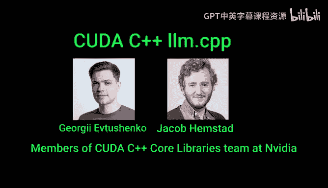
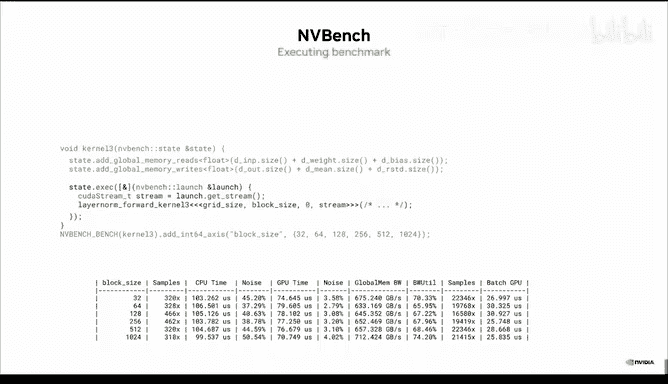
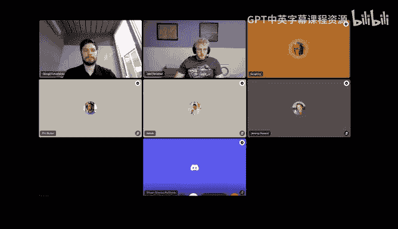
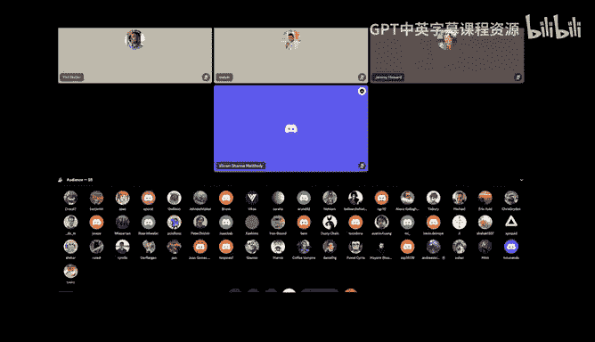
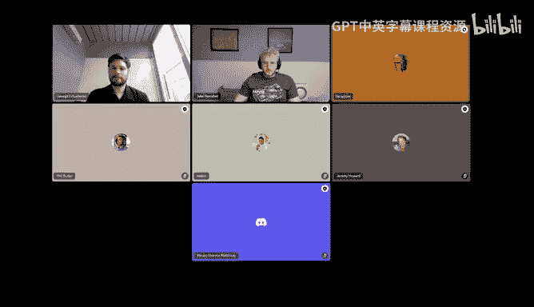

# GPU MODE《CUDA、GPU编程1-53课｜GPU MODE》中英字幕（deepseek-v3.2 - P16：-20240427-Bonus Lecture_ CUDA C++ llm.cpp.zh_en - GPT中英字幕课程资源 - BV1QZ421N7pT

All right well I think we can get started okay folks I've been like really really excited about the stock so the context behind the talk is like we've had like Carpathy developed like his own project from scratch called LMda C where the idea was just to build like a full like pretraining library and like pure like in pure C and Pu Kuda and it sort of like took our Discord group by Storm。

 there's kind of like a few like new regulars like Arun who just been you know I've certainly been like learning a lot about like their Kuda code。

And then basically the way this talk came about was we had Vikram who's like a regular whos a regular on our group。

 introduced us to Jay Kmstad and Georgie Yscheo who are going be talking us today about porting LLM。

c to basically LLM。c++ and so I would guess like the promise here would be that the code would be shorter and simpler I think C++ is sort of like very daunting for a lot of people。

 but it's honestly like why I'm really really excited for us to learn from like the real pros so please everyone join me in welcoming like Jake and and Georgie for the talk。

Awesome， very kind introduction。 Thank you。 So it's really cool， cool to be here。

 Gegie and I are longtime couder nerds and so we're excited to talk to some fellow fellow friends about this stuff。

😊，Ass a little bit of background， so I've led the Kuder C++ corere Libraries team here at NviDdia for the last two years。

Prior to that， I worked on the Rapids project where I did a lot of C plus there， too。

 And that's kind of where I first fell in love with Kud to C plus for libraries ors。

 I'll probably say from this point forward and just solve like the power they were capable and how much easier they made to do certain things when you're building like a real。

 know coa product at the end of the day and not like。

something for learning or for fun when you need to build something that like actually solves problems for people and actually use。

 you know， you do things a bit differently and have different problems you have to worry about。

 And so a lot of the stuff in CC made that so much easier。 And so was like， hey。

 I should go work on this to make this better。 And sort of been doing for the last two years。

 And so we're really excited about having the opportunity to。

Let people know about these libraries and they've been around for a long time and but haven't been as advertised historically。

 So we're here to change that。And so with that， Geor， you don't advance the slide for me。

So the first thing we should talk about is just like what， what are。

 what is CCPL or what is in it and the。Heagline that I like to use is that we make co C plus plus a speed of light De。

 And what's that iss supposed to mean is that we can have both high performance。

 bare metal performance and still have higher level conveniences that。

Eliminate some of the tedious or error prone pieces of of the language that C plus+ and C are far from perfect languages。

 But they're the thing we got right now。 And so we try and work the best we can within the confines of what C++ gives us。

 And Jake， will you be sharing these slides afterwards。 Yes， absolutely。Awesome。嗯。And so。

There's a handful of things that are encapsulated when we refer to CCL， there's Thr。

 which is the oldest of these projects。This is kind of high level CPUU GPU parallel algorithms。

 it is actually what inspired the addition of parallel algorithms to C++ in the C++17 standard。

 the authors of Thr work key in bringing that as a standard teacher to the language cu。

 which is a kind of a lower level algorithms library， it is KUa and GPU specific。

 it is what is used to implement a lot of a GPU backend。Live2+ plus。Newer of the three。

 this is aims to do largely two things， provide a heterogeneous C+ plus standard library。

 things like sp array， the atomic that work in both host code and device code。

 and then really core hardware feature abstractions so some of the latest hardware features in Hopper。

 for instance， like TMA， we have abstractions that target hardware specific features there。

Properative groups， I think。This was one that was already in use in LLM dot C when the first we looked at it。

 And so other。There already be some familiarity with this。

 but it is kind of at a similar abstraction level to cub。 and for， you know， warp level， block level。

 sub warp level kinds of things。And then finally， Nvy Ben is a。

Separate project from the rest of these。 And this is our benchmarking library very similar to Google benchmark。

 If you're familiar with that， but just made aware of GpUs and Kuda and。Out of bed。

E practices for performance profiling of， of kernels。

And the table kind of summarizes the things they provide and where you can find them。

 So thrust Cuub loop co plus plus cooperativeter groups。

 these things are all actually shipped as part of the couta toolkit。

And the first three are available on GitHub as well in the CCclL Repo。

These have been part of the coudta toolkit for a while now。

 we do support using it from GitHub if you want to like use a newer version then your kuda toolkit has。

 that is something we support， but if you prefer to have simplified dependency management just using a straight from the toolkit is the easiest way to do that so it' right there and available just like good string as a good vector is when you're using your normal host compiler。

All right。 Next slide。And so。I told you what's in CC L。

 but I also want to try and help form your mental model of。what。What it's used for。

 Why is it useful to you， Why should you care。And one of the ways I can try and convey this is if you're familiar with the。

 you know， standard T plus plus that it's really the combination of two things。The C++ language。

 which is the thing that defines how you write a function， how you write a class， etc。

And then there's a standard library， and that's where did vectors， did string， did see out。

 all of those things are provided， and it's the very fundamental general purpose。

 high quality abstractions。That more or less， the NEC+ plus program is going to want to use some subset of those things。

 And while it's possible to write a useful program without using the standard library。

 It's making your job far harder than it needs to be。And if you wanna click next word。

So the way to understand CCL is occupying a very similar role in what it provides to。

Who does C++ developers。And so if you think of Cudutter C++ as just being an extension on top of standard C+ plus like we have the first two bits of the language and the whole standard library。

 there's the coed language extensions that give us like global and device keywords。

And then CCCL is the moral equivalent of what the host standard library provides when you're just in standard C++ land。

 it see fundamental building blocks that abstract a lot of the monotony or the tedDium that you don't want to have to deal with or abstract hardware details and just overall make your life more delightful when you're writing code to C++ code。

And so go to the next slide， Jgie。If I like to think about。

The things we provide is just being cool in a toolbox， right， and。

One of the ways along which I think about those tools is a spectrum from high level。

 more high level productive abstractions for times where I just want to get something working very quickly。

Doesn't need to be speed of light， but I still expect it to be fast and or the other end of the spectrum of。

 you know， lower level， it requires me to worry about more details。

 but I get more control and it's always the trade off kind of between these two ends of the spectrum And it's always about finding the right tool for the job at hand that we're not here to really prescribe what the best tool is for you。

But， instead。Give you the tool that you want， when you go to reach for something that you don't have to make it yourself。

 it's just there and ready for you to use at whatever kind of level you're programming at。

And so starting on the higher end of the spectrum， in advance， we have thrust。

Which provides many different things。 These are probably three of the highlights provided containers。

Like device vector and host vector， very similar to Si vector。

 it provides parallel algorithms that can run on in parallel on GPU or CPUU。

 and then fancy iterators， which Georgie will get into a little bit later that really enhance the power of the algorithms。

The moving towards the right hand of the spectrum， getting a bit lower level， more control is cub。

 so this is couta specific， it starts with providing you know device wide algorithms。

 so think of just like launching a kernel from a host thread for things like sorting reduction scans。

 like these very primitive fundamental parallel patterns that if like you were first learning Kuta you probably learned you know a lot of these primitive fundamental algorithms。

thrustt and Cbs basically provide best in class implementations of those that will have the best performance on any hardware that is still supported。

 basically。And so going from device wide， going down into the layer of actually writing kernel。

 you know， CUB provides algorithms at the block level， at the warp level。

 provides a direction for the decoupled lookback algorithm if you're familiar with that。嗯。😊。

And then looking into Liku plus plus kind of provides things along this whole mirror of the spectrum that at the highest end。

 we have familiar looking types from you know， standard C plus plus like variant and optional an array or fan or MDD span if these types aren't familiar to you。

 we'll we'll get into those a little bit later。 but those are provided work in host code。

 work in device code doesn't require any efi compiler flags to make those work either。

And then we have things that are not in the standard library。

 but are still standard pieces of functionality。 So Mem copypy Async is a good example。

 I had mentioned earlier about how we have abstractions for hardware features。

 Mem copypy Async is one of the。异议。Hardware abstractions that we have today。

 It abstracts things like asynchronous load。Dotors from global in shared memory sorry from global to shared on Apere and as it was as DMA on Hopper。

And Mem copypy， I think is。Basically， just the M copypy API that say synchronous and abstract using those hardware features。

We also have atomic。Theses are really meant to replace the kind of C atomic ad APIs that you're used to today。

 and we'll see examples of those later。 And then all the way to the。

Almost at the right end of the spectrum are PT X wrappers。 So these are things that simplify。

 if you really want to get down to the lowest nitty gritty， you're probably doing in line PT T X。

 Well we have things that make that easier even still。

 So this has today exposure for all the hopper PT X instructions， I believe。

so why we're here today we already have our first question， like Chris Strideden is asking。

 they've been looking for a mem copypy async equivalent in C but couldn't find it， does it exist？

You see。Yeah。To using device code。I believe that's what they mean Yes Okay。

 so K to C doesn't actually exist。 NBCC is always a C plus plus compiler。

 And so if you're writing a kernel in the body， that kernel that will always be C plus plus code。

 So the short answer is no there is no C API you could use some of the inline P TX if you didn't want to use the C plus plus API。

 but just use the C plus plus API。Good。There's no reason not to。That answer。

 hopefully answered the question。I think just to explain where people are coming from Jake， I mean。

 people， some people like so for example， I was talking to Andre Kapathy before this and。You know。

 a lot of people have this kind of feeling of like。C++ is little boilerplate is really complicated。

I don't want all of my collaborators to have to learn this huge thing so when people say how do I do it in C I don't think they're saying like please tell me how to get the C only API they kind of like saying like how do I do this in a way that I don't have to learn the entirety of C++ which is incredibly complicated so。

What I talked to Andre about before today was to say like I think what we're actually trying to find here is like。

C+ plus the good parts or the subset of C++ that we all actually have to learn。

So that we can do the cool stuff without having。Not having to learn everything。Yeah。

 and that's kind of why we're here， right， is to show you the parts that we think are cool。

 how they work， why we think they're cool。 And it's really not to say if you don't use these。

 you're a bad programmer， it's just to say。😊，You should know about these tools。

 and here's how they work and kind of demystify them and make them less less gar and more approachable right because yeah。

 we're all at different points than our。You know， familiarity and strength with c plus plus。

 And we're big fans of of helping people along that journey because we're not dogmatic about it or like think c plus plus is the best language ever。

 kind of what I was saying earlier about it kind of what we have and might as well learn to use it to the the best extent that we can be And we don't do that。

That's for fun。 Like， yes， like， we do think there are a lot of benefits and we can make it a bit more approachable。

 And so that sounds great。 That's why we're all here。 So absolutely。😊，Where was I。 Oh， yeah， so。

You know in other versions of this talk we would have gone through just like overviews of the different libraries and stuff like that and walk you through examples of features。

 but it's always best to have an example right and especially an example that you're already familiar with and so what we did what Georgie did I did none of this work Georgie gets all the credit is refactor the LLM does the code actually more than the code as you'll see in a minute to just give examples of different things that we changed。

And why we change them， what some of the benefits are， how it works， and yeah。

 just to start demystifying some of these pieces but I got a quick question。

 Jake about the current slide before you move on， which is yep。Let's see you， plus plus。

 you know know the way you've written it here， it kind of looks a bit like it。

Is a subset of thrust and cub like do we need to learn all three of these things or should like we just be focusing on lipCU plus plus now or should we wait until the rest of your call and youre going to tell us that's a good question I can。

I can help answer immediately， so。The Kudus D plus plus core libraries。

Is a collective name for the combination of these things。

And it didn't used to all be together under this name。 They， they were born in a separate project。

 separate libraries and kind of have naturally gravitated together over time。

 And our long term vision is to。Literally unify them into a singular thing。

 but I think that's a goal we're going to approach aymptically like I don't know if we're we're fully going to get there。

 but we're getting closer every day。And the way。mentalal model I find helpful to tell people is to think of thrust Cuub and Liz co++ as three different namespaces in the same library。

 don't think of them as separate libraries and that over time that's going to become more and more true that they're not separate because like thrust and cubs for years now have been inseparable And so that's just going to continue to happen。

I to answer your question， Jeremy， it's think of it less as learning three different libraries and just。

Different parts of the same library。All right， so with that， I will hand it off to Georgie。

 who will walk through the changes that he's made and yeah， take it away。

First thing when discussing changes to。Performance critical called code。The first question to ask is。

 do these changes affect performance in any rate？And on this slide。

 you can see some performance results before and after changes to LMC and as you can see from the data。

 LMC performance is pretty much unaffected by all modifications。

And before we dive into these changes， I wanted to emphasize that the latest I more like discussion points to the story。

 so if you have questions and insight interrupt me at any points。All right。

 so let's dive into the changes and I'm going to approach the changes top down。

Starting with updates to the build system。And it's worth noting that most of the changes are discussed can be applied independently。

In other words， you don't have to change your build system to use CCL。Anyways， on this slide。

 you can see how we changed make the CMake and theMake doesn't lead to any code game differences。

 but it provides a few advantages。First of all， CMake is cross platform。

Unlike the original make file， C version works on Windows。And besides that。

 it makes senses to be less error prone。 For instance。

 a genomic file doesn't specify device architecture。So the cool code is actually compiled for am52。

Whereas you make， emits warning about missing code architecture。No。

So let's start moving towards call libraries call libraries are bundled with ka toolkis。

 This means that if you have a cota compiler call libraries is already available here。

But if you need latest version of core libraries。In this case。

 CPM can help us feature the latest version of core libraries directly from GitHub。

Getting latest version is useful when you。Don't want to wait for next Ktochi release to get some of the new CL fishes。

开 you。Now for this。We integrated the latest version of core libraries using CM。Now。

 let's dive into the first library thrust。For now， we'll focus only on how thrust can improve memory management practices。

One of the immediate benefits of thrust containers is that they managed memory deation automatically。

This means that you won't have to worry about accidentally forgett to delicate memory。

But let's move to less obvious those advantages。Beyond the memory safety。

 the thrust containers provide， they also offer type safety。

Let's take a look at the example on the slide。You can see how using good Me copy can lead to a thoughtful bag that compile accountt cache。

Were copying a complex value in an inter。Because they see API preparation bys。It compiles just fine。

Now can trust this with trust。If you try to initialize the device vector meant for integers with device vector filled with complex values。

 you'll get a compile time error。Overall， detect type safety issues that compile time can save you some runtime debugging。

But improvements are not limited to type safety。Those containers also remove some surprises from your code。

Take a look at this example with good MM copy when you copy an integer into the fl。

You'll get some strange results。With C， for instance， when you copy an integer into float。

Compile emit an implicit conversion。But instead of conversion， good M copy is just copying bys。

 so the resulting fraud might have no value。Thrus containers handle this much more intuitive if you initialize a float contained with an integer。

 container elements are properlyly converted。This kind of predictability eliminates a whole class of potential bugs that can be tricky to track down。

One important thing to note is that thrust containers don't limit you to a rigid set of functionality。

Theyre designed to be highly customizable， for instance。

 highlighted code illustrates how you can customize thrust horse vector to use pin memory instead of pageable one。

Now let's move on to algorithms。The LMC code on the left contains a bug that's hard to spot。

There are actually two problems with kM carpet。First of all。

 the value that's passed the co EmAT is assigned to each byte， not each element。Besides that。

 goodM copy accepts values as integers， so the incoming for is implicitly converted to end。

Looking at the code， mean is always less than one， so the value is surroundeded to zero and the resulting memory is filled with zeros。

It'd be challenging to introduce this kind of bug isn in thrust fuel M。

F accepts your value others and assigns it to each element following language conversion rules。

On this slide， you can find another example from LNC。Let's focus on the left kernelel。

While the code is functional sound， it's not immediately obvious what it's doing。

We essentially have to execute it in our mind to understand the parallel pattern it implements。

On the other hand， all on the right side， you present in terms。When you see transform。

 it's clear that each element of a sequence is transformed by provided function。

And the result of this transformation is written into the outputory。In other words。

Using algorithms to reduce mental load。Apart from that。

 using thrust algorithms can help abstract away the executor。At the moment。

 LMC doesn't share any code between OpenB and code implementations。

F allows you to redefine what device executes policy means for a given translation unit。For instance。

 you can define device system as opening P as the transform algorithm will be executed in parallel on CPU。

This makes it possible to share many algorithms between the open and code implementations without changing the code。

Moving on， the kernel on this slide is a good example of using hardware specific features。

The kernel utilizes streaming loads to make sure that the data resident in Casius is not evicted by the all loading data that's likely to going to be accessed to onces。

When transitioning to thrust cell gate on the right。

 the initial thought would be that we have to abandon the slow level feature。

But this is not the case。Another core library called CP provides specialized iterss that affect cache modifiers。

On this slide， you can see how we wrap pointers into cache modified input deterators。

The template parameter of this iterators we require loads to be streaming。

One of the advantages of iter based approach is that。It works with any type， not just build teams。

Other slide can see how cache modified inputerator is used to load complex values。Apart from that。

 Caing modifies。Is not limited to stream lawss。On this slide。

 you can see how we load data using noncoherent cash。For instance。

 this can replace restrict annotations on kernel parameters。

Another example of hardware specific feature that can be veryga is asynchronic。

Klonel on the left side is executed asynchronously。

 this means that the launching thread exit the residual forward function before the kernel completes execution。

On the other hand， Sarah the device execution policy is synchronous。In other words。

 current thread and won't proceed past the call to thrust until all the work on GPU is finished。

I would argue that this is a better default for an educational project like LMC。

 because asynchron is not something beginning programs I used to。That said。

 transition to synchronous programming model has performance implications。

If lack of a synchrony is a bottleneck for you。P no sync execution poles can make most of the thrust algorithms asynchronous。

Apart from that， it's also possible to use Ka power execution policy here to specify a couda stream。

So we have a question in the chat which is about whether with thrust。

 does that mean that we don't have to write goa kernels anymore？It's not exactly like that。

 but in majority of cases， when you can implement kernel as an algorithmm。Yes， that's the case。

If you need something like shared memory in the kernel。

 then for each or transform wouldn't suit you because there are no guarantees。

On how threads are mapped to tasksss， let's see。So as a reference in LMC projects are replaced。

I just something like15 kernels to 3。That actually has to be kernels。

So I see another question from Peter and Cha like basically how does thrust know the best grid and block size。

 I'm also going to throw in like my own question， which is like to me a lot of this like like when you say like something like you don't need like is it better not to have explicit control over shared memory in this use case like as in is the programming model closer to something like Trident or like is it still helpful for people to think about their programs is it still helpful to think about shared memory if you're writing a kernelels interest trust？

So I think the balance is。Plus， if。You are trying to implement a generic algorithm with your kernel。

Then probably it would be better to use thrust or cup。Thatll take care of shared memory， Victoria。

 losss， etctera for you。But if you need thread memory explicitly， like for URL gate and the。

What you're trying to achieve is not something usual。

 I'll get examples like that later but then you write a chel for question about block sizes， etc。

It's quite close the answer because。We经。I'll get them extensively on our end so you don't have to select block sizes。

 items per thread。Ging yourself。But this applies for generic cos again。

 so if you want a soft max kernel， you probably won't find it in trust and won't be able to implement using for each。

 but if you need a transformation reduction， scan， sorting， stuff like that。

You can expect better performance from to us。In most cases。We have a work that is。

Havingapping right now about， actually。Letting you specify。

Block sizes and different tuning parameters。As the thrust API。But currently， you can't do that。

So if you wanted to implement something like flash attention where you're doing things tile by tile。

 you know， and you've got softm in there and stuff like that。嗯。

You wouldn't be using thrust for something like that。I would probably not。But I would use different。

Obsstructions I'll get to so I think I have layer norm kernel example later。The remains of a carel。

I guess related to that are reductions， I see Jake already answered and shut。

 but like Austin is asking， do thrust reduction abstractions implement parallel reductions automatically？

Yes。And it's done for both。Could the execution policy opening D， T B sequential， like you can expect。

Pro limitation there。All right， there's a lot of questions coming。

 so just feel free to please keep going like we're going to keep interrupting you。

 sorry no problem please interrupt as I said so。Let's dive the device code for a while。On the left。

 you can see some repetitive code pattern in LOMC。The code unfolds linearized index into multidimensional components。

And on the right， you can see how some standard types can help make this task a bit easier。Here。

 I effect the index computation into a standalone function。 This returns cutest to T。

I then use C++ 17 structured bindingings toner Tple interface components。

 and overall this allows us to follow Don't you repeat yourself principle。Okay， a smaller recap。

 so let's consider the kernelal on the left and try applying some of the abstractions we've seen so far。

The chain load can be replaced with cache modified inputederator。

 The index computation can be replaced with the helper function to introduce on the previous slide。

But it's not immediately obvious which thrustile would replace the kernel itself。

And look in the kernelel we。Cater elements from input to outputary using some complex mapping。

We can express that using thrust scatter algorithm on the right。

Got on the right introduces two new abstractions at the same time。Transform and counting into。

 So let's break those down。And start with the gu。You can think of Guning iterator as a pointer to an infinite series of natural numbers。

 starting with a given offset。All the operations you'd expect from a point still work with gouning iterator。

 so you can dereence it。Advance it， et cetera。And here we construct a counting iterator with an offset of10。

And where are we using subscript operator incoming indexes combined with the underlying set？

Then the second iterator used in the code is transform iterator。

And transform iterator consists of two things， underlying iterator and the transformation。

So when the transform iterator， dereences underlying iterator applies a function to it and returns to the result。

So when you do reference to the first element， underlying counsel iters returns stem。

T is passed as an argument of a transformation which multiplies it by two and finally the referencing transformative rates have returned to0。

We can the alternative。To me， like feels a lot more complicated。 And I'm wondering like， how。Yeah。

 how to kind of go about rebuilding that。 I guess the first part that makes it complicated is。

Having a lambda there。 C， plus， plus lambmbdas are。A bit quirky。

 is that something you could just pull out into a normal function or does it have to be a lambda？

Yeah， so lambda just makes it code a bit local， but you can absolutely extract this into a separate standalone function。

It won't be like it won't be a function。Because you take an address of this function on CPU but the algorithm is exhibit on GPU and this doesn't work well。

 but you can define a tract with overload the tapator coabator and this would work。Okay。

 that still sounds a bit complicated。 And then the second bit that looks complicated is that carb cash modified input operatorator。

 carb loads C that like。There's a lot going on there。 And like， how would we know。

To use that particular。Thing， you know， like this， I guess like in the left hand one。

 it's more lines of code， but they're all like。A very small number of concepts to understand is that like yeah what what's going on with that cache modified input iterator thing and do we need that and is that something we should like use all over the place or do we need different things in different places or。

Yeah， what's going on there。And I don't think I completely answer the question。

 so is it when do I use cache modified input rates or how the on amount it？

Like I did also want to mention one quick thing like I do see a lot of like the LLM。

c developers are in the audience like there's like Pete Re， there's like there's like of course。

 like Andre there's like a ruin so if y'all have any feedback and you want to come up on stage and ask questions to like I think people would love to hear from you So just like raise your hand then I can let you on Ge you back to you。

Yeah， I want to double check what the question was， sorry。It's more of a high level question。

 like it's it there's a lot， it seems like there's a lot of。

It feels like there's a lot more pieces to learn like like kind of like a really possibly really large surface area of new things and like so I see this like new thing I've never seen before Ca modified input iterator and I'm thinking like。

 okay， is it like。Hundreds of different things that we have to learn about or is it like just a couple because like if you compare it to the current one on the left。

 there's a really very small number of。Kd of fairly well defined pieces that we're putting together Yeah I would because you still to you still have to learn about LDccs right you don't know about it as a C++ developer。

So then you have to learn about restrict annotation on the kernel parameter right。

 and those are somewhat independent pieces of Google language。

But when you learn cash modified and input the rate。You can go to。Dcumentation see。

 how do I do stream laws， how do I do monkey hearing cash and such。

 so it'll be a single place like aggregating this functionality for you， right？

So you still have to learn on something， that's one the point。

Sure that's fine I'm just giving you my feedback as somebody who doesn't understand this area of how it feels is like Im feeling a little overwhelmed and worried and I want to know like how big is his surface area so if there's very few additional new things to learn like maybe there is a couple of iters that's great or do I have to like read a thousand page book or maybe that we'll get a better of sense of that as we go through the talk。

嗯嗯。Are there any other questions or we should proceed？

So there's a couple of questions that are related like one is so I'll just try read both so Peter I think was asking a similar question to Jeremy which was like how would I know that this feature exists and I also see NGC saying he thinks this is two verbose if you define a helper function load SCS that hides this huge type name it would be more readable。

So for how would you learn about that， I think the answer is you would go to Se documentation。

And familiar race with the。Facilities we provide all alternative we attend this talk where I try to explain these abstractions。

诶。For vers， coion。That two always right。There is more text I with that。 Like it clutters the。

Cold a bit。 But having something we both means you don't have to。诶。

Imply that person reading this code knows what LDCS is， all right？嗯。All right， yeah。

 I think we can keep going it。 There's just been a lot of questions。

 but like I'll just we'll come back them。Okay， I think I stopped here。But transformations。嗯。

So finally， we can use combination of transformative rate and counseling trade to。

Create a nutraator that x has in mapping。And one of the benefits of doing so is that mapping is reflected out of the kernel of the algorithm and make it easier to reason about。

Finally， we can pass this mapping it rates scatter algorithm。In the behavior of the original caramel。

Okay， so returns to the device code。I wanted to discuss the permute kernelel。On the left。

 you can find some complex computations which essentially implement a multidimensional indexing。

And what I wanted to focus your attention on is the comment on the dynamic sorry。

 at front time we use dynamic extent constant。Through all the。

And this span obstructs the underlying memories accessed。On the slide。

 you can see an example of accessor that streams loads when invoked from device codes。

The distinguish between the cases when a given function is invoked。By host or device an if statement。

When the code is executed on the device， true statement is selected。

We discussed study can be applied locally and we don't force you to read the whole program。

 It can abstract where this algorithm executes some device holds open indeed， stuff like that。

8ynchro。 So it's like launch a kernel No difference Itll with the MD span you showed before how you can select you could with like a Pyth tensor。

I don't think that this is possible， I don't know。ok。

I think we've gotten that abstract that doesn't provide it out of the box。

Cos on the slide understand so let's focus on the original code for now the code on the left here we start by applying logith to probes then write the result to losses array using some complex mapping。

And then we copy losses to the host memory on the right build on this idea。

Imlomenting the coith and permutation as three。So that permutation and transformation is fused with the reduction kernel so here like yeah。

 I mean like I quite like the code on the right like it looks very functional I can imagine you have like arbitrary pointwise functions and they're all iterators like that all makes sense so how do I know that this is fused though like the single kernel。

Yeah， so good question， thank you。Really distinguish between pointers and iterators。

 it all just the references。And since this permutation and counting is done inside the referencing of。

So's just jump to the visualization。Here is of that as a single reduction kernel on GPU。

One of the advantages is that only a single float is passed through PCIE as opposed to the current solution that copies the entire loory。

 and although the usage is absolutely correct， I wanted to mention a few advantages of lipup set of built in types。

But most importantly， by looking at the original code Xatomics a device code。And。

For those who are not facing local level cooperative algorithms like block use。

 and this allows you to assign up to 1024 threads per。Decreasing the items per third ratio。好。

The final change I wanted to performance measurements。Apart from that。

Performance data is rarely normal and offbech framework。

Envi B is specifically designed to reliably measure Leno kernel。

Let's remove code that's not specific to N image image。On this slide。

 you can see all the individual specific code。And here we start by registering benchmark。

Apart from registration， highlighted line also creates a data access。

Just like in the original benchmark， we are trying to understand how various block sizes affect performance。

Andw bench will invoke benchmark once for each block size。

We then start the benchmark by reporting the number of bytes the kernel is going to read and write。

Everyvy bench is using this information to late report bandwidth with utilization。And finally。

 we execute the benchmark。Exec function invokes provided lambda many times。

The statistical engine that I mentioned is implemented inside the exact function。Below。

 you can find the example of Envy bench report。As we discussed， we have one report per block size。

Each report contains bandwidth utilizationization number of times the exact function both the kernelal and averageapse times。

 etc。So I know we covered it a lot， so let's check up some key takeaways first of all。

 try not to use rural locations prefer thrust containers instead。Before writing your custom kernels。

 can see the thrust and cup algorithms。And if you can't achieve something with all items。

 try extending all items with fancy generatorators。

When authoring kernels use cap bulk wall algorithms for speed of light building blocks。

Use code atomic reference instead of atomic intrinsic and try using familiar types like array variance。

 T optional， etc。General devicess are used CMake for convenient and robust could the C++ build system use envyB for statistically sound to the benchmarking and MDDpan for multidimensional data。

But if there is one thing we'd like you to take away from this talk is the following。

 always think like， can I solve this task using call libraries first？

And if the answer is no for anyneurism， please let us know。Counter did help people ask questions。

 collaborate and contribute。That's all we wanted to share today。Awesome， yeah thank you so much。

 Georgie and Jake everyone， please give them tons of emojis。

 tons of like thank you I think this is like a very dense talk like and so I think that people would have a lot of questions So if you want to come up on stage and post your questions in chat please feel free I'll start reading them out Geji I guess I'll start with one question I had which was so I noticed you mentioned like Nv benchnch for like better statistically sound benchmarking I've been bit by this trying to write my own benchmarking Kluto code and then once I started using NC you know life was a bit better so I'm sort of curious like when do you reach for enVbench versus NCU。

😊，Yeah， so。That's a very good question unless it's on here。I would say that NCU。

 like inside computes is for。In depthth hardware were understanding of a given kernelel。

Anb can give you some of that， but not all， it will not show you like how a given instruction。

Which portion of the kernel it occupies？Right。What everybody should give you is something close to performance C so you can compare two different kernels you can。

Track performance regressions， stuff like that。 Secondly， it's somewhat a。

Research tool in the terms that you can。Have different data access like box sizes， different。

Entropy for your data， different characteristics that you'd like as a search space。

 you'd like to discover。Performance for your kernel inside compute does not give you that it you're responsible for permuting all of the like preparing this matrix Cartesion product of all combination age to them。

Hes a metaphor I'd say NTU is a debugger for performance。 envy Ben AR unit test for performance。

 They both help you find bugs in different ways。Or performanceformance， I guess， performance issues。

Jake and Jo， I think the question is basically， when I planning to open source Discus。

 it's currently a private right job。Yes， got it。 Sorry， The updated code。

 Georgie that you wrote for LLM dot see We're currently waiting on our legal to hit yes as just low。

 We're not anticipating anything， but they get grumpy at us if we。

Put code out there without getting approval first。 So since this was fairly short notice。

 that's still happening。 but I expect that to happen by next week。 And yeah。

 we'll'll open a PR with as much or as little of this as wanted。

And yeah， look forward to having more conversation and discussion about different changes and stuff in that PR as well。

I think there are so many questions that are coming in the chat I guess。

You can take one of those the question is what is the license for the modified code are we changing the license are we going oh no no definitely not no definitely not it's just yeah the legal approval thing is just。

Picking a checkbox。It's just a classic big tech thing no no one should be surprised。

 we all did the same thing。Can I come back to my earlier question then now that we've first seen the slides about like how you would implement something like。

Flash attention， where。You know， that algorithm goes tile by tile。

 and then on each tile it does like。Some matrix mode applies and it does some softm。

 and it does some element wise operations， and it does that all lake。Yeah。

 making sure it's always working on shared memory。At each point。And of course。

 also using tensor core where possible。 So how yeah， how would one create。

That kind of tiled algorithm where quite a bit of stuff is happening on each tile。With C plus plus。

 is it， is Cub the right place to look for this， I I saw it towards the end of the slides What recommendations was to use Cub for that kind of thing。

Yeah， so I think we。Mental model here that。Would you expect this algorithm in standard library for the current？

See functions you have。If not， then it's probably like。Up to you to write it。

 but it doesn't mean you will not use any of this seal so flash attachment you explained its it doesn't sound as a generical gaon right and relate to any domain。

So it's not something you would see in C++， it's a specific algorithm for tape learning。Great so。

You can express something like Red use and exclusive scan sort。On device level。

 but not like flash attention。As a standard obligation。

 so thrust and cap on the US level are more like standard library。So they will not provide you that。

But on the device level， when you write your own kernel， right， at that point， you can think， okay。

 what I you need。I probably need a reduction， right to compute some at some point。

This is a generic algorithm and it will be available to you in device code。At some point， you might。

Ask like， okay， I need atomics。 Atomics has standard types。 again， they're generic。

 and they' are provided by lip pass pass， same for T。Anything to do with matrices probably。

Not a good fit for a cup。So you would reach different libraries that's a specialized for month。

probably although you might at least use M span， I guess or yeah， you could use MD span definitely。

 but yeah， definitely the mental model for like stuff that CCTL provides is is。Very domain， agnostic。

 like very general purpose， fundamental things like sorts and reductions and stuff like things that。

You oftentimes need when building up more complex pieces of functionality， But you're not。

 there's no like matrix vector multiply or like matrix matrix multiply kind of stuff like that。

 We leave that to the， the other professionals， like cutlas and the math libraries and folks like that。

So I see one question around education so I'll also batch another one in mine So Arund is saying his main feedback is that like it would be really nice if you could like add more comments in your code just so that people can learn about the constructs without this presentation and I guess like I have like a follow-up question which is like like have you thought about like basically what this might look like in a textbook format just because like like I would imagine you can sort of like the sugar things or you're sort of like limited by page size and what you could fit so like let's say you do another iteration of PMmpPP that's that's6 plus plus focus have you thought about what that might look like I think I probably have to take that question Benman and I have been discussing about this for some time and one of the biggest question that we have right now is that is it a。

Core parallel programming primitive， or is it a simple plus primitive。

 So does it have to be in the parallel programming domain side or does it have to be in the C USA side。

So that is the biggest debate that we have right now and because that would basically define what the chapter should look like and how should we define this chapter card alternative we are also thinking about like should we actually make this essay project in the pmp book so there are a bunch of ideas that is floating around nothing concrete so as we work towards the next version of the book I think we might have more ideas so there's a good question in the in the chat which is about whether you folks have seen any。

Kind of really good what you would think of as like role model examples of people using these C++ libraries for machine learning code or maybe for linear algebra。

Type stuff that we could perhaps learn from other than this one that you guys have just built。

That's a good question I linked in the chat we have on our readme a incomplete list of projects that I could find after a few minutes of searching on GitHub for people using CCL today some of the ones that I'm most familiar with because I worked on were a lot of the rapids libraries so things like CoDF。

Kimel raft。Coograph， all of those things are are using it。 Madax is another good one。

 that's kind of like a。

Dumpie， like array processing library and C++， and they do some really cool expression template stuff。

 I know they're using a lot of CCL。嗯。You you missed P or sentence a photo， right？Yes， yep， yep。

 it's being used byy towards tensorflow。Like， actually， I know。

 like the sorts and scans and reduces are being used there。Kup， Kupai。

 sorry that's another really good one。 Like Kupai。Is like a GPU nuy。And many of the array level。

APpiIs are actually implemented with thrust。That Kupai implements a layer Python layer。

 basically on top of， and top of thrust today。So some other things include also require handles。

 who Blo， Nicole， I believe there are some others， those also have the same forget to call free issues。

 can those be simplified by CCL？嗯。Not。Today， no。Though。I do。

I can period that I know that the math libraries are kind of working on higher level C plus plus interfaces sometime in the future。

You could， I saw someone just responded， yeah， you could。um。😊。

Implement that yourself with like a unique pointer。 But like。

 we don't have rappers out of the box for like co off handles They like。

Nel handles or anything like that today。There's a question here from Aund which is out on cooperative groups。

 what's the benefit intention of using CuB in your example kernel， he says。

 I believe it's already possible to use cooperative group productions。For entire blocks。

Is there any reason the C cooperative group API should be inherently better。嗯。

I don't think seizure is useful Vo code。At least for any type。So。

I think the only option is v use in this case， from cup。But again， given。

Bly use is available for CG main reasons here to illustrate what options you have when using。This he。

 so。Cap provides many algorithms at B code。 You can actually expect things like run length Ds。

Ptyific sum sorting likeable。Block match salt facilities。Already thank喂。So it's small about。

Showing you abstractions。Directing you to use cup writing。Also add that。

As I said early on that like these are separate projects over time， but are increasingly。

Getting grouped together。There is a lot of redundancy between cooperative groups and and cub today。

 and that is something we're working towards eliminating in time and。Today。

 for like the device side algorithm kind of stuff， our general recommendation would just be used cu。

 There shouldn't be any performance difference between the two and generally cub。Provides。

Broader range of things than than cooperative groups does just in terms of algorithms in terms of like actual thread group primitives of like。

Bamically， partitioning thread groups and stuff like that。 like CG' is still the way to go。

 But for just algorithms， come is would be the， the preference today。

It's also one of the distinguished practices that CAP is generic A。

 so it will work with many types again and you can put people variant anything as argument types。

Where S CG works with buildings。The good question here is。

 were you able to use NV benchch to increase performance over LLM。c？嗯。Yeah。

 I think in one of the benchmarks， I improved performance of land and norm。就通。Using but beach。嗯。不是。

Out of LMC projects。We actually rely on Envy bench a lot to discover better earningss for our kernels in cup。

We have many excesses that represent gene parameters like L latency thread block size。

Backoff mechanism for the couple of buck。 So overall this creates like billions of variants for our kernels。

And we use every bench sheet as part of our。Tunening automation select better performances。

And we were able to discover something like 70% speed up for some of couple reasons using this approach。

Yeah， someone had asked earlier。About how our algorithms decide how many blocks we use and block size and stuff like that。

And you had answered it well at the time， but too modestly， perhaps that。

A lot of work is put into that。 And it's work that that Georgie has done。 And like you said， it's。

 it's a。Billions， if not trillions of parameter spaces， just for a single algorithm to pick。

Best set of knobs to set for an algorithm。 And so we actually have a very kind of elaborate。

Annetic search algorithm for， for searching that parameter space and finding， you know。

Local optimal solutions。 And it's a heuristic。 So there's always going to be cases where you'll be able to pick things。

And we can for your particular use case， but we really try to pick the best things for the most people in most cases。

 and one thing that we're。Working on in the very near future is for those cases where hey。

 we ended up picking bad for your use case， still giving you the control to control those things。

Well say this is sort of one the one of the earliest questions that came up out of this group and even people were like。

 well， like you should be able to automate this and I think some people in the QUa group sort of likened this to doing like you know why isnt machine learning that because neuro architectureitect search exists and it's just like well。

 it's just a really big complicated space is sort of the short answer？Well that's awesome I mean。

 if y'all are ever interested in speaking here again， I think we'd love to have you。

 I think that would be like a very hot topic for a lot of people that they'd love to hear more about。

So I do see some questions like slowing down so maybe it's like time to like wind things down like thank you so much like Georgie and Jake like honestly this was this was fantastic like I really hope that as people in the group like ramp up on Kudos C++ like please feel free to add Jake and Georgie to learn how stuff works。

And yeah， and hopefully convince we can convince you guys to come again soon。Thank thank you。

 Yeah and and yeah and oh yeah， cool you got a shout out from Andre too and yeah。

 so so so our next meet up is actually not going be next week。

 It's going to be tomorrow like we have Taylorrabi from Prich Lightning who's going to be talking about some tools he's been building and profiling So yeah。

 thank you so much everyone and see you tomorrow。😊。

bye。

