# GPU MODE《CUDA、GPU编程1-53课｜GPU MODE》中英字幕（deepseek-v3.2 - P17：-20240429-Lecture 16_ On Hands Profiling.zh_en - GPT中英字幕课程资源 - BV1QZ421N7pT

🎼And Thomas， are you both like Eric colleagues at lightning or， I mean， lightning is not that large。

 right？ It's like 50 people。 Obviously， not all of them are engineers， and so。

I basically know most of what I know about profiling from Taylor。

 which means that I didn't know that much before。Before Taylor talked to me。

 I guess that just means I did a bad job documenting evangelizing when I was still at meta it's okay and now you're paying for it with more meetings so it works out so you see you left skin in the game so it's fine yeah。

And obviously， I mean， I saw Taylor doing internal presentations at Lightning。

 and so I immediately say， well， yeah， wouldn't this be something for the Ka mode？

And so this is essentially how it came about， too。Yeah， cool。 I think we are ready to start。Hello。

 everyone。Thanks for tuning in to。16th Cuda mode lecture here on the Ka Mo Discco server。 Today。

 we have a special guest Taylor Robby from who's working at Lightning AI and an expert in。Profiling。

 and he will talk today about profiling， I guess， like also Pytorch also hurt in advance that he will do a really hands on interactive session。

 So no prepared slides， but really looking into the code and profiling actual model， I guess， yeah。

 so just as a quick reminder before we start we do this normally for one hour。

Please use the chat which comes with the stage channel to ask questions and we will try to yeah forward them to Taylor if this is possible Taylor if you are would be great if you could do a quick introduction about yourself safe and in the beginning and yeah the stage us so yeah I'm Taylor I'm an engineer at lightning before I was at lightning I was on the Pytorch team doing various profiling and runtime optimization stuff and my background has traditionally been in profiling benchmarking and model optimization so what I thought I would do today is rather than you know come up with a bunch of prescriptive slides just pick a model start poking it with various profilrs show how various tools interact and what the tradeoffs are when using them and then just kind of go through the process interactively of optimizing model what。

Means is that feel free to jump in at any time if you have questions about what you're seeing。

 if you have sort of hypotheses， again， this is meant to be a very interactive session。

To start off with。For those of you who don't know Lightning has a product called Studios which is an interactive collaboration environment for coding and particularly with an ML focuscus and so what I did is one of the features that lightning has these studios are that you can publish a self-contained set of code and then duplicate it and run it on your own cloud hardware and so what I've done is I've gone and I've picked one of my colleagues has published this studio on how to finet the Gemma model and so I've duplicated it and then we're going to run through it and then sort of see where the gaps are and how we can build them up so。

The first thing that we're going to do is just sanity check that we can run it that it's using the GPU etc so we run this code and if we go over to our GPU metrics this is essentially NviIDdia SMmiI with an nice goI in front of it what you can see is that it will use about 80% of the GPU now it's worth noting here that in this case again this is NviIdia SMmiI utilization so it just means that something is doing something on the GPU but we need to dive deeper to know if it's actually sort of making sensible use of the card so if we go ahead and cancel this。

The first tool that we can turn to is one that I imagine this group will be quite familiar with。

 I know a number of previous lectures have used it which is NSI systems so if we were run this command I ran it just a little bit earlier so I'm just going to jump directly into the trace what we can see here is first there is a lot of startup time where we're not really doing anything this is pretty normal and we really only care about the steady state。

And then to make things a little bit easier， I've gone and I've added NVTX markers so that we can at least have some idea of you know where these kernels correspond to our code so what you can see is the first iteration is much longer than the others this again is very common because the system is warming up caches are being initialized poles are being created that sort of thing and then as we go on the we get to closer to a steady state。

The other thing that we'll notice as we look at this is it's not a particularly inspiring picture right out of the gate。

 namely if we look at our warp occupancy， then what we can see is yes。

 we're doing stuff but we're not making particularly good use of the hardware so but it's also in this configuration somewhat hard to drill down into why this is happening because if we go to the p kernelnals and what's actually being run。

And zoom way in you know we'll see things like Atless Okay。

 so there's a gem in there somewhere we can see gem here if we zoom in we'll see okay。

 some flash backward， but it's very difficult to go from this kind of view to something prescriptive of what should you actually be doing to optimize your model So there's another tool in Pytorrch which is the Pytorch profiler and I've done a little bit of instrumentation ahead of time to。

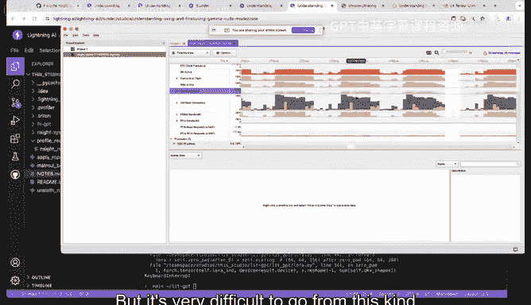

Call this in a somewhat sensible way so the API here is that with Torch profile profile and then you run your code and inside the code I have it so that it's going to stop after a couple iterations because all of these profiling systems are collecting a huge amount of information and as a result if we collect more than a couple steps we'll essentially have too much in the entire system will peele over so we're really just grabbing a small snapshot and trying to extrapolate out from that。

So if we go ahead and。Run this。And let's give it a moment to run you can always share fun anecdotes like well this stuff is running。

Yeah， so I think one of the things that was kind of interesting is as I was putting together this talk。

 it really went in a very different direction than I expected。

 so I expected it to be a principally colonel's talk and some of the initial stuff that we'll see really seemed to be going in that direction and then it really skewed into a systems talk and speak of the devil。

All right， so the principal artifact that you get out of the Pytorch profiler is a Chrome trace and。

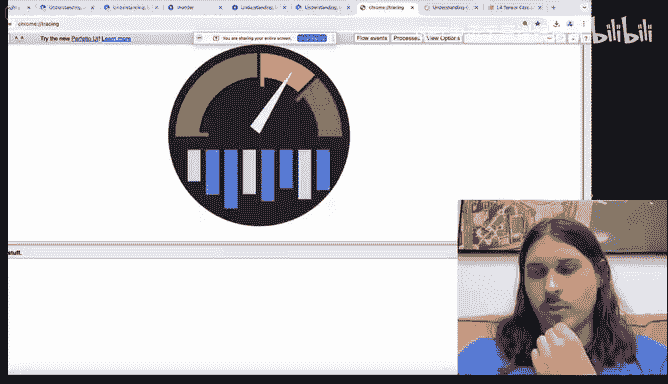

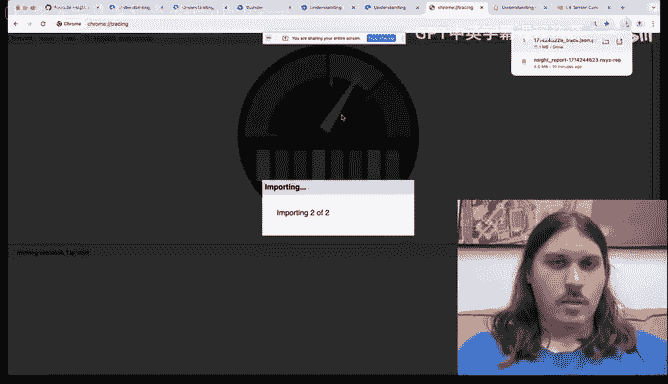

The way that you read this Chrome trace is time is on the X axis and then it's an icicle plot showing stacks so let's ignore this part for a moment and then and this is unrelated instrumentation and then let's just go into the stream so this looks very much like what you would recognize from Nis you've got go kernels and then they're in sequence now it's worth noting this is less detailed than when you would get out ofenssC systems this is mostly just showing you the time of the kernels and there are some statistics around the grid in the block but again it's much less detailed but the tradeoff you get here is that this is aware of the pytor run time so if we select a kernel then what we can see here is we can walk up to the source code so what you can see here is that we can walk up to the matrix multiplication and the linear and we can walk all the way up to where in the code this came from。

And this is somewhat useful because when we're looking for gaps in the profile。

 we can see okay this is a gap somewhere around the RMS norm layer right because I see before here and then after so kind of psso facto this gap has to be coming from RMS norm and then can just typically the way that you go about optimizing these is you just kind of scan around and you look for gaps and then you try and build a narrative around why these gaps would be there one thing that I wanted to point out as the sort of analog here and why it's very important to get into steady state is you can see you have this initial regime which is the first step which looks very different from the much more regular structure of the second step the other kind of pattern that I want to point out that you can use to kind of at a glance figure out what's going on is。

The forward pass is your Python code and so when you see these deep stacks of source code。

 this tells you that you're in your python at some point you're going to call backward and it's going to switch the C+ of the autograd engine and the way that's going to manifest is you're going to block in your thread and then you're going to switch over and start dispat and working C++ on a separate thread and so this is just a very easy and convenient way to differentiate between the forward and the backward path So we don't want to look at this because again。

 this is not going to be particularly representative。

 So instead of what we want to do is we want to zoom in on the coa stream and what you can see is you zoom in is that the somewhat regular pattern starts to emerge where。

You have a couple of these gems that are sort of big and bulky and saturating the stream and then you have the clusters of kernels and if we zoom in on what they're coming from they are these element wise and if you were in inside systems and what you would see are things like knit index element wise kernel。

What's nice about going from this direction is that you can then map those back to something sort of in your source code that you can that you can work with and in particular if we zoom around。

 I think it was here。But we'll notice。Yeah。So。Actually。

 the first thing that I'll point out is that there's almost no difference between the launch time and the execution time right in a well behavehaved Kuda system。

 then you would launch this and then you'd have a full work queue and much later the kernel would actually be run。

 So instead what's happening is we're launching it， this kernel actually has some work。

 but then it runs out of work and is waiting for the next host kernel。

 So if we so Taylor Sch up to there's already a bunch of good questions So maybe let me just go through them so Eric is asking should we think of theic plot as being local to1 or spread across all Ss do we expect all Ss to be running the same kernel at the same time。

Good question so it is not local to one SMM and in fact if you were using multiple streams。

 then you could have you multiple kernels overlapped and the KUDa hardware scheduler is going to try and allocate SMs to these kernels as they are available。

So no， it's a many to many relationship。RightAnd then the second question and I apologize。

 it's an acrylic name， so I don't know how to read it， but they're asking。

 like can you convert these stack traces to a flame graph？嗯。Yes， so you actually can。

Why don't I just go ahead and segue so one of the things that initially prompted and this is not exactly a flame graph。

 but you'll see in a moment why how it relates。

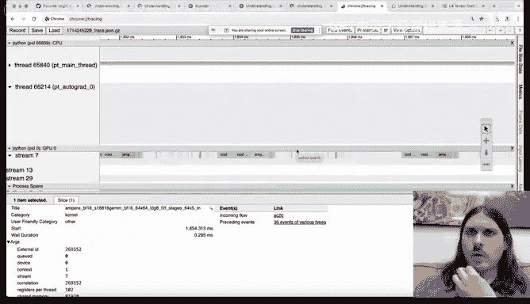

嗯。So one of the things that initially prompted this talk is I've been doing some work to try and integrate the Pytorch profiler into the lightning platform and try and make some of this easier and one of the things that you can do when you sort of own the system end to end is that you can start to do tweaks to the environment that enable cool things so in this case what we can do is we can start to instrument the processes been felt so that when they're triggered they will collect a profile。

So this is going to take a second to run and then post process。

 but when we come back I'll be able to show some of the initial aggregation that is sort of analogous to flame graph and flame graph is planned for this essentially you could turn this into a flame graph by doing a summation over all of these icicles。

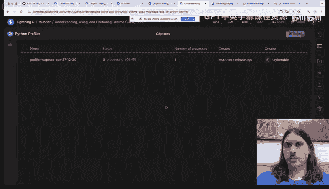

So Yu is now asking another question， which is like I'm going to rephrase the question slightly。

 but like can you， you generally figure out like differences in GPU architectures like do different GPU architectures would they end up having like slightly different traces？

嗯。You mean like Volta Ampire Hopper， et cetera。 Sure， yeah， yeah。

 so there are a couple of things that you will that will immediately jump out of you at you。

 So the first one is pretty much all of the gem kernels will be prefixed by。

The architecture of the kernel that they're optimized for。

 but the other thing that is a little bit more and some of them you'll see will be very characteristic so for instance。

 like if you see a Tf32 map mall that has to be NPpR later but you' notice so I'm running this on an L4 I have the L4 data sheet handy and later in the talk what we're going to do is we're going to start comparing the kernels that we see here to the what we see the data sheet is predicting for various things and what you'll see is that there's a essentially a very strong correspondence so the architecture will generally tell determine what is the limiting factor for these different steps。

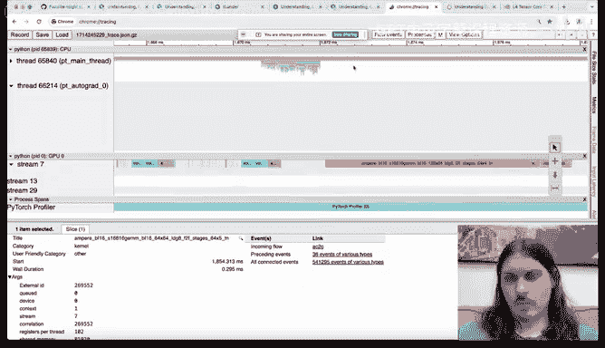

Exllent， yeah。 thank you， Taylor， back to the talk。ExceentAnd yeah， so by the way。

 you can see this has completed， you can see it happened to capture a very sparse region。

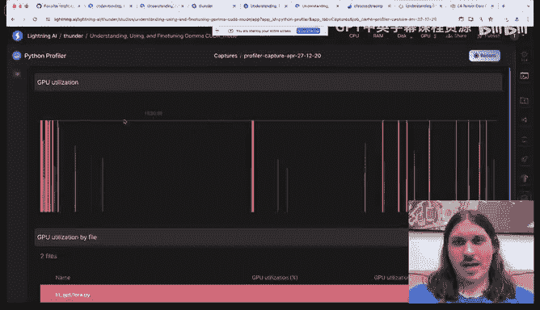

And。If I scroll down sort of what I'm working on is doing aggregation of kernels to source code so that you can say okay。

 you know within this I'm spending a bunch of time in this particular linear layer。

 so rather than having to sort of squint at the Chrome trace and say。

 yeah roughly where visually where does it know you can come over to here and say okay。

 you know these are the parts of my code that are hot。This is pretty sick。 actually。

 I think that there's someone in chat who agreed。 There's two people of Jonah Turner and Evelyn Mitchell both agreeing that this is awesome。

 I remember scaling had a similar UI that I thought was really sick。

So it's like really nice to see this like in an end system I guess though like the fact that8 and linear is slow is it like how actionable is that like that one's a bit trickier right because like it doesn't necessarily jump out to anything that you might want to do with that quite yeah sorry。

 could you repeat the question like the fact here that it's a linear layer that's slow is not like particularly actionable because like a lot of the sort of common optimization techniques that we might use like fusions don't really apply here So yeah yeah so unless there's another one you're thinking of。

Yeah， so。I'm actually going to kind of slightly skip ahead because I do think that this is a very important question of you see a gem and this is kind of the same thing that I was saying you know when we got here。

 which is all right， I see a gem， I'm saturating my stream on a gem so life must be good right but if we actually take this and we follow it back to an example here。

 I'm going to pick this one here， so if we look at。So this kernelel took。About 300 microseconds。

And from here， what we can do is we can say。All right， let's look at the shape of this。

 So one of the nice things about the profiler is it captures these shapes so 61 by 2048 by 1634。

 so if we do a little bit of back at the envelope of math， then what you can see here。Python。So，61。

It's 2048 time right this is the cubic of a matrix multiplication， you're doing two operations。

 you're doing a multiply and an ad and then divide this by 1012 forter flops and then the other thing is that from a data sheet perspective so this is sparse but cut this in half and you get 121ter flops is the data sheet flops for an L4 so 121ter flops and then multiply this by 10 to the six to convert that into microseconds。

And if my mouth is right， this predicts that this map mall。

 if you are sort of hitting the data sheet flops should take 33 microseconds instead we come over here and we see that it's taking 10 times that。

 which is a little bit interesting。But on the other hand， if we look at this slightly differently。

 right， if we say 61 times 2048 plus 2048 times 1634。

So we look at what it takes to round trip the way through memory， there B float 16。

 so there are two bytes per weight and then divide this by 29。

And then the or the data sheet memory bandwidth， Bt L4 is 300 gigabytes per second。Times 26。

Well now this is predicting that it should take about 225 microseconds at a little bit of overhead you're never going to achieve sort of true peak and this tells you that even though this is a gem。

 it's bandwidth bound gem not a compute bound gem and if we sort of look at the shapes。

 then this makes a degree of sense it's completely dominated by the weight sorry here the weight of this linear layer。

 the actual activation， if we go up a level where you can see that this is batchsh size one。

 so the actual activation is tiny and so you're bringing the entire weight into the SM memory。

Only to use a tiny amount of activation and then send it back。So yeah， even just identifying。

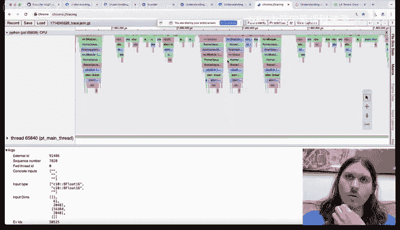

That this is sort of you are spending your time here and you should investigate it you might come to the conclusion that yes。

 this is a gem it is sort of my model is doing what it's supposed to be doing。

 it is supposed to be spending at the work there， but it might tell you hey I'm spending a bunch of time there and it's optimizable。

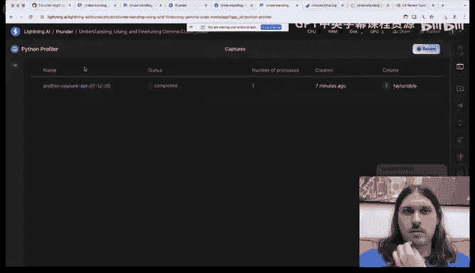

嗯。Any other questions？Like I'll ask one just like because because I think this is like a pretty this has been a pretty fun digression So so like like considering that it's like memory bandwidth like I think you mentioned that this is like I think like a Laurara like model So here is like an area where I would expect like a conversion to like a smaller detype might be very beneficial like you know potentially like using in4 or something like that to optimize the part so so I'm curious like basically here you know we know it's a memory bandwidth bound mathmo so like is your head going towards like hey。

 should we fuse something or are you going towards like let's just make the dtype smaller Yeah。

 so I tend not to jump to let's make the detype smaller just because that is not a semantics preserving change and so when possible I try to get as far as I can while preserving the original computation because I don't know what say quantization is going to do to my accuracy and then sort of once I've exhausted the rest of that。

Yes， then I can turn to those more destructive techniques。

But it's interesting that you mentioned fusion because that's actually where I was going next。

 so if we come over and we look at specifically this this regime and we zoom in what we see is element wise。

Men copy yeah， vectorized element wise so。We come here and we see this enormous kind of chasm of vacancy and elementwise operation and we're sort of trained to think。

 okay， what this is demanding is fusion， if I only launched one kernel to do all of this at once。

 then everything would be great。I wouldn't have this gap and so I picked just a。A sub task。

 which is the supply rope task if we go over to the actual I've pulled it into a。

A side benchmark and we'll run through a micro benchmarkch what you can see is it's essentially some copies。

 a little bit of concatenation and math and then conversion。

 So this seems like an extremely fusible operation。 so let's go ahead and kill this。Here。And then。

Run the supply rope benchmark。And what you see is that this takes about 50 microseconds so okay cool we we know how to write fast kernels or at the very least we know people who do so I borrowed from Tom who in turn borrowed from unsth this fast embedding kernel so great I have a fast embedding kernel let's run it i'm going to not run this quite yet。

For reasons that you'll see。So this is our baseline。Our fast kernel is twice as slow。Just a bit。

Surprising。But if we crack this open in the profiler。

 then it actually starts to make a lot more sense。So let's go ahead and grab this trace。

I'm going to open new Kumb。Chris Tbb。And what you can see is ignore all of this because we we're interested in the steady state。

 We have a bunch of clever machinery， right， we have binding， we have cash keys。

 we have all sorts of clever things and what does this do Well at the end of the day， it generates。

A really awesome kernel， right， this two microsecond kernel。

 but that's not our problem because our problem is we are doing too much work on the host or the amount of work that we're doing on the device。

 And so doing more work on the host to have a better device characteristic is actually going in the wrong direction。

 And so without ever integrating this in the model， I can tell this is not going to help me。

So fundamentally， what both of these are crying out for is more batch size because what your batch size does is it increases the amount of work that your kernels are doing and it does not increase the amount of time that you're spending on dispatching them to the host is also the case that if we look at specifically these matte malls。

 increasing our batch size is going to increase the amount that we have to load on the smaller tensor and right now these tensors。

 these activation tensors are so negligible compared to loading the weight tensors that is essentially free to increase the batch size。

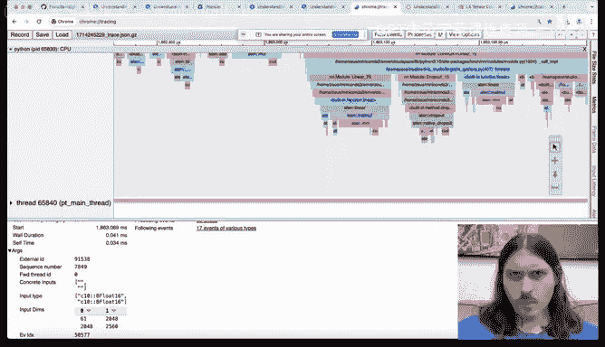

On these tensors。So。Let's go ahead and do that。So if we come over to here。And。I believe it is。

Microab size two。嗯。嗯。现在。Okay个。And Ta， what would be the， the optimal CPU utilizationt， if you like。

 say， in this like host versus device scenarios。 I it this because I've seen a lot of situations where CPU was at 100%。

 But I wasn't sure is this like something which also caused by I don't know waitinging operations or if in。

 isn't an under optimal co。Csus is just it should be like not 100% CPU utilization Yeah。

 so generally。For the model side， your CPU utilization should be nearly zero because you just have a single thread and it's dispatching kernels and maybe you have maybe it's doing some more clever things in these modern systems like it's compiling a kernel or something like that。

 but really fundamentally it's a single threaded task when you have high CPU utilization。

 it is almost always because your data loaders are highly parallel and they're doing lots of transformations to prepare the data and so I would say if you have very high CPU utilization but your data loaders are fast enough that's great。

 but you shouldn't really shoot for high utilization on the CPU the same way that we shoot for high utilization on the GPU。

Alright， so but if you mean likeing and this normally only happen during like the first runs of kernels right if if this is or maybe if there are different shapes or so this it's a different quest。

 for example， during inference like。To you there aim for like some set of。

Of different of shapes which are fixed basically and then you you know what is going into the system and it's not like completely dynamic yeah as a general rule you know you need to run a kernel thousands or tens of thousands of times in order to properly amortize the cost of computation or of compilation and so what we generally find is that we。

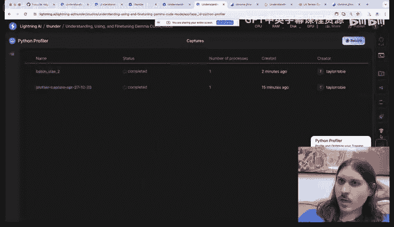

We do want to run in a system where we have static shapes or if we can't have static shapes。

 then we want a compiler which is somewhat resilient to dynamic shapes and I think we've seen an increase in the prevalence of dynamic shape compilers recently。

So one of the things that the Pytorch profiler can do that I'm collecting automatically is it can collect memory traces actually to understand why this is important let me。

Run one more command， which is。I'm going to all right。

 so batch size two is great the way if we look at the actual statistics， what we'll see is。

I'm getting just under eight batches per second I was getting 12 of a batch size one。

 so I'm not twice as slow， but I do have twice the batch size， so I'd like to continue this trend。

 but I can't because if I go up to batch size4 I run out of memory so let's go ahead and grab this timeline。

呃，这样是长到。Here we go to see why。And what we see is a little bit surprising。

 so first of all just to interpret this timeline the green is your weights。

 and so this is very common you have this static allocated buffer of weights at the bottom in this case we have it's about 3 billion parameter model Bf16 weights。

 so just under three gigabytes as expected。In our activations。

 we have our forward pass where we build up our activations。

 They're decreasing the backward pass because we're doing Laurara， unlike normal training。

 where we'd have these huge gradients for the weights， we just have these tiny。

 tiny gradients for the Laura parameters。 But what you'll notice here is naively this seems like we should be able to go way up in batch size。

 This is 24 gigte card batch size2 is using about a gigabyte of activations。

 And yet if we look at the maximum memory， what we'll see is that we're running。

We're hitting up to like 18 gigabytes of memory。Whi is means that there's something anomalous happening somewhere in the system other than study state。

And so there's another really nice tool in Pytorrch to analyze this and。It is here。 So profile only。

Memory。我看这个。And I'll show you what this is doing。In a second。

So fundamentally what we're doing is we're calling this API so there's an always on memory profiler that you can set in Pytorch which is much lighter weight than the standard Pytorrch profiler。

 but what you get for having that lightweight and giving up a bunch of information is that you get to run it for much longer than you otherwise would be able to so。

Here you can see I just ran it for the first five steps and if we come over here and grab this。

 download it。And then there's a very nice。Visualization site that Pytorch provides。

That we can just drop this in here and what you can see here is that something is off with our first batch these kind of look normal you have increased decrease increased decrease but over here our first batch is enormous it's consuming a ton of memory and when I first looked at this what I thought was oh I'm doing some kind of initialization or copy or there's some kind of huge weight you know huge thing that's special to the first step that's happening in the background and I should go and try and diagnose it but it turns out that this is actually not the case if we come back to this chromrome trace one of the nice things about。

Having these is that you can very quickly kind of estimate properties of your model and so if we come over to the embedding here。

 specifically this embedding op not not this one。So I。Sorry about this。没没有见。嗯巧克力。

So about it's a little。そだでに。融か。All right I'm not able to find it， but just in the interest of time。

 if you scan around and you specifically look at the inputs for all of the models then what you'll find is that we legitimately do have where did you go we legitimately do have a variable batch size so typical sequence length for one of our training examples is something like 100200 but they go all the way up to about 1000 and so when you hit one of these rare long sequence length。

The entire system gets really really big， you're forced to hold all of those enormous activations in memory。

 and this prevents you from batching the way that you would like to under normal circumstances。嗯。

So if we go back。make sure they stand track。嗯。I do want to make one point about this plot， which is。

If we look here。Let me zoom in a little bit。These look kind of normal。

 You have an increase and then a decrease， which again。

 very clearly and characteristically corresponds to you build up your activations in the forward pass。

 you free them in the backward pass。 And even in this somewhat misbehaved example。

 you still obey that property。 you build them up in the forward pass and you free them in the backward pass。

 except。This is very characteristically building up in the forward pass and then you have this cliff where you drop and then continue with the backward pass so what's going on here。

Well， if we。呃。One of the nice things about this tool is that it captures source location as well as just the raw values in their lifespan and if we walk through the source locations eventually where this will take us is back to the。

Lroophile， and specifically。Cthenttropy so。There's this chunk cross entropy function。

 which I'll talk about in a moment， but essentially these are the chunks of the cross entropy。

 So one of the things about Gemma that is kind of interesting is that it has an enormous vocabulary size well。

How this relates to memory is that your cross entropy is right it decision dimension is your vocabulary size。

 so if you have an enormous vocabulary it means you have an enormous logic tensor。Um。And in fact。

 this is why we break it up to not have so many enormous intermediates to try and bring down the peak memory。

 but if we look here。What happens Well， we define these logics。

 which is or we define those logics here， which is a list of really quite large sensors。

 and then we continue， we continue， we continue， we loop back around and then here。

We finally override logics。 So this is why we're seeing this property here。

 is it's because it's not until the end of the forward pass of the next step that the Python reference to this is deleted because as far as Pytorch is concerned。

It has no idea if you're going to try and access this in the future。 and so if we manually。

Delete the logics。And repeat this exercise， essentially freeing that Python reference。

 which will be the last Python reference。And then， we。Wait for this to collect the profile。

grabra this。Now you can see that this sort of enormous persistent logicit tensor is gone now in this case it doesn't really help us because our peak memory occurs before that。

 but I just wanted to point that out as when you see these like strangely uncharacteristic shapes in these profiles it's often a good indication that something else is going wrong。

嗯。On the topic of so Taylor， like here， maybe you mentioned it already。

 but I was wondering if you could elaborate like like how come the garbage collector。

Couldn't figure out how to deal with thes with logics and deleteta automatically Yeah yeah。

 so if we don't have this。It is legal Python， say here， actually。Right， to say something like。

Fri los。And so and we can do this because the variable is live。

 which means it holds a reference to the underlying tensor。

 So as long as the reference count is positive， we can't free this logic we can't free this python object and the python object is what's keeping the tensor memory live So by explicitly adding this Dell statement。

 it also means that。Rightriend。It's essentially a promise that I'm not going to do this in the future。

Oh， I see interesting。 So like it's not about like， are you like， do you not need logics。 It's like。

 are you allowed to use logics Yeah， exactly Oh I see。 I see got it。 Thank you。Yeah。嗯。So。

 another thing that。As we so as we dig into this you can see that this here so sorry so Peter has asked the same question twice so I owe that so so Peter is asking like you know the Woodtoch compile figure these kinds of things out and I think he had a question one for the fusions and I think he might also be talking about the reference count problem here as well and he's specifically I guess someone else is saying Eric is saying only if you compile forward and backwards jointly。

Actually sorry that's unrelated so maybe just comment about which's compile here previously Yeah。

 I I think what I would say is that。Yes， ideally a you know， an optimal you know。

 compiling system should be able to figure this out。

 but something that I think is very subtle here is that。

It is really hard to track down in Python where this is actually going right， so for instance。

 if I do。Right this is legal I don't even have to use f I just have to have F and it's going to capture logics and right there's this whole right chain right it's very。

 very hard to prove things about Python programs right I can I don't know if torch compile even cares about supporting this。

 but I can say you know。因为。I can do this kind of I can do terrible， terrible things in Python。So。

I would generally say， don't count on the compiler to be， you know， extraordinarily clever。😡。

You should just do the extremely simple thing。So Eric just elaborated on his point。

 so Eric is saying if Torch compile only compiles the forward pass。

 the output of your function are the logics， so you don't know what happens with them。

 but if you do the forward and the backwards together and compile。

The compiler can know that you're never going to use logics again and that they're not going to get returned from the function。

Yes， assuming that no other Python references occur I mean again I haven't tested this。

 it would be great if torch compile can figure this out I just don't know haven't tested it。

But what I will say is this is a very simple example where you could potentially figure this out but。

You know， probably the most commonplace this manifests other than just in a bare scope is that you attach it as an attribute of a function right so you' you're reusing a tensor and so you say。

 oh I'll just put you know self dot underscore x equals bh and then you use it a bunch of places in your forward function and you know you're perfectly happy you actuallyuse that intermediate value the way you want it to but then you move on and now this model has escaped the scope of whatever compilation you're doing right there's no way to see where this is going and it holds a reference to that tensor so no compile in the world can figure that out。

Cool， any other questions on this point？No， I think you can keep going。Okay， so。

Something that I noticed that was kind of interesting as I was looking through this chunked cross entropy because you know it's where our peak memory occurs。

Is that。So let's just find one and zoom in on that。不知。不是。Yeah。Okay， so。

I was going through here and something that I noticed is there was a couda stream synchronize and pretty much whenever you see any kind of host device synchronization。

Giant alarms should be going off in your head because sure， there is data dependent control flow。

 but it is extraordinarily rare and so pretty much every time you see one。

 it's worth investigating Now if we go to the actual definition here。

And this is one of the reasons why it's really nice to have this python source location is we can see it comes from this max function。

 so let's just open up Python and see essentially what happens when we do this I'm just going to say actually import porch。

Right， and then max of one come。Cool， I get a value， but what specifically is this？Yes。

 it's not a tenor anymore。 zero point Yeah， I think we have this like intuition when we write these。

 but it's really。This。And it's not and so by punting this into a Python value and then doing math on the python value。

 you are essentially forcing Pytorrch to round trip this value in this case it's just we're chunking something out and so we have to make sure that we don't divide by zero in a chunk right because the numerator will be zero。

 but we just have to make sure the denominator is not zero in that kind of corner case so on the other hand。

 if we do something like this right instead of max this right we do。Dot max do one is like。X。

Now this is great right there's as far as Pytorrch is concerned， there's no or sorry yeah。

 as far as Py torch is concerned， there's no Python here except for the scrs in the arguments to ones which we know how to deal with。

Um。And there's one other place where this shows up that I'll just kind of briefly jump to just in the interest of time。

 which is and again， we would the way that you know， we don't get here magically， we search you know。

Synchronize and find the places where it occurs。The other place that it。Crops up， I believe。

 is in Laura。Yeah， like like the the scooter sink has bit me in the past。

 like whenever you have like dot item calls。As well in your code， like this shows up a lot。

Yeah so yeah， I couldn't agree more this is like a really critical thing to avoid near code。Yeah。

 all right， so it looks like I am going to be forced， might might just be here。

And it's about this ist cost century loss。 Okay， here it is。So you have a ton of them。

 an absolute ton of them in zero pad， so what's going on here。So let's go find zero pad。

So where they're coming from again， one of these things that you should always just be extremely wary of is Torch dot Tensor right it's so convenient you give it anything and it turns it into a tensor and it's great。

 but the problem is so in this case this is a list in this case the problem is it's the list it's Python it's on the host And so in order to use this it needs to send this to the GPU and so it needs to stop do the Python conversion do the host device right the whole the whole thing。

Now if we look through here what we realize is this is actually static it's set up once in it and then you're done you never actually modify it again so we can replace it with this formulation and essentially I'm just doing this but lazily because again I threw this together in like five minutes and in steady state it'll be fine we don't really care。

Yeah， so just convert it to a tensor， put it on the device and then leave it there。

 And now we can just call this directly。 and between these two changes。

 it occurs one more time down here。呃。We now。Rerun our profile。Over here。And grab hour。No。

 I'm just going to grab this one。 It doesn't have the batch size。

 but we're just trying to get some profile out of it。 Then what we're going to find is that the。

The only time we do synchronize is when we get the loss to log we go from like a thousand synchronizations down to like one per step so it's like or two orders magnitude to decrease the other thing that that does for us is when we're in these regimes right the reason that we got into this state in the first place is because sometime you know sometime back here we had gems we had big amounts of work to let the host run ahead of the device but then we had a sink and as soon as we had a sink we gave back all of that slack and when we have syncs everywhere we're constantly giving back that slack and so any time we have part of our model where the host is slower we're going to pay for it as opposed to being able to just average it out。

And if we。This is going to take a second to run， but when we open this up。

 what we're going to find is that。This part， the host portion of forward backward is going to get。

Much smaller and we're going to have a much have a large cut of sink on the end which is essentially say you scheduled all of your work and now you can wait for the device to to run and then the you know all of these pointwise operations like sure it's not a bad thing to go grab a grab something like apply Ro and try and write a nice fused kernel for it。

But it no longer becomes the highest priority because they're still pretty fast and as long as you're more bound by these memory bound gems then you can sort of focus there。

So so Taylor just a quick like time check Yeah so Google will kick us out from the skull in about like 12 minutes we can we can go back and continue in the Discord stage or the voice channel after for Q and A and what'll have you but if there's sort of like any critical things that you want to screen share with I would just like suggest sort of frontloading that and then we can go back and discuss more on disc Yeah。

 so I think what I'll do is I'll just very quickly preview the two optimizations that I sort of didn't get to and then just kind of describe how we got to them So the first optimization that we can do is that we can。

系 come up。We can go over we're already doing gradient accumulation and this is again another one of these cases where the task dictates the technique normally I don't like gradient accumulation because it forces you to keep a bunch of extra memory because you have to have your gradients over the entire stepping that means you can' offset them between the peak of the activations at the end of that forward pass and the backward pass but in this case it's slower our gradients are tiny we can do whatever we want and we're already accumulating because we have such a tiny batch size。

And so。What we can do is we can essentially say look at the shape of my tensor and if I am in one of these rare cases where I have enormous tensors。

 just use a smaller local batch size， just slice it up do a non-ac or do an accumulating sub mini batch to just get past this and it won't be great I'm giving a batch right but it's not going to be great anyway because it's an enormous sequence length this by the way is why we are also seeing some variability in the actual steps but what this will do is this will prevent me from running out of memory and then use the batch size that I really want to use on the 90 plus percent of steps。

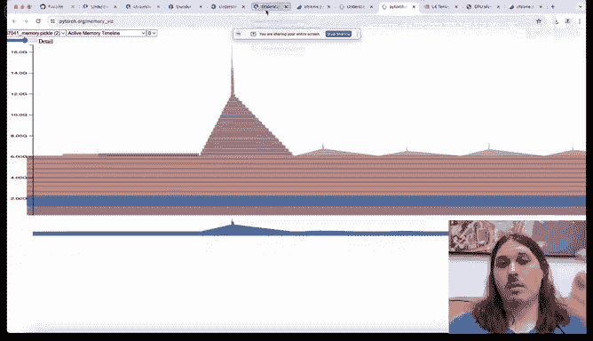

The other one that we can do， and this is again。Specific to Gemma。 so if we look at the Gemma Mpss。

 where did they go。Around here， yeah。So we look at the MLPs and what we see is that they actually have the same shape and why not let's go look at the model and what we see from the model here。

Yeah。Is they're actually it's a more structured MLP than say a MLP and these are the same shape and so if we wanted to。

 we could actually concatenate the weights of these two and then slice off these two and this would again by giving a larger map mall。

 especially when you go to larger batchs where we're able to do more simultaneous compute and memory communication。

 what we find is that fusing these two together is only about 50% slower than an individual one so it's not twice as slow and so again we can start to do this kind of thing and what we find is that this becomes a very good candidate for now the kind of fused kernel authoring that we know and love。

So。Yeah， I think that that's a pretty good place to stop。Super cool。

I mean I really enjoy seeing someone who's like so proficient in like zooming in and out in this providing views。

 but one question is could you maybe like share the commands that you normally use to run the because if you like for you it's completely obvious and boring and so on。

 but if you seminar gets started it's like the，😊，Yeah， the first thing you need， basically to to， to。

 to know what options do you need to NCU and so on to get things which are。

Yeah I'll publish a studio that has among other things of the notes and the commands that I'm running。

 but the other thing is this is kind of why I'm working on integrating it into the lighting platform is a lot of this stuff is very mechanical but very alien if you're not used to it and so just being able to say go that process or those groups of processes just grab it and bring it back and like just handle the details and leave me alone is tremendously useful I think。

Yeah， definitely。Yeah thank you so much Taylor like I think we can start heading out to the Sc channel。

 I guess like before before we do one of the reasons why I really really appreciated this talk is like for me personally I only learned about Autoduop performance programming after seeing like in person like little Fg at Facebook was like very used to doing this kinds of zooming in and zooming out and that sort of gave me a lot of information and sort of what Duke performance people look for that wasn't available in the docs so thank you Taylor I guess like now we have a recorded version of that experience so I really appreciate that。

🎼Yeah so folks start thinking of questions to Taylor we'll head back I believe to the voice channel back in the sport and you know we can just I can go with Taylor for like another you know 30 minutes and ask him many questions thank you folks and I'm seeing T ofoji so thank you so much Taylor I think many people love this stuff thank you so much thank you for having me。

All right， see in the disc shot。

