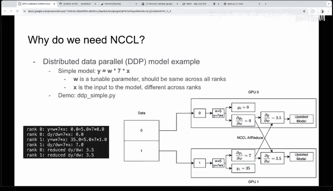
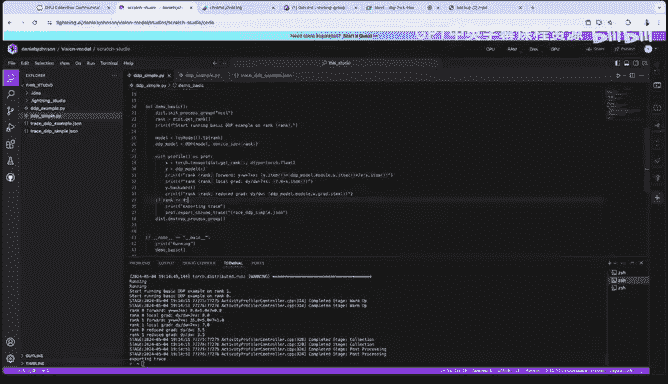
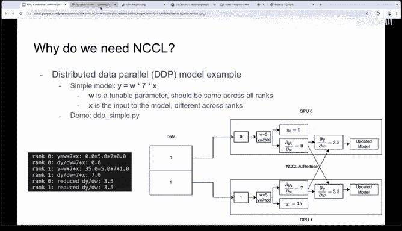
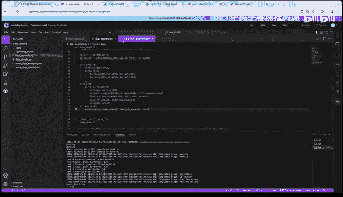
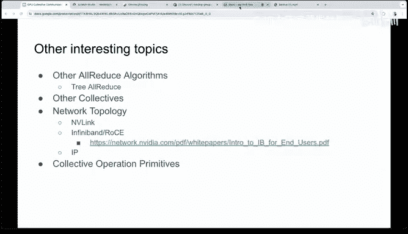
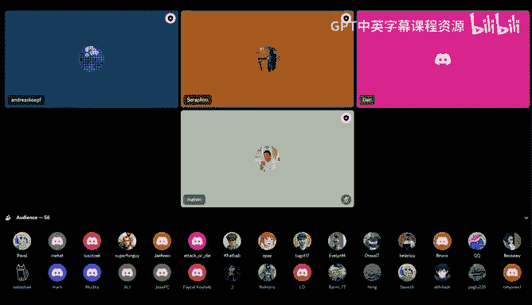
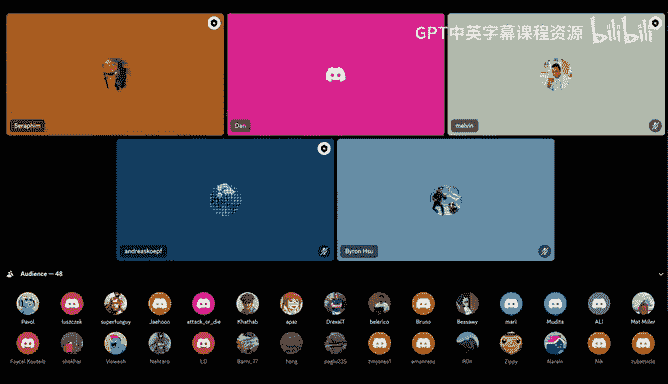
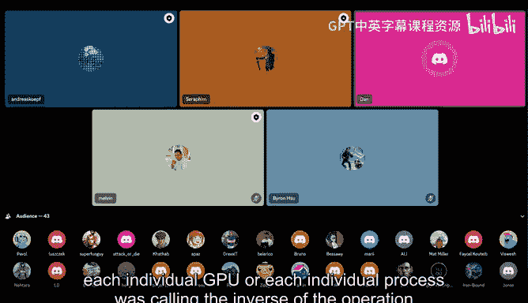
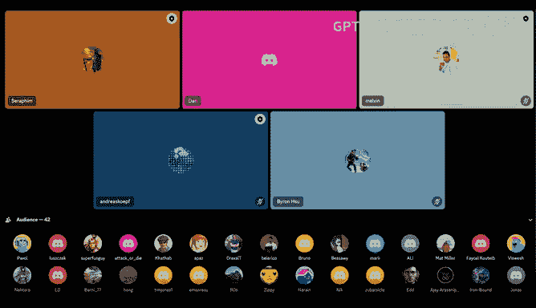
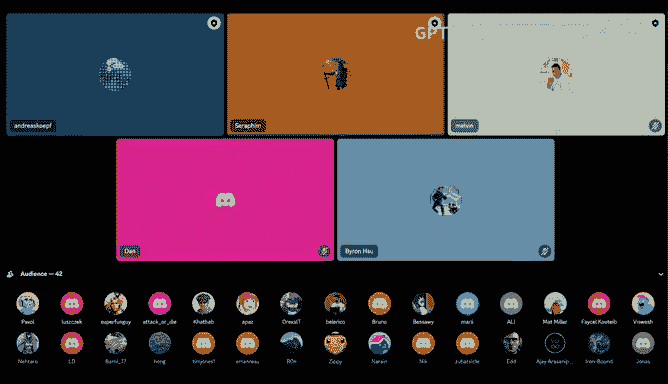

# GPU MODE《CUDA、GPU编程1-53课｜GPU MODE》中英字幕（deepseek-v3.2 - P18：-20240505-Lecture 17_ NCCL.zh_en - GPT中英字幕课程资源 - BV1QZ421N7pT

speak clear， Google will disconnect us after an hour。 And so like we can have the Q and。

 the Q And A like in， and theor。Okay， yeah， that sounds good。Okay， yeah。

 so hey everyone as I was saying today I'm going to be talking about Nich。

 which called Library I'm going be talking talking about what it is why we need to produce training training and how it works we'll dive into an example later but I wanted to stress that all this code is available on GiHub So anyone that really is really ining and diving into it do that own your own interest so we'll dive into it。

So so yes， niel yes， niel is nichel that's how we pronounce it's in communicationations library and it allows for easy point to point end and collective collective communication on multiple GPUs So I've listed listed some point point operations here that are often done with nickel blue blue some collective collective operations green green an image here on the lower right is from the nickel block the nickel documentation and it's representing an all gather。

 so this is just one of the collectives that you could do with nickel。

And what we're seeing is e ranknk on the left is its own column and has some amount of data that we want to transmit to all the other ranks。

So after the allga step， we're going to end up with each rank having all of the data as shown on the right and to be explicitly clear。

Now the blue is off and the blue data is starting off in rank zero。

 and it ends up as the first element of all the ranks。The red is the only element of rank one。

 and it ends up as the second element of all ranks and same for the green and the yellow。

Another example is scatter and broadcast， these are other collectives or point to point operations that you can use nickel。

 this is shown in the top right。And these seem these two operations I highlighted because they seem a little similar。

 but there's actually a little bit of nuance there。

 so scatter involves one process sending distinct information to each of the other processes。

 so this is like a mail carrier delivering specific individual mail to each house。

But broadcast involves one process sending the same information to all of the other processes。

 so this is like a radio station playing the same song and each radio is tuning in and getting the exact same information。

Different algorithms can be used to speed up these collectives based on the number of ranks and other factors。

 including like topology of your GPUs and how they're interconnected。

 but we'll look more into this detail later。So one collective that's really interesting and is really important for deep learning is this all reduced collective。

And it's useful for deep learning because we use it to accumulate gradients and reduce them across multiple GPUs。

And so we're just we're averaging them across these GPUs。

And the goal of the R is that each GPU gets this reduction from the inputs and it ends up on all of the individual GPs。

 so let's look at this diagram and see what this actually looks like for a three GPU case。

So on the left we have before the Autod， we have GPU0 has ABC， GPU1 has DEF， GPU2 has GHI。

And after the collective is finished， all of the GPUs are going to end up with the exact same reduction and the reduction。

 this is just。Some operation that we're doing so it can be like some or an averaging and so here we're representing we're using the sum as a reduction。

And we just need the reduction over all the corresponding elements。

 So the top row is going to have the sum of the top elements， A plus D plus G。

 and it's going to have that on each GPU。And same from the middle rows， B EH， bottom row C+ F plus I。

 and that's essentially the easiest explanation of what all reduces。

 it's gathering all this information and reducing it along some dimension。Um。

And we're going to dive deep into how like the nickel one one of the nickel algorithms that that does this later。

But why do we need nickel and this efficient all reduced collective well as I alluded to one use case is leveraging using many GPUs in model training and a popular way to do this is called distributed data parallel or DP。

So if a model has a very large batch size， it could end up being faster to split the batch across multiple GPUs so each GPU is computing some subset of the batch and then we communicate the results between the GPU ster。

So how would we actually do that？Well， each GPU is going to get a subset of the batch so in this diagram we have our batch is x0 and x1 and we're going to split it up into these two components and send them to different GPUs。

There this data is going to be passed into our model， and importantly。

 the model is the same on each GPU here。And we run the forward pass of the model and we get out our Y0 or just our output of the model and our y1 on our respective GPUs。

嗯。Each GPU also is going to run a and notably Y0 and y1 are going to be different because our inputs are different。

 even though we have the exact same model， our inputs of the model are different。

 so our outputs are different。Each GPU is also going to run the backward path of the model and it's going to compute local gradients。

 this is what Pythtorch is great at。At this point each GPU has the same model。

 but different gradients， and we need the models to be consistent across all the GPUs for every single iteration。

 so we need each rank to get the average of all the gradients computed on the individual ranks。

And accumulate them， average them and update our individual models on each GPU that way we have consistent models for every single iteration。

And this is just how you'd compute the average gradients of a batch on a single GPU。

 but now we just need to communicate this data across devices。

 and this is exactly where nickel comes in。At this point。

 we call an all reduce reduce because each GPU has some gradient and at the end of the collective。

 each GPU should have the same average of the gradients。

And then after each GP has these average gradients。

 they can each independently update their models knowing that the model is going to be the exact same on each rank for the next iteration because they have the same gradient sub to the model。

So there's an interesting question from chat， which is like like on GPUs。

 like floating point I mean just generally floating point numbers are nonassoative So if you like a plus B versus B say that's different。

 So is this like is this the kind of thing people like think about and nickel explicitly for like to get the deterministic runs or just like any comments I know some more advanced question。

 but I'd be curious to hear the answer to。Yeah， so so about numerical accuracy for this， I guess。

 I guess。The models on each GPU are the same and the outputs are different。 So I wouldn't。

 I wouldn't suspect there's there's any numerical。Accuracy concerns beyond like a typical single GPU case。

 like there's there's no extra introduced numerical accuracy issues there。Okay。

 so let's look at this example more， more specifically。

 like let's look at I think a toy model to to really drive upon this point。

So our simple DP model is just going to be setting y equal to some weight that we're going to initialize to be5 here and it's going to multiply by some constant and we're going to multiply it by our input。

So。Then we're going to take our data  zero and1 and we're going to split it across the two GPUs。

 we can compute the output of our models here so。By zero is multipied by zero。

 so it's going to be zero。UmY1 is going to be seven times5 times1， so it's going to be 35。

And then the gradients of our outputs with respect to the weights is easy to compute as well。

 it's just seven times x。And so we can easily compute the local gradients。

 which are just zero on GPU0 and seven on GPU1。Then the alluce is going to average these gradients across the two GPUs and we're going to get 3。

5 on both， and then we can use these average gradients to update the models so that both GPUs have the same model for the next iteration。

We can look at what one of these examples looks like。

I'm going to start by just running this code here， I guess to start。This is using lighting AI。

 we have four Tesla T4 GPUs， just running an NVIDdia SMI。

And we have some this simple D model that we're going to take a look at， take a look at。

 and I'm going to start just by running it so we can look at the code and what's printed out at the exact same time。

We use quartz run which is just launching the code on multiple processes and so we're specifying two processes here and so we're only going to use two GPUs and we'll end up seeing just just。

So we're understanding it， we should see it's going to run this。

 it's going to launch the code for on each process， so we should see running here twice。

 so let's just start by launching this。And we see that it's running， okay。

So all Tor Toronto is doing is just just launching it on multiple processes。Okay。

 so let's actually see and look through this code and see what' what it's actually doing。嗯。😊。

First we're just importing a bunch of torch things。

 we're torch distributed torch profiler and our wrapper for GDP we'll go into what these things are in a second。

 we're going to define our toy model， which we saw before just takes a single parameter。

 we initialized it to five， and it's going to multiply W times seven times times X there。

And so when we run this demo， we start by whenever we run this distributed code。

 we use torch distributed， and it is kind of like the front end that uses nickel on the back end and calls nickel to do all of the operation that we need like this other dos。

So。This this distributed inI process group is setting up all the processes and saying okay。

 which which processes are involved in this these collective communications and that's a general idea and then bypassing a nickel we're telling it okay use nickel as the backend and to run all these collectives so it does some nickel initialization stuff here as well。

And by running this we can now call disgit rank and that's just saying for each process we have a unique ID for it so we're going to print out start running basic GDPP example on rank rank and we see that rank zero or rank one prints on rank one rank zero prints on rank zero so pretty self explanatory there。

Then what we're going to do is we're going to take our toy model and put it on different GPUs。

We're going to wrap our model in this D wrapper and that's going to just handle all of the gradient reduction for us。

 we'll dive in deeper to what it's doing， but this is just a high level of what this wrappper is doing。

We can use a profile which is just a way to， I think there was a profile or talk last week。

 but this is just a way to see what is running on CPU and GPU and generate a nice trace with it and we'll look at one of those in a second。

And as we saw， we're going to get our just pass in some input data zero for rank0 one for rank1。

 and we're going to pass it into our model and we see just as expected printing out the forward of y zero so rank zero forward。

 we get zero here five times 7 times zero makes sense for rank1 we get 35， five times 7 times1， okay。

 so we're at computing what we're seeing now is we're seeing that。

We're executing the exact same model on different GPUs and getting different outputs because we gave in different inputs。

Then we can compute local gradients as well， we know that it's seven times x。

 so we know it should be zero and seven on the respective GPUs。

And why dot backward is going to take all of our is is going to actually run the autograd。

 so it's going to generate the gradients for this so it's going to generate the 7 x essentially the seven and the zero and then it's going to call the all reduce and it's going to put the reductions also the average of 0 and 7 is 3。

5 and it's going to put them in the dot grad。For the for the parameters and we see that if we print this out。

 we get to reduce grad for both as 3。5 and I don't have。I don't have any optimizer here。

 but we would then use this gradient to update the model and then we'd have the same model on different GPs。

so switching over so so Dan Ash I have a question here。

 so like like when you're calling like why backwards you like what is happening exactly。

 is it basically you're running a backwards pass？Per GPU and then when you're calling the item is when the synchronization is happening or is the synchronization happening at the per backwards layer it's happening it's happening at the per backwards layer so it runs the entire backward compute so gradients calls the all reduce and updates it in the backward I'll go into we can we'll look at a trace in a second and that should give kind of a better idea of what's going on too Thank you。

So a slightly more realistic example， still a toy model， but something with actual like Mems。

 we'll look at that real quick。So this is this example is very similar to before。

 but now we just have three linear layers and we have like a linear layer then a relu linear relu linear and so we'll actually need some matrix multiplications here and we're also going to much of this code is exactly the same。

The only main differences are we have an optimizer now。

 so we're actually going to update the model and we have a loss function。

 a more realistic loss function here。If we run this code， just for sake of it。

 we're not printing out anything interesting， but what we can do is we can use profiler。

 export Chmetrace to generate these traces。

This is just telling us what's happening on the CPU and GPU and it's going to give us this JSON file。

 which we can open with Chrome tracing。And if we if we like look at this trace。

 we can we can kind of。Get some interesting information here first of all this is just rank zero。

 so this is just one of the GPUs that we're looking at the trace for so that's kind of important。

And we see CPU operations on top。Here this is forward operations， this is backward operations。

 and then we have GPU operations in the bottom and we have these two different streams here。

 which we'll kind of talk about in a second。But let's actually look at one of these four。

We run this for 10 iterations and we get 10 iterations here so like we can look at one of these forward passes。

 each one of these is a forward pass。Or is this an entire iteration， so forward backward optimizer。

 step everything？嗯。Let's zoom into just one of these iterations。

 so this is again happening on GPU here。And we can see some memory operations。

 getting the inputs to the GPUs， and then we have this gem kernel。

 so this is a matrix multiplication， so this is the first linear layer and then it's followed by a raylu so you can kind of see okay。

 there's clamping here which is what Raylu is doing。

Followed by another matrix multiplication followed by another Raylu followed by another matrix so this is our forward pass right here and we can like we can measure how long it takes。

 we can do a bunch of things so this is a really useful tool for figuring out what's going on on our GPUs。

We have some loss loss computations here and then we start our backward path and one thing we can do to see what where。

These GPU kernels are being launched as we can click on these individual flows so we can scroll into the what CPUU operation is calling the GPU kernels and launching these and we can see that it's a backward pass operation that's launching these gems in the backward pass。

Okay so。There's a lot going on here， but。After this。

 we can look at these individual gem we see individual kernels in the backwardboard operation。

 computing gradients， we also see these all reduces that are generated even though we don't explicitly call them in our Python code。

Eventually we have some optimizer updates steps later。

 but that's that's essentially what we can get from this kernel so the I think the interesting things are how is this all reduce actually being called because we don't explicitly call it in our Python code another interesting question is why is it in a different stream like what is what does this mean why is it overlap here。

And so that's kind of what we want to uncover on this next slide。So start off。

 let's talk about this other line that's representing a different kudus stream and I have。

Part of it a screenshot of this trace。Copy down here。So。

This other this other line is a coa stream and a couda stream is a sequence of operations that execute in issue order on the GPU。

 so what that means is that operations that are in the same stream and are launched have to execute in that launch order。

 but operations in different streams can run concurrently so on the GPU this matrix multiplication is actually running at the same time as this all reduce operation。

So。Why do we actually want the all reduces to happen concurrently with these backward operations well the all reduces just average ingredients。

 but if we think about what is actually going on in the backward pass。

 we notice that it starts by so it starts by computing the gradients for let's say the last layer and then it slowly works its way back back to front to compute the gradients along the way from the back layers to the first layer。

And what we could do is we could just wait for the backward pass to finish and then we have all of our local gradients and then we just average all of the layered gradients at once and call call an all reduce and。

We we get we just call an all reduce at the end， but the the it's actually faster to start the collective for the last layer when those gradients are ready。

 there's no it doesn't make sense to wait for this entire time and then spend time。

Reducing all of the gradients at the same time when you can get started by when when the last layer gradients are ready so it's kind of like like a pipelining thing。

And this way we're actually overlapping the computation and communication so that by the end of the backward pass operations。

 we only have to reduce some small subset of the gradients associated with like the first few layers。

And I'm simplifying a bit here， there's actually what's actually going on in D is there's like individual buckets for gradients。

 but is this is just the main idea of why we can overlap the matrix multiplications with the Autod operations。

嗯。😊，Also note that we can make the all operation on one stream weight until the gradients are computed on a different stream。

 so like that's why there's some we're not launching immediately where we schedule it at some point and then we have to wait for these gradient stacks to be ready so we're not transmitting just garbage information。

And as for。How the all reduce is actually being called， that is being handled by GDP。

 and that's handling the all reduced call and all of the overlapping as well and pytor under the hood。

It uses Py GDPP is what it's actually doing is it's using autograd hooks to trigger these gradient sinks and compute the mean of the gradients along all of these processes。

 so when we are computing the gradients， it launches these these alteruces automatically or not launches。

 but it tells it says that it's ready to compute the mean of the gradients at this point。

And then once this is done， the average gradients are written to the grad field so that the grad parameter on LGPs has the exact same value。

I should mention that nickel is not the only way to do this。

 there's other these collective operations are not exclusive to GPUs， you can also run it on CPUUs。

 you can run it a a bunch of things， so you can also use something like MPI to communicate all these gradient values。

And for for anyone interested in exactly how this this nickel API is called。

 you can look at the process group nickelcpp on Github so's that's all open source as well so its it's really nice that we can we can kind of see。

😊，There's nothing really behind， we can see exactly everything that's happening from the pytorch level to the nickel level and that's really helpful。

Okay， so。This is kind of the end of the Pytorrch side of the talk and how it's being used and kind of diving more into nickel now we've seen what PyTtorrch is doing。

 how it's using all reduce for model training， and now we want to move into what nickel is actually doing when it is being called。

So here's a look at Nicholas AlRuce API that Pytorch is calling it takes in a send a buffer of size count。

 so this is all information that the collective needs。

It reduces it using the up operation and it copies the result to a receive buffer。

The function also takes in some other things， including data type and A coDda stream。

 which we just kind of touched on。嗯。But it also takes in this interesting thing。

 a communication primitive called a communicator object。

And this communicator object is used to refer to the collection of GPUs that are working together。

 so it's saying it's very similar to the in process group from before， it's saying， okay。

 which GPUs are we using in these like all reduced operations？嗯。So yeah。

 these communicator objects are just how these processes know what other processes it should communicate with there's a couple of ways to initialize this depending on like。

The number of CPUs and GPUs that you're using。If if each GPU has an associated CPUU process。

 a unique ID is generated by the root process on the host side。

 so there there's a single process that root process that generates this unique ID and then it broadcast this ID to all of the other processes using something like MPI so this is all happening on the host code。

All happening on the host then each process is going to initialize this communicator object using the exact same ID that it just was broadcast to。

But it's going to use the ranks that it is associated the MPI rank that it it was associated with so it uses to say existing。

Process ID or yeah， process number already to initialize this communicator object。

So then when we actually are calling the AlRduce with this。

 we pass in this communicator object and all of the processes know like who they're working with。

 like' okay， we're working with these different GPUs to do the all reduceduce here。U。

Moving down to the second part， you can also initialize these GPUs on a single CPU process。

 the same idea is followed， but you don't have to broadcast this un ID because you have all the information in this process。

 so you just loop through the initialization for each of these ranks。

This is just a nickel wrapper on the right that does this for you。It just， again。

 it creates the unique ID， sets the device and then calls this init for each of these devices。

Then may I ask a question to this multiprocess thing in general。

 what happens when one process discovered it has run into an error and needs to， for example。

 shut down， is there a way to somehow gracefully shut down the whole group of processes or to signal it to rank zero or。

what it's like is there a recipe to follow in this these cases。

 or as it does normally it should always one。No， no。

 that's that's a great question and my understanding that is that it is an active。An active。

Problem that we are running into， especially as we use more and more GPUs when there's more likely of a chance that one one of them will fail and。

There are， there's a lot of。There's a lot of ways to track this one thing that Pytorch does is it has this like heartbeat timer to make sure that or heartbeat timeout that is always checking to make sure that everything is running so there's ways to do it but some things are scaling better than others so long story short is it seems to be an open area of figuring out how we're doing this。

Okay， so， so I have a comment on this and then a question like so， so， so。

 so imagine you have N GPPUs and one of them one of them fall one one of them dies。

The sort of main way this is like resolved today is like I think what Daniel was alluding to which is like a heartbeat。

 you sort of say， hey， there's a GPU that's down， you stop the world and you basically wait until a new GPU gets like spun up and you keep going and as far as I know this is sort of like the main way people do like elasticity and training。

The reason why people don't continue training a job with fewer GPUs in case one failed is because this would change the numerics of your program。

 like basically your global batch size produces and effectively you can't reproduce like the same loss curves and I think that's why in practice people don't do it but I think you know with hundreds of thousands of GPUs I think waiting is not acceptable and maybe losses of accuracy or more okay we'll see。

Yeah， I think that's a great comment。Yeah， I， I， I think that makes that makes a lot of sense。 I I。

 I guess my unrelated question was， So， so you mentioned this one CPUU per1 GPU per CPU process versus multiple GPUs on。

 on one CPU process。 Like， like， what are the tradeoffs for each。 Like。

 when would you choose to do one versus the other。嗯。😊，I think it's largely dependent on。Your。

So Pytorch will generate one GPU per CPU process， and it uses that the。

For the entire time I think the trade off is being able to have these individual threads running and kind of tracking all of these operations launching them all at the same time。

 so I think that's that's why Pytor is using one GPU per CPU process。が。 thank you。Okay， so。Will dive。

I think I'm a little behind on time or maybe it's okay。

 so we'll dive into one example that is using so let's look at one of these examples with just a single CPU process just。

To kind of decouple what pytorrch is doing， but give us a idea of kind of an idea of what Pytorrch is doing。

 but also see。How it is like launching the running running this code on the host side。

 so get an idea of how we're actually launching these kernels setting up the buffers and everything we're going to look at a single process example。

And this is just taken from Nichol's documentation。

 they have an example of running an all reduceuce in there and here there's a single host process that is managing multiple GPUs。

Right now， the start of it is just importing libraries and defining some like error checking macros and again all happening on the host。

Then it allocates some communicator objects， each object refers to like one of our fixed GPUs and they have to be these objects have to be initialized。

 but this is going to this come a bit later。This example uses four devices and is storing 32 million floats on each device for a total of like half a gigabyte over all four devices。

嗯。Next， the send and receive buffers are just allocated on the host side。

and that's just going to be used to keep track of the the associated buffers on on each device。

 we also allocate a couda stream here that's what we saw before， but it's it's。

We're allocating one for each of the devices and then we allocate the send buffers on each device。

 the seed buffers on each device and we set them all all the values of the send buffer to one。

 all the values of the Cd buffer to zero so this is just their example of running a single process and kind of kind of stepping through it again all happening on the hosttF。

诶。😊，Then we called this kind of wrapper that I was talking about before this initialization wrapper。

 since we're using single process， these communicator objects are all initialized and that's going to be passed to the collective calls so they know who to talk to during their collectives。

And then they call the or。And it's called for each device and with each of their respective send buffers。

 receive buffers， communicator objects， streams， etter。And。

Also specified here is like the size of the sun buffer， the data type。

 the operation that it's doing and so Niel S and the communicator object and the stream。

 so this is just the API that we saw a second ago。And we're going to look more closely at this like what what's happening on the GPU side for this all reduce kernel in a second。

 but I want to stress here that when we' are launching these these kernels from。

So when we're launching these like nickel kernels， from the device side perspective。

 there's nothing special about it being a nickel kernel。

 it's just just a regular couda kernel from the device side and it's just doing memory copies。

 and it has to contend for the same resources as any other kernel has to contend for with like the memory bandwidth。

 the registers， Ss， everything just like just like every other kernel。嗯。And then finally。

 there's a synchronization waiting for all of the Nckel operations to finish。

Just cleaning up the rest of this example。嗯。诶。The memory on the GPU is freed， they don't really。

 they forget to free the memory and the host， but。Then you have to destroy these communicate objects as well。

 and so this is all of the host code that runs this single example and to compare that to like this other case with one GPU per CPU process it's very much the same thing but now we have the main interesting differences is we have to broadcast this unique ID and at the start and and we do the initialization a single time on each process and then we only call single nickel all reduce because each individual process is calling this exact same code and so this is again host code but it's running on each process it's running in parallel on each process。

So now diving into like what's actually being called when we call this nickel all reduceduce。

The actual all reduced algorithm can be implemented in a few different ways and nichel is smart about this。

 it estimates how long each of these methods are going to take based on the network topology and then it picks the fastest so one of these methods one of these algorithms is using a ring structure and essentially performs a reduced scatter which is represented here and an allga represented here。

So let's briefly look at how we get nu reduced from these two operations。

We start with all of our data here on each of our individual ranks。And we call a reduced scatter。

 and that's going to give individual reductions， but only existing on individual ranks。

Then calling it allgaer is just going to take all these ranks or all these individual reductions and it's going to put them on each individual rank so now we start with all the data here on individual ranks and we end up with the reductions on all of the ranks so that's how a reduced scatter plus allgather is going to give us this all reduced operations。

So in the actual nickel code， it looks like。Well， it's a bit dense。

 but we can look through it at a kind of a high level。

 so this is just a single algorithm for all reduce， so it's the ring algorithm。

And the code that we're looking at now is。Fed on every single GPU in parallel。

It's going to start by doing a lot of familiar familiar coup of things like a block ID thread ID。

 it's going to initialize some of the like the structure of the collective so it's going to do some it's going to create the ring and it's going to create the primitives that are actually doing the send and the receives。

We'll talk about that in a second。😊，And the algorithm is going to work on chunks of the send buffer at a single time。

 so this first part of the code is just taking our individual send buffer and it's just grabbing some chunk of that on each GPU is grabbing the first。

 we'll just say the first chunk of each of the of each of the member buffers on each GPU。

So that's what's going on here。Then after the step zero comment it's going to push the data to the next GPU。

 so all it's going to do is just going to send this chunk to the next GPU that it needs to。Com。

Thisprims。 send a call， it's how they actually send the data to the each GPUs to the other GPUs。

 there's a bunch of different ways that they can do this。

 it's a bit outside of the scope of this talk， but there are like direct connections between GPUs like fast super fast connections called Nvylink these typically exist between Jewss on a single node。

 there's also ways to put data on other GPUs directly， including Infiniband Rocky。

 so if interested about any of these things， I definitely suggest taking a look at I have a guide。

Later on the last slide about a source that is useful to get into this space as well。So this prim。

endend is just using these connections to send the data to the next GPU and it determines what do these connections to use during the initialization of NICel？

But back to the all reducedd algorithm， this GPU， each GPU is sending a chunk of data from the sun buffer to the next GPU。

So back to our simple three GPU ABC， D E F GHI example， when there are three。

 when we have these three GPUs， the algorithm is just take the algorithm is just taking a chunk of each GPU and it's sending it to the next GPU so a is sending to GPU1 et ceter。

 but they're all operating on a chunk and they're offset in order to do this in a fast optimal way。

It then goes around in a ring where it receives chunks from the previous GPU。

 reduces it to so receives chunks from the previous GPU reduces it。

 so this is the reduced scatter aspect of it and then it pushes the reduction to the next GPU so receive reduce send so it。

GPU1 is receiving D from GPU0， it reduces it， so it just does a sum a plus D。

 and then it's going to send it to the next GPU。So now we get A+ D sent to GPpU2。

It's going to keep going around in a ring over and over and over until it makes its way around one time。

Then it's going to save this final result， this reduction to the output buffer to essentially the place in memory where we want the reduction to be after we get this result。

And then。Now we're kind of now we kind of have a problem we have。We've done the reduced scatter part。

 so we have the reduction on each individual GPU， we have a plus d plus G on GPU2， B EH on GPU0。

 CFI on GPU1， but we still need to make sure that all of the ranks have the exact same reductions。

So we do a we finish the reduction， we do this copy to the output buffer。

 and then we send it on its way to the next GPU， so a plus D plus G is now being sent to GPU0。

And on GPU0 and all of these GPUs， it's just copying it。Or it's receiving it。

 copying it and sending an itss way， so it receives it。copy it甚至 on的 way。Recees it， copies it。

 send it on its way。In this way， we're taking the individual components of the reduced scatter and then doing it allga by sending the data in a ring around to get to all the GPUs。

嗯。😊，So that's kind of the main topics I wanted to cover hopefully this has been a decent top down look from how Pytorrch leverage is nickel to do collective communication for its large scale training thank you for coming and listening there is a lot more to explore in this space including there's other all reducedd algorithms so you can also do this with this all reduceduce as a tree。

It might be more efficient to compute the reduction where you take。

Each GPU is an individual leaf and you send the chunks to the parent nodes where it receives it。

 the parent nodes to receive it， does the reduction and then passes it on to their parents which receive it reduce pass it on to the parents all the way up to the top and then it does the final reduction and then it broadcast all the way back down to the bottom so theres there's a bunch of different ways to do this and again nickel is picking the is going to pick the fastest way to do it。

Another aspect is a really interesting aspect is this network topology and the connections between the ranks。

 and I found this introduction to Infiniband for end users to be really helpful to understand Infiniband and Rocky。

And then finally there are also different ways the primitives are implemented which give nickel a lot of flexibility in maximizing the network bandwidth so that's kind of a whole other can of worms that you can look into so there' there's a lot going on here hopefully this has been a nice surface level and then kind of deeper dive into one of those algorithms for I'll reduce thank you and I think that's all I got。

Awesome， thank you so much， Dan really appreciate the talk of us。

 please like showered then would like a bunch of like emojis。

I we we will like we are going to get kicked out of this room in about like 12 minutes or so。

 so we'll move to the Discord like like let's just move to the Discord reading group channel now and I'll see we'll see everyone there and you can just ask that question translate to Nik。

Yeah， it's they do have global and local rank I think just in general。

 you can have like a single node might have like eight GPs so you'll have you can have。

And this node might be connected by kind of what I was alluding to before。

 like faster connections like NVLi， which you can transmit data between the two GPs faster。

So that's that's your local rank， you have Hps there， you have zero to。0ro to seven。

 but then you also can communicate across different nodes。

 so if you have another node that has another zero to seven。

 then's how you that's how you get your global rank zero to 15。

 say and that' that's all set up during during initialization。Allright， okay。Okay。

 I invited Byron up， but he left， it seems， I don't know what's going on on his end。

So I guess I'll ask a question so so this is more about like micro benchmarkching like I think you mentioned sort of one interesting thing then。

 which is like。You know， you might think about， hey， like。

 let me increase my batch size up to a certain point。

Where it might make more sense for me to now do something like DP so I'm sort of curious like have you sort of developed any workflows for like back of the envelope math？

When you can sort of estimate when DDP might make sense versus like staying on single node and。

 making the models like smaller， for instance。Yeah， that's a really good question think。I I think。

TheresThere's different。Regions of size that that like like you were saying that it would be faster to run a bunch of like matrix multiplications and then communicate the data versus actually。

Running it all on a single GPU。I think the main。Motivation for people to run GDP at the moment is because you run out of memory on a single GPU at some point。

 so like these very， very large models you can't fit on a single GPU or sorry so for GDP you have to fit your entire model on a single GPU。

But the motivation for there's。Different ways you can。Scale to more， more GPus。

 including this thing called FSDP， which is another data parallel method of of training。

 But what it does is it splits up the model into different chunks and you are able to fit a model larger than you would be able to on a single GPU across multiple GPUs and run the entire thing。

 So it's， it still seems very like。You got to play with it to figure out when you can get the performance out of it。

I've talked to some people about like when you can use like a single level of parallelism or multiple levels of parallelism。

And there seems to be some general。General guidelines about usually depending on like number of parameters of your model。

 once you get above a certain level， you can actually see performance gain。

 but my understanding is there's a lot of playing around with it。

And then one other thing I'll say about just because you mentioned micro benchmarking。

There's another open source library called Nckel Test that you can compile Nckel against。

And you can run all of these operations across however many GPUs you have and get the bus bandwidth of all of the operations just to see how fast each thing is going and it goes through the entire initialization to make sure that it's using the best network topology and that it can find and so that's another thing that's worth noting。

That's really interesting that feels like the kind of thing that like T Speckman would have to sort of like just quickly micro benchmark a distribute setup anyway like thank you so much and Byron I do want to give him a chance because I think I saw him ask a about10 questions or so thank you please me。

Yeah， yeah。 I have two question。 One is about the profiling。

 So are you aware of any profiling tool in the open source that can do distributed training profiling So I can see。

 for example， multi GP。On， on one， on one view， because usually you what I use it just do on one rank。

Yeah， I'm not aware of an open source one that does。

 but I also usually open up multiple multiple traces to kind of cross compare you can do。

You can do some。Analysis， I've written some， some analysis tools that essentially。So， so what。

First of all， why would you want to do this？If you have some operations like rank zero that's doing some like data preprocessing or something it might be that you run these operations and then on your other ranks。

 you're not doing these intensive operations so you launch a nickel kernel on the other ranks and it looks like it's a very。

 very long kernel but it's actually just waiting for a little bit waiting for some time while rank zero is finishing off all the preprocessing and then waiting for rank zero to join the collective。

Bake says as you usually use oh go ahead well so so one one one thing you can do is you can。

Take the look at I have some analysis tool that。Takes these individual individual traces and then takes like a minimum across the collectives and you can use that to kind of get a like a like a data transfer time just so you're not like you don't see the nickel like kernelel waiting for a super long amount of time。

So that could be useful， but it's just Python parsing the JSON files。

So within that line actually there is an open source tool。

 I forget if it's in Pytor or in the Facebook research org。

 but it was called holistic trace analysis and I think it was like done by like one of Dan's like former peers as well。

 but it gives you sort of like it sort of does this sort of data collection that'll give you like for example。

 like an overlap percentage for your workflow so it might not be like a single visualization but it'll give you the numbers that you need to make smaller。

And I found that to be very helpful for folks。Okay。

 that's very useful I didn't know that was open source， so yeah that's that's also very useful。

And do you usually use Perfectile or Chroe trace or tensor board？

I've been usually using Chrome tracing， I see， I think it's just a preference thing。

I think because every time I use Perfecto， it's easy to crash， it's usually crashing。

I've had a similar experience。Yeah， and another question is that you mentioned there are two modes of。

Collect， so one is for  one GPU and one CPU。 The are There is multi GPU 1 CPU。

 And which one does F SDP and DDP use in。I think they use single GPU or single process。

 so one GPU per process。I see。Okay， thank you。So any other questions？All right。

 I think I just see Andreas typing so like considering things are， oh。

 I actually I know I see two people now posting attackradiian Bruno and Andas。

 like a bunch of people。 we'll just give him a second。Okay。

Come on， if somebody wants to ask a question in person also。

 please just request to speak on the stage。And indeed， that might be fe。

One thread could be 8 bit and the other could be 32 B。 So we regarding it。 so if we'd have broadcast。

 maybe this is the question。 And so all， all the。The the ten on the individual。Devices。

 they have probably to be the same， right， so you can't just general have to be the same order。

 and so on we obviously otherwise it it would just deadlock probably。Yeah， think I think it would。

I'm not sure if it would hang or throw an error at that point， but it would probably throw an error。

 yeah。Actually， then I have a question like I've heard this meme that like nickel deadlocks a lot like like what is that about。

 like， could you sort of unpack like why that happens in particular for nickel？嗯。I think。I think。

Well， one thing is writing is is writing distributed code can be like tricky so I can talk about。

Like one example I've seen where。Someone was had had inputs on different devices。 and this is。

 this is at the Pytor level。 They， They had their in inputs on different devices， and then they。

They all all gather or maybe an all to all or something。

 some operation to transmit the data before between。

 and then they compute some loss on their individual GPUs。

But then they also wanted to compute individual gradients in the same way。

 but so they call the forward pass， they implement some model that has a forward pass that includes this all to all operation。

Again， in the Pytorrch level， you can call it through this C10D distributed class。And。

When they write the backward， when they wrote the backward in this case。

 they wrote it in such a way that each individual GPU or each individual process was calling a the the inverse of the operation in such a way that it was not joining each other。

 So they were， they were joining different collectives。

 And so they were both waiting on each other to join the the others collective。

 and then it was just hanging there forever。 So I think I think it's in general， it's。

It can be really tricky to。Like write distributed code， but on the other hand。

When there is a lot when when you get into these very large like jobs and there's some operations on some ranks that are。

嗯。Like doing some prepro or other things， and maybe it's taking longer for whatever reason to do the preproces。

Well the other ranks are just are waiting and they're they're waiting and waiting and waiting for the rank zero to join these collectives and in the meantime。

 they have this heartbeat timer right just going and waiting and and if it gets to a point where it hits that heartbeat time out then you get a nickel error。

 even though it's not super related to nickel in this case right it' it's that the rank zero was taking。

Was taking more time to do the data preprocessing than theres。There's a lot of like。

There's a lot of cases where， okay。We at trace of we look at the logs of the jobs and we see， okay。

 nickel error here， and okay， so that must be nickel doing something wrong where it could be kind of like misleading in something else is causing an issue。

Interesting， well， okay， I， I think maybe this is like a like a natural place to call it。 Dan。

 thank you so much for coming in and talking to us about your experience。 Like with Nichel。

 Please focus， like just like shower， you know， Dan with like a bunch of emojis。😊。

So we can encourage them to come give us a talk again， thank you so much like that。Yeah。

 thank you for giving me that platform talk， appreciate it。

So next week we're going to be having like Capilil Sharma also from Meta who's going to come talk to us about his experience like optimizing like some kernels So it's going to be a very profiling heavy talk I think similar to Taylor's talk from last week So yeah thanks again then really appreciate you coming in and see everyone next week。

