# GPU MODE《CUDA、GPU编程1-53课｜GPU MODE》中英字幕（deepseek-v3.2 - P19：-20240514-Lecture 18_ Fusing Kernels.zh_en - GPT中英字幕课程资源 - BV1QZ421N7pT

Yeah， hi， everyone， welcome to our， I think now it's like the 18th。Ca mode lecture today。

 I'm so happy to have couple。Here today to talk a little bit about fusing kernels。

 which is like the way to get more speed of it and to do it in a very hands on way。

Some notes about our format here we normally have talked for one hour now we have changed to Zoom which may be new for a couple of people and if you want to ask questions since we have no chat integrated in Zoom please head over to Discord where we have a new lecture QA channel。

And they can basically ask question and discuss things otherwise I think you can also ask questions in the end of the session after the presentation or we will look what's basically in the channel and forward it to the presenter。

Okay， so Kal， if you are ready， please go ahead。Stageious useless。

All here this is Kael so I work at MEA， I primarily work on Rexus components using pythage primarily。

 so essentially the whole modeling bi， training Eval， infants， etc is sort of my game。

And I mean as part of that performance optimization of modeling models is sort of ingrained in the whole ecosystem there so I'll talk a little bit about few kernels like how how can you write those。

 but I want to be a little more sort of tactical in terms of。

NowWhat could be introductory next start to like writing fuse kernels so generally what ends up happening so as part of morninging life cycle researchers and practitioners will end up rewriting their code in sort of native ka was especially for things like element for operations you can fuse them together and to get the optimal performance out of the out of hardware so now。

诶。So essentially like when ends up happening you're writing your model code and then you're rewriting everything in native to get performance for inference for example。

 but I mean with like To Ba and I mean another of course like TM XLA is the other one I'm not super familiar with them but you can get sort of native performance from compiling your for example。

 Eagle more Pythtorch for example， so we will sort of do something similar Ill take an example of a access model that is open source called DLRM and we'll sort of benefit from scratch so we'll spend sort of first 10。

15 sort of building some of the context around the model。

And then look a little bit into Part profile I think there were a couple of talks recently one from The and one from I think one was finding one was on Trident。

 I think those would be useful and from there we can sort of build on the concept if we learn there here so I think those would be useful things to look at if youre watching the YouTube recording for example so let's get started so I have some of the artifact that you might need to get a little more understanding of like what DLrN is there was a paper that is published by Me number of years ago there was also a blog post about performance optimization and how to run it across multiple GPUs sector so that will be useful as well and just knowing how to load up Part profile in chromre saying stuff like that。

So okay let's get into the model so DlM's it's primarily a deep learning access model you can have different types of features so essentially they could be spae features and which are essentially your categorical features where you can think of let's say a product like Amazon for example you have multiple different parts on the Amazon surface so you can click on it view it you can make a purchase etc ceter so any interaction that a user has with a platform would trigger an event thats so like for example what was the product ID of the。

The product that a user clicked for example so and these are pretty sparse so not every user is going to click on every single product and not every single product is relevant to every single user so if you think of it in pretty much two dimensional matrix it's a pretty spae like zero than once so one is essentially an interaction for example。

 I mean if you bring that one hard encoded matrix down to just IDs you can just save them like as。

Interacted IDs for example， you you can go back to like word2 for example that's it that's a good reference point to understand like how you can take a one hard encoded interaction matrix down to like a single vector of IDs for example those are fast features dense features would be example like user age user country for example。

 right so as part of DlM you have dense as fast features or interact in as part of don' interaction I'm sorry I don't know whether there is one second。

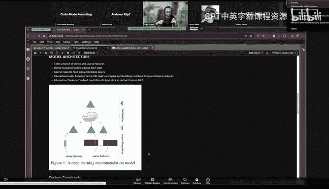

呃。我 girls can出来。I'm sorry， whoever is not on mute， please mute yourself。First你为让他。The this sorry。

 it's not showing them at the top Did anyone figure out who's talking anyway？

 somebody called James we。进局。James V。AC， okay， thank you。All right。

 she fine now but yeah folks please mute yourself otherwise we'll have to forcecibly mutute you and sorry Capil please please keep going。

Yes yeah so so yeah now dense so I mean these triangles essentially mean multilay perceptrons or you can think of them as this neural networks right and there are a number of interaction So dense layer goes through multilay perceptrons spark there also goes through certain number of layers then you interact those features together and then there like a neural network here which outputs sub prediction which would be going back to the example that I took like you can think of like a user clicked on an Amazon product so you trying to predict that based on a logistic function。

 for example。Now there are a number of system constraints around this model the blog post that I mentioned previously is a pretty good reference to it。

 but this give is like pretty good which describes what are if you think about modeling and like hardware like what are the important things that you have to worry about so when you talk about feature this is pretty much bounded by how much memory capacity yeah。

 I how much you can loading memory now as part of the interactions here。

 you would they are embedding lookups， for example。

 so spark feature like converted into embeddings which you interact as part of like this part here so those embedding the wider those embedding matrices are the essentially the more memory you need to hold them and then say sorry more memory bandwidth you need to actually extract。

Andbes while you're doing the feature interaction there and the last part。

 the top part here is is very compute intensive because essentially you are doing you can think of like dense。

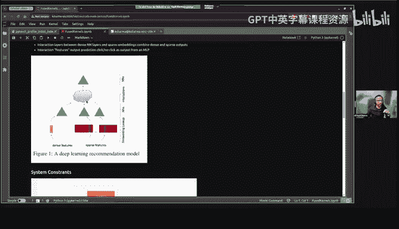

Layer here and the embeddings here combined together as and if you do second or interactions of like think of just a batch matrix multiplication of a bunch of dense features here and bunch of spes embeddings here you will get a pretty wide linear there and if you adding NLP on top of that you'll get essentially exported weighted matrix so which then you have a lot of compute requirement in the top layer。

This will get a this will be a little more apparent like once we go to the code a little bit bigger than bit into the model but yeah I mean actually oh I did end up putting it so yeah so the interaction end up being like dense times sparse times the embedding dimension like average embedding dimension times square so if you're doing like cross interactions which with in this layer and so we'll use the criteriaier data to play around with it this is like a pretty well known data sets it's open source you can download it and like it has 13 dense features 26 spae features that go into so we'll use that and DLRM as the model。

Can we ask a question？

Sure， yeah， Okay， so I have a question with just to the past feature representation。

 So is past feature primary represents interaction of the user with the product or is it a combination of。

Intertractction and the prototype itself to create a kind of a combined representation and a follow question is is it captured at the user level or is it is it a collection across multiple users so that you have a holistic view of the different interaction that happens on a particular pro。

That's a good question I think like that's getting too much into the modeling side of or like I guess data collection side of things。

 but yeah I think so in this data these are anonymized so we don't know what these features are but you can think of like each individual row I mean you can collect data in different ways but here will assume that this is just a single interaction because so because the label in this data set is essentially clicked or not clicked or like interaction or no interaction so the sparse features could essentially mean like they could be different categories across it so if this category was triggered or not whether so I dont know that answers your question exactly but。

But诶。Sorry I lost a second question， can you repeat us？I think you covered it， thank you。哎。Cool。

 so let's quickly just。Jump into the model and I'll just like run I mean jump into code a little bit I prereated this like party data sets it's faster to load the data so and so there's a sample data that's on the repo oh by the I shall mention that there is a repo that if anybody wants to like check out so it should be available I did push the code there just before we started。

Now yeah， so I just load a single batch I'm gonna load a batch set of two just to quickly go through so we have a dense size of 2 by 13 and as far as the two by2 by 26 by 26 sparse features So so yeah these are I mean I just converted these are like hash so I just converted them into in Is So we are just interact some some interaction in this sparse space so。

嗯。Yeah so I mean so just sample data now if we look at the dense layer maybe we should look at quickly look at the model because that actually will make things a little more clear so so this is the MLP I was talking about this would be used for both denses and this parts or interaction layers so dense layer is essentially just mP on top of the dense features that we have we have spa feature which is。

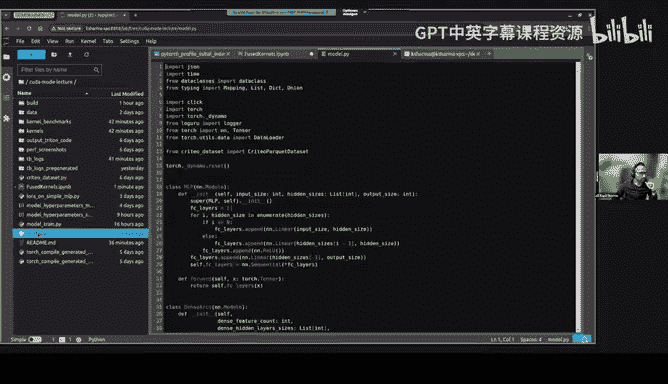

Essentially， a number of embeddings， so which is like eachs as far feature other and。呃。

We'll talk about it a little bit later， but essentially if we。

Bring the sparse featureses down to a smaller dimension so we're able to like get the model and a little faster but that will cover that layer so and then there's an international layer we take make a bit different ways to interact the features but i'm going to focus on this one maybe do a batch batch matrix multiplication of the dense output in the sparse output from the layers and then there's a final prediction layer which does the final prediction of the sigmoid so。

So going back here quickly running here so。We should get。不。Okay， dense is dense defined。

Okay dance spars okay there go so so this outputs 2 by 16 I essentially add a single hidden layer of 32 size and then the output size is 16 so we should get a2 by 16 with a ba level two same thing here we have a spars we take spars and be output to 16 size so we should get two by 16 size。

呃。Going back going to the interaction layer we take the output that we got from dense layers pass there and we do a giant matrix notification so this should show you like how it can explode so like how quickly the the number of interactions is it's sort of n squared so now you have pretty wide linear there so if you add MLlP on top of that that adds a lot per weights and now this is a prediction layer。

Maybe will just do like a single prediction。Now， I sort of。

Produced like a model graph this to just showcase like what ops are running as part of the model because this will be useful when we talk about fusion so quickly notice it's easier to see so we looked at。

So this is essentially the denseware where we are。There's a matrix multiplication here this is this is the batch this is the import that's coming in so here I think when I generated it was 32 batch size so that's why 32 times 13 so there's matrix multiplication followed by value。

Tttera， et cetera。 And then if these。Go here， this is where all the pen calculationnulation is happening and。

Just， this will be useful。When we talk about fusion？

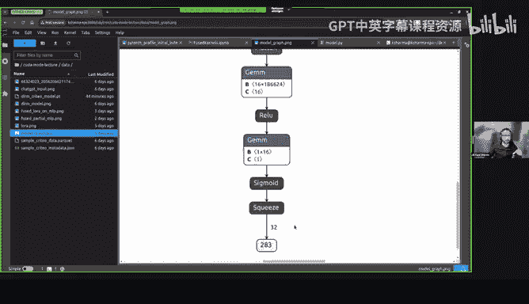

呃。So let's quickly do little profiling to see。Like what is the so this is sort of。

Let's start with the baseline what how quickly our model can run as of now。

 and then we'll sort of slowly improve it。 So what I'll do is I'll。

 I'll run the code from sort of the。Baseline that I had started with and then jump to like what is what we will sort of work with as we work on the kernels part of the talk。

So we already talked about the model， so。Let's so。In the baseline model， what I sort of did was。

I took all of the IDs that were as part of each sparse feature and I just tokenized them so essentially like you can just map the distributional IDs down to like0 to n where n is the cardinality of the sparse features and so we I'll just call it like index hash so but it' it's sort of just a tokenization pretty much and in the sort of just to showcase like how important。

Memory， like actually having。Data directly on。GPU is helpful like we'll just do a really bad version of like what the code might look like。

 So here I have a mapping of the tokenizer values， which is essentially I to I to indices and then we have。

AHshing function here forward index hash， and we will call this function as part of the forward so that。

呃 score trends。

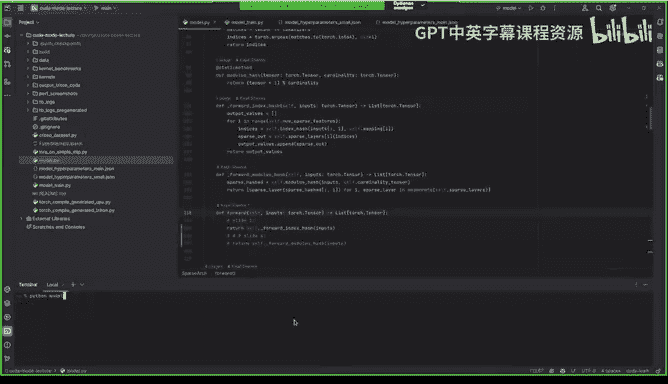

Should take a couple of seconds， it just runs a single epic。

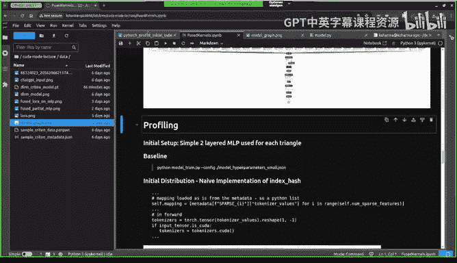

去。And it's load of the trace。😔。

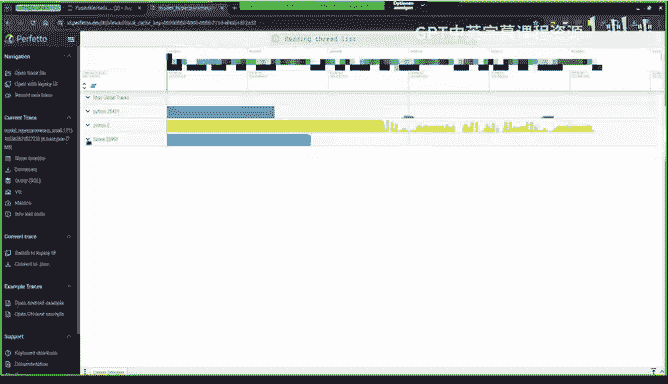

系。So when I started out like I I had forgotten a couple of things so now we can see like so I also doing it with tray so so now you can see like where like each part of the code in the in the pro。

😊，嗯。So here like I mean， if you look at DLM， most of the time is being spent in the hashing。

 but we previously talked about how this should not be the most compute intensive thing right so versus we should actually have the。

The prediction there that should be the most compute intensive thing。 So anyway。

 so the reason why is like we have a bunch of these if you like just look at the ops。

 like there is a bunch of copies happening。And result and we just spending so much time just copying data around this is not super optimal I mean so going back to here like we are essentially think as tokenrs on every single forward with copying data over and moving it to device。

Now， let's make it a little， let's make a little improvement。 and we have a common decide and。嗯。嗯嗯。

And uncle。And let's。And now so what I did was I just moved everything onto the device and now things should look much better to going back here。

 let's also get a baseline of harness much time it's spending in the whole thing so right now it's saying around 53 milliseconds。

嗯。So another thing that jumped out to me when I was when I was working when I started working on this thing was like this at time call。

 it's like it's why is it taking so time so I think like。

Probably like a bunch of folks already know the answer to this。

 but like does anybody have a guess like why this is taking so much time here。Maybe just yeah。

 I just started it out if anybody does so I would like I guess that it maybe like is waiting for the GPU to complete it's because of good causes to sync。

😊，Maybe yeah yeah exactly sos yeah it will the profile will wait on on the synchronization step right so this item is coming from where I'm grabbing the loss value and it's just waiting there so so the timings are not quite light。

So get things actually like showing get provideded to show things correctly。

 you actually have to I believe like a couple of folks have already covered this flag so if you pass this flag I think things look a lot more like saying。

So let's call this again with quickly just adjusting the profile because that's going to give us different timing。

 So like if you， if you look at this one we actually saw around。

How much 531 seconds now let's see how much that shows us now a little at。So， let's go here。

So you start didn't change that much when I was doing some experiments it changed a little bit。

 but you see you will see that the item the it and item thing goes away so things look a lot per say now you've basically seen the backdrop step instead stuff as part of the optimizer but yeah from here so now that we have a baseline understanding of like what the world looks like I'm going to just fast forward to like the most optimal hash I could think of like just to iterate on this faster like。

I essentially just took the cardity of each sparse feature and just modular hast so which will be a I mean it's a simple operation so something like this and so completely bypass the index I should see like how how can I squeeze the sparsage to like be alone more optum right so now it's going to move to this one。

To be honest I actually had a lot profile stuff here so we tried to cut out because I think Taylorlors talk was so good that then I had to like as sort of。

😊，But that's good actually then we can focus on kernels more so that'ss kind of nice。So okay。

 so like now jumping to the the forward borderless hash now let's run the profile again now this time we're going to run with Julia launch blocking。

And。Low it up once it finishes。I have two thingss， by the way。

 if you're wondering where the traces coming from， so I'm just dragging it from the other stream。

So yeah I mean it got better right so I mean prediction there is at least visible now in in the in the and。

You can see like how how bad originally things were like it was 53 millisecond we dropped it onto to four millisecond so you should just see like if you increase batch size for example。

 this will be a lot more I mean lot better right right now we were just running with a small batch size of I believe it was 16 in the small config。

bass was 64， but I think I was running Oh yeah， I had fewer hidden layers。

 So I think that's why that's the complexity of the model is pretty small。 but yeah。

 let's let's increase the complexity to see like how much。

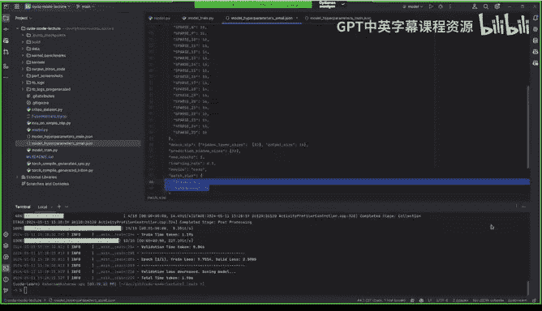

How much of like what portion of the performance is now coming from sparsage so because that's going to give us a bit of a realistic picture of like how performant it is as of now so I do have a bunch of stuff here I think like but let's I think this is sort of folks can read it afterwards but jumping to so we we got to here so modular hash and now let's let's increase the complexity of the model so。

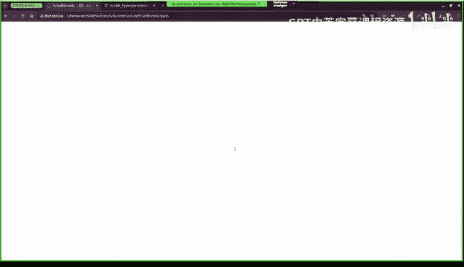

Go go back to yeah。 So what I'll do is in the in the bigger cong， I'll add。

A lot more hidden layers so that will increase the number of computations that the backdrop certainly would need to do and also I'll add more hidden layers to the dense MLP I took these values from the actual blog posts where they actually like they specify that these are the these are the dimensions that we took part of the as part of that study。

So let's run this again and with the bigger conflictfig。

So that will essentially now give us like we are running now the actual config that that the actual DLL and paper ran。

 I think embedding size are smaller that's because I can't fit things into my GPU if if I increase embedding sizes so so that's there is that so yeah we got a new trace let's open。

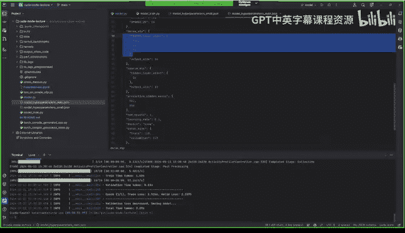

诶。嗯。Okay。诶。Things should look different so let's see now so now now you see like I think the things are starting to make a little more sense based on like what the original paper had said that okay。

 so the prediction there is is definitely the taking a lot more time now and if you look at the actual summary。

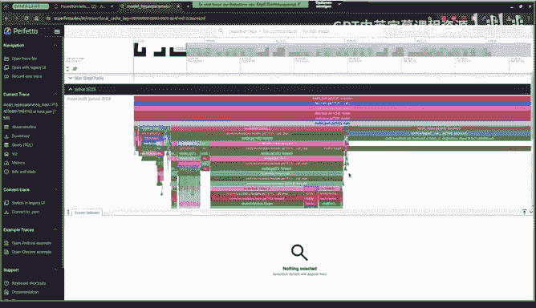

It's taking 16 milliseconds so we were at four milliseconds with us with a smaller hidden layers for like fewer hidden layers and now it's jumper to 16 milliseconds so from here I think so we so this is like so well sort build some context and not like what the model is。

And what where the complexity lies， right， so now。What's the next step as let's say let's jump into the feet of a researcher like you have a model that's training and it's like let's say you have working model it's running pretty so like what's the next step that you can do you'll either go to an engineer is like partner engineer like okay like can you help me optimize this or you can just run Torch Comp which which which is what I did because I mean that's so。

So。Now let's see how much of a boost we can get if we just use storage compile。嗯。

So we should expect Torch compiler to do something right we have a bunch of so just to build a little bit of intuition。

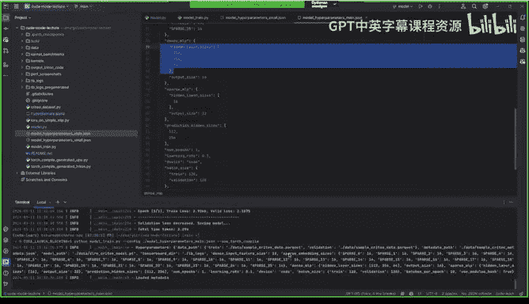

那。As if we go to the the MLP is like you have。呃。You have a bunch of sort of element wise off that you will be doing。

 think of things like once you have。Weight weight。 So once you have matrix verplication done。

 you pay youre doing like an element wise like max on the output plus you're probably adding a bias value。

 So I mean， you can think about if those are all。Paraizable so and you can probably put them in a single kernel if if you were to if you were to do something like that So now the interesting thing is I can to compile do it for us it's something I wanted to test out and so so yeah now that this is done I so i'm going to load a new trace。

嗯。With the way， could you could you show in the code exactly where what torch compile does or what you basically where you apply it to which function。

 which function is like very interesting and also do you use specific parameters is it or do you have like always static static tensors so there's no dynamic。

Eric， size changes is happening all forward passes others the same size。

But yeah so yeah I can quickly cover that that's a good question so I mean I do I do do a bit full graph so it will essentially raise an exception on a graph break and I do in the maths autoq mode I actually don't know what they does it seemed curious so I tried this one I think there's a bunch of different modes that you can try but yeah I am assuming that so Ill show that later when we look into the actual torch compile autopas so like most of the code is actually running on static size and actually torch compile can figure that out from the inputs I think things get a little more complicated if your dynamic sizes in in your models but this is like fairly trivial we don't have anything sort of like expansion or reduction in the tensor sizes in the modeling。

So which makes his other more simpler。Thank you and and one like follow up question maybe also to Mark is like in this case is like where you have the static shapes。

 how is like the how does it compare like how does torch compile compare to like cuta graphs。

 for example， is it like would it also be possible to to use cuta graphes in this case or。😊。

I don't know if you have tried this， but。Or is it like conceptually it can't be used in this case。

 for example？Yeah， I can answer that actually， so so torch compile。

 you can think of it as like a applylier of two things， like one of which is fusions。

And the other is scgraphs。 So if you're using mode， max autoune or mode reduce overhead。

 you're effectively using gographs。And the only reason whyquitographs isn't on by default is because it has a slight memory overhead that would make a certain class of models that didn't om。

 all of a sudden om if they're at the very limit， which is why we can't really turn it on by default。

You know， I've been pushing that maybe we should。Because it's just such a dramatic Perth improvement that most people would probably want。

But we do have to debate these things。The other interesting thing is like k graphs typically also it require static shapes。

So the workaround to make it work for dynamic shapes is you basically compile with cutgraphs or like a bunch of shapes and then you cache them all。

And so like you can actually use photographs with dynamic shapes with Torch compile。

And this example is using crys too， isn't really also my point。

Yeah so yeah that explains it takes some of the traces that I'm going to show later。

 but that's actually good to know so actually one question to Mark that this came to mind so like you can technically also like use paddding in some way to like essentially just specify like this is the static size I'm going maintain and then basically just pad a bunch of values so you always keep in static size but you have some way to identify like either you can have some offsets defined in your modeling code to like just reference back to like so if something is changing dynamically you can sort of have a pad value like relocate it or something。

Yeah， so so regarding padding， you're correct and that like if。You can make your code static。

Generally， for perf reasons， that'll be like the best thing。If not。

 the main thing that tends to change in LLM code is like the sequence length， for example。

 so like as long if you have a fixed range。That's usually fine。

 But like I think where things get really interesting and there's like a long thread about this。

 If you go to the Pyr Github is getting torch compiled to work with nested and jagged tensors。

And I think that's really what people actually want because people don't like the like patting introduces like both a memory overhead and a time overhead。

But not patting， you know， yes， you can do dynamic shapes， but it's not going to be as fast。

 And so so so I think what we're gonna be moving towards is like like I said。

 like working better with nested tensors So you could have tensors that naturally like nested or jagged means it's not rectangular or square。

 It gonna have like a jagged shape， basically。对。嗯，没 sense。

Cool and so now I know what as a math audititude does as well， so that's cool。 so okay。

 so let's load up the trays just actually loaded already think I loaded the and we just make sure I have the right one。

Mark， I had a great question。Sure， yeah， so doesn't Kreograph a have a dynamic mode as well where it cs in the first few rounds。

Well does that not work I mean so so I mean if it probably picks up the shapes of the kernels。

Based on the first couple of runs。So I think it it has a dynamic option as well there are two ways there are two ways you can build the kgraphs right one is the static one where you just assign which kernels are in the graph。

The other two， like let it trace and pick up the kernels as it goes。Sure。

 so like for what it's worth like， I'm not an expert on kgraphs but like my understanding of how their dynamic shape support works is what I described earlier。

 which is like。You basically just try multiple static options and this becomes like your source of dynamism I think for more like I can see if we can potentially get someone like Els Ellison from the Piyrch core team to come give us a talk because he built out chograph support with Torch compile and he might be much more familiar with these nuances than than I am。

Okay thanks。Who also conduct that data order。 So let's go here。 Okay， so now， I mean。

 things should look dramatically different， so。So we still have the DM that you can see Doppler。

 but now there's this a torch compile thing which。Essentially had a bunch of 18duct code and so。

 but yeah， what。Like a couple of folks asked about can actually see that。

There are there is a Cuda graph launch call here which is essentially launching a bunch of kernels which is interesting and when there's also like a couple launch calls here see that at and fill is probably doing some opt to like copy things over so you can actually jump into the stream to figure out like what kernels are being launched here right but yeah the Quda graph launch is actually the most interesting of it so。

So let's jump here now。I mean， some of these will look familiar。

 but so but yes so there there's Jen call here so there's some matrix modifications happening。

 but now you start seeing these triton kernels。喂呃 so。

So this was definitely super fascinating to be like I mean a couple of months ago now it's now it's like second nature but yeah but cool。

 so I mean， it's seen this calling a bunch of Triton kernels。

On the stream here here's another one and you use you can actually jump into it and its actually has a sort of a name which you can map back to like so but I'll show how to sort of do that。

One thing that's also useful like I don't think that was covered in some of the tooling stuff that we've covered so far is like tensor board you can actually push like all the profiler traces some data to tensor board so you can actually you a pretty good summary of things so I'm just so I'll been putting all of the logs here which has all the traces so let's just load up tensorboard quickly to see like what sort of stuff you can look at I'm actually putting everything on it actually most of the things I'm putting memory and with stack it just gives us the nice looking like where in the code things are happening in stuff and recording shapes etc ce so。

Going back here now we've covered some of this I think like through some other tools but it actually shows you like actual GP utilization which is sort of nice and like shape by the efficiency all of that stuff is pretty nice and like just for this specific example like I want to see the kernel calls so I have two separate spans like oneverse with torch compiled oneverse without so we can check so it seemed like this fill Fun kernel or element by kernel is actually the most called kernel but if we look at span2 which was the the torch compiled version now you start seeing these striking kernels on here。

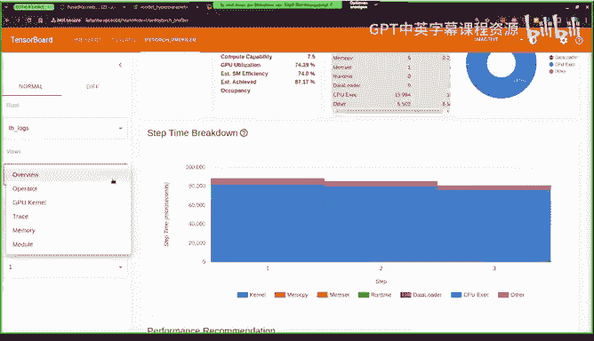

So what are the triton one like what's happening in them I think that that's now the next sort of curious question to look into sorch so Pytoch comes with like a handy way to actually output that so you can do some there is an argument so you can set in ma variable on torch logs to output code and it will put all of the triton code that it generated which is running in a folder I think it puts it in and from there you can actually see like what kernels it generated that are running as part of that cur graph。

So I'm just going to try that here and。Let's quickly load up。It took a couple of seconds。即啊得。

So it shows you like this it just put all of the code here， so I'm just going to open it up here。

Don let' see。All right， so。So I mean there's a lot of so when you first look at it it looks very j it's hard to follow what's going on。

 but the interesting thing is this is actually a runable python file so you can actually run it which is。

Which is cool now。From here， you can actually trace back like what's like I mean it's calling this function。

 let's go。Thiss。 let's go back here。But okay， right so stepping back。

 so it essentially calls this giant。啊放雪嚟嘅去。And。Now some things will look pretty familiar here like there there's a Mamo happening over here and now you see these like。

Triton P PI fused value et cetera， et ceter， so I mean yeah things are time to make sense it's running a matm then it's running running some fuse kernel over here。

So let's just quickly look at what's going on here。Now。

 13 should should look familiar like we had a 13 size tensor， so it's taking that's so a 01。

 which is essentially this。13 by 512 by 13 tenser， this is most likely the weight matrix because 5 12 was our first hidden hidden there and it's multiplying it with this arc 411。

So our ba 128， so this is the input so 18 by 13， so you're basically doing the math mark here。

And if you're wondering like what this reinterpret Tensor is。

I believe this just generates like a stride tensor to so so I dig into the C+ code for this。

 I guess it's a C+ call which actually sort of specify the strides for each tensor stride tensor essentially like you can think of a tensor defined in just call memory and then you can reference back to like if you had to transpo you can just change strides to be able to reinterpret the same memory as a transposed tensor。

So but like I'm not I'm not an expert on like what exactly is this but yes basically you can if you had stride of like if you had a two by three matrix。

 you could have strides up twos which then you jump over for a visual if you had a three by two matrix So if you transpose just change the strides and then you able to get the transpo tensor you if I jump in there because I think this is a so first off like when you see the triton Pi there like what the Poi stands for is a pointwise operation and what a pointwise operation is like an operation that applies over every element of like a certain tensor and so if you have many pointwise operation that are all done one by one those are very naturally fusible and so what you're now seeing is an example of the fu kernel example。

 let's say the pointwise op was you add one to every element and let's say you're adding one three times you can just add three once and so this is like a very natural way of thinking about like the。

Benefit of fusions。 like instead of dispatching multiple kernels that add one。

 you just dispatch a single kernel that adds three onces。

The other thing is that like with the reinterpret tensors。Actually。

 this is kind of like it's not like a secret per se。

 but like if you go through the Pytorch like onboarding docs。

 like one of the first things we try to explain to people is like how powerful striding is so it's striding for example you can implement like broadcasting you can implement like transpose you can flip you can flip something you can take the diagonal of a matrix and so it's kind of like one of those if you're like if you like to think of things in terms of like algebra it's kind of like one of those very core operations that you can then use to implement the whole bunch of other operations。

 So for example， like let's say you want to change the layout of a tensor to be channels last instead of channels first know you can use striding let's say you want to pad something again you can stride。

 you want to pad and reshape again use stride so like striding just is one of those very very powerful operations and you can get a good sense of the power of it if you go through the pytorch onboarding and I'll post the link in。

And the lecture Q& A。So after all this str， then the developer puts in a contiguous ch to make it。😊。

Thanks very those。 So yeah， so， yeah， So as Mark said。 So， so yeah， I mean， so。

Now so essentially the first step is that we have this map that's happening bordered by this point by a kernel followed by a few kernel that's been also。

Like what's being passed here。 So like just to reference back to the model like what's happening here。

 So buffer one is just buffer 0 going back here， buffer0 just the output from this matrix multiplication So you can think of it as the input times the first page matrix that you have。

 which was513 by 512 so you should get 128 by 512 matrix has after that So which is what this65，5。

36s iss a lot of hard query here which which I'm fine becomes hard to follow。

 but if you actually go back to the actual inputs。It makes it makes a lot more sense I actually wonder like how this would be with dynamic shapes which I haven't played around with much but。

But yeah， so let's jump actually， like let's jump to this kernel。 So like we have this a 11。

 which is。诶。It's 1 D tensor， so which of5512， most likely the bias because bias is the one D tensor。

 so。So yeah let's go up here so yeah this is the actual triton kernel that it's slany So again it has a bunch of hard code values and it's mostly because it's the all of the sizes are static so now。

Things started to make start to like make sense here like because we've sort of covered Triton before。

 but yeah like call of this is pretty standard Triton stuff， you disappeared。

 you basically theyec your block size and then you basically have these indices。

 the thread indices and then from here like。Figuring out like okay。

 like this so it just copies over into x2， which is again， the same index。This part is interesting。

 which is it's doing Moo5 12。So where is x0 use so you can see that it's used in the input point or0 which was a bias So that makes sense right so essentially what it's doing is doing something clever like it has the whole set of indices。

 but its doing mod fiber， so you always remain in that like single row dimension So it seems like the it's running sort of like row by row blocks of。

Of the tensor right so yeah I actually like what I did。In in the notebook， I。

I put the actual kernel down， so let's see here。And I just annotated it is like essentially like an explanation of what what's happening so you can literally like you can copy paste these triangles and put it in your put it in a single Python file and start experimenting with it So this is what I did to start working around with it or like how can you extend it how can you make how can you like have it support like other different ops for example so so yeah。

But yeah like jumping back to the file So yeah that was the first sort of fuse kernel that it is doing like it's against doing an element by the operation with a bunch bunch of other ones so if you start screwing down like you'll see a huge number of kernels it's also doing some point by few embedding and then there's another one at the end but yeah like the point is like you can actually output this code and start po around with it to see like how torch compile is doing things or like improving things for you to be able to run faster and once you start seeing like these generated kernel they can reference back to here to check so yeah outputting code is like super useful to just sort of it is sort of like a learning guide to so if you if you are I mean I learn things like top down so that go to a complex thing and just start po around from the top layer and just start。

layyers like from that perspective， it could be pretty useful So like you have an existing model you run torch compile on it and you see like it did generate a bunch of kernels so how like it could give you like pointers around like how you could potentially improve your code to like give you better compile code。

So now since it's QudA mode， like I mean， I guess before we get to QA， we can just。

 I mean I copy pastes this kernel into just a simple Python function。

 I pass like a single ones just to see what it's doing the right thing and like it should take this is a ones of Py2 by one one per by Py so it should give you essentially。

This result and yeah， I mean it it matters。 So I mean we can we can poke around with it and let's say when we build something like minus10 now this should not match which as should all be zeros say yeah。

啊。So if you like there's also like an environment variable like Tri and underscore interpret。

 you can use it to just add print statement directly in the Tri and kernel。

But yeah I like what you did with writing the torch code as well， just sanity check。

 that's also interesting。Yeah， actually learned about it yesterday。

 like yeah now we can start printing out， which is which is actually super nice。 yeah， So Qa code。

 So yeah I think if you if you I mean if you have a if you have a triton kernel。

 you essentially have Qa code pretty much but chatP actually pretty good at generating Qa code from Triton code that's sort of well commented。

 So this is what I did like that so that was the exercise I did here。

 I basically commented this code and just put into chat GPP to see if I can taking taking inspiration from Jeremy who did a bunch of GPPT based code generation。

 So and I took this and it actually ran correctly the first time which is awesome。😊。

So yeah I mean I put a bunch of this like generated cua kernels into into there is a directories with kernels there's a ceic project there so you can just compile and on these so I sort of already did that but yeah I mean you can I mean all of this is just like runable curd maybe we can quickly run this this one fine so probably wouldn't take time to compile because I already compile it so you know yeah I basically did something similar in in the。

In the code here， where I ran everything。In the so let's go to。This one。

So this is the generated kernel I sort of cleaned it up a little bit because it had a bunch of like intermediate variables I just simplified it a little bit and then I essentially defined the same block sizes there for block and I'm able to call this on like this regular torshtens and sort the same thing like call this。

At a diusion kernel you on just two random and see it makes sense so yeah I mean so yeah I mean but yeah the interesting thing was yeah the triton to kuda conversion was pretty interesting I mean I don't know it the practically I don't know how useful it is but I but yeah I thought it it was sort of an interesting exercise to do。

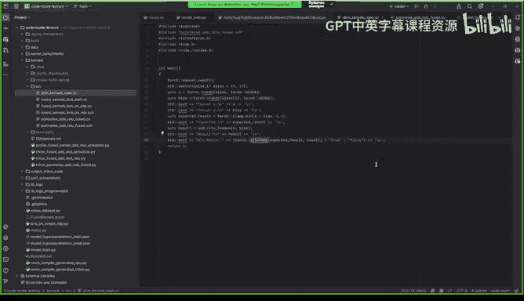

I would suspect the Ka code here is much slower right， like did you get a chance to run it？

Good question I didn't try to run it。 that's that's actually I should have yeah。

 but I didn't try to run the profile on it that that could have been interesting to look at Yeah like my suspicion is it would be the default quo code would be quite slow because like I think with Trident like they sort of rely on their like compiler stack to sort of eventually also。

Further down the line code generates like efficient code， but I think with KUa。

 it's like there's not much I think there in terms of there's like a lot of the tricks we talked about with Quta that probably need more work here。

Which I guess like I think writing naive trident code on average tends to be more performant than naive Kuta code。

I think that's like one of the benefits of having something like a slightly higher level。Yeah。

 that makes sense。 Yeah， I mean that's that's basically like if yeah。

 I mean I I think that's like if you go another layer up like from like for torch compile that that's so you essentially writing equal Py and like torch compile is giving you like。

Pretty perform quote this out of the box， which is pretty awesome。

So yeah I mean this is I think probably not worth covering it but yeah this we we sort of did a similar exercise previously you can actually just use the load L line to generate a QD extension so just run the code in line I think this would have been put place to actually run the profile and on the QI extended new fusion and the one that we generated from Triton。

But yeah， I mean， so I think I guess like we are add I guess how much time do we have can we can we go on for 15 more minutes so this is a case study it's up to you because I think we've been asking you questions along the way but typically we go for like about a max of like an hour and 30 minutes so you have like another 30 minutes to do with that time as you will if you want to you know Okay because we do want to keep running as well。

Co yeah， I think like the next thing is I think mostly building upon what we already did So I mean I just want to highlight like I mean which I was trying to say all along is like torch compile a triton learning company So it' essentially like if you want to dissect bigger systems like through torch compile like it can be super useful to learn learn Triton along the way like I mean that's another approach like anyway so I think like so the next section I sort of cover similar content as we did from like so we started with deal e model we sort of we optimize a little bit use torch compile to start workingking around with what was a few kernel that we generated as part of the process So let's try a different model like I mean Laura is is really part like for fine tu LMs I thought that could be an interesting exercise to look at and Laura is not。

Specific to LLms like it can be used for any any model for fine tuning so sort of an interesting example so to。

To sort of， I mean， quickly cover like if for folks who are not aware of Laura。

 as part of fine process， let's say you have a huge model。

 you want to sort of find based on some new data。You can do it in sort of。Instead of updating。

The all the weights directly you can sort of do it in a in a low rank space so you take the weights and they sort of project them into two matrices A and B which are so which are sort of low rank and so you're able to sort of get the same dimension so the the。

Sort of the analogy is like if folks are familiar with like eigenvalues， eigenvectors。

 you have a certain amount of information in like n subspaces you and you can think of it the SD rank or with the rank that's used in Lora to be like like let's say you take the top three eigenvalues and you sort of encapsulate all of the information that was available in the n subspaces down to those like top three or top four for example so so as part of fine tuning you。

I think the point that the paper sort of made was like a lot of the information was only in like first end subspaces so you can actually like fine tune using fewer dimensions。

 but yeah I think the paper is a lot more a lot better reference to like look into like how lower as useful for LMs and it's actually using SD in the background to do that。

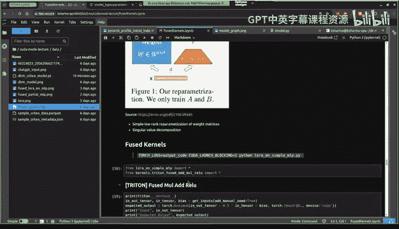

So I essentially wrote like a sample small model。Which was。呃。So it's。So it's a again， simple MLP。

 like I take。a linear layer followed by an activation， followed by another activation like just。

The superdent model which like and you can sort of inject the lower layers into this model let's say this was a large model right and you can inject the lower layers within this to generate sort of a fine tuning model where you sort of freeze the linear layers and then you only update the lower layers as part of your fine tuning process so。

I mean， this will sort of just also like drive home the point around like if you had more ops done as part of。

As part of like pointwise operations they can all be fused so that's why this is sort of just a slight extension of per already covered so so yeah let's let's inspect the code again as we did with a DM code and kind of see on simple MT so we'll just quickly run that so here also I do I just storagech compile mass autotune and I pass like a batch of ba 7。

So just easier to track like what's going on in the kernels。

 even though the generated code should be much smaller。诶 so诶。嗯。嗯。我做自。是。嗯。は。

Okay so here you see like I mean previously we looked at the trident P I fused add value now it's adding a multiplication on top but the point is the same right it's basically doing something similar but it's just like doing a bunch of extra operations on top of I think it's just a multipplier with a scalr but you could you could think like if there was a multiplier with。

1D tenzil， for example， like a hard amount product or something that it can do that should be technically redoable in afuse kernel as well。

And so there's another one here， so it that's the second sigmoid。

 the second activation which is sigmoid has also been fusd as like an admiral sigmoid。So。😊。

And going down to the actual place where the code is called， you can can see now that。

So previously we had a single matrix mode followed by followed by a few kind of we have three matrix multiplplications which sort of makes sense we are doing now going back to the。

嗯。嗯。L 그요。Going back to the lower code， so you basically should see。A matrix marked here。

 another matrix marked here。And I believe I yeah and then the actual ven layer。

 so your three matrix multiplication followed by an activation essentially。

 so is which is what it shows here。

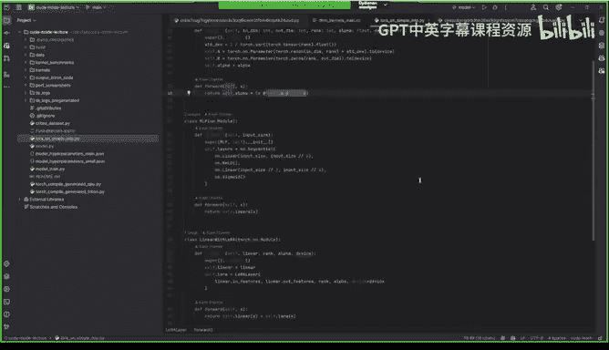

Now， I mean， I essentially just。呃。Ted a similar exercise on this and again。

 all all of this should look pretty similar to what we are covered as part of theRM， but I sort of。呃。

Generrycur ran sample data， another interesting part of like it's actually taking two separate tensors now think so it's fusing two separate tensor operations instead of one I mean but at the end of the days its conceptual is the same thing and you can do the same thing like you can essentially I was able to just copy paste it into。

TgPT to generate a cutuda kernel and that ran perfectly fine as well。

So what I knew was like so I wanted to sort of have a tutorial style because this is actually where I started a talk like I was going to do a more like math or read a talk around like Mora and stuff but the talk actually took a very different direction because I got super curious about Tosh Comp so but yeah so just to so so essentially like。

We can take this fuse kernel that was already generated and we can sort of maybe let's make let's have activation as an argument as well so you can have sort of all activation done as part of a single kernel right and what I did was I。

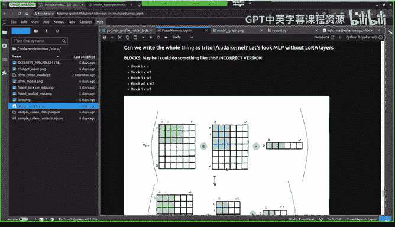

Generated a Triton benchmark。And so let's go here so yeah try to have so like essentially to see the actual like the em intensity graph for for thefuse scan to see like whether we're hitting hitting the peak or not so she let's go here so I mean。

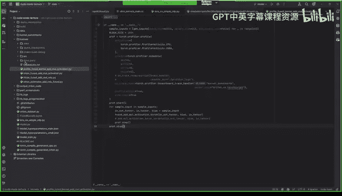

诶。I think Ume also covered some of this earlier， I think two or three talks ago but essentially I'm calling the actual kernel that Peter card from Torch compile code I'm running this is essentially just eager by torch and I wanted to check it against Tor script as well because it sort of like the I still Tscript is around so people use it and I think that some of the Triton benchmark parts that the open edit had Tscript there so I thought it would be interesting to look at so let's quickly run this so should be Tri confuse amal activation。

And it should show us the alphametic and intensity graph for for everything what was interesting to me was like tall script and Triton was fairly pretty close to each other。

So， I mean， I。系。I was trying to poke around with the actual trace to figure out like what would be happening here。

 but they look pretty closely actually like if you think go back to home if you look at it。

 I think tallt is almosteddging triton which was sort of interesting I'm not sure whether it's just because it's static sizes or like but。

But yeah that's and this is this is eager pyage so you see this it's sort of plateaus like pretty quickly like and much lower。

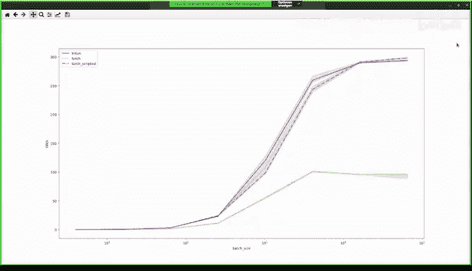

诶诶可以。And I was actually playing it on with the actual the flag suit。

Like run the tensor course but it seemed like it was already because these slide didn't really have any effect on the kernel performance so yeah so I think but i'm not an expert like I think that probably somebody like Mark might have more insight thoughts on this Yeah so so the main flag is going to be it's like it's called like set default float precision and then like it think is an argument high。

but yeah， like I think the other way is just to do it based on like memory bandwidth。

 like I don't know here what kind of GPU you're doing。

 but just like some so you can get like some rough estimate of the kind of bandwidth you're seeing。

费事间你上先。Yeah， I mean I the other thing I wanted to mention like the kind of cool thing about this approach as well is like we had like someone on the on the Pythrage team。

 Drriscausus， who also code generated Q Lauraura kernels that were competitive with bits and bys。

Just writing pure pie torch and like code generating them so this is kind of cool I agree with you in that like this is like educational and if it's like educational to write torch first also get performance then you know you know why not it's。

So yeah， like the Hulo I work is like already out now in like a repo called AO and then we're cutting a release with this feature next week。

 you know so that it composes the FSDP and all this like nice stuff so yeah。

Nice so so was it just using a torch like bitwise operations and then just lower on top of it and were able to just generate take yeah might be interesting as if you can put that in the in the the yeah that could be maybe its own talk but like essentially we just write like an Nf4 tensor and then just go generate efficient kernels for you so it's like。

Yeah， well， I can say， you know， maybe I can give the talk I'll forgot if Dr is also interested maybe maybe we can get him on board。

あんすか。So I have one question regarding torch compile and like to which extent it can be used。

 so we saw for example one of your kernels it was like in this one which show here you have this activation which is like comparing with the string and so on。

 so for me always the question is like how much like for example control flow statements and so on。

 can that be in until there's the graph breaks， whats so what's the general mode where torch compile really works like out of the box they don't have to do anything and where like it's challenging and does it also make sense then to break down this manually or is like torch compile with this graph breaks taking care of it automatically？

嗯Yeah。GetSo my understanding of torch compile is I think like it like you can。

It will it will default to like the Python runtime when it's not able to optimize it further。

 I think there's a bunch of flags for you to be able to sort of handle dynamic shapes。

 so like if theres control flow， I think that it will most likely go to the Python runtime to figure out which branch of the code it needs like I'm sort of still new to like how torch compile like fits into some of these like sort of weird edge cases like which which you do have in like real infrastructure code so yeah ideally it should be able to generate code for you like and there is a way to I think some of the Python tutorial materials go into it you can actually go step step so for example with induct if your code is failing you can actually go one above so you can just withD eager and you can see like where it's failing。

And from there it gives you some indication and I think like actually put some flags in Yeah。

 can you for example， like the common case that I had in the past the past week actually was like complex that data type used torch distributed used。

But it's like some something like this where I got like directly from Po 2。

3 like  errorss it gave up and and said no， no a toch compile not going to work here。So yeah。

 I can comment a bit about this like I think And like point taken like I think we might need。

Like a torch compile user perspective session， like basically I've had to myself work on a lot of like bad public benchmarks and like make sure people are using compile correctly So that might be helpful and then I think also like an internals especially with like inductor might be I think very useful for this group they were by the way。

 like I think we do need to pause for Q&A so before I go into more questions like please everyone but like we should appeal a lot like for his time so make sure to react here and if the emojis aren't great in zoom you know post them on Discord。

And I'll start like reading questions in a second because I saw that there's a bunch of really good questions in chat actually。

So I'll be going over this。我 sounds good yeah。Yeah。

 I think the last thing I just quickly wanted to cover was like。

 so I was wondering whether I could fuse the whole thing like so can I write。

Like can I take the matrix multiplication part into a fuse kernel as well。

 just just out of curiosity， quickly you realize that was a bad idea。

 but just so what I was trying to do can I do that the block multiplication with the activation in the same in the same path but I mean it's wrong。

 but I would like maybe somebody has has an answer like why that's wrong like why that's not possible Yeah。

 so there's actually I think I see Umar asking this question and I think it's a very good question。

 So I'm gonna read it and then we'll answer it So is there any downsside diffusing So if I have a long and complex operation should I just try to put everything into single kernel why or why not and you know how do I decide how much diffuse Okay So the conventional wisdom on this question there's there's two aspects to it like one writing like a mega kernel is more。

😊，challenging because it just it has more things and if you have like one mega kernel but then there's something that changes like the activation then you need to write like a new mega kernel so there's like a code composability and maintaininability question however I think that's not what Umer is asking I think Umer is asking about performance and the case of performance the tradeoff basically is if you have one mega kernel is you basically end up having with very high like register spillover and contention on your registers and this will generally tank your performance。

However， I think this is like this at this point might be old wisdom and Vdia did introduce a really interesting concept recently。

 maybe not so recently Vi might correct me but it's like the idea called persistent kernels where you basically have a single kernel that like runs all the time on your device and then you stream in batches to it so the kernel essentially is basically a proxy for like an entire network I haven't seen too many people do this kind of work I think it's really interesting So it's kind of one of those things where I think it would be very helpful to do a working group background benchmarks and basically like measure whether if using everything into persistent kernel helps or not。

So persistent kernels came in a bit long ago since the past generation timeframe。

So it's been there for a some time but not really using it one of the authors of PPmp book so P book is he did a his entire thesis on persistent kernels Yeah so he's going to come to and give a talk I think I'm filling the beans already So he's going to come and give a talk and feel free to ask this question on where does persistent kernels stand and where it's actually headed towards so would you actually build a mega kernel with persistent threads I think he would go in lumps。

😊，That sounds wonderful actually like I think we could always sign them up for two talks because like I think it's been sort of a recurring question where people just don't understand why why do we not have me kernels and I think the only answer is this like one long thread ont overflow and that's about it I think I haven't seen too many public so I mean I always love to do persist I mean long megachmas if given a chance but every single time when when we go in that direction the kind of question that we get into like stop breaking my brain so there is a point where there is a point until where you can actually make and understand what happens beyond that it is a bit hard for humans to really follow through like okay how do I understand all the variations of the capability like where to optimize where not to optimize how do you build a global synchronization kind of capability is it just becomes very hard it's a core composibility as you rightly put it。

One of the challenges that it has， but if you really want to go in that direction。

 there is nothing stopping you go for it， I think you will be able to get。

Better performance if you are very clever about it， for instance。

 if you can do data movement between the kernels in the L2 cache itself and carefully about how Wpcheduling basically happens。

You probably will never go for your DRA， so you will probably be able to pipe the data from Wp1 executing certain an operation to Wp1 executing some other operation overall through a pipe and that would be like amazing speedup that you would be able to get completely onship。

I think like one thing that hasn't been mentioned so far also is like one of the motivations probably for fusion beside of like making like arithmeically more intense and it's probably like also memory yeah that we don't need to store basically intermediate results but we just compute and one't go otherwise we would basically do it in like。

😊，Createta， I can output similar sense of input for pointwise applications and then do this for multiple times。

And yeah， this gives us， of course， this fused case advanced there， I guess。Yeah。

 I intend to cover it I think I forgot because so but yeah this was the example。

 So the original D example， for example where we were doing this is the e mode and this is the torch compile so you can see like the allocation is like a lot more so can see like it's allocating and then the allocating it like pretty consistent so the memory profile is much better and also like the amount of memory use is like much of less to I mean most likely because you' basically like in place updating the matrix that had the input times the weight matrix right so essentially you can just doing everything in there so you don't have to over two extra allocations as part of the next operations for example。

😊。

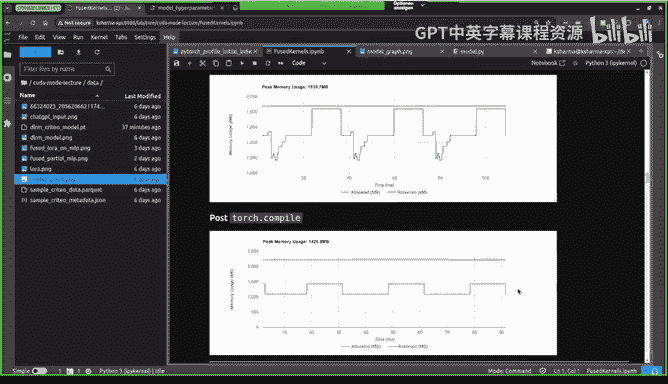

That was my understanding what they call Svis。对。And Vikram。

 I have run like one question because like this mecon thing this is。

 I have also like to think long about this， but for example。

 let's say I have like multiple reduction things in my kind for me currently I think always of this reductions for example。

 that like most of the threats basically are end and I only like fewer and fewer of the threats basically compute my resultss。

 but if I would now have this multiple stages of things。

 what would I do with like the original threats or how would I。😊。

Like what's the good way to like schedule these like multiple operations in to happen now one after another is it that I like may have I don't know do that way you synchronization options in some sense or。

Yeah you're actually giving a hard question and it's not that easys a form to answer so if you I mean fundamentally what you are looking for is there a way for us to create some sort of like a global synchronization within every thread or every warp that executes before the next war basically happens right so there is a clear cut boundary to know this particular reduction operation across all the operations that I'm supposed to across all the data is actually complete so can I proceed my next set of operation pipeline it together and make a for progress。

😊，The technique for this， you can't do。A global synchronization across all the threats in the GPU。

If you want to go in this direction， you have to build some sort of like a communication primitive between two kernel computation。

Launch the two kernels and do communication between these two kernels have some sort of like produce consumer relationship and ensure you actually have the other kernels for starting to execute certain set of data is already available so you have to think more of a even driven execution model and running even driven execution model in the GPU by launching different set of operations instead of launching two specific kernels you can do maybe you expon your amount of work that you' are doing within a single kernel dedicate 50% of the work done for reduction another 50% of the work done for the other set of operations you're doing and have certain flags or something to tell okay for this particular data that your computation I have finished the reduction operation so the next operation maybe you' are doing a scan I can proceed and do this scan operation so I have a flag which basically says go do this。

But if the warp that gets scheduled then it has to check whether my flag is currently available and if it is available then it has to proceed otherwise it goes back to sleep let it go go back right so so you have to cleverly play around with the scheduler and make operations to execute and make a thorough progress by making your work go to sleep。

 not go to sleep activate not activate so that you move around with all the warps in a correct fashion Does that make sense。

😊，Yeah， thank you very。 I think I have like follow up questions where we can take offline。

 that's easy。 But in general， I think like there's， of course。

 like some overhead for schedone current， but probably the most critical thing that of course I lose the shared memory synchronization and data exchange。

 which is possible inside you lose the state of your data that executes the but as soon as IF and HM memory basically the synchronization or communication between different stages's like yeah's if all the current are already scheduled。

 basically not my CPU is blocking anything it can be also like pretty fast you can do it the L2 you do not have to go to HM。

 So it's gonna be faster posture。 So so you actually have that。 but trade。😊。

You trade certain resources。 So when you launch too much work。

 you actually are trading certain resources in your hardware history still right so you do have certain overhead that comes in you launch overhead for a new w that get executed because it's gonna to consume some resources to check whether I have a work to do or not work to do that is still a check that I have to do right So that work is going to get bombarded so there are trade off。

 This are these are all different trade offs that you come into and。Trust me。

 the Iad is a great person to speak about this。😊，He has talked about how to do this persistent kernel launches and execution in compiler level and how to do aggregation of different work from different wars and different work streams together to manage a large persistent launch of the work and then schedule it correctly co- locatecate it correctly。

 maximize your L to for the throughput and whatnot just with the compiler optimizations and I think we should ask this question to him。

All right， folks， I apologize， I think we might need to do like a time check because we have three minutes left。

Gil like thank you so much for this like I really enjoyed the talk and I really enjoyed like how you walked this through sort of like real world models and optimizing them I think this was a bit very very helpful I think it did showcase like some serious gaps we have in like teaching course compiles so I'll take that feedback very seriously and you know figure out like who to bring in or teach this stuff myself。

😊。

