# GPU MODE《CUDA、GPU编程1-53课｜GPU MODE》中英字幕（deepseek-v3.2 - P1：-20240113-Lecture 1 How to profile CUDA kernels in PyTorch.zh_en - GPT中英字幕课程资源 - BV1QZ421N7pT

It was quite funny。 I was then invited to Nvidia and had the chance really to to visit the office of Nvidia at the time。

 was quite excitement for B。 Yeah， and then picked me whether I can also post later YouTube link to this。

 maybe that you can see what the application looked like。 Yeah， and afterwards。

 then I always knew that I wanted to do Yeah， artificial intelligence at the time。

 it wasn't that big of a hype as it is today。 And everybody thought a new networks It' like we were in the winter still。

 there was no no confidence dominating imagenet competition and so on。😊。

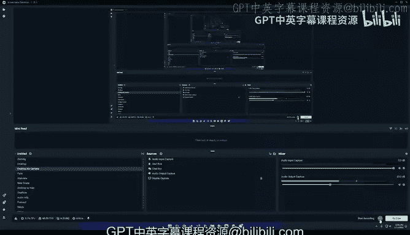

Yeah， and but then yeah， I got into basically starting a startup called Samla。

 and we created like a machine learning software as a service application。 And in this context。

 and then， of course， like did a lot of。I had a contact to torch at the time。 it was Lua torch。

 and we later pivoted to robotics。 And this time， yeah。

 I was very active in the Lua torch development also because we used torch basically for everything because in in robotics。

 you have point cloud So I I extended the point to library and would brought us to torch tensors and stuff like that。

And this led them to the fantastic opportunity at the time。 I didn't know what would happen。

 but I rewrote basically all the interfaces to the torch coins at that time to make them easier accessible from Lu torch from Lu as the foreign function interface。

 and yeah， this also turned out to be a great basis for Pytorrch actually。 So。😊。

This then became so my part， for like the foundation of Py torch was basically to have these or these existing coordinates in in a form which could be like C imported and be easily used from torch。

 form from Python。Yeah， and this this also got me then on the Pytoch paper and to with Adam and Soalmouth and so and so like meeting all this great people。

 this was so super， super exciting。 It a very small team at the beginning。 We were very。

 very efficiently like hacking on this。 And of course。

 we had no idea to what would come of it that out of it that meta would put so much resources into it。

 and it would be become the greatest。😊，Machine learning framework， which is around。 Yeah。 okay。

 so that's basically a little bit my story。 So currently why。

 have started now Qa mode or like I've asked So we there was a conversation between Mark and me as Mark approached me。

 And so yeah， we were a conversation。 And there was we came to this idea to create the Qa mode for me。

 the main motivation was I started now a new job at Al Alfa and a startup。

 deep learning startup yeah， I start in in Germany。😊，And for this， I am working as an AI engineer。

 and I need to be like pimp up my my Qr knowledge， refresh everything a little bit and bring bring me to the latest on this。

 So this is my personal motivation。 Maybe I， I can now give before I talk the whole whole hour Yeah to over to Mark。

 and he can。😊，T yeah introduce himself， maybe first。Well， thank you， Andres。 yeah， so so everyone。

 I'm Mark， I like for the past like three years or so of my life， like I've been working on Pytorch。

Most of like my interest like there has been like around performance。

 like I think historically Pytorch was great because it's easy to use。

 but Pytorch was not so great because it was slow and so there was like a lot of work done to make it faster like via compilers and this is like something I've worked on a lot and written a lot about and tweeted about and etcter。

So sort of like my interest for like this Kuda mode group and really it's going to tie back to what the topic of the first lecture is is that I've noticed that like at a lot of like these really top like AI companies they're sort of like the Kuta expert right like this is sort of like the person you know like with the dark blinds and you know they never go out and they make like a few million dollars a year because they really understand like some deep things about Kuta so generally I don't like these stories like like I would much prefer like if people tell me something is really hard I usually just get angry and I want to learn it out of spite more than anything。

Like however， like I can say that like one sort of like very immediate like immediate reason this was this was I noticed this was useful was like when we were working on some of the examples for things like G fast and Sam fast writing a custom ka kernelel just when you need it to ended up like being like a big component of like the secret sauce。

 So I guess like without further ado， let me just get started with the talk。

 if you have any questions or want to interrupt me， feel free to message something in chat。

 And then Andreas or Thomas can just like call you up So I don't mind interruptions。 So yeah。

 let me just share my screen。😊，呃。嗯。If everyone can see it， let me know。And everyone see this。

 Yo perfectly。 Okay， excellent。Allright， so yeah， like I said， like I mean。

 just just like some logistics before we get started， like our host。

 like the host for for this series is gonna to be like Andreas， like Thomas and myself。

 we still need to figure out like the actual like nitty grittyties of this schedule。

 but what we're suspecting is something like one lecture every two weeks or so is probably something like feasible。

 and the kind of content we want to cover is gonna be one。

 what I would call like something like more textbook heavy。

 So the textbook we're going to be using is this book called programming massively parallel processors there's gonna be other sessions that are closer to pair programming sessions So much more applied like this one is an example of that。

 And then also like special projects， like basically if you're listening。

 or if there's like someone who does interesting stuff like in the kuta space like we'll be sure to invite them so they can come talk about this。

 So the target audience like I have in mind， at least like for for this talk。😊。

Is like torch programmers that are tired of Kuta tutorial hell。 So what's tutorial health。

 tutorial hell is when youre just like reading one more tutorial with the hopes of getting started and youre reading and reading and reading。

 It just feels like you're spinning in place。So so there's a real reason in my opinion。

 why people get stuck in Kuta tutorial help。 One reason is that like there's sort of like a lot of terminology you need to learn upfront like basically you have to learn how a GPU works and it's terminology。

 it's programming model you have to like learn C or C++ which is maybe not something you're actively doing as a Pytch programmer So there's that and then the other aspect is that because that takes so long。

 people also don't have like a really good idea of like well given a Pytorch program how can I like actually plug in like my super secret spicy like like kuda kernel here and actually get it to work and how do I even know that my problem will likely be solved by some custom Kuda kernel So this is really like my intent for this lecture。

So the book I mentioned here at programming massively parallel processors。

 it's fantastic like it's sort of the book I went through a lot of books。

A lot of them were not very good。 This one is really， really good。

 The way you need to read this book is you need to read it。

 and then you need to do all the exercises at the end of the chapter。 If you can't do the exercises。

 it really means you just did not understand the chapters so do it again。

 So highly recommend you do this and we'll be going over like the first I probably like 11 or so chapters of this book during this series。

If but for different kind of content， like if you prefer like YouTube talks or if you prefer like blogs or so we have like this resource stream channel。

 like Gitab Ripo that Andrea started。All the communication regarding like our scheduling or projects or what we're thinking about or Q&A about the content will happen here on this Discor channel。

And all of the sessions will have will be recorded。

 So like we just created a new YouTube channel called Kuta mode。 it has like no videos on it。

 So this will be the very first video that will be pushing up。So yeah， like basically like I said。

 the goal for this lecture is how do you how can you integrate a custom kuda kernel in a Pytorch program and then how do you profile it All of the code I'm covering is in this like Giabripo called Kuta mode lecture1。

 I need to clean this up and we'll add it to the Kuda mode org later。

 but generally the like my attitude going over this content has been kind of like this like so this is this is me when I'm programming。

😊，Like essentially like I can't understand things like very quickly and if I read a lot of terminology。

 I just get lost and eventually get discouraged and we'll go to something else。 However。

 like with profiling， I can sort of very visually see and understand things in a black box way。

 so I don't really need to understand all the details about how a GPU or Ka works to be able to do useful stuff with it。

 So this is like the perspective I want to impart。Okay。

 so the first thing we're going to start off of with is this simple example here。

 So I have this example here。here where was it here。 So I was sort of curious like in pytorch。 Like。

 let's say I want to do an element wise square。 So what an element wise square is let's say you have a matrix。

 you go over over every element and you multiply by itself。

 So this is an example of a pointwise operation。 pointwise operations are really important in machine learning。

 like like things like softm or examples of pointwise functions like signs like signs goes signsine like thats sort of like a lot of functions that fall under the pointwise setting。

 and I was sort of curious like， okay， well， I'm going to sort of compare torch square to multiplying a by itself to doing like so so doing like this power of two operation and then seeing what's faster。

Right， so the way I did this was like the first really key thing to remember about profiling Kuda and。

 you know， really the main like maybe the most important thing you can ever know about Kuda is that Kuta is async。

 as in if you were to just use the Python time module。

You're just going to measure the overhead that it takes to launch a kernel and not how much time the colonel actually took。

So this is a function like I wrote to show you how to do this。

 like basically you have like you basically set up like a good kuta start event and an end event。

 you need to do a warm up because the first time you call kuta in a pytorch function。

 it's gonna initialize the kuta context。 So that's going to distort your measurements。

 So that's why you need like some sort of warm up。 And then when you're done。

 you need to do like a kuta synchronized because again， it's kuta async。

And then you can get like then you can get like like a time value。So long story short。

 like the profiler that I used here is called the torch autograd Pror right and then like the torch autograd profiler's view looks something like this。

It's going to essentially show you like these are all the kernels that are running and like how much time they took on the CPU versus。

should mean。So， so this is gonna to show you how much time these kernels took on the CPU versus the GP and how much time they took total。

 how many times each kernel was called。 And just like looking at this。

 like we already sort of learn a few interesting things about even the toy function。

 So if you see this 810 square here， it makes a call to810 pu。

 So 810 as you can think of as like this is sort of like the low level like C plus plus like dialect for pytorch。

 like these are the individual operations。 So we look at this and we know， okay， well。

 it seems like there isn't really a function called square that does anything。

 There is a function called pu。 And then we probably said its value to 2。 And we're like oh。

 interesting。 So we learn something about pytorch， just like looking at this。

We also noticed that like， well， in the case when we're doing a times a。

 it's not actually doing a power， it's doing a multiplication operation。

 and the multiplication is like slightly faster than the power operation， which is interesting。

 I don't have like a good answer for this。 Like besides like， you know。

 multiplications like a more popular operation。 So more people are likely to spend time optimizing it。

 And then here， like when we when we use like the Python built in。

 it' just used810810 power directly， for example。 So great， you know。

 we we already like we don't know anything about like Pytch internals。

 And this like running the profiler quickly gives us like an interesting idea of what's going on。

 So great。 So this was the autograd profiler。😊，And like I said， to use it。

 you just have like this context manager here， and then you just like run individual operations in it so like and then you know can you can turn this into a table and sort it and look at you know。

 like Li them it to the top like the most time consuming kernels。

So another a bit more interesting profiler is the Pytorch profiler。

 So what the Pythch profiler is is it's a visual profiler and it essentially gives you a chromrome trace and then it's like it's in adjacent file and then you drag and drop this J file to Chrome and once you do that you can get a view that looks something like this。

 So we notice like okay， well first off where we have like this function here So looking at the square function。

 it's split into two parts。😊，The first part is like this function called Mem copypy host to device。

And this is like very common kutuda terminology。 This is basically equivalent to your dot kuta call when you're sending a tensor to the GPU。

 And you're gonna notice that here like， okay， well。

 we have this 810 copy and eventually it's gonna dispatch to this kuda mem copy async。

And then this is going to create like this GPU kernel Mem copypy host a device。

 So you like like so host， like when when it says pageable。

 pageable just means the pageable memory on the host。 So you can think of this as Ram。

 but it can just means it can be freely swapped in and out of Ram。😊，So again。

 getting the Pyto profiler working is also pretty simple。

 So this is this is what the code looks like。So so the easy version of it is you just say something like with profiler profile the CPU activities and the GP activities and that's it In practice it looks a bit more complicated because you need like a warm up and schedule and stuff like that So it'll end up looking like a bit longer。

 but the actual incantation is as simple as this And when you are done you run you run this function like export Chrome trace and then this will give you like adjacent file like you can copy paste into Chrome and inspectus。

So great。 So we're back to our square operation。We're sending we're sending a tensor to the GPU。

 And after that， we need to compute the actual square。 And we learn here that like so here。

 if you look at these arrows。 So these arrows are basically examples of what we called flow events in the pytorch profiler。

 which means that like this is So what this what this says it's kuda launch。

 it's basically a kuda kernel launch。 So we see， okay， well， there's this810 square。

 it's a dispatching to an 810 pu。 And then this is gonna launch a kuda kernel。

 And now we get something that looks like an actual kuda kernel。

 And it's called like vectorized element wise kernel。 with like four blocks。 And we're like， okay。

 interesting。 So now we again learn something about pytorch where the way they do like square operations over like this size of matrix that we have is like it is with four blocks。

 you know， cool。 But the problem with this approach too。

 is that it doesn't necessarily give us like any idea of like。😊。

How fast is this kernel or what we could do better with it。

 It just tells us like the name of the kernel。 So the a lot of these kernels are。

 you can actually go to the Pytroripo and you can kind of see what they look like。

 So this is an example of like an element wise， like the element Y scooter kernel。😊，And you can like。

 go， go over this and see what it looks like。There'll be like a whole bunch of these so basically if you go here and like type in like docku there's gonna be like at least like what like 40 files here of like different kinds of ka kernels So they're like also like a good educational tool just so you can see you know instead of go looking a kernel from a textbook like look at a kernel for like more MLllish code。

 it'll resonate more with you So here okay like this like the S cosine stuff like that。

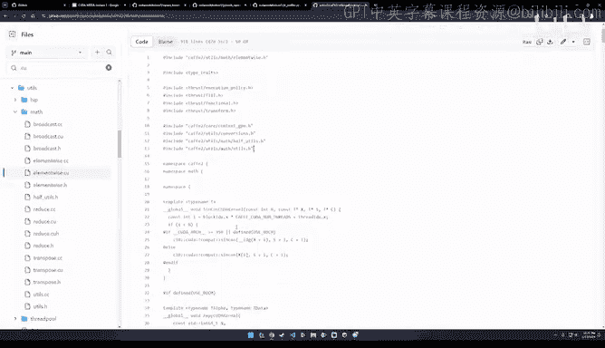

Anyway。All right。So back to sort of the first main question we had。

 which is how do we actually integrate a ka kernel in Pythtorch， right。

 Like one problem is that like Kuda in general is typically written using C or C++。

So how do we load a C++ function within a Pythtorch program or like a Python program more generally？

So one way to do it is what's called pi bind。 like basically。

 you essentially create like Python bindings for like a C plus plus file。

 This is a bit annoying to do。 or you know the easiest way and this is like you know sort of like pi my promise the easiest way to do this is this with this function and and pyth it is called load in line。

 So the way this function works is that you pass it in a C plus plus source file。

 like here I'm passing it and as a string， but this could just be like a path file or whatever。

 And this is just like a hello world function。😊，So what we're going to do is we're going to say。

 okay， well， like we we have like this one function that we need to expose called hellello world and then once I load this module this way。

 I can call it so I can say like my module hellello world。

 and then this will return hell world to my console， even though this is a C++ function。

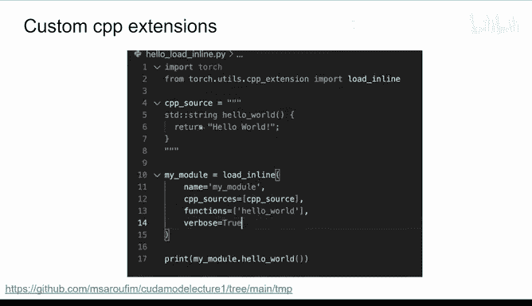

So what's really cool about this is that you can actually see what this does under the hood。😊。

Under the hood， this is going to create the stamp directory。

 and you're going to have a function called main C P。 So you see here the hellello world。

 and then itll show you the pie bind function for it。

 So this is great because if you're trying to learn how pie bind works。

 this is way better than a tutorial， just write a toy C plus plus program。

 and then you can see exactly like how this works here。😊。

And then the second thing it's going to create is' it's this build dot ninja script。 So， again。

 writing make files is like very hard。So this will essentially code generate like the equivalent of a make file for you。

 and you can come in here and you can see， okay， well。

 there's this build function and it's gonna run this compile thing on this main CPP file。 And okay。

 and then it's like running like this compiler like with these compiler flags。

 And then it's gonna have an object file out。 And then this object file is called out。 So again。

 this is just like a really great way to learn。 And you don't need to write all of this。

 like this is really annoying。 Like you need to come in and say， let's look at some stuff here。

 Like you need to put a path like the Pi bind module and I system。 And you know。

 we don't care about any of this。 like like all we care about is writing is calling a C plus plus function learning about build systems is just like not the most interesting thing in the world。

 And so that's why I highly， highly recommend this load in line function here。😊。

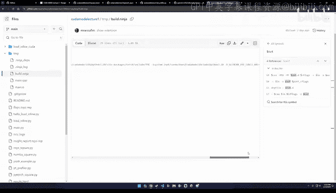

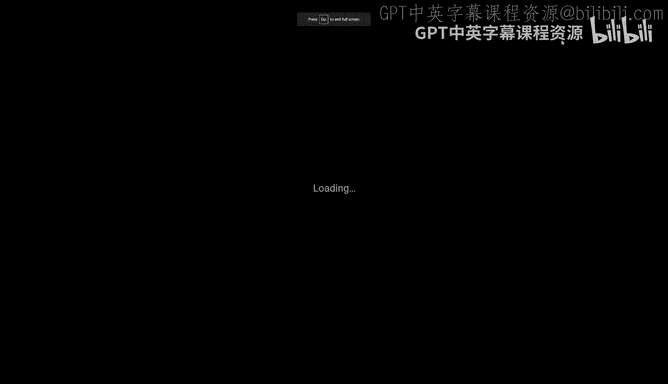

Great， so this is for like a general C++ program， but let me show you what a what a Python like what a kuta program might look like。

 Oh yeah， what a Ka program might look like。😊。

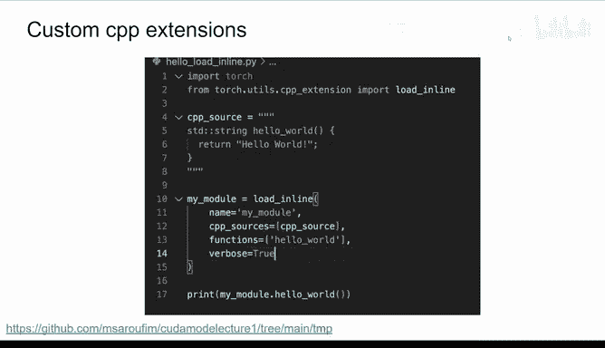

So let's say we have this program instead。And again， like here。

 what we're doing is we're doing our element wise like matrix multiplication。

 So there's two ways of like going about this problem。

 We could either have like a row and column index。 And then basically get like a single index from them。

 Like essentially， you can imagine that like you can turn a matrix into a vector like linearize it and then go over every element that multiply by itself。

 So this is what this operation is doing here。 So this is an example of a coa kernel。

 So this is the actual kernel itself。 But then we're also going have like like a wrapper function that will turn p or tensors。

 and put them in a format that like this kernel expects。

 So this is like what this like you know raper or driver or driver function might look like。😊。

And then the actual C plus plus function that you need to expose in your main dot C P looks closer to this。

 Like iss just going to be the name of the function and is just going to call it。

 So this is really great because like now， when you're saying load in line。

 what you can do is you can have like a path to your C plus plus file and a path to your kuta file。😊。

You can also pass in some extra kta flag。 So O2 typically means like compiler optimizations。

 And then we're going say like， okay， we're going build these functions here。

 And then same thing like now we we want to call this function。

 like let's say we have like we call this module， the square matrix extension so we can just say square matrix extension square matrix。

 which is not Python over a and we can basically get the like the square operation that we expect here。

So again， you know， like learning how to build a kuta kernel。Can be annoying。

 but if you look at like what this code generates is it'll code generate a coa file。

 So this is a dot co file， and it's going to be exactly the string that I showed you earlier。

 There's going to be the main CPP function and the main CPP function here is like is going to basically pipe behind this square matrix。

The interesting thing here， as I also remember in our code here， we didn't actually。

 let me show you here。 Where was it。Oh yeah， one question was， if you now， do this in line mode。

 And so is this these port which you show with a generated source code。

 is it automatically always generated， and can you look at the output or is it normally behind the scenes And and also how long does it take normally to if you do in line compilation。

 Okay， that normal Yeah， Yeah， these are a great questions。 So let me。

 I was gonna cover those in a second。 So let me let me go back here。 no， no， no， no。

 no worries it all。 So basically here like here， there is this parameter， Let me。

Loow it and line here。So this is not invisible because you can just set this directory called build directory。

 And the thing I'm showing you here is actually what this code generated。 I didn't write any of this。

 just to be clear。 So this is all code generated by the load in line function。 So that's one。

 the second thing is that like how long this takes。 Well， again， it depends on the kernel。

 typically compiling a kernel online。 you know， it takes a while。

 That's why like building Pythch from source really sucks。

 That's why like building flash attention from source really sucks。

 because you're going through all of those kernels and building them one by one。

 So so that's expected。 But this is just kind of like the easiest way to get started with this。

 The good thing about this is that like you do like you don't need to do this over and over again。

 because like once you load in line。 And if you know how to call these things directly。

 you can just go ahead and do that。 like you have like all of these kernels。

 But like I'm really just now more optimizing。😊，For like you getting started。I guess。

 And so that's why I'm not necessarily showing how to like cast these compilation artifacts or anything of this sort。

嗯。Yes， okay。 So that's pretty much like how you can go about like， you have a custom kutter kernel。

 You w to use it in pytorch。Use load in line。 It's a bit finicky to get right the first time。

 So I would just suggest， like， go over like my example and like， adapt it， like， adapt。

 like adapt it to your needs。 you'll get everything you need。Okay。

 so another way potentially of integrating like， okay， so。

 so where right now we just took the path of I， I wrote some C or C plus plus code。

 I want to integrate it within my Pytorch program。 That's kind of annoying。

 So we needed to use like we needed to use load in line。

 an alternative is useful a write Python code。 So basically， like。

 let's say we use something like number。And conceptually， this is exactly the same thing。 Like。

 you know， there's some boilerplate that's a bit different like setting up the grid。

 but conceptually， it's the same thing。 Like we basically have a result matrix。

 And the way we go over every element in like the input matrix and we square by itself。 And then。

 you know， we have a two device instead of2 kuda， we have this device array。

 So the terminology is all slightly different。 But conceptually this is very。

 very similar to the way you would program regular kuda。 So use whatever is comfortable。

 I think for the purposes of this class。 we're not gonna to use number。 at least I won't use number。

 Well either use like C or C plus plus or triton。 So let's talk about Triton for a second。😊。

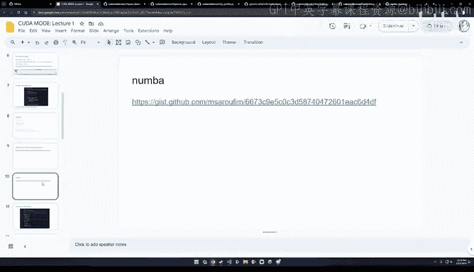

Allright， so Triton is also like another example。 So Triton is a DSL。

 it's not like is a DSL in Python and it doesn't like but it doesn't generate kuda So it's not like you run this program and it's going to write a kuda kernel for you。

 It's actually going to generate a PTX kernel for a PTX code for you。

 which is basically the kuta assembly and I'll show you an example of what this looks like in a second。

 and again， integrating this into a Pythtoch program is trivial because it's a Python function So you just call a Python function from your like an un forwardward function and there is sort of like nothing nothing crazy you need to do。

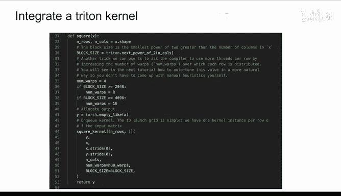

So this is like an example of a square kernel like I wrote and I wrote this in Triton like this like the first。

 you know somewhat interesting kernel like I've written and I wrote this and I ran the experiments on an A and G and I noticed that like my Triton code was actually like a bit slower than than the code that's already in Pytorrch。

 So basically my custom kernel was slower than Torch dot square。😊。

This is not great because a slow kuda kernel is not useful。

 Like the reason why we deal with the complexity of Kuta and the prices of GPus is for performance。

 So you really have to have like this like very like performance first mentality when going about it。

 So I was like， okay， well， you know， like I don't know what's going on。

 I tried torch compile as well。 So what was interesting to me is torch compile actually also made the performance worse。

 And it made it mimic closer。 the performance of Trident because torch compile will generate open like torch compileile will generate openitrident kernels。

 And I was like， like okay， there's like something interesting here going on。 So I was like， well。

 you know， maybe this is something specific to an8 and G。 So I ran this on a 4090。

 And I got like very similar results as well。 And here I was like okay。

 craply like what's going on here right， So how did I go about debugging this。😊。

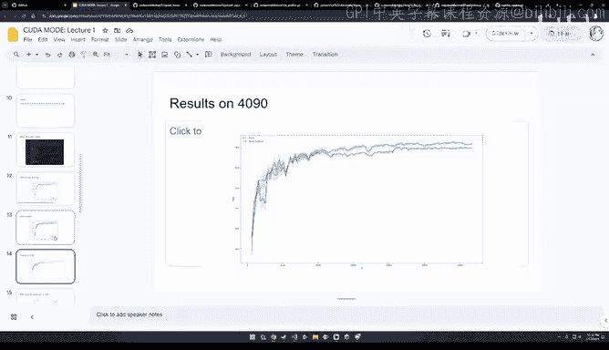

So first off， let me show you my kernel quickly。

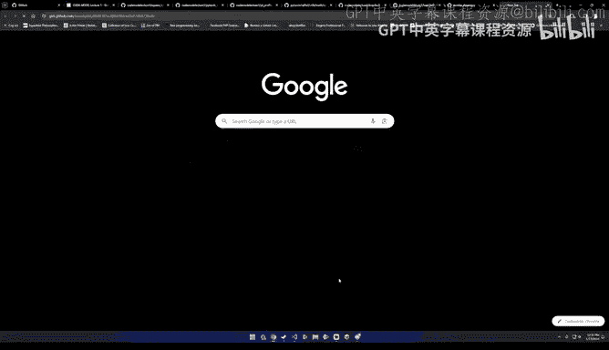

All right。So conceptually here， like it also looks like very similar where like the sort of interesting part of it is like。

 well， you have this row。And the row is like you're loading from input pointers with like an offset。

And possibly， to make it a little bit louder if you're in browser，Yeah。

 so basically it like so first off， like here， like if you look at this kernel also conceptually。

 it's very similar to the Kuda kernel I showed you the sort of interesting part is like the sort of three interesting parts are you have like this like we're basically loading loading things row by row like we're loading like we're loading one row at a time into SRAM and we then take this row and multiply it like by itself。

And then we store like， and， and and then we store these output pointers。

 and then we write them back out to like global memory。 So， so conceptually it's， it's。

 it's all similar。 But instead of like operating over threads。Were operating over rows。

And the way I adapted this was like， I just took the tutorial that they already had for Where was it see here。

 Yeah， like basically the the very first tutorial for Trident。Theres this guy。

 It's like this fued softm operation。 And they do something very similar to what I just showed you here。

 But then like when they ran their results， like they were obviously like much faster than Torch Jeit or Torch native。

 And so I was like a bit surprised。 I was like， well， what like， you know。

 conceptually They're both like。Point wise ops。 like these things should behave similarly like， well。

 what's going on here， right。So， back to here。Okay， so my suspicion after profiling a bunch。

 and I'll go over the profiling tools is that it's just like that my kernel launch parameters were really bad。

And so I just fixed the block size in my code here。To 1024。

 And then this made the results look closer to this。

 So it was just like a a complete like reversal of the trend。

 But there's profile And I'll show you now， like the profile or tool that will help you。

 help you do this kind of stuff。Alright， so another thing I want to mention about like Trident is Trident has a debugger now。

 and it's great。 So basically， if you come here。😊，You can say like Tri and Jit interpret equals true。

 and then you can just literally add like a Python breakpoint。And then you can inspect this code。

 like line by line。Pretty much everything that you see here is going to be an object of type wrapped tensor。

 So if you just say like whatever if you print the variables dot rap tensor。

 you can actually see what basically what a program ID looks like。

 what a column offset looks like Catriin is like a block based programming language and the alternative to this is that you would need to write your kernel line by line。

Loads whatever you want。 and then print it from your driver program。

 This is very annoying and very slow。 So highly recommend the the the new interpret mode。

This is so also incredible It's a triton debugging feature。

 It is something I've looking if you looking for so long。 it's not documented anywhere。

 there's also an environment variable。 I think it's like try to underscore。

 interpret equals true or something。 But it's fantastic。

 Like the fact that you can just use like a regular Python break point for me。

 as an educational tool has just been fantastic。 Like for what it's worth， like actually。

 like let's talk about this for a second。 Like， let's say you try to add like a print statement here。

 Like this is like gonna crash。 Like it's just like， you cannot add print statements。

 Like this is just not something that exists in the language。 You would again。

 like you have like variables。 you store them to global memory。 and then only then can you read them。

 But like as the co kernel is running， it's actually like a black box。

 And this is debugging mode is sort of like a significant step forward and usability， in my opinion。

😊，questionest， when you write with the debaer， do then the kernels still execute in parallel or sequentially。

I'm not sure how the how it works under the hood， but I have a friend he who works on the Trident team。

 and I'll ask him if you don't mind asking me the question as well in chat。

 like I can make sure to follow up on that as well。I think even。

 even if it's not like fully like optim re， the re running at that moment， just to get。This。

 the state feedback， I know if in earlier versions like very early versions of tri。

 They also allowed printing like during the first compilation of something when the python was evaluated。

 I don't know how exactly it would work， but but it allowed printing。

 And if you know have no something similar， which allows us to inspect what's going on there。

 because so so easy to make some index errors or whatever and。Yeah， I think it's。

 it's super great feature。My solution until now was to just like crash the curve。

 and then I would get all the information。So it's a cool approach。😊，All right。

So what the cool thing about Trident as well is that when you are running a Trident kernel。

 it's gonna like it has a cache called dot Trident where it will actually store all like basically Trident like a big chunk of it is like it's leveraging like LVM quite heavily So you can go to an individual folder and look at all the individual Is including the PTX right And I've often heard people say like oh。

 you don't need to learn PTX or whatever。 I feel like it's quite useful。

 So let me sort of give you an example here。 Like this is the actual square kernel like the whole like this is all the PTX for it。

😊，It seems long， but it's actually not too bad。 The important part is here。 Like， basically。

 remember what we're doing。 We're doing an element wise like matrix square。

 right And then here we noticehu， like there's a small。 And we're multiplying F1 by F1。

 And then we're storing it in F 9。 And then we're doing this up until F 8。

 So that means that Trident is effectively leveraging8 registers at a time。

 And then to like to to have like for the input values。

 And then using like another8 for the output values。 And for me， this was interesting。

 Like I expected to be frank a lot more。 I was like， well， I heard there's like， I don't know。

 maybe there's like a lot more registers that it use and y isn't it using more or whatever。

 So this was interesting that it's doing at 8 at a time。

The other thing that's interesting is that where was it here？

So you'll notice like parts of the program here， like for example， the store global。

 So this is like us like writing the variables back to global memory。

 So if if if part of the kernel is using shared memory versus global memory。

 you can see what are the actual registers for this like directly like looking at these PTX kernels and then。

There's also， I think T I D， Yeah here。 And you can also see see things like， for example。 Oh， yeah。

 like the thread I D， for example， is stored in this like register called R 25。

 like we're loading like these， like so， so like these these are like the kernels。 we're loading。

So it's actually like not too bad and you can what you could do like a trick I like to use for a reading assembly is just copy paste this whole thing into chat GPT and you can ask it to like add annotations for you it's like really really quite helpful as you're ramping up on PTX。

Yeah。So。Another trick is that remember what I did was I was writing this like square kernel myself。

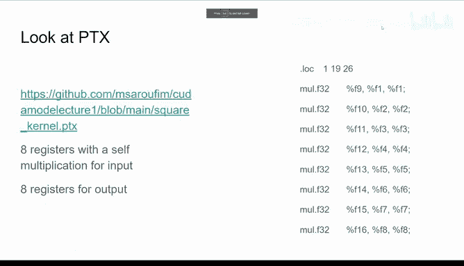

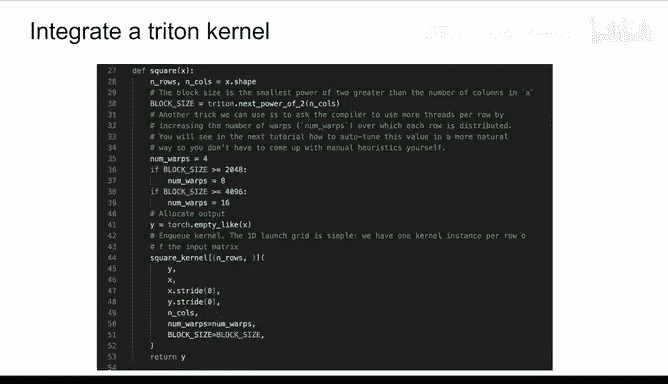

But instead of like writing a kernel， you could code generate it yourself。 So you know。

 so spoiler like you know I work very closely like with the torch compile team on Pytorrch So there's this one flag。

 So basically what I basically have a program where it's basically import torch torch compile torch square。

 And then I basically add instead of just calling this like Python compile square I also add this environment variables called torch logs output code。

 and it'll print to the console， the actual code that torch compile generates for this kernel。

 And so again， this way you can instead of learning how to write a trident kernel you know you just write your pytorrch program get a trident kernel look at it and use that as a starting point that you can optimize and learn and change stuff around。

 So the interesting thing you'll notice about like this program。

 is that like one they're not operating like row by row。😊。

In the way I was like doing things like so like the code is actually much simpler but you can see here like they have this temp1 and then temp1 you're multiplying like a value by itself so this is like the element wise is like matrix Ma here you can also see that it had like some heuristics for example that these are like FP through 32 like this is using FP32 so you can make this use FP16 or Bf16 or whatever you want it also passes in some compiler heuristics like like the number of elements so this helps to sort of like do like auto tuning heuristics as well。

So I thought this was like pretty cool。 So like for sure， like if you're getting started， you know。

 use this mode like right like really toy， like one line。

 two line programs and you can see how this goes。 So one example that I'm not showing here is like the most important optimization It ends up for a lot of machine learning code tends to be fusions and what fusions are like from the perspective of a kernel is it basically means you're having more and more things be in a single kernel。

 So here the kernel is called Triton underscore right So this is actually the kernel name that you'll see in a profiler And like let's say we're running the square operation twice。

 we expect to see like a temp1 and then a temp2 equals temp 1 times temp1 and this is basically would tell us and confirm to us that indeed things are being fused here。

😊，嗯，呀。Alright， so this is like as far as like integrating and generating these code examples go。

 I want to now quickly talk about the most useful Ka profiler I've come across。

 And it's called the NviDdia compute profiler， like NC。

 And the way to use it is basically you just say NC Python train dot pi。

 I'm gonna warn you from now that this doesn't work on the vast majority of cloud vendors because they won't give you this profiling information。

 But if if you have your own like dev GPpU， like sorry， like your own like GPU at home。

 this works great with like no with no with no Kinks。 And the logs like look something like this。

 Like so this is like the written logs。And it'll show you， for example， like， okay， well。

 this is like the L1 cache throughput， the L2 cache throughport。 It'll tell you， oh。

 like it seems like this kernel has low compute throughput and memory bandit utilization relative to the peak compute。

 And it'll give you percentages。 So basically it'll tell you， hey。

 like you're like at 60% of the peak。 So this is pretty good because this gives you like a good like roof line thing to target。

 Like it's gonna give you like， let's say two tips and it tells you， hey， if you do more work here。

 you can get maybe 40% here，30% there。 And so this gives you like a good target for you to figure out。

 like， is my kernel actually running quickly or not， like that way， you know。

 like what's sort of like theoretically achievable。😊，So for example。

 like the most actionable hint here was like this one。

 So it'll say the kernel grid is too small to fill in the available resources on this device resulting in only like 0。

4 full wave across all Ss look at launch statistics for more details。

 So like understanding the details of this is kind of like an example of like we just need to go through the textbook together But from like a practitioner perspective。

 you know you have your your kernel that you're launching like make it bigger like pads your inputs right So this gives you like concrete things that you can try out and then try them out。

 see if the Perf changes and then move along and then you know sort of learn learn like the basics of kuta as you need them。

😊，So NCU also has like a very neat like visual profiler。

 so the only difference is you need to say like dash dash set full O and then the view will look something like this。

 So here for example， like this is running like here like it'll show you like a kernel like what's the memory throughput。

 the compute throughput， the block size etcter。

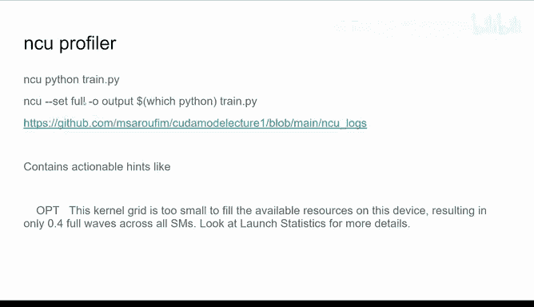

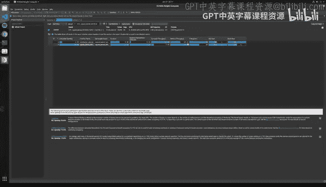

嗯。One thing I thought was kind of interesting is that， like， so。Like， let's say in NC。

 they'll say some things like here。 So example， here， it gave us three actionable hints。

 It told us about like， you can improve your tail effect for 50% speed up。

 And then you have your achieved occupancy and long scoreboard stalls that can each。

 if you fix those that be probably like another 20% speed up。 Okay， great。

 So the tail effect and achieved occupancy are can often controlled by things like padding。

 So padding you can control。 But then things like the long scoreboard stalls。

 These are things where you need to either coalesce your reads and writes。😊。

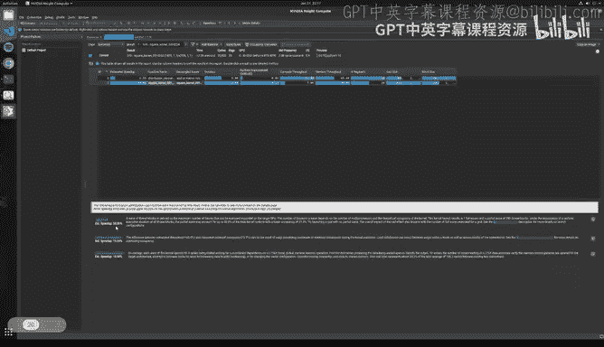

And use shared memory。 But this is controlled by Triton。 right？

 So the reason I say this is because you wrote a Triton kernel for something。 You got this trace。

 right， you can get 70% speed ups if you pat things。 So this is within your control。

 and you can get potentially a 20% speed up if you think you can do a better job than Triton at doing shared memory management and memory coalescing。

 right， So it gives you like a very natural time to decide to upgrade from torch to Triton to Kuta as opposed to just going going in like with Kuta immediately and like mucking around and you know。

 writing something that would be slower than something than the Triton。😊。

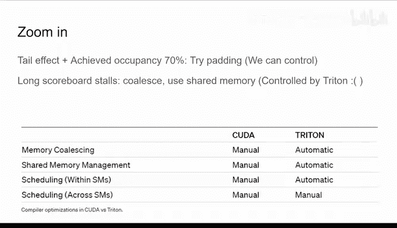

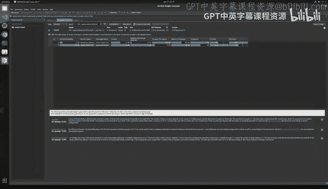

All right。Yeah， so another view I quite liked was the swa。 So basically here。

 like this is the so this is like back to the so this will show you the like this is the Trident kernel。

 And then it will show you for example here like on the Tl load。 like these are like global reads。

 So you're like， okay， well， there's like a lot of global reads here。

 And then you can look at the PT X。 And it's again。

 remember when I said this is the R8 times R8 gives you R 15。

 So like something similar is happening here。 But instead of like having eight registers。

 it seems that we only have four for whatever reason here。

 And then you can basically look at your individual lines of code。

 change them and see C effectively what you need to change to get betterproof。😊，All right。

 and that's pretty much like all I had。 Like I think the main thing I like the sort of the main important lessons from this is that it's really easy to integrate a custom k kernel in Pytorch with load in line integrating trident kernels is really easy。

 you know， in this order， start with the autograd profiler。

 then the Pytorch profiler and then N and doing that。Should get you like。B like。

 like basically get you good enough at Quta to write things like， you know， G T fast or like Z fast。

 And then obviously， like， as we go along in the in the chorus and learn more advanced stuff。

 like we， we'll sort of revisit this and certainly they allll get better。😊。

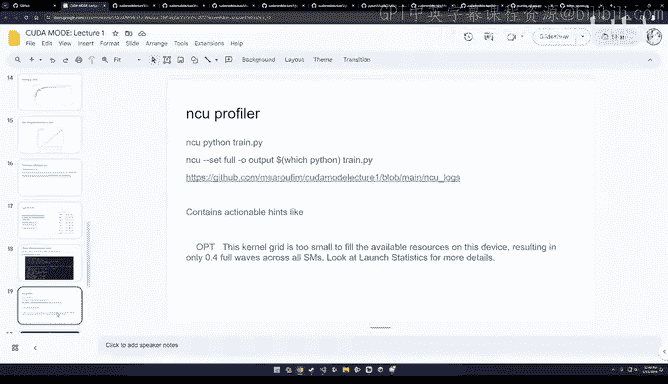

But for now， these are the main things I wanted to stress on。 And so thank you， everyone。

Thank you very much， Mark。 This was really awesome。 I think we went。😊，Pretty deep。 Also in。

 in some tools， we probably need to elaborate on， on some things later。Maybe for now， if。

 if you have questions to Mark， you could either ask them directly or spreadite them in the chat。

 We had， for， for example， one question regarding the relationship between Triton and torch compile。

 Can you， Mark， can you say something maybe about this what's do。

 do you know what's going on a little bit under the hood or Yeah， yeah， sure。

 it's actually like like compilers are quite dumb in the sense that like， maybe I can show you。

Let me see if I can find the code here。 I'll quickly。

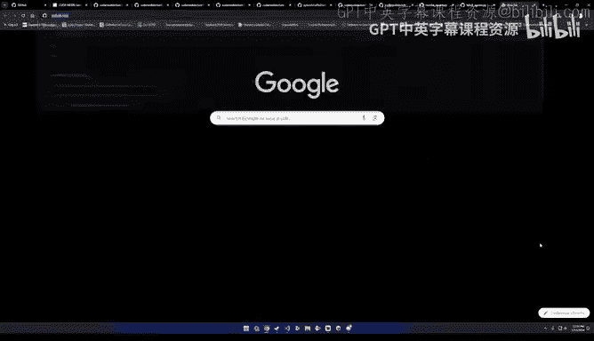

I won't find it like as quickly。 but like， let's say you have like。

 like you have an operation like Torch dot Square that you're trying to run， right。

The way like Torch Campile will go over this， it'll be like， O， well。

 I have this op called Torch Dot Square。I don't know what this is。

 because this is not like sort of a very primitive operation。

 So instead I'm going to turn it into like a torch dot mule operation， right， So great。

 So now you have like a torch dot mull operation。 And literally what torch compile will do is it will read the torch dot mule operation。

 And it will write a string to a file on disk called essentially using like the triton basically the equivalent of Triton do mull。

 And then you have a file。 And then you have it's a triton file， and then you just run it。

 So like a lot of compilers like work this way They'll essentially like write strings to disk。😊。

Based on like certain heuristics。 And then you run them。

 And that that's kind of like at a high level how you go from a Pythrus program to like a trident program。

Hello。Why can you， can you stillhe me， I think something broke at my side。Can you hear me。Hello。能。

Okay us。Okay， so great。 Marcus， I hope you can still hear me。 I can hear yes。 Okay， great。

 something with audio you went wrong on my side。But so we have like two more questions。

 I don't know if you can see the chat Max So there was from Don Whittaker。Thanks， Mark。

 that was great for the compile to try and trick。 How often do you find the code readable enough to be a useful starting point。

I would say almost always because there is not many clever things。

 like like basically compilers are limited in the sense that they can't do things that are too clever。

 And so like for machine learning code， the main thing that you want to look for is that I want as many things fused into a single kernel as possible。

 which means I need as few kernels as possible。 And so generally taking the pipe the trident code is very readable。

 The main problem is that like the variable names are just temp 1 and temp0 and whatever。 But again。

 like using it as a starting point and adding your own comments on top is a trick I use all the time。

 these days。 whenever I'm writing any Trident kernel。

 I actually forgot to do it for this example for my square kernel。

 But like I said it it's a great tool to get started in this regard。Yeah yeah。 thank you very much。

 Mark， whether way do has have your stream on is it no， I'm not showing。 I I I can， maybe。

 maybe next time we can。Again， go to this a little bit to more detail how this。

 not like this trick really works， because it was for some people a little bit too fast。 Okay， so。

 wait， so like our， our people， I mean， if people are curious about like the details there。呃。

 let me see。Someway， first， let me cover the question。

 So did you compare the performance of Tridenverse scooa for the square kernel， I I I did not。

 And the scooa also generate PT T X code。 yes， I don't know how you can look at it。

 but I'm pretty sure it's like a quick Google search away。Yeah， so the Trident square exactly。

 So I shall wait。 Let me compile， compile。Byage。Okay， yeah。

 maybe let's do some live programming then just because I don't have like a good example for this。呃。

So， this is like my Windows PC。 So I don't have like， all of my。I don't have everything here。

 but essentially the way this would look like for a torch compile to generate a trident to generate the trident kernel for it would be something like this。

 So let's me call this like square compile dot pi。 this is going to be like fully functional code。

 So I'm going to say define square。 And then this is going to be a。

 and then this going to be return torch dot square a。

 And then I'm going to say optimized square equals torch dot compiled square。

 And then because it's a Jit， you actually need to run it。 I'm going to say optimized square。

 And then like this。 So this is actually like the code maybe there's a missing parenthees now。

 So so this is actually the code that you would need to run And then you just call this with like torch logs。

呃。Equals output code。And then you would say byython， a square。And that's it。 This will like when you。

 as you run this， it'll print the trident kernel to your console。

 the main reason this is kind of interesting is because like， let's say now。

 like we're doing something like a torch dot square。So this is like a single， like。

 this is gonna be like a single operation。 But let's say we have a program that looks kind of like this。

 Like， let's say we have a equals torch dot square a。So we're doing two squares。Right。

 so let's think about this problem for a second。 What's going to happen is that you basically need to read the a。

And then， write back to a。And then you read the A。Then right back to a。

 So if you're running this in in an eager Pythr program。

 you're going to have like one kernel being launched for each。

As opposed to just fusing these things together。 So if we run this。

 if Torch compileile is doing its job correctly， we would expect to see like this like two squares happening in a single kernel。

 Otherwise like somethings going wrong。 So this is kind of like the the main you know。

 this is like a great educational tool to go for to from Pythers to try them。😊，Super cool。

 this like live coding session。 I think we， yeah， we need to somehow include this also in future sessions a little bit。

 Yeah， I I don't know if Luca Antiga is on the call， but like， like。

 like the lightning AI studio is really， really neat for like this like live coding session。

 But I still have some issues connecting and see you to it。

 So I think like once we get up and running， I think it'll be very。

 very easy to do like live coding sessions with all of this stuff。😊，Yeah， cool。So in general。

 Mark how how large can the things be with torch compile。

 What would you So to understand a little bit when does torch compile break， So I tried it。

 for example， on very complex projects which were written without like this torch compileil thing in mind And there's a lot of if statements and other things in and yeah。

 also like for example， Ref attention was in the didn't like directly work。

 I would say So what would you say is like do you have to write a little bit in with this in in advance in in mind and。

Yeah， like， so so I think the design philosophy of torch compile is that you don't change your code at all。

 Like basically， like whatever code that you have， it might not be the most performant code in the world。

 but。It'll like it should not make your performance worse。By adding it， obviously。

 if you write your code with Torch compile in mind。

We've had examples of people getting state of the art performance with sort of SAs。

 stable fusion and then GPT so it's certainly possible so if that's potentially like another interesting future topic for people which is like how do I go from a model that I care about to really good Perf。

 like if this is interesting we can certainly sort of like have a lecture just like on that discussing like concepts like graph breaks and like in place mutation and cographs and I think there's sort of like a lot of interesting things we can discuss？

Yeah， I think this in a separate session that that would be super。Also， because I。

 I personally also struggle a little bit to， to see the difference between all the op yeah。

 different options that are available with secure graphs with tor compile。 and when do I need。

 for example， to really write my own corner and how to make this decision basically how to spend the time best making things fast and also how dynamic our things。

 for example， and when， when， when are they no longer dynamic。So so folks， I really apologize。

 but I forgot like a week ago that I have a hard stop at one。

 I was hoping we could go for much longer。 However。

 I think this is good because like I'm happy people found this talk interesting。

 we'll share more news on when the second lecture is gonna to be shared soon。

 And if theres sort of any topics that you'd like us to cover。

 Please make suggestions in the Disc channel and we'll take a look and we'll try to either give the content ourselves or invite like some relevant experts that you might know of in the sort of performance space。

😊，So thank you everyone， I really appreciate everyone's time。

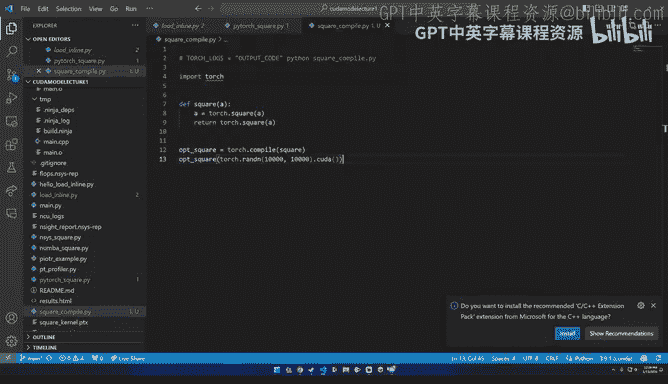

Yeah， thanks， everybody。 This couldn't have said it better than Mark。 maybe one final comment。

 we also are looking， of course， for others to make presentations。 So maybe next week。

 I will do a presentation and then。嗯，我做。We， we， we have a s certain like lineup。

 which would we like Thomas， maybe， for example， we also show something。 But after that。

 we would be very happy also to for others to tell a little bit their story about Qda and。😊，对。

So thank you， everybody。 Yeah， stay around here and， and。

