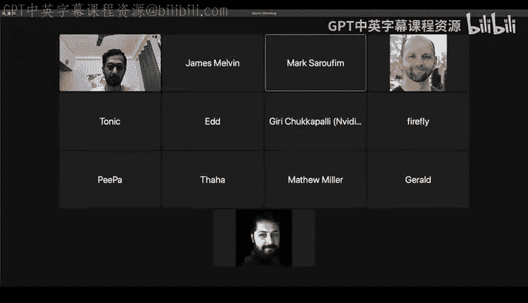
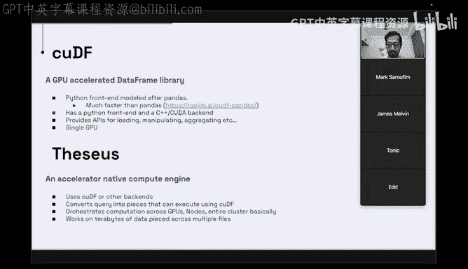
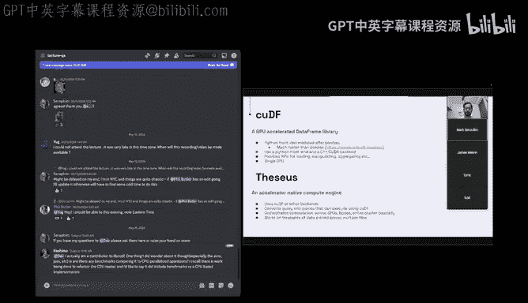
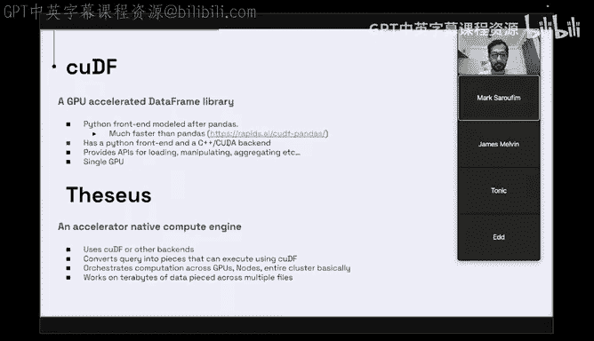
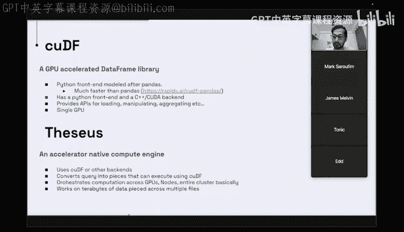
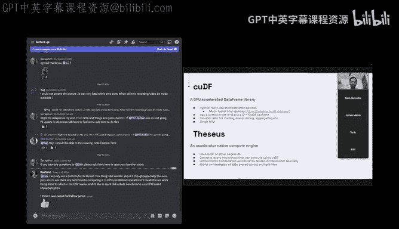
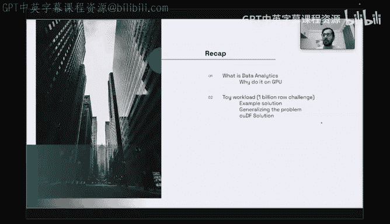

# GPU MODE《CUDA、GPU编程1-53课｜GPU MODE》中英字幕（deepseek-v3.2 - P20：-20240523-Lecture 19_ Data Processing on GPUs.zh_en - GPT中英字幕课程资源 - BV1QZ421N7pT

And basically thevat used to be like a former maintainer of Goodev while he worked at NVo。

 but like these days he works at a company called Voltron which is building like a GPU nativeative queryier engine so if you're interested in how to do like data processing on GPUs I'm hoping like this is gonna be really the talk for you so thank you so much and theveette please start whenever you're ready。

O。So hi， I am Debra， I currently am a senior software engineer at Boron data and we make a really nice accelerator native query engine compute engine。

 and formerly I used to work at NVDdia as Mark said， I used to be a maintainer of QDF。

So today I'm going to be speaking on data analytics on GPU。

So I'll first go over the kind of motivation for data analytics， doing data analytics on the GPU。

 and that would include showing a little bit of a glimpse on how much faster data analytics can be if if we do it on the GPU and then to walk through。

Basically。诶。Kind of a use case of how and basically to walk you through how to build one from starting from Qd F up to the C。

 I'll use a toy workload。 And I think this is something many a you might already be aware of。

 It's called a 1 billion row challenge。 I know some people in this Discord channel have also attempted this。

And then I'll segue into QS group by implementation， which will be。

 which is what we'll use in the To workload， and then we'll scale that up using CCS。

Which is our engine。So a quick refresher on what is data analytics。 So in data analytics， the data。

 which we work on is almost always in the form of a table and。The table can have。Okay。

 it's almost always in the form of a table and tables are made up of individual columns。

And these columns can have different data types， and these data types can be fixed with or variable width A they can be flowed in date strings and even nested types。

 like lists andstructs。嗯。The thing about the table。

 what brings all these columns together is that values from each of these column correspond to a single row and because of that each column has the same number of values in it。

嗯。Which is as many rows there are in the table。 If there isn't a value in the column at any place。

 it can be null。And so you would query， when you have one or more tables like these。

 you would basically ask questions of the data， which would give you some， some insight， for example。

 on the right， you see a SQL query it's not related to this table， but on the right。

 you see a sample SQL query taken from a popular。Data O benchmark called T PCC edge。

And that this in this one， you're basically asking for。

Customers who have had high have done high value orders or something。

Okay so as first start by explaining what QDF is it's a GPU accelerated data frame library so if you're familiar with pandas the Python library pandas it's quite similar so you could even imagine QDF as sort of a GPU backed pandas compatible data frame library and the benefit of using QUDF instead of pandas if you have GPU if you have an intermediate GPU on your laptop youre basically almost always going to benefit from using QDF。

And the guys at Rapids and NVdia have even have a blog about it。

 how it's for certain workloads iss150 times faster than pandas。 Goodf。

 just like pandas is built with the Python front end and but unlike pandas， it's。

 is's built with a ka packet。It provides data frame APIs like loading from a file like reading a CSV file or perque file and then slicing。

 diing the data， manipulating it， like filtering some things out grouping， aggregating。

 finding the mini max whatnot。 and then even And so the thing with QDf is it's designed to run only on a single GPU。

 So if you if you load file using QDf， it's going to load that file onto one GPU。

 And then on the very same GP， you're going to be running all other subsequent operations on it。

And this is where thesis comes in。So the is a compute engine。

 and what what that means is that it's it has backends like QDf it can have other backends as well。

 and it use， it uses Q Df to sort of take a query that you gave it， for example， the SQl query。

 I just showed you in a previous slide。 It will it can break it up into small pieces that it knows it can query It can use Q Df to run and then sort of merge。

Is that a hand raised here？

Oh that's probably zoom。 So like that beeping sound to zoom。

 I'll just interrupt you if there's like a critical mass of questions or like any hazard。

 So so don't worry about too much about this。 now that you bring it up folks。

 if you have any questions。 Like feel free to raise your hand in Zoom and I'll unmute you。

 Otherwise in Discord， there's a lecture Q and A channel。 So feel free to ask your questions there。

 And I'll just sort of aggregate them in positive when there's a critical mass。

 I I had a first question， which was like it's sort of interesting to me that like doing data processing on a GPU is' kind of an interesting use case because I would imagine that like let's say you're loading a data and let's say your data is less than 40 gigs So it can fit on a single GPU。

 you would be asking like multiple sort of similar youd be asking like essentially multiple questions over the same data。

 And so like have like an aspect to basically persist a data set on a GPU while you're making queries against it or are you basically。

Per per query reloading the data set。 Oh know。 So query will persist。

 So what that means is that if you， if you you basically start by creating a data frame and with that。

 you generally read from a file like a perque file or CSV file or a G S on file。

 and then that data frame stays on your GPU。 and if you want to。

Manipulate it the data frame is immutable so if you do anything with it it's going to create a new data frame out of it and if your result goes out of scope that one gets freed from the GPU。

Ands the so you need to think that if there's enough space to hold the new results as well as the old data frame at the same time。

 plus there is also some memory operating bytes needed on the GPU for any kind of operation。

Excellent， so so there's actually another question from the audience。himo is asking。

 and they're saying， hey， Dave like， I'm a contributor to Li D F。 And one thing I did wonder about。

 though， especially the Aro Jason， et cetera。 Is there any benchmarks comparing it to CPU paralyzed operations。

 I recall there is work being done to refactor the CV reader。

 And I'd like to say it did include benchmarks versus CPU based implementation。

 I think it was called par par parser。

yeah， sopar parser basically was a project by an colleague of mine at Nvidia。

 it was his PhD thesis or something and then made just a paper maybe and it had an entirely different view of。

Pasing the kind of data that you would find in CSV or JSON using scans。

 I am not qualified to speak on it because I I left Nvidia around the time it was being implemented but about the benchmarks I think you would need to ask NVdia folks for benchmark I'm not sure if I'm allowed to speak on their behalf anymore about how much faster the CSV reader is personally I know it's quite fast I've seen some results somewhere being compared to the pandas CSV reader was quite fast。

嗯。DoesDoes that answer all the questions？Yeah， I， I I think so I see Kashimo typing again。

 but maybe we can， we can keep going。 And then we'll。 So if， if you want to see Papar in action。

 I think the Json reader has already been converted。

So you could look at the old J0 and the new one and understand how that was implemented。

ok。All right， so I'll continue。So theseis will use queryyf another bucket where I all yeah。

 it would break up the computation and it would see how much of of it would break it up into tasks and see how much fits on a particular GPU if there are multiple GPUs on the same machine。

 it's going to break it up and put it onto different GPUs and then basically it's going to divide up the tasks between those GPUs and figure out pipeline so that in the end you get the answer you want。

 So if it's not a straight group if it involves multiple group pie and joins and whatnot iss going to insert it their stuff。

It can scale not just to a single node with multiple GPU， but to an entire cluster。

 And because of that， it's able to work on terabytes and terabytes of data sitting across multiple files across the whole node whole cluster。

Okay， so obligatory slide about data analytics as it is done today so。

Spark is the most common data analytics tool。And it's a daily CPU based。

if you remember a couple of slides ago， I mentioned about a TPC query。

 so that TPC benchmark is basically a set of 22 different SQL queries。And。

And you can generate it for 10 terytes，100 terytes and stuff and。

You basically test the performance of this system with it。

 what this graph shows us this is that if you want to analyze 10 ters of data of TPCH generated data using TP H queries。

 all of them。 then the total runtime Sims towards several minutes and you can't keep throwing money at the problem to make it go any faster。

 So if you want to make it go faster， you have no option but to switch approaches and go to GPU and the way to the way and just for an example。

 if you do it with the the spark 10 terabte line is over here。

 the thesis 10 terabyte is line is way down here。 So it's not just faster is also cost effective。

This has been carried out by 10 DJ X server。 So 80 GPUus in total。 The files were not C。

 They were par K files。 same for spark。 The file system was removed。

 There were this spilling involved。 Not all of the data does fit onto the GPU。

 There was no tricks involved make thesis go faster by pre sorting the data or precaching it or warming it up with cold queries with hard queries or something。

 So。We so I move on to the toy workload。 So the 1 billion road challenge。

 It says that you have a file which contains a billion rows and a billion lines。

 and each line contains two values， a city and a temperature。

And the city is the number of cities is limited， so for a particular city。

 there are a lot of recorded temperature values。And you need to go the。

 the task is to find the per city minimum temperature。

 maximum temperature and the average across those billion lines。So。

So Mark shared a solution with me by a community member on this Discord channel。

And that solution that blog was described a custom solution to this like writing their own kernel。

 so the solution that so that solution goes you first construct an array of all possible cities this is like they do mention that it's a small sheet because it's not part of the challenge but on the GPU you cannot once you start running the kernel you cannot allocate more global memory。

 so assuming this is just an assumption you just make a list of all the cities first and sort them and place them on the GPU first。

Then you construct a similar sized array of per city min Max someM count and then you use the CPU to to put markers to basically go through the file and after every a bunch of kilobytes start looking for the nearest line marker and store all of those pointer so that your GP can start so again you can create some parallelism for your GPU and so when the kernel starts each thread in the block will start from one particular pointer into the file data it's going to read the city it's going to read the temperature and store them into loopill variables and then at the end of the line it's going to by and research this city into the array of cities restored and from。

Once that particular density is found， it's going to go to the corresponding index of value of the aggregate values and use atomics to aggregate the value over there。

So this， this is being tailored kernel。 It has quite a lot of advantages。

 like it needs to only go through the data once it knows that it only has to eat two values in memory。

 so it doesn't need to go and store it market to global memory。

 It can just keep it in thread local storage。So， yeah， obviously。

 it's not meant to be extended to a general solution。

So the the blog mentions it runs in 16 seconds on a different V 100 GPU the the GP that's available to me is the A 100。

 and this solution runs in 13 seconds， which is not quite bad。嗯。

But we if we're building a library for data analytics we need to think of the general solution for this and in general there can it is no guarantee for there to be exactly one value to aggregate you could have apart from temperature could have precipitation and wind speed and you could have multiple key values because is' not necessary that you only group by by a city you could also group by state and city and like this doesn't take care of that。

So the general solution for this is to first read a CSV file and parse it and store it into GPU memory and then call a group by on it。

 so the query solution to this would be simply as I said。

 just read a CSV using the CSV reader API and then group by based on the keys and then aggregate the columns。

A caveat here is that Korea cannot。First of all， this is a lot of memory data to be read advanced into the GPU。

 but also。QF has a limitation of the column sizes being in 32 max。Liitted 2 in 32 max。

 so it cannot have more than two to the power 31 values。

 which which means you can't pull the entire table into the GPU into a single QDF data frame anyway。

诶。So， this will read。Any number of columns you have doesn't really worry about。

 which's the key and what's the value。 This one is going to group by any number of key columns you gave it and any number of aggregations on any number of value columns。

 So before I go into the implementation of group by。

 I'll first need to explain what the query of table looks like。

 So queryf table consists obviously of multiple columns。 and a column consists of buffers。

 data buffers。 So a column depending on the data type。 It's story。

 and whether or not the column does contain null values or not。 it can have multiple。

 it can hold multiple data buffers in it， so。Column 1， for example， has only one data buffer。

 So I'm saying so this must be fixed with data type with no null ability。

 All of them are valid values。 This one has a data buffer and a null mask buffer。

 which means some values in the data buffer might be null。

 and the corresponding bits in the null mask buffer will then be 0。

And then there is a view type of the table。 So just like the the table。The table type。

 there's a table view type it contains column view types and the difference between this is that the column type owns the data buffer。

 so this is like astruct that contains a vector which is sort of like an RAI object that the analogs upon destruction this only contains a pointer to that data buffer similarly for the column2 you only have pointers to the buffer so the benefit of the table view is that it's cheap to copy around and pass along so in as in the previous slide。

 when you cause the CSV reader， it will give you a table。

 but when you want to pass something to the group by you pass it the table view because as I said earlier。

 the table is immutable so you just pass it the view。The view is also immutable。 This is。

 this is like a constant pointer to the data buffer。 And then the aggregate。

 and then the group I also returns to another table， another new table。嗯。So。Then I would like to。

 So sorry interrupt you。 Dave like， I had a question like， like。

 as as soon as you said the word view， I started to think about like strides。

And so I'm like wondering， like， is this like another aspect of like using these views。

 which is to sort of。Either do like reshapes on the data or like changing the order of columns。 Like。

 is this kind of stuff like why the point， you can change the order of columns。

 But this is not really used for strides， as in the if I understand correctly。

 strides in the kernel sense， yeah。Yeah， no， not for that。 But you can。 So， for example。

 if you had a CSV with multiple columns in it and you were only interested in two of them。

 you would create a new table view out of two column views from that table。

 And then you can pass that to the group I。Got it， okay， makes sense， Thank you。Okay。

 so now I would like to explain how the O Df groupby works。

 I want to preface it with the statement that Im not the original author of QDf groupby or the various tools I'm about to explain。

 I I'm I just contributed to them， and I just want to share how they work。So first of all。

 the group buy is a hashspace group by unlike the so it doesn't need require any buying research into anything。

 It's a we need a hash map that can work with Uda。So with a PCkuda。

 you need a hash mapap that can So Korea has its own hash mapap implementation that。

For which you need to prelocate all storage beforehand。And again。

 that's because you don't want to go exit from your current go and increase the story and come back。

 So the way to do it is you make a hash map as big as the number of possible values that you're going to put in it。

So into， to insert a key value pair into that hash map， you take a key。

And hash it and then you take the size of the hashmap， actually， you don't have to do that。

 but this is how the insert API on that hashm works is that it will hash the key。

 it will modulate it by the size of the hashm and try to store the key in there。

The key value pair in there， if the slot is empty and you know it's empty because the the the storage is also initialized with a sentinel value。

 so you do an atomic compare swap to see if it's if the original value is equal to the value that's supposed to represent empty and if it's empty you just paste it in actually you don't need to paste it in the comparison swap does it for you。

If you have if you try to insert a key again， the hashmap will do nothing。

And just return to you the iterator to the place where that key already exists in the Hahm。

And if there is a hash collision， as there always are。

 the hash map will try to find the next available slot that's free and then store it there。😊。

So that's the hashm。 So now we try to insert our keys into this hash map。 Theres a problem。

 The keys are variable with。 so you don't know how much of storage to allocate for the hashm because keys don't have to be fixed。

Strings， and if you're thinking， okay， fine， I know there are strings。

 but they're all cities and I know the maximum size of a city can be that that one strange town in Wales is which has a really long name。

 but then you need lots and lots of pre allocateated storage because the entire hash map。

 each of the slot need to be as big as the largest key that can sp into it。😊，嗯。😊，So。Now。

 there's a second problem。You can have multiple values as keys， as I already said。

 So theres in this case， there are two columns that can that make up a key。 How do you insert that。

 You can't plan ahead for that， so。The solution to this is that we need to find a way to know the equivalence of rows just by the index of the rows。

And to do that， we make a comparator object。So this is a row comparator。

 It takes the table device view， and this is similar to the table view。

 except in case of a table device view， all the pointers to all the data buffers in the column are first copied into a temporary or copied into a buffer onto the GP and then made device made a view out of it so that once you have this table object on the device。

 you can query it for give me the I element of the Gf column and it can give it to you so。😊。

Once you have that structure， you can you make a call operator on it， and that's a device function。

 So this function is going to be called by the hashm。So。When the hash map。

 when you're trying to insert into the hashmap， you don't insert the key themselves。

 you make the hash map with this comparator object and then you try to insert indices from this table in this case。

 let's say we're trying to see whether the index0 is the same as the row at index1 So what it's going to do is it's first going to take the first column of the table it's going to see it's going to compare the column and if it's not equal and just jump out if it's trying to if the first column does compare。

 the loop will go again the second column if fails at the second column。

 the comparison fails at the second column is going to jump out and only once I've exhausted through all the all the columns of the table and they all come out equal do we say these two rows are equal。

A hash table also needs a hash operator， which is much simpler to explain Now that I have explained the equality operator。

 So the hashher is quite similar to the equality 1 again， takes a table device view This time。

 you just give it one index and you say hash the row at index this for me。

So it's going to just find start with a seed， go through values at that index for each column。

 hash it， combine it with the previous one， and then go on and go on。 So effectively。

 what it's doing is it's going to hash the column  one value， combine it with the seed value。

 then hash this column2 value， combine it with this value。

 hash column 3 and so on and so forth with all the columns eventually you get hash value to use with the hash table。

So you construct your hash table with。A custom equality operator and a custom hash operator。嗯。

So now we put these tools together to build the group by。First， make our hash table again。

 with the same amount of storage as there are the number of rows that we are working with。

We also make a array call output， which are also。Equal to the number of input rows。

 because we don't know ahead of time how many unique rows there are going to be。嗯。

Then we insert the index of the row。 It's going to use the operators that we just described to insert them into the hash map。

 and each insert operator is going to return you the location an iterator to the place it either inserted or found a preexisting key。

 Now don't worry about the value column of the hash map。

 use the value that you got from use the iterator that you got from the insert。

 use it to find the index of this。Into the aggregate values。So if， for example。

 row zero hashed into this place。We know where it is in the whole array of slots。

And at the corresponding area， we are going to do our aggregates and the aggregates are， again。

 simple atomic operations for min Max and some。😊，eventually you put in all your values and you end up with spa data。

Now use now you can basically use trust to shooting that sparse data。

 you use thrust to figure out all of the emties in the in the hash map slots and remove it so you can use a copy if。

And then。You also use the same kind of shrinking on the aggregate values。

Now you have another problem we have all the aggregate values for all the unique keys。

 but they are all in a different order Now we need to also return the keys that correspond to the aggregate values and for that we need a gather operation so here's our original table and here is our hashmap storage now because we used it in a way where we inserted the same value basically don't care about the values part of the hashmap let go of it use just the keys to index into the original keys table and pull out the the keys corresponding to that location so this operation is called a gather and it's defined for each of the data type that that queryf supports so what this means is that you can you don't have to worry about。

Copying strings and rearranging them from one place to a different in your gather implementation。

 you can just write gather for strings once。And use it in all QF APIs。And。

Even another good thing about the string thing is that there's a specialized implementation for strings gather。

 if， if your strings are large， it uses blocks to copy them。

 otherwise it uses threads to copy them stuff like that。 So it's pretty interesting like I mean。

 this is kind of reminding me of like a word based tokenizer So I'm wondering if you've seen like sort of any intersection between these ideas because and like a lot of like traditional ML applications。

 you might like tokenize like characters or like bytes of a word to sort of like map strings。

 integers， but like it's interesting that but the reason why you do that there is that just because in the case of。

Like machine learning like it doesn't know what is like like a model doesn't know what a string is so like you have some integerrative map to it but here it's interesting that you're doing it to save space instead that because yeah。

 indeed strings， I think take up a lot of spacely。Yeah， actually。

 what's happening here is that we found all the unique strings by doing a groupai。

 we just basically pulling them out to return because the values that we had corresponding to those strings were in a particular order。

 and we wanted them to also be be in that order So yeah。

 the group by will on each call to aggregate will return the keys。

 a new hash table every time and because of that， your keys can can be shuffled around。Alright。

 so the benefit to building your。So hass cousin for row ordering comparator。

 So less than operator and that one is used for sorting the way sorting works in query F is also similar。

 you give it table view you give it a row comparator and you ask it to rearorder indices and because trust knows how to reorder fixed with indices are fixed with。

 it will give you an sorted order it will rearrange those indices in the order that they should appear in the sorting of the original table。

 and then you can again use the original table and the sorted order to gather and rearrange it into your solution into your sorted solution。

The hash map is also used in equality joins， which is hash paste and it's also used for something called dictionary encoding。

 which is when you have a column which doesn't have a lot of cardinality， you want to save space。

 So instead of having one data buffer， you have two data buffers。

 one of them contains the actual unique values， the other one contains indices into this values。

 and so a huge column with very few unique values will not take up a lot of space。

 and this is used in writing the parquet file format。

And the gather is obviously it' sort of used everywhere in Qd F because we try to materialize everything at the our solutions at the very end and try to work with indices into the original data for as long as we can。

 We keep moving indices around。 And in the end， we use gather to materialize the result。😊。

I have personally even used it outside of Kier， for example。

 the string gather is particularly useful if you have a bunch of discrete binary values you need to reorder you just give it the order that you want and call gather on it。

诶。These utilities are actually available to use one of them。

 especially the hash map has evolved into a library of its own and it currently lives in a repository called Co collectionions。

 J is the maintainer to that。 I think he's spoken here before。

And the row operators and the gather are available in these two header。 So the row operators。

 I believe， is entire is header is self contained in the header。 The gather。 it's going to use。

 You need the could D F as well。The fixed， if you just want to do a fixedbook gather it's already available in trust。

 So dont need to put to query for that。 Now let me bring you to the thess solution to this。

 And the problem with the query solution， as I mentioned earlier。

 is that it only works on a small piece of data。 It doesn't work on the entire1 gigabyte file at a time。

 And certainly doesn't work on reading terabytes of tables at a time。

 So you need to use thecs to scale that across multiple GPSps across multiple nodes， so。

The the U to T CS is sequL， so the sequel for our toy workload is quite simple。 It's just a select。

 give me the city， the minimum temperature， the maximum temperature， the average temperature。

Group all of these by from this table and group all of them by the city and the limit 10 is just so that the result doesn't flood my CLI output。

 but internally it does go and operate on the entire database。So the running this。

 which internally uses the Ko group by。It runs in eight seconds， again， not too shabby。

 compare this to the 13 seconds for the example solution。

And this one has doesn't have the advantage of being tailor made。

 having tailor made kernels for this particular problem， so it's using general purpose API for it。

So what did TCS do internally， it converted the SQL into an execution plan。

 it figured out okay if I have this SQL， what does it translate to underneath to all of the QDF APIs that need to be called it's going to then divide up all of those the execution plan into a small tasks tasks that can be run using QF at a time。

 and each of those tasks will can along with it and estimate of how much memory how much output it going to create based on historical data。

 how much operating bytes it needs based on historical data and then it will refrain from launching each task until there's available memory on the GPU to run that task and if theres a lot of memory available on GPU is going to even call multiple QdF calls at the same time in order to sat。

Readate the compute。In the single GPU case that I just showed that the8 second one。

 the the created hundred and took the 150， actually15 gigbyte file。

 it can broke it up into00 small tasks each containing one cV read and one group by。

 So the operating bytes needed for that group by are not a lot。

 then and then after that group by hopefully the results were sufficiently small enough because。

 again， the number of cities are quite limited。 you're definitely going from a 150 mebyte thing to at least couple of mebytes thing。

 and then it's going to concatetnate all of those results and do a group by again。

But that's not where theis is true powerer。 it's true power in multi GP execution。

 and it can do that by understanding how many GPUus does thesis have right now let's say it has two GPs in this case。

 it's going to assign each GPU 50 tasks to read those CSP and then group pi and then it's going to hash partition those results and it's going to hash partition so that it can share those with its neighbor GPUs So in this case。

 once you partition this data set， these values will the cities that these values will these tables will contain will not be found in these tables and cities that will be found here are going to be found in the neighboring GP So obviously next is going to send those partitions over towards neighboring GPs actually not neighboring。

 but all of the。GpU is available in the cluster。 So it's going to create as many partitions as there are available GP and then。

Once the once each GPU receives the partition that it needs to work on is the the the few。

Subset of cities that is's going to get in the end is going to concatenate it with the values it already has concatenate again into a single table and then run one more task to do a group by again。

 Now， these two tables on these two GPUus contain your actual result。

 and your CI is going to give you back results from here。So that's how thesis does it。And to recap。

 I went through the kind of problem that data analytics poses and why it makes sense to do it on GPU because GPU is the only thing that can make it fast enough for you。

 if you just have even if you have a limited memory money。

Then we went through a small toy workload to show how。

 this pipeline would work by going through the GPU， we went through the example solution。

 the generalized solution and then the QDF solution。

 and then I explained the QDF group by implementation which uses a hashm。

 a row comparator and a good gather， which it also uses other things。

 But these are the things that I find important to talk about。

 and then we went over thesisis solution and thesisis group by implementation。

That's it。At's my talk。So I didn't have an hour worth of things to talk about。

not at all thank you so much really appreciate this talk I did have a question and yeah。

 if you have any other questions about theette like make sure to either raise your hand I can let you on here or just ask your question in lecture Q&A So I think like for me what's sort of unique about like when I think about data processing。

 it's like basically like the average size of a useful data set is much larger than the average size of a model。

And so it's like kind of one of those situations where like you can quickly end up like with terabytes。

 like worth of like data sets， but you rarely end up with terabytes， large models。

 So I'm curious like， how did the economics like work out。

 Like especially as you go towards like a larger number of GPUs how does this really， Yeah。

 how does this really work。Economics， in the sense。Yeah， I mean， like with。Like。like， at some point。

 like waiting is cheaper than making your results faster is really what I'm trying to say。

 Like as far as like time goes。 So I would like to take you to a slide number。 I don't remember。

 wait。It was the this slide right， So notice there's also the dollar value of your cluster at the bottom。

 So if you if you have， if you want to use the same number， if you have the same amount of money。

 you can either have your solution quick using GPus or slow using CPUs and that's what we are actually really competing against here。

The economics does kind of work out。Oh I see answer so all of these data sets that you're showing are like 100 TB Oh yeah no actually each line is a particular scale so that the bottom pitch one is a 10 teropyte data set using two GPUs4 GPUs6。

8，10 two nodes， four nodes， eight nodes and go on so on and so forth。

You might also see that the thesis can do 30 terabytes of compute using less money。

 less resources in the same similar ish amount of time that Spar does 10 terabytes with much more money。

Go it。So apologies if you covered this already。 but like the the like。

 I'm sort of curious say how would joints work in this regime。Yeah， yeah。

 So joints are actually much more complicated and I didn't want to them because it wouldn't fit。

 But yeah， so joins also sort of use a lot of first making small pieces of stuff and then keeping hash table around and stuff like that。

 So doing hash partitions sharing the partitions to which you think belong to your separate different GP two different nodes sharing it to that one And that guy gets to do is join This is this is equality join that I'm talking about inequality joins are a whole different beast。

And I'm not qualified to talk about them because I haven't worked on so much。

So I guess my last question was like you I really like that you mentioned the collections library because I did notice that like a lot of educational content on kernels just don't include data structures including include rock kernels。

 So so like in your work you notice like certain data structures coming up like over and over again。

 I think like the hash map is sort of like a very obvious one for your kind of work there another in other outside of data processing if you've seen data structures pop up over and over again。

So the Co collections one is interesting because I did want to share an anecdote of this one time I was making so QDf also has a parquet writer and just to give brief context parquet is a binary format so unlike CSV you can't read it just from opening the file but due to it being binary it can do a lot of good things like it can shrink。

 it can do compression， it can it can keep data in small chunks so that you when you only need a small amount of it you know exactly where to look for it in the file and stuff and parquet uses dictionary encoding as one of the ways to reduce file size so the QDf parquet writer used to have a kernel that was doing dictionary encoding and that kernel had a hashmap implemented in the shared memory of that kernel and。

Do that there was， there was a lot of Ka ninja level hackery in board。

 I wasn't the person who wrote this。 There was a much more senior person who wrote that kerneld and。

Using so there was a request。To the Korea team to as a reason of the an assumption for that hash map was that the。

The maximum amount of unique data can only be 16 bit worth of integer so like 64 k unique keys。

 but a customer came with request for 24 bit all so 17 bit all the way up to 24 bit because they had the kind of data that had more cardality than just 16 but they still wanted to say space and so I just ripped out the existing hand tune kernel with shuffles and whatnot with very little amount of data going to the to the device memory and trying to keep things and shared and local as much as possible I ripped that all out and replaced it with four separate kernels all made using co collections and it turned out the co collections one it was not slower it wasn't much faster either it was the same amount of time。

But using cool collections， I could basically just tune。Do values。 and。Suddenly。

 my hashm then only worked for 16 bits now worked for 1718 all the way up to 24。So I， I was。

 I'm I became a big fan of。Co collection style， reusable。Data structures like that。Yeah。

 I really like that like basically the availability of better abstractions that you play with like writing very competitive kernels with people that are like maybe the world's greatest that something and you yeah yeah I would consider that engineer to be really great I could not even comprehend that kernel and yet by using something written by engineers much more smarter than me I was able to reuse I was just able to write a better solution。

就。And that engineer actually is I think you' have met him， G can start。Yeah。

 not the author of the super complicated current of， the author of collectionions。Oh， got it got it。

 okay。So actually， I want to make sure we get to the audience questions as well。 So Jerry's asking。

 So how is， how is the Q DF， which works for multiple G GPUs different from QDF and PC， Also。

 how is the performance difference between D Q DF and These。Okay。

 so the D and thesis have similar goals， which is to scale goodf computation。

 and Dask is what is used by NviD as a solution to scale up good Df。 I。

 I'm not sure if I'm qualified to officially state。

 how how much faster or slower thesis is compared to Dask。 But from what I've heard， it's quite fast。

 And it comes down to the fact that when you are dealing with goodf。

 you're dealing with Python APIpis， And there's a bunch of time wasted with them。

 whereas when whereas thesis actually doesn't。Excuse me。Whereas theis doesn't。Use good app。

 It uses straight is straight calls to lift good F。 So just by removing some inefficiencies。

 it's able to get faster。Right right， and then the second question from Kashima it's like they're professing this by saying。

 this is kind of a vague question。 But what kind of use cases does this new field。

 this new field find today， What kind of work is the users of these libraries doing。Yeah。

 so so basically more talking about like the kind of applications。

 I guess of people leveraging your work。So for Q Df， I I。

 I can't really say how many people use it in how many different ways。

 But I just think that it's marketed as a faster pandas。

 And I think we have receive a whole lot of cash questions from employees or companies as well as individuals trying to learn data analytics just just trying to make their panda code go faster。

 So I think Q Df enjoys a lot of visibility and usage across the data science community。

 TheseS is a proprietary product。 and it's meant to and it's meant for companies which have data that truly is large。

 like in the terabytes of scale。So I'm not going to disclose the clients we have until I ask my manager。

That makes sense。So another question is like， have you heard of the Rapids Acccelerator for Apce Spar？

Yeah， yeah。 So yeah， I actually。As part of the QF team。

 I was involved with the rapidpi Sp team as well。All right， what's the question？There。

 there is no question。 It's more。 Have you heard of it。 I guess Oh no， no， yeah， Yeah， actually。

 I worked with the rapids sparkar engineers and they had quite a bit。

 quite many requests from O F to feature requests， which I did。So Kashiimmo again， is asking， like。

 have you ever found yourself needing to like write SAS to optimize your code？

I guess the is more generally about writing low level stuff like no。

 and I can even count on my two hands the number of time I have used NCU at Nvidia。

And I attributed to the brilliant tools that were made by the folks at NVDdia as well as my colleague。

 Jackc KDf。Because a lot of the time， if I wanted to write a new kernel， I would just find。

 if I just use a fancy iterator with thesis， this would just go faster。

 Sorry fancy iterator with trust。 It would just go faster。 So most of the time， my job。

 if even if I wanted to write a kernel， I would find a cupb utility。

Or any any sort of utility available already。 So even for that the dictionary and coding for pack writer thing。

 I only opened up and see you to see where exactly is a lot of compute happening。

 And if a certain kernel， like either the initialization kernel or the collection kernel needed to be given more parallelism or something。

But I hadn't had to go into Saas。So it's interesting。

 though because like I've heard this feedback from like a few NviDdia people。

 and it's interesting because people outside of NviDdia are very much like， no， no。

 like you need to write the PX And then people that have worked at Nvidia are like hey， guys。

 like you know， the distractions are good。 Like learn how to use them。

 And I think you're sort of describing like thrust collections as libraries that feel like it's really。

 you know， maybe worth a day of your time to sort of go through the docs and see what's available and like together。

 definitely。😊，Yeah， so there's also， I think， Li O plus plus， which was really helpful。

 I because I struggled with looking for things like I， even at here at thesis。

 I wanted to use a barrier。 And I found that there was just a very。

 very C D plus plus is barrier available already in lip group plus plus。😊，So。Yeah。

 extractions is the way to go。At least for data analytics。Okay， I， I think that that's awesome。 Like。

 I think then we might end up。😊，Thinking in future lectures about like having sessions on those like respective libraries or like maybe like even more of like a live coding session with those libraries so so thank you thatley this was a fantastic talk like I personally learned a lot so please make sure you know give a round of applause to for coming in and giving us this talk。

I think it's like one of the most different thoughts we've had as well。

 just like topics because we tend to mostly attract people that really work in machine learning。

 so this was like I think like thinking about a different use case。

So next week we have a lot of sessions， by the way， we actually have。

On Thursday there's a QUa optimization workshop happening in Chippoans like ML Ops Discord。

 so Chiip was actually the person who introduced me them to David。

 and so this is how all this started。But that's going to be a three hour workshop on Thursday。

 and it's covering， you know， like I'm going to give a talk fulls from open AI is giving a talk。

 We have some modulejo guys and some video guys giving a talk。

 So my understanding is that a lot of the talks are going to be introductories。

 So if you're interested， I think it's going to be like a great series。On Friday。

 we have Ret Haj who whos one of the full authors of the PMPP book。

 who's going to come talk to us about the scan operation。And then Saturday。

 we're going to also have Jake and Georgie from from the GuS6++ team going to talk to us about like advanced tricks and expand and go fast using good as6++。

So a whole bunch， a whole bunch of talks if you're and if you want to mode， you know。

 you get could remote pretty hard next week。 And thank you so much again， Dave for your time。

 And thank you everyone。 and see everyone next week。😊，对。

