# GPU MODE《CUDA、GPU编程1-53课｜GPU MODE》中英字幕（deepseek-v3.2 - P21：-20240527-Lecture 20_ Scan Algorithm.zh_en - GPT中英字幕课程资源 - BV1QZ421N7pT

Okay， so hello everyone， and thank you for attending today。

 I'm going to be talking about prefix sum or scan。And this is going to be one lecture in one part of two lectures。

 in this lecture I'm going to talk about a simple implementation of scandal。

 some optimizations and next time we'll talk about some more sophisticated optimizations。

So to start with1。So this scan operation takes as an input and array of elements x0 x1 up until x n minus1。

And it takes an associative operator， this could be something like some product minimum maximum or any other associate operator。

And it returns as an output， an output array， y0 to y and minus1。

 where every element in the output is and there's two versions of it， there's inclusive scan。

 an exclusive scan， and an inclusive scan， every element in the output to YI is going to be the operator applied to X0 through X in the input。

An exclusive scan is going to be the operator applied through X0 up until Xi minus1。

 so basically for some element y1， I'm going to apply the operator to x0 through x1 for the inclusive scan or just all the preristing elements but not X1 for the exclusive scan。

So， for example。In the case of addition， an inclusive scan would look like this。

If I have an input array 36748219， then the output will have three as the first element。

 the second element will be9 which is 3 plus6， the third element will be 16。

 which is 3 plus6 plus7 etc and in the the first output going to be 0 which is the identity value of the additional operator the second element is going to be 3 which is addition applied to the previous elements in this case is just3。

 the third value is going to be 9， which is 3 plus6， the fourth value 16 which is 3 plus6 plus7 etc。

In general， in an inclusive scan， an element at position 3 is going to be the operator applied to x0 through x3 to x0 x on x1 x3。

And that with of1， you're going to have the element。

It is going to be x0 through x2 so the element the operator applied to x0 through x2 but not x3 and of course the first value here will be the identity value。

The most common use of scan in parallel computing is usually the sum。

 when you use the additional operator， particularly exclusive scan， and you see this for example。

 if let's say you have different threads and every thread has a bunch of elements that it wants to place into some array。

 so maybe the first thread has three elements， the second thread has six。

 that the third thread has seven， the fourth thread has four etc。

 and they all want to partition this array so that they each know where they would put their elements。

So what they can do is they can do an exclusive scan on the number of elements they have。

 and then each thread would know that it can place those elements starting at this particular index in some output location。

 so thread0 would put three elements starting at position zero so it's index 012。

 and then the second thread would put its six elements starting at index 3。

 the third thread would put its elements starting at index 9 and etc。

But there are other useful use cases of others， other types of scans， so for example。

 prefix minimum and prefix， maximum have some uses in certain types of H data structures。

 priority cues， and you know there are other kinds of uses as well。What is the most common one？

So start。How you just scan sequentially。 So sequential scan is very easy， right。

 You just have a loop， it's an inclusive scan。 You have a loop。

 you initialize out of zero to input0 and then you loop from I equals one to I up until n-1 and in this case just start interrupt you。

 but like I think your your microphone might be picking up something unexpected like because your voice is breaking up quite a bit are you are you using your move。

 this better This is infinitely clear Okay So yeah close to closer。So yeah。

 and then you look for the array and for every element I it's going to be the sum of output of i minus1。

 which contains the sum of I minus1 and all the preceding elements plus input of I。

In the time the output you'll initialize output of 0 to0 or whatever the identity value is for the operator that you're doing。

 and then as you look from I to n from i equals 1 to n minus1。

 output of I is going to be output of I minus1， which is the sum of all the elements before input of I minus1 plus input of I minus1。

And， these would be the inclusive and the exclusive scan for kind of a general operator。

Now as you can see sequentially it's very simple， but there's a loop carried dependence here right because every loopiteration depends on the previous loopiteration。

 so this isn't this embarrassingly parallel kind of kind of pattern where you can just where you can just。

You know have a thread do every loop iteration and they all work independently。

 There's clearly some kind of collaboration that needs needs to happen between threads and there's some way that something that we need to do to break this this loop carry independently。

So how do we do that？嗯。So one thing to note is that。When we want to do this， when do this。

 break this loop care dependence and have these threads somehow collaborate。

 we're going to need to have some kind of synchronization across parallel workers and you know that on GPUs it's cheaper to synchronize between threads in the same thread block than to synchronize across threads in different thread blockss。

So what we're going to do is we're going to have a we're going to use the approach of a segmented scan。

 so we're going to segment the scan， we're going to do a scan in different segments and then we're going to combine the result of the different segments So every thread block is going to scan one of these segments。

 a segment of the input。And then we're going to scan the partial sums of these segments。

 And then each threadlock is going to update its segment with the scanned partial sums。

 So let me illustrate what I don't know it's like。 So let's say I have this input。

And I would like to apply a scan to it I would do is I would have every thread block。

Scan a segment of that input so now every third is going to have its own hand segment。

Block one is able to scan this segment of the input to get this output， et ceter。

And then what what we want to do is here the output of block1 is missing the inputs that belong to block zero。

 so what we would like to do is we would like to take the sum of the elements of block zero and add them to all the elements of block 1 so that we can get the final value。

Over here， the result in block two is missing the sum of all the elements in that belong to block0 and block 1。

So we'd like to take these some of the elements in block zero and block1 and add those to。

Block  two is output the elements， etc cetera。 So what what this what this actually is is another scan。

 right， because block one wants to add this last value in block 0。To its elements。

 block 2 wants to add the last value in block  zero plus the last value in block 1 to its elements。

 block 3 wants to add the last value in the output of block 0 and the last value in the output of block 1 and the last value in output in block 2 to its elements。

So what these third blocks can do in this case is。A partial sum of the elements that that Tlock was responsible for。

And then we can scan these particle soundss。And then each thread block can take the partial sum that corresponds to all pre preceding thread blockss and add it to its own elements。

 So in this case， log1 is going to take this value。

 which is the sum of the all the elements for block 0 and add it to all of its elements right Lo  two can take the sum of the elements block0 block 1。

 which is this value and add it to all its elements， etc ceter。 Okay。

 now what we're going to do today is we're just going to focus on one thread block。

And how the single threat lock is going to do a parallel scan of the elements that belong belong to。

Now in implementing parallel scan in each term。 and then willll talk later about how we can do the combination。

 What I'm going to be doing in my code is I'm going to be launching I'm going to be terminating the grid。

 launching another grid that's going to do this scan and then launching yet another grid that's going to do this this addition value。

 But there is there are other ways of doing this and we'll talk about those in the next lecture。

 But today， we're just going to focus on doing a scan within a single。O。All right。

 so how do we do a parallel scan within a single term？So do I have the elements， x0， x1， x 2， x3。

 x 4， x 5， x6 and x7 So these are eight elements， and these are to be scanned by a single pre。Now。

 one thing we could do is。We could do many reductions， right。

 We can do a reduction for each one of these elements。

 or at least for some of them and somehow get the other values as a biproduct。

 So let's see what that would look like。 So let's say I do a reduction for this last element to get the sum of all the elements。

 But I would do X。First， do a reduction。 So I'd have a thread add x0 to x1。

 and another thread will add x2 and x3。 A third thread will add x 4 and x5。

 a fourth thread will add x6 and x 7。 Okay， and then they'll write them back into the same array。

 So this illustration down here is just the same array after I've done this part of the reduction tree。

 And I keep doing reduction tree。 I assume people here are already familiar。Okay。

 until until I get this final value。Wwhich is the sum of x0 to x7， which is the value that I want。

 and also as a byproduct， I also got these other values， x0 to x3， x0 to x1 and x0。Okay。

 so I have I have as a buy a product， I have some of the values that I need in my find lab， right。

 in the third position， I have the sum of x0 to x3 in the second in position1。

 I have the sum from x0 to X1， but I don't have these other values。

 These other values are incomplete。So what can I do well since over here。

 I would like to have the sum of all the values from x0 to x6。

So I can do another reduction tree to get this value right here， right so that would look like this。

here， what I'm saying is a parallel reduction tree gives me the last element。

 but also gives me as a byproduct， some of the other elements that I need to my output。

I can do a reduction tree for to get x6， so that would look like this。And as a byproduct。

 I'm also getting the sum from x0 to x2 in this position。I'm still missing these two values。

 so I can do a reduction tree for this value right here。

I can another reduction tree for this value right here。Okay， and by doing these four reduction trees。

 I end up with all the values that I want。Now of course。

 it doesn't make sense to do all these reduction trees one after the other。

 what I can do is I can over all of these reduction trees and them。All at the same time。

And that would look like this， right， It would look。

 It would end up looking something like this where in the first iteration， I'm having。

For every pair of elements， right， I will add them and produce that result。

In the second it I'm going to have for every element。

 I'm going to add the elements that are two before it and write that to the output。

And in in the third iteration， I'm going to have for every element add the element that is four positions before it and produce that as the final output。

 so this is an overlay of many different reduction trees and this is called or recall in the book the Kojistone approach because it's kind of similar to something that the Kojistone Ader design does。

So how do we paralyze this？The way that we can paralyze it is we can assign one thread。

To every element in this array that we are applying scan on。And in the first iteration。

 each thread will be responsible to add the value that is one before its element to its element。

 and the second iteration is going to be responsible for adding the value that is two before its element to its own element。

 on the third iteration will be responsible for adding the value that is four before its element to its own element et ce until we get the final verse。

Okay。Okay， so let's go and implement this， but before I implement this。

 let me talk about one optimization that I'll do while I'm implementing this is these elements。

 these input elements are in global memory。We will be reading them from global memoryory and these output elements eventually I want to put them in global memory as well。

However， it doesn't make sense to keep reading and writing from global learning。

So we're going to do is we're I think people who are already familiar with shared memory。

 so we're going to bring these input elements into shared memory， put them in a buffer。

 and then we're going to do success scan these successive operations in that shared memory buffer and then we'll write out the final result to the。

To the global government。Okay， as optimization， we're going to use a shared memory buffer to perform success。

 and we'll read from that buffer， do the additions， write to that buffer， et cetera， et cetera。

 et cetera。Okay， so let's go and implement this and see what that looks like input。

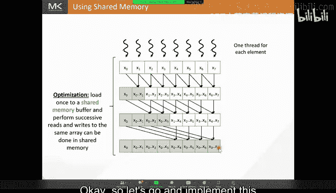

So over here I'm not doing this 100% from scratch I've already written some post code to allocate data and copy data over to the GPU and then calculate the result back and test it compared it to a sequential version。

 make sure the result is correct what I'm going to be focusing on is just the kernel Okay so we're going to have the scan kernel the scan kernel takes an input array。

 which is the array of value values that I want to scan it takes an output array which is where I would like to put my final result。

It takes a n which is the size of my input and output arrays and it also takes this array partial thumb and remember how I told you how each threadlock is going to produce a partial sum and then we're going to scan that and then we're going to go and add back so here every threadlock will place its partial sum in this array so that we can do that okay。

And I'm not going to talk too much about the host code。

 the host code is basically launching this kernel and then after terminating this kernel it launches another kernel to scan the partial sums and then goes back and adds the partial sums to。

To the elements of that third block， so we'll be focusing on just the scan inside of a single third box so how do we do that？

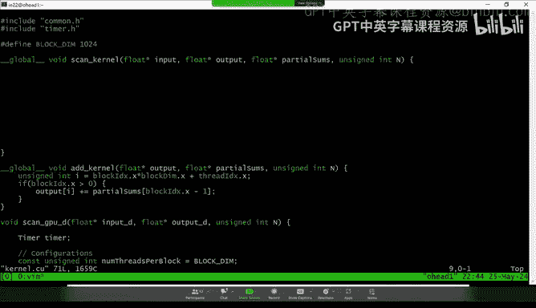

Well first， we need to go and load these input values that the thread block is responsible for from global memory to shared memory。

 Okay， now every thread block is going to be responsible for one element in the input。

 So the first thing the thread is going to do is so every thread is going to be responsible for an element。

 so the first thing the thread is going to do and it's going to identify what element is responsible for。

 that's going to be the element that corresponds to its global index right so the thread is going to find what global indexes So we do that by。

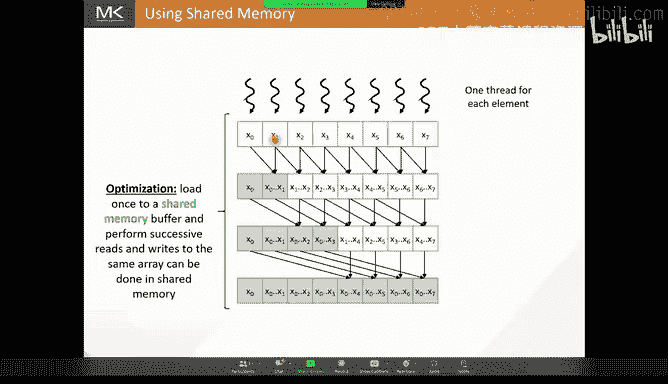

Enine n I is equal to log index x dot x times log de dot x plus。Thd index indexex。

 I assume that people are familiar with how you know how to find the global index of a threat。Okay。

 next all we're going to do is we need to allocate an buffer and shared memory。

So that we can load thevalue from global memory to shared memory rate。

 so how we can do our scan inside of shift。So I'm going allocate that statically and for convenience Ive defined I've just defined the block dimension as a macro so I have 1024 per block。

 so the block is going to be responsible for 1024 elements I'm going to allocate a shared number for this is 1024 This is not the best way to do this it's better to use templates where you would pass this constant as a template parameter and it's probably better to use templates also for this type rather than having float to have some type T The reason I'm doing it this way is it's usually simpler for kind of a first time user to kind of follow along with this code than to complicate the code with a alarm templates but the proper way to do it is by using templates to make the code more general。

Okay， so I'm going to declare a shared run re bufferuffer that's block dim in size。

 so we do that like this。But sure。B， I'm going to call it buffer underscore S。

 you can call it anything you want， I like to use underscore S just to remind myself of the code that this is a shape not the object。

And then we can just use the block dimension。Okay， so we've allocated the buffer now what we want to do is we want to load every thread that' is going to load the value from from global memory to shared memories we're going to have。

B for underscore S。So thread zero is going to place its element and position zero in the buffer。

T0 in the block I。 and thread one in the block is going to put its element block and position one in the buffer。

 So we're going to index the buffer using the local index of the thread inside of the thread block。

 Okay， so we're going write buffer render for S。T in x， do X。Is it equal to？Input of I right here。

 I is the global index of the element inside of the global array。Right， so now every thread。

Has loaded its value and placed it in a shared memory buffer that corresponds to its local index position in the。

Now after we do this， we need to make sure that alls all threads wait for each other to load the input values before they proceed to doing anything else so。

Follow this today。

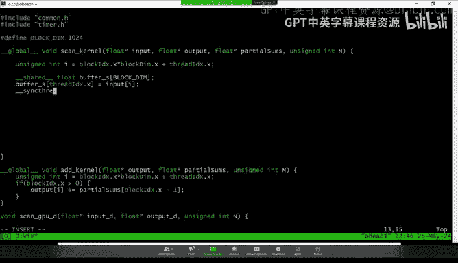

Same friends。Okay。😊，So now we've loaded this input array from global memory to shared memory。

 Every threadb has loaded its own segment in the global memory to the shared memory next what we want to do is we want to do this overlap reduction three kind of pattern。

So how do we do that， well we notice here that in the first iteration， our stride。

 the stride being the delta how much away a thread is going to go and grab a value right here every thread goes one before it the element that it owns to grab a value from there。

Over here， we move to a st of two。Over here， we move to a stride of 4。

 and we're going to keep doubling that stride。 So we're going to go stride 8 and then stride 16 and stride 32。

 and we're going to keep going until we reach a stride that takes us halfway across the whole array。

Right， so if my array is blocked dim in size， then my final stride is going to be blocked dim over to。

So what we will do is we will go from stride one to stride two and we'll keep multiping by two until we get to block them over two so。

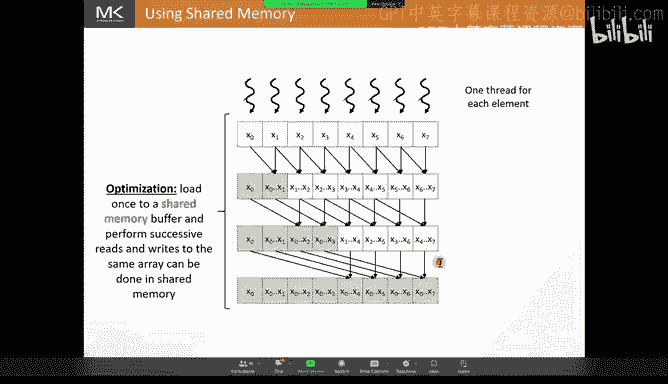

We'll do four。Uns signedigned in。Striide is equal to one。Spriide。It's less than or equal to。

Block them over two。And in every iteration， we're going to multiply the strip。By two。Okay。

So we're going keep doubling this stride until we get to block them over to。

 Now what do we do in this case。 What we're going to do is we're going to spread go get the element that is stride before it and add to its own element The element that it owns right So here threat 7 is going to go and load the value at index 6 and the value at index 7。

 add them and then put them at index 7。

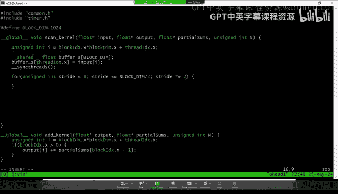

Okay。😊，So we can do buffer underscore S of。So I did X on X。Plus equals。But for underscore S。约定。

And x do x。Excuse me。Minus， straight。Okay。😊，Now there are many mistakes I've made here and I will walk through them one at a time to see what are the things that we still need to get right？

Okay so first， this is fine， however， we have an issue here which is that some threads thread zero for example。

 should not anything from behind it before right because thread zero its value is already complete and there's nothing at zero minus strip right that's just going to be an out of bounds axis so we need to make sure that same thing on the next generation。

 both thread zero and thread one should not anything before before them。

 so we need to make sure that we have some kind of boundary check to make sure that none of the threads go out of bounds right。

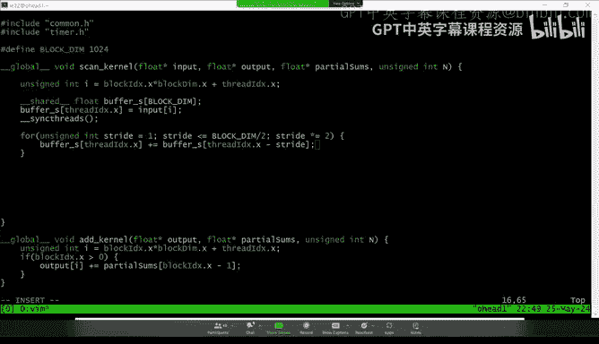

I think somebody's raising their hand。How can I allow them to to。Yeah， so， so about like。

 maybe we just like do Q And A like near the endcause I I just like have no idea if this is a hacker or not。

So like， I'd rather we'd be conservative just for this lecture。OO， sure。Okay。

 so we'll take questions at the end and I'll be happy to take all your questions at the end。

Or if it's something that is extremely necessary for for like understanding and moving on let me know maybe you can write it in the chat or something and I'll be happy to answer Oh yeah yeah so folks so on the code we have a lecture Q and A like text channel So if you post any questions there I'll be sure to read them and interrupt as that if they're interesting Yeah and then also Byron mentioned there's also a chat right here in Zoom as well people want so we'll be monitoring both。

Okay， great， so so I will not keep an eye on the chat then maybe I'll rely on you to to kind of let me know if there's a question to ask。

Okay， great。Okay， so to do this， so back to we're saying。

 we're saying that we need to make sure that and the first iteration threat zero is not going to go out of bounds right next iteration thread zero and thread one should not go out of bounds。

On the next iteration starts zero， one， two， and three should not go out of that。

So how do you do this？Well， we notice that when the str is1。

 thread zero is the only one that should not be accessing out of bounds when the str is2。

 thread 0 and thread1 are the ones that should not go out of bounds， when the strus 4， threads 0，1。

2 and 3 are the ones that should not be computing。Okay。

 so basically it's when the thread index is less than the stride。

Those threads should not compute because if they try to compute， they're going to go out of bound。

So we have to make sure that we add to our code。

What we need to do is we need to make sure that only the threads that are whose index are is greater than really equal to the strides will compete。

 so we can do that by having a if statement right here where we say if。Bread index。

 do x is greater than equal2。That's right。嗯。Another way to think of this is I'm accessing buffer underscore S by using K index dot x minus5 right here。

 so this value obviously has to be greater than0。And the way to check if this is greater than zero is by checking if the first value is greater than the thick。

This is the rule of thumb whatever you're writinga right or can any kind of parallel code every memory access that you do should have some kind of condition that's guarding to make sure that you don't go out of bound for that memory access。

 So that's one way I deb my code to make sure I don't go in of balance。

 I go to every memory access and I try to match it with some if statement or some loop bound that makes sure that this value is not dis axis to。

Okay， so after I do this。I can do a secret。Okay。And there's still a mistake that I need to fix over here。

 but let me finish the code and I'll come back。

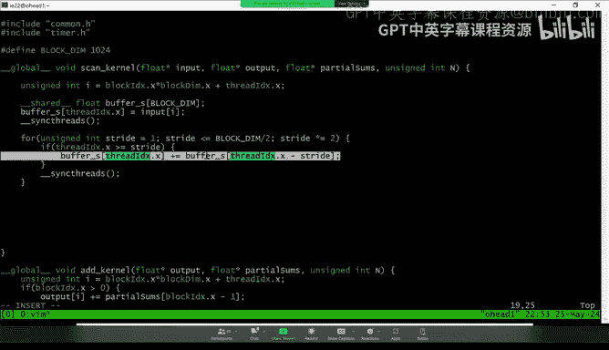

Okay， so now that we've finished doing all of this， right we have our final result over here。Okay。

Once we have our final result right here， what we want to do is we want to take that result and we want to put it back。

 we want to put it in global memory。

We're going come down here and we're going to have。呃。

Output of I is going to be equal to buffer renderers score s of。Thread index X dotX。

 remember that every thread has the value that it's responsible for at position  T index dot x in shared memory and at position I in global memory。

Okay， so we just take the value from shared memory and we put it inside of global。Okay。😊。

We also need to make sure that the thread block writes its partial sum。To the partial sums array。

 So in this case， we only need to have one thread in the thread block。 do that。 It can be any thread。

 The thread that brought that partial sum to global memory is the final thread。

 So kind of it makes sense to use the final thread to write it out， but you don't really have。

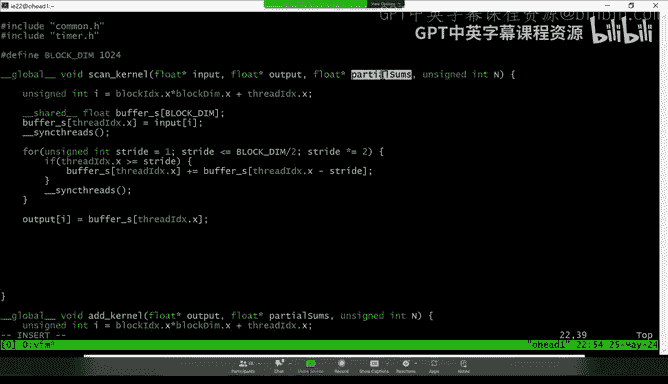

So here I'm going to make sure only one thread writes that that final value to the parts sound。

 So the way we do that is by having an if condition that where only the final thread will enter that if condition so we can write if。

Further index DX is equal to block books。Is equal to。Block them minus-1。Okay。

 so if I'm the last thread， I will take my value and I will also write it to the partial sum of the block so here。

Partial sums of。Llock indexex dot x is equal to。Buffffer underscore S。But index。Okay。

 so we've taken the value that the last thread produced。

 and we've also written that to our partial source Okay so this is。A scan kernelel。

Moullo some kind of some mistake that I have here normally I have an interactive session in my class and I try to have them guess what is the mistake that I've made。

 but I think here we're trying not to have any too much interaction because of the security issue so let me go and explain what the problem is here。

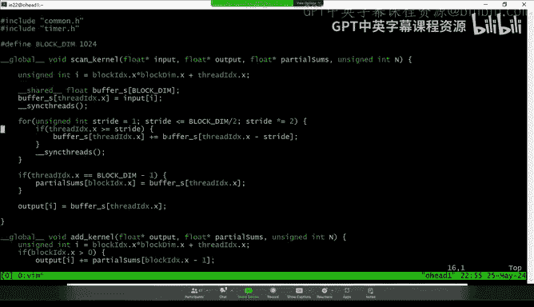

So this access right here is incorrect， and the reason it's incorrect is because we have a race condition。

A race condition is a condition that happens whenever you have multiple threads accessing the same memory location and one of that ataes is a right。

Okay， if I have multiple threads reading from the same location， we don't have a race condition。

But if I have multiple threads accessing and one of them is writing and another one is reading or multiple of them are writing。

 that's where we have a race condition and that's exactly what's happening on the line right here so let me illustrate what that risk industry is。

SoLook at what's happening here。呃。The thread in in green， thread2， is reading。The value X1。

To add it to x2 and produce that final value。However， thread1 in orange is also reading X1。

And what it's doing is it's adding it to x0， but it's writinging the result of the addition back into that same memory location。

 remember that here in my illustration these are all the successive versions of the same array okay these are all buffer under squares。

So what could happen is if thread1 reads x1， adds it to x0。

 and then writes out the value x0 plus x1 to this location before thread2 reads that value。

 what's going to happen is thread 2 is going to end up reading x0 plus x1 instead of reading x1。

And it's going to have the wrong value。Now to get around this。

 what we need to do is we need to make sure that all these threads finish reading。Before any of them。

 write。Okay， we had to have all the threads finished reading before any of them， right。

And to do that we're going to have them all read and then we do a sync threads to make sure they all wait for each other and then we're going to have them write out their values so I'm going to go back to my code right here。

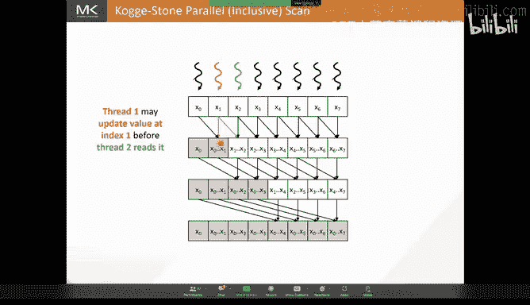

Okay， and what we're going to do is。They break this apart。 So this is actually buffer。s plus equals。

 I'm going to write this as equals。B for underscore S next F X plus。

buffer from underscore square has it for the x x minus right？Okay。

 so what I want to do is I want to read these。I want to a sync threads。

 and then I want to write the result over here that way。

 nobody writes to the buffer before anybody reads that value。 Okay。

 so we're going to break this apart。I'm going to declare a temporary value， I can call it。1im。Right。

 and then I'm going to。Right， temp equals buffer of finiteen of x plus buffer of finite and minus minus stride。

And then I need to have a sink thread， and then I will。Do this buffer equal them， okay？Now。

 we have a sync threads in between thesees， but I can't just put a sync threads right there。

And the reason is that over here we have not all threads in the block are going to enter the in scene。

It's only legal for me to put a threads where all threads in the block reach that location。Otherwise。

 the behavior is undefined and the compiler can do things that are undesilable。Okay。

 so what we need to do is we we need to close this statement， right。

 to do the same threads and then open it again。10th outside。

I'm going to close the statement right I'm going to have the sync threads and then I'm going to open the statement again did you mind if we take two questions is there some interesting？

Yeah， so so the first one is basically， suppose Trevor is saying that as opposed to sort of manually reasoning。

 reasoning about autoub bound memory a， they found that the compute sanitizer is helpful。

 Have you used it and have you found it helpful in your code。Yes， of course， I mean， yeah。

 compute sanitizer is definitely very useful in you know， helping you find find bugs or。

Helping you find bugs with out of bound aes。Sometimes when you write a code it really doesn't take much effort to kind of just look quickly at each one of your memory access season and make sure it matches up。

 that sometimes can be even faster than closing， running with a compute sanitizer and then coming back。

And checking。 but yeah， for the more tricky ones， of course。

 the computer sitizer is a very useful tool， and I do recommend。And the second question is。

 if all the threads are executing the same syndian instruction。

 how is it possible that one writes into the memory before the other reads it in a single iteration？

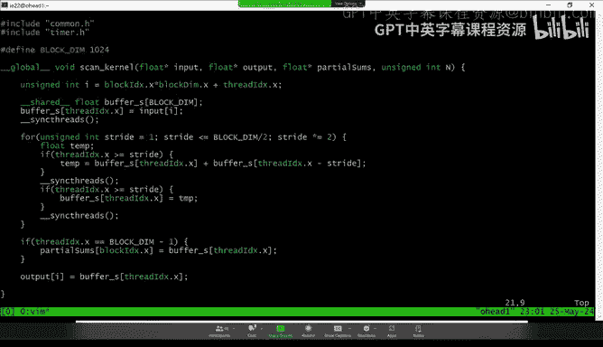

Okay， so that's a good question， so first remember that these are all threads in the same threat block。

So some of them can be in different wars。So could this could be here about the boundary between two different wars。

 so this one could be in one warp， this one could be in another war。

 so this one could read and write。Before this one even gets scheduled， so that's one。

But then the other thing is that even for threads in the same warp。

 there's no guarantee that so even though they're in CD。

 the compiler can do certain optimizations where it reorders memory instructions and it might promote stuff from memory to registers。

 the compile can do all kinds of things。And you。So the sync threads helps to create some kind of memory fence as well。

 but make sure that things are in memory when we expect them to be in memory。That's the second thing。

So there's no guarantee that they will all。You know。

 really from memory and write to memory in the order in which you you specified in the code。

 And then the the other thing is that。From the Vol architecture onwards。

 the threads in the same warp， there's something called independent thread scheduling where threads in the same warp are not necessarily in sync。

You can have。You can have， you know。对。I don't want to get into independent thread scheduling。

 I think it's a sophisticated topic for this lecture。 But yeah。

 there's no guarantee that these threads will actually kind of。呃。

You know read them from memory and write them to memory and always be kind of in sync with each other in the same work and that's why you should always you should never assume in your code that threads in the same work will be executing in S even though they do。

In many cases， so in your optimizations， you can be aware of the fact that they execute SMD。

 for example， like avoiding control divergence， but you should not assume that because the programming model doesn't guarantee that。

Yeah， excellent， thank you for the explanation。Yeah。Okay。So yeah。

 so this is how we get around this race condition。哎。

So we'll wait for all and then before we update so this here is the code that we just coded together I'll include the slides as well and I'll be happy to share the slides after the lecture they're also publicly available on the textbook's website。

Okay， great， so we have this code now。

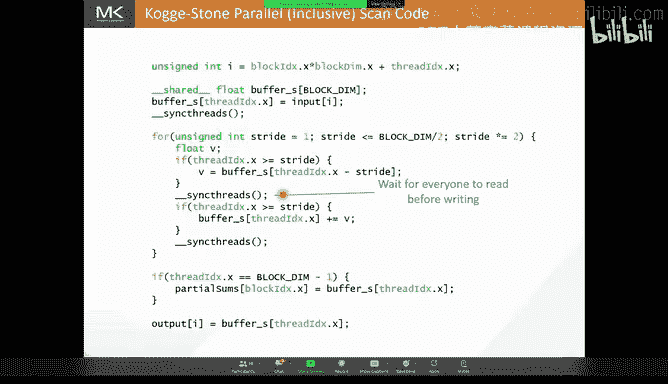

I'm just going to run it and make sure that it works。I just so that so here I can comp it。

And we do have a book。Let's what's call this。I'm going to run it so we get a sense for how long this is so here I'm doing a scan of an array that's two of the power 25 in size。

 so we're talking about 32 million elements and there's three kernel launches because you have the scan and then you have the scan of the partial sums and then you have the scan of the partial sums of the second kernel and then this is how long they take successfully。

I' just ran it here so you can get a sense for the latency so you're doing。32 million elements and 0。

89 millisecond， this is a voltage GP that I'm using and also to show you kind of later on applying optimization and what the performance is。

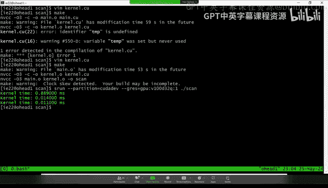

Okay， so going back。So we needed to add the seconds to sync threads in order to make sure that we don't have any raised conditions。

 but these sync threads have latency right they inlate and especially in this kind of computation where you don't have a lot of compute going on。

 your AUs are not super busy right this operation it is latency bound。

 you have a lot of these stalls in your pipeline， so having two sync threads inside of your loop is really an expensive thing and ideally you don't want to have to sync so many times。

So， what we observe is that。Just second the thing for us right here。

 this one enforces a true deployment。The true dependence is basically a right after a read after write dependence。

 right， Because over here， we need to have。嗯。Of the threads to finish writing to buffer under Ss before the threads before on the next iteration。

 these threads read from buffer under Ss， right， because we need to wait for the value to be written before we can read it and use it。

 So this is a true dependence。 We really need to wait。Because we need the value。On the other hand。

 the second synchron that we had to introduce over here， this one enforce a false。

And what I mean by your false dependence？This is enforcing a dependence。

 That is a right after read independence。 What do I mean by that。

 It means that I cannot write to the location before everybody finishes reading from that location。

I don't need people to finish reading from that location for me to make progress in my computation。

But I need for them to finish reading before I write because I'm using the same buffer， right。

 it's a false dependence， the dependence is only there because we're using the same memory location for different things。

If I was not using the same memory location， then I can write and others can read。

 and I would not have to wait for them。So the sync threads enforces a false dependence and what we can do to avoid the sync threads is to eliminate the false dependence by eliminate this situation where I'm using the same buffer and this is a common optimization we use all the time in computing it's called double buffering or more in general multiple buffer。

So what we can do is we can have different buffers for for the input and the output in every iteration of this scan operation。

 So here for the first buffer， we can use buffer one。

And then we can allocate another buffer called buffer 2。 And then when we do our scan。

 when we do our first iteration， we will read from buffer 1 and we will write to buffer 2。

 And in this case， when thread1 reads x1 adds it to x 0 and places it places the sum in the buffer。

 It's going to place it in a different buffer called buffer 2。

 And now I don't have to worry about thread1 writing overwriting X1 before thread2 reads it。

 and now I no longer need to have that second synchronization。

 but I don't want to have as many buffers as I have iterations so what I can do is now once I'm done with the first iteration。

 I no longer need buffer 1 so that I can go I can go and use buffer 1 as the output of the next bit。

So of course， to do that， I need to propagate x0。 So the threads that don't do any addition now they actually do need to do something。

 they need to propagate their value because we need it at the end。 Okay。

 so now what I will do on the next iteration is I use but for one is the other。

Have the threads write their output to buffer one or the threads that don't do anything propagate their input to the output in buffer one。

 And we keep doing that until we are done。 So this is called double buffering。

 and it helps break the false dependence。

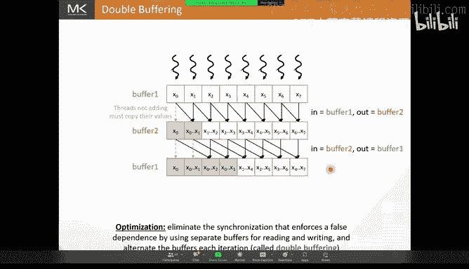

So if we go back to our code right here， the way to implement double bufferuff F is I will need to allocate two shared memory buffers and alternate between them in my scan code So if we go back to our this allocation right here。

 I'm going to duplicate this。And I'm going to have。But for one and but for two。

And now the way I alternate between them is by creating a pointer。

 pointing that to each buffer and then swapping the pointers at reiteration。

 so I'm going to create a pointer。Call that in buffer。And I'm going to initialize that too。

But for one。And I'm going to create another point sir， and I'm going to call that。The output buffer。

 and I'm going to initialize that to bump for two。

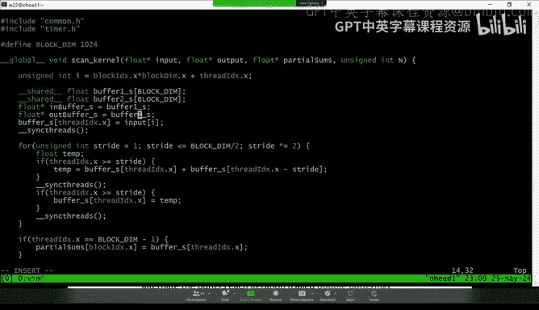

And then， let me。

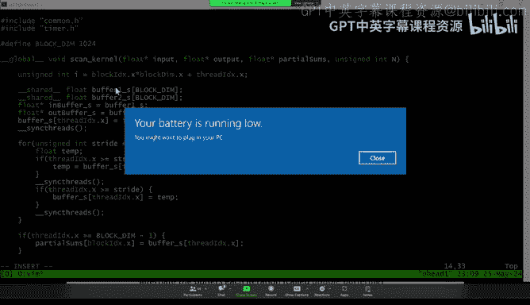

Excususe me。Okay， and now what I will load to instead loading to buffer underscore for S。

 which is no longer there。 I'm going to load to the inputduct。 So here I will load to。

And buffer under squares。O。Now inside of my code， what I will do is I will load。Over here。

 when I read these values， I'm going to read them from and buffer under the for us。Right。

And when I write this value， I'm going to write it to the out buffer underscore the Sps。

And now because I'm reading from this input buffer and writing to the output buffer。

 there is no longer a need to wait until I finish reading before I write。

 So now I can let the sync threads。I can merge these two statements and in fact I no longer need the stamp。

 I can simply write。Alec buffer is equal to。N by0 square s sub3 x of x plus n0 square s x minus1。

But of course we should not forget that now that I'm using a different bufferler。

 the threads that did not do any addition should still propagate their values to the next iteration so what I should do here is I should have else。

And then if you're not adding， you will simply propagate。The value from the input。

 So I will simply have。Out buffer underscore S， a thirdex of x equals in buffer underscore S of the anex of x。

 And what that does is it eliminated the sync threads that was enforcing the false dependence。

 So now instead of having two sync threads in my loop， I only have one sync threads in my loop。Okay。

 let's go and sec。How that impacts performance， I'm going to compile that。Oh。

So down here I forgot to swap the buffers so I need to so after doing this I need to the next iteration the what used to be out buffer becomes end buffer and now end buffer is is going to become out buffer so I'm going to swap the buffers So here I will write。

10th is equal to。And both were asked。N buffer front is for s is equal to。

I would go this for S and then。U the front square S is。Okay。

 so here I swap the buffer so that on the next iteration。

 what used to be the active buffer in the previous duration becomes the input buffer on the next iteration。

Okay。😊，And then down here。Where we have buffer underscore S and buffer underscore S。

 we're going to use one of the buffers， it's going to be the input buffer because it's the output buffer of the last iteration。

 but I swapped it before exiting the loop， so now it's going to be the input buffer。So here we will。

 we will use。不。We will use。In buffer of the grass right here and we will use。And buffer the right。

Okay， so this is how we would apply double buffering， I'm going to compile that。Still have an error。

I think before we started， we were speaking about dangers of coding live as like happened to deal with all these dangers。

 fortunately so far evolved in minor errors。So we compile。

 and if you recall our previous kernel that buffering， the largest one took 0。89 millisecond。

 so now if we run。But we're down to 0。72 milliseconds so we kind of shaved off that again expecting so 0。

 milliseconds so we got huge improvement but you know a lot of times these kernel optimizations are really an accumulation of all these little improvements that you do into the code。

 but you can see how that second sync threads actually made a difference in our code right 12。

5% of the time was know18 of that time was because of that sync threads that we had to enforce the false。

It's actually an optimization that does come up in many other in many other situations。

 so for example， if you're doing matrix matrix multiplication or compile matrix matrix multiplication where you load the tile from shared memory and then you multiply it and you load the next from shared memory and then you multiply right so if you want double buffer is useful here because you can overlap the loading of。

One of one tile with of the next， you can overlap the computing with one tile with the loading of the next tile by using different buffers。

For the one that you're computing with and the one that you're load。

 so double uping is commonly optimizationization range。

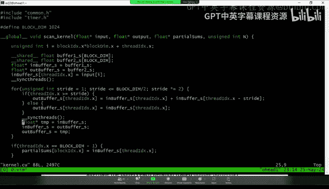

Okay。All right， so this is the code that we wrote with。Okay。

 so let's do some analysis of this scan operation that we did。

So here I want to define the idea of work efficiency。

 so we say that a parallel algorithm is work efficient。

If this algorithm performs the same amount of work as the sequential algorithm。Now。

 if we look at scan。Sequential scan performed how many operations It performed N additions， right。

 We iterated through an array of site N， and we did n additions， or maybe n -1 editions。

 but it's it's order of n additions。But what about this coji zone approach。

 how many additions did we do？Well， if you think of a single thread block。Right let me go back。で。

So if you think of what's happening here， over here in the first iteration we are doing。

We have if n is the size of this array with 7， we did six editions in the first iteration as n -1。

On the next iteration we did sorry we did seven editions here and minus1， we have8 in total。

 next iteration we did six editions， that's n minus2。

 the next iteration we did four editions that's n minus4 right and we keep going。

So if we look at the total there in the coant P scan。

 we have log n steps right because every time we multiply we multiply the stride by  two。

 so that takes log n to finish the looperations and we do n minus2 to the power of the step operations per step so n minus1 plus n minus2 plus n minus4 up until n minus n over2。

All for that， that comes out to being O of analog log and operations。

So we went from doing all of n editions in the sequential scan to O of N log n additions in our parallel scan。

Okay， so we are doing many more additions to accomplish this can in parallel than we were doing in the sequential version。

 Now， if we have a lot of parallelism and all these additions ended up happening actually in parallel。

 that's fine。 this work in efficiencyci might be a price we' worth paying。

In order for us to get our panelism。Okay however， if if we end up， you know， like you know the GPUs。

 if we launch too many threadlocks more than what the GPU can handle the same time。

 the GPU ends up running those threadbs one after the other right so if we if we launch too many threadlocks and those the hardware cannot support all of these and ends up doing them one after the other and we get some kind of serialerization between threadlocks。

 and we would have paid that work inefficiency for no reason。

So this algorithms arent efficient and if resources are limited。

 then the parallel algorithm could end up being slower for work efficiency reasons。Okay， so。Mark。

 how are we doing on time， Do you want me to stop here or do you want me to go to go a little over。

 I think because we， we relate to the beginning， I think it's as much time as you want to be honest。

 like well， whatever your if you want to save stop later。

 But if you want to keep going going because I think we lost like a good 35 minutes or something from the beginning。

 So it's up to you。ok。Alright， let me， let me do maybe I'll do， I'll do。

Maybe five or 10 more minutes and then we'll stop there。Yeah， we can stop with Q&A。

 that sounds perfect。Okay， right。Okay， so is there are other work efficient parallel scan groups that do less than all of and log n。

And one of we call the brand Kga approach because it's similar to the brand。

 it's similar to when is done in the brand。O。So， this is。

So this is another way to do parallellist scan that does fewer operations in total。

What we can do is we can start by doing just a reduction。Okay。

 so we have reduction another reduction sorry， we have the reduction iterations。

 we do a reduction tree and this is kind this was our first tree that we saw when we saw when I introduced the cojistone approach。

But instead of doing a lot of other trees in parallel with this。

What we will do is we will do a few more operations to complete the elements that are still not to complete。

So one thing we observe is here I have。The sum of x 4 and x5。

 and over here I have the sum of x0 to x3。So what I can do is I can just add those together。

So we call this the reduction stage， and then we have I can add these together。

 and now I have this values complete。And then here x4 is just missing if I add x0 to x cube to x4。

 I'll get the value that I want， same thing here， same thing here。

 so I can add those and I get the values that I want now and complete。Okay。

 so instead of doing all those reductions in parallel with this other reduction tree。

 I can do much fewer operations。But it will cost me more steps。

So if I compare the coji stone approach in the on the left and the redk approach in the right。

You knowです that。The one on the left takes fewer steps。But it does much more。

 It does many more computations， many more additions in each step。

Whereas the one on the right takes more steps。But it performs fewer additions overall。

 right you can see the number of arrows that I have here is much more than the number of arrows that I have here。

But actually do this analysis， so if we look， we said that Co Stone does log in steps of and log in operations。

So in the brand K approach， the reduction stage takes log n steps。

And the number of operations that I do。In the reduction stage over here。

 we have n over 2 plus n over 4 plus n over 8。So then that gives me n minus1 operations and the reduction step in the post reduction step。

 I do plug n minus1 steps。And you can work it out。 I do 2 -1 plus 4 minus-1 plus n over 2 -1。

 and I get n over n minus2 minus log n-1。 So if I sum the two， I do two log n minus1 steps。

 So I'm doing more steps from the cojistone approach。 However， if I add all these operations。

 I get2 n minus log n minus2， which is O of n operations。

So this other parallel algorithm does much fewer additions， more work efficient， however。

 it takes more steps。So the braink approach takes more steps so is more work efficient so the question is which one is faster is the Costone approach going to be faster or is the brain approach going to be faster。

 let me stop here as a cliff hanger and maybe in the next lecture we'll implement the braink approach together and then we'll also do some advanced optimizations for the for scan engine general okay。

So I'll be happy to take any remaining questions then。Thank guys this was really awesome。

 And everyone， please make sure to get like a big round of applause for thank you for the super like world research content。

😊，I guess yeah， like if you want to ask questions， like feel free to ask in the lecture QA chat or just like raise your hand。

Here， and we can let people on。 I guess I'll start with the first question， which is that， you know。

 at least like before we started to get fancy with the scan algorithm。

 like at least like the naive version sort of like looked suspiciously。

 just like what the reduction kernels looked like in the book。 So I'm sort of curious。

 at least like within like high performance code， is it the case that like do reduction kernels even exist。

 And like Nvidia code or they implemented as a scan essentially or or not really。

 or is these two separate tracks。Well， you'll have to ask you'll have to ask the Nvidia folks what exactly they're doing。

 but so in many cases in the。In many case。For inerger data types。

 you actually have the workp level primitives that do a reduction in just a single intrinsic， right。

 you just have one instruction， you do a it just does a reduction。

And hardware so that's if you're doing integers I don't think I don't think it's there for floating point numbers。

 but for integers you can just do a warp level reduction with just one intrinsic and then how you do the reduction across warps I mean you can do a reduction tree like this。

It also depends on your situation， maybe you might do atomics in certain situations to do the reduction across the different wars。

 so it really depends on how many wars you have and what your particular situation is。嗯，个成。All。

 I'm going I moderaterating chat at the moment。All right， I mostly see a lot of hearts。

 I'm like looking at questions still address maybe so I wanted to mention something else。

 So sometimes when you also do reduction， you might be。

The particular operator that you might be using might be a little sophisticated。嗯。But of course。

 I mean， so the reduction in CB is kind of temptized and you can pass through with some sophisticated operators。

 but sometimes depending on the shape of your code。

 it's sometimes just convenient to kind of implement your own reduction。嗯。But again。

 that highly depends on。That highly depends on your situation。

 sometimes it's kind of easy to formulate， easier to。To formulate your reduction operation。嗯。

Depending on。The operation itself that you're trying to do you might have to do it yourself as opposed to having to rely on it intrinsic or something。

嗯。So so I think I'm also seeing an interesting discussion around like， we have Jack asking。

 is Brent Kong related to the Block scan？嗯。Yeah， I believe there's。

I think so I know that there are other names that are used for Cojistone and Bt Kk and can computing literature。

 so I think so yeah I think that you might there might be another name for this。In in the literature。

Another algorithm， another question from Andreas， like。

 are we going to discuss bank conflicts in the next session。

 is this still an issue on current hardware？It was a much bigger issue in the old hardware and the newer hardware the bank conflicts are not as big of an issue we do talk about bank conflicts in a different lecture by the time we get to this material we assume that kind of people are already familiar with bank conflicts so we don't keep covering them still no we will not talk about bank conflicts in the next。

So so Brian Muhi is asking like what happens when the data doesn't fit in the powers of two does one expect some sort of sequential scanning in that case and then Byron is asking perhaps patting is the solution。

Yeah， you can， so remember here where the scan that we're doing is for a single threatlo。Right。

 and then you're going to have many other you're going to have many threadlocks。

 So only the very last threadlock is going to have a segment that may not be a power of two。

 And in that case， you're going to have some kind of boundary condition where you can just pad with zeros。

 you don't have to pad the actual input， you can just pad on your loading。

 So if I switch back to the code。

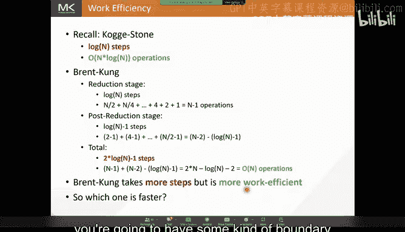

So this code right here， I didn't include the boundary conditions for the sake of time。

 but you would have a boundary condition right here where if I was kind of out of bound。

 you would just blow to zero and then when you're writing it back out， you wouldn't try it out。

So yeah， if if your input is not a multiple of the block dimension， you can just。

You can just have these conditions over here to do padding on the fly。

 you don't even have to pad the actual input。I see two more people typing questions。

 you know and slack。

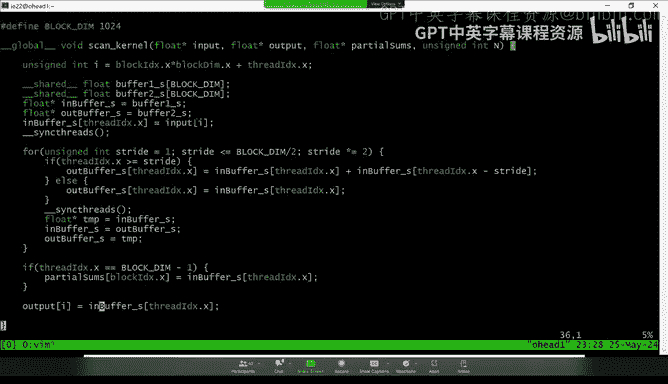

So Scher is asking， he wonders whether a scan can be generalized to 2D or 3D tensors。

That's a good question， not one that I' far about。But it's certainly a good question。Yeah。Yeah。

 I mean I think you can probably generalize it yeah， but it's not something that I've thought about。

Okay， I guess we'll we'll throw this is homework this slack through if they're interested in generalizing it。

 sure as I would be happy to review the code。All right， I think I see two more questions。

Thomas so Thomas is suggesting that perhaps you can apply the scan algorithm twice。

 and then get you get the generalization for free。Yeah。All right。

 so I think this will be perhaps perhaps like a good time to pause so everyone let's like is that again like thank you so so much。

 I really learned a lot。 and I think you made me really want to go back and know like focus on this book chapter a lot more。

 So as that' going to be coming in as well next week on Friday to give us like another lecture However。

 we're gonna try to find like a better process to deal with spammers So it'll probably be a zoom link。

 but it'll just be like a bit more challenging for random people to get into So we'll keep everyone posted。

 And again， a big thank you I that we really appreciate it Yeah。

 is that and minus inity to the trolls。😊，All right， well， thank you so much。

 And I think a lot of people in chat agree that this was a very well interesting lecture。

 So thank you。😊。

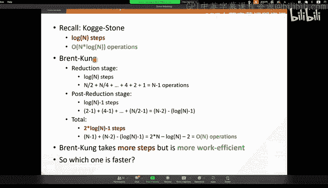

Yeah， my pleasure。Allright。All right， folks， we'll see y'all next week。

