# GPU MODE《CUDA、GPU编程1-53课｜GPU MODE》中英字幕（deepseek-v3.2 - P22：-20240601-Lecture 21_ Scan Algorithm Part 2.zh_en - GPT中英字幕课程资源 - BV1QZ421N7pT

So hi everyone， welcome to another like episode of Kuta mode today like I'm super glad we have like I that Ha joining us again from as a professor from the American University of Beirut to talk to us about like the scan algorithm。

 So this is part two of his like live programming sessions as that's actually also one of the co-authors of the PMPP book which we've been using for all of our lectures so I'm you know super thrilled to have him and thank you I it。

😊，Thank you Mark it's pleasure to be here again， so I'm going to quickly recap what we covered last time about scan and then I'll start with the new content。

So last time we introduced scan we said that a scan operation is where if you have some input。

 the output， the output at each index is going to be some operator applied to all the elements at the corresponding index in the input and preceding that so for addition if our operator's addition the output next3 is going to be the sum of all the elements in the input from3 and before so3 plus6 plus7 is 16 and this is kind of a generalization for any arbitrary operator we said that the way that we do scan on GPUs is we segment it so we we'll divide our input into segments well have a thread and the reason is that we need a lot of synchronization among threads when we're doing the scan operation so we'll divide into segments we'll have every thread block take a segment scan that segment and then we'll scan the partial sums of the thread block。

And then I willll go back and have every thread box go and add。

The scan partial sum to its own elements so that we have a con of。

We started by looking at one algorithm for doing scan and parallel。

 we observed if we just do a reduction tree， we get some of the results that we want for scan if we do another reduction tree we get some other results and if we keep doing reduction trees。

We get eventually to get all the results that we want and if we overlay all these reduction trees。

 we get something like this it's basically where we iterate and at the first iteration have to every element we add the element that is one before it next iteration to every element to add element that's two before it etc。

 of course assuming that the element before it is within bound to paralyze this we assigned a thread to every position in our array and that thread was responsible for adding an element to the element that is tried before it on each it。

Of course， what we did is we put this array in shared memory。

 so these are successive snapshots of the same array and we put that in shared memory so that when we load and store and load and store to it on successive iterations。

 we don't have to go to global memory。😊，And we also observed that in our initial implementation。

 we distinguished between two different sync threads。

 one of them that was enforcing a true dependence and another one that was enforcing a false dependence。

 true dependence is where we need to wait for a thread to finish writing something before we read it and here it's a true dependence because we really need to wait right I cannot write read something before it gets written。

 whereas the false dependence was where we don't really need the it's where we wait for a thread to finish reading something before we write to it and that dependence is only there because we're using the same memorylocation to write to where a previous value was。

 but we don't need really need to wait for that value to be read in order to write for the sake of the computation so we can eliminate this syncc threads that enforces a false dependence by doing something called double buffering so where we use two different buffers for the input and the output and we can alternate these buffers on each generation and by using two different。

First we no longer have the situation where I need to wait for somebody to finish reading before I write because I'm not writing to anywhere that somebody else is reading and that helps us get rid of that second buffer and that's not just an optimization we encounter and scan double buffering is used wherever we have a false dependence that we'd like to eliminate a synchronization for。

We ended by talking about work efficiency， that we said that work efficiency is we say that algorithm is work efficient when the parallel algorithm does the same amount of operations as the sequential algorithm。

 but we observed that in the cojion parallel scan it does O of nB n operations whereas we know that in the sequential scan we only do O of n operations and that shows us that implement this algorithm for doing scan is not work efficient。

Now sometimes work efficiency is a price that's okay to pay because it gives us parallelism。

 but if resources are limited and we end up starting to serialize the computation。

Because we're doing one thread block at a time， because we don't have enough sense to accommodate all the thread blocks。

 that's where that work efficiency will start。We'll be paying that work efficiency unnecessarily and we're going to talk today about how we can address improve the work efficiency of skin。

So last time I also introduced what we didn't implement it。

 but I introduced another approach for doing scan which was more work efficient but took more steps to call this Brent Kung someone commented that it's also called Bell scan in literature so here you do a reduction tree but then instead of doing many reduction trees at the same time you just kind of do some steps after that that help you finish off。

help you finish off the elements that are still not complete。

So this approach on the right we call it the brandkg approach it takes more steps but it does fewer operations you can tell that the number of arrows that we have over here or the number of additions is much fewer than the number additions that we have here on the left and we analyzed that and we found out that the brandk approach takes more steps you need two log n minus one steps compared to log n for the cojistone approach。

 however it does O of n operations， which means that it iss more work efficient than the cojistone approach which is O of n log n。

So we ended up by asking the question which one is faster is it the one that takes fewer steps or the one that is more work efficient and we're going to do today is we're going to implement this brandkk approach and test it and see which one is more work efficient。

Okay， so let's get started。Yeah， so I do want to mention everyone if you have any questions to ask us that like feel free to raise your hand and we can can we want to make this session interactive。

 thank you。Thanks。So。I'm trying to get the zmer then out of my waist， okay。

So we observed that in scan we have this reduction stage and we have this post- reduction stage so we're going to have a similar approach where we iterate through the stages and every time we're going to have a thread be responsible for some element and adding kind of value an element that is straight away to that element so we're going to assign a thread this time we're unlike Codeor we're going to assign a thread to every other element right because on the first iteration for example。

 we're adding two elements and producing one result so we're only producing half the number of results that we have input elements so we don't need a thread for every single element so we're going to have one thread for every other element we'll do the same thing we did with the Codeun approach we're going to put this array and shared memory so we're going load input shared memory do all these scan steps inside of shared memory and then write the final result to global memory one thing to note here is that we don't need double buffering。

And we don't need double buffering because we don't have a situation here where a value is being read and then some other so some thread is reading a value and some other thread is writing it in the cocent approach we had another thread here that was adding that was reading this value and then adding the previous value to it and updating it but we don't have that for this algorithm and that's why we don't need double buffering we don't have any any race conditions。

Okay， so another optimization is the following so in the cog approach we assign a thread to each input element or to each position in the array and that thread kept processing that position for every iteration。

 but if we do the same thing for this approach we end up to have some kind of inefficiency and let me show you why so let's assume that we assign a thread to each of every other every other position so we assign a thread。

Two indices one， three， five and seven。On the first iteration， all these threats will be active。

On the second it what's going to happen is that two of the threads drop out。

Now in the previous approach the threads are also dropping out。

 but they were all dropping out from the beginning of the thread log whereas over here the threads don't all drop out from the beginning of the thread log。

 they drop out from the middle of the threadb so they drop out in these arbitrary positions not arbitrary every other thread is going to drop out and then if we keep going more threads drop out and then later as we do the post- reduction phase the threads start coming back and then they come back but what you see is that in these intermediate stages。

 the way that the threads drop out result in us having a thread that is active and then the thread that's not the thread that's active the thread that's not the thread that's active with thread that's not the next iteration you're going have you know three threads that are not active and then one that's active three threads that are not active one that's active and what this does is it results in control divergence in other words in a single warp we're going to have some threads that are active。

 some thread that are not some threads doing useful work some threads that are't so that's going to waste some of the resources of the GPU。

And we can get around this control divergence by the reason by instead of assigning a thread to a fixed position in the array throughout the computation。

 we can reassign the threads to a different position every iteration so instead of doing what we have on the left we can do this so we can reasign the threads on each iteration so on the first iteration we're gonna to have all our threads are going to be active right but on the next iteration instead of having the threads drop out from the middle what we will do is we will move the threads around so now the first thread is going to be responsible for this edition the second thread is going be responsible for this edition and then the other threads are going to drop out from the end so now we don' have control divergence because we're going to have some warps that are active and some warps that are not we're gonna to have idle wars but we're not going to have threads inside the same warp where some are active some we not eventually we will last few iterations we just have one war that。

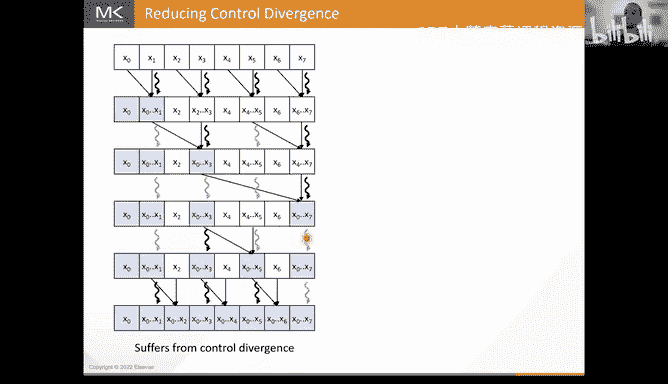

Active， but you know that that's kind of unavoidable。

And then we keep doing that so in the next iteration the first thread now is going to do this position whereas the other threads are going to be are going to drop out from the end。

 so we have this thread here is moving from this position to this position to this position and then we do the same thing as we go back so as we go back we bring in the first thread to do this addition and then in the next iteration we're bringing the first three threads to do these additions while keeping all the inactive orbs at the end of the thread so this reassignment of threads on every iteration is a common optimization that we do in different scenarios whenever we want to get rid of control divergence we change how we are assigning threads to the data so that we always have all our active threads together and all our inactive threads together。

So with that let's go and so reassigning these threads requires some kind of tricky index computations to be able to kind of figure out how to really assignign these threads every time so here there's actually a kind of a simple index computation that we can use to determine what a thread is responsible for in each it so basically the index of the element of thread is responsible4 is going to be the thread index plus one times two times stride minus1 I'm not going to get into too much detail and how kind of we arrive at this you know if you think about it for a while it's not too difficult basically you think of okay what is what is what is the first element that what is the first element that the first thread is responsible for we go from one to three to seven so that's basically two times stride minus1 and then on the first it when the thread is one we're skipping two elements to get to the next thread when the stride is two。

And four elements look get to the next spread so basically we're going also going to add two times stride at times a threat index so this is how quickly how we arrive at this this indexing right here Okay so let's go and implement this and compare it to our previous implementation that we had in our last lecture I'm going to switch to the code terminal I'm going to start by compiling。

嗯。Okay， I'm going to start by compiling and run。So this is our previous implementation of using Cojistone so this is how much time that implementation took and now let's go and implement the one that I just described so I already set up some host code for calling that kernel so that we only have to worry about implementing the can kernel itself okay so this time around we start by identifying the segment and global memory that the thread block is responsible。

Okay now before that segment was basically a block index times locked in because if a thread had 1024 thread if I block had 1024 threads that was responsible for 1024 elements。

 this time if a thread block has 1024 threads it's going to be responsible for twice that number of elements because in the first iteration every thread takes two elements so we're going to。

Identify the first we're going to identify for every thirdb where this segment that is responsible for is in global memory。

 since every thread block is responsible for two times the number of cut elements。

 we find the beginning of that segment by doing。Block index dot x times B intot index x。Kins。Okay。

 so block zero is going to start at the global index zero。

 block one is going to start at the global index block1 times two and etc。Now again， disclaimer here。

 I'm using kind of macros， the better practice to use templates。

 I just use macros because when you're live coding it's easier to just add a macro and use it as opposed to having to go and temptize and go and modify where everything is written。

 but the good practice of course is to use templates for these constants also to use templates for the types so that your kernel is general for different types。

But to kind of just keep the code simpler and I don't do that kind of in these live examples。Okay。

 so now we've identified where where the segment of a threadlock starts。

 the next step is for the threadlock to load the elements that it's responsible for。

Now what we are not going to do is we're not going to have this thread if this thread is responsible for these two elements。

 we're not going to have this thread go and load this element from gold memory and then load this element from goal memorym and the reason is if we do that we're gonna to have poor memory coalescing because when each thread loads the first element it's going to load we're going to have one value loaded and one not one value loaded and one not so we're going to not be fully utilizing that that burst we're not going to be utilizing the cache and we're poor memory coales so instead what we will do is we' will have all the thread so if we have four threads here we're gonna to have these four threads load the first four elements into shared memory and then we're going to have the threads load the next four elements into shared memory and then we sync threads and then each thread will go and access its two adjacent elements from the shared memory that results in better coalescing when we're loading from global memory okay so we'll start by loading the data to shared memory I'm going to declare a shared memory above first so where we can put this。

DaI'm going to call about 400 square s。And the size of that buffer is going to be the number of elements that want to load。

 so in this case we have twice the number of threads in the block so two times the block image。Okay。

 we're then going to every thread is going to load the first the threads are going to load the first number of block block dim elements and then they're going to load the next block dim elements。

 so the way we do that is by doing。Offer underscore score as of。Thread index do x。

 so thread zero is going to right to buffer of zero thread one is the right to buffer of one which is the right to buffer of two is equal to input of segments so we go to where the segment of the block starts。

Plus。So index。 x。ok。And then of course， so now when we do this。

 every the first 1024 threads have loaded the first 1024 elements now we're going to load the next 1024 elements。

 so we're going to do the same thing， but we're going to add block them to our grid index that we're going to add do。

Let's luck them and。Yes。Using my terminal is lagging a little bit， so this is white。

There are some gles that。Okay， and then here we will do plus luck。Okay， now of course。

 after we're done loading to shared memory， we're going to sync。 and now we are ready for。

Now we are ready to and now we're ready to do our scantry so we'll start with with the reduction stage and the reduction stage and our first iteration our stride is one next iteration stride is two and we keep going until we get to a stride which is block dimension okay so we're going to use the stride as the loop index we're going to have the reduction phase。

We're going to write four。Unsed n stride is equal to one。

 stride is less than or equal to the block dimension。Driide equals stride。That's two。

And then on each generation， what's going to happen？

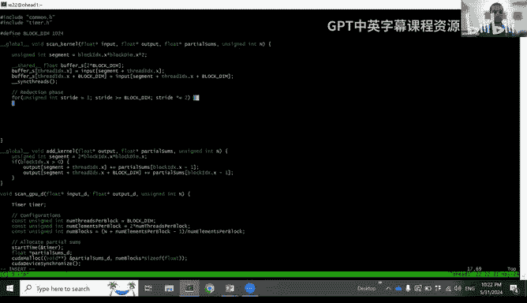

Is every thread is going to identify which element is responsible for。

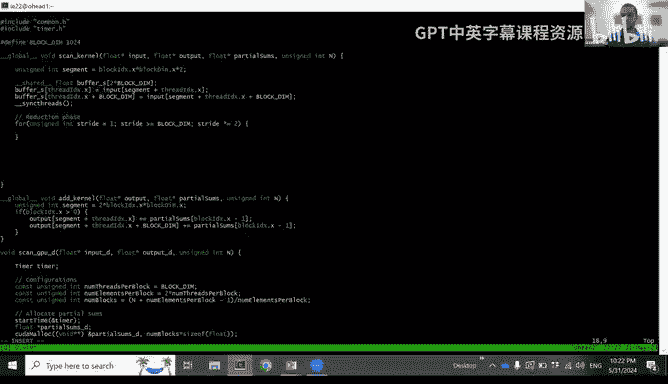

We said that this expression right to heater helps us identify that。Right， uns signedign and。

This is the index of the element that third is responsible for in the shared memory buffer。

 it's the third index plus1 times two times stride minus1。

For the next that x plus one times two times stride minus1 Okay。

 so now every thread knows what element is responsible for what it's going to do is it's going to add to the。

that is responsible for the element that is stride to the left right so we're going to do buffer under score s of red index do x sorry of I。

Plus equals buffer renders for s of I minus right？Okay now of course not all the threads are going to be involved in this right some of the threads are dropping out so the way that we know whether a thread is going to be active in a particular iteration is if the element that it's responsible for is within the bounds of the shared memory buffer that it's working on right so the way we do that is by checking if I is less than or equal to two times the block dimension because the shared memory buffer is two times the block dimension and size so we just make sure that that index is within that okay。

So by this we would have of course we also need to sync threads over here to make sure all the threads finish adding on the current iteration before we proceed to the next iteration and now we're done with the first reduction phase which is this phase okay now we're in this situation and what we need to do is we need to do this post reduction step so in the post reduction step i'm actually assigning assigning the thread to the。

Left element in the addition as opposed to the right element in the addition。

 it just makes the indexing easier that way and makes the indexing the same as the indexing in the previous iteration。

 so let's do the post reduction phase。So this is the post reduction we're going to start from stride block in over to this time right and we're going to keep going down until we get to stride one okay so for。

Unsigned and stride is equal to block them over two。Striide is。Greatter than or equal to the one。

And then we divide the stride by two on each situation。Okay。😊，And again。

 this time the element is responsible for， we use the same indexing that we used before。

 this also works for the post reduction step， it's the same。So I'm just going to copy that over。

Okay but this time what we're going to do is since the thread is going to be assigned to the left element。

 the thread is going to add its element to the element that is stride to its right。

 so I plus stride and then it's going to put the result at the position I plus stride okay so we're going to do buffer underscore s of I plus stride and we're going to add to that buffer underscore S of I。

Okay。And again， we need to make sure that our the elements that we're accessing is in bounds。

 we need to deactivate the threads that are kind of at the end and not supposed to be doing anything on that particular duration The way do we do that is we check and make sure that the element at I plus stride right is within bounds so in this case here this thread is doesn't have anything at stride after it so it's not going to be。

So we're going to have to come here and make sure that if。

I plus stride is within the bounds of the shared memory buffer， which is two times the block image。

He has I had a quick question like maybe not quick question。

 but like I'm sort of curious like I mean like as you're like authoring kernelels and like putting sync threads in it。

 I'm wondering like do you sort of usually write the sync threads like defensively as in you sort of。

Put them in to be safe and then sort of slowly remove false dependencies。

 Or do you just like write the unsafe code first and then like later put them once you notice that you get incorrect results。

No'd I'd rather write code slowly and get it right or as much of it right the first time than to than to kind of go back and have to debu it。

 I don't recommend putting syncin threads in defensively right you should put a stin threads where you know that you need to have a sync threads there and you know with experience。

 you should always be able to reason about whether you need to have a threads or not right it's not you know so you shouldn't just kind of put it there just to be safe。

 you either need it or you don't so it's good to it was good to stop。

 think reason about that better than having any race conditions also Klua has some tools like the race checker that also will tell you if you have a race condition and you're missing a syncin thread so that's also a good way to check if you're missing any。

But yeah， it's not good to put in a lot of syn defensively because those will hurt your performance ultimately。

The sync threads is not just about the latency of the sync threads itself。

 the sync threads will prevent the compiler from being able to reorder instructions across the boundary of the sync threads and that and reordering instructions is important for latency hiding so there is really a high cost to having a sync threads where you don't need it。

And so tools like the race checker are they kind of like a like a sampling based tools like they sort of try to。

Basically like look for like memory corruption or like how do these tools generally work？嗯嗯。

So I've actually I haven't talked much about how exactly the race checker is implemented。

I don't know how much of it is based on compiler analysis and how much of it is based on doing the actual runtime analysis。

 but yeah， the race checker will basically try and check if you have any situations where different threads might be accessing the same memory location and one of them is writing and if it is it'll warrantn you and tell you。

 hey， you might have a race condition here。Yeah makes。

 I would imagine it's probably some comb both but thank you that really helps。行，我。Again。

 that's probably something to ask to somebody at NviDdia who kind of develops that SDK。

 I'm not 100% sure how exactly the race checker is implemented。Okay。

 so now that we're done with the post reduction， the final thing that we need to do we have we have our final result。

 now we have to go take that result and write it back to global memory。

RightSo so we're going to do the same thing that we did before right we have twice as many thread half our threads together right the first half of the array the shared memory array to global memory and then write the second half of the array to global memory okay so we we're going to write the output so we're going to do output。

the output is also going to start at the segment of the blocks so you're going to output of。

Fegment plus but index do x。Is equal to。Buffffer underscore square S of。But index that x。

Right so here every thread zero is going to write the value at segment plus zero third one at the value of segment plus one etctera。

 and then we're also going to have then the threads move to the next block dim threads and write all of those out in a coales way as well so here we're going to do。

Plus the block dimension and of here we'll also do the plus the block dimension okay so now we've written this scan approach and implemented it in our panel so let's compile it run it and see how it performs compared to the previous implementation going to compile let's hope we don't have any bugs in our first our first first p。

Okay， we do have a bug。Hit it when that happens。I imagine it this is the first time it's happened probably。

No， you know， certainly not。诶。let me， let me quickly try and figure out why this ist the case。

 otherwise I'll。嗯。嗯，没。Okay， so what I forgot to do is remember that we were。

Remember that when we were doing a segmented scan right so we're doing a scan every thread block has its own scan and then the thread block needs to write a partial sum out so that we scan those and and we go back and we add them so I forgot to do that so basically one of the threads in the thread block is going to be responsible for taking the sum for the entire thread block and writing out to the partial sums and it forgot to do that so if well do if thread and x do x we'll have the last thread do that so basically this last last thread will take this last value right here and we'll write it out as the partial sum of the entire so if3 and x x is equal to block them minus1。

Then in this case， it can be any threat it doesn't have to be the one it can be threat zero。

 then we will do the partial sum of the block， block indexdex。 x。

Is equal to the last element in the buffer， so in this case。

 it's two times the block dimension minus1。Okay， so we just forgot to write out the partial sum that's what caused the bug so let me compile it again。

And let me run it。O。😊，And we still have a bug。嗯。嗯。Okay。

 I'm not going to spend time debugging live will。

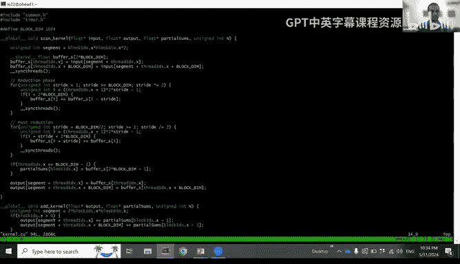

I will I will kind of take a look at it afterwards and let you know where the book was Ash there are some people in chat that are guessing we have both Ivonne Liov and you saying maybe the stride should be less than or equal to the block them。

No I have the correct code right here， this code right here is already tested。

 the stride is less than the i+ oh， you're right， yes。

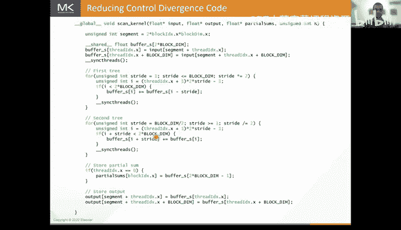

Okay paying attention good job guys， I had atyr right here， there we go， that's the bug。

 you're right。I know why I put greater than re， that doesn't make sense。Okay。

 so we're going to compile this。Thank you for catching the bug。In the audience。

 and we're going to run it。Okay there we go and now that works and now if we compare the time you'll notice that it's actually this was the time of our original Cojistone implementation and this is the time for our brand kind implementation so you'll notice that the time is slower。

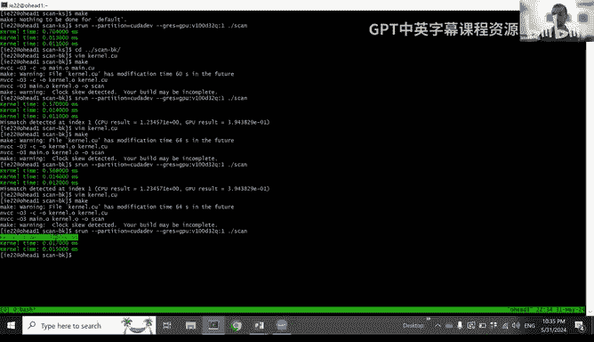

So even though this implementation is more work work efficient。

 ultimately it results in slower performance， so this having more of these iterations and more of these synchronizations。

 ends up hurting performance more sorry ends up hurting performance more than the benefit that we're getting from improving the work efficiency so while the B K has higher theoretical work efficiency right in practice the the work that we reduce right we're doing less work the warps that we're doing that work now are actually just not doing anything they idle and because this is kind of a latencybound operation when it's doing those different stages。

 the work that we're saving was previously just filling and filling in pipeline cycles that are now just being filled with stall。

So we don't really see that major improvement from improving the work efficiency。

So the performance of brand count on GPUs is similar and maybe even worse than the Cojistone approach it's still interesting case to study because it allowed us to reason about work efficiency okay however。

嗯。As you can see， the more work efficient algorithm is not always the best algorithm。ok。Okay。

 so that's all in terms of comparing Costone approach and the Brent Kung approach。

 I want to talk more about how we can improve work efficiency other than。

Do using a different algorithm so if want to stick to coji stone because it gives us fewer steps is there another way that we can improve the work efficiency of the coji stone approach and the answer is yes and that's through something called thread co so what do I mean by thread co。

Threat coursening is kind of a。General categor computations。

 we don't pay anything to parallellyze the computation。

 so for example in vector edition when you do it in parallel there's no parallelization overhead but in other computations when you want to parallellyze the computation to go from a sequential implementation to a parallel implementation。

 there's an overhead for doing that parallelization there's a price that you pay to extract that parallelism right in our case over here in scan the price that we paid to extract that parallelism from scan is that use we use a work inefficient algorithm we are doing more computations to be able to extract parallelism we're also doing all of the synchronization overhead。

So。Now， if you actually get all these threads running in parallel on the GPU。Right that's great。

 the price that you pay to extract that parallellyization is worth it right because you're actually getting parallels。

But as we know when you write a kernel if you have more threadb than the number of threadbs that can be simultaneously occupied on the GPU what the hardware does is it'll run some of the thread blockss when they're done is's going to bring in other threadb when those are done it'll bring in other threadb so if you give the hardware more thread blockss then it can actually handle it's just going to serialize those threadb now if we have something like vector addition where that parallellyzization came with no overhead it's okay to do that because the hardware scheduler is fairly quick at you know taking out a threadb and bring in another one。

But if you paid some kind of price to extract that parallelism。

And then the hardware scheduler ends up serializing those threadbs。

 you paid that price for no reason。So it's better for instead of letting the hardware serialize that work。

 you can serialize that work in your implementation and get rid of the overhead that you paid for paralyzing so in the case of scan that overhead was the parallel scan which is work inefficient so what we can do is we can instead have every thread do a sequential scan so instead of have every thread take a single element。

 we can have every thread take a chunk of elements。

 do a sequential scan and we know the sequential scans work efficient that does O ofM operations and then after doing that sequential scan we go and we do a reduction tree across the entire thread block。

So to recap of what I said， paralyzing scan incurs the overhead of lowering work efficiency。

We also have the overhead of doing these barriers synchronizations every step of of kind the cogi stone iterations。

 so if the resources are insufficient the hardware is must to serialize the thread block so we'd have paid that overhead unnecessarily so it's better if we apply thread coing by doing a segmented scan at the level of the block right where we segment our scan across threads every thread does its own sequential scan which is work efficient and then we use the thread block to scan the partial sums of the threads and that looks like this so before we had every thread block we were segmenting the scan across thread blockss。

 every threadb was doing its scan adding partial we were scanning the partial sums and then we're going back and adding in each thread block well we can do that we can use that same approach to have every thread responsible for more than one element and do a sequential scan so here we can take that individual block scan segmented。

ross threads so every thread now is going to take a second。In our input instead of a single element。

 the thread is going to a sequential scan of that segment which is work efficient。

 it does over n operations where n is the number of elements in the segment and then the thread contributes those partial sums。

 we use that thread block to scan those partial sums in parallel and then every thread is going to go back and add that value to to its own segment okay。

So Mark actually had your hand up yeah， like I had a question around like courseening in general。

 like it just seems like a。It's like one of the more interesting optimizations because like at the limit where you have like one thread handle all the elements like that's terrible。

 But then it's very common that having like one thread handle one location and memory is also terrible。

 And so I'm sort of like wondering like is there like a curve where like it's sort of more efficient like this like a certain coening factor is good I think we tried this in the past in these lectures during the reduction kernels。

And it was like very much a benchmark and C kind of approach。

 but I'm wondering if you have a sort of more principled way of thinking about like what is a suitable courening factor。

So yeah， the when you when you pick a co setting factor， obviously you can go all the way。

 you don't want to go all the way because otherwise youre just going have one thread doing everything you're going to。

Significantly underutilize the hardware， so you want to pick a co in factor where you're still fully utilizing the hardware。

 but not exactly， but you don't want exactly the number of thread blockss that can run simultaneously on the GPU。

 you probably want to have than a little more than that to let the hardware schedule still be able to do some load balance。

So。It depends on the computation itself how much load im balanceance it has。

 but you probably want to have a coening factor that will give you maybe you know four eight or 16 times the number of thread blocks that you have that can actually run simultaneously that's assuming a a。

That's assuming you have a fairly load balanced computation if you have a more load imbalance computation。

 in that case you're going to need to give the hardware scheduler more just so that has it's better able to do load balance。

So it it's usually I would I would you know that's something you can tune。

 you can try different values， see what works， but for the range of values you probably want to look at you know picking a coarsing factor that that helps you kind of have as main boxes can run simultaneously but also but you know have multiple times that help the load balance but there are cases actually where sometimes go ahead because you mentioned something I don't know if it was implicit but like like basically it's better to make sure that your work is more load balance so basically make sure that you don't have like divergence and then basically and then coson so like the order matters in which you're dealing with those optimizations okay that's very interesting。

Yeah， so divergence has to do with with balance across threads in the same war。

 I'm talking when I talk about load balance in this context I near more。

 I mean more balance across the different blocks。But yeah。

 another thing to consider is sometimes coarsening is so beneficial。

 especially when it allows for higher data use that we actually don't mind running at lower occupancy and that actually happens in some of these very sophisticated matrix multiplification kernels and some of those cases we actually don't run at full occupancy。

But because by doing more threat poisoning， we're able to capture more data reuse and we're willing to pay the price of having lower occupancy just because we're able to have more data reuse。

There is one more problem with coing and I think we should acknowledge that when you cos in too much。

 you are also adding a lot more。Pressure to your registers so if your if your application is registered bound cosering may or may not actually help you so you don't have to bond the number of registered per thread and you can end up getting registered pays that can feeably impact your overall throughput。

Right yeah， you're absolutely right so yes， so thread couring as Viram said it uses more resources so it affects your occupants。

But like I said， know， in some cases， you actually don't mind so in some matrix multiplication kernels。

 you actually don't mind running at lower occupancy because you're getting the benefit of data of using more registers for threat。

 for example， which gives you better data reuse。So those are the situations where you need to tune your correspondingning factor to see of what works best for you。

Okay， so yeah so this is how this is how we would apply foring in the context of scan and this gives us more a more a more work efficientff implementation because the sequential can work efficient right we only do O ofN operations and then we're only incurring the work inefficiency when we are combining these values when we're doing the reduction across the different the different foot blocks sorry different threats in the block okay so let's go implement this and see what it looks like in the context of scan so I'm going to switch to my terminal。

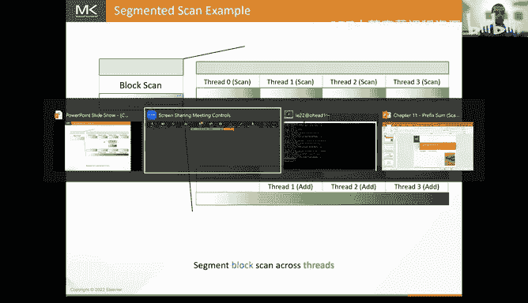

This time I'm going to go same me today。Okay， so I already prepared。嗯好。

This is the kernel that we had before from Costone。

 but I already prepared the host code for doing course thing just so that we don't have to go through that。

 so basically this time what we're doing is we're launching oh yesikes。不是。I'm sorry。

 this is already the code is already filled in。This was unintended， I apologize。m，Okay。

so why did that happen？I think you wrote it so fast that like we just going to need it。嗯是。

Yeah I think it seems I copied the wrong I usually have a skeleton before and the after and it looks like I copied the wrong directory here Okay so I guess I'll do the I'll walk you through the code instead of implementing it I apologize for this for this mistake so basically what we do is we're going to allocate a buffer。

😊，And then we are going to have we're going to first have the threads load from global memory into that buffer right so if we have a coening factor of eight for example in this case we're going to have the threads iterate every thread instead of loading a single element now it's going to load eight elements so we're going to iterate eight times and each time the threads are going to load a consecutive chunk of elements from the global memory to the shared memory of course we're going to load it in a coalesced manner so we're going to have if we have the 1024 threads we're going to have them load the first 1024 elements then the next 1024 elements then the next 1024 elements we're not going to have thread zero load the first eight thread one load the next eight because that's not going to result in good coalesce okay once we have done that once we've loaded these once we've loaded these elements。

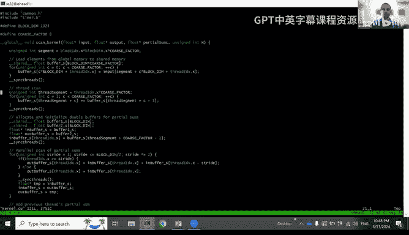

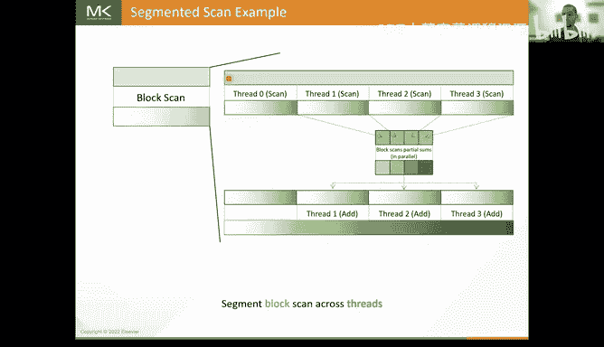

Okay， the next step is for every thread to do its own sequential skin。

So over here the thread is going to iterate， so here every thread is responsible for eight elements to do a scan across these eight elements。

 so every thread is going to iterate over these eight elements and do a scan of these eight elements that's happening right here。

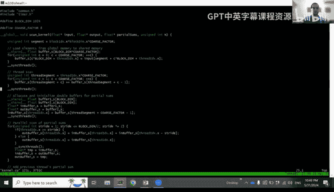

after that， every thread is going to contribute the partial sum of its eight elements to the block scan。

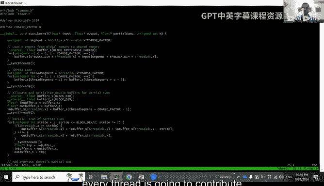

So if we go over here， every thread did a scan over its eight elements。

 then every thread is going to take the element that is at the end of its segment。

 so here we access the shareddman re bufferuffer。啊。

The beginning of a thread segment plus forning factor minus1 so plus seven that's the last element in the thread segment and we put that in the in buffer which was the buffer we're using previously to do the cojistone scan and then the rest of this code is doing our scan operation from before so this hasn't changed。

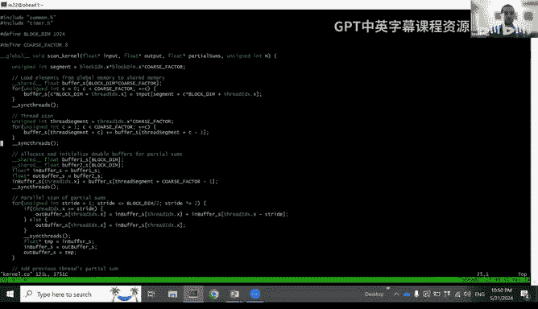

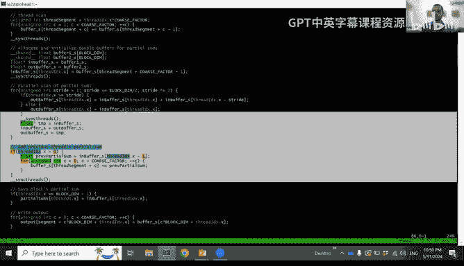

and then after that， the last thread block is going to write out the partial sum。

 so this also hasn't changed。

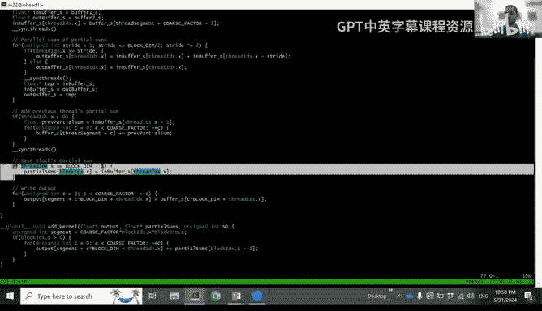

But then at the very end now we have this array right here what we want is for sorry now we have these scanned partial sums right here。

 what we want is for every threat。

What we wanted is for every thread to go and add its value to add the previous partial sum of all the previous threads to its own elements。

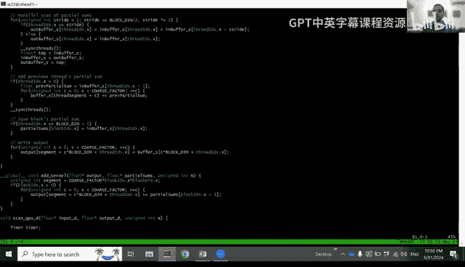

What's happening here all except the last thread。Right because also I'll accept the first thread because the first thread has no previous threads so doesn't need to add anything so all except the previous threads will go。

 they will get the partial sum of the previous thread in position zero so that's sum of of all the previous threads。

So and its go as。Add them to all its elements so I's going to eight times over each of its here for the entire third log and then what we will do is we'll have the threads write these values from global memory to shared memory in a coalesist way。

 so every thread is going to write out eight values。

 but it's not going to write out its contiguous chunk of eight values。

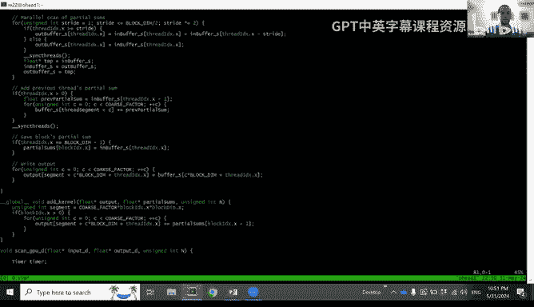

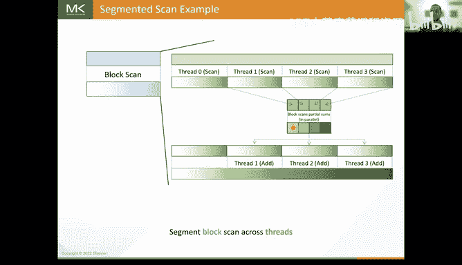

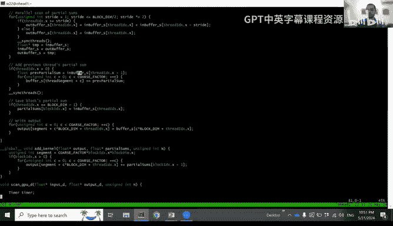

We're going to group them together， we're going to write block them values and then block the next block in values and then next block in values and we call this way so that's what this last loop over here is doing we iterate eight times and every time we're going to write out a chunk that is blocked them in size where every thread writes out a consecutive value okay I apologize it seems I copied the wrong directory。

So sorry about that。So let me compile this。😡，Okay， and I'll run it。Okay， and as you can see。

 if you remember before we had around 0。7 in our in our。

So now the performance has been reduced running against。

So we'll get a reduction at improvement in performance and that's coming from the improvement in the work efficiency of the current。

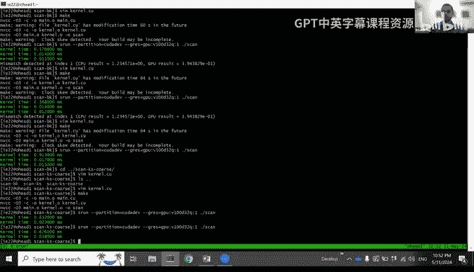

Okay。And this over here is the code that we were supposed to live code。

 I apologize for what happened。啊 ok。All right， so having finished about thread pourscing。

 so I want to talk about now how we are doing the segmented scan across Tblock。

 so so far I've been kind of assuming that we had that but let's go back and talk about how it's done when every thread block does a scan of its own segment and contributes its partial sum。

We have to go and scan these partial sums and then add them back to these elements。

 So how do we scan these partial sums。 Well， one way to do it。Is by terminating our kernel。

Launching a new kernel that will the same scan kernel but launching it now on the partial sums array to scan the partial sums right and then launching another kernel that's going to do the addition right and that's what my code right now is doing。

However， what this does is what happens here is that this involves launching multiple kernels right you have to launch a kernel wait for it to finish。

 launch a new kernel， wait for it to finish launch a new kernel wait for it to finish the CPU is kind of busy with launching these different kernels also we lose these values that are in shared memory right because these values here are in shared memory we have to go store them back to global memory and then launch this kernel again to scan the partial sums and then we launch this ad kernel we have to go load these values again from global memory to shared memory so that we can add to them and then store them back to shared memory so we lose the opportunity。

😊，And of directly， while these values are still in shared memory， do the addition on。

So these are the disadvantages of launching multiple kernels to do the segmented scan so the question is can we do all of this in a single kernel that allows us to keep our data and shared memory so that we can eventually do the addition on it and it also frees up the GPU。

To do other things and also if we're using this scan operation inside of another kind of bigger computation like a filter or。

Or you know some other operation that uses scan， right it's inconvenient to have to kind of terminate the kernel and and launch a new one and then bring everything back to the S that you need。

So how can we do this scan operation？without having to launch these multiple kernels。

So there's a way to do it， which is we refer to as the single path。

launching a new kernel to do these scan these partial sums。

 what we can do is we can have these threadlocks synchronize with each other somehow。

In order for them to do the scan of the partial sums， what we can do is the following。

 we can have the first thread log， it produces the just scan the partial sum once the thread thread log produces its partial sum。

We can have the nextlock wait for it。And when it's done。

 the next thirdblock will go grab that partial sum。

And it will add it to its own partial sum to produce now the partial sum of the two thread locks combined。

The next threadlock can wait for that right so it'll sit there and then as I'm so here now once this threadlock has added these two partial sums。

 it doesn't have to wait for all the other threadlocks。

 it can go ahead and proceed with adding the partial sum of the previous threadlock to its own data。

Thank。The next third block can do the same， it'll wait for the previous thread block to finish this edition right and once it's done it'll take its own partial sum and add it to produce the partial sum of all the three thread blockss right and it can also then go ahead and add the partial sum of the previous two thread blockss to its own values。

Okay and then we can do the same thing over here this threadb can this thread block can wait for the previous partial sum and once it's ready it can add it to have the final the final partial sum and also it can go ahead and add this partial sum to its own use Okay so this is a single pass scan where we're going to use a single kernel in order for us to。

To to wait for the previouss so there's there's there's some kind of serialization here right only in this stage where we are doing the scan the scan across the blocks but there's a there's a sequential scan happening where every third block waits for the next one and then releases the next one wave。

The previous one then released the next one okay but then the additions are all still happening in parallel and these scans in the beginning are all happening in parallel so this single pass scan has the advantage of we can keep the data in the SMM and we also you know don't have to busy the CPU with launching you know multiple kernels and can go and do other。

ok。Now to do the single task can we we have to have these flags。

 we have a flag for each one of these threadbs and we have the next threadb we'll have to kind of spin lock on the flag for the previous threadb to make sure that it finishes we have to make sure that we get our thread fences right so that the data that is written by one thread block to global memory is visible to the next threadb because I only have one hour and at the end of the hour I'm not going to go into the code for doing this the code is available in the book it's kind of a section at the end of the book so you're welcome to refer to that as well normally I have an hour minutes lecture so I code this as well but today we're not going to have time to do that。

Okay， so this is how the kind of singlest pass can works and in thrust thrust does something similar to this。

 thrust and do something a little bit better called the couple look back and I'll talk about what that is shortly。

 but I'll leave it for Jake to cover that in more depth in his lab。Okay。

 so other optimizations that we can do for scan that we didn't have time to cover in these two lectures so one of them is using warp level primitiveence right so what we've done is we've。

We've taken the scan， we've segmented it across blocks。

 and then within the block we segmented across threads， but we ignored wars right。

 but warps are important because warps the threads in the same warp can synchronize with each other in a faster way than threads across the entire block。

So one common optimization first scan is not just to segment directly from the block in the thread what we actually do is we we segment from the block across the different warps and then we have every warp do its own scan and then we take the partial sums of the warp scans and we kind of go back and have every warp add the partial sums of the previous warps to its values this actually gives us significant performance improvements because it allows us to do the scan iterations within the warp without having to do any sync threads you the scan is a latency bound operation the sync threads is a significant bottle like in this operation so getting rid of these sync threads by doing the scan at the warp level does significantly improved performance this requires us to useuffle shuffle instructions。

Register tiing is also useful so when we。翻。When we applied thread poisoning in the context for the threads。

 we were using shared memory to store the values for the threads。

Actually bring them to the threads Regs， improves performance， the register tiling。

And then then finally decoupled look back so when I covered this。Oh。

That was the code for the dynamic。That was the code for doing this operation right here so when we covered this when I covered this I told you that we're going to have every thread block wait for the previous thread block but we actually don't have to do that right instead of having every thread block wait for the previous thread block which creates this serialization across the blocks and becomes a critical path in our computation what we can have is we can have the threadb look back instead of just one block it can look back at multiple threadbs and if for example so here if block three comes and it finds out that block two the sum of block two and block one and block zero is not ready。

 but it finds out that block twos partial sum is ready and block one partial sum is ready and block zero is partial sum is ready instead of block three waiting for block two to wait for block one to wait for block zero which creates this serialization。

What block 3 can do is it can go and get the partial sums of block 2。

 block 1 and block 0 and add them together itself and then go on and。

And and continue with its ad operation the advantage of that is now we no longer have this serialization chain right block three doesn't strictly have to wait for block two to finish which has to wait for block one it can it can go and check if the previous ones have finished and and this this idea of a block waiting for previous block this is what look back is and what I've described here is kind of single look back but decoupled look back is this idea that we look back multiple blocks until we reach kind of a until we kind of reach a block that has。

Actually finished its scan and then then we and then we we stop there so we look back gradually。

And we can of gradually look back depending on you know that's the idea of the couple。Okay。

So these are some additional optimizations and with these optimizations and a few others right that's where we get you know all the performance that we get from scan and these optimizations or some of them are recurring optimization so the idea of you know dividing from the block to the warp and dividing the from block to the warp and then from the warp to the threads and doing thread coursing at the level of threads doing the register at the level of threads this is something that we see in kind of many of the kernels that we optimize so in reduction we do the same thing even in matrix multiplication right we have this hierarchical tiling where we tie at the block level and then tie at the warp level and then tie at the thread level we do the registertyling at the thread level and and and all that helps us improve performance okay？

So that is the end of today's material， and I'd be happy to take questions。

 try to find to take the full hour。Sweet thank you so much， as that really。

 really appreciate it everyone， please give a big round of applause for that and thank you for this。

UYeah， like I guess like we're happy to start taking any questions like from the audience like can just give both folks a few minutes。

I guess while we're waiting for people， why are the warp level and intrinsics scal shuffle like I never understood that like why use the word shuffle for this stuff？

嗯。I feel like it's like you're shuffling data around like you're moving things around and you're doing it very quickly so it feels like you're shuffling。

 but yeah I guess you have to ask the N video folks why they decided to call it shuffle。

Is that maybe you know this Sam included， right？You may know this in does the shuffle instruction resemble a Vx shuffle too？

Right， yeah， yeah， so I think what we did was I think we probably took the term from somebody else who had already be coined for the shuffle。

啊。Maybe that is an historic reason and I do not know， okay。

 I'm just giving an opinion which may not pick correct up。Yeah， even otherwise right as can。

 even though it looks so simple， so easy， the versatity and diversity of its usage is an our。

 it is used in many of the gene applications too， even though many people do not even realize it it's being used。

啊。It is used as primary benchmark for memory bandwidth tests in almost every single machine or a hardware that it created。

So understandings can， including the decouple look back kind of methods are very， very。

 very important。Right。Yeah， but for what it's worth。

 I think it sort of became even more important with like some of the sort of new architectures like Mamba and S for。

 I think what we've had like old characterss。And Pyarch asking for a faster scan implementation so I guess like you know this is like maybe a good call to action for us to go figure this out Yeah so youre right mamba like architecture the SSM based architecture without scan you do not have exited so whenever you want to go for a long context lens and everything right so it's such a small kernel but the impact is so enormous。

Sweet， I guess if there's no other questions， I think we can stop here like I guess I guys that will probably share slides with us later and I'll put them on the Ka modeud lectures and the recording will be available in a few days。

If you like this lecture we have like a few more lectures coming up in the next two weeks like tomorrow we have Kate Daniel from any scale is's going to be talking about speculative decoding and VlLM next week we have like a very hyped up lecture on Friday which is going to be about tense reports so this is like content that doesn't really exist all that much online so so thank you Vikram for setting that up and then on Saturday next Saturday will be another follow up to this lecture which is an advanced scan which was going to be going over some of the more advanced algorithms that like as that was start talking about and that'll be presented by Jake and Georgie already gave the LM do c++ So yeah thank you so much everyone always pleasure to see folks and see everyone tomorrow thank you。

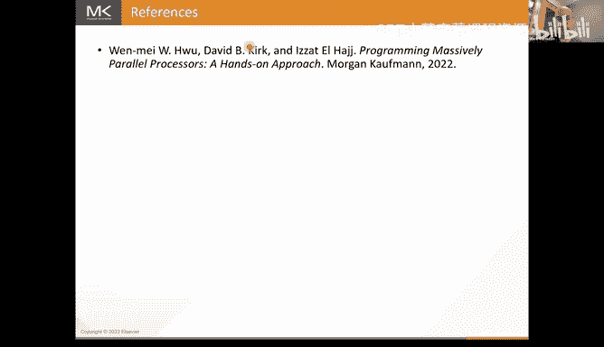