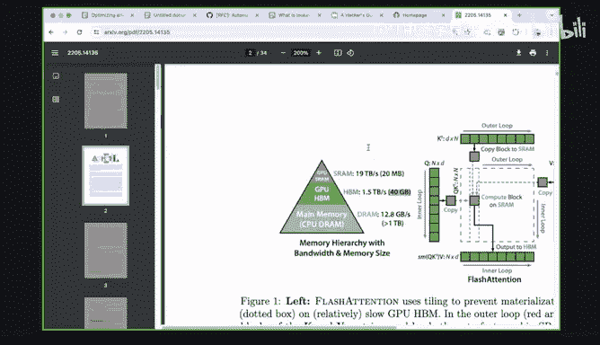
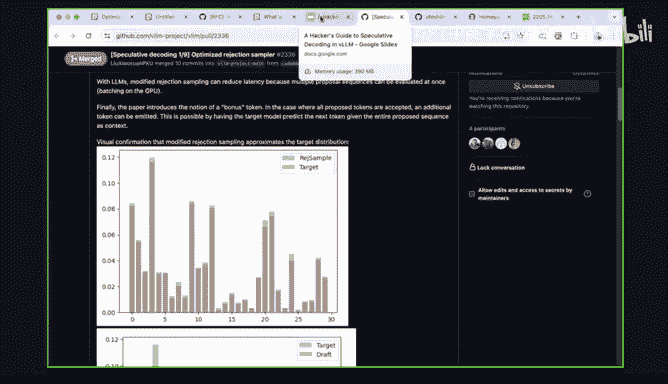
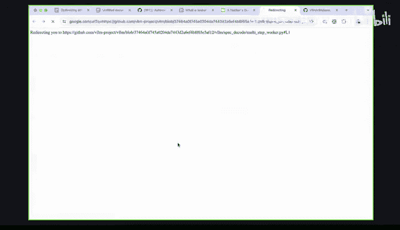
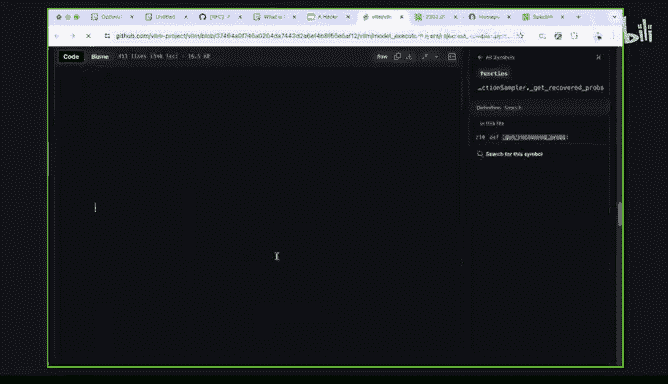
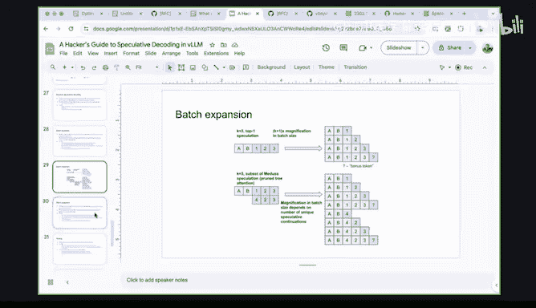
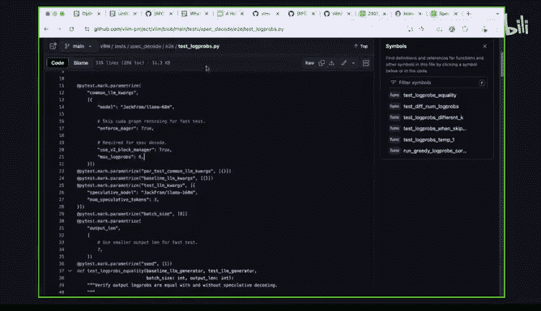
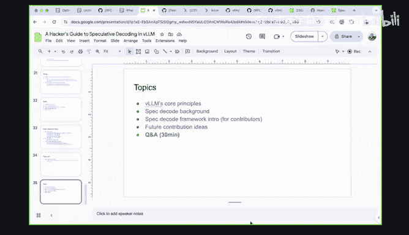

# GPU MODE《CUDA、GPU编程1-53课｜GPU MODE》中英字幕（deepseek-v3.2 - P23：-20240602-Lecture 22_ Hacker s Guide to Speculative Decoding in VLLM.zh_en - GPT中英字幕课程资源 - BV1QZ421N7pT

Welcome everyone to another episode of Kuda mode today like I'm super glad that like Kate Daniel from any scale has agreed to come give us a talk on his hackcker's Guide to speculative decoding in VLLM。

Personally， I think this talk is interesting for like two reasons like one VLM is arguably the project today that's hosting some of the most important like high throughput kernels and LLM and LLM inference and so it's kind of like a household name for anyone who wants to run LLMs in any sort of cost efficientfficient way and speculative decoding is actually a technique that's near and dear to my heart like I first learned about it as we were working working through GPT fast last year and it's basically like a trick to help make autoaggressive decoding more parallel。

 but I think like that like's okay that's put a lot more thought into this and the different techniques so yeah。

 please join me in welcoming for this talk and you know Kate， please take it from here。All right。

 thanks for that great introduction， Mark， and thanks so much for all your work on GBT fast Pytorch and for having me here。

Yeah， there's a lot of content on specor decoding it's a really cool technique and there's a lot of content in BLM。

😊，This talk is not designed to give like a holistic and comprehensive every single detail on VLN or specta code。

 it's really focused on getting you like the bare minimum and what you need to know to be able to navigate and work on spec code and VLN。

😊，So there's probably going to be questions and I'm happy to answer those on the VL project or in Discord or at the end we'll have some time for Q&A and so just to be clear folks。

 if you want to ask Kate any questions either type it here in chat。

 type it in Discord in the lecture Q&A channel or just raise your hand and then we' enable video for you willll enable audio for you so you can talk。

Great。I think yeah， anything else before we get started。Yeah。

 I think and then one last thing is there are more projects in specD code that can be done。

 and I'll explain those in the talk， but yeah definitely open to contributions and that's the goal of this talk。

Okay， to get started a quick introduction， yeah my name is Ka Daniel。

 I am working on LM inferences and VLM a software engineer at any scale Any scale is the creators of Ray which our claim to fame is ChaGBT was trained on Ray。

 which is a pretty good claim to fame。😊，And then previously I worked on model parallellysis systems at Amazon。

Always feel free to reach out som happy to chat about LLMs and open source。

Now the topics today breaking them down， we'll talk about VLM's core principles。

 why I think VLM is such a great framework and people should contribute to it。

We'll do a quick background on specy code， how it works， when it works。

 and how to evaluate how good it is。And then we'll get to the meet we'll talk about the spec code framework that's in Vlum today geared towards contributors。

Lots of links we'll walk through some code and then at the very end I'll walk through some future contribution ideas。

 some which are engineering heavy， some which are more modeling heavy and some which are more difficult and combine engineering and modeling。

😊，And of course， we'll have the Q&A at the end。So to get started， what are V1's core principles？

Villand is a cool project because it combines three things， it combines ease of use like Ptorch。

Provides great performance also like Pyttorch。And it provides hardware agnosticity also from Pytrch。

😊，So let's step through these one by one so first off ease of use this diagram here is a bit old I think it's actually a little over 20。

000 now and the whole idea of VLM is to really make it easy to use like the Python APIs to create an elementary point you shouldn't have to require extensive installation steps or have deep knowledge of performance to be able to get good value out of the library。

😊，This is great because a lot of people when they start with a on inference。

 there's a lot of options and ease of use as a priority for the library means that it gets a lot of popularity and new users。

😊，Now great performance， it's really difficult to combine ease of use with performance。

 and I think that a great analogy here is like TensorFlow1 had an amazing performance out of the box to the first priority and perhaps the restrictive nature of TensorFlow1 was why PyTrch was able to succeed because PyTch prioritized developer productivity。

 and ease of use of performance。😊，VLM is very similar in that we get this ease of use。

 and we also have some very advanced features with great performance。😊，So of course。

 we have things like page attention， tensor parallelism。

 which are kind of standard for all elements and frameworks。We have。Functionality like multiloura。

 where you can serve many different custom fine tunes， many different las on a single VNM instance。

And it's optimized with some great work out of UC Berkeley， some customer Kuda criminals。

We have other things like trunk prefill， which there's a great tweet that I can make that a scheduling policy that optimizes lower average per token time。

 and there's a whole bunch more like automatic prefix caching where you can cache and prompts。

 guided decoding where you can restrict the output tokens， according to some grammar like JSON。

 etc ce， a lot of great quantization work， F is in the works and a bunch of other quantization types。

 and larger features which rely on like distributed like multinode pipeline parallelism。

 which will be necessary for serving some of the newer 400 billion parameter models and very advanced systems like prefill de segregation which allows you to put prefill on some nodes and deco and other nodes。

😊，Some of these features are complete and they're done and then others are still work in progress and there's prototypes and a lot of really smart people are working on it。

So because theL brings together this ease of use， we can get a lot of contributors。And then lastly。

 a priority for VLM is hardware agnosticity this screenshot here is a presentation by the one of the AMD's recent hardware announcements and you can see on the left 2。

6x they released like day zero support for VLM。😊，As the LOM space heats up。

 we'll see more and more hardware providers optimizing their proprietary stacks and it's really hard to actually have a cross platform crossbackend optimizing things library so this is a niche that VlM fills so Kate。

 how do you do this because like last time I checked the VLM repo like the majority of it seem to me like it was like a lot of ka kernels so I'm curious how does your multi backend story work。

😊，Yeah， so these are like the three core principles of BLM and they're not completely realized today NVDdia and AMD support is pretty good I would say inferluentia you can actually get something working but it's missing a lot of features。

😊，TPU as well， like honor resident inference can work。

 but it's missing many features and TPU just the basic functionality is still work on progress it's like a prototype w。

So。Very much today you don't have access to all the features of VLM on this backend it's very much specialized to NVDdia AMD but in terms of like strategic positioning and capability。

 VLM should support all the backends and all the features some to get there and so for AMD like are you authoring H kernels are you relying on code generation are you using Trident so like just curious how do you do this without sort of blowing up the lines of code in the repo That's a great question Currently we're in the blowing up the lines of code in the repo？

😊，Yeah so we have like hip kernels we will do like automatic translation I think that like the direction that we want to be them to go is still very much like how we want to get here is still very much under discussion。

 but I can imagine like Torsch compile or individual hardware providers provide a custom worker like how Amazon did for infentia。

So again， great questions and if you guys are passionate about this vision。

 then please come work on VietnamM。Some Cha is asking if we can go in presentation mode。

 would that be a big deal or？I'm going to be switching back and forth to different links and later so I prefer not to I can and don't let us move on so like and then so Byron is so Byron is also asking like how does TU support work like you also need to author like XLA kernels for that？

Yes， yes， the person who is owning GPU support is Musso， one of the co creators of Vietnam。

And because JackX doesn't play well at mutable state。

 there are some customrs or sorry custom kernels out of a project called Palace and yeah。

 you should talk to Wsuk and I think there's an issue I can then you to formon answers。所以 thank you。

Okay， so we've talked about BLM square principles and now let's dive into specy code generic background。

😊，So there's a lot in specta code I recommend you read Andrea Laary's tweet on speculative decoding it's a great introduction the key points to understand specy code is that LLM inference can be compute bound or memory bound compute bound is like a batch inference case where you fully saturated but compute of the GPU and memory bound is like live inference where you carry more about latency and you have it fully saturated the compute capacity of the GPU。

😊，Specty code is an optimization that helps when we're memory bound and the reason why is the tricks we do to get speed up require additional flops to be able to do this speculation and scoring。

So effective code applies when we memory don't。Now。

 a second key point for spec code is that not all parameters in our large language models are required to generate every token。

Allama 2 or Lama 3， 70b， it's a lot of parameters， 70 billion parameters and FP16s。

 so much information can be packed into that。😊，And we probably don't need all of those parameters to answer questions like what is the capital of California？

Um， and even in the generation of the answer， there are many tokens which have low information density。

 like are， you know the word the or a or is。So spec code comes from these two observations that we can be memory bound and a 70 billion parameter model is complete overkill for some tokens。

😊，So the key idea is we' you use some proposing technique， could be a draft model。

 it could be some other modeling technique to predict what the large model will say。

Then we get the probabilities of these predictions according to the large model。

And we use some heuristic or some algorithm to accept or reject the predictions based on the probabilities of large model。

And what this means is that because we're memory bound。

 we spend most of the time loading parameters to generate a single token。

If our speculation is correct and let's say we guess two correct tokens or three or any number。

 then we successfully amortize the loading of the parameters over however many tokens are emitted。

And this directly reduces the time per token。We'll walk through a quick example。

 but this is the high level ideas that you code and you can read the tweet for more information so Kate there's a quick question on that like so my understanding of speculative decoding is like again like the memory bound work close than to happen at very small batch sizes or at least they especially pronounced that small batch sizes or as like I have heard of VLLM is sort of being the repo for high throughput batch inference front so so I'm curious yeah sort of if there's like a connection or if this is more of a make VLM great for a small batch and big batch kind of work or if it's really also helps for bigger batches as well。

😊，Yeah great question it's an open research question if speculative coding can help with larger batch sizes。

 I believe that it will never help， but I need to validate that a little bit。😊。

So to answer your question， yeah， VLM is known for its high throughput engine and also high quality beam search sampling。

 and part of this effort of adding specialty code to VLM and also why it's taken a lot of time and effort is because it's a project to make VLM a low latency framework as well。

😊，The idea is if you look at PR TLLM it's very good at loan latency。

 we want to make VLM also good and configurable for loan latency deployments。😊，Answer your question。

 Mark。It does yeah and actually there's also people in chat asking more questions so iPhone is asking sorry for the dumb question but are these parameters loading a layer by layer or one in VM and then I think Robert Shaw is talking about RA versus like HM so i'm wondering if you could maybe talk a bit more about the like what model loading really means I think it'll be helpful context for others Sure sounds good so i'm going to look up the flash attention paper。

😊，Tried outad does a great job explaining this。And if we scroll down and we look at the visual description of the algorithm。

 there's a lot of complexity here which we'll ignore， I just want us to focus on this pyramid here。

Now there's a memory hierarchy between when we're serving LLMs， so we have like CPUD Ram。

 which is your typical RA that you're familiar with and the size of this is order terabyte or more。

And then the throughput the bandwidth we get is around is tens of gigabytes。

 so when this table was released， it's like 13 gigabytes per second。😊。

So we have very large amount of space and some bandwidth。Now GPUs。

 especially the A100 series and onward， have very high bandwidth memory。We're talking 1。

5 terabytes a second， which is much more than deranabytes。And。

The capacity it's much more difficult to construct these， much more expensive。

 so the capacity is significantly reduced from CPUDM。😊。

So nowadays like 80 gigabytes is standard for a GPU and I think the new one's not like 92。Now。

 going even further。The GPU will have a dedicated area of RAM， statically unlocated RAM。

 and this is called SRAM， and the speed of this is crazy， it's like 20 terabytes a second。😊。

This is extremely expensive to produce and that's why you get the speeds that you do and because it's so expensive it's very limited so as order like 20 megabytes。

 the numberer ones have like 40 megabytes of space and so when we talk about loading memory when I talk about naming IO bounds I'm talking about taking parameters that are in GPUHBM copying them or loading them to SRAM or to L3 L2 L1 caches so that the actual compute cores can perform work and mountain on those parameters and activations。

😊，Yeah， thank you， I think like I'm seeing another question also it's like sort of memory memory related。

So this question is about like caching responses of an LLM。

 I think this question is hinting at both KV caches and like a regular server side cache。

So this is like it's not super connected to what you were talking about just now。

 but if it's coming later， feel free to just punt on this question for now。Yeah， I'll briefly。

 actually I think I've already talked about perfect caching。

 so I'll just address it now you're totally right that you can cache the intermediate states like you can call to cache the answers of a lens and you can do this at a very like traditional web services level where you just match the input and the sampling parameters of return the output and in VLM you can do this at a block level。

So the complexity and the expensive part of calculating like a new prompt is to compute the key value activations that everybody token。

And VLM provides a way that maps the actual tokens that you give to the LLM as input。

 it maps those to pre calculated blocks of KVU。So it further details is a bit out of scope through this talk。

 but happy to discuss more offline and it's actually it' a future contribution opportunity to combine speculative decoding with prefix cashching。

😊，Yeah chat is very active by the way I think it's going to be a struggle to go through your content like I'll ask the questions and then you decide if they're better answered later so so Randy is asking do you like how do you make sure that the small and large models are similar and how do you pick a draft model that's well aligned？

😊，Great question TLDR here is a kale divergence is a great measurement that any people use。

 I'll touch a little bit on this later on the talk。😊，So I also see a general question by Piot。

 which is like what does it mean that VLM is optimized for throughput and not latency and what are the technical decisions that make it optimized for one。

 not another and how can this change in the future？Yeah， great question。😊。

When you're designing a framework you optimize certain things right and VLLM， its initial design。

 it had high throughputcase in mind where memory is a constraint and we have a very large batch size。

😊，嗯。If you look at almost every layer of an LLM serving stack。

 there are design tradeoffs that you can make based on whether something is throughput oriented or latency oriented。

 and VLM mostly took the throughput oriented path。So there's examples there like the kernels that we use。

 the all reduce operations that we use， even like we perform scheduling for continuous batching synchronously with the model overpass。

 these are all things that VLM chose the high throughput case and it's how it is achieve VLM's amazing performance why it's still good at cost saving but a lot of our story from any scale side on VLM has been working to good at V low latency。

 and there's a lot of optimizations there from like auto2ning like the MOE kernels。😊。

Using a custom all reduce， which is like one shot of latency optimized and future work。

 which will happen soon， which is to remove some continuous bashing overheads inside B&Ms worker。对。

All right， very cool， I think we should get going， but like chat's been very active today， which is。

 yeah， just is awesome to see good。Okay so going back high level spec backgrounds there's a quick very useful diagram this is from a paper called accelerating LM inference with stage back coding that's pretty short I highly recommend checking it out what we see here is gray is the prompt so this is some coding completion task where we are given a prompt with the do tree。

😊，And then let's see the we have two different models that actually propose one we have an Ngram draft model which is a CPU only very simple draft model。

 and then we have an actual draft model like a small transform model that's on the GPU。

And what we see is that red are tokens which are omitted by the oracle model， the target model。

 or a very large model， and you can see the first token generated is from the red， the target model。

And then green are tokens， which are proposed by the Ngram draft model and are accepted。

And then blue are tokens， which are proposed by the transformer model and the GPU。

 which are all accepted。And we see that especially for like white space or easily easy to predict words like the word return or else。

 the two draft models do a good job of actually predicting what the target model will eliminate and this is a great way to highlight that all of the tokens that are green or blue are essentially skipped from that target model's perspective。

 and this is how we achieve the speedup in memory down cases。So how do we evaluate the speedup？

There's actually a lot of pretty cool math that it's done by some folks IDmins。

 I highly recommend reading this paper， it's by Leviath and et all， vast inference from transformers。

😊，And the the basic way to so yeah， I won't go into super detail for these graphs。

 but I'll break it down into a practical view， including which factors are most important。

So a simplified version is we can take non spec Ecode cases and we can define the inner token latency as the step time divided by the number of tokens for step and expectation。

So without speculative decoding， if it takes 30 milliseconds to perform our inference and we get one token。

 this means we get one token per 30 milliseconds。Now specy code adds overheads。

 we might spend milliseconds on proposing or scoring or doing rejection sampling。

 and so let's say that the same model takes 40 milliseconds instead of 30。

 but in return on average we get 2。5 tokens per sequence per step。

What this means is that we get one token for 15 milliseconds。

 which is almost a 50% latency improvement。Now， how do we think about this？

We need to think about how long does it take to propose so like a draft model with a transformer draft model will be very high quality and produce very accurate proposals。

 but it will take some time to actually run those on the GPU。

 whereas an NGM model is very fast steep you only， but the quality and predictive power of the pure NGM models nowhere near as good as a transform model。

So the first one is how long does it take to propose， how accurate are those proposals。

 and then how long does it take to verify get the probabilities of these proposal tokens and any other spec code framework overheads。

So in practice， there was a question earlier about acceptance rate。

 how do we know how good the proposal method is？In VLM， we have a metric which you can see。

 This is the。😊，Dra acceptance rate and essentially what this is is it's a very empirical value which simply records of every proposed token that you see on your workload。

 how many of those are accepted by the target model using the acceptance routine configured。😊。

So this isn't equivalent to tail divergence or like a very theoretical way to measure the acceptance rate。

 but this provides a really good proxy for how well aligned the draft model and target model are on the data set the running model。

😊，So going back here。We need to track how aligns the proposals with the target。

And then we also need to track the system efficiency is how efficient is the deployment compared to 100% sentence rate？

嗯，就。There are some things which I'll cover later， something called a bonus token。

 which in some special cases allows us to emit an additional accepted token that the draft never proposed。

 and so when we're running this in production， we can actually say， okay， in the best case。

 if we can get free tokens per step， but we only get 2。5 and our efficiency it's a 2。5 over 3。

0 and this allows us to gauge on the data set that we're running how efficient is our configuration。

So in general， you're going to be taking the step time of the entire board pass and then dividing it by the number of accepted tokens。

Kate， I have what question， is this like interleaf basically the proposal step and the verification step or are they like somehow like running in parallel so that the proposal things like always running and then basically somehow updating？

Are there two different variants that could be implemented and which one is implemented in VLM？Yeah。

 there's a lot of flexibility in how you want to do it because fundamentally it's just a modelly problem。

 you just need to predict tokens。And VLM， it's synchronous， so you run the target model。

 you run rejection sampling， and then you propose the next tokens。

And the reason why that is because you need to know what the target model accepted in the previousvi generation to be able to propose the next molecular tokens。

Um， but yeah， future work could make some of that asynchronous。

 it all depends on the performance game can get。thanks。

 and the like what is that rule of thumb thumb， how many tokens you want to propose first or in which like how many is like five or 10 or before you run it like this verification step then again。

Yeah， so quick backgrounds， I built speculative decoding framework in anyscales fork of BLM last year。

 and we deployed it to production in December and it achieved a 50% latency reduction for smaller balons。

And so there's a lot of room to optimize the frameworkra further， in our case we deployed it。

 I believe it was three speculative tokens per sequence。😊，So pretty small number of speculations。

There's a long tail of optimization that you can do to increase the number of speculations or even adjust it depending on the batch size。

Okay thank you very much so so there's actually a related question in chat by Yugi which is are speedups observed across all techniques in speculative decods such as Ngram prompt look ahead maybe I'll share a quick anecdote here before Kate answers but you can imagine that like basically you can have anything like any process that can guess the tokens would make things go faster and practice that like an LLlum ends up being good but imagine if you have a very small vocabulary like just like you have basically two different kinds of tokens in your vocabulary then just flipping a coin might be like a pretty good way to do speculative decoding and guess like a whole bunch of tokens and so yeah no surprise that like Ngram models could also sort of like be helpful in this regard。

But Kate don't know if you want to comment more on other techniques outside of LLMs for perspective codinging。

Yeah good question there's a lot to be explored there and i'm personally not a modeler so people who have modeling experience could could chime in I think that marquee is correct about smaller vocabulary e in modeling power and。

😊，I think that's it there Oh and one thing I will say is if you train like a transform model。

 it has much better predictive performance over like more data sets。

 so like if you train not on shareGT it's good at share GT but maybe it's also good at coding whereas Ngrams because they're not as powerful maybe they only work in like summary summarization workloads where you like take an article and ask Alan to summarize it。

嗯。😊，So different techniques have different efficiency on different data sets。

 and at the North star from BMM， the actual proposalal that we'll use will depend on your data set。😊。

Yeah， that's right， flipping coins with 128 K signs for La by 3。Okay。

So one last important detail in spec code is losslessness the question here is is the output of specul codingd different than just the target la la alone？

😊，And the quick answer here is no， if you use rejection sampling。

 which rejection sampling is a technique that allows you to relatively efficiently sample。😊，嗯。

From the distribution speculative decoding and habits be equivalentence to the distribution of like a source distribution。

So there's a paper here on a Deep Mins， which has the proof of losslessness as linked here。

 highly recommend reading it。And the only constraint here is that because we're working in low precision data types。

 there are some limitations in error and Harvard numerics。

So basically you're guaranteed to have a lossless output when you're sampling from speculative decoding with respect to the target model if you're using rejection sampling。

And I have a quick diagram I can show here when I merge the rejection sample。So here this is just。

This is like a mock distribution for the draft model and target。

 so we can see that the blue is the target and orange is the draft and the X axis is like vocabular so here there's like 30 cookiess and y axis is the density。

And we can see that even though the draft and target distributions differ significantly。

 when we push them through the rejection sampler and this PR， we find that the output， which is blue。

 is very， very close to the target， which is orange。And if you actually sample in the limit。

 then these two distributions converge to a very high， very low amount of difference。

So if we have like different sampling options， I don't like presence penalty or temperature and so on they need to be like applied the same way to the drafting of the proposal model and the verification model is this right or exactly yep so it's a bit out of scope for the level depth you want to get to but if you read the proof fits in that paper one of the constraints is that the proposal distribution and target distribution must be modified or perturbed with your sampling parameters in the same way。

 so things like temperature or frequency penalties or the plethora other sampling options that there are。

Okay， thank you。And if you do that correctly， and you use a VL direct sampler。

 then you get a lossless output， which is pretty amazing， you get like the same quality levels。

 you don't get any influence from a drop mode。😊。

And then a little bit later we'll talk about Musa' technical acceptance。

 basically you can also plug in a lossy sampling technique and this means you'll get a higher acceptance rate higher speedup but you will trade off some quality there's actually a PR somebody's working on this I'm putting a BLM right now and plugging it into the framework but you have this tradeoff between quality and speedup。

😊，Okay， that goes for spectao backgrounds and then now we'll get into the meat of the specta code framework。

So current status in BLM spectacle framework is not done。

The spec framework is complete with correctness tests so you can actually every time you put a PR you'll run a battery of correctness tests which verify the losslessness which various unit tests and various different sampling parameters but the speed up isn't there so in any skills in Cha4 we did certain optimizations that don't yet exist in open source speed andLM that allowed us to achieve the 50% ITL reduction on that says is one through rate with a temperature one sampling parameter。

And this issue is what tracks the remaining work and it's what me and a few others from any skill will work on this next month。

So don't expect to deploy spec code yet to production， you may get some speed up。

 I have measured it but it's not expected to。And in terms of the proposals。

 we have the drop model works， NgramM is correct， theres a PR for Musa which will come soon be mergeed soon and IBM has great work merging an MLP speculator。

 which is very similar to Musa， it's very similar to e as well if you're familiar。

And those other features like skipping speculation for some sequences and then an extensive the codinging。

regulator is multi token prediction right from IBM。Yeah。

 so there's a little out of like we can talk more about that later okay yeah that's later sorry sure but the point is is I mentioned this because it validates its spec code this framework actually is a framework it's not overfit to a draft model。

😊，嗯。Okay， and then just these are some numbers way back in December that I pulled from any scale staging。

 and this is for Lama 270 B， we when we first deployed specy code。

 we brought the ITL from like 26 milliseconds to 12 milliseconds。This is very ideal case。

 I think the batch size is like five and some of the prompts are pretty simple。

 but it shows with temperature one， the VLM can be on the lazy framework。😊。

So now getting into the weeds， then how does the firmric work at a very high level we have a new worker type。

 but instead of being like a GP worker that does like continuous batching。

 there's all the things that BL is known for， we have a specT code worker which meets the same interface as VLM's typical workers。

😊，And within the specT code worker we store all of the information and logic and execution to implement spec decoding。

 and there's three main categories， one on the proposes， which can be engram draft model right now。

 the scorer which does top one scoring， which Andus I think you're mentioning could be bullet in top one as well。

 and then the verifier， which is right now only lost with rejection sampling。

 but in the future will also provide loss C sampling techniques。So just to paint the picture here。

 we have three stages， propose， score and verify and propose takes as input the prefix that you're going to create speculative tokens upon。

 and we output the speculative tokens and the probabilities of those speculative tokens according to the proposer method。

 the draft model according to the draft model。And then scoring is very simple。

 we take the prefix and the spectulative tokens and we generate the probabilities of speculative tokens according to target model。

And then in the verification stage， we take as inputs， the speculative token IDs。

 the probabilities of those token IDs according to the proposer。

 and the probabilities of those token IDs according to the target model。

 and we output accepted templates。😊，Now theoretically there are many different proposer implementations。

 so here's a list that I created a few months ago， you can have a draft model like what is done today。

 there's different variants on draft model like a stage draft model。

 tree draft model where it suggests multiple speculative tokens per slot and like a cascading draft model where the draft model has a draft model。

😊，There's meusa Eagle， which are very great implementations， things like Beta。

 which does a prompt tuning approach， Engram， Jacobbi， great workout out of UCSD。

 and then like input grounded speculation， which is like Ngram and like ra grounded speculation where you can actually use like a database that's relevant to your prompt to suggest specative tokens。

😊，And for verification in theory we have a lot of different implementations we can do。

 so we have lossless reduction sampling which is done today， loss C reduction sampling。

 there can be different types， you can implement your own algorithm。

 one such algorithm is typical acceptance， it's done by vanusa and then there's also greedy acceptance where we simply accept a of token if the token matches what the target model produces。

😊，I believe TGI uses greedy acceptance and someone should do an ablation study about the performance of these。

 I believe that we're like as samplingmbling performance better at higher conducts。

So when you're thinking about contributing to VLM， this is the framework you should think of and we can go show less on the code。

😊，So first off， let's take a look at the particular code worker。So。Here we have our worker。

 which currently doesn't support Laura。And we have some nice stock strings which explain some of the concepts here。

嗯。I'm going to go to the method which is just perform the speculation so execute model is the entry point for all beetle land workers。

 so typically this would run just a single forward past the dealer tokens。😊，But in our case。

 we will there's a certain predicate， which determines that we'll run specECdecode。

 which I'll get into in a second， but if those predicates are true。

 then we can run a spec decoding step。So if I get into this method run spec decoding step。

 what we first do is we get the proposals from the proposal worker， which can be a draft model。

We score those proposals using the scorer model。And then we verify the accepted tokens using the verification the key。

And just to click here further， we do some things to split the batch of sequences into the ones that are speculative the ones that are not。

 so we support cases where the draft model doesn't support speculating on the sequence because it's too long。

So we can do things like that and we will then call like the rejection sampler。

 which will determine which tokens are accepted rejected。

So there's a lot more details here and we recommend reading through the code it's pretty readable with some good dostrs。

 but at high level this is the flow， we simply get proposals， we score them， we verify them。

 and then we do some serialization， convert it to CPU tensors and return it to be a lemon。😊。

So so one of the like requirements is probably then that the post models need to have the same tokenizer or is there also a mode where you could like detokenize the output of like the get the text from the drafting model and then tokenize it again for for the verifier。

 but it probably it would be too。They tookumbber somewhere rightss。

 normally you have like the same same token。Yeah， great question。

 I should have mentioned this earlier one key constraint for your proposal method is that it uses the same tokenizer as the target model。

 and the reason is that you need to encode the probabilities for rejection sampling in a way where they share the same vocabulary。

😊，嗯。I am not， you might be able to do some advanced trick like this where you have like a tokenizer and you represent the math differently。

 but I think for performance you almost certainly have to use the same tokenizing。Thank you， yeah。

Okay， so this was a brief intro to the spec code worker。

 some other details that the spec code worker handles are things like profiling so VLM at the very beginning will'll run a profiling step which determines how many key value blocks you can score safely in your configuration so the spec code worker handles this or the special case we have a draft model with KV。

嗯。Yeah， I think that that's it so basically all like the not fun work inspection of the coding。

 the spec code worker should have it for you。Now let's dive into a proposalr。

 so we have here a proposalr for a draft model， and we call it a multi step worker。

And this inherits from the worker， so it shares a lot of the implementation and essentially what we do is we will just run however many speculative tokens we want a for loop and we'll run the actual model several times。

😊，And append the output， so we do a very simple autoreive generation here for the multi step worker。

Very simple， there's other logic here which manages proposals。

 which I'll talk about a little bit later。And then another implementation of proposer is the NGM worker。

 this is contributed by an external contributor recently and it has the same flow of getting the proposal tokens。

 it will do end matching to see if there's any like matching continuation in the prompt or the previously generated tokens that we think could appear again。

So here we will go through every sequence in the batch and we'll do engram window matching。

 which you can see and read the test score。Oh。And then for the verifier。

 we currently only have rejection sampling， and so I'll open this up so we can be able to familiar with it。

This is a torch module currently and the forward press takes， as I said。

 the probabilities according to the target model， something called a bonus token IDD。

 which I'll talk about later。Probabilities according to the draft model and the speculative took。

And in here we'll do， we'll actually implement like the math required for project sampling。

 which is a bit out of scope for this talk， but you can walk through the code here。

 it's pretty readable。And then lastly， a contributor from Robblox is working on implementing Midus's typical acceptance。

 which increases the acceptance rate and trades off done quality。I haven't looked at the latest PR。

 but you can follow this issue for more information。可以。😊，So now we're getting a bit into the weeds。

 so these are some lower level details of the framework that I want to give you just enough knowledge that you can operate with。

 but these are advanced topics。So， one question is。Top one versus top K tree attention。

When we say top one or top K， what we mean here is the draft model proposal method。

 how many tokens is it speculating per sequence？you can think the first specd decoding papers。

 they simply had a continuation of the prefix that they speculated upon。

 it provided one continuation， one token per sequence per slot。

There's a few papers like this one which came up with the idea of using a specialized attention mask and you can actually do tree based speculative speculation and this is where a single prefix could have multiple different speculative tokens that the target model could select from。

😊，And the project that popularized this approach was Musa。

So Mousa came out last year Septemberish and they essentially used this tree based approach。

 here's the mask to significantly increase the number of proposals and what this means effectively is that you can the draft model can be wrong on the top one case where it's most likely token is incorrect。

 it's not selected by the target model but the second proposal that the draft model produces is still correct。

So there's a lot of detail here and if you're happy to contribute to this。

 please continue reading more and a high level I recommend reading these creative papers on it together has any other blog posts where they adjust the size of the tree so you can vary how many tokens are sampled for each position in this speculative model。

😊，And currently in VLM we only support top one proposal。

 the only reason for this is simplicity we will and can support top K in the future。

 the key technical challenge is that you need a proper masking kernel to do top K and when Specy code and VLM was written we only had naive page attention which supports no mask it has like a single tokenine mask。

And so recently there's been work， especially in flashmfer to support masking。

 and we can follow issues here to support tree tension and V1。So also in the code。

 there's a class called top one Pro， which implements the logic of taking the proposals and formatting them for the target model for top one scoring in the future we'll have one for top K。

Okay， so now some more in the weeds details， there are two notions of tokens that are outside in the realm of like proposal tokens。

 one is called a bonus token and one is called a recovered token。

So both of these names come from one of the first papers stated the coding by Charlie Shan。

 you should read through it here to have a deep idea of these two concepts a very simplified high level overview is the bonus token。

In the case where all speculative tokens are accepted。

 we can sample from the target model distribution normally。

So what this means is that I'm going to show this diagram。

Here we have a top one speculation where A and B are the prefix and one， two。

 three are the speculative companies。We will format the batch for the target model such that we get the probabilities of each of the spec cooking。

So we get the probability after A D， the probability distribution。

 we get the probability distribution of AB1， what comes next。We do this again for AB12。

 what comes next？And this allows us to actually see how likely the speculative token is for according to the target model。

 and we can plug this inter rejection sampling。😊，Now when we talk about bonus token。

 we can simply add and query one more like add one more query token to this batch to reend to the target model。

 and here we're not comparing this probability against any speculative token because we don't have that speculation for this far。

But what it means is that in the case where one， two and three are all accepted。

Whatever token we can sample from the question mark here is going to be a correct token because it comes from the target model。

So this idea of bonus token allows us to get an additional token in the happy path。And in particular。

 for small speculation length k equals 2， k equals 3， this provides the price significant speed up。

So there's more details here in the rejection sampler you can read the code and understand it better。

The second notion that's important in spec code is the notion of a recovered token。😊，Now。

 let's say we speculate three tokens， but the first token is incorrect。

Because the subsequent token's correctness will depend on whether the first one is correct。

 we have to reject all of them and we essentially wasted a lot of work。In this case。

 instead of emit zero tokens and not making any progress。

 we can do some math trick to recover the target model distribution from what we scored。

And you can read the details in the rejection sampler。

 but why this is important is that it guarantees we always get one token and in the case where we reject a token。

 we can correct the distribution and get a correct token。

 which enables us to get more tokens even when we fail to predict correctly。So quick example here。

 this comes from another deep mind paper， this is a very small example aspect of the coding where the green suggests like the dropwell proposals。

 red are rejected tokens， so this first red is bond。And then using this recovery technique。

 we can actually modify the distribution emit the target for red。For bonds and get a correct token。

I suggest reading the paper to understand the details more fully， but at a high level specy code。

 the reduction sampler will do these kind of math optimizations to and ensure we get more speculative tokens than the most possible。

And then yeah， just to show some of the math here。

I think quite interesting that these are two terms which come out because internally they are pretty similar because you。

 I think in both cases you take the logicits from the target bottle and just for like one token for the next one which you don't as you have gotten from the speculative which was like rejected。

😊，这置。Like it seems to be like they have very closely related to bonus token and recover recovered token。

Exactly right。Yes， and both of these are in the rejection sampler and we have tests for both of them。

 so feel free to hack them in if you can make them more efficient here we have some of the math and the implementation which is not very scary at all for the recovery distribution。

😊，By the way is is it because it's like rejection sampling is probability based is it somewhat deterministic or is the seats set for a sequence or can it be somehow so will it vary for each generation process or is it somehow stable or。

😊，Deterministic。Yeah。I don't know the current state and open source in our fork we have a per request seed that enables like you can set the seed and be deterministic all the way。

 I think right now we only guarantee determinism at the framework level。Yeah， I need to measure。

 I don't else stop my head。Thank you。Okay， so is there some any degree details on bonus cover token？

We're moving on to another topic called Dmic expected decoding。So at the very beginning of this talk。

 I mentioned how speculative coding it only works in the memory bound case。

And we actually find that as the batch size increases。

 the number of spare flops is reduced even to the point of zero spare flops。

And if we have a very fixed number of speculative tokens when we're doing verification。

 then every time we go over the number of spare flops。

 then we actually end up adding more time to the step time。It' is not a huge gap。

 it increases linearly after your compute bound， but it means that it reduces the batch size that we can do for a given ITL reduction。

So the net expectedcod， there's a few papers on this and they approach this problem of how can we ensure that spec code performs no worse than no spec code？

There's a UC Berkeley grad， her name is Lily， she's awesome。

 she's also interning at Anyscale and she implemented dynamic speculative codingd in VLM with the vision being that we can allow their very different QPS and disable or enable specy code to never have worse than nonspecta code performance。

😊，This is still a work in progress and it's a very naive policy right now。

 if you're interested you should reach out to movieie。And yeah， like I said。

 future work we can have like a per sequence speculation length right now it just disables speculation person sequences。

😊，And just to showing you a graph， this I got this from Lily this is。😊。

Shows performance as we increase the request rate and we assume a certain acceptance rate of the model so alpha here means acceptance rate。

And we see that the average request latency without speculative decod in the blue line increases as we get more and more compute bound。

😊，And then if we look at the DSD， this red line， this is meusa top one with DSD。

 we see that the latency is never worse than without spec0 code。

 whereas if we don't have this DSD policy， then we see that latency quickly spikes because of all the time spent in verification。

Okay， that's dynamic vector decocoding。One other topics that's very important is batch expansion。

So the problem here is how to support scoring when patient attention only supports one query token for sequence。

As I said earlier when this was written， page attention。

 thela supported generating one token per sequence。

I have a doc here which you can read which goes into this this is where this diagram comes from and we talk about batch expansion and how to make it more optimal the TLDR is in the specT code worker we create virtual sequences。

😊，Each having one query talking。And so we're effectively expanding the batch so that the target model can use naive page attention to do the scoring and this has some performance implications in particular it means that the forward size of the target model will duplicate key value loads and the tension layers。

 so there's some performance optimization we can down here。

And just this diagram highlights this this batch here on the right side when we expand it。

 the target model perspective， it's just taking this full batch。

 it doesn't know that the prefixes AB are shared。And we can see in particular。

 when the sequence is very long， this will have more and more of a performance hit because the target model will duplicate those loads and leave up to chance whether or not it is a cache hit。

😊，Bch expansion is particularly bad for tree attention。

 where the number of unique query tokens explodes with the tree size。

And so this is a primary limitation of why we don't yet have pretty attention in VLLM is because we don't yet have proper masking at the kernelron level to do this efficiently。

Now there was work ongoing， Lily is leading this。which removes this batch expansion with the support of an optimized kernel so the flashinger folks are working on a masking kernel which allows us to specify the query tokens dynamically and this allows us to remove this batch expansion and we can get a more efficient spec decoding implementation probably 10 to 20% about what I expect in terms of ITL reduction。

And then if I I don't think I linked it here， but I'll just find the file myself。

 batch expansion is contained to within the file so if I go to specy code。

Batge expansion here we do top one batch expansion where。We will effectively expand the batch。

 execute the model on the target model。And then contract the batch so that we understand the probabilities of all tokens。

This is here we want this to go away and this is a great way to contribute。

 but it's also very helpful， for example， if we have a new hardware backend and we don't yet support an MQA kernel。

 we can use batch expansion to go'll get good speed up。😊。

So basic question here is is what what's missing is the variable length flash attention kernel with a Kv cache paging support or。

What's missing here is a kernel that's able to realize that there are multiple queries。

 query tokens that all share the same prefix。Okay， yeah。So this should be not。

This is not too hard to implement in triton our measurements on the triton kernels we have aren't very good。

So the measurements on like the flash attention kernel are much better and the flash infer are much better。

And the reason why this is like okay to have this is kind of a hack is we don't for like smaller speculation lengths and smaller batch sizes and smaller sequence lengths。

 this actually isn't that impactful， but it will be absolutely necessary for very large speculation trees or very long sequences。

😊。

Okay， we're almost to the end here， so talking about testing， how can we validate correct spec code。

 I put a lot of effort into making sure that people could contribute to spec code and use great tests it is a very complicated thing and understanding and end to end requires a lot of ramp up time。

😊，So one of the key testing properties we have in VNLM is that when temperature is equal to zero。

 we expect exact equality with and without spec code。There's some caveat here。

 which you can read theducts in the file。This is a great assertion because we can test variable different speculation lengths。

 speculation types， sampling parameterss， et cetera。

 and we can see that the quality should be the same。😊，So I'm going into test multi step correctness。

 which is where the bulk of the tests are and there's right up on the testing methodology and some of the edge cases。

And if I scroll down to one of the tests， let's see a simple one。Dear。

 this one is testing greedy correctness of a tiny model with that size of one。

And we use some high test magic here to essentially run the model combination twice。

Here we run it with no speculative model。We run it with like Jackfrram Lama 608 very small。

 and then no speculative model， and then we'll run it with a speculative model with five speculative tokens。

And in this test， what we do is we generate like 100 or in this case， we generate like 1。

500 tokens from the from the target model without specy code and we do the same with specy code。

 and we verify that the output tokens are exactly the same。

So this is a great test that you can rely on when you're adding to spec code。

 we have the same assertion for a different model， so like a 160M which differs slightly from the 68M。

😊，And this end to end testing framework allows you to test many different features。

 so we have like a feature in VLM where we can get the log probabilities of the generations and so we use the same setup to get the probabilities of the log props。

 get the log props from the target model and verify that' correct。😊。

So there's a lot more here， feel free to ask questions the key point I want to get across if you really want to tests and you can rely on them as you contribute。

And then there's also unit tests， so one of the very important unit tests are the rejection sampler unit tests。

 and so the diagram I showed earlier where the rejection sampler shows that the distributions converge this is tested on every commit in VM。

😊，And you can see those and hack on it and rely on that for your correctness。Okay， so to finish off。

 we will talk briefly about future contribution ideas。So I bucketed them into three categories。

 one which are more engineering and are'm pretty much ready for people to pick up， two more modeling。

 which requires the modeling experience。And then three larger ones that like mixed engineering and modeling。

Maybe these aren't feasible， there's some risk。So for example， retrieval acceleration。

 this is where we can use， like if we're doing like RAG。

 we can use a database of terms that are relevant to our prompt and we can use those as proposals to speed up acceleration。

Now there's a paper here that does this where they prototypenicing that can。

 so effectively this task is to implement this paper and the proposal and be them。

Another one is thick ofvin chunk Prefi plus Becky code。Then a challenge here is that chunk preflow。

 which is out of scope for this talk， consumes the same thws that specy code relies on to get speed up。

But Chunk prefield provided a huge benefit for single node cases。

So the work here is to unify the two and have a policy which dynamically adjusts speculative verification length so that when we're doing chunk prefi。

 we don't speculate and the average ITO gets the best of both quotes。

Another one is to combine prefix caching plus specT code。Currently。

 previousface caching will also use some of those same flops to backfill the KV if there's a cash mix。

And so combining Spycopa's previous casching allows us to get the best of both worlds where we can。

 if part of the blocks are shared， then we can get the speed up to previous caching。

Another one in VLM is guided decoding， this is where we limit the logicits。

 the output distribution to conform a some grammar。

 we could get even more speed up in specy code and guided decoding by combining the two and allowing just a subset of allowed tokens kind of like what Mark was saying earlier about if the vocab is too allowed tokens like NJSO is like a comma or closed quote than your accuracy even though much higher。

And then more engineering work is support for the other backends。

The framework is designed and architected to support these， but there's no tests。

 I think for AMD GPs there are， but not for CP， TP or infentia。

 and so if you're passionate about that， then you can add support to those。

In terms of more modeling side， you can see that the speculation length is actually a function。

 like you can get more efficient spec decoding by adjusting your speculation length。😊。

Maybe the draft model has very low confidence in the tokens it's predicting and it would be better to not waste the flops verifying those tokens。

So the idea here is to use a meta model。some kind of model which sits on top and it takes those inputs。

 the probabilities， the confidence of the draft model。

 and it uses that information to determine which speculations actually are verified by the targetga model。

It's not clear to me how like what the upper bound improvement on this is Lily knows a lot more about this。

 but from my perspective， this allows us to become more flps sufficient in VLM and will get us more efficient combinations of like chunk prefi and specticum。

Another similar method is a meta model for speculation type。😊，The idea here is like ball routing。

 which there are many papers on and the idea is that you can have like NgramM and a draft model and maybe like a RAG proposer all running at once and depending on the confidence of each of the proposer types。

 you could pick different ones to send to verification。

So this requires a modeling aspect to looks at the prefix and we'll guess which model will produce the best speculation。

And then large large tasks， these are very big and recommend reaching out if you're interested。

 there's a great paper called online learning this is also by Lily。😊，And this paper。

 it allows us to dynamically train， update the parameters of the proposal method according to the distribution that we see。

And this allows us to get specialization， for example。

 if we're doing LLM survey and we get a lot of requests that are coding specific。

 then our draft model can get better online for coding because it learns to predict coding has better。

😊，This is pretty pretty cool， a little bit scifi because it requires a lot of infrastructure and being them to support this。

 but great great idea， and you can read the paper it shows that how much more speed up you get when your draft model is specialized to a particular domain than a generic draft model or one that's trained on like on shared JT。

😊，I talked about this one first because this one can second。

 so you can also think that you can use like a multi laura for your draft model where each Laura specializes your proposer to a different domain。

😊，So you could have a single base draft model and then a fine tune for coding。

 a fine tune for summarization， a fine tune for Shakespeare or whatever have you。

 and if you're able to do this efficiently， then you could have a proposal method that works for many different domains and you don't have to pay a cost。

 you pay less cost of missing speculation。One last very large one。

 there's some folks from UCSD who are working on this it's called batch parallel decoding。

 and there's some work with consistency LLMs， which use like Ngram iterative like Jacobbe decoding to be able to break the sequential nature of LLMs。

And it's still a bit of an open question to me if this should be done in the speculative deco codingding framework or if it should be done separately。

But this is another area research area that could be done and be aL to get more speed up。Okay。

 there are probably more ideas there but that's the end of my talk。

 I want to highlight that I did not do all of this work， a lot of people。

 very intelligent people collaborated and helped including Lily， Cody， Anthony。

 the VillaM team and creators， an intern Enquiel last year in a Vika and Channon Sang and also want to say thanks to Mark and Andreas for hosting this Ka mode talk。

😊，Sweet thank you thanks so much Ka。 Yeah， this is awesome like I I think personally like what really struck me was like the scope of collaboration and how weall sort of built a。

😊，Well like it was really nice that that like basically because like the core VLM spec coding stuff was like well built and well tested that like other people could come in and basically build research ideas on top of it like that was really exciting I actually had no idea VLM was sort of built in the way so that was super super nice for me to see。

Yeah， Is also say that everything is a very， very impressive if I look at the VLLM code。

 also I looked for example as preparation at some of your PRs。

 okay that you created and like all the documentation or like this is like real professional work in open source space which is done it' is super awesome and super great also to have you hear like it's one of the core contributors to go such deep in this topic and sorry I was like for asking some of the unprepared questions there but it's like super fascinating topic and。

😊，Yeah， thank you so much for like preparing also of the slides with all the links if you could share them in our lecture repository that would be super awesome。

😊，For sure， for sure。 Yeah， thank you guys， this is great。So yeah folks。

 if you have any questions to Kate， please feel free to like ask them in chat or raise your hand oh。

 there is one question which comes in see。So I see Manu asks Doeen to tune the draft law or proposalr for a specific data set。

The question here is how good is your acceptance rate。

 very likely in production you will want to tune the draft model browser for a specific data set at any scale to get our 50% speed up。

 we pretrained  a very small 6nM draft model。Another question by Man Gabinla。

 can see the best I inference out of spec decoding for a model。

 what would be a good type of model start at， memory bound models or compute bound models？😊。

This question is a bit tricky because a model can be memory bound or compute bound depending on the work size。

 the workload size。m so you can pick any model that is memory bound that is the way to think of it。

And yeah， so some of more questions， thanks again guys this was great to get Vle out into the community and hopefully enable people to havecon spec to。

😊，So thank you so much， everyone。

Thank you very much， Kate and I think then。