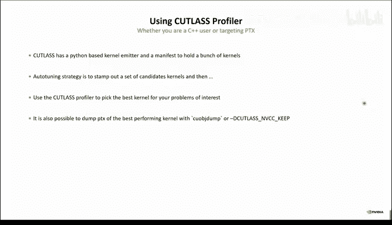
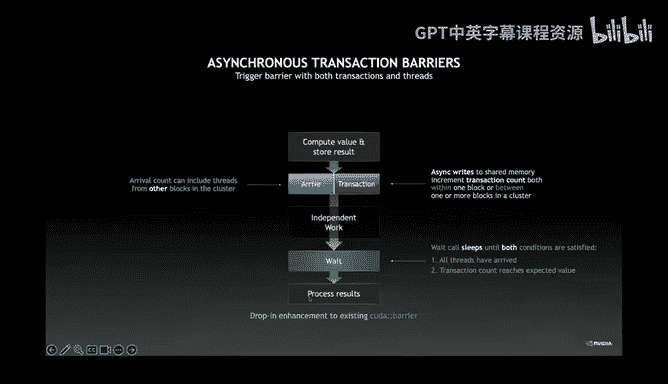
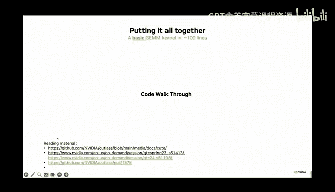
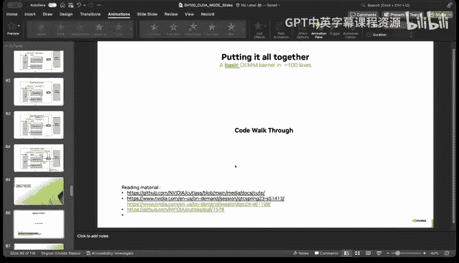
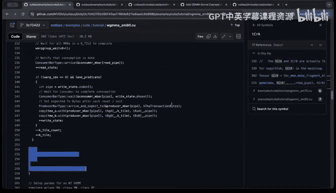
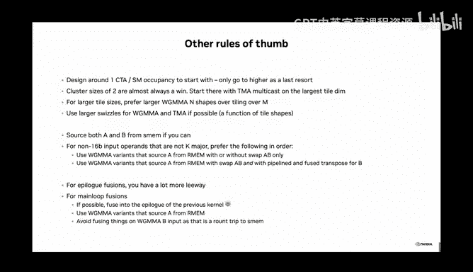

# GPU MODE《CUDA、GPU编程1-53课｜GPU MODE》中英字幕（deepseek-v3.2 - P24：-20240608-Lecture 23_ Tensor Cores.zh_en - GPT中英字幕课程资源 - BV1QZ421N7pT

Hi and welcome everyone to today's Ca mode。 So Friday's special lecture about Tensor course today。

 I'm super excited to have you two absolute experts directly from Nvidia。 We have VJ Tka。

 who's an architect at Nvidia on this lead designer on Calas and the cute project at Nvidia and his his colleague Pradi Bramani。

 who's a senior architect， also working on Calas at Nvidia。

 He is also like more than 10 years of GPU Comp experience。

 So welcome both super absolute pleasure and honored to have you here Kuda mode。😊，Yeah。

 and today we will have a special talk about TensA course and I'm also really excited to learn about how we can really utilize the latest generation of。

GUs by NVDdia and get basically the peak performance that everybody wants to reach till today both because have basically I heard deep knowledge about cutlas which is like NVDA's open source。

 Qa C++ template library for metrics and multiplications and stuff。😊，Like Met Mo， for example。Yeah。

 as everybody maybe know with the talk normally goes for one hour。

 today we will extend this for a special request to really cover this topic in death。

To approximately two hours， if you have questions， we have a chat which comes to with this zoom which can activate spec on the the button bar on the chat。

 you can ask questions， I'll try to forward them。To the speakers during the talk if that's like not appropriate or not I matching the topic at this moment。

 we be recorded for later and then ask at the end of the session。Yeah， so， so so much from my side。

 I'm basically happy to forward。 I think't know， I don't know who is starting off you both。

 I don't know。 Vja you， you're sharing currently， I think you would share then please share the stage is yours。

 Thank you very much。 Awe， Al right， thanks for that introduction， Andreas。

 I would prefer being interrupted for questions。 So if there is anything in the chat， let me know。

 I cannot see the chat， though。 So just feel free to interrupt me。😊，Anyway。

 let's dive right into it so today's talk basically focuses on speaking Tensor cores via Culas and we'll be walking you through some of the motivations behind Culas what actually Tensor cores are how we think about writing custom kernels that target Tensor core what the programming model for them is and end with a very nice demo that shows how to write a hopper gem from scratch using Cutlas and Q so what our tensor core so let me let me set the stage for people who might not be familiar this is by no means an extensive deep dive into what Tensor cores are or why they exist in the first place but to set the stage right for your mental model it's a hardware accelerated block that basically just does matrix multiply and the reason for that is matrix multiplication has some very nice algorithm algorithmic properties that if we do it in hardware allows us to exploit a lot more spatial and temporal reuse out of the data and this lets us bridge the memory wall right we can get a lot more。

reuse out the data that we load and moving data is one of the most expensive things you can do so Tensor cores basically accelerated these operations by exploiting this nice algorithmic property about matrix multiplies and the illustration on the right hand side of the slide kind of shows you。

Victorally what's happening in there。With that Tensor course take a lot of different variants and shapes and forms over the years the NviDdia Tensor cores have changed quite a lot and on the screen right now you can see five different generations of instructions that we use for implementing matrix multiplies on the bottom left hand side you have the old school pre Tensor core era where you only had threadle multiplies and in Pascal we introduced these dot product instructions that would do low precision dot product with more than one element per thread。

That。Transitioned into the Volta Tensor core， which was the first to Tenor core instruction where eight threads would participate and cooperate together to compute a N cubed matrix multiply of shape8 by8 by4 AmPR took it a step further and turned it into a warp level tensor core and then in Hopper we have ap group level tensor core where four warps are collaborating together to do a giant matrix multiply directly from shared memory so the tensor corepss have evolved a lot over the years between different architectures and this is part of one of the fundamental complexities of writing programs that target Tensor course。

Why is it so hard， what's so hard about doing matrix multiplies？

If you're doing matrix multiplies in Python or something or conceptually just thinking about in terms of linear algebra it's actually very easy right we just have accumulated inner products of outer products where we're basically iterating through tiles in the A and B matrices to compute one full tile within the output matrix in this case label to C。

This is just a triple for loop， pretty straightforward。

 where every single iteration of the for loop computes one element's partial product。

The complexities of writing programs that do matrix multiply really start arising when you have hierarchical parallelism like you do with GPUs。

 so GPUs are not just parallel machines， they're hierarchically parallel machines and that means there is a nested hierarchy of threads and a corresponding nested hierarchy of data locales。

On through which you have to tile your problem to exploit more and more data locality and more and more reuse so in this case we're going to take our entire global memory tensors and tile them to this thread block level。

 which then further gets tiled to the thread level and what becomes really difficult is keeping track of all of these indices and data and making sure your adverse arithmetic doesn't eat into your cost of actually doing the matrix multiplies。

So when we introduce Tensor cores on top of this that have their custom layouts of threads that they require the input up to be in order for doing correct execution。

 it becomes even harder right you kind of go away from this nice canonical Tri4 loop structure and turn into this insanity of index bookkeeping。

So this is one of the first problems that there is no trivial way to express these Sdi like loops that you would have on CPUs In this case。

 I'm trying to show you the extent of the complexity here it's best if you don't focus on the actual details here but what I'm trying to illustrate is that especially in the case of Volta this is extremely difficult to even reason about in your head Here's a Volta instruction that I showed on one of the first slides and actually the way a efficientvolta kernel runs is that that one instruction or eight threads first gets tiled over an entire warp so that there's four instructions on top of that there's swizzled within the warp so this is quad pairs0。

1，2 and3 it's not a row or column major layout and then that gets spatially interleaved across the entire shared memory tile of that warp。

Furthermore， taking it a step further， that one war's worth of unit gets tiled across the entire SM。

 which is four subpartitions， which is four warps in this case。

 and then you have even more spatial reviewsuse happening for getting vectorized loads out of shared memory and all of this kind of gets crazy really quickly。

So this is one of the first challenges of writing Tensor core programs so you have to really think about how to map these data elements logically to the actual physical stores where they belong and this is what we would call a partitioning problem figuring out what threads on which data elements in the first place。

In cuttlas2 timeframe， we had these hand implemented layout functions that were custom for each tensor core operation。

 where given a input coordinate， the layout function would compute the index within which that element is stored。

These hand handwritten iterators are basically implementing what we would call the post partition layout because they presume that you already have the thread ID available and they don't separate the thread layout from the data layout。

That gets really hard so this is the first problem The second problem is that of asynchrony and programmer managed synchronization。

 so this is one of the other key divergences between CPU and algebra and GP in algebra。

 which is that we don't have an speculative out of vote execution engine to extract parallelism out of our code and tolerate global memory latencies and what that means is。

Using shared memory， the programmer is required to set up a software pipeline of data streaming into the TensorCo so that the latencies of memory loads are not going to slow down your computation if you were to compute with TensorCos naively。

 the latencies of loading data from global memory are so long that you will never be able to get performance out of it because AmDL's law will come and eat your lunch。

So that implies that have what question on the slides that we have before is suppose was RM is this like register a memory or what is Yeah。

 so the mnemonics here are SM is shared memory RM is register memory and GMM is global memory Okay。

 general question is are the slides， Will they be available。Yeah。

 we'll post a curated version of slides thank you。So this is kind of an example of how crazy so I wanted to show in both cases just how extreme things can get to extract performance out of Tensor course and in this case I have an example of a hopper optimized kernel where you can see not only is there software pipelineing but there's a persistent algorithm which is actually computing multiple output tiles theres a warp specialized pipeline where different threads of the same thread block are computing different things one is just loading data all the time and one is doing the a tensor core operations and the other one is doing the postproces using activation functions at whatever it may be so all of this gets really hard and this is the second fundamental problem programmer managed asynchrony over the deep asynchronous pipelines you need to tolerate latencies and optimize for fixed costs again MDdal is always going to eager lunch if you do not worry about fixed costs of your program and as Tensor core operations keep getting faster and faster you do really need to start。

About these latency sensitive parts of your code。That's where CutLAs comes in， what CutL really does。

 it helps you set up a programming model and decompose the anatomy of a high performance matrix multiply on Nvi architectures across the moving parts。

 so CuLss is a template library， C++ template library for high performance in an algebra targeting both Tensor course and coudA coursese。

And it provides a native tile based programming model for GPUs， gutless is quite old at this point。

 gutless 1。0 was released in 2017 and since then it has had a native tile level programming model。

It's open source available at the link that I've shown on the slides and this is something that we would usually share at the end。

 but there's also a Discord channel for Cutlesss where we can talk to you or you can file issues on GitHub and speak to us but the fundamental point being all of this complexity is very difficult to reason about if you do not break and doubt into this moving parts and that's exactly what guttless does having this decomposition across a hierarchy of concepts lets you think about and reason about these things orthogonally and over the next few slides i'll illustrate how that actually works。

To set the stage， the design goals of Culas are the following。

Its intent is to be a public Tensor program program all for NNVDdia GPUs and it serves as a production great example for the world Gotless has adopted across many key libraries。

 there's 300 plus adopters， but even within NVIDdia it's used as a backend for libraries like Kubla。

 CoudDNN， Tensor R TLM， etc。There's also an extreme focus on developer productivity because we recognize that people really want to write custom kernels these days。

 it's not just about having off thes shelflf gems and convolutions it's about what people can do with the building blocks that comprise those kernels in the first place so for every layer in the hiarchy where we aim to provide as much composability as possible with customized variants of those that people may offer for their use cases。

There's also with this composivity and extreme focus on correctness by construction。

There are usually pitfalls with composibility to the extent that not every single combinatorial combination is valid。

 and in those cases we provide static asserts at compile time to make sure that something doesn't even compile in case it's not supposed to work and you will get a helpful static assert in case something is not composable。

There's also as a corollary， single and clear points of customization。

 there's been a very large focus on reducing the API surface area of Cutlas3 as compared to cuttlas2 so that people have single points of entry。

What does cuttla support today so it supports convolutions of course we had matrix multiplies from the get go but with cutlesss 3。

5 we have convolutions and intensive contractions。There are some LLM specific optimizations like mixed input gems。

 and I'll cover a little bit of how pets implemented later as just a fusion on top of Cols。

 and we also support Epilogue Visitor T， which allows people to write customized fused kernels without ever having to worry about how Tensorores actually work。

And I'll be covering all of these to a certain extent today。

We also support F data types that you might have heard of before。

 there is a very convenient Biwheel that Cutlass has and there's a lot more on GitHub that you can find。

So one of the other cool features about Cutlas3 is that it comes with a new core library and component called Q I've seen a lot of confusion in the mode discord about what is cuttla3 what is cute Q is a core integral component of cutlas3 cutts3 is a superet of cute and what it is is two fundamental things Q first of all。

 is a provides us with a canonical layout representation where each layout is treated as a composition of a shape and astride these layouts are a fundamentally hierarchical and multimodal and they always maintain logical consistency of their coordinates basically they allow us to never how to worry about how to do coordinate to index mapping ever again。

They beautifully composed with Swwizzl functions， making the development of Swwizzl functions super easy。

 and perhaps the most cool feature feature of Q is that it provides a formalized layout algebra where you can compose together multiple layouts together and then their return type is just another layout。

What question to the Cu is what is like multimodal in this。Sitting。

Multi modeode over here would mean so for example， this shape is actually a 2D shape， right。

 but the second dimension here itself is a 2D shape。So this is a multi mode Okay。

 I see multi mode Oh yes， I okay， then the way question from someone who's asking is cute what inspired by functional programming programming is this accurate to say？

😊，It's actually inspired by Coup Tensor and some of the use cases that arise during Tensor contractions。

 it does make use of functional programming because template meta programming is by definition functional。

 your returning types and that is a very functional thing to do。

 but no not it's not inspired by functional programming per se。Okay， thank you。

Okay moving on so why cute I think I've already summarized this in the slide before。

 but wherever we used to have these hand implemented layout functions in Cutlas2 they've all been replaced by a single layout concept and not only that we also use layouts to represent thread layouts so in Cutlas2 there was no such thing as a thread layout it was only postpartition data layouts now we have thread layouts and data layouts that are defined separately and then we partition as a algebra operation and this has been quite successful this I've been using for a long time now and this is before I knew flash attention to his existence but pretty much as soon as we release cutts3 tradeout came out and implemented flash attention to on top of it within the first three months of releasing it so there's been a lot of cool research that's been enabled by。

Easier treatment of layouts that stuff。So what does cuttless3 actually do with cute well， cuttless3。

 as I said is a superet of cute and what we have done with it is formalize a conceptual hierarchy of linear algebra components in a way that basically decomposes the moving parts into orthogonal axes。

Starting at the bottommost layer， we have the atom what we call the atom layer。

 which corresponds to the architecture instructions that are fundamentally supported by the hardware and the associated meta information that we transcribe as cube layouts。

 this is the smallest sets of threads and data that must participate to validly execute an architecture operation for math。

 copy or whatever it may be。On top of this， we build the tile MA and copy layer。

 which we like to call the spatial microconnal layer。

 the microconnal terminology here is kind of an analog to the CPU Bizz library if you're familiar with it。

 if not no worries。The spatial microconnel's responsibility is to take care of and abstract the complete spatial tiling of math and copy operations。

 where spatialial refers to both threads and data and any permutations of those that we may wish to express。

Basically， this layer allows us to write canonical loops for architecture specific operations。

 regardless of how wildly complex the instruction layouts get。

And that means we can do single for loop for copies and triple or nest for loops for gems。

 and I'll show an example of that later。For the asynchrony。

 so this fundamentally addresses the first problem that I demonstrated that of interleaving instructions and validating these layouts and indexbookkeing。

 the second layer here， the temporal micro kernelnel describes the complete temporal tiling of multiple spatial micro kernelnels that compute one output tile and you can view this as a orchestration of multiple tile m amazing copies that make use of architecture specific synchronization。

 warp specialization software pipeline to set up the proper instruction interleaving that you need to hide the latencies from global memory。

 manage asynchrony etca， etc， so this is abstracting and letting you reason about the asynchrony as well as the shared memory management etc。

On top of this sits the kernel layer， which is the outer loops that invoke the collective。

And do things like load balancing across different outputqua tiles。

 thread marshalling into their specialized regions， grid planning。

 which is deciding how many thread box to launch， how many clusters to set up， et cea。

 as well as constructing the arguments coming from the host side and then mapping it onto the AB when the kernel does actually launch itself。

The device layer in cutlas is kind of just a shim is just a handle to a kernel。

 so won't focus on that too much。 It's basically like having a cool+ handle。If you will。Wja。

 could you， could you clarify what micro kernelnal means in this， Yeah。

 micro kernelnal is basically in this case， a subset that。

Decomposes some fundamentally challenging component of doing linear algebra into an orthogonal axis。

 So so the only the only two layers that we care about are the spatialling the spatial microconnel and the temporal microconnel。

 The spatial microconnel describes a single tiles interleaving of all copy and math instructions and the temporal microconnel。

 then describes how they interact with each other， how they synchronize with each other， etc ce。

 So these are called micro kernelnels， because they don't compute an entire gem or an entire convolution rather they compute some subcomponents of it and the intention here is if we can decompose them。

 that buys us a lot of simplification in the actual implementation of the library because you can keep one thing constant and change the other one or the other way around。

 And I have examples of this later down the line。Thank you very much。

As for the learning curve and the API entry points。

 we've also made sure that for every layer in this hierarchy there's basically a very minimal set of entry points into the actual C++ types and API surface area so spatial micro kernelnels as I said are the cute T copy and MMA the temporal micro kernelnels are the collective MMA or convolution the kernel layers are just the gem and convolution universal kernel layers and then correspondingly there's a similar device layer。

One thing I would like to highlight that I couldn't go that much into the detail of is that the kernel layer is fundamentally a composition of a main loop and a collective。

 a main loop collective and an epilogue collective。

 and importantly a Ta scheduler right and this is what's orchestrating how your entire global memory problem is decomposing across these collectives themselves。

So you can see how the hierarchical parallelism maps onto a corresponding hierarchy of templates that decompose these problems into their moving parts。

The cuttless pipeline abstraction is used throughout this hierarchy for abstracting synchronization across these layers or within them。

 and this lets you manage buffers and shared memory to make sure you don't have race conditions and so that you can use a very nice producer consumer API that should apply if you've used any kind of task parallel or programming model。

So okay that's enough theory。 Let's actually look at what a cutlu gem looks like。 So here we go。

 I'm using a tensor contraction as an example， but they're just a stronger version of a matrix multiply So wherever you see contraction in this case which GETT refers to generalized tensor times tensor multiply that's basically the same as a gem or matrix multiply so you can pretend they're just matrix multiplies and the way that works within cutlas is you first set up your collective main loop and this is the actual temporal microconnel that's going to execute or multiply and you can see although this looks kind of daunting at a first glance。

 there's nothing really terribly complex here or specific to GPU architecture right you're telling me what the input element type of A and B are what the strides and basically ro column major for A and V are what your alignments for the inputs are what type you want to use for the accumulator what's your tile shape and cluster shape and everything else is just left to auto if you leave everything to auto and you tell。

W which architecture you want to compile their kernel for will automatically generate a kernel for you。

And the same applies with the epi as well right in the epilo you just tell us what your input element types for the CD tensor are。

 what you actually element compute type you want to use。

 and everything else can be left to auto and that gives you a collective epilogue。As I said earlier。

 the kernel layer is a composition of the main loop and the epilogue。

 not shown here as the tile scheduler will be defaulted for you， but。

Take my word for it when I say it there's a third argument here after the upload that you can specify if you want to override the tele scheduler and all of those just composed with each other and that's it。

 this is what an off the shelf kernelnal for Cutlesss3 looks like and this applies for any architecture it's not just for Hopper you can swap this SM architecture for any that we support and today cuttless3 supports Hopper and newer but there's nothing fundamental about it that doesn't allow us to support prior or newer architectures。

So countless3 is our programming model for Pa and newer architectures there is some form of a dispatch mechanism also if you want to support multiple things or is this left to the user。

Yeah， so these are these schedules over here， the auto will pick whatever we think is best。

 but this is also the entry point for the dispatch mechanism and I'll show an example of that in some of the next following slides where you can take manual control with gradual opts and for the architecture also yes for the architecture as well so everything over here is a orthogonal axis that you can change freely if it doesn't compile we'll tell you why it doesn't compile sometimes some configurations are just incompatible for example you may be using an element type on an architecture that doesn't support it and in those cases will tell you that there is no valid kernel for that but yes you can change all of these in principle orthogonal。

We have one question， what's the difference between a main loop and an epilo？Yeah。

 so the main loop is the one that's actually doing the MMA。

 the epilogue is the post processing step after the A times B has been done。

You may have like a typical B 3 gem will compute a times B。

 that scale that result by an alpha and then add another matrix C。

 which is of the same shape as the a times B and then store it into a D matrix and that's what this is the epilogue is actually doing the pointwise operations at the end of the matrix multiply。

Yeah， thanks for clarifying。Diving deeper， this is kind of the dispatch mechanism for picking specific main loops I don't want to spend too much time into this。

 but there are details here that you can refer to if you' would like。

 but to reiterate the collectors are temporal microconnels that are computing a single output tile and they basically they make it easy for you to reuse them because tuning these for performance is actually quite a challenging task that we do for you and provide these off the shelf the idea here is that these single tile gems are extremely optimized for the architecture and we provide them so that you can reuse them for your custom kernels and I will cover how to write custom kernels in a second。

The kernel API is kind of a suggestion， so this is where the fusion capabilities really start shining where we provide you with a bunch of different collectives that can be composed freely with many different different kernel schedules right so the name of the game here is composability in the first place where the collectives for the main loop can be swapped out for given kernels if you wanted to do something custom。

And what the kernel layer is implementing is grid planning logic and the global kernel entry point as well as any kind of tile scheduler related things such as block and cluster wide。

 whwizzling for L2 locality， load balancing using splitK or streamK。

 all of this belongs at the kernel layer。So again， to reemphasize the point here is。

 if I'm trying to implement stream K， I can just take any collective that I've implemented in the past and composed freely with this kernel layer that now implements stream K。

The collective builder that I showed earlier provides you a convenience interface that also provides incremental optins。

 so this is what I had in the slide earlier where everything was said to auto but let's say for example you wanted some more control over what exact kernel gets generated and in this case I'm saying hey I want a hopper kernel but this time with a persistent kernel schedule and five stages in shared memory and in that case you can swap out the autos for optins and these are incremental opts because what's actually happening behind this curtain is that this collective builder is taking these architecture agnostic descriptions of your problem that have nothing to do with tensor course and actually constructing the layouts needed to make tensor coursecing so this is what that looks like this was your input to the collective builder and the builder is actually doing a lot of heuristics and analysis for you to figure out the stage count and shared memory the actual instruction to use for Hopper the exact shared memory layout to use。

The actual copy instructions to use which schedule to compose with etc and the highlighted in green are some of the decisions that the builder has made by just looking at the architecture agnostic description that you provided so the point of this is that。

Making Tensor coreors work is。Fairly complex and requires a lot of architectural understanding and having things like collectives and collective builders lets you not how to worry about it and just focus on writing the actual fusion or the kernel that you really want to in this case all of these decisions are made including the selection of compose layouts that have swizzling for shared memory based on just what you give to the builder。

Okay。Convolutions have a very similar API it's exactly the same thing frankly。

 where instead of giving your input strides as a drawer column major you're giving your convolution operation Fpro or D grad or Wgrarad or whatever it may be and the spatial dimension you can have a 1D2D or 3D convolution and everything else basically remains the same and what's happening behind the scenes is again the builder is going to take your description of the convolution problem that you want to implement and map it onto to a lot of the complex strategies that are required to extract performance out of this on the hardware。

So how does all this help you write custom kernels that make Tensor Cose sing？

I would posit that this decomposition and focus on reuse allows you to extract performance out of tensor course by reusing as much of cutlass as possible。

 the intention of cuttlass is to let people write custom kernels by making sure they can take as much of cutlas that's already out there and only customizing the parts that you need to and。

One of the most basic examples of this is to swap out。

 say a collective for a custom collective so you can write a custom main loop。

 which is the temporal micro kernelnel and compose with any existing schedule that we provide so that you don't have to rewrite the entire kernel you just rewrite the main loop or customize in whatever you want and then compose with an existing schedule by just changing up the schedule in the dispatch policy and that minimizes the changes that you have to make to a single file。

Conversely， let's say you want to experiment with some kind of outer loop load balancing strategy like streamK or whatever。

 you can reuse the existing main loops and just compose with any custom outer loop schedule that you may write。

And all of this just beautifully composes， you literally do not have to modify any other file。

So your changes get localized to the abstraction where they belong。

Thiss also one of the so this is kind of an example benefit of that when you launch a kernel you need to provide arguments for all of the tensors and all of the different configurations that are being operated on by the kernel itself and making sure you have a hierarchical composition of this kernel。

Means that if you switch out the epilogue， for example。

 the arguments that you need to change that you pass through the kernel only change in the subree that you have modified。

 so there's a preorder traversal you can do of the actual arguments you provide to the kernel and this is kind of going into the weeds of it all but i'm just trying to emphasize that。

You can basically swap out sub componentss of the graph and only modify the leaves that you need to and this mirrors and the hierarchy of the templates as well。

One of the other benefits of this is that increasingly so programming GPUs is less about getting the layouts right and more about getting concurrency and synchronization right so if you were to write a Hopper kernel that runs a peak performance you would have to write a synchronization graph effectively in your code that kind of looks like one on the left-hand side but with Cus if you were to reuse the pipelines and implement it it actually decomposes the scheduling and synchronization of these threads in a hierarchical fashion as well where you can write this node as a subgraph of this synchronization node so this makes debugging of synchronization really easy and oftentimes you get it right the first time you try it because this is a lot simpler as two units to reason about than one as a single unit right。

So just like you would break down data locales and layouts into a hierarchical fashion。

 you can also break down synchronization into a hierarchical organization。

So what are the rules of thumb for writing custom kernels targeting Tensor core using Cols What changes when again。

 the name of the game is local your changes to the smallest subset that is affected by it Are you doing kernel fusion Well write a custom kernel schedule and compose with existing collectives and tele schedulers right you get a lot of the optimizations for free tuning a tensor core gem that runs a peak throughput is really hard So in this case you can just write an outer loop schedule that is much easier to tune for performance and then compose with existing collectives If you want to do a main loop fusion you can keep the kernel schedule the same and extend and customize an existing collective MM out of cuts just define a new dispatch policy and as I showed an earlier slide composed with an existing kernel layer and what that buys you is if you compose with an existing kernel layer you get all of the optimizations that we have done with it for free like streamk like any kind of Ts whling for L2 locality etc and this is actually the strategy that the hopper mixed input gems do within colors。

they actually reuse the vanilla dense gem kernel that we have in Culas and all they do is customize a new collective and that's it and all that collective is doing is upcasting one of the inputs to the larger precision。

So you get a lot of like force multiplier effect out of having these decomposed hiarchies same thing applies to upload fusions。

 but that's actually one place where we make your life even easier you actually don't have to modify any code at all if you're trying to do upload fusions and I'll show you how to do that and let's say for example you were also doing some kind of custom load balancing or L2 locality optimization then all you how to do is write a new tile scheduler and at that point everything else remains the same which is your main loops。

 your uploadlos your entire collective。And that's actually how streamamK is implemented in Cu3。

 we don't write a new kernel layer to implement streamamK。

 we take the vanilla kernel layer and just compose with a separate tile scheduler。And that's it。

So this is the mixed input gem I was talking about and this is kind of a feature highlight as well where we can do matrix multiplies on Hopper that have separate element types for A and B and the kernel itself will do the deco quantitization So if you're doing weight quantization kernels where the activation remains in a higher precision and the weight is quantized into a smaller precision these are the kernels that fuse the de quantn step into the kernel itself and in cuts that doesn't mean you write an entirely new kernel you just simply write a new main loop that does the upcast and everything else remains the same you get all of the rest of the things for free。

Similarly for epilogues， this is one place where we can do epilogue fusions very easily via something we call the epilolog visitor tree which basically lets you express the fusion operations as a directed ascyclic graph of operations on top of the accumulator of the result of the main loop so let's go through an example of what that looks like let's say I want to implement this kind of a gem where this is the accumulators of the result of my a times B and I want to scale that by alpha add a bias to it and then add a beta times C to it and then finally computer value then you can write this dag of operations as a composed dag of C++ types so you can say alpha is a scalar broadcast of some element then you fetch the accumulator then the bias computation is a columnwise broadcast and then we're going to do a turnernary compute node that does the multiply and add using these three as the operations and。

Stands all the way down this now becomes a result node that you can compose later down the line。

 and here you go。 Multiply add of these three is the your compute node 0。 and this again。

 itself is hierarchical right so you can composefuse any tree that you want in a similar fashion。

 And finally， the value is just a composition of the result of this node over here and that's it。

And you can write any arbitrary epilogue visitor this way。

We make this even simpler than it is you can actually create arbitrary epilolog fusions via the cutplus Python interface directly where you can define your epilo fusion as just a python function so in this case this is exactly the same fusion as I had before and what you can do is you can give your dimensions of the input tensors as torch tensors that are empty and bind them to the variable names that are used within this function over here in Python and calling epilo do trace will actually emit the C++ for you so say you're scared enough to not even write the epilo by itself and the template hiarchs to cumbersome for you the Python interface will actually dump the C plus plus epilo visitor tree code for you and you can even emit a pytorch kuda extension for this using the cuts Pthon interface so you can integrate any arbitrary epilo fusion directly into your Pytorrch model if you want。

A peek behind the scenes of how actually epilolog visitor works using the domain knowledge that we have about how to make epilo's performance。

 we actually take your epilolog visitor and those callbacks within the visitors get strategically inserted within the sequence of operations happening within the epilogue and that's how they get interleaed together again don't focus on the details this is kind of just a behind the scenes look at how this thing works and implement is implemented but you can always read the code it's all open source if you want to take it look。

W， can you a little bit speak about this， like how the Python library and the C++ library， basically。

 how they interact， where the when like the compilation happened and how you basically load the kernel then from Python in Pythtorch？

Yeah so the plan the epilogue dot trace is what's emitting the C plus plus code and then plan dot run is compiling the kernel as well as then running it Yes。

 there is a caching implemented as well so if you run the same kernel again it won't compile it again and itll maintain a cache of all the kernels that you've come across so far Okay perfect nice。

Okay so we've went through this there's also a cutlesss profiler that is handy for people who are trying to figure out what kernel actually performs best and this is our auto tuning strategy we recommend to everybody so cutlass being a a template only header library allows you to stamp out hundreds like hundreds of thousands of kernels across all architectures and the way you pick the best one is you either use the Python-based emitter framework or the Pythtorch interface and stamp out every kernel that you care about and then you can basically specify all the tau shapes and the fusions that you care about and then you can just run them across all the problem shapes that you care about and pick the best one。

You can even dump the PTX if you hear about that with some of themic plugs that we have but yeah this is generally the strategy and cuttlas profilefilr actually implements a lot of different things that even do the validation of the kernel for you and let you set something like the number of manisibbits and your inputs if you know your precisions etca。

 etcter， so there's a lot of fancy features within Cutlas profiler it will also make sure your inputs and outputs are not camping within L2 so your performance numbers are not artificially inflated。

嗯。Anyway， the long story short is use the cuts profile to figure out what best what the best kernel is for a given architecture and shape。

Okay， with that that concludes my section of the cutlas overview。

 I will now hand it to Pradeep to cover the hopper specific bits as well as do the demo。

Thank you very much。 We too。嗯。Thanks， Reg。Can folks hear me？Yes， we can hear。Okay。

So starting over from ViJ's presentation， which covered nicely about。

Cutlaless itself as a high level interface for developer productivity。

We are moving on to Harpper specific details， though this largely tries to cover Harper in detail。

 we also try to give information about other prior architectures like APR this specific slide set I'd like to give acknowledgement to Steven Jones who's an excellent speaker if you are if you ever need to learn in detail he usually gives GTC talks on programming models for different architectures and I would highly recommend everyone to see those talks they are available freely online。

So。The GPU programming model itself is quite familiar with most folks in Ka mode。

 but I would still like to just quickly give a high level overview it typically boils down to breaking your computation into a grid of work like in this example you might want to process this flower to do some image processing like increase the contrast or perform convolution on it on using a filter and so on so you typically break down the work into a grid。

And then these grids essentially are divided into blocks which help the computation of sorry。

Is my screen still visible？Yep yeah so yeah once this grid of work is divided into equal blocks。

 these blocks can now be scheduled onto the GPU the thing that's specific about these blocks is that each block runs as if it's an independent program。

And these blocks essentially are handled by many threads within each block and essentially they all participate together。

 they are allowed to synchronize together， they are allowed to share data together using shared memory and this is typically the thread hierarchy that people are used to prior to Hopper and thus it on a massively parallel machine like a GPU。

 this work can be accelerated across all these thread blocks which can independently run on different streaming multiprocessors or even within the same multiprocessors if there' is no conflict of resources and so on。

So what's new in Harper is that there is a new introduction to this thread hierarchy which involves a cluster of blocks。

As you can see， it's introduced in between the grid and the individual thread block that we just saw in the previous slide。

And why do we need this block of you know， a block which introduces。

 which is a new hierarchy is what we'll see later， but there's lots of benefits into utilizing the locality of how these blocks are present。

 as you can see just from this image you can see that there's a lot of data that potentially can be shared or reused across these blocks if they are co-cheded or you can exploit some amount of locality in them。

As to how this locality is represented， essentially that thread block cluster gets mapped。

Onto a physical entity in the hardware itself that we call a GPC or a GP processing cluster。

To give you a scale of what a GPC is， it's the equivalent of something like a Kepler level GPU。

 So this was an entire Kepler GPU and now this is essentially what is a GPU processing cluster in Hopper。

The benefit of threadblock clusters is that they get co scheduled onto a GPC。

 which means that there is a lot of possibility in terms of exploiting faster synchronizations。

 reuse of data， sharing of data and so on， so this is essentially the benefit of introducing threadblock clusters into the thread hierarchy。

So。Users are familiar with shared memory and shared memory is associated with individual streaming multiprocessors now that we have introduced a new level in the thread hierarchy wherein they all get co scheduled。

We can also copper has also added the feature where in the individual shared memories can be accessed not just by your SM but any SM within the same thread block cluster this creates what is known as distributed shared memory wherein data from a different shared memory can be accessed by another SM within the same thread block cluster again this is possible because of how they are colocated within the same GPU processing cluster。

So this opens a lot of doors in terms of how one can utilize this to get better bandwidth。

 better reuse， past synchronization， and so on。On top of that。

 hopper embraces the concept introduced in Volta where in threads or threads， prior to Volta。

 things were typically scheduled as warps and then there were synchronization additionally introduced to make sure that they behave in that way。

But starting vote。Independent threat scheduling was introduced。

 which gives each of them their own program counter and so on。Typically。

 with independent threat scheduling， you can have this producer consumer data。

 which can be asynchronously handled and so。To synchronize between them， you could use barriers。

Prior to amre era， people used to only use think threads。

But synchts has this problem that you cannot hide any latency sensitive portion of work。

During the sync thread itself。So say some threads which are producing data， produce data very fast。

 it's impossible for you to hide the independent work that could have been done by the producers who managed to produce data early。

Versus starting ampre it's possible to split the work in terms of producers arriving and then going on to do independent work and then waiting only when it's necessary for them to consume the data that's produced by all the producers so splitting this。

Prodducer consumers into the split array weight barriers was introduced in apirs and this asynchronous barriers is a concept that's fully embraced in Hopper。

 as you'll see later that majority of the concepts have been moved on from the synchronous part to asynchronous agents which are running both producers consumers。

So now we see that this concept is also embraced by KudDa barrierrier。

 which is a part of the CG group of libraries that's also provided by NVDdia and one can independently have work that is done arrived and then once the producers have arrived。

 it will be still nonblocking wherein they can go on to reduce the amount of latency that's exposed for this thread。

And do independent work and wait only when it needs to wait。

So the arrive weight mechanism is supported in hardware and it's accelerated in hardware starting from Hopper。

And this gives a user tremendous benefit in terms of fast synchronization without forcing into using either complex semaphores or forced to use sync threads。

 which essentially causes all threads in the thread block to have a stall。Now。

 taking it one step further， Hopper introduces the concept of。

Barriers which also have arrival counts。And transaction comes。

So the reason for having transaction counts in addition to the arrival count is to track memory operations which are also asynchronous now。

So the enhancements in hardware essentially allow the hardware instructions to directly update barriers with the transaction counts that they have completed in terms of loading from global to shared and so on。

And this allows the producers and consumers to independently track the arrival counts and the transaction counts and figure out when they need to how long they need to wait before they can essentially take care of using the results。

Another major addition to Hopper itself is the Tensor memory accelerator or TMA unit。Prior to this。

 there was the MeMcopy ASync operation， which used what is an operation known as LDGSS。

Wwhich essentially loads from data loads data from global memory to shared memory directly without going through registers prior to the Are architecture。

 one had to essentially move data into registers and then store it into shared memory if they were to use this user managed shared memory。

But now。Starting Hopper， the LDgSS has been taken one step further by providing a new instruction wherein Tma does both bidirectional copy of data from global to shared and as well as。

DSM with it can also do copies within DSM。But on top of that。

 you also get the benefit of asynchronously updating barriers。And address computation。

 so prior to Hopper one had to manually specify the addresses that each thread needs to load。

As a part of the LG SDS instruction itself。Versus in TMA。

 TMA allows users to load a block of data asynchronously issued as an instruction just by a single thread。

 and essentially there's ability to program the TMA itself to load data which is aware of this sensorsor。

 aware of its bounds， aware of its strides， aware of what data type it is and so on。

So this allows the ALU logic within your Ka kernel to drastically be reduced and hence it also provides better performance。

Easier programmability and essentially it's great and one benefit of it is that it also allowss you because it's an asynchronous instruction and somebody some there there needs to be a way to track completion of this instruction it's tracked using transaction barriers。

😊，Now going into the hopper Tensor course themselves。

They've gotten tremendously faster over like the FP32 coa course。

 so for a typical 16 bit floating point tensor core it's as fast as 16x or 32x if you use parsity compared to regular FP32 coa cores and with Hopper there's also the new introduction of FP8 floating point tensor cores which are of two formats and they give 32 x speed up compared to using regular FP32 coa cores。

They are better energy efficient， better perform， and it's also being seen through enough research from community outside that they are viable both for training and inference。

On top of that， it also supports the existing formats for integer precision Tensorflow 32 formats and also improved double precision Tensor course。

 which is now 2 x faster compared to using regular double precision Kuda course。

More details on Hopper itself are covered in the architecture White Paper， we'll skip that for now。

 but essentially it gives you an overview of how fast Tensor core have gotten compared to regular ka course and it motivates one to essentially try to target Tensor course to essentially maximize the usage of the GPU。

Here we just look at what are the typical shapes of instructions that are used for the MM operation itself and we see that across different generations of GPUs so for the。

Hoawpper style GPUs， the performance for FP16 data type is as high as1 petaffl。

And so this is like 3x faster than MPR and as you can you can just draw a trend line as to how it's growing in terms of performance euro or generation or generation。

 this is just a reference table one can reference for different shapes。

But the important point here to note is that the shape of the MMA is also increasing。

 starting from the Vol generation to the amR generation to the hopper generation。

And if this slide was covered by VJ so I'll just go over this fast。

 it's just explaining what the matrix operation that the tensor course might to accomplish are it's essentially either a matrix multiply addd or if it's a single bit data it tries to do an XR pop C and the main specifics related to Hopper are that the tensor core instruction itself is warp group wide now what's the whatp group what group is just a collection of four warps and within those four wars which is essentially 128 threads。

The data is collectively holding the accumulators， which is you can say them as the C or the D opera and essentially the 128 threads together collectively hold the accumulators。

Now， in terms of holding opera A and B， that's another difference of Hopper tensor course。

It has the capability to directly load data from shared memory using descriptors which can be programmed。

Or it can optionally load a from registers。So。As you can see。

 a lot of things have been done in Hopper， in addition to what was done in AmpPR。

 in AmpPR these sensorsor cores were all programmed by a single war and the data for A and B came from registers versus in Hopper。

 they come from shared memory with A optionally which can be loaded from registers。

So this is just an example of how things look for ApiR and this is showing specifically MMA traits for one of the MPpiR style instructions。

To give a sense of how things have evolved between amre to Hopper in are essentially you this is one example of ammpre MMA instruction which is 16 by 8 by 8。

 you can see that the A opera is 16 by 8 and the B opera is 8 by 8 eventually producing a 16 by 8。

The values represented in this are thread value ownerships essentially it shows that this is a worldwide instruction so it's it's held by 32 threads and for the a values it's。

4our values per thread which is being held to cover this 16 by 8 for a and similarly for B。

 and all of these abstractions essentially are covered by Q and so in cute using the generic concept of layouts。

 shapes and strips， we represent the thread value mapping for A B and C tensors essentially so that they can be used to figure out how the ownership of data is and how one can control loading them and storing them from shared memory as we'll see in the example。

 all of this is simplified thanks to how we represent things using cute。

Now in terms of how the tensor cores itself have evolved from MPR they've gotten much bigger as you can see for the MMA shapes themselves and now in Hopper the MMA shape is a 64 this is again an example shape but there are many。

 many different types of MMA instructions it is an example which shows 64 by 16 for a and 16 by 16 for B opera and。

Which is collectively held by 128 threats。Again， the A and the B layout， they have a layout。

 but in this specific example which says SS， both opera are coming from shared memory。

 if you get one opera from register memory you would see this as an RS MMA atom。

And all of these essentially showcase how the Hopper Tensor course have evolved over the Apire Tensor course。

In terms of actually accessing the PTx instruction。

Im I'm just going to leave this here for reference。 It shows that it's pretty complicated。

 and this is essentially where。Cutless and cute。 come in。

The takeaway from this slide is it's complicated to program Hopper Tensor course directly using inline PTx and one can use a atom to get the same result。

One question Brad is also to the PDX I guess this is like only for the super special case。

 but also these ones which you showed before they are I guess like or normally is hidden behind an abstraction which you have been cutless so if you so this is also not necessarily that uses developers normally at this level you can do of course。

 but its it's like for the。For the special case yeah。

Exactly the builder essentially figures out all of this for you so given a tile shape and given what kind of kernel you want the builder has the information necessary to pick exactly the atom needed what traits to use how to tile them across the shared memory because it has all the information for you so all the smarts is built in the builder。

 but if one wants to write a custom kernel all these informations would start being important。😊。

So with that， we can essentially move on to the anatomy of a high performance gem on Hopper。

So typically when talking about performance programming of GPUs。

 these are common things that you care about。One of the most important things。

 as you can see is how you handle memory。😊，This involves making sure you're not bottleneck by memory or and also making sure you are managing memory latency。

So。Making sure data is in the right format in both shared memory in register memory or in some cases。

 even global memory is critical to making sure youre not bottleneck by memory。

And other important aspects of GPU programming involve making sure you are filling up your GPU optimally youre also making sure there are enough requests in flight so that the warp scheduler can effectively keep the Tensor course busy and also important aspect of GPU programming starting Hopper is how you manage asynchrony。

If asynchrony is not handled properly， it can again lead to large stalls in the system where producers have not produced enough data consumers are waiting on the data and so on。

So。To give a sense of。WhatHow many optimizations are needed。

 We've tried to outline as many as we could recall and put together in a slide。

 but we've tried to categorize them as three levels。 These are like 101，201 and 501。

 So in terms of 101 level optimizations for hopper。The recommendation is to use TmaA。

TMA buys a lot of performance in terms of making sure all predicate computations are taken out。

Preddicate computations involve predicate registers。

 which are essentially a very special or scarce hardware resource which you don't want to heavily use。

So taking them out of the picture massively reduces the pressure on the predicate registers。

 and it also helps reduce ALU ops needed for address computation and so on。

Second recommendation is to essentially use threadblock clusters This is the new hierarchy that was introduced in the thread hierarchy that we saw the benefit of using threadblock clusters in conjunction with TmaA is that it allows for what is known as a programmatic multicast a programmatic multicast is essentially you load data for yourself that you would like to store in your shared memory but you also because of the fact that you have a distributed shared memory and the fact that they are co located in the same thread block you can multicast data that you load it from the L2 cache onto other SMs as well at the same time。

 so you get sort of an L2 bandwidth amplification。Again。

 to make sure you're not bottleneck by memory， this also helps you essentially exploit the fact that there is both spatial and temporal locality of the data available。

Saves energy and if you can reduce memory loads， that's the best thing you can do for essentially saving power as well。

The next thing is to essentially make sure you hide the global memory latency。

 the latency of loading data from global memory， and the way it's typically done even in Apere and prior architectures is by using software pipeing。

The difference on Hopper is that you need deeper software pipelines mainly because of two factors。

 one， the MMA has gotten super fast。So the MMs are easily able to catch up to data being loaded from global memory and also the caches and everything has become bigger。

 so in essence， you need deeper software pipelines to ensure that the MMs themselves are fed and busy。

The third or the most， I mean these are not ordered in terms of one， two and3。

 but the idea is that these are very important optimizations which are must have for getting good performance on Hopper。

So the next thing is to use hopper specific MMA instructions which are war group MMA instructions。

 War group MMAs are larger MMAs， theyre faster MMAs as was seen in the throughput tables。

 and so this gives you essentially the opportunity to maximize performance on Hopper。Now。

 given the fact that the TMA instruction is async， the MMA instruction is async。

You sort of need to make sure that you use M barriers or barrier based synchronization mechanisms between the async producers and consumers。

And this allows allows them to run independently and also make sure that they wait at speed of light speed of light essentially is a concept where as fast as possible。

Now again one more important aspect of using all of this doing all of this is making sure you' are not bottleneck by memory again。

 so it is to make sure data is present in the right format in shared memory and this is done by swizzling data in shared memory now this seems like another level of complication but the beauty of Hopper is that this is handled in hardware。

TMA knows about swizzling and you can prescribe to TMA to write it in some specific swizzle format。

 MMA knows about swizzling as well， so it will make sure it reads data in that swizzle format as efficiently as possible。

 making sure you avoid any shared memory conflicts。

So essentially this is a mechanism described by both TMA and MMA together。So putting it together in。

 Vij， we have one question， maybe if you could somebody asks if you could give an example of a good pipeing versus bad pipelining and software。

Sure， so in terms of a good pipeing， you would want to make sure that your pipeline is deep enough。

 say if you you need to have。If you know that your your specific way of scheduling and your algorithms is not going to have enough L2 hits。

You need a much deeper pipeline because you're trying to cover a much larger latency。

Versus if you know that your data is going to be L2 resident。

 your previous kernel made sure that it couldn fit in L2 and so on。

You can make sure you use a shorter pipelining of your shared memory so you can just deal with just two stages and so on。

So the choice of how you pipeline depends specifically on the nature of the workload that you're trying to run。

Good or bad cannot be a general prescription， it depends on the problem。

 but the idea is to make sure you have enough latency coverage to make sure you're not bottleneck by memory itself。

Okay， thank you。So this is just putting it all together in a picture。

 essentially data moves from global memory to shared memory。And then。

To register files optionally and then to tensor course and once the data is computed the MMAs are computed。

 this is where the epilogue operation happens， which was another question in one of the chats so the epilogue is essentially anything that you want to post process after your MMA computations this includes a custom function or the epilogue visitor3 and so on and then you finally after all modifications you write it out to global memory。

So this used to be the typical flow of data， but in Hopper essentially we've eliminated the step of loading data from shared memory into registers and so on essentially so what happens is data can move directly from global memory shared memory tensor course out to memory back again。

So now putting everything together， I've just drawn a logical view of how things are orchestrated to make it easier before we dive into the actual code。

So one can imagine a shared multiprocessor essentially having some warps which are dedicated to do MMA operations and DMA here is just loading data from global memory and we have tensor cores。

 shared memory， shared memory has some allocation of barriers and then we have registers and so on。

So the first step in this sequence of events is essentially the producers making sure that they can start filling shared memory。

 so they would essentially need to acquire some barriers to make sure that the barriers themselves are free and data can be loaded into them。

 of course at the start these acquires will succeed but then in steady state these acquires need to happen to make sure that you're not overwritingiding memory before they are consumed。

So as soon as the acquire succeeds， the warps essentially go on to issue as many PMA instructions as necessary to load global memory。

To load data from global memory back into shared memory。 Now。

 this instruction itself is issued only by one thread。

 And so you don't need the entire war to issue it， but it's just mentioned here so that。

Multiple warps can elect one thread out of each and can issue for different sources of data and so on。

Once the data， once the instruction has been issued asynchronously， the data is written back。

To shared memory and as we saw TmaA has the ability to update the ASync barriers with a transaction count update。

Now， on top of that， we also saw that TMA has the ability to potentially multicast this data to another thread block within the same thread block cluster。

So essentially you read it only for yourself， but you can also multicast it to others who may also need the same data and we will see that that is the case。

Now， on the other side of the。Waiting spectrum， we have the MMA warps who are hungry to essentially feed the tensor course who are waiting for data to be filled。

And once essentially the data gets filled by the Tma。

And updatingating the barriers with the necessary transaction bytes。Once the data is ready。

The MMA warps proceed to issue the WGMMA ASInc instruction。

Which will asynchronously read data directly from shared memory and go on to produce the to the matrix multiply computation。

 essentially。And once the MMA instruction itself is completed。

 the data is written back into register memory， which is the C tensor that we saw。

And so once the data is written back into register memory。

 which essentially signals that all the data necessary has been read from shared memory to produce this output。

 So what that automatically means is that these MMma verbs can now proceed to release the asynchronous barrier。

Because now once you release it， the DMA verps can reacquire it to fill in the next stage。

And the reason for now you can see that why they are asynchronous and why they are split out。

 it is so that the DMA warps can run ahead and fetch as much data as possible and as soon as a release comes in it can start filling in the shared memory with data asynchronous。

So the final step essentially is to write out data to memory to do that the MMA ver essentially copy the data from registered memory to shared memory。

 and then they issue the store operation which can also be done using TMA。

 TMA can copy both ways from global to shared and shared to global。

And essentially the MMA warps store out the data which is present in shared memory now using TMA2 global memory。

So this is essentially trying to put it all together in one picture to show how this asynchronous dance is done。

Now this is where cutless pipelines help essentially they help handle all this complexity by reducing the surface area in terms of manageable pieces and reducing them into simple producer。

 consumer acquire， commit weight release interfaces。So we can now proceed to the next section。

 which is essentially walking through a hopper Tensor core in say underlines。

The reference for it can be found as a pull request it be merged soon。

I'll stop and reshare here。

Okay， can。I hope this is still visible。Yes， it's Elizabeth。ok。

So this is essentially showing a Hopper SM90 WGMMA example。

And it's available in the Cula repository right now for reference for anyone interested in going through it。

 I can paste probably a link in the chat as well for those interested。

So the idea is to essentially put it all together， so we've essentially spoken about a lot of concepts read。

 I mean， over the last one hour or so， this is essentially trying to put it together in a single kernel which is in a pretty concise manner。

So。For simplicity， we can start directly with the host code and then we can come to the device code and。

也 so。We just look at the host setup for a typical gem operation， say a gem TN。

 TN essentially stands for transpose non transpose。

 which means that a opera is T which is column major and B opera T is row major and B opera is n which is column major。

So the problem essentially for gem is defined in terms of three important numbers which is mN and K。

 so a is an mK matrix B is an NK matrix， and so the problem essentially decomposes into an m by n result。

And now is where we'll start employing all the principles of cute and cuts essentially to build a gem。

Now， because we don't have access to builders， we will be forcibly making some decisions which may seem random。

 but this is where the builders essentially help you in making sure that this is a correct choice。

 but we will still discuss about some of them。So first， we essentially define the A， B。

 and C matrices in terms of shapes and strips。So we define the stride of a as as this is an input。

 but essentially it comes from the fact that you have the tensors themselves having allocations of memory and it has a shape which is 2D and the contiguous dimension width is essentially or leading dimension width。

So， we can see that。First we employ the trust library to make it to simplify the memory allocations and so on。

 so we have three tensors， A， B， and C， which are MK， NK， and MN。

And once the allocations themselves are done。We， we move on to the cute portion， which is。

Which is where we define the shapes and the strips of the inputs。

And once we have the problem defined in terms of shapes and strides。

 we go on to define the tile shape。This is what。A single thread block is going to compute on。

 but the problem with the single thread block is that it does not make use of thread block clusters and so on。

 and so we will see later on maybe how to expand this into making it compatible with threadb clusters。

But the idea is that first you pick a thread block size。

 this is typically again to get what values to choose here。

 I would recommend looking at either the cutlas profiler or the cuts unit test they give you good sensible values on what to use here again。

If you give auto to the builder， the builder will usually pick a size for you。

 which is valid as well。Once a thread block shape is chosen， which is in terms of block M。

 block N and block K， we also define a pipeline attribute here which tells you how deep your software defined pipeline is。

Now， using all of these parameters， we can start constructing the shared memory itself。

To construct the shared memory we need to know that we need to realize that we need to load tiles of a and B tensors。

 so essentially you have two layouts which which is which is needed which need to be constructed for the A and B tensors and they depend on tiling an atom over this shape now how is this atom picked this is essentially the concept where I said you need to know how to swizzle data。

And swizzling data is important for performance。 Now swizzling involves complex Xr logic and all of that。

 and this is where Cu simplifies it tremendously。Cute essentially gives you this concept of an atom which defines a primitive unit which consists of shapes and strides of course and this specific atom consists of a composed layout of a composition of a swiizzle atom with the small primitive layout atom which is needed for making sure data can be tiled correctly and so you tile this atom over your shared memory layout which is made up of M by k of course that's the a a tile that you're loading but you have P stages of it as well so essentially this helps you construct the layout of shared memory using just one line essentially there is no this example has absolutely zero lines of address arithmetic compute thanks to Q。

So but the idea is to learn the idioms which make it super easy。So tile to shape is one such idm。

 which helps you tile this。To this shape， this tile to this shape， essentially。

Now we are ready to construct the MMA operation itself。Now we tiled。

A data layout over the shape now similarly， we need to tile an MMma as well， so to create。Go。

The tile MMA we first need to choose what is the MMA instruction itself to use now this again is sort of described depending on your tile shape and so on。

 but the idea is that you pick an MMA atom which defines the smallest unit of compute which is the MMA instruction this specifies this map lower this map directly onto the PTX instruction which we just saw。

This also has attributes describing what is the major modes of the tensors for A and B so here in this case we know that it is essentially K major for both A and B and so we can see that that's why the GMMA itself is attributed to K major in the instruction that's mentioned here。

Now， once the A and B themselves are constructed。嗯。Once the tile MA is constructed。

 we go on to construct the A and B tensors here， which is essentially done using make Tensor。Again。

 a simplified API which takes the pointer to a a shape and essentially the leading dimensions。

 which is used for constructing the strips。So once we have constructed the A tensor。

 we have constructed the tiled MMA tensor， what's essentially the last step is to figure out how to copy this data。

So there are many ways to copy the data as the GPU itself supports a wide variety of instructions to copy。

In Hopper we specifically want to use the TmaA to do the copy。

 so the Tma copy itself is specified using this TmaA copy atom and so we try to make a TM atom which is made up of this TMA instruction itself。

 it takes in the global memory tensor， the shared memory tensor layout essentially。

And then it also takes information on the tile shape that you want for the tiling of the data and the last parameter here is related to clusters。

 but we'll skip that for now。The idea essentially here is you're trying to create a prescription of how to copy data from source。

To your destination。Now TM needs all of this information to effectively copy data and Tma also needs to know how many Tma I mean the queue also needs to figure out how many tma instructions to issue to load this style of data。

 so all of that is essentially done under the hood and Cu to simplify。The computation。

So this makes it super good for your developer productivity wherein you create an MMA atom。

 you create a TA atom， you create your tensors and that's it you're now ready to launch your kernel there's nothing else needed from the setup point of you other than the basic recipes for a kernel itself。

And。To launch a kernel again， we use a new launch mechanism which is introduced in Hopper。

But cutlas has an abstraction for it， which makes it super simplified again， to launch clusters。

To launch kernels which can support thread blocklusters。And so once the kernel itself is launched。

 we can go to the device code to continue on from there。In the device code section， we can see that。

It takes in the inputs of the a pointer B pointer C pointer of course now it takes in a grid constant grid constant is nothing but just coming from constant and it's a kernel white constant and so it takes in this constants which are the TMA copy atoms we just created it takes in the tile MMA which we just created alpha and beta are used in the epilogue for scaling the outputs essentially。

So you can see that it's a fairly simple thing that it's taking in terms of what are the， I mean。

 parameters for the device side kernels。These are just a bunch of static asserts to make sure that everything matches up to expectation and cute can you will not get further static asserts later from Q。

But again， if there's something wrong。Cute usually will throw a static acid in one of its usages。

So now that we are ready to run the kernel。We essentially try to create。

What is known as a partitioning of tensors to make sure that we can specifically deal with。

Data only for this thread block or thread block cluster because that's how the GPU operates right GPUs operate on thread block clusters。

 you need to operate on a block of data and to create that block of data you need to tile and then partition your data。

So now let's go ahead and see how that's done so we have a generic API which is for getting what is known as a Tma tensor。

 typically in amre prior ampire or you know other architectures there's no concept of Tma and so essentially you could just directly slice your tensors to make sure you can partition and slice it but in Hopper you would essentially get what is known as a Tma tensor so that you can partition it and slice it。

And make sure that that information gets passed along in a way that TMA expects it so that it can use it to do the TmaA based copies。

So the make TMA atom or some the API that we created that also sets up the TMA itself to make sure that it it has all the information about the tensor to the outbound calculations to get the pointers and so on and so forth。

So now we have the tensors， now it's time to tile them。

 so we know that we tile our global memory tensors using our CTA tile。

But then we specifically want only the tile that I am responsible for and that's usually defined by your block IDX coordinates。

And this is how coa essentially makes use of the thread hierarchy mechanism to divide it into blocks。

 giving them an ID each。So， as。I am operating only on a specific block。

 I tile the data and then get only my local tile of it and essentially that makes sure that I I amm operating specifically on my block of data。

Now I have my block of data。And essentially now this is just creating the shared memory tensor itself。

 getting the pointer to it from dynamic shared memory that was allocated and then making sure that it's a tensor itself。

Now， once you have created the local tile。It's time to partition the data。

So that you can essentially perform the copy。To do the partitioning of the data Tma provides this API which is essentially Tma partition which is which is going to take in the Tma atom that was created and theres also a few numbers here you will see but these are related to multicasts and the CTA ID themselves so that's why it's hard coded to 1 and0 so that in this case because it's just the single cluster the cluster size is just one。

And what we are telling the TmaA partitioner is that help me partition the shared memory tensor and the global memory tensor so that I can essentially。

Effectively copy the partitions of data from global memory to share memory。

And these grouping of modes essentially make sure that you group them so that the TmaA itself can handle specifically the parts that it cares about for a particular instruction and so on。

 so this is this is one way of doing it in Hopper there is other ways of doing it in prior to Hopper and there's also other examples that are available in the cute repository or rather the cutless repository wherein you can see those examples I'm just showing one some example quickly here wherein you have the same idea of partitioning the data for source and destination to get a source tensor and a destination tensor which is partition so that you can perform the copy。

So this is essentially partitioning the data to make sure the copy itself can be done。

Now we do a similar thing for B tensor and we compute the transaction bytes that's necessary now to compute the transaction bytes。

 we essentially need to know the size of each stage of it and so you can just essentially get that from knowing the size of each stage which is the size of the same as same you can get that from the partition information that is the first mode of the partition information will contain that partition information also contains it for all stages so you just want to make sure you're getting the size only for the first part which is for a particular stage。

Now we have created the tensors， we've tiled it。And then after tiling it we've partitioned it to make sure you distribute it in terms of number of TMAs that need to be done if a particular tile needs four TMA instructions。

 the parter knows how to partition that into four instructions which offsets to do for each and so on and so forth。

So now we're actually most of the way done in terms of getting things set up。

 the only last thing that needs to be get only last thing that needs to be set up is the barriers that we spoke about。

 we set things up for the producers but we have yet to set up the barriers that themselves and the barriers are again stored in shared memory on Hopper the same Qa barriers that are based on Ampire style those are also shared memory based。

And so essentially， you need to initialize the barriers again。Using some APIpis now。

Cutlas provides abstraction to all of this so that this can be neatly encapsulated in a single line of code like all of this would probably be creating just one abstraction for a pipeline class and this you just do a pipeline in it。

 but the idea here is not to abstract out all the details but to provide information on what's going on and provide a minimal example cutting through as many layers of abstraction as possible。

So essentially we have the transaction barriers which count both transaction and the arrival counts arrival counts is just saying how many threads have arrived and we have the other one。

 which is just a cluster barrier， which just counts the arrival count we made this separation in。

Cutless so that we specifically are making sure we're not misusing the barriers in some way and so on。

 So we have a number of。Pipeline stages that we spoke about the software pipeline。

 So we initialize as many by barriers as there are pipeline stages so that each pipeline stage is tracked individually on when it's produced。

 when it's consumed and so on。 So once we initialize the pipeline themselves。

Because this is a cluster wide visible shared memory。

 we do a cluster white sink to make sure that all CT。

 all the thread blocks in the cluster are now ready to go because if data is going to be multicastted from one shared memory to another shared memory。

 its barrier needs to be initialized and so on and so。

So we move on to the stage where we're now ready to copy。Finally， and so to do the copy itself。

 you can see that there is absolutely zero address arithmetic， as you can see there's no。😊。

Tread data partitioning that's manually done。 There is no layout manipulation that's manually done or anything like that。

 It's vastly simplified by the fact that we are using cute APIs here。We've already tiled it。

 we've already partitioned it， we also now have the barriers initialized so this is literally taking all of that information to do the copy so the copy itself knows that you're dealing with TmaA and so you need to pass it in a TmaA barrier so that it can update that barrier now as to where it's copying from it's copying from the partition data。

And you are loading a particular tile of data from global memory into a particular stage into shared memory。

 and so that's essentially what this API is doing in terms of copying data from global to shared。

Once data is copied。Essentially， now we are ready to do the MMA itself。

So to keep track of these barriers， essentially， we also create what is known as a pipeline state。

The pipeline state helps manipulate these barriers because it's a circular buffer you want to make sure that you don't overflow the buffer or you don't have illegal indexes and so on。

So now going to the MMA portion of things， weve copied we've sort of copied the data now or issued the copies now to consume that data。

 again， we need to do what is known as partitioning of data from the perspective of what A and B are needed for doing the MMA itself。

Once data comes into shared memory in Are we saw that they get loaded into registers and so on in Hopper they can directly be loaded from global mean from shared memory so you sort of need to orchestrate that somehow and that's essentially what this is doing we get we have a once we create the tile MM from the tile MM。

This is a very generic APII which is applicable for even architectures prior to ApiR。

And in Hopper it's much simplified because you don't need to do much of this。

 but it's written here because this is the idiomatic way to do it and this is the right way to do it so you create the。

Slice of what specifically this thread of data needs to handle。

And from that you essentially know how to partition the data for a particular thread you saw those elaborate diagrams that we had for cute layouts for the MMA itself。

So from there you can essentially partition both the shared memory of AB and also the output of the tensor course C to essentially figure out what is your partition tensors for the C with respect to the shared memory of AB etc。

 and once you have essentially partitioned your tensors。

You can allocate memory for them either in register memory and so on in in Hopper。

 you don't need to allocate any memory， you don't need to create these fragments。

 but what these APIs do in Hopper is essentially they create what is known as a descriptor。

Telling the MMmaA how to load this data from shared memory。So even though it's called a fragment。

 it' is essentially trying to prescribe to the MMA how the data is partitioned in shared memory。

 how to load it from shared memory effectively to do the MMA。

So we partition based on the A and B tensors。To create this TCRA and TCRB。

 which is essentially saying that we've partitioned it looking at the CT tensor。

 but the goal is to essentially figure out how this data will be loaded if it were loaded into RA or registers。

 but the idea here is to essentially create in Hopper the shared memory descriptors which will be used by the MMA instruction itself。

Now can you maybe do a little bit high abstraction for all because we're a little bit running out of time so sure yeah so yeah we are we are almost done with the kernel itself because the only thing left here is MMA。

So。Once we've created all the partitions。Now we are ready to consume the data。

 so in terms of consuming the data itself。We need to wait for a barrier。

 so once we wait on the barrier， we go ahead and do this three lines of code which essentially operates the entire tensor code instructions We make sure that we have a warp group fence。

 which is abstracted using a war group arrive， we do the gem operation which takes in the tile M which takes in the partition tensors。

For a particular stage and we also tell it this is the result that you need to write data to and you can reload it as well to accumulate keep continuously accumulating on it so once we've essentially done that。

We have finished consuming the data。 Now we need to wait on this MMs to complete。

 which is done using this MMA Warp group weight because MMs are asynchronous。

 they need to be explicitly weighted upon before we clear the or release the barriers themselves。

 once the barriers are released， essentially we can go on and produce more data for it。And finally。

 what we have is the epilogue， which is just writing out of data。So you can trust me。

 you can take my word for it， but if this is actually just the entire device code is under 100 lines and if you tweak this。

Clonnel enough。You can get probably like 70 to 80% of what kubla can get in terms of performance。

 So that's essentially。Tying everything together in terms of writing a performance gem in about 100 lines of code。

Now I'll go back to sharing my slides。

We are almost at the end of it。I think thank you very very much that you go so much into detail's I think it is for me it's a little bit information overflow I'm very happy that we have recorded the session also I feel also we may in the future maybe have some some intermediate things because we had like onebury I would say intro talk about cat on and now we go。

😊，I would say to the， to the real needs of the things。 And yeah， so， of course， like。

 thanks's like super great to have this。 But yeah， that's， please continue。😊。

Yeah exactly so I mean it takes a lot of time to get ramped on this。

 so at least I'm hopeful that this will be a placeholder for folks to go back and refer to。

So what we saw so far in the actual you know code walkthrough was just the 101le optimizations implemented none of the more advanced optimizations were implemented actually in that code example but I've just put them here in slides so that folks can essentially go over them at a later time if if needed。

 it involves specializing the warps into DMs and MMs so that they can operate completely asynchronously there's also information on persistent schedules essentially making sure the fixed set costs can be amortized over multiple processing of multiple tiles and there's also other schedules that Vj spoke about which is handling the main loop overlapping with the epilogues so that you can essentially make sure your pipelines are super busy the Tensor code pipeline is always busy and there's also more efficient usage of synchronization primitives to make sure that。

You wait for barriers ahead of time so that you even hide the latency of waiting for the barriers themselves。

So I will skip this portion in the interest of time。

 but the slides are there to go over where we explain what is essentially the lifetime of a gem how we break it into three sections and then how it's scheduled on the GPU itself using different schedules。

 the highlevel overview here is that it's a ping pong schedule you can see that the Tensor course operations are overlapping with the epilogue here and there are other schedules where the Tensor core operations do not overlap with the epilo and their benefits to each approach some are better performing the so if you don't overlap them you get better MMA utilization but if you overlap them there's more register pressure and so on and so forth。

So there's also optimizations beyond all of this， which is what we known as we call them as 501。

 which is advanced optimizations， which make sure you can get out the last。

Every bit of performance possible from the hardware itself。

So now this is where essentially the value that cutlas brings cutlalesss employs 101201 and 501 optimizations and others that I couldn't even fit on this information deck。

 so hopefully you can see what are the benefits that Cula brings in terms of what to use I've also put a general recipe on when to use what this will just be left here for reference。

And yeah again， this is again more rules of thumb if you're looking at the profiler and you're not sure which kernel to pick where it also tells you gives you information on how to use which shape when when each of those things matter and yeah。

I will leave it here and thank you so much。Yeah， part deep， thank you very much。

 And also Vija for this like really in depth presentation about cut and。😊，Yeah。

 there's be T cost for， for me that was a little bit information for。

 I must say at this point for like one like nearly two hours not not fully。 But yeah。

 maybe we have some questions still， I think I've some， which I have noted， I would like to ask。

 us VJ is still here。The， the first， first 1 I recalled was。

Is this like is cut always like fast or is it as fast as I would if when I would write it that by hand。

 I must say now after the talk it feelss to me like you have so many likenobs and control over everything here I really。

😊，T that I'm not sure if there's if I would write it in PTX by hand how much I could still put out I would like to enter but yeah I think that the room for writing custom PTX level kernels for baseline operations like gems。

 there's very minimal upside or probably little to zero upside because are already meant to optimally schedule things on the GPU make it run at at maximum or peak performance that said like things like flash attention are pretty custom kernels so in those cases there may be benefits。

Okay， maybe one question from my side。 and so which in general， which。

Interfaces do developers have two tens of course， so we have now learned a course of cut。

Then I think theres works on Triton， which can can be used as a compiler and other other popular methods or something you could recommend to。

So in terms of targeting Tensor courses Triton is one popular method because it employs directly a pythonic interface and a Ny like programming style other of course cutlas goes much deeper than that there's much more control and you get better performance as a result and so there are the design space exploration is possible using things like cutlas but on top of that there's also coUD andN API that NVdia exposes which is a graph based the API which can be used to construct custom kernels which also targets the Tensor course so at least these are three very common approaches that I'm aware of。

Okay。Then we had one question regarding subbte tensor subpo quantization。

 we may covered I think a quantization a little bit。

 but is there something also which would allow to access some which smaller than one？

Answered the question the text channel already I think yeah basically we do sub Dent for。

All the tensors that I presented， but I think the question was specifically about MX datas and we're not covering that today。

Okay， I think there also some question regarding this Mx4 and this better shared exponent I think Okay。

 so this is like out of scope for today and it's also not not part of cutlas okay。Cool。

 I don't know if you have it like other。Questions， then if this would be like the right time to ask now。

 Otherwise I would like to to thank the speakers very much。 there one last question's。Which words。

And listen it。Yeah， let's wait when， when it may be。

So there were some things already in the chat which I think VJ。

 thank you thanks also for taking care of this。Yeah。

I think this like it opens for me like a rabbit hole of what is really possible also。

 and it goes like the one on one is also for me already like funny。😊。

An intro talk or something is like too too much better And then you go to5 the 500 optimization in in the end。

 Yeah， I think we we need maybe get in touch and can also talk if there is like。

 if there could be a path where we could make multiple sessions either by you or some some others from the community how to like get to these things step by step。

 I think that one of the the big and questions which are also multiple times from the community for different people is access to H GPus in general。

 So。Like just as a hint for Nvidia maybe in the future there's some， I don't know。

 slim downs reduced burst for the consumers for these technologies would have。😊。

Greatly to basically get things in open source and the communities run and they maybe be in the couldos be on the industrial like rear clusters then。

We in one number bigger deploy。 But yeah， we have， we have to live with with what's what we have currently。

 of course。SoYeah， one thing I can just say is that yeah。

 we a lot of folks internally have heard of that feedback and a bunch of folks are working on something。

Yes， okay。But we do not get to make product decisions for what it's worth not about our hands。🤧Okay。

 so the question is there's a company that was doing HPC kernels and LLMs where they said cutlas is great。

 they can't really use it for their use case and they use a lot of training this is something that we've heard before usually the problem is。

The C++ tool chain or compile times being a critical point if you're doing inference for example and you're trying to do Jit compilation C++ compile times are too long to be able to use in Jit compilation scenarios that's one possible scenario another one is if they don't have people who can write cut lists as you may have seen today Triton has a much lower barrier to entry than CuPA does and there's a fundamental trade off here between complexity。

V is performance What I've seen though in the last few years is people increasingly switching from Triton to writing Kas so you will see that people will start with Triton when they want velocityloc and very quickly when they start scaling theyll realize that performance is a bottleneck for them and Triton does not give you good performance on Hopper at which point they will start switching to Kas so yeah starting with Tton is a fairly reasonable thing to do and it does have some advantages that Kas does not。

Yep。Yeah， so the。To cut Python interface this is also something probably to explore more deeply。

 thank you guys I think we cut it now for today， this was a very like deep dive into this topic super interesting topic of course。

 which yeah all the opportunities。Guys， tomorrow we will have another Q demo mode session withs scans at the speed of light also at 7 pm UTC yeah see you there and I wish everyone a great day wherever you are on the world and Praip Vj thank you very much for the presentation today yeah and see you maybe be on QA mode of course Thanks for having us hi everyone and thank you very much for joining today。

😊。