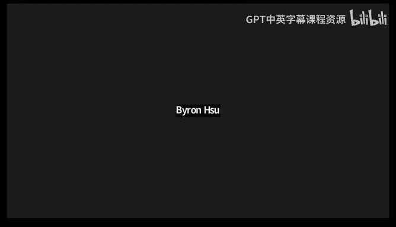

# GPU MODE《CUDA、GPU编程1-53课｜GPU MODE》中英字幕（deepseek-v3.2 - P25：-20240608-Lecture 24_ Scan at the Speed of Light.zh_en - GPT中英字幕课程资源 - BV1QZ421N7pT

Welcome everyone to like another episode of Ka mode。

 I'm super glad we have two returning speakers like Georgie and Jake。

 I believe you're the first returning speakers that were not part of the core Mo team。

 so it's like really a pleasure to have you back。😊。

So last time Georgie and Jake were here to talk to us about their fork of LLMC。

 which was like Carpathy's work and forking it to LLMCPP。

I think that that talk is like was very well received and so like they're back and this time they're going to talk to us about the scan algorithm and how to make it suited light one of the things that makes scan really interesting for machine learning applications is that like it's it's sort of a core foundation of a lot of modern architectures like Mamba So if you're trying to understand like that work I would imagine this would be like an awesome prerequisite that would make like your life significantly easier so yeah so without further ado George you and Jake please take it from here。

😊，Thanks， Mark，'m Georgia going take it to the next slide。So yeah。

 scan is my favorite algorithm like bar none， like no questions asked。

 and that's because it is just one of the singular most powerful algorithms in the realm of parallel computing。

And it's superpower and why it's so awesome is because it takes problems that look like you couldn't do them in parallel like they're inherently sequential or serial and scan just like magic set and turns it into something that you can do in parallel you know this representation here。

 but like it's this idea you have this sequence of things。

 whether it's an array of integers or whatever， and you're doing some sort of operation to reduce those things。

 but instead of it just being reducing all those things to a single value。

 you kind of want all the intermediate state along the way as you go and so I that talked about these this awesome algorithm and we could have 20 lectures about this algorithm because it's so cool。

😊，And so， you know， for。More deep dive and kind of into the background。You know。

 go back and watch Iat's talk and we're really going to focus on today basically taking those foundations and say。

 okay， now how do we take scan and do it literally as fast as possible on the GPU？And。😊。

What we're going to introduce today if you're not familiar with it is this concept of speed oflight analysis whenever you're doing performance like this is how internally in VIdia you're going to hear people say speed Allight or SOL all the time because this is how how we think about things。

And so it's a really important foundational concept when you're doing any kind of performance。

Sensitive stuff to think about speedlight and how close you are to that。And so today on GPUs。

 the fastest way to do scan is with a decouple look back algorithm。

 so we're going to tell you about that。And like I said。

 making scan is as fast as physically possible， and not only are we going to tell you how to implement this。

 but also we're going to show you that you don't need to implement it。

 that we already have given you all these different foundational tools that if you need scan or building blocks to do some kind of custom scan stuff。

 but we've got stuff for you in the KUA Co libraries。Next slide。And so very quickly。Mark。

 referred to our previous talk where we talked about this a bit more in depth。

 and so I'm going to go over this quite quickly， but the Ka core computeute libraries or CCL is a collection of a few different open source。

😊，C++ libraries are GitHub repositories on the bottom there。

 but they're also available as part of just the Kudter toolkit by default。😊，And today。

 we're really going to focus in on the cub part of CC that provides these lower level。😊。

GPU parallel algorithm， building blocks。Your next slide。

I also showed you this slide last time that kind of shows you this spectrum of different tools from higher level to lower level and how productive they are versus how much control they give you and you know we have things at all these different points on the spectrum。

 but today advance to the next slide we're going to focus on the scan parts here and so in cuB。

 we have device scan block scan Warp scan and decouple lookback abstractions these things are used to also implement thrust inclusive scan and exclusive scan and so one of the points we really want to drive home here is that while everyone here should definitely learn how to implement parallel scan。

 it's just like a fantastic exercise and Ga and parallel computing in general。

 but when you need this in like production code。You want to be using one of these abstractions from CCCCL that you aren't wanting to implement these things yourselves because it。

 as we're about to see， can be quite challenging to get it exactly right and go as fast as possible。

嗯。😊，And plus， I can say with 100% confidence that our scan in CCclL and CUB is the fastest you can go with 100% certainty。

 I can tell you that you cannot implement scan faster than what we have。

And that that isn't a challenge to goad someone into trying to do so。 I was gonna say。

 like would this also be true for consumer GPs because we might want to throw the gotlets here absolutely。

 if you can make it faster。 I mean， there may be GPS。

 we haven't tuned it to as extensively as others。 but that's a problem that can be solvable easily enough。

 And so I want to I made that claim quite confidently。

 And I want to provide justification for why I can say that so confidently and to do that。

 I'm going to hand it off to Georgie who is going to introduce you to this concept of speed of light performance analysis and really walk you through the gory details to the point where you will。

 I think， believe me when I say you cannot go faster than what we have here。 So Georgie take it away。

😊，So we actually already have our first question， Gegie before you even started talking。

 which is like， does it like XLA automatically make scan fast， so maybe just like， yeah。Yeah。

 so there's no magic here and that's true of pretty much anything in the core libraries like we believe in making things easy and convenient。

 but we don't believe in magic。And so we provide you know an algorithm that you give it the inputs and there's。

 you know， whether it's scan or reduce or whatever algorithm， it just。

 it does what it says on the tin right， like it does a device scan and it does it in parallel with your inputs and to your outputs and there's no like fancy compiler trying to do magic for you。

Okay， so today I'll be talking about various code implementation of brieffi exam。

And to compare performance of this implementation， so we need some metric and one of the frequently used metrics for performance comparison is speed up。

But speedup is rarely the right metric because it doesn't tell you how fast a given algorithm should perform。

For instance， on the slide， you can see two kels， both kels copy a gigabyte of data。

And first kernel performs a copy using a single thread whereas the second kernel copies dated by a thread block。

And naturally， the second card is almost 200 times faster than the first one。

The first reaction to this speedup is that we should be using the second car。But in practice。

 the second kernel only reaches 3% of the peak bandwidth。

So both kernels are equally inefficient and at an video we use。Rarely use speed up。Instead。

 we tend to identify the theoretical big performance limit for given aism。

We call this statistical limit speed of flight。Then we can evaluate a given algorithm by looking what percentage of speed of flight it achieves。

This is convenient in many ways， for instance， now we don't need another algorithm to understand if our code is fast。

Understandending how close a given code to speed of flight is sufficient。Besides that。

 speed of light tells us when to stop optimizing the code。

Just like in the example I mentioned the 200 x speed up suggests that we can stop optimizing。

 but when we look at 2% speed of light， reaction is quite opposite。

And to showcase speed of flight analysis on a concrete example。

 let's try to figure out speed of flight for scan。And to estimate this bit of flight for scan。

 we have to understand if algorithm is computed or memory bond。

One of the metrics that can help us do that is arithmetic intensity。

That is that we divide the number of arithmetic operations by the number of bys。

 we have to load them start to memory。Here， for instance， first code performs only arithmetic。

 only one arithmetic operation。It adds two flows in point values。One of the values is in memory。

 so we load it and then store the result back。This gives us two memory operations。

 one read one write of four bytes。Second code performs the same number of arithmetic cap。

 but holdss one extra float。So the arithmetic intensity is lower。

We can then plot performance as a function of arithmetic intensity。

This plot is going to be bound by two limits。First limit is the peak compute that a given GPU can achieve。

Second limit is the big memory bandwidth。The point where two limits meet separates memory bond algorithms from the compute bond bonds。

For instance， copy algorithmon will be on the left side of the spectrum because it doesn't do anyritic。

On the right side， you can find matrix multiplication because it performs much more compute perbyte。

And arithmetic intensity for brieffix sum is much closer to a copy than a matrix multiplication。

In fact， on a6008， we need about 200 x more arithmetic operations per each element to put prefix sum into compute bond category。

Now， this information allows us to ignore the compute part of prefix sum when analyzing speed of light。

So now we can analyze can early from the memory perspective。First。Scan must read each input element。

This gives us end memory operations。D scan must write an element back to memory。

This overall gives us a lower limit of two and memory operations。

So speed of flight or prefi sum should essentially match the performance of Mem copypy。

Now let's try to analyze various scan implementation from this。Yeah。

 so I already see a few interesting questions in chat so Byron is asking like。

He's asking about like how does the scan implementation work in Pythr today。

 like does it like use like leverage a lot of these parallelless scan ideas？I think it's using CO。

I believe so as well。If not cubbb， then thrust。I also had a question that's like maybe more related to the previous slide actually whether there's another question this estimate is for scanned from DRA right you'd have if you have data in L2 you'd be much better。

Sure， we analyzed this from the perspective have clear cache。Or if you can imagine a large input。

 for instance， you have。20 gigabytes just can in this case Lc is much lower lower so you can't feed the whole input and like a presence of date and cache doesn't matter it'll be like evicted soon。

I see。So do you mind to going in the previous slide for a sec， the one before， maybe two before。

 it was the one where you were showing the the speed Yeah， this one。

 So this one's maybe this is more of a cultural question not a technical one。

 but I was curious because like I've often seen， especially like as working on performance at like you see people sort of saying I made something 10% faster versus I made something 300 x faster。

 And usually I sort of just shrug my shoulders I'm like okay faster is good。

 I'm wondering like like the sort of nviDdia performance culture。

 like do people just generally expect that you provide speed of lights。

 And like is this sort of like the way performance is basically performance。😊。

Is measured internally for promotions and stuff。Yeah exactly so we'll look at problems from the speed of flight perspective exactly for this purpose like kermo on the right is like 200 x faster like how can how fast can it be and 200 x is a lot of speed up but both are terrible so like。

へい。😊，Is that speed up is not sufficient to understand how far are you from the ideal limit that you're trying to achieve。

SoThank you， yeah， I can let you could go back to the slides。Sure。So okay。

 now let's try analyzing various scan implementation from the speed of flight perspective。

In our performs close to speed of light， it means it's optimal right our work is done if algorithm is far from speed of light。

 it means we are missing something。Anyways， let's consider three algorithms。Reuced and scan。

 hierarchical and string and this algorithms were covered in previous could Mo talk so I won't spend your time explaining them today。

 but it might be helpful to recap some of the key properties of this algorithms。

So reducedance scan performs C and memory operations。

This extra memory operation means that algorithmutism can achieve more than 66% speed of flight。

The other side， you can see that this statistical limit is quite close to the achieved throughput。

 so our prediction is correct and we can proceed it to the next algorithm。Okay。

 let's move on to Ked K scan。This algorithm Marines and writes data to ice。

 which leads to four and memory excesses。Following this logic。

 this algorithm can' achieve better than 50% speed of flight。As you can see。

The prediction is quite close again， so let's carry on。And the last algorithm is stream。

But something is wrong here， right， the algorithmism performs only two memory exercises。

It should be faster than both reduced and scanned and hierarchical。

But we see that it can't even achieve 1% speed of light， so let's figure out why。

As Eza explained in the previous talk， streamre serializes all threadbs。

This utilization happens because each thread block waits for a previous block to produce inclusive aggregate。

Let's try to come up with a speed of light model for this algorithm。

Talking about overall memory movements， stream is optimal because it only loads and storess data onces。

 but unlike previous algorithmgas， this that we discussed stream is performance。

But stream performance is not bound by memory bandwidth， it's bound by memory latency。

Let me clarify at this point， we know that Tbook A will store inclusive prefix into memory。

We also know that Tb B will wait for that story。The number of cycles it takes between Bo B storing something and block B absorbserving this is called message passing latency。

I choose some random number， let's say， message passing takes 500 cycles。

Knowing the message passing latency and the GPU frequency， we convert clocks intoconds。

Because all threadb are serialized， we can now compute how many message passings can happen each second。

Now when we have message passing throughput， we can turn this into bandwidth。

We know that a given block loads a tile and then stores back into global memory。

 so we have two tile bytes divided by latency。This leads to about 2% big bandwidth that this algorithm can achieve in theory。

The throughput is so low because GPUs are not optimized for latency。

 they are optimized for throughput。But what I want to bring your attention to is the gap between expected and achieved throughput。

For other algorithms， we were quite close to the theoretical limit， but not in this case。

 so what's wrong is very flow in speed of light model or something is wrong with the implementation。

Let's take a look。So Gegie before you start I had a quick question about like basically how to produce this just because like presumably because like speed of light like this is not something like a profiler will really help you produce this like really requires that one you understand like the algorithmic properties of your model like you're like writing some math formulas and thinking things through so how do you not delude yourself just because like a piece of paper won't tell you that you're wrong so I'm curious how you go about this Yeah that's an iterative process right at this stage where like let's build our intention about this model like it seems reasonable right but now its very fine we see this get so our prediction is much higher than our actual code。

So let's see。Through code changes like like code is wrong or mod is wrong。

 it's like we're trying to do that。Right now。Interesting， okay， got it。And I want to add something。

 Okay， I was just gonna to say like there isn't， and I saw the question about does speed of life analysis use some math to calculate the performance under the hood。

 There's no fancy math here。 really what you're looking at。

 you it's really a two stage dishes in process。 You look at your algorithm， you decide。😊。

Am I memory bound， Am I compute bound， Okay， if I'm memory bound， then I go to the white paper。

 I look up， Okay， what is the max bandwidth here and then。

Am I achieving that or what fraction of that I achieving alternatively I have a compute bound it's like okay what is the max throughput in flops and then I look at okay what am I achieving and so like the math is quite quite simple it's really like speed of light analysis is napkin math like it's very like pretty high level and quick and dirty and so there's really no magic to it really it's just compute bound memory bound okay。

Memory bandwidth。Compute throughput。 That's the the first order approximation。

And to add to that there is one more term usually in this space used is called roofline analysis for a given algorithm to and if you go and look into many supercomputing papers historically they would start for a given algorithm to understand hey。

 what is the roof line analysis， how does it scale。

 how does it go up when it change the component and how do you actually move towards a roof line numbers that you can hit？

So there are many ways to do it， so I think recommending checking on roof fund analysis scripts would actually be the good start。

And PMP also has this。Yeah， let's carry on。Let's focus on the message person part of stream。

So there's more questions actually I think people people seem very engaged so basically so Eric is asking like where do I actually look up the max bandwidth for GPUs that are not in the top model so for example he's saying that he can find basically like on public sheets that like he can see he can know what the max bandwidth is for 4090 but not for a 40 4070 or for 4060 so how can you sort of I guess measure this or yeah。

I think there are two ways first is like trying to find a product release page of video sites that would say like here's a100。

 here's the pig bandwidth。And you take that。 But if this is not available。

 it's always a good recommendation to try and run stream benchmark on your machine whenever youre like stream is a。

Industry standards for measuring achievable bandwidth。I hope this answered the question。Like sorry。

 you mean literally this the stream algorithm that you're covering right now is what you use for that's why the overloaded term yeah。

This is why stream is not the best name for this algorithm in many papers it's actually called chain skin。

So。By stream， it's also a conventional term for a benchmark that streams data from one memory location into another memory location。

So it's like a known benchmark in HpC area， it's called string。

It's basically doing a copy V Xta a and something else and shows you the performance of this。

Got it And so like I guess if people are interested in running some of these scripts like on their like local because because I think especially for consumer GPUs。

 like the CPUs might be very different and maybe people's pair characteristics will be different I guess like question either Jake or Ge is like is there any sort of like set of scripts that you recommend people take a look to sort of know all these numbers for their GPUs quite easily is there like perhaps a repo the aggregates like some of this dataspo and org that you can find that。

Does stream on Kuda， so like it shows you bandwidth like right way it compute bandwidth on your GPU。

Cool， yeah， I think I myself and probably a lot of other people in chat probably appreciate a link after this so yeah。

Any other questions on this point no， no， just keep going like I think all I'm probably going to keep interrupting you so。

It's fine please do so let's focus on the code on the left the stream part is suggested as highlighted。

There's actually a bug in that code， so I'll give you a moment to spot it。Okay。

 so there is actually no memory fence between atomic ads and volatile read of scanvalue。

And both atomic head andvollored are relaxed memory operations。

That means that this can be rewarded by both compiler and hardware。

So this will lead to a situation on the diagram subsequent threat will observe a flag。

 assume that it's safe to read the value， but value was not treated yet。

This means that we will add some random prefix instead of what predecess the thread blog intended to pass。

And to avoid this kind of memory ordering issues， you should be using still atomic instead。

When using K statomic we can clearly state that the flag load has acquiring semantics in this case loading scan value can get showed before loading flag。

 just what we wanted。Now。That the code is functionally sound。

 unless the return to the original question， why is expected throughput so far away from the achieved one？

This is that our speed of light analysis was based on message passing latency。

 but the code is doing much more than that。Let me clarify what I mean。So here。

Here's what code is doing， we start by loging a flag of prettyces thread blog。

Then we issue a memory barrier to ensure memory ordering。

Then we load message of the predecessor thread blog。And then we restore our inclusive aggregate。

Issue in other fence。And finally， update a reflect to let subsequent thread blog know that the message can be consumed。

If you remember， our definition of message passing was a bit different。

We defined latency of message passing as the time it takes between one thread storing something and another thread observing this story。

But here we have two stores， two loads， and two more memory fences。

How can we make our code conform to the definition of message passing？Well。

 we can combine message and flag into a single architectural world。If allgigators say' 3 bits white。

 we can use 64 bits the white type to fit both message and flag。

Let's call this combination of Fl and message atile state。

Now we can simply load pretty as a tile state without memory fences。

Saaving applies to storing the state， there is no need in fences because both message and flag are sort of a single memory operation。

And single architectural word optimization provided about 3x speed up。

 and that leads us much closer to speed of flight。We now reach 1。8% speed of light。

 while our theoretical limit was 2。4。Although we are much closer。

 it seems that the team will room for improvement。But what's limiting our implementation now？

Our kernel consists of four stages we start by loading tile。

 then performing prefix sum message passing， and then finally turning the result back to global memory。

Stores and lots are trivial and message passing is efficient now。

 so the only thing that's left in the manually written blog prefi example。

I'd guess that it's the only part that might be causing inefficiencies。

So we can try and replace it with Cubb canm that will assume to be efficient for now。

Now let's replace mainly written pre example with CAP CAP is one of the core libraries provided with every codeUD compile。

So if you use scooa， cap is available to you out of the box。Now let's dive into a Ctive API CA。

Cooperative API is invoked by multiple threats to collaborate on a single problem。

CapP B scan has to be invoked by all threads of a given threadil block。

Each thread provides a piece of input and gets piece of output。

Let's take a look at a complete example。We'll start with a block load algorithm in general。

 to use CA block scope algorithms， we start by instantiating extract。

Here we provide a type of values were about to load， which is in our case。

Then we specify the thread block size compile time。

All book algorithms provide a member type called T storage。

And we use this type delegategate shared memory that threads will use for communication。

Once we have load object， we can capitally invoke it。

Not that every trial provides the same points but loads of different values。

Let's take a look at what happens when we have multiple thread blockss。

Inputt the partitions into tiles and each thread block processes a single tile。

Tal size is the number of items per thread multiplied by the thread block size。

Output of the block load is left in registers。Now that we have input data loaded。

 we can execute inclusive sum。The tile is already a part between threads。

 so we can just pass it to the B scan。After B scan， each thread has part of the result in registers。

Later， we use Bstore to put this result from registers back to global memory。

And overall replacing manual implementation of load。

 scan and store with cap co algorithms get us better performance。

Now we are much close to speed of flight for string algorithmm。But can we do any better？

To answerwer this question， let's return to the speed of light model we built for stream。

If you take a look at the throughput computation， you'll see that tile size is in the numer rate of the ratio。

This means that increasing tail size should increase throughput。We used one item per so far。

And that got a 3% theoretical peak， but if we increase the items per thread to 23。

 we should be getting 49% through it。23 is not a magical number。

 I'll explain why we selected it later， but regardless。

 let's try to build some intuition for wide increasing dial size increases throughput。

Let me bring your attention to the diagram on the right。After loadging input。

 we have to wait before message propagates through the memory subsystem。

Instead of just waiting for message to propagate， we can as well load more data。

There's still enough time left， so loading extra items is basically free。

Let's see a benchmark verifiedified our intention。Since CAB API is parameterized on the number of items per thread。

 we can change a single line of code to affect tile size。

Here I increase the tile size to have 23 items per trial。

I don't have to implement any of the algorithms since it's the only change I've made。

Overall it gives us 1% throughput， which is a huge improvement compared to 2% we used to have。

 but still new theoretical limit is 49， why we so far。Let's try to figure out。

Let's consider the memory excesses across thread of a thread block。Bload is very simple。

 all it does is loading data at the strip。This means that threat reads data 23 elements apart。

Memory is loaded at the granularular of sectors， which is 32 bytes。

 but in our case each thread is data that's 92 bytes pass。In other words。

 none of the sector bytes are reused and each warp is load in 32 sectors。

This means that we allow 10 times more data than we need， and this is inefficient。

Can provides your way to get rid of this traded loads。

 we can tell cup to lower data in coalesced manner and then transpose it to restore the original order。

Coalesce laws are going to be more efficient。The only issue is that transposition requires a lot of sharedd memory。

Anyways， let's take a look at our performance now。Okay， good so with only till length change。

 we got up to 40 to 3% throughput。We've got about4 x speed up。

 which brings us much closer to the theoretical throughput limit of 49%。So the schemeboard， right。

 like we can just keep increasing the tile size and it will reach speed of flight， right？Not really。

 so let's see what happens when with our kernel， when we keep increasing the tile size。On the right。

 you can see two graphs。One shows how shared memory size depends on the items per thread for a fixed block size。

As you can see， using 24 items per thread， get us out of the architecture independent shared memory limit of 48 kilobytes。

That means that some GPUs will not be able to provide enough sharedd memory。

Let's say you target a specific GP and can go beyond 48 kilobytes limit。In this case。

 we can use 24 is per thread， but if we go any further， the occupancy drops to zero。

That means that a can't fit even a single thread block。In other words。

 this is as far as we can get with this serialization。To get higher throughput。

 we need to get rid of the sterilization。So let's try to build that。

One of the ways to work around the serialization is called the couplet look bag。

And to explain the catalog back， let's compare it with the stream。In stream。

 each thread block waits for the predecessedor thread block to produce inclusive results。

The cable look bag， on the other hand， weigh for partial results of predecessor thread box and then combines them locally。

Let's see how this helps us get away from being latency bound。On this slide。

 you can find a more detailed comparison。The stream case， block two waits for block one。

The update of T state from block one becomes visible to block two after message passing latency。

At this point， Booklocker updates the style state， and this update becomes visible to block three after the same message passing latency。

Con trustrust this with the code lookbe。Here， block three read states of block2 and block one at the same time。

Block3 combines inclusive aggregate from block one with partial aggregategi from block3。

 which gives block3 inclusive prefix。To make this process a bit easier to understand。

 let's go through the cut back step by step。Here we start with three thread blockss。

Each thread block adds style reduction to aulating。

Then block one and block three store their entire states to global memory。

Block  three then reads style state of block  two， but B  two hasn't updated the global city yet。

So block theory is and valid data。No book to manage to update Ta state。

And read style state of Lo one。Now block three finally pulls valid state for block two and adds it to its accumulator。

And here we reach a very important point。As B two was writing its inclusive result into global memory。

 block three already pulled inclusive results from block one and combined it with its accumulator。

This means that block three got inclusive prefix at the same time as block 2 stored it。

 so propagation of inclusive prefix is not serialized， it's decoupled。

One thing I haven't mentioned this is that instead of loadging a single tile state at a time。

 we actually load 32 tile states。We call this a lu big window。

The motivation is that we read a sex a granularity anyways。

 so we can get more tile states at the price of loading a single tile。

The downside of this approach is caused by significant overlap in lookback windows of consecutive blocks。

This overlap leads to each memory location being read by about3 two cities at a time。

This creates a lot of contention in the memory subsystem。So we need some sort of back off mechanism。

In charges， this contention cap implements various backup mechanisms in the polling group。

Simplest backup off scheme is just having a fixed delay。

We can also try exponential increasing literallyly each time we load in very tail state。

But which approach should we use？What are the optimal delays？Without any， it's hard to tell。

So we extensively tuned cap on various workloads and GPs to select the best backup mechanism for each use case。

Good news is that we spend a lot of time thinking about this， so we don't have to。

CEx poses decd look back， so all three aspects of selecting the look back window， delay scheme， etc。

 are hidden behind a high level abstractstruction。Let's take a closer look at the couple look back。

We start by constructing a tile prex separation。One of the first things that abstracts it out is the tile index computation。

As you may know， COta doesn't give you any guarantees on the order of launching third blocks。

Financial way to get runtime order threadbox is using aomicca。

Citalize on certain undefined behaviors， so providing you with a tile index computation that outperforms atomicomic ahead。

Now first style doesn't have to look back， so it can immediately set inclusive state。

Subsequent tiles invoke prefits skull appear cooply by the first all。

This operatorjo the exclusive prefix， meaning that it doesn't incorporate aggregate of the current block。

Let's take a look at how the cup plug bag affected performance。

Here's the performance of the final caramel。All we did was replacing chainca part with the cup of plug bag。

Will this change？Finally managed to achieve 86% bandwidth。

 which is about twice as fast as our best take on stream。If you now compare our solution with CAP。

 you'll see that CA is still faster， but why is that？

The only difference with cloud device scan is that we extensivetenate unit it。On this slide。

 you can see a typical search space in which we search optimal2 parameters。

There are multiple ways to load data， multiple cache modifiers， you have to try。

 let load items per thread， thread box sizes， etc。Overall。

 search space for scan is about 2 billion variants per data type per GPU。

Real play optimizations I'm sorry this is a pretty crazy picture like like you mind just helping us read it a bit like like what are the colors what are you the color is speed up here and you see compute variant going through different in terms right like you can have one thing variant that。

Coses to transpose input and then apply some cachehemanifier like streaming or L DG， etc。

Then we select concrete items per thread thread book size。

 and overall it's like a selection between multiple xs， right？

So each line is different tuning variant。Delating to a different speedup on the right。

Oh we're all of that。There should be two billion lengths of that clause。But as you can imagine。

 it's not reasonableson to exhaust the full search space。

 so we apply some optimizations to find optimal tin parameters。IGot it， thank you。嗯。😊，Okay。

 so on this slide， you can see how CA compare to various algorithms covered in today's talk。

 we get about 90%。Bandth， which is practical limit to reach by our algorithms。

 overall all the efforts were put into car algorithms lead to speed of light performance on various data types and GPUs。

So I'm confident you can't get any faster than CA。I hope we managed to illustrate advantages of the speed of flight approach to performance analysis。

The Spterf。Use it， use speed offly to discover algorithm bottlenecks and optimization opportunities。

Sppi off also helps understand when to stop optimizing your code。

But if there was a single takeaway for today's talk， it'd be the following。

Iplement fundamental algorithms， it's a good practice。

Because it helps you build intentions about GPU programming。

 but as soon as you need a fundamental algorithm in production code。

 you should be using core libraries。And if for any reason our abstractions do not work for you。

 please let us know you can always file an issue on GiHub or reach out to our Discco channel。

So that's all we want to share today。Sweet， thank you so much， Reggie， thank you so much， Jake。

And okay Drexel is saying and video stock still room to go up so I think this is this is good yeah let me I mean I go over questions and chat let's see。

I guess like Viram， maybe I'll put you on the spot you're mentioning that you're mentioning like a paper that you thought might be helpful like like is there sort of like any core things you think people should get out of reading that paper George and Jake。

 I referred Dways Merriill's decoup lookback algorithm paper you want to comment。Sure sure。

 so paper goes into more details， more thorough performance comparison。

 so it doesn't hurt to read it。Yeah， so Dne Meill is part of Em research and he is one of the persons who developed the decouple look back scan algorithm back in 2016 that you're learning today。

 so it actually gives you like the intuition behind how to create a period bonusness for scan algorithm and what are the limitation of the regular stream based scan algorithm。

It's the paper is a bit more complex， but I think what Georgie and Jake has done is fantastic job on making it very simple to understand so going I mean if you want to go really。

 really deep into the algorithm， the bones and other things then I think I really recommend reading that paper。

😊，Read。I think one thing to point out too that has kind of advanced since that paper is that Dwayane and Michael's original paper it didn't talk about any of the backoff stuff like the original decoup look back didn't have back off and that's actually a new thing that Georgie discovered actually on latest architectures that L2 latency has it decreased and so it increased the importance of having that back off and so if you read that and are asking where's the backoff part it's not there。

 that's a newer addition。So I had another question regarding the parameter search like I saw。Jake。

 you were saying this is using some genetic algorithm magic。

 I guess like maybe the the my Uber level question is like for a lot of like。

I guess like when it comes to any sort of like basically hyperparameter tuning like there's certainly always a lot i'm seeing people do like grid searches I see some people use like probabilistic methods to sample you're mentioning a genetic algorithm is there sort of like a general consensus on how this stuff should be done within NVDdia or is it also basically different people have different opinions sort of thing I can answer this so so we're using a tool that's an internal tool today that does like you said this hyperparameter search space for usually for like performance optimization kinds of things but it's it's more general than that that's currently a proprietary internal tool we are working on getting them to open source or at least release it externally but。

Yeah， it's， it's a great tool。 I'm sure people have plenty。 People always have opinions on。

 on the best way to do things。 But this tool。😊，Is increasingly popularly used in internally。

 and yet it does some genetic algorithm search base to try and find。You know。

 local optimals in this hyperparameter tuning space。

So Drexel is asking do you even do this kind of search on consumer cards as well， Yes， interesting。

 yes， we do。Okay， and I see Eric asking， okay， Dral responding bo so it' cool So so Eric is asking。

 so even though the extensive tuning， isn't there admittedly a small variation that depends on example how well the cooling works for specific GPU or the temperature mostly affect just compute not memory so wouldn't matter here。

😊，So yeah， when we say， you know， you can't go any faster。

 like within the domain of like plus or minus one to 2% right like there are our hardware like hardware differences。

 thermal differences that can account for you know。

 things that we would normally just kind of consider more or less noise。

 one thing that will' point out though， is that。The the methods and statistical methods we use to。

Compare， you know， is this set of tuning parameters faster than this suit of tuning parameters kind of are statistically robust to many forms of that noise that even if two GPUs like are thermally throttled。

 like we're doing many， many collections of samples and really looking at the full distribution of times that like we might collect a thousand samples for a given set of tuning parameters。

And really look at the distribution of those things because it may be multimodal。

 Like performance data is never just a normal bell graph。 like never， ever。

 like we could do a whole talk on， just， on just that point。 So， you know。

 if you're using just averages and standard deviation for performance stuff。

 we could probably do a separate talk just on why you shouldn't do that。 But yeah， like。

 it's impossible to be 100% perfect because of the just physical laws of the universe and entropy on this。

 But like， we， I think do as much as。Statistics basically allows to make sure that we can be confident in the answer we come up with at the end of the day。

you want to add anything to that？No I think it's answer。I guess you related to that。

We've had like a lot of people in the discord group， like ask questions about like。

How can I tune this specific model better on my consumer GPU generally the answer。

 like at least like anecdotally like I've noticed that like things like， for example。

 Trident tend to just be significantly faster on a100s and like H100s like like the relative speedups tend to be more substantial the verses on consumer GPUs and so people don't really have a good sense of like what are the things that I should be paying particular attention to if I'm doing performance tuning on consumer GPUs I'm wondering if you sort of like have a good sense of。

I guess think the first things you'd look for when you're optimizing a workload on a 490 versus like A100。

 or the things you'd mostly watch out for outside of the obvious viewM。Yeah， I mean。

 the first order things。Ari like what I was saying at the beginning， right。

You just look at the peak bandwidth and the peak compute and if your problem memory bound。

 you care about the peak bandwidth and if your problem is compute bound。

 you look at the compute throughput and if you need to get fancier than that then。It's hard to speak。

 I guess generally， if you're needing to go layers deeper than just looking at the top level speeds and feeds。

 I Ge， do you have a better answer than that。I'm sorry you missed that question。

I think Mark was just asking like。Is there anything different to look for when you're optimizing performance on consumer GPUs versus like top end data center GPUs？

I think from the perform。Search space exhaustion point of view。

 there is no difference like as soon as you throw an optimization method on。

Searching tunening parameters it's the same thing， but when you are talking about。

Actual code changes， like not tuning， but code changes。

You can obviously use data center specific features right， for instance， H100 will give you clusters。

 but。Can seem a GPU doesn't have classes， so maybe you。

At least should get acquainted with a set of features that production quality TGPU provides you。

And see if those can be applied to your particular。Well close。Great， great。

 so I think it it like the answer is it it depends like when you get past like past the the first level speeds and feeds。

 it's really dependent on like what are you doing， what feed hardware features can you take advantage of and and things like that。

 but but truth be told like。😊，Just the the surface level speeds and feeds like that is good enough for 80% of things。

 I would say like easily just looking at how much data am I moving。How fast am I moving it and。

How does that compare to just what the raw sequential bandwidth would be and if you're getting like 80。

90% of that， then you know your job is basically done。So another question is from Andlo。

 I'll paraphrase it a bit just because like I'll paraphrase it a lot just because like I have a similar question which is like basically like the diversity like the diversity of GPUs makes it very difficult to do any sort of like automated performance benchmarking in C so for example like you know having a 100 s in CI it's like how GPU rich you have to be to do that so like in reos that I work with we use8 andGs which are already quite pricey and then what I end up doing actually and this is unironically do this which is if there's like I know some people in Guamo would have a 4070 or 4060 I'll tell them could you please like run this code and list like post the numbers on this Gitthub issue。

So I'm sort of like wondering， is there like a better way of doing this outside of like potato farming GPs？

Well， I'll give you the bias answerer first。The biased answer is this is a good reason why you should opt to use stuff from CCclL is because we've already done a ton of that work to test on a billion different GPUs because we generally have access to those things。

 but you might be surprised how hard it is for us to get certain GPU sometimes as well so it's not it's not always that much better inside and apart from that which I recognize is a bit of a nonanswer。

Yeah， it's it's hard。 I think it depends on how how wide of a net you want to cast， right。

 like if if you are solving a problem that， you know。

 you want to be as fast for your particular workstation GPU， then it's fine to fit to that。

And if you're building a library that you want tons of people to be able to use on tons of different kinds of GPUs and always be speed of light。

 then there really is no substitute for trying in as many different GPUs as you can。And barring that。

 using libraries or abstractions that have already done that work for you whenever possible， I think。

 would be the。Pragmatic answer， I guess and I'll celebrate to bit some this both so another。

Suggestion would be to all this problem a bit so if you are developing open source projects like CCclL。

 for instance， what we do is we actually open source our tu infrastructure so that if you have a workload or a GPU。

And CL doesn't perform well on that You can just contribute a tuning。

 contribute a new workload you haven't considered and we encourage you to do that。

 So this somewhat addresses the problem that like someone has a unique use case。

 unique hardware combination and。There's an unbeform world though。But that's a point， but so far we。

Like can't receive any of this means meaning that like。Rpe of flights everywhere。

I guess y'all are both like definitely challenging folks in K mode。 So yeah。

 so I will say like if you are if you are optimizing like a workload on consumer GPUs and it's really slow。

 I think it's I think I heard Jake and Georgie volunteer to like help us like optimize those workloads so okay yeah I think do folks have like any other questions like Vikram any final parting notes actually I actually I always a question。

 Peter Peter is asking， I'm interested in GD and I suspect that the benchmarks for that would polarize the GPUs into the ones that are forced use compatibility mode versus the ones that are using GPU direct storage Peter I work actively on GD so can you elaborate more would your question。

😊，I guess while Peter is typing， Eric is saying， I guess the first thing is even just detecting on the user side whether you're too slow。

 example， LMC prints an estimate for an MFU， which I don't think is actually calculated correctly for allGPUs。

 so a user at least can complain about being slow。Yeah。

 like this has certainly resonated with me quite a bit like just we've had small features in Pythtorch like the Fop counter。

 for example， that have been very helpful for people I do suspect we we don't have like enough sort of easy to run tools for generally like how far away from I from like Max Fop versus Max bandwidths So I think it's a good point of role Insight compute is a fantastic tool for this as well and probably would be worth getting someone from from the dev toolsol team who builds that to come to a talk here because Insight compute and Ins systems are awesome tools that should know how to use thanks for reminding I'm going talk to the insights team and bring them on board on this there is sort the same that I say so they should be able to do it absolutely。

Because yeah， just building on that quick because Ins compute is a tool for analyzing the performance of an individual kernel and one of the first things that shows you on the top is like the speed of light thing that we've been talking about it shows you like okay what percentage of the maximum compute throughput am I achieving and what percentage of the maximum bandwidth am I achieving like those are the first two plots that you'll see on the top of an inside compute profile and that's another really good way to be able to go see this as well。

Cause some problems like we we partition the world into like compute bound and memory bound on that graph。

 right， but like and then we kind of。The world is never quite as simple as it seems in slides like we even talked about right that like there's this third class that you know is latency bound that doesn't really quite fit on that particular view of the world and so in certain cases things aren't quite as simple as I was saying about like oh it's just memory bound or compute bound like there are cases where it's kind of a mix or it's latency bound or and so inside compute is a really handy tool for those more complex cases where it's harder to say kind of a priori what you think the speed of light should be these tools can take a lot of that guesswork out of it。

I will say we are big fans of NCU on the group like we started。

 we introduced NCU in like lecture one and pretty much at least every lecture I've covered。

 I've covered NCU so that would be pretty nuaughty but I think like like Eric is making a good point。

 which is that like just kind of like very dumb CI based utilities that take in your Python inference dopi or trained dopi and just like work。

You know， would just like print stuff out the console would be quite helpful。

 I think there's like a tools here and there。 but yeah。

 like maybe just one centralized repo for a lot of these useful utilities。

 Oh so Eric I was saying andC you just does that yeah I think that's right I just it prints a lot of stuff I would say like by default yeah。

I think what you're looking for is a easy readability of the log。

 something that actually wraps around the logs that come out so that it becomes easy to make sense of the data that comes out of it。

So I agree that there are rooms for improvement on some places on how we generate the data and how we represent。

 but also it also varies on each of the person who actually views the data too so there is also a diversity problem on how people want to see the data。

What NCU provides you is a capability to dump it in the required format of your choice with the format options with the CSV or other options and then build custom tools on top of it if you want to don't do either of them you can also use something even more natively like cupT which is an open source library that allows you to insert profiling on your code base at your location of your code that you're running and dump statistical data points from there and generate a viewpoint from that point too so there are many ways of doing the profiling and analyzing across different platforms and I think one of the best part is all of those is available to you。

有。So I kind I saw like Peter answered like your question on GDS。

 do you mind just also answering that it's around laptop GPUs？Maybe I'll read the question。

 if you can put up。 like I'm interested in making laptop GPs and other more entry level GPUs more utilitarian for modeling and simulation。

 but I found that most of them don't have access to GDS。 Yeah， so the problem is not the GD。

 more many of these GP do not have GPU direct。 capability。

 So I think that is a functionality feature。 that is only available in Tesla grade or in the higher end GPU and not on the lower end。

😊，What I recommend is it is not something that any of us have the making decision on this。

 so we won't be able to specifically answer why it is not present in certain class of GPUs and why it is present in certain other class of GPU if it is interesting a request there a request。

That's a classic way to ask hey， this is of our interest， this is a use case。

 this is how it's going to be used， can you make this available on this set of GPUs and when in due course of time it will become available。

😊，So so where would be the right forum for people to sort of lodge complaints around features they'd like to see supported in the consumer use because I imagine maybe the GDS Gitthub repo or something。

 but if there is one I'm not sure， but yeah I'm curious because like I do agree that for a lot of times like maybe there's some stuff that make it to the Pyth forum。

 I personally will complain to Piia Binsky about certain things。

 but you know like if there's sort of like a more formula。

 if there's like a better forum I mean I'd love to hear it。Jake。

 do we have something on this that's a hard answer that's a hard question to answer。Hard to answer。

In a way that I feel will get you actually what you want like I mean the dev zone Nvidia dev zoneone forums is is one place。

And。If you happen to like work at a company or with a group that happens to work with like an NviDdia。

Sasay or like salesperson or like developer relations person like that。

Is a obviously not everyone's going to have the opportunity， but if you do like。

 that is a way that will。Much more likely have its way of making its way to the people who make such decisions as to complain through those channels。

But。Yeah。Those kinds of decisions are many， many levels above any of us here。Yeah。

 so and Peter I want to be very specific to your answer too。

 so I just went over all over the place to give you an answer。

 but I want to be very direct on the GDS side， whether you want to use GDS or not。😊。

I understand that you want to enable GP to access the storage in a fast streamlined fashion。

 but GD is the use case of GDs for that requires a bit more data point。

Because GDS fundamentally addresses only a buffer that you allocate in the CPU setup of this。

 so what happens is that if you are limited by the CPU throughput while moving the data doing copy data from your storage to your CPU memory and from CPU memory to your GPU。

It only addresses by allowing you to copy the data from your storage to GP memory directly so if you don't have anything I mean if you're getting bounded by the CPU memory bandwidth kind of a throughput or CPU core count throughput then those are the cases where you will find beneficial of using a GDS even otherwise even if you do not use JDS you can actually create a fancy memory allocator that basically allows you to do the migration between your SSD your CPU memory and the GP memory and do overlap computation really efficiently and this will be a bit more engineering effort it' is not automatic but hey respond to。

Yeah， I suspect a lot of these like because I have heard similar asks like as far as like making CPU offloading like a bit faster and so they like the use case is like you know you don't have enough VRA but you can't easily plug in another GPU because your PSU doesn't support it and well yada and you want to just like efficiently like offload stuff but like offloading is quite slow so people I think are pretty curious about ways of making it not slow at least like within the GPU poor communities。

All right I guess that might be like a good time to end Jake Georgie thank you as always。

 as was a wonderful talk I really enjoyed it I learned a lot Vikram thank you so much for the helpful comments I do agree that like a natural follow up lecture might be something more around profiling we've had many profiling focused talks in the past and I've gotten private feedback multiple times that those were people's favorites。

😊，So that just sounds wonderful thank you so much everyone Yeah I think Mark I would require to schedule two sessions one dedicated for NCU and another dedicated for inside systems。

😊。

And I believe I would hope that they will also cover how to do it on your core base by NT X markers and whatnot。

 so I'll talk to them is there are tons of techniques that you can do on performing。

Sounds wonderful to me， thank you Vikram and thanks everyone to see everyone soon， goodbye。Re back。

