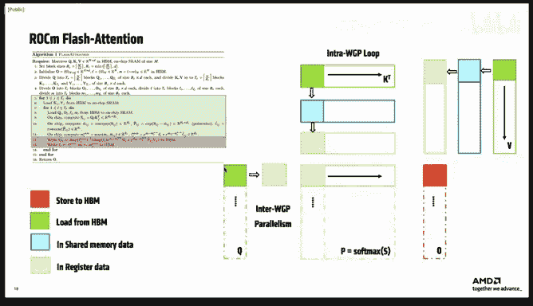
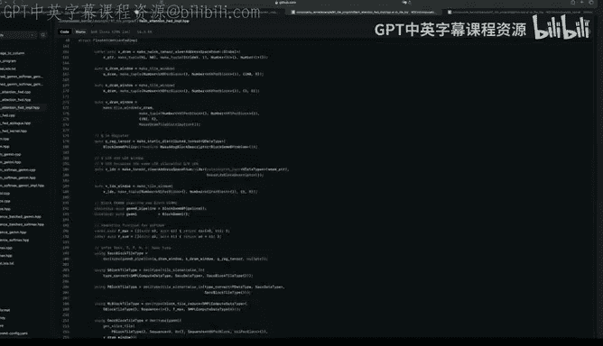
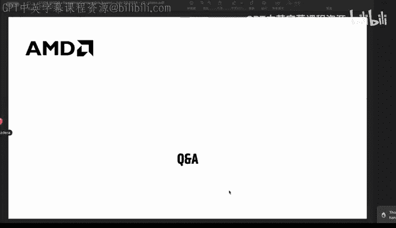
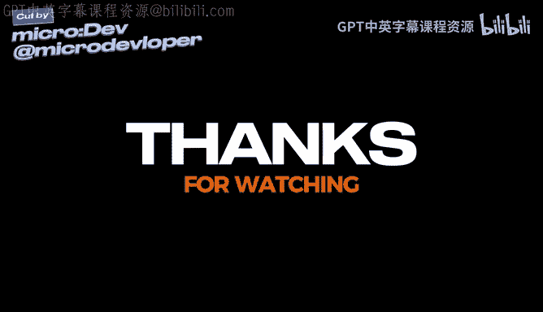

# GPU MODE《CUDA、GPU编程1-53课｜GPU MODE》中英字幕（deepseek-v3.2 - P26：-20240721-Lecture 25_ Speaking Composable Kernel (CK).zh_en - GPT中英字幕课程资源 - BV1QZ421N7pT

Yeah hi welcome everyone to this new episode of Kuda mode I' am super happy to have somebody here from AMD who is like really like deep into the technology yeah's for me's super an honor to have somebody if MD here we had like so much of course from NviDdia and also of course I love to use NVDdia technology but'm also like very curious to learn about other GPU vendors and that technology because I think our Quda mode is not only although we have like Qa and the name。

 it's actually more about really learning about a programming in general and not only selected one like the dominating vendor we want to know to learn also what everybody else is doing and also like AMD is because one of the very promising like the strong competitors of NVD so yeah maybe we learn today a little bit about rockham and composeossable kernel technology so it's great to see that a couple of people are joining here even though we are。

Elier than normal， this is like mainly due to the time zone in which today's speaker is in so today we are live basically from Shanghai from China and this is yeah also a first time for us be great so we will be probably have the session for one hour but then I'm happy to hand over to you now and yeah。

😊，So please take over thanks Andrew and good morning afternoon or evening everyone。

 Thank you for joining us today。 My name is Hao Chong Wang。

 and I'm representing the Comostable kernel team at AMD to give tech talk about Roane about Comosable kernel we have today we AM did for AI workload and I'm excited to talk talking about the groundbreaking programming paradigm for AI Tensor operators the combosable kernel and at very first。

 I want to thanks for the Chao Liu， who is the original developer of the compostable kernel He gave me a lot of help to make this presentation and a lot of suggestions talking with me。

Ofline about the history of compostable kernels so let's start so in the first part I will talk about the why the HP utilization is challenging and then introduce our combostable kernel library and then talking something about kernel customizations use combostable kernel。

The last section， I will go through a real code implemented by Com kernel。

 which is a flash attention used a lot in today's L air Ms。

So before diving into the details ofs kernel， I would call it the CK in the following sections let's start with some basic knowledge of Rocom。

 the Rocom or the Read open computer platform is AMD's open source software platform for high performance computing。

It provides a robust foundation for advanced computing applications， including machine learning and。

Some Air close， the key feature of Rocom is open source Rocom is built in an open source philosophy。

 providing developers with the tools and flexibility to innovate freely。

 and it has both the performance and scalability with Rocom developers can achieve high performance and scalability across a wide range of applications。

And the Rocoms architecture is designed to maximize the performance and efficiency。

 making it an ideal platform for developing and deploying AI applications。

 it supports different GPU architectures， even CPU programming。

And advanced optimization techniques allows developers to fully leverage the capacities of M hardwares。

When you say multiple GPU platforms is it or architectures。

 is this like mainly is it only limited to AMD or also others？呃。

They I think is only limited to AMD hardwares here。Okay， thank you。clarifyAnd it's a let's。

 let's go to the first Our formal section is high GP P utilization is challenging。

 The figure showing here is our latest architecture figure of M M I3 M I 300 M I 300 series。

You can find it in our open source spec it's a little bit complicated for everyone I think even even me I didn't know the every unit on these figures and basically it's the why it's so difficult to program a high efficiency GPU kernel。

We need to map in custom AI workloads for high GP utilization in our real workload。

But because of following three reasons， it's kind of difficult to program efficiency and with high developer productivity。

 So the first is the complexity of the GPU programming models。It has a complicated memory hierarchy。

 We have global memory， shared memory， registered files， and we have multiple level of caches。

And also， we have multiple types of computer units。 We have vector AU， the DPP。

 which allow to do some computation among different threads。

 and we have matrix core the parity of tensor core in M GPU。And except this。

 we have a very rapid iteration of hardwares。Makes the above makes the above point even harder for ordinary users。

To making it difficult to fully utilize the GPs performance。And the second is the AI workload。

 Today is highly customizable algorithms。Like five years ago。

 we have con neural networks dominate the most of AI workload。And it's had， it's high dimensional。

 irregular image size and complicated mapping。And today。

 the attention kernel is one of the most popular one in the large language models。It's a fu kernel。

 including multiple operations。And we not sure in the future。

 the repeat development of machine learning。Will lead to a surge in customized demands。

And with all of that， we developers need need a tool that is suitable for repeat development。

 while also delivering eye performance on GPUus。To save our time and save our money。

So curiousiously may I have one question regarding this is it so if I compile basically can I directly compile from like or different kinds of architectures or is it like form N video for example。

 I know that you to specify the target architectures。

 is it this similar here also if I built like kernelll's for IMD？Was it automatically。 So so what。

 what is like， I guess there are So like some functions which are only available， of course。

 like for the latest generation of hardware and then you。Yeah， yes。

 So Li the hardware we here we we are talking about is minute about AM M Ds side like am I in am I 100。

 am I 200 and today is am I 300 and several days ago。 Lisa announced the am I 3，25 and 3，50。

 I think so the it of hardware is like。Wang Ye， each year， I will， we will deliver a new hardware。

 as well as an media side。 So in every year， the architecturely will will， will evolution and。

So there， there's something really matters to performance may change。Yeah， so they。

 this make the GP programming kind of difficult to achieve high。Utilizations， yeah。Yeah。

 so but as I understand， if I understand correctly。

 basically you abstract this away as much as possible。

 so for the like developer most of the time they don't have to be aware of this and can they directly compile and will also like benefit from future。

Yeah， yeah， we， we， we want to hide all this kind of hardware complexity。In our kernel libraries。

So it's a good， good point to move into the next section。 as Andrew just said。

 the GPU programming is difficult and the hardware it is very rapid。

 So how do we tackle these kind of problems。So here here is a combusible kernel。

This figure is is showing the the the first page read me of the Gi comp kernel Github page。

Is talking about the the software code architecture of the comp kernel。Basically。

 we have four levels of code。The client A and the kernels and invos。 And。

 And the next is templated kernels and invos。 And finally， is some basic tile operators。It can。

 It could be used for different users and experts who working in the machine learning industry and。

Like in in the right side， we have a the first three level is programmable for machine learning system experts and the last three level was programmable for machine learning kernel experts。

So every everyone who interested in AI could fund their usage and to boost their productivity with the compose kernel。

And I also want to talk a little bit about the history of compostable kernels。

The development of composite kernel began in 22018， 2018 to address several challenges。At the first。

 at the first time， the compose kernel is a feature of am I open If you don't know。

 am I open is something like parity of the coding N is a library for conversion kernels。

So composeive kernel libraries also first want to address the problem happened in the evolution kernels because at that time evolution kernel dominates the AI workload。

So the first problem is that the kernels in Ya Open were were written using open sale and MDs monolithic kernel approach。

It's it it making it making re and optimization is difficult。

And the second one is that attempts to perform kernel fusion like a generalizable approach。

But the kernel fusion is like we want tofuse several different AI operators into one single kernels to reduce the like HBM access or the kernel launch latency。

And the third point is that at 2018， the upcoming MI 100 is MDD's generation first generation Tensor core。

Had not yet incorporated tenor core algorithms。So with with all of the problems and some very clever very insight from the original developers。

呃。About the AI workflow is that the mathematical mathematical expressions of AI workloads are relatively simple。

And with parallel patterns that can be summarized as dot product reduction。

Element wise operations and format transform format transformation。

The core of GP optimization lies in optimizing data movement。

Implying that problems and optimization methods can be generalized。

And the second point is that tofuse two large operations。

 each must first be broken into smaller operations。For example。

 different variations of the con operation discussed bomb。

 as well as the variety ofs algorithms that may be used to implement then make it difficult to develop efficient kernels。

One solution to solve this complexity is to break down these operations into reuse。

Reusable modules that can be universally used by different implementation of different algorithms。

And express a kernel as a composition of these modules。

 So this is where the naming from the compose of kernel。

And the third point to that is that many seemingly independent problems， such as Con and Gen。

 can be unified through data re， which is a classical algorithm called imagine image to column yeah。

And at two I remember that one Yeah， yeah， that it allows you to include a metrics multiplication from like basically convert the con the convolution operation into the metrics multiplication。

 right Yeah。 Yes， yes that's it。😊，And at 20 2022， after struggling for some time to determine the right direction。

The emergence of meters， a framework called air template， provided ca。

Air template work close working closely with compos kernel。

And it highlighted the importance of gym based fusion。

Including attention mechanisms and the necessary necessary to closely align with framework requirements for performance。

Which is the critical kernel customization。And this LED to the creation of two fundamental pillars of the compostable kernel。

That is。呃。Okay， the the air programming and coordinate transformation。

So this is the history I get from Chao， who is the creator of the Com kernel。And。

Let's talk about the design philosophies of the comp kernel。So first at the core。

 is a programming paradigm for performance， productivity and port。

It should be systematic and self sufficient support all tensor operators express all optimization techniques and abstract all hardwares of AMD。

So that means a self sufficient means that almost Mcconnell doesn't need any backend libraries。呃。

And the second point is that it， it should be composable and reusable coding component。

And the second， second core is that we， we very care about the user productivity。

We have optimized hierarchy Co API course， and we are writing in C plus plus templated way。

And we also provide a vendor or optimize the high performance code。

 which is directly developed by the M D GPU experts。

So here is the two pillars of or two key abstractions in C K。

 which I I mentioned above is coordinate transformation primitives。

 which is used to reduce algorithm complexity， and the second point is the tail programming。

It's a very productive program interface。Let's take a look into them。

The first one is the transforming coordinate transformation primitives。呃。We can see that it。

 it has three stage of， of the data mapping in a GPU in a GP typical GPU programs。

So we in the lowest level， we have a role memory。It's like one dimensional memory space from0 to the maximum number that the each GPU could have。

And the second level is that the the naive， we call it naive coordinate space。

It should has something like Li Li lenss and stripes， like a matrix or tensors。

But usually we cannot directly use these tenors in our GPU kernels because the memory space is not the memory of the data points are not mapping in the correct mapping correct place。

 We need to do some transformation to make sure that each data element is read by the correct thread and right into the correct route into the correct memory space address。

So here is where transformed happened。 So C K provide a。

well designed API call and abstract abstraction for this kind of behavior in GPU programming。

In the right side， we can see that fully naive coordinate memory space。

 we have API called make naive Tensor view。We support make this kind of tensor view in different memory space。

 including global memory， shared memory and registered fileses。

And if we directly use this tensor view to read or write memory into the HBM。We have。

We have to define the。AMe operation。Which is like a set is set is just to store the data into HBM or atomic ad is like we want to add the data from the different blocks together and get a final sum up。

And the highest the the the top top 1， we have several。

A function call to make a transform the a naive potential view。We can do something like a padding。

 we can。Merge to dimension of the tensors。 We can do some X or operation operations to avoid the memory conflict bank conflict in the shared memory。

And we， we， we can transform litenss to deprecate like a arbitrary dimension of litenss。

And we can transform the tensor multiple times。Like， we can。Pad and merge。 And after that。

 we freeze something。 we will then we we do some X transform， something like that。

 It's very flexible。 And it could do anything you want。

 you want to do to get the correct data remapping。That's super super interesting one question regarding this like for example。

 pet transform is it then so is there copying happening under the hood or is it is it directed only basically working on the excess patterns that it's somehow then like virtually sort of so pets it and for the other things and the naive tens of view is the naive ten of view what I would expect as this like multidimensional like array with normally aspirites which are in a certain like order in memory and then basically this。

😊，Like this transform coordinate spaces like always translating this coordinates。

 so basically the addresses for the access， or how should I like？Yeah。

 I see its not very clear in in current page let's try to understand it in an example。

 So here is like 3 line of codes to illustrate the data reming of the in gene conclusion example it's just explain how to use the coding transform to coding the image code。

Just mentioned and algorithms in composable kernel way。So first line is like the the。

The the the goal of this， this code is to mapping the input tensors， which is N HWC into the gym。

 which is two dimensional matrix。 the G M and G K。So here is where we start。

 So the naive tens we we got from the like a kernel API we have its batch number， we have its height。

 the weight and channel number I I put it I put it here in NHWC way。And we。

 we need several several transformation to。Convert the tensor from the N HWC to the gym M gym M and gym K。

Here we we， we just talking about the descriptor of the tenor。

 So the underlying buffer doesn't change at all。 We just modify the way we， we mapping the thread。

ItWe map in the GPU thread to the memory space。So here all is talk talking about the the the。

 the view， the different view of the chanceors。So first， we make a na tensor view。

 We will start from here。And then we do do a function call called transform Tensor field。

transformform tensor view port we we need the the呃 the tensor view need to be。

 which need to be transformed。And the， the transform formation to each dimension。And the。

And the following two lines is talking about describe the dimensional dimension in previous tensor view and in current tensor view。

So here we have the first transform is kind of easy to understand。We。

 we do nothing for the the batch and for the channel。

 but we want to pad the item and the width of the。Input imagine。

 So we made head transform for the height and the widths， and we do nothing。

 We just pass through the dimension of batch and the channel。And the damage。

Dimenssion order doesn't change。 So it's a corresponding to each each one the previous tensor view and the current tensor view。

 So it's 0，0，1，1，2，2，3。Is this so interesting but how does here for example。

 the padding work because patting which like normally I would expect if I do it with a copy operation。

 I would have to add additional elements like zeros or something which would be there or maybe it's like is it a different padding operation。

😊，The the the padding under， under under the function core is kind of complicated。

 so we can look into the code and see how it works。 But okay， okay。

The thing I want to share here is the coordinate transformation so we can use such a directly function call and easy function call to get a very powerful data remedy so but as a user now I would basically pe it in maybe like whatever is the petting number there and then have access I could access this coordinates which are in these padded regions without like needing to care about what's underlying and the memory and so on。

😊，呃。Okay， I， I think， I think the padding happened here is like。

Patting0 it doesn't really padding pattern the zeros into the memory buffer， but we， we will。

Do a like a auto auto。Bound a check for the memory access instructions。

We we load the memory we load the data from memory through this memory accessing instructions in like a building functions or something like that。

 if this if this is auto bound， we will return0 in the lowest level function call。

 that means we still read the data from the memory buffer。

 but if if we made this kind of pad transform we will have a bound for it。

 if this thread read the data auto bound， we will set all the value。A get from this thread to 0。

 So this is what heading happens。It super thank you very much because I am always interested how the magic works thank you very much。

😊，The next step is mapping to the left side is the embedding operation。

Because the the the the input imagine and output imagine the at and width is not directly mapped。

 Its in is including two dimensional the filters width and height and the input filter and width。

 then we get the outputters output is output imagines height and width。 and here is we we we we。

Make all this kind of transform data remapping into a function call called make embedded transform。呃。

So here here that and then and then we also do nothing for the batch and channel here。

 and we saw the。But， but we， we get more， more dimension quite now， because we。We。

 we make make another we make two， two dimensions from the one dimension in the left figure。

 So the five the。inputput images height will。become too a too two。2， two dimension。

 which is the height of filters and the height of output images。诶数哋诶。

TheThe first dimension will become the the first and not first。

The the one and two dimension of the transformed tenor views。

And so here the the four dimension tensor become the six dimensional。And finally。

 we can merge the six dimensional into the two dimension。 The two dimension is the the genes， M。

 M and K。Here we use the merge transform to merge the。

3 dimension of the of the previous tensor view into one dimension。And again。

 for another three dimension for2 to the gym， gym K。

So with with this kind of coordinate transformation， we。

Map the data from a liveive tensor view of NHWC to a。Directly usable tensor view。呃。

Can could be used to calculate the data in June in in June。

Which is the we call it source GM and the GK。It's just the naming。

 but it could be used to do some gym operations。But this is super cool so that means like the underlying buffer is basically not like changed or duplicated or somehow expanded also it's like this is like happening everything basically through the code like which is like here through this advanced tens of views and then you can execute the full convolution operation andeffient with an efficient metrics multiplications and all the indexing is basically here abstractstructed and。

😊，Matrick correct， correct。Nice。And the second point。

 the second pillar of the C K is tele programming。So the tele programming is aimed to have such goals in non compromised productivity and performance。

So we want non GP PU experts can write functional kernels。

So they can leverage the performance of our latest GPU directly。

And the GP PU experts can hyper optimize kernels。And the third point is architectural。

 independent code。呃。The design decision is that only the tire levels interface both for thetensor operator and opera to head GPU complexity。

And。And the interface reflects a conceptual data layout for mass。

And able to express all optimizations。And the。TheThe solution is we have a distributed tenor。

 which is tail level view of data structure， regardless of private memory space and generalize a set of reusable tile level operators and API。

And we have a policy for each each kernel， each type of template kernels to inject optimizations。诶。

So with this kind of word， it's maybe kind of confusing。

 So let's go to next slide to illustrate it with a figure。So here is the hotel programming works。

So in the left side is our a typical memory hierarchy in GPU。 So we have a GPU grade block thread。

 we have a shared memory。 We have HBM we。We have like off trip memory and on trip memories load the data through thread。

呃。So what hell programming do is that we describe a tensor or a buffer in two dimensional it's like just like tile。

呃。So here we describe basically a very general。AI kernels， we need to。

Do a gym based gym based colonel。 What what happened here is that。We read the data from the HBM。

 and we calculate it in the with the。Tanceor call。 and， and we we the result back to the。

La global memory。So what they do here is that we abstract all the operations entire level。

So we we described the data with the two dimensional。 If we， we we use J， we use Jan as an example。

 the Jan usually is operation that。呃 matrixtri M K呃 multiply matrix N K。

So if we we we load the input input matrix of the the the the the ja operations。

Would load the tire from H BM into authorized register registers and the the blue blue one is the what we call static static distributed tensors。

 They are the data in in in in in in registers。And the right block is what we call the tail window。

 The tail window is the data stored in HBM or shared memory， because we read or。A store。

 a lot of store this data in in a wave or a way， not per thread， but in static tenor。

 we read it in per rightway。but the API呃 the the data movement API is unified。 We load the tire。

 we store the tire。 We the tire。🎼And we， we， we do some calculation and we store tile back to the L S。

 We shuffle it in， in a more colling way。 and we， we load the tire from share memory and store them back into the。

呃， into into the。HBM， So everything happened here is in tailway。 It's very productivity。

 And for every develop developers who。Who utilize C K to develop their own GPU kernels。呃。

This might be more impressive that we will use just several like 20s or 30 lines of code with the tele programming one of six feature to implement the less attention forward the parts core core loop orbit。

So呃 the。Each each code each line of algorithms in the original traits。

 flash attention paper are mapping to the right side， the real real code in the。AComostable kernel。

So you can see that we have something like D Ram Windows。

 we have something like static distributed tensors。诶。And we， we have like a block tire reduce sink。

 which， which is reduce reduction operators。呃 we will go through this this看呃 this this example in the呃 ro flash flash attention section。

And one question regarding this so it's also the performance so is it what you say think is an optimal performance or its a very good performance。

 I don't know if compared for example。😊，I don't know maybe you're like during development you also compared to the official F attention implementation。

 I mean it seems like very， very compact yeah this very compact one is a good good performance not optimal performance yeah。

If we want optimal performance， we may need to do some something more。Yeah。呃。

🎼And I believe in in a media side， if they want to get an optimal performance kernel。

 they need to do something more。 Yeah， Yeah， sure， okay， thank you very much。

 So but it's like very impressive that it's it's possible like to to write in it's very compact way。

 yeah， yeah， so。呃。So next section would be kernel customizations。

Con customization is one of the most important。I would say ability for comp kernels。

 because we can use our library to customize。呃， existed。Colonnels are very quickly。

 like gym plus any epilos or jam plus quantizationations。Or something like ja plus ja。

Or we can develop a。A new kernel， new fu kernel very quickly use our reusable components。

So this is the overview of a basic possible kernel。A constructionstruct， construction。

So we have a pipeline which is the main kernels do what main kernels do and the epis was so and after all computation and data almost all of the data movement done。

 we want to do something more like elementwise operations for the result sensoror。

 we make it happen here。And in the pipeline side， we usually have the the the three1，3 one。

 the problem and the tail pipeline and the policy。The problem is describe like what parameter we need to describe the specific kernels。

And the tail level pipeline is that we， what we will do in block level。

And the policy is to optimization will apply to the tail pipeline to achieve good or optimal performance。

And all this tire pipeline or tire pipeline optimization。W based on。

Two pillars of the composite kernel， which which are tail programming API and the coordinate transformation parameterss。

So the the pipeline here is。Like a， a abstraction， like composed data movement and computation component。

And the T programming API under to provide intuitive and productive programming interface。

And the policy here is the all the optimization applied to specific pipelines。

They defined how data moved， and the computation happened。

And the coordinate transformation parameteritive was to hide the complexity of specific algorithm algorithms。

So we， we have a lot of vendor optimized kernels， which is optimized by AMD GPPU experts。

In such a way， we go through all the right block here。We， we use the vendor optimized tile pipeline。

 We use the vendor defined tile pipeline optimizations。呃。And if。

 if user want to customize their own kernel or own kernel optimizations to the exist kernel。

They will go through the right the green block so user can user can customize their own pipeline type pipeline or the they they want to try different optimization can and see if they can achieve higher higher performance in their。

Specific problem cases。All they， they start， all they want to start from the very beginning to。

ADevelop a very fancy， very new kernels。And that would be very。

 very easy using the latest latest feature of the kernels。

So I have two questions here the first one is like for example。

 let's say an epilo I would do like combine some some pointwise operation。

 let's say like a redo or something this would be something I could add as an epi epilo there and is it like then one like one like fused into one single corner which is later executed in this like many a minute or called pipeline is it is it like multiple currents launched after another or is it like directly one。

😊，And large it would be in in one single kernel Yeah。 So it's afuse。Okay， cool。

 And then you set like this vendor specific those AMD specific optimized kernels。

 are they Some like in in the source code so that that is like direct compiler。

 is it in a library which is then linked and to this from the compiler they are they are all open source the source code that I will so is the say plus plus。

😊，Okay， cool。 So this every everything。 And the compiler when we when talk about compiler heres like this hip C plus plus thing of what is what is Yeah。

 we we compare this code using。😊，I mean， I I think currently would be say long。18 or7， yeah。

 something like that。 And we will have a compiler called hipCC， yeah。Okay。

 because that what' also a question from Uber Maximos。

If open CL or hip would be used in general for this oh we will not use open C， we use a hip。Okay。

 thank you very much。And here is a a the different part could be used or maintained by different people。

So if you want to implement a new kernel， you， you can see that that that block。

 you might need customize your own you develop your own pipeline like I want to do customize the kernel。

 which including like five or 10 gems with two conclusion， something like that。

 you can implement in your own way in the pipeline and including how how how you want to use the policy。

So everything will develop by yourself， except the lowest level， the two pillars。

 the tele programming API and according the transformation primitives。

 they are maintained by the AMD GPPU expert and help you programming on the AMD GPPU without the tears。

And if you want to implement a new optimization to existing kernels， you can just this。De。

 deep green part。 You can customize your own。 You can customize the tail pipeline。

 You can customize the。T pipeline optimization， which we call policy。

So everything would be very clear in the composible kernel and。呃。

Different people can find their different way to utilize the comp kernel to achieve high utilization of the GPPU。

And the the last part would be roll flash attention roll flush flash attention is developed based on the paper of the trade the flash attention。

呃。Yeah， I I think。I think it would be a little bit complicated if we want to diving into it。

I would say it's a kind of complicated operators which fill the two gems and the soft Max together into one single kernel。

 It will boost a performance of the large language models a lot and used a lot in today's real industry machine learning industry。

And we we we CK developed a very high high performance flash attention kernels， usually usually CK。

 usually two meaning rely rely on the two pillars。呃I mentioned。

Like the coordinate transformation and the。呃。Need help programming。

So I want to like fast go through the。Real code we have。

So诶。also this like the result of this is like that you have a fork like M did did the for of the fresh attention。

Yourosittorian has like an AMD specific。Vash from basic tape。

 which also allows to use the similarity。Okay， maybe we can we can， yeah。

 we we can move to this slide this page。 So just as Andrew said we previously mean the kernel just I mentioned is inside the comp kernel gi Gith page is a c plus c plus plus kernel。

And。呃 and。Previously， we also have a fork of the upstream flash tension of the trader lab maintained in a maintained in a rocom Gith Raple called Ro flash tension。

But today we we want to upstream all the works we are。 So we， we。

 we create a PR for the trade flash attention to。 So it including the flash attention for the pass and back parts with the。

I think it will including the optimized performance for MD GPU in the end of this month。

ThePPR is in review。And many， actually， many people already used then to get a very。

A very good performance on the flash attention。Right in compos kernel。Yeah呃。

Except that a comp indeed impact a lot。We， we integrate the， our attention kernels into the xers。

We we training large language models with AMDM 250 GPUs。And we。

 we deliver a very competitive performance claims and industry in influence performance on M Ds instinct。

 I00 X。And we， we， we like accelerate the stable diffusion influence with the on round time。

And we also available in the Ptorch as， as one of the backend。Yes， comp actually is。呃。

In in a a take a very。Important。In very important position in M MD's。

machineachine learning ecosystems。Yes。Yeah， super cool。

 one question Ive had all the all the time is everybody gets give Hongong a big。😊，Thumbs up， MOji。

 thank you so much for the presentation。😊，So one main question I had if I wanted to start like。

playlaying around with composer kernel with AMD rockham and so what's like the entry level as well what would be the best way should I is it basically only available for the like like the larger like the MI 100s 2503000 x and so or can I also do with ordinary AMD GPUs like for gaming GPUs and so what would be the best entry should I go to the cloud provider to。

To play around a little bit with the GPU。Li， the latest feature has not supported the gaming gaming GPU yet。

 but they are definitely in our plan for people who Yeah， I I， I。

 I understand that the data center GPU is not owned by most of peoples。 but we， we are working with。

Like more cloud cloud service provider providers to enable our。呃 enable our M GPPU on their cloud。呃。

I think Microsoft also have some instance with the。A the GPPU， right， I think yeah。呃。Yeah。

 using cloud service might be an entry point to。Exper the AMD GPPU and compable kernels。

 And I do have some entry level code。I， I put all the code into a often branch called C K T Toy of the composeos kernel Github so you can reach out and try it yourself anytime。

呃。So how， how is where， well where。The first example would be the Zheng。

Hell we directly into into the unknown inside。So there would be more straightforward。

So first we will have two tail windows called a block window and B block window they describe how data light in the global memory buffer here the a grade is pointer to the global memory and here the type of KM per block and KK per block is the title of this。

A matrix， so is M by K a typical input of the。And here the IM and0 is the we see it as origin of the tire window for different blocks because like different blocks needed to different data of the global memories in general problem。

So same thing happened for the B block window， So we we now have the block window A and block window B。

 So we described how how they li in the role memories。And second。

 we define a variable called block jam pipeline。Blockgen pipeline is provided by the policy policy just mentioned is defined optimization。

We have this pipeline and it embedded how the jam compute and what it need。

 like the size of shadow memory here。 we we call call we get the size of shadow memory by a simple。

A function call called get static呃 local share， local data share size。

And then we directly call the operator of the block jam pipeline and input the block window we just created and some element wise function if we want to do to the input A of B after we read them from global memory。

And the。K divide K， K per block is the loop number of the。The the whole kernel。

 and with the pointer to the shared memory， we have everything。We need to。

A compute to to describe the data movement and the compute computation。

And we will get a result called accumulator block tire from this， this pipeline output。

So the accumulator would be in a kind of high high precision。 We need to convert， us it down。

 then stop back to the to the global memory。 So here's what happened。

 We will do a element wise corporations for called type convert to the accumulators and get the result of say。

That。And we also describe this。Result。As a tail window with the tail size of K M per block by K N per block are also a typical output size of the。

A jump problem。 And finally， we store all the data by a simple function call called the。啊，Ser。

So is this is how what Z worked。here the block jam pipeline is like a d provided。

 but you can you can also custom their own one this one might be a most naive sample because I want to。

Just use it as a showcase。So one question regarding this is it so what are the data types。

 I it like a template function and you could like use different data compile it with different data types or is it specific for don float 32 or Yeah。

 yeah， so we can basically comp kernel is a template library So you can define your your own data type based on the problem problem I just mentioned also a part of the kernel So here you can you can decide the A data type B data type or data type type。

 something like that in the。😊，呃。So maybe have。Yeah， here here is a when you instant extension your。

Your your kernel with the template， you can define your own data type。

呃So herere is app  sixteen or multily app 1 sixteen， The output is also呃 app  sixteen。

Is it so for example if I would now like go go further down into like more extreme quantization then it I would probably to do something special。

 right？ So this is like half is is probably the the lowest officially supporteded data type。

 or is there something even。YeahAnd with the F something comparable to F， for example。

 I think if we had to two types， of course， but。Yeah， for F8 or。Did the kernel。

 the John Colel need conversation， we can， we can also reuse this kernel to get it functional。

But it's hard to get a best performance with this kernel。

Because the quantization with the F8 usually need we we need to read some extra scale vector or matrix from the global memory。

 And if we directly em them into the current jam pipeline， which is pure designed for puregen。

The campaign would be interrupted and which would be hurt the performance a lot。So if。

 you just want to get a functional quantization， Jane， it's okay。 But you。

 if you want to get optimal performance。You need more effort to optimize it。

But probably then also in the future， the composable kernel library would be something where if AMD provides something like this would probably appear or come up if you're like for example。

 like specific quantization。Yeah， yeah， definitely， definitely we， we already have some。

Some F8 kernels。 And with very good performance， yeah。Okay， yeah， great， thank you。

And the second example I want to show is the flash attention forward class。And again。

 this is we a version had a good performance， not optimal one。If you want to get the Op1。

 you can go to our developer branch。 there have there have our open sourced and product level kernel。

 You can directly play with it。 It's very it's totally parity of the flash attention too as all of the features you need to inference。

And here is where we start as the colonel。So。The same as the junk kernels， we have to make a。

Like tail windows and tail windows based on the9 tens views。And after make this。

Let tail windows and like a static distributed tensors， they are all all too dimensional。

 which is tail programming。I just mentioned could you zoom a little bit just one one or two。

You small， right。

It's， it's， yeah， it's really good for me， but I feel in on the video otherwise， it's u lost。 Okay。

 thank you very much okay。😊，So's very good yeah， thank you。 Yeah。

 here we define all the tail windows and the static distributions we need to。呃。

Describe the data movement and calculations。Here， we also get get the airplane。From the police。

TheRe attention to， including two gems。 So we we， we will have a basically have。

 we will have a two pipeline。But the second gen， which is Jim Wang。

 is embedded in the pipeline of gym Sa。 So here we get the gym Sa pipeline and the the the operator of the gym W。

Now here is all the data type we need to prepare for the intermediate results。

 which usually happened occurred in the fused kernels because we need to reuse the intermediate data。

 which is stored on the ontri memories。Okay， and then from the loop over， we start here。

So as you can see， once we prepared everything ready。

 we just put them into the specific function call like。We have a first ja is。

 which is matrix Q multiply matrix K。 So we put them into the gym sale pipeline。

And because the matrixQ is reusable in the loopover。

 So we also prepare a buffer to store the register to store the result of the。not result。

 is the data allowed from the global memory for Q。So that we， we don't need to lot it repeatedly。

 which is。呃，De hurt hurt the performance。And then we， we just repeat something。 the。

 the whole pipeline is written in the tail programming so you can't see any complexity complexity。

You can mapping each line directly to the original paper。We do some a join， which is Q multiply K。

And we have a result of the S， but we need to ask it down to reuse it。Here we prefertually V。

 which is the input of the second gen。Here we do some soft Macs。 we prepare。

The the the low local max local max value。We also have a a tail function tail function call the reduction operation。

Which is Du softmax actually here。After after that， after the soft Max operation。

 we have a intermediate result of P， which is the input of the second gen。Okay， yes， after reduction。

 we also need to some exposure。 It's a part of soft max。诶 ok。Yeah。嗯。Then after soft max is down。

 we go into the second gen。Here is second Chen。We can also make it as a also make it as a pipeline。

 but we want to get more performance from it。 So we simply like break down the。A whole pipeline。

 but the component still use the tire programming。 So it would not be difficult to understand。

呃 so以 we load the load the data from HBN。And we。We we put input them into the gym gym operator。

 get the result。 We need to blockwise synchronization because we we will have some shared memory operation inside the gym gym function call。

And loop it over， like stored data read from the global memory to the shared memory。 And once。

 once the shared memory is ready， we call it block West Zhen。Okay。

 and after the second journey is done， we loop over。 loop， loop all the over。

 and we have a final result of O， which is a。W which is represent in a hyperization。

 most likely I P 32。And we need to do some extra steps to like just like an E or something to us it down to the real real result format。

And we， we made， we make a final tail window。To study result， which is old D window。

 And the final step we need to do is a story result to that D window。

Which is right back right out the result matrix to the global memory。And。Yeah， that's we。

 how we implemented。 basically， iss almost how we implemented the flash attention。

 A very complicated kernel use combos kernel programming paradigm。诶。The whole file is like a。呃。

For users， its like a like 200 or 3200 lines of code。Maybe let's let 200 in the actual function。

So it would be super easy to implemented。Such kind of highly customized con。そ呃。

is thank you very much for this like deep insight if you's like4 and fun like this is like I think already I would say you say like super easy。

 but I think this this of course requires also some experience with with a composable corner the library to write something like a flash extension corner but it's super great to see that this is whether is there some limit at which you then which you run into when the corner basically becomes too complicated too big。

 is it then generating compile error is it barely possible that you could run？😊，Yeah， you。

 if we in our in in my personal experience， if we made something。

I as I would say if very complex compible， the most problem is that resource。

 because we have very limited resource on the GPU that we have a。呃。

 maybe maybe somebody don't know in GPP， we mostly can access5212 V GPR all the registers per in programming model。

 and we have 664 kilo Bs of the shadow memory maybe a kind of small compared to the。

AHopper or something something something like that。

 So users may need to care for how many resource they will use。Or if they registered spilled。

 the performance definitely were not good at all。Yeah。

 I think this is always the case that you have to take into account which architecture which if you would like really want to like specifically optimize for an architecture。

 do you have like time for some remaining questions which we had during the talk which will not answered it was like so first of all。

 thank you very much for this presentation and introducing the composable corner to all of us。😊。

Yeah there was one question， I know AMD is working hard on Triton support also what's the difference in scope and some custom MD stuff that can't be expressed by Triton Jon Turner asked this。

You knowton a little bit。 I know I know Tton Triton works really hard to。

Sup the different AI workloads。 And we do have many customers use AMD Triton to boost their workload and Triton and composible kernel is like a two kind of way to boost the AI workload。

 Triton is to Triton is like a very generalized way to to to accelerate the GPU programming。

 it's used by many peoples。 and it's a kind of a very general approach。

 I would say very general optimization approach。However。

 the composite kernel is like something very highly customizable， and we developers have many。啊H嗯。

Like a five grade control， we can control the pipeline very in five way， so。

I think both Triton and composeive kernelel is very powerful， powerful tool to program on the。

M D GPPU。 and yes， Triton is M D GP PU's triton is definitely actively update， upgrade。

 and we will boost it performance。Definite， we have a lot of customers for it。Okay。

 then a maybe related question。 There was。I'm not sure what it was about the compile time so what's normally the compile time you would expect for composable kernels so that it's all obviously like C+ plusably templated always takes a little bit of time to compile。

呃。If we consider compared it it， it definitely depends on the kernel type。

 The more complicated kernel will take more times to compare。 It's definitely less like that。

 And the compare time， I think the most。Prob， maybe a problem， Wang is that。

Because we are a C plus plus templated kernel。 If we want to like。

 compare like tens of hundreds of kernels。 at the same time， it will take。A long time。

 I will stay here。And we have a， we have a profiler called C Pror。呃。呃。

It it's something like will enable all of the available kernels。

 and if you it will give you a exhausted search。 if you want to two a specific operators like Jan or or conclusions。

 it will give you best performance， but。Yes， it will take many compare times。 I think。

If you just compare a specific operators like Jan， I think it is， it's。

 it will be less than 10 minutes。 But if you want to。

IWhen I talking about Jane operators in secret profile， I mean like all data types and layouts。

 And with a lot of tail size。呃。So it it， it will take about 10 minutes or 20 minutes。

 less than that depends on the CPU you have。 And if。

 if it's you want to compare all of the operators out by Com kernel。I。

 I would say it will take more than an hour， yeah。Okay。

 and that's like related maybe to this question like if I have like many different shapes of data。

 it is there also like are different kernels somehow compiled or can I compile them？😊，嗯。Yeah。

 with composable kernel， it like the I have like one template and it's like applied for all different shapes of data。

 which I use。is there an optimization act necessary for example， I don't know， if from F for example。

 you have different ways like to decide how the launch grid should look like for a different for specific size of tendor that you process if this also something you do here in composer kernels。

😊，呃 yeah， i think this is one believe。One of the problems we need to address in the future。

 because we except the the the the C profile， I just mentioned， C profile。

 once you profile it you once you comparedd it， it support almost all of the problems。

 you want to you want to address， but if you don't， don't compare C profile。

 it has some client API and some examples。But they their their coverage were not as wide as C profile。

 So if you really have many problem size for different types。

 data types for different size or even for different operators。

 I definitely recommend you compare the C profile， although it will take more time。

 but it has highest coverage and best performance yeah。Okay， Thomas。

 you had also a question do you want to like personally ask。Right I can't hear are you still muted。

 maybe。Sic。😔，Oh， Ken and。As I can read it out， I Thomas asked a bit of a mean question， sorry。

 with the variety of GPUs and networks appearing， my guess would be that on the flight generation of Ks。

 Strright and Mosaic and so on probably needs to get close to the precomplied ones at this and what can we learn from composable kernels for on the fly generation？

😊，If anything sorry， it's the main question no it's working but the thanks Thomas yeah。😊。

Only flight generation kernels。Me， this is like probably like a little bit in in， in competition。

 Also what from the for the the users what they want。 also， I mean， the Giit compilation sometimes。

 of course， has some overheads and you。But has also some advantages that you can basically directly for the GPU at hand compile。

And it's like Curri I think it's not very really clear because I accept I tried and they are very accessible and on the other hand they are。

 as you said， the C++ libraries both from like all vendors basically also like composable kernels they give you access to like much more details than for example you can get in。

😊，Exctor vanilla try it tonight， please。哎我解呃。Only flight compare。 I， I'm not sure is it。

 but in in our product level， flash attention， we do。We do have such a， such kind of。

But I think it's still pre compare。Okay， yeah I mean to my mind like the composable kernels and I'm very Mkey Mausey here and not fair。

 it's similar to cutlas in spirit right gives you things to build on top of that and so and then you have Triton which kind of has a doesn't it doesn't you can't access all the details of your of your hardware but it has the advantage that you could like quote compiled does generate triton code on the fly and then don get kernel code from or compiled kernels from that and so。

😊，Yeah， so somehow I'm thinking that， well， yeah， there's a gap and then I'm saying that for example。

 there's this， I happen to work a lot with with Enusser。

 which kind of tries to bridge that gap by having a lot of things about the hardware but generating kernels on the fly。

Yeah， I think if we have a way to address to， to leverage the components of kernel。To onfly compare。

I think one way is to porting the compostable kernel in。A more low level language like L VM I R。

 just like what tryton do。So the the real back end of theton is some I r level optimization。

 So if we can do it in such way。We have。 We will have much。Shorter compare time， definitely。

 but we need to。W it like in L VMIR level， I think。Thanks。Okay。

 thank you very much for all the information。 That's all one like remaining question。

 I think whether you you were hanging out on and could about Discord。

 I don't do you want to share your your username your my username is I think at by Andrews right AS SKA。

Mmhmm。😊，Yeah， yeah。 I， I will active in in in the Discord channel。 Most likely， the Ro channel。

 right， we， we have one。Yeah， yeah。 but yeah， but I located I located in Shanghai， China。

 So the the time zone might be different from most of you。 So my reply may not very。First。

 so maybe you ask a question in the night。 I I I ever see the message in the morning。

 So something like that。 So if you don't mind that you can ask anything about GP P or compose kernel on the mode channel。

 I will reply to you if I can。Rep to it it if we， we I know the answer。 Okay， I also yeah。

Thank you very much for this offer and of course I think everybody's understanding that yeah。

 if you have time just let's come by and look have a look and if you answer something everybody will be happy otherwise also can hopefully gather some people like working with AMD technology there and they can help them and save each other yeah I also saw a very interesting question from the chat。

😊，呃。he said anything that Que can learn from the C K。Right。I think Triton can learn many from C。

 K is that C， K have many optimizing optimizing optimization techniques could be learned from。

We have a very high performance， Jan， we have very high performance flash attention。And actually。

 I did a lot of optimization optimization knowledge share inside AM MD。To multiple kernel libraries。

 including， including Triton。So Triton team is mostly likely they are working on very coverage。

 I would say they support many， many users， customers all the world。

 but they may do not have many time to investigate。How to optimize the。So they。

 they most likely give you a very good performance， but not optimal one。

 but C K usually give you optimal one performance。That's in。

 in this performance gap is where Tri can learn from the。

Composible kernel like like C plus plus kernel library。 Yeah。

 I think I think this is a thing they can learn from us。Okay。

 thank you very much this is like super super。 like collect all the material that you have and and then maybe like also put a link page on our lecture Github repositor so that we can link to the color that you shared and maybe can we share you the presentation the slides there also。

 yeah， you can share the slide I think I send the slide to to you Yeah， I have it already。

 Thank you very much。 then I uploaded it Did you I paste the link in in the chat or Discord。😊，Cool。

 if you have a link please， please share it Okay， okay。

 I will can do also on the rackham channel maybe then it's like because otherwise this is here lost。

we can yeah then I would like to thank everybody for joining us here and yeah then the NFF I think two or three weeks now break before our next session which will be about inter GPUs once again like let's give a thumbs up and hard for song for this super nice presentation and I would like really love if we in the future also would have like more AMD stuff here that we get like a mix of all the different GPU types and yeah thank you very much yeah definitely thanks yeah thanks Andrews。

😊，🎼Good then everybody， have a nice remaining Saturday。

 wherever you are and see you soon on Kura mode bye everyone。😊。

🎼脚传来。

🎼。