# GPU MODE《CUDA、GPU编程1-53课｜GPU MODE》中英字幕（deepseek-v3.2 - P27：-20240818-Lecture 26_ SYCL Mode (Intel GPU).zh_en - GPT中英字幕课程资源 - BV1QZ421N7pT

So yeah， I think where Patrick， I think should we should get started。Maybe Patrick is getting coffee。

 Okay， Patrick's back。All right， Patrick， I think we're ready to get started。

 let me just introduce you and you can kick things off。So hey everyone。

 welcome to like another lecture of Kuta mode， I actually forget which lecture this was。

 I think we went like on like a sort of summer break。

 but we're you know glad to be restarting things。😊，We're also meeting like IRL on September 21st。

 so if anyone's like interested in meeting up some of the people on the server。

 please make sure to apply the spots are like quite limited because the space is quite small。

Regardless like today I'm super glad to be introducing everyone at Patrick Zhao so Patrick and I actually met like a few months ago and so this has been like a very。

 very like long awaited talk and so today what're really going to discuss is going to be like around like Intel GPUs and specifically the language to program them which is sickickle so today we're going to go sickle mode instead of kuta mode。

😊，In general I think it's important there's sort of not a lot of content about how to program non andvi GPUs on the internet so I'm like super thankful like Patrick came on to sort of like teach us a bit more so thank you so much Patrick and please please go ahead Okay thank you I'm really glad have chance to talk with the this form I saw lots of people join and people still very interested in the lowle programming that's why what I'm very excited because you know today people are more focused on the large language model in the highle and application level and also yeah lets people focused on the lowle programming and performance optimization I think it's a very good thing Okay before start today's talk isQ programming and performance optimization so why we need to learn the SL the first question soco you can think about is really similar with Qutta。

It's another programming language for for GPU and other accelerators。

 So the only difference is Qutta is only for the GPU。

 but is course platform programming language or API。

 It can work on the different type of device CPUU GPU and for GPU。

 it can working on the GPU M D GPU and Intel GPU。 even you can extend to the F PG。

 So that means if you are working on the Qutta， you write the we just see the you didn't see my slide。

No， no， right now， we see your desktop。 like we see the camping ground with the。Yeah。

 me maybe just for sure， it was working fine earlier and just maybe just need to restart it。W this。

我 was one okay。Sorry for that。Okay， that's working now okay so。

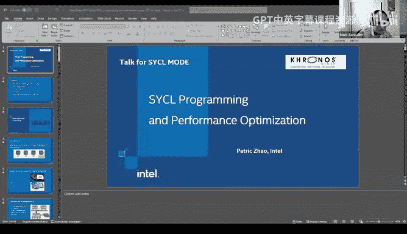

Okay， so that's why we needQL is your programming with SQL。 So you save your time。

 You code can run on the different platform。 Think about the first run。

 at least you have the correct functionality。 and you just need some more extra effort to make your code have the high performance on the different platform。

 So it's one advantage ofL。 On the other hand， why we need to learn a low language， lowle language。

 Why we don't use treatment or other something is's very convenient。 So that's because。😊。

The low level programming language and performance optimization is the fundamental fundamental thing of high performance。

 If you want to write a efficient treating code， if you want to some high level performance optimization。

 you have to learn some。😊，Something in low level about the programming language， about the hardware。

 architecture， something like that。 If you have have that concept。

You can write the code very efficiently。 You can know where is a bottleneck。

 I think that's the main reason Most of people still need to learn the low language。

 low level language， whatever， how， how many。Porion will be you in your daily work。

 But know that is very helpful。 Okay， let's start。

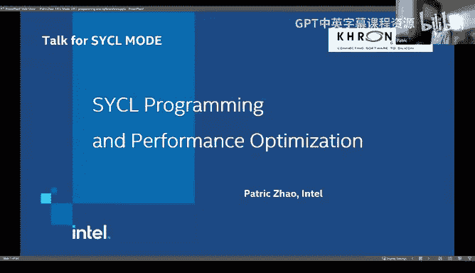

So in this talk， I normally I have three part。 start with a quick review with it genius computing。

 And after that S programming。 The basic program parallel kernel。 This is very junior part。

 So it's for the intratro level， If you don't know the Qta。

 if you don't know how to programming with GPU， this is part for the。😊，For that。

 so it's normally zero。😊，Knowledge you need。 And after that is a and memory mode。

 it's somehow about the hardware architecture。 But because the time limit， maybe I will skip this。

 this part is you can review my slide。 and the third part is。

 I think it's the most interesting part for the performance optimization with case study。

 I use interactive operators， which using the DL IM。 It's a real operators。

 I will show you how to fill。😊，Different kernel together。

 How do we get performance improvement and how do we use providing tools to analysis the performance。

 It's really important。 and it's for the media and advantage users。😊。

So that should be very interesting。 And I also saw someone us in the channel。 How。

 how do we feel the kernel。 Okay， let's start。 So first。

 we have a quick review of hegenous computing。 So we know today we are not only use the CPU。

 We use CPU plus GP， CPU plus F PGA and other accelerators。

 that means we use different type of device together。

 So hegenous computing it means a computer system and approach that use different computer unit。😊。

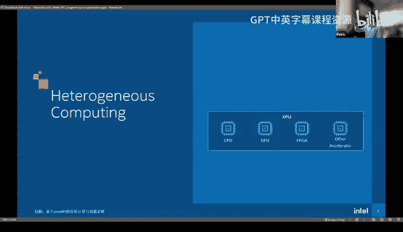

Which based on different instruction side and system architecture， You know。

 if you programming on the CPU and GP is's totally different。Different programming language。

 different as code， Everything is different。 You need write to part of code。Okay， so the today。

 the general purpose of processor， normally we have two type。 One is CPU。

 Another is GPU is very more common for most of us。 CPU is for general purpose task。

 and it's also for most of common applications。 You may doesn't use that for compute intensive work。

 Just launch some web applications。And you also can do that for some compute intensive jobs along with entires new CPU。

 they have aax， Aax can calculate a small part of gym in in one time。

 so it's improve the performance a lot。😊，For GPU， it's for specific task， especially gym convolution。

 those kind of very compute intensive job。 It's very fit for GPU。😊。

And it's also for some graphic and more visual applications and all computation could be in parallel。

 That's the most advantage of GPU and also high memory bandwidth。

 maybe you already know today the large language model inference。 it's really memory bound。

 So high memory bandwidth really benefit the large language model inference。😊，Okay。

 so this is a Q model。 The first is the independent。 Look at picture。 You can see this is the GP。

 This is CPU and GP and CPU are。😊，Are physically separate。

 They are two different device They are not in one chip。

 So most of time they are interconnected by the mainland。 So may board。

 So that means if you want to access the memory from GP to the CPU and from CPU to GP。

 You have to across PC IE and PC IE is slower interface。

 So sometimes we will reduce the memory access between different device because。

The connection is slow and they have independent memory space when we programming。

 we have to consider。😊，Where is the memory， How do we move the memory from one device to another device。

And they have different computing logic and instruction。😊，So Patrick。

 I have a question like as like an older like not older like just like even like my gaming CPUU has like an integrated GPU yet like it's not like sufficient to like power games and so I'm wondering also what are the tradeoffs with like an integrated GPU versus like having be a separate device that you connect to via PCIE Oh yes。

 that's a good question that' really different but for integrated GPU is most for consuming marketing so people use that GPU for both gaming and vision applicationss and also they can use that for some computing task but we suppose in that case the computing is not such intensive they use integrated GPU for inference for most of time part of F training but in this case independent most of time for data center GPU those GPU。

You doesnn't have。Gaming and wish。Component， they are designed only for the computing。Yeah。

 so maybe to elaborate here like what would， for example。

 stop Intel from shipping the equivalent of like a 4090 GPU that also has Intel CPU as like one device like like I guess yeah like my question is more around the design tradeoffs of having something be integrated and like why can't we have a high performance integrated GPU a sort of anything that makes us unfeasible in practice Oh I don't know that that's a marketing got it got is that strategy I don't know that I just talk some about the technical side。

Got yeah so， so I think there's Eric and Cha saying isn't this kind of like the Grace Hopper idea。

 Yeah， like I think that that's what I'm sort of getting at that's based on marketing decision and strategy everything impossible just what's the target marketing。

 what's the target usage。😊，So sorry that's good question。 Yeah。

 we have different GPU include integrate GPU， which share the memory with CPU both on the one side of Ram so it's another cat。

 but in in today mainly I'm talking about target for data center GPU because most of high。😊。

high intensive computation likes the large language more training。 They are using data center GPU。

 whenever you。😊，It's impossible use integrate GPU the computation in that is a little lower。😊，Okay。

 so the first is independent， and the next is dependence。

 So dependence means we are not working on the GPU totally we。😊，Totally forgot the CPU。 It's not。

 We still need co work with CPU。 Look at this picture。 Most of code still running on CPU。

 only the hotpot， hotpot。😡，Code running on the GPU。 Let's say， maybe。For example。

49 of code in the initial stage and only 1% of code in the inner loop。 This loop is the hot loop。

99% of wrong time。😊，In here。 and after that， we have some cleanup。 We have the data right back。

 It's also another 49% of code。 So you don't want to move those yellow code to the GP。

 It doesn't make sense。 GPU is for parallelization is for high performance computing。

 It doesn't do logic。 It doesn't control the device。 So you still need leave this code on the CPU。

 That's why I mentioned in this page， It's still dependent when you desire your program。

 when you desire your， You need consider。CoCooperate two kind of device。

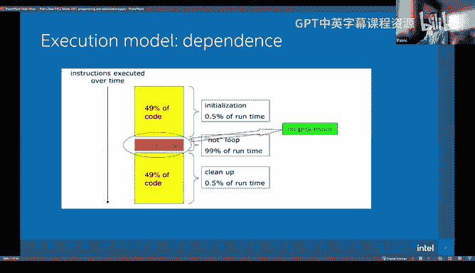

Okay， so it's quick review of it computing。 Let's go to the S programming language。 And in the right。

 this is a book written by In engineer。 It's most about everything in the circle， maybe in this book。

 you can check on this link。 it's free so you can download it and reading it。 Okay。

 let's say what and why C。😊。

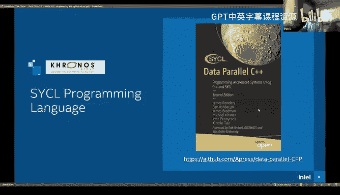

So Sco is a extension to the C plus language。 It provide it's a free and cross platform abstraction layer。

 You can enable code forgene and off processor to be written use modern I O C plus plus at these C plus 17 and it also provide the APIs and abstraction to fund device CPUU GPU and FG。

 I think it's really convenient for you。 You just need to。😊，Use API and switch between CPU。

 GPU and IPG。 if your system have that， you don't need to write the code to access them by yourself。

O。Let's go。 So this is some slide showing the course platform features。Okay。

 so one APIR and actually SQL is part of one APIR。 One API includes the performance tu to the compiler and also some driver something like that and which support and video and A M D GPU。

 look at this picture。 You write code with C plus plus and CQL extension and。😊。

1 APIR base tool it compile that into different hardware。 This is Nvi GPU， and AMD GPU okay。

So forvi GPUs， does this eventually code Gen into like Ko or PTX or is it like something else it's to LLVM V interesting yeah and the interface is I think all of that interface is LVM compared to common LVM and next offload to the different kind of GPU。

😊，So as related to this like someones asking by extension。

 does it require a custom compiler for and VCC？Oh。I'm not sure detail。 Maybe it need。S裤大子。

I'm not sure， but if I think you can check the codeplay block for more details。

 codeplay extend that to different kind of device， I'm not very familiar with that part。😮，Yeah。

 no no worries， yeah， we cant keep going okay。Okay， next is how S works， actually if you want to。😊。

Program a parallel and hegeneous computing。 You need three part。 Okay。

 one is abstraction for access your hardware device。 The second， you have a method to move the data。

 So the data， as I mentioned， the data should be the different device。

 you need to manage when the data move from CPU to GP and when move it back。 And third is。

 how do you expression the parallel laser。 So if you have this three part。

 you can write the parallel。 It sounds very， very easy。😊，Okay， let's start the device。

 deviceice is a concept in the cycle。 It could represent various hardware in one AR system。

 And we provide a device class。 It's a purified method for select and query different device the。😊。

The very most common device has been include in the one API。 So it includes CPUU， GPPU and FPGA没有。😊。

Programming with CL， there is a device selector。 You can use different select。 if in your system。

 you are running on the CPU， the default selector will select the CPU。

 and you can also specify what device you want the CPU， GPU or FG。😊，Okay。

 let's say the first piece of code is quick， simple。

 First we use SeL headfi and use the namespace of CQL。

 and then we use GPU select so you can get the GPU on your system。

 You don't need worry about more details about how to set up the GPU device。😊。

In case you have installed the Y API PRR toolt。Okay， this code and we defy Q。 The Q is my GPU Q。

 So the my GPU Q， you can get device and get information。

 You can get different kind of device information device name how many global memory in there。

 How many compute unit， everything you can get from this API。 Let's show Oh。

 and also I have a code base in here。😊。

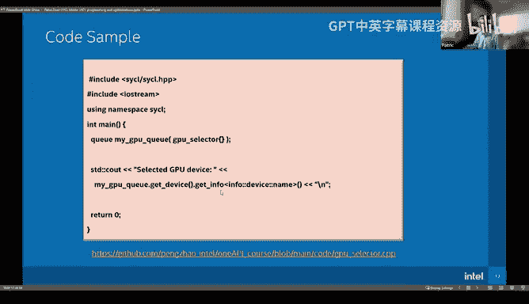

呃This is a code link。Have you。You need to visit the code and play by yourself。 You can try。

 This is my raple。 Okay， and also， you can collect the slide please。

The code I'm showing the in this talk here。 Patrick we're only seeing still your slide。 Oh。

 you're only seeing the slide。 Okay， I will。 sorry， I just， I will put。

 put the link in here in the chat chat。 sorry for that。

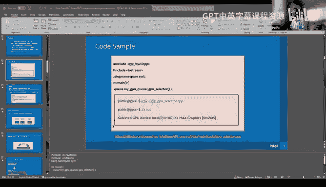

Okay， let's go back the slide。Okay， so for for this code， when we compare， we use in compiler。

 IC P X and。😊，D F。 this code is called GPU select。 And when we run a dot out。

 we get our select GPU is in X Max graphic。 So looks it easy， right。

 We have finished one of third part。 We， we have get the device。 Its very important part。Okay。

 let's see the Q。 Q is another important concept in the SL programming。

 Every time we interact with the device we throw the queue。 So in the CPU side。

 you push everything in the queue and on the device side， they get catch everything from Q， sorry。😊。

It's a queue in the date structure。 Okay， so you submit your work to the queue and the GPU device get the task from the queue in here。

 We create our first queue， okay。😊，And also a queue can map to a device and multiple queue can map to a same device。

 one device can handle different tasks， but you couldn't map one queue to different device。😊，Okay。

 the next is data movement。 Yeah， data movement sometimes is the most important part。

 and it's also before it looks like easy， but sometimes you need to think about a little more about the performance。

😊，Because we have two independent memory space， right， in here is CPU， GPU。

 and each one has their own memory space。😊，And when you transfer the data from the house CPU to the GPU。

 they have two method。 One is exceed。Plicit data transfer。 that means the program control。

 When you transfer the data from CPUU to GPU and then computing after that。

 you transfer data back to the GPU to the CPU。 So this is the most。

Common approach when we programming on the for GPU code。 the reason is。And the benefit is， you know。

 when we need this memory， so you can do copy ahead the computation。 So when computation come。

 all data is ready， you can use and consume data immediately。 And after that。

 you switch to other computation and the data right back to CPU could be。😊，I parallel with computing。

 So in this way， you don't have to with the memory ready， right。

So it's really good for the high performance。 You totally use the system bandwidth and compute resource。

 Another approach is indicatelicate data transfer， sometimes。😊，Your code is based on the logic。

 So when the logic is true， you use this data。 The logic is false。 You use another data。 So if we。

Before the wrong time， we don't know what data we want， right？😡，Actually。

 you don't want to copy all data to the GPU。 Maybe in the wrong time。

 you only assume a little part of data。😡，But maybe you， you need copy 10 of 100 time data。

If use explicit method。 So in this time， you want to use implicit data transfer。

 So when you want to access a data on the GP CPUU， the data could be automatically matchted to the GPU and you only move。

The part you you will use on the GPU side is also efficient。

 even we have to wait the data ready on the GPU side。

 but you copy less data and you doesn't waste the memory bandwidth It's also good。😊，Okay。

 so the in practice， you need to design your system。

 you need to consider which state transfer method you need to apply。😊，Okay。

 so for the memory in the circle is quick extension for the C plus， this is the malllog。

 you can malllog host this on the CPU， you can mall device。 This is on GPU。 if you use the。😊。

Exlicit memory copy， you you allocate two set of memory on the CPU and GPU。

 You manages the data transfer from house to device。 If you want to use implicit memory management。

 you just allocate one part is called shared。 So the first touch first copy。 If GPU first touches。

 the data will move to the GP。 If CPU touches again， the data move to the CPU。😊，By demand。Okay。

 so the explicit memory copy is really like the memory copy in the C and C plug。

 You just need to add the queue。 and this is source from destination。 source is one device。

 D is another device normally copies from one。😊，A date structure to another date structure in the same device。

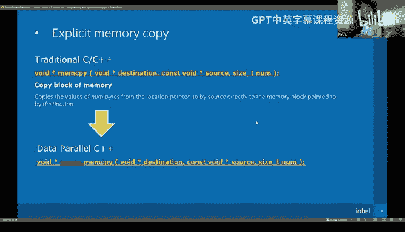

Okay， is a。Code example。😮，We mail log code in the CPUU side， and then on the GPU side。

 we initialize the。Data on the CPUU side。And then copy CPU。Data to the GPPU。Okay， this memory copy。

 and up that， you can write the real kernel。 Okay， next step， I will talk about the real kernel。

 and then we copy the data back to the host。 Okay， and rewrite this part。可以。This is the a chain。

 we compare it and also execute that we see the data is。😊，Doesn't change is from  one to 9。

But this time the data is different with our initial because this data is allocated from CPU and copy to the GP and then copy GPU back to the CPU。

 It's different。😊。

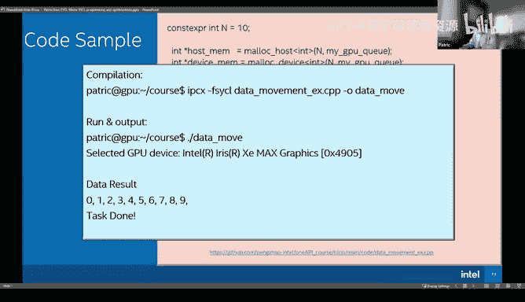

Okay， so finally。😊，You can see we have quickly pass the two part the。😊。

How to access the hardware and how to manage the the and data next how write a kernel So first question so sorry yeah so there's already a few questions maybe on the chapter so let's just go over them So so Daniel is asking is there a some of four data structure Do you have data structures that work with both the CPU and the GPU。

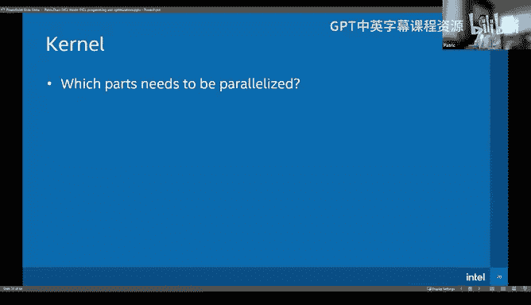

Oh。啊。Symorphated structure a。So for very， for little complicated data structure， I think it's work。

 but， but you need handle it。A quick different。 You， you couldn't only pass a。A point to the device。

 You need to handle， copy that。😡，Something like deep copy from CPUU to GPU。Is he interesting Yeah。

 yes。If you use something like a raise， a。So you couldn't just copy a real raise pointer to the GPU。

 You need deep copy everything。And related to this。

 like Udit is also asking the sticker allow like offloading kernels。To NPUs。

 it comes integrated with Intel's meteor Lake architecture。So sorry， could you repeat question。

So with this is asking the sickle also allow offloading kernels to NPUs。Oh， NPO。Yes， I think so。

 but to be honest， I doesn't do that before I only focus on the GPO。😊，I think it's good。

 but I didn't try that。😡，Yeah， there are more questions coming in so it from this is from a it looks like host and device code can be interleaved in the C++ code How does async GPU execution interact with interleaved code like this So yeah。

 so I think maybe they're asking like how do you know if a command is synchronous or asynchronous by default when you're writing it in the same program。

You see here we have weight right， actually of the code is asynchronization mode。

 If you look at the system level in the CPU side， you， you launch off the kernel。

 you off the memory copy， everything is asynchronization， right。

 So if you want synchronization on the CPU side， you need add weight。With that companies if you are。

Schronization on the GPU side。It doesn't need if you use one because the queue will track the dependency inside。

 so the kernel always equation before the memory arrive right and another memory copy back is always depends on your previous kernel finished but if you use multiple cus。

😡。

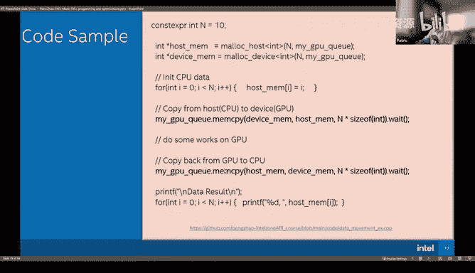

Multiple queue， like this page， I mentioned。

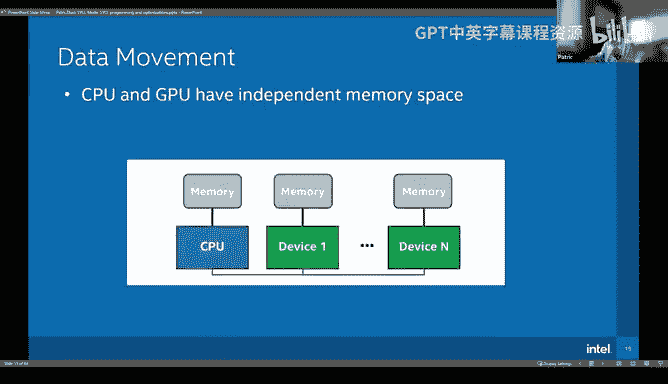

Okay， you can use multiple queue to map to the same device。 In this case。

 everything is asynchronization。 The developer should manage。😊，The dependency of that in the kutta。

 they have quota graph in the circle。 we have circle graph。 You can create a circle graph。

 So circle graph contract track the dependency of different kernel。

 different memory copy and then handle that。😊，All right， awesome， thank you， Patrick， all right。

 let's talk about kernelels now。Okay， sounds good。

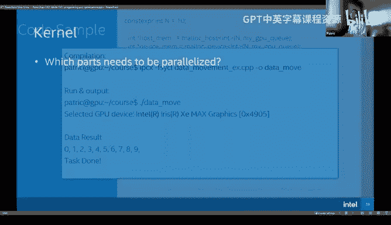

Okay。So in here， first question， which part need to be parallel？😡。

As I mentioned in the dependency part， the most computation， intensive and time consuming part。

 we should to parallel。 We should off that to the device， and usually it's within the loop， right。😊。

Look at this very simple code is a sequential equation code。 We add two vector。😊，To B and C to A。

 and if we。Working that in the parallel， Let's think about。 We have an instance， I say an。

Sweread or processor。 So each one working for one data point。 So normally super code like this。

 we launch an kernel instance and each instance thread instant。 will do one data point。

 So before we need。😊，1K cycle to finish it。 But in the parallel vision， we just need one cycle。

 right， because we have one key thread to run it in parallel。😊。

So that's the most part we want to parallel is the loop。Okay， so in the circle。

 we provide a keyword that's called parallel4。 It's very concept direct。 Its parallel your full loop。

😊，Okay， it's also the code of in the parallel。And when you parallel a loop。

 the first thing is each iteration should be completely independent。 You couldn't。Compute the eye。😡。

Plus one， and depends on the AR or the previous result。😡，So in that way， every data is dependent。

 you couldn't parallel that， so you need to check if your loop is completely independent。😡。

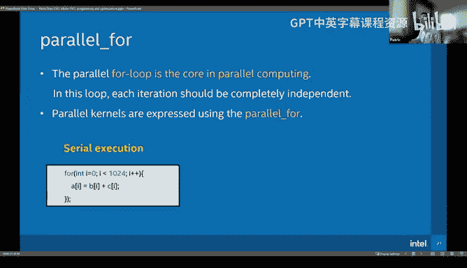

Okay， let's rewrite our code with the。Cycle， this is the real code we。😊，Reples4 to the parallel4。

 and our data computation rate is1 k。 So this is N1 K。 and we have index I。I名字。The work item。

 So you can use that as the index。 We just write eye in here。

So we can see from the first sequential code to the parallel code is really easy， right？😡。

You even doesn't need to pay much attention and much effort， you can finish your parallel code。

 And actually in the real world， maybe 90% of the code parallelization is such easy。

 You just need to replace the sequential for to parallel for you。😊。

You finish your full step and if the code is easy， it's the memory bound and something you almost finish 80% of your work。

 you just need to do some for the performance analysis you have done Okay， so in this concept。

 the parallel computing is not such。😊，Comic is not such hot。 So for people。

 if you just start the parallel computing， whatever with sequenceQs Kutta。

 don't afraid that just try that。 Its， it's easy。Okay。

 so this is our first and basic parallel kernel we in here we use parallel for this is read which means our computation read and the item。

 This item decide to use for the index。 You also can use item to get more information， get the I D。

 What's a thread I D in this group and get a read， how the computation in this group we if we get read in here we get an so sometimes you need to mapping your data from the local index。

 global index， So you need this kind of information。😊，Okay， so this is。Our code。

 you remember previously， we have finished the memory copy from CPU to GP。

 And now we add a real GPU kernel in here。 So first， we use our Q， my GPU Q and submit， we submit。😊。

These things to the GP， right？ So the handle is8。 So in it， were doing a parallel for loop。

 The parallel full loop， we calculate each data with multiple it2。😊，So finally， after that。

 we copy data back。 Oh， in here， we have a bit。 We wait。

 this computation is finished and then copy it back。😊，Okay， looks at the。Output， our data is。

Doubles for each one。Okay， let me know if any question till now。Open MP support GPU acceleration。

Okay if help T， so Patrick， don't worry that like I'm monitoring the questions I think it are just like people commenting on other questions Okay。

 just keep going up。Okay， let let's continue。 We have use。

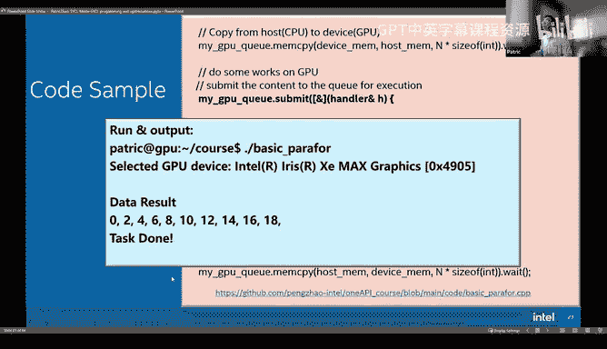

40 minutes O。Okay， so let's， let's do some further salt。 We we have finished our fourth GPU code。

 right， Everyone will feel it's easy， But let's think a little more。 How does the GPU work。

 and how does our parallel for work。😊，And how those tasks map to the GPU。

If we want to control the mapping of those tasks， what we should do， right。

 if you think of this question， you are found risk you couldn't understand that。😡，That' because。

We just think our code from software level。 If we want't understand those question。

 we need to understand some of。GPU architecture， right。Okay， let's go to the GPU architecture。

 So this is the GPU architecture of India X， E M X。Artecture。

 I think recently Intel launched several ARP integrate GPU like Me Lake and the Lula Lake will be very soon。

 Yeah， this architecture should be similar with that you if you understand why one GPU architecture。

 You can understand all of that is it's similar， just different in the。Computation type of something。

 next never detail。 Okay， let's see the this is a GPU。

 And first you can see this media copy engine when you do the memory copy， They using memory engine。

And this is L 3 cash。 The， you can see L 3 cash is shared by all the computing unit。

 And this is one slice。 slice means。😊，We organize some computation together。

 It will be launched and schedule together。 So the entire slice is similar with an videos graph graph processor cluster。

 Okay， it's called GC。😊，And in one slice， we have multiple sub slides。

 The sub is equal with N media SMM， okay。😊，So in in one slide， we have multiple execution units。

 So finally， your computation is really。😊，Mapping to each execution unit。And in one sub。

 you can say see。😊，All the EU and E unit share the L1 cash。

 the shared local memory and also instruction cash。So the subslize is very basic part。 And let's。

 let's see the execution unit in the equation unit in here， we have two。😊，Calculate unit。

 And we see in each one， we have full。Acuting啊。For acute。 it's a more small small execution unit。

 Each one can execute one instruction。 So in here， if you launch。😊，Launch bank calculation in a E U。

 each time the eight instruction， or you can see8 data could be calculate calculate in parallel。

 This mode we called C D。 We launch single instructor and。Apply to multiple data in here。

 we multi that。 we apply that to8 data， right。So in here。

 you can see we have several state registers fill。 So that means you could launch。😊。

Several thread in a E U。In the same time。 And this thread switch。英泽。To ALU。

 So that means in the each time only one thread is select to acute and other thread waiting here and they will hold their registers。

 hold their content。😡，Why we desire like this？You this way we can hide the latency because if one thread is not ready。

 it with the data come back， we can switch to another thread to execute on the ALU， right。😊。

So I think most of you have heard the zero switch cost in the GPO， so why is zero cost。😊。

It's because here you have several different state registers in here。 This hold everything。

 This time， you just need to。Select one to acute。 So it's zero cost。 You。

 you don't need to get back the context from memory and。Everything。Like that， that's cost， okay。😡。

Okay， so in this page， okay。Con step。 So when we know some basic architecture of GPU。

 let's look at work item。 Work item is a basic computing。😊，Grnularity， which be map to the ALUA。

Acusution。So， in this code。Sい。Okay， let's continue here。Okay， this this is our code。

 We are show before， right？ we have multiple data。 So each data is specific by work item。

 So each work item working on one data， so。😊，Think about our architecture。 So how to be equation。

The GPU doesn't acute。The data  one by one， right， It cubed by 8 because our AL U。😡。

Our ALU lung are our CMD lens is8， so that means in the real equation。

 every eight data has been combined together and acuteed on the execution unit， right。

And what's the world group。 So World group， we have organized multiple。😊。

Work item together to launch that。😮，In one sub， right。😡，So that means if you。Launch a work group。

 Your work group shouldn't be too small。 If your work group is very small。

 You don't have enough work item。 You couldn't fulfill。All of those E U， right， Look at this。

 We have 16 E U。 Each E U at one time can calculate8 data， right， but。In the E U。

 we still need another seven or seven number different different GPU architecture to handle。

To hide the swipe switch。 So you need time， another 8。So if you want fully use a sub。

 you need 16 EU times8 data per ALU and8。And times， it's threat。 At least you need。😡。

This number of data。😡，To fully the油。You are a cuing unit。😡，Okay。

 so that's the basic logic and with that。😊，But。O。Yeah， yeah， okay。Previous in this data。

 you in this program， you can see we just。😊，Specific the rid and work title。

 Do we know how large our work group， We don't know The compiler decides that。

 So this is very basic parallel kernel。送到。We will have no。

We need to control the number of work item and the number of data long to the subsliize and long to E U。

 So we we want to do more better work than compiler In this time， we need to control。Okay， so in the。

Circle， we have another。啊，APR is called ND rate。Compare with previous one one， we have more。Prameter。

 this parameter specific your group size。 So in here we group the group size is 64。

 That means in each group， we have 30，60。F。Adments。Work item in here， right。

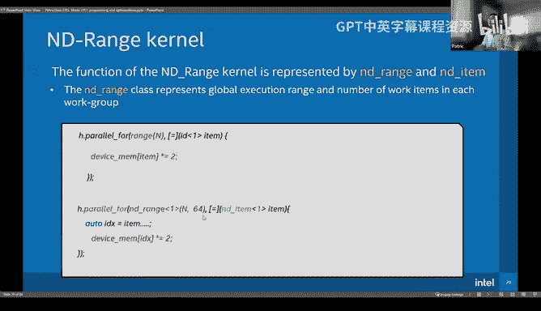

So let's see if our N is 1 k。 So we have 64 work item in each work group。 So finally。

 how many work group will generate is1 k divide 64， right， so。😊，With this way。

 you know how many work item in a。W group， you know how many world group will be launch。

 so why do we need to know how many world group we launch？

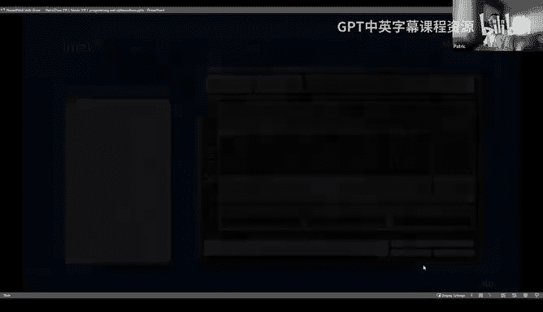

Because each word group is only mapping to one subs， also like the S M。

 So if you launch lesss war group。For example， if you only launch for group。

 that means only four subsce。Has the work to run。 Another two is empty。

So if you're programming the code， you want to get the high performance。

 At least you need to use all the resource。 So you need to create more world group to。😡。

Fully use all the sub and in each work group you should have enough work item to use all the execution unit。

😡，Right。Okay， this part is a little difficult。 It's in the middle level。

 and we begin to consider the performance。 We only we will not only consider our data and algorithm。

😊，We think more。 So that's why we need to explicit control the number， okay。So that I will skip this。

 I think you guys got the。不。What I mean in here。😮，Okay， next step。Let's see the gym。

 So gym is very basic part。 When you learn the parallel computing。

 definitely you will learn how to write a gym。 Okay， this is a sequential code for the gym。

 You can see the output say in each。😊，Output， you compute one row of a times one column of B。

 and each element wise。Time and accumulate to this output。 Okay， you want to parallel this code。

I mentioned we need pair their4。 And in here， we have three4， so。Let's say this 1，2，3。

So which for or what for。For we want to pair them in here。

I will give audience maybe several sentence。To consider this question。Where you want to pay there。

Okay， let's start。 So let's first say the key。 Could we compare okay。😊，O， you can see in K。

K is this way， right you。A。You multiple A and B and accumulate in the C。 If you parallel in K。

 So let's say someone calculate this part and write to here and someone calculates this part and right to here。

 right？ So this point is same point。😊，What's happened？ It's。Data rates， right。

Different thread will write the data in the same part。

So your result will be incorrect if you use this direct approach。 So it's normally we don't。😡，Pllel。

 this look， they， they have。Depenency， and they have the date risk in the output。😡。

But look at the fourth two parallel。They control the different point， right in the C。

So for each point， their calculation is totally independent。😡，So you can in there， in here。

 We can totally parallel the full loop， first for loop and second for loop。

 We want to let each thread to calculate one output。 So totally all the C output is fully parallel。

 Its on the。😊，Good parallel a， right？😡，Okay， let's see。 this is the CPU version。

 If we write that with single threat doesn't apply the open MP。😊，Okay， it sounds good。

 And let's say the GPU version。 So in here we create a world group。

 the world group size like world group。😊，I's a skill work group。The row and。Column is the same size。

Now， we can see the group。 This is the block size， right。

 We let's suppose I could be divide by the block size evenly。

 And let's see this the local range in each local。😊，Gup。

 we calculate the number of block size 10 block size。 and finally。

 we have how many work group we have。 It's the M divide block size in S direction and N divide block size in。

😊，W direction， right， right， those the number of work group we have。

 So we set the local range in here and the global range。 And finally。

 we get the global index in the row and column is global index in another direction。😊，So。In here。

 think about we have。P我来。じゃあ。To outlier loop， right？ So in the kernel inside。

 we only have one loop left。 It's in a loop of K。So， finally。

All the thread will calculate one point and write it out。😡，So look at this code。

 I think most of you will think it's too easy， right， we just。😡。

Have a parallel idea how to parallel the output， because each outlook， each output is independent。

 We don't need consider the date dependency。 We don't need consider date race。 Everything is perfect。

 We can finish the first version of gym。Okay， so let's see this is a performance if we。😊。

In here we show the performance。 if we select different size of block size。

 we see the performance and speed up。😊，Why their performance speed up？Think of。

 if we just use block size one。 so in each work group， they only have one。Work item。

 I mentioned in a each E U， they are cuing with the length of8。 So that means。Siming of呃 si of。Ace。

S length are waste。 We only use one， right， So the performance should be。

 if we includes the block size， we fully。Utilize。The Q unit， so our performance boost。😡。

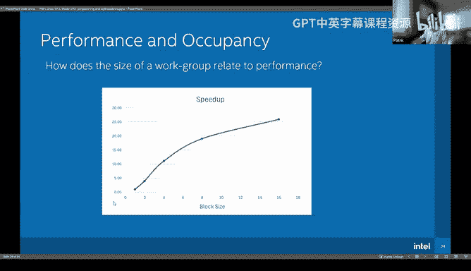

Okay， that's this part。 And next part is memory mode。

 I will skip this part and continue on the performance optimization for。😊。

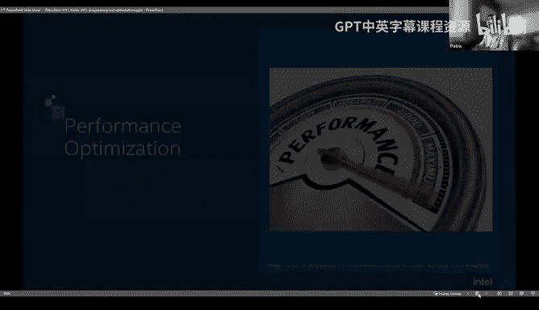

A real case。 This part should be most interesting， I think。

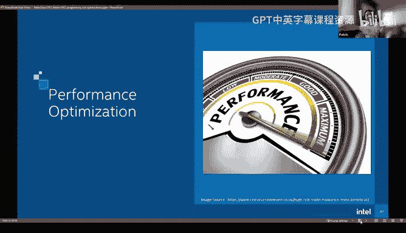

Okay， let's， let's continue。This is the key study we made maybe one or two years ago。

's it's not the latest example in large language model， but it's also very， very useful。

 And if you understand the mind and logic inside here， you can use this approach， Do anything。 You。

 you can optimize your large language model influence fusion thats kernels， right。😊。

Such as the flash attention， MH， all of that。 Okay， so I'm。

 I'm talking about that just because I have the slide for that。😊，Okay， let's see the DRIM。 Okay。

 this is the DRM model。 And DRM is a recommendation system。 Its highly used on the。😊。

On network company， when you use ebay， when you use Amazon， you collect some item。

You got the recommendation。😡，Maybe the back cant use their D okay so the DM have three input dense the future and then do a MLLP it's a gym and embedding looking up。

 emdding look up and up that we do data Cat batch multiplication index and cat and finally to the top。

😊，呃。M LP。 So in this part， we call that interaction layers。

 You can see we have cat BMM index and cat。 only BMM is computation intensive operator。

 a cat index and cat are only memory movement。 So our idea is we have one calculation layer。

 And we have three data movement， right， Why we don't。😊。

Fing all of these four kernel together so we can avoid actual data movement。

 we just read data from where they are。Right， and receive the memory bandwidth。😊，Okay。

 this is the initial ideas。 We confuse the memory movement with computation， so。😊。

Weceive lots of time on the date movement。And why we don't use。Library to do this。

 because sometimes you。The combination of your operators， your layers is very flexible。

 This time we have these three。 next time we have another full layer to functionsion library couldn't provide so flexible。

😊，ACability lets you doing everything， right， So you have to write that by yourself。

 and sometimes it's not that difficult。😡，Okay， let's see， okay。

 well finish this page and continue okay。😊，This page shows the interaction module function。😊。

Let's see。 what's the input。 Okay， so input is a tensor list。 There have so27 tensors in shape of。😊。

32 k times 128 in here。 This is。2y7。In this way。 and each tensor with。32 k，32 k and times 128。

 So the data con direction this way。 This is the fourth row， Second row。 So data。😊。

Allied in the in the in this way。 and this 30，27。Data， maybe。Each one is contiguous， maybe it's not。

 but I just draw a picture like this。Okay， so the contact。Q子的d layout。😡，You can see the first。100。

28 in here and next in here。 So after the data re， remove data in this way。

 This is fourth row is the second row。 The fourth row， the con。😊，Dimion first 128， and next is 27。

 So this is a continuoustiguous way。 and this is another way。 So the data move to here。

 So contact totally change the data layout。 So you can know， you know， in this step。

 you have to access all these bigger data， two times one time is read and another time to write a new tensor。

 right， you have two ten and visit the bigger data input two times。😊，Okay， next is BMM。 BMM is。

In the batch dimension calculation。 So in here， batch dimension is 32 k， so。

Each data in the batch dimension is independent， and in the one batch， we calculate this。128， with。

With itself。So we get one point。 So finally， we can get。32 k，1027，10，27， like this。 is's a small one。

 because。This data is。Itself times itself。 So this data is symmetric， right。

 So this part is similar with this part， and we only need。😊，The upper of lower triangle。

 So we write this 27 time 27， it's。351 data。英完肉。So we have 22 K batch， right， Each one has。

1 row output， finally， we。Right， the data in here is 351 times 32 k。And finally。

 we contact another 100。😊，28 data with with 32 case data together。 like here。

 if you move this time to this time， you have visited this data one time and copy that to a big date。

 big tensor and with another。 So you， you can see you repeat， access the memory multiple times。

 And all of those is not less right。 So that's why we want to fusion。😊，Those kernel together。😊，Okay。

 so I leave this page 7 second。You， you can understand that it's about the DL model。

 So if you are not familiar with DL model， it maybe。A little complicated。Okay， let let's continue。

 So before we ride a kernel， what we should do。 Yeah， so， so so Patrick。

 maybe just a quick time check， I think we really have like concretely about like maybe 10 to 15 minutes left。

 So hopefully that Oh 10 or 15 minutes。😊，We stop at1，30 here， right？😮，Sure， yeah， we can do that too。

Okay， we have 2 for five minutes。😊，Yeah， like， I mean。

 like we still want to leave maybe like a few minutes for Q and A so so maybe Mr。

 so let's just let's aim to end by like， you know， wrap things up by like 120， 125。o go go okay。

II should speed up。O okay啊。😊，Before we writing a real code， we。

 we should consider what technique we need to use today， the G P on the GPU， we have lots of choice。

 We have I 16。 We have。😊，T F 32， we have I 32。 We have normal IP 32 calculation。

 We have IP16 calculation。 We have ten call and a re calculation， right， lots of combination。

 We need consider what we use in our code。 So first step， we need analysis。😊，So in in this case。

 the most important is BMM is the calculation part。 So we start from BMM。

 It shape is like this 32 k times 27 time time time。 and we get this。 and we calculate how many。😊。

Oators in here。 Opera is this is our output， right output and in each output we time in the K dimension is 128。

 and we do FMA we time2。 So this is how many ops we need in BMI。

 and how many memory we need to access。 So thats we access A B and C。

 So this is 32 k times8 time A and B same。 So every time2 and output27 times 27 is how many memory we need access。

😊，So the。How many ops per animal white？😡，P enemy by， we can divide this， this to these guess。

 And let's assume we use different type if we use。😊，IP 32， okay， I 32， we have so many ops。

 This is how many E U we have this same same right， same right I mentioned is 8， right。

 and two ops per cycle and time the GPU frequency and times the E efficiency efficiency。

 Let's say the E U efficiency is 100。 and if you。😊，Doing that， calculate， you can get a time。

 the E U。Calculation time is 0。56。Mal Michael second。 And we if we change I。呃，s6teen IP1 sixteen。😊。

Is two times faster than I P 32 write， You just divide2。 Look， the I 32 is good， right？

 And if use D pass D pass is similar with。NVs tensor core。

 So it's much faster than normal calculation unit。 If we calculate the sto array。

 its each time iss calculate eight time 8 matrix。 So it's really fast。

 You can see the computation time。😊，It's 10 times faster， even than I 16， right。And let's finally。

 let's see the memory transfer。 So the memory transfer， if use IP 32， we use。😊，2 microseconds。

 if use IP 16， we need one。APo the， Michael secondd。So till now， what we get。So。

Doesn't matter if we use D pass or Tensor call in this case。It doesn't， right。

 because you can see the memory transpose time。Dominate all the computation。😡，Whatever you。

 you finish the computation in the 0。2 or 003， It doesn't matter。 You need 1。

0 You micro second to finish your memory。Transfer， right。

So you don't need to bother de pass and ten call。 It's complicated。 So next question。

 do we need I 16。In here， you can see whatever the CPUU time of the E U time of IP 32 and IP 16。

Is half slow， but still slow than memory copy， right， Do we use that， Actually。

 we don't need I P 30 to。啊，IP16。Calculation， but actually， we need I 16。Memory day time。

 it same half time， right， because we transport half data。So IP16 is important in here。 So finally。

 we we get， we don't need sto call and we really need half position because half position， save。

 half memory transpose。😊，Okay， in theory， our estimation is a maximum of computation and memory transport。

 We suppose they can overlap each other， but in real reality， maybe。😊，They couldn't overlap。😡。

Such best in reality is in the maximumim or in the sum of that。 If you totally couldn't overlap that。

 the max time is memory transfer time and computation time。 So in the reality。😊。

Your performance may be in this rate。Okay， let's continue。

 The first design we will use a gym previously we designed， and each gym calculate a batch。

 We have 32 keep at。😊，So we just lets one work group to do one batch。

 and we use 32 times 32 group size。 Okay， so let's see what happened。 So this is I P 32， right。

 this result from between。 So if you use we have lots of。😊，Providing tools， if you use kut。

 you can use insideight。 This is V。 They are similar。😊，Okay， use。IP 32。

 you can see the E U activity is only 29 and store storming you are wait the data。

 the E U does nothing can work， have to wait。 So is 64 and when we switch to I 16。

 You can see the E U activity improve and the store number reduce， right。😊，So why？That happened。

 Let's see。The data。 So this this picture we show how many data we transferred in here in I 32 we see from the HBM。

 We have 100 and gig data transferred to the GPU。 and when we change to the。

IP 16 is only half data transfer to GPU。 So that's wise。The Eu。

Spend less time to wait the data movement， because we consume less data， the data transfer。

Is latency reduced。 Okay， so it's H BM and also look at it3 read H3 read number is also decreased half。

 right。😊，Okay， so the performance we can see the time with IP 32 is5。2 and with AP 16 is 3。0。😊。

A next step， Oh， this step is very interesting Well I will let you know is is IP 32 is is IP 16 so from those data what we can learn。

😊，I will give you several second。 I don't have too much time。Okay， see， is there any。

Stranger thing or wild thing from this data。Okay， let me continue。Okay。

 I have give a hint hint in here in L3 data。 Look at how many data we read from L 3。😡，Okay， so。😡。

Let me continue。So in both case。😮，You look at， we read。The data。Former。Here here it's 53 GBB。

 we read from the global memory， but in the L3， we read 272 GB data， right。😊。

So the L3 rate is very large。 It's 3 to five times then H PMM。 What does that mean。So one thing。

 the good things mean you have a good locality。 you did hit in the L3 a lot， right。😊。

That's a good thing。 What's a bad thing。😡，Bad thing is you read too many data from L3， right？😡。

We need to reduce。The access from L3， if you look at， look back at our architecture。

L3 is really far with our subsliies and EU， right？And all the slides， all the E U shares the L 3。

 right， It's very fast。 The latency is also。😊，Huge， so we don't want to pay that。😡，Pity， O，不要黑。

So what we can do。So we need to use share local memory。 Our data now have the good locality。

 So why we don't move that data to the share local memory to maintain this locality and reduce the access to the。

😊，Penity from the L3， right？ So it's really a good idea。

 So you have to move your local data from the L 3 to。😊，Shard local memory， let's look the data。

 So this with IP 16 without shared local memory。 you can see this shared local memory。

 data transfer is0。 and when we use。😮，Shared local memory。

 So lots of data transfer in here and our E U activity increase a lot。

 And the store decrease because you read data with a local。😊，Memory， the latency is small。

 The bandwidth is。It's bigger， so it's good。 And you can see the L3 load。😊，Number is similar with。Oh。

 no， it's not。 it's racial。 Okay， it's racial and this page。Okay。

 you can see this the data read from the HBM from。From the L3。

 So when we apply the shared local memory version the。Total date load from L 3 is decreased， right。

 It's similar with HBM data number。 That means you only read data from HBM to3 one time。

 And after that， you load what you need to the share local memory。 and。

 you reuse all the data in the share local memory。 I that cool。 Yeah， it's， it's really good。

 So we get。😊，Performance。Boost from here， you can see we have another boost from 3 to2， right。Okay。

 I think do we have enough time。 Let's go there quickly。 So from here that we know。

 actually in this gym is special。 We a itself， So we have one source of a。

 So we change the data from one source。 both and B is the same data。 So we change to one source。

 So total data load half， and we fill output index。😊，Okay， after that， we can see this is。啊。

This is the data from framework and the original BMM execution time from oneing its a。

Our high performance library， similar with coding N。

 So you can see their performance is good When we write by our circle。

 our performance is better than the。😊，Library， it makes sense because we are not library。

 library guys， write code， very efficient。 We are not them。😡，Okay， and when we。Fs。

The index fill the index together。 And this time， finally。

 we see the total performance is not improve too much because our。Jim is not efficient as。Library。So。

 yeah。 and then continue。Oh。I don't have enough time。 maybe okay。

 I can stop in here and let's see we have any question。

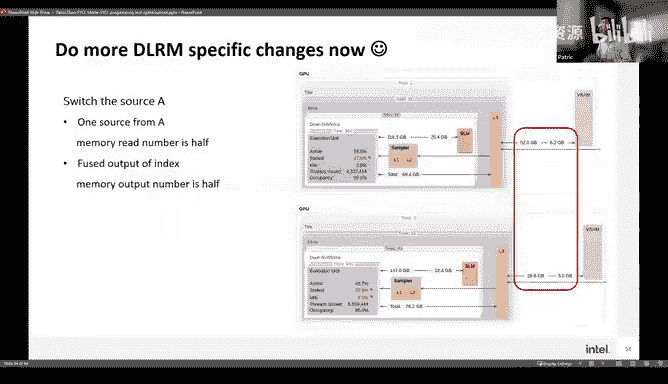

Cool thank you so much， Patrick I really appreciate like a lot of the technical depth I guess like there were like a few questions here so Daniel for example。

 was asking like what is the sampler and I see it that has L1 and L2 so maybe just more detail and what unit was that measuring。

😊，Oh， it's use V。 We use hardware sampler。 It can。😊，Yeah， it it's like the insight。

 Just get the data from the hardware professor。😊，I've forgot that name。It's hardware provide。

All right， and then on slide 55， what is meant by EU efficiency Oh EU efficiency means how many times EU is working and how many times it doesn't work that that means have 45 time EU is is working and another 55 time the EU is nothing can wrong because they are wait for the memory arrive。

Yeah， so like Daniel's asking an execution unit， is that like what it's stands for？You。

Acusution unit。It's。Just the unit。 They are real acute and。Progress the instructor。

 the instructor will really map into the equation unit。All right， well。

 I don't think I see other questions in chat。 so so thanks thanks again。

 Patrick for this awesome talk。 like hey， folks， like please make sure to like。

 you know shower Patrick with some emojis。😊，Yeah， so Patrick。

 you're already being asked like if people have any questions about sickickle。

 they're asking if you're going to be like on discord to answer questions。

 I guess like you can also make your slides available right and ask more questions all right awesome。

