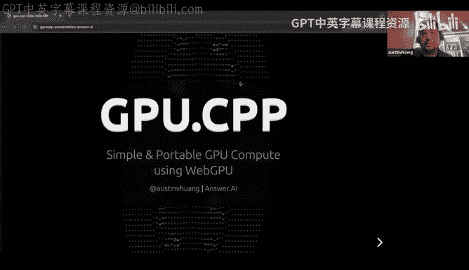
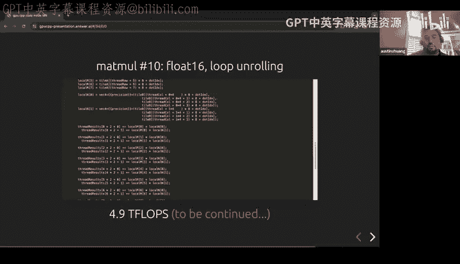
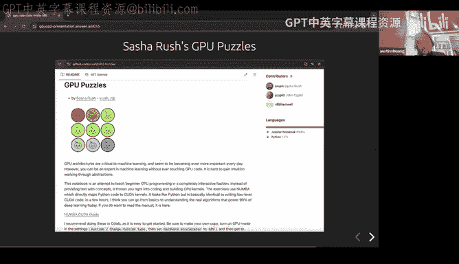
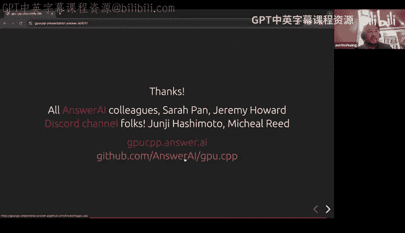
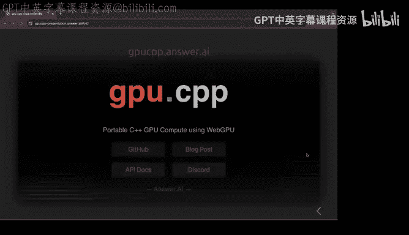
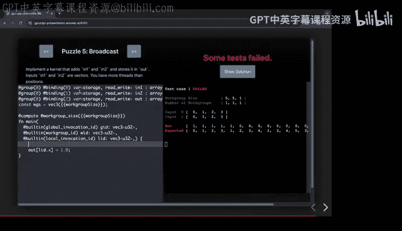
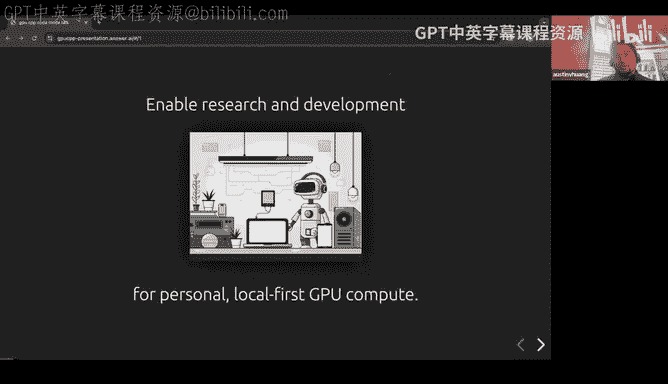
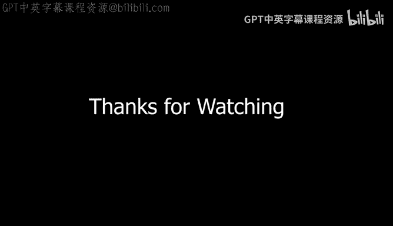

# GPU MODE《CUDA、GPU编程1-53课｜GPU MODE》中英字幕（deepseek-v3.2 - P28：-20240825-Lecture 27_ gpu.cpp - Portable GPU compute using WebGPU.zh_en - GPT中英字幕课程资源 - BV1QZ421N7pT

So and today I'm super glad we have Austin to be talking to us about like GPUCP for some context like this is not the first interesting open source project Austin has worked on like I had first heard of Austin from an older project called Hasketorrch which is like basically programming bytorrch and and then Haskell and the reason why that blew my mind at the time was because you'd have like these very simple like like one line formulas for like gradient Descent and that kind of really blew my mind at the time and so I'm super glad and I think since then like Austin's know continued to do like really cool things I think at Google he was working on GeCP which is also this like very minimal like CPP codebase and I think once he joined Ester I think he just like went all out and he just like released GPUCP So yeah really glad to have you here Austin and please take it from here Yeah and as a side note like you know kind of part of my initial thinking for this project was when I was doing GeCP。

 which is like minimal implementation of the Ge。ecture was was thinking about oh it'd be nice to kind of have some like CPU code and then when you think when you explore like okay well what can I how can I write CPUU code that will just work on people's laptops it's like all of a sudden things get much more complicated than you like and that was a little bit of the seed of some of the thinking about this I'll be talking about this GPp。

cp project and it's a very small library and to do this GPU computation in a portable way and it uses web GPU now most people here are familiar more familiar with KUa as a means of accessing the GPU than webgpU and that's fine we'll get more into what web GPU is and the significance of portability later in the talk。

So yeah kind of the starting motivation for this project was kind of wanting to carve out space to do both research and development for this kind of local GPU compute and by local I mean personal computing devices that we all have laptops。

 mobile phones workstations that are in our house etc cetera right so we want to be able to tinker with local GPU compute and to the same level of depth that we think about like innovating large scale training on H 100s or optimizations to scale up inference we want to kind of have that same depth to exploring ideas and projects that run locally right like maybe realtime multimodal models that run locally or hybrid CD with like GPU to share computations or some sort of hybrid computation between your local machine and servers and so we wanted to make some space for that right and for this。

Audiences is probably preaching to the choir， but there's a lot of things that are appealing about local GP that I think are worth exploring in depth right and one is to think about scale right so usually we think of like MacBook Pro as being very tiny scale compared to the latest cluster that's in big tech but if you think about it how many MacBook Pros are so sold every year。

 you have 10 to 30terof flops of compute for each of those right and that's several exaflops of just like M1 M2 M3 MacBook pro pros that are out there like another sort of thought experiment if you think about Pixel 8 pixelixel 9 phones that are kind of the first wave of hardware thats sort of influenced by GenI applications so like a G3 Tensor course has about 2。

42。5terof flops and。IfRight now， those are kind of at the high end of the market， right。

 but there's 3 billion Android phones out there in a couple years。

 I end sort of moves down to sort of consumer side of the market that's。

You know quickly scales to like several zeda flops of compute right and we don't usually think of personal compute in this way in part because it like it's very inconvenient and very high friction to kind of pull together this compute at the edge but maybe that's one of the things that's worth exploring how can you make that more frictionless second I think is everyone here is familiar with you know local models and that often it's useful to implement again something that's stable that you have fine grain control over right and that's sort of at the individual level you know at sort of a society level。

 we also want to as AI becomes more integrated into important sort of critical systems you want to make sure failure modes are derelated it's not like oh one API end point goes offline and suddenly half the robots in the country stop working right and along with that sort of there's classes of use cases that are you want to kind of。

Have a small footprint right so things like in medicine things in law。

 So it also unlocks certain use cases if you can run things locally that you might are not otherwise not be able to pursue And finally like there's kind of new form factors of between augmented reality and robotics and in these form factors you want low latency。

 they have high bandwidth video signals， audio signals。

 and then there's a deeper privacy consideration。 So all these are things that speak to you know local compute as being not just sort of the realm of hobbyists。

 but something that we want to study more and more seriously and developed capabilities for right So what is it that gets in the way of that。

 you know what are some of the things that I ran into into and us kind of thinking about this。

But like Gemma docppP and other sorts of projects right and one issue is that personal devices are very hetero heterogeneous while tooling for GPUus is very vendor specific So we're used to like vendor specific compilers。

 you know vendor specific tool chains and so you're left with these choices of like well。

 I could implement this but it only works on this one vendor and then it won't work on most people's laptops。

 it won't work you know it won't transfer over to phones， right。

And partly because of this heterogeneity， we've kind of gotten to the state where we're used to accessing the GPU intermediateted through some some middle middle layer so something that's usually task specific So in graphics and rendering a lot of the development happens through the game engines So you use unity or unreal engine and it's the engine that interacts with the GPU directly in our kind of own neighborhood of machine learning。

 you know we're used to using a machine learning frameworks and then we're also used to exporting the model and then putting it into kind of this large runtime framework that handles the direct GPU access force us And for many use cases。

 thats that's sufficient to cover it。 but if you want to go outside the beaten path and explore kind of novel algorithms and things。

 it's not super convenient to then be like， okay I'm going operationalize this as a pull request。

 this giant runtime a production inference framework or something。

So for direct access to the GPU then there are these GPU APIs so there's like a Vulcan it's like a portable GPU API and web GPU I'll say a bit more about that is another GPU API but if you use them directly they're very immediately find they're very optimized for these kind of large scale sort of middle sort of framework implementations and they come with like complex build so so for example if the ideal is like you want to have here' is my app I have some C++ code and I want to include GPU。

 H and then start firing off kernels and things but then the reality is if I want to launch even the smallest like can H you know Gal kernel whatever in Vulcan you have 800 lines of code of just like setup and this is even before you get to any sort of algorithm or anything and this may seem crazy at first but it's actually very reasonable and if you think that the target audience here is for。

😊，Developers of game engines， developers of these like large frameworks and runtimes right so part of what I want to do with this project is sort of narrow that gap so that direct access to the GPpU is more like sort of just programming so that comes with like a few sort of technical goals and how that's implemented one is sort of avoiding sort of custom tooling custom being custom in that I just want to be able to have a cl C++ compiler and that's it and wanted to think of it as sort of general purpose right so we already have these task specific frameworks we have plenty of M frameworks and things and so to start with just whatever task maybe you're working on simulations。

 maybe where we're working on offline rendering maybe you have specific like something like gem do you have a specific model implementation so wanted to be general purpose and not not sort of another sort of framework and also want to make sure that its。

We're kind of using something that's sufficiently expressive so the kinds of optimizations we want to do in Kuda we can also do them and have it be portable so you code write your code once and you can move it around between different hardware and easy to embed and the last piece we were talking about a little bit before we start is it like a lot of things sort of is that one challenge is for something be widely supported right so there are lots of GPU frameworks that are popping up a API that popping up but if they don't have like the hardware support or they don't have broad support it's hard to get traction so one it builds on something that it seems likely to be widely supported right and so that's where we ended up with this implementation which is the small library lets you do general purpose GPU computation drop it in your code and we use web GPU。

So I'm going to say a little bit more about what is WebGPU because it is very。

 very confusing and the first time you hear it， people hear WebGPU and you think something like webGL like is a Web GPU isn't that like okay I have my browser and I use it is that what I use like draw pictures and make little games in the browser and it can be used for that but it can also be used for much more than that right so the way to think about web GPU is that its it's a spec is sort of a generic spec to access the GPU so to request resources to allocate buffers to send compute kernels to the GPU and so it's this generic specification the use case they had in mind for that specification initially was to embed it in browsers so that you can have webs that make use of your local GPU compute so like you go to a website and there's some computation？

There's some rendering that's happening that uses your local GPU and gives you access in a controlled sort of safe and portable way so it has to be portable in that the browser runs on many different types of hardware many different vendors and it has to be sort of generic across vendors and so that was to the motivating use case was to give GPU access in the browser but in the process of doing that they define the specification which is adopted across the industry and then there's also you have to implement native implementation because you have to at least have the implementation that's in the browser and so when I say native I mean it runs locally on your machine outside the browser and it turns out sort of the implementations that were used inside the browser are also you can use them as implementations that sit outside the browser so Google's native implementation of the webGU specification is called Don。

And so you can use it as in if you have a C++ program。

 you can use Don and use the Web GPU API specification to access the GPU and it'll run across different hardware vendor platforms there's another there's another implementation in R called WGPU it's also a native implementation and what's happened is like in Ru and in some of these other languages if you ask you know how do I do GPU programming and rust。

 they'll just point you kind of one of the top choices is just use WGPU even if you're not using the browser at all。

And then under the hood what these native implementations are doing is they're translating this API specification into things that are vendorspec。

 so for Windows they translate this webG API specification into direct text on Apple to metal and then on Linux and other platforms to bulk in and so it's basically sort of abstracting the vendorspec APIs in terms of this more generic API specification that if you write against this you can run on all the platforms that support support these and then as another option it'll also you can also run it in the browser。

 but the key point here is it can be used locally outside the browser so here's a WebGPU program hello world small program that uses WebGP that's just running in the terminal and there's a deeper dive on this called the WebGPU is not just about the web that's checking out and so these are the native implementations。

Any questions about that so far yeah， I mean I will say that's kind of like similar question to when people ask like is Kuta mode just about Kuta it's like what GPPva but I'm sort of curious to ask here。

 which is like。like does this also work for like server GPUs like with no problem or does this still require some like web stuff to be like basically some with a chromium so some parts of chromium or something need to be installed or not No not at all so so Don is basically the implementation of web GPU inside of Chroium but it's separated out so if you have the dependency on Don which is a native implementation but you don't have a chromium dependency does that make sense？

呃到到时嗯。One of the questions that I had initially is specifically how device astic can such like a complete crossplatform across device thing really be it like is it like the smallest common denominator how do for device capabilities there and also like how dynamic do we have that yeah yeah yeah yeah the definitely a tension there right because as a first order it's sort of a cut of like the largest common denominator across sort of all the specific GPU APIs right but there's always this tension that you want to kind of push further on like oh you know there's this thing that doesn't have 100% support and then so there's experimental proposals that are always in flux right and so so that's one of the compromises for portability is it will like if the feature is compelling enough it'll eventually be sort broadlyly enough and implement in corporate？

into the standard， but you will lag behind say like the cutting edge of what you can do if you commit to one particular vendor platform right so that's sort of the tradeoff but it's sort of an ongoing tension that that like you know if something's desirable enough it sort of works its way into the standard but with some lag time。

Is there somewhere somewhere at list like which devices are basically supported by this or for which we it's like I guess like AMMD and Q。

 of course and and and others， what if you tried out？Yeah。

 there might be a more official list somewhere， but like maybe like one mental model of it is like if you can run either Vulcan direct X or metal。

 then you be able to you should be able to run it yeah yeah。嗯。Right。

 so kind of next up is like if we use the Web GPU API directly you know what does that look like right and so it looks something like this for a Gelu activation kernel which is really tiny implementation but there's a lot that comes along with it right and webGPU is sort of known as being sort of simpler than Vulcan so it's about 400 lines of code versus 800 lines of code but it's still sort of unwieldy enough that there's some cost to dropping this in a project that it tends to be oriented towards people that are developing game engines or inference run production runtime or something like that so so we want to simplify this to make it that the friction to kind of just dropping in GPU code in a project is more lighter weight and so if we think about。

😊，We just need to we really need for if we kind of focus on just the compute workloads so set aside you know 3D graphics and things like that so just the compute workloads so there's kind of three main aspects that you have to support in a small in sort of a minimalist library to have to be able to work productively right you have to view a way of specifying the GPU the code that runs on the device right so this is kind of the device code in GUta and in webGpU you use this domain specific small domain specific language called WebGP shading language and then there's also you want to allocate resources ahead of time right and this is done as hostcode and C++ right。

And then you have the things you want to do in your hot path。

 which is you want to kind of minimize any kind of allocation。

 and then you just want to do asynchronous kernel dispatches as fast as possible with sort of minimal data movement and minimal sort of resource allocation right so if we can kind of come up with sort of a minimal set of types and functions that do this we can then simplify this into something this small which is should be probably a little bit more familiar that if you're familiar with couta。

 you can probably squint at this and kind of figure out what's going on so you have your device code that's written in this domain specificific language if you want you can embed that in your C plus code as sort of like a quoted string or you can kind of have it in a separate file if that's what you prefer and then you have the host code set up resources and then do this asynchronous dispatch and we'll step do a closer look at this in a bit after looking at a couple of these like types and functions。

That are part of the library。So to use a library， you just include this Dpu。

h and this core implementation is only about a thousand lines of code。

 so that means you know when you're compiling， this is pretty much instant close to instantaneous and very little sort of overhead in terms of your compile time iterations on the device code it looks like this it sort of looks C like language right and but focus on sort of computations that you can carry out on device plus some metadata on sort of the bindings that you share between the host code and the device code。

😊，This work group size is sort of the web GPU equivalent of blocks so you can think that that way and like KUa code you have this kind of identifier for which thread ID it is and then you write your kind of your computation in terms of this like thread ID identifier combined with some of the block size information and things like that。

On the host side we have a couple like supporting types and functions to kind of do the things you want to do with allocating resources and dispatching kernels so we have this context type which is sort of like a simplified way of interacting with the GPU so if you look at the raw web GP API there's a whole bunch of other things that are happening under the hood here but here if you basically it's simplified if you want to talk to the GPU you use context handle we have this kind of tensor which is just a wrapper around allocations of GPU memory so it's kind of these like flat linear buffers and then the representation of the computation to run on the GPU is this kernel type which sort of wraps this WGSL program and also ties that to buffers GPU buffers that that computation has access to so it's kind of connectinging the WGSL code with whatever allocations you want to provide for it and so you。

B these resources through these factory functions to create the context tensor and the kernel。

And then when you have those resources prepared， then you can asynncgriulously dispatch and block on the dispatch if you want to block。

And then you have some helper functions to move data back and forth between the GP and CPU。

And there's a few other supporting types just to configure some of these types and specifying the dimensions of the tensor。

 you have kind of wrap around the code for the kernel。

 the bindings between the kernel and the GP buffers， and some internal things here。😊。

So coming back to this hello world implementation on the hosts， we saw the WGSL on the device side。

 on the host side。😊，We can take a closer look here， so the things that are in this GPp。

h are inside this GPpU namespace。And here we request the context。

 so that gets a handle to the GPU device， we just create some know dummy data。

 just regular C++ code there， right oops and then we allocate GPU buffers and we create the kernel binding the GPU buffers here and then we specify the number of work groups just like we specify the number of blocks。

And then here we launch an asynchronous dispatch， we wait on the dispatch to finish and we copy the data back and we print it to the screen so so not that much different from kind of what if you were to kind of do the equivalent functionality inkua。

Right， and maybe one last sort of quality of life thing to mention here is that normally if you kind of。

😊，Incorporate this native web GPU Don implementation。

 It is pretty big implementation because it's got to implement all the backends to the different vendor specific As and it can be kind of a bit of a pain point to wait for the build to finish in5 to 10 minutes。

 so as like I want this to be more like pitorrch kind of thing where's like I don't wait for Libtorrch to compile every time I'm kind of like writing code so we provide some shared libraries and that makes this compile like all instantaneous or insteading five。

10 minutes for kind of Don dependency to build you just link the shared library for Don and then the only thing you're compiling is whatever snippet your code is like for the defining the GPU computation and that GPp doh。

 which is only 1000 lines of code and then so you basically build instantaneously to the point where it's interactive。

 You can just leave it running and keep building as your。Sting code。

So so so so there's a question from Vikram， how do you do asynchronous dispatch。

 is this with co routine or have you used the Vulcan approach？

This is well so this is just so it's the calling to the dispatch of webGPU is asynchronous by default and then we're using just promises that are built into C++ for now there there is I think it's coming soon like a webGU will have its own kind of promises and futures。

 but does that answer your question。So yeah， yes， yes， it does。U。Okay。So。Great。

 so just have another example that's not everything is AI oriented if we want a little physics simulation of double pendulums and you can start with thousands。

 you can ramp it up to millions and what this is showing here is just kind of the joints of the double of sort of an ensemble of double penullums with kind of different initial conditions you can kind of see how this same pattern plays out of I have my simulation code which is sort of like the sort of writing sort of the state transition function for of the physics for one step of the simulation for one particular simulation and then on the host side we allocate some GPU buffers set up the kernel。

😊，And then I have a hot path where I'm basically iterating over the simulation and each time I for however a number of simulations I have。

 I dispatch the kernel and then I print out the picture and come'm back。😊。

one thing that we get for free is that because the GPU compute kernel code is in this WGSL， you know。

 it's in the own little language， which is you can have inside your program as a string。

 we can hot load the GPU code。Without doing any sort of recompilation。 so that runtime。

 you can swap in different GPU kernels and just keep the execution running。

 So what this is doing here is a clone if you're familiar with shadeator toy。

 you can think of it as a compute kernel that takes that's a function of three inputs One is the X and Y coordinate here of this like ASI kind of grid and then also time And so all these animations are functions of sort of Xy in time and you can make all kinds of pictures just with by returning a intensity value for each of those for that function And so your compute kernel is implementing that Xy time function and what you're seeing here is I have I'm basically copying in different code into that kernel as this programs running and swapping in a different compute kernel and it just keeps running one kind of。

😊，like emergent thing that comes out of this is that I'm just checking to see if the cochanging and changes and reload it。

 but I don't clear the GPU buffers and so you get these like transitions from one animation and the next just by virtue of the GPU buffer state just being the same between swapping out the compute kernels that's underlying it so this is really kind of demonstrate this kind of like ability to sort of runtime swap in different GPU kernels in your application。

😊，Another kind of example is that we were playing around with matrix multiplication implementation on my little M1 laptop and the goal here isn't necessarily to create like a production and matrix multiplication but to go through this exercise of Simon Boem has this now famous sort of blog post of Kuda Mamill kernel work log and throughout it starts from this kind of naive kernel and step by step add sort of more and more optimizations right so what we wanted to kind of make sure is that we can take these kind of optimizations step by step in in the Ka world and try them out in this WgSL implementation in GPp。

cP and webGPU and see that just check that we can do that right so we start out with this naive implementation that just does sort of the doc product per thread。

And that starts us off at sort of 284 gigaplops here。

 and for those of you that remember the first GPU auda mode talks from Jeremy's talk was like， well。

 you want to go from that to this shared memory tiling。

procedurec and with shared memory tiling you go basically get3 x improvement to about 629 gigoflops and then so Simon's post goes beyond that of you want sort of to do more computation per thread so you do this block tiling where you kind of do this kind of multiple sort of blocks per thread。

And iterate over the matrix that way。 And that takes you to 1。2 tariff flops。

 And then you take that one step further to get even sort of more compute per thread of this 2D block tiling that takes you to 2。

4 tariff flops。And then you can keep going from there。 You can swap in floatat 16。

 You can unroll your loops。 And that's takes you to 4。9 Tiff flops on M1 laptop。

 And you can keep going with this。 But this is kind of where we are for now。 And of just so。

 so the idea here was basically to try this kind of sequence of optimizations and see how it feels to try this out in this WebgpU context。

 And it's not that different， right， So a lot of the things， same things you can express in Kuda。

 you can express at least for for that blog post， you can kind of you can。

 you can do in this way as well。😊。

So awesome， I have a question so so like the previous the previous slide， Yeah， yeah， yeah。

Yeah， yeah， so like。The synt sort of looks similar to but not like quite。

 so I was wondering if you could like talk more about like your taste here and like why you decided to deviate in some in some ways。

Right， so the syntax so so so to be clear， we don't define the syntax for WgSL so webGU shading language is part of the webGU standard so we are piggybacking on on this definition of how how how you express a compute kernel in WgSL there's a few things conveniences we have to embed some substitutions right so here you can see kind of this tile size is like a parameter that I swap in but for the most part the syntax here is whatever the WgSL syntax is we could have implemented something that's like maybe like one layer above that sort of compiles down to this but but for now it made more sense since the whole point of this is sort of direct access to GPU we sort of just make use of this open standard right because there's a lot of mature。

Options for compiling down to to low level kernel code and the point of this project wasn't to add sort of one more sort of way of compiling down to kernel code it's just here's you can write kernel code web GPpU has this sort of kernel code language in the form of this web GPpU Sha our language and so we we make use to that Does answer your question or were you asking else like parts of it like I think let me see how to re this。

So so it seems to me like I mean let's say when you mentioned the tile size stuff like that sounds like like someone is like looking like WgSL and thinking like what would be like nice functionality from like Kuda or things that people would want to express like when writing Kuda programs and how do we make those like really built in into the language and sort of really convenient to use is that like an accurate way of describing。

cP I would say that like it's more it's less us making an intentional choice to especially on the device code side less us making an intentional choice and more just that the basic things that WgSL can express have overlap with sort of the basic things that Kuda expresses right so the aspect that we have that is sort of more of our specific taste is more on like the host side code where we're kind of wrapping more verbo low-level webGPU on the device side？

devicevicice code side we're mostly kind of following whatever the lead of the web GPU standard and maybe adding a few things to like splice in some templating thing in the code。

 but not trying to like make our own not trying to have too much of a layer on top of just writing the raw web GPU shading language code。

Okay yeah that makes more sense and so a question like directly to the code that we see here on the slide so this in double braces things like which looked like tempered variables so this is basically like constants or how it is yeah yeah those are things that get substituted in you can you can you know not so basically there's a pass where it's sort of substitutes for some of these variables you can not have that you can also as an option you can pass in variables into the into the WGSL code and then just treat it as like a regular variable nice thing about this is this is just like there's no overhead so there's basically replaces these with some constants before it even passes that WgSL so what actually here in this version here this is actually the code that gets passed into so it just be like regular code so if that' those substitutions gets spliced in and then it gets sent to。

The Don implementation to kind of read it it as WgSL code how long does the compilation of such a corner take it's always like in a string basically so it's no of time compiling as stance ands then at some point it needs to be like before you like launch the code it needs to be compiled somehow Yeah yeah yeah yeah yeah that's a good point right so so for our standpoint we're not implementing a compiler at all right so we have like some substitutions and that's it on the WebG implementation side it takes it in as a string as well now what you so the important thing is you want to keep that loading of that code outside of your hotpa so you do it on program initialization or something like that and so so you wouldn't like pass in in kind of that hot and sort of。

Hot path of your code this is kind of the now the the design of web GPpU is that。😊。

They don't do like any heavy compilation。 So they kind of。

 it's almost more of like a one to one transpolation。 So let's say if you have the Vulcan backend。

 it's almost like transpiling this due to Vulcan and SRV and then and then does its thing there。

 So the even the dominant implementation isn't doing like， for the most part。

 doing like optimization passes or things like that。

 So the idea is WgSL is sort of like this shallow transpolation to to the to the kind of the the backends。

 But this is kind of one。De thing that's been debated in WebgpU is like。

 would it be better to have some like SPRV IR or would it be would have been better if like SPRV was like part of the WebgpU specification。

 But for our purposes we're working with kind of this is the WebgpU spec as is。

 And there's probably debates to be had on you know。

 do you want to should you have some IR or something that that that's kind of more part of this spec。

 But for now it's like you have this code， It has a shallow translation to kind of the like directx specific or metal specific shaders And and then and mostly you want to take care if that's why you do the create kernel outside of the hot path of your code so that you're not doing that in some some of the low levelve loop。

Does that answer a question yeah thank you yeah yeah yeah yeah yeah。

 but this is very hotly debated if you look around web GPU discussions this is actually one of the most hotly debated things so it's definitely good good question to be asking。

😊，Okay， so for a far more kind of introductory level thing。

 so there's a set of great sort of tutorials by Sasha Rush called GPU puzzles and this is basically like a tutorial on GPU programming you can implement in number and normally you would like you do them in a notebook on some machine that has like NVDIA GPU or something like that。

😊，And we thought it would be really nice to kind of。

Have something like this as a tutorial to using webgpu and GPpU。cbP as well。

 so because a lot of a lot of the all the same concepts sort of transfer over so Sarah Pan。

 who's a student researcher and MIT student at An AI went through the GPU puzzles and implemented a version that's implemented with GPpU。

cppP and wgSL code one by one from the beginning to end。😊。

From kind of in this sort of starts with like these very simple operations like a map operation that spread across GPU threads to zip operations working up the dot product and a matrix matrix multi shared memory is kind of the last puzzle here and so you can run these you can try these yourself in the examples directory and you can run it locally and use it as kind of a tutorial in that sense。

 but one of the things we thought that would be nice is well it'd be nice to have like a little tutorial app to make this more interactive and so that brings me back to kind of this point that I've been saying kind for the whole talk is that like know web GPU we can use it as this native GPU API it's not just for browsers but then one nice thing about it is that we always we have this option to also target the browser if we want to if we want。

Right and so we can do that by taking advantage of compiling our C++ code to Webassembly with Mscriptin and then the browser has its own GPU implementation so you can think of it as like yeah that same sort of API shim instead of going to our local Don implementation it goes to your Chrome browsers implementation of the WGPU web GPU spec and so so we can take advantage of that and we used if you've been following other answer AI products and things that Jeremy's been doing there's this fast H framework so we can have create a little web app in fast HTML and stick this client side GPU compute there and make a little app out of that and so here I have a web app but instead of the GPU running on a server with an Nvidia GPU on it it can use whatever GPU I have so if all you have on your machine is like a。

Would't be a little like integrated GPU itll can make use of that if you have a local you know NVD device GPU it can make use of that as well and so I can you know play with this here right and each time I make an edit it's running the computation and checking the correctness and it's running that on my local GPU and so。

😊，Here we go okay and so it's every time I type it's sort of writing this compute kernel。

 so it's basically taking the compute kernel that I' ending here and continue every time I type a letter。

 it executes that compute kernel until you get the correct answer and you know you can look at the solution and so I've embedded this local compute into this web application。

😊，And so this is kind of Andrew out the web application into the slides， which is kind of yeah。

 yeah yeah， so this is a browser a slide So so yeah yeah。

 yeah it's it's in my it's in the presentation so very curious here I mean because like this all doesn't seem like a coincidence like both you and Jeremy being so interested in like web development and so I'm curious like how you're like like what you're thinking like I mean there's sort of like the obvious benefit from a teaching perspective or a lot of people in Ka motor like well how do I get started like I don't have a GPU and then we tell them coab or whatever but this seems like a much more reasonable first step because it just comes to the like is just your laptop right so I'm sort of curious like whether are you primarily thinking about teaching or is there something else like you've you've been curious about longer term。

😊，Um。Well， so I'd say it like。Longer term。In some sense。

 it gets back to some of the the motivations I mentioned in kind of the initial slide right that that like。

We have。If you think about sort of the world's worth of local compute it's quite a lot of compute right but it's mostly challenging to activate right and so if you have the option of like oh I can kind of bring any amount of GPU local GPUs online just by someone opening tab then there's a whole bunch of use cases and ways of using the GPU that are otherwise might not be available right and so。

Yeah， without getting kind of too long term that that I think that's a。

Very pretty like this is kind of a small， you know more pedagogically oriented test case of that。

 but I think there's something very compelling about that of having GPU available just by opening a tab。

So will you have like an implementation also？A web implementation a large language model to browser I mean there are like kind of proof of concepts around that so like the TVM team and LLM MLLC I think is the name of the project so this is already very possible it still I would say early days because it wasn't until last year that the Chrome flipped the flag from like this is a kind of it' still kind of early testing but now they've kind of made it it is enabled in Chrome so it's still pretty early days for like what is a space of use cases that this unlocks but yeah I think it is feasible to run LLMs and and things just by opening a browser and it will run locally。

😊，Other questions？Great， so so yeah， with that I'll wrap up wanted to thank you know everyone answer AI who's kind of been helping feedback on the project and trying things out as well as and friends on the Discord channel。

 you can find out more at gpcpp。answaiI and see check out our Gitthub here。And with that。

 maybe I'll pause to any any additional questions， comments。

All right， thanks everyone。Thank you Austin， thank you。Yeah， you have an infectious energy。

 Thank you， This was great。So like folks， if folks have any questions to Austin。

 please let us know like I have one and I'm going to read some from chat already。

 so program is asking does does web GPU support Pener Cos？Yes， not yet。

 but it's something that's in discussion。This is one of those things in terms of a lag of like portability。

 but I can point you to a couple issues to track if you're interested in that。Stefan is asking。

 is there support for using multiple GPUs at once for collections？So with the native implementations。

 there's a way to do this for the web implementation， not yet。Okay， so Faean has a question。

 I'm going to sort of paraphrase it a bit， have you considered building a higher level ML framework on top of M GPPU？

嗯。For now。How would is it。I think for now if you want to do like a full ML framework。

 the shorter path is probably I suspect there'll be ways of compiling like jack and Pytorch code to web GPPU so I think those there are if you string together sort of the right compiler change I think that there's ways to do that we will explore kind of maybe instead of going from this kind of top down going from the bottom up and implementing like LLM。

c kernels like porting those over so and it's more kind of from the perspective of like if you want to do some sort of bespoke implementation or you want to implement something where you have like finegr control that would be different difficult to do going through like compilers and IRs then you have here's kind of a small library of like kernels you can kind of tie together into kind of what you want to implement so coming from that kind of bottom of direction more than trying to create like another ML framework。

I had a question so like one thing I noticed is that a lot of your contributors did like a really nice job of taking very popular tutorials and like basically revamping them in a way so like they're more accessible so I think you mentioned Sarah Po's work so I'm sort of curious if there's any more such projects that you think would be a good fit for people that are getting started in systems programming。

Yeah， yeah actually probably like a wish list of like pedagogical things that would be cool one thing that would be was thinking about is like some sort of like AutoDiff would be really cool right because I feel like that would also lend itself to something to see AutoDff like interactively in the web would be I feel like that would be pretty neat I don I probably may have to think offline but if you're interested yeah I feel like there's like a lot of things that would be。

😊，Pretty interesting to implement like pedagogically。 And then like， yeah。

 this this sort of like web application way of presenting it that like opens up a new， new。

 new ways of like。😊，So sort of like sharing that pedagogy。Sarah， by the way。

 I just wanted to mention Sarah joined us when she was still at high school and this was her。

This is the first project that she's worked on。 So Sam fantastic to see from her。Yeah。

 here was awesome。Ofin， how do you normally do the debugging in this this？Yep GPU cases is it。

 I it that because I guess like the the sea code is like you can most use a normal debugger for it。

ha。 Then as soon as you have like kernels probably you have some， some strategy to。yeah。

Yeah yeah， I mean kernels it' it's' a it's always yes yeah I mean I have my own maybe kind of tricks and hacks and things about like one thing is like I will use kind of the output right of the kernel in various ways to like check the state of things right so for actually I can show this here right so like let's say I'm kind of confused about like my thread ID or something I can I can like。

😊，Use to make this right and I can see oh what LD X am I going to see and I can see that here right so I kind of like can kind of and this is one reason why also like the sort of the fast compilation fast sort of compilation cycle or even sort of hot reloading is so valuable is like yeah。

 you can like drop in kind of。😊，Things to try and kind of instantly see that feedback without waiting like 40 seconds or a minute for like everything to compile back on again right so it's like here I can kind of play with this in real time and for some of the trickier puzzles that becomes like pretty useful once you get to you know doing this sort of thing where it's like yeah I won't maybe we can have a streaming session or something later if people want to see regarding what we see here the GPU puzzle。

I think like the UI is it like written in JavaScript or is it like how is it like interface facing basically。

 you know， with the Webassese stuff？

Yeah， yeah， so so so so the layout is all like fast HTMLm And then some of the client side logic is is mostly webassembly and then a little bit of jascript for some of the state handling I think like in the back of my mind there's probably ways you can wrap this so that it's all like fast HTML you know component rappers and then you know you can do it all in fast HTML。

 but like as sort of the sort of the being the guinea pig of trying this out。

 there's there's some sort of jascript that's sort of implementing some of the state logic here but although like the visual fast H is a Python server which largely。

😊，Serves H TMX。HtML partials。 So it's kind of a。嗯。Bit of a mish maash between。A plant and server。

Mhhu。Yeah。I see this like Jeremy wakes up and then feels like there's something missing and we need to build it。

It's like faster the HTML mayor。Very nice。Ain， one thing I wanted to ask you is like you briefly mentioned visualizing AutoDiff。

So I have a more general question here have you found it useful to visualize machine learning kernels visually and if so like do you have any example that was notable I would love to see more of that Yeah I'm sure and I've seen like some like YouTube tutorials where it's very but I think it's like very。

To visualize sort of like compute kernels is like very。You know， someone does some painstaking。

 I don't know D3 JS or open GL thing。Yeah， so we haven't。

I think like maybe one if that happens like that that's a cool side effect that like you can implement compute kernels and then you can drop it in them into some visualization I would that would be awesome right but it's still early days right so I would love to see more。

😊，Compute kernel visualizations right like like you know。

 we need more visualizations of like flash attention or something right so yeah i'd love to see more of that polyonics is asking。

 are you guys aware of God Bt and the compiler storer having real time kudo execution？😊。

I'm more of a Godbol and I've seen the the kuta execution in that yeah yeah I don't I excuse me。

 I assume it's using something with web assemblymb under the hood， but I don't know how it does the。

😊，I don't know how it's doing the kutuda stuff。Yeah。Yeah， actually。

 a good example of God Bolt is and this Simon Bos。A blog post where each of the implementations has its own link to a Godbolt implementation here。

Of。Yeah， so supplyonics is saying like and and Godbol， it's not local。 it's like yeah， yeah。

 I think they just have like GPUs in the back end like and。

I think so so so Gorov is asking like about like what are the requirements and limitations to embed web GPU applications across the web like anything that works and what does like what works and what doesn't Yeah。

 yeahum what's nice is that。Yeah， so coming back to this picture right so most platforms that are able to do Vulcan direct X and metal you should be able to target it and so that's quite a lot of surface area between those three I'm sure when you get into the nitty gritty like if you have sort of more and more complex applications you might run into things or it's like oh you know I need this particular capability and like you know floatat 16 or whatever and maybe you have to deal with some of that those compatibility issues but to a first approximation you can look at sort of what things can you target with these three backends and then it should at least be feasible。

So if you can maybe like wrap it a little bit up and summarize what is like the the primary use cases for Web GPU and GPU CPP。

 Yeah， I would say so education is of course like one of the indexifying out things and also like covering。

Like there's a broad range of different devices。Yeah， yeah。

 so you know kind of going back to the point at the beginning of this like。

This space of like local compute right to be able to experiment that with the same degree of depth that we think about。

 you know， writing Ka code to think about， you know， what are some things。

What are some new directions we can take when the compute is local？And。And yeah。

 and having the option to sort of target the browser and take advantage of local compute on the browser is an additional opens up additional set of use cases。

Just thinking about like like crazy things it that could be like you just load a web page and then like you。

 you run you're part of a distributed trading run or something like that。😊，Yes。

 maybe we see in future。Yeah， there's a part of me。

 I don't know if people ever saw the TensorFlow playground。

 I feel like there was something to that that kind of got left behind that never got fully explored。

Yeah， it' like like like doing this for like re larger like networks and so on。

 which which will require a little bit more than just like javascript。 And yeah， yeah， and。

 and I think there's a whole space of like。😊，If you start codesigning for that right so you think about like oh maybe I have a huge amount of parallel compute for everyone that's like opening the browser at this place。

 but sort of the communication between them is limited。

 maybe that leads to different directions in terms of how you think about model architecture algorithms and things like that。

 that that would be super interesting explorer。

Yeah， super great。 Thank you very much， Austin， for this awesome talk and then presentation of GO CPP。

😊，🎼All right， thanks so much， everybody。 All right， thanks， thanks everyone。

 But please make sure to shower like Austin with em mujis and he'll be and Kum if you have any more questions about like about what GPU and GP。

 Thank you， Austin， honestly， this is great。😊。

🎼I take care。🎼，🎼The。

