# GPU MODE《CUDA、GPU编程1-53课｜GPU MODE》中英字幕（deepseek-v3.2 - P29：-20240901-Lecture 28_ Liger Kernel - Efficient Triton Kernels for LLM Training.z - GPT中英字幕课程资源 - BV1QZ421N7pT

Yeah， hi， welcome everyone to Kuda mode Le 28。 Today's topic is Liger kernel。

 a collection of efficient Triton kernels for LLM training。 Our speaker today is Byron Shu。

 He is a senior software engineer at LinkedIn and a member of the AI infrastructure team。

 Yeah let's dive into it。 Byron， please take it from。

 Hi I'm Byron So I'll talk about Lger kernel today and the focus of today is actually on how to develop a production great China kernel because there are a lot of different experimental kernel around like some some from research and some from like Xform but most of them are not very complete and some of them maybe doesn't work with Bf16 and some of them have like precision issue。

 So today I'll be very focused on how to like actually test the the kernel to make sure that。😊。

Can be deploying to production and doesn't have any laws。 And also。

 I'll talk also talk about efficiency， like how to identify the bottleneck and how to improve the efficiency。

Yeah， and I'll leave the question to the end because the content is quite a lot。 Yeah。

 so the online today is first， I'll talk about the training bottleneck for LL M training。

And why we use Tritan。And also， I'll provide the first example we implement RMS norm。And I'll， I'll。

 I'll teach you guys how to test the performance and how to test the correctness。 And second。

 I'll talk about a few senior cross entropy。Where we basicallyfuse linear layer and cross entropy together to reduce the memory a lot。

And I'll be talking about how how do we verify the memory drop。And， and later。

 I'll move on to talk about a convergence test。 So I think this is the most critical piece in our code bases。

 because this can verify the end to end correctness and convergence。

 because people always have concern about custom kernel because it might have some precision issue or it might actually not exact。

 So we， we write a tons of like convergence test to make sure everything is exact。

 And people can be confident deploying to production。And then I'll talk about con duty。

 which is very important because。Contiguity will have。 if you， if you handle it incorrectly。

 you'll have， you'll be messed up。 like you'll spend a lot of time finding an issue。Yeah。

 and then I'll talk about an interesting bug we found when were developing cross entropy kernel。

 And later， I'll do a very short advertisement for like a kernel and。😊，And last。

 I will thank for all the reference and all the team。Yeah， so for L M training。

 usually the bottleneck first， is that you hit constant O M because the model is too large。

 For example， for A B model。 the weight is A B。 So for B F 16 is' already 16 GB。

 And you also need gradient。 So 16 times。16 plus 16 is already 32。

 and you also need to store optimizer state。 And without mixed precision training。

 like if you think about everything in B F 16， then the optimizer state will be two times of the weight。

 So the total will be 64 GB。 and usually for for server grade GPU， it has。80 G got by。

 So it means that you only have 16 to store all the activation and other stuff。

And even for for other consumer GPU like。A 6000 or something。

 I remember the memory capacities is even lower。 So this is a very critical issue。Yeah。

 and although like algorithm like0 or FSDP already distribute the weight。

 the gradient optimizer to different GPUs， but it doesn't actually shut the activation。

 So it user can still hit OM constantly。And the second issue is that people always complain about。

 oh， my GP P utilization is always 100%。 Why is it still very slow。

 This is because there is a common misunderstanding of utilization。 So utilization is actually just。

How busy is a GPU， Like how much portion of the time is doing work。

 But it doesn't care about how much work， how much T flops is doing。And this is a very good read。

 I highly recommend everyone to read this。😊，And the third is that。So for， for any performance work。

 profiler is the ultimate key to understand everything because without this。

 everything is just black box。 And I highly recommend this to talk。

 to understand how to use torch profiler and how to use Tensor board。Yeah。

So here I'll talk about an example for。 So I run this on8 a 100 GPU with FSDP and Lama A B model。

 And let's look at the time and the memory together。 And this is hugging face model。

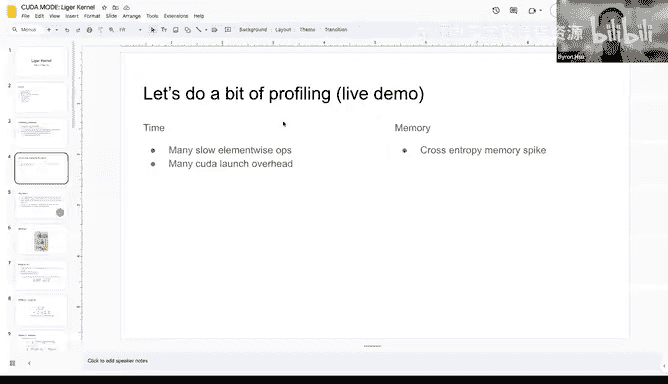

Now we need to play the elevator music。

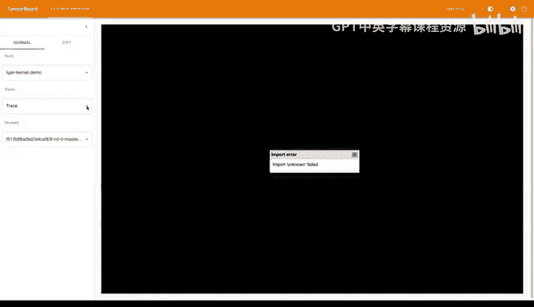

Okay， so this is the overview page。It shows you like how like it categorize different operation operations into different color。

 So you can see kernel takes up the more， the most color。

 But it doesn't mean that youre doing it in the most efficient way because you can， for example。

 you can do kernel fusion to fuse everything together and even do like some chunking to to reduce the memory。

 And let's look at memory first。 So the this is memory allocated and this is reserved。😊。

So let's not care about researchersers。 So if you look at allocated， you'll see。Oh， by the way。

 So reserve is what is shown in N V and semi。 If you use N SM， it show reserve。

And this is the actual Apple actual GPU memory it using。So you can see here like this is going out。

 going off。And then there is a spike and going down， going down。 So the first stage。

 this one is the forward pass。 And because I'm using gradient checkpointing。 So it means that。

It on so if I， if I'm on a transformer block and calculate the activation first。

 and then and move on to the next transformer block。

Then discard the first transforming blocks activation and recompute it in a backward path。

 So that's why it doesn't keep accumulating。Yeah， and for backward the same， it's the same idea。

So one thing we notice is that。This spike is very interesting。And。

If you think about what happens at at the end of forward。That is actually cross entropy。 So in。

 it means that cross entropy is causinging a lot of memory consumption。Oh， shoot。

 so cross enpy is cursing a lot of memory consumption。

And the reason is that for advanced model like Lama 3， the vocab size is very large，1，28 K。

 So give you an idea， Lama 2 only has 32 K。So for your 1208K， you need to materialize all the alls。

 which can easily be 20 or 30 GB， which is why。Cssing up the spike。And how， okay， this is for memory。

 And let's look at the trace。 I hope it works。 So to give a very high level overview。

 there are CPU string and GP string。😊，And GPU string is running ahead of CPU string。And the。

 the most consuming part is from the GPU。 So we usually want to look at GPU。String。And we can z。

And you can see。With the prefix of em， it means it is a matrix multiplication。And with the prefix。Oh。

 without prefix， it's usually element wise operation。And you'll notice there are two strings here。

 So the first string is a computation。 The second string is communication。

So this is from FSDP because in FSDP， we need to do all， two all and one reduce together。

 and you can notice that it actually overlap with the computation very well。

And the thing we can notice here is that there are actually a lot of element wise operation。

And there are two drawback of this。 The first is that we can use kernel fusion to make it faster。

 The second is that。Without fu， you will have a lot of intermediate activation that you need to need to store。

 youll wasteage the memory。So from a tight perspective。

 we can use kernel fusion tofuse the kernel together and from the memory perspective。

 we can use something like chunking to a recomputation to reduce the memory peak。 So in summary。

 from a tight perspective， we can notice there are a lot of different slow elementwise operators and many kuda launch overhead。

 And from the memory perspective， you can notice their crossenttropy memory spike。O。

And after we discovered the issue， we're looking for some GPU kernel programming solution。

And the first thing we're thinking about is actually Kuda。 but at that time。

 because I joined Kuda mode and noticed that， oh， Triton looks very interesting。😊。

So I start looking at that。 and I， and I quickly realize that it's actually the developing life cycle becomes much shorter and it's much more like intuitive。

😊，So the first benefit is that it allows much easier programming。

You can finish developing a kernel much faster than Kuda。

 but it doesn't mean that it's as easy as Pyth because you still need to spend a lot of time debugging and like。

 understand the internal stuff。And the second benefit is that it can。

 you can operate in the way that you're familiar with so you can think everything in tensor in vector。

Instead of thinking by element， which is Kuda is operate young。

And the third is that I found that is the most useful stuff to me， because it allows us to。

Easily collaborate with A researcher team， because even though they are not fully， they does。

 they do not fully understand the GPU internal self。

 but they can easily grasp the idea of the kernel and propose like， even， for example。

 if they want to add bias to it， it can be pretty easy compare with Kuda。 And they can also。

 the researcher can also help。And the third is that it's Python native， so。If you look at our raple。

 we don't have any C file， any D file。 Everything is typed。

 So you don't have to like maintain like four different file type for just for a cooler kernel。

And the fifth is that the Triton dependency is very， very good because it directly convert。😊。

Python code to PT T X。So you don't have to go to go to the kuda layer。Yeah。Any questions so far。

Can I speak it？はい。So。Maybe it's a little unrelated。

 but I just noticed in like the Ptorrch profiler that I just was unaware so like FSDP uses NCclL。

I'm just curious about that Yeah， no that was just like my question， Yeah yeah， because it's doing。😊。

Right， great GPU communication， right？And the the way provided by a media is NC and Python has a rap on top of NC。

I think it depends on which device that you're taking and which hardware so Pyth by default。

 if it's running on the nmedia type then it uses niel。

 if produce uses something else and it would take the other one so。Yeah。

And let's look at the first hands on example， which is I'm Sn。So at the beginning。

 when we just start looking at Tritan， we think that， oh， writing Tritan the forward pass is so easy。

 But we later found that oh the big truckrog is so painful。 We don't know how to derive。😊，ok。

So we come up with some tips we can use。And in this slide。

 I'll talk about some backdrop useful tips that you can take。

 And the first one is that you should think element by element instead of in vectoror， because。

Because in if you think in vector， usually there will be some because some element will be special than other elements。

 so is。Better to derive by categorization。Yeah， so just do the scalar calculus you learn in undergrad。

 I'll show an example later， and you also need to brush up on your calculus 1 or one。

 You need to learn how to do multiplication multiplication and divide another。

And the third is a very useful formula。So this， the proof is。

 you can look at the proof on website on on on web， if you want。

 But you just need to remember the final formula， which is。So for a measure multiplication。

 y equals to x。Times W， I mean， matrix times。 Well actually multiplication， multiply by W。

And the derivative is at this one， and we'll use this later in our linear cross entropy layer。ok。

So the formula， sorry， I'm going be a little annoying， I guess。

 Can you just like repeat that last part like that has said about this idea。 Okay， so you know。

 y equals to x multiply by W， right， Yeah and the， so the the。Gradient， gradient means partial loss。

 partial。Partial something， right， partial derivative， partial loss。

 partial x were equal to this and partial loss， partial W were equals to this。

 Basically is still matrix multiplication， but they just change the order。And do a transpose。呃，O。

Yeah， thanks。So let's look at IMS North。So the forward path is this。 We take this from the paper。

 which is essentially so Y I is the element。Equals to X I divided by armor times W I。

And derivative of X。Will be partial of。Divided by partial exci。

And the very important thing here is that because X 1 X contribute to all the Y。

 So you need to do a sum to sum up all the。All the all the gradient it contribute to Y I。

 So it will be like this。And we'll later break it down。To when k equals to I。And K now equals to I。

 So when K is equals to I， you can have all all this crap。 And then you later compile it to this。

And when K nu equals to I， you'll have this。But the magical thing is that you can actually compile it to a very elegant way。

 So let's look at the element wise one first。 So you have。😊，呃， partialial of partialial X。

And then you have this。 But you can compile it to vector vector form， and it will become。

A very beautiful form， just with element wise multiplication and dot operator。😊。

Byron I believe the fundamental reason why we have to manually derive the RMSs norm back is mainly because we don't have auto differentiation capability in the treatment right so whereas in the Pythtarch we have an auto di feature that does this for us or even in somehow can compile can actually do this too right。

Okay， makes sense， yeah。Yes， so so so Byron， just for what it's worth like you can indeed use compile。

 but if you want like a trick to save your sanity in the future。

 like Simpai is actually surprisingly good at like deriv some of these Simp S S yeah so you can basically you write your like you're forward and then you just basically ask it for the the backwards is a symbolic formula That said。

 I wouldn't be super surprised。like you know， I'm old enough to also have to have written my own gradient rules in models and the thing that you'll notice is that even if you write it subtly incorrectly。

 you can still end up with a model that converges Yeah so this is kind of like the benefit of like more like of the auto di approach or the symbolic differentiation approach they'll help you sound check these things a bit better。

I see。 But does it know how to like compile it to the most the cleanings form。

Like my Ill reduce it like yeah， like the， the minimal operations， Yes， with okay， I see。

But it won't do you the fusing， okay， it will give you a mathematical representation in the symbolic format。

 the fusing operations on how it has to be implemented on a kernel is something that will be left to you。

😊，Okay， I see， makes sense。And also sometimes some operators can be reordered for better efficiency。

 so those things it won so it'll give you a mathematical representation fundamentally I see makes sense。

😊，ok。And so I'll talk about the tricks we use。For I store。

 and the first one is that we in place reuse a tensor。

 so we basically reuse DY to sort the value of Dx to save memory。And we also cache RMSs。

A vector to save the T flops。 And the idea is， we actually reference from uns kernel。

So you can see our cult here。Now is becoming more and more complicated because we need to handle on casting。

But essentially can you zoom in a bit， please。Thank you。So let's look at the backward path。

 So you can notice that。The actual call of backward path is actually not that long。

 but now it looks a little bit long because of the condition。Yeah， and we do the tricks here。

So we start the IMS norm vector and we can reuse it in a backward pass。Yeah。

 and you can read the call yourself at。Like your colonel。Okay， and after you finish a kernel。

 how do you test it， This is very important。So we usually do to test。

 The first one is the correct and test。 You need to make sure the kernel is exact and precise because any deviation will become very severe。

 It will become a headache to a researcher。 And the second is that you need to perform a performance test to measure the time and memory because like with nogen。

 there's no purpose to actually have a。Custom kernel。 So we provide a。

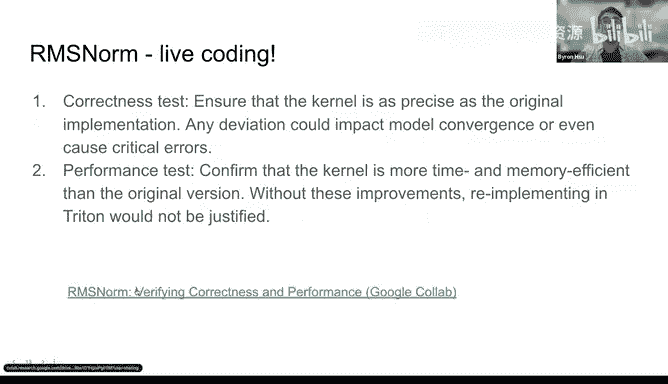

A very clean Google Cloud for you to get started。I'll probably won't run the code because it'll take a while。

Essentially， we'll install our library。And we'll try to test IMSO of our library。Yeah。

 so as you can see here， the way we test is that we first have a comparison。

So our comparison is from Hing F。 We directly copy the code from Hing face。

And another important thing is that we should， we need to test for different precision。

 So we need to test for both F P 32 and B， F 16。And the headache here is how to tune the tolerance。

And the general recommended way is that for F 32， the tolerance is this for B， F 16。

 the tolerance is this。 But this is。Still now working perfectly because it depends on， for example。

 your scale is higher or your scale is lower。 It will also affect the tolerance you want。

 So we'll later introduce like how to do the end to end conversion test to make sure it will be no problem in the production。

But here we just focus on a single correctnet test。

So you first have a a hacking phase implementation。And then， you write a test。

And a very important thing here is that we want to test multiple type。

 And also we need to test like some very weird shape because you don't want to。

 because handling out of border is very important in a kernel。

 So you probably want to write on test to handle it。 Otherwise。

 your program will entirely crash in the production so we can add something like this。Yeah。

 and in the actual testing。We just do a forward， do a backward and compare the gradient and the output。

And luckily， so in this example， we need to adjust the tolerance a little bit compared with the recommended value。

And later， we test the performance for both。From the Thai perspective and the memory perspective。

So the way we test it is using the utility， which is very nice from a China native。

 So it provides a kind of like a， it provides a decorator。

 which you can do a benchmark for speed pretty intuitively。😊，So as you can see here。

 because wefuse the kernel together。 So it's much faster than hugging face。

 And I would also recommend to use profiler to actually look at like all the operation be reduced to one。

 so you can actually understand。😊，And this， we test the memory。 We actually write this ourselveslf。

Essentially， we use torch kuta API to measure the peak memory。And as you can see here。

 we run a forward and backward and measure the peak。

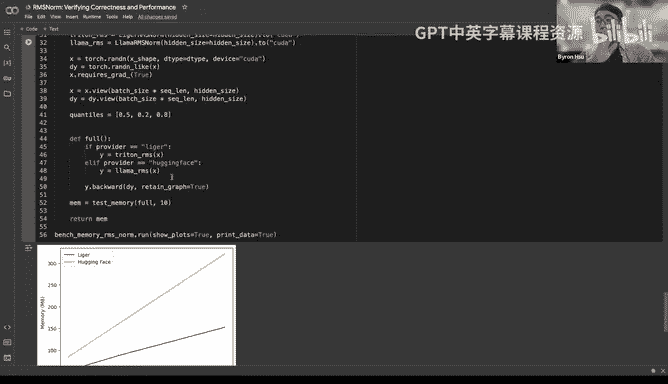

And you can see the， the peak of liger is much lower than huging face。

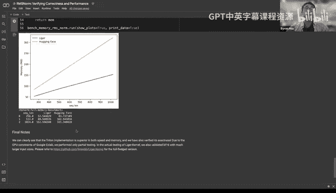

And if you want to look at the implementation， you can see the test folder。 We have a lot of tests。

 We will focus on test。Yep。And then let's move on tofuse linear cross entropy。 So。

 so so Erics asking a good question， which is that， like。

 do you actually want to support arbitrary shapes to me。

 it seems that fast kernels refusing to handle bad shapes would be a good thing。 For example。

 maybe it could have prevented the 50257 vab problem in G2。I see I see。But I think for， for M， like。

 you can really， you can really have a fixed shape for sequence dimension。

 So that's why we want to test the like。Different weird shape to make sure it doesn't crash。

 but for other kernel， we might not need to， because I know some kernel have some enforcement for the shape to be part of two。

Yeah。Mar isn't the case that 50257 is the issue of the implementation because in implementation。

 technically medinal application should be in a good power otherwise it's not going to be a performer。

It is from the input side when you do the unit testing the unit can be anything right so if you want to do a black box testing then the typical unit tester should actually think all combinations all wrong combinations first so I don' I don't think the testing should actually confine to only good types。

😊，Yeah so like I have a few thoughts here one is like let's say at least within FP8 for AO the way we handle this is like padding inner dimensions is like a flag compile also does like a lot of like padding of innerdis but I do agree like sequence length is something that you want to keep dynamic then you get into design philosophy problems like for example like in Pytorch we don't。

Prevent people from shooting themselves in the foot like basically we like we allow people to have bad performance if that's like what they want to express。

 but ideally sort of show the right logs and have the right dogs to tell people how not to get worse performance and I think it sounds like Byron made a similar choice it sounds like to me yeah。

So you mean in A O， you pad it on the hyper tensor level before sending it to the。

To the kernel is that inner dimensions only otherwise you're changing the semantics of your program for example。

 let's say your sequence length is9 and now you magically make it 10 it's a different program but if it's all inner dimensions it sort of doesn't matter right because the user will never observe the dimensions changing makes sense make sense。

Okay， so I'll move on to the next kernel。 this might be the most interesting kernel we wrote。

 So we took the idea from a Py discussion issue thread。

 And we found there a lot of different implementation， but they're all not perfect。

 because some has convergence issues。 Some are compatible with hack face。

 So we just decided to implement one on our own。 and to make it production。 great。Yeah。

 so let's look at the problem first。So at the end at the end of each large language model。

 well have input and then language model had。And apolog。And the target， the label。

And at the forward pass。You send the input tensor in and you it will produce a lot of activation。

And we call this， oh， this is Los。And then we do a cross entropy with the targets。Yeah。

And then on the backward pass。We we， we compute the gradient。Of the logics。Yeah。

 and the problem here is that because the vocab size is very large。

 So the logic is usually be like 20 to 30 GB， which cause the memory spike in the memory profiling。

And we need to come up with some clever way to deal with the issue。So let's look at the math first。

 I think we can probably skip this because time is limited。 I'll leave it to yourself。

This is much easier than Imor。Yeah， so we'll do three levels of optimization。 First。

 we'll do gradient pointing。So essentially we do the recomputation in the backward pass。

 so we don't need to store the activation after the forward pass。

And the second is that because cross entropy is the last layer。

 It means that we can actually do the computer gradient in the forward pass。

 because the the derivative of the output is is always a scar。

And the last is that we can do chunking。 So this idea is actually very similar to one paper from Berkeley。

 they do attention block by block to reduce the memory。So let's look at gradient checkpointing first。

And so the entire block here is the backward pass。So usually the backward passages need to do this part。

 right， But for gradient， if you turn on gradient pointing。

 you need to do both forward computation and backward。And by doing that， it will have tradeoff。

Which is you have to spend an extra time to do the recomputation， which is the overhead。

 But you can save the memory for intermediate activation。And but in this case。

 it's still not very good because you still need to materialize the full logics。Okay， and second。

 we deal with the。The recompation issue first。Okay。

 so we actually don't need to recompute the gradient the activation in the backward pass because we can we can obtain the gradient in the forward path directly basically in this implementation in the forward path。

 you compute the activation first and then immediately you compute the gradient and then leave the forward step and then in the backward step。

 if the if do is equals to one， you don't need to do anything。But if DO equals to other scalar。

 you just need to tie the gradient precomp gradient by that scalar。So by doing that。

 you can get rid of one recomputation。 And actually， the recomputation is。

I think it's very heavy because of the large size of language model had。

 So sorry by when you're using the term gradient and forward， like， what what do you mean exactly。

 Oh， I mean， computer gradient in forward。I'm'm'm I'm confused okay， okay， so essentially。

In the normal way， you have a input， right， And the input you put into the language model had。

You can have a logics。And then in the backward path， you use the logics to come up with the gradient。

 right， This is a normal way。But。Because。So， assume that the。The loss is just cross entropy。

 You don't tie any skillalr。 So the D， O will be one。 So actually， you know。

 the D already at the forward pass so you can use D O to do the to compute the gradient。

In the forward path。Directly， you don't need to wait until the backward path to do to compute the gradient。

Yeah。Yeah，I think you can generalize this to whenever you have like a scalar output， right？Yeah。

Interesting， I see。 Okay， yeah， thank you that。 So yeah this is Kyle thanks。😊，CTC loss， for example。

 does that。S0 loss， what's it called？C TC loss and Py c I Oh， I see I see。Yes。

 so the idea is computer gradient in rep pass and bag rep repair。 you don't need to do anything。

That's a key idea。And then because of this property， we can actually do it chunk by chunk。

 It means that we just need to materialize this part at once。So you can like， decide。

 how large is the trunk you want and reduce the memory a lot。So move on to the next page。

 We inherit the property from the last page that we do the。

 we compute the gradient in the forward pass。So because of this property。We， we can do。

 we chunk the input on the best size and sequences dimension。

And send them into the language model head one by one。So after this， youll have。

gradient activation at the moment。 and then discard this。

 and then gradient and activation in a moment and then discard this。 So you can。Now。

 the peak of memory will just be this part instead of the four logics。

And so the key here is that how to decide the trunk size。 So the way we decide is that we try to。

 because the previous dimension is hidden size and the new dimension is vocab size。

 So we try to find a scalter that can reduce the memory spike produced from vocab size to the same as the hidden size。

 So it does not increase the memory。Yeah， and this is very tricky。 I will come to read the code。😊。

How do you decide the chunk size， was it like beforehand via profiling or that yeah we。

We so the way we did is that。We assume a scalar first and then we profile it and found it's actually pretty good。

 So we just use that scalter。 So currently it's still not configurable。

 but we can make it configurable in the future。😊，Yeah。Make sense。 Thank you。

So like Barin and so I guess like in general here， the the main problem is like this LM head metrics because I guess like the the scalers would come out of it。

 which are like the final cross entropy that they are not like the the big problem， but you need to。

Get the denominator right so basically sum over all the things probably before you can turn do。

Busy chunk this up。 No， you're right。 We need to do a skill。To make it right。

 because if we're doing chunk by chunk， the scar vector is different。Is that what youre saying。 Yeah。

 exactly。 Yeah Yeah， yeah。We have a scaling。 And that also bugs for a long time。 Like we're， we're。

 we're trying to debug why the correctness is not right。 And we found， oh， actually。

 we need to scale the loss and the gradient。😊，Yeah， very， very good question。ok。Let's move on。

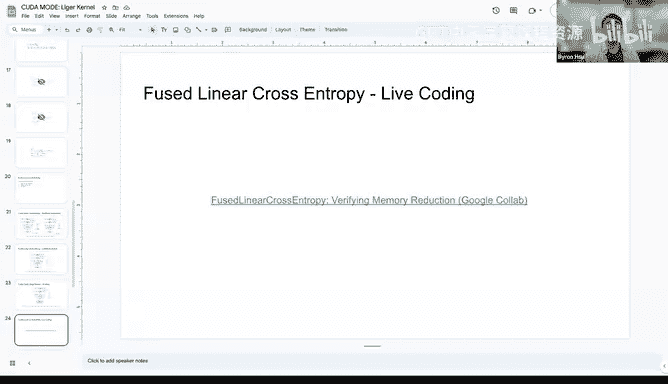

So let's look at the actual effect of this kernel。And same thing we check。

 we install likeger kernel first。And then we do， I copy this from Huing face。

And I write this on my own， using our kernel。And then， we can measure the memory。Here。

So as you can see， I use the vocab size from Lama 3。And for Ku Q on 2， the v size is even larger。

 I think it's 1，50 K。 And， I remember for drama， it's like。200 K or something。Yeah。So， you can see。

Hing phase and memory increase linearly but for our kernel， we the slope is much lower。

And the consumption is also much lower when you scale up。

And a major benefit of this is that you can either increase the best size or also turn off gradient checkpointing because for airline and training it's essentially impossible without gradient check pointing。

 But with this， you have a chance to turn that off。And this is from the speed。And oh no， the memory。

 Let's look at the speed。So as you can see here， our kernel is slightly slower than hacking face。

 but it's kind of neglectable because。Pcenttropy is the last layer。

 It is only conducted once compared with the former transformer block layer。

 So if you turn on our kernel， it actually don't speak。 don't don't slow down your your training。

But it will decrease the memory a lot。Y。So you can try to run the notebook。

 I'll provide the link later。

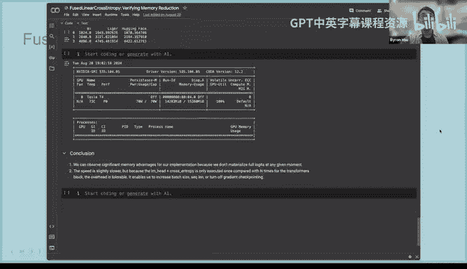

I think also with with gradient checkpointing， everybody is like willing to give up a little bit of speeches to get those out of memories away because yeah。

 but with if it doesn't run at all，'s not in some case you can test we have some we have some case turning that off internally It's working pretty well。

😊，很 nice。😔，I can talk a bit more about this， actually。没 see。Okay okay， probably no。

 I still have more。So the implementation can be found。Here。And most， oh， no。In ups。

The most important thing here is that we need to do a casting of the logics。

We need to cancel it to FP 32。Oh thank you here。诶。😔，啊老这子。Somewhere or here。Otherwise。

 you have convergence issue。 This is very important。

 and this is why most of the implementation is is wrong。

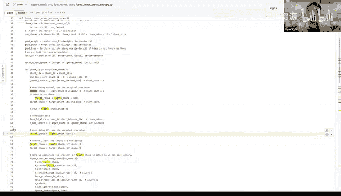

ok。

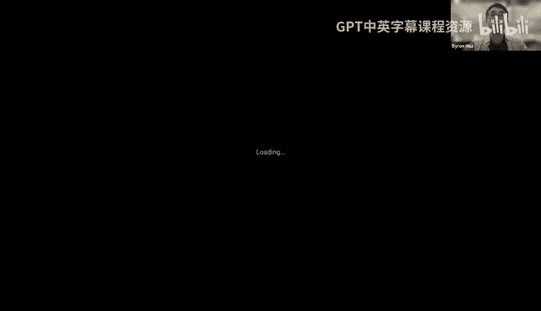

Let's talk about convergence test。And the key idea is that。We have a original model。

 We have a patch model patch by our kernel， and we want to make sure the convergeence is exactly the same。

 The and is the， the kernel are exact。And we are actually inspired from LOM Dy。

And their approaches that。They write a minimal Python training loop， and then use a dummy data set。

And then they put the data into both original model and patch model and run10 iteration。

 And at the end， they compare the logics， the weight and the loss and make it under certain tolerance。

 This is very affected and help us debug a lot of issue。

 because even though the unit test correct test is has passed。It will still have some hidden issue。

 for example， you might not handle the contiguity correctly or like some tensor shape has will crash the kernel or like the D type casting is not correct。

 just like the the linear crosscenttropy casting I just mentioned。

And this is a minimal example of how to write the convergence test。

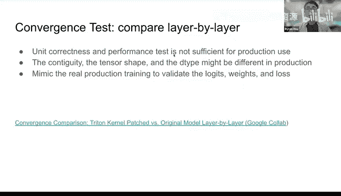

Essential。We don't have to load the model with trend model from scratch。 So you just need to have a。

Here I'm using Miral。 So Miral config and use this。To inu a model。Yeah。你身水妈妈都为啥。😔。

if I remember correctly， you already also told me that you had cases where basically all the unit tests passed。

 so is that is next time。Okay， yeah。So here is very， very， very easy。

 You can just ask tragedy B to write。 So you prepare data set first from。😊。

I believe we use Shakespeare from Kapathi。And then we patch the kernel。

And then we create a data loader。And then we create a model， dumy model。

And train everything from scratch。 and then outputll everything at the end。

And we do once without ligraphs。And with like a。Compare everything， make sure it pass。

And this actually help us catch the buck for the next topic。😊。

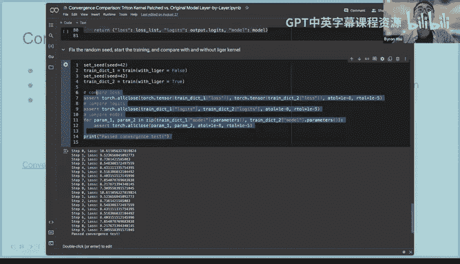

This this。So contiguity is a very， very important idea in both。

I think in all the M run time framework， like Tensor floor and Pyrch。 And this is from Edward。

Which so the， the idea is that there are two views， logical and physical view。

 logical view is like when you do tensor dust shape， the shape you see。

But physical view is tensor does strike the actual storage。Storage shape on the memory。

 And the key here is that on Ti。It operates on the physical view。

 So you need to think everything in the physical view。 So， for example。

Even though you do a transpose to a tensor。 But on in the inside the triton kernel。

 it doesn't change at all。 The the tensor shape doesn't change at all。

 The tensor layout doesn't change。So this is why we。

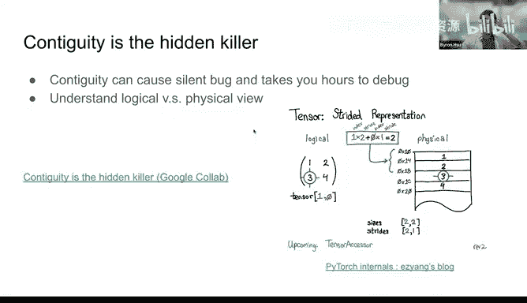

Hit the issue。So yeah， this is what NGs was mentioning， so。When we finish the rope kernel。

 we deployed it into the production。But we quickly found out that， oh。

 the loss has some high divergence。 And in the beginning without thought that。

 or its because our implementation was wrong。So we keep adding some difficult wear shape。

Correct and attached to it。 But they all passed。 It's very weird， even for like different precision。

 But we later found out is because。So another interesting thing we found is that when we are using flash attention。

 the convergence is okay， but for SDPA， it divergge and we later found out is actually because。😊。

The derivative path from SPA is not con contiguous， but from flash attention is contiguous。

 We still don't know why。

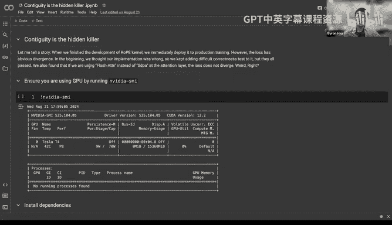

Yeah嗯。Here。😊，So this is the original rope implementation。It looks pretty straightforward， right。

 So you do a transse。And then you get all the shape， and then you throw everything into the kernel。

ok。And then we do a test here。By initializing Q And K with random value。

And we do two forward paths with a hugging face implementation and our implementation。

But we found that， oh， it actually failed。So the reason here is that。

It's because we forgot to enforce the con contiguous of tens before we put it into the kernel。

And the reason it didn't crash is because。By luck， the operation is still inside that tensor。

 It doesn't go out bound。 So it means that youre still operating on that trunk。

 that chunk of tensor but that you are doing it in the completely incorrect way。

 and it cut the incorrectness。So later we after we add this， if you run the code again。

 you can pass the test。And we catch this bug by the conversionverence test。Yeah， so the good。

 the best practice is that you should。At。AContagigious enforcement before the colonel。

 for every colon。But I think it's like only necessary if you if you can't handle the strides correctly internal。

 right， so if you have a kernel which can deal with non contiguous layouts， then yes。Yeah。

 but then you want to test the performance for both cases Yeah maybe yeah， yeah。🤢，I。

I think we tried to test it。 and it didn't matter much because the bottleneck is actually in the computation。

Yeah， it depends on what like the complexity is if you have or three operations like Numorell。

 it can be or convolution， it can be beneficial to just enforce the contiguity like this here。Yeah。

 okay， so， so yeah， you're right。 So it， it can， of course be in some cases it， it's always。

 it may be like always is's a good idea to， but， to do the contiguous。 Yeah， you're right， Of course。

 yeah。

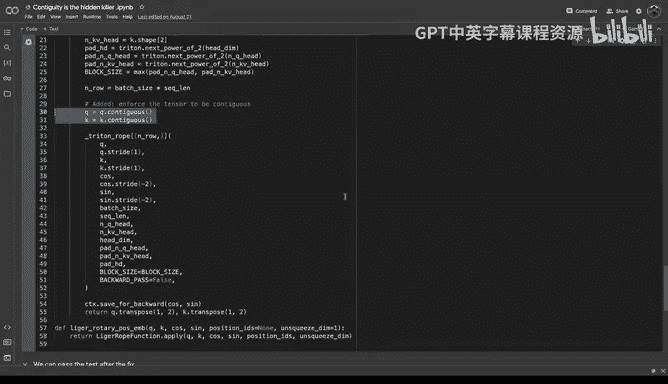

And Pytoch will do this internally too all the time too， Oh， really。You you say before Kar kernel。

 before you dispatch to Kar kernel。Well， whenever coa kernels expect this and there's many kernels and pytorch that expect contiguous inputs。

 it calls like contiguous before because as you observed for for attention like the output strides and py are in implementation detail。

 that can vary between various implementations of the same function。

 so convolution has also implementations there return differently strideed outputs。i see。Yeah。

 so next， this is， I think it's the most tricky bug that bug me when I was developing the old kernels。

 So the issue is that so in， in， in Chinaton， there is a program I D。

 basically is like the block I D in in Kudar kernel。So。

 but the problem is that program I D is stored in N T 32。And you， you always want to do。呃 at呃。

Add offset to the base address， right， So you need to do base address plus program I D times strike。

But if program I D timess straight larger than the maximum of I T 32， then you blow up。

 it will become negative and you'll had illegal memory issue。

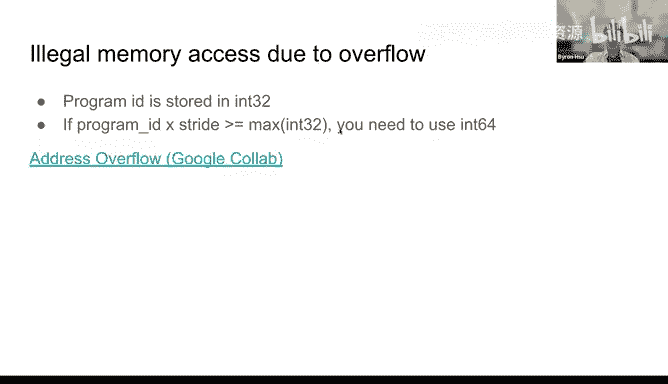

So， we found this issue。In the cross entropy kernel。Because。啊。

So this is the first three line of cross Centraltropy kernel。And if you run。If you run the test here。

Essentially， it will crash， but I don't know why it doesn't crash on Google Coab。 It crash on my。

 on my BM。And the reason is， because。So the， the size of of lodges is B times T times B。And。Oh。

Programs， I D ties wide straight。With this number can exceed。The maximum of N T 32。

And because youre using IN T 32， so it will become negative。 and you' have the illegal memory。

Soll the fix。Yes。Adding a cast to the program I D。 And there is a long discussion thread in the Triton kernel in a。

 in the Triton rep already。 So they， I think they are trying to find a better way to do this。

 but they still don't have a good idea yet。But it only happens when your tensor is very large for other kernels we don't need to cast。

But that's that's exactly the biggest problem here because like during testing and developing of the corner you may not test with like such large tensors and then you think everything's cycle right and then during production of try it with a reader so you can see here the other trouble is that 64 bit addressing is actually a lot slower then 32 and you see that some of the high performance。

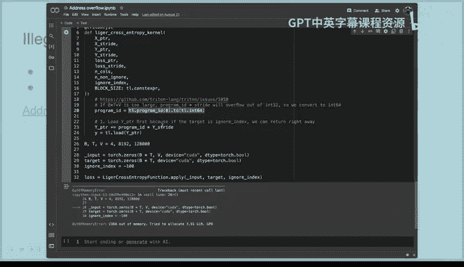

Colonnels in Pythtor actually have both implementations， depending on how low。哦， i see i see。

So batchchome， for example， has that Oh， interesting。So don do don't， iss it like。

 are there like two different implementations or is it with a if statement in in the corner。

 So theres no， it's templated。 So you have two kernels。But it's the same code。

 but so I noticed this because when I port it back in the days， when I ported batchome to80。

It was suddenly much slower and that was because I didn't think about keeping it at 32 bit address。

And this was such a trap that the tensor accessor utility for indexing tensors that used to be templated for the index type。

 but nowadays they have two separate ones because it was so easy to get that wrong and then get bad performance accident。

 I know even in flash attention， they also have。Different， different parameter for different size。

 I think。In the coolak kernel。Maybe I'm wrong。Yeah， it is very likely for anything that is。

Highly performance critical and needs to deal with large tensors and then you probably need both variants。

爱死 you爱死。Yeah， so that bug is why we have this test。 So we， we want to test that with a very。

 very large。vector， it doesn't have exception。Yeah。It's skipped though。Oh yeah， that's the script。

 no， no， no， only if。You have only if you have low GPU， low memory。

 So for A0 because our CI is running on a 100， so around this。

Oh you're running 80 gig 80 gig gig 1 hundred0 and C。 Yeah， so that's wild。 Okay， internally。

 internally say sure， We're still setting up the open source yet。😊。

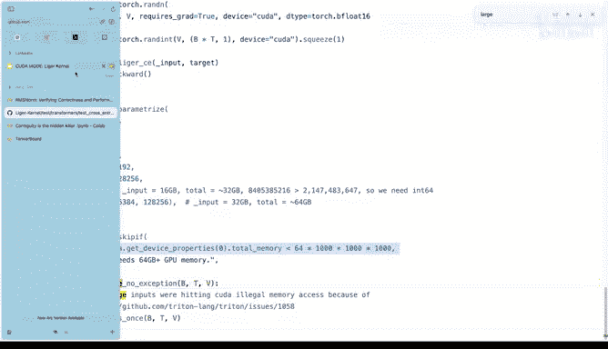

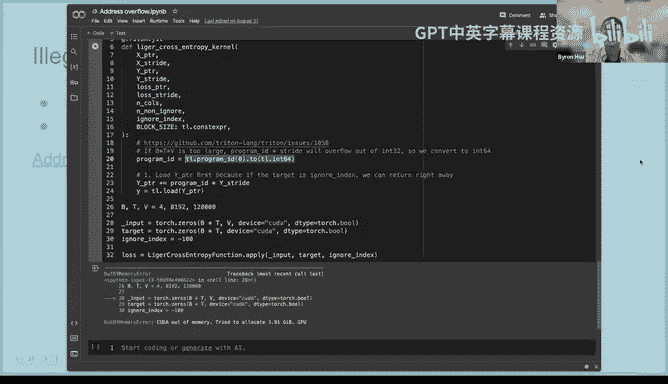

看。Yeah。So， okay， let's go for the technical part。 Any question。

I think we had like some questions back regarding the convergence issues。And whether the you why you。

 for example， need to cast or the loads and why it's not enough to cast like to only accumulate in FP 32。

 Oh， yeah， good question。wait， you mean why， what's the alternative。Im I may so just。

 I can just imagine that that you need to do it in FP232 because you have this chunk voice processing。

 the reason is that hacking phase mono called does that。 So we have to do that too for your parent。

AndI think is also very essential for。For the probability， because it's very sensitive。

 So you want to convert the logic to F 32 to have higher precision。So this is basically， I guess。

 like before the exponunciation， right？Yeah， before。Before， before。

So did you like do you know was it that you got basically infinities or。

What they like the as well won't be an A N or afinity， but it will make the convergence very bad。O。

Yeah。So at the beginning， we try to， we try not to add the casting。

 but the convergence just like vary a lot。Again， then there was another question regarding。

So since we know like the kernels are a little bit slower。

 but they allow basically to process larger patches。

 whether like those larger patches somehow are like enough to basically trade off has a trade off so that you get in the end。

 basically a larger better speed or better performance than you had。Yeah。

 so that is usually the case， and。On the other dimension is that you can try turn off gradient checkpointing。

 It will speed up things a lot， like 20% or something。I think Byron。

 one potential trick is having selective grade in checkpointing， some some kernels you do。

 two grade in checkpointing and some do not right yeah。

I think IT core team is implementing that do you have any contexts？I don't know。

I remember Horace is doing some work around it。Like automatic chunking。

 you mean or like selective gradient pointing。Yes， yes。

 I like I think some of those tricks might be showing up in this in the in the torch tied in repo。

 but I haven't been aware of them。 Yeah， so essentially the idea is that。So， for some。Computation。

 heavy operation。You can start the activation because you don't want to do recomputation。

 But for less heavy computation， you can start the activation。That's an idea。Un less heavy。

 you don't sort the activation。You can re to。But I haven't seen a good API from Pythtor yet so。

 but we are also looking at doing selective gradient pointing because it's very wasteful to do the entire gradient pointing for the transform block。

So like concretely the heuristic as you checkpoint everything except the large linear projection in the end。

 is this like a reasonable heuristic？Yeah， I think that's the idea。 I see， okay。

I'm not sure how Nimo or Me Ch handle this。I'm not sure either。Yeah。

 so in Thner we're in progress of implementing gradient checkpointing and you have relatively detailed control there Oh。

 that's nice。Buthich is neat， yeah。Mark， do you know whether like the level of gradient pointing can be put also into the compilation time。

 like the compiler can decide。Yeah， yeah， I mean， like like the compiler like I would say at least for like an auto tuning compiler like this to me feels very natural because you just like measure how long every layer it takes and then you can make decisions based on that because I guess it's like it's not like a small versus big heuristic。

 It's more of like a relative thing Like what is the I think it will also be useful to have a auto tune for like different distributed strategy like which one to use will maximize the Ts。

Yes， I agree。But I think it's very hard。It is harder， yes。Okay， any more question。

I have a non technical but subtle technical question。

 so you may or may not answer depends your choice。😊。

You mentioned that this lior kernels is actually production grade is it currently being used in the production inside LiedIn or yes yes。

 how are you integrating some with the liquor kernel based approach and some nonligor kernel based approach because now you have a combination of the two so you have to manage both of them separately。

Our API is very easy。 So you just need to add。Like it's fully compatible with hugging face。

 you just need to change one line。Yeah。So we actually don't have maintain cost。

Because if users don't like it or has some issue， they can just turn it off。

 but it's usually not the case。And how do you do multi GPU and multi node business Good question。

 So because with， I think in our experience， like also from like Pytorch block with fewer than 1000 GPUus T speed and FSDP can scale very well and it to our data parallel It means that。

HGP still S A Q single kernel。 so you can have a custom kernel plugging easily。

 We don't need to change anything。 It'll just work out lot the box。 You don't have to on。

 I think even for tensor parallelism。You don't even need。Cos kernel。

 because cancer parallelism is usually on memo。And the thing we implement is usually on Adam and wise or the last layer。

Yeah。So it just worth all the books。Interesting。Y。And it also work with D speed。

 So we have both example here。This two， this is FSDP。 This is D。

 and we will later port it onto lightning AI lightning studio。We are working with Tama Sun that。嗯哼。😊。

Yeah。Yeah， I think that occurs like asnm or rope and so on they are actually like executed。

It go on more than LGP the ranks and then yeah。Even if you have like some tensor parallel setup。

 it will it will probably work out of the most of the box because mostly the the metrics multis and for example。

 for attention you would then split at the heads。And also， for China， it doesn't have。

Its lower than the communication level。 So if you want to do any communication， you just use。

Pytherson CC CL to implement yourself and using the custom kernel。

I think the custom cleaner won't have any communication stuff。Yeah。Yeah。

 pro probably as soon as you go into sequence parallelism or something like bring attention。 So then。

 then it's。Yeah， I believe the communication is still using Pyth。 China cannot do communication。Yeah。

 sure。 But then you're dealing with parts yeah。 but， but that's like a different different topic。

 of course。 yeah Yeah， yeah， Er what are if I ask a question， what。

 what are your your future like plans and。 I think that's， there's a lot of things going on。

's so that what I can pull requests are so open today already。 and yeah。

 so we have a lot of discussion internal discussion， But I can， I can not fully disclose。

 but I can give a high level idea。So essentially， we want to provide wider model support。

And like we want to continue building deep kernel， which means that it's very perform work out of the bugs well tested。

 And also we want to provide white hardware support。 It can just work on MD and and media。

 We have already have some MD user using that and it works pretty well。

 We don't have to change anything。 Thanks to China。Yeah， that's a big road map。

 And we will probably continue。 we will continue to collaborate with。😊，All the community。

 including ps， lightning， hugging bay， aato， etc cetera。 and probably also seeking for some。

Enterprise to collaborate with this。 But we'll make sure it's a open and collarated effort。

So what's the the whole relationship of LA and torch compile for example so does it my idea is that。

They should coexist。 Nothing can replace each other because like torch compel。 I I。

 so my general recommendation is that people should use torch comp first because they really produce some very good kernel。

 But if they want to have some， for example， if they have memory constrain， they only have 40 GB。

 they can try to use our linear cross entropy。Or if they really want to write in eager mode with a custom kernel。

 they can plug in our kernel。 Yeah， I'm not sure about the thought from Mark。

I think my thoughts echo yours like very well， which is like。

I think the time range really matters as in like in the short term。

 you really need Perf like use a custom kernel like like there's just like is is gonna give you speedups and memory savings like there is literally no reason not to use it like however。

 like the main issue with like custom kernels is that they sort of like make experimentation harder as like different like models changes they're like hard to write and hard to debug So over the long term like compilers should ideally absorb a lot of like interesting ideas however。

 there's some ideas that compilers cannot absorb like basically compilers are not good at making algorithmic changes to your models to make it faster while preserving numerics compilers essentially a fusion compiler。

And so computers are better than humans at doing fusions。

 but not better at writing better algorithms so far。 Yeah I think Thomas can also talk about this。

 right？From a thunder perspective。Yeah， obviously， we're too， I mean。

 we do have some flexibility of having the user provide complex rules too。But so basically。

 you would need to know what top。Similar to fusion where you know if you have this kind of operator。

 you can fuse it and for example， Toch compileal will have templates for certain types of fusions and then you collect the operators that fit these templates。

 but yeah it's not yet fully auto。But there's lots of interesting stuff going on。Yeah。

 I'm also I'm actually quite optimistic that in， let's say like before 2030， we。

 we have additional layer on top of compilers， which is maybe like。😊。

Like as we see it currently with agents and with Ki and Ada and whatever like all these tools can do。

 which which with like can also like decide site of some strategic ways to optimize code which normal compilers would probably not see。

 but yeah， let's see。I mean， there are things like TVM doing some auto templating。

 so they even have a way to generate some of the search space that the compilers optimize over so there are like approaches to this and I'm sure we'll save more of it too。

Yep。Yeah， currently， a lot of the intelligence of the AI is still sitting in front of the machines。

Yeah。Yeah， so this is our project。 Welcome， we really welcome any contribution。

 We want to build the best open source kernel for best open source China kernel for training。

 And we started from AM training。 But now we have more requests for like multimod audio vision， yeah。

😊，And this is like people really like it。So we want to thanks the logo design from clear and unsl F attention efficient cross entropy for a lot of good implementation that inspires us and we use a Shakespeare data set from Kapathy for the convergence test and also thanks to Kuda mode that inspire me to learn Tritan and like。

Learn a lot of， a lot of things and made a lot of good friends。

 And also I would like to thank the whole team， Anime Ha Yanning from the leadership support and Xo Tang Q Q Yuun Vina。

 Jason， Steven Shiang， then for all the technical contributions。 But now， like within a week。

 we have 10 more new contributor from our and like 50 PRs majority。😊。

So welcome can any contributions。Really congrats like Bar this is like an awesome project and like to thank you for being like an early believer in Ka mode and like you know kind of graduating it out into your like own awesome project it's like really really nice to see So for basically we don't have lectures for the next couple of weeks。

 but there is like ka mode I happening on September 21t and downtown SF So if you're interested like make sure to apply we already started sending out like the first wave of invitations and those would require a confirmation because seats are very limited So if you don't hear back from you we're gonna to assume you're not coming So if you are intending to come please confirm。

😊，🎼Thank you， everyone， and we'll see you soon。 And thanks again， Byron。

 this is really an excellent talk。 Yeah and yeah， and by the way。

 if you need some idea for Tritan kernelnel for IRL， you can look at our issue。 We have some issue。

 can you can implement in the heck of if you Byron will be there。 So you yeah。

 if you'd like to meet like a lot of the people here in person just like this sort of stuff。😊。

🎼thanks， everyone。Thanks， Mad， bye。

🎼没有了。

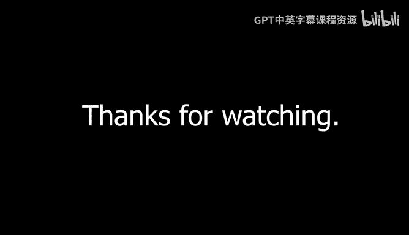