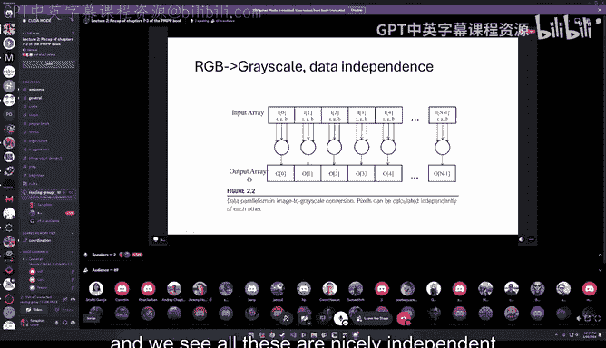
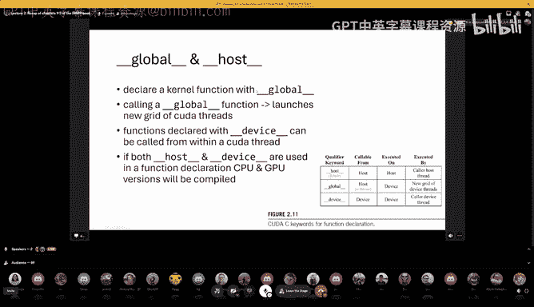
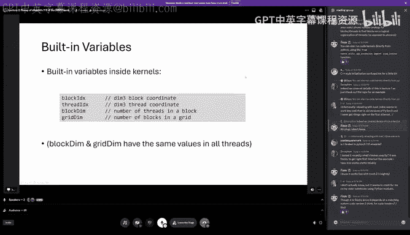
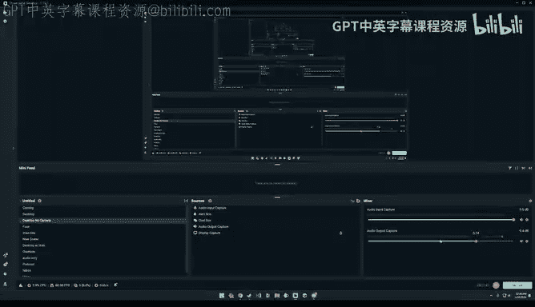
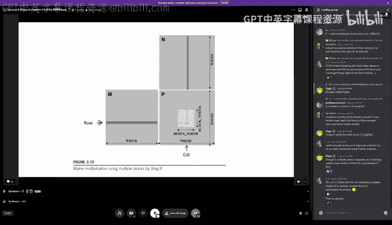
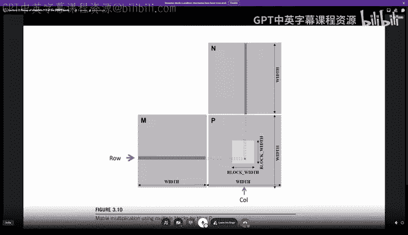
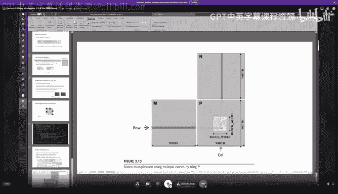
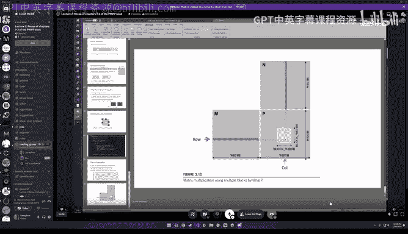
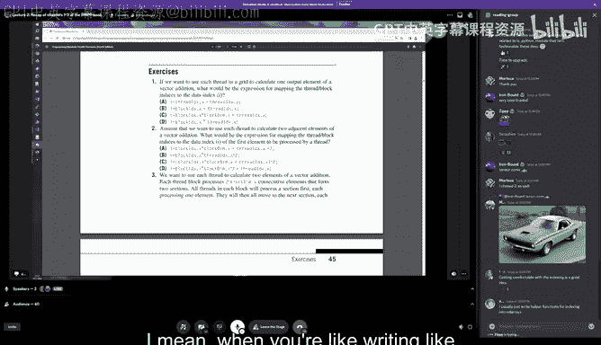

# GPU MODE《CUDA、GPU编程1-53课｜GPU MODE》中英字幕（deepseek-v3.2 - P2：-20240122-Lecture 2 Ch1-3 PMPP book.zh_en - GPT中英字幕课程资源 - BV1QZ421N7pT

Great， then welcome everyone to our。Second cuta mode session， or second lecture here on Discord。

Today I want to do a little recap of the first three chapters of the programming massively parallel processor。

Book， which we use for our reading group here as the main。Yeah， a book we read。

I assume that you have read these chapters。 Otherwise。

 probably will be a lot of material which we cover。 and I try my best。So， to。

To present it also to some people who have not read the papers the the chapters， but yeah。

Well see how this goes。 So yeah， the， the agenda for today for the lecture is basically the three chapters。

 which will read the introduction， heterogeneous data parallel。

 computing and multi dimensioner grids and data。 And we start with。

The introduction So what's our main motivation thiss also a little bit extended towards in the book Yeah。

 we want of course GPUs to goB and the compute as much as possible to get as much flops for our data processing applications at hand and why do we not want this so I think that in many cases we are trying to simulate or to process data whether it's from stock market or safe drivingriving cars and we build basically models of the world and the computer if it's in games for weather prediction Pro in folding robotics or whatever and these applications they require more and more data and we also know from AI that the big models get the smarter they become and of course also this acceleration which happens on the device side with the xerators with the GPUs。

Has effect on the acceleration of humanity， I would say。 So as we are moving towards AGI。To fix。 And。

 yeah， to solve all the problems。Maybe， like， pretty。

Preventing wars and fixing climate issues and human cancers and so on。Yeah。

So GPUs are the backbone of， of modern deep learning， as you probably know。

 and also also of many of other scientific computations。 And this was not always。

The case in the classic days with software development of software in general was very sequential。

 was programs running from top to bottom step by step and yeah。

 this was worked fine for some time because we could make the clock rates higher of the CPUs and the memory also got faster and yeah。

 this was for some time the mode to go until we finally reached a point where this growth in this increase in speed was not long achievable by increasing the clock speed because like the energy consumption and the heat dissipation was became a problem on these chips。

At that moment， the next step was to go and to parallelze。

 basically to introduce the multi core CPUs。 and this also meant for developers that they had to learn。

In order to leverage these snow because like this program， as it was couldn't run fast。

 I know in it need to be mighty threading in order to leverage all the valuable costs and this introduce introduce things like debtlocks and race conditions。

 And maybe you， you also know some of these things。

So here we see a little plot of the basically the number of transistors。

And it was like this exponential growth here shown as a linear graph basically and see at some point basically flated and we couldn't yeah effectively increase in just the speed by a higher frequency。

 So what we need to do is basically to parallellyze to have more costs and to to produce to calculate in parallel。

And this was。Then also like the beginning for for Qa or the basis why then graphics card were not only used for graphics computations。

 So Qa is all about this parallel programming， which I would call the models software development。

🎼Yeah， this G use， which we use， they have much， much higher floating operations per second。

 floating point operations per second than a multipo core CPU can do the main principle that we look at here under the whole book is discussed is like how to divide work up into。

To many， many threads which are concurrently working on the data。And this， yeah。

 it's basically focusing on the throughput。 And it is a little bit different to what CPUs do because in CPUs。

 you have if you have their threads， they can all do completely different things。

 They have their own stack。 their own nice to see that so many people join this that we even need。

The the stage channel。 So yeah， challenges with parallel programming。

 which I mentioned in the book is basically， it's easy to parallellyse。

 but it's not easy to get highest by performance。 So parallel algorithms like is in practice a little bit harder than sequential algorithm designs。

For example this。This example is a prefiect exam is a good example。

 I think it sometimes requires non intuitivetu thinking in God in order to get to a solution which is super efficient for this parallelization。

Maybe at first glance， if you to have something which is in。

was originally sequential in four loops and so on。 It's always not so obvious in。

 in every case how to parallellyse this。Then it is speed is not always limited。By like the processor。

 the direct processor speed， but also by the bandwidth but that we have two memories。

 so in many cases， we need to read something， calculate on this data and then write it back。

 and then this is the memory as the speed， which we can read and write to memory becomes the bottleneck。

Like LLMs， for example， infer are an interesting example where we generally token by token。

 and with batch size1， for example， we would yeah， wouldn't utilize the the GPU fully in this case。

 and we need to to batch stuff together and so on。Yeah。

 and also the performance of parallel programs can dramatically vary on depending on the data。

 also if you think of LLMs， we have， like， for example。

 short or large sequences and yeah it can come in for for a process very spontaneous and we need them to deal with this。

 so maybe they could be different kernels optimal for different data shapes。So this is something to。

 to keep in mind。 And， of course， not everything is embarrassingly parallel。

 So it's easy to parallellyze。 If there's dependencies in in data during the computation。

 we probably need synchronization， and this imposes。Overhead slide。

 we need to wait for things to complete。The main gods of the。

PMPP book basically to teach everybody parallel programming and also computational thinking and to do this also in the correct a reliable form that means。

 for example， debugging the functionality but also debugging the performance layer so what understanding where things are fast or slow。

And how to do what to do about it。 And what scalability， of course。

 that means how to organize our memory and to， yeah。

 basically give the reader some background some information which also makes them future proof for the next generation of device because these things likely will stay the same。

 So it general。Aims to build up a foundation for parallel programming and tech here G use as a learning vehicle。

 But they also mentioned that these techniques apply to other xccelators like FPGs or maybe like network cards or other things which also have xerators built in。

Yeah， and they are very hands on presented in the book as Sa examples。

So then let's now get to the second second chapter。

 which is the heterogeneous data parallel computing chapter。

 So heterogeneous in the book here means that we have data like compute compute on CPU in tandem with。

The GPU， so both work basically together。And the main paradigm that is advocated， yes。

 data parallelism， which means that we need to somehow break down like computations work into computations。

 which can be executed independently So this independence will come up as a pattern again and again。

 and is the the basis for this parallelization。 So two examples are shown in the books。

 of's very common for this is like the vector addition。

 and they have a nicer version which is they present a kernel to convert an RGB image to grayscale。

 This also， as you can imagine， very independent thing because every。

Pixel value can be computed individually。And so for each RGB， like red green blue pixel。

 we compute a luinance value， the intensity basically of this with a simple weighted sum formula and can then produce this step in step if we look at this how internally。

The like dependencies are the output is we see here the input array and at the top with all these RGB elements and this image and those for each of this RGB pixels we compute in one intensity value and we see all these are nicely independent of each other and can be computed in any order and have no dependency on each other。

So for computing this and in the book， we use Quda and especially Qa C。

 which is like an extension to the NZC programming language with minimal new syntax first for I think we need to remember this this new terminology when we speak of the CPU and CPU memory。

 we always of host and the GPU is here in this case。

 always the device or device going be of course multiple GPUs。

So QA C code has then this mixture of host and device code so things can run on the CPU or they can run on the GPU and device code functions。

 so which things which run under the GPU we normally call kernels as a special form of functions which are executed。

On the C on the GPU， now， if we launch， launch such a corner， a grid of threats。

 like really many threads are launched。 and basically this is the execution of the corner。

But we need to remember is that this CPU and GPU code can run concurrently。

 That means the currents which run on the GPU are they are launched as synchronously and unless we need the data or copy it back and wait for the resultss we can do with our CPU。

 other stuff in the meantime and we can also schedule a large number of currents which should be executed one after another and make like long like change of chains of these。

If you come from classic software development and have CPU worked with multi threading。

 you probably think that's okay。 It might be very costly to launch many threads。

 This is not the case on the GPU here， nobody should be afraid of launching threats。

 we can really go in the thousands or millions of threads。 And this is like。

Both the hardware designed for。 So， for example， one thread power output potentialtensza is a super common pattern。

 and it's also super fine to do this。So let's maybe look into this example， which also in the book。

 the vector edition， how could we like， if we had the vector edition written as a for loop in classic CP CPUU code。

And we would now try to， to make this faster with the GPU。 So the。

 the easiest way is we could outsource basically order the work to the GPU and how to do this in an naive way。

 we would need now to allocate memory on the our GPU to hold our vector buffers。

 We would then copy them。To the GPU， we will launch our kernel to do the actual additional operations。

 And after this finished， we copy everything back to our host memory on。

 on our CPU memory and finally need to， to clean up。 This is， of course， only like for this。

Toy example here， which to， to show basically all the steps with， which are necessary and to end in。

 in a real world example， of course， we， we would have like multiple comp computations on the GPO and try to hold data as long as possible。

Because foresee in this example， the amount of data transfer versus computations that we do is very it's a very bad ratio。

 nevertheless a good example and shows the full process of things。So， as you can。

See here and this little figure is if we have like input elements X and and and like input elements。

 y。 So two vectors for each of these elements in these vectors。

 we basically launch a threat on the GPU to compute the output vector which is called Z and this we can also see like all this addition。

 of course， operations are completely independent of each other and they can can be run in parallel in any order。

 So he also this pattern again， one threat per vector element is used。

So to do now all the steps that I lined out for which we need to look at the essentials of QA functions which are available memory allocation is one of the basic functions here。

 as you know N video graphics cardss GPUs come with their own。

Memory and we'll also later in the book learn about different kinds of memory here we are。

 most of all first concerned with this global memory and to allocate in this global memory we can use cuta meoc and to free the memory can use cuta free。

 so the size of memory that we want to allocate it as specified as always in bys。

 as it would normally also for melo and see be the case。

A special is that we basically get or right past the pointer of our device memory as as a pointer to a pointer where Humatic then stores the address of device pointer in the book。

 there's always the convention that underscore D is for the device pointers and underscore H is for the host things。

So。The next thing is， of course， if we have something in CPU memory。

 we need to bring it first to the GPU memory in order to compute then or kernels on it for this。

 we have Quda Memcopy， which does the host to device transfer， goes in both directions。

Compar to normal M copy and see we have。First of all， it was a destination pointer。

 we have a source pointer size。 and then basically likeam which define。

 which verifies in which direction the copy operation should happens。 So for example。

 host a device or device to host is the other way round。 So normally we copy first to the device。

 then do some computations and later transfer back to the CPU memory。

Then there's also this error handling just very briefly， there's all these functions， for example。

 also Qa melocua free and all other functions they return like a Q to errorRT type and if we could can check this and if it's not Qa success we have a problem and it can also then look up what's the error code and get a string representation first of course of course it's good to always check in this examples we don't do it but in the real application you would normally do this。

Okay， now let's go to the nity details of like calling our accounts， actually。

So launching these componentss is which means like we launch these massive like gridit of threats with threats which are simultaneously then computing。

 The thing is here that all these threads are computing with the same program。

 So it's a single program， which is running on like multiple data。

 So the single program multiple data paradigm。And internally and included these threads are hierically organized into grid blocks and threat blocks and we'll see more in detail what exactly this is。

 but for now maybe remember that 1024 threads is the maximum number of threat blocks of threads in a block that we can launch these threads inside one thread block can access the same threat memory we won't use this in the first examples in the first chapters here。

 but later will become very relevant。Yeah， and now since all these threads are executing exactly the same code。

 of course， the question is how do they how can we do useful things with them because it wouldn't make sense to like compute a billion times the same value and this is done by like build in like build in variables help us now to to decide the identity of each thread and thereby also to do what to do in this specific threat So we have two variables one is called block ID。

 the other one is threat ID and these coordinates allow us in a thread。

To identify what basically through， for example， in which portion of the data。

 which output elements we should write， which input elements we should read。

 And so every thread is uniquely identified by these two。Varis and thereby yeah， knows what to do。

 and they all can execute and do their work。You can also think of these two like hierarchy hierarchy layers this analogy in the book is like this as a phone system。

 where you can think of block ids as the area code and threat ids as the local phone number。 Yeah。

 and you of course know no， need both together if you want to do long distance code。 Yeah。

 we have also other variables， like， for example block dim。

 which tells us the number of threats inside。A block。 And yeah， if you see in the lower line。

 you know， if we can we can how we can use these things， for example。

 to calculate an index inside such a threat， for example， for the vector addition。

 we can take here the block ID X X element times the block dimm X element plus the threat ID X and this gives gives us the index at which we can read and write。

So again， these threads all execute the same kernel code and you'll see here basically we have this I index and depending on which block we are and which thread we are。

 we can now get this index and we will then definitely of course。

 calculated a little bit different reside depending on which element。

 which index we read and where we write。So all the blocks now do this concurrentency。Yeah。

 then important things you would notice in。Ca code is underscore underscore global underscore underscore these things and also the same for hostt show you basically the compiler where this function should live。

 So the kernel， for example， always has to be declared with the global specifier。

Which then means that we this function will launch a new grid of Qa threats。

 There's also something called device or like similar thing for device。

 which can be called from inside kernels as functions， but it doesn't launch a new Qator threat。

 and it's only accessible from within。

Coon。And there's also some basically host which is the default barrier which you normally don't have to specify。

 but if you want to to have a function which both call away from within CPU code and device code。

 you can make it a host and can both specifiers and the declaration of the function and then you basically get two versions which are compile one for the CPU and one for the GPU。

Okay， now let's look all together hit。What's this respect to additional example。

 How does it look here again， the strategy is replace loops by grid of threats。 And yeah， one。

 one thing we need to be aware of is since we during kernel launch。

 we specify the number of blocks and the number of grids。

 this may not always be like completely align with the actual data size。

 So the actual data size may not divisibly directly by the block sizes。

 So we need to check bounds here， which is done here in line。

6 of this kernel where we test if the computed index is like inside the bounds of our allocated data。

 And only if this is the case。We do the basically the right operation。 So some elements。

 some threats of our total threat rate which launched will not do their work because they just。

Are not yeah， they， they would be outside the， the data structure。

 We'll see this also later a little bit with the， with another nice example。

So in calling these kernels， you will notice these three times less and greater things inside your code which are passed before they are basically not structures as for normalcy。

 but Qa specific things for for launching kernels。 and with between these two markers basically you can specify the parameters for the kernel launch。

 which is mainly the number of blocks that should be launched and the number of threats in each block。

Yeah， we later also see additional parameters like short memory size and cuter streams。

 but they are optional。 And yeah， for now， we can basically ignore ignore them。 So for example。

 the vector addition kernel。If we have a vector with n elements。Yeah。

 we now can compute the number of blocks we can here， for example， as a constant。

 say that we use 256 threads。 and then in order to get the number of blocks。

 we use this basically ceiling division simply to find the number of blocks so that we have enough blocks to cover the whole。

Yeah， the whole vectors， the space of the vectors and。Of course， the， yeah， we。

 we need the total number of like threats， which is launched is in in like at least the number of elements that we have。

 it can be also bit larger as we saw them we need to take the care of this boundary conditions。

No to the compiler and yeah， with this cuter code or normally goes through the NVCC。

 the NVD C compiler， which is used to compile the currents into PTX code。

 PTX standss for parallel threat execution， which is the lowle virtual machine and instruction set。

 so normally the circuit asmbr form or in text form generated。

 which is stored compressed as we found out recently inside this intermediate files and。Yeah。

 during like for the recomput， then the graphics driver jits this basically into execut binary code。

 which is executed actually on the GPU。They also can be device specific。

Okay now let's look a little bit into the final chapter here， which we for today。

 which is this multidimensional grids and data。 So there we got look look a little bit closer at this blocks and threads so again。

 Qa grids which we launched have this two level hierarchy of blocks and threads。

 the journal idea behind these things is that we can map multidimenal data structures。

 two threads so that if you have like for example， an image which is two dimensional so that we can easily process this inside a corner。

Yeah， with these。嗯。Yeah， basically inside one block also mentioned this they can all access the the same shared memory there's in a total max maximum of of 1024 threads these block and threads are represented internal internally by this built in variables called block ID X and thread ID X which identify the portion of the data to process and we get also additional variables for the ape。

again， again， you mentioned like grid dim， the number of blocks in the grid and block dim is the number of threats and block grids not so often used。

 but block dims comes up more frequently being order to calculate indices normally。So here。

 a little like figure about I drawing thing things going on。 So we see a two kernels。

 we can ignore this kernel2。 It's only should illustrate that multiple kernels can be launched on the device。

So if you look only on corner  one， this' corner one。W this grid of different blocks。

 And we see these blocks have here， these coordinates， for example， here，2D coordinates。

 The first one has 0，0 and so on。 And each of these blocks then internally has， again， threats。

 and these threads also have coordinates。 So here has shown a 3 d thread structure。

So basically with yeah， this cube structure， as you can imagine it internally and for each of these block this cube structure is executed and in order to get the full identity we take the threat ID and the block ID and can then calculate which threat we are and thereby also like use this as information to access data。

Yeah， important to notice that this grid can be different for each kernel launch。

 so it's normally also dependent on the data shape。嗯。

And we can also little bit decide for us for performance reasons to how how large the blocks should be and so on。

 It depends like on cash， Use it and multi。Other things。嗯， yeah。Again。Ts are very cheap on GP Us。

 And it's like these grids normally contain thousands or millions of threats。 absolutely normal。

And a strategy that we often often see is that one thread calculates one output element。

 and this can be， for example， be a thread emits a pixel or one tenor element as an output。And yeah。

 note that these things run in any order。 So there's in the Qa memory model。 there's no。A guarantee。

 unless you use synchronization operations。 So， for example。

 a larger threat I D X may not indicate that this threat is running after some other threats with with the lower credit ID D X value。

So in general， they， you have to assume that they， they are randomly scheduled。

 They will be some internal order of course， but it's。

 we should assume that it's that we don't and know how it's scheduled。

These three dimensional things also we can use。Less than three dimensions is just simply by setting things to one。

 So here's an example at the bottom， for example， for very common is like that we only operate on one dimension as sequences。

 and in this one dimension a case， we just leave the other elements of this grid dimm 3 values 01。

For example， here we get like quite of 32 blocks and each block of 128 breads in total。

 like 4096wood breads which are executed。Okay， in the building variabless， we already had this。

 I think I can skip skip this。

This is an important point， depending。On how well， you know。

 Tensos and how they work internally like this multi multi dimensional array structures， which will。

 we will come very often， which will work with very often in Qa。

They have a certain layout and memory。 and normal memory is always like a flat1 D structure。

 And we have logically， then in。Some other shapes， for example。

 two dimensional mattressrices or higher dimensional utensilors。

 And these here's a nice example where you be see。This metric structure。

 so each of these numbers here represents。 First of all。

 visit the the the row and is the first coordinate And the second one is the column。

So and we see here a layout of the memory， which would be called the row major form of this metrics。

 which means that all elements in a row come after each other and we see the color。

 the purple colors come first then the green ones， the orange ones and the blue ones。

And this is not only the the， this is the this is the very common and also in the standard form of representing representing memory。

 but it's not the only form we can also have like column major， for example。

 for these two dimensional matrices， which also used， I think in patronron。

Where if you look at the memory， ABC， D， E， F G and so on， would be linear in in memory here。

 logically in the metrics， it would be like the represent the columns and elements in the column but follow on each other in in torch and nuy。

 for example， each tenor can have represent both of these types。

 it's like internally defined by the strides which define basically whole file you have to go in this dimension。

 to the next yeah， next element of this dimension， for example。

 here for the in order to get to the next。row， it would be four elements。 And after four elements。

 we would always end up with the next row。 So we get the stride for the row would be4。In this case。

Then they have two examples， very nice， which I also coded added to the to a repository for the lecture today。

 the one is image blur example， which is you calculating a mean filter。Over the image。

 So for each pixel， it looks at the surrounding elements in a certain radius and sums them all up and divides by the number of elements。

Calculate the mean value of this pixel， which gives you this。Very simple and nice blur filter。

Also the again， the strategy is to that each thread operates on one output element here。

 Now new is that each thread author reads multiple values。

So， we have。Yeah loops inside the corner to do this in the in the book。

 there's like for a single plane。 only the code。 I've extended this for the multiy channel plane because it's very trivial。

 I just need to add one further variable before the。Other color channels。And yeah。

 it shows in the book the row major P memory access for input and output pointers。

 And you see that it tracks how many papers how many pixel and values are sum。

 And hence the boundary conditions。 And that's also what I wanted to quickly show here。

 the boundary conditions。 So if we。We take these like radius 1。

3 by three corners for each element They are basically 9 pixel values red。 And then in the end。

 if it would be in the middle of the image， it would be divided by 9。 But here we have， of course。

 also these boundary conditions。 So for example， the the first pixel。

Would read outside the image which we can't do so in reality we only have four pixel videos and we need to divide this by four not by nine as full as full pixels would do。

 so we need to take into account how many pixels we actually regret and count this and and then do the division。

Accordingly。Yeah， and you see you know， there， of course， different things It can be like  four。

 these have， for for example，6 elements which are inside the image。So depending on the situation。

 you get different boundary conditions。So this is the screenshot I made from the kernel that I brought now from Its a visual Studio code。

Yeah， you see this mean， oops， this mean， sorry，1 well。 this mean filter corner。

And gets first parameter as the output where it should bright blue and an input of this image with height and the radius。

Yeah， and you basically can calculate thear and the row from block I D X and block dim and thread I D X。

 So we take the x values here for the column and the Y you use for the row。

 And we have like with this what I added， like a channel in for the image which we where we want to process。

And the threat Is Z value。Oh no， I this。And happy screenshot， actually， as， I should。

 I should show you directly in the code Wait。 Sorry for this。So this okay here you see the meat。

 I hope you can see this。嗯。Yeah， so important is we have these values like the pixel value and the number of pixels which we count So for each pixel now we go over this whole radius of minus plus things which could be computed so we have this rectangular of this square area basically around the pixel and of course we need then to look at these things are greater than0 and smaller than the height and also the same for the width。

And we have， if thiss the case， we can add it to the pixel value and also count this pixel。

 And later we will here then take the full。Accumulated value and divided by the number of pixels which we have。

 and we can also。Ca now execute this here。 So as input image， I。I have taken this grey Hopper。

 This is like the input image。 And it's I used here Python Pytoch to to compile the kernel and to basically load also the image with a torch version and。

Con convert to Cuda， which helps me a little bit cold then out the extent of this mean filter kernel。

 which we just saw and write it back as a P And G image。 And if you looking now at the output。

 we see here， the nicely blur version。Could not also， for example。

 specify a different value for the for the。Radius， like let's set one instead of 8， for example。

Recalculate this。 I don't know。 I hope it doesn't have to。And we see now the it's much less blurred。

 but still， maybe I don't know if you can see this with over the stream yeah so。

Like the different parameter of this。 Okay， then back。嗯。Back to presentation。Pro most。

I think we were here。And the， the last thing that's。

In in the book in this chapter is the matrix multiplication。

 of course metrics multiplication is the staple of science and engineering and also deep learning the main motors or the main thing that is done in matrix multiplications is inner products of rows and columns of the source matrices which become then the products become the elements of the output matrix and here in the book there's also like simple strategy again shown one thread output matrix element。

And they only do it in a simplified form here for a square metrics where rows equal the number of columns and。

嗯。Yeah， you can see that it's very similar to， actually， to the blur kernel， for example。

 it also here calculates basically the row from block I D X， Y coordinate and。

B dim y and threat Ex y and the same with x for the column。

Then does this boundary condition check here that we are still inside the。met， yeah， the metrics。

 the source metrics。And then we calculate create basically here the dot product value。

 we run over the。Over all elements， which is in this。Yeah。

 where we have here like two matrix6 m and N。 And for the M matrix， we go。

 we go over the row and we for the n matrix， we go over the column we。

Yeah multi together edit and as the scalealar product。

 the top product and write it out then to the P matrix as it the result。

We can also see this here maybe very nicely in this diagram。

 we see the P metrics is our output metrics， and we have like M and M like M is the。

Left side on the matrix multi and the right。 And here from from M， we write read rows and from N。

 we read columns and each of the rows and columns becomes one element of P。

The strategy， how the kernel is launched and how it was configured here that this is using this block tiing。

 which has， of course。The advantage that we have some data localities that means all， for example。

 all elements here in this row of the target will all read the same elements from M。

That is the same what you for in the row would be the same from from this column from M and。

 And this is yeah， depending compared to in a E way， we would like go left to right。

 this has a better cache efficiency of course， but in general。

 metrics modificationplications that already some kind of be which can be super optimized and different surgeries can be implemented and there's also。

Yeah tens of cause， but we don't know。 Maybe we'll look at this in the future。

 So specific elements on Qda GPUs， which。Help us to do matrix modifications faster。

Okay， and this basically is all for today， which I wanted to recap for the three chapters。

嗯。Maybe can。

And it's also something I wanted to to look look a little bit at the exercises。

Here this further lets， let's look at the first ones to。I don't know if you can see this。

 let me make you this larger。😔，So these are the exercise of the second。

Cha。Where we basically are asked to okay， how to generate indices from this block E D ID X and thread ID X values on what can we do for this so。

嗯。Yeah， I think。IfWe already， if you， if you saw the stuff that we had， we noticed that that in。嗯。

That we， for example， here can use for this vector to addition thing。

 which is like the one dimensional case we take like the block I ID X X values and times the the number of threats that we have in this blocks and the x direction。

 which is this block dam X and again at then the the thread ID X value。To find the。

 the final the extraist threat that we want to work on。Yeah嗯。

I don't know if you should go over all all these things or if somebody had problems with some of the them。

I think they， yeah。Yes for Cl question for。If， if elements are。Like processed in。

Like two adjacent elements at a time。 then we get。Lots of different combinations again here。

 and here is， but basically the same as we had above just， but now with with times 2。

 which would be the correct solution here。Yeah。So this one actually the third one was irritating me at when I saw it the first time。

 so we want to use each thread to calculate two elements of a vector addition。

 each thread block processes two times block dim X consecutive elements that form two sections。

 this exactly what are these two sections and all threads in each block were section first each processing one element and they will then move to the next section。

 each processing one element。Yeah， and assume that very I should be the index and so forth。 So here。

I think the correct thing is this last one here。Because basically， it's， it's we。

 we now have to specify or rec createate the in index for the first。Sections， so to say of this。

These two consecutive。Elements here。 and although like the all these sections contain， of course。

 twice the number of elements of threats。We here for the first element would be because the first limits would all be behind each other。

I use this one here。Yeah， then maybe this is like， of course， simpler questions here。

 If we have like a vector element with 8000 elements and。

The thread box sizes for two to the ball of 10。 so 1024 then。

We know that all these threats are somehow scheduled and the questions on how many threats are integrated grid in total and yeah。

So we would round up this。 We would divide this ceiling to by 1024 and reach， Yeah。

 in the end like this，1 8192 as the the nearest。larger than 8000 multiple of 1024。Regarding yeah。

 how to use Qa melo。 So if we， if we have V integer elements and we want to allocate， we need。

 of course， to use v times size of in because we've done to specify the number of。Bys。嗯。Yeah。

 then here again， with this pointer to pointer thing。

 So the correct way for Ka melo to get a pointer is this these stuff here， which would be specifies。

And pointer to the a device variable a device pointer。

 which is then becoming a pointer to a pointer interrupt but like we're sort of closing on time。

 So if people have any questions or points they'd like to make feel free to drop something in chat or raise your hand that I can invite you on stage in the meantime yeah。

 like at least like from this chapter， my impression was doing exercises123 is really。

 really important。 the others are sort of like easy syntactical questions that you can get right if you scroll back through the book。

 but like this having a conception of like reinterpreting your tensor as like a 1 d vector and figuring out how to index into it is really。

 really helpful to just like sit down and think through for like as long as it takes。

 I think when we we start getting to performance considerations we'll start sort of seeing how。

if you have like very irregular read patterns， then you can't do like vectorized like loads and that's going to be bad for Perf and we'll talk about that in two weeks。

But overall， yeah， like just like having this conception， you know， like you。

 you should be able to sort of like 3，60 No scope the first three questions。 It's gonna be very。

 very helpful for the later content。Yeah， I so think that somehow if you have done this a couple of times。

 it becomes really intuitive。 And， I mean， you can always make mistakes don't get me wrong。

 Like always make mistakes with corners and they， they compute something which they shouldn't， but。

Yeah， this is actually I think harder to explain and to grasp first time than just then later when you when you are used to it so。

In the beginning you made， for example， ask。A these。Basically threat ideas。 also。no。

 do they they separate from the block I Ds or are they counted like still upwards after reaching the first their。

 their first highest value of the size of the block。 And yeah， you have to， of course。

 realise that it's like they always go from， from 0 to the number of their block dim。

 and only the blockss count up。 and， But， but then， of course makes， otherwise。

 it wouldn't also make make sense。嗯。Yeah， so the， the other sort of， I think， really key thing for。

 for me， like going over the stuff was。Like， like typically， I mean。

 when you're like writing like any sort of like CPU based program。

 like writing like multiple threads， like there's still like an overhead associated with it because like。

 what is a thread， Like the thread is also like a representation of the state of your program at a point in time。

 So this includes like。

Like an instruction pointer， this includes like your program and like the data。

 basically the of the state at the point in time of your registers。

So the reason why threads have overhead is because。

 like you basically need to snapshot them like as you're switching from one thread to another。

 you basically save like like like save the state of a thread and load another one。

 The interesting thing about like Kuta。 and it was just kind of counterintuitive is there's no like。

 you're never like loading。Like， you're never loading out the state of a thread。

 Like all of your thread state are present at all times。

 And so launching yet another thread is not a big deal at all。 And is just kind of like a。

 like a mental block。 you'll get in the beginning。Yeah， it's not this context switching。

 which is like the big performance issue for normal mightty threading。And and few coeric views。

But by the way， so one thing is like this regarding this error checking because I， for example。

 today had to add this error checking which first of all。

 my current was not computing anything and I had omitted this error checking。😊。

Because I found out that I was。Using Iq toolkit12。3。 And。

 but my economy on WSL on Windows is only 12。2。 And so it can be really helpful to have like these things here。

Which help you to， to get in like a little error message for your test。To find out what went wrong。

Yeah， so this， this code， by the way， is already online as I made it public on Github and on our Qer mode。

嗯。The organizationganization， and then you mode lecture， too， can also share the yeah。

Look at this link here where you find the different kernels。

 So the the vector addition kernel I have brought as a normal Qa program and the RGB to grayscale and mean filter。

I implemented as P as Python Py to， basically as extensions using the inline extension function。Yeah。

 the the metrics on interpretationplication had no time。 I will add that later。Sorry。

 it was really specific for me。had some， some。Stggt to find the time to to prepare everything for today。

 I think matrix multiplication could be its own like series of lectures。 So so it's okay。

 I think there's sort of like a lot of nuance there。 And we。

 we need to talk about like block based programming。 I think it's kind of a good intro to try to oh。

 I see Jeremy wants ask a question。Well， I'm just going to comment on the matrix modification thing。

No， no， I thought it was really great today。 but as， as Mark said， it is a really big topic。

 And I just wanted to see like this is a way to find out whether people would like to hear more about that。

 because I do actually have。😊，I don't know。 Probably 20。

25 minutes of material on that explaining like I wrote kind of the equivalent of a kernel launcher。

 bit imp pure Python to show how it works。 And then I kind of have a pure Python version of。

A colon then you could step through if people would like to。

Understand the matrix multiplication one in more detail。

 I'd be happy to do that like some other time when。Jeremmy。

 I know if you volunteer here for also presenting we always looking for people who want to。

 to show some relevant material。😊，On now cute remote sessions。 So， and I think it would be。

Super great to to go more into detail of different ways。 I I think you went over a chat already。

 people seem excited。 Like if you're interested in doing it as soon as next time。

 feel free to bring me off the stage if too much。I think that will happen， but yeah。

 so let us know like I mean， we'd love to have you as soon as possible。

 so just let us know what works for you。2。Yeah， cool。 Maybe then we。

 we cut it off for this hour and for the video stream and。

