# GPU MODE《CUDA、GPU编程1-53课｜GPU MODE》中英字幕（deepseek-v3.2 - P30：-20240928-Lecture 29_ Triton Internals.zh_en - GPT中英字幕课程资源 - BV1QZ421N7pT

Yeah， hi everyone， welcomelcom to our first lecture here under our new brand GPU mode。Today。

 I am glad to have Cap Ramma here who will give a talk about the internalness of the Triton compiler。

😊，So as a background Cbri got farther in August and during this time he wrote a threepart blog post about the Triton compiler ins which I also asked them then if he could do this I go through in the video presentation form because I think it's super relevant to a lot of people are super interesting。

 for example， I myself was always curious to learn about what's behind the Triton surface which I used most of the time I only look very briefly into the source code and so on。

 so I'm very glad that he's here today to talk a little bit about the internals and so that we are now basically can learn something about the magic which is happening invisible in the backend of the Triton compiler。

Yeah， just what note， normally this takes like one hour。talkks。

 if you have questions please use the reading group chat。

 which we will then try to forward to people during the talk and as general we like Mark was very active into getting our new speaker so we will have a lineup。

 We have a super great lineup until basically Christmas this year。

 So like check out the events tab register for the upcoming events。Yeah， Cap。

 I may now give our hand over to you。 Please get started。 Thank you very very much for coming。

Sounds goodHey everyone I'm Capel so and I'm an engineer at MERA I primarily focus on Vexus ranking focus Inra at MERA but love Trident so this was essentially I mean the blog posts came out of just my interest in ML compilers so I just wanted to dig into Trident and that's where all of that content came from so about me I sort of already mentioned that I work in MERA so this is my public info if folks want to reach out。

😊，Now we've had a series of talks on Triton before， we've had the original Triton kernel stock。

 Triton 101 where you learned how to write Triton， there was a fusing kernel stock using Torch compile which I did a few months ago and then there was a recent Lger kernel stock as well why Triton。

 I guess I don't need to convince folks in this group like Triton is loved by researchers and engineers and its essentially like has reduced the research of production time。

😊，But suggest like you can。Get a research idea into production fairly quickly just using Python style DSL。

 which gives you a near optimal performance and in some cases better than sort of the libraries Ndia。

😊，Now what what we see on the surface is essentially like a python style code right and what under the hoodd a tritan is is fairly。

😊，complex compiler and code generation machinery it does a lot of cool stuff for you coolest to the Triton team on that and there has been a lot of work happening in the Triton space for the last two years which willll cover a little bit as well but yeah the reason why I'm personally interested in Triton is essentially my motivation is I can write PiyTorch and I can use Toch compile to generate a Triton kernel and then I can target any specific target hardware from there I'm sure folks who were there at the Triton conference I wasn't unfortunately but there were some really cool talks on like recent developments working on Intel GPUs they were also Triton CPU work and there were some talks on the custom。

😊，Customom chips as well so a lot of cool stuff happening in this space and if you want to look at the blog post I also linked them in the in the in the slides here now in terms of agenda will briefly cover the Qa and the triton compilation process like how it works we'll go over a simple like triton kernel example。

😊，and also go through the Jit compilation process like how that works after that we'll dig a little bit into how Triton uses MLIR and do a little bit of an IR walkthrough。

 essentially what Triton generates under the hood。😊，And from there we'll hopefully if we have time。

 we can probably write like as example compiler pass in compiler。

 something very simple like a hellello world。😊，Now I'm sure a lot of folks are already aware of how QA compilation works and I don't claim to be an expert in it。

 but I essentially just briefly cover it at a high level。

 essentially whenever you're compiling QR targeted code you will so NVCC toolcha will take your host code compiled using a standard CC++ compiler like Gcc Kang and also the device code gets compiled down to your PTX or a F binary Cuban and then everything gets linked together to a standard C++ compiler to give you an executable this was a slide that I found in one of NVDS conference talks which covers it in much better way than the text that I had in the previous slide essentially you take take the frontend QA CC++ code goes through the CICC optimizer。

😊。

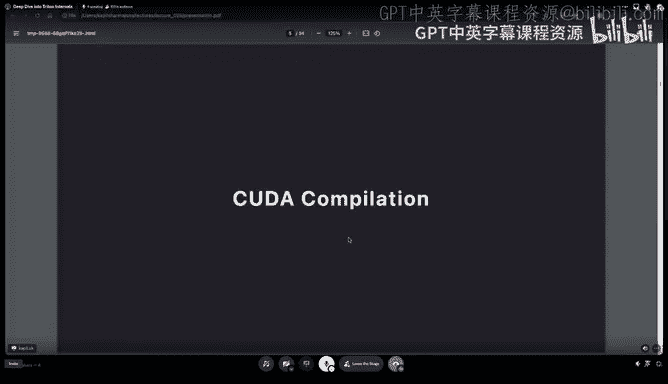

Cendrate PDX assembly， then you have the host code goes to the host compiler。

 everything gets linked together to get。

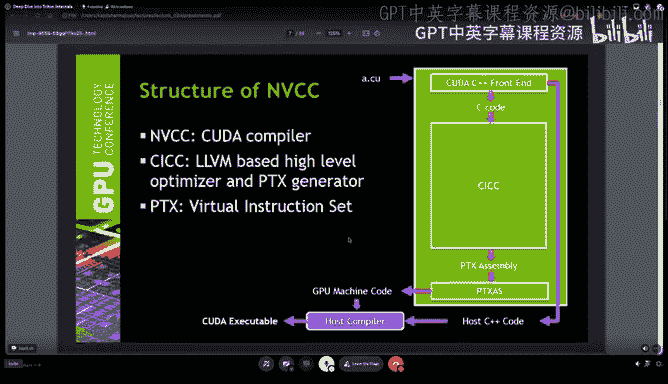

Youre executable。Folks who like worked with a compiled Explorer or Godwold website you can actually see the actual PTX and SAS for a specific kernel there as well it gives you a fairly old version of the SAS but I mean that sort of doesn't matter it's just it's a useful tool in my opinion so this one's just a standard your a vectors kernel you take A and B output to C and you can see like exactly the PTX here and yeah this is where sort of most of the work is happening for the kernel。

😊，I'm sort of just rushing through these slides because these are sort of just to build a little bit of a background。

Now let's this graphic is from the open AI article on Triton。

 so essentially like how does if you go a layer up， like how does Triton compilation work。

 it goes through several layers of IR lowering starting from a common IR which is Triton IR。

 what I mean by IR is essentially like an intermediate representation of your Triton DSL program。

 which is sort of human readable。😊，And it goes through several compiler passes to be lower to triton GPUIR and eventually to LLVM and then you get PTX assembly now PTX then gets converted to essentially it's a Cuban a binary that gets loaded either you can loaded as just a kernel or using like Qer drivers or it gets gi compiled as part of the triton compilation process so we'll cover that in a little bit and if the Cuban is just essentially like a standard L formatted file it's a pretty standard binary format where essentially has a header with a bunch of or like metadata on like what the binary is so so yeah it's a fairly standard like CC++ binary format。

😊，This is a slide from one of the I think this was a compile like Trident compiler talk from Pyth conference last year from 2023。

 this captures everything pretty well， but I think this has expanded based on like this year's like I mean based on learning about all of the developments on Tri front。

😊，So you Triton DSL see like it calls compiled down to this common IR。

 then for each individual hardware type you lower it lower it down to the respective native binary。

 so this is for the originally for NviDdia now AMD。😊，Intel and like for custom accelerators as well。

 I think there's。😊，Some of the custom sort use vector dial too so I think this is this is sort of old so there has been a lot of new development here。

😊。

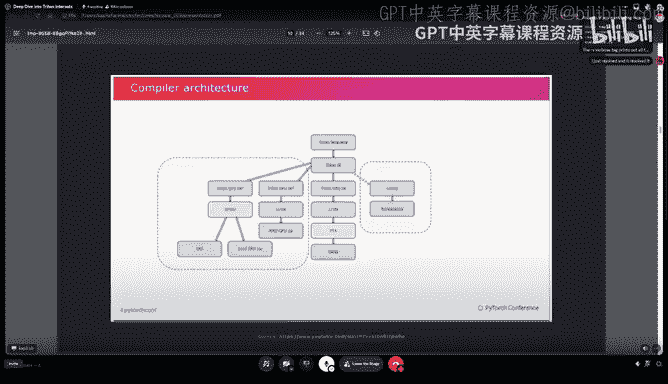

Yeah， I want to pause there for a second if there were any questions before I jump into code。诶。

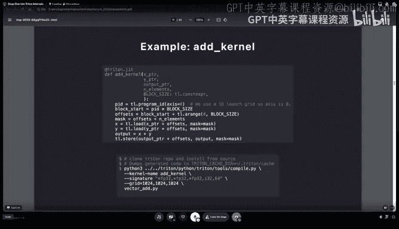

If not， then maybe we can keep going。 Okay， cool。 now let's do a little bit let's look at a little bit of solution this is a standard So so actually I got a question in chat。

 So how is the code distinguished between various T T G IR。

 So I guess maybe go back to the I R slide and and go through that。😊。

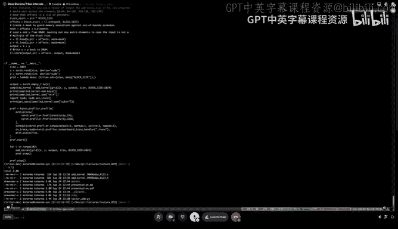

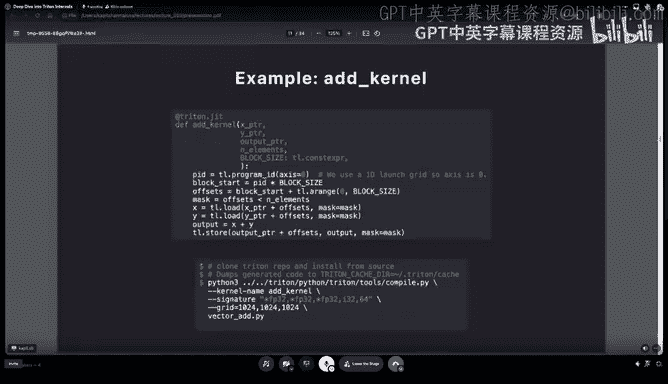

哦，O。How does it get distinguished between different specific GPIs So there are drive So yeah。

 it's jumping ahead a little but there are like specific drivers and launches for each of these。

 So like the drivers specify like how your I is lowered for like AMD versus for Nvidia but we'll cover that in a So essentially you have to target you have to write compiler passes for individual hardware type。

 which which is done through like this ML ecosystem。

 So MLI dialects essentially this might be a silly question。

 but like was there a reason why there is like basically three boxes for Triton GPU IR that are splitting into various hardware is like why is that like not a single box and then it spawns into like various other vendors I it sort of just a stylistic thing or are the Triton GPU Is for various vendors actually different。

😊，That's a really good question so based on my research I think the whole backend was rewritten in sort of late 2022 to actually make it modular so that you can actually target different hardware so I think originally it was just written for NVIDdia so now I think there's still work happening when I was looking at the code there NviIDdia specific stuff that you will see in the Triton GPU IR。

 but then there's also Triton NV GPU IR which which actually the NviDdia driver will actually call into but I think there's this it's fairly active this work so I think there's a lot of work happening in sort of making this generic enough that you hopefully there are parts of the Triton GPUIR that are common and then you essentially have hardware specific IR or MLIR passes can be part of a separate dialect so yeah it's fairly active。

😊，From what I've seen like even in the last two or three months。

 there's been a lot of code changes there。Okay， thank you。

Okay so yeah I mean this is so this is just a standard example the first tutorial that we see when we learn about Triton the addd Triton or the vector addd kernel now I mentioned so like so you can compile the actual Triton DS down to your pX assembly or Qn you can do it in two different ways one is you can actually just use a triton tool which will compile it fully and actually dump a bunch of artifacts on your hard drive or you can get compile it most of the most of the work that's done by triton compiler the same maybe there slight differences so like first let's look at if we just compile it fully like what do we get so。

😊。

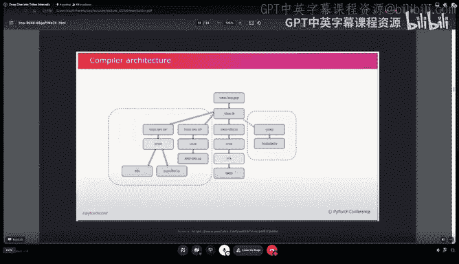

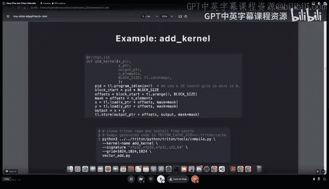

Let me get my turn you know so what I did was I just took the standard vector a kernel I just put it in the lectures directory so I think I'll probably merge that in a couple of do you mind zooming in a bit that's okay。

😊，Yeah， better。 Okay， much better。 Yeah。 Thank you。

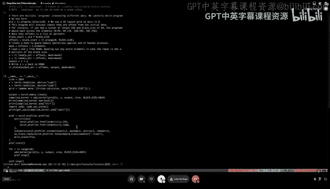

Okay okay cool so yeah this is just your standard triton vector that kernel and there just a main where we just do the standard like take a couple of random tensors and just learn through it I also put in like a debugger calls so we can just check like what gets generated by during the actual when we call the Jit compile kernel so so here we so essentially like I already have the triton repo checked out so so i'm essentially taking the compiler tool running the kernel through compilation process and it should just dump a bunch of artifacts but usually what i'm going to do is like I already know where the where the stuff goes I should have probably mentioned that before so like。

😊。

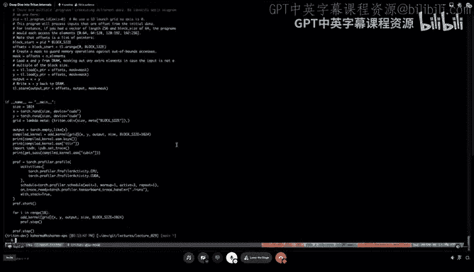

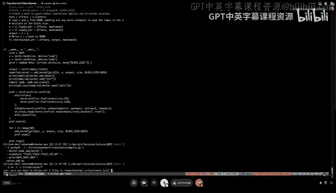

So there so Triton has this like Triton cache director which is by default just like your home dot Triton cache but you can like override it if you want so yeah so so I will I will just clearing it to just make sure there there's nothing there right so we should it's just be empty I'm just going to run the compile command now it should dump a bunch of artifacts there so here you are so like let's check here so it if you see here it drops all of your progressive IR in this directory and it also drops your actual binary over here and also as this like shared library which is QR U。

😊。

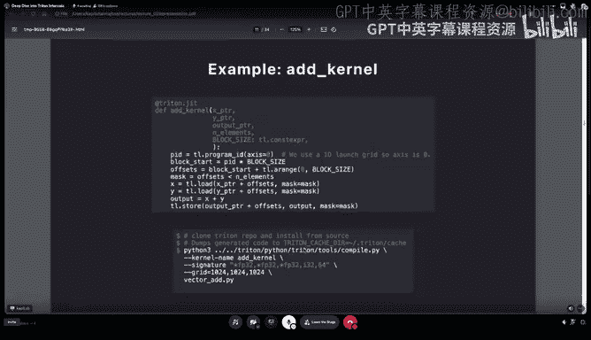

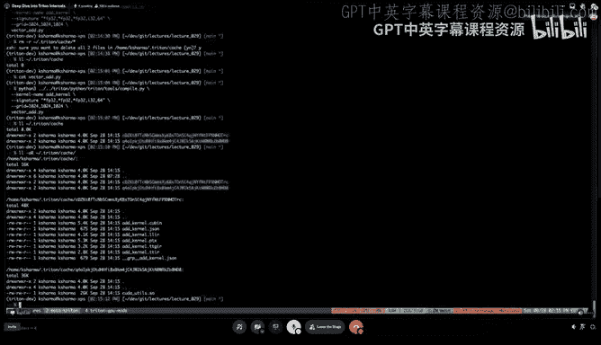

Now， if you want to like look at what some some of these are。

 let's just like print it out on the terminal。

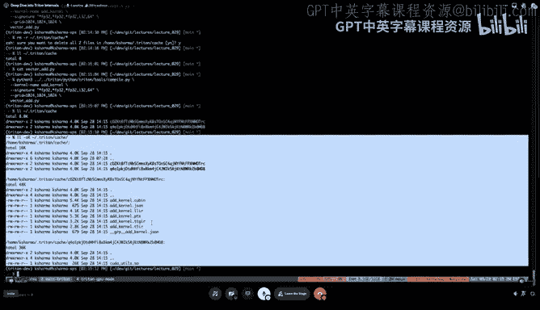

It should look something similar to what we saw in that triton or like the open AI triton page。

 So like essentially this is this is the first common IR， the TT IR so you'll。

Well probably so I guess we will cover the actual like going through an IR walkthrough later。

 but some of these things should be sort of easy to follow like you have the program ID then you have essentially here where you're generating a bunch of indices。

 et cetera， ettera there's going to be some ad pointers stores， loads， all of that。😊。

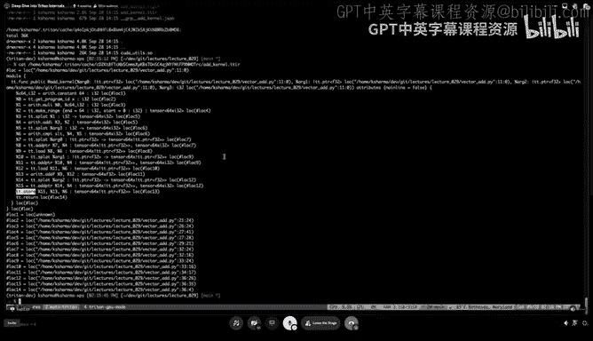

So Cap there's a bunch of questions in sorry like the general theme and our service people love to interrupt our speakers。

 So please verifys So pseudotermal X is asking a very interesting question。

 Its just saying you know as Strdent can leverage LVM for compiling into hip kernels。

 does this mean that we can leverage something like tiny grad to compile metal kernels。

 And I think the question is trying to get at at like which layer of IR can we plug into and how should people basically think about like what kinds of things they can express usingR。

😊，Yeah yeah， so again， I'm not I'm not an ML expert or like sort of but my understanding is like I think that Triton I is supposed to be the common IR layer。

 I think you can hook into any of the layers as long as you can swing it by like as long as you can get your。

😊，Custom or like whatever custom DSL that here you have I don't know enough what metal unfortunately it is something on my on my like to do this to like play around with it。

 but essentially。😊，It doesn't really matter as long as you can get so as you go higher up the lowering chain it is easier to understand so it's probably easier to generate that level of IR from whatever program you're writing so but my understanding I think like Triton IR is expected to be sort of the common IR here so if you look at the actual the most recent project which was Triton CPU IR so I think there's a PR to add like an inductor backend to Pytoch which will allow us to actually generate triton kernels for CPUUs and then you essentially can lower that down to X86 assembly right so that actually say it leverages the common TIR and then it divergges from there to TTCP CIR essentially so I mean but yeah again I don't came to be an expert but that's my overall understanding。

😊，you touched on lots of interesting ideas。 like I think what is so first off。

 if folks are interested in metal， we have like Nikkita sga。

 who's like one of the maintainers per metal in Pytors who's gonna come give us a beginner's guide in two weeks。

 So if you're interested check that out I think like Capel also kept like mentioning the Trident CPU back personally I feel like this is so compelling to get like decent performance for both 86 and for arm as well And part of the name rebrand was like we're interested in more hardware architecture。

 So if this is like a space you're interested in following we have a couple of working groups and some of the world's experts like now basically checking in there so sorry for that plug Capal go ahead that's fine I mean honestly my whole motivation to play under Triton compiler I wanted to write a kernel that I could run on one my Rasberry Pi like can。

Tking kernel and target my raspberry Pi to maybe I don't know like record my video and essentially take a bunch of pictures on me something or like essentially identify my face can I do that with Tri I think like once you have a common IR layer where you can just target to specific custom hardware I think that that's going to be amazing。

😊，Alright， I think you got chatd excited。 Yeah， so we'll stop interrupting。 please keep going。

Yeah okay so so another thing so when you run the actual compiler tool it will also drop this the two files like this just the header files which is not super interesting like this is the one so if we dig into it I actually just so that its easier to look at I put it on a gist。

😊。

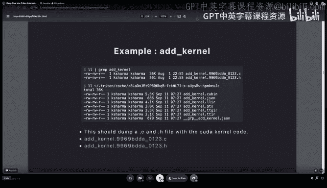

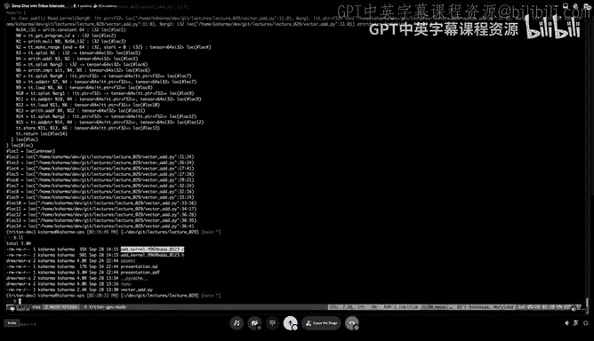

So。What it does is actually let's look at it in a law form。

 So so yeah we talked about Cuban right so essentially like what it's doing here it's taking the actual assembly is just inlining it all over here and then it's just。

😊，Using a bunch of Nvi driver functions to load。This in line so this is essentially like like a Qa module you compile you essentially not target this function which is essentially the kernel and then you can call launch this kernel from here so this is essentially a kernel that's generated by Triton and then you call back into just this custom assembly so so if you do any if you compile using the tool this is what you typically get。

😊，And。呃， sorryrry对啊。诶。Now I already sort of talked about this。

 so essentially like it generates five different five different files for NVDR。

 it could be different for different hardware types。😊。

Really depends on how many layers of lowering you're doing and when you're dumping the as part of。

The the compilation process， I also found this some。

Interesting tools to play around with with these like。Since I said， like this is。

Just an e formatted file so you can just use your standard read elf to read this just makes it easy to read it in my human readable form there's also like a couple of Nvidia tools which you can use to read through these among I mean this ones standard it just take the Q and it will just dump the the SAS and PTX this was interesting so I wanted to show this so。

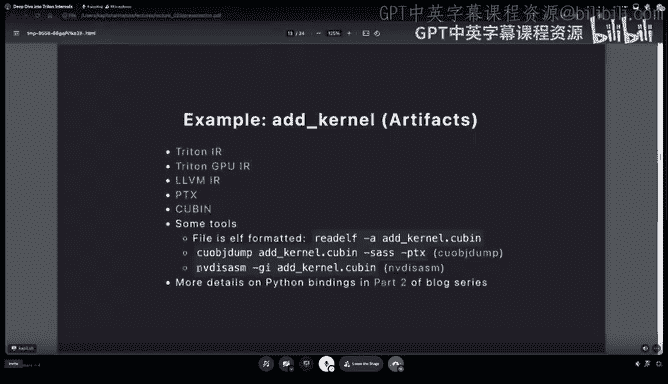

So we had the， let me just quickly look at it。Okay， so。This is the directory， so。嗯。可能。At Colon Cuban。

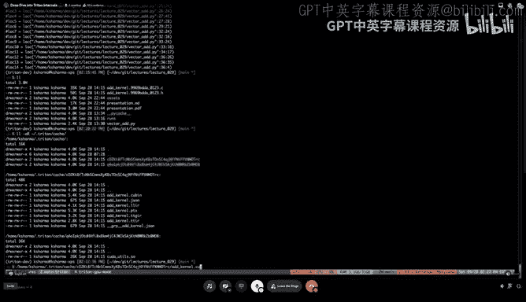

Oh let's first。 It's just bunch of gibbish， but。

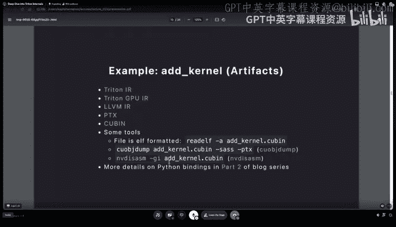

哦。So now it becomes like a lot more human read， right， And you can see。

It actually gives you instructions by where the actual call is coming from so it's essentially giving you like oh this is a move register call or things like you will have like integer ad stuff like that so this I mean again'm like' I don't think anybody really need to look into it but it's just something curious that I found where I was just like researching for it。

😊，Okay， and one question like the hash code that we see so it is basically a compilation is like always the different one is generated for each combination of constants or whatever you put into the kernel when it basically then dynamically compileiles this combination like you get these couple of files for every combination of parameters which go into the kernel。

 right？

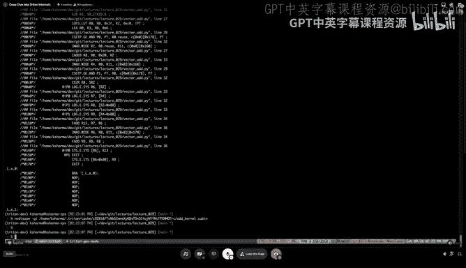

Do you mean these SSA instructions so I mean like all the files which are generated in this in this cash directory like basically all the。

Yeah I'm not sure how the hash works because the hash so like if you run the same kernel twice it actually maintains the same hash so there there's actually like a bug that I found to so I think we'll cover that later but if you call the same kernel twice it won't regenerate the hash but yeah based on the combination of argument that you're passing into the compiler it will regenerate that hash into something different。

😊，Okay， and this is like starting the J file or what what is the Json file in the directory。 Oh。

 Jason file， I think it has a bunch of artifact。 So if we， okay， let's go back here。 So it was。

 So there are two separate Jason files。 right。 Yeah， theres there's one here。

 So let's just print this one add kernel Jason。

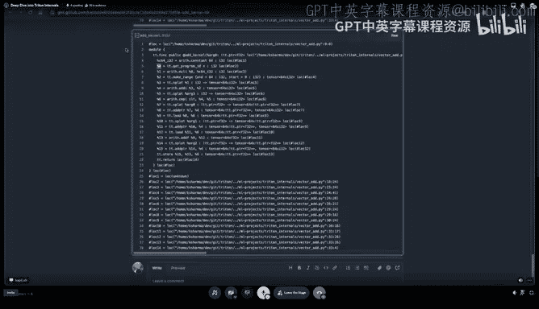

Tititaza。So it just tells you okay it's targeting backend QA backend so funny story I had my 4090 the machine that has 4090 is having a fan problem so a lot of the code will some of it will say SMm89 and some will say SMm 75 so so apologize for that so yeah unfortunately that machine hasn't been working for the last couple of days anyway the。

😊，你啊。Somebody sorry， somebody just ring my bell， I have no idea。Oh yeah， so sorry， so going back。

 so yeah just it's telling like specific specifications for the back end that it's targeting actually。

So for example， if you would like call it now with an FP 16 or yeah， Tensor， then Tenor。

 then it would obviously likely need to regenerate it and then would get something which would say like a allowed thought in input positions or something Yeah so。

Think there so yeah is saying like O dot Tf 32 allow dot in so yeah there's a bunch of stuff in here so yeah I'm assuming assuming it will so if you change the actual the actual like the do type that you're targeting for the kernel it will probably change it will change the hash and essentially will dump the exact like Jason with the targeted targeted D types and targeted backend etcter。

😊，There's also this one which I think has like more like some other information。😊，U。

Now oh I see this is just pointing to like where the actual IR files are so I'm assuming that this Jason gets used by the actual like the Jit compiler to like load like for example。

 the binary or something。嗯。Cool so going back。

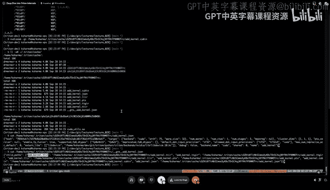

Okay yeah so I was talking about the tools so yeah there's a bunch of tools to like play around with this with with the Qa binary format so yeah I just linked them here now there's another way to compile the kernel which is when you just run a kernel you will actually get all of this compiled for you as well now I'm just gonna clean up my tracking cache again just to make sure that i'm not i'm honest that everything is regenerated so so in this case I'm just gonna run the vector ad kernel so there you go it should probably drop into the debugger this time okay yeah so we have this。

😊。

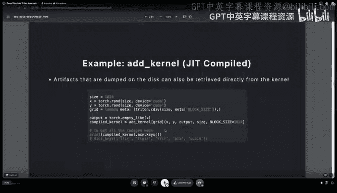

Compiled kernel， so。

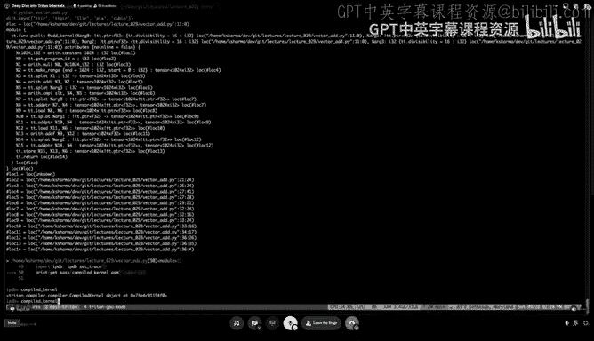

Within this triton compile kernel， you have all of the artifacts that that that are actually dumped on on the in the triton cache。

 so。

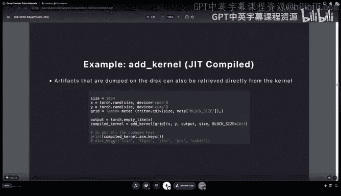

So let's look at TTIR which should look identical to what we saw earlier this is probably better yeah so so yeah same process but in this case it just it just keeps everything sort of in memory and just just in time runs the code ignore this I was just using the get SAS function to actually you can there get SAS function in the triton tools where you can just pass the Cuban to get the actual SAS but。

Yeah。

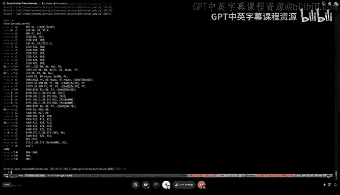

Now。So yeah so we covered essentially a bunch of things right so like your Python DSL gets compiled through multiple layers of IR down to PTX down to Cuban and actually we should check again that so we just so this time around it actually generated three directories instead of two if you remember previously there was a QR U2za so now you have this triton launcher shared library as well but we don't get that the ad kernel。

c。 header file what my understanding is like it essentially this all is then just compiled down to a shared library when you're using just in time compiled tri kernel but yeah it just dumps this on on the on your hard drive as well。

😊。

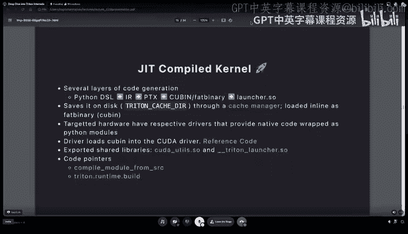

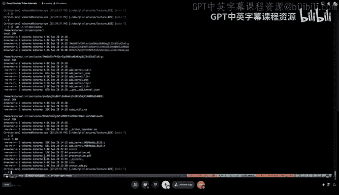

Now already mentioned that there is a Triton cache territory you can always override it to put your triton cache somewhere else now each individual I think we covered this early on that each respective drivers would actually put like different set of files on your on your computer we can probably I think if we have time I do have the Triton CPU repo checked out but it's just like the actually rebuilding everything takes about three to four minutes so if you have time there we can try out like the Triton CPU at the end but yeah I have seen like you can actually see for Triton CPU you get TTCIR and then you actually get the X86 assembly because I have an inter machine。

😊，Now so yeah it exports these to shared libraries if folks are interested where these come from I just put in like quote pointers within the Triton directories so like if you so if you're interested like I think so this is the NVDdia backend so like if you go into the third party you see a bunch of backend here so like AMD will have its own thing this the proton backend and。

😊，Oops。And yeah， essentially just。Takes a C file and dumps it into a shared library but yeah I mean nothings super crazy but yeah it's like this is where everything all of the magic happens。

😊，And there's again， this like build process which is common within the actual Triton Python package。

 so essentially all of this is packaged with the actual Triton bit package example。😊。

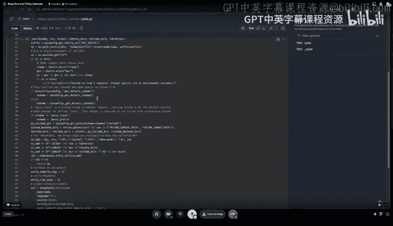

So but how do you get this IR and like it's like nobody so this was funny so I was just like trying to figure out like how does this IR come from so one does not simply handwrite this IR。

😊。

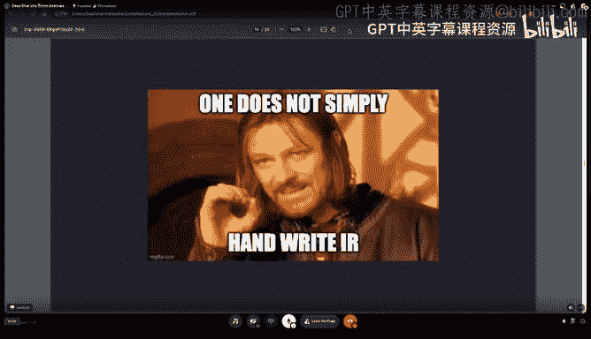

So Triton so this is what we just previously covered right so the whole backend was sort of rewritten to make Triton work with MLIR ecosystem essentially Triton heavily uses the MLIR ecosystem now MLIR the ML in the MLIR is not machine learning its multilevel intermediate representation so essentially what it does is provides you a toolkit to write compilers what that essentially means is there are a bunch of tools as in the MLIR ecosystem which you can use to write any compiler and you can extend it using like custom custom DSLs now Triton itself uses a bunch of these to essentially define Triton specific DSL and Triton GPU。

 Triton N media GPU etc。😊，Now all of these extensions happen through a concept or like a smooth thing called dialects。

 so these dialects essentially provide you a mechanism to extend like the already existing MLIR tooling that you have which essentially means you can just like build on top of or compose your compiler off of already existing tools and build sort of a more higher level compiler。

 which a lot of the ML compilers are one interesting talk I found was from I think this is from 20202020 so with。

😊，W was focused on TensorFlow I think TensorFlow was the first major ML framework using MLIR and I think now it's been adopted by a bunch of other projects too I believe Mojo uses MLIR as well from what I know and I believe TBM as well but I'm not sure。

😊，Now these dialects are essentially now there is another layer layers of abstraction that's provided as part of the ecosystem which is called a table Gen DSL table Gen is essentially just a code generation process where you can define your compiler passes as simple like Python looking functions and then you just say compile it and you get a bunch of like boilerplate code and then you just have to write your small part of an optimization or a lowering pass in the standard C++ I also provide like small a resource for like table gen what that looks like now coming back to Triton if you want to see the IR generated after every single compiler pass that you run you can actually use this environment。

😊，Very look。Or MLI enabled dump now let's check that out again so now so this is this is the bug I found so if you actually run a kernel twice in a row and you use MLI enabled dump it will only dump the IR the first time not the second time so I think it's like。

😊，You really have to you have to clean your cash to re gett the IR dump I so yeah。

 I mean so I'm just going to clean out my cash again to make sure we get this dump。😊。

Because I think it just ignores this environment variable if the kernel already exists in the cache。

😊，So let's so I've already done this command before so it's here。Now it should actually again stop。

At the debugger。啊 so。let's go up。So it dumped a bunch of stuff on the terminal。

 it's just huge amount of stuff， but you can see like now it's showing us after every single compiler pass like what was the state of the IR。

😊，Going here， it's doing straight combine ops。Fasas。

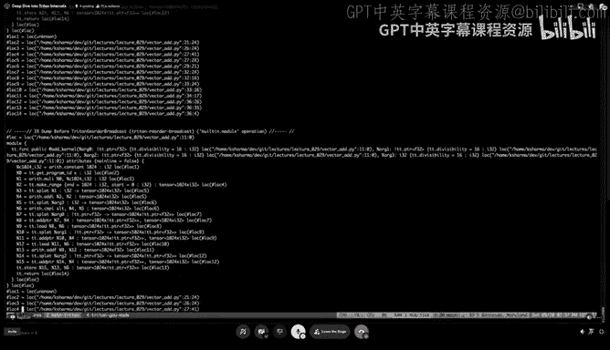

Tri to Triton GPU。

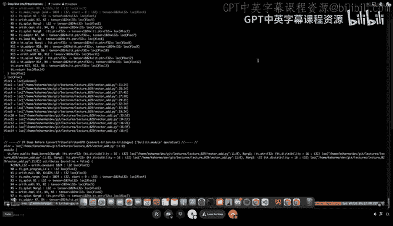

Triton GPU remove layout conversion some of these look will look by name will look familiar GPU reduce data duplication SC to control flow。

 I think the structured control flow。

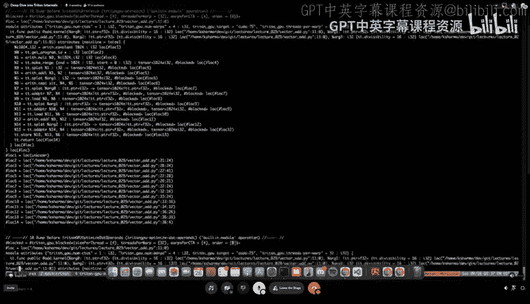

NV GPU to LLV and this is where it converts your GPU IR down to LLVM IR and ettera， et cetera。

 so it just dumps a whole bunch of stuff in here。😊。

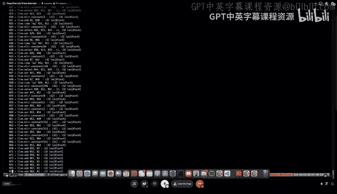

Now there was I think there was a question on the Triton the Triton channel around like folks asking around like whether Triton will reorder load and store ops it definitely does and you can if you want to like dig into things like that like think this is a really good way to like figure out how it's doing that so you'll probably will have to go through each IR layer and wherever it's doing any sort of storage pass and changing anything in the ordering of your IR you can you can see that pretty clearly in here I mean just diping through each stage potentially。

😊。

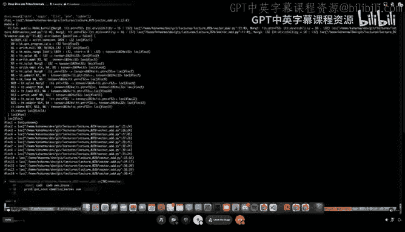

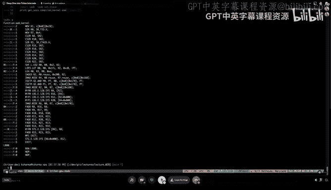

Now so yeah， I mean this is a pretty good tool if you want to actually see like why for like how your kernel is being compiled under the hood now just to quickly cover what MLIR is like this is just so if you were to have like a programming language that you're compiling you can have a bunch of compiler passes so this is so as I said like MLI provides a bunch of common passes so this is just a standard common sub expression elimination。

 you just take a common subexpression replace with already calculated value this is debt code elimination so anything that that doesn't have any impact on the code you can just drop it or doesn't have any impact on the output you can just drop it which could look something like this right so is this is let's say this is your custom language that looks like Python you want to compile it using MLIR you。

😊，B plus C is already calculated as a so you can just replace it here。

 so this is replaced by CSE then you have。😊，E into2 into a。

 this does not hang for the output so you can just drop it right so so this will result in like something like this。

啊。Now how does Triton use MLIR there are a bunch of common classes that Triton uses first when it generates your TTIR。

 so some of these will look sort of common for people who have probably worked in compiler space or have at least known people who or like have poke that on with compilers in any way so this is your constant propagation。

 your get code elimination in liing canonicalizing。😊。

Comments of expression ruminmination etc cetera so so this is just directly from the Triton report these are the common passes it uses and it uses it across different IR loading passes now if you're interested in like what sort of so so so a question like actually like so these passes where they implemented by the Triton team or these like standard passes that like the MLIR team provides。

😊，OhSo these passes actually exist in MLII but so the way Triton uses them is essentially they have bindings。

 so because all of the compiler stuff is actually written in Python。

 so they have essentially the spine modules which have all of these exposed into the Python there。

 but these are all sort of standard MLII passes。😊。

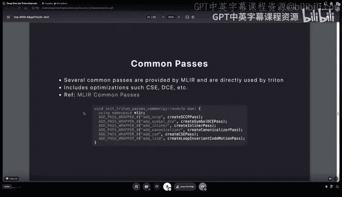

Very cool， Thank you。So yeah， so I mean， if you curious like I think you can look at like there' a bunch of these common passes that it provides。

 so like if you want to yeah generate runtime verification pass， I don't know what that does。

 strip debug info print op stas。😊。

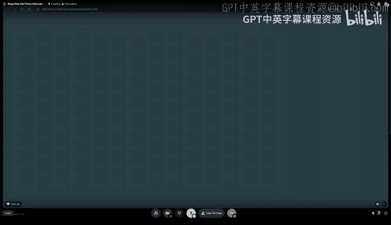

Create in liner pass。 So this is the in line of path that I mentioned earlier。 Okay Okay。

 so speaking of there's like7 questions and chat。 So I'm saying I read them all together because they're okay。

 so， so Sam， for example， asking like can you model like data flow using ML IR app pause is asking like can you model model synchronization Donanhan is asking about like async ops。

 rectifies is asking about def code generation for multiple architectures。😊，So yeah。

 I'll just batch all the questions。 Feel free to answer them in whatever order makes sense。Okay。

 I think like folks think that I'm a compile expert， I' not but。😊，诶。Sorry。

 so can you sort of summarize like the type of questions Yeah。

 so we add efficient code generation for multiple architectures。😊，We had data flow。

 and we had asynops。Oh， I'm models sync conditions are you？Okay， guys， yeah。

 so so I think I don't know about async ops， I don't know if threading is like it provide any threading style。

😊，Pa says data flowlow， yes， I think it provides a bunch of like tools to actually like do sort of data coalescing。

 for example， or like essentially like optimized store loads which actually Triton uses heavily and。

😊，I actually don't know the answer to the third one either。

 so I mean I don't know if there are any compiler folks in the crowd I think they will probably be able to answer it better than me because I actually learned MLI in the last two months。

😊，系呀。It it seems like Donna Khan and Chad is quite knowledgeable about Trident。

 so maybe he can Mr so maybe they can field some of these questions。 Yeah， in the meantime， Ka feel。

 please， please keep going。Oh， and also， we have Saman who is a compiler expert Inter。 Okay， we we。

 we got the compiler experts in chat。 Very good。That's awesome， I with this ho too。

 I think H should be growing into。That does the first line on it yeah okay cool so now so if you now after the common set of passes like now Triton extends theR like MLIR framework with a bunch of Triton specific passes so I mentioned table gen before。

😊，That。So this is what table Gen looks like so whenever you see like transform passes or TV this is like the your table Gen file so now Trium has like bunch of these specific transformations or optimizations where it's doing so think this something like this is just fusing matrix multiply or like essentially like similar to matrix multiply a this one essentially's combining the actual two separate ad pointers into a single one you traverse this one and then you traverse this one instead of that you can just combine these two。

😊，And there's a bunch of other ones as well this one's interesting so like I think broadcasting is fairly common operation that's done in most ML frameworks so like for example if you're doing element wise op。

😊，When a broadcasted value you would rather just do the element as up first and then do the broadcasting my understanding is Spla and broadcast are the same thing。

 but I'm not sure， but essentially this is。Doing pretty much something similar。

 So you you have an element wise op on on a bunch of broadcasted values。

 you can just do the element wise op first and then broadcast it something like if you're doing like I don't know。

 add of。1， two three， four， you can just do the ad first and then expand it to like whatever。

 so if you were doing like a tensor of 1024 dimension adding one to or like adding sort of adding like multiply of one into two you can combine it in such a way where you actually do the the one into two first and then broadcast the value which is two。

Then theres so yeah I think there's somebody mentioned like essentially data flow。

 I mean this is more like actually like data load and store so sort of slightly different but yeah they do some operations and actually the point has to convert them into some standard form this is fairly complicated so so I didn't really look into like what this does。

 but loop unrolling is another I think this is fairly common compile and optimization technique as well。

😊，So yeah so there's a bunch of these like triton specific passes and they're defined as part of this table gen file。

😊，诶。😊，Now if you go layer below then there's tried to GPU specific passes so if we go into that you will see some familiar things so there's GPU pipelining you have there's apparently this trick called3 into Tf32 trick where you can decompose like a floating。

32 doop into so yeah Tri to uses a bunch of these cool things under the hoodd to actually like optimize your code so there's GPPP fetch X Macmo so I think it's then essentially check yeah I think it this is for tenor courses from when I was looking at the code optimize dot so yeah coalescing so all of these sort of defined here and then youll essentially have the actual implementations in the code gen so we'll cover one of these in the later slides so so I know。

😊，Mark you asked the question so they are actually specific NVDdia specific passes too so my understanding is a lot of the stuff was originally just in the Triton GPU passes and this sort of split them up into NVDdia specific and sort of common ones and I think this work is sort of still ongoing and I'm assuming as more custom hardwares are targeted like a lot of the common stuff it sort of more starts splitting into like more dialects essentially。

😊，So yeah， this is just summarizes that it does a bunch of optimization。

 like Qcing for 32 dot product optimization， C planning， etc cetera， et cetera。 So yeah， I mean。

 it folks are interested in like what all it does， the table gen file is really， easily readable。

 So you can go through like oh， like this is a cool trick that it's doing or something like that。

 So I found it really really readable and like interesting。😊。

Now we can maybe I know we are sort of so yeah we can quickly run through an like an IR so this is the GPU IR because you can see it has like sort of more Nvidia specific stuff now or actually non N specific but it's。

😊，I actually don't know if MD has a concept of wars or not。😊，But yeah， I mean。

 I only have N media device， so I'll just focus on Qa。 but yeah， if you look at here。

 this should look pretty familiar。 So we have like the T T program I it gets the paid。😊，And actually。

 let's go to the next。A slide，Yeah， so so first of all。

 like the the module that's defined has a bunch of。😊，Attributes， essentially it's。

Fig like this is just the metadata for the kernel essentially so you have how many third per warp what's the target target GPU number of warps etc cetera so this is defined at the top in the module so。

😊，Now if you go to the next stage you get this is essentially your block size then you have your paid you take your constant 024 multiply it with the paid so yeah it's once you start looking at it you can map it back to the Python code Python DSL code now there's a bunch of like broadcasting and add operations so as I mentioned there are there are。

😊，Existing dialects。That that triton relies on so those can actually also be finite in tables and it will actually show you dependent dialect so like Eith just provides like arithmetic operations so here is essentially adding the percentage to which is this range with the constant or like I think it's the or it's the broadcasted value that's coming from the constant。

😊，think but yeah there's a bunch of like so this is the actual operation where we are adding the A and B together so this is just an ad float here so it's doing a float32 edition and whenever you have any sort of input point there。

😊，An output pointer you should see a bunch of load and store ops。

 which is does do some some optimizations on I think it does Coa saying it will move memory around and stuff like that yeah super interesting stuff。

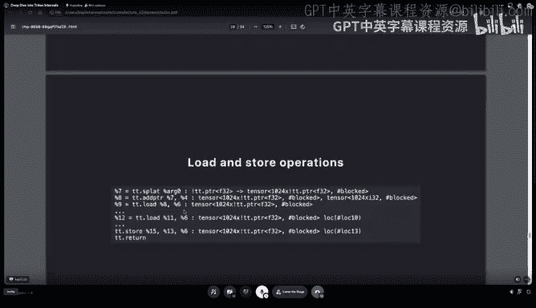

I took all of that and essentially put into like a graph ways。😊，呃。

like a digraph thing and I just put in like what each Python line of code is doing as part of theI so essentially you take。

 so this is where everything starts， you take take the pair。

 this is your the block generation and then you have the offsets， then you load your X and Y。

 you add them together and then you store them in the final output right here。😊。

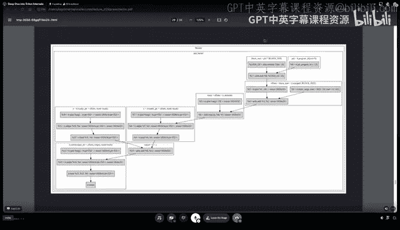

Now if we want to look at， let's let's say go one layer deeper into like what gets out of the table gen file。

😊，We can look at like an example now whenever you have a custom pass youll probably see like three reference references to it。

 one is like the actual table Gen file， the others would be the actual implementation and then everything is sort of available through P Bine modules because the compiler stuff is on in entitledy。

😊，So if we go to the actual implementation。Here now bunch of this is like MLIR specific stuff so this is fairly generic but if we go line by line this is just getting a context it's getting what op it is and then it actually checks like what is the NVDdia compute capability so I'm assuming it's looking at here like what generation of NVD device it is etc ce and this is I mean just standard MLIR stuff no idea what it does but it is an MLIR namespace so now if you I think this is where most of the work is happening so。

😊，If you go into here， you see it's figuring out wars。

 it has like versions of like how many vers per tile it will generate， etc。

 and then it will check whether oh it actually doesn't even support anything compute capability below 70 and you can get shapes per CTA。

 get number of vers， CTA layout。😊，Yeah， I mean， I mean it's doing a lot of stuff， but yeah。

 if you want to read through it， I think like feel free feel free to like poke around with this。😊。

Now and I just like I annotated the actual generated the Mac path with like the actual documentation。

 but yeah the MLI documentation is actually pretty good so yeah a lot of useful info there。😊，嗯。😊。

Okay， I guess that's so。I came prepared because I was not sure whether life coding will go successfully because my other computer fan just started blowing up for some reason and just machine just die。

 So I prepared beforehand。 So I actually what I did was so let me。😊。

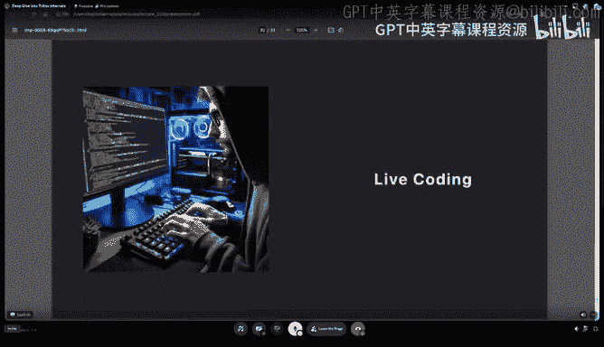

嗯。So I already have this triton repo checked out so yeah。😊。

And so I essentially just added a couple of extra passes to the common triton passes。

 so let's go here。 so if we want to let's check。

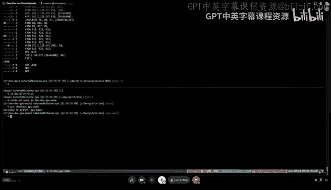

So yeah， this is the passes。 So this is your actual Python package where you have。😊。

this is the common passes function that I had originally mentioned so you can see like all of the specific modules where the actual so the Python side compiler will just call into these methods over here and these are just all wrapped through or wrapped through like pipeline so I added I mean I didn't want to deal with any new argument so I just took like two void taking compiler passes one is it will just generate like off graph so essentially after your after your TTIR is done。

😊，It will actually just print your op graph and the other one I did was just I took like op that it will give you like how manyies or just an op counter essentially how many ops you have for a specific op so super simple stuff so if I give show you di against the main it essentially just。

😊。

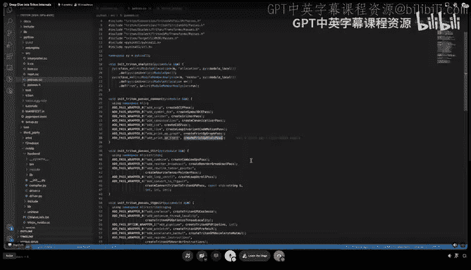

Takes I added the this new pass and within the actual compiler I added like a new print op graph and in the LLVM pass I added this like abstract pass so let me just show you in the code so it might be。

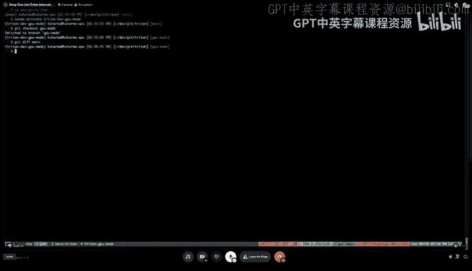

Easier to see so here's the ops pass so this is part of when it makes the make during the make LIR call and if we look at Op graph its this is just after like you go through all of the actual TTIR passes。

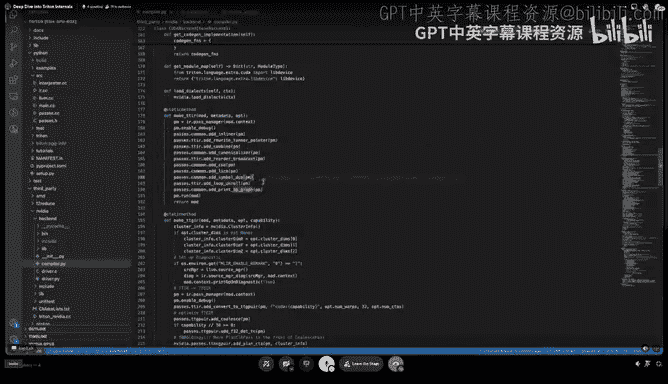

Here。So let's run this again， let's clean our cash and I'm kind of ML neighbor dunk。嗯。Oops， okay。

 I am in the longeritatory lectures。That should 29。Can。Okay， so it dumped a bunch of stuff。

Let's'm just kind of quit out of here and then let's go。So if you see here it now。

Started putting the op stats after the LLIR is generated。

 or I think it's doing it just before it's interesting。Maybe there's some啊。

Ordering issue because it technically should have done it after this one here， but。That's fine。

 And if you go all the way up to the T TIR。啊， generation。It should have。

Take because it dumps their sake。啊。Diagraph thing， which。啊。Os。

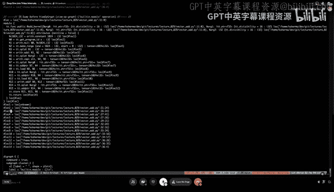

So it just yeah it just prints an op graph of like what's what is going on it I copy once I just copied it over to see like it just generates something too big so it's really not useful to see for somebody like me but yeah this was just I wanted to just poke around it like if I could add an extra pass to to the compiler。

😊，Yeah， so now I I added like a bunch of sources that I used to learn about this stuff。

But mostly like I actually read a lot of code in the Tritum repo that was super helpful I use the debuer a lot to just understand like how things are flowing under the hood and and yeah I think I used the MLI documentation to learn about like what MLIR is I actually got interested in it from one of Chris Laner's podcast with Lex Freeman so yeah it was。

😊，Yeah， I mean it was a fun project like S product to learn about ML compilers that's all I had so yeah okay thanks。

😊，This was like Capil。 Thank you so much， folks， Please shower Capil with with emojis。

 Thank you so much。😊，Okay， so I think now we can move on to Q& A。

 I'm going to open up the chat zoom on Capil。

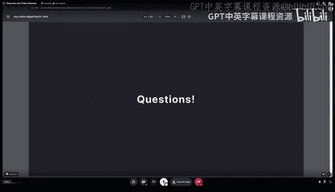

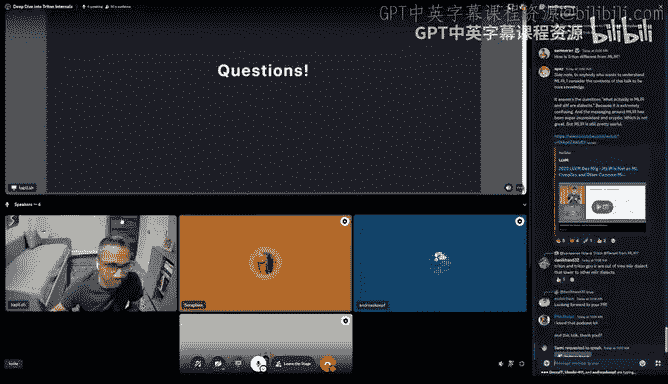

Alright， so let's see。Al right， folks。 yeah， Cape demand。 Thanks for the ML Air video。

 You're getting hearts and flame emojis。 Let me see if there's a question in here somewhere。😊，呃。

Alright， some questions about graphs。Okay， I think none new questions。

I think there was like one one question， like， how is tried different from M L I AR。

So what's by the main。Difference may be to summarize。Oh what's the difference between Triton MLlaya？

Yeah， I mean， trytan。 I So if you were to think of。

The analogy would be tritan is like CC plus plus and MLIR is like Gcc earth clk I think clang is probably a better better example because clang provides a bunch of like tooling around。

😊，Yeah， you know， like compiling your CC+ that's good。

So it clang is like an ecosystem so essentially you have plank tidy which can use Klang to do a bunch of so likelins and stuff so yeah I think like that's probably a good example like if you were to think of Triton is sort of like CC+ plus code and Kang would be your MLIR。

😊， Samron is asking， can you build the graphs in sight of Trident。

Can you build graphs inside of trippo data flow graph？Data photographs， I I would think you could。

 but you probably have to write a custom pass for it。 So you could probably just yeah。

I would think you should be able to， but I think it probably would take a custom pass to do that。

I also see another question like how does Str and go from P T X to Sas。 Yeah。

 I think the answer there is just Nvidia proprietary libraries。 And yeah， indeed。

 Danny Khan is confirming this as well。 Okay， yeah。Alright， so one question regarding the。

 the graphs that you generated。 This was quite interesting。 You。

 you said you use use graph width for it。 What， was there some。

 is there some existing transformation which you used in， in order to generate this。

I used an LLM to generate this。So yeah， I mean， spoiler alert。

 Llums are really good at generating diegraphs。😊，So you can just if you yeah。

 if you want to like print out any sort of flowchart and you want to use GraphW for it。

 just ask an LLM to do it for you and it will just write out the whole digraph plan and just copy paste into into an online GraW visualizer and then you get everything。

😊，Yeah。as Samirran is also mentioning， there is a flag which will generate graphs from ML LIR or L O VM。

Yeah， if anyone can find this graph that， that sounds great。 Okay。

 Phil's saying he doesn't trust the alums for diagrams。Okay， that's like。😊，Alright， Well， yeah。

 I mean， feel， I guess I did really appreciate like the extensive references and tooling you out。

 So I felt like your talk is also best appreciated if people like go back and like rerun their own experiments。

 So I assume you have no issues sharing your slides with people and we'll add them in the lectures repo。

😊，Yeah， I mean， I， I essentially have everything in the checked out lecture thing。 I'll I'll， I'll。

 I'll send a PR So thank you。 that makes our life much easier。 Thank you。😊，All right。 Well。

 Capil is on the server。 and， you know， he was like our first returning guest， I think。

 as we mentioned in the beginning。 And so if you have any other like tri questions to ask him。

 like he's here and Capil， honestly， thank you so， so much for coming on。

 we just like this was a fantastic talk。😊，Thank you very much。 interesting and a strategic topic。

So for next week， we have another person who was from our server。

 and we we discovered from the server called Gonrst。

And he's basically very quickly become like one of the core contributors of the Torch Ao project。

 And he's going to be talking about quantai training。 So basically how to do training in an8 and 8。

 And he also has some very early experiments of like getting bit networking and pure Pyth using the compiler with some custom Trident kernels。

 Yeah， I like Uat you。Goors is absolutely brilliant。 So yeah， see everyone next week。

 And thank you everyone。 And again， thanks， thanks again。😊。

