# GPU MODE《CUDA、GPU编程1-53课｜GPU MODE》中英字幕（deepseek-v3.2 - P31：-20241002-GPU MODE IRL 2024 Keynotes.zh_en - GPT中英字幕课程资源 - BV1QZ421N7pT

🎼Our first speaker doesn't really need an introduction。

 You might know him as an assistant professor at Princeton， the chief scientist that Together AI。

 then Ven of the Flash attention algorithm。 T out everyone。

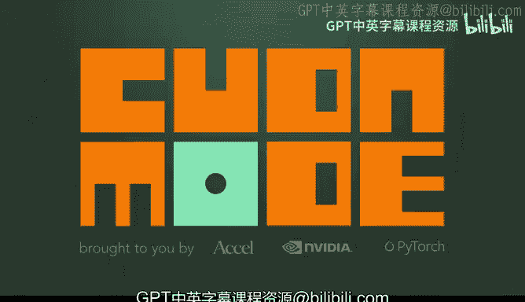

Everyone， really excited to be here this is a really good vibe。

 I'll be talking about how to optimize attention for modern GPUs and this is going to touch on a bunch of joint work with some of the folks at COFAX。

 folks at MEA and some folks at NVdiaA， some of whom are here。

 like VJ who's leading a hackCC session。Okay， so let's get started。 just a little bit of motivation。

Why do we care about attention， Well are the tons of applications that we need， long context。

 long sequences。 So， for example， in N LP， you want to have new capabilities like reasoning over books and and play and and code basiss。

In computer vision， you want to to close the reality gap where you want to model really high resolution images to give more robust insights。

 And usually， if you use something like vision transformer。

 high re images translate to long sequences。It could also open new areas。

 I've have collaborators at Stanford who work on audio modeling， video modeling， medical imaging。

 and their data is naturally model is is sequences of of to millions of steps。

 And so the the dominant architecture right now， the transformer has a hard time deal scaling up to millions of steps you know。

 one， one way you do that is things like bring attention。 But the underlying。

The underlying algorithm and the underlying hardware， we， we still need to optimize for that。

 And if we can optimize for that， we can open up a bunch of new areas， not just chatbot。

 but actually things like A for science and and and so on。 So this is why we care。

 or I personally care about modeling long sequences。 So what is the challenge。

 The challenge is that efficiency is a bottleneck。Especially if you use attention。

So here I'm using context length to mean how many elements in the sequence does the current element interact with。

And what happens if you just increase the context length。 So that sounds simple enough。

 turns out efficiency is a huge problem here。 It can slow down or completely stop training。

 So here's an example of taking meron L M This was two years ago， running on a 100。

 And if you have context length 2 k， you get very reasonable speeds。

 is is around 50% M 50% of the theoretical max of the device， which is which is quite good。

 But the moment you increase context length to 8 k。 things starts to slow down significantly。

 or you go out of memory。 So this is you know， we can't just brute force and increase context length。

 So we need to scale two longer sequences And in order to do that。

 we got to make attention a lot more efficient。😊，So I'll talk about recent word flash attention 3。

 targeting Hopper GPUs。 And I'll talk about some of the new features on。

 on modern GPUs that we want to pay attention to， things like asynchrony， warp specialization。

 low position and so on。Okay， so a little background on attention， maybe a lot of you are familiar。

 So I'll go over this pretty quickly just so that we're on the same page in terms of terminology。

 So we have as input， the query in the key， these if a single head is n by D。

 where n is a sequence length。 D is the head dimension。 N is on the order of thousands or ideally。

 we want to go up 2 million。 and D is a head dimension。

 which is usually quite small on the order of around couple hundreds。

So when you multiply them together， you get a similarity score， you do softmax。

 and this is what softmax looks like。 You multiply by the value。

 which is also provided to get an output。 And turns out the bottleneck is in these intermediate steps where you have to scale quadraically in in sequence laneang because you have these large matrices that you need to usually write out the the score matrix and the attention matrix。

So our goal is to not have to write these matrices down。

 and with a little of kernel fusion plus some algorithmic optimization。

 So you essentially use online softmax， you can avoid this。 And that was essentially the idea of。

 of flash attention。So I won't go over this too much。

 but so flash attention came out about two years ago。

 back then it was about2 to4 x speed over kind of the best baseline and significant memory reduction。

 So you can scale it much longer sequences。 And this was essentially optimize for a 100 And when we took that code。

 this is flash attention2。 we took that code and we ran on H100。

 we got to about 350terflps per second。 the H100， the max is around 1000。

 So is about 35% of what the device is is capable of So we we essentially took the a 100 code and ran on H100 get reasonable speed。

 but there's quite a bit of headroom。 this is 35% MF35% of the theoretical max。

 So there's a whole lot more we can do。 How do we optimize for modern hardware。

 And I'll talk about why the hopper。Is is quite a bit different and requires a different way of thinking about programming。

嗯。So this is joint work with with a bunch of folks at at Cofaax， Meta and Vida， as I mentioned。

 a lot of the code was written by by Jay and and and Ganesh。And so I。

 I'll just talk about three things that we， we， we care about for the H 100。

 First is you want to use these new instruction。 web group M MA for higher throughput。

 you want to use the T MA to do a lot of the memory loading This I won't go over the first one too much because it's。

Conceptually straightforward。 But the second one， asynchron， I think is a lot more interesting。

 So this is a different way of thinking about programming where you need to overlap the the gem。

 the matrix multiply and the softm。😊，And Hopper has great support for this。

 We were building on Culas 3， which has great support for， for， for for asynchronous programming。

 And we had to use techniques like overlapping between different warp groups。

 using swap warp specialization and ping pong as well as intra warp group overlapping。

 And I'll talk about what those means。😊，And finally， I'll talk about low position F8。Okay。

 so new instruction。Okay， so the upshot is you can get about 1。6 to 3 x speed up。 You know。

 it's the same algorithm， but a different way of programming， different instruction iss usually。

 you know， for example， in this particular case， we got up to 3 x speed up compared to flash attention 2。

 So put another way you can scale to 2 to 3 x longer sequences for the same resources。 Okay。

 so new instructions， Why do we care about these new instructions for the a 100。

 instruction called MMA sync in the H100， the instructions called war group MA And if you don't use this instruction。

 you can only reach about two third of the peak throughput of the tensorord。

 So you really do one use。The new instruction， if you're compute bound。The other thing is the TM A。

 which does memory loading for you。Essential， instead of using each thread to do index calculation。

 you， there's a hardware unit that does the index calculation for you and saves a bunch of register。

 It also makes things more asynchronous。 And that's that's helpful。 I'll talk about。Okay。

 so using the new instructions relatively straightforward， Culas has great support for it。 They。

 I think Pra has written like a1 hundred line example of implementing a matrix multiply on Hopper。

 So this is on Cula tutorial。 So I highly recommend you guys checking that out is not that complicated。

 know， using work group M and T M A Okay， so once you've used the new instruction。

 you get most of the way there， But there a bunch of things you can still optimize。

 one of which is exploiting asynchrony。 So why do we care about asynchron。

 was it wasn't so much prevalent in amier in a 100， but for Hopper。

 you see a lot of the jam implementation especially from cutlas exploit this asynchrony。

 So why why asynchrony， So this is goes back to this old Amda's law。

 which is which says that the overall performance improvement。😊，By optimizing a single part。

Of the system is limited by the fraction of time that improved part is actually used。

So here's an example。嗯。So I won't go through the exact example。

 but if you work through the flash attention algorithm and you count how many flops you need to do for matrix multiply and how many flops you do for softm。

 you see that the matrix multi flops is way， way higher than the softmax flops。

 but the softm requires this instruction called the exponential instruction。

 it uses this multifunction unit。 and that multifunction unit is way， way， way slower has much。

 much lower throughput。 I think it's on your hundreds times lower throughput than the matrix multiply。

 So that means that you can make the multipied really， really fast。

 but you're still gonna be bottleneck by this exponential instruction it's called exponential2。

 So you can work out and for head 128 1616 bit。 you see that the exponential actually takes half the number of cycle as matrix multiply。

 So most people just think of only care about matrix。

have flops but it turns out because the exponential unit is so much lower throughput。

 the exponential takes half the number of flops of cycles。

 So that means that if you have to run these things sequentially。

 the tensor core for a significant fraction of a time which is sitting there waiting for the exponential function。

😊，So， and this gets even worse for lower precision。

 and this will get even worse for newer and newer GPUus。

 where it's much easier to optimize to to make the tensor cores go faster than some of the more complicated units like the exponential。

 So the answer is we need to do these things asynchronously。

 So the tensor courses are busy computing the matrix multiply why the exponential unit is is busy computing exponential。

Okay， so how do we actually do it。 One easy way is just do nothing。 And then， you know。

 the hardware and the software will take care of some of this for you。

 So there's a thing of the warp scheduler that if one warp is busy doing is stall up by by something。

 It can switch to another warp and and execute some other instruction So this is an easy solution。

 it looks okay。 But you can do a little bit better。😊。

So here's an example of how you can actually kind of schedule the warp group。

 So here I'm having two warp groups。 So each work is 128 threads。 So is on1，1。

1 SM on one thread block。And what you want to schedule is that while grab war group one is doing softmax。

 you want to do war group 2 to be doing matrix multiply so that the Ten score is busy doing matrix multiply。

 Why the exponential unit is doing busy doing softmax。

 And you can schedule it in such a way that there's quite a bit of overlapping between the two warp groups。

 And the way you get there is using techniques like warp specialization。😊，And ping pong scheduling。

 So you need to add some synchronization points to sort of force the warp scheduler to schedule it in such a way。

 And this gives you quite a bit of a boost going from about one580terflps to 6，40terflps。

 Okay So' that's one way you can you can overlap。 So now I'll talk about low precision So why do we care about low precision。

 In theory， it gives you double twice the throughput essentially for free。

 So the hardware can execute， for example， F multi matrix multiplication at twice the throughput compared to F 16。

But as a trade off， you know， low precision means more numerical error。 There are ways， you need to。

 to， to deal with that。Okay， so we need to borrow some techniques from the machine learning literature against this kind of recurring theme where we are optimizing on the system side。

 but we're borrowing techniques from other fields like machine learning。So here， here's an example。

 If you can look at some of the features of of in when you run LL M， some of them have very。

 very large magnitude。 And Tim Demer actually wrote an excellent paper called L M into 8 that sort of talked about about this sort of I think it was a kind of a landmark paper talking about outliers。

 So I highly recommend checking out that paper is called LL M into 8。😊。

And so how do we deal with these kind of features that have very large magnitude。

 If you just quantize naively， you suffer a lot of quantization error。

 So what you can do is you can sort of rotate everything by an orthogonal transformation and spread。

 spread things out evenly。So here's kind of a little bit of math。 And it was early。

 So I won't I won't do too much of this。 So you take a random orthogonal matrix M。

 That means that m times M transpose is the identity and you rotate the query。

 So you transform the query from Q to Q times M before you quantize。 And then you do the same for K。

 And you see that because M is orthogonal， the product Q times K transpose is preserved。

 But because it's a random rotation， all the features are kind of spread out。

 And so you reduce numerical error here。In practice， we can use things like how to I transform。

 which is is not a random orthogonal， but is a special class of orthogonal matrices that you can do to rotation in order of D log D instead of D square where D is the head dimension。

 And this can be  fused with things like rotary embedding so that you essentially it costs costs you nothing to do this。

 this kind of rotation。Okay， so how does this work？ So we think we get about 1。6 to2 x speed up。

 These numbers are a little bit good， you know，1 or two months old。

 I think we've gotten quite a bit better numbers now。 So with。With flash attention 3。

 we can reach up to for around 6，50 terofopps per second。

 So this is about 2 x better than flash attention 2。 again， is this， you know， same algorithm。

 but a different way to program。 with head dimension a head dimension 256。 we can reach up to 7。

50terof flapps。 And you know， this is essentially close to the speed of matrix multiply。

Right so now we have really， really powerful primitives。 And for a while。

 essentially matrix multiply is essentially the fastest thing。 and everything else was a lot slower。

 now we have a really powerful primitive like attention that runs essentially as fast as matrix multiply on GPU。

 So that'ss pretty great for F8 we can reach up to 1。2 paraflps。 I think most recently。

 we've been able to get to 1。3 paraflps。 And we will continue optimizing F8。

 especially for for inference。 Now that a lot of inference workload are running on F8。😊，So with that。

 Id， I'd like to to summarize。 So flashlash attention 3 is a fast and accurate attention and optimize for modern hardware like Hopper。

 And well， we'll continue working on on。

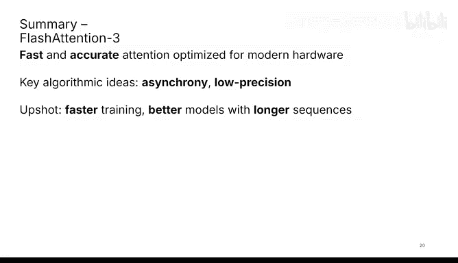

Other hardware， know， AMD， G A， GPPU， TPU， black wh is coming I really excited for that。

 And two key ideas。 One is asynchrony and one is low precision。

🎼And the upshot is you can get faster training better models with longer sequences。 So with that。

 I'll stop here。 Thanks so much for your attention。

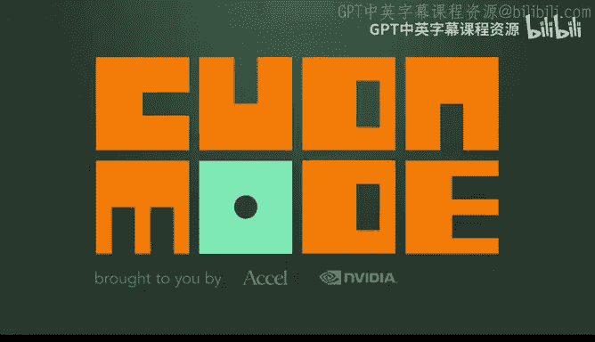

🎼Our next speaker today is the true AI footstep capacity Earl on in her career。

 she designed the next generation GPUs at NVDdia， then she developed high performance and kernels and quantization kernels and now she is an engineering manager at Pytorch。

 the PyToch performance team where she is responsible for the latest and greatest Pytorch features and of course for the people behind this。

 so please join me in giving a warm welcome to superiorya Rao。Thank you。 Hey， folks。

 really excited to be here。😊，Today， I'm going to be talking about quantization and sparssity。

 specifically through the lens of what we've been building for this at Pytj。

So we've been building this library called Torcheo。

 which stands for Pytorch Architecture optimizationimization。

 which is a library for quantization and sparsity that's easy to use fast and composable with the rest of the PyOch ecosystem。

😊，So it works great with other Pythch primitives like Toch dot compile and other distributed primitives like FSDP2 instead of like just being easy to use and build on it also provides state of the art performance for both LLMs and diffusion models on in video GPUs So the main features that Totio provides are quantization and sparsity quantization enables you to run your model at a lower precision by quantizing your weights。

 activations or gradients to different D types like in in4 FPA NF4 etc。😊。

Whil parrssity works by removing parameters from your weight so that you can run your model faster during inference。

And using these in Pytorch is a simple one line API where you call the quants or Sify API pass your model and pass the specific technique you want to do。

 So there were a few symptoms that we observed in the open source community that really inspired us to create Torio。

😊，First is that getting a technique like coization right is challenging。

 And even if you get it right， writing performance kernels for this is hard unless you're a coa expert。

Moreover， once you get these techniques working， getting it to work with the rest of the Pyth stack。

 like distributed training is non trivial。 For example。

 let's say you want to run Korra with FSDP or FSDP2。😊，Also。

 you have all these optimization techniques。 There's always a question of how do these techniques compose with each other。

And lastly， we all know and love Torch compile and think it's amazing but we don't know how to use it with these optimization techniques and so our vision with Toro is that it should be trivial for you to quantize or specify any part of your model to whatever data type that you want。

 whether it's your activations， your gradients or your weights。😊。

Run it for training or inference on a single GPU or 100 GPUs。

 all in native vitch and all without sacrificing any performance。So how do we do this in Torch you。

 you can write your code in pure Python， and that gives you really fast development speed。

 And you can take advantage of torch compile to generate fast performance kernels。😊。

And you also get sort of like the composibility support that you see in this diagram。In some cases。

 the compiler might not be performant enough。 So we also provide ways for you to like build package and ship custom Triton or ka kernels along with the library。

So we think of ourselves as compile first， not compile fundamentalists。

 What this means is that we really build like a tight feed back between Torceio and the compiler and we use Torceio as a way to improve the performance of the compiler over time。

😊，So here's an overview of the quantization stack in Torceio at the very base layer。

 you have the what we call the basic D types。 and there are various signed unsigned integers and floating point D types that we provide support for。

😊，Sitting on top of these D types are theization ops and fast kernels。

 quantization ops are operations that are used to convert sensorsors from low to high precision。

 while fast kernels are there in case like the compiler may not generate optimized kernels。

So now that we have these D types and associated operators。

 we can glue them together in an abstraction known as quantai ssor。

 and we have a support for aine quantai ssor， which is a subclass of a toch tensor type。

At the top of the S， we have the quantization flows， which is where most of our user facing API slow。

 So we have support for weight only static dynamic activation quantization and various accuracy preserving algorithms like GPQ or H QQ。

😊，And the nice thing is that all of this is just in Pytorch without any external dependency under the hood。

 Torcheio uses tensor subclass for most of its quantization flows。 This provides a few benefits。

 The first being flexibility。 So since it operates at a tensor level。

 we can quantize operations like functional linear layers and we are not limited to just N linear modules。

😊，Moreover， since it doesn't modify the graph， your model before and after quantization effectively looks the same。

And this has an added benefit of making serialization and deilization process really easy。

 So you can effectively load your quantized checkpoint into an unquantized model without requiring any prior transformation。

Alright， so this is how you would typically use quantization today in Pytorch or Torceo。

The first step when you want to quantize your model is to pick how you want to quantize it。

 And there are various parameters here that will influence your decision。

 First is whether your model is memory bandwidth bound or compute bound。

 depending on which you would choose weight only or weight plus dynamic activation quantization。😊。

Once you pick that， then you'd pick the D type that you want to quantize it to。

 depending on what your performance， hardware or like accuracy tradeoff。

Once you pick these parameters， quantizing your model is just calling the quantize API with the specific technique that you want to quantize it to。

This will give you an eager quantized model as an output。 And if you want to make it go even faster。

 you can call Toch compile on it to get even more performance。😊。

So what we noticed is that sometimes our users use our quantonization APIs and their models actually run slower。

 which is not great。Why this happens is because quantization inherently has an overhead associated with it。

 And this overhead is amplified for layers with small shapes。So we built this tool called autoquaant。

 which effectively leverages compile to generate micro benchmarkchmarks at a per kernel level and decide whether or not a layer should be quantized or what data it should be quantized to。

Another advantage of writing things in Pytage is that these APIs are easily composable。

 We can take our intake data type that we have and compose it with the sparse kernels to enable intake quantization plus24 sparsity to get even more speed up during inference。

😊，Okay， so let's look at some numbers here。This is Lama 3 at batch size one。

 which is typically memory bandwidth bound。 So technique like weight only quantization helps。

 And if you see on the chart on the left as we reduce the precision of the weight。

 the speed up or the tokens per second increases。😊。

With the largest speed up being close to two x for the in4 rate only quantization compared to the B flow 16 baseline。

Now， we can also compose this in four weight only quantization with KV cache quantization and run the Lama 3 model with 128 k context length in less than 24 gigs of Vam on a consumer GPU。

😊，And writing KV cache quantization in Pytoch is just a few lines of code。

 This is written in less than 50 lines of code。 And this is meant to be more as like a reference implementation that you can just copy paste into your own model and enable KV cache quantization on it。

😊，On the training side， we also have easy to use APIs that enable you to do both computation as well as distributed communication and low precision。

 specifically for float aid where we are seeing 1。5 x speed up versus the compile baseline。😊。

And under the hoodd， this uses a floatate tensor， which is a tensor subclass type。

 and it leverages torch compiled to generate the fast floatate scaling and casting kernels and also of fusing these kernels with preceding operators where applicable。

😊，With floatate training， you also get autograph support and distributed support。

 So it works with distributed primitives like FSGP2 tensor parallelism and sequence parallelism。

 So inspired by bits and bytes， we wrote low bit optimizers in Py toch in a few hundred lines of Python code。

 So we have4 bit and 8 bit optimizer support in torio。

 and it's pretty good like we see35% V reduction on the Lama 3 module with them。

 and the performance is also pretty good。😊，Conization works great， not just for LMs。

 but it's also great for diffusion models。 For some reason， my video is not playing。

 but its it's a cute video of like a little baby astronaut hatching out of an egg on the moon。😊。

All right， so yeah， so for diffusion models， we saw like 53% speed up with floatate quantization on H 100。

😊，This was generated by the flux 1 dev model。And for co video，5 B model for context。

 it takes like over 30 gigs to run it on the GPU。 And with autoquant and compile。

 you can reduce not just the V Ram reduction by 50%。

 but you can also get like a 27% speed up because of compile。😊，And as you can see， like these。

 these images were generated by quantized models。 So the quality is pretty good as well。

I want to give a shout out here to the Huging phase diffuser team。

 They really like battle tested a lot of our quantization APIs and ran various benchmarks on diffusion models。

 So you should definitely check out their repo if you're interested here。😊。

So I spoke about a few techniques， but this is sort of like everything that we have today in Torcheio across inference fine tuning and training。

 There's a lot more details like on the Github repo with benchmarks and API details if you're interested know feel free to check it out。

 The nice thing about Torcheo is that we've been able to experiment with a lot of interesting features in Pytch。

 I want to call out a few here， which I think are really cool。

 The first is that Mobychem who authored H QQ actually added H QQ support in Torceio in native Pytch。

 So you not just have like fast kernels， we also have like good accuracy for those in4 kernels now in Torcheio。

😊，Vuda wrote a lot of like low bit ink D type support using tensor surpluses in Torio。

 which really like paved the way for us to invest more in low precision inference now。

Gs has done some great work on intake quants and mixed precision trading that's actually showing some pretty impressive results which makes us want to invest more in this direction going forward and Diegoogo integrated the two four parts modeling kernels now into Torceio so you can see like even more improvement in the performance compared to the previous in4 weight only quantization numbers I shared with you earlier。

😊，And like building on that， what we're really excited about next is the ability to run Pytch quantized models on various backends。

 So a lot of what we've been developing on has been on Nvi GPUs， but for example。

 we'd love for us to be able to take quantized models and run them on your MacBooks or even on your phones。

😊，We've been like talking about a lot of D types， but we don't really have a full understanding of how these D types interact with each other。

 So mixed precision quantization is also interesting going forward and building on the work on like floatate and in quantized training。

 we want to invest more in low precision quant training， definitely。😊，Yeah， on the kernel side。

 so far， we've not seen great perform less than4 bit kernels。

 The compiler generated ones are not performant enough。

 So we are really looking for more feedback here on how should we think about writing these less than4 bit could our write kernels。

😊，All right， So okay， there's a little heart there。 Torceio loves Kuda mode。Sorry but。Al。

 so yeah with Toro， we've been building all of these techniques as a community。

 most notably with the Koa mode community， which has been like a great way for our core team to get feedback on the features we build and really get a lot of interesting new contributions into the library。

😊，In fact， like some of the Kudamo members are really cool maintainers of the repo now。

 and I want to give a shout out to a lot of folks from the server， like Gs Valutda， Coffee Va。

 Melvin， Andreas， Diegoogo， AI H D， Y4。 And you know。

 there are many more who really helped us get to where we are today。😊。

And were building this together as a community。 And we really want to work with more of you going forward。

😊，So if you're interested in not building， but you want to try out Torio。

 you can also like P install Torio。 and you are also fortunate enough to be integrated into some other awesome libraries like hugging face transformers。

 diffusers， S G Lang and Torch tune。 So you can also use Torio through one of these frameworks。😊。

Yeah and lastly I want to sort of like conclude by summarizing what we spoke about today so I talk a lot about Toio which is a Pytch native Library for Quaization parsity that's easy to use fast and composable with Pytch and really this one thing I want to take away from this is that it's more than a library it's like a community driven project and we really need more。

😊。

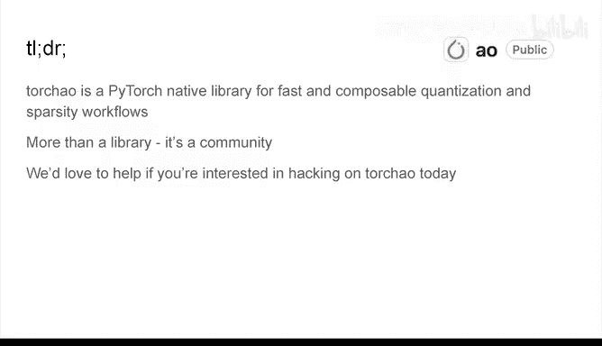

Feedback from the community for the project to continue growing。

And we've seeded a lot of like hack ideas and projects together around the Quaization。

 parsity and custom kernel space。 So if you're interested in hacking on this。

 if you want to make your first contribution in this space today， we'd love to help。

 So come find us there are a lot of like core members of the team as well。

 who are going to be wonderinging around here。 And let's build some really cool optimizations together。

 Thank you。😊。

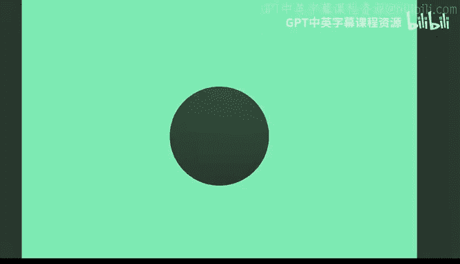

🎼So I am now super thrilled to introduce to you a legendary person。

 someone who has been heing and educating at the forefront of AI for over a decade。

 from neural networks to computer vision from natural language processing to reinforcement learning。

 he has pushed the boundaries and inspired millions all over the world。

 including I think all of us here， he is a distinguished machine learning superstar。

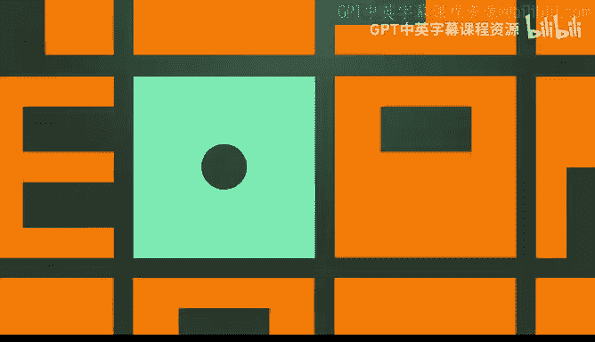

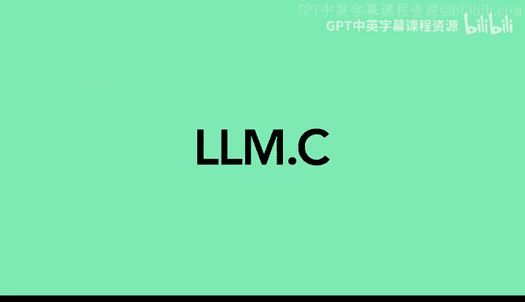

A founding member of Open AI， the reference Human for ImageNe。An X， Google Bra， X， Deep Mind， X。

 Tesla， Mr。 Autotopilot。He has really seen it all。And some month ago。On a memorable day。

 this special person joined the Kudamo discord。😊，To start hacking with others on L L M dot C。

 which became one of the greatest and most active community projects on our server。😊。

But I guess it's best if he tells the story himself。

 So please join me in welcoming then credible one and only Andre Kapathhi。😊，Wow， okay。Yeah。

Very impressive。Okay， yeah I'm very excited to be here。

 this is my favorite kind of event to present at， so yeah thank you for the invitation and thank you for running Kuda mode and putting this on this is like a wonderful event。

😊，Okay， so I'll tell you a bit about LM doty。 So what are we doing。

 We're training transformers in C and a pinch of C+ plus so I'd like to tell a story a little bit of how this project came about and what this look like from my perspective So roughly a year ago。

 I was trying to add a video to my YouTube series and I was trying to teach people LM training GT training and so on。

 And I was basically hacking on nanoGPT trying to get it to work。

 So that was me And then you've all worked with Pythtorch of course right so the trickiness comes that you have your model which you've written that makes sense But now you have to keep track of a number of abstractions here at the same time。

 So you have to put it to a device。 you want to compile it。

 you want to rapid it in D and suddenly things start to be a little bit more complicated because I'm not even sure in what order do you do these。

 What exactly happens。 What are these abstractions。

 What do they do to your model So I don't fully understand how any of this works。

 And then what happens is you want to use your model in different ways。

 So when I use it in evaluation in training or model inference and so on。

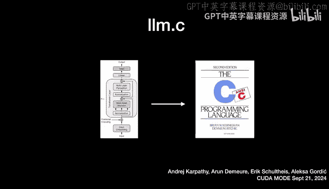

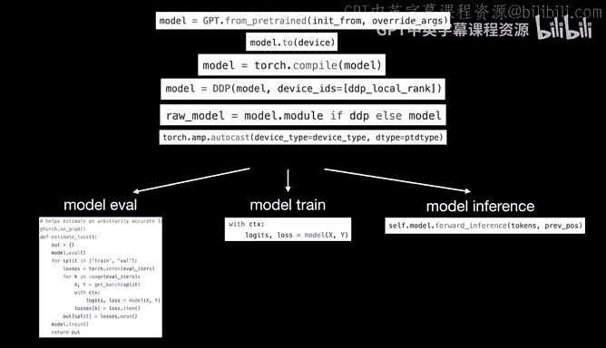

And what happened to me is that I was able to train the model。

 but for some reason EVval and inference was not working and what happened was I was getting some kind of a torch compiler error when I was trying to run my EVval and my inference and this is just an illustrative example of a torch compile error it was something else I didn't remember I didn't capture it。

 but both of them were given me error inference and EVval and a different error and I had no idea what was going on so I did what anyone would do in my position。

 I went to to discuss。😀Yeah。😀。😊，And I'm looking for PTR BLCK to solve my issue。

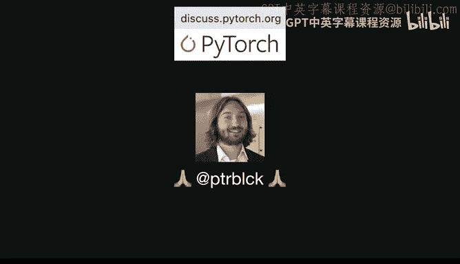

Unfortunately， PTR RealO CK did not have any guidance that I could see on that specific error。

 So I was kind of stuck， honestly。 So two hours later of fighting with torch Comp and trying to figure out what the hell was going on。

 I'm kind of a sad panda。 I don't know exactly how to solve this。

And so I felt like I was going through these stages of grief。In the beginning I was in denial。

 I was like this can't be happening to me， I'm not doing anything crazy。

 I'm just training a little GPT， like why is this not working because this seems really simple。

 I'm not doing anything crazy and then eventually I entered the stage of anger。And I was like， okay。

 you know what， I'm just gonna write the whole thing。

 Like I understand in my mind what I'm trying to do。

 like the computation in the algorithmm itself is totally clear in my mind。 And for some reason。

 Torch Compild doesn't let me like use it， run it， etc cetera。 So I felt a little bit powerless。

 And I was like， okay， I'm gonna to take life into my own hands and be in control of my detiny。

 I'm going to just write this and see how bad could it be。

So let's think about like， what is Pytorch offering you really， And there's many things。

 but maybe some of the things that are relevant here。

 I don't know why those bullet points are 1 on one。I don't know what on my slide its totally fine。

 So I don't know what conversion happened here。 Okay but number one， we're getting an array， right。

 so a very useful and dimensional array that we can manipulate the operations。

 If we're gonna abandon this， then we're gonna have to do a lot of pointer arithmetic basically making sure that we ra and unravel ind correctly。

 second， we're getting autograd for free。 So if we don't have autograd。

 we need to do forward and backward passes of all the layers。

 we don't have device so we have to worry about memory being on the host or on the device and shuttling memory around your different devices between CPU and GP and so on。

 We don't have simple detab conversions。 So we have to be very mindful what tensors are stored and what precisions and convert explicitly between them。

 We don't have torch compile。 So we're gonna have to do all the kernel fusions that we want manually and we're gonna have to optimize for space and time performance manually。

 and finally， we don't have distribute it。 So we're gonna have to manually spinapple of our processes make sure that they can find each other communicate with nickel etc。

 So Pytorch is really， really nice and this is just some of the things that Pyr offerss。

 So without Pytorch we're kind naked in the world right But maybe it's。😊。

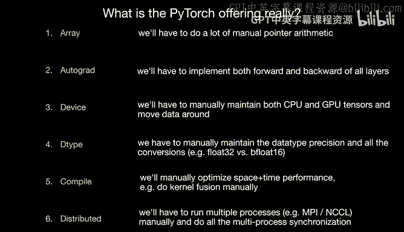

系。So， yeah how could how bad could it be。 So step1， we have our Pytorch code。

 which now isn't the primary thing we're working with。

 It's only a reference that we check correctness with respect to。 And so we're in Pytorrchland。

 Everything is nice and clean。 We have a little transformer， a few modules。

 and we're just calling them。 So everything is great。 And that now becomes our reference in Pytorch。

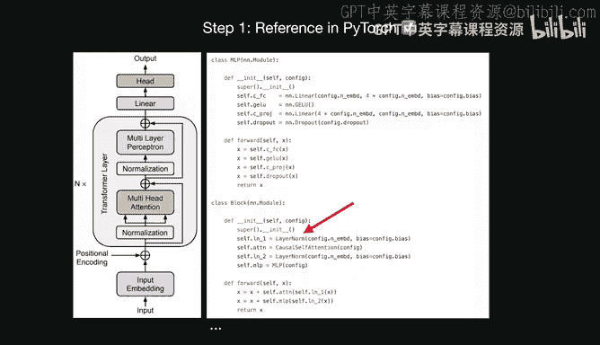

I'd like to just take you through one example of layers so for example layer norm here is like a pytorch layer and we'd like to basically port this over to C so what kind of process do we go through well we're going to it through all the layers number one。

 we need the forward pass and actually I had to write the forward passive layer norm because Pytorrch doesn't just have this kind of implementation in Pytorrch of layer norm because it's kind of like a block and eventually it calls into some kuda kernels so I had to write the forward passive layer norm and make sure it's equivalent to the layer norm in Pytorrch。

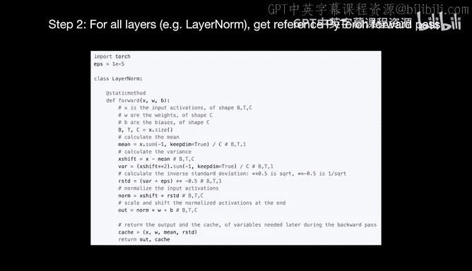

And then， of course， I had to write the backward path of layer norm。

 This is where you kind of take out your pen and paper， do some back。 This is for batch normm。

 but layer normm would be similar。And yeah， we have to write the backward pass。 and again。

 this is all still in pytorrch， but it's explicit。 and you're just making sure that layer norm of pytorrch forward and backward matches this this basically manual tensor based implementation。

 So now we have pytorrch code forward backward。So next thing we do is we try to port it to C。

 And this is actually like a lot simpler in many cases than you might think。

 So on the left we have the Pytor code on the right。

 we basically have the equivalent layern forward in C。

 and it's not that crazy right So unlike in Pytorch。 we just have a bunch of float star arrays。

 So we have a float star out float star inputs， outputs means standard deviations weights and biases and some high parameters。

 And one thing I really like to do in El and thats I just want to keep things simple。

 I dot want to create a tensor abstraction。 I dot want to create any abstraction really。

 is just float arrays and operations on float arrays。

 like I should be a lot more complicated than that。 So everything is just float arrays。

 everything is fully self-contained， there's no underlying representations。

 abstractions to call import， etc cea。 This is the layer known forward on float arrays and that's it。

 So that's the forward and then you also do the backward for all the layers。

 once we've done that for all the layers and convert everything to see and make sure that everything matches our reference implementation。

 we have to start to string it together。So we go into our C code in main and we have to allocate all of the memory that we're gonna be using in Lm do C。

 all of the allocation happens a single time at the beginning。

 So we preplan all of the memory that we're gonna ever use then it's fixed And from then on is just dynamics just feeding data through it and training the model。

 So we have to preplan all the tensors， their sizes and we have to do that for the parameters and we have the data grad and the MV for theMW buffers and then for the activations as well。

 and we need space for both data and grad。 And so you just preplan all the memory。

 you allocate all of it and then we need to stitch it all up。

 So we have all these layers and they have a forward and backward pass back prop and so on the forward the forward paths just kind of like you allocate all these tensors and you're very careful and index into them properly and you make sure everything flows correctly through and you just call the forwards and then all the backwards and then you're kind of done and you're left with gradient then you can do an update。

 So stringing that together is the second piece of work。 And then once we。Like strongly together。

 you get something that you can just compile and run。

 So we on the top left is everything that's required。 We download a starter pack。

 which is really just the G2 weights in a single binary file， very simple。

 and also we need the data set in this case， tiny Shakespeare and the tokenizer and stuff like that。

 And then we just compile and run this little C code file。 It's a single file of C at this point。

 And I think it's like 2000 lines or something like that if I' correctly。

 And you run that program and it does a little training and output some Shakespeare at the end。

 And then we can verify that the ptorrch code is identical to the C code and everything is great。

 We're just running in C。 And at this point， I'm actually feeling quite great。

 because this is amazing。 So we have a single file of C。 There's no dependencies whatsoever。

 It compiles instantly it runs instantly all the memory is just allocate in a single blob。

 So if you start stepping。 there's no way you're gonna o later is's all preplanned。

 It's fully deterministic。 in principle， can train G2。 It's complete。 It will train。😊。

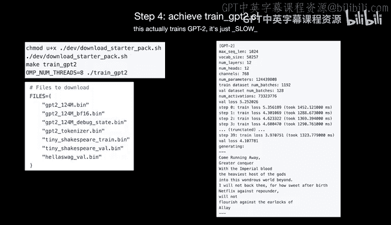

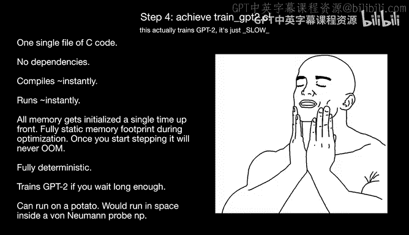

PT2， you just have to wait a long time。And it can run on a potato。 It can just run on anything。

 It's just a single file of C with no dependencies。 And in principle， this could run。

 this would be a great candidate to run on a von Nean probe because in space。

 if we just harden it a little bit more， because you。

 you're not gonna ship Pytorrch code on the v Nean probe。

 But I think LMC is a great candidate for that。😊，So I was feeling great at this point， fun side note。

 by the way， all of this work that I described so far。😊。

Happened on a vacation while I was jetlagged in Maldives。

 So I basically is perfect because you wake up at 1 AM and there's nothing to do。

 So you write stuff like L O M Dti。 And then in sunrise， you go do all the weather activities。

 So that is the villa where most of L O M Dtzi was was trained。 So that was perfect。

 This is a picture of it。 And this is a this is， I think the moon is about to set and the sunrise is about to happen。

 This is a recommended way to do software development。😊，Okay， so now we have C code。

 but it's ineffient。 So we'd like to run it faster for that。 We reach for GPUus。

 So we need to convert all of our C code to GPU。 So this is where we go to the dev kuda part of the repo。

 and we start to develop all the kernels。 So here's the layer known forward pass， As I mentioned。

 And now we're going develop a number of kernels that have the identical functionality。

 But now run on the GP and they're gonna be faster。 And so usually we have versions 1，2，3，4，5，6。

 etc ce。 And these are all different kernel implementations They are a bit faster， usually over time。

 But they match the specification exactly and give the exact same numbers。

 So we develop all those layers and port them to kuda。😊，And this is， I don't know what this is。

 I'm gonna skip that。s like one of the kernels。 Basically the point here is the first kernel is trivial to do usually because you're paralyzing over batch and time and then you're basically copy pasting the C code into your kuda kernel and you're already getting speed outs because you're paralyzing over the batchtime tokens and each thread just handles a single output elements。

 So the first kernel is usually trivial。 but then optimizations can be pretty elaborate。

 So by the end， we get to kernels6， for example， in layeror and we're doing a lot of things that are a bit more complicated。

 So we have some you know war produced operations。 we have some we also communicate through shared memory through glber memory we're orchestrating it correctly cache streaming hints and a bunch of little tips and tricks for dealing with everything。

 and I'm going go into a bit more detail later。 but you can get arbitrarily complicated here writing the ka code。

One thing that I sort of found in this project is that。It's not exactly trivial to learn Kuda。

 unfortunately。 And it was like a little bit harder than I expected。 I knew some kuda going in。

 but getting better at it， I think is not trivial。 I think some of these books， unfortunately。

 are a bit out of date， as you might know， PMP is actually quite good but also I think still kind like mostly on the bigger level because a lot of the kuda code that we ended up developing in the lifetime of the LNC project。

 you would not find those things in this book actually So a lot of the kernels that we ended up adding just not be covered。

 And then on top of that， you have this kuda C programming guide。

 which frankly is not exactly readable for someone who is a bit new to that to kuda。

 and then you have this amazing blog post from Simon who is that enthropic that is like way better than anything we deserve just like randomly on the Internet。

 So that was incredible And if there was just more of that that would be so amazing。

 yeah so I think I found it a little bit difficult but mean I'm hoping that things like Kuda mode can definitely a speedup available。

In could量。Okay， so next what happened。II was basically struggling with the ka code a little bit。

 and I was reading through the book and I was implementing all these kuda kernels。

 and they're like okay Ka kernels， but they're not great。

 And so a team of avengers assembled from the Internet when they saw Ellum Di and started contributing。

 So specifically Eric Alexa like I would say core devs of Ellon Di and have contributed a ton of work to El Di and they started to really optimize and write all these kernels and this was incredible to watch and learn a lot from and there's many more Ross wheelheeler and Chntael and a few others。

 over time we have 60 contributors to the Ellum Di project shout out to Lambev were sponsoring Ellon Di they contribute compute so that we can run and optimize all these kernels。

 So it was amazing for me that people just came from the Internet and helped out on the project。

 And you know this is one of the favorite things that can happen。

 my favorite things that can happen with an open source MiT license Repo people just come from the internet and help contribute。

 It's amazing。Okay， so we've converted all the layers to Kuda。 We have now all the kernels。

 and we can now train on a single GPU in F P 32。 so far。 So that's great。😊。

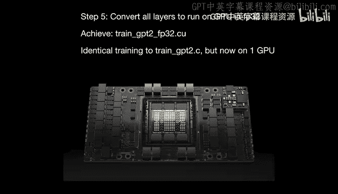

So from then on， we start to make more and more optimizations。 So number one。

 we don't want to have Mamals in F 32， when you roll your own code。 we actually switch to Kub+。

 step 2， we don't want to write our own flash attention。 I think that will be pretty complicated。

 Turn out Kudan has a very good flash attention implementation。 So we switch to that。😊。

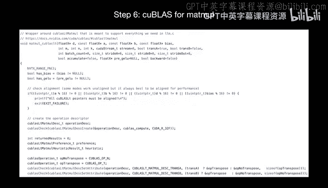

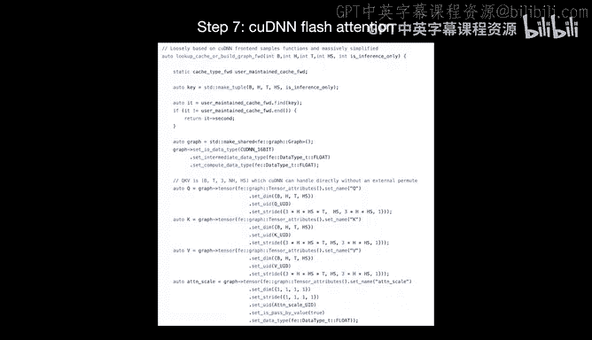

Next， you want to definitely reach for mixed precision so that to speed up the code so you want to go over all your tensors for parameters and also for activations and so on。

 and you have to start to think about okay which ones are inflow 32。

 which ones are in Bflow 16 and what precision are they in and then do all the conversions automatically so we reached for that and implemented that There's many。

 many other optimizations that we ended up implementing over time So as an example we did all the kernel fusions。

 different recompute settings to recomp pieces of the forward pass during the backward there's been a lot of optimizations from Erica especially on minimizing the amount of memory that you need during the backward pass。

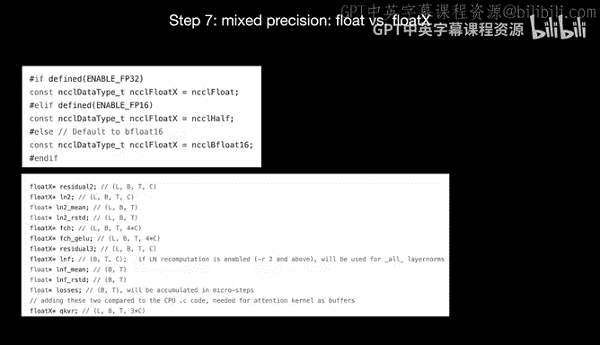

We have this like packed 128 data structure which basically in our experience forces the compiler to use the 128 bit load and store instructions that are available。

 but somehow the compiler is unwilling to use in many cases so I think Irun did a lot of work here where you just look at the SaS and you look at the SaS as the assembly and you are looking at what instructions are being used for your loop and you figure out that okay this should be a 128 bit a load in store but happens to be a 32 bit or something else because something in the MCC compiler is not going very well so we found that this data structure kind forces the compiler's hand a bit more we implemented all kinds of coest streams to overlap the part of the computation and this ended up creating like a total disaster and so that's why I crashed it out because at one point of ElN that's as Arrun would say I basically went in and I nuked it from orbit I just went in and control for all mentions of stream and I just delete delete delete and basically I delete all the streams made everything single threaded because we ended up getting all kinds of really weird race conditions and errors。

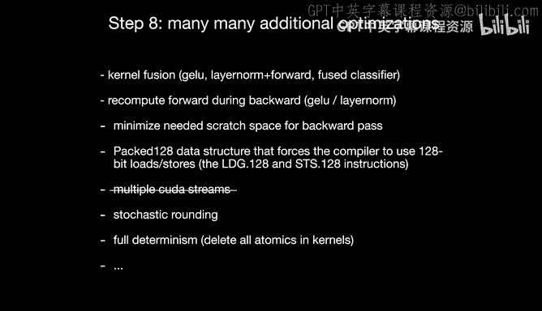

so on and just didn't want to deal with it so Ellen thatsy is not actually as overlapped as it could be。

 but it's just like it's too much complexity for not in have gain at this point but maybe we can slowly reintroduce some of it we have stochastic grounding。

 we have full determinism， full determinism turns out to be pretty hard because some of the kernels canify a lot because you can't use atomics like the encoder backward was especially crazy because encoder backward is trivial with atomics but non-trivial without it anyway so a lot of the optimizations went into with a lot of efficiency and determinism in mind。

And accuracy， like stochastic rounding and so on。Next， you want to use multiple GPs。

 not just a single GPU。 So this is where you bring in nickel。

 you start to do overd between all the different workers。

 And this is where you also start to reach for like shed optimizer state01。

 where basically you take your optimizer states which are in floatat。

 And these are really large buffers for add and W。 and you can actually spread out a lot of the stuff across all the GUs。

 and it really helps to keep your requirements down per GPU in terms of memory。

 So very helpful to reach for that。 So currently L do uses 0，1， which is a sharded optimizer state。

 There's a PR for 02。 but I don't believe I merged that yet because it gets a little bit messy。

 but might be merged eventually， A lot of LMC is just kind of like。

Balancing the improvement and speed with the complexity of what you're actually introducing。

 And so I've actually rejected a lot of PRs because of that because the cost starts to get crazy。

 And I think that decreases the amount of people that can be onboard the project。

And then after multigp， you have multi node。 so now you are running across multiple machines。

 you have to make sure that you synchronize all of them that they can find each other and so on。

 So we implemented all that。 And where that lead us to is that we can actually change G2 and we can actually reproduce it after all of that work。

 So there's a post in the discussions of Lmi we can train the 1。6 billion G2。

 which was state of the art Lm as of 2019 or so。 and you can train on a single note of H100s in about 24 hours and that costs roughly 600。

 And the way you do that is it's extremely dependency free。 There's no need for Python。

 no need for Pytorrch So you do need codnn which is the most heavy dependency。 but coudN is optional。

 So if you'd like to roll your own manual attention that is possible in Lm KdN is kind of like the hairious dependency。

 but after that is just a bunch of Cco you compile it and you run it there's no need for really anything。

 So there's no need for Conda environments P installs。 There is just nothing which is amazing。

 and then you compile your code and you run it and it starts stepping。 you weigh 24 hours。

And then this is its stepping， print some diagnostics。 We have almost 50% MFU here on one node。

 which is quite good。 And you get really nice plots and you beat G2 on Haswag。

 And basically this just indicates that the optimization went well。 No crazy numerical issues。

 lost spikes or anything like that for this size。 and。Yeah， achieving a really good model in Os。

 that's in OM， that'sy。We can still compare to Pytorch because remember we have PyTtorch implementation for all this stuff in parallel on the side。

 And so you can run the equivalent training loop almost in Pytorch and we can compare the two implementation side by side。

 And in particular， at the time of writing that post。

 and I don't know if this has changed because the Pytorch team continues to optimize things over time。

 but at the time of that post， we were using an El and thatsy 30% less memory and we were 20% faster in training just to throughput。

 And I don't know if I fully super duper optimize the PyTtorch implementation。

 I did my personal best。 but this we were able to， I think beat Pytorch in training of specifically G2 in El and thatty if you want to train anything else。

 you're in a lot of trouble。 you have to change your code a lot and we're doing that and I come back to it。

 but for G2 training were better after all that work and it also compile and runs much faster。

 which is beautiful Torch Comp actually takes like quite a bit of time like a minute or something you're just waiting。

 So that's also something that I personally don't like to work with usually。

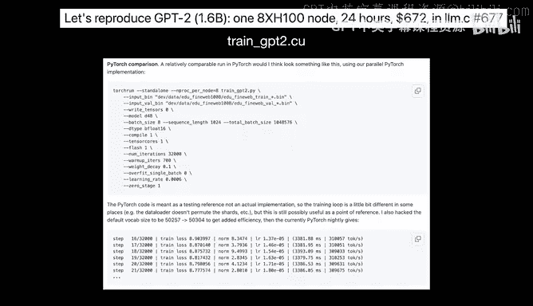

Okay。So looping back around， turns out it wasn't all that simple。 There was a lot of stuff involved。

 and it took a few months for a few people， but。It was fun。 We learned a lot。

 and we made friends along the way。 This is the LMC Cords。😊，You know， so it was， it was great。

 ongoing work。 We are adding Lama 3 support。 We actually thought maybe we would have it done by today。

 but there's a few more， few more， a little bit more work to do， but we will have Lama 3。

1 training in Oland Sea very， very soon。😊，We will have FP8 support。

 So Errun has been working on this， and there's a big PR that's coming for F8 support。

 which is also interesting。And there's a lot of notable forks of El thatszi。

 they're all listed in the Catapripo。 The AMD fork is very active as far as I understand and quite good。

 I think also the C+ plus Kuda fork is quite nice and so a lot of forks。

So encourage you to also for L and dot C is fairly readable。 I think I tried to keep it clean。

 well documented。 I think it's pretty well understood what's in there。 It's only maybe like。

 I think 3000 lines of code to basically see mostly。And one more thought。

 I think that I wanted to get across is。It wasn't all that haphazard to start the project。

 I had another motivation for starting the project。And that's that， I think， I mean。

 what is L M that C， Like if Pytorch is， especially torch compiles a bit like GCC for software 2。0。

 It's a compiler。 then LMC is a bit like writing assembly。 We're doing everything manually， right。

And basically， I think。We wrote LOMC as multiple people over a duration of three months and got something that was faster than Pytorch in a specific setting of G2 training。

And so what this exercise basically proves that this is possible。 Now。

 the problem is to spend multiple people several months。

 But if LM are about to become much better at coding over time。

 then I think you can expect that the LM could actually do this for any custom application over time。

 And so the L M could could act as a kind of compiler for any custom application you're interested in。

 they're gonna do all the LM work and they're gonna output a binary that you can compile and run for your specific applications。

 So I don't actually know if we like the use of Python and pytorch and everything else。

 is just a crutch because we humans are finite， finite knowledge intelligence and attention。

 But actually， don't you want to write all code and custom k kernels and so on。

 like maybe And so the other thing that I think is interesting L do repo might be useful because in the early stages of these L and their intelligence。

 they might not be able to write this code from scratch。 if you just prompted them write G2 and C。

 you probably won't get L dot。 but you're a lot more likely to get it if you put L dot C in the context of such an LM and you can expect。

🎼That a few shot learning would be very helpful for the L M to basically give it example code。

 And so I think L M that could be very useful for this example code to get to the LM as they're about to write all of our custom applications。

 And so I think this is actually not unlikely to happen。 Yeah， this is kind of likely to happen。

 So I think software development in general will probably change a lot。 And to me。

 L thats see is an exploration of whether this is even possible because if it is possible。

 then maybe this this is what's going to happen。 so。🎼Yeah， that's it。 Thank you。

🎼So our first talk will be given by a brilliant PhD student from UC Berkeley。

 who is a core developer of the VLLM project， which is one of the most used high performance open source。

 LLM inference engines out there with dynamic being， page attention， custom kernels。

 speculative decoding， quantization and many other features。

 they together with she together with their incredible team have been pushing the boundaries of what's possible in open source and available in terms of inference speed and efficiency。

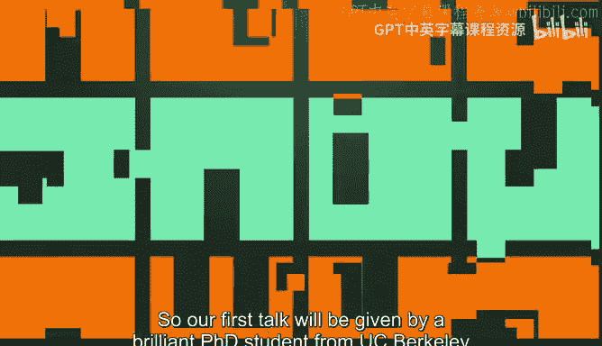

Always minimizing latency and maximizing throughput。 please give a warm welcome to Lily Lou。

Thank you。 Thank you。 Hi， everyone。 I'm Lily。 I'm currently a PhD PhD student from UC Berkeley。

 So it's a great honor to represent the VRM team to to talk about our project in Ka mode。

 It's a great event。 and other team members of VRM is actually also here like Kaio Uuk。

 Feel free to catch up with them like if you get time。😊，Okay， so let me get started。 Okay。

 so for this talk， it will have mainly have three topics。 First， I will introduce VLM project。

 And next， I will highlight two features like to new features in VLM。 The first one is tor compile。

 The second one is speculative decoding。 So the goal of the VLM project is to build the farthest and easier to use open source L M inference and serving engine。

😊，So we launched a project in June 2023。 And when there were only very few like open source projects for I am serving。

 and we are very lucky because we get lots of traction from the beginning。

 and it has become one of the most popular projects in this field。😊，And we have lots of like users。

 industry users， including like those big cloud companies like Google， AWS or Asia。

So why do people use VLM。 I think one of the reason is that VLM has very easy， like easy to use APIs。

 So we have the LM class and the user just need to specify the prompts and the model they want to they want to they want to use。

 and then it's just called generate function on those prompts。 and under the hood。

 the VLM will handle the scheduling， handle the KV cache management。

 do the request batch automatically so user does not need to worry about those things。

So we also start VL M we also support VLM as an open AI API compatible server so the users can just serve the VLM use like VLM serve and specify the model you want to serve。

 And then you can just use an open AI client， send the request to the endpoint。

 you just replace the U with the local U。Another strength of VLM is very broad model support。

 so VLM currently support almost all the popular like open LOMs and VLMs。

 so we are the official launch partner of Lama， so we support Lama new models from day one and we also have very close collaboration with those like state of art vision language model creators like for example。

 Mi P and Cuban like they contribute they contribute their like new vision language models to VLM。

On top of that， I think VLM also supports many features。 right First。

 we support virus like quantization methods， including like F， GP T Q， AW Q。

 We also have the LM compressor so that the users can compress compress your models use different like compression methods。

So we V M also support like prefix caching。 So this can be an important feature。

 if like lots of prompts， they share the same like system prompt。 So in that case。

 we can reuse the KV cache of their input of those system prompts。

So we also support like pipeline paradigm。 So pipeline paradigm is important when the model is too big to fit in a single node。

And all you want to serve like models with some PC IE connected instance， such as Al4。And lastly。

 we also support like multi lara serving， so you can serve multiple lara adapters in VLM。

 we can load them load those adapters to the GPU memory dynamically。

So actually we provide like many more features like besides what I mentioned before。

 so in today's talk I will dive into a little bit about Torch compile and speculative decoding。

 but we also have like Trump guided decoding， KV cache unloading。

 so I encourage you to take a try if you are interested。So， of course。

 V L M is built for performance and efficiency。 So in L M serving。

 there are five type of kernels you might want to like implement your custom kernels instead of writing pure pie torch。

Right， so here， V L M supports like different types of kernels。 So， for example， for the Qize gym。

 we find cut kernels provide the best performance。And for group jamm。

 we find that Triton Triton is more beneficial in that case。

 So we use them use the Triton kernels for those group jam。

 and they are used in the M O E serving in VLM。We also have like a custom or reduce kernel for small batch size in VLM。

 because we find that Nikole is not doing Nik's ring reduce ring or reduce is not very good in those small batch size scenarios。

We also have different like attention backhand， right， like flash attention， flashing for O Xers。

So for all of kernels， we we all use like kgraph to minimize host overheads。

But building an inference engine is much more than just right kernels。

 like in the process of building the L M building V L M， we learn a tough but valuable lesson。

 So we learn that to fully utilize the GPU。 We need to pay close attention to everything happening on the CPU。

 GP are fast， but CPU are not So L M's inference engine is doing much more than just running the model。

 right， we do like tokenization detokenization scheduling memory management。

 All those logic happens on CPU and。And in VL M， they happens in Python， right。

 So which are even might be even slower。 So if they are not handled correctly。

 they might become the performance bottleneck。 And that is what we have experienced。

 So VLM is currently undergoing some real and we also have lots of like multistep scheduling asynchronized output processing to reduce those overhead。

 So I encourage you to check out our recent blog post。

 So we do hope that VLM is not only feature rich， but also but also be become very performant。

So lastly， I want to highlight that V L M is a community project。

 So we are joining the Linux Foundation。 and we are， yeah。

 and we are hosting like regular meet ups and office hours with our collaborators and users。😊，Next。

 I want to talk a little bit more about Torch compile。 Yeah， let's dive into it。

So I think since the start of the torch compile， VL M is very actively integrating this feature。

 But we find that since VL M is a big， big project。

 You cannot just write a toch do compile a single line of code to do the integration。

 So we actually divide our integration plan into four steps。 So let's go over them one by one。😊。

So the very first way we integrate torch compile is to apply it locally。 So， for example。

 models often have some have slightly different layer norms in terms of like precision or operation order。

 So instead of developing a custom kernel for each like each layer norm。

 we just use torch compile to for those for those slightly different like layer norms and treating it like a trident kernel generation。

 So this is already a big win for us because we don't need to write any kernels ourselves。

 we just use torch compile。 However， to unlock more optimizations。

 we want we want to apply torch compile more broadly。

 So the second step is we want to use torch dynamo to capture capture the full model。

So in the second step， we capture the entire model。

 But the challenge there is that we need to register every customer operations in a way that dynamo could process。

 So we want to avoid unnecessary， like recompilation。

 and we also have some special handles for those like in place in place custom ops。Next。

 we are enabling a toch inductor to optimize those captured graph。

So so we hope that with those with a torch inductor。

 we can optimize the performance using the some trident kernels for those small gems。

 and it can do the operation fusion more aggressively and do more like memory efficient memory planning。

😊，So looking ahead in Q 4， we want to explore further optimizations with H compile。 So， for example。

 we want to add some custom compiler passes for， for new types of operation fusion。

 like using the app logs， pro logs of the Qas kernels。 So please stay tuned for for this one。

So lastly， we want to highlight that VL M is a multi hardware platform。 So currently。

 we support like four different types of hardware， include different types of different GPus。

 CPUs and custom AI chips。So。and this is possible because of the we rely on like we have a very close integration with like Py。

 So instead of relying on some like external compilers or formats like Onyx。

 we just use Py as a narrow waste。 So it's a middle ground to connect different backends with hardware agnostic models and utilities。

Okay， so， so for the last part， I will just go through another feature。 Currently。

 we are actively working on VLM， which is speculative decoding。😊，So before I dive into the future。

 let me give you a recap like what is speculative decoding。

 So we think it's an important feature because it's a feature to help reduce the LM inference latency So the intuition is that like some tokens are easier to generate than the others so instead of using the large language model to generate all the tokens we use some small model to like propose token to generate easy tokens and large model to generate difficult ones。

So to give you a more concrete example。 So like here。

 given a prompt we were generally like without spec coding， we generally token one by one。

 autoregressively。But with speculative decoding， we will send the prompt into a small model first and a small model will propose token auto aggressivelyively。

 it will say oh the output might be t1 t to T3 prime and then it will send those tokens for the large model for verification so the large model will verify the correctness of those proposed tokens So in the example here right a single forward pass of the large model generate like more than one token is a t1 t2 is correct T3 prime is incorrect。

So in a single forward pass of the large model， we generate more than one token。

 This reduce like token generation latency compared to the like one token per forward pass。

 And the V OM is a system that natively supports continuous batch。

 So how does speculative decoding work with continuous batch。So actually， it's pretty simple。

 So we we will have a draft runner， which can propose token like auto aggressivelygressively。

 It will The draft runner is responsible for running a small model。

And then we will send it to the target run， which will run the large model for verification。

 So the large model will tell us which token is correct， which token is incorrect。

It will also generate some like bonus token。 basically tells us， oh。

 if it will correct the last incorrect token or generate one extra token。

 if all the proposed token are correct。And in the next iteration。

 we will resume from the bonus token。So we in to implement faculty coding in V L M。

 we change the scheduler so that the scheduler can schedule more than one on one slot。

 one memory slot for each request。We also change the memory management to manage the KV cache for both a small model and a large model。

And the speculative decoding worker is responsible for like calling the draft worker to propose tokens。

 the target worker to verify like which tokens are correct， which tokens are incorrect。

 and also the rejection sampler is responsible to generate the final output。

So we try to make the framework as general as possible。

 So we have different flavors of like speculative decoding， which I will dive into in the next slide。

So the most standard speculative decoding we have is a draft model based speculative decoding。

 basically we use a small model to speculate the large model。

 and there are some commonlyency model pairs like Lama 608m to speculate 7B model。

 7b model to speculate a 70b model。But one challenge in this case is like。

 how do you find a good draft model， So to be very honest。

 we haven't found a good draft model for8 for Lama 38 B。

 So we could not use the Lama 2 small model like for the Lama 3 because they have different vocabulary size and spec decoding requires that they have the same vocabulary。

So that's why in VLM， we also support like draft model free speculation methods。So。

The first type of draft model free speculative decoding we support is prompt lookup decoding。

 So prompt lookup decoding， let me give you a very quick example。

 So given the prompt like what is the capital of South Korea。

 we will generate all the possible 2grams and all the tokens all the tokens that follow the2gram。

 right， like the token after what is is the capital off。😊，So during the generation phase。

 when we see the2ilgri， like when we see the capital， we look up it in the lookup table。

 And if we find a match， we will just propose the tokens based on the value we store in the lookup table。

 So like the example here， we find， oh， the off South Korea might be the following tokens。

 and luckily， they are all guess correctly。 So in that case， in a single forward pass。

 we generate three tokens。So Pro lookup decoding works pretty well for those like summarization question answering data。

 where like the the output has a big overlap with the input。We also support like other。

 like Madusa e M LP speculator， like those type of speculation methods。

 So instead of using a small model， they have some additional layers or additional heads to propose tokens。

So what's the performance， How good is speculative decoding it is。 So we benchmark those methods。

 And the first one is draft model based specative decoding。 So the blue bar is we speculate decoding。

 The red bar is original like without any like without speculativeding。

 We find that it can improve the performance like bring up to 1。5 x speed up at Q P S1。😊。

We also benchmark models's Ngram speculative decoding method， and we find that it can bring up to 2。

8 x speed up when the QPS is more。But that's not the end of story。

 So during the integration of speculative decoding， we find that sometimes when the Q P S is high。

 it can actually slow down the performance。So this is a full picture， actually。

 So when a QPS is like， say 10， we find that it brings like 1。4 x slowdown，1。

 x slowdown on the two data sets。😊，So it tells us that speculative decoding is not always beneficial。

So， so let me give you some intuition behind the slowdown。So in the example here。

 we have three requests， and we propose two tokens for each request。 So they are in， in total。

 like 9 input tokens。And after the verification， we find that only one of them is correct。

 and we generate four tokens， including the bonus token with computing 9 tokens。 So we wait。

 we are wasting five tokens here。 We are wasting some compute here。😊，So this type。

 this type of ways is fine because we know when Q P S is low， L M inference is memory bond。

But when the QPS is high， it becomes compute and such waste can be very expensive。

 And instead of doing speculative decoding， you might just want to do normal decoding。 In that case。

 you are generating nine tokens with computing nine tokens。 You don't have waste any compute here。

So this motivates some like ongoing research within VOM。

 So we propose some like dynamic spec decoding。 It can dynamic adjust the proposed lens based on the system load and speculation accuracy。

So we are doing like even step level， step level， different generation staff have different proposed length or even request level。

So on the high level it's just when the system load is high。

 we do less speculation and when the acceptance rate is high。

 we kind of do a little bit more speculation， but I encourage to check our paper for detail if you are interested。

 but the goal here is we really want to enable the feature in production。

 so basically it means it should always improve the performance instead of degrading the performance。

😊，And to use it in VLM， you just need to specify what's a speculative model you want to use and what are the number of tokens you want to use。

And similarly， like for Ngram， you just change the speculative model into Ngram。O。

 we talk a lot about spec coding。 I think now， let me give you a summary。

So I think VL M is a popular L M inference engine with broad model support and rich features。

 It leverage touchrch compile to ensure high performance。

 and it efficiently support various speculative decoding methods。 So we。

 we really hope the the and we are really grateful for the community to contribute so much。

 and so many users to use VLM report issues。 and will actively working on this project to we hope it can can be better in the future。

😊。

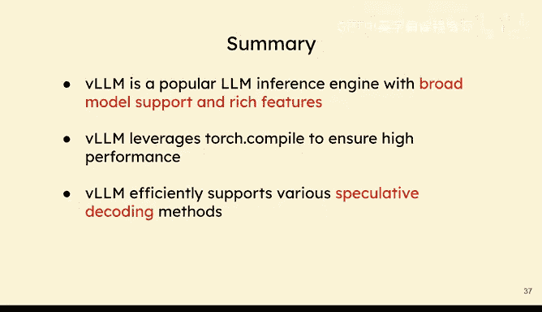

🎼thanks for listening， that's all。

🎼As our next speaker today， we have nobody less than the actual inventor of Kaauud。

 the fabulous Tim Detmas。😊。

So during his Europes presentation last year， he described going into Kuda mode as working in highly efficient flow state。

 basically forgetting time and space and becoming one with the code。😊。

Tim is not only an exceptionally good researcher and incoming assistant professor at CMU。

 but also an open source superhero who's relentlessly fighting for the GPU poor with his high quality open source quantization and sparsity contributions。

Making deep learning accessible for everyone with production quality libraries like bits and bys。

 for example。It is an absolute honor to have Tim here with us today。

 So let's give him a warm welcome， Tim Thatma。😊，Thank you so much， Andreas。

So whenever I give the talk like this， I try to come up with something new you can't find online and so today I want to talk about competitiveness and open source and so this is a little bit maybe unusual sort of in the open source space and the open source we want to collaborate。

 we want to build on each other's work， we don't want to compete but I'm also a researcher and for me I'm thinking about the future and the worst thing you can do in research is work really。

 really hard on a problem that doesn't matter。And the same in open source。

 one thing that's not very productive is you work really。

 really hard on a future that becomes obsolete。 So that's why it's sort of also important to think about the future。

 And often when I think about the future， I think about how can be something competitive。

And so if you think about back how open source was before this， stable diffusion。

 it was not much going on when stable diffusion happened， everything exploded it。

 It was this Cammbbririan explosion of collaborations， new projects。

 every day you went on Twitter like stable diffusion got faster and faster and it was exciting and everybody knew it was just a matter of time until this happens。

 Lama models， and then also the large language models exploded dramatically and so that is what competitive looks like。

 if we can compete with close source。 we have this explosion of open source models and the entire ecosystem。

It's a very rich environment， but when we look forward。

 we probably not will not see G5 level models open source。 They're just too expensive。

 And so we need to think about what will happen then how can we compete then we don't want to be obsolete。

 But in open source， we have strengths and we can use these strengths to our advantage。

 And so I want to talk a little bit about different scenarios and here I take a perspective from how can you view our competitiveness from the perspective of open source。

 And I think there are three different scenarios if everything works well for open source they solve all the problems and they are very cheap to use and everybody will use close source solutions。

 And I will talk a little bit about what we can do in that scenario。 in other scenarios。

 there's close source and it works really well， but's really expensive。

 So that's an opportunity for the GPU poor to band together。

And then the third scenario is where open source sort when close source doesn't quite work。

 GP5 level models cannot produce end to end automation。 Everything gets messy。

 and it might also be just too expensive to go further than that。 G6 level models will be expensive。

So let's talk about some of the details here。 close sourced works in a sheep。

 If you look at that future it basically looks like everybody will use the close sourced APIs。

 that's the tool of choice。 How can we compete in their environment So if we think about the competitiveness factors there is one is sort of still privacy there will be a lot of people that still say I will not say my data to this API be it hospitals or other sort of very privacy focused institutions but it might be also just use this like my personal data Oh I will not send it to some open AI API or something like that。

 maybe you want to process on your laptop and that is a competitive advantageers So thinking about that how can we make privacy strength。

Then also latency， they have physical loss， the coast to coast latency 70 milliseconds。

 so the round trip is 150 milliseconds， some applications are latency critical and might be sort of voice but then also for example if you have tool use and in between tool use latency is low because the tool executes quickly and the language model quickly you knows which next tool to call you have a chain where latency becomes really important and so for some agent system where tool use is really important。

 these might be better served on a sort of a local device that's close to where you actually make the API calls so an API in the cloud might be too slow for that there might be a competitive advantage。

Then also the entire ecosystem， if you think about companies， they need to focus。

 they can't do everything， it's just too much， but we open source。

 we can focus on all kinds of different aspects just by sort of separating in different groups and then come together to build an ecosystem that's very rich another competitor risk factors so even if closed source is a tool of choice。

 we can compete by thinking about these competitive factors。

Let's talk about close source if it works， but it is expensive。

 this is the opportunity for the GPU poor because only the GPU rich or and generally rich companies and consumers will be able to use these APIs。

 so they use send these very expensive GPT5 level or GPT6 level APIs， but they play a lot for that。

In that scenario the sort of cheapest choice is always to use devices that you already have And so I talked about privacy and their laptops might be an advantage。

 but here it's also a laptop you already own laptops。

 a lot of MacBooks and these MacBooks are pretty good to run AI models and you might think in the future we have these big models。

 laptops can't run them， but think about0101 is mostly inference you can get benefits like this from a small model that you run for a longer time on a laptop I think it's very much possible。

There might be also sort of mobile devices in an equation here， but it's also a question。

 what do we do with these AI models， it's not quite clear and I think if I think most use cases they're still very useful on laptops but the question is what do you do with mobile devices with AI I think it's not quite clear。

 but it might be an important factor where open source plays a role？Another thing。

 and that is sort of what I did with Q Laurara。 If I tell companies， hey， I have this method。

 and now we can fine tune by using less GPs。 They say like。Okay， I just use more GPs。

 Why would I use this already have enough GPs。 And so this is really a feature that's really good for the GPU poor。

 But the rich say like， I don't want to take any risk and have quantization。

 I've trained a full precision on my GPUs。 And so if we create features that are designed for the GPU pool。

 that's a big advantage for us And that's how we can change sort of communities。

 So just thinking about if you have a limited compute scenario。

 if you have a limited memory scenario， how would you change your approach。

 that can be helpful to think about that。And then often we think about efficiency if things are too expensive。

 but it's also the case if things are too expensive， then people need to use open source。

 they cannot use the APIpis because they're too expensive。

 Then one of the most important factors is just how easy is it to use the things out there。

 And bits and bytes， I think a factor for its success was that is so easy to use。

 you can just say load and for bit。 And you got the model in four bit。

 And thinking about how you can build tools that are very easy to use。

 I think that's a competitive advantage here。Okay， let's talk about this scenario where basically open source wins。

 closed models are not good enough， end to end automation will not work。

 and it's also really expensive to continue。And so I think that is actually a very challenging scenario for open source。

 because this is a scenario where open source needs to lead。

 And if you look at other companies like Open AI， they try really hard to land products that people like。

 but it's difficult。 and they didn't ship many things that are widely used besides Cha GT。

And so here， I think one thing that we like to do in open source is demos。 They look good。

 and like here， have， have this framework and look what I can do。

 But we need to go a step further if this scenario comes true。

 And I actually think this might be one of the most likely scenarios here。

And we need to really have solutions that work for businesses。

 solutions that are actually useful for individuals。

 A lot of how AI is used today is we try to figure out what to do with it。

 but we are not using it so much in our everyday work。

 There are some applications where it's very useful。

 but it's not as widely used as you think it would be after these large successes。And yeah。

 then also sort of merit we want to have solutions that really work and that really matter in the real world。

 I think that's important。 If you want to lead， you need to show that you actually can make a difference。

 and that is basically we want to go beyond demos。Okay。

 that's everything that I have on this just here the facets again， all sort of brought together。

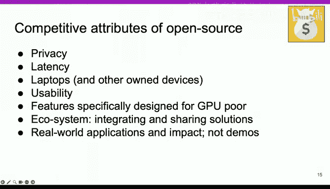

So I have a little bit more time。 and other thing I wanted to talk about is a couple of things that I sort of learned and observed in the last couple of days。

And so there was a Piwach conference and I was just amazed by how many people presented such broad sort of solutions with such deep technical depth。

 And so when I think about myself and sort of my strengths。

 it's like I'm a good coa programmer'm a good engineer and I know a little bit about research。

 And if I put all those together it led bits and bys and a couple of innovations。

 But if I look at other people， they have so many strengths。

 they know so much things about technicals that have no clue about。

 And so when I think about successes' is about combining your strengths to make something unique。

 And you don't need to be the perfect coa hacker to have success。

 we are here for couda programming and systems programming。

 but you can take parts of that and combine it with the strengths that you already have。

 And I think that that's very powerful。 So if you are not the best。😊，Reistance programmer。

 not the best k programmer。 that's okay because you have other strengths so think about that。

 how you can use it。 And there are so many ways how you can contribute to open source。

 And that's quite powerful if you use your strengths。

The other thing I want to say is if you sort of see things like your Laura bits and bys it looks like oh wow。

 there are like these big successes and these geniuses that build these things but I failed a very long time I learned Kuda for seven years and I had many open source projects that absolutely failed and bits and bytes is not my first open source project in my PhD added did four years of research and all my research projects failed and it sort of it took some time until I got there and so if you fail don't see it as you are a failure this is normal progress。

 it's really hard， particularly what you guys do couda programming systems programming it's very challenging and so don't be discouraged and it's a lot of hard work you need to gather the experience you need to use your strengths。

But eventually， it will happen。 There's a little bit of lack and w。

 and there might be a long streak of sort of failures， but keep up your hope。

The other thing I think that's also related to that。

 and just seeing this entire community is just amazing when I was doing co programming like seven years ago。

 it was like I was alone。 and now there's so many people you can turn to you can build a community。

 You're not alone coer mode and the darkness alone in your room。 You're like here with other people。

 And so I think that's amazing to have this community。

 And I think there it's also important to just stick together and really support each other。

 care for each other。 I think that's one of the main sort of values of open source。

 we are not competing。 We are collaborating coming together。 And how I can see for myself。

 there's a long streak of failures that many people go through。

 people will try and fail and so be kind。 support each other。 I think that's important。

 and yeah I think those are my learnings from open source and my learnings from the。😊。

Stace that's everything that I have， thank you so much。

🎼I'm really excited here to welcome Professor Wemehu So I think nobody needs an introduction for this guy almost everybody have read his book or heard about him on some or other way but I have a privilege knowing him for various reasons He's my academic father I did my PhD with him he's my current manager too so I had to be careful on what I say。

😊。

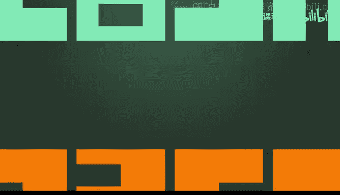

But more importantly， I think he's a very fun person to work with。

 we call him in short humbleumb Ben may， so we'll go through some of his career things that he has done。

 It's very interesting four decades， three decades of transitions will cover some of them please。😊。

To give a brief history about the kinds of work that he has done is very interesting for those who do not know apart most of the people know about his work on the PMppP textbook。

 but most of your computers that are working today do out of order execution and it PD this that actually perfected out of order execution So if he had not written that HPS paper and not went to In to perfect the out of order execution。

 none of your computers would be working today and this was his first decade then in second decade he decided to move towards compilers then he introduced hyperblock superbo concepts to compilers that are there in almost every compiler that are being used almost every place third decade was about Qa and now he is into his fourth decade looking into something even amazing we'll talk about that。

😊，So Ben me， I think the biggest question that I always wanted to ask for like seven years now。

How did you pick those ideas to work on like every single decade you picked a problem that's fantastic and that problem was did not even exist at that time and you walked on the problem。

 you figured it out and you started solving it， but how did you get those ideas。😊，Okay， luck。

Four times。A couple things when I was a grad student。

 I listened to the great graduate student talk at the beginning of the session and I was at UC Berkeley in 1983。

And that was a very， very interesting time， almost identical to what we're experiencing today。

 But in the hardware。 Okay， so the， you， the chip integration is getting to the point where we can start to build。

😊，We're talking about incorporating all enough transistors and a whole processor， right。

 a whole processor on the chip。 And that was the time。Where people start to debate on various things。

 For those of you who know the history， the risk project from Berkeley was extremely influential。

 They asked a very important question。How do I squeeze enough transistors into the chip to build the simplest possible processor so that I can have the first successful commercial product。

 A lot of grad students contributed to it， Dave Patterson and Randy Kaz and and Ellen Smith and various people contributed to that。

 And the industry took off from that point。I asked a little bit different question。

So if Moore's law is really right。应。5 years in six years。

We're not going to be talking about squeezing things into a chip。

 We're going to be talking about how to make these chips real。

 right And so we started to look at the history of mainframe and think about why some of these things failed and then everything pointed to exception handling and interrupt handling。

 IBM tried again and again failed。 So I said okay， that sounds like an interesting question。

 So you know you if we can make it to work。10 years from now。

 people can build a real processor with enough transistors to do this。And his， you know。

 it just luck。 And we， you know， we， we had enough， you know， people at Intel who。

 who got really interested in this and Bob Cowell。We was building P6。 And then， you know， he。

 he hired one of my students from Illinois and some of Yale students。 and you。

 they figure out some of the things we actually didn't figure out。 Okay， so， you， and that's。

 that's history， right， So this collaboration thing is incredibly important。😊。

We cannot figure out everything ourselves， right， and some things we just can't figure out as a person。

 but as a team， as as a community， someone will figure it out。

And everyone said that this cannot be done。 by the way， when I give a talk。

 Mark Horowitz came to me afterwards and said， nobody will ever build that processor。 Okay。

 and that was a year when I was interviewing for job。 Okay， so it was， you know， it was very， very。

 very discouraging。On the other hand， if you get enough good people interested in that same problem。

And sooner or later， someone will figure out。 at that point， you can take some credit。😀Yeah。

Humble by may as always。 So I think the key message that you're trying to tell is work on the hardest problem。

 don't worry what the outcome is， try to solve the most hardest problem and work with the community build a community and wrote with the community thanks thank you。

 That's a very nice interesting insight。 I think we pulled some questions together before the start this event And the most important questions everybody asked is like when is here next edition of book coming And what is what is it gonna contain。

😊，Every book。Every edition ruined one of the Thanksgivings。

So this one is probably going to do the same thing。So we are targeting end of the year。

 So that's why every edition ruins one of the Thanksgivings for all of us。 But that's what it is。😊。

Okay， what is the new book is going to cover， What are you。

 what are you hoping to cover in this new book。Yeah。GPU computing events tremendously right。

 now there are several things that we obviously did not cover in the first four editions。

 The multi GPU aspect spec is blatantly missing and now its so mature and so important for every use every data center now right So the multi GPU and link kind of paradigm or multi GPU。

 you know data center paradigm and there are all these important problems in terms of how you actually pull together GPus for let's say distributed matrix multiplication and so on and it has been really undercover in terms of。

 know just the intellectual what's underneath this know what motivates the link 72。

A lot of people don't realize some of the underlying forces so we're trying to explain these things so that people can understand and there are many other types of algorithms that we did not feel that GPUs were good for but with the cooperative groups and so on some of these new algorithms become very very efficient。

 so we're beginning to phase out some of the older material and begin to put in some of the new things that will be more useful for future GPUs。

One of the requests which Benma has for all is please share your feedback on the book。

 suggest what topics are missing that can be included so talk to him afterwards so that we know how we can improve the book。

U。You brought about very interesting response on the out of order and how things evolved if I think about now the current generation of LLM。

 there's a lot of talk about we can create out of order execution kind of models using agents copis and also there is an interesting thought about can I create a LLM O kind of。

😊，What do you think from the GPU side and also from the AI side。

 what things to request evolve to enable something of this sort。

 do you think we will be there in some time or I want to hear your thoughts on that。

My honest answer is， I don't know。 So the couple things that I think will be important。

 when I was talking to some of the teams here， you know you know we already know some of the deficiencies。

 for example， the CPU side of things， the driver and so on the driver is very， very old now。

 So it doesn't even have enough of the dependency capabilities and asynchronous capabilities so many things are done synchronously and you know it's time for a major revamp。

 So when we start to talk about know operating system and so on if we don't have that foundation in the driver。

 things are not going and well when you build something on top of a little gelatin it' going to just fall apart So and another important part is that。

When we when we think about communication and when we think about how to coordinate these multi GPpus and so on。

 our memory consistency model are synchronization primitives some of these things really need to be rethought。

 and in old days all these things belong in the kernel mode， not GPU kernel。

 the operating system kernel mode privileged and protected， but in the future。

 these things need to become deized， know these things need to go into the user mode。

 but we all know that when it comes to the user mode。

 theyre a wholele of new problems that we need to make sure that we understand so that we can build real products out of it。

 which is interesting So every time this is a common thing that we have are constantly observed after many Qa programs one thing that we always ask is that when Qa program does not work really well。

The first question I often ask is like， okay， have you seen your CPU program。

 I CPUU doing the real job or not， Andalt， like right over saying in the morning。

 Andalt always kicks in。U。Interesting， the thing is。

 we are also seeing you are actually hitting your fourth decade so you're doing research so。Yeah。

He has pivotted every decade。 So what are we pivoting to so that we know the kinds of problems that we have to think about from the community side that we have to be excited about。

 that we have to work together to solve problems。 So what do you think is the next decade of problems that we are to work on。

😊，Again， I don't know。 So I think if anything coming to this kind of event， you the really。

Really teach me a lot of things that honestly， I feel old in this in this audience。 Okay， you know。

 everyone here is young and energetic。 So one of the things that I learned is that you， when when I。

😊，Supervised grad students， the first thing I do is to make sure that I don't get in the way right so you know whatever you do。

 you know be bold and be you know and be fearless， you're gonna to be making mistakes。 Okay。

 Having said all that I do have some personal you know personal view about this。

 and then you know in 10 years， hopefully we can come and talk about whether these views are right or wrong。

I feel that we're fundamentally doing something that is a little bit。 I would say questionable。

 We're trying to train all the data into these models。 And when the data gets bigger and bigger。

 these models need to get bigger and bigger。 and we're trying to know regurgitate information or whatever you want to say。

 generate regenerate information as quickly as possible。

 out of the huge training data that we train into the model。 right， So that's why we have all these。

 you know， the good， you know， techniques like speculative， you know， inference and so on， but。

I think we need to take a step back at this point and think about this。What is the， What if we can。

Real time for any kind of query， we can real time gather all the information necessary to answer that question in milliseconds。

 Okay， so you know， let's think about it this way， right， you can use the model to try to。

 you know to regenerate the information You used to train the the model。

 And we used to think that this data is so expensive to， you know。

 to access and so slow from the object stores and all that I stuff， right。But if。

In the next few years， you start to see systems。Where you can get。

Gabys worth of information for any particular query out of 10 petabtes of data or 10 petabte of things that Google and so on currently only serve from the web search。

 right？ and the information can be presented in a way that can be fed into some kind of model。

That is trained to be able to take that information and synthesize， summarizeize the right thing。

 right， to answer the question， rather than trying to get everything from that model。

And I believe we will be taking a different course。In the future。And the data。

 no matter what how good we are， we always need to go back to the facts。

 We also always need to be able to debug some of these things。And having。Data access capability。

 I believe， will be the next step for these models。 And we already see R G now， right。

 But R G is just a start and real time access to the bunch of things that we currently only can regenerate from the models。

 I believe will change the course of this whole revolution。So in 10 years， we'll see。

Data access is a key problem that we are to solve earlier today and also yesterday。

 Steven Jones also speaking， IO is a big problem that we had to address and the more we increase our compute resources。

 IO is going to be the part that we are to consider thinking about。嗯。

There is a lot of interest and also challenge that comes in when it comes to education。

 you have been an educator for several years with the introduction of charge GPT language models now many questions can be easily answered by the modelism so what is the role that you think from education standpoint of view how should the education should transform in the new language model era？

Let me say this way。 I'm not an educator。I see myself as a teacher。

Theres a difference between teaching and teacher and educator。

Eucators need to think about the whole thing。 you， when someone asked me after 33 years teaching at the university。

 you know， do you miss teaching you know after you move to NviDdia right， I said yes or no。I miss。

Teaching in the sense that when I explain something and I see my students start to， to light up。

 And that's what I miss。What I don't miss is to try to come up with the final exam questions and then create a final exam and then catch the cheatters and then figure out what to do with the cheateeers every semester I have plenty of supply of those。

 right。So here's the thing， right that the cheating is always going be there right？

 And with these tools， cheating will be easier right？ So。

 so you know I don't know how to solve that problem。 And on the other hand。

 I believe that if we teach students in a way that they get true。

 they become truly interested in the subject。A very good。

 big portion of the students will never cheat。Okay， and that's what I believe。

 But can we get to that point。 And maybe we should begin to have some of the boring parts of the education taken care by the。

 by the models， right， and， you know， and then have the， the real teaching part to。

 to deal with some of the real subtleties and the real， difficult part of things so that then。

 you know， maybe we never have to， you know， to deal with cheating again。 So let's see。

Very nice we heard about almost time so Professor Hu thank you so much for sharing your insight and experiences with us your work had an incredible impact on everybody's life here everybody have some or some other way have radio book or extract copy of your book so that they made far progress in writing crude athers today in several weeks before。

😊，And I'm sure this same work is going to continue to impact everybody of our life for many。

 many more years。Thank you so much。For everything。👏So thank you。

 This is a token of appreciation from Kura mode。 So thank you。 Thank you。😊，👏Thank you。

