# GPU MODE《CUDA、GPU编程1-53课｜GPU MODE》中英字幕（deepseek-v3.2 - P32：-20241007-Lecture 30_ Quantized Training.zh_en - GPT中英字幕课程资源 - BV1QZ421N7pT

Welcome everyone to like lecture number 30 of the GPU mode。Um， and like today。

 like I really have the pleasure of like inviting like Tian Traan， who on the server goes by Gour。

And Goers is one of like my favorite people to like watch out on the server because over the last few months。

 I've been working on Torgeo。 we have like all sorts of like little bit D types。

 and it's sort of very easy and little bit D types。

 I noticed like people sort of get into these arguments where they're like oh should I do like in6 or in five。

 I don't know。 And they like scratched their heads a bit。

 But like what I like about goner is like just like to go ahead and implement both and then see what's better。

 So he's very prolific。 And so there's a lot of interesting content here。 And that I'm excited about。

 So yeah， without further ado， Ten， Thank you。😊，Yeah it's I'm very happy to be here today so it's actually my first like not not physical but like real presence at a could Imon actually you more talk because MPs in Singapore so most of the attempt all talks will be like two or 3 a at my place yes I can attend yeah so very happy to be here so for today's talk it's mainly we cover about how we can use quant low bit in training so it's not only for inference but also how we can use these low bit types for training purpose。

😊。

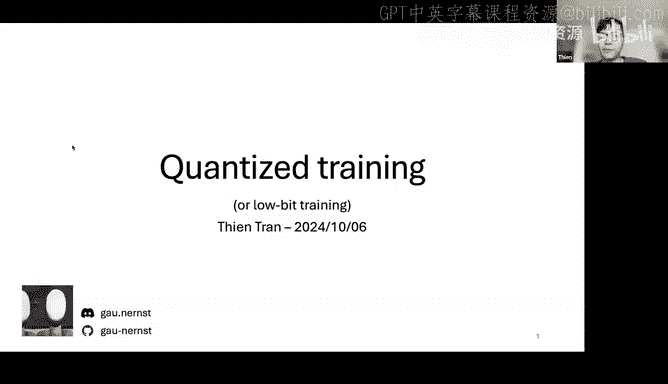

So just a bit of a recap so in the posttrain quantization so we have like these are some of the very standard ways to do quantization so you have weights only so it means that you only quantize the weight and then during the inference of the forward pass you will just be quantize the weight and then you do the metrics multiplication you can do the the quantization inside the metrics multiplication kernel itself and then you also have the dynamic activation and quantize weight so in this case then your activation we also be quantized before you do the mamo and yeah and then the static it just means that you precalculate the scales of the the activations instead of calculate the scales dynamically during the inference yeah I think nowadays for transformer people don't really use static scale for activations yeah I'm not very sure about this also yeah but this is just an overview of what people have been doing for。

Infer are what I know about inference yeah， but when we come to training it's a bit more complicated because we have a lot of more stages so。

See we can see in front， it's just the fall tasks and then in training we also have the backward and the optimizer step。

😊，诶。If we inspect like the kinda the memory profile of during the training process it will kind of look roughly like this so the optimizer states and the model parameters you kind of like stay constant throughout the training and then as we go through the forward path we will build up the activations which are like we save the outputs to do the backward later so but if we have like kind of like activation check parting it will be a bit different but the idea is still there yeah and then as we do the backward path we will kind of clear out the activations that we have build up in the forward pass but we will build up the gradients so that we can do the optimizer step and once we reach an optimize the step that we will be clearing out the gradients and it go down yeah so again there can be some other optimize here so for example you canfuse the gradients with the optimizer steps so actually you might not even build up the gradient memory。

But that will be a bit like a separate thing together。

And then in the distributed training you can we also have like the distributed communications in the forward and the backward task。

 so that will also incur some kind of memory and all of these would be like opportunities for us to do quantization。

😊，And the goal for quantination would be just like to mango so for save memory so we want to reduce the footprint of all of these like activation model parameters and optimize state and so on and another one it just makes things go faster because if you know like one of the main things to make training fast is to use cancer cost。

And to make it even faster， basically we just use a lower precision to test the cost so we have applied into8 and FB8 so if we we can use that。

 then it would be just。😊，Faster， yeah。So。The first topic that I we cover today is will be the little bit optimizer because that would be the like the easiest thing to to explain about iss actually the one of the first thing that I contributed to to Tor AO。

😊。

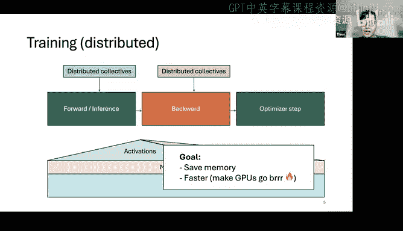

Y， so I think lot us he are not to like allow us already familiar with the A B optimizer from B and B ya by team that Mer ya very famous。

😊，And recently there are also people coming up with the forbi optimizer。

 so going down for the low precision。I think in terms of the benefit it's really clear the benefits of the optimizer because for example。

 for Adam you will have like the optimizer state will be two times the model parameters so that is very huge so by by basically you just quant this optimizer state you can save a lot of memory here so this one I just show some rough calculations so if you have a 8 million parameters and this are the memory footprints of the optimizer alone and then what are the savings if you just go down the number of bits for your optimizer。

😊，Yeah， I won't be going too deep into like the algorithm behind this a bit and phobi optimizer。

 you can read up more on the paper itself I yes I think I will just focus more on the implementation side。

😊，Going next okay so this is just like a rough outline of how how an optimizer kernel may look like so you have access to the parameter the gradient and then the optimizer state so I purposely make the optimizer state two times as big as the parameter ingredients and then you have like data going in and then you update the parameter okay actually the gradient you shouldn't have the another arrow okay I will delete the arrow later where I upload the slide yeah because you don't need to write back the gradient you only need to update the parameter and optimizer state。

😊。

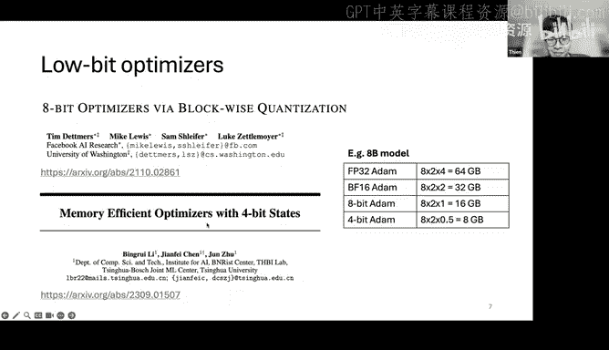

Yeah， so this is the the start the optimize like optimizer kernel and then you have like this SD are done whatever the the logic inside the kernel。

And then when we go to low bit optimizers when we quantize the optimized state。

 the big idea it's very simple， so basically we want to deco quantize the optimizer state when we go into the actual logic and then we will quantize it back again。

😊，When we update theult state， the parameter and a gradient it's still the same the logic is still the same we don't change anything。

So just the tricky thing is that if want to have the memory saving we don't want the decoized optimizer state to exist in the global memory because that's kind of defeated purpose right then that we will have the decoized optimizer acquiring global memory anyway so the tricky thing is that we have to do this decoization and quantization inside the kernel itself that at least we can put them in the shared memory y so this will be the main tricky thing for implementing little bit optimizes。

😊。

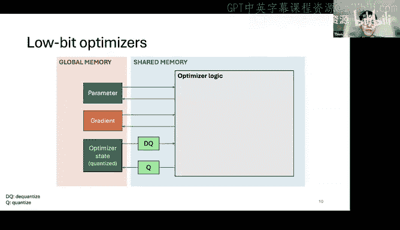

So， so， so so Tian， sorry， I'm wondering like， could you be like here。

 like when you say shared memory， do you mean like GPU shared memory or likecaca because， oh。

 I see because like， what you seem to imply was like more about like diffusing the de quant。

With like an update。 So I was like want to double check。 I understood。 you meant shared memory。

 it sounds like。Yes， yes， so it will be a GPU shared memory yeah so basically we don't want to write the the the Quaines optimize state into the global memory at any step of the logic。

No了O。Yep， so yep， oh yeah， and there also one more， yes。😊，One more question。

 is it possible to do the re quantrantization and requrantization even with the TM or is it like the limitation that with TMA it becomes very tricky？

I don't know much about DMA， so I think I can't answer that。😊，Okay， yeah。Okay， so yeah。

 also one more point I want to point out is about the field quantization is that we must use the small group size or block size in this case depends on your terminologies So usually for quantization we do like scaling right so we calculate a scale for a group of elements。

😊，For and then we we divide by that scaling and then we write the scale separately so that would be part of conversation so if the scale if the block side a group side is too big so for example。

 if we do pen or wise scaling。That it means that once we calculate the new oupizer state inside this shame and memory right we kind have to do like we have to calculate the apps max or we do a reduction over the home sensor and that is not really possible to do that without like you have to either writing the the the quantize oizer state to the global memory or you have to like kind we compute everything you do do it two times so it's not really efficient so one of the key things is that you have to use a small group size or block size for the quantization oops sorry。

😊。

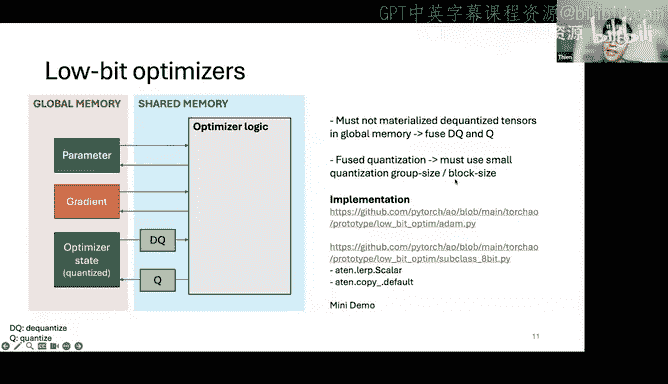

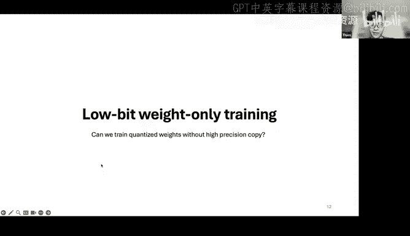

Yeah， so that you can do everything inside a shared memory。Y。

 so this is actually pointed out by by the original a bit optimized paper。Yep。

 so we can just briefly go through。

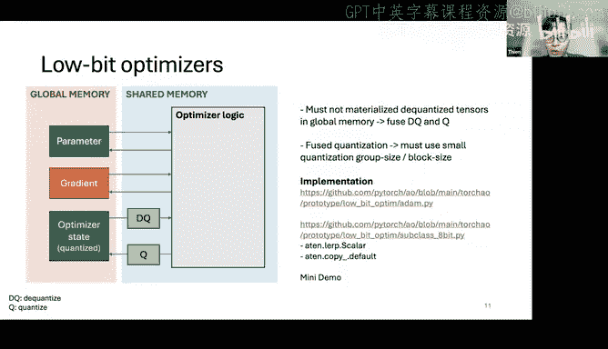

The actual implementation in the Toch AO， so let's go here。Okay， so this is the。😊。

I make it a little bit bigger。This is the actual source code。嗯O。

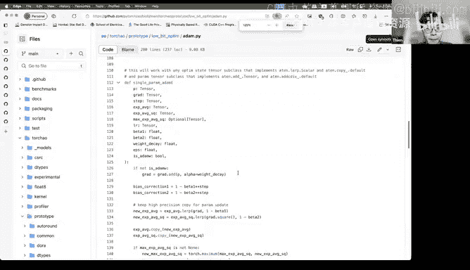

So this is just a functional ad step， so。😊，Most of the things here are basically a copy paste from the AD implementation in the Python call。

 just a few changes here。So the way I implement this is using Tensor surplus so that it can be I can use one logic for all of the low bit optimizers but it's not really necessary yeah I think later I have a small demo so it's easier to see here。

😊，So in this case， this is the two buffer for Adam。And then when we do this。

 love our linear inspoulation。There will be an implicit decoization happening here so there will be a decoization happening from the tensor surplus yep so this will be like catal like your a bit of forbid states and then this will become the。

😊，FP 32 yeah so so this is the reason why I write it this way so that we can have this copy of the high precision of the optimize optimizer state for the calculation later and then I do the copy separately instead of like doing an in place love linear inter for example yep and then most of the logic it just standard Adam so nothing really complicated。

😊，And then yeah， and then after that basically just update the parameter again。

 So you see the implementation it's actually actually very simple here and I can go to the。😊。

Yeah so this is the surplus There are a lot of stuff here。

 but most of them are about plate so I just want to focus on so I mentioned about the elaborate the linear interpretation so yeah so basically this is what's going on so basically I just the quantize the the quantai surplus。

😊，And then I just called the linear interlation again yep。😊，So that's why the output will be the。

FP 32 and then when I do the copy here you see I do the copy， so this is the quantization going on。

So I do the copy here。Happy， and then this will be the。Here， so this would be the quantization。

So I rely a lot on Torch Comp， so basically everything is in Python and Torch Comp will just generate everything for me。

😊，嗯。So so that's basically the manipulationplication so I also have here like just a small notebook to illustrate some that concepts clearer so make it a lot simpler。

😊，For this one， I will just basically go through how we can implement low bit SGD。

 so a simpler version of Adam。This equation I took from the official Pytural commentations yeah。

 so for this version we have a momentum so we keep another buffer of。😊。

Like a smooth version of the gradient so the the。G here will be the gradients。 the P he。

 the parameter。 A A learning rate meal his momentum。

 And then this is the extra buffer of the smooth gradients。 Yep， so。

 so this is the like the vanilla S GD。 So again， I purposely write out in this form first。

 So I always have like this new momentum buffer。 And then I do the copy separately because later I will have the。

😊，Quantization and deco quantization still。Yeah， so this is basically just the equation here and then I just put some dummy data。

 you have the learning rate momentum parameter。😊，你想播放。

And then first I do this for five steps and then each step。

 I will just generate some random gradient。And then。Oh， okay， take some time to connect run time。嗯。

Okay so yeah so so basically we kind of simulate a training here so in the first base case we have like everything is in F22。

😊，So the the first modification we can do is that we can use a Bf 16 optimizeizer state instead instead so if we use Bf 16。

😊，You can see the change is very minimal， so basically we just need to cast the input into F 32 before doing any calculations。

So that we ensure that all of the calculation be in FP32 and then we will do the copy here。

 like Pyta should implicitly cast that back into Bx6 so you see that there only changes this one and this one。

Yep， and then if you just do that again， you see that the results are very similar。

 there's some small differences， but that's to be expected。

Y so for this one we don't do any special kind of like scaling or quantization in that case it just a lower precision for the o states yeah so actually this is also one of the limitation in the building path optimizer I think because path optimizer will always force you to use the same precision as your parameters yeah so you can't really have a。

😊，FP3 to呃。Prameters and then Bf 16 optimizer， which is kinda like very simple。

 but you just can't in the path car optimizes。😊，YSo if one two one， go one step further。

 basically we can just change this into FP8。嗯。And then everything still works kinda correct。

 so you see the results are still very similar， actually， I think they are mostly the same。😊。

So you see because of the way we write everything in Pta right so actually you see that this function actually doesn't change anything the only thing that changes that we just change the be time of this and then。

😊，Pyita we automatically do the casting first and then if we just talk to compile this everything will be done for us also yeah so again this is just there's no no scaling whatever。

So for the next one I would just do a very simple tensor wise scaling this is just for demonstration purpose because like I point out earlier it's actually bad to do tensor wise scaling because you have to do reduction across the optimizer state tenor and thats that's you cannot do that with just shared memory yeah so so what are the differences so for the。

😊，So you can see here this is the de quantization part。

 so basically again we just cast that to float and then we have the scale here so just multiply by the scale。

😊，So this will be the the deco quantization part and for writing out the output。

 so this will be the quantization of the buffer。So you see here， this is just the quantized FPA。

 so it just a thats a wise apps apps max， yeah， very simple。

Yep and yeah so so that's it and then you have some result here yeah I think because of this simulated data so you can't really see the improvement yeah but I think with real data you will see some improvement over the this one here。

😊，Y so I think that's all I I want to present for the low bid optimizers。

 anyone have any questions want to discuss before we move on。😊。

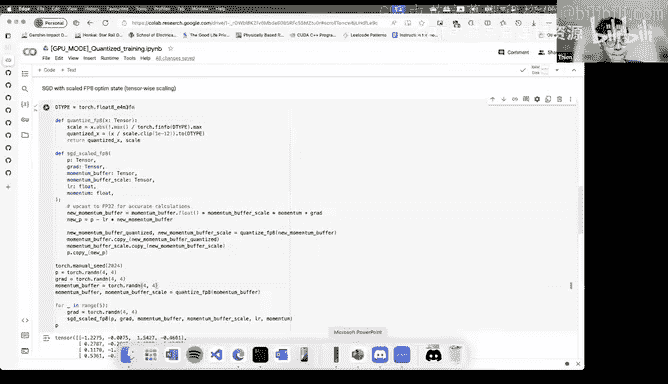

So Byron is asking， how do you make sure the Dquant does not happen on DM if you are solely relying on Trch compile？

Yeah， so onean so I guess the right way is to you have to do like profiling and so on and also see the generated tracking code but I believe like the tracking code can can also write into global memory right so yeah not sure but like the simple way I don' just I just do the profiling and I see if the expected drop in the memory is like looks right so so it looks correct so if I go from。

😊，FP to Adam and go to a bit Adam and I should see this drop in the amount of peak memory yeah so so that's just a simple way for me to double check that yeah but yeah there should be more rigorous way to check。

😊，Yes， so， so for what it's worth， I think you mentioned the restriction around how like in Pytor。

It restricts you to having the optimizer D type be the same as the parameter D type。

 and that's also true for the gradient D type like they all have to match and this is， yeah。

 like a very unfortunate BCc breaking change that I'm told is pretty much like impossible to change at this point without like using subclasses。

Yeah， painful limitation， but yeah well known， unfortunately。Yeah， I think that's also a reason。

 I think this speed optimizer， they will。😊，They will keep the， They will keep the。

Hrameter in FP 32 inside the optimizer， not outside the optimizer。

 so you will get like 16 big gradients I think， and that you will never have 32 big gradient。😊，Yeah。

 I'm not very sure just something I read somewhere， yeah。Yeah， and and for what it's worth。

 I think there's， there's， there's also been some work with people experimenting with full B F 16。

Like optimizers and it's sort of like possible to instead of upcasting the FP32 to use Bf 16 I think the numerics are is bad but the numerics can be decent if you're using like an sumation and I think there's been some early experiments I saw on this so yeah you don't have to use P32 so I will move on to the next part about the quantized training So for quantize training I will split into two parts So first is you have the quantized weight is that you only keep the quantized weight doing the whole training you will never have the higher precision copy of the the weight and then the next part will be the mixed precision to be more accurately I will say like using low bit for the matrix multiplication。

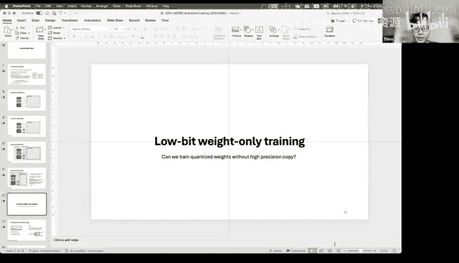

So in that case， you still keep the high precision copy of the weight。

For the for the weight updates yeah so for this one its just a little bit weight only training so we only keep the quant weights or the home training process。

So just a bit of recap again。So some of the like this kind like the popular common training techniques that I've seen so far so first one you have the FP6 and Bf160 mixed precision training so this basically the the standard right now so people will keep a FP30 to weight and then will cast the way into Bf16 and activation also to FP Bf16 to use the tensors cost there are also some works to do full FP16 and Bf16 but it's not so popular because of the way updates when you only have the low precision so。

I think FP6 was never really popular。 I remember I think basic have some features for that。

 but again it's not very popular。 Bf 16 it's for B16 trend it's I think it's more popular but you also have some issues about the weight of it Yeah and we talk about that later and then just want to add here So Qra it's also very popular right now it's also use the only keep the quantized weight。

 but because we don't train the quant weight here。 there are not a lot of problems for Qlora Yeah because we just train the adapters yeah I think the diagram I took they also say they use Bf16 for this one yeah so that might have some issues about the A and B if you only keep the Bf 16 for this A and B adapter weights。

😊。

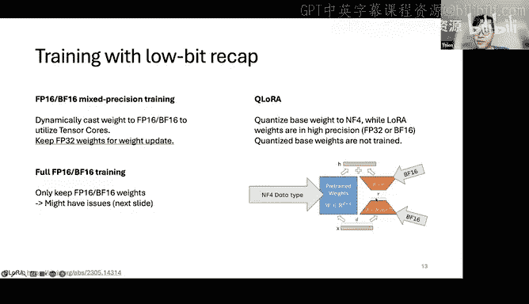

So the the biggest problem if we only keep the low precision to way update is the underflow when we do the way updates here。

 so this is just like a basic or like SD based equation way up the equation we look like this so you have the next parameter will be equal to the your current parameter and then you minus this。

Learning rate multiply by whatever your optimizer will calculate for you。Yeah。

 so what happens is that one if this this part here。

 the update part it's become too small to represent in your this low precision lead time then it will be lost and then you will face technician problem and then your wait will never be updated so just give a very simple example is that if you use in in you add a small number right you just keep it just keep become you never gonna get any update for this one。

One simple solution for this is to do some stack stochastic routing。

So to give a proper definition for Loastic routing， we can just say that。

When you given a number you will route that number up with the probability of this or whatever。

 but I guess it's clear if you see a diagram so for example you have these two points here its those are the integer points so you have the flop x and then fl x plus one and you have something in between。

So we normally， when we do calculation， we it。Deterministically so once we give the value like for example。

 if we have a value here so most likely that we round up we will round up because it's closer to the the upper point yeah but in stochastic routing we will route it like in a probabilistic way so because for this point it's closer to the rounduting up direction there will be just a higher chance of rounduting up in that direction and then that chance will be proportional to to this。

😊，Okay， it will be inversely proportional to the distance。😊，To that part。

 So it means that it would be proportional to the other distance here。

 So that's why you see it will be routing up。😊，呃。Depending on this， this distance。

 I don't know if you can see my pointer， but yeah， you can see that individual visualization。

So the benefit of sarcastic routing is that first we can。😊。

Get away with the problem of the way update and the flow so。So for example。

 if you imagine in the network， we have a tens of many parameters， right。

 you have like hundred millions billion of parameters like you we don't need of the。

Of the values to be rowd out， we can have some of them routing up and that already move the weight in certain direction and that would be kind of the correct direction or the trajectory of the way update So to make this whole concepts easier to understand I also prepare a short。

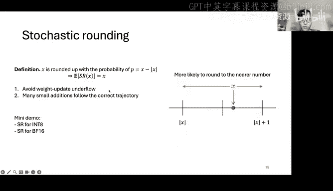

Demo with the code here。Okay， so in this first example， I we just using in8。😊。

And then I plus a small fraction。 So in this case here I have 10。And then I will plus， okay。

 actually， I actually order the outputs before I run this， but's never back。😊。

So I have 10 and then I've lost0。2， but1 hundred times。So if we expect this to be correct。

 it will be 30 right because that would be like 10 plus this or whatever。

 and then you get 30 but because of the the under flow when you do this update here。

 you just stagnate at1 so it never going up。😊，So for the next step we work do is that we implement stochastic routing here for in lead type。

😊，So so this is the definition of sarcastic routing that I mentioned earlier。

 so this is just a way to implement it very simple so first we get a random number。😊。

So this driver number will be from zero to one and it's only about it one side yeah。

 so if we just compare this number with with this。X minus x flow。

 So this is the fractional part of x then。There will be the probability that this random number smaller than this value will be exactly this value right yeah because it's a uniformly distributed so yes so basically this weve expressed this expression so there will be a probability of this the fractional part X that were gonna wrap up。

😊，Otherwise we would out doubt。Okay and we can do the same setup again。

 but now you see here we will do the stochastic routing before we update back to X so just to make everything more explicit I can catch this to floating points FP32 so that we must make sure that the input to this will be float 32 before we do the routing so that we can do the routing logic here so if we run again so because of the random nature right it will not exactly be equal to 30 so if we run it again and again it kinda like center around 30 so so that's already good enough for machine learning training。

有。Yep okay。Oh and so so that would be for the integer case I also once to discuss also about a B flow 16 so actually B flow 60 also face this problem because B flow 16 has the really limited number of my TsA bits because it's fraction bits here I guess so for example if I have a 200 here in B flow16 and I keep hand one。

😊，For 100 times， you can see that it will stop at 256。

Because I think the next next representationable value in the S60 would be。I'm not sure。

 but we can try。2 five seven， so2 five seven is not representable。

 so the next one will be yeah2 five8 so we will never we will never get over this2 five six here。

So actually， we can also do stochastic routing for Bf 16。😊。

It's a bit more complicated but not so complicated because one nice thing about Bf16 is that it have the same exponent bits as FP32 so it only have like basically from FP32 go down to Bf 16 you already need to the the 16 bits here and because of risk tranation right we can treat the whole Matista bits just like integers yeah so basically that's what I does here so I'm doing here so again so so because we're doing bit manipulation so X he will be。

😊，X is F 22。He。So we've passed。To。In 32 to do beat manipulation。

Yep so this will be my fl so it's not just like calling the floor right but basically we just truncate the the last six ins so this will be my fl in this case。

And then similarly to what we did for the in srcastic roing。

 we will also run generate some random numbers， but in this case we will generate 16 random bits so this will represent the parts that we turn off we top off。

And then basically， we could just compare again， we just compared that with your the。

The pilot we chop off and then the logic is exactly the same so this will be row up and this will be row down。

See very similar to what we did before for the individual。And then if we do it again。

 now we get correct value。Yeah， so now we don't stuck at 256 anymore and then it creates a right value now。

Okay， so so that's like just a small demo just to get an intuition about a stochastic routing and why it helps with this way update anyone have any question before I just showed some of the。

😊。

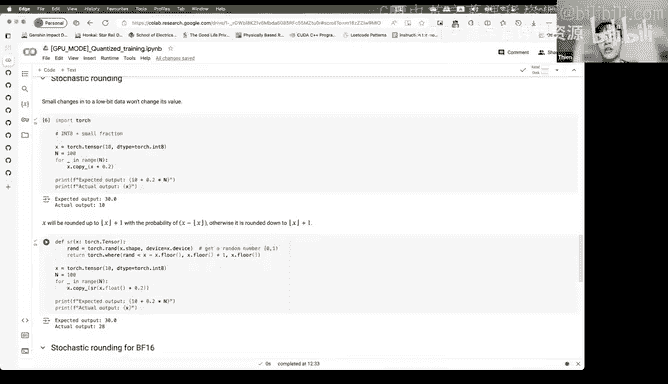

The result and the implementation I got in the talk Ao。

I had question like I noticed like just one of the times when you were running。

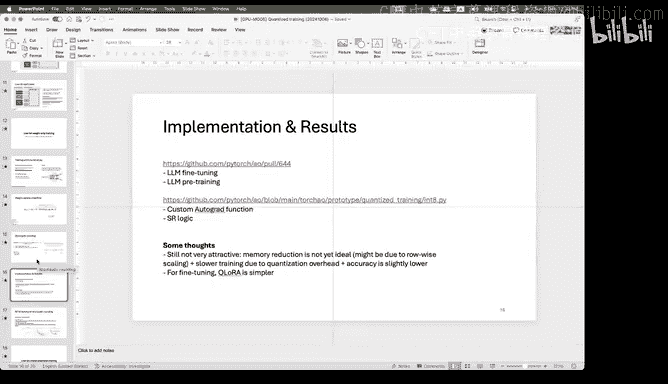

Like one of your cells， there was a very large deviation。 I think it was wh rare。 It just。

 I think instead of the expected output being 30， it was like 38。

 which seemed like kind of a large deviation。 And so I'm wondering like have you like when you're doing like training runs。

 have you ever noticed yourself like getting unlucky and needing to just restart the job because of like a weird anomaly because of stochastic running。

I think one thing is that I haven't done that any experiments to observe such haze and then even if。

😊，If something happens， right， it's kind of hard to trace it down whether it's digital sarcastic roing or some other problems。

 so I think it's hard to say。Yeah so yeah I think one important reason is also we need to test whether our stochastic routing logic is correct right so I suppose the most correct way is to do some kind of hypothesis testing because we kinda we we know what's the expected distribution of the outputs here yeah but I never actually did it because it's kinda complicated so what usually well I did in the To test also it just I just generate a lot of numbers and I just take the average and to see whether it's close enough to this value it's not perfect but but yeah just simple I guess yeah。

😊，ok。😊。

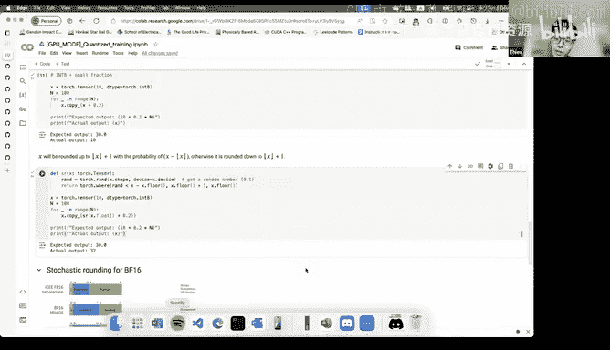

嗯。I guess we can move on so I can show some of the results that I did when I opened up request I think this some Oh yeah I see a question by Mo Sham so for F native training what's an acceptable art tool if stochastic rounding is applied。

😊，诶放。For this for the auto， which like which comparison are you talking about because？

Not very clear from your question。Because okay， so for now， stochastic growinging。

 it's only done for the way update。 So it's done in the optimizer。 Yeah， so。😊，嗯。It's okay。 Maybe。

 maybe we give most chance to type some more。 Well， we'll get back to the question later。 Oh。

 the to saying to original tensor if downcast if downcast the tensors。 Oh。

 because of the stochastic nature， right， So I guess we don't really have a。

Like a our toll in this case because it's everything is probabilistic There are probably some upper bow and lower bow because we are bounded by the rounding up and row down right Yeah。

 but the point that we just want on average， it will be。😊，Accurate results， yeah so。

I hope I answer your question。I think so， yeah， maybe we can move one。Yeah， so yeah。

 I can show some the results that I got for this。

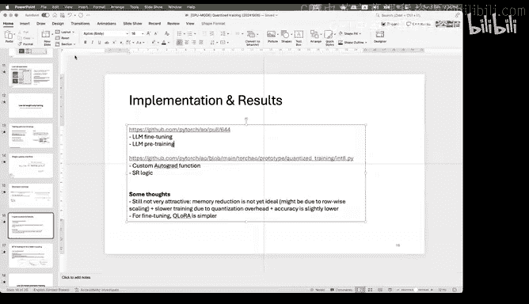

On the PR this one so okay where is this Okay so this is just a dumb training LM pre training on the Chinese story so it's kind of like a toy data set so you can see here。

嗯。Okay， okay， and we look at the the the one in the right。 So the the better one is still the Bx 16。

 So is it wait， let me see okay。😊，Yes， the Bf 16 has the lower loss Yeah so Bf 16 it's still a bit better in terms of loss and then from the innate quant it's a bit worse but sure that it can still converge very nicely along the Bf 16 and then same story as for this one so from the green curve actually I also try to use a beach optimizer so。

😊，So everything I beat right， Yeah， but again， as we quantize more stuff。

 it looks like there are still some quite not insignificant gaps between the higher precision and the lower precision Yeah。

 so it shows that like it's possible to do it， but there's still some some accuracy problems。😊。

I think I want to point out this one okay this one was pretty interesting here so okay。

 so actually if we compare the the purple one and the blue one to quite forever。😊。

They are using the same learning grade。 And then if you can see the B F 16 actually perform worse than the E8 quant training。

 this is p tuning anyway， Yeah， so fine tuning this model on a random task for the M M I found online。

 one of the reason I think is because of the way under flow way up there under flow for B X 16。

 because you see hit the learning rate here it's very small。😊，So。

Even B F 16 will face problem if we use。Low learning rate and for in because we use the stochastic routing you can see that it actually outperforms Bf 16 in this case yeah and then Bf 160 already can catch up when I increase the learning grade here yeah yeah actually now if I want to redo the experience it will be good to we also see if we can do Bf 16 stochastic roing Yeah then I guess it's even better than the in here I guess yeah。

😊，So just want something to show so oh wait is it sum of the other results Okay。

 I can go go back to the slides。

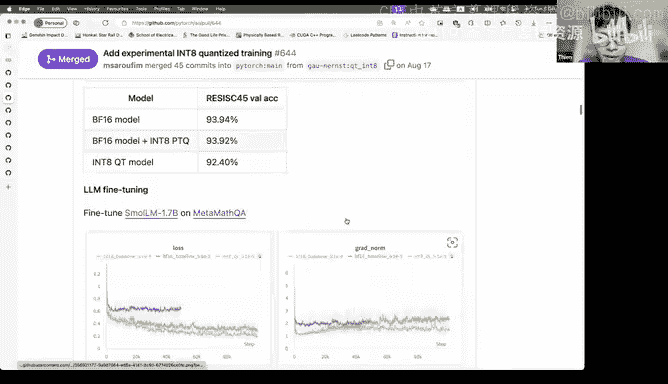

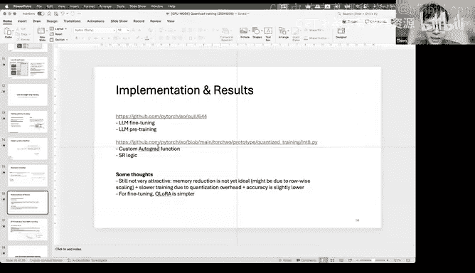

And then， this is the。Implementation。So there are two main parts I want to show。

 so basically it has the custom auto of graph function。Y， so for the Su you see here。

 the weight is acus tensor surpl glass containing the quantized weight and for the forward pi it's pretty standard so basically you just requize it。

😊，And that it。So and it same for the backward class。

 basically just be concise and then do a normal matrix multiplication。😊。

And then it's the stochastic routing， I think。Oops， where is that。Stochastic roding。 Okay。

 so I implement stochastic roing inside the the parameter surplus itself when I do the copy up the in place copy up。

 So this will be the。呃。The routing part with the stochastic routing here。 Yeah。

 so the stochastic routing logic it's basically the same as what I show you in the notebook。 So yeah。

 basically just generate a random number and then we compare that with the fractional part of that in it Yeah yeah so by right actually we should do this stochastic routing logic inside the optimizer because if we do this for the tensor way surplus right What if we don't do the copy its an optimizer we do it outside it can lead to an result right we don't expect the copy we always be stochastic route Yeah but so that I can reuse my my other optimizeccupr right then I just implement in this way so if we can see。

喂你。Yeah， so yeah， actually for all of the experiment， I re use the optimizer here using touch comp。

 So this will be the thing that。😊，Happening for the way franchise update so。

So this will call the test a subclasss up the way up there and this will perform storcchastic routing for in the case that I'm using the unted weight。

For this specific tests of class。Yep， so not a really perfect solution。

 but it gets the droplet for now， I guess。ok。Anyone have questions about just the implementations。

 wise are the results？

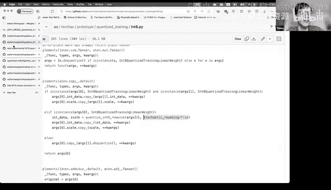

。嗯。Okay， I see something in the chat。Do the result blood use real wise Yes。

 so for all of this I'm using real wise ferization for in。I guess why would。

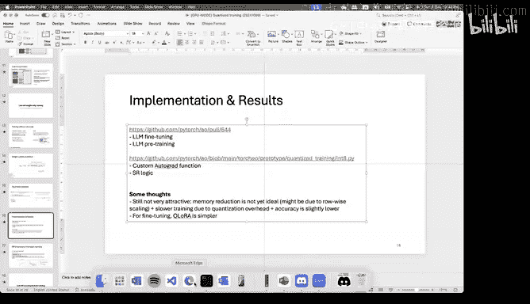

Yeah， I think it's just simple to do that for me。 Yeah there's nothing prevent me others to implement wise quant for this Yeah yeah basically you can even do an F or whatever quantization you want because the the only thing you need to add just the stochastic routing logic。

😊，Yeah， and then because you for for this part， we don't use the in test cost yet so yeah everything is just you still be quantized and do the mamo。

 So yeah basically you can use。Any quantization waits for， for this purpose。 Yeah。

 so the idea just to use stochastic routing in the way bit， That's so。

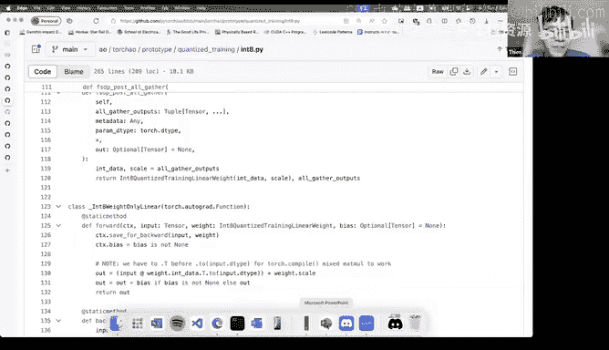

冇边。Yeah， so some of the。But no thoughts on this in a quant training。

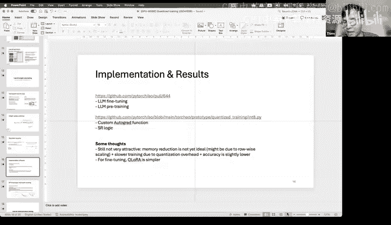

Just now in the PR the PR that actually shows some of the resultss actually the memory reduction it's not that good so I didn't see like the expected reduction in memory if we like half the model size from B16 to in for example so I never had a chance to carefully investigate this problem but I'm guessing it's because of the row Y scaling yeah so I mentioned earlier right because for the quantization we want to calculate the scale within the shame memory itself and if we use the row Y scaling and it is too big then maybe the triton kernel will write the output into to the global memory and maybe that's why we don't get the expected memory saving。

Yep， and then maybe for fine tuning purposes。 then maybe just use queue la， it's。

 it's simpler and for pre training。 then for pre training， you probably need like。😊。

Many GPUs to do it where anyway so it's not really a big problem so for now I don't think this it's not very attractive but I think the idea of srcastic routing is's pretty neat and then that's why I also introduce about Bf16 earlier is that yeah we can use Bf6 storcchastic routing for B16 training and it improve everything significantly so this idea it's I guess I first saw it in this paper and then the code by also implement that logic here so if you're interested。

😊，And this is kinda like not so related to this。 But I was traininging some bit net models and to save。

😊，To save the memory that I only use the Bf6 in weights。

 so everything is Bf6 in I don't get32 at all and。😊。

Once I implemented the srcchastic roing for B 16 inside the optimizer。

 you can see that there's a significant gap between the two here so the better one will be with the B 16 stochastic roing and then the worst one is without yeah so I think that's pretty neat。

😊，嗯。😊，Yep， so I will move on to the next part about using in84。Marics multiplication during training。

 anyone have questions before this？Yes。Okay， there I just move on。

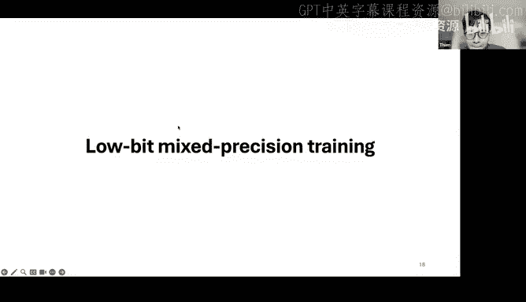

So yeah， so as I mentioned earlier， if we want faster training。

 basically we just need to use faster tensor cars， there's no way around it and one and as we go down to lower B types right then the tensor car for that lower BB type it's significantly faster than the VF6。

And I think one not so common facts about the 4090 series and actually it's also true for the 3 300000 series consumer cards is that in8 testlagar it's actually four times faster than the Bf16 but in my own benchmarks and I think it's only up around 3。

5 times faster but it's still already very fast compared to other GPUs right or the enterprise GPU you only see two times faster for innate compared to Bf16 so I think it's really like if you train your models on consumer card。

 it's really like a nobra option to just use innate for training which I show some of the results later so hope can convince you better and then you can see that like in the 1490 even though it's also support F but F it's actually slower than in8。

Yeah。And then if we do need a tenor cost， right， like 8 100 can also benefit from this。

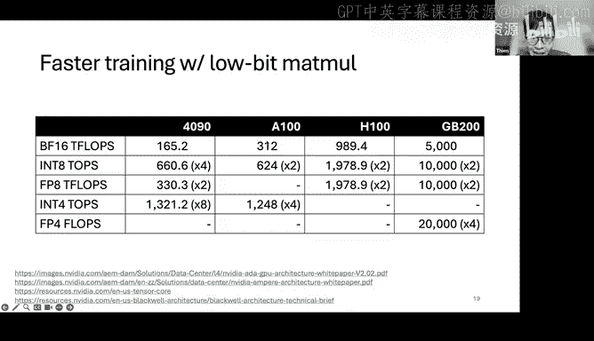

嗯 okay。So one of the biggest problems of using low bit mapmo about the reduced range of the low bit D type so for example 48 you have only this range from one to around one27 or1 to8 and then even if we use F right then you get you also get a very limited range so if your inputs it's outside this range right then of course we don't want to like flip the output because that would be bad for your results so the the solution would be we do scale map matrix multiplication。

There are many ways to do this so the simplest way that we don't need to modify modify the inner the loop of the matrix multi is that we can factor out some of the scaling out from the two inputs and then we do the scaling back into the outputs here so the most the first basic files the tensor y scaling so you have the two matrix right here and here。

You just calculate a one scale for the home tensor for the matrix A。

 one scale for the tensor for the whole matrix B， and then you will do this matrix multiplication。

And once you get the result， we just multiply back least two scalar values so this just two scalar values and in fact this is what the F trend recipe right now currently using the use sensor wire scaling or everything。

😊，Another way we can do that can be a bit more precise is to do row Y scaling for the first matrix and then the column Y scaling for the second matrix so。

So the reason for this is that if we look at the matrix multi， then for one of the output value。

 it would be the dot product of this row in this column right。😊。

So if we can factor out this scalar here for this row and then this scalr here for this column then we can apply it once we get the output here after the result so once we get this result we can just multiply back the row and then volume scalar appropriately so this is what actually what's happening for the in a post training quantation when we do the both quantize the activation and both quant the weight So this what's happening and in fact actually you can also combine this tool so like had a mix so you can have like tensor wise for weights and then。

😊，Grow wise for activations and vice vers you can mix a bit so that would be the most basic form the reason we can't do scaling like along this inner a dimension is that because we have we are doing reduction in here right when we do the matrix multiplication we can't scale the intermediate outputs from the matrix multiplication I mean it's possible but then you need to modify your matrix multiplication in the workings which is more complicated yeah and then you maybe you need some extra memory to star the results or something yeah。

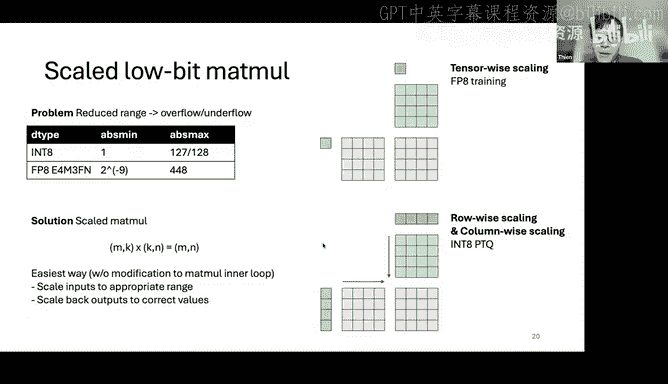

So to recap about this mixed precision training so the FP16 and BF16 is kind of a standard way and if we look into the detail here what kind of the scaling strategy that they use so the original FP16 they actually have scaling they call it low scaling so do we scale the last so that the gradients will not under flow I think yeah in the backward pass yeah so it's a bit different from the scale matrix multiplication that I just discussed in the previous slide but in a way it's still kind of a scaling scaling solution to do with this lower precision and BF16 usually we don't do any scaling and then the current FPA recipes we do the tensor Y scaling for both A and B metrics so I put A and B here instead of weight activations is that there's also the backward pass and we will also want to use low bit matrix multiplication for backward tasks。

😊，That's why to make it a bit more general， I just say A and B yeah and for the in aid so this will be the the one that people normally use for for the post training conversation。

And。One observation that I've seen that because for the in the post training conversation。

 the result is already very good， very accurate， it's like almost not much。😊。

Drop in accuracy compared to the F 6 D model。 So why not use this for， for training。 Yeah。

 so basically， that's what I did for， for， for this。😊。

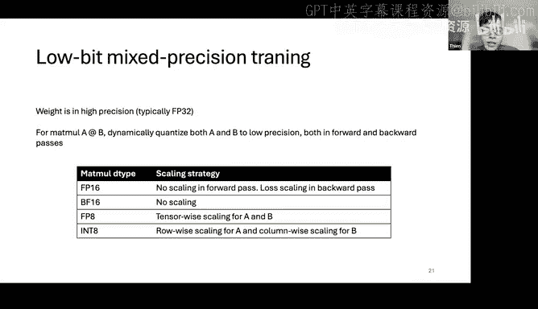

Touch AO makes precision in it， though that。

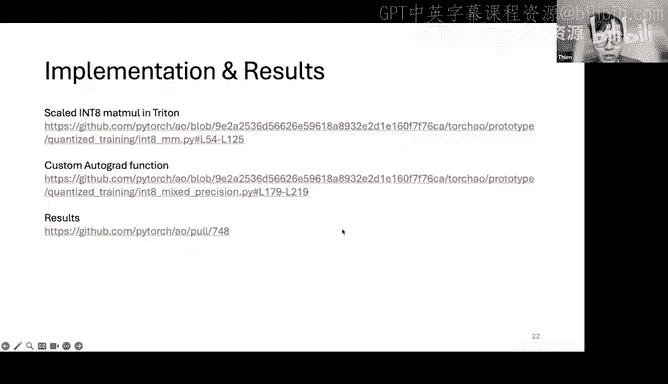

Okay， let me see okay， so there two two main parts as far as we have to implement this scale in the matrix multiplication in triton。

😊。

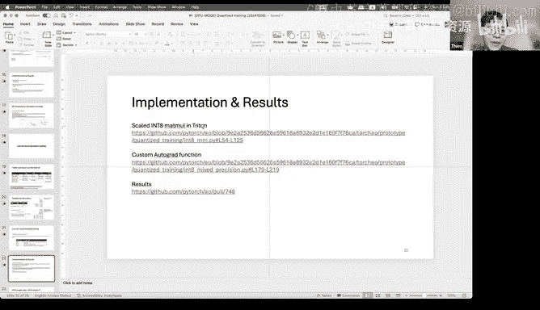

Actually today po compile can generate like scale in a matrix multiplplication。

 but I think it lacks some quick two problems first that push compile today。

 it can only least fuse the one one scaling of the output， it cannot scale two scaling of the output。

I guess just no one took the time to do that and then the second thing is that I think it doesn't really have good enough out tool cons so you can see I put quite a lot out tool can fix in。

😊，When you have a lot to fix， it can really make a big difference to the final。

Performance of the kernel，ep so。Yeah。So for this kernel it's actually most of the kernel most of the kernel it's co generated by touch Comp so all this thing up until the output here this everything is generated by touch Comp so I just modify from the base so all the party is generated touch compile here so I won't be talking so much about that。

So the early modification is just scaling the outputs here， so this is the scaling outputs part。😊。

So so you have the row scale so basically just load the row scale yeah I think it just what it is and then I just load the column scale so I have this small feature here that the column scale can be a scalealr so because of I just do this small modification I can support be yeah I can talk about that later so basically for this kernel it can support row scale and column scale or row scale and tensor scale yeah so so so that's it。

😊，So yeah so this basically just scale the results so so that is the main scale in the kernel and for the implementation why so basically it just you have this custom autocra function。

So you see here in the forward pass， yeah so。Dynamic in a amo so this is the dynamic in a scalemo Okay so I just took the scale here however so yeah you here basically I quantize a I quantize B and then I call this the custom triton kernel and that's it yeah so yeah quantize quantize just in a matrix motivation and fill the final scaling back into the the kernel。

Yep， and。All of the quantation will be fast tanked to touchr comp。

 so I only need to write the custom scale in a matrix multiplication and this is done for both the forward pass as well as the backward pass。

Yes。Okay， I see this one question。呃，OK嗯。6是。Okay， and this is the results that I have when I put up the PR。

So this is the N to end speed benchmark。 So as you can see for the 1490 because of I mentioned earlier the。

😊，In a tenor car for the fortunate90。 Its just insane。 so we can get up to 70% and to an improvement。

 So this end to end。For the 100 yeah because the speed up is not that good So actually plus 40% and is also really very good。

 but not as good as the 1490 And as you can see the last curve like basically the same there are some instability here I'm not sure why I never really investigate much Yeah but basically the last curve match。

😊，Very closely， Yeah， and then you have the insane improvement in the end to end speed。

Okay so this is just a small run so you see just a 1000 step before that I also did a much longer run so this one is 1 billion on the C4。

😊，yeah。And then one interesting thing is that UN canC actually the in a it's outperforming BF16 again I'm very sure why I never really investigated that。

 but it's just good to know but at least it shows that there are no bad reasons to use for the matrix multiplication during training and it also works very well with siteing。

😊。

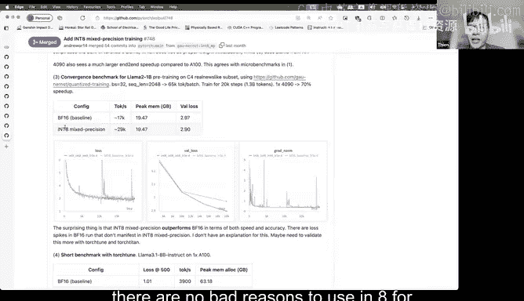

Yeah fine tu yeah this one I did we've talked tune so fine tune the Lama8 billion there was some problem with。

Touch tune because touch tune they use dynamic sequence length so there is not it's not it doesn't play very nice if the try and outer tune because chart and outer tune will try to returnt everything whenever the input side changes right so that's why there are some problems here but if we just look at the the improvement thanks to the in8 matrix multiplication alone then yeah this is the improvement so I think it should be around。

😊，wy or forty percent or something。Yeah and then the the last basically it's identical so yeah so so for in aid matrix sification and then we've used row Y scaling and then column Y scaling for A and B respectively then the results are very accurate and then you pretty much can use it for everything。

😊，Even for flating and pretraining。诶行嗯。Okay， so anyone have any questions before I move on。I。

 so I guess like regarding the torch compile out， but it sounded like you sort of like manually fused the epilogue with the scaling。

 which was kind of like interesting。 Do you remember what， what torch compile generated for this。

 Did I just like create a second kernel that like looked like the code that you had after line 1 15。

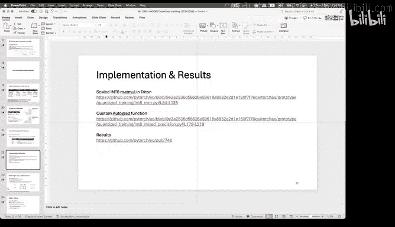

呃。whichhich one which I after which shall like So so yeah。

 you mentioned basically 115 and below is what you wrote and the the what above is yeah so like when when you tried to just fully generate like basically column wise。

 sorry row wise versus column wise A B as like a single fused kernel it just didn't work and it generated two kernels instead。

 one for the mathmal and one for the one and one for the scale we just it we just fuse one multiplication。

 So let me see。So， for example， if I write like this， right。

 So this is how I make touch compile to generate thisfuse kernel。 So if I write like this。

 it will just make this thing here， One kernel。😊。

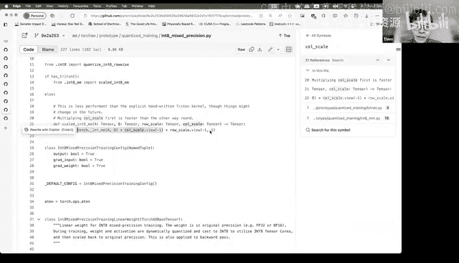

Oh I see yeah， and then the rest like this， the other one。

 I guess it will feel swift or thing behind， but from my benchmark it's much slower yeah。😊。

Under okay， okay， it could be just also maybe the the different al tune cons also because this one I use quite a lot Aloon cons。

😊。

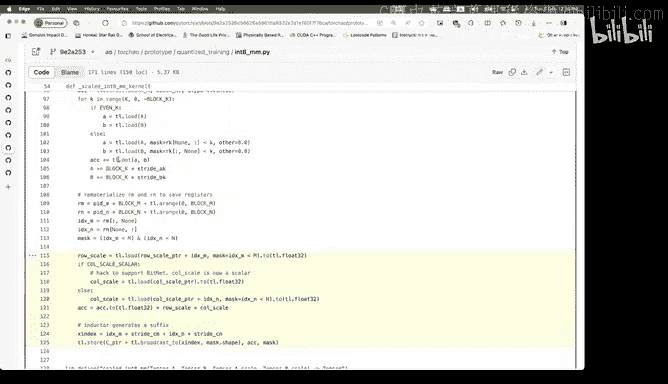

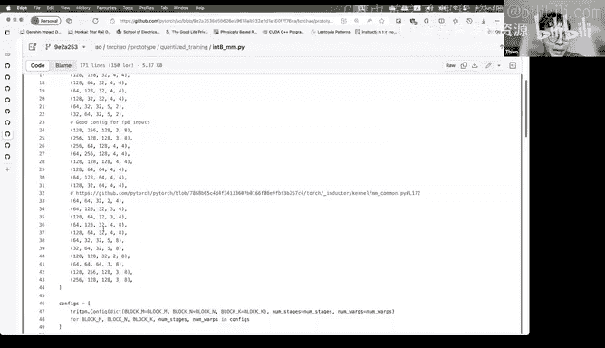

Yeah， yeah， like like the ones for a third compile are tuned for a 100 and above， unfortunately， but。

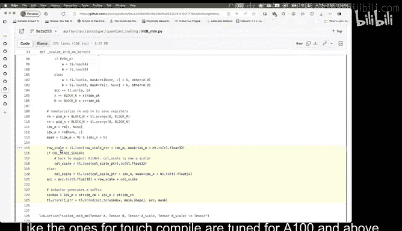

Yeah， makes sense。 Okay， Yeah， I think also one limitation for Dutch competitive。

 it's kinda kind of a lot of service kind of。😊，Mnually templated so if there's a usescape for this then there will be a template for that。

 but if it's slightly different it's not really composable very well。😊。

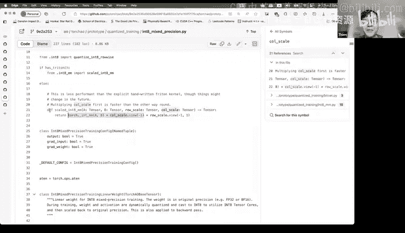

In this sense， in this particular case。Yeah， I hope you get what I mean okay， so okay。

 so for this result， it's mainly about using in a mamo right so basically we can also compose that with other techniques so you can also compose with the innate quantize with the innate ma because we already have the the innate weight for the quantized part right Oh I see。

😊。

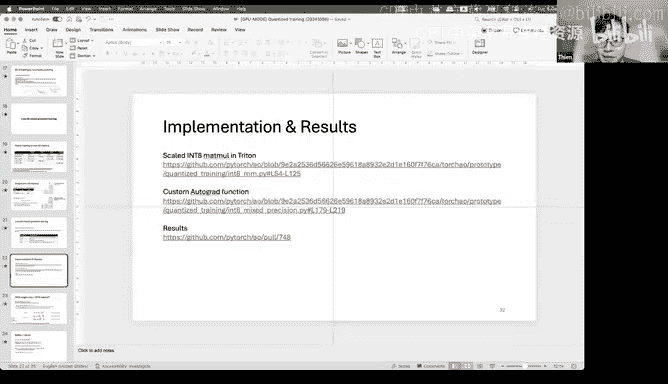

嗯。For b toQ。😔，Smallth thing do you see？I have the smooth smooth crowd when you see a large。诶。

Do you see a electric club insurance。I don't have much experience because I don't try the big model a lot。

 but if I remember correctly the larger models should be easier to quantize compared the smaller ones yeah not the other way around I think yeah people with more experience can correct me yeah but that's my impression。

还个。It it's more that like the， the problem for larger models is that like you're also very likely to see。

Like anomalies in your data。 So， so， so， so techniques like smooth quant are primarily about anomaly。

 like handling anomalies。 Like otherwise， if you try， for example， just doing uniformal like。

like like basically a data that's generated by Gaussian distribution with01。

 like you're never going to run at anomalies and there's like this like no reason I believe like in those cases。

 to use an algorithm like Smith plot。嗯。Yeah I think X saw on on X or Twitter like there are people who use smooth qua for the F training Yeah so I think it can also helps in this case but I have an experiment with that so' not very sure yeah but。

Anying smooth qua can can help。Yeah。Okay， so going back to this one， yeah， so yeah。

 because in the if we use in they quantize weights and then we want to use in a much more。

 it's like most you think that most of the ingredients are already there。

Then we already need to quantize the the activations。

 But the biggest problem is that when we have the。😊。

Grow y scaling for the weights in the forward path it will become column y scaling in the backward pass because of the math I guess so these are the equations so basically this the linear layer right you have x times the transpose of the weights and then in the backward path you have this W without the transpose yeah so so this because of that the W here with the column y scaling it's not compatible with the one that discussed earlier about you want the scaling to be like outside the outside dimension of the map more so you can do the the scaling back to the output so that would be the simpler case so so there's some some friction here but I mean if you want there are ways to get around that so for example you can justize it again in the other axiss yeah and so on but some extra overhead so I haven't implemented this for now。

Because I guess if we get people well welcome to try it。

If we want to put that in touch AO then I guess there should be some evidence that' it's good enough yeah and yeah one thing I also put out here that actually using EA mau can be composed useful forable kilora or you can either use FPA Mamo yeah because for Qra you already requize the way before doing the matrix multiplication right so yeah definitely you can just recquize it in a different way just to utilize the FPA and a matrix multiplication。

😊，Yeah， I think there's certainly a lot of people investigating this。

 by the way because like I think for example， from like the perspective of inference engine providers like BLM。

 at least like like let's just not talk about like this for inference here like they really care about like having like low bit weight only representations with the mat mall happening and either FB8 because they mostly care about H100s or like8 So I suspect this to be like a very burgeoning space。

 And you know， we're going have like both Mobychem and lay from bit B like talking to us more about like the work that they're doing here。

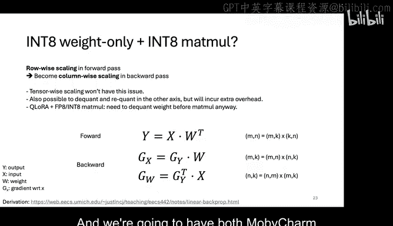

Yeah so I just w to also put a slide here about Bnet So the funny thing story how it happened is that actually just after a few days after I finished my in the mixed precision training PR at then yeah the hugging face they put up their blog post about the bitnet training yeah and before that actually I never really read the bitnet paper in details and just because of the hugging phase blog post then I start to read up about it and。

😊，So the basic idea is that for the way they will do the tensor Y apps mean。

 So these apps mean not apps Max。Scaling for the weight。To the this value。 So-10，1。

 And then for the activation that we do the per token row Y am max scaling for two in。

 So for the activation contention is' actually the same as the it a mixed precision training that I did and then it's just a different in the weight。

 So when I just saw this and then it just wait it just I can just use in a mapmo here because all the data types are already there like。

😊，Inequity already represent the weight。But theinerary values， you have extra bits。

 But anyway who cares， right， So， so that's why I just put quickly put up a PR for for this one。

 and it just very simple。 So most of the。😊。

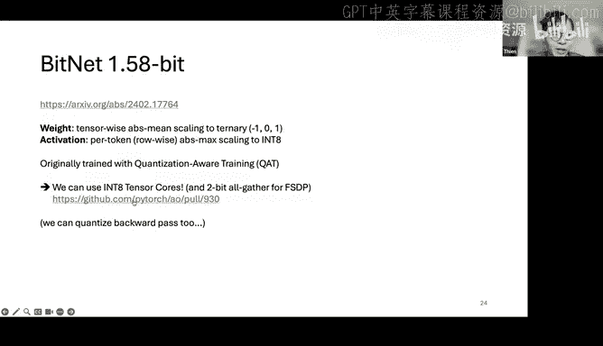

Most of the implementation， it's mostly the same as okay， I don't have the implementation here。

 I should go back to this。边度。Most of implementation is actually the same as in the mixed precision。

 so the only difference is the way how I quantize the weight。

 so this will be just the only difference。😊，Yeah， Q did that way。

 So this is the apps means tensor Y apps mean scaling。

And then for the custom autograph yeah basically it's the same so quantize the input quantize the weight and then I got exactly the same function just now about the feels scale in the Mamo。

😊，Yeah。And。And how did you do the two bit altogether？Yes，Yeah， so there's one extra。😊。

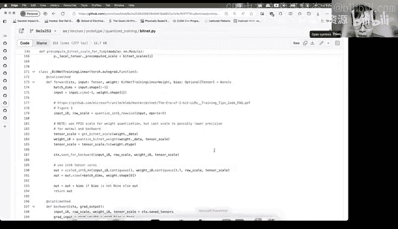

Improvement I did so basically I just copy what the F folks did for the FDA so far so far the people who don't know so for FDP you will you sha the weights across different GPUs so far example for this。

😊。

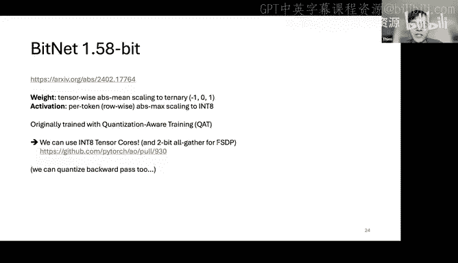

Weights here you have four GPU you split the the weight into four parts and then each GPU will just contain one fourth of the weights and then when you get to a specific layer it will collect all the weights together so you form the fully like the correct unsted weights I think yeah so you have the original weight again to do the magic multiplication on each GPU so because we for example in the bitnet we only need。

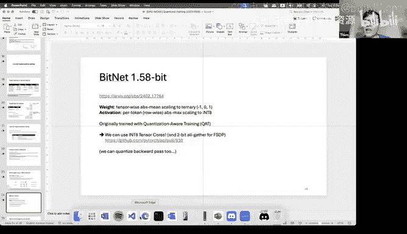

1。58 bit right so for this communication we don't actually need to communicate the origin weight we can only we only need two bits to communicate the weight so that's whats happening here so。

Yeah， so the FSDP folks also provide very useful functions that we can extend so that it can compose nice with FSDP so basically I just need to。

😊，Quantize the weight before doing the own gather。 And then I just pack that into2 bit。 Yeah。

 so the details is not so important。 Yeah， so basically I just pack that into2 bit。 And then y。

 that's it。 And then after that， I just need to。😊，Somehow wrap it around to make it go nicely together。

 yeah。

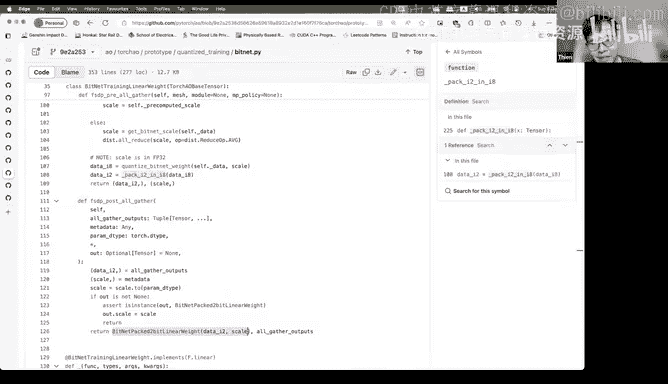

So okay， in a pull request I have some results here so because of this。😊。

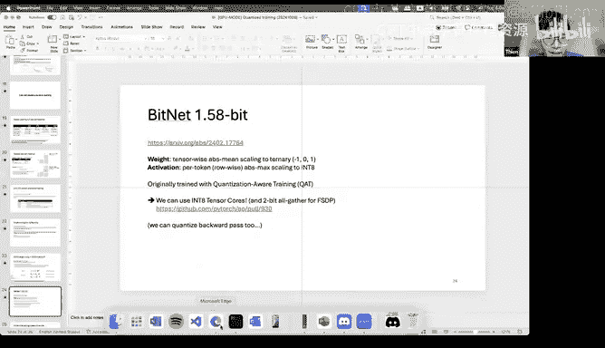

Okay， so maybe you give a bit more context so originally。Do I have the original。Okay。

 so originally for bigN people will do kind of like quantization aware training so basically they choose do a quantize the quantize away quantized activation and then convert it back to Bx 16 FP 16 for example。

 and do everything in the 16 deep precision。😊，So if we compare that with the original like without using any quantization right。

 then that would be a bit slower because you now you have the overhead of the quantlation but。

If we use in a at least in the forward pass it will be faster because because you use innate tensor cost so so that's whats happening here So so this is what I did So for example。

 if we use the reference in Ven it would be a bit slower of the overhead but because we are using innate tensor cost in the forward pass it become 225% faster and then this for 1490 so again because 1490 have very fast innate tens cost the speed up is very fast and then I also did some benchmark with tor titan。

😊。

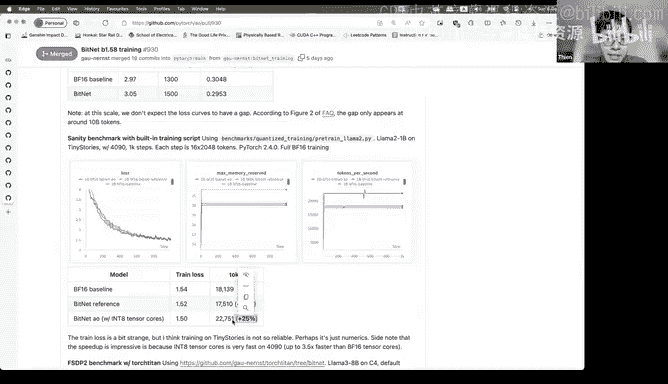

Yeah so。So you have not so great improvement here just by using in a tenor course。

 but when you start to use two bit altogether then you get a bit more improvements y and also because I think I drain the the。

The server from Ba AI so maybe their communication but with not very good that's why i'm not very sure so so this number can really depend on your your setup。

Yep， so it just show show you that like like with the knowledge of using innate tensor cars and then using lowB。

 it can really help you to optimize even like this kind of strange training setup so far as for in this case it's a bit neat yeah。

😊，And for this one actually I don't quantize the backward pass to use the in test also in the backward pass because it will just like a bit different in terms of the minis so for now I still keep the backward pass in the full like B 16 precision but if you want we can also quantize the backward pass to use innate yeah but yeah for the PR in the Tor I don't。

😊，Okay， yeah， so I think that mostly ends my presentation。

 so I just show some of the other interesting works so。😊。

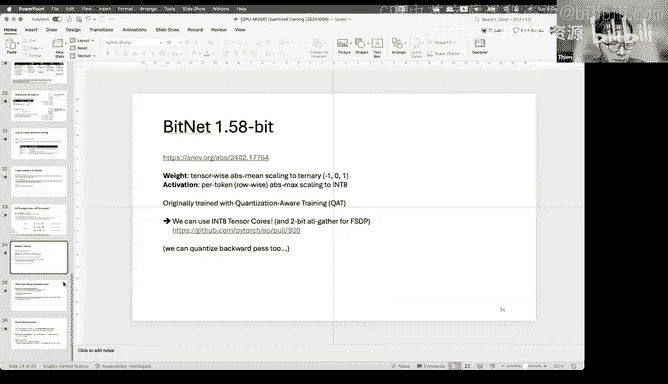

The first two papers actually coming from Google and yeah I think Google really laid the foundation for K like this kind of using extremely low bits for training and I believe the I think many people know the character I post about using Gi for training right yeah because I think the the chief scientist behind that came from Google so basically actually he used the same strategy here Yeah but he does didn't really give a lot of details Yeah but I think that's I believe what he does is in the mixed precision training but no one really knows for sure and then this the last one is about T fire I think this one is's kind of interesting because they use Taiwanwise quantization for the Mamo so maybe I go back to the scale Ma more here so I mentioned about the problem about。

😊，That we have to use the scaling at the outer axis so that we can fuse the。

We can do the scaling after the outputs。 Yeah， but what he does is that we can。

We can have like this small block here， I don't know if you can see my cursor。

If you have the scaling granularity of this more block or small tile。

 then yeah we can also do using in a matrix multi patient。

 but we can have final the granularity so potentially can be more accurate and we can because of that we can alsofuse the quantation in the matrix outputs so before writing out the result into global memory right because of the Taiwanwa quantation what he can do is that he can quantize the outputs。

Before writing even before writing out a global memory so when we write a global memory it will be the innate activation or in output and then we can propagate innate throughout the whole network so so I think that's pretty neat yeah but I intend to implement that in Too but never had a time for now but something maybe I can try to do next if anyone interested yeah we can also do it together and then because of that because all the activation in aidS now then they will also have layer norm in innate and activation in innate yeah。

But I think in this work， they still use 16 bit for attention， I think。

 yeah because they don't modify the attention。

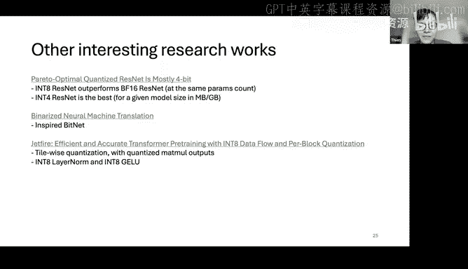

Okay yeah and just some concluding remarks So yeah in an F ten cards are there in the GPU so we should use them it's already there for quite some time So I really have no idea why in A cost never become really popular for training there are some research works but yeah never really become popular at least from what I know yeah and then touch compile and tri makes things very very simple So sometimes you just need to know which one is the slowest part that you just write a tri for that part and then there rest just that touch compile care for you and then yeah stochastic roing can help in a large scenario when you do casting from high to low bit and yeah so。

😊，Maybe it can even possible to help with like maybe you can do or reduce with flow bit I don't know I don't know whether there's already research for this yeah so basically。

😊，Like if you嗯。Dulcast before or reduce for each GP right if you have low bit precision and you or reduce maybe you lose some precision but if you docast like before or reduce you docast with stochastic routing and then when you average amount maybe the result would be still accurate maybe maybe I don't know and then some other ideas that you see there in a test cost sadly tritan doesn't support infall So if you want to use infall we might need to use cut which is very kind of complicated and then yeah I guess it needs more like more complex scaling granularity because probably the rowwise and column Y scaling probably not enough to recover the accurate software for infall and then yeah so the last one its more from the trade fire So maybe we can also quantize the activations because one many of the other operations like RA now。

This activation， it's memory bow， so actually if we can even also contact the activations throughout the whole network for past survival pathway。

 we can also speed up things quite a lot yeah。😊，Okay。

 so maybe now I just answer some of the questions。So that was the Taiwan presentation that you compared to the rule。

What do you mean by your question？Yeah， I guess I don't show the visualization here。

 but I think it's clear and you just go and read the paper。

 they will show it more clearly than what I can explain right now yeah because I't don't have the visualization。

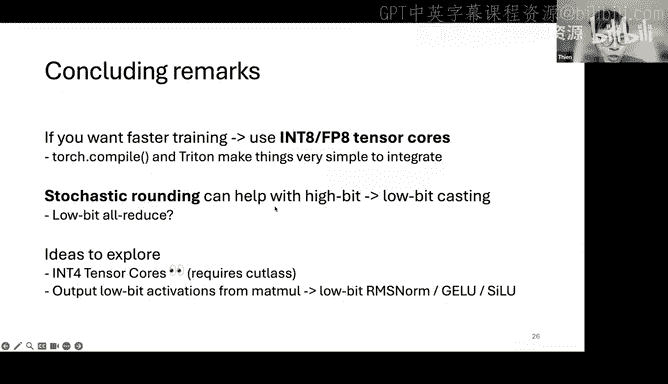

Okay， so so I guess Chan for for a bitnot， did you look at all like at sort of resulting and friend speedups that you could get as well。

 I haven't。 we haven't looked into the。

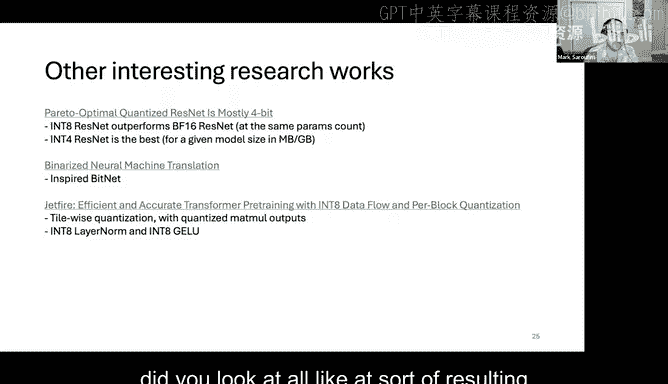

We can do that。Yeah so yeah basically for inference I mean the the simplest way is that you can do two bit way and then a bit activation right so that would be the simplest way and yeah I think Mobycham have some kernels for that already so yeah just a matter of some integration。

😊，All right， any other questions to Tn folks？

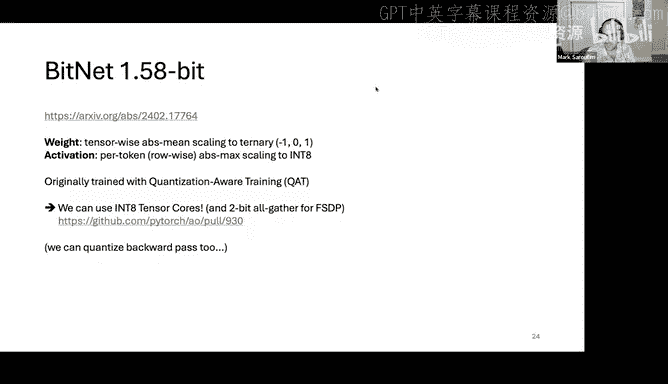

All right， I don't see anything， but regardless like Jen is extremely active on the server。

 so if you ask a question， he'll more likely than not see it。

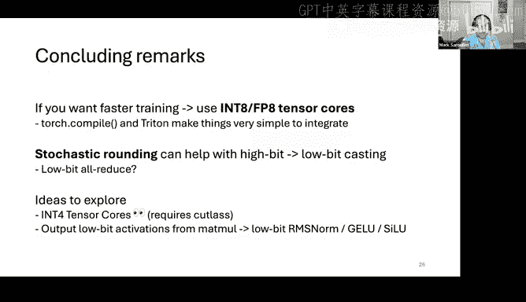

Thank you Jan， this is a fantastic talk。